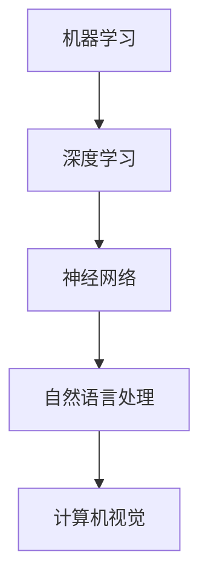
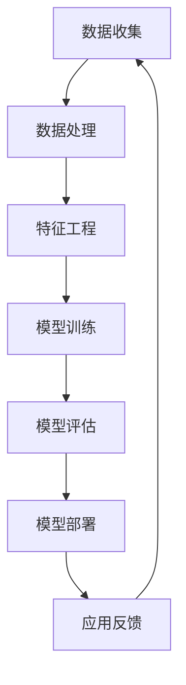
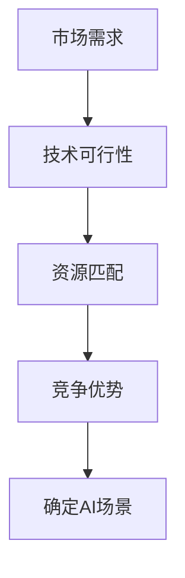
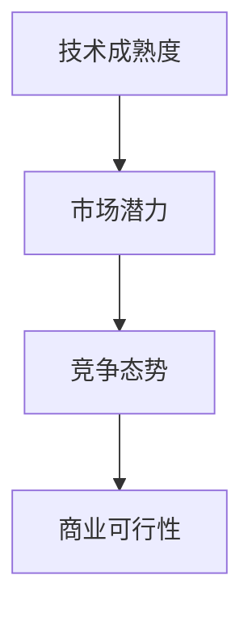
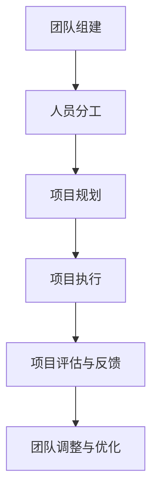
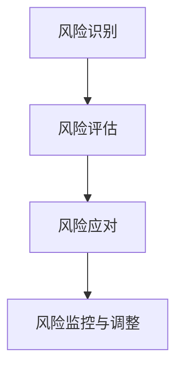

                 

## 《AI创业公司如何找到好场景》

### 关键词
- AI创业
- 创业场景
- 技术评估
- 市场潜力
- 团队建设
- 融资策略
- 风险管理
- 可持续发展

### 摘要
本文旨在探讨AI创业公司在寻找适合的创业场景时所需考虑的关键因素和策略。文章首先分析了AI技术的现状与创业环境的机遇与挑战，然后详细介绍了如何识别和评估潜在的AI应用场景。接着，文章讨论了如何构建创新AI场景以及创业公司的团队建设与管理策略。此外，文章还探讨了AI创业公司的融资策略、风险管理以及可持续发展路径。最后，文章提供了AI创业常用工具与资源，以帮助创业者更好地开展AI创业实践。

### 《AI创业公司如何找到好场景》目录大纲

#### 第一部分：AI与创业概述
- **第1章：AI创业的时代背景与机遇**
  - 1.1 AI技术发展的现状与趋势
  - 1.2 创业环境的机遇与挑战
  - 1.3 创业者应具备的AI知识结构
  - 1.4 AI技术核心概念与联系
  - 1.5 AI技术架构的Mermaid流程图

#### 第二部分：AI场景分析与评估
- **第2章：AI场景识别与分类**
  - 2.1 AI场景的分类方法
  - 2.2 传统行业与AI的结合点
  - 2.3 创业公司如何选择AI场景
  - 2.4 AI场景评估指标体系

#### 第三部分：AI场景实践与优化
- **第3章：AI创业公司如何构建创新场景**
  - 3.1 创新场景的设计原则
  - 3.2 创新场景的实现策略
  - 3.3 创新场景的应用案例
  - 3.4 创新场景实现策略的伪代码

#### 第四部分：AI创业公司团队建设与管理
- **第4章：AI创业公司的团队建设与管理**
  - 4.1 团队成员的角色与职责
  - 4.2 团队管理与沟通技巧
  - 4.3 团队文化建设
  - 4.4 团队管理流程的Mermaid流程图

#### 第五部分：AI创业公司融资与推广
- **第5章：AI创业公司的融资策略**
  - 5.1 融资渠道与方式
  - 5.2 融资材料准备与路演技巧
  - 5.3 投资者关系维护
  - 5.4 融资案例分析与解读
  - 5.5 融资策略的伪代码

#### 第六部分：AI创业公司风险管理
- **第6章：AI创业公司的风险识别与管理**
  - 6.1 AI创业公司的常见风险
  - 6.2 风险识别与评估方法
  - 6.3 风险应对策略
  - 6.4 风险管理流程的Mermaid流程图

#### 第七部分：AI创业公司可持续发展
- **第7章：AI创业公司的社会责任与可持续发展**
  - 7.1 社会责任与商业伦理
  - 7.2 可持续发展的策略与路径
  - 7.3 创新与生态建设
  - 7.4 可持续发展案例分析
  - 7.5 可持续发展的伪代码

#### 附录
- **附录A：AI创业常用工具与资源**
  - A.1 开发工具与框架
  - A.2 数据集与公开数据源
  - A.3 学术论文与行业报告
  - A.4 创业社区与交流平台

---

### 第一部分：AI与创业概述

#### 第1章：AI创业的时代背景与机遇

##### 1.1 AI技术发展的现状与趋势

人工智能（AI）作为科技领域的前沿力量，近年来取得了显著的发展。从早期的专家系统、知识表示到现代的机器学习和深度学习，AI技术不断演进。当前的AI技术已广泛应用于自然语言处理、计算机视觉、语音识别、强化学习等多个领域。

- **自然语言处理（NLP）**：NLP技术使得计算机能够理解、生成和处理人类语言。这一领域的突破为智能客服、智能写作、机器翻译等应用提供了强大的技术支持。
- **计算机视觉（CV）**：CV技术让计算机能够理解图像和视频内容，实现了人脸识别、图像分类、目标检测等应用。自动驾驶、安防监控等领域的进步离不开CV技术的支持。
- **语音识别（ASR）**：语音识别技术使得计算机能够理解人类语音，广泛应用于智能音箱、语音助手等设备中。
- **强化学习（RL）**：强化学习是一种通过试错来优化决策策略的机器学习方法。RL在游戏AI、推荐系统、机器人控制等领域展示了其强大的应用潜力。

未来，AI技术的发展将继续朝着更加智能、高效、普及的方向前进。随着硬件性能的提升、数据量的增加以及算法的创新，AI技术将在更多领域实现突破，推动产业升级和社会进步。

##### 1.2 创业环境的机遇与挑战

在AI技术快速发展的背景下，创业环境也发生了显著变化，既充满了机遇，也面临诸多挑战。

- **机遇**：
  - **市场需求增长**：随着AI技术的普及，越来越多的企业认识到AI技术的重要性，愿意投入资源进行AI应用的开发。这为AI创业公司提供了广阔的市场空间。
  - **技术创新**：AI技术的发展为创业公司提供了丰富的技术资源，使得创业者能够通过创新技术解决实际问题，创造新的商业模式。
  - **政策支持**：许多国家和地区纷纷出台政策，鼓励AI技术的发展和创业。这为AI创业公司提供了有利的发展环境。

- **挑战**：
  - **技术门槛**：AI技术涉及多个学科，创业者需要具备深厚的专业知识和技术背景。对于初创公司来说，这是一大挑战。
  - **数据安全**：AI技术的发展依赖于大量数据，但数据安全问题是创业公司必须面对的重要挑战。如何保护用户数据隐私，防范数据泄露风险，是创业公司需要解决的问题。
  - **市场竞争**：AI领域竞争激烈，创业者需要具备敏锐的市场洞察力，找准切入点，才能在竞争中脱颖而出。

##### 1.3 创业者应具备的AI知识结构

为了在AI创业领域取得成功，创业者需要具备以下知识结构：

- **AI基础理论**：了解AI的基本概念、原理和技术，如机器学习、深度学习、神经网络等。
- **编程能力**：掌握至少一种编程语言，如Python、Java或C++，能够实现AI算法和应用。
- **数据处理能力**：熟悉数据处理技术，如数据清洗、数据预处理、特征提取等。
- **领域知识**：了解目标应用领域的专业知识和需求，能够将AI技术有效地应用于实际场景。
- **创新思维**：具备创新意识，能够发现和解决实际问题，创造新的商业模式。

##### 1.4 AI技术核心概念与联系

为了更好地理解AI技术，我们需要了解其核心概念及其相互联系。

- **机器学习（ML）**：机器学习是一种通过算法让计算机从数据中学习并做出预测或决策的技术。
- **深度学习（DL）**：深度学习是机器学习的一个子领域，主要使用神经网络结构进行模型训练和预测。
- **神经网络（NN）**：神经网络是模仿人脑神经元连接方式的计算模型，是深度学习的基础。
- **自然语言处理（NLP）**：自然语言处理是让计算机理解和生成人类语言的技术，广泛应用于机器翻译、智能客服等。
- **计算机视觉（CV）**：计算机视觉是让计算机理解和解释图像和视频内容的技术，广泛应用于图像识别、自动驾驶等。

以下是一个简单的Mermaid流程图，展示了AI技术核心概念之间的联系：



##### 1.5 AI技术架构的Mermaid流程图

为了更好地展示AI技术的整体架构，我们使用Mermaid绘制了一个简化的AI技术架构流程图：



- **数据收集**：收集用于训练和测试的数据。
- **数据处理**：清洗、归一化和预处理数据。
- **特征工程**：提取有用的特征，用于模型训练。
- **模型训练**：使用训练数据训练模型。
- **模型评估**：使用测试数据评估模型性能。
- **模型部署**：将训练好的模型部署到生产环境中。
- **应用反馈**：收集用户反馈，用于模型优化。

通过上述流程图，我们可以看到AI技术从数据收集到应用反馈的完整过程，从而更好地理解AI技术的应用和发展。

---

在本章中，我们探讨了AI技术的发展现状与趋势，分析了创业环境的机遇与挑战，介绍了创业者应具备的AI知识结构，并展示了AI技术核心概念之间的联系。下一章，我们将深入讨论如何识别和评估潜在的AI应用场景。

---

### 第二部分：AI场景分析与评估

#### 第2章：AI场景识别与分类

##### 2.1 AI场景的分类方法

在寻找适合的AI应用场景时，了解AI场景的分类方法是非常重要的。根据不同的标准，AI场景可以有不同的分类方式。

- **按应用领域分类**：这是最常见的分类方法之一。根据AI技术在各个领域中的应用，可以将AI场景分为以下几个主要类别：
  - **制造业**：AI技术在制造业中可以用于生产线的优化、质量检测、设备维护等。
  - **零售业**：AI技术在零售业中可以用于需求预测、库存管理、智能推荐等。
  - **金融业**：AI技术在金融业中可以用于风险评估、欺诈检测、智能投顾等。
  - **健康医疗**：AI技术在健康医疗中可以用于疾病诊断、药物研发、健康管理等。
  - **交通运输**：AI技术在交通运输中可以用于自动驾驶、路线优化、交通流量分析等。
  - **能源**：AI技术在能源领域可以用于能源预测、设备故障预测、能源优化等。

- **按技术需求分类**：这种分类方法关注AI技术在特定场景中的技术要求。根据技术需求的不同，可以将AI场景分为以下几种类型：
  - **感知型场景**：这类场景主要涉及AI对环境信息的感知和理解，如计算机视觉、语音识别等。
  - **决策型场景**：这类场景主要涉及AI在复杂环境中的决策和规划，如自动驾驶、智能客服等。
  - **优化型场景**：这类场景主要涉及AI在数据分析和优化决策中的应用，如供应链管理、资源分配等。

- **按商业模式分类**：这种分类方法关注AI技术如何创造商业价值。根据商业模式的不同，可以将AI场景分为以下几种类型：
  - **产品型场景**：AI技术作为产品的一部分，如智能音响、智能摄像头等。
  - **服务型场景**：AI技术提供增值服务，如智能客服、智能推荐等。
  - **平台型场景**：AI技术构建一个生态系统，为不同领域的应用提供支持，如智能城市平台、金融科技平台等。

##### 2.2 传统行业与AI的结合点

传统行业与AI技术的结合点主要体现在以下几方面：

- **提高效率**：AI技术可以通过自动化和智能化的方式提高生产效率，减少人力成本。例如，在制造业中，AI技术可以用于生产线的自动化控制，实现高效生产。
- **优化决策**：AI技术可以帮助企业基于大量数据做出更准确的决策。例如，在金融业中，AI技术可以用于风险评估和投资决策，提高决策的准确性。
- **提升用户体验**：AI技术可以提升用户的体验，增加用户满意度。例如，在零售业中，AI技术可以用于个性化推荐，提升用户的购物体验。
- **创新商业模式**：AI技术可以带来全新的商业模式，创造新的市场机会。例如，在健康医疗领域，AI技术可以用于在线诊断和远程医疗，创造新的医疗服务模式。

以下是一些传统行业与AI技术结合的具体案例：

- **制造业**：
  - **案例**：某家汽车制造企业引入AI技术进行生产线优化，通过实时监控生产过程，实现生产线的自动化控制，大幅提高了生产效率。
  - **效果**：生产效率提高了30%，生产成本降低了20%。

- **零售业**：
  - **案例**：某家大型零售企业使用AI技术进行库存管理，通过分析销售数据，预测未来需求，优化库存水平。
  - **效果**：库存周转率提高了15%，减少了库存积压。

- **金融业**：
  - **案例**：某家银行引入AI技术进行风险评估，通过分析历史数据和客户信息，预测客户的信用风险。
  - **效果**：信用风险评估的准确性提高了20%，不良贷款率降低了10%。

- **健康医疗**：
  - **案例**：某家医院使用AI技术进行疾病诊断，通过分析患者的病历和检查结果，辅助医生做出更准确的诊断。
  - **效果**：诊断准确性提高了15%，患者的治疗效果得到了显著提升。

##### 2.3 创业公司如何选择AI场景

对于AI创业公司来说，选择合适的AI场景至关重要。以下是一些选择AI场景的策略：

- **市场需求**：选择市场需求大、增长快的领域。可以通过市场调研、用户访谈等方式了解市场需求。
- **技术可行性**：选择技术实现难度相对较低、已有较多成功案例的领域。可以与技术专家、行业顾问等咨询，评估技术可行性。
- **资源匹配**：选择与公司现有资源和能力相匹配的领域。根据公司的技术优势、人才储备和资金状况，选择最合适的AI场景。
- **竞争优势**：选择具有明显竞争优势的领域。可以通过差异化定位、技术突破等方式建立竞争优势。

以下是一个简单的流程图，展示了选择AI场景的步骤：



##### 2.4 AI场景评估指标体系

为了更好地评估潜在的AI场景，创业者可以建立一套评估指标体系。以下是一些常见的评估指标：

- **技术成熟度**：
  - **技术水平**：评估AI技术的成熟度和稳定性。
  - **数据可用性**：评估所需数据的获取难易程度和数据的完整性。

- **市场潜力**：
  - **市场规模**：评估目标市场的规模和增长潜力。
  - **用户需求**：评估用户对AI技术的需求程度和购买意愿。

- **竞争态势**：
  - **竞争对手**：评估主要竞争对手的实力和市场占有率。
  - **竞争策略**：评估竞争对手的竞争策略和市场份额。

- **商业可行性**：
  - **商业模式**：评估AI场景的商业模式和盈利能力。
  - **成本效益**：评估AI场景的投入产出比和成本效益。

以下是一个简单的AI场景评估指标体系的Mermaid流程图：



在评估AI场景时，创业者可以根据实际情况选择合适的指标，并进行定量和定性的分析。通过全面的评估，可以帮助创业者更好地了解潜在AI场景的优劣势，做出明智的决策。

---

在本章中，我们介绍了AI场景的分类方法，探讨了传统行业与AI的结合点，并提出了创业公司选择AI场景的策略和评估指标体系。下一章，我们将深入探讨AI创业公司如何构建创新场景。

---

### 第三部分：AI场景实践与优化

#### 第3章：AI创业公司如何构建创新场景

##### 3.1 创新场景的设计原则

在构建创新AI场景时，创业者需要遵循一些关键原则，以确保创新场景的可行性和成功实施。

- **用户需求导向**：创新场景的设计应紧密围绕用户需求，解决实际问题。了解目标用户的需求、痛点和期望，是构建成功AI场景的基础。

- **技术可行性**：选择的技术方案应具备可行性，即当前技术水平能够满足需求，且实施过程中不会遇到不可逾越的技术障碍。

- **商业模式创新**：创新场景不仅需要技术上的突破，还需要在商业模式上有所创新，以实现可持续的商业化运作。

- **可持续性**：创新场景应具备长期可持续性，能够在技术、市场、财务等多个方面保持健康的发展。

- **可扩展性**：创新场景的设计应考虑未来扩展的可能性，以便在市场需求增加时能够快速扩展。

##### 3.2 创新场景的实现策略

实现创新AI场景需要一系列的策略和步骤。以下是一些关键实现策略：

- **数据收集与处理**：数据是AI模型的基石。创业公司需要制定详细的数据收集计划，确保获取高质量的数据。数据处理包括数据清洗、归一化和特征提取等步骤，以提高数据质量，为模型训练提供良好的基础。

  ```python
  def collect_data():
      # 数据收集
      data = fetch_data(source)
      
      return data

  def preprocess_data(data):
      # 数据预处理
      cleaned_data = clean_data(data)
      normalized_data = normalize_data(cleaned_data)
      
      return normalized_data
  ```

- **特征工程**：特征工程是提高模型性能的关键步骤。通过选择和提取合适的特征，可以提高模型对数据的理解和表达能力。

  ```python
  def extract_features(data):
      # 特征提取
      features = extract(data)
      
      return features
  ```

- **模型选择与训练**：根据场景的需求和特点，选择合适的机器学习模型。训练模型时，使用高质量的数据和有效的训练策略，以提高模型的准确性和泛化能力。

  ```python
  def select_model():
      # 模型选择
      model = choose_model()
      
      return model

  def train_model(model, features):
      # 模型训练
      model.train(features)
  ```

- **模型评估与优化**：评估模型性能，通过调整模型参数和训练策略，优化模型效果。常见的评估指标包括准确率、召回率、F1分数等。

  ```python
  def evaluate_model(model):
      # 模型评估
      performance = model.evaluate()
      
      return performance

  def optimize_model(model, performance):
      # 模型优化
      model.optimize(performance)
  ```

- **应用部署与维护**：将训练好的模型部署到生产环境中，确保其稳定运行。同时，定期维护和更新模型，以应对环境变化和新数据。

  ```python
  def deploy_model(model):
      # 模型部署
      model.deploy()
      
  def maintain_model(model):
      # 模型维护
      model.update()
  ```

##### 3.3 创新场景的应用案例

以下是一些创新AI场景的应用案例，展示了AI技术在各个领域的应用。

- **制造业**：某家制造企业使用AI技术实现生产线的智能化监控。通过部署监控摄像头和传感器，实时收集生产线数据，利用AI算法分析数据，预测设备故障，并自动进行维护。这一创新场景显著提高了生产效率，减少了设备故障率。

- **零售业**：某家大型零售企业使用AI技术进行库存管理。通过分析销售数据和市场趋势，AI系统可以预测未来需求，优化库存水平，减少库存积压。这一创新场景提高了库存周转率，降低了运营成本。

- **金融业**：某家银行引入AI技术进行欺诈检测。AI系统通过分析大量历史交易数据，学习欺诈行为的特征，能够实时检测和预防欺诈交易。这一创新场景提高了欺诈检测的准确性，保护了客户的财产安全。

- **健康医疗**：某家医院使用AI技术进行疾病诊断。AI系统通过分析患者的病历、检查结果和医学图像，辅助医生做出更准确的诊断。这一创新场景提高了诊断的准确性，缩短了诊断时间，提高了患者的治疗效果。

##### 3.4 创新场景实现策略的伪代码

以下是一个简单的伪代码示例，展示了如何构建一个创新AI场景。这个例子是一个简单的推荐系统，用于根据用户的历史行为推荐商品。

```python
# 数据收集与处理
data = collect_data()
processed_data = preprocess_data(data)

# 特征工程
features = extract_features(processed_data)

# 模型选择与训练
model = select_model()
model.train(features)

# 模型评估与优化
performance = evaluate_model(model)
model.optimize(performance)

# 应用部署与维护
deploy_model(model)
maintain_model(model)
```

这个伪代码涵盖了数据收集、数据处理、特征工程、模型训练、模型评估、模型优化、模型部署和模型维护等步骤，展示了构建创新AI场景的基本流程。

---

在本章中，我们介绍了构建创新AI场景的设计原则和实现策略，并通过具体案例展示了AI技术在各个领域的应用。下一章，我们将探讨AI创业公司的团队建设与管理策略。

---

### 第四部分：AI创业公司团队建设与管理

#### 第4章：AI创业公司的团队建设与管理

##### 4.1 团队成员的角色与职责

一个成功的AI创业公司需要一个多样化且技能互补的团队。以下是一些关键团队成员及其角色与职责：

- **数据科学家**：负责数据分析和模型开发，他们需要具备强大的数据分析和机器学习技能，能够从大量数据中提取有价值的信息，并构建高效准确的模型。

  - **角色与职责**：数据收集、数据预处理、特征工程、模型训练、模型评估和优化。

- **算法工程师**：专注于算法的研究和实现，他们需要掌握深度学习、强化学习等先进算法，能够将理论转化为实际可用的解决方案。

  - **角色与职责**：算法研究、模型设计、代码实现、性能优化。

- **产品经理**：负责产品规划和管理，他们需要理解用户需求，制定产品路线图，协调不同团队的工作，确保产品按时交付并满足市场需求。

  - **角色与职责**：需求分析、产品规划、项目管理、用户反馈收集。

- **运营人员**：负责日常运营工作，包括市场推广、客户服务、数据监控等，他们需要确保公司运营高效顺畅。

  - **角色与职责**：市场推广、客户服务、数据监控、业务支持。

- **市场营销人员**：负责公司品牌建设和市场推广，他们需要制定有效的营销策略，提升公司知名度，吸引潜在客户。

  - **角色与职责**：市场研究、品牌推广、活动策划、合作伙伴关系管理。

- **CEO/CTO**：作为公司的领导者和技术核心，他们需要制定公司战略，管理团队，确保公司朝着既定目标前进。

  - **角色与职责**：战略规划、团队管理、资源协调、决策制定。

##### 4.2 团队管理与沟通技巧

有效的团队管理是确保团队高效运作和项目成功的关键。以下是一些团队管理与沟通技巧：

- **明确目标与期望**：为团队设定清晰的目标，并明确每个成员的职责和期望。这有助于确保团队成员理解公司的目标，并为之努力。

- **透明沟通**：保持沟通渠道的畅通，确保团队成员之间的信息共享。定期召开团队会议，讨论项目进展和遇到的问题。

- **激励与反馈**：为团队成员提供及时的反馈，表扬优秀表现，激励团队成员持续进步。同时，关注团队成员的激励需求，提供具有竞争力的薪酬和福利。

- **冲突解决**：及时解决团队内部冲突，避免问题升级。采用客观公正的态度，通过对话和妥协找到解决方案。

- **培训与发展**：为团队成员提供培训机会，帮助他们提升技能和知识。这有助于提升团队整体能力，促进公司发展。

##### 4.3 团队文化建设

团队文化是公司内部价值观和行为准则的体现，对团队凝聚力和工作效率有着重要影响。以下是一些团队文化建设策略：

- **共同价值观**：建立以客户为中心、创新、协作、诚信等共同价值观，确保团队成员在价值观上保持一致。

- **文化活动**：定期举办团队活动，如团队建设训练、文化沙龙等，增强团队成员之间的互动和信任。

- **奖励制度**：制定合理的奖励制度，鼓励团队成员参与团队活动和文化建设。

- **领导者示范**：领导者应以身作则，通过言行举止树立良好的榜样，推动团队文化的形成。

##### 4.4 团队管理流程的Mermaid流程图

以下是一个简单的团队管理流程的Mermaid流程图，展示了团队管理的基本步骤：



- **团队组建**：确定团队成员，明确职责和目标。
- **人员分工**：根据项目需求，分配任务和资源。
- **项目规划**：制定项目目标和计划，确保项目顺利进行。
- **项目执行**：执行项目计划，确保任务按时完成。
- **项目评估与反馈**：对项目进行评估，收集反馈，改进项目管理。
- **团队调整与优化**：根据评估结果，调整团队结构和项目计划，持续优化团队管理。

---

在本章中，我们介绍了AI创业公司团队成员的角色与职责，探讨了团队管理与沟通技巧，并提出了团队文化建设的策略。下一章，我们将深入讨论AI创业公司的融资策略。

---

### 第五部分：AI创业公司融资与推广

#### 第5章：AI创业公司的融资策略

##### 5.1 融资渠道与方式

AI创业公司可以通过多种渠道和方式进行融资，以满足不同阶段的资金需求。以下是一些常见的融资渠道和方式：

- **天使投资**：天使投资通常由个人投资者提供，他们在创业公司的早期阶段提供资金支持。天使投资者通常具有丰富的行业经验和资源，可以为创业公司提供指导和支持。

  - **优点**：快速获取资金，获得投资者资源和经验。
  - **缺点**：投资额度通常较小，投资者对回报要求较高。

- **风险投资**：风险投资公司（VC）专注于投资具有高增长潜力的创业公司。他们通常在公司的成长期和扩张期提供资金支持。

  - **优点**：资金额度较大，获得专业投资管理和市场资源。
  - **缺点**：投资周期较长，投资者对公司的业绩和回报有较高期望。

- **众筹**：众筹是一种通过互联网平台向大众筹集资金的方式。众筹可以为创业公司提供早期的资金支持，同时也是一种有效的市场推广手段。

  - **优点**：无需承担债务，获取早期用户反馈。
  - **缺点**：资金额度通常较小，需要面对大量小额投资者。

- **银行贷款**：银行贷款是一种通过银行获得资金的途径。对于有良好信用记录的创业公司，银行贷款可能是一个可行的选择。

  - **优点**：资金获取相对较快，利率较低。
  - **缺点**：审批流程较长，贷款额度有限，需要承担债务。

- **上市融资**：通过上市融资，创业公司可以在公开市场筹集资金。这通常适用于规模较大、发展成熟的创业公司。

  - **优点**：资金额度巨大，提升公司知名度。
  - **缺点**：上市流程复杂，需要满足严格的财务和市场要求。

##### 5.2 融资材料准备与路演技巧

为了成功吸引投资者，AI创业公司需要准备充分的融资材料，并掌握有效的路演技巧。以下是一些关键步骤和技巧：

- **商业计划书**：商业计划书是向投资者展示公司业务模式、市场前景和财务预测的重要文件。它应包括以下内容：

  - **公司概述**：介绍公司背景、使命和愿景。
  - **市场分析**：分析目标市场的规模、增长趋势和竞争对手。
  - **产品与服务**：详细描述公司的产品或服务，包括功能、优势和应用场景。
  - **商业模式**：阐述公司的盈利模式、收入来源和成本结构。
  - **市场策略**：介绍市场推广计划、销售策略和合作伙伴关系。
  - **财务预测**：提供未来几年的财务预测，包括收入、支出和利润。
  - **团队介绍**：介绍团队成员的背景、专业技能和贡献。

- **路演技巧**：

  - **准备充分**：提前准备演讲稿和演示材料，熟悉公司业务和市场。
  - **展现自信**：保持自信和积极的态度，展示公司的核心竞争力。
  - **突出亮点**：强调公司的独特优势、技术创新和市场潜力。
  - **互动交流**：与投资者保持互动，回答他们的问题，展示公司的透明度和诚信。
  - **展示数据**：使用数据和图表来支持你的观点，使投资者更容易理解。
  - **准备应对负面问题**：提前准备可能的负面问题，并思考如何积极应对。

##### 5.3 投资者关系维护

建立和维护良好的投资者关系对于AI创业公司的长期成功至关重要。以下是一些关键策略：

- **定期沟通**：定期向投资者提供公司进展报告、财务数据和业务更新，确保投资者对公司情况有全面的了解。
- **透明度**：保持公司运营和财务的透明度，让投资者感到放心。
- **及时反馈**：及时回应投资者的问题和关注点，展示公司的专业性和责任心。
- **感谢与回馈**：对投资者的支持和信任表示感谢，并在合适的时候提供回馈，如分享公司成功的故事和里程碑。
- **利用网络**：利用投资者网络，寻找合作机会和资源，提升公司的影响力。

##### 5.4 融资案例分析与解读

以下是对两个AI创业公司融资案例的分析与解读，提供一些实用的经验和启示。

- **案例一：AI医疗公司成功融资**

  - **公司背景**：某AI医疗公司专注于开发智能医疗诊断系统，通过深度学习技术提高疾病诊断的准确性和效率。
  - **融资过程**：公司在A轮融资中获得了多家风险投资公司的支持，总金额超过1000万美元。
  - **案例分析**：
    - **市场需求**：公司准确抓住了医疗行业的痛点，市场需求巨大。
    - **技术创新**：公司拥有强大的技术团队，能够实现高质量的AI模型。
    - **市场策略**：公司通过有效的市场推广和客户案例，赢得了投资者的信任。
    - **启示**：成功融资的关键在于明确市场需求、强大的技术实力和有效的市场策略。

- **案例二：AI交通公司失败融资**

  - **公司背景**：某AI交通公司开发了一套智能交通管理系统，旨在通过AI技术优化城市交通流量。
  - **融资过程**：公司在多次融资尝试中均未能获得足够的资金支持，最终被迫关闭。
  - **案例分析**：
    - **市场需求**：尽管智能交通管理系统市场需求大，但市场竞争激烈。
    - **技术创新**：公司技术团队实力雄厚，但技术创新未能在市场上形成显著优势。
    - **市场策略**：公司市场推广不足，未能在短时间内赢得足够的市场份额。
    - **启示**：在竞争激烈的市场中，技术创新和市场策略同样重要，必须重视市场推广和客户获取。

##### 5.5 融资策略的伪代码

以下是一个简单的伪代码示例，展示了AI创业公司融资策略的基本步骤：

```python
# 融资策略
def financing_strategy():
    # 选择融资渠道
    channel = select_funding_channel()
    
    # 准备融资材料
    prepare_funding_documents()
    
    # 路演与沟通
    perform_pitching()
    
    # 维护投资者关系
    maintain_investor_relations()
    
    # 获得投资决策
    obtain_investment_decision()
```

- **选择融资渠道**：根据公司发展阶段和市场状况，选择最合适的融资渠道。
- **准备融资材料**：编写商业计划书、财务预测和演示材料，确保材料的完整性和吸引力。
- **路演与沟通**：参加路演活动，与投资者进行有效沟通，展示公司的优势和潜力。
- **维护投资者关系**：定期与投资者沟通，提供公司进展报告，保持良好的关系。
- **获得投资决策**：根据投资者的反馈和投资意愿，获得最终的投资决策。

---

在本章中，我们探讨了AI创业公司的融资渠道与方式，介绍了融资材料准备和路演技巧，分析了成功和失败融资案例，并提供了一个融资策略的伪代码示例。下一章，我们将深入讨论AI创业公司的风险识别与管理。

---

### 第六部分：AI创业公司风险管理

#### 第6章：AI创业公司的风险识别与管理

##### 6.1 AI创业公司的常见风险

AI创业公司在发展过程中可能会面临多种风险，以下是一些常见的风险类型及其特点：

- **技术风险**：AI创业公司依赖于先进的技术，技术风险主要包括技术实现难度高、技术更新迭代快、技术突破不确定性等。例如，AI算法可能无法达到预期效果，或者出现技术瓶颈。

  - **特点**：技术风险通常具有高度不确定性，可能导致项目失败或重大损失。

- **市场风险**：市场风险包括市场需求不足、市场竞争激烈、市场变化快等。AI技术应用于新领域时，市场需求可能尚未成熟，或者存在强大的竞争对手。

  - **特点**：市场风险可能对公司的盈利能力和市场地位产生重大影响。

- **财务风险**：财务风险包括资金链断裂、成本超支、收入不稳定等。对于AI创业公司，研发投入大、资金周转慢可能导致财务风险。

  - **特点**：财务风险可能导致公司无法维持运营，甚至破产。

- **法律风险**：法律风险包括知识产权纠纷、合同纠纷、合规性问题等。AI技术的发展和应用可能涉及复杂的法律问题，如数据隐私保护、算法歧视等。

  - **特点**：法律风险可能导致公司面临诉讼和罚款，影响公司声誉。

- **人才风险**：人才风险包括核心人才流失、团队稳定性差等。AI创业公司通常依赖于高水平的人才，人才流失可能对公司的技术实力和运营产生严重影响。

  - **特点**：人才风险可能导致公司失去竞争力，影响长期发展。

##### 6.2 风险识别与评估方法

为了有效管理风险，AI创业公司需要建立一套风险识别与评估方法。以下是一些常用的方法：

- **风险识别**：
  - **头脑风暴**：组织团队成员进行头脑风暴，收集可能的风险点。
  - **访谈与调查**：与行业专家、合作伙伴和用户进行访谈，了解潜在风险。
  - **SWOT分析**：分析公司的优势、劣势、机会和威胁，识别潜在风险。
  - **历史数据**：分析公司历史数据和行业案例，识别常见风险。

- **风险评估**：
  - **定量评估**：使用定量方法评估风险的可能性（概率）和影响（损失）。例如，使用风险矩阵评估风险。
    - **风险矩阵**：通过风险矩阵，将风险的概率和影响进行量化，帮助公司了解风险的重要性和优先级。
  - **定性评估**：使用定性方法评估风险的性质和严重程度。例如，使用风险评级方法。
    - **风险评级**：将风险分为高、中、低三个等级，帮助公司制定应对策略。

##### 6.3 风险应对策略

在识别和评估风险后，AI创业公司需要制定相应的应对策略，以降低风险对公司的影响。以下是一些常见风险应对策略：

- **技术风险应对策略**：
  - **技术储备**：提前储备技术资源，应对技术实现中的不确定性。
  - **技术合作**：与其他技术团队合作，共同解决技术难题。
  - **持续创新**：保持技术领先地位，不断进行技术创新。

- **市场风险应对策略**：
  - **市场调研**：深入了解市场需求，制定针对性的市场策略。
  - **差异化竞争**：通过技术创新和产品差异化，提高市场竞争力。
  - **多元化市场**：开拓多个市场，降低单一市场风险。

- **财务风险应对策略**：
  - **财务规划**：制定详细的财务规划，确保资金链稳定。
  - **成本控制**：严格控制成本，提高资金利用效率。
  - **融资策略**：制定多元化的融资策略，确保资金来源的稳定性。

- **法律风险应对策略**：
  - **合规性审查**：定期进行合规性审查，确保公司运营符合法律法规。
  - **法律咨询**：聘请专业律师团队，提供法律咨询和风险管理建议。
  - **知识产权保护**：加强知识产权保护，防止侵权和被侵权。

- **人才风险应对策略**：
  - **人才激励**：提供具有竞争力的薪酬和福利，激励员工留任。
  - **团队建设**：加强团队建设，提高团队凝聚力和稳定性。
  - **人才储备**：提前培养和储备核心人才，应对人才流失。

##### 6.4 风险管理流程的Mermaid流程图

以下是一个简单的风险管理流程的Mermaid流程图，展示了风险管理的步骤：



- **风险识别**：通过头脑风暴、访谈和SWOT分析等方法，识别潜在风险。
- **风险评估**：使用风险矩阵和风险评级等方法，评估风险的可能性和影响。
- **风险应对**：根据风险评估结果，制定相应的风险应对策略。
- **风险监控与调整**：定期监控风险，根据实际情况调整风险管理策略。

---

在本章中，我们介绍了AI创业公司常见的风险类型及其特点，探讨了风险识别与评估的方法，并提出了相应的风险应对策略。下一章，我们将深入讨论AI创业公司的可持续发展。

---

### 第七部分：AI创业公司可持续发展

#### 第7章：AI创业公司的社会责任与可持续发展

##### 7.1 社会责任与商业伦理

作为AI创业公司，不仅要在商业上取得成功，还应当承担社会责任，遵循商业伦理。社会责任是指企业在其经营活动中对社会和环境所承担的责任。商业伦理则是在商业活动中应遵循的道德和行为规范。以下是AI创业公司在社会责任和商业伦理方面的一些重要方面：

- **数据隐私**：AI创业公司处理大量用户数据，需要确保用户数据的隐私和安全。遵守数据保护法规，采取技术和管理措施保护用户数据不被泄露和滥用。
- **公平与公正**：AI技术在决策中的应用可能导致偏见和歧视。AI创业公司应努力确保其算法和模型公平、公正，不歧视任何特定群体。
- **环境友好**：AI技术在能源消耗和环境保护方面具有潜力。AI创业公司应采取措施减少能源消耗，使用绿色能源，降低碳排放，推动可持续发展。
- **社会责任项目**：AI创业公司可以参与社会责任项目，如支持教育、医疗、环境保护等领域，为社会做出贡献。

##### 7.2 可持续发展的策略与路径

AI创业公司要实现可持续发展，需要在战略规划、技术实施、运营管理等方面采取一系列策略。以下是一些关键策略：

- **技术创新**：持续进行技术创新，推动AI技术进步，提高公司竞争力。关注前沿技术，如量子计算、边缘计算等，探索新的应用场景。
- **资源优化**：优化资源使用，提高资源利用效率。采用绿色能源，降低能耗和碳排放，推动企业绿色发展。
- **人才发展**：注重人才培养和发展，建立高效的团队，吸引和留住高水平人才。通过培训、学习和交流，提升员工技能和创新能力。
- **社会责任**：积极参与社会责任项目，如捐赠、公益活动等。树立企业社会责任形象，提升企业声誉。

##### 7.3 创新与生态建设

创新和生态建设是AI创业公司可持续发展的重要途径。以下是几个方面的具体措施：

- **产业生态**：构建产业生态，促进产业链上下游企业的合作。通过开放平台、共享技术等手段，打造一个开放、协作的产业环境。
- **合作共赢**：与合作伙伴建立长期合作关系，实现资源互补、优势互补。通过共享市场、资源和知识，共同推动产业生态的发展。
- **创新文化**：建立创新文化，鼓励员工创新思维和尝试新事物。通过创新奖励机制，激发员工的创新热情，推动公司持续创新。
- **产学研合作**：与高校、研究机构建立合作关系，共同进行技术研发和应用探索。通过产学研合作，促进技术成果转化和应用。

##### 7.4 可持续发展案例分析

以下是对两个AI创业公司可持续发展案例的分析，提供一些经验和启示。

- **案例一：成功可持续发展案例**

  - **公司背景**：某AI医疗公司专注于开发智能医疗诊断系统，通过深度学习技术提高疾病诊断的准确性和效率。
  - **可持续发展策略**：
    - **技术创新**：持续进行技术创新，提升产品性能和市场竞争力。
    - **绿色能源**：采用绿色能源，降低碳排放，推动企业绿色发展。
    - **社会责任**：积极参与社会责任项目，支持教育、医疗等领域。
    - **人才发展**：注重人才培养，建立高效的研发团队，吸引和留住高水平人才。
  - **效果**：公司通过技术创新和绿色能源的使用，提高了产品竞争力，并通过社会责任项目的参与，提升了企业声誉。

- **案例二：失败可持续发展案例**

  - **公司背景**：某AI交通公司开发了一套智能交通管理系统，旨在通过AI技术优化城市交通流量。
  - **可持续发展策略**：
    - **技术创新**：虽然公司在技术创新方面取得了一些成果，但未能持续进行技术升级。
    - **资源浪费**：公司在资源利用方面存在浪费现象，未能实现资源优化。
    - **社会责任缺失**：公司缺乏社会责任感，未能积极参与社会公益活动。
  - **效果**：公司因技术创新不足、资源浪费和缺乏社会责任感，导致市场竞争力下降，最终被迫关闭。

##### 7.5 可持续发展的伪代码

以下是一个简单的伪代码示例，展示了AI创业公司可持续发展策略的基本步骤：

```python
# 可持续发展策略
def sustainable_development():
    # 技术创新
    innovate_technology()
    
    # 资源优化
    optimize_resources()
    
    # 社会责任
    engage_in_social_responsibility()
    
    # 人才发展
    develop_talent()
    
    # 生态建设
    build_ecosystem()
```

- **技术创新**：持续进行技术创新，推动公司技术进步。
- **资源优化**：优化资源使用，提高资源利用效率。
- **社会责任**：积极参与社会责任项目，提升企业声誉。
- **人才发展**：注重人才培养，建立高效的团队。
- **生态建设**：构建产业生态，促进产业链合作。

---

在本章中，我们探讨了AI创业公司在社会责任和商业伦理方面的重要性，提出了可持续发展策略和路径，并通过案例分析提供了实践经验。下一章，我们将总结AI创业公司常用工具与资源。

---

### 附录

#### 附录A：AI创业常用工具与资源

对于AI创业公司来说，掌握并利用合适的工具和资源对于成功创业至关重要。以下是一些常用的工具与资源，包括开发工具、数据集、学术论文、行业报告和创业社区等。

##### A.1 开发工具与框架

- **TensorFlow**：由Google开发的开源深度学习框架，适用于各种深度学习任务。
- **PyTorch**：由Facebook开发的开源深度学习框架，以其灵活的动态计算图著称。
- **Keras**：一个高层次的深度学习API，能够在TensorFlow和Theano上运行，易于使用。
- **Scikit-learn**：一个开源的机器学习库，提供了各种经典的机器学习算法。
- **Fast.ai**：提供易于使用的深度学习库，适合快速原型设计和实验。

##### A.2 数据集与公开数据源

- **ImageNet**：一个大规模的视觉识别数据集，常用于图像分类任务。
- **MNIST**：一个手写数字识别数据集，是机器学习入门的经典数据集。
- **COCO数据集**：一个用于计算机视觉任务的数据集，包括对象检测、分割和场景理解。
- **UCI Machine Learning Repository**：提供各种机器学习任务的数据集，适用于研究和实践。
- **Kaggle**：一个数据科学竞赛平台，提供大量公开数据集和竞赛。

##### A.3 学术论文与行业报告

- **NeurIPS**：神经信息处理系统会议，是深度学习和机器学习的顶级会议之一。
- **ICML**：国际机器学习会议，涵盖机器学习的各个领域。
- **JMLR**：机器学习研究期刊，发布高质量的研究论文。
- **Forbes**：福布斯，提供关于AI行业趋势和市场分析的报告。
- **Gartner**：知名的研究和咨询公司，发布关于AI和数字化的报告。

##### A.4 创业社区与交流平台

- **TechCrunch**：科技新闻网站，提供关于AI创业的最新动态和新闻。
- **AI Expo**：一个专注于AI和大数据的展览和会议，提供行业交流平台。
- **LinkedIn**：职业社交平台，可以建立行业联系，获取商业机会。
- **Meetup**：一个社交网络平台，可以参加各种AI相关的线下活动。
- **Reddit**：社交媒体平台，有许多关于AI和创业的讨论社区。

通过利用这些工具和资源，AI创业公司可以更有效地进行技术研发、市场分析和团队建设，提高创业成功的可能性。

---

在本篇技术博客中，我们系统地探讨了AI创业公司如何找到适合的创业场景。首先，我们分析了AI技术的发展现状与创业环境的机遇与挑战，接着介绍了创业者应具备的AI知识结构。在AI场景分析与评估部分，我们详细阐述了AI场景的分类方法、传统行业与AI的结合点、以及如何选择和评估AI场景。在AI场景实践与优化部分，我们讨论了构建创新场景的设计原则和实现策略，并通过具体案例展示了AI技术的应用。此外，我们还探讨了AI创业公司团队建设与管理、融资策略、风险管理以及可持续发展的重要性。最后，附录部分提供了AI创业常用的工具与资源，以供创业者参考。

通过这篇文章，我们希望为AI创业者提供一条清晰的路径，帮助他们找到并构建成功的AI创业场景。在AI创业的道路上，不仅要掌握先进的技术，还需要在团队建设、融资、风险管理等方面做出全面的规划和准备。我们鼓励创业者们积极学习、不断探索，以实现AI创业的最终目标。希望本文能为您的创业之路带来启示和帮助。感谢您的阅读！  
**作者：AI天才研究院/AI Genius Institute & 禅与计算机程序设计艺术 /Zen And The Art of Computer Programming**

