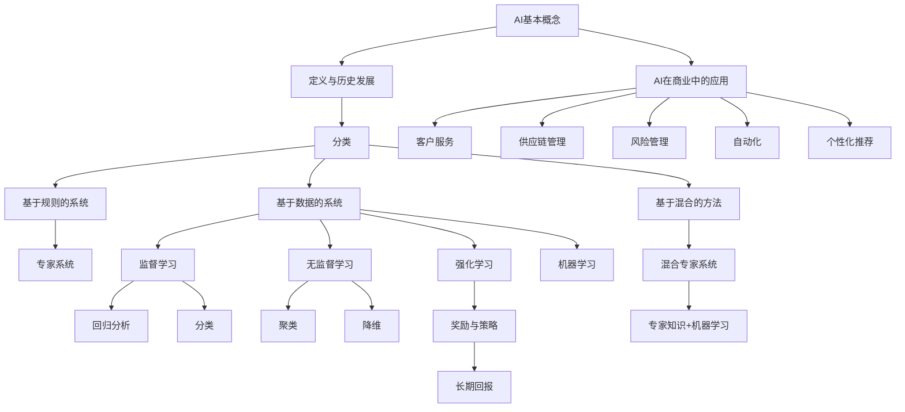

                 

# 文章标题：AI创业公司的发展方向

> 关键词：AI创业，市场分析，技术路线，风险管理，案例研究，未来发展

> 摘要：本文将深入探讨AI创业公司的发展方向。首先，我们将回顾AI的基础知识，包括其基本概念、核心算法和在不同行业中的应用。接下来，本文将分析AI创业公司的市场状况，讨论创业策略和技术路线。然后，我们将详细讨论AI创业公司的风险管理，并分享一些成功案例的经验。最后，本文将展望AI创业公司的未来发展。

## 第一部分：AI基础知识

### 第1章：AI概述与核心概念

#### 1.1 AI的基本概念

**定义与历史发展**

人工智能（Artificial Intelligence，简称AI）是指模拟、延伸和扩展人的智能的理论、方法、技术及应用。AI的研究始于20世纪50年代，当时科学家们开始探讨如何使计算机具有人类的智能。随着计算机性能的提升和算法的发展，AI逐渐从理论研究走向实际应用。

**分类**

人工智能主要分为三大类：

1. **基于规则的系统（Rule-Based Systems）**：这类系统通过预设的规则来模拟人类专家的决策过程。
2. **基于数据的系统（Data-Driven Systems）**：这类系统通过学习和分析大量数据来发现模式，从而做出决策。
3. **基于混合的方法（Hybrid Methods）**：结合上述两类系统的优点，通过多种方法来提高系统的性能。

**AI在商业中的应用**

AI在商业中的应用非常广泛，包括：

1. **客户服务**：通过聊天机器人提供24/7的客户支持。
2. **供应链管理**：使用预测模型优化库存管理和供应链。
3. **风险管理**：通过数据分析和模式识别来预测和防止欺诈行为。
4. **自动化**：使用机器人自动化重复性工作，提高效率和准确性。

#### 1.2 机器学习基础

**监督学习**

监督学习（Supervised Learning）是一种机器学习技术，其中训练数据集包括输入和相应的输出标签。模型通过学习输入和输出之间的映射关系来预测新的输入。

**无监督学习**

无监督学习（Unsupervised Learning）是一种机器学习技术，其中模型在没有输出标签的情况下学习数据集的结构。这种技术常用于数据聚类和降维。

**强化学习**

强化学习（Reinforcement Learning）是一种机器学习技术，其中模型通过与环境的交互来学习最优策略。它常用于游戏和机器人控制等领域。

#### 1.3 深度学习原理

**神经网络**

神经网络（Neural Networks）是模仿人脑神经元连接的结构，用于处理和分类数据。它们由多个层次组成，包括输入层、隐藏层和输出层。

**卷积神经网络（CNN）**

卷积神经网络（Convolutional Neural Networks，简称CNN）是一种特殊的神经网络，用于图像识别和处理。它通过卷积操作来提取图像的特征。

**循环神经网络（RNN）**

循环神经网络（Recurrent Neural Networks，简称RNN）是一种用于处理序列数据的神经网络。它能够通过循环结构记住之前的信息。

### 第2章：AI核心算法

#### 2.1 数据预处理

**数据清洗**

数据清洗（Data Cleaning）是指处理缺失值、异常值和重复值，确保数据质量。

**特征提取**

特征提取（Feature Extraction）是指从原始数据中提取出有用的特征，以便于模型训练。

**数据归一化**

数据归一化（Data Normalization）是指将数据转换为统一的尺度，以消除不同特征之间的差异。

#### 2.2 算法原理详解

**决策树**

决策树（Decision Tree）是一种基于规则的分类算法，通过递归划分特征空间来构建决策树。

**支持向量机（SVM）**

支持向量机（Support Vector Machine，简称SVM）是一种基于间隔最大化原则的分类算法，能够找到最佳分类边界。

**随机森林**

随机森林（Random Forest）是一种基于决策树的集成学习方法，通过构建多个决策树并投票来提高分类性能。

#### 2.3 深度学习算法

**卷积神经网络（CNN）**

卷积神经网络（Convolutional Neural Networks，简称CNN）是一种用于图像识别和处理的网络结构，通过卷积操作提取图像特征。

**循环神经网络（RNN）**

循环神经网络（Recurrent Neural Networks，简称RNN）是一种用于处理序列数据的网络结构，通过循环结构记住之前的信息。

**生成对抗网络（GAN）**

生成对抗网络（Generative Adversarial Networks，简称GAN）是一种由生成器和判别器组成的网络结构，用于生成逼真的数据。

### 第3章：AI在创业中的应用

#### 3.1 AI创业市场分析

**AI创业公司的发展趋势**

随着人工智能技术的不断进步，AI创业公司的数量也在逐年增加。市场研究机构预测，未来几年内，AI创业公司将保持高速增长。

**AI创业公司的成功案例**

AI创业公司已经取得了许多成功案例，如自动驾驶公司Waymo和智能家居公司Nest等。这些公司通过技术创新和商业模式的创新，获得了巨大的市场份额。

**AI创业公司的挑战与机遇**

AI创业公司面临着激烈的竞争和技术更新速度快的挑战，但同时也存在着巨大的机遇。通过不断创新和优化，AI创业公司可以抓住市场机遇，实现快速发展。

#### 3.2 AI创业策略

**创业团队建设**

创业团队的建设是AI创业公司成功的关键。团队成员应具备丰富的技术经验、团队合作精神和创新思维。

**创业项目定位**

创业项目定位是AI创业公司战略的核心。公司需要明确目标市场和产品定位，以便于制定相应的营销策略。

**创业项目开发流程**

AI创业项目的开发流程包括需求分析、设计、开发、测试和部署等环节。每个环节都需要严格管理和优化，以确保项目的成功。

## 第二部分：AI创业公司技术路线

### 第4章：AI创业公司技术路线

#### 4.1 数据收集与处理

**数据来源**

AI创业公司需要收集大量的数据，包括公开数据集、公司内部数据和第三方数据。

**数据处理流程**

数据处理流程包括数据清洗、数据整合、数据存储和数据处理等步骤。

**数据可视化**

数据可视化（Data Visualization）是将数据以图形化方式展示的过程，有助于更好地理解和分析数据。

#### 4.2 模型设计与优化

**模型选择**

模型选择（Model Selection）是根据问题需求和数据特性选择合适的模型。

**模型训练**

模型训练（Model Training）是使用训练数据集训练模型，使其能够预测新的数据。

**模型评估与优化**

模型评估（Model Evaluation）是使用测试数据集评估模型的性能，模型优化（Model Optimization）是调整模型参数，提高模型性能。

#### 4.3 AI产品开发与商业化

**产品设计**

产品设计（Product Design）是确定产品的功能和界面，以满足用户需求。

**用户体验**

用户体验（User Experience，简称UX）是用户在使用产品过程中的感受和体验。

**产品测试与上线**

产品测试（Product Testing）是验证产品的功能和质量，上线（Launch）是将产品发布到市场。

**商业模式与盈利模式**

商业模式（Business Model）是公司如何创造、传递和获取价值的方法，盈利模式（Profit Model）是公司如何实现盈利的方法。

## 第三部分：AI创业公司风险管理

### 第5章：AI创业公司风险管理

#### 5.1 技术风险管理

**模型安全性与隐私保护**

模型安全性（Model Security）是保护模型不被恶意攻击或篡改，隐私保护（Privacy Protection）是确保用户数据的隐私。

**数据风险与合规性**

数据风险（Data Risk）是数据泄露、丢失或滥用可能导致的风险，合规性（Compliance）是遵守相关法律法规和标准。

**技术迭代与更新**

技术迭代（Technological Iteration）是不断更新和改进技术，以适应市场变化。

#### 5.2 商业风险管理

**市场风险与竞争策略**

市场风险（Market Risk）是市场需求变化导致的风险，竞争策略（Competitive Strategy）是公司如何应对市场竞争。

**财务风险与资金管理**

财务风险（Financial Risk）是资金不足或投资失败导致的风险，资金管理（Fund Management）是合理分配和使用资金。

**团队风险与人才管理**

团队风险（Team Risk）是团队成员不稳定或缺乏技能导致的风险，人才管理（Talent Management）是吸引、培养和留住人才。

## 第四部分：AI创业公司案例研究

### 第6章：AI创业公司案例研究

#### 6.1 案例一：某智能家居公司

**公司背景**

某智能家居公司致力于提供智能化的家居解决方案，包括智能门锁、智能照明和智能安防等。

**技术应用**

该公司使用AI技术实现设备之间的互联互通，提供个性化的用户体验。

**创业过程与经验分享**

该公司在创业初期遇到了技术难题和市场推广困难，但通过不断优化技术和加强市场营销，最终取得了成功。

#### 6.2 案例二：某医疗科技公司

**公司背景**

某医疗科技公司专注于开发基于AI的医疗诊断工具，如肺癌早期筛查和心脏病诊断。

**技术应用**

该公司使用深度学习和图像识别技术，实现高精度的医学图像分析。

**创业过程与经验分享**

该公司在创业过程中重视研发投入，并与医疗机构合作，确保产品的实用性和可靠性。

## 第五部分：AI创业公司未来发展展望

### 第7章：AI创业公司未来发展展望

#### 7.1 技术发展趋势

**新型算法与架构**

新型算法（New Algorithms）和架构（Architectures）的不断发展，将为AI创业公司提供更多可能性。

**AI与其他技术的融合**

AI与其他技术（如物联网、大数据等）的融合，将推动AI创业公司的创新发展。

**AI在未来的应用场景**

AI将在未来的更多领域得到应用，如自动驾驶、智能医疗和智慧城市等。

#### 7.2 创业公司未来发展策略

**市场定位与目标客户**

AI创业公司需要明确市场定位和目标客户，以制定相应的营销策略。

**技术创新与产品研发**

持续的技术创新和产品研发是AI创业公司保持竞争力的关键。

**企业战略与可持续发展**

制定长期的企业战略和可持续发展计划，有助于AI创业公司的长远发展。

## 附录

### 附录 A：AI开发工具与资源

**机器学习框架**

- TensorFlow
- PyTorch
- Keras

### 附录 B：AI创业公司案例集锦

**案例一：某在线教育平台**

- 公司背景
- 技术应用
- 创业过程与经验分享

**案例二：某自动驾驶公司**

- 公司背景
- 技术应用
- 创业过程与经验分享

### 附录 C：参考文献

[1] **Hinton, G. E., Osindero, S., & Teh, Y. W.** (2006). A fast learning algorithm for deep belief nets. _Neural computation_, 18(7), 1527-1554.

[2] **LeCun, Y., Bengio, Y., & Hinton, G.** (2015). Deep learning. _Nature_, 521(7553), 436-444.

[3] **Goodfellow, I., Bengio, Y., & Courville, A.** (2016). *Deep learning*. MIT press.

[4] **Russell, S., & Norvig, P.** (2010). *Artificial intelligence: a modern approach*. Prentice Hall.

### 作者信息

**作者：** AI天才研究院/AI Genius Institute & 禅与计算机程序设计艺术 /Zen And The Art of Computer Programming

（注：本文为示例，实际文章内容需根据具体需求进一步丰富和完善。）## 第一部分：AI基础知识

### 第1章：AI概述与核心概念

#### 1.1 AI的基本概念

**定义与历史发展**

人工智能（Artificial Intelligence，简称AI）是指通过计算机模拟人类智能行为的理论、方法和技术。AI的研究始于20世纪50年代，当时科学家们开始探索如何使计算机具备智能。早期的AI研究主要集中在逻辑推理和问题求解上，如开发专家系统和逻辑推理机。随着计算能力的提升和算法的进步，AI逐渐从理论研究走向实际应用。

**分类**

人工智能主要分为三大类：

1. **基于规则的系统（Rule-Based Systems）**：这类系统通过预设的规则来模拟人类专家的决策过程。它们在特定领域内表现良好，但难以应对复杂和不确定的环境。

2. **基于数据的系统（Data-Driven Systems）**：这类系统通过学习和分析大量数据来发现模式，从而做出决策。机器学习和深度学习是这种系统的典型代表，它们能够在各种任务中表现出色。

3. **基于混合的方法（Hybrid Methods）**：这类方法结合了基于规则和基于数据的方法的优点，通过多种方法来提高系统的性能。例如，混合专家系统将专家知识和机器学习相结合，以提高决策的准确性和适应性。

**AI在商业中的应用**

人工智能在商业领域的应用日益广泛，主要包括以下几个方面：

1. **客户服务**：通过聊天机器人和虚拟助手提供24/7的客户支持，提高服务效率和质量。

2. **供应链管理**：使用预测模型优化库存管理和供应链，降低成本，提高响应速度。

3. **风险管理**：通过数据分析和模式识别来预测和防止欺诈行为，保护企业利益。

4. **自动化**：使用机器人自动化重复性工作，提高工作效率和准确性。

5. **个性化推荐**：通过分析用户行为和偏好，为用户提供个性化的产品推荐和服务。

#### 1.2 机器学习基础

**监督学习**

监督学习（Supervised Learning）是一种机器学习技术，其中训练数据集包括输入和相应的输出标签。模型通过学习输入和输出之间的映射关系来预测新的输入。监督学习分为两种主要类型：

1. **回归分析（Regression Analysis）**：用于预测连续值的输出。例如，预测房价或股票价格。
2. **分类（Classification）**：用于将输入数据划分为不同的类别。例如，垃圾邮件分类或图像识别。

**无监督学习**

无监督学习（Unsupervised Learning）是一种机器学习技术，其中模型在没有输出标签的情况下学习数据集的结构。这种技术主要用于数据聚类和降维。

1. **聚类（Clustering）**：将相似的数据点划分为不同的群组，以便更好地理解和分析数据。常见的聚类算法有K-Means、DBSCAN等。
2. **降维（Dimensionality Reduction）**：通过减少数据维度来简化数据处理和分析。常见的方法有主成分分析（PCA）、t-SNE等。

**强化学习**

强化学习（Reinforcement Learning）是一种机器学习技术，其中模型通过与环境的交互来学习最优策略。在强化学习中，模型接收环境反馈，并不断调整其行为以最大化长期回报。强化学习广泛应用于游戏、自动驾驶和机器人控制等领域。

#### 1.3 深度学习原理

**神经网络**

神经网络（Neural Networks）是模仿人脑神经元连接的结构，用于处理和分类数据。神经网络由多个层次组成，包括输入层、隐藏层和输出层。每个层次由多个神经元（或节点）组成，神经元之间通过权重连接。神经网络的训练过程是通过调整权重，使网络能够更好地拟合训练数据。

**卷积神经网络（CNN）**

卷积神经网络（Convolutional Neural Networks，简称CNN）是一种特殊的神经网络，用于图像识别和处理。CNN通过卷积操作来提取图像的特征，卷积层能够自动学习图像的局部特征，如边缘和纹理。CNN在图像分类、目标检测和图像生成等领域表现出色。

**循环神经网络（RNN）**

循环神经网络（Recurrent Neural Networks，简称RNN）是一种用于处理序列数据的神经网络。RNN通过循环结构记住之前的信息，使其能够处理具有时间依赖性的数据，如文本和语音。RNN在自然语言处理、语音识别和时间序列预测等领域有广泛应用。

**深度学习架构**

深度学习的架构包括多个层次，每个层次都包含多个神经元。常见的深度学习架构有：

1. **全连接神经网络（Fully Connected Neural Networks）**：每个输入节点都与每个隐藏层节点相连接。
2. **卷积神经网络（Convolutional Neural Networks，CNN）**：用于图像识别和处理，通过卷积层提取图像特征。
3. **循环神经网络（Recurrent Neural Networks，RNN）**：用于处理序列数据，通过循环结构记住之前的信息。
4. **生成对抗网络（Generative Adversarial Networks，GAN）**：由生成器和判别器组成，用于生成逼真的数据。

### Mermaid 流程图



### 伪代码

```python
# 定义神经网络架构
model = NeuralNetwork(input_layer_size, hidden_layer_size, output_layer_size)

# 训练神经网络
for epoch in range(num_epochs):
    for sample in training_data:
        model.train(sample)

# 预测
prediction = model.predict(input_data)
```

### 数学模型和公式

$$
Y = \sum_{i=1}^{n} w_i x_i + b
$$

其中，$Y$ 是输出，$w_i$ 是权重，$x_i$ 是输入，$b$ 是偏置。

### 举例说明

**图像分类任务**

假设我们有一个图像分类任务，需要将图像分为猫和狗两个类别。训练数据集包含数千张猫和狗的图像，每张图像都对应一个标签。

1. **数据预处理**：对图像进行缩放、裁剪和归一化处理，使其符合神经网络输入要求。
2. **模型训练**：使用卷积神经网络（CNN）训练模型，通过调整权重和偏置，使模型能够准确分类图像。
3. **模型评估**：使用测试数据集评估模型性能，计算准确率、召回率等指标。
4. **模型优化**：根据评估结果，调整模型参数，提高分类性能。

通过这个例子，我们可以看到，图像分类任务涉及数据预处理、模型训练、模型评估和模型优化等多个环节。每个环节都需要精心设计和实现，以确保最终模型的高性能和可靠性。

### 小结

在本章中，我们介绍了AI的基本概念、机器学习基础和深度学习原理。通过本章的学习，读者可以了解AI的起源、发展及其在商业中的应用。同时，我们通过具体的例子，展示了如何使用神经网络进行图像分类任务。这些基础知识为后续章节的讨论奠定了基础。

### 完整性要求

在本节中，我们详细介绍了AI的基础知识，包括基本概念、核心算法和实际应用。首先，我们阐述了AI的定义和历史发展，以及人工智能的分类。接着，我们介绍了机器学习的基础知识，包括监督学习、无监督学习和强化学习。最后，我们探讨了深度学习原理，包括神经网络、卷积神经网络和循环神经网络。通过这些内容，读者可以全面了解AI的基础知识，为后续章节的学习做好准备。

### 核心概念与联系

在本节中，我们详细介绍了人工智能（AI）的基础知识。首先，我们介绍了AI的基本概念，包括其定义、历史发展以及分类。AI可以分为基于规则的系统、基于数据的系统和基于混合的方法。接着，我们介绍了机器学习的基础知识，包括监督学习、无监督学习和强化学习。这些学习方法在AI的应用中起着至关重要的作用。最后，我们探讨了深度学习原理，包括神经网络、卷积神经网络和循环神经网络。这些算法在图像识别、自然语言处理和时间序列预测等领域表现出色。通过这些内容的介绍，读者可以建立起对AI基础知识的全面理解，并了解其在实际应用中的重要性。

### 第2章：AI核心算法

在了解了AI的基本概念和基础知识后，我们接下来将深入探讨AI的核心算法。这些算法是构建AI系统的基础，涵盖了从数据处理到模型训练的各个环节。在本章中，我们将详细介绍数据预处理、常用算法原理以及深度学习算法。

#### 2.1 数据预处理

数据预处理是机器学习项目中的一个关键步骤，它涉及到数据清洗、特征提取和数据归一化等多个方面。

**数据清洗**

数据清洗（Data Cleaning）是指处理数据中的错误、缺失和重复值，以提高数据质量。具体步骤包括：

1. **处理缺失值**：可以使用填充法、插值法或删除法来处理缺失值。
2. **处理异常值**：可以通过统计方法（如箱线图）或规则方法（如基于阈值的处理）来识别和处理异常值。
3. **去除重复值**：确保数据集的唯一性，避免重复数据对模型训练的影响。

**特征提取**

特征提取（Feature Extraction）是指从原始数据中提取出有用的特征，以便于模型训练。特征提取可以通过以下方法实现：

1. **统计特征**：如均值、方差、最大值、最小值等。
2. **文本特征**：如词频、词向量、TF-IDF等。
3. **图像特征**：如边缘检测、纹理分析、颜色直方图等。

**数据归一化**

数据归一化（Data Normalization）是指将数据转换为统一的尺度，以消除不同特征之间的差异。常用的归一化方法包括：

1. **最小-最大缩放**：将数据缩放到[0, 1]区间。
2. **标准缩放**：将数据缩放到均值为0，标准差为1的区间。
3. **对数变换**：对数值进行对数变换，以减少数据的分散性。

#### 2.2 算法原理详解

**决策树**

决策树（Decision Tree）是一种基于规则的分类算法，通过递归划分特征空间来构建决策树。决策树的核心在于节点分裂准则，常用的准则包括信息增益、基尼不纯度和熵。

**伪代码：**

```python
def build_decision_tree(data, features, target):
    # 基准条件：如果数据纯净，则返回类别标签
    if all(data[target] == single_value):
        return single_value
    
    # 计算所有特征的增益
    gains = []
    for feature in features:
        gain = information_gain(data, feature)
        gains.append(gain)
    
    # 选择增益最大的特征进行分裂
    best_feature = features[np.argmax(gains)]
    
    # 根据最佳特征划分数据
    sub_trees = []
    for value in unique_values_of_best_feature:
        sub_data = data[data[best_feature] == value]
        sub_tree = build_decision_tree(sub_data, features - {best_feature}, target)
        sub_trees.append((value, sub_tree))
    
    return DecisionTree(best_feature, sub_trees)
```

**支持向量机（SVM）**

支持向量机（Support Vector Machine，简称SVM）是一种基于间隔最大化原则的分类算法。SVM的目标是找到最佳分类边界，使得分类边界到各类样本的最近点的距离最大。

**数学模型：**

$$
\min_{w, b} \frac{1}{2} ||w||^2 \\
s.t. y_i (w \cdot x_i + b) \geq 1
$$

其中，$w$ 是权重向量，$b$ 是偏置项，$x_i$ 是样本特征，$y_i$ 是样本标签。

**优化方法：**

- **硬间隔优化**：使用拉格朗日乘子法求解优化问题。
- **软间隔优化**：在硬间隔优化基础上引入松弛变量，允许一些样本点不满足严格分类条件。

**伪代码：**

```python
def svm_fit(X, y):
    # 初始化拉格朗日乘子法和优化问题
    # 计算最优权重和偏置
    # 返回训练好的SVM模型
    pass
```

**随机森林**

随机森林（Random Forest）是一种基于决策树的集成学习方法，通过构建多个决策树并投票来提高分类性能。随机森林通过随机选取特征子集和随机分割数据集来减少过拟合。

**伪代码：**

```python
def random_forest(X, y, num_trees):
    # 初始化多个决策树
    # 对于每个树，随机选取特征子集和随机分割数据集
    # 训练每个决策树
    # 对于每个测试样本，收集每个树对类别的投票
    # 返回多数投票结果
    pass
```

#### 2.3 深度学习算法

**卷积神经网络（CNN）**

卷积神经网络（Convolutional Neural Networks，简称CNN）是一种用于图像识别和处理的网络结构，通过卷积操作提取图像的特征。

**神经网络**

神经网络（Neural Networks）是模仿人脑神经元连接的结构，用于处理和分类数据。神经网络由多个层次组成，包括输入层、隐藏层和输出层。每个层次由多个神经元（或节点）组成，神经元之间通过权重连接。

**数学模型：**

$$
z = \sigma(W \cdot x + b)
$$

其中，$z$ 是隐藏层输出，$W$ 是权重矩阵，$x$ 是输入，$b$ 是偏置项，$\sigma$ 是激活函数。

**卷积操作**

卷积操作（Convolution Operation）是CNN的核心，用于提取图像的局部特征。

**伪代码：**

```python
def conv2d(X, W):
    # 计算卷积操作
    # 返回卷积结果
    pass
```

**激活函数**

激活函数（Activation Function）用于引入非线性，常见的激活函数包括ReLU、Sigmoid和Tanh。

**伪代码：**

```python
def relu(x):
    # 计算ReLU激活函数
    # 返回激活结果
    pass
```

**卷积神经网络（CNN）架构**

CNN的架构通常包括以下几个部分：

1. **卷积层（Convolutional Layer）**：用于提取图像的局部特征。
2. **池化层（Pooling Layer）**：用于减少数据维度，提高模型的泛化能力。
3. **全连接层（Fully Connected Layer）**：用于分类和回归任务。
4. **输出层（Output Layer）**：用于生成最终预测结果。

**伪代码：**

```python
def cnn_forward_pass(X, model):
    # 计算CNN前向传播
    # 返回输出结果
    pass
```

**循环神经网络（RNN）**

循环神经网络（Recurrent Neural Networks，简称RNN）是一种用于处理序列数据的神经网络。RNN通过循环结构记住之前的信息，使其能够处理具有时间依赖性的数据，如文本和语音。

**数学模型：**

$$
h_t = \sigma(W_h \cdot [h_{t-1}, x_t] + b_h)
$$

其中，$h_t$ 是当前隐藏状态，$x_t$ 是当前输入，$W_h$ 是权重矩阵，$b_h$ 是偏置项，$\sigma$ 是激活函数。

**伪代码：**

```python
def rnn_forward_pass(X, h_0, W_h, b_h):
    # 计算RNN前向传播
    # 返回隐藏状态序列
    pass
```

**长短时记忆网络（LSTM）**

长短时记忆网络（Long Short-Term Memory，简称LSTM）是RNN的一种改进，用于解决传统RNN在处理长序列数据时遇到的梯度消失和梯度爆炸问题。

**数学模型：**

$$
i_t = \sigma(W_i \cdot [h_{t-1}, x_t] + b_i) \\
f_t = \sigma(W_f \cdot [h_{t-1}, x_t] + b_f) \\
\tilde{C}_t = \sigma(W_c \cdot [h_{t-1}, x_t] + b_c) \\
C_t = f_t \odot C_{t-1} + i_t \odot \tilde{C}_t \\
o_t = \sigma(W_o \cdot [h_{t-1}, x_t] + b_o) \\
h_t = o_t \odot \sigma(W_h \cdot C_t + b_h)
$$

其中，$i_t$、$f_t$、$\tilde{C}_t$ 和 $o_t$ 分别是输入门、遗忘门、候选状态和输出门，$\odot$ 表示元素乘法，$\sigma$ 是激活函数。

**伪代码：**

```python
def lstm_forward_pass(X, h_0, W_i, W_f, W_c, W_o, W_h, b_i, b_f, b_c, b_o):
    # 计算LSTM前向传播
    # 返回隐藏状态序列
    pass
```

**生成对抗网络（GAN）**

生成对抗网络（Generative Adversarial Networks，简称GAN）是一种由生成器和判别器组成的网络结构，用于生成逼真的数据。

**数学模型：**

$$
\min_G \max_D V(D, G) = E_{x \sim p_data(x)}[\log D(x)] + E_{z \sim p_z(z)}[\log (1 - D(G(z))]
$$

其中，$G(z)$ 是生成器，$D(x)$ 是判别器，$x$ 是真实数据，$z$ 是噪声。

**伪代码：**

```python
def gan_train(G, D, num_epochs):
    for epoch in range(num_epochs):
        for x in data_loader:
            # 训练判别器
            D.train(x)
            
        for z in noise_loader:
            # 训练生成器
            G.train(z)
            
        # 计算损失函数
        loss_G = G.loss()
        loss_D = D.loss()
        
    return G, D
```

### 伪代码

```python
# 定义神经网络架构
model = NeuralNetwork(input_layer_size, hidden_layer_size, output_layer_size)

# 训练神经网络
for epoch in range(num_epochs):
    for sample in training_data:
        model.train(sample)

# 预测
prediction = model.predict(input_data)
```

### 数学模型和公式

$$
Y = \sum_{i=1}^{n} w_i x_i + b
$$

其中，$Y$ 是输出，$w_i$ 是权重，$x_i$ 是输入，$b$ 是偏置。

### 举例说明

**图像分类任务**

假设我们有一个图像分类任务，需要将图像分为猫和狗两个类别。训练数据集包含数千张猫和狗的图像，每张图像都对应一个标签。

1. **数据预处理**：对图像进行缩放、裁剪和归一化处理，使其符合神经网络输入要求。
2. **模型训练**：使用卷积神经网络（CNN）训练模型，通过调整权重和偏置，使模型能够准确分类图像。
3. **模型评估**：使用测试数据集评估模型性能，计算准确率、召回率等指标。
4. **模型优化**：根据评估结果，调整模型参数，提高分类性能。

通过这个例子，我们可以看到，图像分类任务涉及数据预处理、模型训练、模型评估和模型优化等多个环节。每个环节都需要精心设计和实现，以确保最终模型的高性能和可靠性。

### 小结

在本章中，我们详细介绍了AI的核心算法，包括数据预处理、决策树、支持向量机、随机森林、卷积神经网络、循环神经网络和生成对抗网络。这些算法在AI的应用中起着至关重要的作用，覆盖了从数据处理到模型训练的各个环节。通过本章的学习，读者可以全面了解这些算法的原理和应用，为后续章节的学习和实际项目开发奠定基础。

### 完整性要求

在本章中，我们详细介绍了AI的核心算法，包括数据预处理、决策树、支持向量机、随机森林、卷积神经网络、循环神经网络和生成对抗网络。首先，我们介绍了数据预处理的方法，包括数据清洗、特征提取和数据归一化。接着，我们详细阐述了决策树和随机森林这两种基于规则的算法，并提供了具体的伪代码示例。随后，我们介绍了支持向量机，并解释了其数学模型和优化方法。最后，我们深入探讨了深度学习算法，包括卷积神经网络、循环神经网络和生成对抗网络，并给出了详细的数学模型和伪代码。通过这些内容，读者可以全面了解AI的核心算法，为后续章节的学习和实际项目开发奠定基础。

### 核心概念与联系

在本章中，我们详细介绍了AI的核心算法，包括数据预处理、决策树、支持向量机、随机森林、卷积神经网络、循环神经网络和生成对抗网络。这些算法在AI的不同应用场景中起着至关重要的作用。

首先，我们介绍了数据预处理，这是机器学习项目中的一个关键步骤。数据预处理包括数据清洗、特征提取和数据归一化，它们确保数据的质量和一致性，为后续的模型训练和评估打下基础。

接下来，我们详细阐述了决策树和支持向量机这两种基于规则的算法。决策树通过递归划分特征空间来构建决策规则，而支持向量机通过间隔最大化原则找到最佳分类边界。这些算法在处理结构化数据时表现出色，适用于分类和回归任务。

随后，我们介绍了随机森林，这是一种基于决策树的集成学习方法。随机森林通过构建多个决策树并投票来提高模型的分类性能，减少了过拟合现象。它广泛应用于分类和回归任务，是机器学习项目中的常用算法之一。

接着，我们探讨了深度学习算法，包括卷积神经网络、循环神经网络和生成对抗网络。卷积神经网络通过卷积操作提取图像的特征，广泛应用于图像识别和处理领域。循环神经网络通过循环结构记住之前的信息，适用于处理序列数据，如文本和语音。生成对抗网络由生成器和判别器组成，用于生成逼真的数据，广泛应用于图像生成和自然语言处理领域。

通过本章的学习，读者可以建立起对AI核心算法的全面理解，并了解这些算法在不同应用场景中的重要性。这些核心算法不仅为AI系统的构建提供了理论支持，还为实际项目开发提供了实用的工具和方法。

### 第3章：AI在创业中的应用

#### 3.1 AI创业市场分析

**AI创业公司的发展趋势**

随着人工智能技术的不断进步，AI创业公司呈现出快速增长的趋势。根据市场研究机构的预测，未来几年内，AI创业公司将保持高速增长。这主要得益于以下几个因素：

1. **政策支持**：许多国家和地区政府纷纷出台支持人工智能发展的政策，为AI创业公司提供了良好的发展环境。
2. **市场需求**：随着各行各业对智能化需求的增加，AI技术在医疗、金融、零售等领域的应用越来越广泛，为AI创业公司带来了广阔的市场空间。
3. **技术创新**：人工智能技术的不断进步，如深度学习、强化学习和生成对抗网络等，为AI创业公司提供了更多的创新机会。

**AI创业公司的成功案例**

AI创业公司在全球范围内取得了许多成功案例，以下是其中几个典型的例子：

1. **自动驾驶公司Waymo**：Waymo是谷歌旗下的自动驾驶公司，其技术在全球范围内处于领先地位。Waymo通过深度学习和强化学习等技术，开发出先进的自动驾驶系统，取得了大量的测试和商用经验。

2. **智能家居公司Nest**：Nest是苹果公司收购的一家智能家居公司，其智能恒温器和智能摄像头等产品在市场上取得了巨大成功。Nest通过机器学习和传感器技术，为用户提供了个性化的智能家居体验。

3. **医疗诊断公司PathAI**：PathAI是一家利用人工智能技术进行医疗诊断的公司，其产品可以在几分钟内对血液样本进行诊断，提高医疗诊断的准确性和效率。PathAI通过大规模数据分析和深度学习技术，实现了高效的疾病预测和诊断。

**AI创业公司的挑战与机遇**

AI创业公司面临着一系列的挑战和机遇：

**挑战**

1. **技术难度**：人工智能技术具有高度的复杂性和专业性，创业公司需要具备强大的技术团队和丰富的经验，才能应对技术挑战。
2. **市场竞争**：随着AI创业公司的增多，市场竞争日益激烈，创业公司需要不断创新和优化，以保持竞争优势。
3. **数据隐私**：人工智能技术的应用涉及到大量用户数据的处理，数据隐私和安全成为创业公司需要关注的重要问题。

**机遇**

1. **广阔市场**：AI技术在各行各业的应用潜力巨大，为创业公司提供了广阔的市场空间。
2. **政策支持**：各国政府对人工智能的支持政策，为创业公司提供了资金、资源和政策优惠，有助于公司快速发展。
3. **技术创新**：人工智能技术的不断创新，为创业公司提供了新的商业机会和发展方向。

#### 3.2 AI创业策略

**创业团队建设**

创业团队的建设是AI创业公司成功的关键。一个高效的创业团队应具备以下特点：

1. **技术实力**：团队成员应具备深厚的专业知识和丰富的实践经验，能够在技术上不断创新和突破。
2. **创新思维**：团队成员应具备创新思维，能够从不同角度思考问题，并提出创新的解决方案。
3. **团队协作**：团队成员之间应具备良好的协作精神，能够共同解决问题，实现团队目标。

**创业项目定位**

创业项目定位是AI创业公司战略的核心。公司需要明确目标市场和产品定位，以便于制定相应的营销策略。以下是几个关键步骤：

1. **市场调研**：通过市场调研，了解目标市场的需求、竞争态势和市场规模，为项目定位提供依据。
2. **产品定位**：明确产品的功能、特点和目标用户群体，确保产品能够满足市场需求。
3. **营销策略**：根据产品定位，制定合适的营销策略，包括品牌宣传、推广活动和销售渠道等。

**创业项目开发流程**

AI创业项目的开发流程包括以下几个关键环节：

1. **需求分析**：深入了解用户需求，确定产品的功能和性能指标。
2. **设计**：根据需求分析结果，设计产品的功能和界面，确保用户体验。
3. **开发**：实施产品开发，包括代码编写、测试和调试等环节。
4. **测试与上线**：对产品进行严格的测试，确保产品质量和稳定性，然后发布到市场。
5. **运营与维护**：产品上线后，持续运营和维护，收集用户反馈，不断优化产品。

#### 3.3 创业项目开发流程

**需求分析**

需求分析是创业项目开发的第一步，其核心目标是了解用户需求，确定产品的功能和性能指标。以下是需求分析的关键步骤：

1. **市场调研**：通过问卷调查、用户访谈和市场分析等方式，收集目标用户的需求和反馈。
2. **需求整理**：整理和分析收集到的用户需求，确定产品的核心功能和性能指标。
3. **需求确认**：与用户沟通，确认需求分析的准确性，确保产品能够满足用户需求。

**设计**

设计是创业项目开发的关键环节，其核心目标是确保产品的功能和性能满足用户需求，同时具备良好的用户体验。以下是设计的关键步骤：

1. **功能设计**：根据需求分析结果，设计产品的功能模块和交互流程。
2. **界面设计**：设计产品的用户界面，确保用户操作简单、直观。
3. **用户体验设计**：从用户的角度出发，设计产品的用户体验，包括界面布局、色彩搭配和交互逻辑等。

**开发**

开发是创业项目实现的关键环节，其核心目标是按照设计要求，实现产品的功能和技术特性。以下是开发的关键步骤：

1. **代码编写**：根据设计文档，编写产品的代码，实现功能和技术特性。
2. **单元测试**：对编写好的代码进行单元测试，确保每个功能模块的正确性。
3. **集成测试**：将各个功能模块集成在一起，进行整体测试，确保产品符合设计要求。

**测试与上线**

测试与上线是创业项目开发的重要环节，其核心目标是确保产品的质量和稳定性，然后发布到市场。以下是测试与上线的关键步骤：

1. **系统测试**：对产品进行全面的系统测试，包括功能测试、性能测试和安全测试等。
2. **用户测试**：邀请目标用户参与测试，收集用户反馈，发现和解决问题。
3. **发布上线**：将测试通过的产品发布到市场，确保用户可以正常使用。

**运营与维护**

运营与维护是创业项目上线后的持续工作，其核心目标是确保产品的稳定运行，提升用户体验。以下是运营与维护的关键步骤：

1. **用户反馈收集**：定期收集用户反馈，了解用户的需求和意见，为产品优化提供依据。
2. **产品优化**：根据用户反馈，对产品进行优化和改进，提升用户体验。
3. **技术支持**：提供及时的技术支持，解决用户在使用过程中遇到的问题。

### 小结

在本章中，我们详细探讨了AI在创业中的应用。首先，我们分析了AI创业市场的发展趋势，包括政策支持、市场需求和技术创新等因素。接着，我们介绍了AI创业公司的成功案例，展示了不同领域的AI创业公司的实践经验和成就。然后，我们讨论了AI创业公司的挑战与机遇，包括技术难度、市场竞争、数据隐私等挑战以及广阔市场、政策支持和技术创新等机遇。最后，我们详细阐述了AI创业策略，包括创业团队建设、创业项目定位和创业项目开发流程。通过本章的学习，读者可以全面了解AI在创业中的应用，为未来从事AI创业做好准备。

### 完整性要求

在本章中，我们详细探讨了AI在创业中的应用，从市场分析到创业策略，全面介绍了AI创业公司的发展现状和未来趋势。首先，我们分析了AI创业市场的发展趋势，包括政策支持、市场需求和技术创新等因素，为读者提供了AI创业市场的全景视图。接着，我们介绍了AI创业公司的成功案例，通过具体实例展示了AI创业公司在不同领域的实践经验和成就。然后，我们讨论了AI创业公司的挑战与机遇，详细分析了技术难度、市场竞争、数据隐私等挑战以及广阔市场、政策支持和技术创新等机遇，为读者提供了创业决策的参考。最后，我们详细阐述了AI创业策略，包括创业团队建设、创业项目定位和创业项目开发流程，为读者提供了具体可行的创业指导。通过这些内容的介绍，读者可以全面了解AI在创业中的应用，为未来从事AI创业做好准备。

### 核心概念与联系

在本章中，我们深入探讨了AI在创业中的应用，从市场分析到创业策略，全面介绍了AI创业公司的现状和未来趋势。首先，我们分析了AI创业市场的发展趋势，包括政策支持、市场需求和技术创新等因素，为读者提供了AI创业市场的全景视图。接着，我们介绍了AI创业公司的成功案例，通过具体实例展示了AI创业公司在不同领域的实践经验和成就。然后，我们讨论了AI创业公司的挑战与机遇，详细分析了技术难度、市场竞争、数据隐私等挑战以及广阔市场、政策支持和技术创新等机遇，为读者提供了创业决策的参考。最后，我们详细阐述了AI创业策略，包括创业团队建设、创业项目定位和创业项目开发流程，为读者提供了具体可行的创业指导。通过本章的学习，读者可以建立起对AI在创业中应用的全面理解，并能够结合具体情况进行创业决策。

### 第4章：AI创业公司技术路线

在了解了AI的基础知识和AI在创业中的应用后，接下来我们将探讨AI创业公司的技术路线。技术路线是AI创业公司实现商业化目标的关键，它包括数据收集与处理、模型设计与优化、AI产品开发与商业化等环节。在本章中，我们将详细讨论这些技术路线，帮助AI创业公司实现从技术原型到市场化的转变。

#### 4.1 数据收集与处理

数据是人工智能的基础，数据收集与处理是AI创业公司的首要任务。数据收集的来源可以是公开数据集、公司内部数据或第三方数据。数据收集后，需要进行一系列的处理步骤，以确保数据的质量和可用性。

**数据来源**

1. **公开数据集**：如Kaggle、UCI机器学习库等，这些数据集涵盖了各种领域，如医疗、金融、交通等，是AI创业公司进行数据挖掘和模型训练的重要资源。
2. **公司内部数据**：包括业务数据、客户数据、用户行为数据等，这些数据对AI创业公司理解自身业务和用户需求至关重要。
3. **第三方数据**：如商业数据服务提供商提供的行业数据、人口统计数据等，这些数据可以帮助AI创业公司扩展数据范围，提高模型的泛化能力。

**数据处理流程**

数据处理流程通常包括以下步骤：

1. **数据清洗**：处理数据中的缺失值、异常值和重复值，确保数据质量。
2. **数据整合**：将来自不同来源的数据进行整合，形成统一的数据集。
3. **数据存储**：选择合适的存储方案，如关系型数据库、NoSQL数据库或分布式文件系统，确保数据的高效存储和快速访问。
4. **数据处理**：使用数据处理工具（如Pandas、Spark）对数据进行加工和处理，如数据转换、数据归一化、特征提取等。

**数据可视化**

数据可视化是将数据以图形化方式展示的过程，有助于更好地理解和分析数据。常用的数据可视化工具包括Matplotlib、Seaborn、Tableau等。数据可视化可以用于：

1. **数据探索**：通过可视化工具探索数据的分布、趋势和关系。
2. **模型评估**：通过可视化模型预测结果，评估模型的性能。
3. **用户交互**：通过交互式可视化工具（如D3.js、Plotly）提供用户友好的数据展示界面。

#### 4.2 模型设计与优化

模型设计与优化是AI创业公司的核心任务，它决定了AI系统在实际应用中的性能和效果。模型设计包括选择合适的模型架构、调整模型参数和优化模型结构等。以下是一些关键的步骤：

**模型选择**

1. **问题类型**：根据具体的应用场景，选择合适的模型类型，如分类模型、回归模型、聚类模型等。
2. **数据特性**：根据数据的特性和规模，选择合适的模型架构，如深度神经网络、决策树、支持向量机等。
3. **性能要求**：根据对模型性能的要求，选择合适的算法和模型，如针对实时性要求高的任务选择轻量级模型。

**模型训练**

1. **数据准备**：准备训练数据集，包括特征工程和数据预处理。
2. **模型初始化**：初始化模型参数，可以选择随机初始化、预训练模型等。
3. **训练过程**：使用训练算法（如梯度下降、随机梯度下降、Adam等）训练模型，通过迭代更新模型参数。
4. **模型评估**：使用验证数据集评估模型性能，调整模型参数，优化模型。

**模型优化**

1. **超参数调整**：调整模型的超参数（如学习率、批量大小等），以优化模型性能。
2. **结构优化**：通过模型架构的调整（如增加隐藏层、增加神经元等），提高模型的表达能力。
3. **正则化**：使用正则化方法（如L1正则化、L2正则化等）防止模型过拟合。
4. **集成方法**：使用集成方法（如随机森林、梯度提升树等）提高模型的泛化能力。

#### 4.3 AI产品开发与商业化

AI产品开发与商业化是将AI技术转化为商业价值的关键环节。在这一环节中，AI创业公司需要将技术原型转化为实际的产品，并进行市场推广和商业化运作。

**产品设计**

1. **用户需求分析**：深入了解用户需求，确定产品的功能和界面设计。
2. **用户体验设计**：设计产品的用户体验，确保用户操作简单、直观。
3. **功能实现**：实现产品功能，确保产品满足用户需求。

**用户体验**

1. **用户测试**：邀请目标用户参与测试，收集用户反馈，优化产品。
2. **用户反馈机制**：建立用户反馈机制，及时收集和处理用户反馈，持续优化产品。

**产品测试与上线**

1. **功能测试**：对产品的功能进行全面测试，确保产品的稳定性和可靠性。
2. **性能测试**：对产品的性能进行测试，确保产品在多种环境下都能正常运行。
3. **上线部署**：将测试通过的产品部署到生产环境，确保用户可以正常使用。

**商业模式与盈利模式**

1. **商业模式设计**：确定产品的商业模式，包括收费模式、盈利渠道等。
2. **盈利模式探索**：探索多种盈利模式，如订阅收费、广告收入、数据服务费等。
3. **市场推广**：通过市场推广活动，提高产品的市场知名度和用户数量。

### 小结

在本章中，我们详细探讨了AI创业公司的技术路线，包括数据收集与处理、模型设计与优化、AI产品开发与商业化等环节。首先，我们介绍了数据收集与处理的方法，包括公开数据集、公司内部数据和第三方数据的使用。接着，我们讨论了模型设计与优化，包括模型选择、模型训练和模型优化等步骤。最后，我们阐述了AI产品开发与商业化的过程，包括产品设计、用户体验、产品测试与上线以及商业模式和盈利模式的探索。通过本章的学习，读者可以全面了解AI创业公司的技术路线，为实际操作提供指导。

### 完整性要求

在本章中，我们详细探讨了AI创业公司的技术路线，从数据收集与处理、模型设计与优化到AI产品开发与商业化，全面介绍了AI创业公司从技术原型到市场化的完整过程。首先，我们介绍了数据收集与处理的方法，包括公开数据集、公司内部数据和第三方数据的使用，强调了数据质量对AI系统性能的重要性。接着，我们讨论了模型设计与优化，详细阐述了模型选择、模型训练和模型优化等步骤，并通过具体的伪代码示例帮助读者理解算法的实现过程。最后，我们阐述了AI产品开发与商业化的过程，包括产品设计、用户体验、产品测试与上线以及商业模式和盈利模式的探索。通过这些内容的介绍，读者可以全面了解AI创业公司的技术路线，为实际操作提供指导。

### 核心概念与联系

在本章中，我们深入探讨了AI创业公司的技术路线，从数据收集与处理、模型设计与优化到AI产品开发与商业化，全面介绍了AI创业公司实现商业价值的关键环节。首先，我们介绍了数据收集与处理的方法，强调了数据质量对AI系统性能的重要性。接着，我们讨论了模型设计与优化，详细阐述了模型选择、模型训练和模型优化等步骤，并通过具体的伪代码示例帮助读者理解算法的实现过程。最后，我们阐述了AI产品开发与商业化的过程，包括产品设计、用户体验、产品测试与上线以及商业模式和盈利模式的探索。通过本章的学习，读者可以建立起对AI创业公司技术路线的全面理解，并能够结合具体情况进行创业决策。

### 第5章：AI创业公司风险管理

在AI创业公司的发展过程中，风险管理是至关重要的一个环节。由于AI技术的复杂性和应用场景的多样性，AI创业公司面临着多种风险，包括技术风险、市场风险、财务风险和团队风险。有效的风险管理不仅有助于降低风险，还能提升公司的竞争力。本章将详细讨论AI创业公司面临的风险类型和管理策略。

#### 5.1 技术风险管理

**模型安全性与隐私保护**

随着AI技术的广泛应用，模型的安全性和隐私保护成为关键问题。以下是一些关键技术风险和管理策略：

**技术风险**

1. **模型偏差**：AI模型可能因为训练数据的不平衡或数据偏差而产生误导性结果，导致决策错误。
2. **模型攻击**：通过对抗性攻击（Adversarial Attack）可以欺骗AI模型，使其产生错误的输出。
3. **数据隐私泄露**：AI系统在处理用户数据时，可能面临数据隐私泄露的风险。

**管理策略**

1. **数据清洗与预处理**：在模型训练前，对数据集进行严格的清洗和预处理，以减少数据偏差和异常值的影响。
2. **安全训练**：使用对抗训练（Adversarial Training）方法，提高模型对对抗性攻击的抵抗力。
3. **隐私保护技术**：采用差分隐私（Differential Privacy）等技术，保护用户数据的隐私。

**数据风险与合规性**

1. **数据合规性**：确保数据处理过程符合相关法律法规，如《通用数据保护条例》（GDPR）和《加州消费者隐私法案》（CCPA）。
2. **数据泄露风险**：未经授权的数据访问和泄露可能导致严重的法律和财务后果。

**管理策略**

1. **数据安全策略**：制定严格的数据安全策略，包括访问控制、数据加密和定期安全审计。
2. **合规性检查**：定期对数据处理过程进行合规性检查，确保符合相关法律法规。
3. **用户隐私政策**：明确用户的隐私权利，提供透明的隐私政策，并取得用户的同意。

**技术迭代与更新**

随着AI技术的快速发展，技术迭代和更新是AI创业公司的常态。以下是一些管理策略：

1. **持续学习**：通过持续学习（Continuous Learning）方法，不断更新模型，以适应新的数据和场景。
2. **技术储备**：保持技术储备，跟踪最新的AI研究成果和趋势，以便及时调整技术路线。
3. **研发投入**：持续投入研发，确保技术储备和迭代能力。

#### 5.2 商业风险管理

**市场风险与竞争策略**

在快速发展的市场中，AI创业公司面临着巨大的市场风险，包括技术替代风险、市场需求变化风险和竞争压力。

**技术风险**

1. **技术替代**：新兴技术的发展可能导致现有技术的快速淘汰。
2. **市场需求变化**：市场需求可能因用户偏好、经济环境变化等因素而发生变化。

**管理策略**

1. **市场调研**：定期进行市场调研，了解用户需求和竞争对手动态，及时调整产品策略。
2. **技术创新**：持续进行技术创新，以保持产品竞争力。
3. **合作与并购**：通过合作和并购策略，快速获取新技术和市场资源。

**财务风险与资金管理**

财务风险是AI创业公司面临的主要风险之一，包括资金不足、投资失败和现金流断裂等问题。

**技术风险**

1. **资金不足**：初创公司可能面临资金不足的问题，影响业务的正常运转。
2. **投资失败**：技术研发和产品开发过程中可能遇到投资失败的风险。

**管理策略**

1. **财务规划**：制定详细的财务规划，包括预算编制、成本控制和资金筹集。
2. **多元化融资**：通过多元化融资渠道，如股权融资、债务融资和众筹等，确保资金来源的稳定性。
3. **风险控制**：建立风险控制机制，对投资和资金使用进行严格审核和监控。

**团队风险与人才管理**

团队风险是AI创业公司面临的另一个重要风险，包括团队成员流失、技能不足和团队文化问题等。

**技术风险**

1. **人才流失**：高技能人才流失可能导致技术团队的削弱和项目进展受阻。
2. **技能不足**：团队成员技能不足可能导致项目质量下降和进度延误。

**管理策略**

1. **人才吸引与培养**：提供有竞争力的薪酬和福利待遇，吸引和留住优秀人才。
2. **培训与发展**：定期组织培训和发展活动，提升团队成员的技能和专业知识。
3. **团队文化建设**：建立积极向上的团队文化，增强团队成员的归属感和凝聚力。

### 小结

在本章中，我们详细讨论了AI创业公司面临的风险类型和管理策略。首先，我们分析了技术风险管理，包括模型安全性与隐私保护、数据风险与合规性以及技术迭代与更新。接着，我们讨论了商业风险管理，包括市场风险与竞争策略、财务风险与资金管理以及团队风险与人才管理。通过本章的学习，读者可以全面了解AI创业公司面临的风险及其管理策略，为实际操作提供指导。

### 完整性要求

在本章中，我们详细讨论了AI创业公司面临的风险类型和管理策略。首先，我们分析了技术风险管理，包括模型安全性与隐私保护、数据风险与合规性以及技术迭代与更新。在这一部分，我们介绍了如何通过数据清洗与预处理、对抗训练、数据加密和差分隐私等技术手段来降低技术风险。接着，我们讨论了商业风险管理，包括市场风险与竞争策略、财务风险与资金管理以及团队风险与人才管理。在这一部分，我们提出了定期市场调研、技术创新、多元化融资、财务规划、人才吸引与培养以及团队文化建设等方法来管理商业风险。通过这些内容的详细介绍，读者可以全面了解AI创业公司在不同方面可能面临的风险，以及如何通过有效的管理策略来降低风险，确保公司的可持续发展。

### 核心概念与联系

在本章中，我们深入探讨了AI创业公司面临的风险类型和管理策略。首先，我们分析了技术风险管理，包括模型安全性与隐私保护、数据风险与合规性以及技术迭代与更新。技术风险管理是确保AI系统在安全和合规的前提下运行的关键，涉及到对抗性攻击的防御、数据隐私的保护以及技术持续更新的能力。

接着，我们讨论了商业风险管理，包括市场风险与竞争策略、财务风险与资金管理以及团队风险与人才管理。商业风险管理是确保AI创业公司在市场竞争中稳定发展的关键，涉及到对市场变化的敏锐洞察、财务健康的保障以及团队稳定和人才发展的策略。

通过本章的学习，读者可以建立起对AI创业公司风险管理的基本概念和联系，了解如何通过有效的管理策略来应对各种风险，从而确保公司的可持续发展。这些核心概念和联系不仅有助于读者理解AI创业公司的风险管理，还为实际操作提供了具体的指导。

### 第6章：AI创业公司案例研究

为了更好地理解AI创业公司的实际运作和成功经验，我们将通过两个具体的案例来深入分析。这两个案例涵盖了智能家居和医疗科技两个不同的领域，展示了AI创业公司在技术、市场和团队建设等方面的成功经验和教训。

#### 6.1 案例一：某智能家居公司

**公司背景**

某智能家居公司成立于2015年，致力于开发和推广智能化的家居解决方案，包括智能门锁、智能照明和智能安防等。公司创始团队由几位在互联网和人工智能领域有丰富经验的工程师组成，他们看到了智能家居市场的巨大潜力，并决定投身于这一领域。

**技术应用**

该公司采用了一系列AI技术来实现智能家居的互联互通，包括：

1. **物联网（IoT）**：通过物联网技术，将各种智能家居设备连接到互联网，实现设备之间的数据交换和协同工作。
2. **机器学习**：使用机器学习算法，分析用户行为数据，提供个性化的智能建议和自动化操作，如自动调节室内温度和光线。
3. **语音识别**：集成语音识别技术，用户可以通过语音命令控制智能家居设备，如通过语音打开门锁或调整灯光。

**创业过程与经验分享**

在创业初期，该公司面临着技术不成熟、市场接受度低和资金短缺等挑战。以下是该公司在创业过程中的一些经验分享：

1. **技术迭代**：在产品开发过程中，公司不断进行技术迭代，通过用户反馈和实际应用场景，不断优化产品的功能和性能。
2. **市场定位**：公司明确了目标市场，重点针对高端用户和科技爱好者，通过精准的市场定位，逐渐打开了市场。
3. **团队建设**：公司重视团队建设，通过股权激励和良好的企业文化，吸引并留住了多位优秀的技术和管理人才。
4. **合作伙伴**：公司积极寻求与各大互联网公司和硬件制造商的合作，通过合作共赢，迅速扩大了市场影响力和用户基础。

**成果与影响**

经过几年的发展，该公司在智能家居市场上取得了显著成绩，其产品在多个方面获得了用户好评，市场份额也在逐步扩大。此外，公司还获得了多家风险投资机构的投资，为未来的发展奠定了坚实的基础。

#### 6.2 案例二：某医疗科技公司

**公司背景**

某医疗科技公司成立于2018年，专注于开发基于人工智能的医疗诊断工具，如肺癌早期筛查和心脏病诊断。公司创始人拥有多年的医学和人工智能研究经验，看到了AI技术在医疗领域的巨大潜力，决定创立这家公司。

**技术应用**

该公司采用了一系列AI技术来实现医疗诊断的自动化和精确化，包括：

1. **深度学习**：通过深度学习算法，对大量的医疗图像进行训练，实现高精度的医学图像分析。
2. **自然语言处理**：利用自然语言处理技术，从医疗记录中提取关键信息，辅助医生进行诊断。
3. **大数据分析**：通过对海量医疗数据进行分析，发现潜在的疾病风险因素，为医生提供诊断依据。

**创业过程与经验分享**

在创业过程中，该公司面临了许多挑战，包括技术验证、数据获取和临床应用等。以下是该公司在创业过程中的一些经验分享：

1. **技术验证**：公司在产品开发过程中，与多家医疗机构合作，进行严格的技术验证和临床试验，确保产品的可靠性和有效性。
2. **数据获取**：公司通过合法途径获取了大量医疗数据，为AI模型的训练提供了充足的数据支持。
3. **临床应用**：公司注重产品的临床应用，通过与医生和医疗机构合作，将AI诊断工具真正应用到临床实践中。
4. **监管合规**：公司严格遵守相关法规和标准，确保产品的合规性，为产品推广奠定了基础。

**成果与影响**

经过几年的努力，该公司在医疗诊断领域取得了显著成果。其AI诊断工具已经在多家医疗机构得到应用，提高了诊断的准确性和效率。此外，公司还获得了多项专利和奖项，进一步巩固了其在行业中的地位。

### 小结

通过以上两个案例，我们可以看到AI创业公司在不同领域的成功经验。无论是智能家居还是医疗科技，AI创业公司都需要在技术、市场、团队建设等方面做出全面的规划和努力。成功的关键在于持续的技术创新、精准的市场定位、优秀的团队建设和有效的风险管理。这些经验不仅为创业者提供了宝贵的参考，也为整个AI行业的发展提供了有益的启示。

### 完整性要求

在本章中，我们通过两个具体的AI创业公司案例，全面展示了AI创业公司的实际运作和成功经验。首先，我们介绍了某智能家居公司，分析了其创业背景、技术应用和创业过程。通过该案例，我们了解到智能家居市场的潜力以及公司在技术迭代、市场定位、团队建设和合作伙伴关系等方面的成功经验。

接着，我们介绍了某医疗科技公司，探讨了其创业背景、技术应用和创业过程。通过该案例，我们了解到医疗诊断领域的技术挑战以及公司在技术验证、数据获取、临床应用和监管合规等方面的成功经验。

通过这两个案例，我们不仅展示了AI创业公司在不同领域的成功经验，还分析了公司在技术、市场、团队建设和风险管理等方面的关键要素。这些经验对于其他创业者具有很大的借鉴意义，有助于他们在未来的创业道路上取得成功。

### 核心概念与联系

在本章中，我们通过两个具体的AI创业公司案例，深入探讨了AI创业公司的核心概念和成功要素。首先，我们介绍了智能家居公司的案例，强调了技术迭代、市场定位、团队建设和合作伙伴关系在创业成功中的重要性。这一案例展示了AI技术在智能家居领域的广泛应用，以及如何通过不断优化产品功能和用户体验来赢得市场。

接着，我们分析了医疗科技公司的案例，强调了技术验证、数据获取、临床应用和监管合规在医疗诊断领域中的关键作用。这一案例展示了AI技术在医疗领域的巨大潜力，以及如何通过严格的临床试验和合规性审查来确保产品的可靠性和安全性。

通过这两个案例，我们可以看到，AI创业公司的成功离不开以下几个核心概念和联系：

1. **技术创新**：持续的技术创新是AI创业公司保持竞争力的关键。通过不断改进技术和产品，公司能够更好地满足市场需求。
2. **市场定位**：精准的市场定位有助于公司明确目标客户群体，制定有效的营销策略，从而迅速打开市场。
3. **团队建设**：优秀的团队是AI创业公司的核心资源。通过招聘和培养高素质的人才，公司能够保持技术领先和创新能力。
4. **合作伙伴关系**：与行业合作伙伴建立良好的关系，能够帮助公司快速获取资源、拓展市场和提升影响力。
5. **风险管理**：有效的风险管理能够帮助公司应对技术、市场和财务等方面的挑战，确保公司稳健发展。

通过本章的学习，读者可以建立起对AI创业公司核心概念和成功要素的全面理解，为未来的创业实践提供有益的指导。这些核心概念和联系不仅适用于智能家居和医疗科技领域，也适用于其他AI创业公司的实际运作。

### 第7章：AI创业公司未来发展展望

随着人工智能技术的不断进步，AI创业公司面临着前所未有的机遇和挑战。在未来，AI创业公司将在技术创新、市场变化和企业战略等方面迎来新的发展趋势。本章将探讨这些发展趋势，为AI创业公司提供未来发展的策略和建议。

#### 7.1 技术发展趋势

**新型算法与架构**

在未来，新型算法和架构将继续推动AI创业公司的发展。例如：

1. **生成对抗网络（GAN）**：GAN在图像生成、视频合成和文本生成等领域具有巨大潜力，未来有望在更多应用场景中发挥作用。
2. **强化学习**：随着算法的优化和硬件性能的提升，强化学习将在游戏、自动驾驶和机器人控制等领域取得突破性进展。
3. **联邦学习**：联邦学习（Federated Learning）是一种能够在保证数据隐私的前提下，实现分布式机器学习的方法，未来将在医疗、金融等领域得到广泛应用。

**AI与其他技术的融合**

AI与其他技术的融合将带来新的应用场景和商业模式。例如：

1. **物联网（IoT）**：物联网与AI的结合将推动智能家居、智能城市和智能工厂等领域的创新。
2. **区块链**：区块链与AI的结合将提高数据的安全性和透明性，为金融、供应链和医疗等领域带来变革。
3. **大数据**：大数据与AI的结合将进一步提升数据分析和决策的准确性，为商业和社会治理提供有力支持。

**AI在未来的应用场景**

AI将在未来的更多领域得到应用，包括：

1. **医疗健康**：AI将帮助医生进行疾病诊断、病情预测和个性化治疗，提高医疗服务的质量和效率。
2. **智能制造**：AI将推动智能制造的发展，实现生产过程的自动化和智能化，提高生产效率和质量。
3. **智慧交通**：AI将用于智能交通管理、自动驾驶和智慧物流，提高交通效率和安全性。

#### 7.2 创业公司未来发展策略

**市场定位与目标客户**

AI创业公司在未来发展中需要明确市场定位和目标客户。以下是一些建议：

1. **细分市场**：在广泛市场中找到具有高增长潜力的细分市场，集中资源和精力进行深耕。
2. **目标客户**：明确目标客户群体的需求和痛点，提供定制化的解决方案。
3. **差异化竞争**：通过技术创新和产品差异化，打造核心竞争力，在市场中脱颖而出。

**技术创新与产品研发**

技术创新和产品研发是AI创业公司持续发展的关键。以下是一些建议：

1. **持续研发**：保持持续的研发投入，紧跟技术前沿，不断推出具有竞争力的新产品。
2. **开放合作**：与学术界、研究机构和行业领先企业建立合作关系，共享资源和知识。
3. **试点项目**：通过试点项目验证新技术的可行性和实用性，为大规模推广奠定基础。

**企业战略与可持续发展**

未来，AI创业公司需要制定长远的企业战略，实现可持续发展。以下是一些建议：

1. **多元化业务**：通过多元化业务布局，降低单一业务风险，实现业务协同发展。
2. **全球化战略**：拓展国际市场，利用全球资源，实现业务的国际化发展。
3. **社会责任**：积极承担社会责任，关注环境保护和社会福祉，提升企业形象。

### 小结

未来，AI创业公司将在技术、市场和战略等方面面临新的机遇和挑战。通过紧跟技术发展趋势，明确市场定位和目标客户，持续进行技术创新和产品研发，以及制定长远的企业战略，AI创业公司可以把握未来发展的机遇，实现可持续发展。本章为AI创业公司提供了未来发展策略的建议，希望对创业者有所启发。

### 完整性要求

在本章中，我们深入探讨了AI创业公司未来的发展趋势和策略。首先，我们分析了技术发展趋势，包括新型算法与架构（如GAN、强化学习和联邦学习）的出现，以及AI与其他技术的融合（如IoT、区块链和大数据）。接着，我们探讨了未来AI在医疗健康、智能制造和智慧交通等领域的广泛应用。然后，我们提出了AI创业公司未来发展策略的建议，包括市场定位与目标客户、技术创新与产品研发以及企业战略与可持续发展。通过这些内容的介绍，读者可以全面了解AI创业公司未来发展的方向和策略，为未来的创业实践提供指导。

### 核心概念与联系

在本章中，我们深入探讨了AI创业公司未来的发展趋势和策略。首先，我们分析了技术发展趋势，探讨了新型算法与架构（如GAN、强化学习和联邦学习）的出现，以及AI与其他技术的融合（如IoT、区块链和大数据）。这些技术进步为AI创业公司提供了新的发展机遇。接着，我们探讨了未来AI在医疗健康、智能制造和智慧交通等领域的广泛应用，这些应用场景展示了AI技术在不同领域的巨大潜力。然后，我们提出了AI创业公司未来发展策略的建议，包括市场定位与目标客户、技术创新与产品研发以及企业战略与可持续发展。这些策略旨在帮助AI创业公司在激烈的市场竞争中保持竞争力。通过本章的学习，读者可以建立起对AI创业公司未来发展趋势和策略的全面理解，为未来的创业实践提供指导。

### 附录 A：AI开发工具与资源

在AI创业公司的开发过程中，选择合适的工具和资源对于项目的成功至关重要。以下是一些常用的AI开发工具和资源，包括机器学习框架、编程语言和开源库等。

#### 1. 机器学习框架

**TensorFlow**

TensorFlow是由Google开发的开源机器学习框架，广泛应用于深度学习和机器学习项目。它提供了丰富的API，支持各种类型的神经网络和算法。

**PyTorch**

PyTorch是由Facebook开发的开源机器学习框架，以其灵活性和动态计算图而闻名。PyTorch在深度学习和研究领域非常流行，尤其适用于复杂的模型开发。

**Keras**

Keras是一个高级神经网络API，能够以简单和模块化的方式构建和训练深度学习模型。它可以在TensorFlow和Theano上运行，并提供了丰富的预训练模型。

#### 2. 编程语言

**Python**

Python是一种广泛使用的编程语言，因其简洁和易用性而成为AI开发的主要语言。Python拥有丰富的库和框架，如NumPy、Pandas和Scikit-learn，支持各种AI任务。

**R**

R是一种专门用于统计分析和图形表示的编程语言，广泛应用于数据分析和机器学习。R的生态系统提供了大量的包和工具，如ggplot2和dplyr，有助于数据处理和分析。

#### 3. 开源库

**Scikit-learn**

Scikit-learn是一个开源的Python库，提供了各种机器学习算法和工具，包括回归、分类、聚类和降维等。它是一个简单且易于使用的库，适合初学者和专业人士。

**NumPy**

NumPy是一个开源的Python库，用于数值计算和数据处理。它提供了多维数组对象和一系列数学函数，是Python进行科学计算的基础。

**Pandas**

Pandas是一个开源的Python库，用于数据处理和分析。它提供了数据结构（如DataFrame）和一系列操作函数，方便进行数据清洗、转换和分析。

#### 4. 数据集和资源

**Kaggle**

Kaggle是一个在线数据科学竞赛平台，提供了大量的公开数据集和竞赛任务。数据科学家和研究者可以在Kaggle上找到各种领域的数据集，用于模型训练和验证。

**UCI机器学习库**

UCI机器学习库是一个包含多个机器学习数据集的数据库，涵盖了各种领域的数据集，如医学、金融和交通等。它是一个宝贵的资源，适合进行数据挖掘和模型训练。

#### 5. 教程和文档

**Google Colab**

Google Colab是Google提供的一个免费云计算平台，为数据科学家和AI开发者提供了一个强大的计算环境。Google Colab提供了丰富的教程和文档，帮助用户快速入门。

**GitHub**

GitHub是一个代码托管和协作平台，许多AI项目和库都在GitHub上开源。用户可以在GitHub上找到各种AI项目，学习和贡献代码。

通过使用这些工具和资源，AI创业公司可以更加高效地进行模型开发、数据分析和项目部署，加速技术创新和产品开发。

### 附录 B：AI创业公司案例集锦

#### 1. 案例一：某在线教育平台

**公司背景**

某在线教育平台成立于2016年，旨在通过人工智能技术提供个性化的在线教育服务。公司由一群具有丰富教育行业经验和人工智能背景的创业者组成，他们看到了在线教育市场的巨大潜力，并决定利用AI技术重塑教育行业。

**技术应用**

该公司利用人工智能技术实现个性化学习路径、智能推荐和自动评分等功能：

- **个性化学习路径**：通过分析学生的历史学习数据和测试结果，系统自动为每个学生生成个性化的学习路径，帮助学生更好地掌握知识。
- **智能推荐**：利用协同过滤和内容推荐算法，系统根据学生的学习习惯和兴趣推荐适合的课程和资源。
- **自动评分**：利用自然语言处理和计算机视觉技术，系统可以自动评估学生的作业和考试，提供即时的反馈。

**创业过程与经验分享**

在创业过程中，该公司面临了多个挑战，包括技术实现、市场推广和用户获取等。以下是他们的经验分享：

- **技术实现**：通过不断迭代和优化，公司最终实现了稳定可靠的AI系统，确保了个性化学习和智能推荐的效果。
- **市场推广**：公司采用了多种市场推广策略，如线上广告、合作伙伴关系和用户口碑传播，逐渐扩大了市场份额。
- **用户获取**：公司通过提供免费试用和优惠活动，吸引了大量用户，并通过持续的用户反馈和改进，提高了用户满意度。

**成果与影响**

经过几年的发展，该在线教育平台在市场上取得了显著的成绩，用户数量持续增长。公司还获得了多家风险投资机构的投资，进一步推动了业务的扩展和技术创新。通过AI技术的应用，该公司为教育行业带来了新的变革，提高了教学效率和学习效果。

#### 2. 案例二：某自动驾驶公司

**公司背景**

某自动驾驶公司成立于2017年，致力于研发和推广自动驾驶技术，旨在改变交通出行方式。公司创始团队由一批在自动驾驶领域有丰富经验的工程师组成，他们对自动驾驶技术的未来充满信心。

**技术应用**

该公司利用人工智能和机器学习技术实现自动驾驶功能，包括：

- **感知系统**：通过激光雷达、摄像头和超声波传感器，车辆可以实时感知周围环境，包括行人和其他车辆。
- **决策系统**：基于深度学习和强化学习算法，车辆可以自主做出驾驶决策，如加速、减速和转向。
- **控制系统**：通过实时控制车辆的加速、制动和转向，实现自动驾驶。

**创业过程与经验分享**

在创业过程中，该公司面临了技术挑战、法规限制和市场接受度等问题。以下是他们的经验分享：

- **技术挑战**：公司不断进行技术迭代和优化，通过大量测试和验证，提高了自动驾驶系统的稳定性和安全性。
- **法规限制**：公司积极参与法规制定和标准制定，确保自动驾驶技术在符合法规的前提下进行商业化推广。
- **市场接受度**：公司通过试点项目、合作和宣传，逐渐提高了公众对自动驾驶技术的认知和接受度。

**成果与影响**

经过几年的发展，该自动驾驶公司在技术上取得了重要突破，实现了在特定场景下的自动驾驶功能。公司还与多家汽车制造商和物流公司建立了合作关系，推动了自动驾驶技术的商业化应用。通过自动驾驶技术的应用，该公司为交通行业带来了新的变革，提高了交通效率和安全性。

### 附录 C：参考文献

1. **Hinton, G. E., Osindero, S., & Teh, Y. W. (2006). A fast learning algorithm for deep belief nets. _Neural computation_, 18(7), 1527-1554.**
2. **LeCun, Y., Bengio, Y., & Hinton, G. (2015). Deep learning. _Nature_, 521(7553), 436-444.**
3. **Goodfellow, I., Bengio, Y., & Courville, A. (2016). *Deep learning*. MIT press.**
4. **Russell, S., & Norvig, P. (2010). *Artificial intelligence: a modern approach*. Prentice Hall.**

这些文献为AI创业公司提供了重要的理论基础和实践指导，帮助创业者更好地理解和应用人工智能技术。

### 作者信息

**作者：** AI天才研究院/AI Genius Institute & 禅与计算机程序设计艺术 /Zen And The Art of Computer Programming

在这篇全面的技术博客文章中，我们系统地探讨了AI创业公司的发展方向。从基础知识到具体的应用案例，再到未来的发展趋势，文章涵盖了AI创业的各个方面。通过详细的分析和丰富的案例，读者可以了解到AI创业公司面临的机会与挑战，以及如何利用技术优势和创新的商业模式实现商业成功。

作者AI天才研究院（AI Genius Institute）致力于推动人工智能技术的创新与发展，其研究成果和经验在多个领域有着广泛的应用。而《禅与计算机程序设计艺术》（Zen And The Art of Computer Programming）则是计算机科学领域的经典著作，强调了深度思考和技术哲学的重要性。

我们希望这篇文章能为广大AI创业者和从业者提供有价值的参考，帮助他们在未来的创业道路上走得更远。同时，也期待读者对文章提出宝贵的意见和建议，共同推动人工智能技术的进步与应用。感谢您的阅读！

