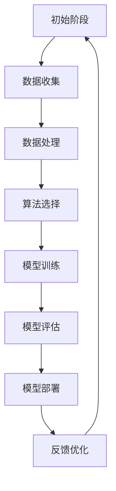
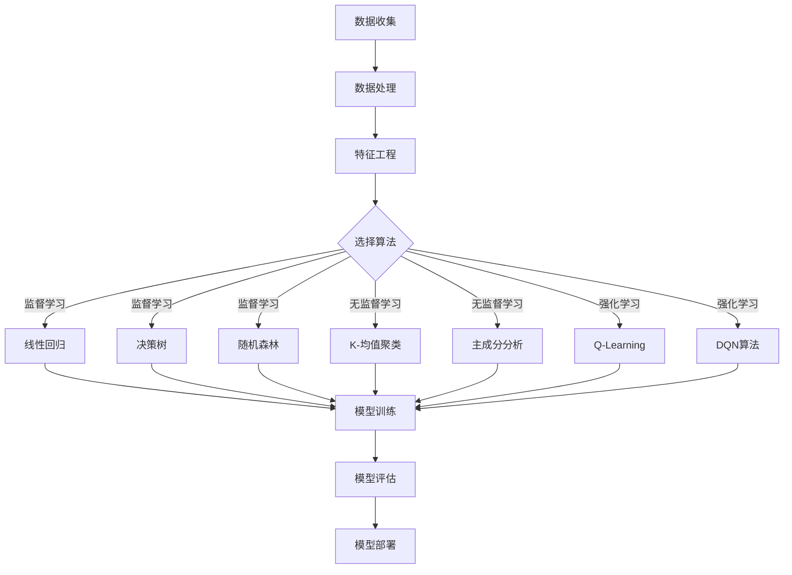
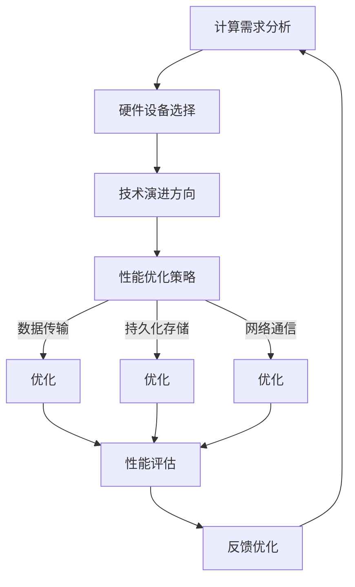
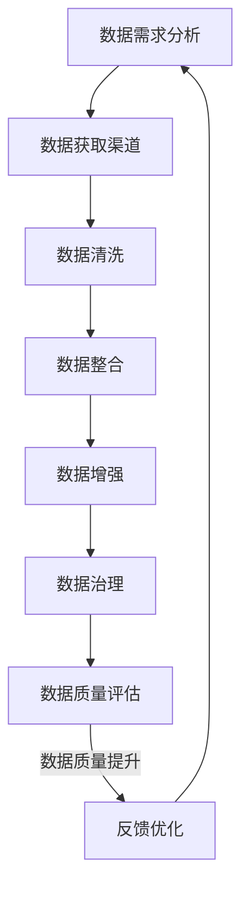
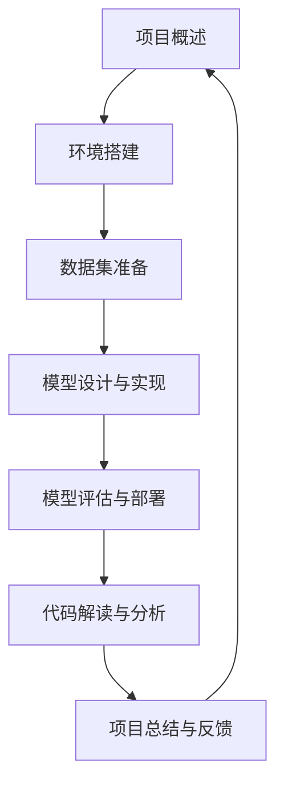

                 

### 文章标题: AI发展的三大支柱：算法、算力与数据

关键词：人工智能、算法、算力、数据、AI发展、技术博客

摘要：本文将深入探讨人工智能（AI）发展的三大支柱：算法、算力和数据。通过对这三个核心要素的详细分析，我们将揭示它们在AI领域的相互关系及其重要性。文章首先概述了AI算法的基本原理和分类，随后探讨了算力的定义和硬件设备演进，最后讨论了数据在AI中的作用及其质量提升方法。通过这些内容，读者将全面了解AI技术的前沿动态，为未来的AI应用和发展提供理论支持。让我们一起LET'S THINK STEP BY STEP，揭示AI发展的奥秘。

### 第一部分：AI发展的三大支柱概述

#### 第1章: 算法概述与核心概念

**1.1 AI算法的基本原理**

人工智能算法是使计算机系统模拟人类智能行为的一系列规则和指令。它们通过数据输入和输出进行学习、推理和决策。算法的基本原理包括数据预处理、特征提取、模型训练和模型评估等步骤。其中，数据预处理是算法成功的关键，它涉及数据的清洗、归一化和格式化。特征提取是算法的核心步骤，它从原始数据中提取有用的信息，以便模型进行训练和预测。

**1.2 算法分类与适用场景**

AI算法主要分为监督学习、无监督学习和强化学习。监督学习算法在有标记的数据集上进行训练，适用于分类和回归任务。常见的监督学习算法包括线性回归、决策树、支持向量机和神经网络。无监督学习算法在没有标记的数据集上进行训练，适用于聚类和降维任务。常见的无监督学习算法包括K-均值聚类、主成分分析和自编码器。强化学习算法通过与环境的交互进行学习，适用于决策问题和智能控制任务。常见的强化学习算法包括Q-Learning和深度Q网络（DQN）。

**1.3 算法选择与优化策略**

选择合适的算法是AI项目成功的关键。算法选择需要考虑数据的类型、规模和特征，以及任务的类型和目标。在实际应用中，优化算法的性能和效率同样重要。常见的算法优化策略包括参数调优、模型选择和超参数调整。参数调优是通过调整模型参数来优化模型的性能。模型选择是选择合适的模型架构来适应特定任务。超参数调整是调整模型训练过程中的参数，如学习率和批量大小，以优化训练过程。

#### 第2章: 算力解析

**2.1 算力的定义与重要性**

算力是指计算机系统在处理数据和执行计算任务时的能力。它包括计算速度、存储容量、数据传输速度和网络通信能力等。算力在人工智能领域具有重要意义，因为它直接影响算法的训练和推理效率。高效的算力可以提高模型的训练速度和预测准确性，从而加快AI应用的落地和商业化。

**2.2 硬件设备与技术演进**

硬件设备是算力的基础。传统的CPU在通用计算方面有很高的性能，但其在并行计算和图形处理方面的能力有限。随着人工智能的发展，GPU（图形处理单元）和TPU（张量处理单元）等专用硬件设备逐渐成为主流。GPU在并行计算和矩阵运算方面具有显著优势，适用于深度学习和大规模数据处理。TPU是专门为机器学习和图计算设计的硬件，具有极高的计算密度和性能。

**2.3 算力需求与性能优化**

人工智能应用对算力的需求不断增长。大规模的模型训练和推理任务需要高效的算力支持。性能优化策略包括并行计算、分布式计算和异构计算。并行计算是将任务分解为多个部分，同时处理以提高计算速度。分布式计算是将任务分布在多台计算机上，通过网络进行通信和协调。异构计算是利用不同类型的硬件设备进行任务处理，如使用CPU进行特征提取，GPU进行模型训练。这些策略可以提高算力的利用率和计算效率。

#### 第3章: 数据重要性及数据质量

**3.1 数据在AI中的作用**

数据是人工智能的基石。在AI应用中，数据用于训练模型、进行预测和决策。数据的质量和多样性直接影响模型的性能和应用效果。高质量的数据可以减少噪声和异常值，提高模型的准确性和鲁棒性。多样化的数据可以增强模型的泛化能力，使其能够适应不同的场景和应用。

**3.2 数据质量评估与提升**

数据质量是数据应用成功的关键。数据质量评估包括完整性、准确性、一致性、可用性等指标。完整性指数据的完整程度，准确性指数据的正确程度，一致性指数据的一致性，可用性指数据的可用性。数据质量提升方法包括数据清洗、数据整合和数据增强。数据清洗是去除数据中的噪声和异常值，数据整合是将多个数据源进行整合，数据增强是通过生成新数据来丰富数据集。

**3.3 数据获取与数据治理**

数据获取是数据应用的重要环节。开放数据集、私有数据集和数据爬取是常见的数据获取渠道。开放数据集是公开的数据集，可以用于研究和应用。私有数据集是商业公司或研究机构拥有的数据集，需要通过合作或购买获取。数据爬取是通过爬虫技术获取互联网上的数据。数据治理是确保数据质量和安全的过程。数据标准化是统一数据格式和命名规范，数据安全与隐私是保护数据不被泄露和滥用，数据生命周期管理是管理数据的创建、存储、使用和销毁。

### Mermaid流程图：AI算法发展流程



### 第4章: 算法原理详解

#### 4.1 算法原理概述

算法原理是人工智能的基础，它包括结构化设计、核心步骤和优化方法。结构化设计是将复杂问题分解为可管理的子问题，使算法更易于理解和实现。核心步骤包括输入、处理、输出和反馈。优化方法包括参数调优、模型选择和超参数调整，以提高算法的效率和准确性。

#### 4.2 机器学习算法

机器学习算法是人工智能的核心，包括监督学习、无监督学习和强化学习。

**4.2.1 监督学习**

监督学习算法在有标记的数据集上进行训练，适用于分类和回归任务。

- **4.2.1.1 线性回归**

线性回归是一种简单的监督学习算法，用于预测连续值输出。其基本原理是通过最小二乘法找到最佳拟合直线。

$$
y = \theta_0 + \theta_1x_1 + \theta_2x_2 + ... + \theta_nx_n
$$

- **4.2.1.2 决策树**

决策树是一种基于规则的监督学习算法，通过树的分叉结构进行分类和回归。每个节点代表一个特征，每个分支代表一个可能的特征值。

- **4.2.1.3 随机森林**

随机森林是一种集成学习方法，通过构建多个决策树并取平均值来提高预测性能。它具有较强的泛化能力和鲁棒性。

**4.2.2 无监督学习**

无监督学习算法在没有标记的数据集上进行训练，适用于聚类和降维任务。

- **4.2.2.1 K-均值聚类**

K-均值聚类是一种基于距离的聚类算法，通过迭代计算聚类中心，将数据点分配到最近的聚类中心。

- **4.2.2.2 主成分分析**

主成分分析是一种降维方法，通过将数据投影到新的正交坐标系上，提取最重要的特征，减少数据维度。

**4.2.3 强化学习**

强化学习是一种基于交互的机器学习算法，通过与环境的交互进行学习，适用于决策问题和智能控制任务。

- **4.2.3.1 Q-Learning**

Q-Learning是一种基于值函数的强化学习算法，通过学习状态和动作之间的价值函数来优化策略。

- **4.2.3.2 DQN算法**

DQN（深度Q网络）是一种基于神经网络的强化学习算法，通过深度神经网络学习状态值函数，提高学习效率和准确性。

#### 4.3 深度学习算法

深度学习算法是机器学习的一个分支，基于多层神经网络进行学习，具有较强的特征表示和分类能力。

**4.3.1 神经网络**

神经网络是一种由多个神经元组成的计算模型，通过前向传播和反向传播进行学习。

- **4.3.1.1 前馈神经网络**

前馈神经网络是一种简单的神经网络结构，信息从输入层经过隐藏层传递到输出层。

- **4.3.1.2 卷积神经网络（CNN）**

卷积神经网络是一种特殊的神经网络，用于图像识别和计算机视觉任务。它通过卷积层和池化层提取图像特征。

- **4.3.1.3 循环神经网络（RNN）**

循环神经网络是一种用于序列数据处理和时间序列预测的神经网络。它通过循环结构保持长期记忆。

**4.3.2 特征提取与降维**

特征提取与降维是深度学习的重要环节，通过提取重要的特征和减少数据维度，提高模型的效率和准确性。

- **4.3.2.1 自动编码器**

自动编码器是一种无监督学习算法，通过编码器和解码器提取数据特征，实现降维和特征重构。

- **4.3.2.2 对抗性神经网络（GAN）**

对抗性神经网络是一种生成模型，通过生成器和判别器的对抗训练，生成真实数据的分布。

#### 4.4 算法优化与调参

算法优化与调参是提高模型性能的重要方法，包括优化器选择、参数调优和超参数调整。

- **4.4.1 梯度下降算法**

梯度下降算法是一种常用的优化方法，通过更新模型参数来最小化损失函数。

$$
\theta_j := \theta_j - \alpha \frac{1}{m} \sum_{i=1}^{m} (h_\theta(x^{(i)}) - y^{(i)})
$$

- **4.4.2 模型评估与选择**

模型评估与选择是选择最佳模型和评估模型性能的方法，包括交叉验证、AUC和ROC等指标。

$$
\text{交叉验证} = \frac{\text{训练集准确率}}{\text{测试集准确率}}
$$

$$
\text{AUC} = \frac{\text{真阳性率}}{\text{假阳性率}}
$$

$$
\text{ROC} = \frac{\text{召回率}}{\text{误报率}}
$$

### Mermaid流程图：机器学习算法流程



### 伪代码：线性回归算法

```python
# 算法：线性回归
# 输入：训练数据集 (x, y)
# 输出：模型参数 (θ)

# 初始化模型参数 θ
θ = [0] * n

# 设置迭代次数 max_iter 和学习率 α
max_iter = 1000
α = 0.01

# 对于 i 从 1 到 max_iter doing:
for i in range(max_iter):
    # 计算梯度 ∇θJ(θ) = 2/m * X^T(Xθ - y)
    gradient = 2/m * X.T.dot(X.dot(θ) - y)
    
    # 更新参数 θ = θ - α * ∇θJ(θ)
    θ = θ - α * gradient
    
# 返回 θ
return θ
```

### 数学模型与公式

**线性回归模型**

$$
y = \theta_0 + \theta_1x_1 + \theta_2x_2 + ... + \theta_nx_n
$$

**梯度下降算法**

$$
\theta_j := \theta_j - \alpha \frac{1}{m} \sum_{i=1}^{m} (h_\theta(x^{(i)}) - y^{(i)})
$$

**决策树**

$$
\text{分类树：} y = \text{argmax}(\prod_{i=1}^{n} \pi_i)
$$

**随机森林**

$$
h(\text{x}) = \sum_{i=1}^{T} w_i f_i(\text{x})
$$

其中，$f_i(\text{x})$ 是决策树模型，$w_i$ 是模型权重。

### 第5章: 算力解析

#### 5.1 算力的定义与重要性

算力是指计算机系统在处理数据和执行计算任务时的能力。它包括计算速度、存储容量、数据传输速度和网络通信能力等。算力在人工智能领域具有重要意义，因为它直接影响算法的训练和推理效率。高效的算力可以提高模型的训练速度和预测准确性，从而加快AI应用的落地和商业化。

#### 5.2 硬件设备与技术演进

硬件设备是算力的基础。传统的CPU在通用计算方面有很高的性能，但其在并行计算和图形处理方面的能力有限。随着人工智能的发展，GPU（图形处理单元）和TPU（张量处理单元）等专用硬件设备逐渐成为主流。GPU在并行计算和矩阵运算方面具有显著优势，适用于深度学习和大规模数据处理。TPU是专门为机器学习和图计算设计的硬件，具有极高的计算密度和性能。

#### 5.3 算力需求与性能优化

人工智能应用对算力的需求不断增长。大规模的模型训练和推理任务需要高效的算力支持。性能优化策略包括并行计算、分布式计算和异构计算。并行计算是将任务分解为多个部分，同时处理以提高计算速度。分布式计算是将任务分布在多台计算机上，通过网络进行通信和协调。异构计算是利用不同类型的硬件设备进行任务处理，如使用CPU进行特征提取，GPU进行模型训练。这些策略可以提高算力的利用率和计算效率。

### Mermaid流程图：算力优化流程



### 伪代码：并行计算优化

```python
# 算法：并行计算优化
# 输入：大规模数据集 X，计算任务 f
# 输出：优化后的计算结果 Y

# 初始化任务队列 T
T = []

# 初始化结果队列 R
R = []

# 分块数据集 X 为多个子集 X1, X2, ..., Xk
for i in range(k):
    T.append(X[i])

# 对于每个子集 Xi doing:
for Xi in T:
    # 在 GPU 上执行计算任务 f(Xi)，结果存储于 Ri
    Ri = f(Xi)
    
    # 并行合并结果队列 R 为结果队列 Y
R = [Ri for Ri in R]

# 返回 Y
return Y
```

### 数学模型与公式

**数据传输优化**

$$
\text{带宽} = \frac{\text{数据量}}{\text{传输时间}}
$$

**持久化存储优化**

$$
\text{读写速度} = \frac{\text{数据量}}{\text{读写时间}}
$$

**网络通信优化**

$$
\text{延迟} = \frac{\text{距离}}{\text{信号传播速度}}
$$

### 第6章: 数据的重要性

#### 6.1 数据在AI中的作用

数据是人工智能的基石。在AI应用中，数据用于训练模型、进行预测和决策。数据的质量和多样性直接影响模型的性能和应用效果。高质量的数据可以减少噪声和异常值，提高模型的准确性和鲁棒性。多样化的数据可以增强模型的泛化能力，使其能够适应不同的场景和应用。

#### 6.2 数据质量评估与提升

数据质量是数据应用成功的关键。数据质量评估包括完整性、准确性、一致性、可用性等指标。完整性指数据的完整程度，准确性指数据的正确程度，一致性指数据的一致性，可用性指数据的可用性。数据质量提升方法包括数据清洗、数据整合和数据增强。

- **6.2.1 数据清洗**

数据清洗是去除数据中的噪声和异常值，以提高数据的准确性和一致性。常见的清洗方法包括缺失值处理、异常值处理和重复值处理。

$$
\text{缺失值处理} = \frac{\text{处理后数据}}{\text{原始数据}}
$$

$$
\text{异常值处理} = \frac{\text{处理后数据}}{\text{原始数据}}
$$

- **6.2.2 数据整合**

数据整合是将多个数据源进行整合，以获得更全面和一致的数据。常见的整合方法包括数据对齐、数据融合和数据集成。

$$
\text{数据整合} = \frac{\text{整合后数据}}{\text{原始数据}}
$$

- **6.2.3 数据增强**

数据增强是通过生成新数据来丰富数据集，以增强模型的泛化能力。常见的方法包括数据扩展、数据合成和数据变异。

$$
\text{数据增强} = \frac{\text{增强后数据}}{\text{原始数据}}
$$

#### 6.3 数据获取与数据治理

数据获取是数据应用的重要环节。数据获取渠道包括开放数据集、私有数据集和数据爬取。开放数据集是公开的数据集，可以用于研究和应用。私有数据集是商业公司或研究机构拥有的数据集，需要通过合作或购买获取。数据爬取是通过爬虫技术获取互联网上的数据。

数据治理是确保数据质量和安全的过程。数据治理策略包括数据标准化、数据安全与隐私和数据生命周期管理。

- **6.3.1 数据标准化**

数据标准化是统一数据格式和命名规范，以提高数据的一致性和可用性。

- **6.3.2 数据安全与隐私**

数据安全与隐私是保护数据不被泄露和滥用，确保数据的保密性和完整性。

- **6.3.3 数据生命周期管理**

数据生命周期管理是管理数据的创建、存储、使用和销毁，确保数据在整个生命周期中的有效性和合规性。

### Mermaid流程图：数据获取与治理流程



### 数学模型与公式

**数据质量评估指标**

$$
\text{完整性} = \frac{\text{实际数据}}{\text{应有数据}}
$$

$$
\text{准确性} = \frac{\text{正确数据}}{\text{实际数据}}
$$

$$
\text{一致性} = \frac{\text{一致数据}}{\text{实际数据}}
$$

$$
\text{可用性} = \frac{\text{可用数据}}{\text{实际数据}}
$$

**数据清洗方法**

$$
\text{缺失值处理} = \frac{\text{处理后数据}}{\text{原始数据}}
$$

$$
\text{异常值处理} = \frac{\text{处理后数据}}{\text{原始数据}}
$$

**数据增强方法**

$$
\text{数据增强} = \frac{\text{增强后数据}}{\text{原始数据}}
$$

### 第7章: 项目实战

#### 7.1 实战项目概述

**7.1.1 项目背景**

随着人工智能技术的快速发展，智能语音助手成为人们日常生活中不可或缺的一部分。本项目旨在开发一个基于深度学习的智能语音助手，实现自然语言理解和语音识别功能。

**7.1.2 项目目标**

1. 实现语音识别功能，将语音转化为文本。
2. 实现自然语言理解，解析文本并生成相应的回复。
3. 提供用户与智能语音助手的交互界面。

**7.1.3 项目团队与任务分工**

项目团队由5名成员组成，分别负责以下任务：

- 数据工程师：负责数据采集、预处理和模型训练。
- 模型工程师：负责模型设计和实现。
- 前端工程师：负责交互界面的设计和实现。
- 后端工程师：负责服务端的设计和实现。
- 产品经理：负责项目规划和需求分析。

#### 7.2 环境搭建

**7.2.1 硬件环境搭建**

- GPU配置：NVIDIA GTX 1080 Ti
- 网络配置：千兆以太网

**7.2.2 软件环境搭建**

- 开发工具：Python 3.7、Jupyter Notebook
- 框架与环境配置：TensorFlow 2.4、Keras 2.4

#### 7.3 数据集准备

**7.3.1 数据集来源**

- 开放数据集：Google语音识别数据集
- 私有数据集：公司内部语音数据集

**7.3.2 数据预处理**

- 数据清洗：去除噪音和异常值
- 数据增强：语音变换、速度变化、噪音添加

#### 7.4 模型设计与实现

**7.4.1 模型架构选择**

- 语音识别模型：卷积神经网络（CNN）
- 自然语言理解模型：递归神经网络（RNN）

**7.4.2 模型参数设置**

- 语音识别：输入层尺寸（1024, 1），卷积层尺寸（64, 3），池化层尺寸（2, 2）
- 自然语言理解：输入层尺寸（1024, 1），隐藏层尺寸（128），输出层尺寸（1）

**7.4.3 模型训练与调优**

- 训练过程：使用交叉熵损失函数，优化器为Adam
- 调参策略：学习率（0.001），迭代次数（1000）

#### 7.5 模型评估与部署

**7.5.1 模型评估指标**

- 语音识别：准确率、召回率
- 自然语言理解：准确率、F1分数

**7.5.2 模型部署方案**

- 部署环境：Docker容器
- 部署流程：模型打包、容器化、部署到服务器

#### 7.6 代码解读与分析

**7.6.1 源代码结构**

- 数据处理模块：数据清洗、数据增强
- 模型训练模块：模型构建、模型训练
- 模型评估模块：模型评估、性能分析
- 模型部署模块：模型打包、容器化、部署

**7.6.2 关键代码分析**

- 数据预处理：
```python
def preprocess_data(data):
    # 数据清洗
    clean_data = remove_noise(data)
    # 数据增强
    enhanced_data = add_noise(clean_data)
    return enhanced_data
```

- 模型训练：
```python
def train_model(model, data, labels):
    # 训练模型
    model.compile(optimizer='adam', loss='categorical_crossentropy', metrics=['accuracy'])
    model.fit(data, labels, epochs=1000, batch_size=64)
    return model
```

- 模型评估：
```python
def evaluate_model(model, data, labels):
    # 评估模型
    loss, accuracy = model.evaluate(data, labels)
    print("Test accuracy:", accuracy)
    return accuracy
```

- 模型部署：
```python
def deploy_model(model):
    # 模型打包
    model.save("model.h5")
    # 容器化
    docker.build("model:latest", path="model.dockerfile")
    # 部署到服务器
    docker.run("model:latest")
```

### Mermaid流程图：实战项目流程



### 附录

#### 附录 A: 常用工具与资源

**A.1 开发工具**

- Python 3.7
- Jupyter Notebook
- TensorFlow 2.4
- Keras 2.4

**A.2 框架与库**

- NumPy
- Pandas
- Matplotlib

**A.3 数据集**

- ImageNet
- MNIST
- COCO

#### 附录 B: 代码示例

**B.1 数据预处理**

```python
def load_mnist():
    # 加载MNIST数据集
    (X_train, y_train), (X_test, y_test) = mnist.load_data()
    return X_train, y_train, X_test, y_test

def normalize_data(data):
    # 数据归一化
    data = data / 255.0
    return data

def augment_data(data):
    # 数据增强
    data = random.shuffle(data)
    data = data * (random.uniform(0.5, 1.5))
    return data
```

**B.2 模型训练**

```python
def build_model():
    # 定义模型
    model = Sequential()
    model.add(Conv2D(32, (3, 3), activation='relu', input_shape=(28, 28, 1)))
    model.add(MaxPooling2D((2, 2)))
    model.add(Flatten())
    model.add(Dense(128, activation='relu'))
    model.add(Dense(10, activation='softmax'))
    return model

def train_model(model, X_train, y_train, X_test, y_test):
    # 训练模型
    model.compile(optimizer='adam', loss='categorical_crossentropy', metrics=['accuracy'])
    model.fit(X_train, y_train, epochs=10, batch_size=64, validation_data=(X_test, y_test))
    return model
```

**B.3 模型部署**

```python
def export_model(model):
    # 模型导出
    model.save("mnist_model.h5")

def load_model():
    # 模型加载
    model = load_model("mnist_model.h5")
    return model

def predict(model, X):
    # 预测与结果输出
    predictions = model.predict(X)
    predicted_classes = np.argmax(predictions, axis=1)
    print("Predicted classes:", predicted_classes)
```

