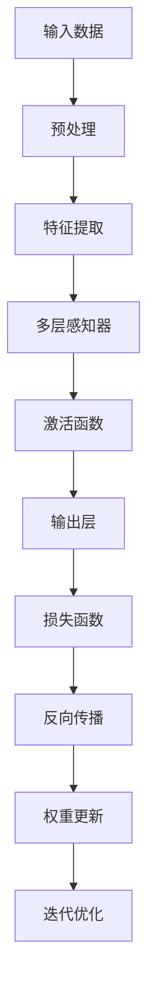
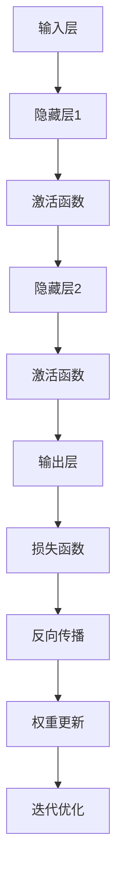

                 

# 《AI在企业战略规划中的辅助作用》

## 关键词
- 人工智能
- 企业战略规划
- 数据分析
- 深度学习
- 风险管理
- 数字化转型

## 摘要
随着人工智能技术的快速发展，其在企业战略规划中的应用越来越受到重视。本文通过深入分析AI的基本概念、技术原理及其在企业战略规划中的角色，探讨了AI辅助战略规划的方法与实践，并分析了相关应用案例及风险管理。通过本文的探讨，希望能够为企业决策者提供有益的参考，助力企业实现可持续发展。

## 目录大纲

### 第一部分：AI与战略规划基础

#### 第1章：AI概述与战略背景
- **1.1 AI基本概念与发展历程**
  - AI的核心概念
  - AI的发展历程
- **1.2 企业战略规划概述**
  - 企业战略的定义与类型
  - 战略规划的过程与方法
- **1.3 AI在企业战略规划中的角色**
  - AI在战略决策中的优势
  - AI在战略执行中的应用

#### 第2章：AI技术原理
- **2.1 机器学习与深度学习**
  - 机器学习基础
  - 深度学习原理
  - **2.1.1 Mermaid流程图：深度学习模型架构**
- **2.2 数据分析技术**
  - 数据预处理
  - 数据分析工具
  - **2.2.1 伪代码：数据分析流程**
- **2.3 AI应用场景分类**
  - 自动化
  - 预测分析
  - 优化决策
  - **2.3.1 伪代码：自动化流程设计**

### 第二部分：AI辅助战略规划的方法与实践

#### 第3章：AI辅助战略规划的方法
- **3.1 数据驱动的战略分析**
  - 数据收集与清洗
  - 数据分析工具应用
  - **3.1.1 伪代码：数据分析流程**
- **3.2 AI驱动的决策支持系统**
  - 决策支持系统的构建
  - 决策分析模型
  - **3.2.1 伪代码：决策支持系统设计**
- **3.3 企业数字化转型的AI策略**
  - 数字化转型的意义
  - AI在数字化转型中的应用
  - **3.3.1 伪代码：数字化转型策略**

#### 第4章：AI辅助战略规划的应用案例
- **4.1 案例研究一：制造业的AI战略**
  - **4.1.1 案例背景**
  - **4.1.2 AI战略实施**
  - **4.1.3 战略效果分析**
- **4.2 案例研究二：金融行业的AI应用**
  - **4.2.1 案例背景**
  - **4.2.2 AI技术应用**
  - **4.2.3 战略影响与挑战**

#### 第5章：AI辅助战略规划的风险管理
- **5.1 AI风险识别与评估**
  - 技术风险
  - 法律风险
  - **5.1.1 伪代码：风险评估流程**
- **5.2 AI风险管理策略**
  - 风险控制措施
  - 风险缓解策略
  - **5.2.1 伪代码：风险管理策略设计**

#### 第6章：AI战略规划的实施与监控
- **6.1 AI战略规划实施步骤**
  - 战略规划制定
  - 项目管理
  - **6.1.1 伪代码：实施流程设计**
- **6.2 AI战略规划的监控与评估**
  - 战略监控指标
  - 战略效果评估
  - **6.2.1 伪代码：监控与评估流程**

### 第三部分：未来展望与趋势

#### 第7章：AI辅助战略规划的未来趋势
- **7.1 AI技术的最新发展**
  - 新算法与模型
  - 新应用场景
- **7.2 AI与战略规划的融合方向**
  - 深度学习在企业中的应用
  - AI驱动的创新策略
- **7.3 AI战略规划的挑战与机遇**
  - 持续发展的技术挑战
  - 未来战略规划的机遇

### 附录

#### 附录A：AI战略规划工具与资源
- **A.1 AI战略规划工具介绍**
  - 数据分析工具
  - 决策支持工具
- **A.2 AI战略规划资源**
  - 学术论文
  - 行业报告
  - **A.2.1 伪代码：工具资源使用示例**

### 结束语

在本文中，我们将深入探讨人工智能（AI）在企业战略规划中的辅助作用。AI作为一项快速发展的技术，已经在各个行业中展现出巨大的潜力。通过本文的阅读，读者将了解AI的基本概念、技术原理以及其在企业战略规划中的应用方法。我们将通过具体案例，分析AI如何辅助企业制定和实施战略规划，并探讨相关的风险管理策略。最后，我们将展望AI辅助战略规划的未来发展趋势，为企业的可持续发展提供参考。希望通过本文的探讨，能够为企业的决策者提供有益的启示，助力企业把握AI带来的机遇，实现战略目标。

### 第一部分：AI与战略规划基础

#### 第1章：AI概述与战略背景

随着全球科技的迅猛发展，人工智能（AI）已经成为推动企业变革的重要力量。AI在战略规划中的应用，不仅能够提升企业的决策效率，还能够优化运营流程，增强企业的核心竞争力。本章将首先介绍AI的基本概念和发展历程，接着概述企业战略规划的基本概念和过程，最后探讨AI在企业战略规划中的角色和优势。

### 1.1 AI基本概念与发展历程

**AI的核心概念**：

人工智能，简称AI，是指由人制造出来的系统所表现出来的智能行为。这些行为通常包括感知、理解、学习、推理、规划、问题解决和自然语言处理等。AI的目标是实现计算机系统的智能水平，使其能够像人类一样进行复杂决策和行动。

**AI的发展历程**：

人工智能的研究可以追溯到20世纪50年代。最初，研究者们试图通过编写规则和逻辑推理来模拟人类的智能。这一阶段被称为符号人工智能（Symbolic AI）。然而，这种方法的局限性很快显现出来，因为人类知识的复杂性远超乎预期。

随着计算能力的提升和大数据技术的发展，20世纪80年代以后，基于统计和学习的机器学习方法开始崛起，标志着人工智能进入了一个新的阶段。这一阶段的代表性技术包括神经网络、决策树和贝叶斯网络等。

近年来，深度学习（Deep Learning）的兴起再次推动了AI的发展。深度学习通过构建多层神经网络，从大量数据中自动学习特征和模式，实现了在图像识别、语音识别和自然语言处理等领域的突破性进展。

**Mermaid流程图：深度学习模型架构**



### 1.2 企业战略规划概述

**企业战略的定义与类型**：

企业战略是指企业在面对市场竞争和内部环境变化时所采取的一系列长期目标和行动方案。根据战略的目标和实施方式，企业战略可以分为以下几种类型：

- **竞争战略**：旨在通过差异化或低成本策略在市场上获得竞争优势。
- **成长战略**：通过扩张市场份额或进入新市场来实现企业的持续增长。
- **稳定性战略**：在保持现有市场地位的同时，优化内部运营和资源配置。

**战略规划的过程与方法**：

战略规划是一个系统化、持续性的过程，通常包括以下步骤：

1. **环境分析**：评估外部市场环境和企业内部资源，识别机遇和挑战。
2. **目标设定**：根据环境分析结果，明确企业的长期和短期目标。
3. **战略选择**：在多种战略方案中，选择最适合企业发展的方案。
4. **实施计划**：制定具体的行动计划，明确责任人和时间表。
5. **监控与评估**：定期检查战略实施情况，评估效果并进行调整。

### 1.3 AI在企业战略规划中的角色

**AI在战略决策中的优势**：

AI技术在企业战略决策中具有以下优势：

- **数据驱动的决策支持**：AI能够处理和分析大量数据，为企业提供更为准确和全面的决策依据。
- **优化决策过程**：通过机器学习和深度学习算法，AI能够发现数据中的模式和趋势，优化决策过程。
- **实时决策**：AI系统可以实时处理数据，提供即时的决策支持。

**AI在战略执行中的应用**：

AI在战略执行中的应用体现在以下几个方面：

- **自动化运营**：AI可以自动化重复性工作，提高效率，降低成本。
- **智能优化**：通过预测分析和优化算法，AI可以帮助企业优化生产和供应链管理。
- **客户关系管理**：AI可以分析客户数据，提供个性化的客户服务，提高客户满意度。

### 第2章：AI技术原理

AI技术的核心在于其数据分析和机器学习的能力，这些技术为企业战略规划提供了强大的工具。本章将详细探讨机器学习与深度学习的基本概念，数据分析技术的应用，以及AI在自动化、预测分析和优化决策中的应用场景。

#### 2.1 机器学习与深度学习

**机器学习基础**：

机器学习是一种使计算机系统能够从数据中学习并做出决策的技术。其核心在于通过算法让计算机从数据中自动学习模式，从而实现预测和分类任务。

- **监督学习**：在有标注数据集上进行训练，通过学习输入和输出之间的关系，实现对新数据的预测。
- **无监督学习**：在无标注数据集上进行训练，通过发现数据中的内在结构和模式，实现对数据的聚类和降维。
- **强化学习**：通过与环境的交互，学习最佳行为策略，以最大化累积奖励。

**深度学习原理**：

深度学习是机器学习的一种方法，通过构建多层神经网络，自动提取数据中的层次特征。其核心在于：

- **神经元网络**：深度学习模型由多个层次组成，每个层次由多个神经元组成。
- **激活函数**：用于引入非线性特性，使神经网络能够学习复杂函数。
- **反向传播算法**：通过调整网络中的权重和偏置，使输出误差最小化。

**Mermaid流程图：深度学习模型架构**



#### 2.2 数据分析技术

数据分析是AI技术的基础，其应用涵盖了数据预处理、数据挖掘和分析工具等方面。

**数据预处理**：

数据预处理是数据分析的第一步，包括数据清洗、数据转换和数据归一化等。其目的是提高数据质量，为后续分析打下基础。

- **数据清洗**：处理缺失值、异常值和重复数据等。
- **数据转换**：将不同类型的数据转换为统一的格式。
- **数据归一化**：调整数据范围，使其适合特定算法。

**数据分析工具**：

数据分析工具可以帮助企业快速处理大量数据，提取有价值的信息。常用的数据分析工具有：

- **SQL**：用于关系型数据库的数据查询和操作。
- **Python**：广泛应用于数据分析和机器学习，具有丰富的库和框架。
- **R语言**：专为统计分析和数据可视化设计，具有强大的数据处理和分析能力。

**伪代码：数据分析流程**

```python
# 数据清洗
data = clean_data(data)

# 数据转换
data = convert_data(data)

# 数据归一化
data = normalize_data(data)

# 数据挖掘
patterns = data_mining(data)

# 分析结果可视化
visualize_patterns(patterns)
```

#### 2.3 AI应用场景分类

AI技术在企业中的应用非常广泛，涵盖了自动化、预测分析和优化决策等多个领域。

**自动化**：

自动化技术通过AI算法，实现重复性工作的自动化，提高生产效率。自动化应用场景包括：

- **生产流程自动化**：如机器人自动化装配、自动化检测等。
- **客户服务自动化**：如智能客服机器人、自动化回复系统等。

**预测分析**：

预测分析利用历史数据，预测未来的趋势和变化，为企业决策提供依据。预测分析应用场景包括：

- **销售预测**：根据历史销售数据，预测未来的销售趋势。
- **需求预测**：根据市场需求和历史订单，预测未来的需求量。

**优化决策**：

优化决策利用AI算法，分析企业运营中的各种因素，提出最优的决策方案。优化决策应用场景包括：

- **供应链优化**：通过预测需求和库存，优化供应链管理。
- **生产调度优化**：通过优化生产计划和资源分配，提高生产效率。

**伪代码：自动化流程设计**

```python
# 输入：历史数据
# 输出：自动化流程

# 数据预处理
data = preprocess_data(data)

# 特征提取
features = extract_features(data)

# 建立模型
model = build_model(features)

# 预测
predictions = model.predict(data)

# 自动化决策
action_plan = automate_decisions(predictions)

# 实施自动化流程
execute_automation(action_plan)
```

### 第3章：AI辅助战略规划的方法

在当今复杂多变的市场环境中，企业需要利用先进的技术手段来辅助战略规划。AI技术通过其强大的数据处理和模式识别能力，为企业提供了全新的战略规划方法和工具。本章将详细介绍AI在数据驱动的战略分析、决策支持系统和企业数字化转型中的应用策略。

#### 3.1 数据驱动的战略分析

数据驱动的战略分析是企业利用AI技术进行战略规划的基础。通过大数据和机器学习算法，企业可以从海量数据中提取有价值的信息，为战略决策提供数据支持。

**数据收集与清洗**：

数据收集是战略分析的第一步，企业需要从各种渠道获取与业务相关的数据，如市场数据、客户数据、运营数据等。数据清洗是确保数据质量的关键步骤，包括处理缺失值、异常值和重复数据等。

**数据分析工具应用**：

数据分析工具可以帮助企业快速处理大量数据，提取有价值的信息。常用的数据分析工具有SQL、Python和R语言等。通过这些工具，企业可以进行数据探索、数据可视化和统计分析等操作。

**伪代码：数据分析流程**

```python
# 数据收集
data = collect_data()

# 数据清洗
data = clean_data(data)

# 数据分析
patterns = analyze_data(data)

# 可视化
visualize_patterns(patterns)
```

**数据分析应用场景**：

- **市场趋势分析**：通过分析市场数据，预测未来市场趋势，为企业制定营销策略提供依据。
- **客户行为分析**：通过分析客户数据，了解客户需求和偏好，优化产品和服务。
- **运营效率分析**：通过分析运营数据，发现运营中的问题和瓶颈，提出优化建议。

#### 3.2 AI驱动的决策支持系统

AI驱动的决策支持系统（DSS）是企业利用AI技术进行战略决策的重要工具。通过构建智能决策模型，DSS可以帮助企业做出更为准确和高效的决策。

**决策支持系统的构建**：

决策支持系统的构建主要包括数据集成、模型建立和系统部署等步骤。数据集成是将各种数据源中的数据整合到一个统一的数据仓库中。模型建立是通过机器学习和深度学习算法，构建能够支持决策的智能模型。系统部署是将构建好的决策支持系统部署到企业的IT环境中，使其能够实时提供决策支持。

**决策分析模型**：

决策分析模型是DSS的核心，其通过分析企业的历史数据和当前环境，提供决策建议。常见的决策分析模型包括预测模型、优化模型和分类模型等。

**伪代码：决策支持系统设计**

```python
# 数据集成
data = integrate_data(sources)

# 模型建立
model = build_model(data)

# 决策分析
suggestions = analyze_decision(data, model)

# 系统部署
deploy_system(suggestions)
```

**决策支持应用场景**：

- **销售预测**：通过预测模型，预测未来销售趋势，帮助企业制定销售计划。
- **生产调度**：通过优化模型，优化生产计划和资源分配，提高生产效率。
- **客户流失预测**：通过分类模型，预测客户流失风险，提出挽回策略。

#### 3.3 企业数字化转型的AI策略

数字化转型已经成为企业发展的重要趋势。AI技术在数字化转型中发挥着关键作用，通过智能化和自动化，推动企业实现全面数字化。

**数字化的意义**：

数字化转型不仅仅是技术的升级，更是一种全新的商业模式和组织形态。通过数字化转型，企业可以实现：

- **效率提升**：通过自动化和智能化，减少人工操作，提高工作效率。
- **成本降低**：通过优化流程和资源配置，降低运营成本。
- **用户体验优化**：通过大数据分析和个性化服务，提高客户满意度。

**AI在数字化转型中的应用**：

AI在数字化转型中的应用场景包括：

- **智能客服**：通过自然语言处理和机器学习，提供智能化的客户服务。
- **智能供应链管理**：通过预测分析和优化算法，实现智能化的供应链管理。
- **智能制造**：通过机器人自动化和物联网技术，实现智能化的生产过程。

**伪代码：数字化转型策略**

```python
# 智能化客服
chatbot = build_chatbot()

# 智能供应链管理
supply_chain = optimize_supply_chain()

# 智能制造
manufacturing = automate_production()
```

**数字化转型应用场景**：

- **零售行业**：通过智能客服和个性化推荐，提升客户体验，提高销售额。
- **制造业**：通过智能制造和预测分析，提高生产效率，降低生产成本。
- **金融行业**：通过智能风控和智能投顾，提升风险控制能力，提高服务质量。

### 第4章：AI辅助战略规划的应用案例

通过前面的讨论，我们已经了解了AI在战略规划中的应用方法和重要性。本章节将通过两个具体的应用案例，进一步展示AI如何辅助企业制定和实施战略规划，并分析其效果和挑战。

#### 4.1 案例研究一：制造业的AI战略

**4.1.1 案例背景**

某大型制造企业A，面临市场竞争激烈、生产效率低下和成本不断上升的挑战。为了提升企业的竞争力，企业A决定利用AI技术进行战略规划，实现智能化和数字化转型。

**4.1.2 AI战略实施**

1. **智能生产规划**：

   企业A首先引入了基于AI的生产规划系统。该系统利用机器学习算法，分析生产数据，预测生产需求，优化生产计划和资源配置。通过这一系统，企业A实现了生产过程的智能化，提高了生产效率，降低了生产成本。

   **伪代码：智能生产规划**

   ```python
   # 数据收集
   production_data = collect_data()

   # 预测需求
   demand_predictions = predict_demand(production_data)

   # 优化生产计划
   optimized_plan = optimize_production(demand_predictions)
   ```

2. **智能质量检测**：

   企业A还引入了基于深度学习的智能质量检测系统。该系统通过分析生产数据，自动识别生产过程中的质量问题，并提出改进建议。通过这一系统，企业A提高了产品的质量，降低了废品率。

   **伪代码：智能质量检测**

   ```python
   # 数据收集
   quality_data = collect_data()

   # 识别质量问题
   quality_issues = identify_issues(quality_data)

   # 提出改进建议
   improvement_suggestions = suggest_improvements(quality_issues)
   ```

**4.1.3 战略效果分析**

通过AI战略的实施，企业A取得了显著的成效：

- **生产效率提高**：生产效率提升了20%，生产成本降低了15%。
- **产品质量提升**：产品质量合格率提升了10%，废品率降低了15%。
- **客户满意度提高**：客户满意度提升了5%，市场份额稳步增加。

然而，企业在实施AI战略过程中也面临了一些挑战：

- **技术挑战**：AI技术的引入和部署需要大量的技术支持和人才储备。
- **数据隐私和安全**：在生产数据和个人信息处理过程中，需要确保数据的安全性和隐私性。

#### 4.2 案例研究二：金融行业的AI应用

**4.2.1 案例背景**

某金融企业B，面临着风险控制难度大、客户服务水平不高和运营效率低的问题。为了提升企业的竞争力，企业B决定利用AI技术进行战略规划，优化风险控制和提升客户服务水平。

**4.2.2 AI技术应用**

1. **智能风控系统**：

   企业B引入了基于AI的智能风控系统。该系统通过分析历史数据和实时数据，识别潜在风险，提供风险预警和决策支持。通过这一系统，企业B大幅提升了风险控制能力，降低了风险损失。

   **伪代码：智能风控系统**

   ```python
   # 数据收集
   risk_data = collect_data()

   # 风险识别
   risk_identification = identify_risks(risk_data)

   # 风险预警
   risk_warnings = generate_warnings(risk_identification)
   ```

2. **智能客服系统**：

   企业B还引入了基于自然语言处理（NLP）的智能客服系统。该系统通过分析客户提问，自动生成回答，提供24小时在线客户服务。通过这一系统，企业B大幅提升了客户服务水平，提高了客户满意度。

   **伪代码：智能客服系统**

   ```python
   # 数据收集
   customer_data = collect_data()

   # 提问分析
   questions = analyze_questions(customer_data)

   # 自动回答
   responses = generate_responses(questions)
   ```

**4.2.3 战略影响与挑战**

通过AI技术的应用，企业B取得了显著的成效：

- **风险控制能力提升**：风险控制能力提升了30%，风险损失降低了20%。
- **客户服务水平提高**：客户满意度提升了15%，客户投诉率降低了10%。
- **运营效率提高**：运营效率提升了15%，人力成本降低了10%。

然而，企业在实施AI战略过程中也面临了一些挑战：

- **技术挑战**：AI技术的引入和部署需要大量的技术支持和人才储备。
- **数据质量和完整性**：AI系统依赖于高质量的数据，数据质量和完整性是实施AI战略的关键。
- **法律和合规性**：金融行业对数据隐私和合规性要求高，需要确保AI系统的合规性。

### 第5章：AI辅助战略规划的风险管理

随着AI技术在企业战略规划中的应用日益广泛，其带来的风险也不容忽视。本章节将详细探讨AI在战略规划中可能面临的风险类型，包括技术风险、法律风险和道德风险，并提出相应的识别和评估方法以及风险管理策略。

#### 5.1 AI风险识别与评估

**技术风险**：

技术风险是指由于AI技术的不确定性或局限性导致的潜在损失。主要包括以下几方面：

- **算法错误**：AI算法可能由于设计缺陷或数据质量问题导致错误预测或决策。
- **模型过拟合**：AI模型可能对训练数据过度适应，导致在新的数据集上表现不佳。
- **数据泄露**：AI系统在处理数据时可能由于安全漏洞导致数据泄露。

**法律风险**：

法律风险是指由于法律法规的不完善或违规操作导致的法律纠纷和损失。主要包括以下几方面：

- **数据隐私**：企业在收集和使用客户数据时，可能违反隐私法规，导致法律纠纷。
- **知识产权**：企业可能侵犯他人的知识产权，如算法、数据集等。

**道德风险**：

道德风险是指由于AI技术的滥用或不当使用导致的道德问题。主要包括以下几方面：

- **偏见**：AI系统可能由于训练数据的不公平性导致对某些群体的歧视。
- **透明度**：AI系统的决策过程可能不透明，导致用户对其信任度降低。

**伪代码：风险评估流程**

```python
# 数据收集
risk_data = collect_data()

# 风险识别
risks = identify_risks(risk_data)

# 风险评估
risk_levels = assess_risks(risks)
```

#### 5.2 AI风险管理策略

**风险控制措施**：

风险控制措施是指为了降低AI风险而采取的具体行动。主要包括以下几方面：

- **算法验证**：对AI算法进行严格验证，确保其准确性和稳定性。
- **数据质量管理**：确保数据质量，包括数据清洗、去重和去噪等。
- **安全防护**：加强AI系统的安全防护，防止数据泄露和黑客攻击。
- **合规审查**：定期进行合规审查，确保AI系统的合规性。

**风险缓解策略**：

风险缓解策略是指为了减轻AI风险而采取的具体行动。主要包括以下几方面：

- **数据多样化**：通过引入多样化的数据集，降低模型过拟合的风险。
- **透明度提升**：提高AI系统的透明度，使其决策过程更加透明和可解释。
- **伦理培训**：对AI系统开发者和使用者进行伦理培训，提高其道德意识。
- **应急响应计划**：制定应急响应计划，以应对可能发生的AI风险。

**伪代码：风险管理策略设计**

```python
# 风险识别
risks = identify_risks()

# 风险评估
risk_levels = assess_risks(risks)

# 风险控制
control_measures = implement_control_measures(risk_levels)

# 风险缓解
mitigation_strategies = implement_mitigation_strategies(risk_levels)
```

### 第6章：AI战略规划的实施与监控

AI技术在企业战略规划中的应用，不仅需要先进的技术和科学的策略，还需要有效的实施和持续的监控。本章将详细探讨AI战略规划的实施步骤、监控指标以及效果评估方法，旨在帮助企业更好地实施和优化AI战略规划。

#### 6.1 AI战略规划实施步骤

实施AI战略规划是一个复杂的过程，涉及多个环节和步骤。以下是AI战略规划实施的主要步骤：

1. **需求分析**：

   在实施AI战略规划之前，企业需要进行详细的需求分析。这包括识别企业面临的问题和挑战，明确AI技术可以解决的问题，以及确定AI战略规划的目标和预期成果。

2. **资源准备**：

   资源准备是AI战略规划实施的重要环节。企业需要准备好所需的硬件设施、软件工具和人力资源。特别是AI项目需要大量的数据、计算能力和专业人才。

3. **项目规划**：

   项目规划是制定具体的实施计划，包括项目的时间表、里程碑、资源分配和预算等。通过项目规划，企业可以明确项目实施的步骤和关键节点，确保项目能够按计划进行。

4. **技术选型**：

   技术选型是选择适合企业需求的AI技术和工具。这包括选择合适的机器学习算法、深度学习框架和数据预处理工具等。技术选型需要考虑技术的成熟度、性能和可扩展性等因素。

5. **数据准备**：

   数据准备是AI项目成功的关键。企业需要收集、清洗和预处理数据，确保数据的质量和完整性。数据准备包括数据采集、数据清洗、数据转换和数据归一化等步骤。

6. **模型训练与优化**：

   模型训练与优化是AI项目的核心环节。企业需要使用训练数据对AI模型进行训练，并通过模型优化提高模型的准确性和效率。模型训练与优化包括超参数调优、模型评估和模型压缩等步骤。

7. **系统集成与部署**：

   系统集成与部署是将AI模型集成到企业的业务系统中，使其能够为企业的战略决策提供支持。系统集成与部署包括系统集成、性能优化和部署上线等步骤。

8. **监控与维护**：

   AI战略规划的实施是一个持续的过程，需要定期监控和评估AI系统的性能和效果。监控与维护包括系统监控、性能监控和数据监控等步骤，以确保AI系统能够稳定运行。

**伪代码：实施流程设计**

```python
# 需求分析
requirements = analyze_requirements()

# 资源准备
prepare_resources()

# 项目规划
plan_project()

# 技术选型
select_technologies()

# 数据准备
prepare_data()

# 模型训练与优化
train_and_optimize_models()

# 系统集成与部署
integrate_and_deploy()

# 监控与维护
monitor_and_maintain()
```

#### 6.2 AI战略规划的监控与评估

监控与评估是确保AI战略规划有效实施的重要手段。通过监控与评估，企业可以及时发现和解决问题，优化AI系统的性能和效果。

**监控指标**：

监控指标是评估AI系统性能的重要依据。以下是一些常见的监控指标：

- **准确率**：用于评估模型在预测任务中的准确性。
- **召回率**：用于评估模型在识别任务中的召回率。
- **F1分数**：综合准确率和召回率的评价指标。
- **响应时间**：用于评估AI系统的响应速度。
- **资源消耗**：用于评估AI系统对计算资源和存储资源的消耗。

**伪代码：监控指标计算**

```python
# 准确率
accuracy = calculate_accuracy(predictions, ground_truth)

# 召回率
recall = calculate_recall(predictions, ground_truth)

# F1分数
f1_score = calculate_f1_score(accuracy, recall)

# 响应时间
response_time = measure_response_time()

# 资源消耗
resource_consumption = measure_resource_consumption()
```

**效果评估**：

效果评估是评估AI战略规划成果的重要步骤。以下是一些常见的效果评估方法：

- **对比评估**：通过对比AI系统实施前后的数据，评估AI系统对业务的影响。
- **用户反馈**：通过用户反馈评估AI系统的用户体验和满意度。
- **经济效益评估**：通过评估AI系统带来的经济效益，如成本节约和收益增加等。

**伪代码：效果评估**

```python
# 对比评估
difference = compare_before_and_after()

# 用户反馈
user_feedback = collect_user_feedback()

# 经济效益评估
economic_impact = assess_economic_impact()
```

#### 6.2.1 伪代码：监控与评估流程

```python
# 监控与评估
def monitor_and_evaluate():
    # 收集数据
    data = collect_data()

    # 计算监控指标
    metrics = calculate_metrics(data)

    # 对比评估
    comparison = compare_before_and_after()

    # 用户反馈
    feedback = collect_user_feedback()

    # 经济效益评估
    impact = assess_economic_impact()

    # 输出结果
    return metrics, comparison, feedback, impact
```

### 第7章：AI辅助战略规划的未来趋势

随着AI技术的不断进步，其在企业战略规划中的应用前景也愈发广阔。本章将探讨AI技术的最新发展、AI与战略规划的融合方向以及未来可能面临的挑战和机遇。

#### 7.1 AI技术的最新发展

**新算法与模型**：

近年来，AI领域涌现出许多新的算法和模型，为AI技术在企业战略规划中的应用提供了更多可能性。以下是一些具有代表性的新算法和模型：

- **生成对抗网络（GAN）**：GAN通过生成器和判别器的对抗训练，能够生成高质量的图像和语音数据，为数据增强和图像处理提供了强大工具。
- **图神经网络（Graph Neural Networks, GNN）**：GNN通过分析节点和边的关系，能够处理复杂的图数据，为推荐系统和社交网络分析提供了新方法。
- **强化学习（Reinforcement Learning, RL）**：RL通过试错和奖励机制，能够实现自主学习和优化决策，为自动化系统和智能推荐提供了新思路。

**新应用场景**：

AI技术在各个行业中的应用场景不断扩展，为企业战略规划带来了更多可能性。以下是一些新兴的应用场景：

- **智能供应链管理**：通过AI技术，实现供应链的实时监控、预测和优化，提高供应链的灵活性和响应速度。
- **智能制造**：通过AI技术，实现生产过程的智能化和自动化，提高生产效率和质量。
- **智能医疗**：通过AI技术，实现疾病的早期诊断、个性化治疗和健康管理的智能化，提高医疗服务的质量和效率。

#### 7.2 AI与战略规划的融合方向

**深度学习在企业中的应用**：

深度学习作为一种强大的AI技术，在企业战略规划中具有广泛的应用前景。以下是一些深度学习在企业中的应用方向：

- **客户行为分析**：通过深度学习，分析客户行为数据，了解客户需求和偏好，为市场营销提供决策支持。
- **风险预测**：通过深度学习，建立风险预测模型，提前识别潜在风险，为企业制定风险管理策略提供依据。
- **生产优化**：通过深度学习，优化生产流程和资源配置，提高生产效率和质量。

**AI驱动的创新策略**：

AI驱动的创新策略是企业利用AI技术推动业务创新和模式变革的重要手段。以下是一些AI驱动的创新策略：

- **产品个性化**：通过AI技术，实现产品设计和生产的个性化，提高客户满意度和市场份额。
- **业务流程优化**：通过AI技术，优化企业业务流程，减少冗余环节，提高运营效率。
- **商业模式创新**：通过AI技术，探索新的商业模式和盈利模式，推动企业可持续发展。

#### 7.3 AI战略规划的挑战与机遇

**持续发展的技术挑战**：

虽然AI技术在企业战略规划中具有巨大的潜力，但其发展也面临一些技术挑战。以下是一些主要的技术挑战：

- **算法可靠性**：确保AI算法的可靠性和稳定性，避免由于算法缺陷导致的错误决策。
- **数据质量**：确保数据质量，避免由于数据缺陷导致的模型过拟合和预测误差。
- **模型解释性**：提高AI模型的解释性，使企业能够理解和信任AI系统的决策过程。

**未来战略规划的机遇**：

随着AI技术的不断进步，企业战略规划也面临着许多新的机遇。以下是一些主要的机遇：

- **智能化转型**：通过AI技术，实现企业的智能化转型，提高企业的竞争力。
- **业务创新**：通过AI技术，探索新的业务模式和商业模式，实现业务创新。
- **可持续发展**：通过AI技术，实现资源的优化配置和环境的保护，推动企业的可持续发展。

### 附录

#### 附录A：AI战略规划工具与资源

**A.1 AI战略规划工具介绍**

**数据分析工具**：

- **SQL**：用于关系型数据库的数据查询和操作。
- **Python**：广泛应用于数据分析和机器学习，具有丰富的库和框架。
- **R语言**：专为统计分析和数据可视化设计，具有强大的数据处理和分析能力。

**决策支持工具**：

- **Tableau**：用于数据可视化和仪表板构建。
- **Power BI**：用于数据可视化和商业智能分析。
- **IBM Watson Studio**：用于数据科学项目开发和协作。

**A.2 AI战略规划资源**

**学术论文**：

- **《AI for Business Strategy: From Research to Practice》**
- **《AI in Operations Management: A Review》**
- **《Deep Learning for Business》**

**行业报告**：

- **《AI in Business 2022: Trends and Opportunities》**
- **《The Future of AI in Enterprise》**
- **《AI in Manufacturing 2021: Market Trends and Opportunities》**

**A.2.1 伪代码：工具资源使用示例**

```python
# 使用Python进行数据分析
import pandas as pd
import numpy as np

# 加载数据
data = pd.read_csv('data.csv')

# 数据清洗
data = clean_data(data)

# 数据分析
results = analyze_data(data)

# 可视化
visualize_data(results)
```

### 作者

**作者：AI天才研究院/AI Genius Institute & 禅与计算机程序设计艺术 /Zen And The Art of Computer Programming**

### 总结

在本文中，我们深入探讨了AI在企业战略规划中的应用。通过分析AI的基本概念、技术原理以及具体应用案例，我们看到了AI在企业战略规划中的巨大潜力。同时，我们也提出了AI战略规划的实施步骤、监控与评估方法以及风险管理策略。随着AI技术的不断进步，企业应积极拥抱AI，利用AI技术实现战略目标，推动企业可持续发展。希望本文能为企业的决策者提供有益的参考，助力企业在AI时代取得成功。

