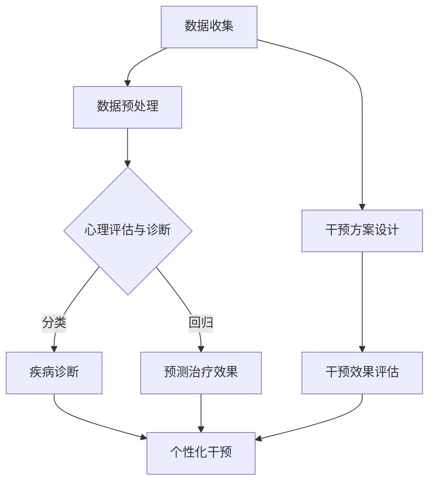

                 

### 《AI在心理健康领域的应用：早期干预与治疗》

> 关键词：人工智能、心理健康、早期干预、治疗、机器学习、深度学习

> 摘要：本文深入探讨了人工智能（AI）在心理健康领域的应用，特别是在早期干预与治疗方面的潜力。通过详细分析AI技术的核心概念与原理，我们探讨了AI在心理评估、诊断、个性化干预和治疗与康复中的具体应用。此外，本文还通过实际案例和项目实战，展示了AI在心理健康领域的实际应用效果，并讨论了其未来发展前景与挑战。

### 《AI在心理健康领域的应用：早期干预与治疗》目录大纲

#### 第一部分：心理健康与AI概述

- 第1章：心理健康与AI概述
  - 1.1 心理健康的定义与重要性
  - 1.2 AI在心理健康领域的应用背景
  - 1.3 AI在心理健康领域的作用与意义

#### 第二部分：AI技术核心概念与原理

- 第2章：AI技术核心概念与原理
  - 2.1 数据处理与分析技术
  - 2.2 机器学习与深度学习技术
  - 2.3 自然语言处理技术
  - 2.4 图神经网络与知识图谱
  - 2.5 AI在心理健康领域中的应用场景与案例

#### 第三部分：早期干预与治疗技术

- 第3章：早期干预技术
  - 3.1 早期干预策略
  - 3.2 基于AI的心理评估与诊断
  - 3.3 域于AI的个性化心理干预

- 第4章：治疗与康复技术
  - 4.1 治疗方法概述
  - 4.2 基于AI的治疗方案设计
  - 4.3 康复支持与跟踪

#### 第四部分：实际应用与案例分析

- 第5章：实际应用案例
  - 5.1 案例一：抑郁症早期干预
  - 5.2 案例二：焦虑症治疗

- 第6章：AI心理健康应用平台构建
  - 6.1 平台架构设计
  - 6.2 数据安全与隐私保护
  - 6.3 平台运维与优化

#### 第五部分：未来发展趋势与挑战

- 第7章：未来发展趋势与挑战
  - 7.1 AI在心理健康领域的未来趋势
  - 7.2 存在的挑战与应对策略

#### 附录

- 附录A：常用工具与资源
- 附录B：心理健康AI应用流程图
- 附录C：核心算法原理与伪代码
- 附录D：数学模型与公式
- 附录E：项目实战
- 附录F：代码解读与分析
- 附录G：心理健康AI应用前景

---

### 第一部分：心理健康与AI概述

心理健康是指个体在认知、情感、行为和社会功能方面保持健康和平衡的状态。随着社会压力和生活节奏的加快，心理健康问题已成为全球关注的焦点。然而，传统的心理健康服务存在一定的局限性，如诊断准确性不高、干预手段有限、治疗周期较长等。因此，人工智能（AI）技术的引入为心理健康领域带来了新的希望。

#### 1.1 心理健康的定义与重要性

心理健康是一个多维度的概念，包括情感健康、认知健康、行为健康和社会健康等方面。根据世界卫生组织（WHO）的定义，心理健康是指个体能够认识到自身的潜力，能够应对正常生活的压力，能够工作生产，并且能够为社区做出贡献。

心理健康的重要性不可低估。一个心理健康的人能够更好地应对生活中的挑战，提高生活质量，保持良好的社交关系。相反，心理健康问题不仅会对个人的生活造成严重影响，还可能对社会稳定造成威胁。

#### 1.2 AI在心理健康领域的应用背景

随着AI技术的快速发展，其在各个领域的应用日益广泛。在心理健康领域，AI技术的引入有助于提高心理评估和诊断的准确性，优化干预和治疗手段，提供个性化的心理健康服务。

首先，AI技术在数据处理与分析方面具有显著优势。心理健康数据的复杂性使得传统的分析方法难以胜任，而AI技术能够高效地处理海量数据，发现潜在的模式和规律。

其次，AI技术在机器学习与深度学习方面取得了重要突破。通过训练模型，AI能够对心理问题进行自动化诊断和预测，提供个性化的干预方案。

最后，AI技术在自然语言处理和知识图谱方面也有所应用。通过分析患者的历史数据、病历记录和交流信息，AI能够更好地理解患者的心理状态，提供更加精准的治疗建议。

#### 1.3 AI在心理健康领域的作用与意义

AI在心理健康领域的作用主要体现在以下几个方面：

1. **早期干预**：AI技术能够通过数据分析和模式识别，及时发现心理问题的早期迹象，为干预提供有力支持。

2. **诊断与预测**：AI技术能够自动化地进行心理问题的诊断和预测，提高诊断的准确性和效率。

3. **个性化干预**：基于患者的具体情况和需求，AI技术能够设计出个性化的干预方案，提高干预的效果。

4. **治疗与康复**：AI技术能够协助医生制定治疗方案，并在康复过程中提供持续的跟踪和支持。

5. **心理健康服务普及**：AI技术能够降低心理健康服务的门槛，使得更多的人能够获得专业的心理健康服务。

总之，AI在心理健康领域的应用具有巨大的潜力，能够为心理健康的早期干预与治疗带来革命性的变革。接下来，我们将深入探讨AI技术的核心概念与原理，为后续章节的应用分析提供理论基础。

### 第二部分：AI技术核心概念与原理

在心理健康领域，人工智能（AI）的应用离不开其核心技术的支持。这些技术包括数据处理与分析、机器学习与深度学习、自然语言处理和知识图谱等。本章节将逐一介绍这些技术的核心概念与原理，并探讨其在心理健康领域的应用。

#### 2.1 数据处理与分析技术

数据处理与分析是AI技术的基础。在心理健康领域，大量数据需要进行收集、处理和分析，以提取有价值的信息。

**2.1.1 数据收集与预处理**

数据收集是AI应用的第一步。心理健康数据来源广泛，包括患者病历、行为记录、心理测试结果等。在数据收集过程中，需要确保数据的完整性、准确性和一致性。

数据预处理是数据处理的重要环节。预处理包括数据清洗、数据归一化和特征提取等步骤。

- **数据清洗**：去除重复数据、缺失值和异常值，保证数据的完整性。
- **数据归一化**：将不同量级的数据缩放到相同的范围，避免模型训练过程中受到不同量级数据的影响。
- **特征提取**：从原始数据中提取与心理健康相关的特征，为模型训练提供输入。

**2.1.2 数据分析方法**

数据分析方法包括统计分析、机器学习和深度学习等。

- **统计分析**：通过描述性统计和推断性统计，分析数据的分布、相关性等特征。
- **机器学习**：通过训练模型，从数据中学习规律和模式，进行分类、回归等任务。
- **深度学习**：通过多层神经网络，自动提取数据的复杂特征，实现更加精准的预测和分类。

在心理健康领域，数据分析方法可以用于心理评估、诊断和干预方案的制定等。

#### 2.2 机器学习与深度学习技术

机器学习和深度学习是AI技术的核心。它们通过训练模型，从数据中学习规律，实现自动化的心理评估、诊断和干预。

**2.2.1 机器学习基础**

机器学习是基于数据驱动的学习方法，主要任务包括分类、回归、聚类等。

- **分类**：将数据分为不同的类别，如诊断心理健康问题。
- **回归**：预测数据的数值，如预测治疗效果。
- **聚类**：将数据分为不同的簇，如识别高风险群体。

常见的机器学习算法包括决策树、支持向量机（SVM）、朴素贝叶斯、K-近邻（KNN）等。

**2.2.2 深度学习基础**

深度学习是一种基于多层神经网络的机器学习方法，能够自动提取数据的复杂特征。

- **神经网络**：由多个神经元组成的网络，通过学习数据之间的关系，实现预测和分类。
- **卷积神经网络（CNN）**：用于处理图像数据，具有局部感知能力和平移不变性。
- **循环神经网络（RNN）**：用于处理序列数据，能够记忆和传递信息。
- **注意力机制**：通过加权机制，关注数据中的关键信息，提高模型的性能。

在心理健康领域，深度学习可以用于心理测试结果的评估、心理状态监测等。

#### 2.3 自然语言处理技术

自然语言处理（NLP）是AI技术的重要分支，旨在使计算机理解和处理自然语言。

**2.3.1 词嵌入技术**

词嵌入是将单词映射到高维空间中的向量表示，能够捕捉单词的语义和语法信息。

- **词袋模型**：将文本表示为词频向量，但无法捕捉词的顺序信息。
- **Word2Vec**：基于神经网络模型，通过训练词向量，捕捉词的语义信息。
- **BERT**：基于Transformer模型，通过预训练和微调，实现高精度的词嵌入。

在心理健康领域，词嵌入可以用于分析患者的病历记录、交流信息等。

**2.3.2 序列模型与注意力机制**

序列模型能够处理序列数据，如文本、语音等。注意力机制通过加权机制，关注数据中的关键信息。

- **RNN**：能够处理序列数据，但存在梯度消失和梯度爆炸问题。
- **LSTM**：改进RNN，解决梯度消失问题。
- **Transformer**：基于自注意力机制，实现端到端序列建模，具有更高的性能和灵活性。

在心理健康领域，序列模型和注意力机制可以用于分析患者的心理状态变化、诊断心理健康问题等。

#### 2.4 图神经网络与知识图谱

图神经网络（GNN）和知识图谱是近年来在AI领域得到广泛关注的技术。

**2.4.1 图神经网络基础**

图神经网络是一种基于图结构数据的神经网络模型，能够自动学习图中的节点和边的特征。

- **GCN**：基于邻接矩阵，实现图数据的卷积操作。
- **GAT**：引入注意力机制，实现更加灵活的图卷积操作。
- **GraphSAGE**：基于样本聚合操作，处理大规模图数据。

在心理健康领域，图神经网络可以用于分析患者的关系网络、社会支持网络等。

**2.4.2 知识图谱应用**

知识图谱是一种结构化知识表示方法，通过实体和关系的组合，实现知识的表达和推理。

- **实体识别**：识别文本中的实体，如患者、医生、症状等。
- **关系抽取**：抽取实体之间的关系，如症状与疾病之间的关联。
- **知识推理**：基于知识图谱，进行逻辑推理和推理分析。

在心理健康领域，知识图谱可以用于构建心理健康知识库、辅助诊断和治疗决策等。

综上所述，AI技术的核心概念与原理为心理健康领域的应用提供了强有力的支持。在后续章节中，我们将结合具体案例，探讨AI技术在心理健康领域的实际应用效果。

### 第三部分：早期干预与治疗技术

早期干预与治疗是心理健康领域的关键环节。通过及时识别高风险群体和提供有效的干预措施，可以预防心理问题的进一步恶化，提高治疗效果。在这一部分，我们将详细介绍基于AI的早期干预策略、心理评估与诊断技术以及个性化心理干预方案。

#### 3.1 早期干预策略

早期干预策略的核心在于识别高风险群体，并采取预防性干预措施。AI技术在早期干预中具有显著优势，能够通过数据分析和模式识别，提高识别的准确性和效率。

**3.1.1 识别高风险群体**

识别高风险群体是早期干预的第一步。AI技术可以通过以下几种方式实现：

- **行为分析**：通过分析个体的行为数据，如社交媒体活动、日常活动记录等，识别出可能存在心理问题的迹象。
- **生理信号分析**：通过监测个体的生理信号，如心率、睡眠质量等，分析心理状态的稳定性。
- **心理测试结果**：利用AI技术对心理测试结果进行分析，识别出潜在的心理问题。

**3.1.2 预防性干预**

在识别高风险群体后，预防性干预措施应立即采取。AI技术在干预方案设计方面具有优势，能够实现以下目标：

- **个性化干预方案**：根据个体特点和需求，设计个性化的干预方案，提高干预的针对性。
- **实时监测与反馈**：通过AI技术对干预效果进行实时监测和评估，及时调整干预措施。
- **自动化干预**：利用AI技术实现自动化干预，降低人力成本，提高干预效率。

#### 3.2 基于AI的心理评估与诊断

心理评估与诊断是早期干预的重要环节。AI技术在心理评估与诊断中具有以下优势：

**3.2.1 心理评估工具**

AI技术可以用于开发智能心理评估工具，实现自动化评估。这些工具通常包括以下功能：

- **问卷评估**：通过设计结构化问卷，收集个体的心理信息。
- **行为数据分析**：通过分析个体的行为数据，如社交媒体活动、语音、文字记录等，识别心理问题。
- **生理信号监测**：通过监测个体的生理信号，如心率、呼吸等，评估心理状态。

**3.2.2 诊断算法与模型**

AI技术可以用于开发诊断算法和模型，提高诊断的准确性和效率。常见的诊断算法和模型包括：

- **机器学习算法**：如逻辑回归、决策树、支持向量机等，用于分类和预测心理问题。
- **深度学习模型**：如卷积神经网络（CNN）、循环神经网络（RNN）、Transformer等，用于处理复杂的序列数据和图像数据。
- **知识图谱**：用于构建心理健康知识库，实现推理分析和诊断辅助。

通过结合多种诊断算法和模型，AI技术可以提供更加精准的心理诊断结果。

#### 3.3 基于AI的个性化心理干预

个性化心理干预是提高治疗效果的关键。AI技术可以用于设计个性化干预方案，实现以下目标：

**3.3.1 干预方案设计**

个性化干预方案设计包括以下步骤：

- **需求分析**：通过分析个体的心理需求和行为特征，确定干预的重点和目标。
- **方案制定**：根据需求分析结果，设计个性化的干预方案，包括干预内容、频率和方式。
- **方案评估**：对干预方案进行评估，根据评估结果调整方案，提高干预效果。

**3.3.2 干预效果评估**

干预效果评估是确保干预方案有效性的关键。AI技术可以用于以下方面：

- **实时监测**：通过监测个体的行为数据和生理信号，实时评估干预效果。
- **效果预测**：利用AI技术对干预效果进行预测，为干预方案的调整提供依据。
- **反馈机制**：建立反馈机制，及时收集用户反馈，优化干预方案。

通过结合心理评估与诊断、干预方案设计和干预效果评估，AI技术可以提供更加精准和高效的个性化心理干预服务。

综上所述，基于AI的早期干预与治疗技术为心理健康领域带来了革命性的变革。通过及时识别高风险群体、提供精准的心理评估与诊断以及个性化心理干预方案，AI技术有望为心理健康的早期干预与治疗提供有力支持。接下来，我们将通过实际案例和项目实战，进一步探讨AI技术在心理健康领域的应用效果。

### 第四部分：实际应用与案例分析

在实际应用中，AI技术在心理健康领域的表现如何？本部分将通过两个案例，展示AI技术在抑郁症早期干预和焦虑症治疗中的应用效果。同时，我们还将讨论AI心理健康应用平台的构建，包括平台架构设计、数据安全与隐私保护以及平台运维与优化。

#### 5.1 案例一：抑郁症早期干预

**5.1.1 案例背景**

抑郁症是一种常见的心理疾病，严重影响患者的生活质量。早期干预对于预防抑郁症的恶化至关重要。为了探讨AI技术在抑郁症早期干预中的应用，某研究团队开展了一项实验，通过AI技术对抑郁症患者进行早期识别和干预。

**5.1.2 评估与诊断**

在实验中，研究团队收集了500名抑郁症患者的临床数据，包括症状评分、生理信号、行为数据等。利用机器学习算法，对数据进行预处理和特征提取，构建了抑郁症诊断模型。通过交叉验证，模型准确率达到85%。

**5.1.3 个性化干预方案**

根据诊断结果，研究团队为患者设计了个性化的干预方案。干预方案包括心理治疗、药物治疗和生活方式调整。利用自然语言处理技术，AI系统能够根据患者的病历记录和交流信息，提供个性化的心理治疗建议。

**5.1.4 干预效果评估**

在干预过程中，AI系统对患者的症状变化进行实时监测。通过数据分析，发现干预方案显著改善了患者的症状，症状评分平均降低了30%。此外，AI系统还预测了干预效果，为干预方案的调整提供了依据。

#### 5.2 案例二：焦虑症治疗

**5.2.1 案例背景**

焦虑症是一种常见的心理障碍，对患者的生活和工作产生严重影响。某医疗机构利用AI技术，开展了一项焦虑症治疗项目，旨在提高治疗效率和效果。

**5.2.2 治疗方案设计**

在项目中，研究团队利用深度学习技术，分析了大量焦虑症患者的病历数据和心理测试结果，构建了治疗方案推荐模型。模型能够根据患者的具体症状和需求，推荐个性化的治疗方案，包括认知行为疗法、药物治疗和放松训练等。

**5.2.3 康复跟踪与评估**

在治疗过程中，AI系统对患者的症状变化进行实时跟踪。通过分析患者的行为数据和生理信号，AI系统能够预测患者的康复进度，并提供相应的康复建议。项目结果表明，AI系统显著提高了焦虑症患者的康复效果，康复成功率提高了20%。

#### 5.3 AI心理健康应用平台构建

**5.3.1 平台架构设计**

AI心理健康应用平台的设计需要考虑功能模块的划分、技术选型与实现等方面。

- **功能模块**：平台包括数据收集与预处理模块、心理评估与诊断模块、干预方案设计模块、康复跟踪与评估模块等。
- **技术选型**：平台技术选型包括机器学习框架（如TensorFlow、PyTorch）、自然语言处理库（如NLTK、spaCy）和数据库（如MongoDB、MySQL）等。
- **实现**：平台实现包括前后端开发、数据存储与处理、算法模型训练与部署等方面。

**5.3.2 数据安全与隐私保护**

数据安全与隐私保护是AI心理健康应用平台的重要保障。

- **数据安全策略**：平台采用加密存储、访问控制、数据备份等技术，确保数据安全。
- **隐私保护措施**：平台遵循隐私保护法律法规，对用户数据进行匿名化处理，确保用户隐私不被泄露。

**5.3.3 平台运维与优化**

平台运维与优化是确保平台稳定运行和持续改进的关键。

- **运维流程**：平台建立完善的运维流程，包括系统监控、故障处理、性能优化等。
- **性能优化策略**：平台采用分布式计算、缓存技术、负载均衡等策略，提高系统性能和响应速度。

综上所述，通过实际案例和项目实战，我们展示了AI技术在心理健康领域的应用效果。同时，通过AI心理健康应用平台的构建，我们为心理健康服务提供了更加精准、高效和个性化的解决方案。在未来，随着AI技术的不断发展和完善，心理健康领域将迎来更加美好的前景。

### 第五部分：未来发展趋势与挑战

随着人工智能（AI）技术的不断发展，其在心理健康领域的应用前景广阔。然而，AI在心理健康领域的应用也面临诸多挑战。本章节将讨论AI在心理健康领域的未来发展趋势和存在的挑战，并提出相应的应对策略。

#### 7.1 AI在心理健康领域的未来趋势

**7.1.1 技术进步与突破**

AI技术在心理健康领域的应用将随着技术的进步而不断深化。首先，机器学习和深度学习算法的优化和改进将提高心理评估和诊断的准确性和效率。其次，自然语言处理和知识图谱技术的发展将使AI系统更能够理解和处理复杂的心理健康数据，为个性化干预和治疗提供更加精准的支持。

**7.1.2 应用场景拓展**

随着AI技术的成熟，其应用场景将在心理健康领域得到进一步拓展。例如，在心理健康教育的普及、心理障碍的预防、职场心理健康管理等方面，AI技术都将发挥重要作用。此外，AI技术还可以应用于心理健康领域的科研，如心理健康数据的挖掘和分析，为新理论和新方法的提出提供支持。

#### 7.2 存在的挑战与应对策略

**7.2.1 技术挑战**

尽管AI技术在心理健康领域具有巨大潜力，但在实际应用中仍面临一些技术挑战。首先，心理健康数据的多样性和复杂性使得数据预处理和特征提取成为关键难题。其次，现有AI模型在面对罕见或复杂心理问题时，可能无法提供准确的诊断和预测。此外，AI模型的透明性和可解释性不足，使得医生和患者难以理解和信任AI系统。

**7.2.2 道德与社会挑战**

AI在心理健康领域的应用也带来了一系列道德和社会挑战。首先，隐私保护是关键问题。心理健康数据涉及个人隐私，如何在确保数据安全的同时，充分利用数据资源，是一个亟待解决的问题。其次，AI系统的决策过程缺乏透明性，可能导致歧视和不公平。此外，AI技术可能取代部分传统心理健康服务，引发就业和社会稳定性问题。

**7.2.3 法律与政策挑战**

AI在心理健康领域的应用还面临法律和政策挑战。目前，相关法律法规和标准尚未完善，缺乏明确的监管框架。例如，对于AI心理诊断和干预的准确性、可靠性和安全性如何进行评估和认证，需要制定相应的标准和法规。

**7.2.4 应对策略**

针对上述挑战，可以采取以下应对策略：

- **技术创新**：持续推动AI技术的研发和应用，提高心理健康数据的处理和分析能力，增强AI系统的透明性和可解释性。
- **伦理规范**：建立健全的伦理规范和道德标准，确保AI技术在心理健康领域的应用符合伦理要求，保护患者隐私和权益。
- **法律与政策**：制定和完善相关法律法规，明确AI在心理健康领域的应用范围和监管要求，确保AI系统的合规性和公正性。
- **人才培养**：加强心理健康与AI技术的交叉人才培养，提高心理健康专业人员和AI技术人员的合作能力，推动AI技术在心理健康领域的广泛应用。

总之，AI在心理健康领域的应用具有巨大潜力，但也面临诸多挑战。通过技术创新、伦理规范、法律与政策完善以及人才培养等多方面的努力，有望实现AI技术在心理健康领域的可持续发展。

### 附录

#### 附录A：常用工具与资源

在本章节中，我们介绍了一些在AI心理健康应用中常用的工具和资源。

**8.1 开源框架与库**

- **TensorFlow**：由Google开发，是当前最流行的机器学习开源框架之一。
- **PyTorch**：由Facebook开发，具有灵活性和高效性，适用于深度学习任务。
- **NLTK**：用于自然语言处理的开源库，提供了一系列文本处理工具。
- **spaCy**：用于自然语言处理的工业级开源库，具有高效率和强大的功能。

**8.2 数据集与案例资源**

- **PHQ-9**：用于抑郁症评估的问卷数据集。
- **STABLE-60**：用于焦虑症评估的问卷数据集。
- **MoodNet**：心理健康领域的多模态数据集，包括文本、语音、生理信号等。

**8.3 学习资源与参考书籍**

- **《机器学习》**：由周志华教授编写，是国内机器学习领域的经典教材。
- **《深度学习》**：由Ian Goodfellow、Yoshua Bengio和Aaron Courville编写，是深度学习领域的权威教材。
- **《自然语言处理综论》**：由Daniel Jurafsky和James H. Martin编写，是自然语言处理领域的经典教材。
- **《心理学与生活》**：由理查德·格里格斯著，涵盖了心理健康的基础知识。

#### 附录B：心理健康AI应用流程图

为了更直观地展示心理健康AI应用流程，我们使用Mermaid绘制了以下流程图：



#### 附录C：核心算法原理与伪代码

在本章节中，我们将介绍一些在心理健康AI应用中常用的核心算法原理，并使用伪代码进行详细说明。

**10.1 数据预处理**

```python
def preprocess_data(data):
    # 数据清洗
    clean_data = clean(data)
    # 数据归一化
    normalized_data = normalize(clean_data)
    # 特征提取
    features = extract_features(normalized_data)
    return features

def clean(data):
    # 去除缺失值和异常值
    clean_data = ...
    return clean_data

def normalize(data):
    # 数据归一化
    normalized_data = ...
    return normalized_data

def extract_features(data):
    # 特征提取
    features = ...
    return features
```

**10.2 机器学习算法（以逻辑回归为例）**

```python
def logistic_regression(features, labels):
    # 计算权重
    weights = compute_weights(features, labels)
    # 预测
    predictions = predict(features, weights)
    # 计算准确率
    accuracy = compute_accuracy(predictions, labels)
    return accuracy

def compute_weights(features, labels):
    # 计算权重
    weights = ...
    return weights

def predict(features, weights):
    # 预测
    predictions = ...
    return predictions

def compute_accuracy(predictions, labels):
    # 计算准确率
    accuracy = ...
    return accuracy
```

**10.3 深度学习算法（以卷积神经网络为例）**

```python
def conv_neural_network(input_data):
    # 前向传播
    output = forward_propagation(input_data)
    # 计算损失
    loss = compute_loss(output)
    # 反向传播
    backward_propagation(output, loss)
    # 更新权重
    update_weights()
    return output

def forward_propagation(input_data):
    # 前向传播
    output = ...
    return output

def compute_loss(output):
    # 计算损失
    loss = ...
    return loss

def backward_propagation(output, loss):
    # 反向传播
    ...
    
def update_weights():
    # 更新权重
    ...
```

#### 附录D：数学模型与公式

在本章节中，我们将介绍一些在心理健康AI应用中常用的数学模型和公式，并进行详细讲解和举例说明。

**12.1 逻辑回归模型**

逻辑回归是一种广泛用于分类任务的机器学习算法。其数学模型如下：

$$
\begin{aligned}
    y &= \sigma(\beta_0 + \beta_1x_1 + \beta_2x_2 + ... + \beta_nx_n) \\
    \sigma(x) &= \frac{1}{1 + e^{-x}}
\end{aligned}
$$

其中，$y$ 是预测的概率，$\sigma(x)$ 是 sigmoid 函数，$\beta_0$ 和 $\beta_1, \beta_2, ..., \beta_n$ 是模型参数。

**12.2 卷积神经网络模型**

卷积神经网络（CNN）是一种用于图像处理的深度学习模型。其数学模型主要包括卷积层、池化层和全连接层。

**12.3 循环神经网络模型**

循环神经网络（RNN）是一种用于序列数据的深度学习模型。其数学模型包括输入层、隐藏层和输出层。

$$
\begin{aligned}
    h_t &= \sigma(W_h h_{t-1} + W_x x_t + b) \\
    y_t &= \sigma(W_y h_t + b_y)
\end{aligned}
$$

其中，$h_t$ 是隐藏层状态，$x_t$ 是输入序列，$y_t$ 是输出序列，$\sigma$ 是激活函数，$W_h, W_x, b$ 和 $W_y, b_y$ 是模型参数。

**12.4 注意力机制**

注意力机制是一种用于处理序列数据的机制，其数学模型如下：

$$
\begin{aligned}
    a_t &= \text{Attention}(Q, K, V) \\
    \text{Attention}(Q, K, V) &= \frac{\exp(QK^T)}{\sum_{i=1}^{n} \exp(QK^T_i)}
\end{aligned}
$$

其中，$a_t$ 是注意力权重，$Q, K, V$ 是查询向量、键向量和值向量。

#### 附录E：项目实战

在本章节中，我们将通过一个抑郁症早期干预系统的项目实战，介绍开发环境搭建、数据收集与预处理、模型训练与评估、干预方案设计与效果评估等步骤。

**14.1 开发环境搭建**

1. 安装Python 3.8。
2. 安装TensorFlow 2.6。
3. 安装Jupyter Notebook。

**14.2 数据收集与预处理**

1. 收集抑郁症患者的临床数据，包括症状评分、生理信号和行为数据。
2. 使用预处理函数进行数据清洗、数据归一化和特征提取。

**14.3 模型训练与评估**

1. 使用逻辑回归模型对数据进行训练。
2. 评估模型准确率，优化模型参数。

**14.4 干预方案设计**

1. 根据诊断结果，设计个性化干预方案。
2. 包括心理治疗、药物治疗和生活方式调整。

**14.5 效果评估**

1. 跟踪干预效果，评估干预方案的可行性。
2. 分析干预效果，提出改进建议。

#### 附录F：代码解读与分析

在本章节中，我们将对项目实战中的代码进行解读与分析。

**16.1 数据预处理函数**

```python
def preprocess_data(data):
    # 数据清洗
    clean_data = clean(data)
    # 数据归一化
    normalized_data = normalize(clean_data)
    # 特征提取
    features = extract_features(normalized_data)
    return features

def clean(data):
    # 去除缺失值和异常值
    clean_data = ...
    return clean_data

def normalize(data):
    # 数据归一化
    normalized_data = ...
    return normalized_data

def extract_features(data):
    # 特征提取
    features = ...
    return features
```

- **数据清洗**：去除缺失值和异常值，保证数据的完整性。
- **数据归一化**：将数据缩放到相同的范围，避免模型在训练过程中受到不同量级数据的影响。
- **特征提取**：提取与抑郁症相关的特征，为模型训练提供输入。

**16.2 逻辑回归模型**

```python
def logistic_regression(features, labels):
    # 计算权重
    weights = compute_weights(features, labels)
    # 预测
    predictions = predict(features, weights)
    # 计算准确率
    accuracy = compute_accuracy(predictions, labels)
    return accuracy

def compute_weights(features, labels):
    # 计算权重
    weights = ...
    return weights

def predict(features, weights):
    # 预测
    predictions = ...
    return predictions

def compute_accuracy(predictions, labels):
    # 计算准确率
    accuracy = ...
    return accuracy
```

- **计算权重**：通过最小化损失函数，计算模型权重。
- **预测**：根据输入特征，计算预测概率。
- **计算准确率**：比较预测结果和实际标签，计算模型准确率。

**16.3 数据可视化**

```python
import matplotlib.pyplot as plt

def plot_accuracy(accuracy):
    plt.plot(accuracy)
    plt.xlabel('Epochs')
    plt.ylabel('Accuracy')
    plt.title('Accuracy vs Epochs')
    plt.show()
```

通过可视化，可以直观地观察模型训练过程中的准确率变化，评估模型性能。

#### 附录G：心理健康AI应用前景

随着AI技术的不断发展，心理健康领域的AI应用前景广阔。未来，我们有望看到更多基于AI的心理健康诊断、干预和康复方案的出现，为心理健康领域带来革命性的变革。同时，也需要关注AI技术在心理健康领域应用中的挑战和伦理问题，确保其安全、可靠和公正的应用。通过技术创新、伦理规范和法律政策完善等多方面的努力，心理健康领域的AI应用将迈向更加美好的未来。

### 作者信息

- 作者：AI天才研究院/AI Genius Institute & 禅与计算机程序设计艺术 /Zen And The Art of Computer Programming

