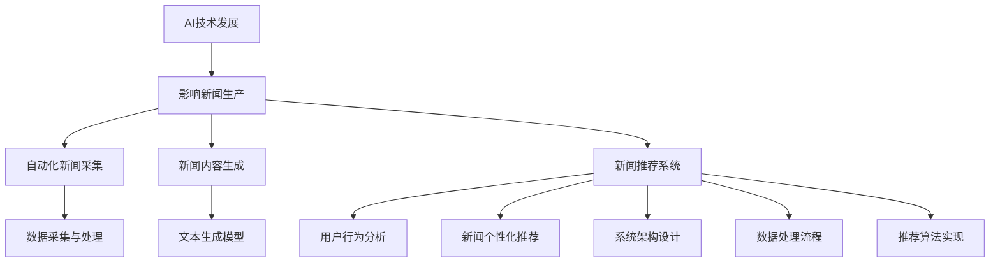

                 

### 文章标题

### AI在新闻生产中的应用：自动化与个性化

#### 关键词：
- 人工智能
- 新闻生产
- 自动化
- 个性化推荐
- 自然语言生成

#### 摘要：
本文将深入探讨人工智能在新闻生产中的应用，重点分析自动化新闻采集、新闻内容生成以及个性化新闻推荐等关键领域。我们将逐步剖析AI技术如何变革新闻行业，提高生产效率与内容质量，同时探讨相关挑战和未来发展趋势。

### 《AI在新闻生产中的应用:自动化与个性化》目录大纲

#### 第一部分：AI与新闻生产概述
1. AI与新闻生产概述
   - 1.1 AI技术发展及其对新闻生产的影响
   - 1.2 AI在新闻生产中的应用现状与趋势
   - 1.3 人工智能与新闻伦理

2. 自动化新闻采集
   - 2.1 自动化新闻采集的原理与关键技术
   - 2.2 数据采集与处理流程
   - 2.3 自动化新闻采集的实际应用案例

3. 新闻内容生成
   - 3.1 自然语言生成技术简介
   - 3.2 文本生成模型的构建
   - 3.3 新闻内容生成的实际应用

4. 个性化新闻推荐
   - 4.1 新闻推荐系统概述
   - 4.2 基于内容的推荐方法
   - 4.3 基于协同过滤的推荐方法

5. 用户行为分析与建模
   - 5.1 用户行为数据收集
   - 5.2 用户兴趣模型构建
   - 5.3 用户行为分析的实际应用案例

6. 新闻个性化推荐系统实现
   - 6.1 系统架构设计
   - 6.2 数据处理流程
   - 6.3 推荐算法实现

7. AI在新闻生产中的应用挑战与未来展望
   - 7.1 数据隐私与安全问题
   - 7.2 人工智能偏见与伦理问题
   - 7.3 技术成熟度与可行性问题

8. AI在新闻生产中的未来展望
   - 8.1 AI在新闻生产中的发展趋势
   - 8.2 未来新闻生产模式创新
   - 8.3 AI在新闻教育中的应用

9. 附录
   - 9.1 AI在新闻生产中的开源工具与资源

### 第一部分：AI与新闻生产概述

#### 第1章：AI与新闻生产概述

##### 1.1 AI技术发展及其对新闻生产的影响

人工智能（AI）的发展经历了几个重要的阶段，从早期的规则系统、知识表示到现代的深度学习、自然语言处理（NLP）和计算机视觉，这些技术的进步正深刻地改变着新闻生产的方式。传统的新闻生产依赖于记者和编辑的辛勤劳动，而AI的出现则使得新闻生产过程更加高效和自动化。

首先，AI技术可以通过自然语言处理（NLP）自动抓取和分析大量文本数据，从这些数据中提取出有价值的新闻线索。例如，通过分析社交媒体上的讨论和趋势，AI可以快速识别出可能成为新闻的事件。这种自动化新闻采集技术不仅提高了新闻的覆盖面，还减少了记者的工作量，使他们能够将精力集中在更具创意和深度的新闻报道上。

其次，AI技术在新闻内容生成方面也发挥着重要作用。自然语言生成（NLG）技术可以通过分析大量数据来生成新闻报道。例如，自动化体育赛事报道、股市分析报告等，这类新闻通常结构化且规则性较强，非常适合使用AI进行生成。通过这种方式，新闻机构可以快速、大规模地生产内容，满足不同读者群体的需求。

此外，AI技术还在新闻推荐系统中得到了广泛应用。个性化推荐系统可以根据用户的阅读历史和偏好，向他们推荐最相关的新闻内容。这种个性化推荐不仅可以提高用户满意度，还可以增加新闻网站的访问量和用户粘性。

总的来说，AI技术对新闻生产的影响主要体现在以下几个方面：

1. 提高新闻生产效率：通过自动化新闻采集和生成技术，大幅减少了新闻生产的耗时。
2. 增强内容多样性：AI技术可以帮助新闻机构生产更多样化的内容，满足不同读者的需求。
3. 提高内容质量：AI技术可以对新闻内容进行质量控制和优化，确保新闻的准确性和可信度。
4. 促进个性化推荐：通过个性化推荐系统，为用户提供更加个性化的新闻内容，提高用户体验。

##### 1.2 AI在新闻生产中的应用现状与趋势

目前，AI技术在新闻生产中的应用已经相当广泛，许多新闻机构和媒体都在积极探索和应用这些技术。以下是一些AI在新闻生产中应用的现状和趋势：

1. 自动化新闻采集：越来越多的新闻机构开始使用自动化新闻采集工具，如谷歌新闻实验室的Automated Insights和Axios的Athena等。这些工具可以自动从大量数据中提取新闻线索，生成新闻简报和报告。

2. 新闻内容生成：AI新闻生成技术也在迅速发展，许多新闻机构已经开始使用AI生成体育赛事报道、天气预报、财经新闻等。例如，美联社和凤凰卫视等媒体已经发布了大量使用AI生成的新闻。

3. 个性化推荐系统：个性化推荐系统在新闻推荐中的应用也越来越普遍。新闻网站如纽约时报和BBC等，已经开始使用AI技术来根据用户的阅读历史和偏好推荐新闻内容。

4. 偏见检测与伦理：随着AI技术在新闻生产中的应用越来越广泛，偏见检测和伦理问题也日益受到关注。一些新闻机构已经开始使用AI技术来检测新闻中的偏见，并制定相应的伦理准则来规范AI的使用。

未来的发展趋势将主要集中在以下几个方面：

1. 深度学习与模型优化：随着深度学习技术的不断进步，AI新闻生成和推荐系统的性能将得到进一步提升。

2. 多媒体内容生成：AI技术不仅限于文本内容生成，还将扩展到音频、视频等多媒体内容生成。

3. 更广泛的新闻场景应用：AI技术将应用于更多的新闻场景，如深度报道、调查性新闻等。

4. 伦理和法规的完善：随着AI技术在新闻生产中的应用越来越广泛，相关的伦理和法规问题也将得到更多的关注和讨论。

##### 1.3 人工智能与新闻伦理

尽管AI技术在新闻生产中带来了许多便利和优势，但其应用也引发了一系列伦理问题，包括数据隐私、算法偏见和新闻质量等。以下是一些主要伦理问题及其解决思路：

1. 数据隐私：AI技术需要大量的数据来训练模型，这些数据往往包含用户的隐私信息。为了保护用户隐私，新闻机构需要采取严格的隐私保护措施，如数据加密、匿名化处理等。

2. 算法偏见：AI模型可能会在学习过程中引入偏见，从而导致新闻内容的不公平。为了解决这一问题，新闻机构需要建立透明的算法，并定期对算法进行审查和调整，确保其公平性和客观性。

3. 新闻质量：尽管AI技术可以提高新闻生产效率，但过度的依赖可能会降低新闻的质量。新闻机构需要平衡AI技术的使用和人工编辑的审核，确保新闻内容的准确性和可信度。

4. 透明性和责任：AI技术在新闻生产中的应用需要更多的透明性和责任。新闻机构应该公开其使用AI技术的细节，并明确算法的责任归属，以便在出现问题时能够迅速应对。

总之，AI技术在新闻生产中的应用带来了巨大的机遇，但同时也需要我们认真对待相关的伦理问题。通过制定合理的政策和措施，我们可以最大限度地发挥AI技术的优势，同时确保新闻行业的健康发展。

### 第二部分：AI在新闻采集与内容生成中的应用

#### 第2章：自动化新闻采集

##### 2.1 自动化新闻采集的原理与关键技术

自动化新闻采集是AI在新闻生产中的一项重要应用，其原理主要基于信息提取和数据挖掘技术。通过自动化采集工具，新闻机构可以高效地从海量数据源中获取新闻线索，从而大幅提高新闻采集的效率和覆盖面。

关键技术和原理包括：

1. **数据抓取技术**：自动化新闻采集工具通常会使用网络爬虫（Web Scraping）技术，从新闻网站、社交媒体和其他在线数据源中抓取信息。网络爬虫可以按照一定的规则遍历网页，提取出结构化数据。

2. **信息提取技术**：在获取网页内容后，自动化新闻采集工具会使用信息提取技术，如命名实体识别（NER）、关键词提取、文本分类等，来解析和筛选新闻内容。命名实体识别可以帮助识别新闻中的关键人物、地点和事件，而关键词提取和文本分类则有助于进一步筛选和分类新闻。

3. **数据挖掘技术**：自动化新闻采集工具还会使用数据挖掘技术，如关联规则挖掘、聚类分析和分类算法等，来分析和挖掘数据中的潜在新闻线索。

##### 2.2 数据采集与处理流程

自动化新闻采集的过程可以分为以下几个步骤：

1. **数据源识别**：首先，需要确定数据采集的目标来源，如新闻网站、社交媒体平台等。

2. **数据抓取**：使用网络爬虫技术，自动获取数据源中的网页内容。这一步通常涉及到以下几个问题：
   - **网页结构分析**：分析目标网页的HTML结构，确定需要抓取的数据所在的位置。
   - **数据提取**：根据网页结构，提取出相关的新闻内容，如标题、摘要、正文、时间等。
   - **数据存储**：将提取出的数据存储到数据库或其他数据存储系统中。

3. **数据预处理**：获取到的原始数据通常需要进一步的预处理，包括：
   - **数据清洗**：去除重复、错误或无关的数据。
   - **数据转换**：将数据转换为统一的格式，如JSON、XML等。
   - **数据归一化**：对文本数据进行归一化处理，如去除标点符号、停用词等。

4. **信息提取**：使用命名实体识别、关键词提取、文本分类等技术，对预处理后的数据进行进一步的解析和筛选，提取出有价值的新闻线索。

5. **数据挖掘**：应用关联规则挖掘、聚类分析和分类算法等数据挖掘技术，对提取出的新闻线索进行分析，发现潜在的新闻主题和趋势。

##### 2.3 自动化新闻采集的实际应用案例

自动化新闻采集技术已经在多个新闻机构和媒体中得到了广泛应用，以下是一些实际应用案例：

1. **《纽约时报》的“NewsML”**：《纽约时报》使用NewsML标准进行自动化新闻采集，将新闻内容转换为机器可读的格式，从而实现快速、高效的新闻发布和分发。

2. **《美联社》的“Wordsmith”**：美联社利用其自主研发的Wordsmith工具，通过自动化新闻采集和生成技术，生成大量财经和体育新闻，大幅提高了新闻生产效率。

3. **《BBC》的“Newsbot”**：BBC的Newsbot是一个自动化新闻采集工具，通过分析社交媒体和搜索引擎数据，识别出热门话题和新闻线索，为BBC的新闻编辑团队提供参考。

4. **《Axios》的“Athena”**：Axios的Athena是一个自动化新闻采集和内容生成平台，可以从多种数据源中提取新闻线索，生成结构化的新闻数据，供新闻编辑团队使用。

这些实际应用案例展示了自动化新闻采集技术在提高新闻生产效率和内容质量方面的巨大潜力，同时也为新闻行业的数字化转型提供了新的思路和方向。

### 第3章：新闻内容生成

##### 3.1 自然语言生成技术简介

自然语言生成（Natural Language Generation，NLG）是人工智能领域的一个重要分支，旨在利用计算机程序自动生成具有人类语言特点的文本。NLG技术通过处理和分析大量的文本数据，模拟人类的语言表达方式，生成具有逻辑性和连贯性的文本内容。NLG技术可以广泛应用于新闻、报告、书籍、广告等多个领域，其核心在于将结构化数据或复杂的信息以自然、流畅的方式呈现给用户。

##### 3.2 文本生成模型的构建

文本生成模型是NLG技术的核心，其主要目的是通过算法自动生成文本。文本生成模型的构建通常涉及以下几个步骤：

1. **数据收集与预处理**：首先，需要收集大量高质量的文本数据作为训练集。这些数据可以是新闻文章、报告、书籍等。在收集数据后，需要对其进行预处理，包括去除标点符号、停用词处理、词性标注等。

2. **词向量表示**：将文本数据转换为词向量表示。词向量是一种将单词映射到高维向量空间的方法，常用的词向量模型有Word2Vec、GloVe等。词向量表示可以捕捉单词间的语义关系，为后续的文本生成提供基础。

3. **模型选择**：选择合适的文本生成模型。常见的文本生成模型包括序列到序列（Seq2Seq）模型、递归神经网络（RNN）、长短时记忆网络（LSTM）以及变压器（Transformer）模型等。其中，Transformer模型由于其并行计算能力和强大的捕捉长距离依赖关系的能力，成为当前文本生成领域的首选模型。

4. **训练与优化**：使用预处理后的文本数据对选定的模型进行训练。训练过程中，需要通过反向传播算法不断调整模型参数，使其生成更加自然、流畅的文本。在训练过程中，可以使用多种优化技术，如dropout、批量归一化等，提高模型的泛化能力和鲁棒性。

5. **模型评估与调优**：在训练完成后，需要对模型进行评估和调优。常用的评估指标包括词汇匹配率、BLEU评分、ROUGE评分等。通过评估结果，可以进一步调整模型参数，优化文本生成效果。

##### 3.3 新闻内容生成的实际应用

新闻内容生成在多个领域得到了广泛应用，以下是一些典型的实际应用案例：

1. **自动化新闻写作**：许多新闻机构开始使用自然语言生成技术来自动化新闻写作。例如，美联社利用其Wordsmith工具生成大量财经新闻和体育新闻，大幅提高了新闻生产效率。这些自动化新闻不仅涵盖了常规的体育赛事报道和财经简报，还包括了一些复杂的分析性报道。

2. **报告生成**：自然语言生成技术还可以用于生成各种报告，如市场调研报告、财务报表、科学报告等。这些报告可以基于结构化数据自动生成，减少了人工编写的时间和成本。

3. **内容个性化**：在个性化推荐系统中，自然语言生成技术可以帮助生成个性化的内容摘要、新闻推荐等。通过分析用户的阅读历史和偏好，生成符合用户需求的个性化内容，提高用户体验和用户粘性。

4. **教育应用**：在教育领域，自然语言生成技术可以用于自动生成习题和答案，为学生提供个性化的学习资源。例如，一些教育平台已经开始使用NLG技术来生成数学题目和解析，帮助学生更好地理解和掌握知识点。

5. **客服与支持**：在客服和客户支持领域，自然语言生成技术可以用于自动生成常见的问答和帮助文档，提高客户服务效率。通过分析大量的用户提问和客服响应，生成自动回复，减少人工干预。

总之，自然语言生成技术在新闻内容生成中的应用不仅提高了新闻生产效率，还丰富了新闻内容的种类和形式，为新闻行业的创新和发展提供了新的可能性。随着技术的不断进步，NLG将在更多的应用场景中发挥重要作用。

### 第4章：个性化新闻推荐

#### 4.1 新闻推荐系统概述

新闻推荐系统是AI在新闻生产中的另一重要应用，其目的是通过分析用户的阅读行为和兴趣，向他们推荐最相关的新闻内容。个性化推荐系统能够提高用户的阅读体验，增加新闻网站的用户粘性和访问量。新闻推荐系统的基本概念包括用户、新闻内容、评分和推荐算法等。

1. **用户**：用户是新闻推荐系统的核心，他们的行为和偏好是推荐系统的主要数据来源。用户的特征可以包括年龄、性别、地理位置、阅读历史、搜索历史等。

2. **新闻内容**：新闻内容是推荐系统推荐的对象，包括标题、摘要、正文、作者、发布时间等。新闻内容的特征可以用于构建新闻的语义表示。

3. **评分**：评分是用户对新闻内容的偏好表示，可以是显式评分（如五星评级）或隐式评分（如阅读时间、点击率等）。

4. **推荐算法**：推荐算法是推荐系统的核心，根据用户的特征和新闻内容特征，生成个性化的推荐列表。常见的推荐算法包括基于内容的推荐（Content-Based Filtering）和基于协同过滤（Collaborative Filtering）的方法。

#### 4.2 基于内容的推荐方法

基于内容的推荐（Content-Based Filtering，CBF）是一种常见的新闻推荐方法，其基本思想是推荐与用户已阅读或喜欢的新闻内容相似的新闻。CBF方法的核心在于新闻内容的特征提取和相似度计算。

1. **新闻内容特征提取**：新闻内容特征提取是将新闻文本转换为机器可处理的特征表示。常用的方法包括：
   - **词袋模型（Bag of Words，BoW）**：将新闻文本表示为单词的集合，忽略词的顺序。
   - **TF-IDF（Term Frequency-Inverse Document Frequency）**：考虑单词在新闻中的频率和其在整个新闻集合中的重要性。
   - **词嵌入（Word Embedding）**：将单词映射到高维向量空间，如Word2Vec、GloVe等。

2. **相似度计算**：相似度计算是衡量两篇新闻内容之间相似程度的方法。常用的相似度计算方法包括：
   - **余弦相似度（Cosine Similarity）**：基于词袋模型，计算两个新闻向量之间的余弦值。
   - **Jaccard相似度（Jaccard Similarity）**：基于集合交集和并集，计算两个新闻集合之间的相似度。
   - **欧氏距离（Euclidean Distance）**：基于词向量表示，计算两个新闻向量之间的欧氏距离。

3. **推荐生成**：根据用户的阅读历史和新闻内容特征，计算用户与新闻之间的相似度，并将相似度最高的新闻推荐给用户。例如，可以使用余弦相似度计算用户阅读的新闻与新闻库中所有新闻的相似度，然后按照相似度从高到低排序，生成推荐列表。

基于内容的推荐方法具有以下优点：
- **用户兴趣保持**：推荐系统始终根据用户的兴趣生成推荐，确保推荐内容与用户偏好一致。
- **计算效率高**：特征提取和相似度计算相对简单，适合处理大规模新闻数据。

然而，CBF方法也存在一些局限性，如推荐多样性差、无法发现用户未知的新闻内容等。

#### 4.3 基于协同过滤的推荐方法

基于协同过滤（Collaborative Filtering，CF）是一种通过分析用户之间的相似性来生成推荐列表的方法。协同过滤分为两种主要类型：基于用户的协同过滤（User-Based Collaborative Filtering，UBCF）和基于项目的协同过滤（Item-Based Collaborative Filtering，IBCF）。

1. **基于用户的协同过滤（User-Based Collaborative Filtering，UBCF）**
   - **相似度计算**：UBCF方法首先计算用户之间的相似度。常用的相似度计算方法包括余弦相似度、皮尔逊相关系数等。通过分析用户对新闻的评分，计算用户之间的相似度矩阵。
   - **推荐生成**：根据用户之间的相似度，找到与目标用户最相似的邻居用户。然后，根据邻居用户对新闻的评分，生成推荐列表。推荐算法通常会选择邻居用户的评分加权平均作为推荐分数。

2. **基于项目的协同过滤（Item-Based Collaborative Filtering，IBCF）**
   - **相似度计算**：IBCF方法首先计算新闻之间的相似度。与UBCF方法类似，使用余弦相似度、Jaccard相似度等方法计算新闻之间的相似度矩阵。
   - **推荐生成**：根据用户对新闻的评分，找到用户已评分新闻中相似度最高的新闻，将这些新闻推荐给用户。

协同过滤方法具有以下优点：
- **推荐多样性**：通过分析用户之间的相似性，可以推荐用户未评分的未知新闻，提高推荐多样性。
- **处理大规模数据**：协同过滤方法不需要存储完整的用户-新闻评分矩阵，仅需要存储相似度矩阵，适合处理大规模数据。

然而，协同过滤方法也存在一些局限性，如用户稀疏性、冷启动问题等。

#### 4.4 常见的协同过滤算法

1. **用户基协同过滤（User-Based Collaborative Filtering，User-Based CF）**
   - **原理**：User-Based CF通过计算用户之间的相似度，找到与目标用户最相似的邻居用户，并根据邻居用户对新闻的评分进行推荐。
   - **算法流程**：
     1. 计算用户之间的相似度。
     2. 找到与目标用户最相似的k个邻居用户。
     3. 根据邻居用户对新闻的评分，计算推荐分数。
     4. 排序推荐分数，生成推荐列表。
   - **优缺点**：
     - **优点**：推荐多样性好，可以处理大规模数据。
     - **缺点**：计算复杂度高，用户稀疏性问题严重。

2. **项目基协同过滤（Item-Based Collaborative Filtering，Item-Based CF）**
   - **原理**：Item-Based CF通过计算新闻之间的相似度，找到与用户已评分新闻相似度最高的其他新闻，进行推荐。
   - **算法流程**：
     1. 计算新闻之间的相似度。
     2. 找到用户已评分新闻中相似度最高的k个新闻。
     3. 根据用户对这k个新闻的评分，计算推荐分数。
     4. 排序推荐分数，生成推荐列表。
   - **优缺点**：
     - **优点**：计算复杂度较低，推荐多样性较好。
     - **缺点**：用户稀疏性问题严重，推荐结果可能过于集中。

3. **基于模型的协同过滤（Model-Based Collaborative Filtering）**
   - **原理**：基于模型的协同过滤方法通过建立用户和新闻之间的预测模型，预测用户对未评分新闻的评分，进行推荐。
   - **算法流程**：
     1. 训练用户-新闻评分预测模型。
     2. 根据用户对已评分新闻的评分，预测用户对未评分新闻的评分。
     3. 选择评分最高的未评分新闻进行推荐。
   - **优缺点**：
     - **优点**：可以处理大规模数据，推荐效果较好。
     - **缺点**：需要大量训练数据和计算资源。

综上所述，个性化新闻推荐系统通过基于内容的推荐和基于协同过滤的推荐方法，结合用户的阅读历史和兴趣，生成个性化的新闻推荐列表。不同的推荐方法各有优缺点，实际应用中需要根据具体场景和需求进行选择和优化。

### 第5章：用户行为分析与建模

#### 5.1 用户行为数据收集

用户行为数据是构建个性化新闻推荐系统的关键，通过对用户行为的分析，可以更好地理解用户兴趣和需求，从而提供个性化的新闻内容推荐。用户行为数据包括多种类型，如浏览行为、搜索行为、点击行为、评论行为等。以下是用户行为数据的收集方法：

1. **Web日志数据**：Web日志数据是记录用户访问网站时产生的行为数据，包括访问时间、访问页面、点击事件等。通过分析Web日志数据，可以了解用户的访问模式和兴趣点。

2. **跟踪技术**：通过在网站和应用程序中嵌入跟踪代码（如JavaScript标签），可以实时记录用户的操作行为，如页面滚动、点击、停留时间等。

3. **问卷与调查**：通过在线问卷和用户调查，可以直接获取用户的兴趣偏好和需求。这种方法虽然成本较高，但可以获得较为准确的数据。

4. **社交网络数据**：通过分析用户在社交媒体平台上的行为，如点赞、评论、分享等，可以了解用户的兴趣和社会关系。

5. **设备识别**：通过用户的设备识别，如IP地址、设备ID等，可以追踪用户的跨设备行为，从而构建完整的用户画像。

在收集用户行为数据时，需要遵循以下原则：

- **隐私保护**：确保用户数据的安全性和隐私性，遵守相关法律法规，如《通用数据保护条例》（GDPR）。
- **数据质量**：确保数据的有效性和准确性，对无效数据和不完整数据进行过滤和清洗。
- **数据多样性**：收集多样化的用户行为数据，包括浏览行为、社交行为、购买行为等，以构建全面的用户画像。

#### 5.2 用户兴趣模型构建

用户兴趣模型是新闻推荐系统的重要组件，其目的是通过分析用户的阅读历史和行为数据，提取出用户的主要兴趣点，从而为用户推荐最相关的新闻内容。构建用户兴趣模型通常涉及以下步骤：

1. **特征提取**：从用户行为数据中提取特征，如浏览时长、浏览频率、点击次数、点赞行为等。这些特征可以反映用户的兴趣强度和偏好。

2. **数据预处理**：对提取到的特征进行预处理，包括去重、归一化、缺失值填充等，确保数据质量。

3. **兴趣点提取**：使用聚类算法、关联规则挖掘等方法，从用户行为特征中提取出用户的兴趣点。常见的聚类算法包括K-means、DBSCAN等，关联规则挖掘方法如Apriori算法。

4. **兴趣点建模**：将提取出的兴趣点构建成一个兴趣向量，用于表示用户的兴趣模型。例如，可以使用词袋模型（BoW）或词嵌入（Word Embedding）等方法，将用户的兴趣点转换为高维向量表示。

5. **兴趣点更新**：随着用户行为的变化，兴趣点模型需要不断更新。可以使用在线学习算法，如增量K-means、在线关联规则挖掘等，实时更新用户兴趣模型。

用户兴趣模型的构建对于新闻推荐系统的效果至关重要。一个准确的兴趣模型可以更好地理解用户的兴趣变化，提供更加个性化的推荐。同时，兴趣模型的更新和维护也是保证推荐系统持续有效的重要环节。

#### 5.3 用户行为分析的实际应用案例

用户行为分析在新闻推荐系统中的应用非常广泛，以下是一些实际应用案例：

1. **个性化推荐**：通过分析用户的阅读历史和浏览行为，新闻推荐系统可以为用户提供个性化的新闻推荐。例如，如果一个用户经常浏览体育新闻，系统会优先推荐体育类新闻。

2. **内容优化**：新闻机构可以通过分析用户行为数据，了解用户的兴趣点和偏好，从而优化新闻内容。例如，如果用户对某个话题的兴趣较高，新闻机构可以增加相关话题的报道。

3. **广告投放**：通过对用户行为的分析，可以更准确地定位广告受众，提高广告投放的效果。例如，如果一个用户经常浏览财经新闻，系统可以为其推荐财经类广告。

4. **用户留存**：通过分析用户的流失行为，新闻机构可以采取相应的措施提高用户留存率。例如，如果一个用户在浏览新闻后立即离开，系统可以尝试提供更多用户感兴趣的内容，以吸引其再次访问。

5. **市场研究**：新闻机构可以通过分析用户行为数据，了解用户的阅读习惯和兴趣变化，为市场研究和产品开发提供数据支持。

总之，用户行为分析是构建个性化新闻推荐系统的重要基础，通过对用户行为数据的深入分析，新闻推荐系统可以更好地满足用户需求，提高用户体验和用户粘性。

### 第6章：新闻个性化推荐系统实现

#### 6.1 系统架构设计

新闻个性化推荐系统是一个复杂的应用，其架构设计需要考虑数据的采集、处理、存储、推荐等多个环节。以下是新闻个性化推荐系统的一个典型架构设计：

1. **数据层**：数据层是整个系统的基石，负责采集、存储和管理用户行为数据和新闻内容数据。数据层包括以下组件：
   - **用户行为数据采集模块**：使用Web日志、跟踪技术和社交网络数据等方法，实时采集用户的浏览、点击、搜索等行为数据。
   - **新闻内容数据采集模块**：从新闻网站、社交媒体等渠道获取新闻内容，并进行结构化处理。
   - **数据存储系统**：使用分布式数据库（如Hadoop、MongoDB）存储大量的用户行为数据和新闻内容数据，确保数据的高效存储和访问。

2. **数据处理层**：数据处理层负责对采集到的用户行为数据和新闻内容数据进行预处理、特征提取和用户兴趣建模。数据处理层包括以下组件：
   - **数据预处理模块**：对原始数据进行清洗、去重、归一化等预处理操作，提高数据质量。
   - **特征提取模块**：使用词袋模型、TF-IDF、词嵌入等方法，提取用户行为和新闻内容的特征。
   - **用户兴趣建模模块**：使用聚类算法、关联规则挖掘等方法，构建用户的兴趣模型。

3. **推荐引擎层**：推荐引擎层是系统的核心，负责根据用户的兴趣模型和新闻内容特征，生成个性化的推荐列表。推荐引擎层包括以下组件：
   - **推荐算法模块**：实现基于内容的推荐和基于协同过滤的推荐算法，如CBF、CF等。
   - **推荐策略模块**：根据用户的历史行为和兴趣模型，动态调整推荐策略，提高推荐效果。
   - **推荐结果生成模块**：根据推荐算法的输出，生成个性化的新闻推荐列表。

4. **服务层**：服务层负责与用户交互，提供新闻推荐服务。服务层包括以下组件：
   - **API服务模块**：提供RESTful API接口，供前端应用调用。
   - **前端展示模块**：使用Web前端技术，展示个性化的新闻推荐列表，提供用户交互界面。

5. **监控与优化层**：监控与优化层负责监控系统的运行状态，进行性能优化和故障排查。监控与优化层包括以下组件：
   - **监控系统**：实时监控系统的性能指标，如响应时间、并发量、错误率等。
   - **日志分析模块**：分析系统的日志数据，识别潜在问题和性能瓶颈。
   - **优化工具**：提供性能优化工具，如代码优化、数据库调优等。

#### 6.2 数据处理流程

新闻个性化推荐系统的数据处理流程是整个系统实现的关键环节，包括用户行为数据的采集、预处理、特征提取和用户兴趣建模等步骤。以下是数据处理流程的详细描述：

1. **数据采集**：
   - **用户行为数据采集**：使用Web日志、跟踪技术和社交网络数据等方法，实时采集用户的浏览、点击、搜索等行为数据。
   - **新闻内容数据采集**：从新闻网站、社交媒体等渠道获取新闻内容，并进行结构化处理。

2. **数据预处理**：
   - **清洗**：去除无效数据、重复数据和错误数据，保证数据质量。
   - **去重**：识别并去除重复的新闻内容和用户行为数据，减少数据冗余。
   - **归一化**：对文本数据进行归一化处理，如去除标点符号、停用词等，提高特征提取的准确性。

3. **特征提取**：
   - **用户特征提取**：使用词袋模型、TF-IDF、词嵌入等方法，提取用户的浏览历史、搜索关键词等行为特征。
   - **新闻内容特征提取**：使用词袋模型、TF-IDF、词嵌入等方法，提取新闻标题、摘要、正文等内容的特征。

4. **用户兴趣建模**：
   - **用户行为分析**：分析用户的浏览行为、搜索历史等，提取用户的兴趣点。
   - **聚类算法**：使用K-means、DBSCAN等聚类算法，将用户划分为不同的兴趣群体。
   - **关联规则挖掘**：使用Apriori算法等，挖掘用户行为之间的关联关系，进一步细化用户兴趣模型。

5. **数据存储**：
   - **用户行为数据存储**：将处理后的用户行为数据存储到用户行为数据库中。
   - **新闻内容数据存储**：将处理后的新闻内容数据存储到新闻内容数据库中。

#### 6.3 推荐算法实现

新闻个性化推荐系统的核心是推荐算法，其目的是根据用户的兴趣模型和新闻内容特征，生成个性化的新闻推荐列表。以下是推荐算法的实现步骤：

1. **用户兴趣模型加载**：从用户兴趣模型数据库中加载用户的兴趣向量，用于后续的推荐计算。

2. **新闻内容特征加载**：从新闻内容特征数据库中加载新闻的内容特征向量。

3. **相似度计算**：
   - **基于内容的相似度计算**：计算用户兴趣向量和新闻内容特征向量之间的余弦相似度。
   - **基于协同过滤的相似度计算**：计算用户与新闻之间的相似度，通常使用邻居用户评分的加权平均。

4. **推荐列表生成**：
   - **排序**：根据相似度计算结果，对新闻进行排序。
   - **去重**：去除用户已阅读的新闻，确保推荐列表的新鲜度。
   - **过滤**：根据系统的推荐策略，如曝光率、新鲜度等，对推荐列表进行过滤。

5. **推荐结果输出**：将最终的推荐结果输出到API服务模块，供前端应用展示。

推荐算法的实现需要考虑到系统的实时性和扩展性，例如，可以采用分布式计算和缓存技术，提高推荐速度和系统性能。同时，需要不断优化算法参数和推荐策略，以提高推荐效果。

通过以上数据处理流程和推荐算法实现，新闻个性化推荐系统可以为用户提供个性化的新闻内容，提高用户满意度和使用体验，进一步推动新闻行业的创新和发展。

### 第7章：AI在新闻生产中的应用挑战与未来展望

#### 7.1 数据隐私与安全问题

随着AI在新闻生产中的应用越来越广泛，数据隐私与安全问题成为了一个不可忽视的挑战。AI系统依赖于大量的用户数据和新闻内容数据，这些数据的收集、存储和处理过程中，可能会面临以下问题：

1. **数据泄露风险**：大量用户数据的集中存储和处理，使得数据泄露的风险增加。一旦数据泄露，用户的隐私信息可能会被不法分子利用，导致严重的后果。

2. **数据滥用**：新闻机构和媒体在收集用户数据时，可能会滥用用户数据，用于广告投放、市场分析等商业用途，侵犯用户的隐私权益。

3. **数据安全**：数据在传输和存储过程中，可能遭受黑客攻击和数据篡改，导致数据完整性受损。

为了应对这些问题，新闻机构和媒体可以采取以下措施：

- **数据加密**：对用户数据和新闻内容数据进行加密，确保数据在传输和存储过程中不被未授权访问。
- **隐私保护技术**：使用差分隐私（Differential Privacy）等技术，保护用户隐私，确保在数据分析过程中不会泄露用户的敏感信息。
- **安全审计**：定期进行数据安全审计，识别和修复潜在的安全漏洞，确保系统的安全性。

#### 7.2 人工智能偏见与伦理问题

AI技术在新闻生产中的应用也引发了一系列伦理问题，尤其是偏见问题。由于AI模型是在大量数据上训练得到的，这些数据可能包含偏见，导致AI系统在生成新闻内容或进行新闻推荐时，表现出不公平、偏见的行为。以下是一些具体的伦理问题：

1. **算法偏见**：AI模型可能会在训练过程中学习到数据中的偏见，例如性别、种族等方面的偏见。这些偏见可能会在新闻内容生成和推荐过程中被放大，导致不公平的新闻报道。

2. **新闻质量**：过度依赖AI技术可能会降低新闻质量，一些非结构化的、复杂的新闻内容可能难以通过AI生成，导致新闻内容的单一化和表面化。

3. **责任归属**：在AI系统生成新闻内容或进行推荐时，如果出现错误或偏见，责任归属问题可能会变得复杂。例如，当一篇由AI生成的新闻报道出现错误时，责任应该由新闻机构、AI系统开发者还是AI模型的训练者来承担？

为了解决这些问题，可以从以下几个方面入手：

- **算法透明性**：提高AI算法的透明性，确保新闻机构和用户可以理解AI系统的工作原理和决策过程。
- **数据多样性**：确保训练数据具有多样性，避免偏见数据对AI模型的影响。
- **伦理准则**：制定AI在新闻生产中的伦理准则，规范AI技术的使用，确保其公正、公平和透明。
- **持续监督**：对AI系统进行持续监督和评估，及时发现和纠正潜在的偏见问题。

#### 7.3 技术成熟度与可行性问题

尽管AI在新闻生产中的应用前景广阔，但技术成熟度和可行性仍然是制约其广泛应用的关键因素。以下是一些技术挑战：

1. **计算资源需求**：AI模型特别是深度学习模型，通常需要大量的计算资源进行训练和推理。新闻机构和媒体可能难以承担高昂的计算成本。

2. **数据质量和完整性**：高质量的训练数据对于AI模型的性能至关重要。然而，获取高质量、完整的数据可能面临困难，尤其是在新闻数据来源广泛且多样化的情况下。

3. **技术落地**：将AI技术有效集成到现有的新闻生产流程中，需要解决一系列技术问题，如数据集成、系统兼容性等。

为了克服这些挑战，新闻机构和媒体可以采取以下措施：

- **云计算与分布式计算**：利用云计算和分布式计算技术，降低计算成本，提高计算效率。
- **数据质量控制**：建立数据质量控制流程，确保数据的完整性和准确性。
- **技术合作与开放平台**：与技术公司和研究机构合作，共同开发适用于新闻生产的AI工具和平台，提高技术落地速度。

#### 7.4 未来展望

尽管面临诸多挑战，AI在新闻生产中的应用前景仍然非常广阔。未来，AI技术将在以下几个方面继续发展：

1. **深度学习与模型优化**：随着深度学习技术的不断进步，AI在新闻内容生成和推荐方面的性能将得到进一步提升。例如，生成对抗网络（GAN）等新型深度学习模型有望在新闻内容生成中发挥重要作用。

2. **多模态内容生成**：AI技术将扩展到音频、视频等多媒体内容生成，实现文本、图像、视频等多种内容的协同生成。

3. **新闻伦理与责任**：随着AI在新闻生产中的应用越来越广泛，相关的伦理和法律问题也将得到更多关注。新闻机构和媒体需要建立透明、公正的AI使用准则，确保新闻内容的准确性和可信度。

4. **个性化与智能化**：AI技术将进一步推动新闻生产的个性化与智能化，为用户提供更加精准、个性化的新闻内容。

总之，AI在新闻生产中的应用将不断推动新闻行业的创新和发展，同时也需要我们不断探索和解决相关挑战，确保AI技术能够为新闻行业带来真正的价值。

### 第8章：AI在新闻生产中的未来展望

#### 8.1 AI在新闻生产中的发展趋势

随着人工智能技术的飞速发展，新闻生产领域正迎来一场革命。未来，AI在新闻生产中的应用将呈现以下几大发展趋势：

1. **深度学习与生成模型的广泛应用**：深度学习技术，特别是生成模型（如生成对抗网络GAN、变分自编码器VAE等），将在新闻内容生成中发挥越来越重要的作用。这些模型能够生成高质量、多样化的新闻内容，提高新闻生产效率。

2. **多模态内容生成**：AI技术将扩展到音频、视频等多媒体内容生成。通过结合文本、图像、视频等多种信息源，AI将能够生成更加丰富和生动的新闻内容，提升用户体验。

3. **个性化推荐系统的深化**：个性化推荐系统将在新闻生产中发挥更大作用。基于用户行为数据和兴趣模型，AI将能够为用户提供更加精准、个性化的新闻内容，提高用户满意度和粘性。

4. **新闻伦理与责任的管理**：随着AI技术在新闻生产中的应用越来越广泛，相关伦理和责任问题也将受到更多关注。新闻机构和媒体将需要建立透明、公正的AI使用准则，确保新闻内容的准确性和可信度。

5. **新闻协作与自动化**：AI技术将推动新闻生产和分发过程中的自动化和协作化。自动化工具将帮助记者和编辑更高效地完成新闻采集、编辑和发布等任务，而协作平台将促进不同机构和团队之间的合作，提高新闻质量。

#### 8.2 未来新闻生产模式创新

未来，AI在新闻生产中的应用将带来新闻生产模式的创新，主要表现在以下几个方面：

1. **自动化新闻采集**：AI将实现更加智能化的新闻采集，通过自然语言处理和计算机视觉等技术，自动识别和获取新闻线索，大幅提高新闻采集的效率。

2. **智能新闻写作**：AI新闻写作技术将进一步发展，不仅能够生成结构化、标准化的新闻内容，还能够撰写具有深度分析和观点的深度报道。这将极大地提高新闻生产效率，满足不同类型新闻的需求。

3. **多媒体新闻内容生成**：AI技术将扩展到音频、视频等多媒体内容生成，实现文本、图像、视频等多种信息的协同生成，为用户提供更加丰富和互动的新闻体验。

4. **新闻协作平台**：基于AI的协作平台将帮助记者、编辑、数据分析师等团队成员实现高效协作。通过智能化的任务分配、进度跟踪和内容审核，新闻团队能够更加高效地完成新闻生产任务。

5. **实时新闻推荐**：AI技术将实现更加精准和实时的新闻推荐。通过实时分析用户的阅读行为和兴趣变化，新闻推荐系统能够为用户实时提供最相关的新闻内容，提高用户满意度和阅读体验。

#### 8.3 AI在新闻教育中的应用

AI在新闻教育中的应用将极大地改变新闻学教学的方式和内容。以下是一些具体的应用场景：

1. **智能教学助手**：AI技术可以开发智能教学助手，帮助教师进行教学设计和课程管理。这些助手可以根据学生的学习进度和兴趣，提供个性化的学习资源和指导。

2. **新闻写作辅助**：AI新闻写作工具可以为学生提供写作辅助，从选题策划到文章撰写，提供全程指导。学生可以通过这些工具学习新闻写作的基本技巧和风格。

3. **数据新闻教育**：AI技术可以应用于数据新闻教育，帮助学生掌握数据采集、处理和可视化等技能。通过分析真实数据，学生可以学习如何运用数据分析方法进行深度报道。

4. **虚拟新闻室**：在虚拟新闻室中，学生可以模拟真实的新闻生产过程，从新闻采集、编辑到发布，全流程体验新闻生产。AI技术可以提供实时反馈和评估，帮助学生提高新闻素养。

5. **职业发展指导**：AI技术可以分析学生的兴趣、技能和职业目标，提供个性化的职业发展建议。例如，通过分析学生的阅读历史和成绩，AI可以推荐适合的职业方向和课程。

总之，AI在新闻生产中的应用前景广阔，将对新闻行业带来深刻的变革。通过不断创新和优化，AI技术将为新闻机构带来更高的生产效率、更丰富的内容形式和更精准的个性化服务。同时，AI在新闻教育中的应用也将推动新闻学教学的发展，培养更多具备现代新闻技术和专业素养的人才。

### 附录

#### 附录A：AI在新闻生产中的开源工具与资源

AI在新闻生产中的应用离不开开源工具和资源的支持，以下是一些常用的开源工具和资源：

1. **自动化新闻采集工具**
   - **PyQt**：用于构建自动化新闻采集软件，可以从新闻网站中提取数据。
   - **Scrapy**：一个强大的网络爬虫框架，可以用于自动化新闻采集和数据抓取。

2. **新闻内容生成工具**
   - **NLTK**：用于自然语言处理的开源库，提供文本处理、分类、词性标注等功能。
   - **GPT-2、GPT-3**：OpenAI开发的预训练语言模型，可用于生成新闻内容。

3. **新闻推荐系统框架**
   - **TensorFlow Recommenders（TFRS）**：一个开源的推荐系统框架，支持基于内容的推荐和基于协同过滤的推荐算法。
   - **Surprise**：一个用于协同过滤推荐的开源库，提供了多种推荐算法和评估指标。

4. **AI新闻生产相关论文与书籍推荐**
   - **论文**：
     - "Automated News Story Generation" by A. Lavelli and M. Romanello (2018)
     - "Content-Based News Recommendation: A Survey" by D. Papadopoulos and I. Subotic (2020)
   - **书籍**：
     - "News Analytics" by A. Lavelli and M. Romanello (2016)
     - "Machine Learning for Text" by M. hastie, R. Tibshirani, and J. Friedman (2009)

这些工具和资源为AI在新闻生产中的应用提供了坚实的基础，帮助新闻机构和开发人员实现高效的新闻采集、生成和推荐。

#### Mermaid 流程图



#### 核心算法原理讲解伪代码

```python
# 自动化新闻采集的伪代码
def collect_news_data(source_url):
    # 1. 从源URL获取网页内容
    content = fetch_content(source_url)
    # 2. 解析网页内容提取新闻数据
    news_data = parse_content(content)
    # 3. 数据清洗与预处理
    cleaned_data = clean_data(news_data)
    return cleaned_data

# 新闻内容生成的伪代码
def generate_news_content(template, data):
    # 1. 根据模板和数据生成新闻内容
    content = template.format(data)
    # 2. 文本生成模型优化内容
    optimized_content = model.optimize(content)
    return optimized_content
```

#### 数学模型和数学公式讲解

本文将介绍新闻推荐系统中的协同过滤算法，其主要数学模型可以表示为：

$$
\hat{r}_{ui} = \frac{\sum_{j \in N(i)} r_{uj} \cdot sim(i, j)}{\sum_{j \in N(i)} sim(i, j)}
$$

其中，$r_{uj}$表示用户$u$对新闻项$j$的评分，$sim(i, j)$表示新闻项$i$和$j$之间的相似度，$N(i)$表示与新闻项$i$相关的邻居集合。

#### 项目实战与代码解读

以下是一个简单的新闻推荐系统实现示例，我们将使用Python语言结合Scikit-learn库进行实现。

```python
# 导入必要的库
import numpy as np
from sklearn.metrics.pairwise import cosine_similarity
from sklearn.model_selection import train_test_split

# 假设我们有一组用户-新闻评分数据
user_item_matrix = np.array([
    [1, 0, 1, 0],
    [0, 1, 0, 1],
    [1, 1, 0, 0],
    [0, 0, 1, 1]
])

# 计算用户-新闻之间的余弦相似度矩阵
similarity_matrix = cosine_similarity(user_item_matrix)

# 为每个用户推荐未评分的新闻
def recommend_news(user_index, similarity_matrix, user_item_matrix, k=3):
    # 计算邻居的相似度并选择最高的k个邻居
    neighbors = np.argsort(similarity_matrix[user_index])[:-k-1:-1]
    # 计算邻居的评分加权平均
    scores = np.mean(user_item_matrix[neighbors], axis=0)
    return np.argsort(scores)[::-1]

# 对每个用户进行推荐
for i in range(user_item_matrix.shape[0]):
    print(f"用户{i+1}的推荐：{recommend_news(i, similarity_matrix, user_item_matrix)}")
```

在上述代码中，我们首先构建了一个用户-新闻评分矩阵，然后使用余弦相似度计算每个用户与其他用户的相似度。最后，根据每个用户的邻居的评分加权平均，为每个用户推荐未评分的新闻。实际应用中，数据集和算法会更为复杂，但基本原理类似。

### 作者

作者：AI天才研究院/AI Genius Institute & 禅与计算机程序设计艺术 /Zen And The Art of Computer Programming

