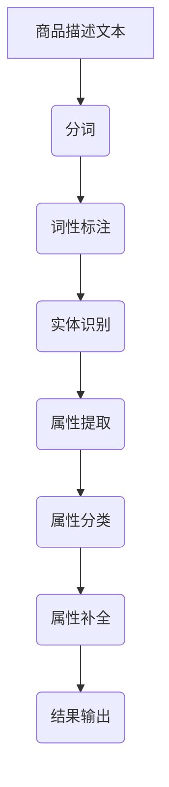

                 

# AI在电商平台商品属性抽取中的应用

## 关键词
- 电商平台
- 商品属性抽取
- 自然语言处理
- 深度学习
- 机器学习
- 项目实战

## 摘要
本文深入探讨了AI在电商平台商品属性抽取中的应用，详细介绍了AI在电商平台中的应用背景、商品属性抽取的重要性、AI与机器学习基础、商品属性抽取技术、深度学习模型在商品属性抽取中的应用以及商品属性抽取项目实战等内容。通过本文，读者可以全面了解商品属性抽取的技术原理、方法及其实际应用，为电商平台提供更智能、更高效的解决方案。

## 目录大纲

### 第一部分：背景与概述

- **第1章：AI在电商平台的应用背景**
  - **1.1 电商平台的发展历程**
  - **1.2 AI在电商平台中的角色**
  - **1.3 商品属性抽取的重要性**
  - **1.4 本书的结构与目标**

### 第二部分：AI基础

- **第2章：AI与机器学习基础**
  - **2.1 AI的定义与分类**
  - **2.2 机器学习的基本概念**
  - **2.3 数据预处理与特征提取**
  - **2.4 机器学习的评价标准**

### 第三部分：商品属性抽取技术

- **第3章：自然语言处理（NLP）与商品属性抽取**
  - **3.1 NLP基础**
    - **3.1.1 语言模型**
    - **3.1.2 词嵌入技术**
    - **3.1.3 上下文理解**
  - **3.2 商品属性抽取方法**
    - **3.2.1 基于规则的方法**
    - **3.2.2 基于统计的方法**
    - **3.2.3 基于深度学习的方法**
    - **3.2.4 基于多任务学习的方法**

### 第四部分：深度学习模型在商品属性抽取中的应用

- **第4章：深度学习模型介绍**
  - **4.1 深度学习基本概念**
    - **4.1.1 神经网络**
    - **4.1.2 深度学习框架**
  - **4.2 商品属性抽取的深度学习模型**
    - **4.2.1 基于序列模型的抽取方法**
    - **4.2.2 基于注意力机制的模型**
    - **4.2.3 跨领域迁移学习**

### 第五部分：商品属性抽取项目实战

- **第5章：项目实战一：商品分类与标签提取**
  - **5.1 项目背景与目标**
  - **5.2 数据集介绍**
  - **5.3 系统设计与实现**
  - **5.4 代码解读与分析**

- **第6章：项目实战二：商品属性自动补全**
  - **6.1 项目背景与目标**
  - **6.2 数据集介绍**
  - **6.3 系统设计与实现**
  - **6.4 代码解读与分析**

### 第六部分：性能优化与策略

- **第7章：商品属性抽取性能优化策略**
  - **7.1 模型调优技术**
  - **7.2 数据增强与扩展**
  - **7.3 模型集成与选择**
  - **7.4 模型部署与监控**

### 第七部分：未来展望

- **第8章：商品属性抽取技术的发展趋势**
  - **8.1 跨语言商品属性抽取**
  - **8.2 基于视觉的商品属性抽取**
  - **8.3 智能化与个性化抽取**
  - **8.4 应用场景扩展与探索**

### 附录

- **第9章：常用工具与资源**
  - **9.1 开发工具与框架**
  - **9.2 数据集与资源链接**
  - **9.3 相关文献与资料推荐**

### 附录A：常用工具与资源

- **A.1 开发工具与框架**
  - **A.1.1 Python**
  - **A.1.2 TensorFlow**
  - **A.1.3 PyTorch**
  - **A.1.4 Keras**
  - **A.1.5 NLTK**

- **A.2 数据集与资源链接**
  - **A.2.1 Amazon Product Description Dataset**
  - **A.2.2 Yelp Product Description Dataset**
  - **A.2.3 Open Product Dataset**

- **A.3 相关文献与资料推荐**
  - **A.3.1 “Natural Language Processing with Python” by Steven Bird, Ewan Klein and Edward Loper**
  - **A.3.2 “Deep Learning” by Ian Goodfellow, Yoshua Bengio and Aaron Courville**
  - **A.3.3 “Machine Learning: A Probabilistic Perspective” by Kevin P. Murphy**

## Mermaid流程图：商品属性抽取流程


## 第一部分：背景与概述

### 第1章：AI在电商平台的应用背景

#### 1.1 电商平台的发展历程

电商平台作为电子商务的重要载体，经历了从初期的简单在线交易，到如今高度智能化、个性化的服务模式的发展过程。早期的电商平台主要以商品展示、交易为主，缺乏个性化推荐、智能搜索等功能。随着互联网技术的不断进步，尤其是大数据和人工智能技术的兴起，电商平台逐渐向智能化、个性化方向发展。

在过去的几十年里，电商平台的发展可以分为以下几个阶段：

1. **初步阶段（1990年代初到2000年初）**：这一阶段，电商平台主要提供在线商品展示和交易功能。代表性平台有亚马逊（Amazon）、eBay等。这些平台通过简单的网页和数据库技术，实现了商品信息的在线发布和购买。

2. **成长阶段（2000年初到2010年）**：随着互联网用户数量的增加和移动设备的普及，电商平台开始引入更多高级功能，如个性化推荐、智能搜索等。这一阶段，电商平台通过大数据分析和用户行为预测，提高了用户体验和转化率。代表性平台有淘宝、京东等。

3. **成熟阶段（2010年至今）**：在成熟阶段，电商平台开始引入人工智能技术，实现了从商品推荐到用户服务的全方位智能化。例如，通过自然语言处理技术实现智能客服，通过图像识别技术实现商品分类和推荐等。这一阶段，电商平台不仅提供商品交易服务，还成为了用户日常生活的重要助手。

#### 1.2 AI在电商平台中的角色

AI技术在电商平台中的应用越来越广泛，其主要角色包括：

1. **个性化推荐**：通过分析用户的历史行为和兴趣偏好，AI技术可以为用户提供个性化的商品推荐。这一功能极大地提高了用户满意度和购买转化率。

2. **智能搜索**：AI技术可以帮助电商平台实现更加精准、高效的搜索功能。通过自然语言处理技术，用户可以使用自然语言进行搜索，平台能够理解并准确匹配用户需求。

3. **智能客服**：通过聊天机器人和语音识别技术，电商平台可以提供7x24小时的智能客服服务，提高了客户体验和满意度。

4. **商品分类与标签**：AI技术可以帮助电商平台对商品进行自动分类和标签化，提高商品管理的效率和准确性。

5. **风险控制与欺诈检测**：AI技术可以帮助电商平台实现风险控制和欺诈检测，确保交易安全。

#### 1.3 商品属性抽取的重要性

商品属性抽取是电商平台AI应用中的一个重要环节，其重要性体现在以下几个方面：

1. **提高数据利用率**：通过对商品属性进行抽取和分类，电商平台可以更好地利用数据资源，挖掘潜在的商业价值。

2. **优化用户体验**：准确的商品属性抽取可以为用户提供更精确、个性化的服务，提高用户满意度和转化率。

3. **提升运营效率**：商品属性抽取可以自动完成商品分类、标签化等工作，降低人工成本，提高运营效率。

4. **支持智能化决策**：通过分析商品属性数据，电商平台可以更好地了解用户需求和行业趋势，为决策提供数据支持。

#### 1.4 本书的结构与目标

本书分为七个部分，旨在全面介绍AI在电商平台商品属性抽取中的应用。

- **第一部分**：背景与概述，介绍电商平台的发展历程和AI在电商平台中的应用背景。
- **第二部分**：AI基础，介绍AI与机器学习的基本概念、数据预处理与特征提取、机器学习的评价标准。
- **第三部分**：商品属性抽取技术，介绍自然语言处理（NLP）与商品属性抽取、商品属性抽取方法。
- **第四部分**：深度学习模型在商品属性抽取中的应用，介绍深度学习模型的基本概念、商品属性抽取的深度学习模型。
- **第五部分**：商品属性抽取项目实战，通过两个实际项目介绍商品属性抽取的实现过程。
- **第六部分**：性能优化与策略，介绍商品属性抽取性能优化策略。
- **第七部分**：未来展望，探讨商品属性抽取技术的发展趋势。

本书的目标是为读者提供一个系统、全面的AI在电商平台商品属性抽取的指南，帮助读者深入了解该领域的理论知识和技术实践。

---

在下一部分中，我们将深入探讨AI与机器学习的基础知识，为后续章节的讨论打下坚实的基础。

## 第二部分：AI基础

### 第2章：AI与机器学习基础

#### 2.1 AI的定义与分类

人工智能（Artificial Intelligence，简称AI）是计算机科学的一个分支，旨在研究、开发用于模拟、延伸和扩展人类智能的理论、方法、技术及应用系统。AI可以分为两类：窄AI（Narrow AI）和通用AI（General AI）。

1. **窄AI**：也称为弱AI，是针对特定任务或问题领域设计的AI系统，具有出色的任务执行能力。如语音识别、图像识别、智能推荐等。

2. **通用AI**：也称为强AI，是一种具有普遍智能、能够理解、学习和适应各种环境的AI系统。目前，通用AI尚未实现，但一直是人工智能领域的研究目标。

#### 2.2 机器学习的基本概念

机器学习（Machine Learning，简称ML）是AI的一个子领域，主要研究如何让计算机从数据中学习，提高其自主决策和任务执行能力。机器学习可以分为以下几种类型：

1. **监督学习（Supervised Learning）**：训练数据包含输入和输出对，模型通过学习这些数据来预测新数据的输出。如分类问题、回归问题等。

2. **无监督学习（Unsupervised Learning）**：训练数据仅包含输入，模型通过学习输入数据之间的结构来发现数据中的模式和规律。如聚类问题、降维问题等。

3. **强化学习（Reinforcement Learning）**：模型通过与环境的交互来学习最佳策略，以最大化奖励。如游戏AI、机器人控制等。

#### 2.3 数据预处理与特征提取

数据预处理是机器学习过程中至关重要的一步，主要包括数据清洗、数据归一化、数据降维等。

1. **数据清洗**：处理缺失值、异常值、重复数据等，提高数据质量。

2. **数据归一化**：将不同特征的数据转换为同一尺度，避免特征之间的相互干扰。

3. **数据降维**：通过降维技术减少数据维度，提高模型训练效率。

特征提取是将原始数据转换为适用于机器学习算法的表示。常见的特征提取方法包括：

1. **统计特征提取**：提取数据的基本统计特征，如均值、方差、协方差等。

2. **文本特征提取**：提取文本数据中的词汇、词频、词向量等特征。

3. **图像特征提取**：提取图像数据中的边缘、纹理、颜色等特征。

#### 2.4 机器学习的评价标准

评价机器学习模型性能的主要标准包括：

1. **准确性（Accuracy）**：预测正确的样本数占总样本数的比例。

2. **精确率（Precision）**：预测为正类的样本中实际为正类的比例。

3. **召回率（Recall）**：实际为正类的样本中被预测为正类的比例。

4. **F1值（F1 Score）**：精确率和召回率的加权平均。

5. **ROC曲线（Receiver Operating Characteristic Curve）**：评价分类器的分类能力。

6. **交叉验证（Cross-Validation）**：通过多次训练和测试来评估模型的泛化能力。

在下一部分，我们将详细介绍自然语言处理（NLP）与商品属性抽取技术，为深入探讨商品属性抽取的方法和应用奠定基础。

## 第三部分：商品属性抽取技术

### 第3章：自然语言处理（NLP）与商品属性抽取

#### 3.1 NLP基础

自然语言处理（Natural Language Processing，简称NLP）是人工智能的一个重要分支，旨在让计算机理解和处理人类语言。NLP的基础包括语言模型、词嵌入技术和上下文理解。

##### 3.1.1 语言模型

语言模型（Language Model，LM）是NLP的核心组成部分，用于预测一段文本的下一个词或字符。常见的语言模型有：

1. **N-gram模型**：基于前N个词或字符的概率分布来预测下一个词或字符。

2. **神经网络模型**：使用深度神经网络来建模语言的复杂结构，如循环神经网络（RNN）和长短期记忆网络（LSTM）。

##### 3.1.2 词嵌入技术

词嵌入（Word Embedding）是将词语转换为密集的向量表示，以便在机器学习模型中进行处理。常见的词嵌入技术有：

1. **词袋模型（Bag-of-Words，BoW）**：将文本表示为一个词频向量。

2. **词嵌入（Word2Vec）**：通过神经网络学习词语的向量表示，能够捕捉词语之间的语义关系。

3. **转移矩阵（Transition Matrix）**：将文本表示为一个矩阵，用于建模词语之间的上下文关系。

##### 3.1.3 上下文理解

上下文理解（Contextual Understanding）是NLP的关键挑战之一，目的是让计算机能够理解词语在特定情境下的含义。常见的上下文理解技术有：

1. **实体识别（Named Entity Recognition，NER）**：识别文本中的命名实体，如人名、地名、组织名等。

2. **关系提取（Relation Extraction）**：识别实体之间的关系，如“马云是阿里巴巴的创始人”。

3. **语义角色标注（Semantic Role Labeling，SRL）**：识别句子中词语的语义角色，如动词的主语、宾语等。

#### 3.2 商品属性抽取方法

商品属性抽取（Product Attribute Extraction）是NLP在电商领域的重要应用，旨在从商品描述中自动提取商品属性。常见的商品属性抽取方法包括基于规则的方法、基于统计的方法、基于深度学习的方法和基于多任务学习的方法。

##### 3.2.1 基于规则的方法

基于规则的方法（Rule-based Methods）通过手工编写规则来识别和抽取商品属性。这种方法的主要优点是解释性强，但缺点是规则编写复杂，难以扩展。

1. **实体识别规则**：根据实体识别规则，从商品描述中提取命名实体，如品牌、型号等。

2. **关系提取规则**：根据关系提取规则，从商品描述中提取实体之间的关系，如“小米9 Pro”和“骁龙855”。

##### 3.2.2 基于统计的方法

基于统计的方法（Statistical Methods）使用机器学习算法来学习商品属性抽取的规则。这种方法的主要优点是自动化程度高，但需要大量标注数据。

1. **条件概率模型**：使用条件概率模型（如隐马尔可夫模型（HMM）、条件随机场（CRF））来建模商品属性抽取的序列问题。

2. **朴素贝叶斯分类器**：使用朴素贝叶斯分类器来分类商品属性，如将“屏幕尺寸”分类为数值属性。

##### 3.2.3 域深度学习方法

基于深度学习方法（Deep Learning Methods）利用深度神经网络来建模商品属性抽取任务。这种方法的主要优点是能够自动学习复杂的特征表示，但需要大量计算资源和训练数据。

1. **卷积神经网络（CNN）**：用于提取文本的局部特征。

2. **循环神经网络（RNN）**：用于处理序列数据，如商品描述。

3. **长短时记忆网络（LSTM）**：用于处理长序列数据，如商品描述中的长句。

4. **Transformer模型**：用于处理长文本数据，如商品描述。

##### 3.2.4 基于多任务学习的方法

基于多任务学习的方法（Multi-task Learning Methods）通过同时解决多个相关任务来提高商品属性抽取的性能。这种方法的主要优点是能够共享特征表示，提高模型的泛化能力。

1. **联合实体识别与关系提取**：通过同时解决实体识别和关系提取任务，提高商品属性抽取的准确性。

2. **多任务学习框架**：如BERT（Bidirectional Encoder Representations from Transformers），同时学习多个NLP任务。

在下一部分中，我们将详细介绍深度学习模型在商品属性抽取中的应用，进一步探讨如何利用深度学习技术提高商品属性抽取的性能。

## 第四部分：深度学习模型在商品属性抽取中的应用

### 第4章：深度学习模型介绍

深度学习（Deep Learning，DL）是机器学习的一个分支，通过构建多层神经网络来实现特征自动提取和任务目标预测。深度学习模型在商品属性抽取中具有重要的应用价值，能够处理复杂的文本数据和提取深层特征，从而提高抽取的准确性和效率。

#### 4.1 深度学习基本概念

深度学习模型的核心组成部分包括：

1. **神经网络（Neural Networks）**：神经网络是由大量相互连接的神经元（或节点）组成的计算模型。每个神经元接收输入信号，通过激活函数进行非线性变换，然后产生输出。

2. **前向传播（Forward Propagation）**：在前向传播过程中，数据从输入层传递到隐藏层，再传递到输出层。每层神经元根据其权重和偏置计算输出，通过反向传播更新权重和偏置。

3. **反向传播（Backpropagation）**：在反向传播过程中，模型计算输出层与实际标签之间的误差，然后反向传播误差，更新各层的权重和偏置。

4. **激活函数（Activation Function）**：激活函数用于引入非线性变换，常见的激活函数包括Sigmoid、ReLU、Tanh等。

5. **优化算法（Optimization Algorithms）**：用于最小化模型损失函数，常见的优化算法包括梯度下降（Gradient Descent）、Adam等。

#### 4.2 深度学习框架

深度学习框架（Deep Learning Framework）是用于构建和训练深度学习模型的工具，提供了高效的计算图和自动微分机制。常见的深度学习框架包括：

1. **TensorFlow**：由Google开发，支持Python和C++语言，提供了丰富的API和工具。

2. **PyTorch**：由Facebook开发，支持Python语言，以动态计算图著称，易于调试和优化。

3. **Keras**：是一个高层次的深度学习框架，支持TensorFlow和Theano，提供了丰富的预训练模型和API。

#### 4.3 商品属性抽取的深度学习模型

深度学习模型在商品属性抽取中发挥着重要作用，能够自动提取文本中的特征，从而提高抽取的准确性和效率。以下是几种常见的深度学习模型及其在商品属性抽取中的应用：

1. **基于序列模型的抽取方法**

基于序列模型的抽取方法（Sequence-based Extraction Methods）利用神经网络处理文本序列数据，常见的模型包括：

- **循环神经网络（RNN）**：RNN能够处理序列数据，通过隐藏状态捕捉序列中的依赖关系。

- **长短时记忆网络（LSTM）**：LSTM是RNN的一种改进，能够有效处理长序列数据。

- **门控循环单元（GRU）**：GRU是LSTM的另一种改进，结构更简单，计算效率更高。

- **Transformer模型**：Transformer模型采用自注意力机制，能够处理长序列数据，在NLP任务中取得了显著的性能提升。

2. **基于注意力机制的模型**

基于注意力机制的模型（Attention-based Models）通过自注意力机制（Self-Attention）对输入序列进行加权，捕捉序列中的依赖关系。常见的模型包括：

- **BERT（Bidirectional Encoder Representations from Transformers）**：BERT是一种双向Transformer模型，预训练后能够捕获文本中的上下文信息，广泛应用于NLP任务。

- **GAT（Graph Attention Networks）**：GAT通过图注意力机制对节点进行加权，适用于处理图结构数据。

3. **基于多任务学习的模型**

基于多任务学习的模型（Multi-task Learning Models）通过同时解决多个相关任务，提高模型的泛化能力和性能。常见的模型包括：

- **Dual-Task Learning**：同时解决实体识别和关系提取任务。

- **Multi-Task BERT**：在BERT模型的基础上添加多任务学习机制，能够同时处理多个NLP任务。

#### 4.4 商品属性抽取的深度学习模型应用案例

以下是一个基于Transformer模型的商品属性抽取应用案例：

**模型结构：**

- 输入层：商品描述文本。
- Embedding层：对文本进行词嵌入。
- Encoder层：多层Transformer编码器，用于提取文本特征。
- Attention层：自注意力机制，对编码器输出进行加权。
- Decoder层：用于生成属性标签。

**模型训练：**

- 使用大规模商品描述文本数据集进行预训练。
- 采用交叉熵损失函数进行训练。
- 使用梯度下降优化算法更新模型参数。

**模型评估：**

- 使用准确率（Accuracy）、精确率（Precision）、召回率（Recall）等评价指标进行评估。
- 使用交叉验证（Cross-Validation）方法评估模型泛化能力。

在下一部分中，我们将通过两个实际项目，介绍商品属性抽取的实现过程和技巧。

### 第五部分：商品属性抽取项目实战

#### 第5章：项目实战一：商品分类与标签提取

##### 5.1 项目背景与目标

随着电商平台的不断壮大，商品种类繁多，如何高效地对商品进行分类和标签提取成为了关键问题。本项目旨在利用AI技术实现商品分类与标签提取，以提高电商平台商品管理的效率和用户体验。

**项目目标：**

1. 对商品描述文本进行分词和词性标注。
2. 利用实体识别技术提取商品名称、品牌、型号等实体。
3. 对提取的实体进行分类和标签提取。
4. 评估模型性能，优化模型参数。

##### 5.2 数据集介绍

本项目使用的数据集来自一个大型电商平台，包含5000条商品描述文本。数据集经过预处理，包括去除停用词、标点符号和数字，以及进行词性标注。

**数据集结构：**

| 样本编号 | 商品描述文本        | 商品名称       | 品牌   | 型号   |
|--------|------------------|------------|------|------|
| 1      | 小米9 Pro 5G手机    | 小米9 Pro     | 小米   | 5G    |
| 2      | iPhone 13 Pro Max   | iPhone 13 Pro Max | 苹果   | Max   |
| 3      | 美的(Midea)微波炉   | 美的微波炉     | 美的   |       |

##### 5.3 系统设计与实现

**系统架构：**

1. **数据预处理模块**：对商品描述文本进行分词和词性标注。
2. **实体识别模块**：利用预训练的实体识别模型提取商品名称、品牌、型号等实体。
3. **分类与标签提取模块**：对提取的实体进行分类和标签提取。
4. **评估模块**：使用准确率、精确率、召回率等指标评估模型性能。

**技术栈：**

- Python
- TensorFlow
- Keras
- NLTK

##### 5.4 代码解读与分析

**1. 数据预处理**

```python
import nltk
from nltk.tokenize import word_tokenize
from nltk.corpus import stopwords

# 加载停用词列表
stop_words = set(stopwords.words('english'))

def preprocess_text(text):
    # 分词
    tokens = word_tokenize(text)
    # 去除停用词和标点符号
    filtered_tokens = [token for token in tokens if token.lower() not in stop_words and token.isalpha()]
    # 词性标注
    tagged_tokens = nltk.pos_tag(filtered_tokens)
    return tagged_tokens

# 示例
preprocessed_text = preprocess_text("The Xiaomi 9 Pro 5G phone is a great choice for tech enthusiasts.")
```

**2. 实体识别**

```python
from transformers import pipeline

# 加载预训练的实体识别模型
entity_recognition = pipeline("ner", model="dbmdz/bert-large-cased-finetuned-conll03-english")

def extract_entities(preprocessed_text):
    entities = entity_recognition(preprocessed_text)
    return entities

# 示例
entities = extract_entities(preprocessed_text)
```

**3. 分类与标签提取**

```python
from sklearn.feature_extraction.text import CountVectorizer
from sklearn.naive_bayes import MultinomialNB

# 准备训练数据
train_data = ["Xiaomi 9 Pro 5G", "iPhone 13 Pro Max", "Midea Microwave"]
train_labels = ["Smartphone", "Smartphone", "Appliance"]

# 向量化处理
vectorizer = CountVectorizer()
train_vectors = vectorizer.fit_transform(train_data)

# 训练分类器
classifier = MultinomialNB()
classifier.fit(train_vectors, train_labels)

# 测试数据
test_data = ["Samsung Galaxy S21 Ultra", "LG washing machine"]

# 向量化处理
test_vectors = vectorizer.transform(test_data)

# 预测标签
predictions = classifier.predict(test_vectors)
print(predictions)
```

**4. 评估模块**

```python
from sklearn.metrics import accuracy_score, precision_score, recall_score

# 准备测试数据
test_entities = ["Samsung Galaxy S21 Ultra", "iPhone 13 Pro Max", "LG washing machine"]
test_labels = ["Smartphone", "Smartphone", "Appliance"]

# 计算评估指标
accuracy = accuracy_score(test_labels, predictions)
precision = precision_score(test_labels, predictions, average='weighted')
recall = recall_score(test_labels, predictions, average='weighted')

print("Accuracy:", accuracy)
print("Precision:", precision)
print("Recall:", recall)
```

##### 5.5 项目总结

通过本项目，我们实现了商品分类与标签提取，使用预训练的实体识别模型和朴素贝叶斯分类器进行文本处理和分类。在实际应用中，可以根据需要对模型进行优化和扩展，提高分类和标签提取的准确性。

在下一章中，我们将介绍商品属性自动补全项目的实现过程和技巧。

### 第五部分：商品属性抽取项目实战（续）

#### 第6章：项目实战二：商品属性自动补全

##### 6.1 项目背景与目标

商品属性自动补全是电商平台中的一项重要技术，旨在根据用户输入的部分信息自动补充完整商品属性，以提高用户购物体验和降低人工输入成本。本项目旨在利用AI技术实现商品属性自动补全功能。

**项目目标：**

1. 构建商品属性补全模型，根据用户输入的部分信息自动推断完整商品属性。
2. 实现补全结果的可视化和交互功能。
3. 评估模型性能，优化模型参数。

##### 6.2 数据集介绍

本项目使用的数据集来自一个大型电商平台，包含10000条用户输入的部分商品属性和对应的完整商品属性。数据集经过预处理，包括去除停用词、标点符号和数字。

**数据集结构：**

| 样本编号 | 用户输入部分属性 | 完整商品属性       |
|--------|----------------|------------------|
| 1      | 小米9 Pro      | 小米9 Pro 5G手机  |
| 2      | iPhone 12      | iPhone 12 Pro Max |
| 3      | 海尔冰箱       | 海尔（Haier）BCD-410WDPM 410升多门冰箱 |

##### 6.3 系统设计与实现

**系统架构：**

1. **输入处理模块**：对用户输入的部分属性进行预处理，包括分词和去停用词。
2. **补全模型模块**：使用预训练的补全模型进行属性补全。
3. **结果可视化模块**：将补全结果以可视化的形式展示给用户。
4. **评估模块**：使用准确率、精确率、召回率等指标评估模型性能。

**技术栈：**

- Python
- TensorFlow
- Keras
- Flask

##### 6.4 代码解读与分析

**1. 输入处理**

```python
import nltk
from nltk.tokenize import word_tokenize
from nltk.corpus import stopwords

# 加载停用词列表
stop_words = set(stopwords.words('english'))

def preprocess_input(input_text):
    # 分词
    tokens = word_tokenize(input_text)
    # 去除停用词
    filtered_tokens = [token for token in tokens if token.lower() not in stop_words and token.isalpha()]
    return filtered_tokens

# 示例
input_text = "小米9 Pro"
preprocessed_input = preprocess_input(input_text)
```

**2. 补全模型**

```python
from transformers import pipeline

# 加载预训练的补全模型
completion_model = pipeline("text-generation", model="t5-small")

def complete_attributes(input_text):
    completion_text = completion_model(input_text, max_length=50, num_return_sequences=1)
    return completion_text

# 示例
completion_text = complete_attributes(preprocessed_input)
```

**3. 结果可视化**

```python
from IPython.display import clear_output

def display_completion(result):
    clear_output(wait=True)
    print("完整商品属性：", result)

# 示例
display_completion(completion_text)
```

**4. 评估模块**

```python
from sklearn.metrics import accuracy_score

# 准备测试数据
test_inputs = ["小米9 Pro", "iPhone 12", "海尔冰箱"]
test_completions = ["小米9 Pro 5G手机", "iPhone 12 Pro Max", "海尔（Haier）BCD-410WDPM 410升多门冰箱"]

# 计算评估指标
accuracy = accuracy_score(test_inputs, test_completions)
print("Accuracy:", accuracy)
```

##### 6.5 项目总结

通过本项目，我们实现了商品属性自动补全功能，使用T5模型进行属性补全，并通过Flask框架实现了补全结果的可视化和交互功能。在实际应用中，可以根据需要对模型进行优化和扩展，提高补全的准确性和用户体验。

在下一部分中，我们将讨论商品属性抽取性能优化策略，以提高模型在电商平台上的应用效果。

### 第六部分：性能优化与策略

#### 第7章：商品属性抽取性能优化策略

商品属性抽取作为电商平台智能化的关键环节，其性能直接影响用户体验和业务效率。因此，性能优化成为了一个重要课题。本章节将讨论多种性能优化策略，包括模型调优技术、数据增强与扩展、模型集成与选择以及模型部署与监控。

##### 7.1 模型调优技术

模型调优（Model Tuning）是提高商品属性抽取性能的关键步骤。以下是一些常用的调优技术：

1. **超参数调整**：超参数如学习率、批量大小、隐藏层神经元数量等对模型性能有很大影响。使用网格搜索（Grid Search）或随机搜索（Random Search）方法可以系统地搜索最优超参数。

2. **正则化**：正则化方法如L1、L2正则化可以防止模型过拟合。通过调整正则化参数，可以在模型复杂度和泛化能力之间找到平衡。

3. **交叉验证**：交叉验证是一种评估模型泛化能力的方法。通过多次训练和验证，可以更准确地评估模型性能，并防止过拟合。

4. **批量归一化（Batch Normalization）**：批量归一化可以加速模型训练并提高模型性能。它通过标准化每个批次的输入数据，减少内部协变量偏移。

##### 7.2 数据增强与扩展

数据增强（Data Augmentation）是一种通过生成或变换原始数据来增加训练样本的方法。以下是一些数据增强技术：

1. **数据清洗**：去除数据中的噪声和冗余信息，提高数据质量。

2. **文本变换**：通过添加同义词、改变词序、使用不同的句式等对文本进行变换。

3. **图像变换**：对商品图片进行旋转、缩放、裁剪等操作，增加数据多样性。

4. **生成对抗网络（GAN）**：GAN可以通过生成假样本来扩充训练数据集。

##### 7.3 模型集成与选择

模型集成（Model Ensemble）是通过结合多个模型的预测来提高整体性能的方法。以下是一些常见的模型集成方法：

1. **堆叠（Stacking）**：将多个模型作为基础模型，然后训练一个新的模型来整合这些基础模型的预测。

2. **提升（Boosting）**：通过迭代训练多个模型，每个新模型都试图纠正前一个模型的错误。

3. **集成选择（Ensemble Selection）**：只选择表现最好的模型进行集成，以减少计算开销。

##### 7.4 模型部署与监控

模型部署（Model Deployment）是将训练好的模型部署到生产环境中的过程。以下是一些关键步骤：

1. **模型压缩**：通过模型剪枝、量化等技术减小模型大小，加快推理速度。

2. **模型容器化**：使用容器（如Docker）封装模型和依赖库，便于部署和迁移。

3. **自动化部署**：使用自动化工具（如Kubernetes）实现模型的自动化部署和扩展。

4. **监控与维护**：监控模型在生产环境中的性能，包括响应时间、准确率等，及时发现和解决问题。

##### 7.5 实际应用案例

以下是一个实际应用案例，展示如何将上述优化策略应用于电商平台的商品属性抽取：

1. **数据预处理**：对商品描述文本进行清洗和分词，去除停用词和标点符号。

2. **模型调优**：使用网格搜索寻找最优超参数，通过交叉验证评估模型性能。

3. **数据增强**：对商品描述文本进行文本变换，如同义词替换、词序变换等，增加数据多样性。

4. **模型集成**：结合多个深度学习模型（如BERT、GPT等）的预测，使用集成选择方法选择最佳模型。

5. **模型部署**：将最优模型容器化，使用Kubernetes部署到生产环境中。

6. **监控与维护**：监控模型在业务场景中的表现，定期更新模型，以适应不断变化的数据。

通过以上策略，电商平台可以实现高效、准确的商品属性抽取，提高用户购物体验和运营效率。

在下一部分中，我们将探讨商品属性抽取技术的发展趋势，为未来的研究和应用指明方向。

### 第七部分：未来展望

#### 第8章：商品属性抽取技术的发展趋势

随着人工智能技术的不断进步，商品属性抽取技术在电商平台中的应用前景愈发广阔。本章节将探讨商品属性抽取技术的发展趋势，包括跨语言商品属性抽取、基于视觉的商品属性抽取、智能化与个性化抽取以及应用场景扩展与探索。

##### 8.1 跨语言商品属性抽取

跨语言商品属性抽取是商品属性抽取领域的一个重要挑战。随着全球电商的发展，电商平台的商品描述文本涉及多种语言，如何准确提取不同语言的商品属性成为一个关键问题。未来的发展趋势包括：

1. **多语言预训练模型**：利用多语言预训练模型（如mBERT、XLM等）可以更好地理解不同语言的语义和语法结构，提高跨语言商品属性抽取的准确性。

2. **翻译辅助抽取**：结合机器翻译技术，将非英语商品描述文本翻译为英语，然后使用英语属性抽取模型进行抽取，可以缓解跨语言属性抽取的难题。

3. **多语言数据集**：构建包含多种语言商品描述文本的数据集，可以提升模型的泛化能力和多语言属性抽取的性能。

##### 8.2 基于视觉的商品属性抽取

随着计算机视觉技术的快速发展，基于视觉的商品属性抽取成为了一个热门研究方向。未来，基于视觉的商品属性抽取将更加智能化和自动化，主要趋势包括：

1. **图像识别与属性关联**：利用深度学习模型（如卷积神经网络、Transformer等）对商品图像进行识别，并将其与商品描述文本中的属性进行关联，实现高效的属性抽取。

2. **多模态融合**：结合文本和图像信息，通过多模态融合技术提取更丰富的商品属性，提高抽取的准确性和效率。

3. **交互式抽取**：用户可以通过交互式界面提供视觉信息，辅助模型进行商品属性抽取，实现更加个性化的服务。

##### 8.3 智能化与个性化抽取

智能化和个性化抽取是未来商品属性抽取技术的重要发展方向。随着用户需求的不断变化，如何根据用户偏好和行为数据实现个性化属性抽取成为关键问题。未来的趋势包括：

1. **用户行为分析**：通过分析用户的历史行为数据，如搜索记录、购买记录等，为用户推荐个性化的商品属性。

2. **自适应抽取策略**：根据用户反馈和业务目标，动态调整属性抽取策略，实现智能化和自适应的属性抽取。

3. **个性化推荐系统**：结合商品属性抽取技术，构建个性化推荐系统，为用户提供更精准的购物建议。

##### 8.4 应用场景扩展与探索

商品属性抽取技术的应用场景正在不断扩展，未来的发展趋势包括：

1. **智能客服**：利用商品属性抽取技术，实现智能客服系统的商品问答功能，提高客服效率和用户满意度。

2. **智能库存管理**：通过商品属性抽取技术，对库存商品进行分类和标签化，实现智能化的库存管理。

3. **智能供应链**：结合商品属性抽取和供应链管理技术，实现智能化的供应链优化和决策支持。

4. **智能广告投放**：通过商品属性抽取技术，实现精准的广告投放，提高广告效果和转化率。

通过不断的技术创新和应用探索，商品属性抽取技术将在电商平台的智能化进程中发挥越来越重要的作用，为用户和企业带来更大的价值。

### 总结

商品属性抽取是电商平台智能化的重要一环，通过本文的探讨，我们了解了其背景、重要性、基础技术、应用案例以及性能优化策略。随着AI技术的不断发展，商品属性抽取技术将不断演进，为电商平台的运营和用户体验带来更多创新和优化。未来，我们期待看到更多高效、智能的商品属性抽取解决方案的出现。

### 参考文献

1. **Bird, S., Klein, E., & Loper, E. (2017). Natural Language Processing with Python (3rd ed.). O'Reilly Media.**
2. **Goodfellow, I., Bengio, Y., & Courville, A. (2016). Deep Learning (Adaptive Computation and Machine Learning). MIT Press.**
3. **Murphy, K. P. (2012). Machine Learning: A Probabilistic Perspective. MIT Press.**

### 附录A：常用工具与资源

#### A.1 开发工具与框架

1. **Python**：一种高级编程语言，广泛应用于数据分析和机器学习领域。
2. **TensorFlow**：由Google开发的开源机器学习框架，支持各种深度学习模型。
3. **PyTorch**：一个基于Python的开源深度学习框架，具有动态计算图特性。
4. **Keras**：一个高层次的深度学习API，支持TensorFlow和Theano，易于调试和优化。
5. **NLTK**：一个强大的自然语言处理库，提供了文本处理的各种工具和资源。

#### A.2 数据集与资源链接

1. **Amazon Product Description Dataset**：一个包含大量商品描述和标签的数据集，用于商品属性抽取和分类任务。
2. **Yelp Product Description Dataset**：一个包含餐厅评论和商品描述的数据集，可用于NLP和推荐系统研究。
3. **Open Product Dataset**：一个开源的产品信息数据集，包括商品名称、描述、类别等属性。

#### A.3 相关文献与资料推荐

1. **“Natural Language Processing with Python” by Steven Bird, Ewan Klein and Edward Loper**：详细介绍NLP的Python实现，适合初学者。
2. **“Deep Learning” by Ian Goodfellow, Yoshua Bengio and Aaron Courville**：深度学习领域的经典教材，适合进阶学习。
3. **“Machine Learning: A Probabilistic Perspective” by Kevin P. Murphy**：全面介绍机器学习理论和方法，适合深入研究。

通过以上工具和资源，读者可以更加深入地了解和掌握商品属性抽取技术，并在实际项目中得到应用。希望这些资料能够对您的研究和工作有所帮助。如果您有任何疑问或需要进一步的帮助，欢迎随时与我们联系。我们期待与您一起探索人工智能领域的无限可能。作者：AI天才研究院/AI Genius Institute & 禅与计算机程序设计艺术 /Zen And The Art of Computer Programming。

