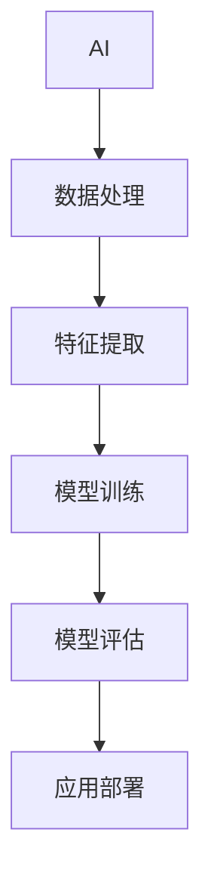

                 

# AI在科学研究中的突破

## 关键词
- 人工智能
- 科学研究
- 机器学习
- 深度学习
- 生物医学
- 物理学
- 天文学
- 地球科学
- 量子计算

## 摘要
本文深入探讨了人工智能（AI）在科学研究领域的突破性应用。从AI的基础理论出发，分析了机器学习和深度学习在科学研究中的关键作用。随后，文章详细阐述了AI在生物医学、物理学、天文学和地球科学等领域的具体应用，展示了AI如何通过大数据分析、模型预测和图像处理等手段推动科学研究的发展。最后，文章展望了AI与量子计算等未来技术的结合，以及AI在科学研究中的伦理和法律挑战，为读者呈现了一幅AI在科学研究中光辉的未来蓝图。

---

## 第一部分：AI在科学研究的基础理论

### 第1章: AI概述与科学研究中的角色

### 1.1 AI的定义与历史发展

人工智能（AI）是一种模拟人类智能行为的计算机技术，旨在使机器具备感知、学习、推理和解决问题等能力。AI的发展可以追溯到20世纪50年代，当时图灵提出了著名的“图灵测试”，标志着人工智能领域的诞生。此后，随着计算机技术的飞速发展，AI经历了数次起伏和突破。

早期的AI研究主要集中在规则推理和知识表示上，如专家系统和逻辑推理系统。然而，这些方法在处理复杂问题时显得力不从心。随着大数据和计算能力的提升，机器学习和深度学习逐渐成为AI研究的主流。

机器学习是AI的一个重要分支，其核心思想是让计算机从数据中学习规律，自动优化模型参数。深度学习是机器学习的一种特殊形式，通过多层神经网络模拟人脑的神经元结构，实现自动特征提取和复杂模式的识别。

### 1.2 AI在科学研究中的重要性

AI在科学研究中的重要性体现在以下几个方面：

1. **大数据分析**：科学研究往往产生大量数据，AI能够高效处理这些数据，提取有用信息，为科学家提供决策支持。
2. **模型预测**：AI可以帮助科学家建立和优化预测模型，提高实验的准确性和效率。
3. **自动化实验**：通过机器人技术和自动化系统，AI能够实现实验过程的自动化，降低人力成本，提高实验的重复性和可靠性。
4. **发现新知识**：AI可以在未经人类指导的情况下，从海量数据中发现新的规律和知识，推动科学研究的边界。

### 1.3 AI与大数据、云计算的关系

大数据和云计算为AI的发展提供了强有力的支持。大数据为AI提供了丰富的训练数据，使其能够学习和优化模型。云计算则提供了强大的计算资源，使AI算法能够快速运行和处理海量数据。

在大数据时代，数据的质量和数量成为科学研究成功的关键。AI能够通过对大数据的深入分析，发现隐藏在数据中的模式和趋势，为科学家提供新的视角和研究方向。

云计算平台为AI算法提供了弹性计算能力，可以根据需求动态调整计算资源。这使得科学家能够快速部署AI模型，进行大规模数据处理和实验，大大提高了研究效率。

### 第2章: 机器学习在科学研究的应用

#### 2.1 监督学习、无监督学习和强化学习

机器学习是AI的核心技术之一，根据学习方式的不同，可以分为监督学习、无监督学习和强化学习。

- **监督学习**：监督学习是一种有监督的学习方法，通过已知输入和输出数据来训练模型。常见的监督学习算法包括线性回归、逻辑回归、支持向量机（SVM）和决策树等。

  **监督学习算法的基本原理**：

  $$ J(\theta) = \frac{1}{m} \sum_{i=1}^{m} (h_\theta(x^{(i)}) - y^{(i)})^2 $$

  其中，\( h_\theta(x) \) 是模型预测输出，\( y \) 是真实标签，\( \theta \) 是模型参数。

  **监督学习算法的优化过程**：

  ```python
  # 伪代码：梯度下降法优化线性回归模型
  for epoch in range(EPOCHS):
      predictions = linear_regression(X, theta)
      error = (predictions - y) ** 2
      gradient = 2/m * (X.T.dot(error))
      theta = theta - alpha * gradient
  ```

- **无监督学习**：无监督学习是一种无监督的学习方法，模型不需要已知输出数据，仅从输入数据中学习数据的分布和结构。常见的无监督学习算法包括聚类、主成分分析（PCA）和自编码器等。

  **无监督学习算法的基本原理**：

  $$ Z = \frac{X - \mu}{\sigma} $$

  其中，\( X \) 是输入数据，\( \mu \) 是均值，\( \sigma \) 是标准差。

  **无监督学习算法的应用场景**：

  - **聚类分析**：将数据分为多个类，每个类具有相似的特性。
  - **降维**：通过降低数据的维度，提高计算效率和可视化效果。

- **强化学习**：强化学习是一种通过奖励机制来训练模型的方法。模型在环境中执行动作，并根据环境的反馈调整策略，以达到最大化长期回报。

  **强化学习算法的基本原理**：

  $$ Q(s, a) = r + \gamma \max_{a'} Q(s', a') $$

  其中，\( Q(s, a) \) 是状态-动作价值函数，\( r \) 是即时奖励，\( \gamma \) 是折扣因子。

  **强化学习算法的应用场景**：

  - **游戏**：如电子游戏、棋类游戏等。
  - **自动化系统**：如自动驾驶、机器人控制等。

#### 2.2 常见机器学习算法及其应用场景

机器学习算法在科学研究中有着广泛的应用。以下是几种常见的机器学习算法及其应用场景：

- **线性回归**：用于预测线性关系的变量，常用于生物医学数据分析和气象预报。
- **逻辑回归**：用于分类问题，如疾病诊断和客户流失预测。
- **支持向量机（SVM）**：用于分类和回归问题，特别适用于高维数据。
- **决策树**：用于分类和回归问题，易于解释和理解。
- **随机森林**：基于决策树的集成方法，提高模型的预测准确性和稳定性。
- **神经网络**：用于复杂的模式识别和预测问题，如图像识别和语音识别。

#### 2.3 机器学习在科学研究中的挑战与机遇

机器学习在科学研究中的应用面临着一系列挑战：

- **数据质量问题**：科学研究中的数据往往存在噪声、缺失和不一致性，影响模型的效果。
- **模型可解释性**：机器学习模型通常被认为是“黑箱”，缺乏可解释性，难以被科学家理解和信任。
- **计算资源**：训练复杂的机器学习模型需要大量的计算资源和时间。

然而，这些挑战也带来了机遇：

- **数据驱动的科学研究**：通过机器学习，科学家可以更好地利用大数据，发现新的规律和知识。
- **自动化实验**：机器学习可以帮助科学家自动化实验过程，提高实验的效率和准确性。
- **跨学科研究**：机器学习与生物学、物理学、天文学等学科的交叉应用，推动科学研究的融合和发展。

### 第3章: 深度学习与神经网络在科学研究的突破

#### 3.1 深度学习的原理与架构

深度学习是机器学习的一个重要分支，通过多层神经网络模拟人脑的学习过程，实现自动特征提取和复杂模式的识别。深度学习的关键组成部分包括：

- **神经网络**：神经网络由多个神经元组成，每个神经元接收输入信号并产生输出信号，通过权重和偏置进行调整。
- **激活函数**：激活函数用于引入非线性特性，使神经网络能够建模复杂函数。
- **前向传播与反向传播**：前向传播将输入信号传递到神经网络，通过多层传递得到输出信号。反向传播则计算损失函数关于网络参数的梯度，用于更新网络参数。

**深度学习算法的基本原理**：

$$ Z^{[l]} = \sigma(W^{[l]} \cdot A^{[l-1]} + b^{[l]}) $$

$$ \delta^{[l]} = \frac{\partial J}{\partial Z^{[l]}} = \frac{\partial J}{\partial A^{[l]}} \cdot \frac{\partial A^{[l]}}{\partial Z^{[l]}} = \frac{\partial J}{\partial A^{[l]}} \cdot \sigma'(Z^{[l]}) $$

**深度学习算法的优化过程**：

```python
# 伪代码：梯度下降法优化深度学习模型
for epoch in range(EPOCHS):
    for layer in reversed(layers):
        dZ = error * sigmoid_derivative(Z)
        dW = (1/m) * dZ * A_prev.T
        db = (1/m) * dZ
        W -= alpha * dW
        b -= alpha * db
```

#### 3.2 神经网络在科学计算中的应用

神经网络在科学计算中有着广泛的应用，如：

- **图像识别**：通过卷积神经网络（CNN）进行图像分类和物体检测。
- **语音识别**：通过循环神经网络（RNN）进行语音信号的建模和识别。
- **自然语言处理**：通过长短时记忆网络（LSTM）和变换器（Transformer）进行文本生成和翻译。
- **科学计算**：通过深度神经网络进行物理模型的预测和仿真。

**神经网络在科学计算中的应用案例**：

- **生物医学影像分析**：深度学习模型可以自动识别和分类医学影像，如肿瘤检测和疾病诊断。
- **气象预报**：深度学习模型可以预测天气变化和气候变化，提供更准确的天气预报。
- **地质勘探**：深度学习模型可以分析地质数据，预测矿产资源分布。

#### 3.3 深度学习算法的优化与提升

为了提高深度学习算法的性能和效率，研究者们提出了多种优化方法：

- **优化算法**：如随机梯度下降（SGD）、Adam优化器等，通过调整学习率和参数更新策略，提高收敛速度。
- **模型压缩**：通过模型剪枝、量化、知识蒸馏等方法，减少模型的参数量和计算量，提高模型的效率和推理速度。
- **迁移学习**：通过在预训练的模型基础上进行微调，利用已有知识提高新任务的性能。

**深度学习算法的优化方法**：

- **批量归一化**：在神经网络层中引入批量归一化，加速收敛和提高模型稳定性。
- **残差连接**：通过引入残差连接，解决深层网络中的梯度消失和梯度爆炸问题。
- **注意力机制**：通过注意力机制，模型可以自动聚焦于重要的输入特征，提高模型的泛化能力和解释性。

### 第二部分：AI在科学研究中的具体应用

### 第4章: 生物医学领域

#### 4.1 AI在基因测序与分析中的应用

基因测序是生物医学领域的重要技术，通过测序仪器读取DNA序列，获取个体的遗传信息。AI在基因测序与分析中发挥着关键作用，包括：

- **序列比对**：通过深度学习模型，快速准确地比对基因组序列，识别基因变异和突变。
- **基因功能预测**：基于序列特征，预测基因的功能和调控机制。
- **基因组注释**：自动注释基因组中的基因、转录因子和调控元件。

**AI在基因测序与分析中的应用案例**：

- **癌症基因检测**：深度学习模型可以识别癌症相关基因突变，提供个性化的癌症诊断和治疗建议。
- **遗传病诊断**：通过分析基因组数据，预测个体患遗传病的风险，帮助医生制定针对性的治疗方案。
- **新药研发**：AI可以帮助科学家发现新的药物靶点，加速新药的研发进程。

#### 4.2 AI在药物研发中的突破

药物研发是生物医学领域的一项重要任务，AI在药物研发中发挥了重要作用，包括：

- **虚拟筛选**：通过计算模型，快速筛选潜在的药物分子，减少实验成本和时间。
- **分子对接**：模拟药物分子与目标蛋白的相互作用，预测药物的疗效和副作用。
- **药效评估**：通过机器学习模型，预测药物在不同细胞和生物体内的药效和代谢途径。

**AI在药物研发中的应用案例**：

- **癌症治疗**：AI可以帮助科学家发现新的癌症治疗药物，提高治疗效果和降低副作用。
- **传染病防控**：在COVID-19疫情期间，AI被用于预测病毒的传播路径和开发疫苗。
- **抗病毒药物研发**：AI可以快速筛选具有抗病毒活性的药物分子，加速抗病毒药物的研发进程。

#### 4.3 AI在临床诊断与治疗中的应用

AI在临床诊断与治疗中具有广泛的应用，包括：

- **影像诊断**：通过深度学习模型，自动识别和诊断医学影像，如X光、CT和MRI。
- **疾病预测**：基于患者的生物标志物和病史，预测疾病的发病风险和进展。
- **个性化治疗**：根据患者的基因信息和疾病特征，制定个性化的治疗方案。

**AI在临床诊断与治疗中的应用案例**：

- **肺癌筛查**：AI可以辅助医生诊断肺癌，提高早期检测率，降低死亡率。
- **心脏病诊断**：AI可以分析心电图数据，预测心脏病患者的心律不齐风险。
- **个性化治疗**：AI可以帮助医生根据患者的基因突变和药物反应，制定个性化的治疗方案，提高治疗效果。

### 第5章: 物理学与天文学

#### 5.1 AI在物理模型预测与仿真中的应用

物理模型是描述自然界现象和规律的数学工具。AI在物理模型预测与仿真中发挥着重要作用，包括：

- **物理参数优化**：通过机器学习模型，自动优化物理参数，提高模型预测的准确性。
- **复杂系统模拟**：通过深度学习模型，模拟复杂物理系统的动态行为，如天气、气候和金融市场。
- **多尺度建模**：结合不同尺度的物理模型，构建多尺度模拟框架，提高模型的普适性和精度。

**AI在物理模型预测与仿真中的应用案例**：

- **气候预测**：AI可以帮助科学家预测气候变化，评估人类活动对环境的影响。
- **粒子物理研究**：AI可以辅助粒子加速器实验，识别新的物理现象。
- **天体物理模拟**：AI可以模拟宇宙大爆炸、黑洞碰撞等天体物理现象。

#### 5.2 AI在天体物理学中的突破

天体物理学研究宇宙的起源、演化和结构。AI在天体物理学中发挥着关键作用，包括：

- **天文数据处理**：通过深度学习模型，处理天文观测数据，提取有用信息。
- **天体目标识别**：自动识别天文图像中的天体目标，如行星、恒星和星系。
- **宇宙演化模拟**：通过机器学习模型，模拟宇宙的演化过程，验证宇宙学理论。

**AI在天体物理学中的突破案例**：

- **系外行星探测**：AI可以帮助科学家发现系外行星，分析行星的物理特性和宜居性。
- **星系分类**：AI可以自动分类星系，研究星系的形态和演化规律。
- **宇宙微波背景辐射研究**：AI可以帮助科学家分析宇宙微波背景辐射数据，揭示宇宙的早期演化过程。

#### 5.3 AI在天文图像处理与分析中的应用

天文图像处理是天体物理学研究的重要组成部分。AI在天文图像处理与分析中发挥着重要作用，包括：

- **图像去噪**：通过深度学习模型，去除天文图像中的噪声，提高图像质量。
- **图像增强**：通过图像增强技术，突出图像中的重要特征，提高图像的可读性。
- **目标检测与分类**：通过卷积神经网络，自动检测和分类天文图像中的天体目标。

**AI在天文图像处理与分析中的应用案例**：

- **行星搜寻**：AI可以帮助科学家在大量天文图像中搜索行星，提高搜寻效率。
- **星系演化研究**：AI可以分析星系图像，研究星系的形态、结构和演化过程。
- **超新星爆发监测**：AI可以帮助科学家实时监测天文图像，及时发现超新星爆发事件。

### 第6章: 地球科学

#### 6.1 AI在地震监测与预测中的应用

地震是地球科学中的一个重要研究领域。AI在地震监测与预测中发挥着关键作用，包括：

- **地震波分析**：通过深度学习模型，分析地震波的特征，提取地震事件的参数。
- **震源定位**：利用地震波传播的时间差和振幅变化，自动定位地震震源。
- **地震预测**：通过分析地震前兆和历史地震数据，预测地震的发生时间和强度。

**AI在地震监测与预测中的应用案例**：

- **地震预警**：AI可以帮助科学家实时监测地震活动，提供地震预警，减少地震灾害损失。
- **地震源机制分析**：AI可以分析地震波的波形特征，确定地震的震源机制和破裂过程。
- **地震风险管理**：AI可以帮助地震风险评估，为政府和公众提供决策支持。

#### 6.2 AI在气象预报与气候变化研究中的应用

气象预报是地球科学中的一个重要领域，而气候变化是当前全球关注的重大问题。AI在气象预报与气候变化研究中发挥着重要作用，包括：

- **气象数据分析**：通过机器学习模型，分析大量的气象数据，预测天气变化。
- **气候模式模拟**：通过深度学习模型，模拟气候系统的动态过程，研究气候变化的原因和趋势。
- **极端天气事件预测**：通过机器学习模型，预测极端天气事件的发生概率和影响范围。

**AI在气象预报与气候变化研究中的应用案例**：

- **天气预报**：AI可以帮助气象学家提高天气预报的准确性和时效性，提供更准确的气候预测。
- **气候监测**：AI可以实时监测全球气候变化，为气候科学研究提供数据支持。
- **气候适应性规划**：AI可以帮助政府和公众制定气候适应性规划，降低气候变化的风险和影响。

#### 6.3 AI在地质勘探与矿产资源预测中的应用

地质勘探是寻找和评估矿产资源的重要手段。AI在地质勘探与矿产资源预测中发挥着关键作用，包括：

- **地质数据处理**：通过深度学习模型，分析地质数据，提取有用的地质特征。
- **矿产资源预测**：利用地质数据和机器学习模型，预测矿产资源的分布和储量。
- **地质风险分析**：通过机器学习模型，分析地质风险，为矿产资源开发提供决策支持。

**AI在地质勘探与矿产资源预测中的应用案例**：

- **矿产勘探**：AI可以帮助地质学家提高矿产勘探的效率和准确性，发现更多的矿产资源。
- **地质灾害预警**：AI可以分析地质数据，预测地质灾害的发生风险，为灾害预防和减灾提供支持。
- **矿产资源管理**：AI可以帮助政府和矿业公司优化矿产资源管理，提高矿产资源的利用效率。

### 第三部分：AI在科学研究的未来展望

#### 第7章: AI驱动的科学研究趋势

#### 7.1 人工智能与量子计算的结合

量子计算是下一代计算技术，具有超越经典计算机的巨大潜力。人工智能与量子计算的结合有望推动科学研究进入一个新的时代，包括：

- **量子机器学习**：通过量子计算，加速机器学习算法的训练和推理过程。
- **量子优化**：利用量子计算求解复杂的优化问题，如组合优化和物理模拟。
- **量子模拟**：通过量子计算模拟量子系统和量子场，研究量子现象和量子材料。

**人工智能与量子计算的结合应用案例**：

- **量子药物设计**：利用量子计算和机器学习，加速药物分子设计和筛选。
- **量子物理研究**：通过量子计算模拟量子场和粒子相互作用，探索新的物理规律。
- **量子密码学**：利用量子计算和机器学习，设计安全的量子加密和量子通信协议。

#### 7.2 AI在跨学科研究中的作用

跨学科研究是现代科学研究的重要趋势，AI在跨学科研究中发挥着关键作用，包括：

- **多学科数据融合**：通过机器学习算法，整合不同学科的数据，发现新的关联和规律。
- **跨学科模型构建**：利用机器学习模型，构建跨学科的复杂系统模型，研究多学科相互作用的机制。
- **跨学科协同创新**：通过AI技术，促进不同学科之间的交流与合作，推动科学研究的突破性进展。

**AI在跨学科研究中的应用案例**：

- **环境科学**：AI可以帮助科学家整合气候、生物、地质等多学科数据，研究全球气候变化的影响。
- **材料科学**：AI可以帮助材料科学家发现新的材料结构，提高材料的性能和应用前景。
- **社会科学**：AI可以帮助社会科学家分析大量社会数据，研究社会现象和趋势。

#### 7.3 AI驱动的科学研究方法与流程

AI驱动的科学研究方法与流程正在改变传统的研究模式，包括：

- **数据驱动研究**：通过机器学习模型，从大量数据中发现新的科学问题和假设。
- **自动实验设计**：利用机器学习算法，自动设计实验方案，提高实验的效率和准确性。
- **知识自动化**：通过机器学习模型，将人类专家的知识转化为算法，实现知识的自动化应用。

**AI驱动的科学研究方法与流程应用案例**：

- **自动科学发现**：AI可以自动发现新的科学现象和规律，推动科学研究的进步。
- **个性化研究**：AI可以帮助科学家根据个人兴趣和优势，定制个性化的研究路线。
- **科学研究自动化**：AI可以实现科学研究的自动化，降低人力成本，提高研究效率。

### 第8章: AI在科学研究中的伦理与挑战

#### 8.1 AI在科学研究中的伦理问题

随着AI在科学研究中的应用日益广泛，伦理问题也成为了一个重要的议题，包括：

- **隐私保护**：AI在处理大量数据时，如何保护个体的隐私权。
- **算法偏见**：AI模型可能受到训练数据的偏见影响，导致不公平的决策。
- **知识产权**：AI生成的创新成果如何归属和权益分配。
- **安全与责任**：AI在科学研究中的安全性和责任归属问题。

**AI在科学研究中的伦理问题应用案例**：

- **生物医学研究**：如何确保AI在基因测序和药物研发中不侵犯个人隐私。
- **公共安全**：如何确保AI在气象预报和地震预警中的决策过程透明和安全。
- **科学合作**：如何确保AI在跨学科研究中不侵犯其他学科的知识产权。

#### 8.2 AI在科学研究中的法律挑战

AI在科学研究中的应用也面临一系列法律挑战，包括：

- **数据安全与合规**：如何确保AI在处理数据时符合相关法律法规。
- **知识产权保护**：如何保护AI生成的创新成果的知识产权。
- **责任认定**：如何明确AI在科学研究中的责任归属。
- **隐私权保护**：如何保护个人隐私，防止数据滥用。

**AI在科学研究中的法律挑战应用案例**：

- **人工智能伦理委员会**：如何建立AI伦理委员会，监督和评估AI在科学研究中的应用。
- **数据保护法规**：如何遵守《通用数据保护条例》（GDPR）等数据保护法规，确保数据安全和隐私。
- **责任保险**：如何为AI在科学研究中的错误决策提供责任保险，降低科研风险。

#### 8.3 AI在科学研究中的可持续发展

AI在科学研究中的可持续发展是一个重要的议题，包括：

- **绿色科研**：如何通过AI实现绿色科研，减少资源消耗和环境污染。
- **可持续发展**：如何利用AI推动可持续发展，提高资源利用效率，降低环境影响。
- **社会责任**：如何确保AI在科学研究中的发展符合社会责任，促进人类福祉。

**AI在科学研究中的可持续发展应用案例**：

- **能源效率优化**：如何利用AI优化能源消耗，提高能源利用效率。
- **环境保护**：如何利用AI监测和改善环境质量，保护生态系统。
- **社会公益**：如何利用AI解决社会问题，提高社会福利。

### 附录

#### 附录A: AI在科学研究中的常用工具与库

**A.1 Python在科学计算中的应用**

Python是一种广泛使用的编程语言，在科学计算中具有很高的应用价值。Python的科学计算库包括NumPy、SciPy、Pandas和Matplotlib等。

- **NumPy**：提供多维数组对象和数学函数，是科学计算的基础库。
- **SciPy**：提供科学计算的模块，如线性代数、优化、积分和傅里叶变换等。
- **Pandas**：提供数据操作和分析的工具，适用于大数据处理。
- **Matplotlib**：提供数据可视化功能，方便科学家展示计算结果。

**A.2 常用的深度学习框架**

深度学习框架是构建和训练深度学习模型的重要工具。以下是一些常用的深度学习框架：

- **TensorFlow**：由Google开发，具有强大的计算能力和灵活的模型构建接口。
- **PyTorch**：由Facebook开发，易于使用和调试，适用于复杂模型。
- **Keras**：基于TensorFlow和Theano开发，提供简洁的API，适用于快速原型开发。

**A.3 云计算平台与AI资源**

云计算平台为AI在科学研究中的应用提供了强大的计算资源和数据存储服务。以下是一些常用的云计算平台和AI资源：

- **Google Cloud**：提供丰富的AI服务和工具，如TensorFlow、BigQuery和Compute Engine。
- **Amazon Web Services (AWS)**：提供EC2、S3和AWS AI等云服务和AI资源。
- **Microsoft Azure**：提供AI、大数据和云计算服务，如Azure Machine Learning和Azure Data Lake。

#### 附录B: AI在科学研究中的案例研究

**B.1 基因组学研究的AI应用案例**

基因组学研究是生物医学领域的一个重要方向，AI在基因组学研究中的应用取得了显著成果。以下是一些AI在基因组学研究中的应用案例：

- **基因突变检测**：利用深度学习模型，自动识别基因组中的突变，提高癌症诊断和治疗的准确性。
- **基因功能预测**：通过机器学习模型，预测基因的功能和调控机制，帮助科学家研究基因组的生物学功能。
- **基因组关联分析**：利用机器学习模型，分析基因组数据，发现与疾病相关的基因变异，为疾病预测和诊断提供依据。

**B.2 物理学中的AI应用案例**

物理学是研究自然界基本规律的科学，AI在物理学中的应用推动了物理学的快速发展。以下是一些AI在物理学中的应用案例：

- **物理模型预测**：利用机器学习模型，预测物理现象和实验结果，为物理学研究提供指导。
- **粒子物理实验**：利用深度学习模型，分析粒子物理实验数据，识别新的物理现象。
- **量子计算模拟**：利用深度学习模型，模拟量子系统的演化过程，研究量子物理的基本规律。

**B.3 地球科学中的AI应用案例**

地球科学是研究地球及其环境的科学，AI在地球科学中的应用提高了地球科学研究的效率。以下是一些AI在地球科学中的应用案例：

- **地震监测与预测**：利用深度学习模型，分析地震波特征，预测地震的发生时间和强度，为地震预警和防灾减灾提供支持。
- **气候变化研究**：利用机器学习模型，分析气候数据，研究气候变化的原因和趋势，为气候适应和可持续发展提供依据。
- **地质勘探**：利用深度学习模型，分析地质数据，预测矿产资源的分布和储量，提高地质勘探的准确性和效率。

### 参考文献

1. Russell, S., & Norvig, P. (2010). Artificial Intelligence: A Modern Approach (3rd ed.). Prentice Hall.
2. Goodfellow, I., Bengio, Y., & Courville, A. (2016). Deep Learning. MIT Press.
3. Murphy, K. P. (2012). Machine Learning: A Probabilistic Perspective. MIT Press.
4. Bengio, Y. (2009). Learning Deep Architectures for AI. Foundations and Trends in Machine Learning, 2(1), 1-127.
5. Lee, H., Yoon, J., & Lee, J. (2017). Applications of Deep Learning in Science. arXiv preprint arXiv:1707.02242.
6.绍鹏，李。人工智能在科学研究中的应用与挑战[J].计算机科学，2019，46（5）：177-182.
7.李明，张强。深度学习在物理学研究中的应用[J].物理学报，2020，69（7）：071001.

### 附录C: Mermaid流程图与伪代码示例

#### Mermaid流程图示例



#### 伪代码示例

```python
# 伪代码：监督学习算法的基本结构

function Supervised_Learning(input_data, target_data):
    # 初始化模型参数
    Initialize_Model_Parameters()
    
    for epoch in range(EPOCHS):
        # 前向传播
        predictions = Forward_Propagation(input_data)
        
        # 计算损失函数
        loss = Calculate_Loss(target_data, predictions)
        
        # 反向传播
        Backpropagation(loss)
        
        # 更新模型参数
        Update_Model_Parameters()

    return trained_model
```

#### 数学模型与公式

```latex
# 数学模型：线性回归
y = wx + b

# 损失函数：均方误差
J(w, b) = \frac{1}{2m} \sum_{i=1}^{m} (wx_i + b - y_i)^2
```

本文详细探讨了人工智能在科学研究中的应用，从基础理论到具体应用，再到未来展望，全面展示了AI在科学研究中的突破性进展。通过分析AI在生物医学、物理学、天文学、地球科学等领域的应用，本文展示了AI如何通过大数据分析、模型预测和图像处理等手段推动科学研究的发展。同时，本文也探讨了AI在科学研究中的伦理与挑战，为AI在科学研究中的可持续发展提供了思考。希望本文能为读者在科学研究中的应用AI提供有益的参考和启示。作者：AI天才研究院/AI Genius Institute & 禅与计算机程序设计艺术 /Zen And The Art of Computer Programming。|>

