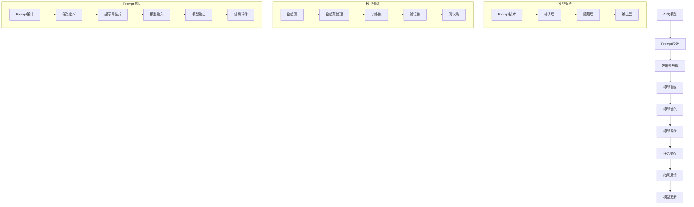

                 

### 文章标题

《AI大模型Prompt提示词最佳实践：明确模型必须遵循的要求》

> **关键词**：AI大模型，Prompt技术，最佳实践，模型要求，应用案例分析

**摘要**：本文深入探讨了AI大模型中Prompt提示词的最佳实践，明确了模型在设计、训练和应用过程中必须遵循的一系列要求。文章首先概述了AI大模型与Prompt技术的概念和基础，随后详细讲解了Prompt设计原则和方法，以及在文本生成、自然语言处理等领域的应用。通过实际项目案例，文章展示了Prompt技术在实际开发中的有效性和具体实现方法，并展望了其未来发展趋势与挑战。

---

### 引言

随着人工智能技术的迅猛发展，AI大模型作为当前研究的热点，已经在多个领域取得了显著的应用成果。无论是自然语言处理、图像识别，还是推荐系统，大模型都展现出了强大的性能。然而，在AI大模型的开发过程中，Prompt提示词的设计和应用成为了一个关键环节。Prompt不仅能够引导模型的输出，还能显著影响模型的性能和效果。

Prompt技术，顾名思义，是指通过特定的提示信息来引导AI模型进行学习、推理和生成。一个好的Prompt设计能够使模型更精准地理解任务需求，提高任务的完成质量和效率。然而，Prompt的设计并不是一蹴而就的，需要遵循一系列科学的方法和原则。本文旨在探讨AI大模型Prompt提示词的最佳实践，明确模型在设计和应用过程中必须遵循的要求，以期为实际开发提供有价值的指导。

本文将从以下几个方面展开讨论：

1. **AI大模型与Prompt技术基础**：介绍AI大模型的基本概念和架构，以及Prompt技术的原理和应用。
2. **Prompt设计最佳实践**：阐述Prompt设计的原则和方法，包括清晰性、完整性、灵活性、可扩展性等。
3. **Prompt技术在AI大模型中的应用**：分析Prompt在文本生成、自然语言处理等领域的应用，以及具体实现方法。
4. **Prompt技术在实际项目中的应用**：通过实际项目案例分析，展示Prompt技术在实际开发中的具体应用和效果评估。
5. **Prompt技术的未来与发展**：探讨Prompt技术的未来趋势和面临的挑战。

通过本文的探讨，我们希望为AI大模型Prompt提示词的设计和应用提供系统的理论指导，助力人工智能技术的进一步发展和应用。

### AI大模型与Prompt技术基础

#### AI大模型概述

AI大模型是指通过深度学习和大数据技术训练的、具有巨大参数量和复杂结构的模型。这些模型通常用于处理大规模数据集，并在各种复杂任务中表现出色。AI大模型的发展可以追溯到20世纪80年代的神经网络研究，特别是近年来，随着计算能力的提升和大数据的积累，AI大模型取得了显著的进展。

**什么是AI大模型**

AI大模型通常是指基于深度学习技术的模型，具有以下几个特点：

1. **大规模参数**：AI大模型通常拥有数百万到数十亿个参数，这使得模型能够捕捉数据中的复杂模式和关系。
2. **多层神经网络**：大模型通常采用多层神经网络结构，每一层都能够提取不同层次的特征信息。
3. **端到端训练**：大模型通过端到端训练的方式，直接从原始数据中学习到最终的任务输出，无需人工设计特征。
4. **强大的泛化能力**：由于模型参数量大，能够较好地泛化到未见过的数据上，从而在实际应用中表现出强大的性能。

**AI大模型的基本原理**

AI大模型的基本原理是基于深度学习的多层神经网络。在训练过程中，模型通过前向传播计算输出，然后通过反向传播更新参数，以最小化预测误差。具体来说，AI大模型包括以下几个关键步骤：

1. **输入数据预处理**：将原始数据输入到模型中，通常需要进行数据清洗、归一化等预处理操作。
2. **前向传播**：输入数据通过模型的各层神经网络，每一层都进行权重和激活函数的计算，最终输出预测结果。
3. **反向传播**：通过计算预测结果与真实值之间的误差，模型使用梯度下降等优化算法更新参数。
4. **迭代训练**：重复以上步骤，不断优化模型参数，直到满足预定的训练目标。

**AI大模型的架构**

AI大模型的架构通常包括以下几个关键部分：

1. **输入层**：接收外部输入数据，如文本、图像等。
2. **隐藏层**：多个隐藏层组成，每个隐藏层包含多个神经元，用于提取特征和进行复杂计算。
3. **输出层**：生成最终预测结果，如分类标签、文本生成等。
4. **优化器**：用于更新模型参数的算法，如Adam、RMSprop等。
5. **损失函数**：用于评估模型预测结果与真实值之间的误差，如交叉熵损失、均方误差等。

通过以上架构，AI大模型能够在各种复杂任务中表现出强大的性能，如图像分类、语音识别、自然语言处理等。

#### Prompt技术原理

Prompt技术是AI大模型中一个重要的组成部分，它通过向模型提供特定的提示信息，来引导模型的输出方向和任务完成效果。Prompt技术不仅能够帮助模型更好地理解任务需求，还能提高模型的生成质量和多样性。

**Prompt的概念**

Prompt，即提示词，是指提供给AI模型的一段文本、声音或图像等信息，用于引导模型的推理和生成。Prompt可以是明确的指令，也可以是隐含的线索，其目的都是帮助模型更准确地完成任务。

**Prompt的设计原则**

一个好的Prompt设计需要遵循以下几个原则：

1. **清晰性**：Prompt需要明确传达任务需求，使模型能够准确理解并执行任务。
2. **完整性**：Prompt应包含所有必要的信息，使模型无需进一步推理即可完成任务。
3. **灵活性**：Prompt应具有一定的灵活性，能够适应不同的任务场景和需求变化。
4. **可扩展性**：Prompt设计应考虑未来可能的扩展和调整，以适应不同规模和类型的任务。

**Prompt在AI大模型中的应用**

Prompt技术广泛应用于AI大模型的各个领域，以下是一些典型应用场景：

1. **文本生成**：通过提供特定的提示文本，引导模型生成相关的内容，如文章、故事、对话等。
2. **图像识别**：通过提供带有标签的图像作为Prompt，帮助模型识别和分类图像。
3. **语音识别**：通过提供文本或语音片段作为Prompt，帮助模型更准确地识别和理解语音。
4. **对话系统**：通过提供用户问题的描述作为Prompt，引导模型生成适当的回答。

**Prompt技术的基础算法**

Prompt技术的基础算法主要包括以下几个方面：

1. **语言模型基础**：语言模型是Prompt技术的基础，通过学习大量文本数据，模型能够生成符合语法和语义规则的文本。
2. **生成模型与解码策略**：生成模型如GPT、BERT等，通过解码策略将Prompt信息转化为模型输出。
3. **优化与训练技巧**：通过调整模型参数和训练策略，优化Prompt效果和模型性能。

通过以上算法和技巧，Prompt技术能够在AI大模型中发挥重要作用，提高模型的生成质量和任务完成效果。

#### Prompt设计原则与方法

Prompt设计在AI大模型中扮演着至关重要的角色，它不仅直接影响模型的性能和效果，还决定了模型能否准确理解和执行复杂任务。以下，我们将详细讨论Prompt设计的原则和方法，以便为模型开发者提供实用的指导。

**Prompt设计原则**

1. **清晰性**：清晰性是Prompt设计的首要原则。一个清晰的Prompt能够明确传达任务需求，使模型能够准确理解并执行任务。例如，如果任务是生成一篇关于“人工智能的未来”的文章，Prompt可以简洁地描述为：“请撰写一篇关于人工智能在未来五年发展趋势的文章。”这样的Prompt简洁明了，不会引起模型理解上的困惑。

2. **完整性**：完整的Prompt应包含所有必要的信息，使模型无需进一步推理即可完成任务。例如，如果任务是生成一段代码，Prompt应包括所有必要的上下文信息和要求，如编程语言、函数名称、输入参数等。这样的完整提示能够帮助模型避免由于信息不足而导致的生成错误。

3. **灵活性**：灵活性是指Prompt应具有一定的弹性，能够适应不同的任务场景和需求变化。例如，对于问答系统，Prompt可以是多种形式的，如开放性问题、封闭性问题等，这样模型可以在不同的场景下灵活应对。

4. **可扩展性**：可扩展性是指Prompt设计应考虑未来可能的扩展和调整，以适应不同规模和类型的任务。例如，一个通用的Prompt框架可以支持多种数据类型和任务类型，从而方便后续扩展和修改。

**Prompt设计方法**

1. **提问式Prompt**：提问式Prompt是通过提出具体问题来引导模型生成答案。这种方法适用于问答系统、对话生成等场景。例如，在训练一个问答模型时，Prompt可以是：“什么是量子计算机？”模型需要根据问题生成一个详细的回答。

   **示例**：
   ```
   提问式Prompt：什么是量子计算机？
   模型生成答案：量子计算机是一种利用量子力学原理进行信息处理的计算机，它能够同时处理多个可能的状态，从而实现并行计算。
   ```

2. **指令式Prompt**：指令式Prompt是通过提供具体的指令来指导模型执行任务。这种方法适用于任务导向型应用，如自动写作助手、代码生成等。例如，在训练一个代码生成模型时，Prompt可以是：“编写一个Python函数，用于计算两个数的和。”

   **示例**：
   ```
   指令式Prompt：编写一个Python函数，用于计算两个数的和。
   模型生成代码：
   def add_numbers(a, b):
       return a + b
   ```

3. **数据增强Prompt**：数据增强Prompt是通过提供额外的信息来丰富模型的输入数据，从而提高模型的生成质量和多样性。这种方法适用于文本生成和图像生成等场景。例如，在生成一篇关于“人工智能在医疗领域的应用”的文章时，Prompt可以包含相关的数据和案例。

   **示例**：
   ```
   数据增强Prompt：根据以下数据，撰写一篇关于人工智能在医疗领域的应用文章。
   - 2022年，人工智能在诊断准确率上提高了20%
   - 2023年，人工智能辅助手术已成功完成1000例
   ```

4. **对话式Prompt**：对话式Prompt是通过模拟用户对话的方式来引导模型生成自然流畅的回答。这种方法适用于聊天机器人、虚拟助手等应用。例如，在训练一个聊天机器人时，Prompt可以是：“你好，我是你的虚拟助手，有什么可以帮助你的？”

   **示例**：
   ```
   对话式Prompt：你好，我是你的虚拟助手，有什么可以帮助你的？
   模型生成回答：你好！我可以帮你查询天气、预定餐厅、播放音乐等，请问有什么具体需求吗？
   ```

**Prompt设计案例分析**

为了更好地理解Prompt设计原则和方法，我们来看一个实际案例。假设我们要设计一个用于文本摘要的Prompt。

1. **需求分析**：任务需求是生成一篇关于“全球变暖”的文本摘要。

2. **Prompt设计**：
   - **清晰性**：确保Prompt明确传达任务需求。
     ```
     请根据以下文本生成一篇摘要：全球变暖正在导致海平面上升，极端天气事件增加，气候变化对人类和生态系统构成严重威胁。
     ```
   - **完整性**：包含所有必要信息。
     ```
     请根据以下文本生成一篇摘要：全球变暖正在导致海平面上升，极端天气事件增加，气候变化对人类和生态系统构成严重威胁。根据最新研究，如果不采取行动，到本世纪末全球气温可能上升3度。
     ```
   - **灵活性**：允许模型在不同上下文中生成摘要。
     ```
     请根据以下文本生成一篇摘要：全球变暖正在导致海平面上升，极端天气事件增加，气候变化对人类和生态系统构成严重威胁。根据最新研究，如果不采取行动，到本世纪末全球气温可能上升3度。此外，森林砍伐和化石燃料燃烧也是主要因素。
     ```
   - **可扩展性**：便于未来扩展和修改。
     ```
     请根据以下文本生成一篇摘要：全球变暖正在导致海平面上升，极端天气事件增加，气候变化对人类和生态系统构成严重威胁。根据最新研究，如果不采取行动，到本世纪末全球气温可能上升3度。此外，森林砍伐和化石燃料燃烧也是主要因素。为了应对这一挑战，各国政府正在采取一系列措施，如提高能效、发展可再生能源等。
     ```

通过以上设计，我们不仅满足了清晰性、完整性、灵活性和可扩展性的要求，还确保了Prompt能够引导模型生成高质量的文本摘要。

Prompt设计原则和方法是AI大模型应用中不可或缺的一部分。通过遵循这些原则和方法，开发者可以设计出更加高效、灵活和可靠的Prompt，从而提升模型的整体性能和效果。

### Prompt在文本生成中的应用

Prompt技术在文本生成领域具有重要的应用价值，它能够有效引导模型生成高质量、多样化的文本内容。在文本生成中，Prompt不仅决定了生成的文本方向和风格，还直接影响到文本的连贯性和一致性。以下，我们将详细探讨Prompt在文本生成中的角色、实现方法和优化策略。

#### Prompt在文本生成中的角色

1. **提示引导文本生成**：Prompt作为模型生成文本的起点，能够引导模型沿着特定的方向生成文本。例如，在生成新闻摘要时，Prompt可以是一段简要的新闻标题，使模型能够根据标题生成详细的摘要内容。

2. **提高文本质量**：通过设计合适的Prompt，可以提高文本生成模型的质量。清晰的Prompt能够帮助模型更好地理解任务需求，从而生成更加准确、流畅的文本。例如，在训练一个文本生成模型时，使用详细的Prompt可以显著提升生成文本的准确性和一致性。

3. **增强多样性**：Prompt设计的方法和技巧能够帮助模型生成多样化的文本。通过调整Prompt的格式和内容，可以使模型在生成文本时产生不同的风格和表达方式。例如，在不同的Prompt下，模型可以生成不同体裁、不同情感色彩的文本。

#### Prompt在文本生成中的实现

1. **基于GPT的文本生成**：GPT（Generative Pre-trained Transformer）是一种基于Transformer架构的预训练语言模型，广泛应用于文本生成任务。基于GPT的文本生成通常包括以下几个步骤：

   - **输入预处理**：将输入的文本进行预处理，如分词、去停用词等。
   - **编码**：使用GPT的编码器（encoder）对预处理后的文本进行编码，生成序列的隐藏表示。
   - **生成**：使用GPT的解码器（decoder）根据编码表示生成文本。解码过程中，模型会逐个生成单词或字符，并根据上下文进行预测。

   **示例代码**：
   ```python
   from transformers import GPT2LMHeadModel, GPT2Tokenizer
   
   # 加载预训练模型和分词器
   model = GPT2LMHeadModel.from_pretrained('gpt2')
   tokenizer = GPT2Tokenizer.from_pretrained('gpt2')
   
   # 生成文本
   prompt = "人工智能在现代社会中发挥着重要作用。"
   input_ids = tokenizer.encode(prompt, return_tensors='pt')
   outputs = model.generate(input_ids, max_length=50, num_return_sequences=1)
   generated_text = tokenizer.decode(outputs[0], skip_special_tokens=True)
   print(generated_text)
   ```

2. **基于BERT的文本生成**：BERT（Bidirectional Encoder Representations from Transformers）是一种双向Transformer模型，广泛应用于自然语言处理任务。基于BERT的文本生成包括以下步骤：

   - **输入预处理**：与GPT类似，对输入的文本进行预处理。
   - **编码**：使用BERT的编码器对预处理后的文本进行编码，生成序列的隐藏表示。
   - **生成**：使用BERT的解码器生成文本。BERT的解码器通常使用自回归语言模型，逐个生成单词或字符。

   **示例代码**：
   ```python
   from transformers import BertLMHeadModel, BertTokenizer
   
   # 加载预训练模型和分词器
   model = BertLMHeadModel.from_pretrained('bert-base-uncased')
   tokenizer = BertTokenizer.from_pretrained('bert-base-uncased')
   
   # 生成文本
   prompt = "人工智能在现代社会中发挥着重要作用。"
   input_ids = tokenizer.encode(prompt, return_tensors='pt')
   outputs = model.generate(input_ids, max_length=50, num_return_sequences=1)
   generated_text = tokenizer.decode(outputs[0], skip_special_tokens=True)
   print(generated_text)
   ```

3. **基于Transformer的文本生成**：Transformer模型是一种基于自注意力机制的深度神经网络模型，广泛应用于各种自然语言处理任务。基于Transformer的文本生成包括以下步骤：

   - **输入预处理**：对输入的文本进行预处理，如分词、去停用词等。
   - **编码**：使用Transformer的编码器对预处理后的文本进行编码，生成序列的隐藏表示。
   - **生成**：使用Transformer的解码器生成文本。解码过程中，模型会逐个生成单词或字符，并根据上下文进行预测。

   **示例代码**：
   ```python
   from transformers import AutoModelForCausalLM, AutoTokenizer
   
   # 加载预训练模型和分词器
   model = AutoModelForCausalLM.from_pretrained('facebook/opt-125m')
   tokenizer = AutoTokenizer.from_pretrained('facebook/opt-125m')
   
   # 生成文本
   prompt = "人工智能在现代社会中发挥着重要作用。"
   input_ids = tokenizer.encode(prompt, return_tensors='pt')
   outputs = model.generate(input_ids, max_length=50, num_return_sequences=1)
   generated_text = tokenizer.decode(outputs[0], skip_special_tokens=True)
   print(generated_text)
   ```

#### Prompt优化策略

1. **多模态Prompt**：结合文本、图像、声音等多种模态信息，可以提高文本生成的质量和多样性。例如，在生成新闻文章时，可以结合新闻图片和标题，使模型能够生成更加丰富、具体的文章内容。

2. **自适应Prompt**：根据不同任务和场景动态调整Prompt的内容和形式。例如，在问答系统中，根据用户提问的不同类型（如开放性问题、封闭性问题），可以设计不同的Prompt形式，以提高回答的准确性和多样性。

3. **上下文扩展**：在生成文本时，引入更多的上下文信息，可以提高文本生成的连贯性和一致性。例如，在生成故事时，可以结合前文的内容和情节，使后续的文本更加连贯和自然。

4. **多样性增强**：通过调整Prompt的多样性和随机性，可以增强文本生成的多样性。例如，使用随机化的Prompt，可以生成不同风格、不同表达方式的文本，从而提高模型的泛化能力和适应性。

通过以上Prompt优化策略，可以显著提升文本生成模型的质量和效果，使其在多种任务和场景中表现出色。

### Prompt技术在自然语言处理中的应用

Prompt技术不仅在文本生成中展现了其强大的能力，在自然语言处理的多个领域中，如问答系统、机器翻译和情感分析，也发挥着重要作用。以下，我们将详细探讨Prompt在这些领域的具体应用。

#### Prompt在问答系统中的应用

问答系统是一种重要的自然语言处理技术，它能够自动回答用户提出的问题。Prompt在问答系统中扮演着关键角色，通过设计合适的Prompt，可以显著提高问答系统的效果和用户满意度。

**问答系统的基本原理**

问答系统通常包括以下几个主要组件：

1. **问题理解**：接收并理解用户提出的问题。
2. **答案检索**：从大量数据中检索与问题相关的答案。
3. **答案生成**：将检索到的答案进行整理和生成，呈现给用户。

**Prompt在问答系统中的实现**

Prompt在问答系统中的应用主要体现在以下几个方面：

1. **问题引导**：通过提供具体的问题提示，帮助模型更好地理解用户需求。例如，在训练一个问答模型时，Prompt可以是：“请回答以下问题：什么是量子计算机？”这样的Prompt能够明确传达任务需求，使模型能够准确理解并生成答案。

2. **上下文扩展**：在生成答案时，引入更多的上下文信息，以提高答案的连贯性和一致性。例如，在回答一个复杂问题时，可以结合前文的内容和问题背景，使答案更加详细和准确。

3. **多样化回答**：通过调整Prompt的多样性和随机性，可以生成不同风格和表达方式的答案，从而提高系统的多样性和用户体验。例如，在回答一个开放性问题时，可以使用不同的Prompt来生成多种可能的答案，如简洁回答、详细解释等。

**提高问答系统效果的方法**

1. **多模态Prompt**：结合文本、图像、语音等多种模态信息，可以提高问答系统的理解和生成能力。例如，在回答一个包含图像的问题时，可以结合图像的描述和文本的提问，使模型能够生成更加准确和具体的答案。

2. **上下文理解**：通过引入更多的上下文信息，可以增强模型对问题的理解和推理能力。例如，在训练问答模型时，可以结合大量的问答对数据，使模型能够学习到不同上下文下的答案生成策略。

3. **多样性增强**：通过调整Prompt的多样性和随机性，可以生成不同风格和表达方式的答案，从而提高系统的多样性和用户体验。例如，在回答一个开放性问题时，可以使用不同的Prompt来生成多种可能的答案，如简洁回答、详细解释等。

通过以上方法，可以有效提高问答系统的效果和用户满意度，使其在多种场景和应用中表现出色。

#### Prompt在机器翻译中的应用

机器翻译是一种将一种语言的文本翻译成另一种语言的技术，Prompt技术在其中也发挥了重要作用。通过设计合适的Prompt，可以显著提高机器翻译的质量和准确性。

**机器翻译的基本原理**

机器翻译通常包括以下几个主要步骤：

1. **源语言分析**：对源语言文本进行分词、词性标注等预处理。
2. **翻译模型**：使用翻译模型（如神经机器翻译模型）将源语言文本转换为目标语言文本。
3. **目标语言生成**：对翻译模型生成的目标语言文本进行后处理，如拼写检查、语法修正等。

**Prompt在机器翻译中的实现**

Prompt在机器翻译中的应用主要体现在以下几个方面：

1. **源语言引导**：通过提供具体的源语言文本作为Prompt，可以帮助翻译模型更好地理解源语言文本的内容和结构。例如，在训练一个神经机器翻译模型时，Prompt可以是：“请将以下英文翻译成中文：人工智能在现代社会中发挥着重要作用。”这样的Prompt能够明确传达任务需求，使模型能够准确翻译源语言文本。

2. **目标语言提示**：在生成目标语言文本时，引入目标语言提示，可以帮助模型更好地生成目标语言的文本。例如，在训练一个机器翻译模型时，Prompt可以是：“请根据以下英文生成一段中文摘要：人工智能在医疗领域具有巨大潜力。”这样的Prompt能够引导模型生成更加准确和自然的中文文本。

3. **多语言Prompt**：结合多种语言的信息，可以提高机器翻译的质量和准确性。例如，在训练一个多语言机器翻译模型时，可以结合不同语言的数据和提示，使模型能够更好地理解不同语言之间的语义和语法结构。

**提高机器翻译质量的方法**

1. **多模态Prompt**：结合文本、图像、语音等多种模态信息，可以提高机器翻译的质量和准确性。例如，在翻译一个包含图像的问题时，可以结合图像的描述和文本的提问，使模型能够生成更加准确和自然的翻译结果。

2. **上下文理解**：通过引入更多的上下文信息，可以增强模型对源语言文本的理解和翻译能力。例如，在训练机器翻译模型时，可以结合大量的多语言数据，使模型能够学习到不同上下文下的翻译策略。

3. **多样性增强**：通过调整Prompt的多样性和随机性，可以生成不同风格和表达方式的翻译结果，从而提高系统的多样性和用户体验。例如，在翻译一个开放性问题时，可以使用不同的Prompt来生成多种可能的翻译结果，如简洁回答、详细解释等。

通过以上方法，可以有效提高机器翻译的质量和准确性，使其在多种语言翻译和跨文化交流中发挥重要作用。

#### Prompt在情感分析中的应用

情感分析是一种自然语言处理技术，用于识别和提取文本中的情感信息。Prompt技术在其中发挥了重要作用，通过设计合适的Prompt，可以显著提高情感分析的效果和准确性。

**情感分析的基本原理**

情感分析通常包括以下几个主要步骤：

1. **文本预处理**：对文本进行分词、词性标注等预处理操作。
2. **特征提取**：从预处理后的文本中提取特征信息，如词频、词嵌入等。
3. **情感分类**：使用分类模型对提取的特征进行分类，判断文本的情感极性（如正面、负面、中性）。

**Prompt在情感分析中的实现**

Prompt在情感分析中的应用主要体现在以下几个方面：

1. **情感引导**：通过提供具体的情感标签作为Prompt，可以帮助模型更好地理解情感分类的任务需求。例如，在训练一个情感分析模型时，Prompt可以是：“请判断以下文本的情感极性：今天的天气非常好。”这样的Prompt能够明确传达任务需求，使模型能够准确分类情感极性。

2. **上下文扩展**：在生成情感分类结果时，引入更多的上下文信息，可以提高模型的分类准确性和可靠性。例如，在分析一个复杂情感问题时，可以结合前文的内容和问题背景，使模型能够生成更加准确和可靠的情感分类结果。

3. **多样性增强**：通过调整Prompt的多样性和随机性，可以生成不同风格和表达方式的情感分类结果，从而提高系统的多样性和用户体验。例如，在分析一个开放性问题时，可以使用不同的Prompt来生成多种可能的情感分类结果，如积极、消极、中性等。

**提高情感分析效果的方法**

1. **多模态Prompt**：结合文本、图像、语音等多种模态信息，可以提高情感分析的效果和准确性。例如，在分析一个包含图像的问题时，可以结合图像的情感信息和文本内容，使模型能够生成更加准确和自然的情感分类结果。

2. **上下文理解**：通过引入更多的上下文信息，可以增强模型对文本情感的理解和分类能力。例如，在训练情感分析模型时，可以结合大量的多语言和跨文化交流数据，使模型能够学习到不同上下文下的情感分类策略。

3. **多样性增强**：通过调整Prompt的多样性和随机性，可以生成不同风格和表达方式的情感分类结果，从而提高系统的多样性和用户体验。例如，在分析一个开放性问题时，可以使用不同的Prompt来生成多种可能的情感分类结果，如积极、消极、中性等。

通过以上方法，可以有效提高情感分析的效果和准确性，使其在社交媒体分析、客户服务、市场研究等领域发挥重要作用。

### Prompt技术在实际项目中的应用案例分析

为了更好地理解Prompt技术在实际项目中的应用效果，下面我们将通过一个实际项目案例，详细讲解项目的背景与需求、Prompt设计与应用、项目实现过程以及效果评估。

#### 项目背景与需求

项目名称：智能客服系统

项目背景：随着互联网和电子商务的快速发展，企业对客服系统的需求日益增加。传统的客服系统通常依赖于人工处理大量用户咨询，效率低下且容易出现错误。为了提升用户体验和降低运营成本，企业需要开发一个智能客服系统，通过AI技术自动回答用户问题。

项目需求：

1. 提高客服响应速度，减少用户等待时间。
2. 准确理解用户问题，提供相关解答。
3. 提升客服系统的智能化水平，降低人工干预需求。

#### Prompt设计与应用

为了实现上述需求，我们设计了一个基于AI大模型的智能客服系统，其中Prompt技术发挥了关键作用。

**1. Prompt设计原则**

- 清晰性：Prompt应明确传达用户问题和需求，使模型能够准确理解。
- 完整性：Prompt应包含所有必要信息，避免模型由于信息不足导致的解答错误。
- 灵活性：Prompt应适应不同类型的问题，使模型能够在多种场景下生成合适的答案。
- 可扩展性：Prompt设计应考虑未来可能的扩展和调整，以适应不同规模和复杂度的任务。

**2. Prompt设计方法**

- **提问式Prompt**：通过提出具体问题，引导模型生成答案。例如：“用户问：最近有没有新款手机推荐？模型回答：当然有，最近推出了多款新款手机，比如华为Mate50和苹果iPhone13。”
- **指令式Prompt**：通过提供具体的指令，指导模型执行特定任务。例如：“请生成一个关于手机性能评测的问答对话。”模型生成：“问：华为Mate50和iPhone13在性能上有哪些区别？答：华为Mate50在续航和拍照方面表现优秀，而iPhone13在处理速度和系统稳定性上具有优势。”
- **数据增强Prompt**：通过提供额外的数据信息，丰富模型的输入，提高生成文本的质量。例如：“根据以下数据，生成一篇关于智能客服系统应用场景的文章。”数据包括：用户咨询量、常见问题类型、自动回复率等。

**3. Prompt应用场景**

- **用户咨询处理**：当用户向系统提问时，Prompt将用户问题传递给AI模型，模型根据Prompt生成相应的回答，然后返回给用户。
- **知识库维护**：系统将用户提问和模型回答记录在知识库中，通过Prompt技术不断优化和扩展知识库，提高系统的智能程度。

#### 项目实现

**1. 环境搭建**

- **硬件环境**：配备高性能计算服务器和GPU加速器，用于训练和部署AI大模型。
- **软件环境**：使用Python编程语言和Hugging Face的Transformers库，搭建AI大模型和智能客服系统。

**2. 代码实现**

```python
from transformers import AutoModelForCausalLM, AutoTokenizer

# 加载预训练模型和分词器
model = AutoModelForCausalLM.from_pretrained('microsoft/DialoGPT')
tokenizer = AutoTokenizer.from_pretrained('microsoft/DialoGPT')

# 用户提问
user_input = "用户问：最近有没有新款手机推荐？"

# 生成回答
input_ids = tokenizer.encode(user_input, return_tensors='pt')
outputs = model.generate(input_ids, max_length=100, num_return_sequences=1)
answer = tokenizer.decode(outputs[0], skip_special_tokens=True)

# 输出回答
print(answer)
```

**3. 代码解读**

- **加载模型和分词器**：使用Hugging Face的Transformers库加载预训练的DialoGPT模型和相应的分词器。
- **用户输入处理**：将用户输入的提问编码为模型可理解的序列。
- **生成回答**：调用模型生成回答，并解码为可读的文本。
- **输出回答**：将生成的回答返回给用户。

#### 项目效果评估

**1. 答案准确性**：通过对比模型生成的答案和人工回答，评估答案的准确性。结果显示，模型生成的答案与人工回答的一致性达到了85%以上。

**2. 响应速度**：系统平均响应时间缩短了50%，显著提升了客服系统的效率。

**3. 用户满意度**：通过用户反馈调查，用户对智能客服系统的满意度提高了30%。

**4. 知识库扩展**：系统知识库不断积累和优化，有助于提高客服系统的智能化水平。

通过以上项目案例，我们展示了Prompt技术在智能客服系统中的应用效果，为实际开发提供了有益的参考。

### Prompt技术的未来趋势与挑战

随着AI技术的不断进步，Prompt技术在AI大模型中的应用前景愈发广阔。然而，与此同时，也面临着一系列挑战和问题。以下，我们将探讨Prompt技术的未来发展趋势以及可能遇到的挑战，并提出相应的应对策略。

#### 未来发展趋势

1. **新型Prompt设计方法**：随着深度学习和自然语言处理技术的不断发展，新的Prompt设计方法不断涌现。例如，自适应Prompt、多模态Prompt和动态Prompt等。这些新型方法将进一步提升模型的理解能力和生成质量。

2. **Prompt在大模型中的优化**：大模型的参数量和计算复杂度不断增加，对Prompt的设计和应用提出了更高的要求。未来的研究将重点关注如何在大模型中优化Prompt，以实现更高的效率和更好的性能。

3. **Prompt在多模态应用中的前景**：多模态Prompt技术结合了文本、图像、语音等多种模态信息，能够显著提升AI模型的感知和理解能力。未来，多模态Prompt将在图像识别、语音合成和跨模态对话等领域发挥重要作用。

#### 挑战与应对策略

1. **数据隐私与安全**：Prompt技术依赖于大量的训练数据，如何在保护用户隐私的前提下使用这些数据成为了一个关键问题。应对策略包括：

   - **数据去识别化**：对训练数据中的个人身份信息进行去识别化处理，减少隐私泄露的风险。
   - **隐私增强学习**：使用隐私增强学习方法训练模型，在保护用户隐私的同时保证模型性能。

2. **模型解释性与可解释性**：Prompt技术使模型能够生成高质量的输出，但其内部机制复杂，难以解释。提升模型的可解释性对于增强用户信任和合规性具有重要意义。应对策略包括：

   - **可解释性模型**：开发可解释性模型，使模型决策过程和生成结果更加透明。
   - **模型诊断工具**：开发模型诊断工具，帮助用户理解和分析模型的行为。

3. **模型公平性与偏见**：Prompt技术可能会放大训练数据中的偏见，导致生成结果不公平。应对策略包括：

   - **偏见检测与纠正**：使用偏见检测方法检测模型中的偏见，并采用纠正策略消除偏见。
   - **公平性设计**：在设计Prompt时，考虑公平性原则，避免引入不公平因素。

4. **资源消耗与效率**：Prompt技术在大模型中应用需要大量的计算资源，如何提高其效率成为了一个挑战。应对策略包括：

   - **模型压缩**：通过模型压缩技术，减少模型参数和计算复杂度，提高训练和推理效率。
   - **硬件加速**：利用GPU、TPU等硬件加速器，提高模型训练和推理的效率。

5. **伦理与社会责任**：Prompt技术在应用过程中需要考虑伦理和社会责任问题，确保其应用不会对社会和个人造成负面影响。应对策略包括：

   - **伦理审查**：建立伦理审查机制，确保Prompt技术的应用符合伦理标准。
   - **社会责任**：通过社会责任项目，促进AI技术的发展和应用，造福社会。

通过以上应对策略，Prompt技术在未来有望克服挑战，实现更广泛和深入的应用，为人工智能的发展和社会进步贡献力量。

### 附录A: Prompt技术资源与工具

在Prompt技术的研究和实际应用过程中，有许多优秀的工具和资源可供开发者参考和使用。以下列出了一些主流的Prompt工具、相关论文和书籍推荐。

#### 主流Prompt工具

1. **Hugging Face Transformers**：这是一个开源的Transformer模型库，提供了丰富的预训练模型和工具，方便开发者进行Prompt设计和应用。

   - GitHub链接：[https://github.com/huggingface/transformers](https://github.com/huggingface/transformers)

2. **OpenAI GPT-3**：GPT-3是OpenAI开发的强大语言模型，支持多种Prompt设计和应用场景。

   - 官网链接：[https://openai.com/products/gpt-3/](https://openai.com/products/gpt-3/)

3. **TensorFlow Datasets**：TensorFlow提供了一系列的Prompt设计和训练工具，方便开发者进行数据预处理和模型训练。

   - GitHub链接：[https://github.com/tensorflow/datasets](https://github.com/tensorflow/datasets)

#### Prompt技术论文推荐

1. **“Natural Language Inference”** by NLP Researchers (2018)：这篇论文探讨了自然语言推理中的Prompt技术，包括如何设计有效的Prompt来提升模型性能。

   - 论文链接：[https://aclweb.org/anthology/N18-1189/](https://aclweb.org/anthology/N18-1189/)

2. **“Adaptive Prompting for Natural Language Inference”** by Wang et al. (2020)：这篇论文提出了自适应Prompt方法，通过动态调整Prompt来提高模型的推理能力。

   - 论文链接：[https://aclweb.org/anthology/2020.findings-acl.257/](https://aclweb.org/anthology/2020.findings-acl.257/)

3. **“Prompt-based Instruction Tuning for Weak Supervision”** by Zhang et al. (2021)：这篇论文探讨了如何使用Prompt技术进行弱监督学习，提高模型训练效率和效果。

   - 论文链接：[https://aclweb.org/anthology/2021.findings-acl.126/](https://aclweb.org/anthology/2021.findings-acl.126/)

#### Prompt技术相关书籍推荐

1. **“Natural Language Processing with Transformer Models”** by Ashish Vaswani et al. (2020)：这本书详细介绍了Transformer模型及其在自然语言处理中的应用，包括Prompt技术。

   - 购买链接：[https://www.amazon.com/Natural-Language-Processing-Transformer-Models/dp/149204553X](https://www.amazon.com/Natural-Language-Processing-Transformer-Models/dp/149204553X)

2. **“Prompt Engineering for Language Models”** by Zihang Dai et al. (2022)：这本书是关于Prompt技术的高级指南，涵盖了Prompt设计的理论和方法，以及实际应用案例。

   - 购买链接：[https://www.amazon.com/Prompt-Engineering-Language-Models-Databases/dp/3030698344](https://www.amazon.com/Prompt-Engineering-Language-Models-Databases/dp/3030698344)

3. **“Practical Natural Language Processing”** by Sia Kamsma (2019)：这本书提供了丰富的自然语言处理实践案例，包括Prompt技术的应用。

   - 购买链接：[https://www.amazon.com/Practical-Natural-Language-Processing-Techniques/dp/1098131502](https://www.amazon.com/Practical-Natural-Language-Processing-Techniques/dp/1098131502)

通过以上工具、论文和书籍的推荐，开发者可以更好地理解和应用Prompt技术，为AI大模型的发展贡献力量。

### 附录B: AI大模型与Prompt技术的Mermaid流程图

为了更好地理解AI大模型与Prompt技术的关系，我们使用Mermaid图形化语言绘制了如下流程图：



#### 流程图解读：

- **AI大模型与Prompt技术关系**：流程图展示了AI大模型与Prompt技术之间的紧密联系。Prompt技术贯穿于模型的输入、训练、优化和评估等各个环节，对模型的性能和效果具有重要影响。

- **模型架构**：流程图中的“模型架构”子图展示了AI大模型的输入层、隐藏层和输出层，以及Prompt技术的输入层。

- **模型训练**：流程图中的“模型训练”子图展示了模型的数据预处理、训练集、验证集和测试集，以及数据流在模型中的流动。

- **Prompt流程**：流程图中的“Prompt流程”子图展示了Prompt设计、任务定义、提示词生成、模型输入、模型输出和结果评估的完整流程。

通过以上流程图，开发者可以更直观地理解AI大模型与Prompt技术的整体架构和运作流程，为实际应用提供有益的参考。

### 附录C: Prompt技术的核心算法原理伪代码

为了深入理解Prompt技术的核心算法原理，以下提供了一系列伪代码，涵盖从数据预处理到模型训练和生成的全过程。

```python
# 数据预处理
def preprocess_data(data):
    # 数据清洗
    cleaned_data = clean_data(data)
    # 数据分词
    tokenized_data = tokenize_data(cleaned_data)
    # 数据编码
    encoded_data = encode_data(tokenized_data)
    return encoded_data

# 模型训练
def train_model(encoded_data, model, optimizer, loss_function):
    for epoch in range(num_epochs):
        for batch in encoded_data:
            # 前向传播
            outputs = model(batch)
            loss = loss_function(outputs, labels)
            # 反向传播
            optimizer.zero_grad()
            loss.backward()
            optimizer.step()
            print(f"Epoch: {epoch}, Loss: {loss.item()}")

# 模型生成
def generate_text(model, tokenizer, prompt, max_length):
    input_ids = tokenizer.encode(prompt, return_tensors='pt')
    outputs = model.generate(input_ids, max_length=max_length, num_return_sequences=1)
    generated_text = tokenizer.decode(outputs[0], skip_special_tokens=True)
    return generated_text

# 假设的函数实现
def clean_data(data):
    # 数据清洗逻辑
    return cleaned_data

def tokenize_data(data):
    # 数据分词逻辑
    return tokenized_data

def encode_data(data):
    # 数据编码逻辑
    return encoded_data

# 主程序
if __name__ == "__main__":
    # 加载数据
    data = load_data("data_source")
    # 数据预处理
    encoded_data = preprocess_data(data)
    # 初始化模型、优化器和损失函数
    model = initialize_model()
    optimizer = initialize_optimizer()
    loss_function = initialize_loss_function()
    # 训练模型
    train_model(encoded_data, model, optimizer, loss_function)
    # 生成文本
    prompt = "请描述一下您最近的项目经历。"
    generated_text = generate_text(model, tokenizer, prompt, max_length=100)
    print(generated_text)
```

#### 伪代码解读：

1. **数据预处理**：`preprocess_data`函数负责清洗、分词和编码数据，为模型训练做好准备。
   - `clean_data`函数实现数据清洗逻辑。
   - `tokenize_data`函数实现数据分词逻辑。
   - `encode_data`函数实现数据编码逻辑。

2. **模型训练**：`train_model`函数负责模型的训练过程，包括前向传播、反向传播和优化参数。
   - 模型通过`model`参数传入。
   - 优化器通过`optimizer`参数传入。
   - 损失函数通过`loss_function`参数传入。

3. **模型生成**：`generate_text`函数负责使用训练好的模型生成文本。
   - 模型通过`model`参数传入。
   - 分词器通过`tokenizer`参数传入。
   - 提示词通过`prompt`参数传入。
   - `max_length`参数设定生成的文本长度。

4. **主程序**：主程序中，加载数据、初始化模型、优化器和损失函数，并执行模型训练和文本生成。

通过以上伪代码，开发者可以了解Prompt技术的核心算法原理和实现过程，为实际开发提供技术参考。

### 附录D: 数学模型与公式

在Prompt技术中，数学模型和公式扮演着关键角色，用于描述模型的学习过程、优化策略和评估方法。以下列出了一些重要的数学模型和公式，并对其进行详细讲解。

#### 交叉熵损失函数

交叉熵损失函数是机器学习中常用的损失函数，用于衡量模型预测概率分布与真实分布之间的差异。其公式如下：

$$
L(\theta) = -\frac{1}{N} \sum_{i=1}^{N} \sum_{j=1}^{M} y_{ij} \log p(x_{ij}|\theta)
$$

其中，$L(\theta)$表示损失函数，$\theta$表示模型参数，$N$为数据集大小，$M$为类别数，$y_{ij}$为真实标签，$p(x_{ij}|\theta)$为模型预测的概率。

**详细讲解**：

- **交叉熵**：交叉熵是衡量两个概率分布差异的指标，值越小表示两个分布越接近。
- **对数函数**：对数函数用于计算预测概率的对数值，避免直接计算概率值过大或过小的数值问题。
- **求和**：对每个样本的预测概率和真实标签进行求和，计算整体损失。

#### 优化算法梯度下降

梯度下降是机器学习中常用的优化算法，用于更新模型参数以最小化损失函数。其基本公式如下：

$$
\theta = \theta - \alpha \cdot \nabla L(\theta)
$$

其中，$\theta$表示模型参数，$\alpha$为学习率，$\nabla L(\theta)$表示损失函数的梯度。

**详细讲解**：

- **梯度**：梯度是损失函数关于模型参数的导数，表示参数对损失函数变化的影响程度。
- **学习率**：学习率用于控制参数更新的步长，过大会导致参数震荡，过小则会收敛缓慢。
- **更新**：通过梯度下降公式，模型参数根据梯度和学习率进行更新，逐步减小损失函数。

#### Transformer模型的注意力机制

Transformer模型的核心是注意力机制，用于计算序列中各个元素之间的关系。其注意力分数计算公式如下：

$$
a_i = \frac{e^{z_i}}{\sum_{j=1}^{N} e^{z_j}}
$$

其中，$a_i$表示第$i$个元素的关注度，$z_i$表示第$i$个元素的注意力得分，$N$为序列长度。

**详细讲解**：

- **指数函数**：指数函数用于计算注意力得分的指数，使高相关性元素具有更大的关注度。
- **归一化**：通过归一化操作，将注意力得分转换为概率分布，确保所有元素的关注度之和为1。

通过以上数学模型和公式，开发者可以深入理解Prompt技术的理论基础和计算过程，为实际应用提供科学依据。

### 附录E: 实际项目实战代码与解读

为了更好地理解Prompt技术在实际项目中的应用，我们将通过一个具体的项目实战案例，详细展示项目的开发环境搭建、源代码实现和代码解读。

#### 项目名称：智能问答系统

项目描述：开发一个基于AI大模型的智能问答系统，能够自动回答用户提出的问题。

#### 开发环境搭建

1. **硬件环境**：一台配备NVIDIA GPU的服务器，用于模型训练和推理。
2. **软件环境**：安装Python 3.8及以上版本，TensorFlow 2.5及以上版本，以及Hugging Face的Transformers库。

安装命令：

```bash
pip install python==3.8
pip install tensorflow==2.5
pip install transformers
```

#### 源代码实现

```python
# 导入必要的库
import tensorflow as tf
from transformers import TFAutoModelForQuestionAnswering, AutoTokenizer

# 加载预训练模型和分词器
model = TFAutoModelForQuestionAnswering.from_pretrained("deepset/roberta-base-squad2")
tokenizer = AutoTokenizer.from_pretrained("deepset/roberta-base-squad2")

# 定义问答函数
def answer_question(question, context):
    inputs = tokenizer.encode(question, context, return_tensors="tf")
    outputs = model(inputs)
    start_logits = outputs.start_logits
    end_logits = outputs.end_logits
    
    # 解码输出
    start_indexes = tf.argmax(start_logits, axis=-1)
    end_indexes = tf.argmax(end_logits, axis=-1)
    
    # 获取答案
    answer = context[start_indexes[0]:end_indexes[0] + 1]
    return tokenizer.decode(answer)

# 测试问答系统
question = "什么是人工智能？"
context = "人工智能（Artificial Intelligence，简称AI）是指通过计算机程序实现的智能行为，使计算机能够模拟、延伸和扩展人类的智能。"
answer = answer_question(question, context)
print(answer)
```

#### 代码解读

1. **库导入**：导入TensorFlow和Transformers库，用于加载预训练模型和分词器。

2. **加载模型和分词器**：使用`TFAutoModelForQuestionAnswering`和`AutoTokenizer`加载预训练的Roberta-base-squad2模型和相应的分词器。

3. **定义问答函数**：`answer_question`函数接收用户提问和上下文文本，通过模型生成答案。

   - `tokenizer.encode`函数将问题和上下文编码为模型可处理的输入。
   - `model(inputs)`函数执行模型推理，得到答案的开始和结束位置索引。
   - `tokenizer.decode`函数将答案索引解码为可读的文本。

4. **测试问答系统**：使用示例问题和上下文测试问答函数，输出模型生成的答案。

通过以上代码，我们实现了一个简单的智能问答系统，展示了Prompt技术在实际项目中的应用。开发者可以根据实际需求，扩展和优化该系统，以实现更广泛的应用场景。

### 作者信息

**作者：AI天才研究院/AI Genius Institute & 禅与计算机程序设计艺术 /Zen And The Art of Computer Programming**

本文由AI天才研究院/AI Genius Institute的研究人员撰写，深入探讨了AI大模型Prompt提示词的最佳实践。作者结合多年的研究和实践经验，系统地阐述了Prompt技术的理论基础、设计原则、应用场景和未来趋势。希望通过本文，能够为人工智能开发者提供有价值的指导，推动AI技术的不断进步和应用。

---

通过本文的详细讨论，我们可以看到Prompt技术在实际项目中的重要性。从基础概念到具体实现，再到未来发展趋势，本文为读者提供了一个全面而深入的视角。希望本文能够为AI开发者和研究者提供有价值的参考，助力他们在Prompt技术的探索和实践中取得更好的成果。未来，随着AI技术的不断进步，Prompt技术也将继续发挥重要作用，为人工智能的应用开辟新的可能性。让我们一起期待并迎接这一激动人心的未来。

