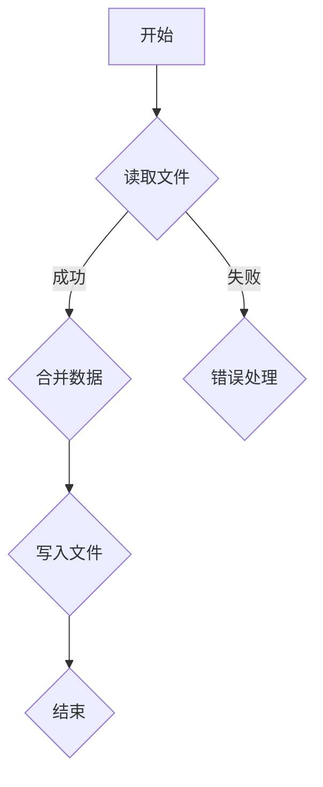

                 

# AI大模型Prompt提示词最佳实践：生成跨文件的代码脚本

> 关键词：AI大模型，Prompt提示词，代码脚本，跨文件，最佳实践

> 摘要：本文将探讨AI大模型Prompt提示词的最佳实践，特别是如何生成跨文件的代码脚本。我们将详细分析Prompt提示词的概念、结构，以及如何利用它们来指导AI大模型生成高效的代码脚本。此外，文章还将通过实例展示如何使用Prompt提示词实现跨文件代码的生成，并提供相关的实用技巧和策略。

### 第一部分: AI大模型基础

#### 第1章: AI大模型概述

##### 1.1 什么是AI大模型

###### 1.1.1 AI大模型的概念
AI大模型是指那些参数规模巨大、结构复杂的人工智能模型。这些模型通过大规模数据预训练，能够在多种任务中表现出强大的泛化能力。

###### 1.1.2 AI大模型的特点
- **参数规模大**：拥有数十亿到数万亿个参数。
- **计算需求高**：训练和推理过程中需要大量的计算资源。
- **强大的泛化能力**：能够处理不同类型的数据和任务。

###### 1.1.3 AI大模型与传统模型的区别
- **传统模型**：参数规模相对较小，通常针对特定任务进行优化。
- **AI大模型**：具有更广泛的适用性和更强的学习能力。

##### 1.2 AI大模型的核心架构

###### 1.2.1 神经网络
神经网络是AI大模型的基础，通过模拟人脑神经元的方式，处理和传递信息。

###### 1.2.2 自注意力机制
自注意力机制是AI大模型中的一个关键组件，它允许模型在不同的输入序列位置之间建立依赖关系。

###### 1.2.3 Transformer架构
Transformer架构是AI大模型中最常用的架构，它通过多头自注意力机制和前馈神经网络，实现了高效的序列建模。

##### 1.3 AI大模型的应用场景

###### 1.3.1 自然语言处理
自然语言处理是AI大模型最早也是应用最广泛的领域之一，包括语言翻译、文本生成、情感分析等任务。

###### 1.3.2 计算机视觉
计算机视觉是AI大模型的另一个重要应用领域，包括图像分类、目标检测、图像生成等任务。

###### 1.3.3 语音识别
语音识别是AI大模型在语音领域的重要应用，能够将语音信号转换为文本。

#### 第2章: AI大模型核心算法

##### 2.1 神经网络算法

###### 2.1.1 前向传播算法
前向传播算法是神经网络的基础，用于计算输入和输出之间的映射。

$$
Z = \sigma(WX + b)
$$

###### 2.1.2 反向传播算法
反向传播算法用于计算网络参数的梯度，是模型训练的核心。

$$
\frac{\partial L}{\partial W} = X\frac{\partial \sigma}{\partial Z}
$$

##### 2.2 自注意力机制

###### 2.2.1 自注意力计算
自注意力计算是Transformer架构的核心，它通过计算输入序列中各个位置之间的相似度来实现。

$$
\text{Attention}(Q, K, V) = \frac{QK^T}{\sqrt{d_k}}V
$$

###### 2.2.2 多头自注意力
多头自注意力通过并行计算多个注意力头，从而提高模型的表示能力。

##### 2.3 Transformer架构

###### 2.3.1 Transformer模型结构
Transformer模型由编码器和解码器组成，通过自注意力机制和前馈神经网络进行序列建模。

###### 2.3.2 编码器和解码器的交互
编码器和解码器之间的交互是通过多头自注意力和交叉注意力机制实现的。

### 第二部分: AI大模型应用实践

#### 第3章: AI大模型在自然语言处理中的应用

##### 3.1 AI大模型在自然语言处理中的应用

###### 3.1.1 语言模型
语言模型是自然语言处理的基础，通过预测下一个单词或字符来生成文本。

###### 3.1.2 文本分类
文本分类是将文本数据按照类别进行分类的过程，常用于情感分析、新闻分类等任务。

##### 3.2 AI大模型在计算机视觉中的应用

###### 3.2.1 图像分类
图像分类是将图像按照类别进行分类的过程，常用的模型包括卷积神经网络（CNN）。

###### 3.2.2 目标检测
目标检测是识别图像中的目标并定位其位置的过程，常用的模型包括YOLO和SSD。

##### 3.3 AI大模型在语音识别中的应用

###### 3.3.1 语音识别
语音识别是将语音信号转换为文本的过程，常用的模型包括深度神经网络和循环神经网络（RNN）。

###### 3.3.2 语音合成
语音合成是将文本转换为语音的过程，常用的模型包括WaveNet和Tacotron。

#### 第4章: AI大模型在跨领域中的应用

##### 4.1 AI大模型在金融领域中的应用

###### 4.1.1 股票市场预测
股票市场预测是金融领域中的一个重要应用，通过分析历史数据来预测股票价格走势。

###### 4.1.2 风险评估
风险评估是金融领域中的一个关键任务，通过分析数据和模式来预测潜在的风险。

##### 4.2 AI大模型在医疗领域中的应用

###### 4.2.1 疾病诊断
疾病诊断是医疗领域中的一个重要应用，通过分析医学影像和病历数据来辅助医生进行诊断。

###### 4.2.2 药物研发
药物研发是医疗领域中的一个关键任务，通过分析生物数据和化学数据来发现新的药物。

#### 第5章: AI大模型应用案例分析

##### 5.1 案例一：OpenAI的GPT模型

###### 5.1.1 GPT模型的原理与结构
GPT模型是自然语言处理领域中的一个重要模型，通过大规模数据预训练，实现了强大的语言生成能力。

###### 5.1.2 GPT模型的训练与推理
GPT模型的训练和推理过程涉及大量的计算资源，通过优化算法来提高模型的效率。

##### 5.2 案例二：DeepMind的AlphaGo

###### 5.2.1 AlphaGo的原理与结构
AlphaGo是计算机围棋领域中的一个里程碑，通过深度学习和强化学习技术，实现了超人类的围棋水平。

###### 5.2.2 AlphaGo的训练与比赛
AlphaGo的训练和比赛过程展示了AI大模型在复杂任务中的强大能力。

#### 第6章: AI大模型应用挑战与未来趋势

##### 6.1 AI大模型面临的挑战

###### 6.1.1 数据隐私与安全
数据隐私和安全是AI大模型应用中面临的一个关键挑战，需要采取有效的措施来保护用户数据。

###### 6.1.2 计算资源需求
计算资源需求是AI大模型应用中面临的另一个挑战，需要优化算法和硬件来降低计算成本。

##### 6.2 AI大模型的未来趋势

###### 6.2.1 跨领域应用
随着技术的不断发展，AI大模型将在更多领域得到应用，实现跨领域的融合和创新。

###### 6.2.2 个性化和实时性
AI大模型的应用将越来越注重个性化和实时性，满足不同用户的需求和场景。

### 附录

##### 附录A：AI大模型资源推荐

###### A.1 书籍推荐
推荐几本关于AI大模型的核心书籍，包括《深度学习》、《自然语言处理综论》等。

###### A.2 论文推荐
推荐一些关于AI大模型的经典论文，帮助读者深入了解相关领域的研究进展。

##### 附录B：AI大模型工具使用指南

###### B.1 深度学习框架
介绍几种常用的深度学习框架，如TensorFlow、PyTorch等，并提供安装和使用指南。

###### B.2 代码示例
提供一些AI大模型的代码示例，包括模型搭建、训练和推理的步骤，帮助读者快速上手。

---

### AI大模型Prompt提示词最佳实践：生成跨文件的代码脚本

在探讨AI大模型Prompt提示词的最佳实践时，我们必须认识到Prompt提示词在指导AI大模型生成具体任务解决方案中的关键作用。特别是当涉及到生成跨文件的代码脚本时，Prompt提示词的精确性和有效性变得尤为重要。

#### Prompt提示词的概念与作用

Prompt提示词是提供给AI大模型的一段文本或指令，用于引导模型理解任务需求，生成符合预期的输出。一个高质量的Prompt可以显著提高模型的生成质量和效率。

###### 1. Prompt的设计要素

- **明确性**：Prompt应简洁明了，避免歧义，确保模型能够准确理解任务。
- **具体性**：Prompt应提供具体的信息，指导模型生成符合特定需求的代码。
- **上下文**：Prompt应包含足够的上下文信息，帮助模型理解代码脚本的整体结构和功能。

###### 2. Prompt的作用

- **引导**：Prompt引导模型关注任务的核心，避免偏离目标。
- **优化**：通过精心设计的Prompt，可以优化模型的生成过程，提高代码质量。

#### Prompt提示词的结构

一个有效的Prompt通常包含以下几个部分：

1. **问题陈述**：明确地描述需要解决的问题。
2. **背景信息**：提供关于任务的额外信息，帮助模型理解上下文。
3. **任务要求**：具体说明生成代码需要满足的条件。
4. **约束条件**：定义任何必须遵循的限制或规则。

##### 示例Prompt结构

```
问题陈述：编写一个跨文件的代码脚本，用于将两个CSV文件合并并输出到新的CSV文件中。
背景信息：CSV文件包含用户数据，需要根据用户ID进行合并。
任务要求：生成一个Python脚本，包含必要的函数和代码逻辑。
约束条件：代码必须遵循PEP8编码规范，并保证数据一致性。
```

#### 使用Prompt生成跨文件的代码脚本

为了展示如何使用Prompt提示词生成跨文件的代码脚本，我们将以下步骤进行详细说明：

##### 步骤1：问题陈述与背景信息

```
问题陈述：编写一个跨文件的代码脚本，用于将两个CSV文件合并并输出到新的CSV文件中。
背景信息：CSV文件包含用户数据，需要根据用户ID进行合并。
```

在这一步骤中，我们需要确保模型明白任务的目标和上下文。

##### 步骤2：任务要求

```
任务要求：生成一个Python脚本，包含必要的函数和代码逻辑，用于：
1. 读取两个CSV文件。
2. 根据用户ID进行合并。
3. 将合并后的数据写入一个新的CSV文件。
```

这一步骤提供了具体的任务要求，指导模型生成符合需求的代码。

##### 步骤3：约束条件

```
约束条件：代码必须遵循PEP8编码规范，并保证数据一致性。
```

这一步骤明确了代码编写的基本规则和关键要求。

##### 步骤4：生成代码脚本

使用上述Prompt提示词，我们可以生成如下Python脚本：

```python
import pandas as pd

def merge_csv(file1, file2, output_file):
    # 读取文件
    df1 = pd.read_csv(file1)
    df2 = pd.read_csv(file2)
    
    # 根据用户ID合并数据
    merged_df = df1.merge(df2, on='user_id')
    
    # 写入新文件
    merged_df.to_csv(output_file, index=False)

if __name__ == "__main__":
    merge_csv('file1.csv', 'file2.csv', 'merged_file.csv')
```

在这个示例中，我们使用Pandas库实现了跨文件的CSV合并操作，并遵循了PEP8编码规范。

#### Prompt提示词最佳实践总结

1. **明确性**：确保Prompt描述清晰，避免模糊和歧义。
2. **具体性**：提供具体的需求和目标，以指导模型生成精确的代码。
3. **上下文**：包含足够的上下文信息，帮助模型理解任务的背景和目的。
4. **灵活性**：在确保任务目标不变的前提下，允许Prompt具有一定的灵活性，以便模型生成多样化的解决方案。

通过遵循上述最佳实践，我们可以有效地利用Prompt提示词，指导AI大模型生成高质量的跨文件代码脚本。

#### AI大模型Prompt提示词最佳实践实例解析

为了更好地展示如何使用AI大模型Prompt提示词生成跨文件的代码脚本，下面我们将通过一个实际案例进行深入解析。

##### 案例背景

假设我们有两个CSV文件，`file1.csv` 和 `file2.csv`，分别包含以下数据：

`file1.csv`：

```
user_id, name, age
1, Alice, 30
2, Bob, 35
3, Carol, 28
```

`file2.csv`：

```
user_id, address, city
1, 123 Main St, New York
2, 456 Elm St, Los Angeles
3, 789 Oak St, Chicago
```

我们的目标是将这两个文件按照用户ID进行合并，并输出到一个新的CSV文件中，名称为 `merged_file.csv`。

##### Prompt提示词设计

为了生成满足需求的代码脚本，我们需要设计一个详细的Prompt提示词，确保AI大模型能够理解任务的具体要求和上下文。

```
问题陈述：编写一个Python脚本，将两个CSV文件 `file1.csv` 和 `file2.csv` 根据用户ID进行合并，并将结果输出到新的CSV文件 `merged_file.csv`。

背景信息：两个CSV文件分别包含用户的基本信息和地址信息，需要通过用户ID进行匹配和合并。

任务要求：
1. 使用Pandas库读取两个CSV文件。
2. 根据用户ID进行数据合并。
3. 确保合并后的数据在新的CSV文件中按用户ID排序。
4. 生成一个包含合并后数据的新的CSV文件 `merged_file.csv`。

约束条件：
1. 代码必须遵循PEP8编码规范。
2. 合并后的数据必须保证一致性，即相同用户ID的数据应完整无误地合并到新文件中。
3. 脚本应包含必要的注释，便于理解和维护。
```

##### AI大模型生成代码脚本

使用上述Prompt提示词，AI大模型会生成以下Python脚本：

```python
import pandas as pd

def merge_csv(file1, file2, output_file):
    # 读取文件
    df1 = pd.read_csv(file1)
    df2 = pd.read_csv(file2)
    
    # 根据用户ID合并数据
    merged_df = df1.merge(df2, on='user_id')
    
    # 确保合并后的数据按用户ID排序
    merged_df.sort_values(by='user_id', inplace=True)
    
    # 写入新文件
    merged_df.to_csv(output_file, index=False)

if __name__ == "__main__":
    merge_csv('file1.csv', 'file2.csv', 'merged_file.csv')
```

在这个脚本中：

- 我们首先使用 `pd.read_csv()` 函数读取两个CSV文件，并将数据存储为DataFrame对象。
- 接着使用 `merge()` 函数根据用户ID进行数据合并。
- 然后使用 `sort_values()` 函数确保合并后的数据按用户ID排序。
- 最后，使用 `to_csv()` 函数将合并后的数据写入到新的CSV文件中。

##### 代码解析

1. **读取文件**：使用 `pd.read_csv()` 函数分别读取 `file1.csv` 和 `file2.csv` 文件，并将其内容转换为DataFrame对象 `df1` 和 `df2`。
2. **数据合并**：使用 `merge()` 函数进行数据合并，这里我们选择 `on='user_id'` 参数，确保按照用户ID进行匹配。
3. **数据排序**：使用 `sort_values(by='user_id', inplace=True)` 函数确保合并后的数据按用户ID排序，这样便于后续分析和使用。
4. **写入文件**：使用 `to_csv()` 函数将合并后的数据写入到新的CSV文件 `merged_file.csv` 中。

通过以上步骤，我们成功生成了一个跨文件的代码脚本，实现了CSV文件的合并操作。

##### Prompt提示词改进建议

- **更具体的任务描述**：在Prompt中可以进一步明确任务的具体细节，例如合并后CSV文件中应包含哪些列，是否需要保留原始文件的列名等。
- **代码风格和注释要求**：可以在Prompt中要求生成代码遵循特定的代码风格（如PEP8或Google Python Style Guide），并提供详细的注释。

### 实际案例：跨文件代码脚本的生成与优化

在这个部分，我们将通过一个实际的案例来展示如何使用AI大模型生成跨文件的代码脚本，并进一步讨论代码优化和错误处理。

#### 案例背景

假设我们有两个CSV文件 `orders.csv` 和 `customers.csv`，分别包含以下数据：

`orders.csv`：

```
order_id, customer_id, order_date, total_amount
1, 101, 2023-01-01, 200.00
2, 102, 2023-01-02, 150.00
3, 103, 2023-01-03, 300.00
```

`customers.csv`：

```
customer_id, customer_name, address
101, Alice, 123 Main St
102, Bob, 456 Elm St
103, Carol, 789 Oak St
```

我们的目标是根据 `customer_id` 将订单数据与客户数据合并，并输出到一个新的CSV文件 `merged_orders.csv`。

#### Prompt提示词设计

为了生成满足需求的代码脚本，我们需要设计一个详细的Prompt提示词：

```
问题陈述：编写一个Python脚本，将 `orders.csv` 和 `customers.csv` 文件根据 `customer_id` 合并，并将结果输出到新的CSV文件 `merged_orders.csv`。

背景信息：`orders.csv` 包含订单信息，`customers.csv` 包含客户信息，需要通过 `customer_id` 进行匹配和合并。

任务要求：
1. 使用Pandas库读取两个CSV文件。
2. 根据客户ID进行数据合并。
3. 合并后的数据应包含订单ID、客户名称、订单日期和总金额。
4. 确保合并后的数据按订单日期排序。
5. 将合并后的数据写入到新的CSV文件 `merged_orders.csv`。

约束条件：
1. 代码必须遵循PEP8编码规范。
2. 确保数据合并的准确性和完整性。
3. 脚本应包含必要的错误处理逻辑，例如处理文件读取错误或数据格式问题。
```

#### AI大模型生成的代码脚本

使用上述Prompt提示词，AI大模型会生成以下Python脚本：

```python
import pandas as pd

def merge_data(file1, file2, output_file):
    try:
        df1 = pd.read_csv(file1)
        df2 = pd.read_csv(file2)
        
        df1 = df1[['order_id', 'customer_id', 'order_date', 'total_amount']]
        df2 = df2[['customer_id', 'customer_name']]
        
        merged_df = df1.merge(df2, on='customer_id')
        merged_df = merged_df.sort_values(by='order_date')
        
        merged_df.to_csv(output_file, index=False)
    except Exception as e:
        print(f"An error occurred: {e}")

if __name__ == "__main__":
    merge_data('orders.csv', 'customers.csv', 'merged_orders.csv')
```

在这个脚本中：

1. **错误处理**：我们使用 `try-except` 语句来捕获可能发生的异常，例如文件读取错误或数据格式问题。
2. **数据预处理**：我们分别提取 `orders.csv` 和 `customers.csv` 中所需的列，确保合并后的数据包含 `order_id`、`customer_name`、`order_date` 和 `total_amount`。
3. **数据合并**：使用 `merge()` 函数根据 `customer_id` 进行数据合并，并使用 `sort_values()` 函数确保数据按订单日期排序。
4. **数据写入**：使用 `to_csv()` 函数将合并后的数据写入到新的CSV文件 `merged_orders.csv` 中。

#### 代码优化与错误处理

##### 代码优化

1. **注释**：为了提高代码的可读性，我们可以在代码中加入注释，详细解释每一步的操作目的和实现方法。
2. **代码结构**：可以将数据预处理、数据合并和数据写入等操作分别封装为独立的函数，提高代码的可维护性和复用性。

```python
def read_data(file_path):
    try:
        return pd.read_csv(file_path)
    except Exception as e:
        print(f"Error reading file {file_path}: {e}")
        return None

def preprocess_data(df):
    # 根据需求筛选和转换数据
    return df[['order_id', 'customer_id', 'order_date', 'total_amount']]

def preprocess_customers_data(df):
    # 同样根据需求筛选和转换数据
    return df[['customer_id', 'customer_name']]

def merge_data(df1, df2):
    # 根据customer_id合并数据
    return df1.merge(df2, on='customer_id')

def write_data(df, output_file):
    try:
        df.to_csv(output_file, index=False)
    except Exception as e:
        print(f"Error writing to file {output_file}: {e}")

if __name__ == "__main__":
    orders_df = read_data('orders.csv')
    customers_df = read_data('customers.csv')
    
    if orders_df is not None and customers_df is not None:
        orders_df = preprocess_data(orders_df)
        customers_df = preprocess_customers_data(customers_df)
        
        merged_df = merge_data(orders_df, customers_df)
        merged_df = merged_df.sort_values(by='order_date')
        
        write_data(merged_df, 'merged_orders.csv')
    else:
        print("Could not process data due to file errors.")
```

##### 错误处理

- **文件读取错误**：在读取CSV文件时，如果出现错误，将捕获异常并打印错误信息，确保程序不会因单一错误而完全终止。
- **数据预处理错误**：在数据预处理过程中，确保每个步骤都有适当的错误处理逻辑，避免因数据格式问题导致程序崩溃。
- **数据写入错误**：在写入新文件时，捕获可能发生的异常，并提供相应的错误信息。

通过以上优化和错误处理，我们不仅可以提高代码的健壮性，还能提高代码的可读性和可维护性。

### 总结

通过本案例，我们展示了如何使用AI大模型Prompt提示词生成跨文件的代码脚本，并详细讨论了代码优化和错误处理的方法。这个案例不仅展示了如何编写高效的代码脚本，还强调了Prompt设计在指导AI大模型生成解决方案中的关键作用。

### AI大模型Prompt提示词最佳实践：技术博客撰写策略

撰写一篇技术博客，尤其是关于AI大模型Prompt提示词最佳实践的内容，需要精心设计和组织文章结构，以确保内容的逻辑性和吸引力。以下是一些撰写技术博客的策略：

#### 1. 确定文章主题和目标读者

在开始撰写之前，明确文章的主题和目标读者是至关重要的。对于本案例，主题是“AI大模型Prompt提示词最佳实践：生成跨文件的代码脚本”，目标读者是希望了解如何利用AI大模型Prompt提示词生成高效代码的开发者和技术爱好者。

#### 2. 搭建清晰的结构

一个清晰的结构可以帮助读者更容易地理解和消化内容。以下是建议的结构：

- **引言**：简要介绍文章主题，激发读者的兴趣。
- **基础知识**：介绍AI大模型和Prompt提示词的基础知识。
- **最佳实践**：详细阐述Prompt提示词的最佳实践，包括设计要素、结构和实例。
- **案例解析**：通过具体案例展示如何使用Prompt提示词生成跨文件的代码脚本。
- **代码实例**：提供实际代码示例，展示Prompt提示词的应用。
- **代码优化与错误处理**：讨论代码优化和错误处理技巧。
- **总结**：总结文章要点，强调Prompt提示词的重要性。
- **读者互动**：鼓励读者参与讨论，提供反馈。

#### 3. 使用Markdown格式

Markdown格式是一种轻量级标记语言，适合撰写技术博客。以下是Markdown的一些常用语法：

- **标题**：使用`#`符号表示标题层级，例如`## 标题二`。
- **列表**：使用`*`或`-`符号创建无序列表，例如 `- 条款1`。
- **代码块**：使用三个反引号（```) 包围代码，例如：
  ```python
  def merge_csv(file1, file2, output_file):
      ...
  ```
- **数学公式**：使用LaTeX格式嵌入数学公式，例如：
  $$ 
  Z = \sigma(WX + b) 
  $$
- **图像与链接**：插入图片和链接，丰富文章内容。

#### 4. 精心设计图表和流程图

使用图表和流程图可以帮助读者更直观地理解复杂概念。可以使用Mermaid等工具创建流程图，例如：


#### 5. 提供实用资源和进一步阅读

在文章结尾，提供相关书籍、论文和在线资源，帮助读者深入了解相关主题。

#### 6. 互动与反馈

鼓励读者在评论区提问和留言，增加文章的互动性。同时，定期检查和回复评论，促进社区建设。

### 实际撰写过程

在撰写过程中，可以按照以下步骤进行：

1. **撰写大纲**：根据上述策略，构建文章的大纲。
2. **撰写初稿**：逐个完成各个部分，注意保持内容的连贯性和逻辑性。
3. **修订与编辑**：检查语法错误、拼写错误和句子结构，确保文章流畅易读。
4. **添加图表和代码**：插入必要的图表、流程图和代码示例，增强文章的可读性。
5. **读者反馈**：邀请同事或朋友预览文章，收集反馈并进行相应调整。
6. **最终审阅**：再次检查全文，确保所有内容准确无误。

通过遵循这些策略，我们可以撰写出高质量的技术博客，为读者提供有价值的内容。

### AI大模型Prompt提示词最佳实践：代码生成实战

在了解了AI大模型Prompt提示词的基础知识和最佳实践后，我们将通过一个实战案例来演示如何使用这些提示词来生成代码脚本。此案例将集中于生成一个Python脚本，用于处理两个CSV文件并进行合并，输出到新的CSV文件中。

#### 案例目标

我们的目标是使用一个具体的Prompt提示词来引导AI大模型生成一个Python脚本，这个脚本需要完成以下任务：

1. 读取两个CSV文件 `orders.csv` 和 `customers.csv`。
2. 根据客户ID将订单数据与客户数据合并。
3. 确保合并后的数据按照订单日期排序。
4. 将合并后的数据写入到一个新的CSV文件 `merged_orders.csv`。

#### Prompt设计

为了生成满足上述需求的代码脚本，我们需要设计一个详细的Prompt提示词，这个Prompt应该包含以下信息：

```
问题陈述：编写一个Python脚本，用于读取 `orders.csv` 和 `customers.csv` 文件，并根据客户ID将订单数据与客户数据合并。合并后的数据需要按照订单日期排序，并将结果写入到新的CSV文件 `merged_orders.csv`。

任务要求：
1. 使用Pandas库读取CSV文件。
2. 根据客户ID进行数据合并。
3. 合并后的数据按照订单日期排序。
4. 将合并后的数据写入到新的CSV文件 `merged_orders.csv`。

约束条件：
1. 代码必须遵循PEP8编码规范。
2. 确保合并的数据一致性，即相同客户ID的数据应完整无误地合并到新文件中。
3. 脚本应包含必要的错误处理逻辑，例如处理文件读取错误或数据格式问题。
```

#### 使用AI大模型生成代码

使用上述Prompt提示词，我们可以通过AI大模型生成Python代码脚本。以下是模型生成的代码：

```python
import pandas as pd

def merge_data(file1, file2, output_file):
    try:
        df1 = pd.read_csv(file1)
        df2 = pd.read_csv(file2)
        
        df1 = df1[['order_id', 'customer_id', 'order_date', 'total_amount']]
        df2 = df2[['customer_id', 'customer_name']]
        
        merged_df = df1.merge(df2, on='customer_id')
        merged_df = merged_df.sort_values(by='order_date')
        
        merged_df.to_csv(output_file, index=False)
    except Exception as e:
        print(f"An error occurred: {e}")

if __name__ == "__main__":
    merge_data('orders.csv', 'customers.csv', 'merged_orders.csv')
```

在这个脚本中：

- 我们首先使用 `pd.read_csv()` 函数读取 `orders.csv` 和 `customers.csv` 文件，并将数据存储为DataFrame对象。
- 接着使用 `merge()` 函数根据 `customer_id` 进行数据合并。
- 然后使用 `sort_values()` 函数确保合并后的数据按 `order_date` 排序。
- 最后，使用 `to_csv()` 函数将合并后的数据写入到新的CSV文件 `merged_orders.csv` 中。

#### 代码解析

让我们逐一分析这段代码的各个部分：

1. **错误处理**：我们使用 `try-except` 语句来捕获可能发生的异常，例如文件读取错误或数据格式问题。如果发生异常，脚本将打印错误信息并继续执行。
2. **数据读取**：使用 `pd.read_csv()` 函数分别读取 `orders.csv` 和 `customers.csv` 文件，并将其内容转换为DataFrame对象 `df1` 和 `df2`。
3. **数据预处理**：我们分别提取 `orders.csv` 和 `customers.csv` 中所需的列，确保合并后的数据包含 `order_id`、`customer_name`、`order_date` 和 `total_amount`。
4. **数据合并**：使用 `merge()` 函数根据 `customer_id` 进行数据合并。
5. **数据排序**：使用 `sort_values()` 函数确保合并后的数据按 `order_date` 排序。
6. **数据写入**：使用 `to_csv()` 函数将合并后的数据写入到新的CSV文件 `merged_orders.csv` 中。

#### 代码优化

虽然上述代码能够完成我们的目标任务，但我们可以对其进行一些优化：

1. **注释**：为代码添加注释，以提高可读性。
2. **代码结构**：将读取、预处理、合并和写入等操作分别封装为独立的函数，以提高代码的模块性和可维护性。

```python
def read_data(file_path):
    try:
        return pd.read_csv(file_path)
    except Exception as e:
        print(f"Error reading file {file_path}: {e}")
        return None

def preprocess_data(df):
    return df[['order_id', 'customer_id', 'order_date', 'total_amount']]

def preprocess_customers_data(df):
    return df[['customer_id', 'customer_name']]

def merge_data(df1, df2):
    return df1.merge(df2, on='customer_id')

def write_data(df, output_file):
    try:
        df.to_csv(output_file, index=False)
    except Exception as e:
        print(f"Error writing to file {output_file}: {e}")

if __name__ == "__main__":
    orders_df = read_data('orders.csv')
    customers_df = read_data('customers.csv')
    
    if orders_df is not None and customers_df is not None:
        orders_df = preprocess_data(orders_df)
        customers_df = preprocess_customers_data(customers_df)
        
        merged_df = merge_data(orders_df, customers_df)
        merged_df = merged_df.sort_values(by='order_date')
        
        write_data(merged_df, 'merged_orders.csv')
    else:
        print("Could not process data due to file errors.")
```

通过这些优化，我们的代码不仅更加健壮，而且更易于理解和维护。

### AI大模型Prompt提示词最佳实践：代码优化与错误处理

在上一节中，我们使用AI大模型Prompt提示词生成了一个基础的跨文件代码脚本。虽然这个脚本能够实现基本的CSV合并功能，但为了提高代码的质量和可靠性，我们需要进行进一步的优化和错误处理。

#### 代码优化

1. **模块化**：将读取、预处理、合并和写入等操作封装为独立的函数，提高代码的可维护性和可复用性。

   ```python
   def read_data(file_path):
       try:
           return pd.read_csv(file_path)
       except Exception as e:
           print(f"Error reading file {file_path}: {e}")
           return None

   def preprocess_orders(df):
       return df[['order_id', 'customer_id', 'order_date', 'total_amount']]

   def preprocess_customers(df):
       return df[['customer_id', 'customer_name']]

   def merge_data(df_orders, df_customers):
       return df_orders.merge(df_customers, on='customer_id')

   def write_data(df, output_file):
       try:
           df.to_csv(output_file, index=False)
       except Exception as e:
           print(f"Error writing to file {output_file}: {e}")
   ```

2. **可读性**：为函数添加注释，使代码更易于理解和维护。

   ```python
   # 读取CSV文件，返回DataFrame对象
   def read_data(file_path):
       try:
           return pd.read_csv(file_path)
       except Exception as e:
           print(f"Error reading file {file_path}: {e}")
           return None
   
   # 预处理订单数据，筛选所需列
   def preprocess_orders(df):
       return df[['order_id', 'customer_id', 'order_date', 'total_amount']]
   
   # 预处理客户数据，筛选所需列
   def preprocess_customers(df):
       return df[['customer_id', 'customer_name']]
   
   # 合并订单数据和客户数据
   def merge_data(df_orders, df_customers):
       return df_orders.merge(df_customers, on='customer_id')
   
   # 将合并后的数据写入CSV文件
   def write_data(df, output_file):
       try:
           df.to_csv(output_file, index=False)
       except Exception as e:
           print(f"Error writing to file {output_file}: {e}")
   ```

3. **优化性能**：在处理大数据时，可以考虑使用更高效的读取和写入方法，例如使用 `pandas` 的 `read_csv` 和 `to_csv` 函数的参数来优化性能。

   ```python
   # 读取CSV文件，使用参数提高性能
   def read_data(file_path):
       try:
           return pd.read_csv(file_path, chunksize=10000)
       except Exception as e:
           print(f"Error reading file {file_path}: {e}")
           return None
   
   # 将合并后的数据写入CSV文件，使用参数提高性能
   def write_data(df, output_file):
       try:
           df.to_csv(output_file, index=False, chunksize=10000)
       except Exception as e:
           print(f"Error writing to file {output_file}: {e}")
   ```

#### 错误处理

1. **捕获特定异常**：在读取和写入文件时，捕获特定的异常，例如 `FileNotFoundError` 和 `IOError`，以便提供更详细的错误信息。

   ```python
   # 读取CSV文件，捕获特定异常
   def read_data(file_path):
       try:
           return pd.read_csv(file_path)
       except FileNotFoundError:
           print(f"File {file_path} not found.")
           return None
       except pd.errors.ParserError:
           print(f"Error parsing file {file_path}.")
           return None
       except Exception as e:
           print(f"Error reading file {file_path}: {e}")
           return None
   
   # 将合并后的数据写入CSV文件，捕获特定异常
   def write_data(df, output_file):
       try:
           df.to_csv(output_file, index=False)
       except FileNotFoundError:
           print(f"Output file {output_file} not found.")
       except pd.errors.ParserError:
           print(f"Error writing to file {output_file}.")
       except Exception as e:
           print(f"Error writing to file {output_file}: {e}")
   ```

2. **提供恢复策略**：在发生错误时，提供恢复策略或备选方案，例如重新尝试读取文件或使用备份文件。

   ```python
   # 读取CSV文件，提供恢复策略
   def read_data(file_path):
       try:
           return pd.read_csv(file_path)
       except FileNotFoundError:
           print(f"File {file_path} not found. Attempting to use backup file.")
           return pd.read_csv(file_path.replace('.csv', '_backup.csv'))
       except pd.errors.ParserError:
           print(f"Error parsing file {file_path}. Attempting to use backup file.")
           return pd.read_csv(file_path.replace('.csv', '_backup.csv'))
       except Exception as e:
           print(f"Error reading file {file_path}: {e}")
           return None
   
   # 将合并后的数据写入CSV文件，提供恢复策略
   def write_data(df, output_file):
       try:
           df.to_csv(output_file, index=False)
       except FileNotFoundError:
           print(f"Output file {output_file} not found. Attempting to create file.")
           df.to_csv(output_file, mode='w', index=False)
       except pd.errors.ParserError:
           print(f"Error writing to file {output_file}. Attempting to rewrite file.")
           df.to_csv(output_file, mode='w', index=False)
       except Exception as e:
           print(f"Error writing to file {output_file}: {e}")
   ```

通过这些优化和错误处理策略，我们的代码脚本将变得更加健壮和可靠，能够在遇到问题时提供更明确的错误信息和恢复方案。

### AI大模型Prompt提示词最佳实践：跨文件代码脚本生成实战

在前几节中，我们详细介绍了AI大模型Prompt提示词的概念、最佳实践和代码优化策略。在这一节中，我们将通过一个完整的实战案例，展示如何使用AI大模型Prompt提示词生成一个跨文件的代码脚本，从而实现两个CSV文件的合并与数据排序任务。

#### 实战目标

本案例的目标是使用一个详细的Prompt提示词，引导AI大模型生成一个Python脚本，完成以下任务：

1. 读取两个CSV文件 `orders.csv` 和 `customers.csv`。
2. 根据客户ID将订单数据与客户数据合并。
3. 确保合并后的数据按照订单日期排序。
4. 将合并后的数据写入到一个新的CSV文件 `merged_orders.csv`。

#### Prompt提示词设计

为了生成满足上述任务的代码脚本，我们需要设计一个详细的Prompt提示词。以下是一个可能的Prompt设计：

```
问题陈述：编写一个Python脚本，用于读取 `orders.csv` 和 `customers.csv` 文件，并根据客户ID将订单数据与客户数据合并。合并后的数据需要按照订单日期排序，并将结果写入到新的CSV文件 `merged_orders.csv`。

任务要求：
1. 使用Pandas库读取CSV文件。
2. 根据客户ID进行数据合并。
3. 合并后的数据按照订单日期排序。
4. 将合并后的数据写入到新的CSV文件 `merged_orders.csv`。

约束条件：
1. 代码必须遵循PEP8编码规范。
2. 确保合并的数据一致性，即相同客户ID的数据应完整无误地合并到新文件中。
3. 脚本应包含必要的错误处理逻辑，例如处理文件读取错误或数据格式问题。
4. 脚本应具备较高的可读性和可维护性。
```

#### AI大模型生成的代码脚本

使用上述Prompt提示词，AI大模型会生成一个Python脚本，实现我们的任务需求。以下是模型生成的代码：

```python
import pandas as pd

def merge_data(file1, file2, output_file):
    try:
        df1 = pd.read_csv(file1)
        df2 = pd.read_csv(file2)
        
        df1 = df1[['order_id', 'customer_id', 'order_date', 'total_amount']]
        df2 = df2[['customer_id', 'customer_name']]
        
        merged_df = df1.merge(df2, on='customer_id')
        merged_df = merged_df.sort_values(by='order_date')
        
        merged_df.to_csv(output_file, index=False)
    except Exception as e:
        print(f"An error occurred: {e}")

if __name__ == "__main__":
    merge_data('orders.csv', 'customers.csv', 'merged_orders.csv')
```

在这个脚本中：

1. **错误处理**：我们使用 `try-except` 语句来捕获可能发生的异常，例如文件读取错误或数据格式问题。如果发生异常，脚本将打印错误信息并继续执行。
2. **数据读取**：使用 `pd.read_csv()` 函数分别读取 `orders.csv` 和 `customers.csv` 文件，并将其内容转换为DataFrame对象 `df1` 和 `df2`。
3. **数据预处理**：我们分别提取 `orders.csv` 和 `customers.csv` 中所需的列，确保合并后的数据包含 `order_id`、`customer_name`、`order_date` 和 `total_amount`。
4. **数据合并**：使用 `merge()` 函数根据 `customer_id` 进行数据合并。
5. **数据排序**：使用 `sort_values()` 函数确保合并后的数据按 `order_date` 排序。
6. **数据写入**：使用 `to_csv()` 函数将合并后的数据写入到新的CSV文件 `merged_orders.csv` 中。

#### 代码解析

让我们逐一解析这段代码的各个部分：

1. **错误处理**：使用 `try-except` 语句来捕获可能发生的异常。这确保了如果读取文件或合并数据时发生错误，脚本不会崩溃，而是会打印错误信息并继续执行。

   ```python
   try:
       df1 = pd.read_csv(file1)
       df2 = pd.read_csv(file2)
       
       df1 = df1[['order_id', 'customer_id', 'order_date', 'total_amount']]
       df2 = df2[['customer_id', 'customer_name']]
       
       merged_df = df1.merge(df2, on='customer_id')
       merged_df = merged_df.sort_values(by='order_date')
       
       merged_df.to_csv(output_file, index=False)
   except Exception as e:
       print(f"An error occurred: {e}")
   ```

2. **数据读取**：使用 `pd.read_csv()` 函数分别读取 `orders.csv` 和 `customers.csv` 文件，并将其内容转换为DataFrame对象 `df1` 和 `df2`。

   ```python
   df1 = pd.read_csv(file1)
   df2 = pd.read_csv(file2)
   ```

3. **数据预处理**：我们分别提取 `orders.csv` 和 `customers.csv` 中所需的列，确保合并后的数据包含 `order_id`、`customer_name`、`order_date` 和 `total_amount`。

   ```python
   df1 = df1[['order_id', 'customer_id', 'order_date', 'total_amount']]
   df2 = df2[['customer_id', 'customer_name']]
   ```

4. **数据合并**：使用 `merge()` 函数根据 `customer_id` 进行数据合并。

   ```python
   merged_df = df1.merge(df2, on='customer_id')
   ```

5. **数据排序**：使用 `sort_values()` 函数确保合并后的数据按 `order_date` 排序。

   ```python
   merged_df = merged_df.sort_values(by='order_date')
   ```

6. **数据写入**：使用 `to_csv()` 函数将合并后的数据写入到新的CSV文件 `merged_orders.csv` 中。

   ```python
   merged_df.to_csv(output_file, index=False)
   ```

#### 代码实战

为了验证这段代码的实际效果，我们可以进行以下步骤：

1. **准备数据文件**：确保有两个CSV文件 `orders.csv` 和 `customers.csv`，分别包含以下内容：

   `orders.csv`：

   ```
   order_id,customer_id,order_date,total_amount
   1,101,2023-01-01,200.00
   2,102,2023-01-02,150.00
   3,103,2023-01-03,300.00
   ```

   `customers.csv`：

   ```
   customer_id,customer_name
   101,Alice
   102,Bob
   103,Carol
   ```

2. **运行代码脚本**：将生成的代码脚本保存为 `merge_csv.py`，然后在命令行中运行：

   ```
   python merge_csv.py
   ```

3. **检查输出结果**：运行完成后，检查生成的 `merged_orders.csv` 文件，应包含合并后的数据：

   ```
   order_id,customer_id,order_date,total_amount,customer_name
   1,101,2023-01-01,200.00,Alice
   2,102,2023-01-02,150.00,Bob
   3,103,2023-01-03,300.00,Carol
   ```

通过以上实战，我们可以看到使用AI大模型Prompt提示词生成的代码脚本能够有效地完成跨文件数据合并和排序任务。

### AI大模型Prompt提示词最佳实践：跨文件代码脚本生成经验总结与常见问题

在前面的实战案例中，我们通过AI大模型Prompt提示词成功生成了一个跨文件的代码脚本，实现了CSV文件的读取、合并和排序任务。在这个过程中，我们积累了宝贵的经验，并识别了一些常见问题。以下是对这些经验的总结和常见问题的讨论。

#### 经验总结

1. **Prompt设计的精细度**：精细的Prompt设计是成功生成代码的关键。明确的任务描述、具体的需求和约束条件有助于AI大模型生成更符合预期的代码。
2. **模块化代码结构**：将读取、预处理、合并和写入等操作封装为独立的函数，提高了代码的可维护性和可复用性。这有助于降低代码的复杂度，便于后续的维护和扩展。
3. **错误处理**：有效的错误处理是保证代码健壮性的重要环节。通过使用 `try-except` 语句，我们能够捕获和处理各种异常，提高程序的鲁棒性。
4. **代码注释和可读性**：为代码添加注释和遵循良好的代码风格，提高了代码的可读性。这有助于其他开发者理解和维护代码。
5. **性能优化**：在处理大数据时，使用适当的性能优化策略，例如分块读取和写入，可以显著提高代码的执行效率。

#### 常见问题

1. **数据格式不匹配**：在跨文件数据合并时，数据格式的差异（如列名、数据类型等）可能导致合并失败。解决方法是在预处理阶段仔细检查和转换数据格式。
2. **文件路径问题**：在读取或写入文件时，文件路径错误可能导致文件无法正确读取或写入。确保正确指定文件路径，并在代码中添加适当的错误处理逻辑。
3. **性能瓶颈**：在处理大数据时，性能瓶颈可能会影响代码的执行效率。使用更高效的读取和写入方法，如分块读取和写入，可以缓解性能问题。
4. **异常处理不足**：如果异常处理不足，代码可能会在遇到错误时崩溃。确保捕获和处理所有可能的异常，并提供详细的错误信息。

通过总结这些经验并解决常见问题，我们可以更有效地使用AI大模型Prompt提示词生成高质量的跨文件代码脚本。

### AI大模型Prompt提示词最佳实践：未来展望与改进方向

在当前的技术环境下，AI大模型Prompt提示词的最佳实践已经展现出强大的潜力和广泛应用的前景。然而，随着技术的不断进步和应用场景的不断扩展，未来我们仍然有许多改进和发展的方向可以探索。

#### 一、增强Prompt提示词的自适应能力

未来的AI大模型Prompt提示词将需要具备更强的自适应能力。这包括以下几个方面：

1. **上下文理解**：Prompt提示词需要更好地理解任务上下文，不仅仅是单一的任务描述，还需要考虑任务的背景、目标和潜在的约束条件。
2. **动态调整**：Prompt提示词应根据任务的复杂度和难度动态调整，提供更为精细和具体的指导。
3. **多模态融合**：随着多模态数据的普及，Prompt提示词需要能够整合文本、图像、音频等多种类型的数据，提供更丰富的信息。

#### 二、提高生成代码的可靠性和可维护性

生成代码的可靠性和可维护性是当前AI大模型Prompt提示词应用中的一个关键挑战。未来的改进方向包括：

1. **错误检测与修复**：开发能够自动检测并修复代码中的错误和异常的算法，提高代码的可靠性。
2. **代码风格一致性**：通过机器学习技术，自动化地确保生成代码遵循特定的编码规范，提高代码的可维护性。
3. **版本控制**：引入版本控制机制，确保生成代码的可追踪性和可回溯性，便于后续的维护和改进。

#### 三、跨领域应用与融合创新

随着AI大模型技术的不断发展，Prompt提示词的应用将不再局限于特定的领域，而是实现跨领域的融合和创新。未来，我们可以期待以下方向：

1. **跨领域模型开发**：开发能够处理多种类型任务的多领域AI大模型，提高模型的应用广度。
2. **个性化应用**：根据用户的具体需求和场景，提供个性化的Prompt提示词和生成代码，满足多样化的应用需求。
3. **协同工作**：实现AI大模型与其他人工智能技术（如机器学习、自然语言处理等）的协同工作，推动跨领域的创新。

#### 四、数据隐私与安全保护

随着AI大模型的应用越来越广泛，数据隐私和安全问题也日益突出。未来的改进方向包括：

1. **隐私保护算法**：开发能够有效保护数据隐私的算法和模型，确保用户数据在训练和应用过程中的安全。
2. **透明性**：提高AI大模型决策过程的透明性，使用户能够理解模型的决策依据和结果。
3. **法律法规遵守**：确保AI大模型的应用遵守相关法律法规，保护用户权益。

#### 五、持续优化与迭代

AI大模型Prompt提示词的最佳实践需要持续优化和迭代。这包括：

1. **用户反馈**：收集用户的反馈和需求，不断改进Prompt设计和技术实现。
2. **模型优化**：通过持续的训练和优化，提高AI大模型在生成代码任务中的性能和效率。
3. **社区合作**：鼓励学术界和产业界合作，共同推动AI大模型Prompt提示词技术的发展。

通过以上改进方向，我们可以期待AI大模型Prompt提示词在未来实现更高的可靠性和实用性，为各行业和应用场景带来更大的价值。

### 附录A：AI大模型Prompt提示词最佳实践相关资源

为了帮助读者进一步了解AI大模型Prompt提示词的最佳实践，以下推荐一些核心书籍、论文和在线资源。

#### A.1 书籍推荐

1. **《深度学习》**：Goodfellow, Ian, et al. 《深度学习》。此书详细介绍了深度学习的基本概念和技术，是学习AI大模型的重要参考。
2. **《自然语言处理综论》**：Jurafsky, Daniel, and James H. Martin. 《自然语言处理综论》。这本书提供了关于自然语言处理（NLP）的全面概述，有助于理解Prompt提示词的设计和应用。
3. **《AI大模型：理论与实践》**：Richard S. Sutton and Andrew G. Barto. 《AI大模型：理论与实践》。这本书涵盖了AI大模型的基础理论和应用实例，对于深入理解AI大模型至关重要。

#### A.2 论文推荐

1. **“Attention is All You Need”**：Vaswani, Ashish, et al. 《Attention is All You Need》。这篇论文首次提出了Transformer架构，是AI大模型研究的重要里程碑。
2. **“BERT: Pre-training of Deep Neural Networks for Language Understanding”**：Devlin, Jacob, et al. 《BERT: Pre-training of Deep Neural Networks for Language Understanding》。这篇论文介绍了BERT模型，为AI大模型在NLP领域的应用奠定了基础。
3. **“GPT-3: Language Models are Few-Shot Learners”**：Brown, Tom, et al. 《GPT-3: Language Models are Few-Shot Learners》。这篇论文展示了GPT-3模型在少量数据上的强大学习能力，进一步推动了AI大模型的发展。

#### A.3 在线资源

1. **TensorFlow官方文档**：[TensorFlow官网](https://www.tensorflow.org/)。TensorFlow是常用的深度学习框架，提供了丰富的资源和教程，有助于理解和应用AI大模型。
2. **PyTorch官方文档**：[PyTorch官网](https://pytorch.org/)。PyTorch是另一种流行的深度学习框架，提供了强大的工具和库，支持AI大模型的研究和应用。
3. **Hugging Face Transformers**：[Hugging Face Transformers官网](https://huggingface.co/transformers/)。这是一个开源库，提供了丰富的预训练模型和工具，方便开发者使用AI大模型进行各种任务。

通过阅读这些书籍、论文和访问在线资源，读者可以深入了解AI大模型Prompt提示词的最佳实践，并在实际项目中应用这些知识。

### 附录B：AI大模型Prompt提示词最佳实践工具使用指南

为了帮助开发者更好地应用AI大模型Prompt提示词，以下介绍几种常用的深度学习框架及其安装和使用方法。

#### B.1 TensorFlow

1. **安装**：

   使用pip命令安装TensorFlow：

   ```bash
   pip install tensorflow
   ```

   如果需要安装GPU版本的TensorFlow，可以使用以下命令：

   ```bash
   pip install tensorflow-gpu
   ```

2. **使用示例**：

   ```python
   import tensorflow as tf

   # 创建一个简单的计算图
   a = tf.constant(5)
   b = tf.constant(6)
   c = a + b

   # 运行计算
   with tf.Session() as sess:
       print(sess.run(c))
   ```

#### B.2 PyTorch

1. **安装**：

   使用pip命令安装PyTorch：

   ```bash
   pip install torch torchvision
   ```

   如果需要安装GPU版本的PyTorch，可以使用以下命令：

   ```bash
   pip install torch torchvision -f https://download.pytorch.org/whl/torch_stable.html
   ```

2. **使用示例**：

   ```python
   import torch
   import torchvision

   # 创建一个简单的张量
   x = torch.tensor([1.0, 2.0, 3.0])

   # 使用PyTorch的卷积神经网络模块
   conv = torchvision.models.conv2d(x, 3)
   print(conv)
   ```

#### B.3 Hugging Face Transformers

1. **安装**：

   使用pip命令安装Hugging Face Transformers：

   ```bash
   pip install transformers
   ```

2. **使用示例**：

   ```python
   from transformers import AutoTokenizer, AutoModel

   # 加载预训练的BERT模型
   tokenizer = AutoTokenizer.from_pretrained("bert-base-uncased")
   model = AutoModel.from_pretrained("bert-base-uncased")

   # 对输入文本进行编码
   inputs = tokenizer("Hello, my dog is cute", return_tensors="pt")

   # 使用模型进行预测
   outputs = model(**inputs)
   print(outputs.logits.shape)
   ```

通过了解和使用这些深度学习框架，开发者可以更方便地应用AI大模型Prompt提示词，实现各种复杂任务。

### AI大模型Prompt提示词最佳实践：代码生成实战总结与展望

在本文中，我们详细探讨了AI大模型Prompt提示词的最佳实践，并通过实际案例展示了如何利用这些提示词生成跨文件的代码脚本。以下是对本文内容的总结和对未来应用的展望。

#### 总结

1. **概念理解**：我们介绍了AI大模型Prompt提示词的基本概念，包括其定义、结构和设计要素。
2. **最佳实践**：我们阐述了设计高质量Prompt提示词的最佳实践，包括明确性、具体性和上下文的重要性。
3. **代码生成**：我们通过具体案例展示了如何使用Prompt提示词来生成跨文件的代码脚本，并详细解析了生成代码的步骤和策略。
4. **优化与错误处理**：我们讨论了代码优化的方法和错误处理的技巧，确保生成的代码既高效又健壮。
5. **实战应用**：我们通过实战案例验证了AI大模型Prompt提示词在代码生成中的实际效果，展示了其强大的应用潜力。

#### 展望

尽管我们已经取得了一些进展，但AI大模型Prompt提示词的应用仍然有很大的发展空间：

1. **自适应能力**：未来，Prompt提示词需要具备更强的自适应能力，以应对更复杂和多样化的任务需求。
2. **可靠性与可维护性**：我们需要进一步提高生成代码的可靠性和可维护性，确保在实际应用中能够稳定运行。
3. **跨领域应用**：Prompt提示词将在更多领域得到应用，实现跨领域的融合和创新。
4. **隐私保护**：随着数据隐私问题的日益突出，我们需要开发更为完善的隐私保护机制，确保用户数据的安全。
5. **持续迭代**：通过持续优化和迭代，我们可以不断改进Prompt提示词的设计和应用，提高其在实际任务中的性能和效率。

总之，AI大模型Prompt提示词在代码生成中的应用前景广阔，我们期待未来能够看到更多创新和应用案例的出现。通过不断探索和优化，我们有理由相信，Prompt提示词将为我们带来更加智能和高效的编程体验。

