                 

### 《AI大模型Prompt提示词最佳实践：用简单语言解释具体话题》

> **关键词**：AI大模型、Prompt提示词、设计原则、优化策略、应用案例、最佳实践

> **摘要**：本文深入探讨了AI大模型中的Prompt提示词设计与应用，通过一步步的逻辑推理，详述了Prompt的设计原则、优化策略及其在自然语言处理、计算机视觉、推荐系统等领域的应用，提供了最佳实践指南，帮助读者掌握AI大模型的Prompt技术。

#### 第一部分：AI大模型与Prompt基础

### 第1章：AI大模型与Prompt概述

#### 1.1 AI大模型简介

##### 1.1.1 AI大模型的基本概念

AI大模型，又称巨型神经网络模型，是一种具有数十亿参数的复杂深度学习模型。这些模型通过大量的数据训练，可以捕捉到数据中的模式和关联，从而实现高效的任务处理，如文本生成、图像识别、自然语言理解等。

##### 1.1.2 AI大模型的发展历程

AI大模型的发展经历了从简单的神经网络到深度神经网络的演变。1990年代，神经网络的规模较小，但随着计算能力和数据量的提升，从2010年代开始，AI大模型如雨后春笋般涌现。以GPT系列、BERT等模型为代表，AI大模型在各个领域取得了显著的突破。

##### 1.1.3 AI大模型的应用领域

AI大模型广泛应用于自然语言处理、计算机视觉、推荐系统、语音识别等多个领域，推动了人工智能技术的快速发展。例如，GPT-3在文本生成和问答系统中表现出色，BERT在自然语言理解任务中达到了新的高度。

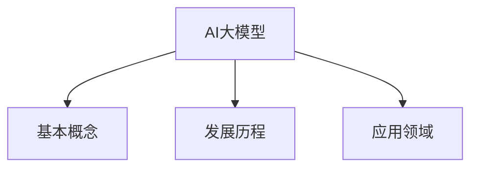

#### 1.2 Prompt的概念与作用

##### 1.2.1 Prompt的定义

Prompt，即提示词，是用于引导AI大模型生成特定结果的一种输入。它通常是一段文本或图像，包含用户意图和上下文信息，帮助模型理解任务目标。

##### 1.2.2 Prompt在AI大模型中的作用

Prompt在AI大模型中起到了关键作用。首先，它为模型提供了明确的任务目标，帮助模型聚焦于特定任务。其次，Prompt可以引导模型生成更符合用户需求的输出结果。

##### 1.2.3 Prompt的类型

Prompt可以分为以下几种类型：

- 开放式Prompt：允许用户自由输入，没有特定限制。
- 限制式Prompt：对用户输入进行一定程度的限制，例如长度、格式等。
- 结构化Prompt：将用户意图和上下文信息结构化地组织在一起，便于模型理解。

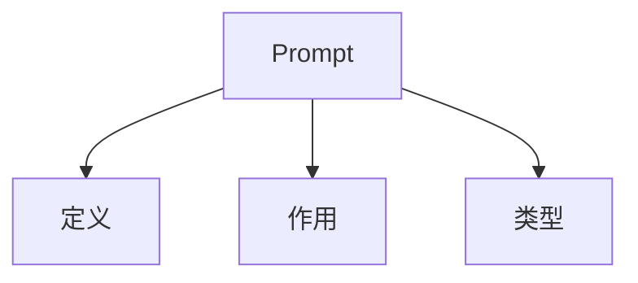

#### 1.3 AI大模型与Prompt的联系与区别

##### 1.3.1 AI大模型与Prompt的联系

AI大模型和Prompt之间密不可分。Prompt是AI大模型输入的一部分，决定了模型的输出结果。没有合适的Prompt，AI大模型很难发挥出应有的效果。

##### 1.3.2 AI大模型与Prompt的区别

AI大模型是一个复杂的深度学习模型，具有大量的参数和层级结构。而Prompt是一种引导模型生成特定结果的输入，它可以是文本、图像或其他形式。

##### 1.3.3 AI大模型与Prompt的最佳实践

为了充分发挥AI大模型和Prompt的作用，需要遵循以下最佳实践：

- 确保Prompt清晰明了，避免歧义。
- 根据任务需求调整Prompt的长度和结构。
- 使用高质量的训练数据，以提高Prompt的准确性。

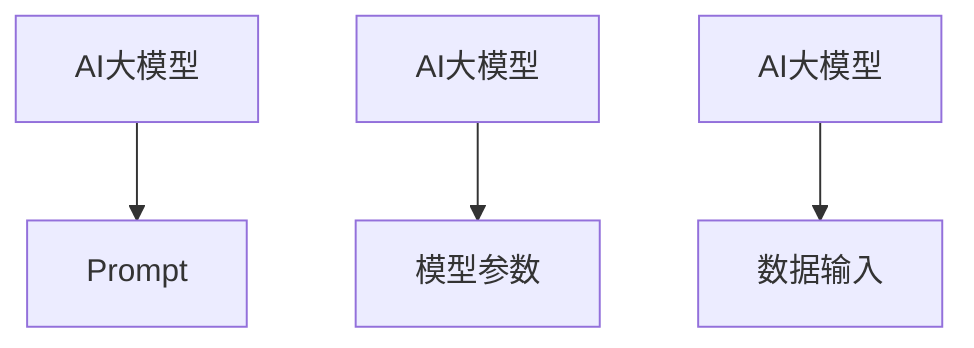

#### 第二部分：Prompt设计与优化

### 第2章：Prompt设计原则

#### 2.1 Prompt设计的基本原则

##### 2.1.1 明确目的

在设计Prompt时，首先要明确任务目标。明确目的是确保Prompt能够引导模型生成符合需求的输出结果。

##### 2.1.2 清晰性

Prompt应清晰明了，避免歧义。使用简单、易懂的语言，确保模型能够正确理解用户意图。

##### 2.1.3 简洁性

Prompt应尽量简洁，避免冗余信息。简洁的Prompt有助于模型快速聚焦于任务目标。

##### 2.1.4 可扩展性

Prompt应具备一定的可扩展性，以便在后续任务中根据需求进行调整。

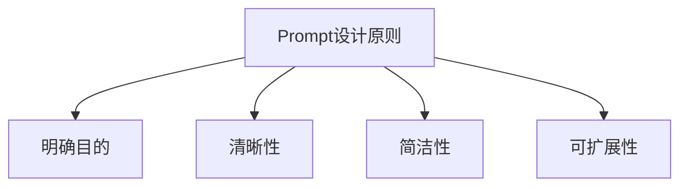

#### 2.2 Prompt设计的实践方法

##### 2.2.1 数据驱动的Prompt设计

数据驱动的Prompt设计是一种基于训练数据的Prompt设计方法。通过分析训练数据，提取关键信息，构建出合适的Prompt。

##### 2.2.2 人类反馈的Prompt设计

人类反馈的Prompt设计是一种基于人类反馈的Prompt设计方法。通过人类评估和反馈，不断优化Prompt，提高模型性能。

##### 2.2.3 对话式的Prompt设计

对话式的Prompt设计是一种基于对话的Prompt设计方法。通过模拟对话场景，构建出自然、流畅的Prompt。

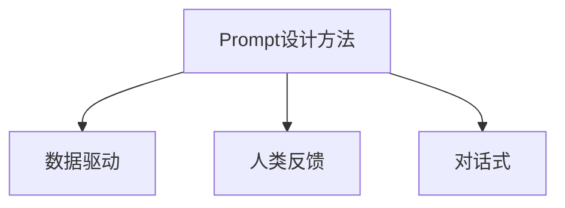

#### 2.3 Prompt优化的策略

##### 2.3.1 数据集的选择

选择合适的数据集是Prompt优化的关键。应根据任务需求和模型特点，选择高质量、多样化的数据集。

##### 2.3.2 Prompt的调整

根据模型输出结果，对Prompt进行调整和优化。可以通过增加、删除或修改部分内容，提高Prompt的有效性。

##### 2.3.3 模型的微调

在Prompt优化过程中，可以对模型进行微调，以进一步提高模型性能。微调过程中，应关注模型参数和训练策略的调整。

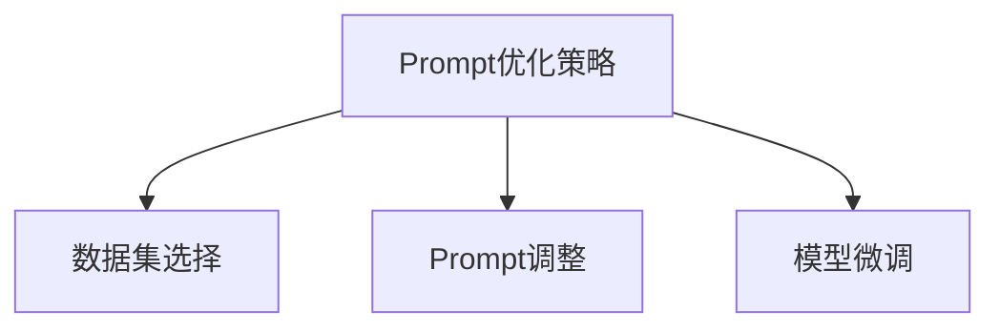

### 第3章：Prompt应用案例

#### 3.1 Prompt在自然语言处理中的应用

##### 3.1.1 文本生成

文本生成是Prompt在自然语言处理中的一个重要应用。通过设计合适的Prompt，可以生成高质量、连贯的文本。

##### 3.1.2 问答系统

问答系统是Prompt在自然语言处理中的另一个重要应用。通过设计合适的Prompt，可以构建出智能、高效的问答系统。

##### 3.1.3 机器翻译

机器翻译是Prompt在自然语言处理中的典型应用。通过设计合适的Prompt，可以生成准确、自然的翻译结果。

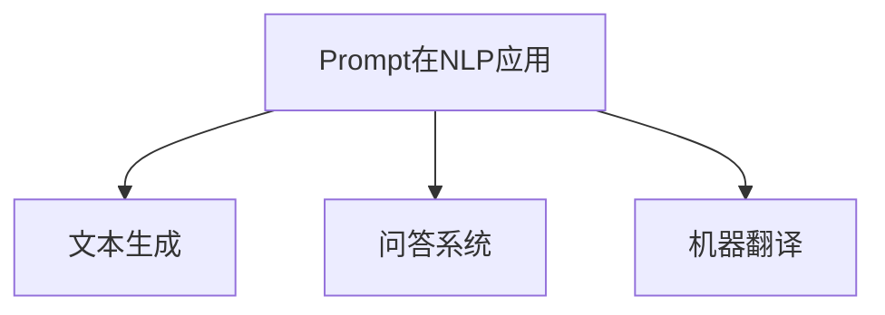

#### 3.2 Prompt在计算机视觉中的应用

##### 3.2.1 图像生成

图像生成是Prompt在计算机视觉中的一个重要应用。通过设计合适的Prompt，可以生成高质量、逼真的图像。

##### 3.2.2 图像分类

图像分类是Prompt在计算机视觉中的另一个重要应用。通过设计合适的Prompt，可以准确地将图像分类到相应的类别。

##### 3.2.3 目标检测

目标检测是Prompt在计算机视觉中的典型应用。通过设计合适的Prompt，可以准确检测并定位图像中的目标对象。

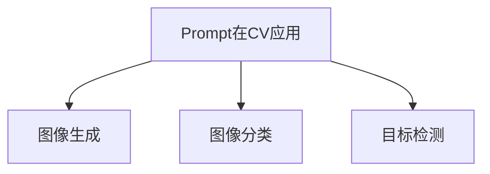

#### 3.3 Prompt在推荐系统中的应用

##### 3.3.1 用户画像

用户画像是Prompt在推荐系统中的一个重要应用。通过设计合适的Prompt，可以构建出准确、详实的用户画像。

##### 3.3.2 内容推荐

内容推荐是Prompt在推荐系统中的另一个重要应用。通过设计合适的Prompt，可以生成个性化的内容推荐。

##### 3.3.3 推荐算法优化

推荐算法优化是Prompt在推荐系统中的典型应用。通过设计合适的Prompt，可以优化推荐算法，提高推荐效果。

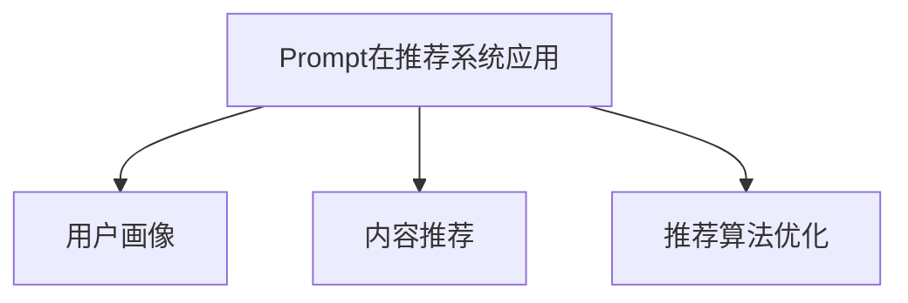

#### 第三部分：Prompt最佳实践

### 第4章：Prompt最佳实践

#### 4.1 Prompt设计与优化的最佳实践

##### 4.1.1 数据质量的重要性

数据质量是Prompt设计与优化的基础。高质量的数据可以确保Prompt的准确性，提高模型性能。

##### 4.1.2 Prompt的设计流程

Prompt设计应遵循一定的流程，包括明确任务目标、分析数据、构建Prompt、评估效果等。

##### 4.1.3 模型的选择与调整

选择合适的模型，并根据任务需求对模型进行调整和优化，是Prompt最佳实践的重要组成部分。

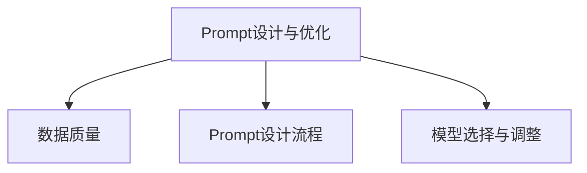

#### 4.2 Prompt在不同领域的应用

##### 4.2.1 学术研究中的Prompt应用

学术研究中的Prompt应用主要包括文本生成、问答系统、机器翻译等。通过设计合适的Prompt，可以生成高质量的学术论文和研究成果。

##### 4.2.2 工业界中的Prompt应用

工业界中的Prompt应用主要包括推荐系统、图像生成、目标检测等。通过设计合适的Prompt，可以提高生产效率和产品质量。

##### 4.2.3 开源社区中的Prompt应用

开源社区中的Prompt应用主要包括模型优化、算法研究等。通过设计合适的Prompt，可以促进开源项目的发展和优化。

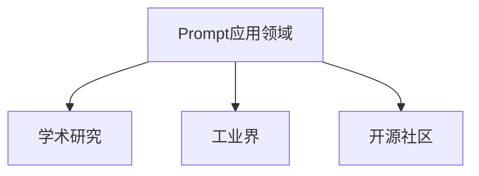

#### 4.3 Prompt未来发展趋势

##### 4.3.1 新型Prompt技术的探索

随着人工智能技术的不断发展，新型Prompt技术将不断涌现，如基于多模态数据的Prompt、自适应Prompt等。

##### 4.3.2 Prompt在垂直行业的应用前景

Prompt技术在医疗、教育、金融等垂直行业具有广阔的应用前景，将为行业带来新的发展机遇。

##### 4.3.3 Prompt在教育、医疗等领域的潜力

Prompt技术在教育、医疗等领域的潜力巨大，有望在教育个性化、医疗诊断等方面发挥重要作用。

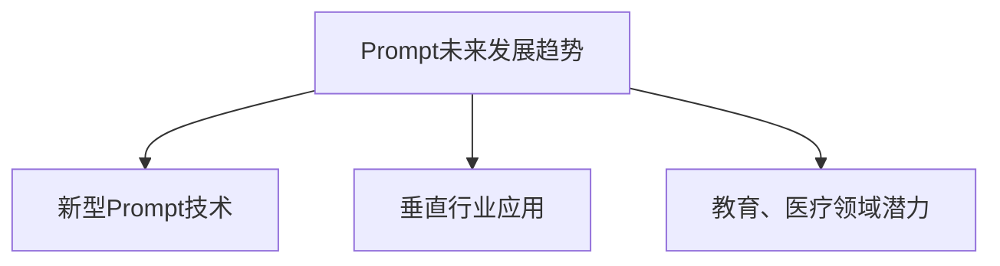

### 附录

#### 附录A：Prompt设计工具与资源

##### A.1 主流Prompt设计工具

- AutoPrompt
- Text-to-Image Prompt
- Dialogue-Prompt
- PromptSpace

##### A.2 Prompt开源资源

- Hugging Face
- AllenNLP
- GLM-130B
- T5

##### A.3 Prompt设计论文集锦

- “Prompt Engineering: The New frontier of AI”
- “A Few Useful Things to Know About Machine Learning”
- “A Theoretically Grounded Application of Prompt Learning”

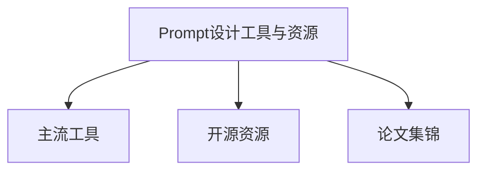

#### 附录B：Prompt设计参考书籍

##### B.1 经典参考书籍

- 《深度学习》
- 《神经网络与深度学习》
- 《模式识别与机器学习》

##### B.2 最新研究成果

- “Prompt Engineering: A New Paradigm for Large-scale Language Modeling”
- “A Theoretically Grounded Application of Prompt Learning”
- “MultiModal Prompt Learning for Image-Text Generation”

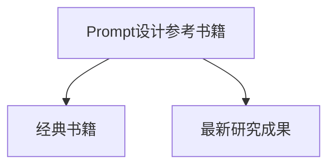

### 作者

**作者**：AI天才研究院/AI Genius Institute & 禅与计算机程序设计艺术 /Zen And The Art of Computer Programming

