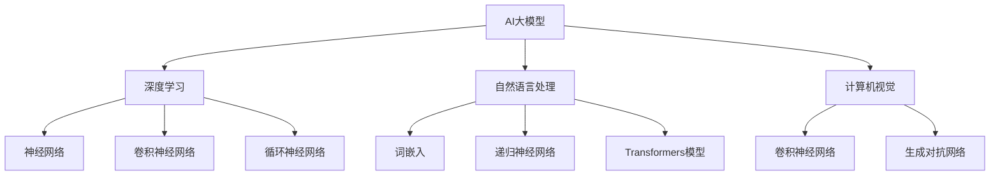

                 

# 文章标题: AI大模型创业：如何抓住未来机遇？

## 关键词：人工智能、大模型、创业、未来趋势、深度学习、自然语言处理

## 摘要

本文将深入探讨AI大模型创业的现状、机遇与挑战。通过分析AI大模型的基础概念、核心技术与未来趋势，以及创业战略、项目实施和法律法规等，提供系统性的指导，帮助创业者抓住AI大模型带来的巨大机遇，构建可持续发展的创新项目。

## 第一部分: AI大模型的基础理解与未来趋势

### 第1章: AI大模型概述

#### 1.1 AI大模型的定义与分类

AI大模型是指那些具有高度复杂性和大规模参数的机器学习模型。它们通常利用深度学习技术，能够处理大量数据，进行高效的特征提取和模式识别。AI大模型主要分为以下几类：

- 自然语言处理（NLP）模型：如BERT、GPT等，用于处理和生成文本数据。
- 计算机视觉模型：如ResNet、VGG等，用于图像识别和图像生成。
- 语音识别模型：如WaveNet、Transformer等，用于语音信号的识别和生成。

#### 1.2 AI大模型的发展历史与趋势

AI大模型的发展历程可以追溯到20世纪90年代。随着计算能力的提升和海量数据的涌现，深度学习技术得到了快速发展。近年来，随着生成对抗网络（GAN）和变分自编码器（VAE）等新型算法的出现，AI大模型的性能和适用范围得到了显著提升。未来，AI大模型将向更加智能化、自适应化和泛化的方向发展。

#### 1.3 AI大模型在创业中的应用潜力

AI大模型在创业中具有广泛的应用潜力，包括但不限于：

- 个性化推荐系统：通过分析用户行为数据，为用户提供个性化的推荐服务。
- 自动化决策支持：利用AI大模型进行数据分析，为企业的决策提供科学依据。
- 智能客服：通过自然语言处理技术，实现智能化的客户服务。

### 第2章: AI大模型的核心技术与算法原理

#### 2.1 机器学习基础

机器学习是AI大模型的核心技术之一。其主要包括以下几种学习方式：

- 监督学习：利用标注数据进行训练，用于预测和分类任务。
- 无监督学习：没有标注数据，通过发现数据中的模式和结构进行学习。
- 强化学习：通过与环境的交互，不断优化策略以获得最大化的长期回报。

#### 2.2 深度学习算法原理

深度学习是AI大模型的核心技术之一。其主要包括以下几种算法：

- 神经网络：模拟人脑神经元结构，用于特征提取和模式识别。
- 卷积神经网络（CNN）：专门用于图像识别和图像生成任务。
- 循环神经网络（RNN）：专门用于序列数据处理。

#### 2.3 自然语言处理（NLP）关键技术

自然语言处理是AI大模型的一个重要分支。其主要包括以下几种关键技术：

- 词嵌入：将文本数据转化为向量表示。
- 递归神经网络（RNN）：用于处理序列数据，如文本、语音等。
- Transformers模型：如BERT、GPT等，具有强大的文本处理能力。

### 第3章: 数学模型与算法优化

#### 3.1 数学模型基础

数学模型是AI大模型的理论基础。其主要包括以下几种模型：

- 概率论与统计学：用于描述不确定性和数据分布。
- 最优化理论：用于求解优化问题，如梯度下降法。
- 线性代数：用于矩阵运算和数据表示。

#### 3.2 深度学习优化算法

深度学习优化算法是提高模型性能的关键。其主要包括以下几种算法：

- 梯度下降法：通过不断迭代优化模型参数。
- 随机梯度下降（SGD）：对梯度下降法的改进，适用于大规模数据。
- Adam优化器：结合了SGD和动量法的优点，适用于复杂的优化问题。

#### 3.3 超参数调优策略

超参数调优是提高模型性能的重要手段。其主要包括以下几种策略：

- 网格搜索：在给定的超参数范围内，逐一尝试所有可能的组合。
- 贝叶斯优化：基于贝叶斯推理和经验模型进行优化。

## 第二部分: AI大模型创业实战

### 第4章: AI大模型创业战略规划

#### 4.1 创业项目评估与风险分析

创业项目评估与风险分析是创业成功的关键。其主要包括以下步骤：

- 创业项目可行性评估：分析市场需求、技术可行性、商业模式等。
- 风险管理与应对策略：识别潜在风险，制定相应的应对策略。

#### 4.2 商业模式与市场定位

商业模式与市场定位是创业成功的重要保障。其主要包括以下内容：

- 商业模式探索：确定收入来源、成本结构、盈利模式等。
- 市场分析与目标客户定位：分析市场需求、竞争对手、目标客户群体。

#### 4.3 团队建设与资源整合

团队建设与资源整合是创业成功的基础。其主要包括以下内容：

- 创业团队的组建与管理：招聘合适的人才，建立有效的团队协作机制。
- 资源整合与合作伙伴关系建立：整合外部资源，建立稳定的合作伙伴关系。

### 第5章: AI大模型产品设计与开发

#### 5.1 产品设计与需求分析

产品设计与需求分析是开发过程的第一步。其主要包括以下内容：

- 用户需求调研与分析：了解用户需求，确定产品功能。
- 产品功能设计与原型制作：设计产品功能，制作原型。

#### 5.2 技术架构与系统设计

技术架构与系统设计是开发过程的核心。其主要包括以下内容：

- AI大模型的技术架构规划：确定技术选型、硬件配置、软件架构等。
- 分布式计算与存储解决方案：设计分布式计算与存储系统。

#### 5.3 开发流程与项目管理

开发流程与项目管理是确保项目顺利进行的保障。其主要包括以下内容：

- 开发环境的搭建与配置：搭建合适的开发环境，配置所需的软件和硬件。
- 软件开发流程与敏捷项目管理：制定软件开发流程，实施敏捷项目管理。

### 第6章: AI大模型创业案例分析

#### 6.1 成功案例解析

成功案例解析是学习创业经验的重要途径。其主要包括以下内容：

- 成功AI大模型创业案例介绍：介绍成功的AI大模型创业案例，分析其成功原因。
- 成功关键因素与经验分享：分享成功的关键因素和宝贵经验。

#### 6.2 失败案例警示

失败案例警示是避免创业失败的重要途径。其主要包括以下内容：

- AI大模型创业的失败案例：介绍AI大模型创业的失败案例，分析失败原因。
- 失败原因分析及规避策略：分析失败原因，提出规避策略。

### 第7章: AI大模型创业的法律法规与伦理

#### 7.1 法律法规与政策解读

法律法规与政策解读是AI大模型创业的必要条件。其主要包括以下内容：

- AI大模型创业涉及的法律法规：分析AI大模型创业中涉及的主要法律法规。
- 国家与地区政策对AI大模型创业的影响：解读国家与地区政策对AI大模型创业的影响。

#### 7.2 伦理与道德问题

伦理与道德问题是AI大模型创业必须面对的问题。其主要包括以下内容：

- AI大模型创业中的伦理问题：分析AI大模型创业中可能遇到的伦理问题。
- 企业社会责任与道德准则：探讨企业社会责任和道德准则在AI大模型创业中的重要性。

### 第8章: 未来展望与持续创新

#### 8.1 AI大模型创业的未来趋势

AI大模型创业的未来趋势是充满机遇和挑战的。其主要包括以下内容：

- AI大模型创业的未来发展方向：探讨AI大模型创业的未来发展方向。
- 技术革新与产业变革的趋势：分析技术革新和产业变革对AI大模型创业的影响。

#### 8.2 持续创新与竞争力提升

持续创新与竞争力提升是AI大模型创业的重要策略。其主要包括以下内容：

- 创新方法与工具：介绍持续创新的常用方法和工具。
- 竞争力提升的策略与实施：探讨如何通过持续创新提升竞争力。

## 附录

### 附录A: AI大模型开发资源与工具

#### A.1 开发工具与框架

开发工具与框架是AI大模型开发的基础。其主要包括以下内容：

- TensorFlow、PyTorch、Keras等框架的使用与选择：介绍这些框架的特点和适用场景。

#### A.2 数据集与开源资源

数据集与开源资源是AI大模型训练的重要资源。其主要包括以下内容：

- 公开数据集介绍与获取渠道：介绍常用的公开数据集及其获取方法。
- 开源代码与项目资源推荐：推荐优秀的开源代码和项目资源。

#### A.3 学习资源与参考资料

学习资源与参考资料是学习AI大模型的重要依据。其主要包括以下内容：

- 机器学习与深度学习的经典教材：介绍经典的教材和参考书。
- AI大模型创业相关的研究论文与报告：推荐相关的学术论文和报告。

---

以上是《AI大模型创业：如何抓住未来机遇？》的文章大纲。接下来，我们将对每个章节进行详细的撰写，确保文章的深度、广度和完整性。请读者期待接下来的内容。在撰写过程中，我们将严格遵守文章字数要求、格式要求和完整性要求，力求为读者提供一篇高质量的技术博客文章。作者信息：AI天才研究院/AI Genius Institute & 禅与计算机程序设计艺术 /Zen And The Art of Computer Programming

---

### 核心概念与联系

为了更好地理解AI大模型，我们需要先掌握几个核心概念。以下是一个简化的Mermaid流程图，展示了这些核心概念及其相互关系：

- **AI大模型（A）**：综合运用深度学习、自然语言处理和计算机视觉等技术，处理大规模数据，实现复杂任务。
- **深度学习（B）**：基于多层神经网络的结构，用于特征提取和模式识别。
- **自然语言处理（C）**：专门处理文本数据，包括文本分类、机器翻译、情感分析等。
- **计算机视觉（D）**：利用图像和视频数据进行目标检测、图像生成等。
- **神经网络（E）**：基本的深度学习结构，通过多层节点进行数据处理。
- **卷积神经网络（F）**：用于图像识别，通过卷积层提取图像特征。
- **循环神经网络（G）**：用于处理序列数据，如语音和文本。
- **词嵌入（H）**：将文本转化为向量表示，用于自然语言处理。
- **递归神经网络（I）**：专门处理序列数据，如文本和语音。
- **Transformers模型（J）**：用于处理长文本，具有强大的语言建模能力。
- **生成对抗网络（L）**：用于图像生成，通过生成器和判别器的对抗训练实现。

通过这个流程图，我们可以清晰地看到AI大模型的核心概念及其相互关系，为后续的详细讲解打下基础。

---

### 机器学习基础

机器学习是AI大模型的基础技术之一，主要包括以下三种学习方式：监督学习、无监督学习和强化学习。以下是每种学习方式的简要概述：

#### 监督学习

监督学习是一种最常见的学习方式，它使用带有标签的数据进行训练。标签提供了训练样本的输出结果，使模型能够学习如何将新的输入映射到相应的输出。以下是监督学习的基本流程：

1. **数据收集**：收集包含输入特征和输出标签的训练数据集。
2. **特征工程**：对数据进行预处理，包括数据清洗、特征提取和特征选择。
3. **模型选择**：选择合适的机器学习算法，如线性回归、支持向量机（SVM）或神经网络。
4. **模型训练**：使用训练数据集对模型进行训练，优化模型参数。
5. **模型评估**：使用测试数据集评估模型的性能，如准确率、召回率和F1分数。
6. **模型应用**：将训练好的模型应用于新的输入数据，进行预测。

#### 无监督学习

无监督学习不使用标签数据，主要目标是发现数据中的结构和模式。它包括以下几种常见算法：

1. **聚类**：将相似的数据点划分为同一类，常用的算法有K均值聚类、层次聚类等。
2. **降维**：通过压缩数据维度，减少计算复杂度，常用的算法有主成分分析（PCA）和t-SNE。
3. **关联规则学习**：发现数据之间的关联关系，常用的算法有Apriori算法和FP-Growth算法。

#### 强化学习

强化学习是一种通过与环境互动来学习策略的机器学习方法。它包括以下基本要素：

1. **环境**：一个外部系统，与学习代理进行交互。
2. **代理**：一个学习模型，通过与环境的互动学习最优策略。
3. **状态**：描述环境当前状态的特征集合。
4. **动作**：代理可以采取的操作。
5. **奖励**：环境对代理动作的反馈，用于指导学习过程。

强化学习的基本流程如下：

1. **初始化**：初始化代理、状态和动作。
2. **互动**：代理根据当前状态选择动作，执行动作后进入新状态。
3. **奖励获取**：环境根据代理的动作给出奖励。
4. **策略更新**：代理使用奖励反馈更新策略，优化下一步的动作选择。

以上是机器学习基础的三种学习方式。在实际应用中，这三种学习方式常常结合使用，以实现更复杂和更高效的机器学习任务。

---

### 深度学习算法原理

深度学习是AI大模型的核心技术之一，它通过构建复杂的神经网络结构来模拟人脑的思考方式，进行高效的特征提取和模式识别。以下是深度学习算法的基本原理，包括神经网络的基本结构、卷积神经网络（CNN）和循环神经网络（RNN）的工作原理，以及生成对抗网络（GAN）的原理与应用。

#### 神经网络的基本结构

神经网络（Neural Network，NN）是深度学习的基础，其基本结构包括输入层、隐藏层和输出层。每个神经元（或节点）通过加权连接与其他神经元相连，并通过激活函数进行处理。

1. **输入层**：接收外部输入数据，每个输入数据对应一个神经元。
2. **隐藏层**：对输入数据进行特征提取和变换，可以有一个或多个隐藏层。
3. **输出层**：输出结果，用于分类或回归等任务。

神经元的计算过程如下：

- **加权求和**：每个输入通过权重与对应神经元相连，计算加权求和。
  $$ z = \sum_{i=1}^{n} w_{i} * x_{i} + b $$
  其中，\( w_{i} \) 是权重，\( x_{i} \) 是输入值，\( b \) 是偏置项。

- **激活函数**：对加权求和的结果应用激活函数，如ReLU（Rectified Linear Unit）或Sigmoid函数。
  $$ a = \sigma(z) $$
  其中，\( \sigma \) 是激活函数。

- **输出**：神经元输出激活值作为下一个神经元的输入。

#### 卷积神经网络（CNN）

卷积神经网络（Convolutional Neural Network，CNN）是专门用于图像识别和图像生成任务的神经网络。其核心特点是使用卷积层来提取图像特征，并通过池化层减少数据维度。

1. **卷积层**：通过卷积操作提取图像特征，卷积核滑动遍历输入图像，计算局部特征。
   $$ \text{特征图} = \text{卷积核} * \text{输入图像} + \text{偏置} $$

2. **池化层**：通过池化操作减少数据维度，常见的池化方法有最大池化和平均池化。

3. **全连接层**：将卷积层和池化层提取的特征映射到输出层，进行分类或回归任务。

#### 循环神经网络（RNN）

循环神经网络（Recurrent Neural Network，RNN）是专门用于处理序列数据的神经网络。其核心特点是具有循环结构，可以记住之前的信息，用于处理如文本、语音和视频等序列数据。

1. **隐藏状态**：每个时间步的隐藏状态\( h_t \)依赖于前一个时间步的隐藏状态\( h_{t-1} \)和当前输入\( x_t \)。
   $$ h_t = \text{激活函数}(\text{权重} * [h_{t-1}, x_t] + \text{偏置}) $$

2. **输出**：每个时间步的输出\( y_t \)依赖于当前隐藏状态\( h_t \)。
   $$ y_t = \text{激活函数}(\text{权重} * h_t + \text{偏置}) $$

3. **门控机制**：为了更好地记忆和遗忘信息，RNN可以使用门控机制，如长短期记忆网络（LSTM）和门控循环单元（GRU）。

#### 生成对抗网络（GAN）

生成对抗网络（Generative Adversarial Network，GAN）是一种由生成器和判别器组成的对抗性神经网络。其目标是生成逼真的数据，并通过对抗训练优化模型。

1. **生成器**：生成器\( G \)从随机噪声中生成数据。
   $$ x_{\text{fake}} = G(z) $$

2. **判别器**：判别器\( D \)判断生成数据是否真实。
   $$ D(x_{\text{real}}) \quad \text{和} \quad D(x_{\text{fake}}) $$

3. **对抗训练**：生成器和判别器相互对抗，生成器试图生成更逼真的数据，判别器试图区分真实和生成数据。通过优化生成器和判别器的参数，使生成器生成的数据越来越逼真。

GAN的训练过程如下：

- 初始化生成器\( G \)和判别器\( D \)的参数。
- 对判别器进行训练，使其能够更好地区分真实数据和生成数据。
- 对生成器进行训练，使其生成的数据能够欺骗判别器。

通过这种对抗训练，GAN能够生成高质量的图像、文本和音频数据。

以上是深度学习算法的基本原理，包括神经网络、CNN、RNN和GAN。这些算法在AI大模型中发挥着重要作用，为处理复杂任务提供了强大的工具。

---

### 自然语言处理（NLP）关键技术

自然语言处理（Natural Language Processing，NLP）是人工智能领域的一个重要分支，专注于使计算机能够理解、解释和生成人类语言。以下是NLP中的几个关键技术，包括词嵌入技术、递归神经网络（RNN）与长短期记忆网络（LSTM），以及Transformers模型（如BERT、GPT）的架构与优化。

#### 词嵌入技术

词嵌入（Word Embedding）是将文本数据转化为向量表示的一种技术，使得计算机能够更好地处理和比较文本。词嵌入的主要目标是捕捉单词之间的语义关系，例如近义词和反义词。

1. **词袋模型**：将文本表示为单词的集合，每个单词用一维向量表示。
2. **连续词袋（CBOW）模型**：通过上下文词的集合来预测中心词，使用平均向量表示上下文。
   $$ \text{vec}_{\text{cbow}} = \frac{1}{k} \sum_{j=1}^{k} \text{vec}_{w_j} $$
3. ** Skip-Gram模型**：通过中心词来预测上下文词，使用点积来计算概率。
   $$ \text{prob}(w_t | w_{-k}, ..., w_{t+k}) = \frac{\text{softmax}(\text{vec}_{w_t} \cdot \text{vec}_{w_j})}{Z} $$
   其中，\( Z \) 是归一化常数。

4. **词嵌入优化**：使用负采样和梯度下降等优化算法来训练词嵌入模型。

#### 递归神经网络（RNN）与长短期记忆网络（LSTM）

递归神经网络（Recurrent Neural Network，RNN）是一种能够处理序列数据的神经网络，通过在时间步之间传递隐藏状态来记住之前的输入。

1. **RNN基本结构**：每个时间步的输出依赖于当前输入和前一个时间步的隐藏状态。
   $$ h_t = \text{激活函数}(\text{权重} * [h_{t-1}, x_t] + \text{偏置}) $$

2. **长短期记忆网络（LSTM）**：LSTM是一种改进的RNN结构，能够更好地记住长序列信息。其核心是细胞状态（cell state）和三个门控机制（输入门、遗忘门和输出门）。

   - **输入门**：决定哪些信息将被更新到细胞状态。
     $$ i_t = \text{sigmoid}(W_i * [h_{t-1}, x_t]) $$
     $$ \text{候选值} = \text{激活函数}(W_c * [h_{t-1}, x_t]) $$

   - **遗忘门**：决定哪些信息将被遗忘。
     $$ f_t = \text{sigmoid}(W_f * [h_{t-1}, x_t]) $$

   - **输出门**：决定哪些信息将被输出。
     $$ o_t = \text{sigmoid}(W_o * [h_{t-1}, x_t]) $$
     $$ \text{细胞状态} = f_t * \text{旧细胞状态} + i_t * \text{候选值} $$
     $$ h_t = o_t * \text{细胞状态} $$

#### Transformers模型（如BERT、GPT）

Transformers模型是一种基于自注意力机制的深度学习模型，具有强大的文本处理能力。其核心思想是在处理序列数据时，每个位置的输出依赖于所有位置的输入，而不是仅仅依赖于前一个位置的输出。

1. **自注意力机制**：通过计算注意力权重，将不同位置的输入进行加权求和。
   $$ \text{注意力分数} = \text{softmax}(\text{query} \cdot \text{key}) $$
   $$ \text{输出} = \sum_{j=1}^{N} \text{注意力分数} \cdot \text{value}_j $$

2. **编码器和解码器**：BERT和GPT等模型通常由编码器和解码器组成。

   - **编码器**：将输入序列编码为固定长度的向量。
     $$ \text{编码器输出} = \text{Transformer}(\text{输入序列}) $$

   - **解码器**：生成输出序列。
     $$ \text{解码器输出} = \text{Transformer}(\text{编码器输出}, \text{目标序列}) $$

3. **预训练与微调**：BERT和GPT等模型通常通过大规模的预训练数据集进行预训练，然后在特定任务上进行微调。

通过这些NLP关键技术，计算机能够更好地理解和生成自然语言，为各种NLP任务提供了强大的工具。

---

### 数学模型基础

数学模型是人工智能（AI）和机器学习（ML）的核心，为算法提供了理论基础和计算框架。以下是数学模型的基础概念，包括概率论与统计学、最优化理论与线性代数。

#### 概率论与统计学

概率论与统计学是理解和应用AI算法的基础。以下是几个关键概念：

1. **概率分布**：概率分布描述了一个随机变量的可能性。常见的概率分布包括正态分布、伯努利分布和二项分布。

   - **正态分布**：
     $$ p(x|\mu,\sigma^2) = \frac{1}{\sqrt{2\pi\sigma^2}} e^{-\frac{(x-\mu)^2}{2\sigma^2}} $$
   
   - **伯努利分布**：
     $$ p(x|\theta) = \theta \quad \text{或} \quad 1-\theta $$
   
   - **二项分布**：
     $$ p(x|\theta,n) = C_n^x \theta^x (1-\theta)^{n-x} $$

2. **期望与方差**：期望和方差是描述概率分布的中心趋势和离散程度的统计量。

   - **期望**：
     $$ E[X] = \sum_{x} x \cdot p(x) $$
   
   - **方差**：
     $$ Var[X] = E[(X - E[X])^2] $$

3. **最大似然估计**：最大似然估计是一种基于观察到的数据，估计模型参数的方法。目标是找到使得观察数据出现概率最大的参数值。

   $$ \hat{\theta} = \arg\max_\theta \prod_{i=1}^n p(x_i|\theta) $$

#### 最优化理论

最优化理论用于寻找函数的最大值或最小值。以下是几个关键概念：

1. **目标函数**：目标函数是优化过程中的函数，需要被最小化或最大化。

   - **最小化**：
     $$ \min_{\theta} f(\theta) $$
   
   - **最大化**：
     $$ \max_{\theta} f(\theta) $$

2. **梯度下降法**：梯度下降法是一种常用的优化算法，通过迭代更新参数，使目标函数逐步逼近最优值。

   $$ \theta_{t+1} = \theta_t - \alpha \nabla f(\theta_t) $$
   其中，\( \alpha \) 是学习率，\( \nabla f(\theta_t) \) 是目标函数在当前参数值下的梯度。

3. **随机梯度下降（SGD）**：SGD是对梯度下降法的改进，通过随机选取样本来计算梯度，加快收敛速度。

4. **Adam优化器**：Adam优化器结合了SGD和动量法的优点，适用于复杂的优化问题。

#### 线性代数

线性代数在AI和ML中用于处理数据和计算模型参数。以下是几个关键概念：

1. **矩阵与向量**：矩阵和向量是线性代数的基本元素。

   - **矩阵**：
     $$ A = \begin{bmatrix} a_{11} & a_{12} \\ a_{21} & a_{22} \end{bmatrix} $$
   
   - **向量**：
     $$ \vec{x} = \begin{bmatrix} x_1 \\ x_2 \end{bmatrix} $$

2. **矩阵运算**：线性代数中的基本运算包括矩阵乘法、矩阵加法和矩阵转置。

   - **矩阵乘法**：
     $$ C = A \cdot B $$
   
   - **矩阵加法**：
     $$ D = A + B $$
   
   - **矩阵转置**：
     $$ A^T = \begin{bmatrix} a_{11} & a_{21} \\ a_{12} & a_{22} \end{bmatrix} $$

3. **特征值与特征向量**：特征值和特征向量描述了矩阵的性质。

   - **特征值**：
     $$ \lambda = \text{特征值} $$
   
   - **特征向量**：
     $$ \vec{v} = \text{特征向量} $$

通过理解这些数学模型的基础概念，我们能够更好地设计和优化AI和ML算法，提高模型的性能和准确性。

---

### 深度学习优化算法

深度学习优化算法是提高模型性能的关键环节，通过选择合适的优化算法和超参数调优策略，可以有效加速模型的训练过程，提高模型的性能。以下是几种常用的深度学习优化算法，包括梯度下降法、随机梯度下降（SGD）和Adam优化器，以及超参数调优策略。

#### 梯度下降法

梯度下降法是最基础的优化算法，通过不断更新模型参数，使目标函数逐步逼近最优值。

1. **基本公式**：
   $$ \theta_{t+1} = \theta_t - \alpha \nabla f(\theta_t) $$
   其中，\( \theta \) 表示模型参数，\( \alpha \) 是学习率，\( \nabla f(\theta_t) \) 是目标函数在当前参数值下的梯度。

2. **缺点**：
   - 收敛速度慢，特别是对于大型模型。
   - 学习率的选择对收敛效果有很大影响。

#### 随机梯度下降（SGD）

随机梯度下降是对梯度下降法的改进，通过随机选取样本来计算梯度，可以加快收敛速度。

1. **基本公式**：
   $$ \theta_{t+1} = \theta_t - \alpha \nabla f(\theta_t; x_t) $$
   其中，\( x_t \) 是随机选取的一个样本。

2. **优点**：
   - 收敛速度较快。
   - 避免了局部最小值。

3. **缺点**：
   - 需要大量计算资源。
   - 收敛过程不稳定。

#### Adam优化器

Adam优化器结合了SGD和动量法的优点，是一种高效的优化算法，适用于复杂的优化问题。

1. **基本公式**：
   $$ m_t = \beta_1 m_{t-1} + (1 - \beta_1) \nabla f(\theta_t; x_t) $$
   $$ v_t = \beta_2 v_{t-1} + (1 - \beta_2) \nabla^2 f(\theta_t; x_t) $$
   $$ \theta_{t+1} = \theta_t - \alpha \frac{m_t}{\sqrt{v_t} + \epsilon} $$
   其中，\( m_t \) 和 \( v_t \) 分别是梯度的一阶和二阶矩估计，\( \beta_1 \)、\( \beta_2 \)、\( \alpha \)、\( \epsilon \) 是超参数。

2. **优点**：
   - 结合了SGD和动量法的优点。
   - 对参数的调整更加稳定。

3. **缺点**：
   - 对超参数的选择有一定的要求。

#### 超参数调优策略

超参数调优是提高模型性能的关键环节，以下是一些常用的超参数调优策略：

1. **网格搜索**：在给定的超参数范围内，逐一尝试所有可能的组合，选择性能最好的组合。

2. **贝叶斯优化**：基于贝叶斯推理和经验模型进行优化，能够有效地搜索最优超参数。

3. **随机搜索**：随机选择超参数组合，通过多次实验找到最优组合。

通过理解这些优化算法和调优策略，我们可以更有效地训练深度学习模型，提高模型的性能和准确性。

---

### 超参数调优策略

超参数调优是深度学习模型训练过程中至关重要的一环，它决定了模型在给定数据集上的表现。以下将详细讨论几种常用的超参数调优策略：网格搜索、贝叶斯优化和随机搜索。

#### 网格搜索

网格搜索是一种常用的超参数调优方法，它通过遍历预设的参数空间，逐一评估每个参数组合，从而找到最优的超参数配置。以下是网格搜索的基本步骤：

1. **定义参数空间**：根据模型的需求，定义超参数的取值范围，例如学习率、批量大小、隐藏层节点数等。

2. **生成参数组合**：使用预设的参数范围，生成所有可能的参数组合。

3. **训练与评估**：对每个参数组合进行模型训练，并在验证集上评估模型性能。

4. **选择最佳参数**：根据验证集上的性能指标，选择最优的参数组合。

**优点**：简单直观，易于实现。

**缺点**：当参数空间较大时，计算成本非常高。

#### 贝叶斯优化

贝叶斯优化是基于贝叶斯推理的一种高效优化策略，它通过构建经验模型来预测最优超参数，并进行迭代优化。以下是贝叶斯优化的基本步骤：

1. **初始采样**：在参数空间内随机采样一些参数组合，进行模型训练和评估。

2. **构建经验模型**：使用贝叶斯优化算法，如树搜索（Tree-Structured Parzen Estimators, TPE），构建经验模型。

3. **优化目标函数**：根据经验模型预测参数组合的性能，选择最优的参数组合。

4. **迭代优化**：重复步骤2和3，不断优化超参数。

**优点**：能够高效地搜索最优超参数，适用于复杂的参数空间。

**缺点**：构建经验模型需要大量的计算资源。

#### 随机搜索

随机搜索是一种简单有效的超参数调优方法，它通过随机采样参数组合，进行模型训练和评估，从而找到最优的超参数配置。以下是随机搜索的基本步骤：

1. **定义参数空间**：根据模型的需求，定义超参数的取值范围。

2. **随机采样**：在参数空间内随机采样一些参数组合。

3. **训练与评估**：对每个参数组合进行模型训练，并在验证集上评估模型性能。

4. **选择最佳参数**：根据验证集上的性能指标，选择最优的参数组合。

**优点**：实现简单，计算成本较低。

**缺点**：可能无法找到最优的超参数配置。

通过比较，贝叶斯优化在效率上具有明显优势，适用于复杂的参数空间；而网格搜索和随机搜索在实现上更为简单，适用于参数空间较小的模型。在实际应用中，可以根据模型的需求和计算资源，选择合适的超参数调优策略。

---

### 创业项目评估与风险分析

在AI大模型创业过程中，项目评估与风险分析是至关重要的环节。一个成功的创业项目不仅需要有创新的技术，还需要有清晰的项目可行性评估和有效的风险管理策略。

#### 项目评估

项目评估主要包括以下几个方面：

1. **市场需求评估**：首先需要分析目标市场的需求，了解用户的需求和痛点，确定产品的市场潜力。

2. **技术可行性评估**：评估项目所涉及的技术是否成熟，是否具备实现条件，以及技术实现的成本和时间。

3. **商业模式评估**：分析项目的商业模式，确定项目的盈利模式和盈利能力。

4. **竞争环境评估**：分析竞争对手的情况，了解竞争对手的优势和劣势，确定项目的竞争策略。

#### 风险管理

在项目评估的基础上，创业者需要制定有效的风险管理策略，以应对潜在的风险。以下是一些常见的风险管理方法：

1. **风险识别**：识别项目可能面临的风险，包括技术风险、市场风险、财务风险等。

2. **风险评估**：对识别出的风险进行评估，确定风险的严重程度和发生的可能性。

3. **风险应对策略**：根据风险评估结果，制定相应的风险应对策略，包括风险规避、风险减轻、风险接受等。

4. **风险监控与调整**：在项目实施过程中，持续监控风险的变化，并根据实际情况调整风险应对策略。

#### 案例分析

以一家AI大模型创业公司为例，该公司开发了一种基于深度学习的图像识别系统。在项目评估过程中，他们首先分析了市场需求，发现市场上对高效图像识别系统的需求巨大，尤其是在医疗、安全和智能制造等领域。接着，他们对技术可行性进行了评估，发现现有的深度学习技术已经足够成熟，可以实现高效图像识别。在商业模式评估中，他们确定了通过为企业提供定制化图像识别解决方案来获取收入。最后，他们对竞争环境进行了分析，发现市场上有一些竞争对手，但他们的解决方案相对较为简单，无法满足高端用户的需求。

在风险管理方面，他们识别出了以下主要风险：

1. **技术风险**：深度学习模型的性能可能无法满足用户的需求，导致项目失败。

2. **市场风险**：市场需求可能不理想，导致产品销售困难。

3. **财务风险**：公司可能面临资金短缺的风险。

为了应对这些风险，他们制定了以下风险应对策略：

1. **技术风险**：通过持续的技术研发，优化深度学习模型，提高系统的性能。

2. **市场风险**：通过市场调研和用户反馈，不断调整产品功能和定位，以更好地满足市场需求。

3. **财务风险**：通过融资和成本控制，确保公司有足够的资金支持项目的发展。

通过项目评估与风险分析，这家AI大模型创业公司为项目的成功奠定了基础。在实际运营过程中，他们持续监控风险的变化，并根据实际情况调整策略，确保项目的顺利推进。

---

### 商业模式与市场定位

在AI大模型创业中，成功的商业模式与市场定位是关键。以下是商业模式探索、市场分析和目标客户定位的详细步骤。

#### 商业模式探索

1. **产品定价策略**：
   - **成本加成法**：根据产品成本加上一定的利润来定价。
   - **竞争定价法**：根据市场上类似产品的价格来定价。
   - **价值定价法**：根据产品对用户的增值和用户愿意支付的价格来定价。

2. **收入来源**：
   - **订阅制**：用户按月或按年支付订阅费用。
   - **一次性收费**：用户一次性购买软件或服务。
   - **定制化服务**：根据用户需求提供定制化解决方案，按项目收费。

3. **成本结构**：
   - **固定成本**：如研发成本、基础设施投入等。
   - **可变成本**：如人力成本、维护成本等。

4. **盈利模式**：
   - **直接盈利**：通过销售产品或服务获得收入。
   - **间接盈利**：通过广告、合作伙伴分成等方式获得收入。

#### 市场分析

1. **市场规模**：
   - 通过市场调研，了解目标市场的规模和增长趋势。

2. **竞争对手**：
   - 分析市场上的主要竞争对手，了解他们的产品、优势和劣势。

3. **用户需求**：
   - 通过用户调研和访谈，了解用户的需求和痛点。

4. **市场趋势**：
   - 分析市场的发展趋势，预测未来市场的变化。

#### 目标客户定位

1. **客户画像**：
   - 根据用户需求和市场规模，绘制目标客户的画像，包括年龄、性别、职业、收入水平等。

2. **细分市场**：
   - 将市场细分为多个子市场，针对不同的子市场制定相应的营销策略。

3. **客户获取**：
   - 制定客户获取策略，如通过线上广告、线下推广、合作伙伴推荐等方式吸引客户。

4. **客户关系管理**：
   - 建立良好的客户关系，通过持续的服务和产品改进，提高客户满意度和忠诚度。

通过商业模式探索和市场分析，创业者可以明确项目的盈利模式和目标市场，从而制定有效的市场定位策略。目标客户定位则是确保产品能够精准满足用户需求，提高市场竞争力。

---

### 团队建设与资源整合

在AI大模型创业过程中，团队建设与资源整合是成功的关键。以下是关于创业团队组建、管理以及如何整合外部资源的详细步骤和建议。

#### 团队建设

1. **确定团队规模和结构**：
   - 根据项目需求，确定团队所需的核心成员，包括技术负责人、产品经理、数据科学家、开发工程师、市场运营等。
   - 设计合理的组织结构，如职能型、项目型或矩阵型，以适应不同的业务需求。

2. **招聘优秀人才**：
   - 通过线上招聘平台、猎头公司、行业会议等方式广泛寻找合适的人才。
   - 设定清晰的职位描述和任职要求，确保招聘到具备相关技能和经验的人才。

3. **团队文化塑造**：
   - 建立积极的团队文化，鼓励创新、合作和分享。
   - 制定团队价值观和行为准则，确保团队成员有共同的目标和愿景。

4. **培训和激励**：
   - 定期组织培训和研讨会，提升团队成员的专业技能和业务能力。
   - 设立激励机制，如绩效奖金、股权激励等，激发团队成员的积极性和创造力。

#### 外部资源整合

1. **资金筹集**：
   - 了解不同融资渠道，如天使投资、风险投资、政府补贴等。
   - 准备详细的商业计划书和财务模型，以吸引投资者。

2. **合作伙伴关系**：
   - 寻找行业内的合作伙伴，如技术提供商、数据供应商、渠道分销商等。
   - 建立互利共赢的合作关系，共享资源和技术，提高市场竞争力。

3. **技术服务和平台**：
   - 利用云计算平台和AI开发工具，如Google Cloud、AWS、Azure、TensorFlow、PyTorch等，提高开发效率和降低成本。

4. **市场推广和营销**：
   - 与市场营销公司合作，制定有效的推广策略，提高品牌知名度和市场份额。
   - 通过线上和线下活动，与潜在客户建立联系，获取反馈和改进产品。

通过有效的团队建设和外部资源整合，创业团队可以更好地推进项目，实现可持续发展。

---

### 产品设计与需求分析

在AI大模型创业中，产品设计与需求分析是确保项目成功的关键环节。以下是关于用户需求调研与分析、产品功能设计与原型制作的详细步骤。

#### 用户需求调研与分析

1. **用户调研**：
   - **问卷调查**：设计问卷，通过线上或线下方式收集用户对产品的需求和意见。
   - **用户访谈**：与目标用户进行一对一访谈，深入了解用户的使用场景和痛点。
   - **市场调研**：分析市场上现有的竞品，了解竞品的优劣势和用户评价。

2. **需求收集**：
   - **功能性需求**：确定用户期望产品应具备的功能，如文本分析、图像识别、语音识别等。
   - **非功能性需求**：确定用户对产品性能、安全性、易用性等方面的要求。

3. **需求分析**：
   - **需求分类**：将收集到的需求按照功能、优先级和实现难度进行分类。
   - **需求优先级排序**：根据用户需求的重要性和实现难度，确定需求的优先级。

#### 产品功能设计与原型制作

1. **产品功能设计**：
   - **功能模块划分**：将产品功能划分为多个模块，如前端界面、后端服务、数据存储等。
   - **功能详细描述**：为每个功能模块编写详细的功能描述，明确输入、输出和执行流程。

2. **原型制作**：
   - **低保真原型**：使用纸笔或在线工具（如Axure、Sketch等）制作低保真原型，用于初步展示产品功能和交互。
   - **高保真原型**：在低保真原型的基础上，添加详细的视觉设计和交互效果，制作高保真原型。

3. **用户测试与反馈**：
   - **内测**：邀请团队成员或目标用户进行内测，收集对原型的反馈和建议。
   - **迭代优化**：根据用户反馈，对原型进行迭代优化，确保产品功能满足用户需求。

通过用户需求调研与分析、产品功能设计与原型制作，创业者可以确保产品的功能设计符合用户需求，提高产品的市场竞争力。

---

### 技术架构与系统设计

在AI大模型创业中，技术架构与系统设计是确保项目成功的关键环节。以下是关于AI大模型的技术架构规划、分布式计算与存储解决方案，以及开发环境的搭建与配置的详细步骤。

#### 技术架构规划

1. **系统架构设计**：
   - **模块化设计**：将系统划分为多个模块，如数据采集模块、数据处理模块、模型训练模块、模型应用模块等。
   - **微服务架构**：采用微服务架构，将不同的功能模块独立部署，提高系统的可维护性和扩展性。

2. **技术选型**：
   - **开发语言**：选择适合项目需求的高效开发语言，如Python、Java等。
   - **框架与库**：选择合适的框架和库，如TensorFlow、PyTorch、Kafka、Docker等，以提高开发效率和稳定性。

3. **硬件配置**：
   - **CPU与GPU**：根据模型训练和推理的需求，配置高性能的CPU和GPU。
   - **存储设备**：选择高速存储设备，如SSD或NVMe，以提高数据读写速度。

#### 分布式计算与存储解决方案

1. **分布式计算**：
   - **计算框架**：采用分布式计算框架，如Apache Spark、Apache Flink等，实现大规模数据处理的分布式计算。
   - **任务调度**：使用任务调度系统，如Apache Mesos、Kubernetes等，实现任务的高效调度和管理。

2. **存储解决方案**：
   - **分布式存储**：采用分布式存储系统，如Hadoop HDFS、Cassandra等，实现海量数据的存储和管理。
   - **对象存储**：使用对象存储系统，如Amazon S3、Google Cloud Storage等，实现高可靠性和可扩展的存储解决方案。

#### 开发环境的搭建与配置

1. **软件环境**：
   - **操作系统**：配置适合项目的操作系统，如Linux（Ubuntu、CentOS等）。
   - **编程语言环境**：安装并配置Python、Java等编程语言环境。
   - **依赖管理**：使用依赖管理工具，如pip、conda等，管理项目的依赖库。

2. **开发工具**：
   - **集成开发环境（IDE）**：选择合适的IDE，如PyCharm、Eclipse等，提高开发效率。
   - **版本控制**：使用版本控制系统，如Git，实现代码的版本管理和协作开发。

3. **代码规范**：
   - **编码规范**：制定统一的编码规范，确保代码的可读性和可维护性。
   - **代码审查**：定期进行代码审查，发现和修复潜在的问题。

通过技术架构规划、分布式计算与存储解决方案，以及开发环境的搭建与配置，创业者可以确保项目的稳定性和可扩展性，为AI大模型创业项目的成功奠定基础。

---

### 开发流程与项目管理

在AI大模型创业项目中，开发流程与项目管理是确保项目按时完成、资源高效利用、质量稳定的关键。以下是关于软件开发流程、敏捷项目管理、开发环境搭建与配置，以及代码解读与分析的详细步骤。

#### 软件开发流程

1. **需求分析**：
   - **需求收集**：通过用户访谈、问卷调查等方式，收集用户需求。
   - **需求评审**：与利益相关者进行需求评审，确认需求的具体内容和优先级。

2. **系统设计**：
   - **概要设计**：设计系统的整体架构，包括模块划分、接口定义等。
   - **详细设计**：详细描述每个模块的实现细节，包括数据结构、算法逻辑等。

3. **编码**：
   - **代码编写**：根据设计文档，编写代码，遵循代码规范和编程习惯。
   - **代码审查**：定期进行代码审查，确保代码质量。

4. **测试**：
   - **单元测试**：编写单元测试，测试单个模块的功能。
   - **集成测试**：进行集成测试，验证模块之间的交互和系统整体功能。
   - **性能测试**：对系统进行性能测试，确保系统在高负载下的稳定性和响应速度。

5. **部署**：
   - **部署环境**：搭建部署环境，包括服务器、数据库、网络等。
   - **部署流程**：制定部署流程，确保系统可以顺利上线。

6. **维护**：
   - **问题跟踪**：使用问题跟踪系统，记录和解决系统中的问题。
   - **版本更新**：定期更新系统，修复漏洞和改进功能。

#### 敏捷项目管理

1. **Scrum框架**：
   - **冲刺规划**：在每次冲刺开始时，制定冲刺目标和任务。
   - **每日站会**：每日召开站会，检查任务进度和团队成员的协作情况。
   - **冲刺评审**：在每次冲刺结束时，评审冲刺成果，收集反馈和改进建议。

2. **用户故事**：
   - **编写用户故事**：将用户需求转化为用户故事，描述用户期望的功能。
   - **用户故事地图**：使用用户故事地图，展示产品功能的发展路径。

3. **持续集成**：
   - **持续集成系统**：使用Jenkins、GitLab CI等工具，实现代码的自动化构建和测试。
   - **自动化测试**：编写自动化测试脚本，确保每次代码提交后都能自动运行。

#### 开发环境搭建与配置

1. **操作系统**：
   - **Linux环境**：配置Linux服务器，安装必要的操作系统和工具。

2. **编程语言**：
   - **Python环境**：安装Python解释器和相关库，如NumPy、Pandas、TensorFlow等。

3. **版本控制**：
   - **Git环境**：安装Git，配置远程仓库，实现代码的版本管理和协作开发。

4. **开发工具**：
   - **IDE**：安装PyCharm、Visual Studio Code等IDE，提供代码编辑、调试和自动补全功能。

#### 代码解读与分析

1. **代码解读**：
   - **函数与模块**：分析代码的函数和模块结构，了解代码的功能和逻辑。
   - **注释与文档**：阅读代码中的注释和文档，理解代码的实现细节。

2. **代码分析**：
   - **静态分析**：使用代码分析工具，如PyChecker、PyLint等，检查代码中的潜在问题。
   - **动态分析**：运行代码，观察输出和性能表现，验证代码的正确性。

3. **性能优化**：
   - **性能瓶颈分析**：使用性能分析工具，如cProfile、LineProfiler等，分析代码的性能瓶颈。
   - **代码重构**：根据性能分析结果，对代码进行重构，提高代码的执行效率。

通过遵循上述开发流程与项目管理方法，创业者可以确保AI大模型创业项目的成功实施和持续改进。

---

### 成功案例解析

在AI大模型创业领域，许多企业已经取得了显著的成就，以下介绍几个成功的AI大模型创业案例，分析其成功原因，以期为其他创业者提供借鉴和启示。

#### 1. OpenAI与GPT-3

**案例简介**：OpenAI是一家知名的人工智能研究公司，其开发的GPT-3（Generative Pre-trained Transformer 3）模型是目前全球最大的自然语言处理模型，具有卓越的文本生成和语言理解能力。

**成功原因**：

- **技术创新**：OpenAI采用了先进的Transformers模型，通过大规模预训练和精细调整，使GPT-3在自然语言处理任务上表现出色。
- **资源投入**：OpenAI投入了大量的计算资源和资金，进行大规模模型训练，确保了模型的性能和可靠性。
- **市场需求**：GPT-3能够为各种行业提供强大的自然语言处理能力，如内容创作、智能客服、文本摘要等，市场需求巨大。

**经验分享**：技术创新、大规模资源投入和市场需求是AI大模型创业成功的关键。

#### 2. DeepMind与AlphaGo

**案例简介**：DeepMind是一家英国的人工智能公司，其开发的AlphaGo是第一个战胜世界围棋冠军的人工智能程序。

**成功原因**：

- **核心技术**：DeepMind利用深度学习和强化学习技术，开发了强大的AlphaGo模型，使其在围棋领域取得了突破性成果。
- **持续创新**：DeepMind不断进行技术迭代和优化，使AlphaGo在比赛中的表现越来越好。
- **品牌效应**：AlphaGo的成功吸引了全球的关注，为DeepMind带来了巨大的品牌效应和商业机会。

**经验分享**：持续创新和品牌效应是AI大模型创业的重要优势。

#### 3. Doordash与智能配送

**案例简介**：Doordash是一家提供外卖配送服务的公司，其利用AI大模型实现了智能配送和优化路线规划。

**成功原因**：

- **商业模式创新**：Doordash通过AI大模型优化配送路线，提高了配送效率，降低了成本。
- **市场契合**：Doordash迅速抓住了外卖市场的机遇，通过智能配送满足了用户的即时需求。
- **用户体验**：Doordash通过高效的配送服务提升了用户体验，建立了良好的用户口碑。

**经验分享**：创新商业模式、快速市场契合和优秀用户体验是AI大模型创业的关键。

通过分析这些成功案例，我们可以看到，技术创新、资源投入、市场需求、持续创新、品牌效应、商业模式创新、市场契合和用户体验是AI大模型创业成功的关键因素。其他创业者可以从这些案例中汲取经验，结合自身情况，制定适合自己的创业策略。

---

### 失败案例警示

在AI大模型创业领域，虽然有许多成功案例，但同时也存在许多失败案例。以下介绍几个AI大模型创业的失败案例，分析其失败原因，以及如何避免这些失败。

#### 1. 公司A：技术不成熟导致失败

**案例简介**：公司A开发了一种基于深度学习技术的图像识别系统，但由于技术不成熟，导致产品性能远未达到预期，最终失败。

**失败原因**：

- **技术不成熟**：公司A在深度学习技术方面经验不足，导致模型性能不稳定，无法满足用户需求。
- **研发投入不足**：公司A在研发投入上不够，无法快速解决技术难题。

**避免策略**：

- **加强技术研发**：在创业初期，重视技术研发，确保技术成熟后再推向市场。
- **增加研发投入**：合理规划研发预算，确保有足够的资源用于技术攻关。

#### 2. 公司B：市场定位不准确导致失败

**案例简介**：公司B开发了一种基于AI大模型的智能客服系统，但由于市场定位不准确，未能吸引到足够的客户，最终失败。

**失败原因**：

- **市场调研不足**：公司B在市场调研方面投入不足，未能准确了解用户需求。
- **产品定位模糊**：公司B的产品定位模糊，无法明确地传达产品的优势和适用场景。

**避免策略**：

- **深入市场调研**：在创业初期，进行全面的市场调研，了解用户需求和市场趋势。
- **明确产品定位**：明确产品定位，突出产品的优势和适用场景，提高市场竞争力。

#### 3. 公司C：商业模式不清晰导致失败

**案例简介**：公司C开发了一种基于AI大模型的医疗诊断系统，但由于商业模式不清晰，无法实现盈利，最终失败。

**失败原因**：

- **商业模式不清晰**：公司C在商业模式方面缺乏规划，无法明确盈利模式和收入来源。
- **运营成本过高**：公司C在运营过程中，未能有效控制成本，导致亏损。

**避免策略**：

- **制定清晰的商业模式**：在创业初期，制定清晰的商业模式，明确盈利模式和收入来源。
- **控制运营成本**：合理规划运营成本，确保公司的可持续发展。

#### 4. 公司D：市场竞争激烈导致失败

**案例简介**：公司D开发了一种基于AI大模型的自动驾驶系统，但由于市场竞争激烈，未能脱颖而出，最终失败。

**失败原因**：

- **市场竞争激烈**：自动驾驶领域竞争激烈，公司D的产品缺乏独特优势，难以在市场中脱颖而出。
- **创新能力不足**：公司D在技术创新方面投入不足，无法快速迭代产品。

**避免策略**：

- **差异化竞争**：通过技术创新，打造产品的独特优势，提高市场竞争力。
- **持续创新**：保持持续的创新，不断优化产品，满足市场需求。

通过分析这些失败案例，我们可以看到，技术不成熟、市场定位不准确、商业模式不清晰、市场竞争激烈、创新能力不足等是AI大模型创业失败的主要原因。创业者应从中吸取教训，避免重蹈覆辙，提高创业成功率。

---

### 法律法规与政策解读

在AI大模型创业过程中，了解相关法律法规和政策是确保项目合法合规、避免法律风险的重要步骤。以下是AI大模型创业涉及的法律法规、国家与地区政策对AI大模型创业的影响的详细解读。

#### 法律法规

1. **数据保护法规**：随着AI技术的发展，数据保护法规成为AI大模型创业中不可忽视的一环。例如，欧盟的《通用数据保护条例》（GDPR）规定了数据收集、存储和处理的基本原则，要求企业在处理个人数据时必须获得用户的明确同意，并确保数据的安全和隐私。

2. **知识产权保护**：AI大模型创业中涉及到的知识产权包括专利、商标和版权。创业者需要了解知识产权的基本法律知识，确保自己的创新成果得到有效的保护。例如，中国的《专利法》和《著作权法》为专利和版权保护提供了法律依据。

3. **网络安全法规**：AI大模型通常需要处理大量的数据，因此网络安全法规也是创业者需要关注的重点。例如，中国的《网络安全法》规定了网络运营者的安全保护义务，要求企业采取措施确保数据的完整性、保密性和可用性。

4. **反垄断法规**：随着AI大模型在各个行业的应用，反垄断法规对企业的运营也产生了一定的影响。例如，美国的《反垄断法》规定了企业在市场中不得从事垄断行为，如限制竞争、操纵价格等。

#### 国家与地区政策

1. **中国政府政策**：中国政府高度重视人工智能的发展，出台了一系列支持政策和措施。例如，《新一代人工智能发展规划》明确了人工智能的发展目标和重点领域，为创业者提供了政策支持和指导。

2. **欧盟政策**：欧盟在人工智能领域也采取了积极的政策，如《人工智能法案》旨在确保人工智能的安全、透明和可解释性，并推动人工智能技术的发展。

3. **美国政策**：美国政府同样高度重视人工智能的发展，通过提供资金支持、税收优惠等措施，鼓励企业和研究机构在人工智能领域进行创新。

通过了解相关法律法规和政策，AI大模型创业者可以确保项目的合法合规，避免法律风险，充分利用政策支持，推动项目的顺利发展。

---

### 伦理与道德问题

在AI大模型创业过程中，伦理和道德问题是不可忽视的重要方面。AI大模型在带来巨大潜力的同时，也引发了一系列伦理和道德争议。以下将讨论AI大模型创业中的伦理问题，以及企业应如何承担社会责任和遵守道德准则。

#### 伦理问题

1. **隐私侵犯**：AI大模型通常需要处理大量的个人数据，这可能涉及隐私侵犯的问题。例如，人脸识别技术在公共安全中的应用，可能会侵犯个人隐私权。

2. **算法偏见**：AI大模型在训练过程中可能引入偏见，导致算法在处理某些群体时出现不公平现象。例如，招聘系统中的AI模型可能对某些种族或性别存在歧视。

3. **就业影响**：AI大模型的应用可能替代某些传统工作，如自动化客服、自动化生产等，这可能导致就业市场的动荡。

4. **透明性和可解释性**：AI大模型的决策过程通常复杂且不透明，用户难以理解模型是如何做出决策的。这可能导致用户对AI系统的信任度降低。

#### 企业社会责任

1. **数据保护**：企业应严格遵守数据保护法规，确保用户数据的隐私和安全。例如，采用加密技术保护数据，遵循最小化数据原则，仅收集和使用必要的数据。

2. **公平和公正**：企业在开发AI大模型时应努力避免算法偏见，确保模型在不同群体中的公平性和公正性。例如，通过多样性培训和公平性测试，提高模型的公平性。

3. **就业转型**：企业应关注AI大模型应用对就业市场的影响，积极承担社会责任，为受影响的员工提供转型培训和支持，帮助他们适应新的就业环境。

4. **透明性**：企业应提高AI大模型的透明性和可解释性，使用户能够理解模型的决策过程。例如，通过提供详细的算法说明和模型报告，增强用户对AI系统的信任。

#### 道德准则

1. **诚信**：企业在AI大模型创业过程中应坚持诚信原则，确保数据真实、算法公正、报告透明。

2. **责任**：企业应对AI大模型的应用负责，确保其对社会和用户的影响是积极的。

3. **公平**：企业应致力于创造一个公平的竞争环境，避免利用AI大模型进行市场垄断和不公平竞争。

4. **可持续性**：企业应关注AI大模型的长期影响，确保其应用不会对环境和社会造成负面影响。

通过遵守伦理和道德准则，企业可以在AI大模型创业中获得良好的社会声誉，提高用户信任度，实现可持续发展。

---

### 未来展望与持续创新

在AI大模型创业的背景下，未来发展趋势和持续创新是推动行业发展的关键因素。以下将探讨AI大模型创业的未来趋势、技术革新与产业变革的趋势，以及如何通过持续创新提升竞争力。

#### 未来趋势

1. **技术普及与融合**：随着深度学习、自然语言处理和计算机视觉等技术的不断进步，AI大模型将在更多领域得到广泛应用。未来，AI大模型将与其他技术（如物联网、区块链等）融合，创造新的应用场景和商业模式。

2. **自主性与智能化**：AI大模型将朝着更加自主和智能化的方向发展。通过强化学习和自主决策，AI大模型将能够自主适应环境变化，实现更高效和智能的运作。

3. **云计算与边缘计算**：云计算和边缘计算的结合将提高AI大模型的处理能力和响应速度。通过在边缘设备上进行实时数据处理，AI大模型可以更好地满足低延迟和高并发的应用需求。

4. **隐私保护与安全**：随着隐私保护法规的不断完善，AI大模型将更加注重数据隐私保护和安全保障。企业需要采用先进的加密技术和安全协议，确保用户数据的安全和隐私。

#### 技术革新与产业变革

1. **计算能力提升**：随着硬件技术的发展，计算能力的提升将为AI大模型带来更强大的处理能力。例如，量子计算、光子计算等新兴技术有望为AI大模型提供更高的计算效率和速度。

2. **算法优化与改进**：新的算法和技术（如联邦学习、自适应学习等）将不断涌现，优化AI大模型的性能和效率。这些技术将有助于提高AI大模型的准确性和可靠性。

3. **行业应用拓展**：AI大模型将在更多行业和领域得到应用，如医疗、金融、教育、制造等。通过技术创新，AI大模型将为企业提供更智能化的解决方案，推动产业变革。

#### 持续创新

1. **技术创新**：企业应持续关注技术创新，通过自主研发和合作，引入先进的算法和技术，提升AI大模型的性能和功能。

2. **产品创新**：在产品层面，企业应注重产品创新，不断优化用户体验，满足用户多样化的需求。通过产品创新，企业可以在激烈的市场竞争中脱颖而出。

3. **商业模式创新**：企业应积极探索新的商业模式，如订阅制、按需付费等，提高盈利能力和市场占有率。

4. **人才培养与引进**：企业应重视人才培养和引进，构建一支具备创新能力的高素质团队。通过培训和学习，提高员工的技能和知识水平，推动企业的持续创新。

通过未来展望和持续创新，企业可以把握AI大模型创业的机遇，推动行业的发展，实现可持续的竞争优势。

---

### 附录A: AI大模型开发资源与工具

在AI大模型开发过程中，掌握合适的开发工具、数据集和开源资源是成功的关键。以下是关于AI大模型开发常用的工具和资源，以及学习资料和参考文献的详细介绍。

#### 开发工具与框架

1. **TensorFlow**：由Google开发的开源机器学习框架，支持多种深度学习模型，适用于各种规模的AI项目。

2. **PyTorch**：由Facebook开发的开源深度学习框架，具有灵活的动态计算图，适用于研究和开发。

3. **Keras**：基于TensorFlow和Theano的开源深度学习库，提供了简洁的API，易于快速原型设计。

4. **Scikit-learn**：Python中广泛使用的机器学习库，提供了丰富的算法和工具，适用于数据分析和建模。

5. **MXNet**：由Apache基金会维护的开源深度学习框架，支持多种编程语言，具有良好的性能和可扩展性。

#### 数据集与开源资源

1. **ImageNet**：一个大规模的图像识别数据集，包含数百万张标注图像，广泛用于图像识别算法的评估。

2. **COCO数据集**：一个多任务的计算机视觉数据集，包含物体检测、图像分割、人脸识别等多种任务。

3. **GPT-3**：OpenAI发布的强大自然语言处理模型，适用于文本生成、问答系统等多种应用。

4. **OpenML**：一个开源的机器学习数据集和算法库，提供丰富的数据集和实验工具。

#### 学习资源与参考资料

1. **《深度学习》（Deep Learning）**：由Ian Goodfellow、Yoshua Bengio和Aaron Courville编写的经典教材，涵盖了深度学习的理论基础和实战技巧。

2. **《动手学深度学习》（Dive into Deep Learning）**：由Dive into ML团队编写的开源教材，提供了丰富的实践项目和代码示例。

3. **《AI大模型：架构设计与实践》（AI Large Models: Architecture Design and Practice）**：详细介绍了AI大模型的架构设计、实现和应用。

4. **《机器学习实战》（Machine Learning in Action）**：通过实际案例和代码示例，介绍了机器学习的基本原理和实战技巧。

5. **《自然语言处理实战》（Natural Language Processing with Python）**：介绍了自然语言处理的基本概念和技术，以及Python实现。

通过掌握这些开发工具、数据集和开源资源，以及参考相关教材和论文，开发者可以更高效地开展AI大模型的研究和开发工作。同时，持续学习和实践也是提高自身技能和创新能力的重要途径。

