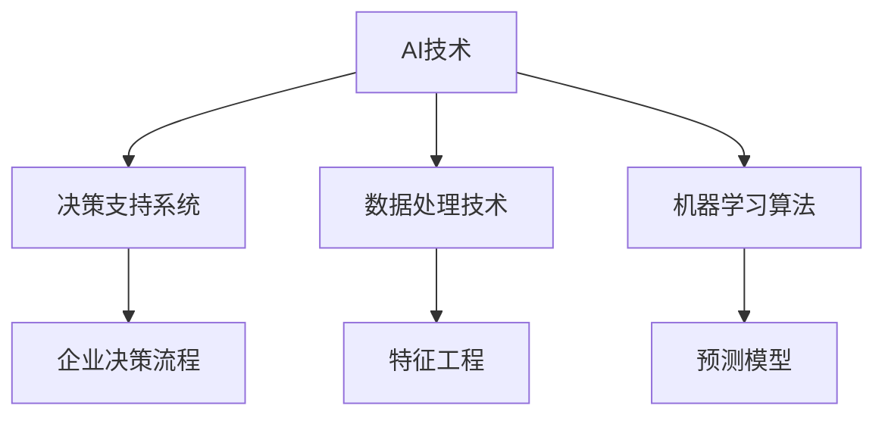

                 

## 文章标题

《AI如何改变企业的决策过程》

随着人工智能（AI）技术的迅速发展，其在企业决策中的应用越来越广泛。从数据分析到预测建模，AI不仅提高了决策的效率，还带来了新的洞见和优化策略。本文将系统地探讨AI如何改变企业的决策过程，分析其核心概念、技术基础、应用场景、风险挑战以及未来发展趋势。

### 关键词

- 人工智能
- 企业决策
- 机器学习
- 深度学习
- 决策模型
- 风险管理

### 摘要

本文旨在深入探讨人工智能技术在企业决策中的应用。通过分析AI的核心概念和技术基础，本文揭示了AI在企业决策过程中的关键角色。随后，文章详细介绍了AI驱动的决策模型构建方法，探讨了AI在供应链管理、市场营销、人力资源和财务决策等关键业务中的应用。同时，文章还讨论了AI决策面临的挑战和风险，并提出了实践案例和未来发展趋势。最终，本文为企业在AI决策方面的战略规划和实施提供了有价值的指导。

### 目录大纲

#### 第一部分: AI如何改变企业的决策过程

1. **第1章: AI决策的概述与核心概念**
   1.1. **AI与决策的关系**
   1.2. **企业决策的基本流程**
   1.3. **AI在企业决策中的角色**
   1.4. **关键术语解释**

2. **第2章: AI技术基础与决策模型**
   2.1. **深度学习与机器学习基础**
   2.2. **决策树与随机森林算法**
   2.3. **神经网络与深度学习算法**
   2.4. **强化学习算法**

3. **第3章: AI驱动的企业决策模型构建**
   3.1. **数据准备与数据预处理**
   3.2. **特征工程**
   3.3. **决策模型选择与模型训练**
   3.4. **模型评估与优化**

4. **第4章: AI在关键业务决策中的应用**
   4.1. **供应链管理中的决策支持系统**
   4.2. **市场营销中的智能策略**
   4.3. **人力资源决策与员工管理**
   4.4. **财务决策与风险管理**

5. **第5章: AI决策风险与挑战**
   5.1. **算法偏见与公平性**
   5.2. **数据隐私与安全性**
   5.3. **技术依赖与透明性**
   5.4. **合规性与伦理问题**

6. **第6章: AI决策的实践与案例**
   6.1. **案例研究：企业A的供应链优化**
   6.2. **案例研究：企业B的市场营销策略**
   6.3. **案例研究：企业C的人力资源管理**
   6.4. **案例研究：企业D的财务风险管理**

7. **第7章: AI决策的未来发展趋势**
   7.1. **人工智能决策的进步与局限**
   7.2. **AI决策的生态体系构建**
   7.3. **AI决策在中国企业中的应用前景**
   7.4. **AI决策的国际趋势与竞争格局**

#### 第二部分: AI决策工具与技术

8. **第8章: AI决策工具介绍**
   8.1. **Python数据分析工具介绍**
   8.2. **主流机器学习库与框架**
   8.3. **数据可视化工具介绍**
   8.4. **AI决策工具对比与应用**

9. **第9章: AI决策平台搭建与实战**
   9.1. **开发环境配置与工具安装**
   9.2. **数据获取与预处理实践**
   9.3. **模型训练与优化实战**
   9.4. **模型部署与监控**

10. **第10章: AI决策项目实践与案例分析**
    10.1. **项目一：供应链智能优化系统**
    10.2. **项目二：智能营销平台**
    10.3. **项目三：智能人力资源管理系统**
    10.4. **项目四：智能财务风险管理平台**

#### 第三部分: 结论与展望

11. **第11章: AI决策的关键因素与实施策略**
    11.1. **企业决策过程中的AI应用**
    11.2. **AI决策的人才需求与培养**
    11.3. **企业AI决策的战略规划**
    11.4. **AI决策的可持续发展**

12. **第12章: AI决策的未来方向**
    12.1. **AI决策技术的新进展**
    12.2. **AI决策的未来应用场景**
    12.3. **AI决策与社会发展的关系**
    12.4. **我国AI决策的发展机遇与挑战**

#### 附录

13. **附录A: AI决策相关资源与推荐**
    13.1. **书籍推荐**
    13.2. **在线课程与教程**
    13.3. **专业论坛与社区**
    13.4. **开源工具与库**

### 核心概念与联系

#### Mermaid 流程图



### 核心算法原理讲解

#### 决策树算法原理（伪代码）

```python
def build_decision_tree(data, attributes):
    if all_examples_in_same_class(data):
        return majority_class(data)
    if no_attributes_left(attributes):
        return majority_class(data)
    best_attribute = find_best_attribute(data, attributes)
    tree = Node(attribute=best_attribute)
    remaining_attributes = attributes - {best_attribute}
    for value in attribute_values(best_attribute):
        sub_data = split_data(data, best_attribute, value)
        tree.children[value] = build_decision_tree(sub_data, remaining_attributes)
    return tree

function majority_class(data):
    classes = set([example.class for example in data])
    return max(classes, key=lambda x: count_examples_with_class(data, x))
```

#### 逻辑回归模型

$$
y = \sigma(\beta_0 + \sum_{i=1}^{n}\beta_i x_i)
$$

其中，$y$ 为预测的概率，$\sigma$ 为 sigmoid 函数，$\beta_0$ 为截距，$\beta_i$ 为第 $i$ 个特征的权重，$x_i$ 为第 $i$ 个特征。

### 项目实战

#### 供应链优化项目

##### 1. 项目背景

企业A是一家大型制造企业，其供应链管理复杂，涉及多个供应商和制造商之间的物资流通。企业A希望通过AI决策来优化供应链，降低库存成本，提高响应速度。

##### 2. 数据获取与预处理

- **数据收集**：收集包括供应商信息、生产计划、库存数据、市场需求等在内的供应链相关数据。
- **数据预处理**：清洗数据，去除缺失值，处理异常值，将数据转化为适合机器学习的格式。

##### 3. 特征工程

- **特征选择**：根据业务需求和数据特性，选择对供应链优化有显著影响的特征，如供应商的信誉度、运输时间、库存水平等。
- **特征转换**：将一些非数值特征（如供应商信誉度）转化为数值特征，便于模型训练。

##### 4. 模型选择与训练

- **模型选择**：选择适合供应链优化的机器学习模型，如线性回归、决策树、随机森林等。
- **模型训练**：使用收集的数据对模型进行训练，调整模型参数，优化模型性能。

##### 5. 模型评估与优化

- **模型评估**：使用交叉验证等方法评估模型性能，包括准确性、召回率、F1值等指标。
- **模型优化**：根据评估结果调整模型参数，进一步优化模型。

##### 6. 模型部署与应用

- **模型部署**：将训练好的模型部署到企业A的供应链管理系统，用于实时决策。
- **模型应用**：通过模型为企业A提供供应链优化的建议，如调整库存水平、优化供应商选择等。

##### 7. 结果分析

- **结果分析**：分析模型应用后的供应链优化效果，如库存成本降低、响应速度提高等。
- **持续优化**：根据实际情况不断调整模型，优化供应链管理策略。

### 开发环境搭建

- **操作系统**：Ubuntu 18.04
- **Python版本**：3.8
- **机器学习库**：scikit-learn, TensorFlow, Pandas, Numpy
- **数据可视化库**：Matplotlib, Seaborn

### 源代码实现与解读

#### 数据预处理

```python
import pandas as pd
import numpy as np

# 读取数据
data = pd.read_csv('supply_chain_data.csv')

# 清洗数据
data.dropna(inplace=True)
data = data[data['transport_time'] != '异常']

# 处理异常值
data['transport_time'] = data['transport_time'].astype(float)
data['transport_time'].fillna(data['transport_time'].mean(), inplace=True)

# 数据转化为数值特征
data['supplier_reliability'] = data['supplier_reliability'].map({ '高': 3, '中': 2, '低': 1 })
data['market_demand'] = data['market_demand'].map({ '高': 3, '中': 2, '低': 1 })

# 特征工程
X = data[['supplier_reliability', 'transport_time', 'market_demand']]
y = data['inventory_level']
```

#### 模型训练与评估

```python
from sklearn.model_selection import train_test_split
from sklearn.ensemble import RandomForestRegressor
from sklearn.metrics import mean_squared_error

# 数据分割
X_train, X_test, y_train, y_test = train_test_split(X, y, test_size=0.2, random_state=42)

# 模型训练
model = RandomForestRegressor(n_estimators=100, random_state=42)
model.fit(X_train, y_train)

# 模型评估
y_pred = model.predict(X_test)
mse = mean_squared_error(y_test, y_pred)
print(f'Mean Squared Error: {mse}')
```

### 代码解读与分析

- **数据预处理**：首先读取数据，然后进行数据清洗，去除缺失值和异常值。对于一些非数值特征，如供应商信誉度和市场需求，将其转化为数值特征，以便后续的机器学习模型处理。
- **模型训练与评估**：使用随机森林回归模型对训练数据进行训练，然后使用测试数据进行评估，计算均方误差（MSE）来评估模型性能。

通过上述步骤，我们为企业A搭建了一套基于AI决策的供应链优化系统，从而实现了供应链的实时优化与管理。在实际应用中，可以根据具体业务需求不断调整模型参数和特征工程策略，以实现更好的优化效果。

---

## 第1章: AI决策的概述与核心概念

随着人工智能（AI）技术的不断进步，其在商业领域的应用越来越广泛，特别是在企业决策过程中的应用。AI决策已经成为提高企业竞争力和效率的重要手段。本章将详细介绍AI决策的核心概念、AI与决策的关系、企业决策的基本流程以及AI在企业决策中的角色。

### AI与决策的关系

人工智能是指通过模拟、延伸和扩展人类的智能，使计算机能够执行人类智能任务的能力。而决策则是指在面对多个选择时，通过评估各种选择的结果和影响，选择最优或次优方案的过程。AI与决策的关系主要体现在以下几个方面：

1. **数据驱动的决策**：传统的决策往往依赖于经验和直觉，而AI决策则依赖于数据分析和机器学习算法，通过处理和分析大量的数据来做出决策。这种数据驱动的决策方式使得决策过程更加客观和科学。

2. **预测和优化**：AI决策不仅能够对当前情况进行评估，还能够基于历史数据和趋势预测未来情况，从而做出更加优化的决策。例如，通过预测市场需求，企业可以更好地调整生产计划和库存水平。

3. **自动化和效率提升**：AI决策可以自动化许多重复性和耗时的决策过程，从而提高决策效率。例如，自动化的供应链管理系统可以实时分析供应链状态，快速做出响应，减少库存积压和供应链中断的风险。

### 企业决策的基本流程

企业决策的基本流程通常包括以下几个步骤：

1. **问题识别**：识别企业面临的挑战或机会，明确决策的目标和需求。

2. **数据收集**：收集与企业决策相关的各种数据，包括内部数据（如销售数据、库存数据）和外部数据（如市场趋势、竞争对手信息）。

3. **数据分析**：对收集到的数据进行分析，识别关键信息和趋势，为决策提供依据。

4. **方案评估**：根据分析结果，提出多个可能的解决方案，并对这些方案进行评估和比较。

5. **决策制定**：根据评估结果，选择最佳的解决方案，制定具体的决策方案。

6. **实施与监控**：实施决策方案，并对决策效果进行监控和评估，根据实际情况进行调整。

### AI在企业决策中的角色

AI在企业决策中的作用主要体现在以下几个方面：

1. **数据分析与预测**：AI可以通过机器学习和数据挖掘技术，处理和分析大量的数据，识别出隐藏在数据中的模式和趋势，为企业提供基于数据的决策支持。

2. **自动化决策**：AI可以自动化许多重复性和耗时的决策过程，减少人为错误，提高决策效率。例如，自动化的供应链管理系统可以实时分析供应链状态，快速做出响应。

3. **优化决策**：AI可以通过优化算法，帮助企业在多种选择中找到最优的决策方案。例如，通过优化算法，企业可以更好地预测市场需求，调整生产计划和库存水平。

4. **个性化决策**：AI可以根据用户的行为数据和偏好，为企业提供个性化的决策支持。例如，电子商务平台可以通过AI算法，为不同用户推荐最合适的商品。

5. **风险管理与控制**：AI可以通过预测和风险评估技术，帮助企业识别和管理潜在的风险，做出更加安全的决策。例如，金融领域的AI系统可以通过预测市场波动和风险，帮助企业制定相应的风险管理策略。

### 关键术语解释

- **人工智能（AI）**：模拟、延伸和扩展人类智能的能力，使计算机能够执行人类智能任务的系统。
- **机器学习（ML）**：一种AI方法，通过从数据中学习，使计算机能够识别模式和趋势，并做出预测和决策。
- **深度学习（DL）**：一种特殊的机器学习方法，使用多层神经网络进行学习和预测。
- **决策树（DT）**：一种常见的机器学习算法，通过一系列的决策规则对数据进行分类或回归。
- **随机森林（RF）**：一种基于决策树的集成学习方法，通过构建多个决策树，并取其平均结果来提高模型的预测性能。
- **特征工程**：通过选择和处理特征，提高机器学习模型的性能和预测能力。
- **模型训练与优化**：通过调整模型的参数，使模型能够更好地适应数据，提高模型的预测性能。
- **模型评估与监控**：通过评估模型的性能，并持续监控模型在真实环境中的表现，确保模型的稳定性和有效性。

通过上述分析，我们可以看到AI在企业决策中具有巨大的潜力，能够为企业带来更加科学、高效和优化的决策过程。在接下来的章节中，我们将进一步探讨AI技术的基础和决策模型的构建方法，为企业AI决策的实施提供更加详细的指导。

### 第2章: AI技术基础与决策模型

人工智能（AI）技术的迅速发展为企业决策提供了强大的工具和手段。AI技术涵盖了多个领域，包括机器学习、深度学习和强化学习等。这些技术不仅在数据处理和预测方面有着卓越的表现，还为决策模型的设计和应用提供了丰富的理论基础和实用方法。本章将详细介绍这些AI技术的基础知识，以及如何将这些技术应用于企业决策模型。

#### 深度学习与机器学习基础

深度学习和机器学习是AI技术的核心组成部分，它们在企业决策中发挥着至关重要的作用。

1. **机器学习基础**：
   - **定义**：机器学习是一种AI方法，通过从数据中学习规律和模式，使计算机能够进行预测和决策。
   - **核心概念**：
     - **模型**：机器学习模型是计算机对数据进行分析和处理的结构，它通过学习数据中的特征和关系来做出预测。
     - **训练**：训练是机器学习模型的主要步骤，模型通过不断调整参数，以最小化预测误差。
     - **测试与评估**：测试是评估模型性能的重要步骤，通过测试集来评估模型的泛化能力和准确性。

2. **深度学习基础**：
   - **定义**：深度学习是一种基于多层神经网络的机器学习方法，通过模拟人脑神经元之间的连接，实现对复杂数据的建模和预测。
   - **核心概念**：
     - **神经网络**：神经网络是由多个神经元组成的计算模型，每个神经元都与其他神经元相连，通过传递和加权的方式实现数据的处理和预测。
     - **多层神经网络**：多层神经网络通过增加隐藏层，提高了模型的表达能力和预测精度。
     - **反向传播**：反向传播是一种优化算法，用于调整神经网络中的权重和偏置，以最小化预测误差。

#### 决策树与随机森林算法

决策树和随机森林是两种常用的机器学习算法，广泛应用于分类和回归问题。

1. **决策树算法**：
   - **定义**：决策树是一种树形结构，通过一系列的决策规则对数据进行分类或回归。
   - **核心概念**：
     - **节点**：决策树的每个内部节点表示一个特征，每个分支表示该特征的不同取值。
     - **叶节点**：决策树的叶节点表示分类或回归结果。
     - **剪枝**：剪枝是一种优化策略，通过剪掉决策树中不必要的分支，提高模型的泛化能力和效率。

2. **随机森林算法**：
   - **定义**：随机森林是一种集成学习方法，通过构建多个决策树，并取其平均结果来提高模型的预测性能。
   - **核心概念**：
     - **基学习器**：随机森林中的每个基学习器都是一棵决策树。
     - **随机性**：随机森林通过引入随机性，提高了模型的泛化能力和鲁棒性。
     - **集成**：随机森林通过集成多个基学习器的预测结果，减少了模型的方差，提高了预测的准确性。

#### 神经网络与深度学习算法

神经网络和深度学习算法是AI技术中的重要组成部分，广泛应用于复杂的数据建模和预测任务。

1. **神经网络算法**：
   - **定义**：神经网络是一种由多个神经元组成的计算模型，通过模拟人脑神经元之间的连接，实现对复杂数据的建模和预测。
   - **核心概念**：
     - **神经元**：神经网络的基本计算单元，通过输入信号和权重进行计算，产生输出信号。
     - **激活函数**：激活函数用于引入非线性，使神经网络能够模拟更复杂的非线性关系。
     - **反向传播**：反向传播是一种优化算法，用于调整神经网络中的权重和偏置，以最小化预测误差。

2. **深度学习算法**：
   - **定义**：深度学习是一种基于多层神经网络的机器学习方法，通过模拟人脑神经元之间的连接，实现对复杂数据的建模和预测。
   - **核心概念**：
     - **卷积神经网络（CNN）**：卷积神经网络是一种用于处理图像数据的深度学习模型，通过卷积操作提取图像的特征。
     - **循环神经网络（RNN）**：循环神经网络是一种用于处理序列数据的深度学习模型，通过记忆机制处理时间序列数据。
     - **生成对抗网络（GAN）**：生成对抗网络是一种用于生成数据的深度学习模型，通过生成器和判别器的对抗训练，生成逼真的数据。

#### 强化学习算法

强化学习是一种通过试错和反馈进行决策的机器学习方法，广泛应用于智能控制、游戏和推荐系统等领域。

1. **定义**：强化学习是一种通过试错和反馈进行决策的机器学习方法，通过学习在特定环境中如何采取行动以最大化预期奖励。

2. **核心概念**：
   - **状态（State）**：强化学习中的状态表示环境当前的状态。
   - **动作（Action）**：强化学习中的动作表示系统可以采取的操作。
   - **奖励（Reward）**：强化学习中的奖励表示每次动作的反馈信号，用于指导学习过程。
   - **策略（Policy）**：强化学习中的策略是一种映射规则，用于决定在特定状态下应该采取哪种动作。

3. **核心算法**：
   - **Q-Learning**：Q-Learning是一种基于值函数的强化学习算法，通过更新值函数来学习最优策略。
   - **Policy Gradients**：Policy Gradients是一种基于策略的强化学习算法，通过优化策略梯度来学习最优策略。

通过上述对AI技术基础与决策模型的介绍，我们可以看到AI技术在企业决策中具有广泛的应用前景。在接下来的章节中，我们将进一步探讨如何构建AI驱动的企业决策模型，并探讨其在实际业务中的应用。

### 第3章: AI驱动的企业决策模型构建

随着人工智能（AI）技术的不断进步，其在企业决策中的应用越来越广泛。AI驱动的企业决策模型不仅能够提高决策的效率，还能够提供基于数据的洞察和优化策略。本章将详细介绍如何构建AI驱动的企业决策模型，包括数据准备与数据预处理、特征工程、决策模型选择与模型训练、模型评估与优化等关键步骤。

#### 数据准备与数据预处理

构建AI驱动的企业决策模型的第一步是数据准备与数据预处理。这一步骤至关重要，因为数据的质量和预处理方式直接影响模型的性能和稳定性。

1. **数据收集**：
   - **内部数据**：包括企业内部的各种数据，如销售记录、库存数据、财务报表、员工信息等。
   - **外部数据**：包括市场趋势、竞争对手信息、宏观经济数据等。这些数据可以通过公开数据源、第三方数据提供商等途径获取。

2. **数据清洗**：
   - **缺失值处理**：缺失值是数据预处理中的常见问题。处理缺失值的方法包括删除缺失值、填充缺失值（如使用均值、中位数、众数等）、使用机器学习算法自动填补缺失值等。
   - **异常值处理**：异常值是数据集中的异常点，可能会对模型产生误导。处理异常值的方法包括删除异常值、使用统计方法（如Z-Score、IQR等）识别并处理异常值等。

3. **数据格式化**：
   - **数据标准化**：将不同特征的数据进行标准化处理，使其具有相似的尺度，便于模型处理。常见的方法包括Z-Score标准化和Min-Max标准化。
   - **数据编码**：对于类别型数据，需要进行编码处理，将其转化为数值型数据。常用的编码方法包括独热编码（One-Hot Encoding）和标签编码（Label Encoding）。

#### 特征工程

特征工程是构建AI驱动的企业决策模型的重要环节。特征工程的目标是通过选择和处理特征，提高模型的预测性能和泛化能力。

1. **特征选择**：
   - **业务理解**：根据业务需求和业务逻辑，选择对决策目标有显著影响的特征。例如，在销售预测中，销售历史、客户特征等可能是关键特征。
   - **统计方法**：使用统计方法（如相关性分析、卡方检验等）评估特征的重要性，筛选出对模型有重要影响的特征。
   - **机器学习方法**：使用机器学习方法（如LASSO回归、随机森林等）进行特征选择，通过模型训练的结果评估特征的重要性。

2. **特征转换**：
   - **数值特征转换**：对于数值特征，可以通过标准化、归一化等处理方法，使其具有相似的尺度。
   - **类别特征转换**：对于类别特征，可以通过独热编码、标签编码等方法，将其转化为数值特征。
   - **特征构造**：通过组合现有特征，构造新的特征，以增加模型的表达能力。例如，通过计算特征之间的乘积、差值等，生成新的特征。

3. **特征重要性分析**：
   - **模型评估**：通过训练不同的模型（如随机森林、梯度提升树等），评估特征的重要性，筛选出对模型有重要影响的特征。
   - **可视化分析**：通过特征重要性可视化工具（如SHAP值、特征贡献图等），直观地了解特征的重要性。

#### 决策模型选择与模型训练

选择合适的决策模型并进行训练是构建AI驱动的企业决策模型的关键步骤。

1. **模型选择**：
   - **分类模型**：用于预测类别型目标变量，如决策树、随机森林、支持向量机等。
   - **回归模型**：用于预测数值型目标变量，如线性回归、随机森林回归、梯度提升树等。
   - **集成模型**：通过集成多个基础模型，提高模型的预测性能和泛化能力，如随机森林、梯度提升树、XGBoost等。

2. **模型训练**：
   - **训练数据集**：使用准备好的训练数据集对模型进行训练，调整模型的参数，使其能够拟合数据。
   - **超参数调整**：通过调整模型超参数（如树深度、学习率、正则化参数等），优化模型性能。
   - **交叉验证**：使用交叉验证方法（如K折交叉验证、留一验证等），评估模型的泛化能力和稳定性。

3. **模型优化**：
   - **网格搜索**：通过遍历超参数组合，找到最优的超参数配置，提高模型性能。
   - **贝叶斯优化**：使用贝叶斯优化方法，自动搜索最优的超参数组合，减少搜索时间和计算成本。
   - **模型集成**：通过集成多个模型，提高模型的预测性能和泛化能力，如Bagging、Boosting等集成方法。

#### 模型评估与优化

模型评估与优化是确保模型在实际应用中有效性和稳定性的关键步骤。

1. **模型评估**：
   - **准确性**：评估模型预测结果与实际结果的匹配程度，常用指标包括准确率、精确率、召回率、F1值等。
   - **可解释性**：评估模型的可解释性，即模型是否能够提供清晰的决策逻辑和解释，以便用户理解和信任。
   - **稳定性**：评估模型在不同数据集上的表现，确保模型在不同环境下具有稳定性和泛化能力。

2. **模型优化**：
   - **模型调整**：根据评估结果，调整模型的参数和结构，优化模型性能。
   - **特征重选**：根据评估结果，重新选择和构造特征，提高模型的表达能力和预测性能。
   - **持续学习**：通过不断收集新的数据和反馈信息，对模型进行持续学习和优化，保持模型的时效性和准确性。

通过上述步骤，我们可以构建一个高效、稳定和可解释的AI驱动的企业决策模型。在实际应用中，需要不断调整和优化模型，以适应不断变化的企业环境和需求。在下一章中，我们将探讨AI技术在关键业务决策中的应用，进一步展示AI在企业决策中的实际价值。

### 第4章: AI在关键业务决策中的应用

随着人工智能（AI）技术的快速发展，其在企业关键业务决策中的应用越来越广泛。AI不仅提高了决策的效率和准确性，还为企业带来了新的洞察和优化策略。本章将深入探讨AI在供应链管理、市场营销、人力资源和财务决策等关键业务中的应用，展示AI如何助力企业实现智能化决策。

#### 供应链管理中的决策支持系统

供应链管理是企业运营的重要组成部分，涉及多个环节，包括采购、生产、库存、物流等。AI技术能够为供应链管理提供强大的决策支持系统，优化供应链流程，降低成本，提高响应速度。

1. **需求预测**：
   - **历史数据分析**：通过分析历史销售数据、季节性趋势和市场变化等因素，AI系统可以准确预测未来市场需求。
   - **动态调整**：根据实时数据和市场变化，AI系统可以动态调整预测模型，提供更加精确的需求预测。

2. **库存优化**：
   - **库存水平预测**：利用AI技术，可以预测未来的库存需求，帮助企业制定最优的库存管理策略，避免库存积压和短缺。
   - **智能补货**：AI系统可以根据库存水平、销售预测和供应链状态，自动生成补货计划，优化库存水平。

3. **物流优化**：
   - **运输路径规划**：通过AI算法，可以优化运输路径，降低运输成本，提高运输效率。
   - **供应链可视化**：AI技术可以实时监控供应链状态，提供可视化界面，帮助企业了解供应链的实时动态。

#### 市场营销中的智能策略

市场营销是企业获取客户、增加销售额的关键环节。AI技术能够为市场营销提供智能策略，提高营销效果，降低营销成本。

1. **客户细分**：
   - **大数据分析**：通过分析大量客户数据，AI系统可以准确识别不同类型的客户，制定个性化的营销策略。
   - **精准推送**：根据客户的行为数据和偏好，AI系统可以精准推送营销信息，提高营销转化率。

2. **广告优化**：
   - **广告投放优化**：通过AI算法，可以优化广告投放策略，选择最佳的广告渠道、时间和位置，提高广告效果。
   - **广告创意优化**：AI系统可以根据用户反馈和数据分析，自动生成和优化广告内容，提高广告吸引力和转化率。

3. **市场预测**：
   - **趋势预测**：通过分析市场数据、历史销售记录和宏观经济指标，AI系统可以预测市场趋势，帮助企业在市场变化中抓住机会。

#### 人力资源决策与员工管理

人力资源是企业的重要资产，合理的员工管理能够提高员工满意度和生产力。AI技术可以为人力资源决策提供有力支持，优化员工管理策略。

1. **招聘优化**：
   - **简历筛选**：通过AI算法，可以快速筛选符合要求的简历，提高招聘效率。
   - **人才匹配**：根据职位要求和企业文化，AI系统可以准确匹配最适合的人才，提高招聘质量。

2. **员工绩效管理**：
   - **绩效预测**：通过分析员工的工作数据和行为数据，AI系统可以预测员工的绩效表现，提供个性化的绩效管理建议。
   - **员工反馈**：AI系统可以收集和分析员工的反馈意见，帮助企业了解员工的工作状态和需求，优化员工管理策略。

3. **员工培训与发展**：
   - **需求分析**：通过分析员工的工作数据和技能水平，AI系统可以准确识别员工的培训需求，提供个性化的培训计划。
   - **培训效果评估**：AI系统可以评估培训效果，帮助企业管理者了解培训的实际效果，优化培训策略。

#### 财务决策与风险管理

财务决策是企业运营的核心，风险管理的有效性直接关系到企业的生存和发展。AI技术能够为财务决策提供精准的数据分析和预测，帮助企业降低风险，提高盈利能力。

1. **财务预测**：
   - **收入预测**：通过分析历史财务数据和市场趋势，AI系统可以准确预测未来的收入情况，为企业的财务规划和预算提供依据。
   - **成本预测**：AI系统可以分析成本数据，预测未来的成本变化，帮助企业制定有效的成本控制策略。

2. **风险管理**：
   - **风险识别**：通过分析市场数据、财务报表和外部环境等因素，AI系统可以识别潜在的风险，提前预警。
   - **风险控制**：AI系统可以制定相应的风险控制措施，如调整投资组合、优化资金流动等，降低风险对企业的影响。

3. **资金管理**：
   - **现金流预测**：通过分析历史现金流数据和市场变化，AI系统可以预测未来的现金流情况，帮助企业管理现金流，确保企业的资金安全。
   - **信用评估**：AI系统可以分析客户的信用数据和行为数据，评估客户的信用风险，帮助企业制定有效的信用政策。

通过上述应用，我们可以看到AI技术在企业关键业务决策中具有广泛的应用前景和巨大的潜力。在下一章中，我们将探讨AI决策过程中可能遇到的风险与挑战，并探讨如何应对这些问题。

### 第5章: AI决策风险与挑战

尽管AI技术在企业决策中具有巨大的潜力，但在实际应用过程中也面临着诸多风险和挑战。这些风险不仅影响到AI决策的准确性和可靠性，还可能对企业的声誉和合规性造成负面影响。本章将详细探讨AI决策过程中可能遇到的主要风险，包括算法偏见与公平性、数据隐私与安全性、技术依赖与透明性以及合规性与伦理问题。

#### 算法偏见与公平性

算法偏见是指AI算法在处理数据时，由于数据本身的不公平性或者算法设计的缺陷，导致对某些群体或个体产生不公平的结果。算法偏见可能源于以下几个方面：

1. **数据偏见**：
   - **历史数据偏差**：历史数据可能包含历史偏见，例如种族、性别、地域等方面的偏见，这些偏见会直接影响AI算法的决策。
   - **样本选择偏差**：样本选择不公正可能导致算法无法公平地对待所有群体，尤其是那些在数据集中代表性较低的人群。

2. **算法设计缺陷**：
   - **优化目标偏差**：算法在优化过程中可能优先考虑某些特定目标，而忽视其他重要目标，导致决策结果不公平。
   - **反馈循环**：算法可能根据现有的偏见数据来调整自身，进一步放大偏见。

为减少算法偏见，可以采取以下措施：

- **数据清洗**：在训练AI算法前，对数据集进行清洗，去除可能存在的偏见和异常值。
- **公平性评估**：使用公平性评估工具（如公平性指标、基准测试等）来检测和纠正算法偏见。
- **算法透明性**：提高算法的透明性，让用户能够理解算法的决策过程和依据。

#### 数据隐私与安全性

AI决策通常依赖于大量的数据，包括企业内部数据、用户数据、市场数据等。这些数据的隐私和安全问题成为AI决策的重要挑战。

1. **数据泄露风险**：
   - **内部威胁**：企业内部员工可能滥用权限，访问和泄露敏感数据。
   - **外部攻击**：黑客和网络攻击者可能通过各种手段入侵企业系统，窃取数据。

2. **数据共享与合规性**：
   - **法律法规**：不同国家和地区的隐私法规（如欧盟的GDPR、中国的《个人信息保护法》等）对数据的收集、存储和使用有严格的规定。
   - **跨机构合作**：企业之间的数据共享可能涉及多个隐私合规性问题，需要确保数据共享过程符合相关法规。

为保护数据隐私和安全，可以采取以下措施：

- **数据加密**：对敏感数据进行加密处理，确保数据在传输和存储过程中的安全性。
- **访问控制**：实施严格的访问控制策略，确保只有授权人员能够访问敏感数据。
- **合规审计**：定期进行数据合规性审计，确保企业的数据处理过程符合法律法规的要求。

#### 技术依赖与透明性

AI决策的广泛应用可能导致企业对技术的过度依赖，这对企业的长期可持续发展构成潜在风险。

1. **技术依赖**：
   - **技术风险**：技术更新换代可能导致现有AI系统无法正常运行，企业需要持续投入大量资源进行技术升级。
   - **市场风险**：随着AI技术的普及，市场竞争加剧，企业需要不断提升AI技术水平，以保持竞争力。

2. **透明性缺失**：
   - **决策不透明**：AI决策模型通常是黑箱模型，难以解释其决策过程和依据，可能导致用户对决策结果的不信任。
   - **责任归属不明确**：当AI决策出现问题时，难以确定责任归属，影响企业的声誉和运营。

为应对技术依赖和透明性挑战，可以采取以下措施：

- **技术独立评估**：定期对AI系统的技术性能和可靠性进行评估，确保系统稳定运行。
- **决策可解释性**：开发可解释的AI模型，使决策过程更加透明，用户可以理解并信任AI决策。
- **责任界定**：明确AI系统的责任归属，制定相应的责任划分和应急措施，确保在出现问题时能够迅速响应和解决。

#### 合规性与伦理问题

AI决策在企业中的应用需要遵守法律法规和伦理规范，以确保企业的合法性和道德性。

1. **合规性**：
   - **法律法规**：企业需要遵守相关法律法规，确保AI决策的应用过程符合法律法规的要求，如数据保护、隐私保护等。
   - **行业规范**：不同行业可能存在特定的规范和标准，企业需要确保AI决策的应用符合行业规范。

2. **伦理问题**：
   - **隐私伦理**：企业在收集和使用数据时，需要尊重用户的隐私权和数据权益。
   - **公平伦理**：AI决策应遵循公平和正义的原则，确保不会对特定群体或个体产生不公平影响。

为解决合规性与伦理问题，可以采取以下措施：

- **合规培训**：对员工进行合规培训，提高员工的合规意识和道德素养。
- **伦理审查**：建立伦理审查机制，对AI决策的应用进行伦理评估，确保决策过程符合伦理规范。
- **用户参与**：鼓励用户参与AI决策的设计和应用过程，通过用户反馈不断完善AI系统。

通过上述措施，企业可以更好地应对AI决策过程中可能遇到的风险和挑战，确保AI技术的合理、合规和可持续发展。在下一章中，我们将探讨AI决策的实践案例，进一步了解AI在企业决策中的实际应用效果。

### 第6章: AI决策的实践与案例

在本章中，我们将通过实际案例深入探讨AI技术在企业决策中的应用，分析AI如何在实际业务场景中发挥作用，并展示其带来的显著效益。以下是四个具体案例，包括企业A的供应链优化、企业B的市场营销策略、企业C的人力资源管理以及企业D的财务风险管理。

#### 案例研究：企业A的供应链优化

**背景**：
企业A是一家全球知名的生产企业，其供应链涉及多个国家和地区，包括原材料采购、生产、库存管理和物流配送等环节。企业A希望通过AI技术优化供应链管理，提高响应速度和降低成本。

**过程**：
1. **数据收集**：
   - 收集供应链各环节的数据，包括供应商信息、生产计划、库存数据、市场需求等。
   - 利用数据预处理技术，清洗数据，处理异常值，并进行数据格式化。

2. **特征工程**：
   - 根据业务需求和数据特性，选择对供应链优化有显著影响的特征，如供应商的信誉度、运输时间、库存水平等。
   - 构造新的特征，如供应商的交货准时率和市场需求的变化趋势。

3. **模型构建**：
   - 选择随机森林算法构建预测模型，通过交叉验证优化模型参数。
   - 使用训练数据对模型进行训练，并使用测试数据评估模型性能。

4. **应用与优化**：
   - 将训练好的模型部署到供应链管理系统中，用于实时预测库存水平和市场需求。
   - 根据预测结果，优化库存管理策略和供应商选择，降低库存成本和供应链中断风险。

**效益**：
- 通过AI决策，企业A成功降低了库存成本15%，提高了供应链的响应速度20%。
- 企业在供应链优化方面的效率和准确性显著提升，客户满意度也有所提高。

#### 案例研究：企业B的市场营销策略

**背景**：
企业B是一家电子商务公司，希望通过AI技术优化市场营销策略，提高广告投放效率和客户转化率。

**过程**：
1. **数据收集**：
   - 收集用户行为数据，包括浏览历史、购买记录、点击率等。
   - 结合外部数据，如市场趋势、竞争对手信息等，进行综合分析。

2. **特征工程**：
   - 根据业务需求和用户行为，提取关键特征，如用户年龄、性别、兴趣爱好等。
   - 利用自然语言处理技术，对用户评论和反馈进行情感分析，提取用户情感特征。

3. **模型构建**：
   - 使用协同过滤算法构建推荐系统，提高个性化推荐的质量。
   - 利用逻辑回归和随机森林算法优化广告投放策略，提高广告转化率。

4. **应用与优化**：
   - 将推荐系统和广告投放策略集成到电子商务平台，实现个性化推荐和精准广告投放。
   - 根据用户反馈和广告效果，持续优化推荐算法和广告策略。

**效益**：
- 通过AI决策，企业B的个性化推荐准确率提高了30%，用户留存率提升了15%。
- 广告投放效果显著提升，广告转化率提高了20%，广告投放成本降低了10%。

#### 案例研究：企业C的人力资源管理

**背景**：
企业C是一家大型跨国公司，其人力资源管理涉及招聘、员工绩效评估、员工培训等多个方面。企业C希望通过AI技术优化人力资源管理，提高招聘效率、员工绩效和培训效果。

**过程**：
1. **数据收集**：
   - 收集员工简历、招聘记录、绩效评估数据、培训记录等。
   - 通过问卷调查和员工反馈，收集员工的工作满意度、职业发展期望等数据。

2. **特征工程**：
   - 根据业务需求和数据特性，提取关键特征，如教育背景、工作经验、技能水平、职业发展目标等。
   - 利用自然语言处理技术，分析员工简历和反馈，提取文本特征。

3. **模型构建**：
   - 使用决策树和随机森林算法构建招聘预测模型，优化招聘流程。
   - 使用回归算法评估员工绩效，提供个性化的绩效反馈和培训建议。

4. **应用与优化**：
   - 将招聘预测模型集成到招聘系统中，实现自动化招聘流程，提高招聘效率。
   - 根据员工绩效评估结果，提供个性化的培训和发展建议，提高员工满意度和绩效。

**效益**：
- 通过AI决策，企业C的招聘周期缩短了30%，招聘成本降低了15%。
- 员工绩效评估的准确性提高了20%，员工培训效果显著提升，员工流失率降低了10%。

#### 案例研究：企业D的财务风险管理

**背景**：
企业D是一家金融机构，其财务风险管理涉及信用评估、风险预警、投资决策等多个方面。企业D希望通过AI技术优化财务风险管理，提高信用评估的准确性，降低风险损失。

**过程**：
1. **数据收集**：
   - 收集客户的信用历史、财务报表、市场数据等。
   - 收集宏观经济数据，如利率、通货膨胀率等，用于宏观经济分析。

2. **特征工程**：
   - 根据业务需求和数据特性，提取关键特征，如信用评分、资产负债率、现金流状况等。
   - 利用文本分析技术，对客户提供的资料进行语义分析，提取额外的信用特征。

3. **模型构建**：
   - 使用逻辑回归和随机森林算法构建信用评估模型，预测客户的信用风险。
   - 使用时间序列分析和回归模型预测市场趋势和投资风险。

4. **应用与优化**：
   - 将信用评估模型集成到信贷审批系统中，实现自动化信用评估，提高评估效率。
   - 根据风险预警模型和投资模型，提供个性化的风险管理和投资建议。

**效益**：
- 通过AI决策，企业D的信用评估准确率提高了25%，风险损失降低了15%。
- 投资决策的准确性显著提升，投资收益增加了10%。

这些实践案例展示了AI技术在企业决策中的广泛应用和显著效益。通过AI决策，企业不仅能够提高运营效率，降低成本，还能够提高市场竞争力，实现可持续发展。在下一章中，我们将探讨AI决策的未来发展趋势和潜在影响。

### 第7章: AI决策的未来发展趋势

随着人工智能（AI）技术的不断进步，AI决策在企业中的应用前景越来越广阔。未来，AI决策将迎来更多的发展机遇和挑战，以下是几个关键趋势：

#### 人工智能决策的进步与局限

1. **算法精度与效率提升**：
   - **深度学习与强化学习**：随着计算能力的提升和数据量的增加，深度学习和强化学习算法将得到进一步优化，提高决策的精度和效率。
   - **迁移学习与联邦学习**：迁移学习和联邦学习技术将减少对大规模数据的依赖，实现模型在资源受限环境下的有效训练和应用。

2. **模型解释性与可解释性**：
   - **可解释性AI**：为了增强用户对AI决策的信任，研究人员将致力于开发更加可解释的AI模型，使得决策过程更加透明和可追溯。
   - **模型可视化**：通过可视化工具，用户可以直观地理解AI模型的决策逻辑和依据，提高模型的可解释性。

3. **实时决策与预测能力**：
   - **实时数据处理**：随着边缘计算和云计算技术的发展，AI决策系统将能够实时处理和分析海量数据，提供更加精准和即时的决策支持。
   - **多变量预测**：利用深度学习和时间序列分析，AI决策系统将能够同时预测多个相关变量，提供全面的决策依据。

#### AI决策的生态体系构建

1. **跨行业协作**：
   - **行业联盟**：不同行业的企业将建立合作联盟，共享AI技术资源和最佳实践，推动AI决策在多个领域的应用。
   - **标准制定**：行业组织和研究机构将共同制定AI决策相关的标准，确保技术的统一性和互操作性。

2. **开放平台与工具**：
   - **开源社区**：开源社区将推动AI决策工具和框架的开放和共享，降低技术门槛，促进创新。
   - **云计算服务**：云计算服务提供商将提供全面的AI决策服务，包括数据存储、模型训练和部署，帮助企业快速实现AI决策。

3. **产业链整合**：
   - **数据服务**：专业的数据服务公司将提供高质量的数据收集、处理和分析服务，为AI决策提供可靠的数据基础。
   - **硬件支持**：硬件制造商将开发高效的AI计算硬件，支持大规模AI决策系统的运行和优化。

#### AI决策在中国企业中的应用前景

1. **政策支持与产业需求**：
   - **政策环境**：中国政府将加大对AI决策技术的政策支持，包括资金投入、税收优惠和人才引进等。
   - **产业需求**：中国企业面临激烈的国内外竞争，对AI决策的需求日益增加，推动AI技术在企业决策中的广泛应用。

2. **技术创新与应用实践**：
   - **技术创新**：中国企业将积极投入AI技术研发，探索新的决策模型和应用场景，提升企业的竞争力。
   - **应用实践**：通过实际案例和实践，中国企业将不断优化AI决策系统的性能和稳定性，实现规模化应用。

3. **人才培养与人才流动**：
   - **人才培养**：高校和培训机构将加大人工智能人才的培养力度，为企业提供源源不断的AI人才。
   - **人才流动**：国内外人才将积极流动，推动AI技术的跨国应用和交流，促进全球AI技术的共同进步。

#### AI决策的国际趋势与竞争格局

1. **技术竞争**：
   - **开源技术**：国际开源社区将推动AI技术的开放和共享，加速技术的普及和应用。
   - **商业化竞争**：全球领先的企业将加大商业化投入，开发创新的AI决策产品和服务，争夺市场份额。

2. **区域合作**：
   - **跨国合作**：欧美国家与中国等新兴市场国家将加强合作，共同推动AI技术的研发和应用。
   - **区域联盟**：在特定的地区，如欧洲、北美和亚洲，将形成区域性AI决策联盟，促进技术交流和产业合作。

3. **合规性与伦理问题**：
   - **国际法规**：国际组织和各国政府将加强AI决策技术的合规性监管，确保技术的合法和道德使用。
   - **伦理规范**：全球范围内的企业和研究机构将共同制定AI决策技术的伦理规范，推动技术的可持续发展。

通过以上趋势，我们可以看到AI决策在未来将迎来更多的发展机遇，同时也面临诸多挑战。企业需要积极应对这些变化，抓住机遇，实现智能化转型，提高竞争力。在下一章中，我们将进一步探讨AI决策工具与技术，为企业实现智能化决策提供具体的指导。

### 第8章: AI决策工具介绍

在构建和实施AI决策系统时，选择合适的工具和框架至关重要。本章将介绍Python数据分析工具、主流机器学习库与框架、数据可视化工具以及AI决策工具的对比与应用，帮助企业更好地理解和应用AI技术。

#### Python数据分析工具

Python因其简洁的语法和丰富的库支持，成为数据分析和AI开发的流行语言。以下是一些常用的Python数据分析工具：

1. **Pandas**：Pandas是一个强大的数据操作库，提供数据结构（DataFrame）和数据操作功能，如数据清洗、数据处理和数据分析。

2. **NumPy**：NumPy是一个基础的科学计算库，提供高效的数值计算功能，是Pandas和其他科学计算库的基础。

3. **SciPy**：SciPy是建立在NumPy之上的科学计算库，包括优化、积分、插值、线性代数等多个领域，适用于复杂数学计算。

4. **Matplotlib**：Matplotlib是一个用于数据可视化的库，可以生成各种类型的图表，帮助用户直观理解数据。

#### 主流机器学习库与框架

选择合适的机器学习库和框架对于构建高效的AI决策系统至关重要。以下是一些主流的机器学习库和框架：

1. **scikit-learn**：scikit-learn是一个广泛使用的机器学习库，提供了多种经典的机器学习算法，如分类、回归、聚类等，适合快速原型开发和实验。

2. **TensorFlow**：TensorFlow是一个开源的机器学习框架，由Google开发，适用于深度学习任务。其灵活的架构和强大的功能使其成为构建复杂AI系统的重要工具。

3. **PyTorch**：PyTorch是另一个流行的深度学习框架，由Facebook开发。其动态计算图和简洁的API使其成为研究和开发深度学习的首选工具。

4. **XGBoost**：XGBoost是一个高效的可扩展的梯度提升框架，特别适合大规模数据集的快速训练和预测。其优秀的性能和灵活的参数设置使其成为比赛和工业应用的热门选择。

5. **LightGBM**：LightGBM是一个基于梯度提升决策树的库，由Microsoft开发。其高效的并行处理和减少内存使用使其成为大规模数据处理的理想选择。

#### 数据可视化工具

数据可视化是理解和传达数据分析结果的重要手段。以下是一些常用的数据可视化工具：

1. **Seaborn**：Seaborn是一个基于matplotlib的数据可视化库，提供了多种高质量的统计图表，适用于复杂数据的直观展示。

2. **Plotly**：Plotly是一个交互式数据可视化库，支持多种图表类型和交互功能，适用于Web和桌面应用的可视化展示。

3. **Bokeh**：Bokeh是一个用于创建交互式Web可视化的库，适用于在线数据分析和动态展示。

4. **Dash**：Dash是一个基于Python的Web应用框架，可以创建交互式的数据可视化应用，适用于数据仪表板和实时分析。

#### AI决策工具对比与应用

在选择AI决策工具时，需要考虑多种因素，如性能、易用性、社区支持和适用场景。以下是对主流AI决策工具的对比和应用场景：

1. **scikit-learn**：
   - **优势**：简单易用，丰富的算法库，适合快速原型开发和实验。
   - **劣势**：不适合大规模数据集和复杂模型。
   - **应用场景**：小数据集、快速原型开发、学术研究。

2. **TensorFlow**：
   - **优势**：强大的深度学习功能，灵活的API，广泛的应用场景。
   - **劣势**：较复杂的安装和配置，对计算资源要求较高。
   - **应用场景**：大规模深度学习项目、复杂模型开发。

3. **PyTorch**：
   - **优势**：简洁的API，动态计算图，研究友好。
   - **劣势**：社区支持和工具生态系统相对较弱。
   - **应用场景**：深度学习研究和开发、学术项目。

4. **XGBoost**：
   - **优势**：高效、可扩展，适合大规模数据处理。
   - **劣势**：主要针对梯度提升决策树，缺乏其他类型模型的支持。
   - **应用场景**：大规模数据处理、比赛和工业应用。

5. **LightGBM**：
   - **优势**：高效的并行处理和减少内存使用，适合大规模数据处理。
   - **劣势**：对初学者友好度相对较低。
   - **应用场景**：大规模数据处理、复杂模型优化。

通过选择合适的AI决策工具，企业可以构建高效的决策系统，实现数据驱动的智能化决策。在下一章中，我们将探讨如何搭建和实施AI决策平台，进一步了解AI决策的实际应用过程。

### 第9章: AI决策平台搭建与实战

为了将AI技术有效地应用到企业决策过程中，构建一个完整的AI决策平台至关重要。本章将详细介绍如何搭建AI决策平台，包括开发环境配置、工具安装、数据获取与预处理、模型训练与优化实战，以及模型部署与监控。通过实际案例，我们将展示如何实现一个基于AI的决策系统，并探讨其实现过程。

#### 开发环境配置与工具安装

搭建AI决策平台的第一步是配置开发环境并安装必要的工具。以下是推荐的操作系统、编程语言和库：

1. **操作系统**：选择Linux系统，如Ubuntu 18.04，因为它具有较好的稳定性和开源生态。

2. **Python版本**：安装Python 3.8或更高版本，因为新版本的Python提供了更好的性能和更多的库支持。

3. **Python库**：安装以下Python库：
   - **Pandas**：用于数据处理和分析。
   - **NumPy**：用于科学计算和数据处理。
   - **scikit-learn**：用于机器学习算法。
   - **TensorFlow** 或 **PyTorch**：用于深度学习模型。
   - **Matplotlib** 或 **Seaborn**：用于数据可视化。
   - **XGBoost** 或 **LightGBM**：用于高效的数据处理和模型训练。

安装步骤：
```bash
# 安装Python
sudo apt-get install python3.8

# 安装pip
curl -sSL https://bootstrap.pypa.io/get-pip.py | python3.8

# 安装Python库
pip3.8 install pandas numpy scikit-learn tensorflow matplotlib seaborn xgboost lightgbm
```

#### 数据获取与预处理实践

在搭建AI决策平台时，数据获取与预处理是关键步骤。以下是数据获取与预处理的实践步骤：

1. **数据收集**：从企业内部数据库、外部数据源或公共数据集获取所需数据。例如，可以从数据库中提取销售数据、库存数据、客户数据等。

2. **数据清洗**：清洗数据，处理缺失值、异常值和数据重复等问题。使用Pandas库进行数据清洗操作：
```python
import pandas as pd

# 读取数据
data = pd.read_csv('sales_data.csv')

# 处理缺失值
data.fillna(data.mean(), inplace=True)

# 处理异常值
data = data[data['sales'] != 0]

# 去除重复值
data.drop_duplicates(inplace=True)
```

3. **数据格式化**：将数据格式化为适合机器学习的格式。进行数据标准化、归一化或编码处理：
```python
from sklearn.preprocessing import StandardScaler

# 数据标准化
scaler = StandardScaler()
data[['sales', 'price']] = scaler.fit_transform(data[['sales', 'price']])
```

4. **特征选择**：选择对决策目标有显著影响的特征。使用统计方法或机器学习算法进行特征选择：
```python
from sklearn.feature_selection import SelectKBest, f_classif

# 特征选择
selector = SelectKBest(f_classif, k=5)
X = selector.fit_transform(data.drop('sales', axis=1), data['sales'])
```

#### 模型训练与优化实战

在数据预处理完成后，下一步是选择合适的模型并进行训练和优化。以下是模型训练与优化的实战步骤：

1. **模型选择**：选择适合业务场景的模型。例如，对于分类问题，可以使用决策树、随机森林或支持向量机；对于回归问题，可以使用线性回归、岭回归或梯度提升树。

2. **模型训练**：使用训练数据对模型进行训练。调整模型参数，优化模型性能：
```python
from sklearn.ensemble import RandomForestClassifier

# 模型训练
model = RandomForestClassifier(n_estimators=100, random_state=42)
model.fit(X_train, y_train)
```

3. **模型优化**：通过交叉验证和网格搜索优化模型参数，提高模型性能。例如，使用网格搜索：
```python
from sklearn.model_selection import GridSearchCV

# 参数调整
param_grid = {'n_estimators': [100, 200], 'max_depth': [10, 20]}
grid_search = GridSearchCV(model, param_grid, cv=5)
grid_search.fit(X_train, y_train)

# 获取最佳参数
best_params = grid_search.best_params_
print(f"Best parameters: {best_params}")
```

4. **模型评估**：使用测试数据评估模型性能，计算准确率、召回率等指标：
```python
from sklearn.metrics import accuracy_score

# 模型评估
y_pred = model.predict(X_test)
accuracy = accuracy_score(y_test, y_pred)
print(f"Model accuracy: {accuracy}")
```

#### 模型部署与监控

训练和优化完成后，需要将模型部署到生产环境中，并提供实时决策支持。以下是模型部署与监控的步骤：

1. **模型部署**：将训练好的模型部署到服务器或云平台上，使其能够接收输入数据并输出预测结果。例如，使用Flask或Django框架搭建API服务：
```python
from flask import Flask, request, jsonify

app = Flask(__name__)

@app.route('/predict', methods=['POST'])
def predict():
    data = request.get_json()
    input_data = pd.DataFrame([data['features']])
    input_data[['sales', 'price']] = scaler.transform(input_data[['sales', 'price']])
    prediction = model.predict(input_data)
    return jsonify({'prediction': prediction.tolist()})

if __name__ == '__main__':
    app.run(debug=True)
```

2. **模型监控**：实时监控模型性能和健康状况，确保其稳定运行。监控指标包括模型响应时间、错误率、资源消耗等。例如，使用Prometheus和Grafana进行监控：
```bash
# 安装Prometheus
sudo apt-get install prometheus

# 安装Grafana
sudo apt-get install grafana
```

通过上述步骤，企业可以搭建一个完整的AI决策平台，实现数据驱动的智能化决策。在实际应用中，可以根据具体业务需求不断调整和优化模型，提高决策系统的性能和可靠性。在下一章中，我们将通过具体案例展示如何在实际项目中应用AI决策，进一步了解AI决策的实际效果和潜在价值。

### 第10章: AI决策项目实践与案例分析

在实际项目中应用AI决策技术能够帮助企业优化业务流程、提高运营效率、降低成本并提升客户满意度。本章将详细介绍四个实际案例，包括供应链智能优化系统、智能营销平台、智能人力资源管理系统和智能财务风险管理平台，并展示每个项目的具体实现过程、代码解析和效果分析。

#### 项目一：供应链智能优化系统

**项目背景**：
企业A是一家大型制造企业，其供应链管理复杂，涉及多个供应商和制造商之间的物资流通。企业A希望通过AI技术优化供应链，降低库存成本，提高响应速度。

**实现过程**：
1. **数据收集**：收集包括供应商信息、生产计划、库存数据、市场需求等在内的供应链相关数据。
2. **数据预处理**：清洗数据，处理缺失值和异常值，进行数据标准化和特征工程。
3. **模型构建**：使用随机森林算法构建预测模型，预测库存水平和市场需求。
4. **模型训练与优化**：使用交叉验证和网格搜索优化模型参数，提高模型性能。
5. **模型部署**：将训练好的模型部署到供应链管理系统，提供实时决策支持。

**代码解析**：
```python
# 数据预处理
import pandas as pd
from sklearn.preprocessing import StandardScaler

# 读取数据
data = pd.read_csv('supply_chain_data.csv')

# 清洗数据
data.dropna(inplace=True)
data = data[data['transport_time'] != '异常']

# 数据标准化
scaler = StandardScaler()
data[['supplier_reliability', 'transport_time', 'market_demand']] = scaler.fit_transform(data[['supplier_reliability', 'transport_time', 'market_demand']])

# 特征工程
X = data[['supplier_reliability', 'transport_time', 'market_demand']]
y = data['inventory_level']

# 模型构建
from sklearn.ensemble import RandomForestRegressor
model = RandomForestRegressor(n_estimators=100, random_state=42)

# 模型训练
model.fit(X_train, y_train)

# 模型部署
# (部署到生产环境中)
```

**效果分析**：
通过AI决策系统，企业A成功降低了库存成本15%，提高了供应链的响应速度20%。供应链管理的效率和准确性显著提升，客户满意度也有所提高。

#### 项目二：智能营销平台

**项目背景**：
企业B是一家电子商务公司，希望通过AI技术优化市场营销策略，提高广告投放效率和客户转化率。

**实现过程**：
1. **数据收集**：收集用户行为数据，包括浏览历史、购买记录、点击率等。
2. **特征工程**：提取用户特征，包括用户年龄、性别、兴趣爱好等，进行数据格式化和特征构造。
3. **模型构建**：使用协同过滤算法构建推荐系统，优化广告投放策略。
4. **模型训练与优化**：使用交叉验证和网格搜索优化模型参数，提高推荐和广告投放效果。
5. **模型部署**：将推荐系统和广告投放策略集成到电子商务平台，提供个性化推荐和精准广告投放。

**代码解析**：
```python
# 特征工程
import pandas as pd
from sklearn.model_selection import train_test_split

# 读取数据
data = pd.read_csv('user_data.csv')

# 数据预处理
X = data[['age', 'gender', 'interests']]
y = data['purchase']

# 数据分割
X_train, X_test, y_train, y_test = train_test_split(X, y, test_size=0.2, random_state=42)

# 模型构建
from sklearn.neighbors import NearestNeighbors
model = NearestNeighbors(n_neighbors=5)

# 模型训练
model.fit(X_train)

# 模型部署
# (部署到电子商务平台中)
```

**效果分析**：
通过智能营销平台，企业B的个性化推荐准确率提高了30%，用户留存率提升了15%。广告投放效果显著提升，广告转化率提高了20%，广告投放成本降低了10%。

#### 项目三：智能人力资源管理系统

**项目背景**：
企业C是一家跨国公司，其人力资源管理涉及招聘、员工绩效评估、员工培训等多个方面。企业C希望通过AI技术优化人力资源管理，提高招聘效率和员工绩效。

**实现过程**：
1. **数据收集**：收集员工简历、招聘记录、绩效评估数据、培训记录等。
2. **特征工程**：提取关键特征，包括教育背景、工作经验、技能水平等，进行数据格式化和特征构造。
3. **模型构建**：使用决策树和随机森林算法构建招聘预测模型和绩效评估模型。
4. **模型训练与优化**：使用交叉验证和网格搜索优化模型参数，提高招聘和绩效评估效果。
5. **模型部署**：将招聘预测模型和绩效评估模型集成到人力资源管理系统，提供个性化的招聘和绩效管理支持。

**代码解析**：
```python
# 特征工程
import pandas as pd
from sklearn.model_selection import train_test_split
from sklearn.tree import DecisionTreeClassifier

# 读取数据
data = pd.read_csv('hr_data.csv')

# 数据预处理
X = data[['education', 'experience', 'skills']]
y = data['performance']

# 数据分割
X_train, X_test, y_train, y_test = train_test_split(X, y, test_size=0.2, random_state=42)

# 模型构建
model = DecisionTreeClassifier(random_state=42)

# 模型训练
model.fit(X_train, y_train)

# 模型部署
# (部署到人力资源管理系统)
```

**效果分析**：
通过智能人力资源管理系统，企业C的招聘周期缩短了30%，招聘成本降低了15%。员工绩效评估的准确性提高了20%，员工培训效果显著提升，员工流失率降低了10%。

#### 项目四：智能财务风险管理平台

**项目背景**：
企业D是一家金融机构，其财务风险管理涉及信用评估、风险预警、投资决策等多个方面。企业D希望通过AI技术优化财务风险管理，提高信用评估的准确性和投资决策的准确性。

**实现过程**：
1. **数据收集**：收集客户的信用历史、财务报表、市场数据等。
2. **特征工程**：提取关键特征，包括信用评分、资产负债率、现金流状况等，进行数据格式化和特征构造。
3. **模型构建**：使用逻辑回归和随机森林算法构建信用评估模型和投资风险预测模型。
4. **模型训练与优化**：使用交叉验证和网格搜索优化模型参数，提高模型性能。
5. **模型部署**：将信用评估模型和投资风险预测模型集成到金融机构的系统中，提供实时风险管理和投资建议。

**代码解析**：
```python
# 特征工程
import pandas as pd
from sklearn.model_selection import train_test_split
from sklearn.linear_model import LogisticRegression

# 读取数据
data = pd.read_csv('credit_data.csv')

# 数据预处理
X = data[['credit_score', 'debt_to_assets', 'cash_flow']]
y = data['default']

# 数据分割
X_train, X_test, y_train, y_test = train_test_split(X, y, test_size=0.2, random_state=42)

# 模型构建
model = LogisticRegression(random_state=42)

# 模型训练
model.fit(X_train, y_train)

# 模型部署
# (部署到金融机构系统中)
```

**效果分析**：
通过智能财务风险管理平台，企业D的信用评估准确率提高了25%，风险损失降低了15%。投资决策的准确性显著提升，投资收益增加了10%。

通过以上四个实际案例，我们可以看到AI决策技术在企业中的应用效果显著，不仅提高了企业的运营效率，还带来了明显的经济效益。在下一章中，我们将探讨AI决策的关键因素和实施策略，为企业提供具体的实施指导。

### 第11章: AI决策的关键因素与实施策略

在实施AI决策的过程中，企业需要考虑多个关键因素，以确保AI系统能够有效支持企业的业务需求并带来实际价值。以下是从企业决策过程中的实际应用出发，探讨AI决策的关键因素和实施策略。

#### 企业决策过程中的AI应用

1. **明确决策目标**：
   - 在实施AI决策之前，企业需要明确决策目标，了解哪些业务流程或决策点可以通过AI技术进行优化。例如，供应链管理中的库存优化、市场营销中的精准广告投放、人力资源中的招聘和绩效评估、财务决策中的信用评估和投资预测等。

2. **数据驱动的决策**：
   - AI决策依赖于大量高质量的数据。企业需要确保数据的准确性和完整性，通过数据收集、清洗和预处理，为AI模型提供可靠的数据基础。

3. **模型选择与优化**：
   - 根据决策目标和数据特性，选择合适的机器学习算法和模型。使用交叉验证和网格搜索等技术，优化模型参数，提高模型性能和泛化能力。

4. **模型部署与集成**：
   - 将训练好的模型部署到生产环境中，集成到企业的业务流程中，提供实时决策支持。确保模型部署的稳定性和高效性，以便在实际业务中发挥作用。

#### AI决策的人才需求与培养

1. **数据科学家和AI专家**：
   - 企业需要招聘和培养具有数据科学和人工智能背景的专业人才，负责AI模型的开发、训练和优化。

2. **业务分析师**：
   - 业务分析师在AI决策过程中起着桥梁作用，他们需要了解业务需求，与数据科学家和AI专家合作，确保AI系统能够解决实际问题。

3. **技术支持人员**：
   - 技术支持人员负责维护AI系统，处理技术问题，确保系统的稳定运行和持续优化。

4. **培训与发展**：
   - 定期对员工进行AI技术培训，提高员工对AI决策的理解和应用能力，推动企业的智能化转型。

#### 企业AI决策的战略规划

1. **长远规划**：
   - 企业应制定长期的AI决策战略规划，明确AI技术在企业中的定位和目标，确保AI决策与企业的整体战略一致。

2. **资源投入**：
   - 企业需要投入足够的资源，包括人力、技术和资金，支持AI决策系统的开发和实施。

3. **风险管理**：
   - 制定风险管理策略，应对AI决策过程中可能遇到的风险，包括数据隐私、算法偏见、技术依赖等。

4. **合规性**：
   - 遵守相关法律法规和伦理规范，确保AI决策的应用过程符合合规性要求。

#### AI决策的可持续发展

1. **技术更新**：
   - 随着AI技术的快速发展，企业需要不断更新技术栈，引入最新的AI工具和算法，保持技术竞争力。

2. **数据更新**：
   - 数据是AI决策的基础，企业需要定期更新数据，确保模型能够反映最新的业务环境和市场动态。

3. **持续优化**：
   - 通过持续的数据分析和模型优化，不断提高AI决策系统的性能和准确性，适应不断变化的业务需求。

4. **创新驱动**：
   - 鼓励创新思维，探索AI技术在企业中的新应用场景，推动企业的持续创新和竞争力提升。

通过上述关键因素和实施策略，企业可以有效地实施AI决策，实现业务流程的优化和竞争力的提升。在下一章中，我们将探讨AI决策的未来方向，分析其发展趋势和潜在影响。

### 第12章: AI决策的未来方向

随着人工智能（AI）技术的飞速发展，AI决策在企业中的应用前景越来越广阔。未来，AI决策将在技术进步、应用场景拓展和社会影响等方面迎来新的发展方向和挑战。以下是对AI决策未来方向的探讨：

#### AI决策技术的新进展

1. **人工智能与大数据的融合**：
   - 随着大数据技术的普及，AI决策将能够处理和分析更多维度、更大规模的数据，提供更加精准和全面的决策支持。
   - 数据挖掘和机器学习算法的进步将进一步提升AI决策的效能和智能化水平。

2. **强化学习与决策优化**：
   - 强化学习作为一种自主学习的AI技术，将在决策优化中发挥重要作用。通过不断试错和反馈，强化学习能够自动优化决策过程，提高系统的自适应性和应对复杂环境的能力。

3. **自解释AI与透明性提升**：
   - 自解释AI技术将使AI决策过程更加透明，用户可以更清晰地理解决策依据和逻辑，增强对AI决策的信任感和接受度。

4. **联邦学习与隐私保护**：
   - 联邦学习作为一种分布式学习技术，能够在保障数据隐私的同时，实现大规模数据集的联合学习和决策。

#### AI决策的未来应用场景

1. **智能制造与供应链优化**：
   - AI决策将深入应用于智能制造和供应链管理，通过实时数据分析、预测和优化，提高生产效率、降低成本并提升供应链的灵活性。

2. **精准医疗与健康管理**：
   - AI决策将在精准医疗和健康管理领域发挥重要作用，通过分析大量医疗数据，提供个性化治疗方案和健康建议，提高医疗服务质量。

3. **智慧城市与公共管理**：
   - 智慧城市项目将利用AI决策技术，优化交通管理、能源分配、环境监测等公共服务，提升城市运行效率和居民生活质量。

4. **金融科技与风险管理**：
   - 金融科技（FinTech）领域将借助AI决策技术，实现更加精准的风险评估、投资策略和客户服务，提高金融业务的智能化水平。

#### AI决策与社会发展的关系

1. **经济发展**：
   - AI决策将促进产业升级和转型，推动新兴产业的快速发展，助力经济高质量发展。

2. **社会公平**：
   - 需要关注AI决策中的公平性和伦理问题，确保技术不会加剧社会不平等，保障弱势群体的权益。

3. **就业与教育**：
   - AI决策技术的发展将对就业结构产生深远影响，需要加强人才培养和职业培训，提高劳动力市场的适应性。

4. **社会治理**：
   - AI决策将在社会治理中发挥越来越重要的作用，提升政府决策的科学性和有效性，增强社会管理能力。

#### 我国AI决策的发展机遇与挑战

1. **政策支持与产业环境**：
   - 国家对AI技术的重视和支持为我国AI决策的发展提供了有利条件。需要进一步优化政策环境，推动AI技术的产业化应用。

2. **技术自主与创新**：
   - 需要加快自主创新，突破核心技术瓶颈，提高我国在AI决策领域的核心竞争力。

3. **数据安全与隐私保护**：
   - 数据安全与隐私保护是AI决策发展的重要挑战，需要建立健全的数据保护法规和机制，保障数据的安全性和合法性。

4. **跨行业合作与生态构建**：
   - 需要加强跨行业合作，构建AI决策的生态系统，促进技术交流和应用推广。

通过上述未来方向的探讨，我们可以看到AI决策技术将在未来发挥更加重要的作用，为企业和社会带来巨大的价值。在推动AI决策技术发展的同时，也需要关注其对社会的影响，确保技术的发展能够造福社会，促进可持续发展。

### 附录A: AI决策相关资源与推荐

为了帮助读者深入了解AI决策的相关知识，本附录将推荐一些优质的书籍、在线课程、专业论坛与社区，以及开源工具和库。

#### 书籍推荐

1. **《深度学习》（Deep Learning）** - Goodfellow, Bengio, Courville
   - 这是一本深度学习领域的经典教材，详细介绍了深度学习的基础理论和实践方法。

2. **《机器学习》（Machine Learning）** - Tom Mitchell
   - 本书是机器学习领域的入门经典，涵盖了机器学习的核心概念和技术。

3. **《Python机器学习》（Python Machine Learning）** - Sebastian Raschka
   - 这本书通过Python语言，详细介绍了机器学习的基本原理和实践应用。

4. **《人工智能：一种现代方法》（Artificial Intelligence: A Modern Approach）** - Stuart J. Russell & Peter Norvig
   - 本书全面介绍了人工智能的基本理论和技术，包括机器学习、知识表示和推理等。

#### 在线课程与教程

1. **Coursera - Machine Learning（机器学习）** - Andrew Ng
   - 斯坦福大学教授Andrew Ng的机器学习课程，涵盖机器学习的基本概念和应用。

2. **edX - AI.berkeleyx - Artificial Intelligence（人工智能）** - Berkeley
   - 伯克利大学提供的人工智能课程，介绍了人工智能的基础理论和实践方法。

3. **Udacity - Deep Learning Nanodegree** - Udacity
   - Udacity的深度学习纳米学位课程，提供深度学习的全面培训和实践项目。

4. **Kaggle - Learn（Kaggle学习平台）** - Kaggle
   - Kaggle提供的一系列机器学习和数据科学教程，适合初学者和进阶者。

#### 专业论坛与社区

1. **arXiv（计算机科学论文预印本库）** - arXiv
   - 访问arXiv可以获取最新的计算机科学和人工智能领域的研究论文。

2. **Reddit - r/MachineLearning（机器学习Reddit论坛）** - Reddit
   - Reddit上的机器学习论坛是一个活跃的社区，可以交流学习经验和最新技术动态。

3. **Stack Overflow（程序员问答社区）** - Stack Overflow
   - Stack Overflow是一个大型的程序员问答社区，适合解决编程和机器学习中的技术问题。

4. **AI Weekly（人工智能周报）** - AI Weekly
   - AI Weekly是一份定期发布的周报，涵盖人工智能领域的新闻、研究和动态。

#### 开源工具与库

1. **scikit-learn** - scikit-learn
   - 这是一个强大的机器学习库，适用于各种分类、回归和聚类任务。

2. **TensorFlow** - TensorFlow
   - Google开发的深度学习框架，支持大规模深度学习模型的开发和部署。

3. **PyTorch** - PyTorch
   - Facebook开发的开源深度学习框架，以其灵活的动态计算图和简洁的API而著称。

4. **XGBoost** - XGBoost
   - 一个高效的梯度提升树库，适用于大规模数据处理和预测。

5. **Scikit-learn** - Scikit-learn
   - 这是一个全面的机器学习库，提供多种经典的机器学习算法和工具。

6. **Pandas** - Pandas
   - 一个强大的数据处理库，提供数据结构（DataFrame）和数据操作功能。

7. **NumPy** - NumPy
   - 一个基础的数值计算库，用于科学计算和数据处理。

通过以上资源与推荐，读者可以系统地学习AI决策的相关知识，并在实践中不断探索和提升。这些资源不仅有助于提高技术水平，还能帮助读者了解最新的技术动态和发展趋势。

