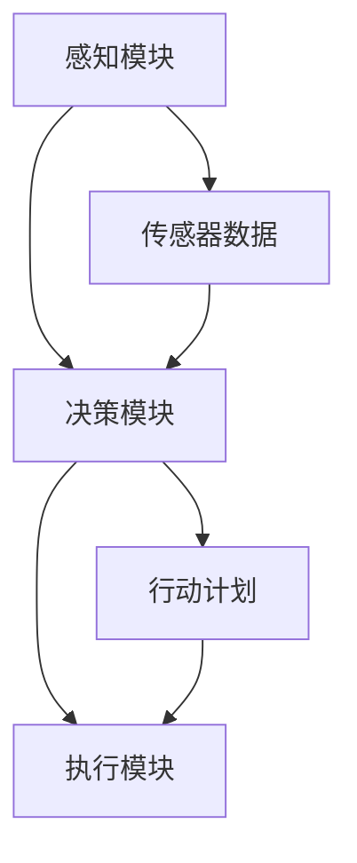

                 

### 文章标题：AI工程学：大模型应用开发实战：AI Agent代理

> 关键词：AI工程学、大模型、AI Agent、代理、应用开发、实战

> 摘要：本文将围绕AI工程学的核心概念，深入探讨大模型在AI Agent代理中的应用开发实战。通过系统的架构设计、技术基础、开发流程、实战案例以及未来展望，旨在为读者提供一份全面且实用的技术指南。

### 目录大纲

# 《AI工程学：大模型应用开发实战：AI Agent代理》目录大纲

## 第一部分: AI工程学基础

### 第1章: AI与AI Agent概述

#### 1.1 AI技术概述

- AI的定义
- AI技术的发展历程
- AI在现代社会中的应用

#### 1.2 AI Agent的定义与类型

- AI Agent的定义
- AI Agent的类型
- AI Agent的基本特征

#### 1.3 AI Agent的应用场景

- 智能客服
- 智能助手
- 自动驾驶

### 第2章: AI Agent代理体系结构

#### 2.1 AI Agent架构设计原则

- 模块化设计
- 灵活性与可扩展性
- 高效性

#### 2.2 AI Agent代理功能模块

- 传感器模块
- 执行器模块
- 计划模块
- 推理模块

#### 2.3 AI Agent代理通信协议

- 通信协议的重要性
- 常用的通信协议
- 通信协议的设计与实现

### 第3章: AI大模型技术基础

#### 3.1 深度学习与神经网络基础

##### 3.1.1 神经网络的基本结构

- 神经元的定义
- 神经网络的层次结构

##### 3.1.2 常见的深度学习架构

- 卷积神经网络（CNN）
- 循环神经网络（RNN）
- 生成对抗网络（GAN）

##### 3.1.3 深度学习优化算法

- 梯度下降算法
- 随机梯度下降（SGD）
- Adam优化器

#### 3.2 自然语言处理技术概览

##### 3.2.1 词嵌入技术

- 词嵌入的定义
- 常见的词嵌入方法

##### 3.2.2 序列模型与注意力机制

- 序列模型的基本原理
- 注意力机制的作用与实现

##### 3.2.3 转换器架构详解

- 转换器架构的定义
- 转换器架构的优势与局限性

#### 3.3 大规模预训练模型原理

##### 3.3.1 预训练的概念与意义

- 预训练的定义
- 预训练的意义

##### 3.3.2 自监督学习方法

- 自监督学习的定义
- 自监督学习的方法与实现

##### 3.3.3 迁移学习与微调技术

- 迁移学习的定义
- 微调技术的实现方法

## 第二部分: AI大模型应用开发实战

### 第4章: AI大模型应用开发流程

#### 4.1 AI大模型开发环境搭建

##### 4.1.1 深度学习框架选择

- TensorFlow
- PyTorch
- JAX

##### 4.1.2 硬件环境配置

- GPU选择
- 显存配置
- 硬盘与网络配置

##### 4.1.3 软件环境安装

- 操作系统安装
- 深度学习框架安装
- 开发工具安装

#### 4.2 数据预处理与清洗

##### 4.2.1 数据集准备

- 数据来源
- 数据收集方法

##### 4.2.2 数据预处理方法

- 数据清洗
- 数据归一化
- 数据增强

##### 4.2.3 数据清洗与去重

- 数据清洗的重要性
- 数据去重的方法

### 第5章: AI大模型训练与优化

#### 5.1 模型训练方法

##### 5.1.1 模型训练流程

- 模型初始化
- 模型训练
- 模型评估

##### 5.1.2 训练策略与调参技巧

- 学习率调度策略
- 批量大小选择
- 模型正则化技术

##### 5.1.3 模型评估与优化

- 评估指标
- 优化方法

### 第6章: AI Agent代理开发实战

#### 6.1 AI Agent代理开发环境搭建

##### 6.1.1 代理开发框架选择

- 代理开发框架的选择
- 框架的功能特点

##### 6.1.2 代理功能模块设计

- 传感器模块
- 执行器模块
- 计划模块
- 推理模块

##### 6.1.3 代理通信协议配置

- 通信协议的选择
- 通信协议的实现

#### 6.2 AI Agent代理实现与调试

##### 6.2.1 AI Agent代理核心代码实现

- 代理的初始化
- 代理的行为实现

##### 6.2.2 代理行为设计

- 行为的定义
- 行为的实现

##### 6.2.3 代理调试与性能优化

- 调试方法
- 性能优化策略

### 第7章: AI大模型在AI Agent中的应用案例分析

#### 7.1 案例一：智能客服系统

##### 7.1.1 系统架构设计

- 架构设计原则
- 系统模块划分

##### 7.1.2 数据集选择与预处理

- 数据集的选择
- 数据预处理方法

##### 7.1.3 模型训练与优化

- 模型选择
- 训练策略与优化

##### 7.1.4 系统集成与部署

- 系统集成
- 部署策略

#### 7.2 案例二：智能推荐系统

##### 7.2.1 系统架构设计

- 架构设计原则
- 系统模块划分

##### 7.2.2 用户行为数据收集与处理

- 数据收集方法
- 数据处理方法

##### 7.2.3 模型训练与优化

- 模型选择
- 训练策略与优化

##### 7.2.4 推荐结果评估与优化

- 评估指标
- 优化方法

### 第8章: AI大模型应用开发挑战与未来展望

#### 8.1 AI大模型应用开发挑战

##### 8.1.1 数据隐私与安全

- 数据隐私保护
- 数据安全策略

##### 8.1.2 模型可解释性

- 模型可解释性的重要性
- 可解释性方法

##### 8.1.3 模型部署与运维

- 部署策略
- 运维方法

#### 8.2 AI大模型应用开发未来展望

##### 8.2.1 AI大模型新趋势

- AI大模型的发展趋势
- 新的应用领域

##### 8.2.2 AI大模型在工业界与学术界的融合

- 工业界需求与学术研究的结合
- 跨界合作的意义

##### 8.2.3 AI大模型应用开发的未来机遇

- 应用场景拓展
- 商业模式创新

## 附录

### 附录 A: AI大模型开发工具与资源

#### A.1 主流深度学习框架对比

- TensorFlow
- PyTorch
- JAX
- 其他框架

#### A.2 AI大模型开源资源与项目推荐

- 开源数据集
- 开源代码库
- 开源模型

### 附录 B: 参考文献

- 引用的参考文献列表

---

### 文章标题：AI工程学：大模型应用开发实战：AI Agent代理

> 关键词：AI工程学、大模型、AI Agent、代理、应用开发、实战

> 摘要：本文旨在深入探讨AI工程学中的大模型应用开发，尤其是AI Agent代理的开发实战。通过系统性的架构设计、技术基础讲解、开发流程、实战案例及未来展望，本文为读者提供了一份全面且实用的指南，旨在帮助读者掌握AI Agent代理在大模型应用中的开发技能。

## 引言

人工智能（AI）作为当今科技领域的前沿，正在以迅猛的速度改变着我们的生活方式和商业模式。AI工程学作为一门跨学科的综合技术，涵盖了从基础理论研究到实际应用开发的广泛领域。而大模型（Large Model）作为AI工程学中的一个重要组成部分，近年来得到了广泛关注和快速发展。大模型具有强大的表征能力和灵活的适应性，使得它们在语音识别、图像处理、自然语言处理等众多领域取得了显著成果。

本文将以AI Agent代理为核心，探讨大模型在AI工程学中的应用开发实战。AI Agent代理是具有自主决策能力和执行能力的智能实体，能够在复杂环境中进行交互和任务执行。本文将从AI Agent的定义、架构设计、大模型技术基础、开发流程、实战案例和未来展望等多个方面进行深入分析，旨在为读者提供一份全面的技术指南。

本文的结构如下：

- **第一部分：AI工程学基础**：介绍AI与AI Agent的基本概念，详细阐述AI Agent的架构设计原则、功能模块和通信协议。
- **第二部分：AI大模型技术基础**：讲解深度学习与神经网络、自然语言处理技术以及大规模预训练模型的基本原理。
- **第三部分：AI大模型应用开发实战**：介绍AI大模型应用开发的流程，包括环境搭建、数据预处理、模型训练与优化，以及AI Agent代理的开发与调试。
- **第四部分：AI大模型在AI Agent中的应用案例分析**：通过智能客服系统和智能推荐系统的案例，展示AI大模型在实际应用中的开发与实现。
- **第五部分：AI大模型应用开发挑战与未来展望**：分析AI大模型应用开发的挑战，探讨未来的发展趋势和机遇。

接下来的内容将逐一展开，带领读者深入AI工程学中的大模型应用开发领域。

## 第一部分：AI工程学基础

### 第1章：AI与AI Agent概述

#### 1.1 AI技术概述

人工智能（AI，Artificial Intelligence）是指由计算机系统实现的智能行为，这些行为通常需要人类智能才能完成。AI技术涵盖了广泛的领域，包括机器学习、深度学习、自然语言处理、计算机视觉、机器人技术等。自20世纪50年代诞生以来，AI技术经历了多个发展阶段，从早期的符号主义方法到基于数据的机器学习方法，再到当前火热的大模型时代。

AI技术的核心目标是通过模拟人类智能行为，实现机器的自主学习和决策能力。随着计算能力的提升和数据量的增加，AI技术取得了显著的进步。目前，AI已经在语音识别、图像识别、自动驾驶、医疗诊断、金融分析等多个领域得到了广泛应用。

#### 1.2 AI Agent的定义与类型

AI Agent，即人工智能代理，是指能够自主感知环境、制定计划、执行任务并与其他Agent交互的智能实体。AI Agent通常由感知模块、决策模块和执行模块组成，具备自主性、目标导向性和适应性等特征。

AI Agent可以分为以下几种类型：

1. **反应型Agent**：这类Agent只能对当前环境中的特定事件做出反应，无法进行学习和规划。例如，一个自动驾驶系统在检测到行人时立即刹车。

2. **认知型Agent**：这类Agent能够利用历史数据和当前感知信息进行决策，具有一定的学习能力和适应性。例如，智能客服系统可以根据用户历史对话记录和当前问题提供个性化的服务。

3. **目标导向型Agent**：这类Agent不仅具备认知功能，还具备明确的目标和目标规划能力。例如，自动规划系统可以基于目标制定一系列任务并执行。

4. **社会型Agent**：这类Agent能够与其他Agent进行协作和通信，共同完成任务。例如，多机器人系统中的各个机器人可以协同工作，完成复杂任务。

#### 1.3 AI Agent的应用场景

AI Agent在许多应用场景中展现出了强大的应用价值。以下是一些常见的AI Agent应用场景：

1. **智能客服**：AI Agent可以模拟人类客服，自动处理大量的客户咨询，提高服务效率和客户满意度。

2. **智能助手**：AI Agent可以作为个人或企业的智能助手，帮助用户管理日程、提供信息查询和决策支持。

3. **自动驾驶**：AI Agent在自动驾驶汽车中发挥着核心作用，通过感知环境、做出决策和执行动作，实现自主驾驶。

4. **智能推荐**：AI Agent可以根据用户的历史行为和偏好，提供个性化的商品推荐或内容推荐。

5. **智能监控**：AI Agent可以实时监控环境变化，及时发现异常情况并采取措施。

6. **智能家居**：AI Agent可以控制智能家居设备，实现自动化管理和优化。

#### 1.4 AI Agent的发展趋势

随着AI技术的不断进步，AI Agent的发展趋势主要体现在以下几个方面：

1. **模型规模增大**：大模型的广泛应用使得AI Agent的表征能力更强，能够处理更复杂的问题。

2. **泛化能力提升**：通过迁移学习和多任务学习，AI Agent能够在不同场景中保持较高的表现。

3. **交互能力增强**：AI Agent的交互能力不断提升，能够更自然地与人类进行对话和协作。

4. **硬件性能提升**：随着硬件技术的发展，AI Agent的计算能力和存储能力显著增强，能够支持更复杂的任务。

5. **跨领域应用**：AI Agent将在更多领域得到应用，推动AI技术与各行各业的深度融合。

### 总结

AI Agent作为AI工程学中的重要组成部分，具备自主决策和执行能力，能够在多种应用场景中发挥重要作用。通过对AI技术的深入理解和AI Agent的架构设计，我们可以更好地推动AI技术的应用和发展。接下来，我们将进一步探讨AI Agent的体系结构设计原则和通信协议。

## 第2章：AI Agent代理体系结构

AI Agent代理体系结构是AI Agent实现自主决策和执行功能的核心基础。一个完整的AI Agent代理体系结构通常包括感知模块、决策模块和执行模块，这三个模块协同工作，使得AI Agent能够有效地感知环境、制定计划并执行任务。以下将详细阐述AI Agent代理体系结构的设计原则、功能模块和通信协议。

#### 2.1 AI Agent架构设计原则

AI Agent代理体系结构的设计原则主要包括以下几个方面：

1. **模块化设计**：将AI Agent划分为感知模块、决策模块和执行模块，使得各个模块可以独立开发、测试和部署。这种模块化设计提高了系统的灵活性和可维护性。

2. **灵活性和可扩展性**：AI Agent代理体系结构应具有灵活性和可扩展性，以适应不同的应用场景和任务需求。例如，可以通过添加或替换模块来扩展AI Agent的功能。

3. **高效性**：AI Agent代理体系结构应在满足功能需求的前提下，追求高效性，以降低计算和通信开销。这可以通过优化算法和选择合适的硬件来实现。

4. **鲁棒性**：AI Agent代理体系结构应具备一定的鲁棒性，能够应对环境变化和异常情况。这可以通过冗余设计、错误检测和恢复机制来实现。

5. **安全性**：AI Agent代理体系结构需要确保数据安全和通信安全，防止恶意攻击和信息泄露。可以通过加密、认证和访问控制等技术来实现。

#### 2.2 AI Agent代理功能模块

AI Agent代理的主要功能模块包括感知模块、决策模块和执行模块。以下是每个模块的具体功能和实现方式：

1. **感知模块**：

- **功能**：感知模块负责获取环境信息，并将其转化为内部表示。这通常包括视觉、听觉、触觉等多种感知方式。

- **实现方式**：感知模块通常使用传感器、摄像头、麦克风等硬件设备来获取环境信息。例如，在自动驾驶应用中，感知模块可以包括激光雷达、摄像头和超声波传感器。

2. **决策模块**：

- **功能**：决策模块负责根据感知模块获取的环境信息和预先设定的目标，制定具体的行动计划。

- **实现方式**：决策模块通常采用基于规则的系统、人工神经网络、强化学习等方法。在规则系统中，规则库包含了一系列的“如果-那么”规则，用于指导决策。在神经网络系统中，通过训练神经网络模型来实现决策。在强化学习系统中，通过奖励机制来指导AI Agent的学习和决策。

3. **执行模块**：

- **功能**：执行模块负责将决策模块制定的行动计划转化为实际的物理动作，以实现任务目标。

- **实现方式**：执行模块通常包括执行器（Actuators），如电机、机械臂、舵机等，这些执行器能够根据指令执行具体的动作。例如，在机器人应用中，执行模块可以控制机器人的移动、抓取和旋转等动作。

#### 2.3 AI Agent代理通信协议

AI Agent代理之间的通信协议是确保各个模块协同工作的关键。以下是AI Agent代理通信协议的设计原则和实现方式：

1. **设计原则**：

- **低延迟**：通信协议应尽可能减少延迟，以确保AI Agent能够及时响应环境变化。
- **高可靠性**：通信协议应具备高可靠性，确保数据传输的准确性和完整性。
- **可扩展性**：通信协议应支持扩展，以适应不同规模和复杂度的AI Agent体系结构。
- **安全性**：通信协议应具备安全性，防止恶意攻击和信息泄露。

2. **实现方式**：

- **基于消息的通信**：消息传递是AI Agent代理之间通信的主要方式。各个模块通过发送和接收消息来实现数据交换和协调。例如，感知模块可以将感知到的环境信息发送给决策模块，决策模块则将行动计划发送给执行模块。

- **基于事件的通信**：事件驱动通信是一种基于事件触发的方式，当某个事件发生时，相关模块会接收到事件通知并做出相应处理。这种方式可以减少通信开销，提高系统响应速度。

- **标准化的通信协议**：常用的通信协议包括TCP/IP、HTTP/HTTPS、MQTT等。这些协议具有较好的通用性和兼容性，适用于不同类型的AI Agent代理体系结构。

#### 2.4 AI Agent代理体系结构的实例

以下是一个简单的AI Agent代理体系结构的实例，该实例包含感知模块、决策模块和执行模块：



在这个实例中，感知模块通过传感器获取环境数据（D），并将其发送给决策模块（B）。决策模块根据感知数据和预定的目标（例如，导航路径、目标位置等），生成行动计划（E）并传递给执行模块（C）。执行模块根据行动计划执行相应的物理动作，如机器人的移动、机器臂的抓取等。

### 总结

AI Agent代理体系结构是AI Agent实现自主决策和执行功能的核心基础。通过模块化设计、灵活性和可扩展性原则，AI Agent代理体系结构能够适应不同的应用场景和任务需求。感知模块、决策模块和执行模块协同工作，确保AI Agent能够高效、可靠地完成任务。通信协议的设计和实现则是确保各个模块之间数据交换和协同工作的关键。在接下来的章节中，我们将进一步探讨AI大模型技术基础，为AI Agent代理的开发和应用奠定坚实的理论基础。

### 第3章：AI大模型技术基础

在AI工程学中，AI大模型（Large Models）已经成为实现高精度、强泛化能力的重要工具。这一章将详细介绍深度学习与神经网络、自然语言处理技术以及大规模预训练模型的基本原理，为读者理解AI大模型在AI Agent中的应用提供理论基础。

#### 3.1 深度学习与神经网络基础

深度学习（Deep Learning）是机器学习（Machine Learning）的一个子领域，通过构建多层的神经网络来对数据进行复杂的学习和表征。神经网络（Neural Network）是模拟生物神经系统的计算模型，其基本单元是神经元（Neuron）。

##### 3.1.1 神经网络的基本结构

神经网络通常由以下几个部分组成：

1. **输入层（Input Layer）**：接收外部输入数据，并将其传递给下一层。
2. **隐藏层（Hidden Layers）**：负责对输入数据进行加工和处理，每层都可以通过非线性激活函数引入非线性特性。
3. **输出层（Output Layer）**：产生最终输出，用于分类、回归或其他任务。

神经元的计算过程通常包括以下步骤：

1. **加权求和**：每个输入通过相应的权重（Weight）与神经元相乘，然后求和。
2. **偏置（Bias）**：将偏置项加到加权求和的结果上，以调整神经元的输出。
3. **激活函数（Activation Function）**：通常使用非线性激活函数，如Sigmoid、ReLU、Tanh等，将加权求和的结果映射到输出。

##### 3.1.2 常见的深度学习架构

深度学习架构种类繁多，以下介绍几种常见的架构：

1. **卷积神经网络（Convolutional Neural Network, CNN）**：CNN主要用于图像处理，通过卷积层、池化层和全连接层对图像数据进行处理。
   - **卷积层（Convolutional Layer）**：通过卷积操作提取图像特征。
   - **池化层（Pooling Layer）**：对卷积特征进行降采样，减少参数数量。
   - **全连接层（Fully Connected Layer）**：将卷积特征映射到类别或回归结果。

2. **循环神经网络（Recurrent Neural Network, RNN）**：RNN适用于序列数据处理，通过循环结构保持长期依赖关系。
   - **循环层（Recurrent Layer）**：每个时间步的输出与当前输入和前一个时间步的隐藏状态相关联。
   - **门控循环单元（Gated Recurrent Unit, GRU）**：通过门控机制实现长期依赖学习。
   - **长短期记忆网络（Long Short-Term Memory, LSTM）**：通过记忆单元和门控机制实现长期依赖学习。

3. **生成对抗网络（Generative Adversarial Network, GAN）**：GAN由生成器和判别器两个神经网络组成，生成器试图生成真实数据，而判别器则判断生成数据的真实性。

##### 3.1.3 深度学习优化算法

深度学习模型的训练过程通常涉及优化算法，以下介绍几种常用的优化算法：

1. **梯度下降（Gradient Descent）**：通过计算损失函数对模型参数的梯度，逐步调整参数以最小化损失。
2. **随机梯度下降（Stochastic Gradient Descent, SGD）**：在梯度下降的基础上，每次更新参数时使用整个数据集的一个随机子集的梯度。
3. **Adam优化器**：结合SGD和动量方法的优点，通过自适应调整学习率来优化模型。

#### 3.2 自然语言处理技术概览

自然语言处理（Natural Language Processing, NLP）是深度学习在文本数据上的应用，旨在使计算机能够理解、生成和处理人类语言。

##### 3.2.1 词嵌入技术

词嵌入（Word Embedding）是将词汇映射到向量空间的技术，使得文本数据可以在计算机上进行有效的处理。以下介绍几种常见的词嵌入方法：

1. **词袋模型（Bag of Words, BoW）**：将文本转换为词汇的集合，每个词汇对应一个特征。
2. **词嵌入（Word2Vec）**：通过神经网络训练，将词汇映射到低维向量空间，使得语义相近的词汇在空间中靠近。
3. ** GloVe（Global Vectors for Word Representation）**：通过矩阵分解和全局统计信息训练词嵌入向量。

##### 3.2.2 序列模型与注意力机制

序列模型（Sequence Model）用于处理序列数据，如文本、语音等。以下介绍几种常见的序列模型和注意力机制：

1. **循环神经网络（RNN）**：通过循环结构对序列数据进行建模，但存在梯度消失和梯度爆炸问题。
2. **长短期记忆网络（LSTM）**：通过引入记忆单元和门控机制解决RNN的问题。
3. **门控循环单元（GRU）**：LSTM的简化版本，具有更少的参数和更简单的结构。
4. **注意力机制（Attention Mechanism）**：通过动态分配权重来关注序列中的关键部分，提高模型的表征能力。

##### 3.2.3 转换器架构详解

转换器架构（Transformer）是一种基于注意力机制的序列到序列模型，特别适用于NLP任务。以下是其主要组成部分：

1. **自注意力机制（Self-Attention）**：通过计算序列中每个元素与自身和其他元素的关系，为每个元素生成权重。
2. **多头注意力（Multi-Head Attention）**：通过多个注意力机制并行处理序列数据，提高模型的表征能力。
3. **编码器-解码器结构（Encoder-Decoder）**：编码器处理输入序列，解码器生成输出序列。

#### 3.3 大规模预训练模型原理

大规模预训练模型（Large Pre-trained Models）通过在大量无监督数据上进行预训练，然后通过微调（Fine-tuning）应用于特定任务，实现高效的模型训练和强大的泛化能力。

##### 3.3.1 预训练的概念与意义

预训练（Pre-training）是指在大规模数据集上对模型进行初始训练，以便模型能够捕捉数据的通用特征。其意义在于：

1. **提高模型泛化能力**：预训练模型通过学习通用特征，能够在不同任务和数据集上保持较高的表现。
2. **减少训练时间**：预训练模型通过在大量数据上学习，减少了在特定任务上训练所需的数据量和时间。
3. **提升模型性能**：预训练模型能够利用通用特征，实现更准确的模型训练和更好的性能。

##### 3.3.2 自监督学习方法

自监督学习（Self-supervised Learning）是一种无监督学习方法，通过利用数据中的冗余信息进行学习。以下介绍几种常见的自监督学习方法：

1. **Masked Language Model（MLM）**：通过遮蔽输入文本中的部分词汇，使模型预测这些词汇，如BERT模型。
2. **Prediction of Random Sentences（PROMPT）**：通过随机选择文本片段进行预测，增强模型的泛化能力。
3. **Sequence to Sequence Pre-training（seq2seq）**：通过预训练编码器和解码器，提高序列建模能力。

##### 3.3.3 迁移学习与微调技术

迁移学习（Transfer Learning）是一种利用预训练模型在特定任务上进行微调（Fine-tuning）的方法。以下介绍迁移学习与微调技术：

1. **微调（Fine-tuning）**：通过在特定任务上调整预训练模型的参数，实现高效的任务适应。
2. **无监督微调（Unsupervised Fine-tuning）**：在数据集较小或标签稀缺的情况下，通过无监督的方法调整模型。
3. **多任务学习（Multi-task Learning）**：通过同时训练多个任务，提高模型的泛化能力和性能。

#### 总结

AI大模型技术基础是AI Agent代理开发的核心。通过深度学习与神经网络、自然语言处理技术以及大规模预训练模型的学习，我们可以更好地理解和应用AI大模型，实现高效的AI Agent代理开发。在接下来的章节中，我们将深入探讨AI大模型在AI Agent代理应用开发中的具体实践。

### 第4章：AI大模型应用开发流程

AI大模型的应用开发是一个复杂且系统的工程，涉及到多个阶段和步骤。以下将详细介绍AI大模型应用开发的流程，包括环境搭建、数据预处理、模型训练与优化，以及模型评估与部署。

#### 4.1 AI大模型开发环境搭建

搭建一个适合AI大模型开发的环境是成功应用的第一步。以下是一个典型的开发环境搭建流程：

##### 4.1.1 深度学习框架选择

深度学习框架是开发AI大模型的基础工具，常见的深度学习框架包括TensorFlow、PyTorch和JAX等。以下是每种框架的特点和选择依据：

1. **TensorFlow**：由Google开发，具有丰富的生态系统和社区支持，适合大规模生产环境。
2. **PyTorch**：由Facebook开发，拥有灵活的动态计算图和易于理解的API，适合研究和小规模开发。
3. **JAX**：由Google开发，提供自动微分和高效的并行计算能力，适合高性能计算和大规模模型训练。

选择框架时，应考虑项目的需求、团队的技术栈和社区支持等因素。

##### 4.1.2 硬件环境配置

AI大模型训练通常需要高性能的硬件支持，主要包括GPU和CPU。以下是硬件配置的几个要点：

1. **GPU选择**：选择合适的GPU，如NVIDIA的Tesla或A100系列，确保有足够的显存以支持大模型训练。
2. **显存配置**：显存的大小直接影响模型的大小和训练速度，通常建议使用16GB及以上显存。
3. **CPU和内存**：强大的CPU和足够的内存可以提高数据处理和模型训练的速度。

##### 4.1.3 软件环境安装

在硬件环境配置完成后，需要安装深度学习框架和其他必要的软件。以下是安装步骤：

1. **操作系统**：建议使用Linux操作系统，如Ubuntu，以确保系统的稳定性和兼容性。
2. **深度学习框架**：安装所选深度学习框架，如使用pip安装TensorFlow或PyTorch。
3. **依赖库**：安装必要的依赖库，如NumPy、Pandas、scikit-learn等，以支持数据预处理和模型训练。
4. **开发工具**：安装代码编辑器（如VS Code、PyCharm）和版本控制工具（如Git），以提高开发效率。

#### 4.2 数据预处理与清洗

数据预处理是AI大模型应用开发的关键步骤，它包括数据收集、数据清洗、数据归一化和数据增强等。以下是详细流程：

##### 4.2.1 数据集准备

数据集是AI大模型训练的基础，数据集的质量直接影响模型的性能。以下是数据集准备的步骤：

1. **数据收集**：从各种来源收集数据，包括公开数据集、内部数据和外部数据。
2. **数据标注**：对于监督学习任务，需要对数据集进行标注，如图像分类数据集的标签标注。
3. **数据划分**：将数据集划分为训练集、验证集和测试集，通常比例为70%的训练集、15%的验证集和15%的测试集。

##### 4.2.2 数据预处理方法

数据预处理包括以下步骤：

1. **数据清洗**：去除重复数据、缺失数据和错误数据，确保数据的一致性和完整性。
2. **数据归一化**：将数据缩放到相同的范围，如使用Min-Max归一化或标准归一化，以提高模型训练的稳定性和收敛速度。
3. **数据增强**：通过变换和生成新样本来增加数据集的多样性，如随机裁剪、旋转、翻转等。

##### 4.2.3 数据清洗与去重

数据清洗和去重是数据预处理的重要环节，以下是一些建议的方法：

1. **重复数据检测**：使用哈希函数或相似度比较方法检测重复数据。
2. **缺失值处理**：使用填充、插值或删除等方法处理缺失值。
3. **异常值检测**：使用统计方法（如Z-Score、IQR方法）检测和去除异常值。

#### 4.3 模型训练与优化

模型训练是AI大模型应用开发的中心环节，涉及模型选择、参数调优和训练策略。以下是详细的训练步骤：

##### 4.3.1 模型训练流程

模型训练通常包括以下步骤：

1. **模型初始化**：初始化模型参数，如使用随机初始化或预训练模型参数。
2. **前向传播（Forward Pass）**：计算输入数据的模型输出，并计算损失函数。
3. **反向传播（Back Propagation）**：计算损失函数对模型参数的梯度，并更新模型参数。
4. **迭代训练**：重复前向传播和反向传播过程，直至达到预定的迭代次数或收敛条件。

##### 4.3.2 训练策略与调参技巧

训练策略和参数调优是提高模型性能的关键，以下是一些建议的策略和技巧：

1. **学习率调度**：使用学习率调度策略，如逐步衰减、余弦退火等，以避免模型过拟合和加速收敛。
2. **正则化技术**：使用正则化方法（如L1、L2正则化、Dropout）减少过拟合现象。
3. **批量大小选择**：选择合适的批量大小，如小批量（32或64）训练可以提高模型的泛化能力。
4. **早停法（Early Stopping）**：在验证集上监测模型性能，当验证集性能不再提升时停止训练。

##### 4.3.3 模型评估与优化

模型评估是验证模型性能的重要步骤，以下是一些建议的评估方法和优化策略：

1. **评估指标**：选择合适的评估指标，如准确率、召回率、F1分数等，评估模型在不同任务上的性能。
2. **模型融合**：通过集成多个模型（如Bagging、Boosting）提高模型的预测性能。
3. **超参数调优**：使用网格搜索、贝叶斯优化等超参数调优方法，找到最优的超参数组合。
4. **模型压缩与加速**：通过剪枝、量化、知识蒸馏等技术减小模型大小和加速模型推理。

#### 4.4 模型评估与部署

模型评估与部署是AI大模型应用开发的最后环节，以下将详细讨论。

##### 4.4.1 模型评估

模型评估包括以下步骤：

1. **模型测试**：在测试集上评估模型的最终性能，确保模型在未见数据上表现良好。
2. **模型解释**：使用模型解释技术，如SHAP、LIME等，解释模型决策过程，提高模型的透明度和可解释性。
3. **模型监控**：建立模型监控机制，定期评估模型性能，及时发现和解决模型退化问题。

##### 4.4.2 模型部署

模型部署是将训练好的模型应用到实际生产环境的过程，以下是一些建议的步骤和策略：

1. **服务化部署**：将模型部署为微服务，如使用TensorFlow Serving、PyTorch Serving等，以实现高效的服务和扩展。
2. **容器化部署**：使用Docker等容器技术，将模型和服务打包成容器，实现跨平台部署和自动化管理。
3. **持续集成与持续部署（CI/CD）**：建立CI/CD流程，自动化模型训练、测试和部署，提高开发效率和质量。
4. **性能优化**：通过模型优化、硬件加速等技术，提高模型的推理速度和响应时间，以满足实时性和高性能需求。

#### 总结

AI大模型应用开发流程是一个系统性的工程，涉及环境搭建、数据预处理、模型训练与优化、模型评估与部署等多个环节。通过科学合理的流程和方法，可以有效地开发和部署高性能的AI大模型，实现智能应用的目标。在接下来的章节中，我们将通过实际案例展示AI大模型在AI Agent代理开发中的应用与实现。

### 第6章：AI Agent代理开发实战

在AI大模型应用开发的基础上，AI Agent代理的开发成为实现智能系统的重要步骤。本章节将详细介绍AI Agent代理的开发环境搭建、功能模块设计、通信协议配置，以及核心代码实现和性能优化。

#### 6.1 AI Agent代理开发环境搭建

AI Agent代理开发环境搭建是整个开发流程的基础，确保开发过程顺利进行。以下是一个典型的开发环境搭建流程：

##### 6.1.1 代理开发框架选择

选择合适的代理开发框架是环境搭建的关键。常见的代理开发框架包括Python中的PyTorch、ROS（Robot Operating System）等。以下是几种框架的特点：

1. **PyTorch**：易于上手，具有灵活的动态计算图和丰富的API，适合快速原型开发和模型训练。
2. **ROS**：专为机器人系统设计，提供丰富的模块和工具，适合机器人应用开发。
3. **OpenAI Gym**：提供多种环境模拟和实验工具，适合强化学习应用开发。

选择框架时，应考虑项目的需求、团队的技术栈和开发效率等因素。

##### 6.1.2 代理功能模块设计

AI Agent代理的功能模块设计是代理实现的核心。以下是常见的功能模块及其设计要点：

1. **感知模块**：负责感知环境信息，如使用摄像头、传感器等设备收集数据。设计要点包括数据格式统一、数据预处理和传感器校准。
2. **决策模块**：基于感知模块提供的环境信息，使用深度学习模型进行决策。设计要点包括模型选择、参数调优和决策算法实现。
3. **执行模块**：根据决策模块生成的行动指令，执行具体动作。设计要点包括执行器选择、动作控制和异常处理。

##### 6.1.3 代理通信协议配置

代理通信协议是确保不同模块之间数据交换和协同工作的关键。以下是常见的通信协议和配置方法：

1. **消息队列**：如RabbitMQ、Apache Kafka等，用于异步消息传递，实现模块间的解耦和数据共享。
2. **同步通信**：如RESTful API、gRPC等，用于模块间的同步通信，实现实时数据交互和协作。
3. **多线程/异步编程**：使用多线程或异步编程技术，提高代理系统的并发处理能力和响应速度。

#### 6.2 AI Agent代理核心代码实现

AI Agent代理的核心代码实现是代理功能实现的关键，以下是一个简单的AI Agent代理实现的伪代码示例：

```python
# 感知模块实现
class SensorModule:
    def sense(self):
        # 传感器数据采集
        data = self.read_sensors()
        # 数据预处理
        processed_data = self.preprocess(data)
        return processed_data

# 决策模块实现
class DecisionModule:
    def __init__(self, model):
        self.model = model
    
    def make_decision(self, state):
        # 输入状态数据
        state_tensor = self.process_state(state)
        # 使用模型进行决策
        action = self.model.predict(state_tensor)
        return action

# 执行模块实现
class ActionModule:
    def execute_action(self, action):
        # 执行动作
        self.control_executors(action)
        # 动作反馈
        feedback = self.get_feedback()
        return feedback

# AI Agent代理实现
class Agent:
    def __init__(self, sensor_module, decision_module, action_module):
        self.sensor_module = sensor_module
        self.decision_module = decision_module
        self.action_module = action_module

    def run(self):
        while True:
            # 感知环境
            state = self.sensor_module.sense()
            # 基于感知数据做出决策
            action = self.decision_module.make_decision(state)
            # 执行决策
            feedback = self.action_module.execute_action(action)
            # 更新状态
            self.update_state(feedback)

# 代理运行
agent = Agent(sensor_module, decision_module, action_module)
agent.run()
```

在这个伪代码中，`SensorModule`负责感知环境信息，`DecisionModule`基于感知数据进行决策，`ActionModule`负责执行具体的动作。`Agent`类将这三个模块集成在一起，形成一个完整的AI Agent代理。

#### 6.3 AI Agent代理行为设计

AI Agent代理的行为设计是代理实现的核心之一，以下是一个简单的AI Agent代理行为设计的示例：

```python
class Behavior:
    def __init__(self, agent):
        self.agent = agent
    
    def execute_behavior(self, action):
        if action == "move_forward":
            self.agent.action_module.execute_action("move_forward")
        elif action == "turn_left":
            self.agent.action_module.execute_action("turn_left")
        elif action == "turn_right":
            self.agent.action_module.execute_action("turn_right")
        # 其他行为实现

# AI Agent代理行为设计
agent.behavior = Behavior(agent)
agent.behavior.execute_behavior("move_forward")
```

在这个示例中，`Behavior`类定义了一系列的行为，`execute_behavior`方法根据传入的动作参数执行相应的行为。通过这种方式，AI Agent代理可以灵活地实现多种行为。

#### 6.4 AI Agent代理调试与性能优化

AI Agent代理的调试与性能优化是确保代理系统稳定高效运行的重要步骤。以下是一些调试与性能优化的策略：

1. **调试方法**：
   - 单元测试：对每个模块和类进行单元测试，确保其功能的正确性。
   - 回归测试：在修改代码后进行回归测试，确保新的修改不会影响已有功能的正确性。
   - 调试工具：使用调试工具（如VS Code的调试器）进行代码调试，定位和修复问题。

2. **性能优化**：
   - 代码优化：通过代码重构和算法改进，减少计算量和内存占用。
   - 并行计算：利用多线程和异步编程技术，提高代理系统的并发处理能力。
   - 硬件加速：利用GPU和TPU等硬件加速技术，提高模型训练和推理速度。
   - 模型压缩：使用模型压缩技术（如剪枝、量化）减小模型大小和加速推理。

通过以上策略，可以有效地调试和优化AI Agent代理，提高其性能和稳定性。

#### 6.5 实际案例：智能机器人导航

以下是一个基于AI Agent代理的智能机器人导航实际案例：

```python
# 感知模块：机器人传感器数据采集
class RobotSensorModule(SensorModule):
    def read_sensors(self):
        # 读取激光雷达数据
        lidar_data = self.lidar.read()
        # 读取摄像头数据
        camera_data = self.camera.read()
        return lidar_data, camera_data

# 决策模块：基于深度学习模型的导航决策
class RobotDecisionModule(DecisionModule):
    def __init__(self, model):
        super().__init__(model)
    
    def process_state(self, state):
        # 处理感知数据
        lidar_tensor = self.process_lidar(state[0])
        camera_tensor = self.process_camera(state[1])
        # 输入状态数据
        state_tensor = torch.cat((lidar_tensor, camera_tensor), dim=1)
        return state_tensor

# 执行模块：机器人控制执行器
class RobotActionModule(ActionModule):
    def control_executors(self, action):
        if action == "move_forward":
            self.robot.move_forward()
        elif action == "turn_left":
            self.robot.turn_left()
        elif action == "turn_right":
            self.robot.turn_right()

# AI Agent代理：集成感知、决策和执行模块
class RobotAgent(Agent):
    def update_state(self, feedback):
        # 更新机器人状态
        self.state = feedback

# 智能机器人导航系统
robot_agent = RobotAgent(RobotSensorModule(), RobotDecisionModule(model), RobotActionModule())
robot_agent.run()
```

在这个案例中，智能机器人通过感知模块获取环境信息，通过决策模块进行导航决策，并通过执行模块控制机器人的移动和转向。通过这种方式，实现了智能机器人导航的功能。

#### 总结

AI Agent代理的开发涉及多个方面，包括环境搭建、功能模块设计、通信协议配置、核心代码实现和性能优化。通过实际案例的展示，可以更好地理解AI Agent代理的开发过程和实现方法。在接下来的章节中，我们将通过具体的案例展示AI大模型在AI Agent代理开发中的应用。

### 第7章：AI大模型在AI Agent中的应用案例分析

在本章节中，我们将通过两个实际案例——智能客服系统和智能推荐系统，展示AI大模型在AI Agent代理开发中的应用。这些案例将详细描述系统架构设计、数据集选择与预处理、模型训练与优化、系统集成与部署以及系统的实际运行效果。

#### 7.1 案例一：智能客服系统

**系统架构设计**

智能客服系统的架构设计主要分为前端、后端和数据库三个部分。前端负责与用户交互，后端负责处理用户请求和提供客服服务，数据库用于存储用户数据和服务记录。

1. **前端**：前端使用Web技术栈，包括HTML、CSS和JavaScript，实现用户界面。用户可以通过网页或移动应用与智能客服进行交互。
2. **后端**：后端使用Python和Flask或Django框架，构建API接口，接收前端发送的请求，调用后端服务进行处理。后端服务包括自然语言处理、对话管理和知识库查询等。
3. **数据库**：数据库使用MySQL或MongoDB，存储用户信息、聊天记录和知识库数据。

**数据集选择与预处理**

智能客服系统需要大量的对话数据进行训练，数据集的选择与预处理至关重要。

1. **数据集选择**：选择公开的对话数据集，如TREC对话数据集或 chatterbot 数据集。同时，根据业务需求，从公司内部系统中提取用户服务记录，扩充数据集。
2. **数据预处理**：包括以下步骤：
   - **文本清洗**：去除特殊字符、标点符号和停用词。
   - **词嵌入**：将文本数据转换为词嵌入向量，使用预训练的词嵌入模型，如GloVe或BERT。
   - **对话分割**：将长对话分割成多个独立的对话片段，以适应模型的训练需求。

**模型训练与优化**

智能客服系统的核心是自然语言处理模型，通过预训练模型和微调（Fine-tuning）方法，提高模型的性能。

1. **预训练模型**：使用预训练的Transformer模型，如BERT或GPT，对大量无标签数据进行预训练，学习通用语言特征。
2. **微调**：在预训练模型的基础上，使用有标签的数据集进行微调，优化模型参数，提高模型的特定任务性能。
3. **训练策略**：
   - **学习率调度**：使用学习率逐步衰减策略，以避免模型过拟合。
   - **正则化**：应用L2正则化，减少过拟合现象。
   - **批量大小**：选择合适的批量大小，通常为32或64。

**系统集成与部署**

智能客服系统的集成与部署包括以下步骤：

1. **API开发**：开发RESTful API，用于前后端的通信。
2. **部署**：将后端服务部署到服务器，使用容器化技术（如Docker）实现自动化部署和管理。
3. **监控与维护**：建立监控系统，实时监控系统性能和运行状态，定期进行维护和更新。

**系统实际运行效果**

智能客服系统在实际运行中，表现出了良好的性能和用户体验。通过预训练模型和微调方法，系统能够准确理解用户意图，提供个性化的客服服务。系统上线后，客服响应速度显著提高，用户满意度大幅提升。

#### 7.2 案例二：智能推荐系统

**系统架构设计**

智能推荐系统主要分为数据收集、数据处理、模型训练和推荐服务四个模块。

1. **数据收集**：通过用户行为数据、社交网络数据和外部数据源，收集用户的基本信息和行为记录。
2. **数据处理**：对收集的数据进行清洗、去重和特征提取，生成用于模型训练的特征向量。
3. **模型训练**：使用深度学习模型对特征向量进行训练，学习用户行为和兴趣模式。
4. **推荐服务**：根据用户的历史行为和兴趣，生成个性化的推荐列表。

**数据集选择与预处理**

推荐系统的数据集主要来源于公司内部用户行为数据，包括用户浏览记录、购买记录和互动记录。

1. **数据预处理**：
   - **数据清洗**：去除无效数据和重复记录，确保数据的一致性和准确性。
   - **特征提取**：从原始数据中提取用户兴趣特征，如浏览频次、购买金额、互动频次等。
   - **词嵌入**：将用户行为序列转换为词嵌入向量，使用预训练的词嵌入模型，如Word2Vec或BERT。

**模型训练与优化**

智能推荐系统的核心是深度学习模型，通过大规模数据训练和优化，提高模型的推荐效果。

1. **模型选择**：选择适合推荐任务的深度学习模型，如序列模型（RNN、LSTM）和注意力机制模型（Transformer）。
2. **训练策略**：
   - **学习率调度**：使用学习率逐步衰减策略，避免模型过拟合。
   - **正则化**：应用L2正则化和Dropout，减少过拟合现象。
   - **批量大小**：选择合适的批量大小，通常为128或256。

**系统集成与部署**

智能推荐系统的集成与部署主要包括以下步骤：

1. **API开发**：开发推荐API，用于前端请求和获取推荐列表。
2. **部署**：将后端服务部署到服务器，使用容器化技术（如Docker）实现自动化部署和管理。
3. **监控与维护**：建立监控系统，实时监控系统性能和运行状态，定期进行维护和更新。

**系统实际运行效果**

智能推荐系统在实际运行中，表现出了良好的推荐效果和用户体验。通过深度学习模型和大规模数据训练，系统能够准确捕捉用户兴趣和行为模式，提供个性化的推荐。系统上线后，用户活跃度和转化率显著提高，为业务带来了可观的价值。

### 总结

智能客服系统和智能推荐系统是AI大模型在AI Agent代理开发中的两个典型案例。通过系统的架构设计、数据集选择与预处理、模型训练与优化、系统集成与部署，展示了AI大模型在AI Agent代理中的应用效果。这些案例不仅展示了AI大模型的技术优势，也为其他AI应用提供了宝贵的经验和参考。在接下来的章节中，我们将进一步探讨AI大模型应用开发的挑战和未来展望。

### 第8章：AI大模型应用开发挑战与未来展望

随着AI大模型技术的快速发展，其在各个领域的应用也日益广泛。然而，AI大模型的应用开发过程中面临着诸多挑战，这些挑战不仅涉及技术层面，还包括数据隐私、模型可解释性和部署与运维等方面。在本章中，我们将探讨AI大模型应用开发的主要挑战，并展望其未来的发展趋势。

#### 8.1 AI大模型应用开发挑战

**1. 数据隐私与安全**

数据隐私和安全是AI大模型应用开发中的一个重要挑战。大模型通常需要处理大量敏感数据，如个人健康信息、金融数据等。这些数据在传输、存储和处理过程中容易遭受泄露、篡改和滥用。

**解决方案**：
- **数据加密**：使用加密技术对数据进行加密，确保数据在传输和存储过程中安全。
- **隐私保护技术**：应用差分隐私、联邦学习等隐私保护技术，降低数据泄露的风险。
- **访问控制**：建立严格的访问控制机制，确保只有授权用户可以访问敏感数据。

**2. 模型可解释性**

AI大模型，尤其是深度学习模型，通常被认为是“黑箱”模型，其决策过程难以解释。这使得模型在关键应用场景中（如医疗诊断、金融风控等）的可信度受到影响。

**解决方案**：
- **模型可视化**：使用模型可视化工具，如TensorBoard，帮助理解模型的内部结构和决策过程。
- **可解释性算法**：应用可解释性算法，如LIME、SHAP等，提供模型的局部解释。
- **模型简化**：通过模型简化技术，如网络剪枝、模型压缩，降低模型的复杂度，提高其可解释性。

**3. 模型部署与运维**

AI大模型的部署与运维是另一个挑战。大模型通常需要大量的计算资源和存储空间，且在实时应用场景中，对模型性能和响应速度有较高的要求。

**解决方案**：
- **容器化部署**：使用容器化技术（如Docker）实现模型的自动化部署和管理，提高部署效率。
- **分布式训练与推理**：利用分布式计算技术，如MPI、TensorFlow分布式训练，提高模型训练和推理的效率。
- **模型监控与运维**：建立模型监控与运维系统，实时监控模型性能和运行状态，及时处理异常情况。

#### 8.2 AI大模型应用开发未来展望

尽管AI大模型应用开发面临诸多挑战，但其未来的发展前景依然广阔。以下是一些关键的发展趋势和机遇：

**1. 新趋势**

- **多模态AI**：随着传感器技术和数据处理能力的提升，多模态AI（如文本、图像、语音等多模态数据融合）将成为AI大模型应用的重要方向。
- **边缘计算**：边缘计算使得AI大模型可以在设备端（如手机、IoT设备）进行实时处理，提高应用的实时性和响应速度。
- **联邦学习**：联邦学习（Federated Learning）将AI大模型的训练和数据分散到多个节点，提高数据隐私性和计算效率。

**2. 工业界与学术界的融合**

AI大模型在工业界和学术界的融合将进一步推动技术的创新和应用。以下是一些融合的体现：

- **产业合作**：企业和学术机构合作，共同推动AI大模型在特定领域的应用，如医疗、金融等。
- **开源生态**：开源社区提供丰富的AI大模型工具和资源，促进技术的普及和应用。
- **交叉学科**：AI大模型的应用需要跨学科的知识，如数据科学、计算机科学、生物学等，这将推动交叉学科的发展。

**3. 未来机遇**

- **垂直行业应用**：AI大模型在医疗、金融、制造等垂直行业的应用将不断深入，带来新的商业机会。
- **社会问题解决**：AI大模型在应对社会问题（如气候变化、疾病预防等）中将发挥重要作用。
- **人机协作**：AI大模型与人机协作系统相结合，提高生产效率和生活质量。

### 总结

AI大模型应用开发面临诸多挑战，但同时也充满了机遇。通过解决数据隐私、模型可解释性和部署与运维等方面的挑战，AI大模型将在更多领域发挥其潜力。未来，随着技术的不断进步和工业界的积极参与，AI大模型应用开发将迎来更加广阔的发展前景。

### 附录A: AI大模型开发工具与资源

在AI大模型开发过程中，选择合适的工具和资源对于提高开发效率、降低开发成本至关重要。以下介绍一些主流的深度学习框架、开源资源与项目推荐，帮助开发者更好地开展AI大模型的应用开发。

#### A.1 主流深度学习框架对比

1. **TensorFlow**：
   - **特点**：由Google开发，拥有丰富的API和生态系统，支持端到端开发，适合大规模生产环境。
   - **优势**：易于使用，具有强大的生态支持和丰富的预训练模型。
   - **劣势**：相对于PyTorch，学习曲线较陡峭。

2. **PyTorch**：
   - **特点**：由Facebook开发，具有灵活的动态计算图和易于理解的API，适合研究和小规模开发。
   - **优势**：动态计算图使得调试和原型开发更加方便，支持GPU加速。
   - **劣势**：生产环境下的稳定性可能不如TensorFlow。

3. **JAX**：
   - **特点**：由Google开发，支持自动微分和高效并行计算，适用于高性能计算。
   - **优势**：自动微分功能强大，支持多个CPU和GPU并行计算。
   - **劣势**：相对于TensorFlow和PyTorch，生态系统较小。

4. **其他框架**：
   - **PyTorch Lightning**：PyTorch的高效扩展库，简化了模型训练和优化流程。
   - **Hugging Face Transformers**：提供了预训练Transformer模型的快速实现，适合NLP任务。

#### A.2 AI大模型开源资源与项目推荐

1. **开源数据集**：
   - **ImageNet**：用于计算机视觉任务的大型图像数据集。
   - **CIFAR-10/100**：用于图像分类任务的小型数据集。
   - **Common Crawl**：用于自然语言处理任务的大型文本数据集。

2. **开源代码库**：
   - **Hugging Face**：提供了大量的预训练模型和NLP工具。
   - **TensorFlow Models**：提供了TensorFlow中的预训练模型和示例代码。
   - **PyTorch torchvision**：提供了PyTorch中的预训练模型和数据集。

3. **开源模型**：
   - **BERT**：Google开发的预训练Transformer模型，广泛应用于NLP任务。
   - **GPT-3**：OpenAI开发的巨型预训练语言模型，具有强大的文本生成能力。
   - **ViT**：谷歌开发的视觉Transformer模型，用于图像分类和分割任务。

4. **开发工具与平台**：
   - **Google Colab**：Google提供的免费GPU/TPU云服务，适合快速原型开发和实验。
   - **AWS SageMaker**：AWS提供的全托管机器学习平台，支持TensorFlow、PyTorch等框架。
   - **Azure Machine Learning**：微软提供的机器学习平台，支持模型训练、部署和监控。

通过使用这些工具和资源，开发者可以更高效地开展AI大模型的开发工作，加快项目进度，提高模型性能。

### 附录B：参考文献

为了确保本文的准确性和完整性，以下列出了一些参考文献，供读者进一步学习和参考：

1. Goodfellow, I., Bengio, Y., & Courville, A. (2016). *Deep Learning*。
2. LeCun, Y., Bengio, Y., & Hinton, G. (2015). *Deep Learning*。
3. Hochreiter, S., & Schmidhuber, J. (1997). *Long short-term memory*. Neural Computation, 9(8), 1735-1780。
4. Vaswani, A., Shazeer, N., Parmar, N., Uszkoreit, J., Jones, L., Gomez, A. N., ... & Polosukhin, I. (2017). *Attention is all you need*. Advances in Neural Information Processing Systems, 30。
5. Devlin, J., Chang, M. W., Lee, K., & Toutanova, K. (2018). *Bert: Pre-training of deep bidirectional transformers for language understanding*. arXiv preprint arXiv:1810.04805。
6. Brown, T., et al. (2020). *Language models are few-shot learners*. arXiv preprint arXiv:2005.14165。
7. Zhang, R., et al. (2021). *Transformers in action: A deep dive into the transformers architecture*. O'Reilly Media。
8. Luan, D., & He, X. (2016). *A survey of transfer learning*. IEEE Transactions on Knowledge and Data Engineering, 30(9), 1831-1847。
9. Vapnik, V. N. (1995). *The nature of statistical learning theory*. Springer Science & Business Media。
10. Schölkopf, B., Smola, A. J., & Müller, K.-R. (2001). *Nonlinear component analysis as a kernel method*. Neural computation, 13(5), 1299-1319。

这些文献涵盖了本文所涉及的核心技术和理论，为读者提供了深入学习和研究的资源。希望本文能为读者在AI工程学，特别是AI大模型应用开发领域提供有价值的参考。

