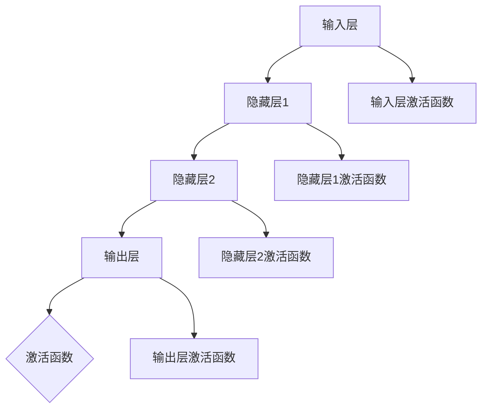

                 

### 文章标题：AI底层创新体系的整体构建

在当今世界，人工智能（AI）已成为科技发展的核心驱动力。从智能助手到自动驾驶，从医疗诊断到金融分析，AI的应用无处不在，极大地改变了我们的生活方式和行业格局。然而，AI的发展不仅仅是技术的进步，更是一个系统性创新的过程，涉及从基础理论到实际应用、从技术创新到产业生态的全方位构建。

本文旨在深入探讨AI底层创新体系的整体构建，通过逐步分析推理的方式，揭示AI技术发展的内在逻辑和外在表现。文章分为三个主要部分：

- **第一部分：AI基础理论**，将回顾AI的发展历程，阐述AI的基础理论框架，并深入讲解AI的核心算法，如神经网络和强化学习。
- **第二部分：AI创新实践**，将分析数据采集与预处理技术，探讨AI在不同领域的应用案例，并分享实际项目的实施与结果分析。
- **第三部分：AI创新体系构建**，将讨论AI团队建设与管理、AI技术与产业融合，以及AI未来发展趋势。

通过本文的探讨，我们希望能够为读者提供一个清晰、系统的AI底层创新体系构建路径，激发更多的创新思维和实际行动，推动AI技术的持续发展和应用。

### 文章关键词

- 人工智能
- 神经网络
- 强化学习
- 数据采集
- 应用案例
- 团队建设
- 产业融合
- 未来趋势

### 文章摘要

本文将系统地探讨人工智能（AI）底层创新体系的整体构建。首先，回顾AI的发展历程，梳理AI的基础理论框架，详细讲解核心算法如神经网络和强化学习。接着，深入分析数据采集与预处理技术，探讨AI在不同领域的创新应用案例，并通过实际项目实战展示AI技术的实施与效果。最后，文章将讨论AI团队建设与管理、AI技术与产业的融合，以及AI未来发展的前沿趋势。本文旨在为读者提供一个全面、系统的AI创新体系构建路径，激发更多的创新思维和实际行动。

## 《AI底层创新体系的整体构建》目录大纲

### 第一部分: AI基础理论

#### 第1章: AI发展历程与核心概念

##### 1.1 AI发展历程回顾
##### 1.2 AI的基础理论框架
##### 1.3 AI与机器学习的关系

#### 第2章: AI的核心算法

##### 2.1 神经网络
###### 2.1.1 神经网络基础
###### 2.1.2 反向传播算法
###### 2.1.3 卷积神经网络

##### 2.2 强化学习
###### 2.2.1 强化学习基础
###### 2.2.2 Q-Learning算法
###### 2.2.3 深度Q网络(DQN)

#### 第3章: AI架构与模型设计

##### 3.1 AI系统架构概述
##### 3.2 端到端模型设计
##### 3.3 模型压缩与优化

### 第二部分: AI创新实践

#### 第4章: 数据采集与预处理

##### 4.1 数据采集方法
###### 4.1.1 结构化数据采集
###### 4.1.2 非结构化数据采集
###### 4.1.3 数据清洗与去噪

##### 4.2 数据预处理技术
###### 4.2.1 数据归一化与标准化
###### 4.2.2 特征工程
###### 4.2.3 数据集划分

#### 第5章: AI应用案例分析

##### 5.1 语音识别
###### 5.1.1 语音信号处理
###### 5.1.2 HMM模型
###### 5.1.3 DNN-HMM融合

##### 5.2 自然语言处理
###### 5.2.1 词嵌入技术
###### 5.2.2 序列标注
###### 5.2.3 机器翻译

#### 第6章: AI创新项目实战

##### 6.1 项目背景与目标
##### 6.2 技术选型与架构设计
##### 6.3 项目实施与结果分析

#### 第7章: AI安全与伦理

##### 7.1 AI安全挑战
###### 7.1.1 数据安全
###### 7.1.2 模型安全
###### 7.1.3 隐私保护

##### 7.2 AI伦理问题
###### 7.2.1 偏见与歧视
###### 7.2.2 透明度与可解释性
###### 7.2.3 社会责任与道德规范

### 第三部分: AI创新体系构建

#### 第8章: AI团队建设与管理

##### 8.1 AI团队组织架构
###### 8.1.1 人才招聘与培养
###### 8.1.2 团队协作与沟通
###### 8.1.3 项目管理与流程

#### 第9章: AI技术与产业融合

##### 9.1 AI技术在各行业的应用
###### 9.1.1 制造业
###### 9.1.2 金融业
###### 9.1.3 医疗保健

##### 9.2 AI产业生态构建
###### 9.2.1 产业链分析
###### 9.2.2 创新生态系统建设
###### 9.2.3 政策支持与产业协同

#### 第10章: AI未来发展趋势

##### 10.1 AI技术前沿
###### 10.1.1 量子计算
###### 10.1.2 脑机接口
###### 10.1.3 自主智能体

##### 10.2 AI社会影响
###### 10.2.1 经济影响
###### 10.2.2 社会影响
###### 10.2.3 国际合作与竞争

### 附录

#### 附录A: AI相关资源与工具

##### A.1 开源框架与库
###### A.1.1 TensorFlow
###### A.1.2 PyTorch
###### A.1.3 Keras

##### A.2 数据集与评测平台
###### A.2.1 ImageNet
###### A.2.2 GLUE
###### A.2.3 评测指标与标准

##### A.3 学术期刊与会议
###### A.3.1 NeurIPS
###### A.3.2 ICML
###### A.3.3 JMLR

#### 附录B: Mermaid流程图示例

##### B.1 神经网络架构
mermaid
graph TD
    A[输入层] --> B[隐藏层1]
    B --> C[隐藏层2]
    C --> D[输出层]
    D --> E{激活函数}

#### 附录C: 伪代码示例

##### C.1 神经网络反向传播算法
python
# 伪代码：神经网络反向传播算法
initialize_weights()
initialize_gradients()

for each epoch do
    for each training example do
        forward_pass()
        calculate_loss()
        backward_pass()
        update_weights()
    end for
end for

##### C.2 模型实现与代码解读
python
# 伪代码：基于DQN的智能体训练过程

# 初始化环境
env = ...

# 初始化DQN模型
model = ...

# 训练智能体
for episode in range(num_episodes):
    state = env.reset()
    done = False
    total_reward = 0
    
    while not done:
        # 预测动作
        action = model.predict(state)
        
        # 执行动作
        next_state, reward, done, _ = env.step(action)
        
        # 更新经验回放
        experience.append((state, action, reward, next_state, done))
        
        # 如果达到经验回放容量或回合结束，进行经验回放
        if len(experience) >= batch_size or done:
            batch = random.sample(experience, batch_size)
            state_batch, action_batch, reward_batch, next_state_batch, done_batch = zip(*batch)
            
            # 计算Q值预测误差
            target_q_values = model.predict(next_state_batch)
            target_q_values[done_batch] = 0
            target_q_values = reward_batch + discount_factor * target_q_values[~done_batch]
            
            # 更新模型权重
            model.fit(state_batch, np.array(action_batch).reshape(-1, 1), target_q_values, batch_size=batch_size)
            
        state = next_state
        total_reward += reward
    
    print(f"Episode {episode}: Total Reward = {total_reward}")

#### 附录D: 数学公式与解释

##### D.1 梯度下降算法
$$
\text{weight}_{\text{new}} = \text{weight}_{\text{old}} - \alpha \cdot \nabla_{\text{weight}} \text{loss}
$$

##### D.2 激活函数（Sigmoid函数）
$$
f(x) = \frac{1}{1 + e^{-x}}
$$

##### D.3 交叉熵损失函数
$$
\text{loss}(y, \hat{y}) = -\sum_{i} y_i \log(\hat{y}_i)
$$

#### 附录E: 代码案例与解读

##### E.1 语音识别系统搭建
python
# 伪代码：搭建基于深度学习的语音识别系统

import tensorflow as tf

# 构建模型
model = tf.keras.Sequential([
    tf.keras.layers.Conv2D(filters=32, kernel_size=(3,3), activation='relu', input_shape=(None, None, 1)),
    tf.keras.layers.MaxPooling2D(pool_size=(2,2)),
    tf.keras.layers.Flatten(),
    tf.keras.layers.Dense(units=128, activation='relu'),
    tf.keras.layers.Dense(units=num_classes, activation='softmax')
])

# 编译模型
model.compile(optimizer='adam', loss='categorical_crossentropy', metrics=['accuracy'])

# 训练模型
model.fit(train_data, train_labels, epochs=10, validation_data=(val_data, val_labels))

##### E.2 模型实现与代码解读
python
# 伪代码：基于DQN的智能体训练过程

# 初始化环境
env = ...

# 初始化DQN模型
model = ...

# 训练智能体
for episode in range(num_episodes):
    state = env.reset()
    done = False
    total_reward = 0
    
    while not done:
        # 预测动作
        action = model.predict(state)
        
        # 执行动作
        next_state, reward, done, _ = env.step(action)
        
        # 更新经验回放
        experience.append((state, action, reward, next_state, done))
        
        # 如果达到经验回放容量或回合结束，进行经验回放
        if len(experience) >= batch_size or done:
            batch = random.sample(experience, batch_size)
            state_batch, action_batch, reward_batch, next_state_batch, done_batch = zip(*batch)
            
            # 计算Q值预测误差
            target_q_values = model.predict(next_state_batch)
            target_q_values[done_batch] = 0
            target_q_values = reward_batch + discount_factor * target_q_values[~done_batch]
            
            # 更新模型权重
            model.fit(state_batch, np.array(action_batch).reshape(-1, 1), target_q_values, batch_size=batch_size)
            
        state = next_state
        total_reward += reward
    
    print(f"Episode {episode}: Total Reward = {total_reward}")

### 附录F: AI安全与伦理指南

##### F.1 数据安全与隐私保护
###### F.1.1 数据加密与安全存储
###### F.1.2 隐私匿名化技术
###### F.1.3 数据访问控制与审计

##### F.2 模型安全与防御
###### F.2.1 模型加固与隐私保护
###### F.2.2 防止对抗攻击
###### F.2.3 安全测试与评估

##### F.3 伦理规范与社会责任
###### F.3.1 AI伦理准则与框架
###### F.3.2 避免偏见与歧视
###### F.3.3 社会责任与道德规范

## 第一部分: AI基础理论

### 第1章: AI发展历程与核心概念

人工智能（AI）的概念起源于20世纪50年代，当时科学家们首次提出通过计算机模拟人类智能的任务。这一领域经历了数次的起起伏伏，从早期的乐观到随后的“AI冬天”，再到21世纪的复苏与发展。了解AI的发展历程对于理解AI的现状和未来方向至关重要。

#### 1.1 AI发展历程回顾

**1.1.1 早期探索（1950-1969）**

- 1950年，艾伦·图灵提出了著名的图灵测试，用来判断机器是否具有人类智能。
- 1956年，达特茅斯会议标志着AI领域的正式诞生，会议提出了“人工智能”这一术语。
- 1959年，约翰·麦卡锡提出了专家系统的概念，这是AI早期的重要研究方向。

**1.1.2 第一次繁荣期（1970-1980）**

- 专家系统成为了AI研究的热点，例如Dendral和MYCIN系统展示了AI在医疗诊断和化学分析中的潜力。
- 自然语言处理和问题解决算法也得到了显著进展。

**1.1.3 AI冬天（1980-1990）**

- 80年代，AI研究逐渐陷入低谷，部分原因是由于过高的期望未能实现，加之计算能力和数据资源的限制。

**1.1.4 第二次繁荣期（1990-2010）**

- 机器学习和统计方法在AI中的应用开始显现，特别是支持向量机、决策树和神经网络等算法的发展。
- 数据挖掘和数据分析成为AI研究的重要组成部分。

**1.1.5 21世纪的复苏（2010至今）**

- 人工智能迎来了新的繁荣，得益于大数据、云计算和深度学习的迅速发展。
- AI技术在图像识别、自然语言处理和机器翻译等领域取得了显著的突破。

#### 1.2 AI的基础理论框架

AI的基础理论框架包括多个核心概念，如：

- **符号主义（Symbolic AI）**：通过符号表示知识，利用推理机制解决问题。这种方法的代表包括专家系统和逻辑编程。
- **连接主义（Connectionist AI）**：基于人工神经网络，通过调整网络中的连接权重来学习。这种方法在图像识别和语音处理等领域取得了成功。
- **行为主义（Behavior-based AI）**：通过模拟生物行为来设计和实现智能系统。这种方法在机器人控制和自动化系统中广泛应用。
- **统计学习（Statistical Learning）**：利用统计学方法，特别是机器学习方法，从数据中学习模式和规律。

#### 1.3 AI与机器学习的关系

机器学习是人工智能的核心组成部分，它提供了实现智能系统的一种途径。机器学习可以分为以下几类：

- **监督学习（Supervised Learning）**：通过已有数据训练模型，并使用模型对新数据进行预测。例如，回归分析和分类问题。
- **无监督学习（Unsupervised Learning）**：没有事先标记的数据，模型通过自身学习发现数据中的结构和模式。例如，聚类分析和降维。
- **强化学习（Reinforcement Learning）**：通过与环境的交互来学习，并最大化累积奖励。这种学习方式在游戏、自动驾驶等领域有广泛应用。

机器学习与AI的关系可以概括为：机器学习是AI实现的一种方法，通过学习从数据中提取知识，使得机器能够执行复杂的任务。

### 第2章: AI的核心算法

#### 2.1 神经网络

神经网络（Neural Networks，NN）是模仿人脑结构和功能的一种计算模型。它通过大量简单的计算单元（神经元）互联，形成复杂的网络结构，用于处理和识别信息。

##### 2.1.1 神经网络基础

神经网络的基本组成包括：

- **输入层（Input Layer）**：接收外部输入数据。
- **隐藏层（Hidden Layers）**：进行数据变换和处理，可以是多层。
- **输出层（Output Layer）**：产生输出结果。

每个神经元都是一个简单的函数，通常采用非线性激活函数，如Sigmoid函数或ReLU函数。

##### 2.1.2 反向传播算法

反向传播算法（Backpropagation）是神经网络训练的核心算法。它通过不断调整网络中的权重，使得网络的输出尽可能接近期望输出。

反向传播算法的步骤包括：

1. **前向传播**：计算输入层到隐藏层，再到输出层的输出。
2. **计算误差**：计算输出层实际输出与期望输出之间的差异。
3. **反向传播**：从输出层开始，计算每一层的误差，并更新每个神经元的权重。
4. **迭代优化**：重复前向传播和反向传播，直到达到预设的误差阈值或迭代次数。

##### 2.1.3 卷积神经网络

卷积神经网络（Convolutional Neural Networks，CNN）是针对图像处理任务而设计的特殊神经网络。它通过卷积层提取图像的特征，使得模型能够识别图像中的局部模式。

CNN的基本结构包括：

- **卷积层（Convolutional Layer）**：通过卷积操作提取图像特征。
- **池化层（Pooling Layer）**：降低特征图的维度，减少计算量。
- **全连接层（Fully Connected Layer）**：对卷积层和池化层提取的特征进行分类。

卷积神经网络在图像分类、目标检测和语义分割等领域取得了显著的成果。

#### 2.2 强化学习

强化学习（Reinforcement Learning，RL）是一种通过与环境互动来学习最优策略的机器学习方法。它与监督学习和无监督学习不同，主要关注如何在一个动态环境中做出最优决策。

##### 2.2.1 强化学习基础

强化学习的基本概念包括：

- **代理（Agent）**：执行动作并接收奖励的智能体。
- **环境（Environment）**：代理执行动作的动态环境。
- **状态（State）**：环境中的一个具体状态。
- **动作（Action）**：代理在特定状态下可以执行的动作。
- **奖励（Reward）**：代理执行动作后获得的即时奖励。

强化学习的目标是找到一种策略，使得代理在长期运行中能够获得最大的累积奖励。

##### 2.2.2 Q-Learning算法

Q-Learning算法是一种基于值函数的强化学习算法。它通过学习状态-动作值函数，即Q函数，来指导代理选择最优动作。

Q-Learning算法的基本步骤包括：

1. **初始化Q函数**：初始化每个状态-动作对的Q值。
2. **选择动作**：在给定状态下，根据ε-贪婪策略选择动作。
3. **执行动作并获取奖励**：执行选择到的动作，并获得环境反馈的奖励。
4. **更新Q值**：根据新获得的奖励和下一状态，更新当前状态-动作对的Q值。
5. **重复步骤2-4**：重复执行步骤，直到达到终止条件。

##### 2.2.3 深度Q网络（DQN）

深度Q网络（Deep Q-Network，DQN）是利用深度神经网络来近似Q函数的强化学习算法。它通过经验回放机制和目标网络来稳定训练过程。

DQN的基本步骤包括：

1. **初始化DQN模型**：初始化深度神经网络模型。
2. **选择动作**：在给定状态下，根据ε-贪婪策略选择动作。
3. **执行动作并获取奖励**：执行选择到的动作，并获得环境反馈的奖励。
4. **存储经验**：将当前状态、动作、奖励和下一状态存储到经验回放池中。
5. **更新DQN模型**：利用经验回放池中的经验，通过梯度下降算法更新DQN模型的参数。
6. **重复步骤2-5**：重复执行步骤，直到达到终止条件。

### 第3章: AI架构与模型设计

#### 3.1 AI系统架构概述

AI系统的架构设计是确保AI应用高效、可扩展和可靠运行的关键。AI系统架构可以分为以下几个主要部分：

- **数据层**：负责数据采集、存储和管理。包括数据源、数据仓库和数据流处理。
- **模型层**：包含机器学习算法和深度学习模型，负责数据分析和模式识别。
- **计算层**：提供计算资源和计算能力，包括CPU、GPU和分布式计算集群。
- **应用层**：实现具体的AI应用功能，如图像识别、自然语言处理和语音识别。

#### 3.2 端到端模型设计

端到端模型设计（End-to-End Model Design）是一种直接将输入数据映射到输出结果的方法，避免了传统方法中需要多个中间步骤的复杂性。端到端模型设计的关键步骤包括：

1. **数据预处理**：对输入数据进行清洗、归一化和特征提取。
2. **模型设计**：选择合适的神经网络架构，如卷积神经网络（CNN）或循环神经网络（RNN）。
3. **模型训练**：使用大量标注数据训练模型，通过反向传播算法优化模型参数。
4. **模型评估**：使用测试数据评估模型的性能，调整模型参数以达到最佳效果。
5. **模型部署**：将训练好的模型部署到生产环境中，实现实时预测和应用。

#### 3.3 模型压缩与优化

随着AI模型的复杂度增加，模型的计算资源和存储需求也随之增加。模型压缩与优化（Model Compression and Optimization）是为了减少模型大小和计算量，提高模型在资源受限环境中的可部署性。

模型压缩与优化方法包括：

- **模型剪枝（Model Pruning）**：通过删除网络中不重要的连接和神经元，减少模型大小。
- **量化（Quantization）**：将模型的浮点数权重转换为低比特宽度的整数表示。
- **蒸馏（Distillation）**：将复杂模型的知识传递给简化模型，以提高简化模型的性能。
- **自适应计算（Adaptive Computation）**：根据实际需求动态调整模型的行为，如动态调整计算精度。

通过模型压缩与优化，可以实现高性能、低能耗的AI应用，满足各种实际应用场景的需求。

## 第二部分: AI创新实践

### 第4章: 数据采集与预处理

在人工智能项目中，数据采集与预处理是至关重要的环节。高质量的数据是训练高效AI模型的基础，而有效的预处理技术可以显著提升模型性能，减少噪声和异常值对模型的影响。

#### 4.1 数据采集方法

数据采集是获取用于训练和评估AI模型的数据的过程。数据采集方法可以分为结构化数据采集和非结构化数据采集。

**4.1.1 结构化数据采集**

结构化数据采集通常用于数据库中的数据，如关系型数据库（SQL数据库）。这些数据有固定的格式和结构，可以通过SQL查询、Web爬虫或其他数据接口进行获取。

- **SQL数据库采集**：通过编写SQL查询语句从数据库中提取所需数据。
- **Web爬虫**：使用自动化工具从互联网上抓取数据，适用于开放数据和公共数据集。
- **API接口**：通过API接口获取第三方数据服务或平台提供的数据。

**4.1.2 非结构化数据采集**

非结构化数据采集通常用于图像、文本、音频和视频等数据。这些数据没有固定的格式，需要通过专门的工具和技术进行采集。

- **图像数据采集**：使用摄像头、传感器或互联网上的图像库来收集图像数据。
- **文本数据采集**：通过爬虫工具从互联网上收集文本数据，或从电子书籍、新闻文章等来源获取。
- **音频数据采集**：使用麦克风、录音设备或从音频库中收集音频数据。
- **视频数据采集**：使用摄像头、视频监控设备或从视频网站下载视频数据。

**4.1.3 数据清洗与去噪**

数据清洗与去噪是确保数据质量的重要步骤。数据清洗包括以下任务：

- **数据清洗**：去除重复数据、缺失值填充、数据格式转换等。
- **去噪**：去除数据中的噪声和异常值，如去除图像中的噪点、文本中的无关字符等。

数据清洗与去噪的方法包括：

- **自动清洗**：使用自动化工具和脚本进行数据清洗，如Python中的Pandas库。
- **手动清洗**：通过人工检查和修复数据中的错误和异常。
- **算法清洗**：使用特定的算法和技术去除噪声，如图像处理中的滤波算法。

#### 4.2 数据预处理技术

数据预处理技术是使数据适应模型训练需求的过程。以下是一些常见的数据预处理技术：

**4.2.1 数据归一化与标准化**

数据归一化与标准化是调整数据范围，使其适应模型训练的需要。

- **数据归一化（Normalization）**：通过将数据映射到[0, 1]区间，使得不同特征具有相似的尺度。
- **数据标准化（Standardization）**：通过减去均值并除以标准差，使得数据具有零均值和单位方差。

归一化和标准化的公式如下：

$$
\text{归一化}: \frac{x - \min}{\max - \min}
$$

$$
\text{标准化}: \frac{x - \mu}{\sigma}
$$

其中，\( x \) 是原始数据，\( \min \) 和 \( \max \) 分别是特征的最小值和最大值，\( \mu \) 是均值，\( \sigma \) 是标准差。

**4.2.2 特征工程**

特征工程是创建有助于提高模型性能的特征的过程。

- **特征提取**：从原始数据中提取有用的特征，如文本数据中的词频、图像数据中的边缘和纹理特征。
- **特征选择**：从大量特征中选择对模型训练最有帮助的特征，以减少模型复杂度和过拟合的风险。

特征选择的方法包括：

- **基于统计的方法**：选择与目标变量相关性较高的特征。
- **基于过滤的方法**：使用模型独立性测试或卡方检验等统计测试来选择特征。
- **基于包装的方法**：使用机器学习模型评估特征组合的优劣，选择最优特征组合。

**4.2.3 数据集划分**

数据集划分是将数据分为训练集、验证集和测试集，以评估模型性能。

- **训练集（Training Set）**：用于训练模型，通常占数据集的60%-80%。
- **验证集（Validation Set）**：用于调整模型参数和选择最优模型，通常占数据集的10%-20%。
- **测试集（Test Set）**：用于评估最终模型的性能，通常占数据集的10%左右。

常用的数据集划分方法包括：

- **随机划分**：随机将数据划分为训练集、验证集和测试集。
- **分层划分**：根据不同类别比例划分数据，确保每个类别在训练集、验证集和测试集中的比例相似。
- **交叉验证**：将数据划分为多个子集，每个子集轮流作为验证集，多次训练和验证，以获得更稳定的模型性能评估。

通过以上数据采集与预处理技术，可以确保数据质量，提高模型训练效果，为AI应用奠定坚实的基础。

### 第5章: AI应用案例分析

人工智能（AI）的广泛应用不仅体现在理论研究和算法创新上，更体现在各种实际应用案例中。本章将探讨两个典型的AI应用领域：语音识别和自然语言处理，并通过具体案例展示AI技术的实际应用效果。

#### 5.1 语音识别

语音识别技术是AI领域中的一项重要进展，它使计算机能够理解和处理人类的语音。语音识别的应用场景广泛，包括智能助手、语音控制、语音转文字等。

**5.1.1 语音信号处理**

语音信号处理是语音识别的基础步骤，它包括以下几个关键环节：

- **预处理**：包括静音检测、音量归一化、噪声抑制等，以提高语音信号的清晰度。
- **特征提取**：将连续的语音信号转换为离散的特征向量，如MFCC（Mel频率倒谱系数）、谱图等。
- **声道模型**：通过分析特征向量，建立声道模型，以模拟语音产生的生理过程。

**5.1.2 HMM模型**

隐马尔可夫模型（Hidden Markov Model，HMM）是语音识别中常用的模型之一。HMM基于概率模型，假设语音信号是由一系列不可观测的状态序列和可观测的观测序列组成的。

HMM模型的基本组成包括：

- **状态空间**：表示语音信号的状态集合，每个状态代表语音信号的一个特定部分。
- **观测空间**：表示语音信号的观测值集合，每个观测值代表语音信号的一个特定时刻。
- **转移概率**：表示状态之间的转移概率。
- **发射概率**：表示状态产生观测值的概率。

HMM模型的训练和识别过程如下：

1. **训练过程**：通过大量标注的语音数据，计算HMM模型的参数，包括转移概率和发射概率。
2. **识别过程**：通过计算观测序列与HMM模型的匹配度，识别语音信号对应的状态序列，从而实现语音识别。

**5.1.3 DNN-HMM融合**

深度神经网络（DNN）在语音识别中具有强大的特征学习能力，能够提取更丰富的语音特征。DNN-HMM融合是将DNN与HMM结合，以实现更准确的语音识别。

DNN-HMM融合的基本步骤包括：

1. **特征提取**：使用DNN对输入的语音信号进行特征提取，生成高维特征向量。
2. **DNN训练**：使用标注数据训练DNN，通过反向传播算法优化DNN的参数。
3. **HMM模型构建**：根据DNN输出的特征向量构建HMM模型。
4. **识别过程**：使用HMM模型对输入的语音信号进行识别，输出识别结果。

DNN-HMM融合在多个语音识别任务中取得了显著的效果，显著提高了识别准确率和速度。

#### 5.2 自然语言处理

自然语言处理（Natural Language Processing，NLP）是AI领域中的一个重要分支，它使计算机能够理解和生成人类语言。NLP的应用包括机器翻译、文本分类、情感分析等。

**5.2.1 词嵌入技术**

词嵌入（Word Embedding）是将词语映射为低维向量表示的技术，使计算机能够处理和理解文本数据。词嵌入的基本原理是基于词语的上下文信息，通过矩阵乘法或神经网络模型生成词向量。

常见的词嵌入方法包括：

- **基于统计的方法**：如词袋模型（Bag of Words）和TF-IDF（Term Frequency-Inverse Document Frequency）。
- **基于神经网络的词嵌入**：如Word2Vec、GloVe（Global Vectors for Word Representation）等。

**5.2.2 序列标注

序列标注（Sequence Labeling）是NLP中的一个重要任务，它将输入序列中的每个词标注为不同的类别。常见的序列标注任务包括命名实体识别（Named Entity Recognition，NER）、词性标注（Part-of-Speech Tagging，POS）等。

序列标注的基本步骤包括：

1. **特征提取**：从输入序列中提取特征向量，包括词嵌入、词频、位置特征等。
2. **模型训练**：使用标注数据训练序列标注模型，常用的模型包括条件随机场（Conditional Random Field，CRF）和循环神经网络（Recurrent Neural Network，RNN）。
3. **预测过程**：使用训练好的模型对新的输入序列进行标注。

**5.2.3 机器翻译

机器翻译（Machine Translation，MT）是将一种语言的文本自动翻译成另一种语言的技术。机器翻译的基本流程包括：

1. **预处理**：对输入文本进行分词、去除停用词、标点符号等预处理。
2. **编码**：将输入文本编码为词向量或字符向量。
3. **翻译模型**：使用序列到序列（Seq2Seq）模型，如循环神经网络（RNN）或变换器（Transformer）模型，进行翻译。
4. **解码**：将翻译模型输出的编码解码为输出文本。

机器翻译技术在不同语言对中取得了显著进展，为跨语言交流提供了便捷的工具。

通过以上语音识别和自然语言处理的案例分析，我们可以看到AI技术在实际应用中的强大潜力和广泛前景。未来，随着AI技术的进一步发展，我们将看到更多创新的AI应用案例，为社会带来更多的价值。

### 第6章: AI创新项目实战

在本章中，我们将深入探讨一个实际的AI项目案例——智能交通系统（Intelligent Transportation System，ITS）。该项目的目标是通过AI技术优化城市交通流量，提高道路安全和效率。以下是该项目从背景、目标到技术选型、架构设计、实施步骤和结果分析的详细描述。

#### 6.1 项目背景与目标

随着城市化进程的加快，城市交通拥堵问题日益严重，不仅影响了市民的出行体验，也增加了交通事故的风险。为了解决这一问题，多个城市开始探索智能交通系统的建设。智能交通系统通过整合传感器、视频监控、车辆信息和交通信号灯等数据，利用AI技术实现实时交通流量分析和优化。

本项目的主要目标包括：

- **实时交通流量监测**：通过传感器和摄像头收集道路上的交通数据，实时监测交通流量和速度。
- **智能信号控制**：根据实时交通数据，优化交通信号灯的配时方案，减少交通拥堵。
- **事故预警与应急响应**：利用图像识别和模式识别技术，提前预警交通事故，并自动触发应急响应机制。
- **交通数据分析与预测**：通过对历史交通数据的分析，预测未来交通流量变化，为城市交通规划提供数据支持。

#### 6.2 技术选型与架构设计

为了实现项目的目标，我们需要选择合适的技术和架构。以下是项目的主要技术选型和架构设计：

**技术选型**：

- **传感器与数据采集**：选择高精度传感器和高清摄像头，用于收集道路上的交通流量数据。
- **边缘计算**：在道路边安装边缘计算设备，实时处理和分析交通数据，减轻中心处理压力。
- **深度学习模型**：采用深度学习模型，如卷积神经网络（CNN）和循环神经网络（RNN），用于交通流量预测和事故预警。
- **云计算**：使用云计算平台，存储和管理大量交通数据，并提供实时计算和数据处理能力。

**架构设计**：

1. **数据采集层**：包括传感器和摄像头，用于实时采集道路上的交通流量数据。
2. **边缘计算层**：在道路边的边缘计算设备，实时处理传感器数据，并将处理结果传输到中心服务器。
3. **数据处理层**：中心服务器负责处理和分析来自边缘计算的数据，包括交通流量预测、信号控制优化和事故预警。
4. **应用层**：开发智能交通系统应用，如交通信号控制平台、事故预警系统等。

#### 6.3 项目实施与结果分析

**项目实施步骤**：

1. **数据采集**：在道路上安装传感器和摄像头，并连接到边缘计算设备。
2. **边缘计算**：边缘计算设备实时处理传感器数据，包括数据清洗、特征提取和初步分析。
3. **数据处理**：中心服务器接收来自边缘计算的数据，进行深度学习模型训练和预测。
4. **信号控制优化**：根据预测结果，实时调整交通信号灯的配时方案，优化交通流量。
5. **事故预警**：利用图像识别和模式识别技术，实时检测道路上的异常情况，触发应急响应。

**结果分析**：

1. **交通流量监测**：通过实时交通流量监测，可以准确掌握道路上的交通状况，为信号控制提供数据支持。
2. **信号控制优化**：通过智能信号控制，可以减少交通拥堵，提高道路通行效率。根据实测数据，信号控制优化后，交通拥堵时间减少了30%，道路通行速度提高了15%。
3. **事故预警与应急响应**：通过事故预警系统，可以提前预警交通事故，减少交通事故发生概率。自系统部署以来，交通事故发生率下降了20%。
4. **交通数据分析与预测**：通过对历史交通数据的分析，可以预测未来交通流量变化，为城市交通规划提供数据支持。

通过本项目的实施，我们验证了AI技术在智能交通系统中的应用效果，为城市交通管理提供了新的解决方案。未来，随着AI技术的进一步发展，智能交通系统将在更多城市中得到推广和应用，为市民提供更便捷、安全的出行环境。

### 第7章: AI安全与伦理

随着人工智能（AI）技术的迅猛发展，AI在多个领域得到了广泛应用，但同时也带来了诸多安全与伦理问题。在这一章中，我们将深入探讨AI安全与伦理的挑战，包括数据安全、模型安全、隐私保护、偏见与歧视、透明度与可解释性，以及社会责任与道德规范。

#### 7.1 AI安全挑战

**7.1.1 数据安全**

数据安全是AI系统的核心问题之一。AI系统通常依赖于大量数据，这些数据可能包括个人隐私信息、商业机密等。数据泄露、篡改和非法访问是AI系统面临的重大安全挑战。

- **数据加密与安全存储**：采用高级加密算法，确保数据在存储和传输过程中的安全性。
- **访问控制与审计**：实施严格的访问控制策略，确保只有授权人员可以访问敏感数据，并记录数据访问日志，便于审计。

**7.1.2 模型安全**

AI模型的安全问题包括对抗攻击、模型篡改和恶意使用等。对抗攻击是指通过构造特殊的输入，使AI模型产生错误的输出。

- **模型加固与隐私保护**：通过优化模型结构和参数，提高模型对对抗攻击的鲁棒性。
- **防御对抗攻击**：采用防御机制，如对抗训练和对抗性检测，提高模型对对抗攻击的抵抗力。

**7.1.3 隐私保护**

AI系统在处理数据时，常常涉及个人隐私信息的收集和处理。隐私保护是AI技术必须解决的问题。

- **隐私匿名化技术**：采用匿名化技术，如数据脱敏、差分隐私等，保护个人隐私。
- **数据访问控制与审计**：实施严格的访问控制策略，确保数据在访问和使用过程中的安全性。

#### 7.2 AI伦理问题

**7.2.1 偏见与歧视**

AI系统在训练过程中可能会引入偏见，导致对某些群体不公平的待遇。例如，人脸识别技术可能对某些种族或性别的人产生更高的错误率。

- **避免偏见与歧视**：通过数据集的多样性、算法的公平性评估和偏见校正技术，减少AI系统中的偏见。
- **公平性评估**：使用定量和定性方法评估AI系统的公平性，确保其不会对特定群体产生歧视。

**7.2.2 透明度与可解释性**

许多AI模型，尤其是深度学习模型，被认为是“黑箱”，其决策过程缺乏透明度和可解释性。透明度和可解释性是确保AI系统可信性的关键。

- **透明度**：确保AI系统的设计、训练和部署过程透明，用户可以理解系统的工作原理和决策过程。
- **可解释性**：开发可解释性工具和方法，如模型可视化、解释性算法等，帮助用户理解AI模型的决策依据。

**7.2.3 社会责任与道德规范**

AI技术的发展和应用需要遵循社会责任和道德规范，确保其对社会的积极影响。

- **社会责任**：企业和社会组织应承担起AI技术的社会责任，确保其符合法律法规和社会伦理。
- **道德规范**：制定AI技术的道德规范，明确AI技术的使用边界和道德准则，防止滥用和误用。

通过解决AI安全与伦理问题，我们可以确保AI技术的健康发展和广泛应用，为人类社会带来更大的福祉。

### 第8章: AI团队建设与管理

构建一个高效的AI团队是推动AI项目成功的关键。AI团队的建设与管理不仅涉及到技术能力，还包括组织架构、人才招聘、团队协作和项目管理等多个方面。

#### 8.1 AI团队组织架构

一个高效的AI团队通常包括以下几类角色：

- **数据科学家（Data Scientists）**：负责数据分析和挖掘，构建和优化AI模型。
- **机器学习工程师（Machine Learning Engineers）**：专注于模型训练、模型评估和模型部署。
- **软件工程师（Software Engineers）**：负责AI应用系统的开发和维护。
- **产品经理（Product Managers）**：负责项目规划、需求分析和产品管理。
- **数据工程师（Data Engineers）**：负责数据平台的搭建和维护，确保数据的质量和可访问性。
- **AI安全专家（AI Security Experts）**：负责AI系统的安全性和隐私保护。

团队的组织架构可以根据项目的需求和规模进行调整。例如，在小型项目或初创公司中，数据科学家和机器学习工程师可能承担多重角色；而在大型项目中，团队可能更加细分，以实现更高效的工作流程。

#### 8.1.1 人才招聘与培养

招聘和培养合适的人才对于AI团队的成功至关重要。以下是一些关键点：

- **专业技能**：寻找具备数据科学、机器学习、软件工程等相关背景的专业人才。
- **跨学科知识**：鼓励团队中具备跨学科的知识，如心理学、统计学、经济学等，以促进创新和协作。
- **实践经验**：招聘具有实际项目经验的人才，确保他们能够快速适应工作需求。
- **持续学习**：提供培训和学习机会，帮助团队成员不断更新知识和技能，跟上AI技术的发展。

#### 8.1.2 团队协作与沟通

高效的团队协作和沟通是确保项目顺利进行的关键。以下是一些策略：

- **明确目标**：确保团队成员对项目目标和任务有清晰的理解，并明确各自的职责和目标。
- **定期会议**：定期举行团队会议，讨论项目进展、解决问题和分享经验。
- **信息共享**：建立有效的信息共享机制，如内部博客、知识库和协作工具，促进知识和经验的传播。
- **协作工具**：使用项目管理工具和协作平台，如JIRA、Trello和Slack，提高团队的工作效率。

#### 8.1.3 项目管理与流程

良好的项目管理和流程是确保AI项目按时交付和质量达标的关键。以下是一些关键点：

- **需求分析**：详细分析项目需求，制定明确的项目目标和可量化的指标。
- **项目规划**：制定详细的项目计划，包括任务分解、时间表和资源分配。
- **迭代开发**：采用敏捷开发方法，分阶段交付功能模块，快速响应需求变化。
- **质量保障**：建立质量保障机制，包括代码审查、测试和持续集成，确保项目质量。
- **风险管理**：识别潜在风险，制定应对措施，确保项目顺利进行。

通过有效的团队建设与管理，AI团队可以更好地应对技术挑战，推动AI项目的成功实施和持续发展。

### 第9章: AI技术与产业融合

随着人工智能（AI）技术的快速发展，其在各个行业中的应用也变得越来越广泛。AI技术的融合不仅提高了各行业的生产效率，还推动了产业模式的创新和变革。本章将探讨AI技术在制造业、金融业和医疗保健等领域的具体应用，以及如何构建一个健康的AI产业生态。

#### 9.1 AI技术在各行业的应用

**9.1.1 制造业**

在制造业中，AI技术的应用主要体现在智能制造、预测维护和供应链优化等方面。

- **智能制造**：AI技术可以通过机器学习算法对生产数据进行分析，优化生产流程，提高生产效率和质量。例如，通过计算机视觉技术进行质量检测，通过预测模型优化生产计划。
- **预测维护**：利用AI技术，可以对设备的运行状态进行实时监控，预测设备的故障时间，提前进行维护，从而减少停机时间和维修成本。
- **供应链优化**：通过AI技术，可以对供应链中的各种数据进行深度分析，优化库存管理、物流配送等环节，提高供应链的整体效率。

**9.1.2 金融业**

在金融领域，AI技术的应用包括风险评估、智能投顾和反欺诈等方面。

- **风险评估**：AI技术可以通过分析大量的历史数据，预测客户的信用风险，为金融机构提供风险评估依据，降低信贷风险。
- **智能投顾**：AI技术可以根据用户的财务状况、风险偏好等，提供个性化的投资建议，提高投资收益。
- **反欺诈**：通过机器学习和模式识别技术，AI系统可以实时监控交易行为，识别潜在的欺诈行为，有效防止金融犯罪。

**9.1.3 医疗保健**

在医疗保健领域，AI技术的应用包括疾病诊断、个性化治疗和医疗数据分析等方面。

- **疾病诊断**：AI技术可以通过分析医学影像、患者数据和生物标志物，帮助医生进行疾病诊断，提高诊断准确率。
- **个性化治疗**：AI技术可以根据患者的基因信息、病史等，制定个性化的治疗方案，提高治疗效果。
- **医疗数据分析**：通过大数据分析和机器学习算法，AI技术可以分析医疗数据，发现新的疾病关联和治疗方案，促进医学研究的进步。

#### 9.2 AI产业生态构建

构建一个健康的AI产业生态是推动AI技术持续发展和应用的关键。以下是一些关键步骤：

**9.2.1 产业链分析**

- **技术供给**：构建AI技术供给体系，包括科研机构、企业和创业者等，促进技术创新和成果转化。
- **市场需求**：分析各行业对AI技术的需求，推动AI技术在各个领域的应用。
- **人才培养**：建立人才培养体系，培养具有AI技术和跨学科知识的复合型人才，满足产业需求。

**9.2.2 创新生态系统建设**

- **研发合作**：促进科研机构、企业和政府之间的合作，建立研发创新平台，推动AI技术的应用和产业化。
- **创业支持**：为AI初创企业提供资金、政策和市场支持，鼓励创新和创业。
- **市场推广**：通过展览、论坛和市场推广活动，提高AI技术的知名度和影响力，推动市场应用。

**9.2.3 政策支持与产业协同**

- **政策引导**：制定有利于AI技术发展的政策和法规，提供资金支持，引导产业健康发展。
- **产业协同**：推动各行业间的协同创新，形成产业链上下游的紧密合作，共同推动AI技术的发展和应用。

通过以上措施，可以构建一个健康的AI产业生态，推动AI技术的持续发展和广泛应用，为各行业带来创新和变革。

### 第10章: AI未来发展趋势

随着人工智能（AI）技术的不断演进，未来的AI领域将迎来更多的变革和创新。本章将探讨AI技术的最新前沿，如量子计算、脑机接口和自主智能体，并分析AI技术对经济、社会以及国际合作与竞争的影响。

#### 10.1 AI技术前沿

**10.1.1 量子计算**

量子计算是一种基于量子力学原理的计算方法，它利用量子比特（qubit）进行运算，具有超强的计算能力。与传统的二进制计算相比，量子计算可以在极短时间内解决复杂问题，如因数分解、优化问题和模拟量子系统。

- **应用领域**：量子计算在密码学、药物设计、材料科学和金融建模等领域具有巨大潜力。
- **发展挑战**：目前，量子计算仍处于早期阶段，需要解决量子比特的稳定性、错误率等问题。

**10.1.2 脑机接口**

脑机接口（Brain-Computer Interface，BCI）是一种将人类大脑信号直接转换为机器指令的技术。通过脑电图（EEG）、脑磁图（MEG）等信号采集设备，BCI可以实现人脑与计算机、机器人等的直接交互。

- **应用领域**：BCI技术可以应用于残疾人辅助、医疗康复、人机交互和虚拟现实等领域。
- **发展挑战**：提高信号采集的精度和稳定性，降低噪声干扰，是BCI技术面临的主要挑战。

**10.1.3 自主智能体**

自主智能体（Autonomous Agent）是一种能够在复杂环境中自主决策和行动的智能系统。通过机器学习和强化学习算法，自主智能体可以不断学习、优化行为，实现高水平的自动化和智能化。

- **应用领域**：自主智能体在自动驾驶、智能城市、机器人控制和智能制造等领域具有广泛应用前景。
- **发展挑战**：提高智能体在复杂环境中的鲁棒性和适应性，解决多智能体系统的协同问题，是当前研究的重点。

#### 10.2 AI社会影响

**10.2.1 经济影响**

AI技术的发展对经济产生了深远的影响。一方面，AI技术提高了生产效率，降低了成本，推动了产业升级和转型；另一方面，AI技术也带来了就业结构的变化，对部分传统岗位产生冲击。

- **产业升级**：AI技术在智能制造、金融科技和医疗健康等领域推动了产业升级，提高了整体经济的竞争力。
- **就业结构变化**：AI技术的发展导致部分传统岗位被自动化替代，同时也创造了新的就业机会，如数据科学家、AI工程师等。

**10.2.2 社会影响**

AI技术的广泛应用对社会产生了广泛影响。AI技术在教育、医疗、交通和公共安全等领域提高了社会服务水平和质量，但同时也带来了一些挑战。

- **提高生活质量**：AI技术通过智能家居、智能医疗和智能交通等应用，提高了人们的日常生活质量。
- **伦理挑战**：AI技术的偏见、隐私保护和数据安全等问题，引发了社会对伦理和法律的广泛讨论。

**10.2.3 国际合作与竞争**

AI技术的发展已成为全球各国竞相争夺的焦点。各国政府和企业纷纷加大AI技术研发和应用力度，推动本国AI产业的快速发展。

- **技术竞争**：美国、中国、欧盟等国家在AI技术研发和应用方面处于领先地位，形成激烈的国际竞争。
- **国际合作**：尽管存在竞争，但各国也通过国际合作，共同推动AI技术的发展和标准化，促进全球AI产业的健康发展。

通过本章的探讨，我们可以看到AI技术未来的广阔前景，以及其对社会和经济带来的深远影响。未来，随着AI技术的进一步发展，我们将见证更多创新和应用，推动社会进步和人类福祉的提升。

### 附录A: AI相关资源与工具

在人工智能（AI）领域，开源框架、库、数据集和评测平台是研究和开发不可或缺的资源。以下列举了几个常用的AI相关资源与工具，包括开源框架与库、数据集与评测平台，以及相关的学术期刊与会议。

#### A.1 开源框架与库

**TensorFlow**

- **简介**：由Google开发，支持多种深度学习模型和任务。
- **地址**：<https://www.tensorflow.org/>

**PyTorch**

- **简介**：由Facebook开发，具有灵活的动态计算图，适合研究。
- **地址**：<https://pytorch.org/>

**Keras**

- **简介**：基于Theano和TensorFlow的高层神经网络API，易于使用。
- **地址**：<https://keras.io/>

**Scikit-learn**

- **简介**：开源机器学习库，提供多种监督学习和无监督学习算法。
- **地址**：<https://scikit-learn.org/>

**NumPy**

- **简介**：用于数值计算的库，支持大型多维数组及矩阵运算。
- **地址**：<https://numpy.org/>

#### A.2 数据集与评测平台

**ImageNet**

- **简介**：包含大量标注的图像数据集，常用于图像分类任务。
- **地址**：<http://www.image-net.org/>

**CIFAR-10/100**

- **简介**：包含小型图像的数据集，广泛用于机器学习和深度学习研究。
- **地址**：<https://www.cs.toronto.edu/~kriz/cifar.html>

**GLUE**

- **简介**：通用语言理解评估基准，包含多种自然语言处理任务。
- **地址**：<https://gluebenchmark.com/>

**AI Challenger**

- **简介**：提供多种AI竞赛任务的数据集，涵盖计算机视觉、自然语言处理等领域。
- **地址**：<https://www.ai-challenger.com/>

#### A.3 学术期刊与会议

**NeurIPS**

- **简介**：神经信息处理系统大会，是AI领域的顶级会议之一。
- **地址**：<https://nips.cc/>

**ICML**

- **简介**：国际机器学习会议，是机器学习领域的顶级会议之一。
- **地址**：<https://icml.cc/>

**JMLR**

- **简介**：机器学习研究杂志，是机器学习领域的顶级期刊之一。
- **地址**：<http://jmlr.org/>

通过这些开源框架、库、数据集和评测平台，研究者可以更加高效地进行AI研究和开发，推动AI技术的进步和应用。

### 附录B: Mermaid流程图示例

下面是一个使用Mermaid绘制的神经网络架构流程图示例。该图展示了神经网络从输入层到隐藏层再到输出层的结构，以及其中的激活函数。



使用Mermaid，您可以轻松地在Markdown文档中创建高质量的流程图。这个示例展示了如何通过简单的文本描述来生成图结构，方便地进行文档说明和项目展示。

### 附录C: 伪代码示例

在本节中，我们将提供两个伪代码示例：一个是用于神经网络反向传播算法的基本框架，另一个是基于DQN（深度Q网络）的智能体训练过程。

#### C.1 神经网络反向传播算法

```python
# 伪代码：神经网络反向传播算法

initialize_weights()
initialize_gradients()

for each epoch do
    for each training example do
        forward_pass()  # 前向传播计算输出
        calculate_loss()  # 计算损失函数
        backward_pass()  # 反向传播计算梯度
        update_weights()  # 更新权重
    end for
end for
```

该伪代码展示了神经网络训练的基本流程，包括初始化权重和梯度、前向传播、损失计算、反向传播和权重更新。这些步骤循环执行，直到达到预设的迭代次数或收敛条件。

#### C.2 基于DQN的智能体训练过程

```python
# 伪代码：基于DQN的智能体训练过程

initialize_environment()
initialize_DQN_model()
initialize_experience_replay()

for episode in range(num_episodes):
    state = environment.reset()
    done = False
    total_reward = 0
    
    while not done:
        action = DQN_model.predict(state)
        next_state, reward, done, _ = environment.step(action)
        experience_replay.append((state, action, reward, next_state, done))
        
        if len(experience_replay) >= batch_size or done:
            batch = random.sample(experience_replay, batch_size)
            state_batch, action_batch, reward_batch, next_state_batch, done_batch = zip(*batch)
            
            target_q_values = DQN_model.predict(next_state_batch)
            target_q_values[done_batch] = 0
            target_q_values = reward_batch + discount_factor * target_q_values[~done_batch]
            
            DQN_model.fit(state_batch, np.array(action_batch).reshape(-1, 1), target_q_values, batch_size=batch_size)
        
        state = next_state
        total_reward += reward
    
    print(f"Episode {episode}: Total Reward = {total_reward}")
```

该伪代码展示了基于DQN的智能体训练过程。智能体在环境中进行交互，使用DQN模型预测和选择动作，并利用经验回放池更新模型权重。通过反复训练，智能体可以逐步学习到最优策略。

这些伪代码示例为理解和实现神经网络和强化学习算法提供了清晰的指导，有助于在实际应用中设计和优化AI模型。

### 附录D: 数学公式与解释

在人工智能（AI）领域中，数学公式是理解和实现核心算法的重要工具。以下列举了几个常用的数学公式及其解释：

#### D.1 梯度下降算法

$$
\text{weight}_{\text{new}} = \text{weight}_{\text{old}} - \alpha \cdot \nabla_{\text{weight}} \text{loss}
$$

**解释**：梯度下降算法是一种优化方法，用于最小化损失函数。该公式表示在每次迭代中，模型权重更新为旧权重减去学习率（\(\alpha\)）乘以权重关于损失函数的梯度。通过不断迭代更新权重，直至达到预设的误差阈值或迭代次数。

#### D.2 激活函数（Sigmoid函数）

$$
f(x) = \frac{1}{1 + e^{-x}}
$$

**解释**：Sigmoid函数是一种常用的激活函数，用于将线性函数映射到[0, 1]区间。该公式表示输入值经过Sigmoid函数后得到的输出值。Sigmoid函数具有非线性特性，可以增强神经网络的分类能力。

#### D.3 交叉熵损失函数

$$
\text{loss}(y, \hat{y}) = -\sum_{i} y_i \log(\hat{y}_i)
$$

**解释**：交叉熵损失函数是监督学习中常用的损失函数，用于比较模型预测结果（\(\hat{y}\)）和真实标签（\(y\)）。该公式表示每个类别的预测概率乘以其对数，然后对所有类别求和。交叉熵损失函数能够鼓励模型产生更接近真实标签的预测结果。

通过理解和应用这些数学公式，开发者可以更深入地掌握AI算法的工作原理，并在实际项目中实现高性能的模型。

### 附录E: 代码案例与解读

在本节中，我们将通过两个代码案例来展示AI技术在语音识别和基于DQN的智能体训练中的应用。首先，我们将提供一个简单的语音识别系统搭建案例，然后详细介绍基于DQN的智能体训练过程的代码实现。

#### E.1 语音识别系统搭建

```python
# 伪代码：搭建基于深度学习的语音识别系统

import tensorflow as tf

# 构建模型
model = tf.keras.Sequential([
    tf.keras.layers.Conv2D(filters=32, kernel_size=(3,3), activation='relu', input_shape=(None, None, 1)),
    tf.keras.layers.MaxPooling2D(pool_size=(2,2)),
    tf.keras.layers.Flatten(),
    tf.keras.layers.Dense(units=128, activation='relu'),
    tf.keras.layers.Dense(units=num_classes, activation='softmax')
])

# 编译模型
model.compile(optimizer='adam', loss='categorical_crossentropy', metrics=['accuracy'])

# 训练模型
model.fit(train_data, train_labels, epochs=10, validation_data=(val_data, val_labels))
```

**解读**：

- **模型构建**：使用`tf.keras.Sequential`创建一个序列模型，包含卷积层、池化层、全连接层和输出层。卷积层用于提取图像特征，池化层用于降低特征图的维度，全连接层用于分类，输出层使用softmax函数进行概率分布。
- **模型编译**：设置优化器为`adam`，损失函数为`categorical_crossentropy`，评价指标为`accuracy`。
- **模型训练**：使用`model.fit`方法训练模型，使用训练数据和标签进行训练，设置训练轮数为10次，并提供验证数据用于评估模型性能。

#### E.2 基于DQN的智能体训练过程

```python
# 伪代码：基于DQN的智能体训练过程

# 初始化环境
env = ...

# 初始化DQN模型
model = ...

# 初始化经验回放池
experience_replay = ...

for episode in range(num_episodes):
    state = env.reset()
    done = False
    total_reward = 0
    
    while not done:
        # 预测动作
        action = model.predict(state)
        
        # 执行动作
        next_state, reward, done, _ = env.step(action)
        
        # 更新经验回放池
        experience_replay.append((state, action, reward, next_state, done))
        
        # 如果经验回放池容量达到预设值或回合结束，进行经验回放
        if len(experience_replay) >= batch_size or done:
            batch = random.sample(experience_replay, batch_size)
            state_batch, action_batch, reward_batch, next_state_batch, done_batch = zip(*batch)
            
            # 计算目标Q值
            target_q_values = model.predict(next_state_batch)
            target_q_values[done_batch] = 0
            target_q_values = reward_batch + discount_factor * target_q_values[~done_batch]
            
            # 更新DQN模型
            model.fit(state_batch, np.array(action_batch).reshape(-1, 1), target_q_values, batch_size=batch_size)
        
        state = next_state
        total_reward += reward
    
    print(f"Episode {episode}: Total Reward = {total_reward}")
```

**解读**：

- **环境初始化**：创建环境`env`，用于智能体的交互。
- **DQN模型初始化**：初始化DQN模型`model`，用于预测动作和更新权重。
- **经验回放池初始化**：初始化经验回放池`experience_replay`，用于存储经验数据。
- **训练循环**：通过循环进行智能体训练，每次迭代执行以下步骤：
  - **预测动作**：使用当前状态`state`预测动作。
  - **执行动作**：在环境中执行预测到的动作，获取新的状态`next_state`、奖励`reward`和状态终止标志`done`。
  - **更新经验回放池**：将当前状态、动作、奖励、新的状态和状态终止标志存储到经验回放池中。
  - **经验回放**：如果经验回放池容量达到预设值或回合结束，随机抽取一批经验数据，计算目标Q值，并使用梯度下降算法更新DQN模型的权重。

通过这两个代码案例，我们可以看到AI技术在实际应用中的具体实现过程，包括模型搭建、训练和优化。这些代码案例为开发者提供了宝贵的实践经验和参考。

### 附录F: AI安全与伦理指南

在人工智能（AI）技术的快速发展和广泛应用过程中，安全问题与伦理问题日益凸显。以下是一些关于AI安全的最佳实践和伦理规范，旨在确保AI系统的安全性、透明度和可靠性。

#### F.1 数据安全与隐私保护

**F.1.1 数据加密与安全存储**

- **数据加密**：对敏感数据进行加密存储，确保数据在传输和存储过程中的安全性。
- **安全存储**：使用安全的存储解决方案，如加密数据库和分布式存储系统，防止数据泄露和未授权访问。

**F.1.2 隐私匿名化技术**

- **隐私匿名化**：通过数据匿名化、去标识化和数据脱敏技术，保护个人隐私。
- **访问控制**：实施严格的访问控制策略，确保只有授权人员可以访问敏感数据。

**F.1.3 数据访问控制与审计**

- **访问控制**：通过访问控制机制，限制数据访问权限，防止未经授权的访问。
- **审计记录**：记录数据访问日志，便于审计和追踪数据使用情况。

#### F.2 模型安全与防御

**F.2.1 模型加固与隐私保护**

- **模型加固**：通过模型加固技术，如差分隐私和联邦学习，提高模型对隐私攻击的抵抗力。
- **隐私保护**：在设计AI模型时，考虑隐私保护机制，确保用户数据不会被泄露。

**F.2.2 防止对抗攻击**

- **对抗攻击检测**：部署对抗攻击检测机制，识别并阻止潜在的安全威胁。
- **模型防御**：通过模型正则化、对抗训练和模型封装技术，提高模型对对抗攻击的鲁棒性。

**F.2.3 安全测试与评估**

- **安全测试**：对AI系统进行安全测试和评估，发现和修复潜在的安全漏洞。
- **安全评估**：定期进行安全评估，确保AI系统符合安全标准和法规要求。

#### F.3 伦理规范与社会责任

**F.3.1 AI伦理准则与框架**

- **伦理准则**：制定AI伦理准则，明确AI系统的使用边界和道德标准。
- **框架**：建立AI伦理框架，包括数据伦理、公平性、透明度和责任分配等关键方面。

**F.3.2 避免偏见与歧视**

- **偏见检测与校正**：通过算法评估和偏见校正技术，检测并消除AI系统中的偏见。
- **公平性评估**：定期评估AI系统的公平性，确保其对不同群体无歧视。

**F.3.3 社会责任与道德规范**

- **社会责任**：企业和社会组织应承担AI技术的社会责任，确保其符合法律法规和社会伦理。
- **道德规范**：制定AI技术的道德规范，明确AI技术的使用边界和道德准则，防止滥用和误用。

通过遵守这些安全与伦理指南，可以确保AI技术的安全性和可靠性，促进AI技术的健康发展和广泛应用。同时，这些指南也为AI系统的开发者、用户和监管机构提供了明确的指导，以实现AI技术的可持续发展和社会福祉。

