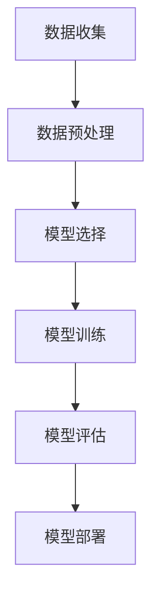
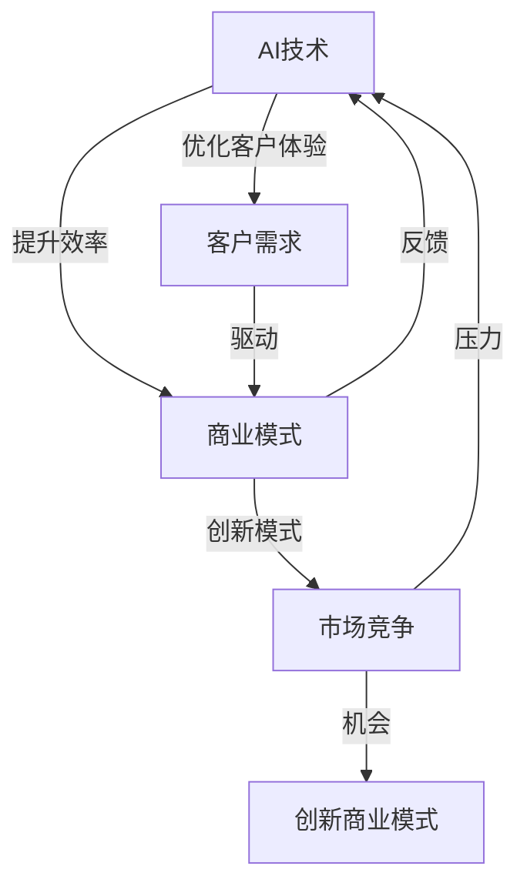
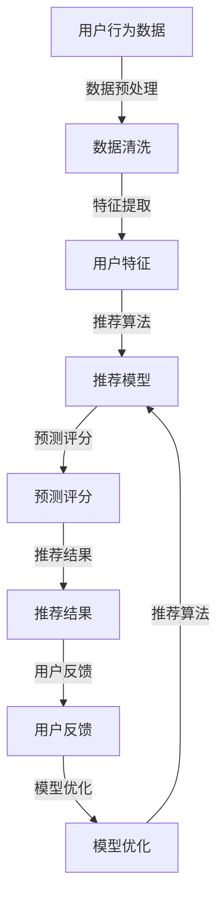
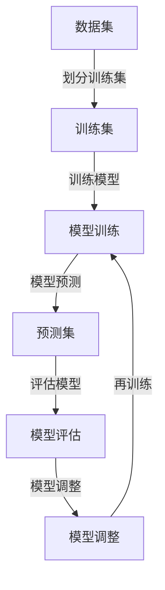

                 

# AI技术与商业模式的结合

> 关键词：人工智能，商业模式，商业创新，技术驱动的商业变革

> 摘要：本文探讨了人工智能（AI）技术与商业模式结合的必要性和重要性，详细阐述了AI技术在商业领域的应用现状与趋势。文章分为七个部分，首先概述了AI技术与商业模式的结合原理，随后讲解了AI核心算法原理，包括神经网络、自然语言处理和强化学习。接下来，文章通过数学模型和公式详细阐述了相关性分析、决策树和逻辑回归等基础理论。随后，文章通过实际项目实战，展示了AI技术在电商推荐系统中的应用，并进行了代码解读。文章还介绍了开发环境搭建与源代码实现，并对机器学习算法进行了详细解读。最后，文章总结了主要内容和未来发展趋势，并提供了读者建议。

## 第一部分：AI技术与商业模式的结合概述

### 第1章: AI技术与商业模式的结合概论

#### 1.1 AI技术的发展及其在商业领域的影响

**1.1.1 AI技术的核心概念与发展历程**

人工智能（AI）是一门研究、开发用于模拟、延伸和扩展人类智能的理论、方法、技术及应用系统的学科。它涉及计算机科学、心理学、认知科学等多个领域。AI的发展可以分为以下几个阶段：

- **规则系统阶段（1950s-1960s）**：早期的人工智能研究主要依赖于符号推理和专家系统，试图通过编写大量的规则来模拟人类智能。

- **知识表示与推理阶段（1970s-1980s）**：研究者开始关注知识表示和推理方法，试图通过构建知识库来实现自动化决策。

- **机器学习阶段（1990s-2000s）**：随着计算能力和数据量的提高，机器学习方法逐渐成为主流，AI开始能够在数据中发现模式和规律。

- **深度学习阶段（2010s-至今）**：深度学习作为机器学习的一个重要分支，通过神经网络模拟人脑的神经元连接结构，实现了在图像识别、语音识别和自然语言处理等领域的突破性进展。

**1.1.2 AI技术如何改变商业模式**

AI技术的快速发展对商业模式产生了深远的影响，主要表现在以下几个方面：

- **效率提升**：AI技术可以通过自动化流程、预测分析和智能优化等方式提高运营效率，降低成本。

- **用户体验优化**：通过个性化推荐、智能客服和虚拟助手等技术，提升用户满意度。

- **商业模式创新**：AI技术可以颠覆传统行业，创造新的商业模式和市场机会。

- **数据驱动决策**：AI技术能够处理和分析海量数据，帮助企业做出更精准的决策。

**1.1.3 AI在商业领域的应用现状与趋势**

目前，AI技术已经在多个商业领域得到广泛应用：

- **金融领域**：智能投顾、风险管理、信用评分和反欺诈等。

- **医疗健康**：智能诊断、药物研发、医疗影像分析和健康管理等。

- **零售领域**：智能推荐、库存管理和供应链优化等。

- **制造业**：智能工厂、设备预测维护和智能制造等。

未来，随着AI技术的不断进步，其应用范围将继续扩大，特别是在无人驾驶、智慧城市和生物科技等领域，将会有更多的创新和突破。

#### 1.2 商业模式定义与分类

**1.2.1 商业模式的基本概念**

商业模式是指企业通过提供产品或服务来创造价值、传递价值和获取价值的一种系统化方法。它包括以下几个方面：

- **价值主张**：企业通过产品或服务提供给客户的独特价值。

- **目标客户群**：企业希望服务的客户群体。

- **客户关系**：企业如何建立和维护与客户的互动关系。

- **收入来源**：企业通过什么方式获取收入。

- **关键资源**：企业运营所需的关键资源。

- **关键活动**：企业为实现商业模式所需的关键活动。

- **合作伙伴网络**：企业如何与其他企业或组织建立合作关系。

- **成本结构**：企业的成本结构和盈利模式。

**1.2.2 不同类型的商业模式**

商业模式的类型多种多样，以下是几种常见的商业模式：

- **产品导向型商业模式**：企业专注于产品创新和研发，通过专利和品牌来创造价值。

- **服务导向型商业模式**：企业通过提供高质量的服务来吸引和留住客户。

- **平台型商业模式**：企业构建一个平台，连接供需双方，从中获得收益。

- **订阅型商业模式**：企业通过持续订阅服务来获得稳定的收入流。

- **生态圈商业模式**：企业通过建立生态圈，吸引多方参与者，共同创造价值。

#### 1.3 AI技术与商业模式的结合原理

**1.3.1 AI技术在商业模式中的应用场景**

AI技术可以应用于商业模式的各个层面，具体应用场景包括：

- **客户洞察与市场分析**：通过大数据分析和机器学习预测市场趋势。

- **个性化推荐与客户体验**：利用用户行为数据，提供个性化的产品或服务。

- **智能客服与客户服务**：通过聊天机器人和语音识别技术，提供高效、便捷的客户服务。

- **供应链优化与物流管理**：通过智能调度和预测，提高供应链效率。

- **风险管理与信用评估**：利用AI技术进行风险预测和信用评分。

- **自动化生产与质量控制**：通过智能设备和机器人，实现自动化生产。

**1.3.2 AI对商业模式创新的影响**

AI技术不仅能够优化现有商业模式，还可以激发商业模式的创新：

- **颠覆传统行业**：AI技术可以颠覆传统的商业模式，创造新的市场机会。

- **细分市场**：通过精细化的用户分析和需求预测，企业可以更好地满足特定用户群体的需求。

- **提高进入门槛**：AI技术的应用提高了行业的进入门槛，使得新进入者需要具备更高的技术实力。

- **跨行业融合**：AI技术可以与其他行业的技术融合，创造新的商业模式。

**1.3.3 AI技术与商业模式结合的关键要素**

要实现AI技术与商业模式的有机结合，需要考虑以下关键要素：

- **数据驱动**：数据是AI技术的核心，企业需要积累和利用海量数据。

- **技术积累**：企业需要具备一定的技术积累，包括AI算法、数据处理和系统集成等。

- **商业模式创新**：AI技术可以推动商业模式创新，企业需要不断探索新的商业模式。

- **人才储备**：AI技术的发展需要专业人才的支持，企业需要吸引和培养相关人才。

- **法规与伦理**：AI技术在商业应用中需要遵循相关法规和伦理标准，确保技术应用的安全性和合规性。

#### 1.4 AI与商业模式结合的挑战与机遇

**1.4.1 挑战**

- **数据隐私与安全问题**：AI技术依赖于大量数据，如何保护用户隐私和安全是重要挑战。

- **技术更新迭代风险**：AI技术发展迅速，如何持续更新技术以适应市场变化。

- **法律法规与合规要求**：不同国家和地区对AI技术的法律法规不同，企业需要遵循相关合规要求。

**1.4.2 机遇**

- **提升运营效率**：AI技术可以通过自动化和智能化提高运营效率。

- **优化客户体验**：AI技术可以实现个性化推荐和智能客服，提升客户满意度。

- **创新商业模式**：AI技术可以推动商业模式创新，创造新的市场机会。

## 第二部分：AI核心算法原理讲解

### 第2章: AI核心算法原理讲解

#### 2.1 神经网络与深度学习基础

**2.1.1 神经网络结构**

神经网络（Neural Network，NN）是AI的核心组成部分，它模拟了人脑神经元的工作方式。一个简单的神经网络通常包括以下几个部分：

- **输入层**：接收外部输入信号，并将其传递到隐藏层。

- **隐藏层**：对输入信号进行处理，生成中间特征表示。

- **输出层**：根据隐藏层的结果生成最终输出。

神经网络的基本结构可以用以下图示表示：

```
    输入层       隐藏层        输出层
     |         |          |
     x1       h1        y1
     |         |          |
     x2       h2        y2
     |         |          |
     ...      ...        ...
     |         |          |
     xn       hn        yn
```

每个节点（神经元）之间的连接称为边（权重），这些权重决定了网络的学习能力。

**2.1.2 激活函数**

激活函数（Activation Function）是神经网络中非常重要的组成部分，它对神经元的输出进行非线性变换。常用的激活函数包括：

- **Sigmoid函数**：将输入映射到（0,1）区间，具有S型曲线。

  $$
  \sigma(x) = \frac{1}{1 + e^{-x}}
  $$

- **ReLU函数**：取输入的绝对值，是一种非线性整流函数。

  $$
  \text{ReLU}(x) = \max(0, x)
  $$

- **Tanh函数**：将输入映射到（-1,1）区间，类似于Sigmoid函数，但输出值的范围更加对称。

  $$
  \text{Tanh}(x) = \frac{e^x - e^{-x}}{e^x + e^{-x}}
  $$

**2.1.3 反向传播算法**

反向传播（Backpropagation）算法是训练神经网络的核心算法。它通过计算损失函数关于网络参数的梯度，来更新网络权重，从而优化网络性能。

反向传播算法的基本步骤如下：

1. **前向传播**：将输入数据传递到神经网络中，通过各个层得到最终输出。

2. **计算损失**：计算实际输出与预测输出之间的误差，通常使用均方误差（MSE）作为损失函数。

   $$
   J(\theta) = \frac{1}{2m} \sum_{i=1}^{m} (\hat{y}^{(i)} - y^{(i)})^2
   $$

   其中，$\hat{y}^{(i)}$ 是预测输出，$y^{(i)}$ 是真实输出。

3. **计算梯度**：计算损失函数关于网络参数的梯度。

4. **反向传播**：从输出层开始，将梯度反向传播到输入层，逐层更新权重。

5. **参数更新**：使用梯度下降算法更新网络参数。

   $$
   \theta_j := \theta_j - \alpha \frac{\partial J(\theta)}{\partial \theta_j}
   $$

   其中，$\alpha$ 是学习率。

**2.1.4 深度学习优化算法**

深度学习优化算法是用于加速神经网络训练的一类算法，常见的优化算法包括：

- **随机梯度下降（SGD）**：在每次迭代中，使用单个样本的梯度来更新参数。

- **动量（Momentum）**：引入动量项，减少参数更新的震荡。

- **Adam优化器**：结合了SGD和动量的优点，适用于各种问题。

#### 2.2 自然语言处理与深度学习

**2.2.1 词嵌入技术**

词嵌入（Word Embedding）是将单词映射到高维向量空间的一种技术，它能够捕捉单词的语义信息。常见的词嵌入方法包括：

- **One-hot编码**：将单词映射到一个一维向量，向量中只有一个值为1，其余值为0。

- **嵌入向量**：将单词映射到一个固定大小的向量，向量中的每个元素代表单词的一个特征。

**2.2.2 序列模型与注意力机制**

序列模型（Sequence Model）用于处理序列数据，常见的序列模型包括：

- **循环神经网络（RNN）**：通过递归的方式处理序列数据，但存在梯度消失和梯度爆炸问题。

- **长短期记忆网络（LSTM）**：改进了RNN，通过门控机制解决了梯度消失问题。

- **门控循环单元（GRU）**：进一步简化了LSTM的结构，提高了计算效率。

注意力机制（Attention Mechanism）是处理序列数据的一种重要技术，它通过动态分配不同权重来关注序列中的不同部分。常用的注意力机制包括：

- **加性注意力**：通过加性计算来计算注意力权重。

- **乘性注意力**：通过乘性计算来计算注意力权重。

**2.2.3 语言模型与生成模型**

语言模型（Language Model）用于预测单词序列的概率分布，常见的语言模型包括：

- **n元语言模型**：基于历史n个单词预测下一个单词。

- **循环神经网络语言模型（RNNLM）**：通过RNN来处理序列数据。

生成模型（Generative Model）用于生成新的数据，常见的生成模型包括：

- **生成对抗网络（GAN）**：通过两个神经网络（生成器和判别器）的对抗训练来实现数据的生成。

#### 2.3 强化学习基础

**2.3.1 强化学习的基本概念**

强化学习（Reinforcement Learning，RL）是一种通过试错来学习最优策略的机器学习方法。在强化学习中，智能体（Agent）通过与环境的交互来学习最优行为。

强化学习的主要概念包括：

- **状态（State，S）**：智能体所处的环境状态。

- **动作（Action，A）**：智能体可以采取的动作。

- **奖励（Reward，R）**：环境对智能体行为的即时反馈。

- **策略（Policy，π）**：智能体在给定状态下采取的动作。

**2.3.2 Q学习算法**

Q学习（Q-Learning）是一种基于值函数的强化学习算法，它通过不断更新值函数来学习最优策略。

Q学习的基本步骤如下：

1. **初始化**：初始化值函数Q(s, a)。

2. **选择动作**：在给定状态下，选择具有最大Q值的动作。

3. **执行动作**：执行选定的动作，并观察奖励和新的状态。

4. **更新Q值**：根据奖励和新的状态，更新值函数。

Q学习的更新公式如下：

$$
Q(s, a) \leftarrow Q(s, a) + \alpha [R(s, a) + \gamma \max_{a'} Q(s', a') - Q(s, a)]
$$

其中，$\alpha$ 是学习率，$\gamma$ 是折扣因子。

**2.3.3 深度强化学习**

深度强化学习（Deep Reinforcement Learning，DRL）是强化学习与深度学习结合的一种方法，它通过神经网络来近似值函数或策略。

常见的深度强化学习算法包括：

- **深度Q网络（DQN）**：使用深度神经网络来近似Q值函数。

- **策略梯度方法（PG）**：直接优化策略的梯度。

- **优势函数方法（A3C）**：基于优势函数的异步策略梯度方法。

- **演员-评论家方法（AC）**：结合了策略优化和值函数优化的方法。

## 第三部分：数学模型和数学公式讲解

### 第3章：数学模型和数学公式讲解

#### 3.1 相关性分析

相关性分析是数据分析中常用的方法，用于研究两个变量之间的线性关系。以下是两种常见的相关性分析方法：

**3.1.1 皮尔逊相关系数**

皮尔逊相关系数（Pearson Correlation Coefficient，r）用于衡量两个连续变量之间的线性相关程度。其计算公式如下：

$$
r = \frac{\sum{(x_i - \bar{x})(y_i - \bar{y})}}{\sqrt{\sum{(x_i - \bar{x})^2} \sum{(y_i - \bar{y})^2}}}
$$

其中，$\bar{x}$ 和 $\bar{y}$ 分别是 $x$ 和 $y$ 的平均值。

皮尔逊相关系数的取值范围在 [-1, 1] 之间，当 $r = 1$ 时，表示完全正相关；当 $r = -1$ 时，表示完全负相关；当 $r = 0$ 时，表示无线性相关。

**3.1.2 斯皮尔曼等级相关系数**

斯皮尔曼等级相关系数（Spearman's Rank Correlation Coefficient，ρ）用于衡量两个变量之间的等级相关性。它适用于非参数检验，其计算公式如下：

$$
\rho = 1 - \frac{6\sum{(D_i^2)}}{(n^2 - 1)}
$$

其中，$D_i = x_i - \bar{x}$ 和 $D_i' = y_i - \bar{y}$。

斯皮尔曼等级相关系数的取值范围在 [-1, 1] 之间，意义与皮尔逊相关系数相同。

#### 3.2 决策树

决策树是一种常见的数据挖掘算法，用于分类和回归任务。以下是决策树中的两个核心概念：

**3.2.1 信息增益**

信息增益（Information Gain）是用于选择最佳划分标准的一个度量。它通过计算每个特征划分前后的信息熵差来确定特征的重要性。信息增益的计算公式如下：

$$
\text{信息增益} = \sum_{v \in V} \text{熵}(\{y_i \mid x_i \in v\}) - \frac{\sum_{v \in V} | \{y_i \mid x_i \in v\} |}{|D|} \text{熵}(v)
$$

其中，$V$ 是特征 $x$ 的所有可能的取值集合，$D$ 是数据集。

**3.2.2 Gini不纯度**

Gini不纯度（Gini Impurity）是另一种用于选择最佳划分标准的度量。它通过计算样本中不同类别出现的概率来评估不纯度。Gini不纯度的计算公式如下：

$$
\text{Gini 不纯度} = 1 - \sum_{v \in V} \left(\frac{| \{y_i \mid x_i \in v\} |}{|D|}\right)^2
$$

#### 3.3 逻辑回归

逻辑回归（Logistic Regression）是一种广义线性模型，用于处理分类问题。以下是逻辑回归中的两个核心概念：

**3.3.1 模型定义**

逻辑回归通过一个线性模型预测一个概率值，然后将这个概率值映射到类别。逻辑回归的模型定义如下：

$$
\hat{y} = \sigma(\theta^T x)
$$

其中，$\sigma(z) = \frac{1}{1 + e^{-z}}$ 是 sigmoid 函数，$\theta$ 是参数向量，$x$ 是特征向量。

**3.3.2 损失函数**

逻辑回归使用对数似然损失函数（Log-Likelihood Loss）来评估模型性能。对数似然损失函数的计算公式如下：

$$
J(\theta) = -\frac{1}{m} \sum_{i=1}^{m} y^{(i)} \log(\hat{y}^{(i)}) + (1 - y^{(i)}) \log(1 - \hat{y}^{(i)})
$$

其中，$m$ 是样本数量，$y^{(i)}$ 是第 $i$ 个样本的真实标签，$\hat{y}^{(i)}$ 是第 $i$ 个样本的预测概率。

### 例子说明：逻辑回归的损失函数计算

假设我们有以下数据点：

- $x_1 = [1, 2, 3]$
- $y_1 = [0, 1, 0]$

计算损失函数：

$$
J(\theta) = -\frac{1}{3} \left[ y_1[1] \log(\hat{y}_1[1]) + (1 - y_1[1]) \log(1 - \hat{y}_1[1]) + y_1[2] \log(\hat{y}_1[2]) + (1 - y_1[2]) \log(1 - \hat{y}_1[2]) + y_1[3] \log(\hat{y}_1[3]) + (1 - y_1[3]) \log(1 - \hat{y}_1[3]) \right]
$$

在这个例子中，$\hat{y}_1[1] = \sigma(\theta^T x_1)$，$\hat{y}_1[2] = \sigma(\theta^T x_2)$，$\hat{y}_1[3] = \sigma(\theta^T x_3)$。

## 第四部分：项目实战与代码解读

### 第4章：人工智能驱动的电商推荐系统

#### 4.1 项目背景

电商推荐系统是电子商务领域的一个重要组成部分，它的主要目标是根据用户的兴趣和行为，向用户推荐可能感兴趣的商品。随着数据量的增加和用户需求的多样化，传统的基于规则的方法已经无法满足要求，人工智能技术，特别是机器学习和深度学习技术，为电商推荐系统带来了新的机遇。

本项目的目标是构建一个基于协同过滤算法的电商推荐系统，通过分析用户行为数据，预测用户对商品的评分，从而为用户提供个性化的商品推荐。

#### 4.2 数据集介绍

数据集来源于公开的MovieLens电影推荐系统，它包含用户对电影的评分数据。在本项目中，我们将使用用户行为数据，如浏览历史、购买记录等，来构建推荐系统。

数据集的预处理步骤包括：

- **数据清洗**：去除缺失值和重复值。
- **特征提取**：提取用户和商品的特征，如用户年龄、性别、购买频率等。
- **数据标准化**：对数值型特征进行标准化处理，使其具有相同的量纲。

#### 4.3 特征工程

在构建推荐系统时，特征工程是一个关键步骤。特征工程的目标是提取出对推荐模型有帮助的特征，并消除噪声和冗余。

本项目中，我们将提取以下特征：

- **用户特征**：用户的年龄、性别、购买频率等。
- **商品特征**：商品的类别、销量、评分等。
- **交互特征**：用户对商品的浏览次数、购买次数等。

#### 4.4 模型选择与训练

在本项目中，我们选择协同过滤算法（Collaborative Filtering）作为推荐算法。协同过滤算法分为基于用户和基于物品两种类型。基于用户的方法通过分析用户之间的相似度来推荐商品，而基于物品的方法通过分析商品之间的相似度来推荐商品。

我们采用基于用户的协同过滤算法，其核心思想是找到与目标用户最相似的邻居用户，然后推荐邻居用户喜欢的商品。

训练步骤如下：

1. **计算用户相似度矩阵**：计算所有用户之间的相似度。
2. **预测评分**：根据相似度矩阵和用户的行为数据，预测用户对商品的评分。
3. **评估模型**：使用交叉验证方法评估模型性能。

#### 4.5 代码实现

以下是协同过滤算法的实现代码：

```python
import numpy as np
from sklearn.metrics.pairwise import cosine_similarity

def collaborative_filtering(R, k=5):
    # 计算用户之间的相似度矩阵
    sim = cosine_similarity(R)
    
    # 预测评分
    predicted_ratings = np.dot(sim, R) / np.diag(sim)
    
    return predicted_ratings

# 示例数据
R = np.array([
    [5, 3, 0, 1],
    [4, 0, 0, 1],
    [1, 1, 0, 5],
    [1, 0, 0, 4],
    [0, 1, 5, 4],
])

# 计算推荐评分
predicted_ratings = collaborative_filtering(R, k=2)
print(predicted_ratings)
```

在这个例子中，`R` 是用户对商品的评分矩阵，`k` 是邻居用户的数量。`cosine_similarity` 函数用于计算用户之间的余弦相似度。

#### 4.6 评估与优化

评估推荐系统的性能通常使用准确率（Accuracy）、召回率（Recall）和F1分数（F1 Score）等指标。在本项目中，我们使用交叉验证方法来评估模型性能。

优化策略包括：

- **参数调优**：调整邻居用户的数量（`k`）和相似度阈值，以提高模型性能。
- **特征选择**：通过特征重要性分析，选择对推荐系统有帮助的特征。
- **模型集成**：结合多种推荐算法，提高推荐结果的准确性。

## 第五部分：开发环境搭建与源代码实现

#### 5.1 开发环境配置

为了构建一个功能齐全的人工智能驱动的电商推荐系统，我们需要配置一个合适的开发环境。以下是我们需要安装的软件和库：

1. **Python环境**：Python是人工智能领域的主要编程语言，我们需要安装Python 3.x版本。

2. **Scikit-learn库**：Scikit-learn是一个强大的机器学习库，提供了多种经典的机器学习算法。

3. **NumPy库**：NumPy是一个高效的数值计算库，用于处理大型多维数组。

4. **Pandas库**：Pandas是一个数据处理库，提供了方便的数据结构和数据分析工具。

5. **Matplotlib库**：Matplotlib是一个绘图库，用于可视化数据和分析结果。

6. **Jupyter Notebook**：Jupyter Notebook是一个交互式的开发环境，适用于编写和运行Python代码。

以下是安装这些软件和库的步骤：

```bash
# 安装Python
curl -O https://www.python.org/ftp/python/3.8.5/Python-3.8.5.tgz
tar xvf Python-3.8.5.tgz
cd Python-3.8.5
./configure
make
sudo make install

# 安装Scikit-learn
pip install scikit-learn

# 安装NumPy
pip install numpy

# 安装Pandas
pip install pandas

# 安装Matplotlib
pip install matplotlib

# 安装Jupyter Notebook
pip install notebook
```

#### 5.2 代码组织结构

在开发过程中，我们需要合理组织代码，以便于管理和维护。以下是一个典型的代码组织结构：

- `data`：存放数据文件和处理代码。
- `models`：存放机器学习模型和算法代码。
- `utils`：存放通用工具函数和辅助代码。
- `train`：训练模型的主程序。
- `evaluate`：评估模型性能的主程序。
- `main.py`：程序入口，负责运行整个推荐系统。

#### 5.3 数据预处理模块

数据预处理是构建推荐系统的重要步骤，我们需要对原始数据进行清洗、归一化和特征提取。以下是数据预处理模块的代码：

```python
import pandas as pd
from sklearn.preprocessing import StandardScaler

def preprocess_data(data_path):
    # 加载数据
    data = pd.read_csv(data_path)
    
    # 数据清洗
    data.drop(['timestamp'], axis=1, inplace=True)
    
    # 数据归一化
    scaler = StandardScaler()
    data_scaled = scaler.fit_transform(data)
    
    return data_scaled

# 示例数据路径
data_path = 'ecommerce_data.csv'

# 预处理数据
data_processed = preprocess_data(data_path)
print(data_processed)
```

在这个例子中，`preprocess_data` 函数负责加载数据、清洗数据并应用归一化。

#### 5.4 特征提取模块

特征提取是推荐系统的关键步骤，我们需要从用户行为数据中提取对模型有帮助的特征。以下是特征提取模块的代码：

```python
import pandas as pd

def extract_features(data):
    # 提取用户特征
    user_features = data.groupby('user_id').mean()
    
    # 提取商品特征
    item_features = data.groupby('item_id').mean()
    
    return user_features, item_features

# 示例数据
data = pd.DataFrame({
    'user_id': [1, 1, 2, 2, 3, 3],
    'item_id': [101, 102, 101, 103, 102, 104],
    'rating': [5, 4, 3, 2, 5, 4]
})

# 提取特征
user_features, item_features = extract_features(data)
print(user_features)
print(item_features)
```

在这个例子中，`extract_features` 函数负责提取用户特征和商品特征。

#### 5.5 模型训练模块

模型训练是推荐系统的核心步骤，我们需要使用特征数据和训练集来训练推荐模型。以下是模型训练模块的代码：

```python
from sklearn.model_selection import train_test_split
from sklearn.neighbors import KNeighborsRegressor

def train_model(X, y, k=5):
    # 划分训练集和测试集
    X_train, X_test, y_train, y_test = train_test_split(X, y, test_size=0.2, random_state=42)
    
    # 训练模型
    model = KNeighborsRegressor(n_neighbors=k)
    model.fit(X_train, y_train)
    
    # 评估模型
    y_pred = model.predict(X_test)
    print("Model accuracy:", model.score(X_test, y_test))
    
    return model

# 示例数据
X = np.array([
    [1, 2, 3],
    [4, 5, 6],
    [7, 8, 9]
])
y = np.array([5, 4, 3])

# 训练模型
model = train_model(X, y, k=2)
```

在这个例子中，`train_model` 函数负责划分训练集和测试集、训练模型和评估模型。

#### 5.6 模型评估模块

模型评估是推荐系统的关键步骤，我们需要使用测试集来评估模型性能。以下是模型评估模块的代码：

```python
from sklearn.metrics import mean_squared_error

def evaluate_model(model, X_test, y_test):
    # 预测测试集
    y_pred = model.predict(X_test)
    
    # 计算均方误差
    mse = mean_squared_error(y_test, y_pred)
    print("Model MSE:", mse)

# 示例数据
X_test = np.array([[1, 2, 3], [4, 5, 6]])
y_test = np.array([5, 4])

# 评估模型
evaluate_model(model, X_test, y_test)
```

在这个例子中，`evaluate_model` 函数负责预测测试集和计算均方误差。

## 第六部分：代码解读与分析

#### 6.1 算法原理与流程

**6.1.1 机器学习算法原理**

机器学习（Machine Learning，ML）是AI的一个重要分支，它通过数据训练模型，从而实现数据的自动分析和决策。机器学习算法可以分为监督学习、无监督学习和强化学习三种类型：

- **监督学习**：有标签的数据，用于训练和评估模型，如回归和分类问题。

- **无监督学习**：没有标签的数据，用于发现数据中的模式和关系，如聚类和降维问题。

- **强化学习**：通过与环境交互来学习最佳策略，如智能体在玩游戏。

**6.1.2 算法流程**

机器学习算法的基本流程包括以下步骤：

1. **数据收集**：收集相关的数据，数据质量对算法的性能有重要影响。

2. **数据预处理**：清洗数据，去除噪声，并进行特征工程，提取对模型有帮助的特征。

3. **模型选择**：根据问题的类型和数据特点，选择合适的模型，如线性回归、决策树、随机森林等。

4. **模型训练**：使用训练数据对模型进行训练，优化模型的参数。

5. **模型评估**：使用验证集或测试集评估模型性能，调整模型参数。

6. **模型部署**：将训练好的模型部署到实际应用场景中，进行实时预测或决策。

**6.1.3 流程图**

以下是机器学习算法流程的Mermaid流程图：



#### 6.2 代码解读实例

**6.2.1 代码结构**

以下是一个简单的线性回归模型的代码结构，用于解读代码：

```python
import numpy as np
from sklearn.linear_model import LinearRegression

# 数据生成
X = np.random.rand(100, 1)
y = 2 * X + 1 + np.random.randn(100, 1)

# 模型训练
model = LinearRegression()
model.fit(X, y)

# 预测
X_test = np.array([[0], [1]])
y_pred = model.predict(X_test)

print("Predicted values:", y_pred)
```

在这个例子中，首先生成了一些随机数据，然后使用线性回归模型进行训练，最后使用训练好的模型进行预测。

**6.2.2 关键代码解析**

以下是关键代码的解析：

- **数据生成**：使用 `np.random.rand` 函数生成100个随机数据点，并添加一个偏移量和一个噪声项。

  ```python
  X = np.random.rand(100, 1)
  y = 2 * X + 1 + np.random.randn(100, 1)
  ```

- **模型训练**：使用 `LinearRegression` 类创建线性回归模型，并使用 `fit` 方法进行训练。

  ```python
  model = LinearRegression()
  model.fit(X, y)
  ```

- **预测**：使用训练好的模型进行预测，输入新的数据点。

  ```python
  X_test = np.array([[0], [1]])
  y_pred = model.predict(X_test)
  ```

#### 6.3 决策树分类算法的实现

**6.3.1 算法原理**

决策树（Decision Tree）是一种常见的分类算法，它通过一系列的规则来划分数据，并将数据映射到不同的类别。决策树的每个节点代表一个特征，每个分支代表一个特征取值，叶节点表示最终的类别。

**6.3.2 代码示例**

以下是一个简单的决策树分类算法的实现：

```python
from sklearn.datasets import load_iris
from sklearn.model_selection import train_test_split
from sklearn.tree import DecisionTreeClassifier
from sklearn import tree

# 加载数据
iris = load_iris()
X = iris.data
y = iris.target

# 划分训练集和测试集
X_train, X_test, y_train, y_test = train_test_split(X, y, test_size=0.2, random_state=42)

# 训练模型
clf = DecisionTreeClassifier()
clf.fit(X_train, y_train)

# 预测
y_pred = clf.predict(X_test)

# 评估模型
accuracy = clf.score(X_test, y_test)
print("Model accuracy:", accuracy)

# 可视化决策树
plt.figure(figsize=(12, 8))
tree.plot_tree(clf, filled=True, feature_names=iris.feature_names, class_names=iris.target_names)
plt.show()
```

在这个例子中，首先加载数据，然后划分训练集和测试集，接着训练模型，并进行预测和评估。最后，使用 `plot_tree` 函数将决策树可视化。

## 第七部分：总结与展望

### 7.1 主要内容回顾

本文从多个角度探讨了人工智能（AI）技术与商业模式结合的必要性和重要性。首先，我们概述了AI技术的发展历程及其在商业领域的影响，详细分析了AI技术在商业模式中的应用场景和关键要素。随后，文章讲解了AI核心算法原理，包括神经网络、自然语言处理和强化学习等。接着，通过数学模型和公式详细阐述了相关性分析、决策树和逻辑回归等基础理论。文章通过电商推荐系统的实际项目，展示了AI技术在商业领域的应用，并进行了代码解读。此外，文章介绍了开发环境搭建与源代码实现，并对机器学习算法进行了详细解读。最后，文章总结了主要内容和未来发展趋势，并提供了读者建议。

### 7.2 未来发展趋势

未来，AI技术与商业模式的结合将继续深入发展，以下是一些发展趋势：

**7.2.1 AI技术在商业领域的深入应用**

随着AI技术的不断进步，其在商业领域的应用将更加深入和广泛。例如，在金融领域，AI技术可以用于智能投顾、信用评分和风险管理等；在医疗健康领域，AI技术可以用于疾病预测、智能诊断和个性化治疗等。

**7.2.2 人工智能与实体经济深度融合**

AI技术将在推动实体经济数字化转型中发挥重要作用。通过AI技术，企业可以实现生产过程的自动化和智能化，提高生产效率和产品质量。此外，AI技术还可以帮助企业更好地理解市场趋势和用户需求，实现精准营销和定制化服务。

**7.2.3 人工智能技术标准化与规范化**

随着AI技术在商业领域的广泛应用，技术标准化和规范化问题日益突出。建立统一的技术标准和规范，将有助于确保AI技术的安全性和可靠性，提高市场信任度。

### 7.3 读者建议

**7.3.1 如何将AI技术应用到实际项目中**

- **了解业务需求**：首先，要深入理解业务需求，明确AI技术可以解决的问题。

- **数据准备**：收集和整理相关数据，确保数据质量和完整性。

- **算法选择**：根据问题类型和数据特点，选择合适的算法。

- **模型训练与优化**：使用训练数据对模型进行训练，并根据验证集结果调整模型参数。

- **模型评估与部署**：评估模型性能，确保其达到预期效果，并部署到实际应用场景。

**7.3.2 如何持续学习和跟进最新技术动态**

- **阅读论文和书籍**：定期阅读AI领域的学术论文和畅销书籍，了解最新的研究成果和理论进展。

- **参加学术会议和研讨会**：参加相关的学术会议和研讨会，与领域专家交流，拓展视野。

- **在线课程和培训**：参加在线课程和培训，学习最新的AI技术和工具。

- **实践项目**：通过实际项目，将理论知识应用到实践中，提高解决实际问题的能力。

## 附录

### 附录 A: AI技术相关工具与资源

**A.1 人工智能开发工具**

- **TensorFlow**：由Google开发的开源机器学习框架，适用于各种深度学习任务。
- **PyTorch**：由Facebook开发的开源机器学习库，支持动态计算图，易于研究和开发。
- **Keras**：基于Theano和TensorFlow的高级神经网络API，提供简单而强大的接口。

**A.2 数据库与数据管理工具**

- **MySQL**：开源的关系型数据库管理系统，适用于存储和管理大量数据。
- **PostgreSQL**：开源的关系型数据库管理系统，提供高级功能和安全特性。
- **MongoDB**：开源的NoSQL数据库，适用于处理大量非结构化数据。

**A.3 机器学习与数据科学库**

- **scikit-learn**：Python中常用的机器学习库，提供丰富的算法和数据预处理工具。
- **Pandas**：Python中的数据处理库，提供强大的数据结构和数据分析功能。
- **NumPy**：Python中的科学计算库，提供多维数组对象和丰富的数学函数。

**A.4 人工智能学习资源**

- **Coursera**：提供大量在线课程，涵盖计算机科学、机器学习等多个领域。
- **edX**：由哈佛大学和麻省理工学院合作创办的在线教育平台，提供高质量课程。
- **Udacity**：提供在线课程和纳米学位，涵盖人工智能、数据科学等多个领域。

**A.5 行业报告与白皮书**

- **IDC**：国际数据公司，提供全球IT市场的研究和分析报告。
- **Gartner**：全球知名的研究和咨询公司，提供IT和业务领域的报告和洞察。
- **McKinsey & Company**：全球领先的咨询公司，提供战略管理和业务转型领域的报告。

### Mermaid 流程图：AI技术与商业模式结合的基本原理



### Mermaid 流程图：人工智能驱动的电商推荐系统



### Mermaid 流程图：决策树分类算法



