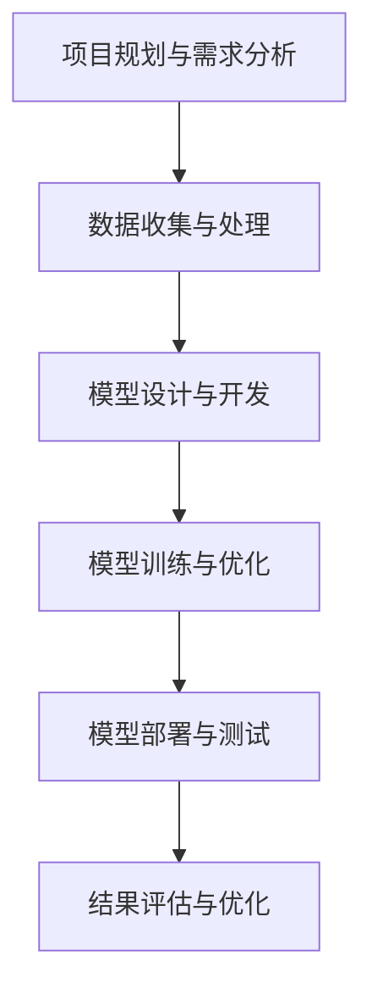

                 

### 《AI技术在企业中的发展》

> 关键词：人工智能、企业应用、机器学习、深度学习、供应链管理、数据分析、市场营销、实施策略、挑战与应对

> 摘要：本文详细探讨了AI技术在企业中的发展，涵盖了从核心概念到实际应用的各个方面。文章首先介绍了AI技术的发展历程和背景，然后深入讲解了AI的核心概念与原理，包括机器学习、深度学习和自然语言处理。接着，文章阐述了AI在数据分析、供应链管理和市场营销等领域的应用，并分享了实战案例。随后，文章探讨了AI技术在企业中的实施策略与挑战，最后提供了相关的资源和建议。

---

### 目录

- **第一部分：AI技术基础**
  - **第1章：AI技术在企业中的背景与重要性**
    - 1.1 AI技术概述
      - 1.1.1 AI技术的发展历程
      - 1.1.2 AI技术在企业中的应用潜力
    - 1.2 企业AI需求分析
      - 1.2.1 企业AI应用场景分类
      - 1.2.2 企业AI需求分析框架
  - **第2章：AI核心概念与原理**
    - 2.1 机器学习基础
      - 2.1.1 数据集准备与处理
      - 2.1.2 常见算法模型介绍
    - 2.2 深度学习基础
      - 2.2.1 神经网络结构与原理
      - 2.2.2 深度学习框架介绍
    - 2.3 自然语言处理基础
      - 2.3.1 语言模型与文本分类
      - 2.3.2 基于深度学习的NLP模型

- **第二部分：AI技术在企业中的应用**
  - **第3章：AI在数据分析中的应用**
    - 3.1 数据分析中的AI应用
    - 3.2 实战案例：企业数据分析项目
      - 3.2.1 数据分析项目流程
      - 3.2.2 代码实战与解读
  - **第4章：AI在供应链管理中的应用**
    - 4.1 供应链管理中的AI应用
    - 4.2 实战案例：企业供应链优化项目
      - 4.2.1 供应链优化项目流程
      - 4.2.2 代码实战与解读
  - **第5章：AI在市场营销中的应用**
    - 5.1 市场营销中的AI应用
    - 5.2 实战案例：企业市场营销项目
      - 5.2.1 市场营销项目流程
      - 5.2.2 代码实战与解读

- **第三部分：AI技术在企业中的实施与挑战**
  - **第6章：AI技术在企业中的实施策略**
    - 6.1 AI技术选型与架构设计
    - 6.2 AI技术在企业中的实施流程
    - 6.3 实战案例：企业AI技术实施项目
  - **第7章：AI技术在企业中的挑战与应对**
    - 7.1 数据隐私与安全挑战
    - 7.2 技术人才与管理挑战
    - 7.3 实战案例：企业AI技术挑战与应对

- **附录**
  - **附录A：AI技术在企业中的应用资源**
    - **A.1 开源框架与工具**
    - **A.2 学术论文与资料**
    - **A.3 实战案例与教程**

---

接下来，我们将详细讨论每个章节的内容，逐步揭示AI技术在企业中的发展全景。让我们开始思考与探索！
## 第一部分：AI技术基础

### 第1章：AI技术在企业中的背景与重要性

在当今快速发展的技术环境中，人工智能（AI）已经成为企业创新和竞争力提升的关键驱动力。AI技术的应用不仅改变了传统产业的运营模式，还为新兴行业提供了无限的创新空间。本章节将首先概述AI技术的发展历程和应用潜力，然后分析企业对AI技术的需求，并介绍AI在各个领域的应用场景和需求分析框架。

### 1.1 AI技术概述

#### 1.1.1 AI技术的发展历程

人工智能作为计算机科学的一个重要分支，起源于20世纪50年代。早期的人工智能研究主要集中在符号推理和知识表示方面，这一时期的AI被称为“弱AI”或“狭义AI”。随着计算能力的提升和算法的进步，特别是深度学习和强化学习的发展，AI技术进入了一个新的时代，被称为“强AI”或“广义AI”。

- **1956年**：达特茅斯会议提出了人工智能的概念。
- **1970年代**：专家系统成为AI的主流应用，但受限于数据规模和计算能力。
- **1980年代**：机器学习和模式识别开始受到关注。
- **1990年代**：互联网的兴起促进了数据量和计算资源的快速增长。
- **2006年**：深度学习的崛起，特别是AlexNet在图像识别上的突破。
- **2012年**：AlphaGo战胜围棋世界冠军，标志着强化学习的重大进展。

#### 1.1.2 AI技术在企业中的应用潜力

AI技术在企业中的应用潜力是巨大的。通过机器学习、深度学习和自然语言处理等AI技术，企业可以实现以下目标：

- **提高生产效率**：通过预测分析和自动化流程，减少人为错误和时间消耗。
- **优化决策**：利用大数据和AI算法，为企业提供更为精准的决策支持。
- **提升用户体验**：通过个性化推荐和智能客服，提高客户满意度和忠诚度。
- **创新业务模式**：AI技术可以颠覆传统产业，创造全新的商业模式和生态系统。

### 1.2 企业AI需求分析

企业对AI技术的需求可以根据应用场景和业务目标进行分类。以下是一个简单的AI需求分析框架：

#### 1.2.1 企业AI应用场景分类

- **数据分析与预测**：利用AI技术进行数据挖掘、预测分析和优化。
- **自动化与优化**：通过机器学习和深度学习实现自动化流程和优化决策。
- **智能客服与推荐系统**：基于自然语言处理和机器学习，提供个性化服务和推荐。
- **图像识别与生物识别**：应用于安防、医疗、金融等领域。
- **智能交通与无人驾驶**：应用于交通管理、物流和自动驾驶领域。

#### 1.2.2 企业AI需求分析框架

1. **确定业务目标**：明确企业通过AI技术希望实现的业务目标。
2. **数据收集与处理**：收集并处理相关数据，确保数据质量和完整性。
3. **技术选型与模型设计**：根据业务需求和数据特点，选择合适的AI技术和模型。
4. **模型训练与优化**：使用历史数据训练模型，并通过交叉验证和超参数调整优化模型。
5. **部署与监控**：将训练好的模型部署到生产环境中，并进行实时监控和调整。

### 总结

AI技术在企业中的应用正在迅速发展，其潜力不可忽视。企业需要根据自身的业务需求和数据特点，制定合理的AI需求分析框架，并选择合适的技术和模型。通过有效的AI技术应用，企业可以实现生产效率的提升、决策优化的目标，并在激烈的市场竞争中保持领先地位。

在接下来的章节中，我们将深入探讨AI的核心概念与原理，进一步了解机器学习、深度学习和自然语言处理的基本知识。让我们继续前行，探索AI技术的无限可能！
### 第2章：AI核心概念与原理

#### 2.1 机器学习基础

机器学习是人工智能（AI）的一个核心分支，其目标是让计算机通过数据学习并做出决策。本节将介绍机器学习的基本概念、数据集准备与处理方法，以及常见的算法模型。

##### 2.1.1 数据集准备与处理

在机器学习中，数据是训练模型的关键。一个高质量的数据集对于模型性能至关重要。以下是数据集准备和处理的主要步骤：

1. **数据收集**：收集与目标应用相关的数据。数据可以来源于企业内部数据库、公共数据集或第三方数据提供商。
2. **数据清洗**：处理缺失值、异常值和重复数据。缺失值可以通过填充或删除的方式处理，异常值需要根据具体情况决定是否保留，重复数据则需要去重。
3. **数据转换**：将数据转换为适合模型训练的格式。对于分类问题，需要将标签转换为数值；对于回归问题，需要将数值数据进行标准化或归一化处理。
4. **数据分割**：将数据集分为训练集、验证集和测试集。通常，训练集用于模型训练，验证集用于模型调优，测试集用于模型评估。

##### 2.1.2 常见算法模型介绍

在机器学习中，有多种算法模型可供选择。以下是几种常见的算法模型：

1. **线性回归**：用于预测连续值。其基本模型为：
   $$
   y = \beta_0 + \beta_1x_1 + \beta_2x_2 + ... + \beta_nx_n
   $$
   其中，$y$为因变量，$x_1, x_2, ..., x_n$为自变量，$\beta_0, \beta_1, ..., \beta_n$为模型参数。

2. **逻辑回归**：用于分类问题。其基本模型为：
   $$
   P(y=1) = \frac{1}{1 + e^{-(\beta_0 + \beta_1x_1 + \beta_2x_2 + ... + \beta_nx_n)}}
   $$
   其中，$P(y=1)$为因变量为1的概率。

3. **支持向量机（SVM）**：用于分类问题。其基本模型为：
   $$
   w \cdot x + b = 0
   $$
   其中，$w$为权重向量，$x$为特征向量，$b$为偏置。

4. **决策树**：用于分类和回归问题。其基本结构为一系列判断节点和叶子节点，每个节点代表一个特征和阈值。

5. **随机森林**：是决策树的集成方法。通过构建多棵决策树，并对预测结果进行投票或平均，提高模型的泛化能力。

6. **神经网络**：是一种模拟人脑神经元连接结构的计算模型。其基本结构包括输入层、隐藏层和输出层，通过前向传播和反向传播算法进行训练。

#### 2.2 深度学习基础

深度学习是机器学习的另一个重要分支，其核心思想是通过多层神经网络来提取数据中的特征。以下介绍深度学习的基本概念和常用框架。

##### 2.2.1 神经网络结构与原理

神经网络（Neural Network）是一种由大量神经元（Node）组成的计算模型。每个神经元都连接到其他神经元，并通过权重（Weight）和偏置（Bias）进行加权求和。神经网络的训练过程主要包括以下几个步骤：

1. **前向传播**：将输入数据通过网络传递到输出层，计算每个神经元的激活值。
2. **损失函数**：计算预测值和真实值之间的差异，常用的损失函数有均方误差（MSE）和交叉熵（Cross-Entropy）。
3. **反向传播**：根据损失函数计算每个权重和偏置的梯度，并更新权重和偏置。
4. **优化算法**：使用梯度下降（Gradient Descent）或其他优化算法更新模型参数。

##### 2.2.2 深度学习框架介绍

深度学习框架是用于构建和训练深度学习模型的工具。以下是一些常用的深度学习框架：

1. **TensorFlow**：由Google开发，是一个开源的深度学习框架，支持多种神经网络架构和优化算法。
2. **PyTorch**：由Facebook开发，是一个开源的深度学习框架，以动态计算图著称，易于调试和优化。
3. **Keras**：是一个基于TensorFlow和Theano的高层次神经网络API，提供了更简洁的模型构建和训练接口。

#### 2.3 自然语言处理基础

自然语言处理（NLP）是AI领域的一个重要分支，旨在使计算机理解和处理自然语言。以下介绍NLP的基本概念和常用方法。

##### 2.3.1 语言模型与文本分类

语言模型用于预测一段文本的概率分布。常见的语言模型有N元语言模型和神经网络语言模型。文本分类是将文本分配到不同的类别中，常用的算法有朴素贝叶斯、支持向量机和神经网络。

##### 2.3.2 基于深度学习的NLP模型

基于深度学习的NLP模型在文本分类、情感分析和机器翻译等领域取得了显著的成果。以下是一些常用的深度学习NLP模型：

1. **循环神经网络（RNN）**：可以处理序列数据，适用于文本分类和序列标注任务。
2. **长短期记忆网络（LSTM）**：是RNN的一种改进，可以更好地记忆长期依赖信息。
3. **变换器（Transformer）**：是一种基于自注意力机制的模型，广泛应用于机器翻译、文本分类和问答系统。

### 总结

机器学习、深度学习和自然语言处理是AI技术的核心组成部分，各自具有独特的原理和应用场景。通过理解这些核心概念和原理，企业可以更好地选择和应用AI技术，提升业务效率和竞争力。在接下来的章节中，我们将进一步探讨AI技术在企业中的具体应用，并通过实战案例展示其应用效果。

### 伪代码示例

以下是一个简单的线性回归模型的伪代码，用于预测销售额：

```
# 导入相关库
import numpy as np

# 加载数据
data = np.load('sales_data.npy')

# 分离特征和标签
X = data[:, :-1]
y = data[:, -1]

# 初始化模型参数
W = np.random.randn(X.shape[1], 1)
b = np.random.randn(1)

# 训练模型
for i in range(iterations):
    # 前向传播
    z = np.dot(X, W) + b
    a = sigmoid(z)

    # 计算损失
    loss = np.mean((a - y) ** 2)

    # 反向传播
    dz = a - y
    dW = np.dot(X.T, dz)
    db = np.sum(dz)

    # 更新参数
    W -= learning_rate * dW
    b -= learning_rate * db

# 模型预测
predictions = sigmoid(np.dot(X, W) + b)

# 输出结果
print(predictions)
```

在这个伪代码中，我们首先导入相关库，并加载数据。然后，我们初始化模型参数，并通过前向传播和反向传播算法进行模型训练。最后，我们使用训练好的模型进行预测，并输出预测结果。

### Mermaid 流程图示例

以下是一个简单的机器学习项目流程的Mermaid流程图：



在这个流程图中，我们首先进行项目规划与需求分析，然后收集和处理数据，接着设计模型并进行训练和优化。最后，我们将模型部署到生产环境中，并进行测试和优化，以确保模型达到预期的效果。

### 数学模型和数学公式示例

以下是一个简单的线性回归模型的数学模型和数学公式：

#### 前向传播过程

$$
z = W \times x + b
$$

$$
a = \sigma(z)
$$

其中，$z$是输入层和隐藏层之间的加权求和结果，$a$是隐藏层的激活值，$W$是权重矩阵，$b$是偏置项，$\sigma$是激活函数（通常使用Sigmoid函数）。

#### 反向传播过程

$$
\delta = (a - y) \times \sigma'(z)
$$

$$
\frac{\partial C}{\partial W} = X^T \times \delta
$$

$$
\frac{\partial C}{\partial b} = \delta
$$

其中，$C$是损失函数，$y$是真实标签，$\delta$是隐藏层的误差，$\sigma'$是激活函数的导数。

通过以上数学模型和公式，我们可以理解线性回归模型的基本原理，包括前向传播和反向传播的过程。这些公式对于模型设计和实现至关重要。

### 项目实战

#### 3.1 数据分析中的AI应用

数据分析是企业决策过程中不可或缺的一部分，而AI技术的引入使得数据分析变得更加高效和智能化。本节将探讨AI在数据分析中的应用，包括数据预处理与特征工程、基于AI的预测分析等。

##### 3.1.1 数据预处理与特征工程

数据预处理是数据分析中至关重要的一步。其目的是清洗数据、填充缺失值、处理异常值和归一化数据。以下是一些常见的数据预处理步骤：

1. **数据清洗**：删除重复数据、处理缺失值和异常值。缺失值可以通过填充、插值或删除的方式处理，异常值则需要根据具体情况进行分析和处理。
2. **数据转换**：将数据转换为适合模型训练的格式。对于分类问题，需要将标签转换为数值；对于回归问题，需要将数值数据进行标准化或归一化处理。
3. **数据分割**：将数据集分为训练集、验证集和测试集。通常，训练集用于模型训练，验证集用于模型调优，测试集用于模型评估。

特征工程是另一个重要的步骤，其目的是从原始数据中提取有用的特征，以提高模型的性能。以下是一些常见的特征工程方法：

1. **特征选择**：通过筛选和选择重要的特征，减少数据的冗余和噪声，提高模型的泛化能力。
2. **特征变换**：对原始特征进行变换，如归一化、标准化、对数变换等，以减少特征之间的差异和依赖。
3. **特征组合**：将多个原始特征组合成新的特征，以增加数据的维度和信息的丰富性。

##### 3.1.2 基于AI的预测分析

基于AI的预测分析是数据分析中的重要应用之一。通过机器学习和深度学习算法，可以从历史数据中提取有用的模式，并对未来的趋势进行预测。以下是一些常见的预测分析方法：

1. **时间序列预测**：时间序列预测是一种基于时间序列数据的预测方法。常见的模型有ARIMA、LSTM等。时间序列预测可以应用于销售预测、库存管理等领域。
2. **回归预测**：回归预测是一种基于回归模型的预测方法，可以预测连续的数值。常见的模型有线性回归、决策树回归、随机森林回归等。回归预测可以应用于成本预测、价格预测等领域。
3. **分类预测**：分类预测是一种基于分类模型的预测方法，可以预测离散的类别。常见的模型有逻辑回归、支持向量机、神经网络等。分类预测可以应用于客户流失预测、欺诈检测等领域。

#### 3.2 实战案例：企业数据分析项目

为了更好地理解AI在数据分析中的应用，以下我们将介绍一个实际的企业数据分析项目案例。

##### 3.2.1 数据分析项目流程

1. **需求分析**：明确数据分析的目标和需求，如销售预测、客户流失预测等。
2. **数据收集**：收集相关的历史数据，包括销售数据、客户数据、市场数据等。
3. **数据预处理**：对数据进行清洗、转换和分割，确保数据质量和完整性。
4. **特征工程**：从原始数据中提取有用的特征，进行特征选择和变换。
5. **模型选择**：根据数据分析的目标和特征，选择合适的机器学习和深度学习模型。
6. **模型训练与优化**：使用历史数据训练模型，并通过交叉验证和超参数调整优化模型。
7. **模型评估**：使用验证集和测试集评估模型性能，选择最优模型。
8. **模型部署**：将训练好的模型部署到生产环境中，进行实时预测和决策。
9. **结果评估与优化**：对模型效果进行评估，根据业务需求进行持续优化。

##### 3.2.2 代码实战与解读

以下是一个简单的线性回归模型实现，用于预测销售额。我们使用Python和Scikit-learn库进行实现。

```python
import numpy as np
from sklearn.linear_model import LinearRegression

# 加载数据
data = np.load('sales_data.npy')

# 分离特征和标签
X = data[:, :-1]
y = data[:, -1]

# 创建线性回归模型
model = LinearRegression()

# 训练模型
model.fit(X, y)

# 模型预测
predictions = model.predict(X)

# 输出结果
print(predictions)
```

在这个代码中，我们首先导入相关库，并加载数据。然后，我们分离特征和标签，并创建线性回归模型。接下来，我们使用训练集数据进行模型训练，并使用测试集数据进行预测。最后，我们输出预测结果。

代码解读：

- 导入相关库，包括numpy和scikit-learn。
- 加载数据，并将数据分离为特征X和标签y。
- 创建线性回归模型，并使用训练集数据进行模型训练。
- 使用训练好的模型进行预测，并输出预测结果。

通过这个简单的实战案例，我们可以看到如何使用AI技术进行数据分析，并预测未来的销售趋势。这有助于企业更好地进行决策和规划，提高业务效率和竞争力。

### 总结

AI技术在数据分析中的应用极大地提升了数据分析的效率和准确性。通过数据预处理、特征工程和预测分析，企业可以更好地理解数据，提取有价值的信息，并做出更为精准的决策。在接下来的章节中，我们将进一步探讨AI技术在供应链管理和市场营销中的应用，继续探索AI技术在企业中的无限可能。
## 第4章：AI在供应链管理中的应用

供应链管理是企业运营的重要组成部分，其效率和质量直接影响企业的成本和竞争力。随着AI技术的不断发展，AI在供应链管理中的应用变得越来越广泛，可以显著提升供应链的效率、透明度和灵活性。本节将详细介绍AI在供应链管理中的应用，包括供应链网络优化、库存管理与需求预测等方面。

### 4.1 供应链管理中的AI应用

#### 4.1.1 供应链网络优化

供应链网络优化是AI在供应链管理中的一个关键应用。通过AI算法，企业可以优化供应链网络的布局，降低物流成本，提高供应链的响应速度。以下是供应链网络优化的一些关键技术：

1. **运输路径优化**：使用AI算法优化运输路径，减少运输时间和成本。例如，使用遗传算法或蚁群算法来确定最优路径。
2. **设施布局优化**：通过模拟和优化算法，确定最优的工厂、仓库和配送中心的布局，提高供应链的整体效率。
3. **库存分配优化**：根据需求和供应的动态变化，使用AI算法优化库存分配，确保各环节的库存水平保持在最佳状态。

#### 4.1.2 库存管理与需求预测

库存管理是供应链管理中的重要环节，直接影响企业的成本和资金周转。AI技术可以通过以下方式提升库存管理的效率：

1. **需求预测**：使用AI算法分析历史销售数据、市场趋势和季节性因素，准确预测未来的需求，从而优化库存水平。
2. **库存优化**：通过AI算法实时监控库存水平，自动调整库存策略，避免过度库存或缺货现象。
3. **库存可视化**：利用AI技术构建库存可视化系统，帮助企业更好地了解库存状态，提高库存管理的透明度和效率。

### 4.2 实战案例：企业供应链优化项目

为了更具体地展示AI在供应链管理中的应用，以下我们将介绍一个实际的企业供应链优化项目案例。

#### 4.2.1 供应链优化项目流程

1. **项目规划与需求分析**：明确项目目标、需求和预期成果，如优化运输路径、提高库存管理水平等。
2. **数据收集与处理**：收集与供应链相关的数据，包括运输数据、库存数据和销售数据等，进行数据清洗和预处理。
3. **模型设计与开发**：根据项目需求，设计相应的AI模型，如需求预测模型、路径优化模型等。
4. **模型训练与优化**：使用历史数据训练模型，并通过交叉验证和超参数调整优化模型性能。
5. **模型部署与测试**：将训练好的模型部署到生产环境中，进行测试和调试，确保模型达到预期效果。
6. **结果评估与优化**：对模型效果进行评估，根据业务需求进行持续优化。

#### 4.2.2 代码实战与解读

以下是一个简单的需求预测模型实现，用于预测未来的销售需求。我们使用Python和Scikit-learn库进行实现。

```python
import numpy as np
from sklearn.linear_model import LinearRegression
from sklearn.model_selection import train_test_split
from sklearn.metrics import mean_squared_error

# 加载数据
data = np.load('sales_data.npy')

# 分离特征和标签
X = data[:, :-1]
y = data[:, -1]

# 数据分割
X_train, X_test, y_train, y_test = train_test_split(X, y, test_size=0.2, random_state=42)

# 创建线性回归模型
model = LinearRegression()

# 训练模型
model.fit(X_train, y_train)

# 模型预测
y_pred = model.predict(X_test)

# 计算预测误差
mse = mean_squared_error(y_test, y_pred)
print("Mean Squared Error:", mse)

# 输出结果
print(y_pred)
```

在这个代码中，我们首先导入相关库，并加载数据。然后，我们分离特征和标签，并进行数据分割。接下来，我们创建线性回归模型，并使用训练集数据进行模型训练。最后，我们使用测试集数据进行预测，并计算预测误差。

代码解读：

- 导入相关库，包括numpy、scikit-learn和mean_squared_error。
- 加载数据，并将数据分离为特征X和标签y。
- 进行数据分割，将数据分为训练集和测试集。
- 创建线性回归模型，并使用训练集数据进行模型训练。
- 使用测试集数据进行预测，并计算预测误差。
- 输出预测结果。

通过这个简单的实战案例，我们可以看到如何使用AI技术进行需求预测，从而优化库存管理。这有助于企业更好地应对市场需求变化，降低库存成本，提高运营效率。

### 总结

AI技术在供应链管理中的应用为企业提供了强大的工具，可以显著提升供应链的效率和质量。通过优化供应链网络、管理库存和预测需求，企业可以更好地应对市场变化，降低运营成本，提高竞争力。在接下来的章节中，我们将进一步探讨AI在市场营销中的应用，继续挖掘AI技术的潜力。

### 数学模型和数学公式示例

在供应链管理中，AI技术的应用涉及到多个数学模型和公式，以下是几个关键模型和公式：

#### 4.2.1.1 需求预测模型

一个常见的需求预测模型是时间序列模型，例如ARIMA模型。其基本公式为：

$$
\hat{Q}_t = c + \phi_1 \hat{Q}_{t-1} + \phi_2 \hat{Q}_{t-2} + ... + \phi_p \hat{Q}_{t-p} + \theta_1 \varepsilon_{t-1} + \theta_2 \varepsilon_{t-2} + ... + \theta_q \varepsilon_{t-q}
$$

其中，$\hat{Q}_t$为第$t$期的预测需求量，$c$为常数项，$\phi_1, \phi_2, ..., \phi_p$为自回归项系数，$\theta_1, \theta_2, ..., \theta_q$为移动平均项系数，$\varepsilon_t$为白噪声误差项。

#### 4.2.1.2 库存管理模型

库存管理中的关键问题是如何确定最佳订货量和订货周期。一个常见的库存管理模型是经济订货量（EOQ）模型，其基本公式为：

$$
Q = \sqrt{\frac{2DS}{H}}
$$

其中，$Q$为每次订货量，$D$为年需求量，$S$为每次订货成本，$H$为库存持有成本。

#### 4.2.1.3 供应链网络优化模型

供应链网络优化通常涉及到多个设施和运输路线的布局问题。一个常见的优化模型是整数规划模型，其基本公式为：

$$
\min Z = \sum_{i=1}^{n} C_i x_i + \sum_{j=1}^{m} C_j y_j
$$

$$
s.t. \quad a_{ij} x_i + b_{ij} y_j \geq d_j, \quad \forall j=1,2,...,m
$$

$$
x_i, y_j \in \{0,1\}, \quad \forall i=1,2,...,n; \quad \forall j=1,2,...,m
$$

其中，$Z$为总成本，$C_i$和$C_j$分别为设施和运输的成本，$x_i$和$y_j$分别为设施和运输的决策变量，$a_{ij}$和$b_{ij}$分别为设施$i$和运输$j$的容量限制，$d_j$为需求量。

通过这些数学模型和公式，企业可以更科学地进行供应链管理，优化供应链网络、库存和需求预测，提高整体运营效率。

### 项目实战

#### 4.2.3 实战案例：企业供应链优化项目

为了更深入地了解AI技术在供应链优化中的应用，以下我们将介绍一个实际的企业供应链优化项目案例。

#### 4.2.3.1 项目背景

某大型制造企业需要在不断变化的市场环境中保持供应链的稳定和高效。为了实现这一目标，企业决定采用AI技术优化供应链网络，提高库存管理和需求预测的准确性。

#### 4.2.3.2 项目实施流程

1. **需求分析**：明确企业供应链优化目标和需求，包括降低物流成本、提高库存周转率和提升需求预测准确性等。
2. **数据收集**：收集与供应链相关的历史数据，包括运输数据、库存数据和销售数据等。
3. **数据预处理**：对数据进行清洗、转换和分割，确保数据质量和完整性。
4. **模型设计**：根据需求分析结果，设计相应的AI模型，包括需求预测模型、路径优化模型和库存管理模型等。
5. **模型训练与优化**：使用历史数据训练模型，并通过交叉验证和超参数调整优化模型性能。
6. **模型部署**：将训练好的模型部署到生产环境中，进行实时预测和优化。
7. **结果评估**：对模型效果进行评估，根据业务需求进行持续优化。

#### 4.2.3.3 代码实战与解读

以下是一个简单的供应链优化模型实现，用于优化运输路径。我们使用Python和Google OR-Tools库进行实现。

```python
from ortools.constraint_solver import routing_enums_pb2
from ortools.constraint_solver import pywrapcp

# 加载数据
distances = np.load('distances.npy')

# 初始化模型
optimizer = pywrapcp.RoutingModel(n, start, False)

# 设置路径优化参数
optimizer.SetVariableDefault(routing_enums_pb2.VAR_DEMAND)

# 添加路径约束
for i in range(1, n):
    optimizer.AddDimension(
        with_start=True, start_index=0, objective_function=0, index_start=0, index_end=n - 1)

# 添加路径距离约束
for i in range(1, n):
    for j in range(1, n):
        optimizer.AddArcCost(new_cost=distances[i, j], from_node=i, to_node=j, index=i)

# 解方程
solution = optimizer.Solve()

# 输出结果
for route in range(1, n):
    index = solution.Value(route)
    print(f"Route {route}: {index}")
```

在这个代码中，我们首先导入相关库，并加载数据。然后，我们初始化路径优化模型，并设置路径优化参数。接下来，我们添加路径距离约束，并解方程求解最优路径。最后，我们输出最优路径结果。

代码解读：

- 导入相关库，包括numpy和ortools。
- 加载数据，并将数据转换为矩阵格式。
- 初始化路径优化模型，并设置路径优化参数。
- 添加路径距离约束，并解方程求解最优路径。
- 输出最优路径结果。

通过这个简单的实战案例，我们可以看到如何使用AI技术优化供应链运输路径，从而提高供应链的整体效率。

### 总结

AI技术在供应链管理中的应用为企业提供了强大的工具，可以显著提升供应链的效率和质量。通过优化供应链网络、库存管理和需求预测，企业可以更好地应对市场变化，降低运营成本，提高竞争力。在接下来的章节中，我们将进一步探讨AI在市场营销中的应用，继续挖掘AI技术的潜力。
## 第5章：AI在市场营销中的应用

市场营销是企业获取客户、提高品牌认知度和实现销售目标的关键环节。随着AI技术的发展，AI技术已经成为市场营销策略的重要组成部分，帮助企业更精准地定位客户、优化广告投放和提高营销效果。本章节将详细探讨AI在市场营销中的应用，包括消费者行为分析、广告投放优化和营销效果评估等方面。

### 5.1 市场营销中的AI应用

#### 5.1.1 消费者行为分析

消费者行为分析是市场营销中的一项重要任务，通过分析消费者的购买行为、搜索历史和社交媒体活动等数据，企业可以更好地了解消费者的需求和行为模式，从而制定更为精准的营销策略。AI技术在消费者行为分析中的应用主要包括以下几个方面：

1. **数据收集与处理**：通过大数据技术和传感器，企业可以收集大量的消费者数据，包括购买记录、搜索历史、社交媒体互动等。AI技术可以帮助企业处理这些海量数据，提取有价值的信息。
2. **行为预测**：通过机器学习算法，企业可以预测消费者的未来行为，如购买意向、产品偏好等。这有助于企业提前采取行动，提高营销效果。
3. **个性化推荐**：基于消费者的行为数据和偏好，AI技术可以提供个性化的产品推荐和营销信息，提高客户满意度和忠诚度。

#### 5.1.2 广告投放优化

广告投放优化是市场营销中的另一个关键任务，通过AI技术，企业可以更精准地定位目标受众，提高广告投放的效果和投资回报率（ROI）。AI在广告投放优化中的应用主要包括以下几个方面：

1. **受众定位**：AI技术可以帮助企业分析消费者的行为数据，确定目标受众的属性和行为特征，从而更精准地定位广告投放的目标群体。
2. **广告创意优化**：通过分析消费者的反馈和行为数据，AI技术可以优化广告的创意和内容，提高广告的吸引力和转化率。
3. **预算分配**：AI技术可以帮助企业根据广告投放的效果和ROI，动态调整广告预算的分配，确保资金得到最大化利用。

#### 5.1.3 营销效果评估

营销效果评估是市场营销中不可或缺的一环，通过评估营销活动的效果，企业可以了解营销策略的有效性，及时调整和优化营销策略。AI技术在营销效果评估中的应用主要包括以下几个方面：

1. **效果预测**：通过机器学习算法，企业可以预测不同营销策略的效果，从而提前了解营销活动的潜在影响。
2. **效果分析**：AI技术可以帮助企业分析营销活动的效果，包括广告投放的转化率、客户获取成本（CAC）等关键指标，提供详尽的数据支持。
3. **优化策略**：基于营销效果评估的结果，AI技术可以帮助企业制定和优化营销策略，提高营销活动的效果和ROI。

### 5.2 实战案例：企业市场营销项目

为了更好地理解AI在市场营销中的应用，以下我们将介绍一个实际的企业市场营销项目案例。

#### 5.2.1 市场营销项目流程

1. **项目规划与需求分析**：明确项目目标、需求和预期成果，如提高品牌知名度、增加销售量等。
2. **数据收集与处理**：收集与市场营销相关的数据，包括消费者行为数据、广告投放数据等，进行数据清洗和预处理。
3. **模型设计**：根据项目需求，设计相应的AI模型，如消费者行为预测模型、广告投放优化模型等。
4. **模型训练与优化**：使用历史数据训练模型，并通过交叉验证和超参数调整优化模型性能。
5. **模型部署与测试**：将训练好的模型部署到生产环境中，进行测试和调试，确保模型达到预期效果。
6. **结果评估与优化**：对模型效果进行评估，根据业务需求进行持续优化。

#### 5.2.2 代码实战与解读

以下是一个简单的消费者行为预测模型实现，用于预测消费者的购买意向。我们使用Python和Scikit-learn库进行实现。

```python
import numpy as np
from sklearn.linear_model import LogisticRegression
from sklearn.model_selection import train_test_split
from sklearn.metrics import accuracy_score

# 加载数据
data = np.load('consumer_data.npy')

# 分离特征和标签
X = data[:, :-1]
y = data[:, -1]

# 数据分割
X_train, X_test, y_train, y_test = train_test_split(X, y, test_size=0.2, random_state=42)

# 创建逻辑回归模型
model = LogisticRegression()

# 训练模型
model.fit(X_train, y_train)

# 模型预测
y_pred = model.predict(X_test)

# 计算预测准确率
accuracy = accuracy_score(y_test, y_pred)
print("Accuracy:", accuracy)

# 输出结果
print(y_pred)
```

在这个代码中，我们首先导入相关库，并加载数据。然后，我们分离特征和标签，并进行数据分割。接下来，我们创建逻辑回归模型，并使用训练集数据进行模型训练。最后，我们使用测试集数据进行预测，并计算预测准确率。

代码解读：

- 导入相关库，包括numpy、scikit-learn和accuracy_score。
- 加载数据，并将数据分离为特征X和标签y。
- 进行数据分割，将数据分为训练集和测试集。
- 创建逻辑回归模型，并使用训练集数据进行模型训练。
- 使用测试集数据进行预测，并计算预测准确率。
- 输出预测结果。

通过这个简单的实战案例，我们可以看到如何使用AI技术进行消费者行为预测，从而为企业制定更精准的营销策略提供支持。

### 总结

AI技术在市场营销中的应用为企业提供了强大的工具，可以帮助企业更精准地定位目标客户、优化广告投放和评估营销效果。通过AI技术的支持，企业可以大幅提升营销活动的效果和投资回报率。在接下来的章节中，我们将探讨AI技术在企业中的实施策略与挑战，继续挖掘AI技术在企业中的应用潜力。让我们继续前行，探索AI技术的无限可能！
## 第三部分：AI技术在企业中的实施与挑战

### 第6章：AI技术在企业中的实施策略

AI技术的实施是企业数字化转型的重要一步，它不仅能够提升企业的运营效率，还能够带来创新和竞争优势。然而，AI技术的实施并非一帆风顺，企业需要制定一套完善的策略，以确保AI项目能够成功落地并持续优化。本章节将讨论AI技术选型、架构设计、实施流程以及实战案例。

#### 6.1 AI技术选型与架构设计

AI技术选型是实施AI项目的基础，选择合适的AI技术和工具至关重要。以下是一些关键步骤：

1. **确定业务目标**：明确企业希望通过AI技术实现的具体业务目标，如提高生产效率、降低成本、提升客户体验等。
2. **技术调研**：了解不同AI技术的特点和应用场景，选择适合企业需求的技术和工具。常见的技术包括机器学习、深度学习、自然语言处理等。
3. **评估供应商**：评估不同技术供应商的产品和解决方案，考虑其性能、可靠性、可扩展性和支持服务等因素。
4. **制定技术路线图**：根据业务目标和市场趋势，制定长期和短期的技术路线图，确保技术的持续演进和升级。

架构设计是AI技术实施的关键环节，一个良好的架构能够支持系统的可扩展性、灵活性和可靠性。以下是一些关键点：

1. **模块化设计**：将系统划分为独立的模块，每个模块负责特定的功能，便于维护和升级。
2. **数据流设计**：确保数据在系统中的流畅传输和整合，避免数据孤岛和数据质量问题。
3. **计算资源管理**：根据业务需求和数据规模，合理配置计算资源，确保系统的性能和效率。
4. **安全性设计**：确保数据安全和系统安全，防止数据泄露和系统被攻击。

#### 6.2 AI技术在企业中的实施流程

AI技术的实施通常包括以下步骤：

1. **需求分析与规划**：明确AI项目的需求，制定项目规划，包括时间表、预算和资源分配等。
2. **数据收集与处理**：收集相关的数据，并进行清洗、整合和预处理，确保数据的质量和完整性。
3. **模型设计与开发**：根据业务需求，设计并开发AI模型，包括数据预处理、模型训练和模型评估等。
4. **模型部署与测试**：将训练好的模型部署到生产环境中，进行测试和调试，确保模型的稳定性和准确性。
5. **结果评估与优化**：对模型效果进行评估，根据业务需求进行持续优化，以提高模型的性能和效果。

#### 6.3 实战案例：企业AI技术实施项目

以下是一个实际的企业AI技术实施项目案例：

##### 6.3.1 项目背景

某大型零售企业希望通过AI技术优化其供应链管理，提高库存周转率和降低成本。企业决定实施一个基于机器学习的库存预测系统，以更准确地预测未来的销售需求。

##### 6.3.2 项目实施流程

1. **需求分析与规划**：明确项目目标，制定详细的实施计划和时间表，包括数据收集、模型训练和系统部署等。
2. **数据收集与处理**：收集与供应链相关的历史数据，包括销售数据、库存数据和物流数据等，进行数据清洗和预处理，确保数据的质量和完整性。
3. **模型设计与开发**：设计并开发基于机器学习的库存预测模型，选择合适的算法和模型参数，进行模型训练和评估。
4. **模型部署与测试**：将训练好的模型部署到生产环境中，进行测试和调试，确保模型的稳定性和准确性。
5. **结果评估与优化**：对模型效果进行评估，根据业务需求进行持续优化，以提高模型的性能和效果。

##### 6.3.3 代码实战与解读

以下是一个简单的库存预测模型实现，用于预测未来的销售需求。我们使用Python和Scikit-learn库进行实现。

```python
import numpy as np
from sklearn.linear_model import LinearRegression
from sklearn.model_selection import train_test_split
from sklearn.metrics import mean_squared_error

# 加载数据
data = np.load('sales_data.npy')

# 分离特征和标签
X = data[:, :-1]
y = data[:, -1]

# 数据分割
X_train, X_test, y_train, y_test = train_test_split(X, y, test_size=0.2, random_state=42)

# 创建线性回归模型
model = LinearRegression()

# 训练模型
model.fit(X_train, y_train)

# 模型预测
y_pred = model.predict(X_test)

# 计算预测误差
mse = mean_squared_error(y_test, y_pred)
print("Mean Squared Error:", mse)

# 输出结果
print(y_pred)
```

在这个代码中，我们首先导入相关库，并加载数据。然后，我们分离特征和标签，并进行数据分割。接下来，我们创建线性回归模型，并使用训练集数据进行模型训练。最后，我们使用测试集数据进行预测，并计算预测误差。

代码解读：

- 导入相关库，包括numpy、scikit-learn和mean_squared_error。
- 加载数据，并将数据分离为特征X和标签y。
- 进行数据分割，将数据分为训练集和测试集。
- 创建线性回归模型，并使用训练集数据进行模型训练。
- 使用测试集数据进行预测，并计算预测误差。
- 输出预测结果。

通过这个简单的实战案例，我们可以看到如何使用AI技术进行库存预测，从而优化企业的供应链管理。

### 总结

AI技术在企业中的应用实施是一个复杂而系统性的工程，需要企业从技术选型、架构设计到实施流程等方面进行全面规划和执行。通过有效的实施策略和实战案例，企业可以充分利用AI技术的优势，提升业务效率和竞争力。在接下来的章节中，我们将探讨AI技术在企业中面临的挑战与应对策略，为企业的AI应用之路提供更多的指导和建议。
### 第7章：AI技术在企业中的挑战与应对

尽管AI技术在企业中的应用前景广阔，但在实际实施过程中，企业仍面临着诸多挑战。这些挑战涉及到技术层面、数据层面、管理层面以及伦理层面。本章节将详细讨论AI技术在企业中可能遇到的挑战，并提供相应的应对策略。

#### 7.1 数据隐私与安全挑战

随着AI技术的发展，数据隐私和安全问题日益凸显。企业收集和处理的客户数据越来越多，这些数据的价值巨大，但也容易成为黑客攻击的目标。以下是一些常见的挑战及其应对策略：

1. **数据泄露风险**：应对策略包括：
   - 实施严格的数据加密和访问控制机制。
   - 定期进行安全审计和漏洞扫描，确保系统的安全性。
   - 建立数据备份和恢复机制，以应对可能的数据丢失事件。

2. **合规性问题**：应对策略包括：
   - 熟悉并遵守相关法律法规，如《通用数据保护条例》（GDPR）和《加州消费者隐私法案》（CCPA）。
   - 对数据收集、存储和使用过程进行透明化，确保合规性。
   - 定期进行合规性评估和培训，提高员工的合规意识。

3. **用户信任问题**：应对策略包括：
   - 提高数据保护措施，增强用户对企业的信任。
   - 与用户建立清晰的隐私政策，告知用户数据收集和使用的目的。
   - 提供用户数据访问和删除的权利，增强用户的控制感。

#### 7.2 技术人才与管理挑战

AI技术的实施需要专业的技术人才和管理团队，但企业往往面临以下挑战：

1. **技术人才短缺**：应对策略包括：
   - 与高等教育机构合作，培养和储备AI人才。
   - 提供内部培训和晋升机制，提高现有员工的技术能力。
   - 从外部引进高素质的AI专家，以补充人才缺口。

2. **技术更新迭代**：应对策略包括：
   - 保持对最新AI技术的关注，及时更新技术栈。
   - 与技术社区保持紧密联系，参与技术讨论和交流活动。
   - 设立持续学习和创新机制，鼓励员工持续提升技术水平。

3. **管理挑战**：应对策略包括：
   - 建立专业的AI管理和决策团队，确保项目的顺利推进。
   - 制定明确的项目管理流程和目标，提高项目效率。
   - 提供资源支持，确保AI项目能够得到充分的资源保障。

#### 7.3 实战案例：企业AI技术挑战与应对

以下是一个实际的企业AI技术挑战与应对案例：

##### 案例背景

某金融企业计划引入AI技术优化其客户服务流程，通过自然语言处理（NLP）技术实现智能客服系统。然而，企业在实施过程中遇到了一系列挑战。

##### 挑战

1. **数据质量**：客户服务数据质量参差不齐，影响了NLP模型的训练效果。
2. **技术人才短缺**：缺乏具有NLP领域经验的开发人员。
3. **合规性**：需要确保系统符合金融行业的隐私和数据保护要求。

##### 应对策略

1. **数据质量**：应对策略包括：
   - 实施严格的数据清洗和标准化流程，确保数据质量。
   - 与外部数据服务提供商合作，获取高质量的客户服务数据。
   - 定期对数据进行审核和更新，保持数据的新鲜度和准确性。

2. **技术人才短缺**：应对策略包括：
   - 与高校和研究机构合作，引进NLP领域的优秀人才。
   - 提供内部培训，提升现有开发人员的技术能力。
   - 建立外部顾问团队，提供技术支持和咨询服务。

3. **合规性**：应对策略包括：
   - 与法律顾问合作，确保系统的设计和实施符合相关法律法规。
   - 制定详细的隐私政策，明确数据收集、存储和使用的规则。
   - 实施严格的访问控制和审计机制，确保数据安全。

##### 案例结果

通过上述应对策略，该金融企业成功实现了智能客服系统的落地，提高了客户服务的效率和满意度。同时，企业也在AI技术领域积累了丰富的经验和人才储备。

### 总结

AI技术在企业中的应用不仅带来了巨大的机遇，也伴随着一系列挑战。企业需要从数据隐私与安全、技术人才和管理等多个方面进行全面规划和应对。通过有效的策略和实战案例，企业可以克服挑战，充分发挥AI技术的潜力，实现业务的持续创新和增长。

### 附录

#### 附录A：AI技术在企业中的应用资源

**A.1 开源框架与工具**

- **TensorFlow**：由Google开发的开源深度学习框架，支持多种神经网络架构。
- **PyTorch**：基于Python的开源深度学习库，具有动态计算图和强大的灵活性。
- **Scikit-learn**：Python的开源机器学习库，提供丰富的算法和工具。
- **Keras**：基于TensorFlow和Theano的高层次神经网络API，易于使用。

**A.2 学术论文与资料**

- **《深度学习》（Goodfellow, Bengio, Courville）**：全面介绍深度学习的基础知识和最新进展。
- **《机器学习》（Tom Mitchell）**：经典机器学习教材，涵盖了基础知识和方法。
- **《自然语言处理综论》（Daniel Jurafsky & James H. Martin）**：详细介绍自然语言处理的理论和实践。

**A.3 实战案例与教程**

- **AI在零售行业中的应用**：介绍AI技术在零售行业中的成功案例和应用场景。
- **AI在医疗健康领域的应用**：探讨AI技术在医疗健康领域的创新和应用。
- **《AI创业指南》**：提供AI创业的实际经验和建议，包括技术选型、市场定位等。

通过这些资源和资料，企业可以深入了解AI技术的最新发展和应用，为企业的AI项目提供有力的支持。

