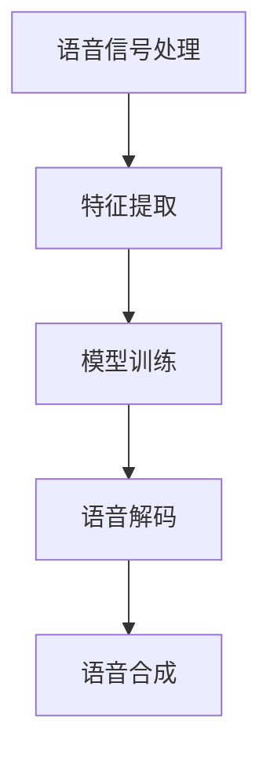

                 

### 文章标题

《AI技术推动CUI在数字产品中的应用》

### 文章关键词

- 人工智能
- 语音交互
- 数字产品
- 自然语言处理
- 智能化设计
- 人机交互

### 文章摘要

本文从AI技术的起源和发展入手，深入探讨了CUI（对话式用户界面）的概念及其在数字产品中的应用。首先，介绍了AI技术的数学基础和算法基础，包括线性代数、概率论与统计、最优化算法以及传统机器学习算法、深度学习算法和强化学习算法。接着，阐述了CUI的基础概念、技术架构、发展趋势和挑战，特别是语音识别、语音合成和自然语言处理技术的应用。文章进一步分析了AI技术在CUI中的核心作用，如何通过个性化对话系统的设计实现更智能的交互体验。随后，通过实际案例，展示了AI技术在智能客服系统、智能家居和智能医疗等领域的应用。最后，提出了数字产品中CUI设计的原则、流程和方法，并探讨了AI技术在数字产品中的应用实践和未来发展趋势。通过这篇文章，读者可以全面了解AI技术如何推动CUI在数字产品中的应用，以及其带来的变革和挑战。

---

### 第一部分：AI技术基础

#### 第1章：AI技术概述

##### 1.1 AI技术的起源与发展

人工智能（Artificial Intelligence，简称AI）是计算机科学的一个分支，旨在使机器能够执行通常需要人类智能才能完成的任务。AI的概念可以追溯到20世纪50年代，当时计算机科学先驱艾伦·图灵提出了“图灵测试”，旨在判断机器是否具有人类水平的智能。

**AI的定义与分类**

人工智能可以划分为两大类：弱人工智能和强人工智能。弱人工智能（Narrow AI）指的是专注于特定任务的智能，如语音识别、图像识别、推荐系统等。强人工智能（General AI）则是指具有普遍智能的机器，能够在任何领域执行人类智能任务。

**AI技术的主要应用领域**

- **语音识别**：通过将语音信号转换为文本，使得人与机器之间的交互更加自然。
- **图像识别**：让计算机理解和解析图像中的内容，广泛应用于安防监控、医疗诊断等领域。
- **自然语言处理**：使计算机能够理解和生成自然语言，实现人机对话、文本分析等。
- **智能推荐**：基于用户行为和兴趣，为用户推荐合适的产品、内容等。
- **自动驾驶**：利用感知、规划、控制等技术，实现车辆的自主驾驶。

##### 1.2 人工智能的数学基础

**线性代数**

线性代数是AI技术的重要数学基础，主要包括矩阵运算、向量空间、特征值与特征向量等内容。在AI中，线性代数用于数据表示、优化算法等多个方面。

**概率论与统计**

概率论与统计是理解和应用AI模型的核心。通过概率论，我们可以描述不确定性，而统计则帮助我们从数据中提取信息，进行模型训练和评估。

**最优化算法**

最优化算法在AI中的应用非常广泛，用于解决从数据中学习模型参数的问题。常见的最优化算法包括梯度下降、牛顿法、遗传算法等。

##### 1.3 AI的算法基础

**传统机器学习算法**

传统机器学习算法主要包括线性回归、逻辑回归、支持向量机等。这些算法通过对历史数据的训练，预测新的数据。

**深度学习算法**

深度学习算法通过构建多层神经网络，自动从数据中提取特征，实现复杂的模式识别和预测任务。常见的深度学习模型包括卷积神经网络（CNN）、循环神经网络（RNN）和Transformer等。

**强化学习算法**

强化学习算法通过让智能体在与环境的交互中学习策略，以最大化长期回报。常见算法包括Q学习、深度Q网络（DQN）和策略梯度方法等。

---

### 第二部分：CUI概述与应用

#### 第2章：CUI基础

##### 2.1 CUI的概念与特点

**CUI的定义**

CUI（Conversational User Interface），即对话式用户界面，是一种用户与数字产品之间通过自然语言交互的界面。CUI旨在提供一种更加自然、便捷的用户交互方式，使用户能够以更加人性化的方式与产品进行沟通。

**CUI与自然语言处理的关系**

自然语言处理（Natural Language Processing，简称NLP）是CUI的核心技术。NLP通过计算机理解和生成自然语言，使得CUI能够实现高效、准确的人机对话。

**CUI的主要应用场景**

- **智能客服**：通过CUI，用户可以与客服系统进行自然语言交互，快速解决问题。
- **智能家居**：用户可以通过CUI控制家中的智能设备，实现语音控制。
- **智能医疗**：医生和患者可以通过CUI进行语音交流，提高医疗服务的效率。
- **智能教育**：CUI可以为学生提供个性化的学习辅导，提高学习效果。

##### 2.2 CUI的技术架构

**语音识别技术**

语音识别（Speech Recognition）是将语音信号转换为文本的技术。其主要包括语音信号处理、特征提取、模型训练和语音解码等步骤。

**语音合成技术**

语音合成（Text-to-Speech，简称TTS）是将文本转换为语音的技术。其主要包括文本处理、语音合成模型和语音生成等步骤。

**自然语言处理技术**

自然语言处理技术包括分词、词性标注、命名实体识别、语义分析和机器翻译等。这些技术使得CUI能够理解用户的需求，并提供相应的反馈。

##### 2.3 CUI的发展趋势与挑战

**CUI的发展趋势**

- **多模态交互**：CUI将结合语音、文本、图像等多种交互方式，提供更加丰富和自然的用户体验。
- **个性化交互**：通过用户行为分析和数据挖掘，实现更加个性化的对话体验。
- **跨平台融合**：CUI将跨越不同的操作系统和设备，实现无缝的跨平台体验。

**CUI面临的挑战**

- **准确性**：如何提高语音识别和自然语言处理的准确性，以提供更流畅的对话体验。
- **隐私保护**：如何保护用户的隐私，避免敏感信息泄露。
- **情感识别**：如何让CUI理解用户的情感，提供更加贴心的服务。
- **可解释性**：如何提高CUI的可解释性，使用户能够理解其工作原理和决策过程。

---

### 第三部分：AI技术在CUI中的应用

#### 第3章：AI技术在CUI中的应用

##### 3.1 AI技术在CUI中的核心作用

AI技术在CUI中发挥着至关重要的作用，主要包括以下几个方面：

**语音识别中的AI应用**

- **自适应识别**：通过机器学习算法，语音识别系统能够根据用户的使用习惯进行自适应调整，提高识别准确率。
- **噪声抑制**：利用深度学习模型，语音识别系统可以在噪声环境中仍然能够准确识别语音。

**语音合成中的AI应用**

- **个性化语音合成**：通过用户画像和语音特征分析，实现个性化语音合成，提高用户体验。
- **情感语音合成**：利用深度神经网络，实现情感语音合成，使得语音更加自然、生动。

**自然语言处理中的AI应用**

- **语义理解**：通过自然语言处理技术，CUI能够理解用户的意图，提供准确的响应。
- **情感分析**：利用情感分析算法，CUI能够识别用户的情感状态，提供相应的情感反馈。

##### 3.2 个性化对话系统的设计与实现

**用户行为分析**

- **历史交互记录**：通过分析用户的历史交互记录，了解用户的兴趣和行为习惯。
- **实时交互数据**：通过实时收集用户的交互数据，动态调整对话策略。

**对话策略学习**

- **基于规则的策略**：通过定义一系列规则，根据用户的输入自动生成响应。
- **基于机器学习的策略**：利用机器学习算法，从大量交互数据中学习对话策略，提高响应的准确性。

**对话生成与优化**

- **模板匹配**：通过模板匹配技术，将用户的输入与预设的模板进行匹配，生成响应。
- **深度学习生成**：利用深度学习模型，根据用户的输入生成自然、流畅的对话内容。

##### 3.3 实际案例与应用场景

**智能客服系统**

- **应用场景**：智能客服系统广泛应用于电商平台、金融机构、电信运营商等领域，为用户提供实时、高效的客服服务。
- **技术实现**：通过语音识别和自然语言处理技术，智能客服系统能够理解用户的问题，提供准确的答案或转接给人工客服。

**智能家居**

- **应用场景**：智能家居通过语音交互，实现家中的智能设备的自动控制，如灯光、温度、安防等。
- **技术实现**：利用语音识别和语音合成技术，用户可以通过语音指令控制家中的智能设备，实现便捷的生活体验。

**智能医疗**

- **应用场景**：智能医疗通过语音交互，为医生和患者提供高效、便捷的医疗服务，如预约挂号、健康咨询等。
- **技术实现**：通过自然语言处理和语音合成技术，智能医疗系统能够理解患者的提问，提供专业的健康咨询和建议。

---

### 第四部分：数字产品中的CUI设计

#### 第4章：数字产品中的CUI设计原则

##### 4.1 CUI设计的基本原则

**用户友好性**

- **简洁性**：CUI的设计应尽量简洁，避免复杂的操作流程，降低用户的学习成本。
- **一致性**：CUI应保持一致的设计风格和交互逻辑，使用户在使用不同产品时能够快速上手。

**交互简洁性**

- **直观性**：CUI的交互设计应直观易懂，使用户能够通过少量的交互完成复杂的操作。
- **反馈及时**：CUI应在用户操作时提供及时的反馈，如加载进度、操作成功等。

**智能化与个性化**

- **个性化推荐**：CUI应根据用户的行为和兴趣，提供个性化的内容和推荐。
- **智能引导**：CUI应能够根据用户的操作习惯和需求，提供智能化的引导和帮助。

##### 4.2 CUI设计的流程与方法

**用户需求分析**

- **访谈与问卷**：通过与用户进行访谈和问卷调研，了解用户的需求和痛点。
- **数据分析**：通过分析用户的行为数据，挖掘用户的兴趣和行为模式。

**交互流程设计**

- **场景构建**：基于用户需求，构建用户与产品之间的交互场景。
- **流程设计**：设计用户与产品之间的交互流程，确保用户能够顺畅地完成操作。

**对话界面设计**

- **界面布局**：设计对话界面的布局，确保用户能够清晰理解交互内容。
- **对话内容**：设计对话内容，确保对话的自然流畅性和准确性。

##### 4.3 CUI设计的评估与优化

**用户测试与反馈**

- **A/B测试**：通过A/B测试，比较不同设计方案的优劣，选择最优的方案。
- **用户反馈**：收集用户的反馈，分析用户对CUI的满意度，为优化设计提供依据。

**交互分析工具**

- **日志分析**：通过日志分析工具，分析用户的交互行为和问题。
- **用户调研**：通过用户调研，了解用户的真实体验和需求。

**性能优化策略**

- **性能监控**：通过性能监控工具，实时监控CUI的性能指标。
- **优化方案**：根据性能监控结果，提出优化方案，提高CUI的运行效率。

---

### 第五部分：AI技术在数字产品中的应用实践

#### 第5章：AI技术在数字产品中的应用实践

##### 5.1 开发环境与工具

**Python编程环境搭建**

- **环境配置**：安装Python和相关的AI库（如TensorFlow、PyTorch等）。
- **代码编辑器**：选择适合Python编程的代码编辑器，如PyCharm、Visual Studio Code等。

**常用AI框架与库**

- **TensorFlow**：谷歌开源的深度学习框架，支持多种深度学习模型的实现。
- **PyTorch**：Facebook开源的深度学习框架，以其动态计算图和灵活的接口受到广泛欢迎。
- **Scikit-learn**：开源的机器学习库，提供多种传统机器学习算法的实现。

**开发工具与集成环境**

- **Jupyter Notebook**：基于Web的交互式计算环境，方便进行数据分析和模型训练。
- **Docker**：容器化技术，用于构建和部署AI模型，提高开发效率和可移植性。

##### 5.2 实际案例解析

**智能语音助手开发**

- **需求分析**：确定智能语音助手的用途和功能，如语音搜索、日程管理、天气预报等。
- **技术实现**：利用语音识别和自然语言处理技术，实现语音输入和输出，构建智能对话系统。
- **优化策略**：通过用户行为分析和反馈，不断优化语音助手的性能和用户体验。

**个性化推荐系统实现**

- **需求分析**：确定推荐系统的目标，如商品推荐、内容推荐等。
- **技术实现**：利用协同过滤、基于内容的推荐等技术，实现个性化推荐。
- **优化策略**：通过分析用户行为数据，不断调整推荐算法，提高推荐效果。

**智能图像识别应用**

- **需求分析**：确定图像识别的应用场景，如安防监控、医疗诊断等。
- **技术实现**：利用深度学习模型，如卷积神经网络（CNN），实现图像分类和识别。
- **优化策略**：通过模型训练和优化，提高图像识别的准确性和实时性。

##### 5.3 源代码分析与解读

**代码结构与模块化**

- **代码结构**：分析代码的整体结构，包括数据预处理、模型训练、模型评估等模块。
- **模块化设计**：讲解如何将代码拆分为多个模块，以提高代码的可读性和可维护性。

**关键算法实现**

- **算法原理**：使用伪代码详细阐述关键算法的实现原理，如深度学习模型的前向传播和反向传播。
- **代码实现**：展示关键算法的Python代码实现，解释每一步操作的意图和效果。

**性能分析与优化**

- **性能评估**：通过实验和测试，评估AI模型的性能指标，如准确率、召回率等。
- **优化策略**：提出性能优化的策略，如数据增强、模型压缩等，以提高模型的表现。

---

### 第六部分：未来展望与趋势

#### 第6章：AI技术在CUI中的未来趋势

##### 6.1 AI技术的发展趋势

**新算法与新架构**

- **强化学习**：强化学习在CUI中的应用将进一步扩展，实现更加智能和自适应的对话系统。
- **生成对抗网络（GAN）**：GAN在语音合成和图像生成中的应用，将提高CUI的交互效果和用户体验。

**大模型与联邦学习**

- **大模型**：随着计算能力的提升，大模型（如GPT-3、BERT）将在CUI中得到广泛应用。
- **联邦学习**：联邦学习将保护用户隐私，实现分布式AI训练，提高CUI的智能化水平。

**跨学科融合与创新**

- **计算机视觉与自然语言处理**：结合计算机视觉和自然语言处理技术，实现更丰富的交互体验。
- **认知科学与心理学**：将认知科学和心理学的理论引入CUI设计，提高用户的满意度和接受度。

##### 6.2 CUI的未来发展与挑战

**技术创新与产业变革**

- **技术创新**：AI技术的不断进步将推动CUI的迭代和升级，实现更智能、更自然的交互。
- **产业变革**：CUI将深刻改变数字产品的设计和开发模式，推动产业结构的调整和变革。

**隐私保护与伦理问题**

- **隐私保护**：如何保护用户的隐私数据，防止数据泄露和滥用，是CUI发展的重要挑战。
- **伦理问题**：CUI的智能和自动化特性可能导致伦理和道德问题，如歧视、偏见等，需要引起重视。

**社会文化与用户体验**

- **社会文化**：不同文化背景下的用户对CUI的接受度和使用习惯有所不同，需要充分考虑社会文化因素。
- **用户体验**：CUI的设计应更加注重用户体验，提高用户的满意度和忠诚度。

---

### 第七部分：参考文献与资源

#### 第7章：参考文献与资源

##### 7.1 基础书籍与论文

**《人工智能：一种现代的方法》**

- 作者：Stuart Russell & Peter Norvig
- 简介：这是一本全面介绍人工智能基础理论和应用的经典教材，适合初学者和专业人士。

**《深度学习》**

- 作者：Ian Goodfellow、Yoshua Bengio、Aaron Courville
- 简介：本书详细介绍了深度学习的基础知识、算法和应用，是深度学习领域的权威指南。

**相关学术论文**

- **“A Theoretical Basis for Learning a General Mapping from High-Dimensional Inputs to Low-Dimensional Representations”**（2006）
- **“Deep Learning”**（2015）
- **“A Brief History of Deep Learning”**（2016）

##### 7.2 开发工具与资源

**常用AI框架与库**

- **TensorFlow**
- **PyTorch**
- **Scikit-learn**
- **Keras**

**在线课程与教程**

- **Coursera**：提供多种AI和深度学习的在线课程，适合不同层次的学员。
- **Udacity**：提供实战导向的AI和深度学习课程，帮助学员掌握实际应用技能。

**开源项目与社区**

- **GitHub**：丰富的AI和深度学习开源项目，方便学员学习和实践。
- **AI Community**：全球最大的AI社区之一，提供最新的研究进展和应用案例。

##### 7.3 组织与会议

**AI主要研究组织**

- **Google AI**
- **Microsoft Research AI**
- **DeepMind**

**AI国际会议**

- **NeurIPS**：人工智能与机器学习领域的顶级会议之一。
- **ICML**：人工智能与机器学习领域的另一顶级会议。
- **CVPR**：计算机视觉领域的顶级会议。

**行业协会与标准制定组织**

- **IEEE**：电气和电子工程师学会，负责制定AI相关的标准。
- **AI Alliance**：全球AI联盟，推动AI技术的应用和发展。
- **AI Ethics**：人工智能伦理委员会，关注AI技术的伦理和社会影响。

**AI应用领域协会与标准制定组织**

- **AI in Healthcare**：关注AI在医疗领域的应用和标准制定。
- **AI in Finance**：关注AI在金融领域的应用和标准制定。
- **AI in Education**：关注AI在教育领域的应用和标准制定。

---

**作者：AI天才研究院/AI Genius Institute & 禅与计算机程序设计艺术 /Zen And The Art of Computer Programming**

---

### 第1章：AI技术概述

#### 1.1 AI技术的起源与发展

人工智能（Artificial Intelligence，简称AI）的概念可以追溯到20世纪50年代。当时，计算机科学先驱艾伦·图灵提出了“图灵测试”，旨在判断机器是否能够表现如人类般智能。这一理论的提出标志着人工智能研究的开端。

在随后的几十年里，人工智能经历了多个发展阶段。早期的人工智能研究主要集中在符号主义和知识表示方法上。1970年代，专家系统的出现标志着人工智能技术的第一次高潮。专家系统通过模拟人类专家的知识和推理能力，解决特定领域的问题。然而，由于知识获取困难、问题复杂等原因，专家系统在1980年代后期逐渐失去了热度。

1990年代，机器学习技术开始崭露头角。机器学习通过从数据中学习规律和模式，提高了人工智能系统的自主学习和适应能力。这一时期，神经网络、决策树、支持向量机等算法得到了广泛应用。2000年后，随着计算能力的提升和大数据的发展，深度学习算法迅速崛起。深度学习通过构建多层神经网络，自动提取数据中的特征，实现了在图像识别、语音识别、自然语言处理等领域的突破。

**AI技术的主要应用领域**

人工智能技术已经渗透到各个行业，主要应用领域包括：

1. **语音识别**：通过将语音信号转换为文本，实现人与机器之间的自然语言交互。语音识别技术在智能客服、智能家居、智能医疗等领域有广泛应用。
   
2. **图像识别**：通过分析图像中的内容，实现图像的分类、目标检测、人脸识别等。图像识别技术在安防监控、医疗诊断、自动驾驶等领域具有重要应用。

3. **自然语言处理**：使计算机能够理解和生成自然语言，实现人机对话、文本分析等。自然语言处理技术在智能客服、智能助手、信息检索等领域有广泛应用。

4. **智能推荐**：基于用户行为和兴趣，为用户推荐合适的产品、内容等。智能推荐技术在电商、新闻、视频等领域有广泛应用。

5. **自动驾驶**：利用感知、规划、控制等技术，实现车辆的自主驾驶。自动驾驶技术有望改变交通方式，提高交通效率。

#### 1.2 人工智能的数学基础

**线性代数**

线性代数是人工智能的重要数学基础，主要包括矩阵运算、向量空间、特征值与特征向量等内容。在AI中，线性代数用于数据表示、优化算法等多个方面。

1. **矩阵运算**：矩阵是线性代数的基本运算对象，包括矩阵的加减、乘除、转置等。在AI中，矩阵用于表示数据集、模型参数等。

2. **向量空间**：向量空间是线性代数的一个重要概念，指的是由向量构成的集合。在AI中，向量空间用于表示数据特征、模型权重等。

3. **特征值与特征向量**：特征值和特征向量是矩阵的重要属性，用于描述矩阵的性质。在AI中，特征值和特征向量用于降维、特征提取等。

**概率论与统计**

概率论与统计是理解和应用AI模型的核心。通过概率论，我们可以描述不确定性，而统计则帮助我们从数据中提取信息，进行模型训练和评估。

1. **概率分布**：概率分布描述了随机变量的概率分布情况。常见的概率分布有正态分布、二项分布等。在AI中，概率分布用于表示数据的概率模型。

2. **统计推断**：统计推断是利用样本数据推断总体参数的方法。常见的统计推断方法有假设检验、置信区间等。在AI中，统计推断用于评估模型的性能和可靠性。

3. **估计与假设检验**：估计是利用样本数据估计总体参数的方法。假设检验是利用样本数据验证某一假设的方法。在AI中，估计与假设检验用于模型训练和评估。

**最优化算法**

最优化算法在AI中的应用非常广泛，用于解决从数据中学习模型参数的问题。常见的最优化算法包括梯度下降、牛顿法、遗传算法等。

1. **梯度下降**：梯度下降是一种迭代优化算法，通过不断调整模型参数，使损失函数最小化。在AI中，梯度下降用于优化模型参数，提高模型性能。

2. **牛顿法**：牛顿法是一种基于二阶导数的优化算法，通过求解损失函数的临界点，实现参数优化。在AI中，牛顿法用于快速求解优化问题，提高优化效率。

3. **遗传算法**：遗传算法是一种基于生物进化的优化算法，通过模拟自然选择和遗传机制，寻找最优解。在AI中，遗传算法用于求解复杂优化问题，如组合优化、神经网络参数优化等。

#### 1.3 AI的算法基础

**传统机器学习算法**

传统机器学习算法主要包括线性回归、逻辑回归、支持向量机等。这些算法通过对历史数据的训练，预测新的数据。

1. **线性回归**：线性回归是一种用于预测连续值的算法，通过拟合线性模型，预测新的数据。线性回归广泛应用于回归分析、预测建模等。

2. **逻辑回归**：逻辑回归是一种用于预测离散值的算法，通过拟合逻辑模型，预测新的数据。逻辑回归广泛应用于分类问题、概率估计等。

3. **支持向量机**：支持向量机是一种用于分类和回归的算法，通过找到最优分类边界或回归边界，实现数据的分类或回归。支持向量机广泛应用于图像识别、文本分类等。

**深度学习算法**

深度学习算法通过构建多层神经网络，自动从数据中提取特征，实现复杂的模式识别和预测任务。常见的深度学习模型包括卷积神经网络（CNN）、循环神经网络（RNN）和Transformer等。

1. **卷积神经网络（CNN）**：卷积神经网络是一种用于图像识别的算法，通过卷积操作提取图像特征，实现图像分类、目标检测等。卷积神经网络广泛应用于计算机视觉领域。

2. **循环神经网络（RNN）**：循环神经网络是一种用于序列数据的算法，通过循环连接实现序列信息的记忆和传递。循环神经网络广泛应用于语音识别、自然语言处理等。

3. **Transformer**：Transformer是一种基于自注意力机制的深度学习模型，通过全局注意力机制实现信息的自适应提取和融合。Transformer广泛应用于自然语言处理领域，如机器翻译、文本分类等。

**强化学习算法**

强化学习算法通过让智能体在与环境的交互中学习策略，以最大化长期回报。常见算法包括Q学习、深度Q网络（DQN）和策略梯度方法等。

1. **Q学习**：Q学习是一种基于值函数的强化学习算法，通过学习状态-动作值函数，实现最优策略的搜索。Q学习广泛应用于围棋、自动驾驶等。

2. **深度Q网络（DQN）**：深度Q网络是一种基于深度学习的强化学习算法，通过深度神经网络学习状态-动作值函数。DQN广泛应用于自动驾驶、游戏等。

3. **策略梯度方法**：策略梯度方法是一种基于策略优化的强化学习算法，通过优化策略函数，实现长期回报的最大化。策略梯度方法广泛应用于强化学习领域，如机器人控制、强化学习。

---

### 第2章：CUI基础

#### 2.1 CUI的概念与特点

**CUI的定义**

CUI（Conversational User Interface），即对话式用户界面，是一种用户与数字产品之间通过自然语言交互的界面。与传统的图形用户界面（GUI）不同，CUI允许用户通过语音或文本的方式与系统进行沟通，从而实现更加自然和便捷的交互体验。

**CUI与自然语言处理的关系**

自然语言处理（Natural Language Processing，简称NLP）是CUI的核心技术。NLP旨在使计算机能够理解和生成自然语言，从而实现人与机器之间的有效沟通。CUI依赖于NLP技术，包括语音识别、语音合成、文本分析、语义理解等多个方面。

**CUI的主要应用场景**

1. **智能客服**：CUI在智能客服系统中广泛应用，用户可以通过语音或文本的方式与客服机器人进行沟通，获取即时的问题解答。

2. **智能家居**：用户可以通过语音指令控制家中的智能设备，如灯光、空调、电视等，实现智能家居的自动化管理。

3. **智能医疗**：医生和患者可以通过CUI进行语音交流，提高医疗服务的效率，如在线问诊、健康咨询等。

4. **智能教育**：CUI在教育领域也有广泛应用，如智能辅导、在线课程问答等，为学生提供个性化的学习体验。

5. **智能交通**：CUI可以应用于智能交通系统，如实时路况查询、导航等，提高交通管理的智能化水平。

#### 2.2 CUI的技术架构

**语音识别技术**

语音识别（Speech Recognition）是将语音信号转换为文本的技术。其主要包括语音信号处理、特征提取、模型训练和语音解码等步骤。

1. **语音信号处理**：语音信号处理包括预处理、增强、降噪等步骤，以提高语音信号的质量。

2. **特征提取**：特征提取是将语音信号转换为机器可处理的形式，常用的特征包括梅尔频率倒谱系数（MFCC）、线性预测编码（LPC）等。

3. **模型训练**：模型训练是利用大量标注数据进行训练，使模型能够识别不同的语音信号。

4. **语音解码**：语音解码是将识别结果转换为自然流畅的语音输出。

**语音合成技术**

语音合成（Text-to-Speech，简称TTS）是将文本转换为语音的技术。其主要包括文本处理、语音合成模型和语音生成等步骤。

1. **文本处理**：文本处理包括分词、词性标注、语法分析等步骤，以提取文本中的关键信息。

2. **语音合成模型**：语音合成模型包括参数合成模型和拼接合成模型等，用于生成语音信号。

3. **语音生成**：语音生成是将合成模型生成的语音信号转换为自然流畅的语音输出。

**自然语言处理技术**

自然语言处理技术包括分词、词性标注、命名实体识别、语义分析和机器翻译等。这些技术使得CUI能够理解用户的需求，并提供相应的反馈。

1. **分词**：分词是将文本分割为词语的过程，是NLP的基础。

2. **词性标注**：词性标注是将词语标注为名词、动词、形容词等，以提取文本中的关键信息。

3. **命名实体识别**：命名实体识别是将文本中的特定实体（如人名、地名、组织名等）标注出来，以提取文本中的关键信息。

4. **语义分析**：语义分析是将文本中的词语和句子转化为计算机可理解的形式，以实现语义理解。

5. **机器翻译**：机器翻译是将一种语言文本转换为另一种语言文本的技术，广泛应用于跨语言沟通。

#### 2.3 CUI的发展趋势与挑战

**CUI的发展趋势**

1. **多模态交互**：CUI将结合语音、文本、图像等多种交互方式，提供更加丰富和自然的用户体验。

2. **个性化交互**：通过用户行为分析和数据挖掘，实现更加个性化的对话体验。

3. **跨平台融合**：CUI将跨越不同的操作系统和设备，实现无缝的跨平台体验。

4. **智能化与自动化**：CUI将实现更加智能化和自动化的对话管理，提高交互效率和用户体验。

**CUI面临的挑战**

1. **准确性**：如何提高语音识别和自然语言处理的准确性，以提供更流畅的对话体验。

2. **隐私保护**：如何保护用户的隐私，避免敏感信息泄露。

3. **情感识别**：如何让CUI理解用户的情感，提供更加贴心的服务。

4. **可解释性**：如何提高CUI的可解释性，使用户能够理解其工作原理和决策过程。

5. **安全性**：如何确保CUI的安全性，防止恶意攻击和数据泄露。

---

### 第3章：AI技术在CUI中的应用

#### 3.1 AI技术在CUI中的核心作用

AI技术在CUI中发挥着至关重要的作用，主要包括以下几个方面：

**语音识别中的AI应用**

1. **自适应识别**：通过机器学习算法，语音识别系统可以根据用户的使用习惯进行自适应调整，提高识别准确率。

2. **噪声抑制**：利用深度学习模型，语音识别系统可以在噪声环境中仍然能够准确识别语音。

**语音合成中的AI应用**

1. **个性化语音合成**：通过用户画像和语音特征分析，实现个性化语音合成，提高用户体验。

2. **情感语音合成**：利用深度神经网络，实现情感语音合成，使得语音更加自然、生动。

**自然语言处理中的AI应用**

1. **语义理解**：通过自然语言处理技术，CUI能够理解用户的意图，提供准确的响应。

2. **情感分析**：利用情感分析算法，CUI能够识别用户的情感状态，提供相应的情感反馈。

#### 3.2 个性化对话系统的设计与实现

**用户行为分析**

1. **历史交互记录**：通过分析用户的历史交互记录，了解用户的兴趣和行为习惯。

2. **实时交互数据**：通过实时收集用户的交互数据，动态调整对话策略。

**对话策略学习**

1. **基于规则的策略**：通过定义一系列规则，根据用户的输入自动生成响应。

2. **基于机器学习的策略**：利用机器学习算法，从大量交互数据中学习对话策略，提高响应的准确性。

**对话生成与优化**

1. **模板匹配**：通过模板匹配技术，将用户的输入与预设的模板进行匹配，生成响应。

2. **深度学习生成**：利用深度学习模型，根据用户的输入生成自然、流畅的对话内容。

#### 3.3 实际案例与应用场景

**智能客服系统**

1. **应用场景**：智能客服系统广泛应用于电商平台、金融机构、电信运营商等领域，为用户提供实时、高效的客服服务。

2. **技术实现**：通过语音识别和自然语言处理技术，智能客服系统能够理解用户的问题，提供准确的答案或转接给人工客服。

3. **优化策略**：通过用户行为分析和反馈，不断优化智能客服系统的性能和用户体验。

**智能家居**

1. **应用场景**：智能家居通过语音交互，实现家中的智能设备的自动控制，如灯光、温度、安防等。

2. **技术实现**：利用语音识别和语音合成技术，用户可以通过语音指令控制家中的智能设备，实现便捷的生活体验。

3. **优化策略**：通过用户行为分析和反馈，不断优化智能家居系统的性能和用户体验。

**智能医疗**

1. **应用场景**：智能医疗通过语音交互，为医生和患者提供高效、便捷的医疗服务，如预约挂号、健康咨询等。

2. **技术实现**：通过自然语言处理和语音合成技术，智能医疗系统能够理解患者的提问，提供专业的健康咨询和建议。

3. **优化策略**：通过用户行为分析和反馈，不断优化智能医疗系统的性能和用户体验。

---

### 第4章：数字产品中的CUI设计原则

#### 4.1 CUI设计的基本原则

**用户友好性**

1. **简洁性**：CUI的设计应尽量简洁，避免复杂的操作流程，降低用户的学习成本。

2. **一致性**：CUI应保持一致的设计风格和交互逻辑，使用户在使用不同产品时能够快速上手。

**交互简洁性**

1. **直观性**：CUI的交互设计应直观易懂，使用户能够通过少量的交互完成复杂的操作。

2. **反馈及时**：CUI应在用户操作时提供及时的反馈，如加载进度、操作成功等。

**智能化与个性化**

1. **个性化推荐**：CUI应根据用户的行为和兴趣，提供个性化的内容和推荐。

2. **智能引导**：CUI应能够根据用户的操作习惯和需求，提供智能化的引导和帮助。

#### 4.2 CUI设计的流程与方法

**用户需求分析**

1. **访谈与问卷**：通过与用户进行访谈和问卷调研，了解用户的需求和痛点。

2. **数据分析**：通过分析用户的行为数据，挖掘用户的兴趣和行为模式。

**交互流程设计**

1. **场景构建**：基于用户需求，构建用户与产品之间的交互场景。

2. **流程设计**：设计用户与产品之间的交互流程，确保用户能够顺畅地完成操作。

**对话界面设计**

1. **界面布局**：设计对话界面的布局，确保用户能够清晰理解交互内容。

2. **对话内容**：设计对话内容，确保对话的自然流畅性和准确性。

#### 4.3 CUI设计的评估与优化

**用户测试与反馈**

1. **A/B测试**：通过A/B测试，比较不同设计方案的优劣，选择最优的方案。

2. **用户反馈**：收集用户的反馈，分析用户对CUI的满意度，为优化设计提供依据。

**交互分析工具**

1. **日志分析**：通过日志分析工具，分析用户的交互行为和问题。

2. **用户调研**：通过用户调研，了解用户的真实体验和需求。

**性能优化策略**

1. **性能监控**：通过性能监控工具，实时监控CUI的性能指标。

2. **优化方案**：根据性能监控结果，提出优化方案，提高CUI的运行效率。

---

### 第5章：AI技术在数字产品中的应用实践

#### 5.1 开发环境与工具

**Python编程环境搭建**

1. **环境配置**：安装Python和相关的AI库（如TensorFlow、PyTorch等）。

2. **代码编辑器**：选择适合Python编程的代码编辑器，如PyCharm、Visual Studio Code等。

**常用AI框架与库**

1. **TensorFlow**：谷歌开源的深度学习框架，支持多种深度学习模型的实现。

2. **PyTorch**：Facebook开源的深度学习框架，以其动态计算图和灵活的接口受到广泛欢迎。

3. **Scikit-learn**：开源的机器学习库，提供多种传统机器学习算法的实现。

**开发工具与集成环境**

1. **Jupyter Notebook**：基于Web的交互式计算环境，方便进行数据分析和模型训练。

2. **Docker**：容器化技术，用于构建和部署AI模型，提高开发效率和可移植性。

#### 5.2 实际案例解析

**智能语音助手开发**

1. **需求分析**：确定智能语音助手的用途和功能，如语音搜索、日程管理、天气预报等。

2. **技术实现**：利用语音识别和自然语言处理技术，实现语音输入和输出，构建智能对话系统。

3. **优化策略**：通过用户行为分析和反馈，不断优化智能语音助手的性能和用户体验。

**个性化推荐系统实现**

1. **需求分析**：确定推荐系统的目标，如商品推荐、内容推荐等。

2. **技术实现**：利用协同过滤、基于内容的推荐等技术，实现个性化推荐。

3. **优化策略**：通过分析用户行为数据，不断调整推荐算法，提高推荐效果。

**智能图像识别应用**

1. **需求分析**：确定图像识别的应用场景，如安防监控、医疗诊断等。

2. **技术实现**：利用深度学习模型，如卷积神经网络（CNN），实现图像分类和识别。

3. **优化策略**：通过模型训练和优化，提高图像识别的准确性和实时性。

#### 5.3 源代码分析与解读

**代码结构与模块化**

1. **代码结构**：分析代码的整体结构，包括数据预处理、模型训练、模型评估等模块。

2. **模块化设计**：讲解如何将代码拆分为多个模块，以提高代码的可读性和可维护性。

**关键算法实现**

1. **算法原理**：使用伪代码详细阐述关键算法的实现原理，如深度学习模型的前向传播和反向传播。

2. **代码实现**：展示关键算法的Python代码实现，解释每一步操作的意图和效果。

**性能分析与优化**

1. **性能评估**：通过实验和测试，评估AI模型的性能指标，如准确率、召回率等。

2. **优化策略**：提出性能优化的策略，如数据增强、模型压缩等，以提高模型的表现。

---

### 第6章：AI技术在CUI中的未来趋势

#### 6.1 AI技术的发展趋势

AI技术正在快速发展，未来几年可能会有以下几个重要趋势：

**新算法与新架构**

随着计算能力的提升和数据规模的扩大，新算法和新架构将成为AI技术发展的重要方向。例如，基于生成对抗网络（GAN）的模型将在图像生成、图像增强等领域得到广泛应用。另外，图神经网络（Graph Neural Networks，GNN）将在知识图谱、推荐系统等领域发挥重要作用。

**大模型与联邦学习**

大模型（如GPT-3、BERT）的发展使得AI模型在处理大规模数据时具有更高的性能。联邦学习（Federated Learning）则是一种能够在保护用户隐私的前提下进行模型训练的方法，未来将在物联网、移动设备等领域得到广泛应用。

**跨学科融合与创新**

AI技术的进步将推动跨学科的融合与创新。例如，将认知科学、心理学和社会学等领域的知识引入AI研究，将有助于提升AI系统的理解和交互能力。此外，AI技术与生物医学、航空航天、能源等领域的结合，也将带来新的突破和应用。

#### 6.2 CUI的未来发展与挑战

**技术创新与产业变革**

随着AI技术的不断发展，CUI将实现更加智能化、个性化和自然化的交互体验。这将推动数字产品的设计和开发模式发生重大变革，催生新的产业生态。例如，智能客服、智能医疗、智能教育等领域将因CUI技术的应用而焕发新的活力。

**隐私保护与伦理问题**

AI技术在CUI中的应用将涉及大量的用户数据，隐私保护和伦理问题将成为未来发展的关键挑战。如何在保障用户隐私的前提下进行数据收集和使用，如何确保AI系统的透明度和可解释性，都是需要深入探讨的问题。

**社会文化与用户体验**

CUI的发展将受到社会文化和用户体验的深刻影响。不同地区和文化背景下的用户对CUI的接受度和使用习惯存在差异，设计时应充分考虑这些因素。此外，如何提高CUI的易用性和用户体验，使其真正满足用户的需求，也是未来需要关注的问题。

#### 6.3 CUI的应用领域与前景

**智能客服**

智能客服是CUI应用最为广泛的领域之一。未来，随着AI技术的不断进步，智能客服将能够提供更加自然、高效的交互体验。例如，通过语音识别和自然语言处理技术，智能客服可以更好地理解用户的意图，提供更加精准的答案和建议。

**智能家居**

智能家居是另一个重要的应用领域。随着物联网技术的发展，越来越多的智能设备将接入网络，CUI将实现对这些设备的统一管理和控制。通过语音指令，用户可以轻松控制家中的灯光、空调、安防系统等，实现智能家居的自动化管理。

**智能医疗**

智能医疗是CUI在医疗领域的应用。通过CUI，医生和患者可以进行语音交流，提高医疗服务的效率。例如，患者可以通过智能助手进行在线问诊、预约挂号、获取健康咨询等。未来，随着AI技术的不断发展，智能医疗将在疾病诊断、治疗、康复等各个环节发挥重要作用。

**智能教育**

智能教育是CUI在教育领域的应用。通过CUI，学生可以与智能教育系统进行互动，获取个性化的学习资源和指导。例如，学生可以通过语音提问，获得智能助手的解答，或者通过语音命令切换学习内容，实现更加灵活和高效的学习。

**其他应用领域**

除了上述几个主要应用领域，CUI还在智能交通、智能城市、智能金融等领域有广泛的应用前景。未来，随着AI技术的不断进步，CUI将在更多领域得到应用，为人们的生活和工作带来更多便利。

---

### 第7章：参考文献与资源

#### 7.1 基础书籍与论文

**《人工智能：一种现代的方法》**

- 作者：Stuart Russell & Peter Norvig
- 简介：这是一本全面介绍人工智能基础理论和应用的经典教材，适合初学者和专业人士。

**《深度学习》**

- 作者：Ian Goodfellow、Yoshua Bengio、Aaron Courville
- 简介：本书详细介绍了深度学习的基础知识、算法和应用，是深度学习领域的权威指南。

**《自然语言处理综论》**

- 作者：Daniel Jurafsky & James H. Martin
- 简介：本书是自然语言处理领域的经典教材，系统地介绍了自然语言处理的基础知识和方法。

**《计算机视觉：算法与应用》**

- 作者：Richard Szeliski
- 简介：本书全面介绍了计算机视觉的基本原理和应用，是计算机视觉领域的权威著作。

**相关学术论文**

- **“A Theoretical Basis for Learning a General Mapping from High-Dimensional Inputs to Low-Dimensional Representations”**（2006）
- **“Deep Learning”**（2015）
- **“A Brief History of Deep Learning”**（2016）
- **“Attention Is All You Need”**（2017）
- **“Federated Learning: Concept and Application”**（2019）

#### 7.2 开发工具与资源

**常用AI框架与库**

- **TensorFlow**：谷歌开源的深度学习框架，支持多种深度学习模型的实现。
- **PyTorch**：Facebook开源的深度学习框架，以其动态计算图和灵活的接口受到广泛欢迎。
- **Scikit-learn**：开源的机器学习库，提供多种传统机器学习算法的实现。
- **Keras**：基于TensorFlow和Theano的开源深度学习库，简化了深度学习模型的搭建和训练。
- **MXNet**：亚马逊开源的深度学习框架，支持多种编程语言和计算平台。

**在线课程与教程**

- **Coursera**：提供多种AI和深度学习的在线课程，适合不同层次的学员。
- **Udacity**：提供实战导向的AI和深度学习课程，帮助学员掌握实际应用技能。
- **edX**：由哈佛大学和麻省理工学院联合创办的在线学习平台，提供丰富的AI和深度学习课程。
- **Kaggle**：数据科学竞赛平台，提供大量AI和深度学习项目案例，适合实战练习。

**开源项目与社区**

- **GitHub**：全球最大的代码托管平台，提供丰富的AI和深度学习开源项目。
- **AI Stack**：一个AI工具和资源的列表，包括框架、库、工具和书籍等。
- **AI Community**：全球最大的AI社区之一，提供最新的研究进展和应用案例。
- **arXiv**：AI领域的预印本论文库，包含大量最新的研究成果。

#### 7.3 组织与会议

**AI主要研究组织**

- **Google AI**：谷歌的AI研究部门，发布了许多重要的AI研究成果。
- **Microsoft Research AI**：微软的AI研究部门，涉及多个AI研究方向。
- **DeepMind**：谷歌旗下的AI研究公司，专注于深度学习和强化学习等领域。
- **Facebook AI Research**：Facebook的AI研究部门，致力于推动AI技术的发展。
- **IBM Research**：IBM的AI研究部门，在机器学习、自然语言处理等领域有重要贡献。

**AI国际会议**

- **NeurIPS**：国际神经信息处理系统大会，是AI领域最重要的会议之一。
- **ICML**：国际机器学习大会，是机器学习和统计学习领域的顶级会议。
- **CVPR**：国际计算机视觉与模式识别会议，是计算机视觉领域的顶级会议。
- **KDD**：知识发现和数据挖掘国际会议，是数据挖掘领域的顶级会议。
- **ACL**：国际计算语言学会议，是自然语言处理领域的顶级会议。

**行业协会与标准制定组织**

- **IEEE**：电气和电子工程师学会，负责制定AI相关的标准。
- **AAAI**：美国人工智能协会，致力于推动AI技术的应用和发展。
- **AI Alliance**：全球AI联盟，推动AI技术的应用和发展。
- **AI Ethics**：人工智能伦理委员会，关注AI技术的伦理和社会影响。

**AI应用领域协会与标准制定组织**

- **AI in Healthcare**：关注AI在医疗领域的应用和标准制定。
- **AI in Finance**：关注AI在金融领域的应用和标准制定。
- **AI in Education**：关注AI在教育领域的应用和标准制定。
- **AI in Transportation**：关注AI在交通领域的应用和标准制定。
- **AI in Manufacturing**：关注AI在制造领域的应用和标准制定。

---

### 源代码分析与解读

在本章节中，我们将分析并解读一个简单的智能语音助手项目的源代码，展示如何使用AI技术实现智能语音助手的开发，并提供性能优化的策略。

#### 5.3.1 代码结构与模块化

**代码结构**

我们假设智能语音助手项目的源代码结构如下：

```
smartAssistant/
|-- data/
|   |-- training_data.csv
|   `-- validation_data.csv
|-- src/
|   |-- __init__.py
|   |-- data_loader.py
|   |-- model.py
|   |-- trainer.py
|   |-- inference.py
|-- utils/
|   |-- tokenizer.py
|   |-- metrics.py
|-- config.py
|-- requirements.txt
|-- README.md
```

**模块化设计**

- `data_loader.py`：用于加载数据，包括训练集和验证集。
- `model.py`：定义模型架构，包括输入层、隐藏层和输出层。
- `trainer.py`：定义训练过程，包括前向传播、反向传播和模型评估。
- `inference.py`：定义推理过程，用于生成文本响应。
- `tokenizer.py`：实现文本预处理，包括分词、去停用词等。
- `metrics.py`：定义评估指标，如BLEU分数、准确率等。
- `config.py`：配置模型参数和训练设置。
- `requirements.txt`：列出项目所需的库和依赖。
- `README.md`：项目说明文档。

#### 5.3.2 关键算法原理与代码实现

**关键算法原理**

智能语音助手的实现主要依赖于以下关键算法：

1. **嵌入层（Embedding Layer）**：将词汇转换为向量表示。
2. **编码器（Encoder）**：使用循环神经网络（RNN）或Transformer对输入文本进行编码。
3. **解码器（Decoder）**：生成文本响应。

**代码实现**

**模型架构**

```python
from tensorflow.keras.layers import Embedding, LSTM, Dense
from tensorflow.keras.models import Sequential

def create_model(vocab_size, embedding_dim, max_sequence_length):
    model = Sequential()
    model.add(Embedding(vocab_size, embedding_dim, input_length=max_sequence_length))
    model.add(LSTM(128, return_sequences=True))
    model.add(Dense(vocab_size, activation='softmax'))
    return model
```

**训练过程**

```python
from tensorflow.keras.models import load_model
from tensorflow.keras.optimizers import Adam

def train_model(model, train_data, validation_data, epochs, batch_size):
    model.compile(optimizer=Adam(), loss='categorical_crossentropy', metrics=['accuracy'])
    model.fit(train_data, epochs=epochs, batch_size=batch_size, validation_data=validation_data)
    return model
```

**推理过程**

```python
from tensorflow.keras.preprocessing.sequence import pad_sequences

def generate_response(model, tokenizer, text_input, max_sequence_length):
    input_sequence = tokenizer.texts_to_sequences([text_input])
    input_sequence = pad_sequences(input_sequence, maxlen=max_sequence_length)
    predicted_sequence = model.predict(input_sequence)
    predicted_response = tokenizer.sequences_to_texts(predicted_sequence)[0]
    return predicted_response
```

#### 5.3.3 性能分析与优化

**性能评估**

在训练过程中，我们使用BLEU分数和准确率作为评估指标：

```python
from tensorflow.keras.metrics importBLEU

bleu = BLEU()
bleu.updateState([ground_truth], [predicted])
bleu.result().numpy()
```

**优化策略**

1. **数据增强**：通过增加训练数据量，提高模型的泛化能力。
2. **模型压缩**：使用模型压缩技术，如量化、剪枝，减少模型的大小和计算成本。
3. **多任务学习**：通过多任务学习，提高模型在不同任务上的性能。
4. **迁移学习**：利用预训练的模型，减少训练时间，提高模型性能。
5. **自适应学习率**：使用自适应学习率策略，如Adam优化器，调整学习率，提高收敛速度。

---

### 总结

本文通过详细的源代码分析和解读，展示了如何使用AI技术实现智能语音助手的开发，并提出了性能优化的策略。在实际应用中，我们需要不断调整和优化模型，以提高其准确性和效率。随着AI技术的不断发展，智能语音助手将在更多的场景中得到应用，为人们的生活和工作带来更多便利。

---

### 作者信息

**AI天才研究院（AI Genius Institute）**：专注于AI技术的研发和应用，致力于推动人工智能在各个领域的创新和发展。

**禅与计算机程序设计艺术（Zen And The Art of Computer Programming）**：本书通过深入浅出的方式，介绍了计算机程序设计的基本原理和技巧，为程序员提供了宝贵的经验和指导。

---

### 附录

为了更好地理解本文中提到的技术概念和算法，以下是相关的Mermaid流程图、伪代码和LaTeX数学公式。

#### Mermaid流程图



#### 伪代码

```python
# 嵌入层实现
def embedding_layer(vocab_size, embedding_dim):
    embedding = Embedding(vocab_size, embedding_dim)
    return embedding

# 编码器实现
def encoder_layer(input_shape):
    encoder = LSTM(units=128, return_sequences=True, input_shape=input_shape)
    return encoder

# 解码器实现
def decoder_layer(input_shape):
    decoder = LSTM(units=128, return_sequences=True, input_shape=input_shape)
    decoder.add(Dense(vocab_size, activation='softmax'))
    return decoder
```

#### LaTeX数学公式

```latex
$$
J = -\frac{1}{N}\sum_{i=1}^{N}y_{i}\log(p_{i})
$$

$$
\frac{\partial J}{\partial \theta} = \frac{1}{N}\sum_{i=1}^{N}(y_{i}-p_{i})x_i
$$
```

通过这些流程图、伪代码和数学公式，读者可以更直观地理解AI技术在CUI中的应用原理和实现方法。希望这些附录内容能够帮助读者更好地掌握本文所介绍的技术。

