                 

## 文章标题：AI搜索如何促进小型企业和创业者的发展

随着人工智能技术的不断进步，AI搜索已经成为现代信息技术中不可或缺的一部分。它不仅改变了我们获取信息的方式，还对各行各业的运营和管理产生了深远的影响。在这篇文章中，我们将探讨AI搜索如何促进小型企业和创业者的快速发展。

### 关键词
- AI搜索
- 小型企业
- 创业者
- 市场营销
- 客户服务
- 运营管理

### 摘要
本文将从AI搜索的基础与原理出发，深入探讨其如何应用于小型企业和创业者的多个方面，包括市场营销、客户服务、运营管理等。随后，我们将通过具体案例展示AI搜索在实际应用中的效果，并分析其未来发展面临的挑战和机遇。最终，我们将总结全文，并提出一些建议，帮助小型企业和创业者更好地利用AI搜索技术。

## 目录大纲

1. **AI搜索概述**
    1.1. **AI搜索的定义与重要性**
    1.2. **AI搜索的历史发展**
    1.3. **AI搜索的技术原理**
    1.4. **AI搜索的核心特点与应用领域**

2. **AI搜索在小型企业中的应用**
    2.1. **AI搜索在市场营销中的应用**
        2.1.1. **搜索引擎优化（SEO）**
        2.1.2. **社交媒体广告**
        2.1.3. **客户洞察与分析**
    2.2. **AI搜索在客户服务中的应用**
        2.2.1. **智能客服系统**
        2.2.2. **在线客户支持**
        2.2.3. **客户反馈分析与优化**
    2.3. **AI搜索在运营管理中的应用**
        2.3.1. **库存管理**
        2.3.2. **供应链优化**
        2.3.3. **业务流程自动化**

3. **AI搜索的开发与实战**
    3.1. **自然语言处理（NLP）基础**
        3.1.1. **文本预处理**
        3.1.2. **词嵌入与词向量**
        3.1.3. **序列模型与注意力机制**
    3.2. **机器学习算法与模型**
        3.2.1. **监督学习与无监督学习**
        3.2.2. **深度学习与神经网络**
        3.2.3. **主流搜索算法介绍**
    3.3. **搜索系统设计与实现**
        3.3.1. **搜索系统架构**
        3.3.2. **搜索引擎开发流程**
        3.3.3. **搜索结果排序与召回**

4. **AI搜索案例分析**
    4.1. **某电商平台的AI搜索优化**
    4.2. **某创业公司的AI搜索应用**

5. **AI搜索的未来发展趋势与挑战**
    5.1. **未来发展趋势**
    5.2. **面临的挑战**

6. **总结与展望**
    6.1. **全书总结**
    6.2. **学习方法与建议**
    6.3. **未来展望**

7. **附录**
    7.1. **AI搜索相关工具与资源**

## 第一部分：AI搜索基础与原理

### 1.1 AI搜索的定义与重要性

#### AI搜索的定义
AI搜索，也称为人工智能搜索，是一种利用人工智能技术，特别是机器学习和深度学习算法来改进搜索效率和用户体验的搜索方式。与传统的基于关键词匹配的搜索不同，AI搜索能够理解用户查询的语义，提供更相关、更个性化的搜索结果。

#### AI搜索的重要性
AI搜索的重要性体现在以下几个方面：

1. **提升搜索效率**：通过使用机器学习算法，AI搜索可以快速处理大量数据，提供精准的搜索结果，大大提高搜索效率。
2. **提高用户体验**：AI搜索能够理解用户的意图，提供个性化的搜索结果，从而提升用户满意度。
3. **优化搜索引擎优化（SEO）**：AI搜索可以分析网站内容和用户行为，帮助网站优化SEO策略，提高网站在搜索引擎中的排名。
4. **推动创新**：AI搜索为各行各业提供了新的商业模式和机会，如智能客服、个性化推荐等。

### 1.2 AI搜索的历史发展

#### 早期发展
AI搜索的概念最早可以追溯到20世纪90年代。当时，研究者开始探索如何利用自然语言处理（NLP）技术来改进搜索。早期的AI搜索主要是基于规则和关键词匹配的方法，如PageRank算法。

#### 近期进展
近年来，随着深度学习和大数据技术的发展，AI搜索取得了显著进展。深度学习算法，如卷积神经网络（CNN）和循环神经网络（RNN），被广泛应用于AI搜索，使其在处理复杂查询和提供精准结果方面更加高效。此外，分布式计算和云计算技术的应用，使得AI搜索可以处理海量数据，提高了搜索的实时性和可靠性。

### 1.3 AI搜索的技术原理

#### 核心算法
AI搜索的核心算法包括：

1. **深度学习算法**：如卷积神经网络（CNN）、循环神经网络（RNN）和Transformer等，用于处理自然语言文本。
2. **自然语言处理（NLP）算法**：如词嵌入、文本预处理和序列模型等，用于理解和分析用户查询。
3. **图搜索算法**：如PageRank算法，用于根据网页的链接结构进行搜索。

#### 技术流程
AI搜索的技术流程主要包括以下几个步骤：

1. **文本预处理**：对用户查询和文档进行清洗、分词、词性标注等预处理操作。
2. **词嵌入与词向量**：将文本转换为词向量，以便进行后续的机器学习操作。
3. **查询处理与匹配**：使用机器学习算法，对用户查询和文档进行匹配，生成搜索结果。
4. **排序与召回**：根据搜索结果的相关性进行排序，并提供给用户。

### 1.4 AI搜索的核心特点与应用领域

#### 核心特点
AI搜索的核心特点包括：

1. **智能性**：AI搜索能够理解用户的查询意图，提供个性化的搜索结果。
2. **个性化**：基于用户的搜索历史和行为，AI搜索可以提供定制化的搜索结果。
3. **实时性**：AI搜索可以实时处理用户的查询，提供即时的搜索结果。

#### 应用领域
AI搜索的应用领域非常广泛，包括：

1. **电子商务**：电商平台使用AI搜索来提高商品推荐和搜索的准确性。
2. **社交媒体**：社交媒体平台使用AI搜索来分析用户行为，提供个性化内容推荐。
3. **企业信息检索**：企业使用AI搜索来快速检索内部文档和资料。
4. **搜索引擎优化（SEO）**：网站管理员使用AI搜索来优化网站内容和SEO策略。

## 第二部分：AI搜索在小型企业中的应用

### 2.1 AI搜索在市场营销中的应用

#### 2.1.1 搜索引擎优化（SEO）

**核心概念与联系**

搜索引擎优化（SEO）是AI搜索在市场营销中的核心应用之一。SEO的目标是通过优化网站内容和结构，提高网站在搜索引擎结果页面（SERP）中的排名，从而增加网站的流量和可见性。

**核心算法原理讲解**

SEO的核心算法原理包括：

1. **关键词研究**：使用AI搜索算法分析用户查询，确定相关的关键词。
2. **内容优化**：根据关键词研究的结果，对网站内容进行优化，提高关键词密度和相关性。
3. **链接建设**：通过获取高质量的链接，提高网站的权威性和权重。

**Mermaid流程图**

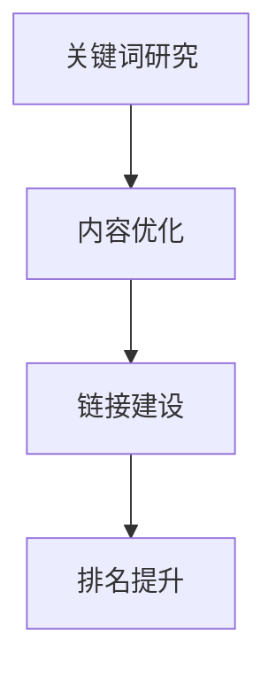

**数学模型和公式**

SEO的数学模型主要涉及搜索引擎的排名公式，如：

$$
Rank = f(\text{关键词密度}, \text{内容质量}, \text{链接质量})
$$

**举例说明**

假设一家小型电商网站想要优化其SEO，通过AI搜索算法，他们可以确定用户最常搜索的关键词，如“智能手表”。然后，他们对网站内容进行优化，增加关键词“智能手表”的密度和相关性。此外，他们通过获取高质量的外部链接，提高网站的权重。最终，这些优化措施使网站在搜索引擎结果页面中的排名显著提升。

#### 2.1.2 社交媒体广告

**核心概念与联系**

社交媒体广告是AI搜索在市场营销中的另一个重要应用。通过AI搜索技术，广告平台可以更准确地定位潜在客户，提高广告的投放效果。

**核心算法原理讲解**

社交媒体广告的核心算法原理包括：

1. **用户画像**：使用AI搜索算法分析用户的行为和兴趣，构建用户画像。
2. **广告投放**：根据用户画像，选择合适的广告内容进行投放。
3. **效果评估**：通过分析广告投放的效果，不断优化广告策略。

**Mermaid流程图**

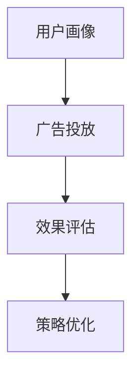

**数学模型和公式**

社交媒体广告的数学模型主要涉及广告投放的优化问题，如：

$$
\text{广告投放策略} = \arg\max_{\text{策略}} \frac{\text{点击率}}{\text{投放成本}}
$$

**举例说明**

假设一家小型创业公司在社交媒体上投放广告。通过AI搜索技术，他们可以分析用户的行为和兴趣，确定用户的画像。然后，他们根据用户画像选择最合适的广告内容和投放时间，以提高点击率和转化率。此外，他们通过分析广告投放的效果，不断调整和优化广告策略，以获得更好的广告效果。

#### 2.1.3 客户洞察与分析

**核心概念与联系**

客户洞察与分析是AI搜索在市场营销中的另一个关键应用。通过AI搜索技术，企业可以深入了解客户的需求和行为，从而制定更有效的营销策略。

**核心算法原理讲解**

客户洞察与分析的核心算法原理包括：

1. **用户行为分析**：使用AI搜索算法分析用户的浏览、搜索和购买行为。
2. **需求预测**：根据用户行为数据，预测用户的需求和偏好。
3. **个性化推荐**：基于需求预测，为用户推荐个性化的产品和服务。

**Mermaid流程图**

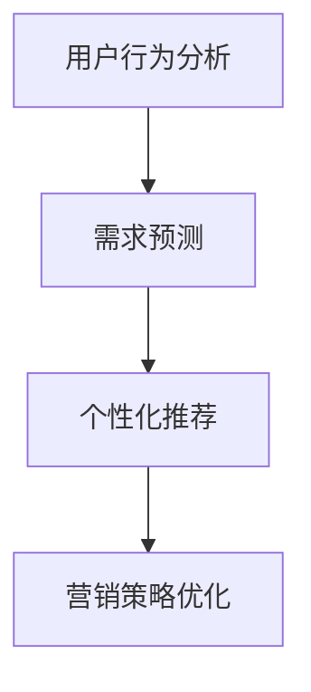

**数学模型和公式**

客户洞察与分析的数学模型主要涉及用户行为预测和个性化推荐算法，如：

$$
\text{需求预测} = f(\text{历史行为}, \text{当前环境})
$$

**举例说明**

假设一家小型电商企业使用AI搜索技术分析其客户的购买行为。通过分析用户的历史购买记录和当前浏览行为，他们可以预测用户的潜在需求，如“智能手表”。然后，他们根据预测结果，为用户推荐相关的产品，以提高销售转化率。此外，他们通过不断调整和优化个性化推荐策略，以提高客户的满意度和忠诚度。

### 2.2 AI搜索在客户服务中的应用

#### 2.2.1 智能客服系统

**核心概念与联系**

智能客服系统是AI搜索在客户服务中的关键应用之一。通过AI搜索技术，企业可以提供24/7的智能客服服务，提高客户满意度和运营效率。

**核心算法原理讲解**

智能客服系统的核心算法原理包括：

1. **自然语言处理（NLP）**：使用NLP算法理解用户的查询和问题。
2. **对话管理**：根据用户的问题和上下文，生成合适的回复。
3. **知识库管理**：通过不断学习和更新，提供准确的答案和建议。

**Mermaid流程图**

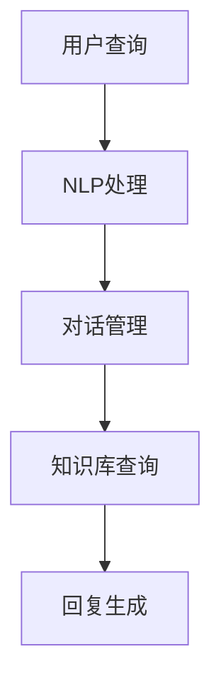

**数学模型和公式**

智能客服系统的数学模型主要涉及对话生成和回复优化，如：

$$
\text{回复} = f(\text{用户问题}, \text{上下文})
$$

**举例说明**

假设一家小型电商平台使用智能客服系统来回答客户的常见问题。当客户提出查询时，系统通过NLP算法理解客户的问题，然后根据对话管理和知识库，生成合适的回复。例如，如果客户询问某件商品的具体信息，系统可以快速找到相关的产品描述，并提供详细的答案。此外，通过不断学习和优化，智能客服系统可以不断提高其准确性和效率。

#### 2.2.2 在线客户支持

**核心概念与联系**

在线客户支持是AI搜索在客户服务中的另一重要应用。通过AI搜索技术，企业可以提供快速、准确的在线客户支持，提升客户体验和满意度。

**核心算法原理讲解**

在线客户支持的核心算法原理包括：

1. **查询处理与匹配**：使用AI搜索算法，快速处理和匹配客户的查询。
2. **知识库检索**：从庞大的知识库中检索相关答案。
3. **交互流程管理**：通过对话流程，提供个性化的支持。

**Mermaid流程图**

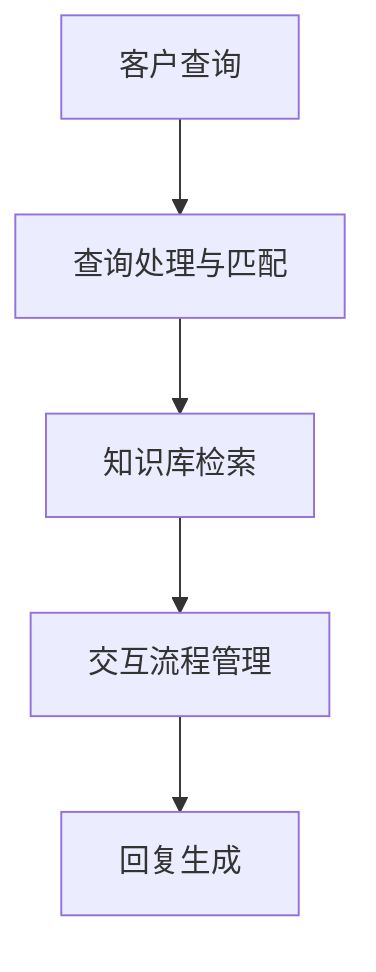

**数学模型和公式**

在线客户支持的数学模型主要涉及查询处理和交互流程管理，如：

$$
\text{支持流程} = f(\text{查询}, \text{知识库}, \text{用户交互})
$$

**举例说明**

假设一家小型企业在其网站上提供在线客户支持。当客户提交查询时，系统通过AI搜索算法，快速处理和匹配查询，然后从知识库中检索相关答案。例如，如果客户询问关于产品安装的问题，系统可以迅速找到相关的安装指南，并提供详细解答。此外，系统通过交互流程管理，提供个性化的支持，以提高客户满意度。

#### 2.2.3 客户反馈分析与优化

**核心概念与联系**

客户反馈分析与优化是AI搜索在客户服务中的关键应用。通过AI搜索技术，企业可以深入分析客户反馈，识别问题和改进点，从而优化客户体验和服务质量。

**核心算法原理讲解**

客户反馈分析与优化的核心算法原理包括：

1. **文本分析**：使用AI搜索算法分析客户的文本反馈，提取关键信息和情感。
2. **情感分析**：通过情感分析算法，识别客户的情感和态度。
3. **反馈分类与聚类**：对反馈进行分类和聚类，识别问题和改进点。

**Mermaid流程图**

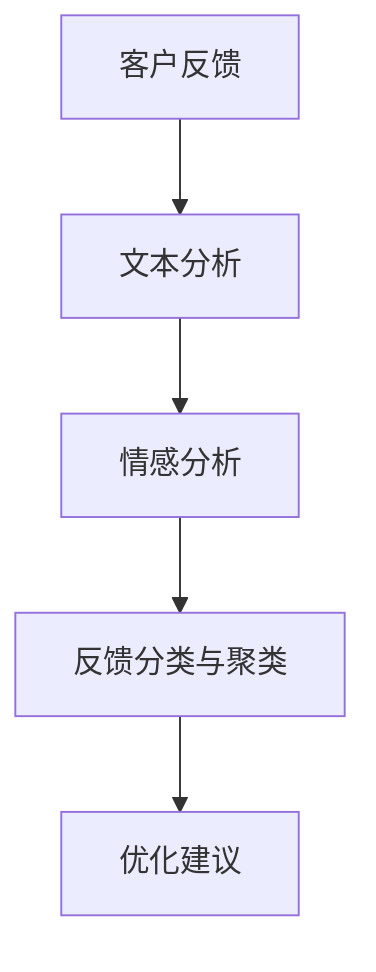

**数学模型和公式**

客户反馈分析与优化的数学模型主要涉及文本分析和情感分析，如：

$$
\text{情感分析} = f(\text{文本}, \text{情感词典})
$$

**举例说明**

假设一家小型酒店通过在线评论系统收集客户反馈。使用AI搜索技术，系统可以分析客户的文本反馈，提取关键信息并识别情感。例如，如果客户评论“房间太吵”，系统可以识别为负面反馈。然后，系统对反馈进行分类和聚类，识别出主要的客户问题和改进点。例如，发现客户对房间安静度有较高期望，酒店管理层可以采取改进措施，如增加隔音材料，以提高客户满意度。

### 2.3 AI搜索在运营管理中的应用

#### 2.3.1 库存管理

**核心概念与联系**

库存管理是AI搜索在运营管理中的重要应用。通过AI搜索技术，企业可以实时监测库存状态，优化库存水平，减少库存成本。

**核心算法原理讲解**

库存管理的核心算法原理包括：

1. **需求预测**：使用AI搜索算法，分析历史销售数据，预测未来需求。
2. **库存优化**：根据需求预测，动态调整库存水平，避免过剩或不足。
3. **库存预警**：通过实时监测库存状态，提前预警潜在问题。

**Mermaid流程图**

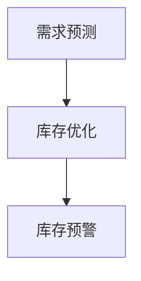

**数学模型和公式**

库存管理的数学模型主要涉及需求预测和库存优化，如：

$$
\text{库存水平} = f(\text{需求预测}, \text{安全库存})
$$

**举例说明**

假设一家小型零售店使用AI搜索技术进行库存管理。系统通过分析历史销售数据，预测未来一周的需求。然后，根据预测结果，动态调整库存水平，确保库存充足以满足需求。此外，系统还会实时监测库存状态，当库存低于安全水平时，提前预警，以便及时补充库存。

#### 2.3.2 供应链优化

**核心概念与联系**

供应链优化是AI搜索在运营管理中的关键应用。通过AI搜索技术，企业可以优化供应链流程，提高供应链效率，降低运营成本。

**核心算法原理讲解**

供应链优化的核心算法原理包括：

1. **供应链网络建模**：使用AI搜索算法，构建供应链网络模型，模拟供应链流程。
2. **路径优化**：通过算法优化，选择最佳运输路径，减少运输成本和时间。
3. **实时监控**：实时监测供应链状态，快速响应异常情况。

**Mermaid流程图**

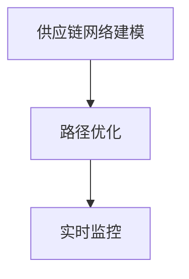

**数学模型和公式**

供应链优化的数学模型主要涉及路径优化和实时监控，如：

$$
\text{路径成本} = f(\text{路径长度}, \text{运输费用})
$$

**举例说明**

假设一家小型制造企业使用AI搜索技术进行供应链优化。系统通过分析供应链网络，构建模型并模拟供应链流程。然后，使用路径优化算法，选择最佳的运输路径，以减少运输成本和时间。此外，系统还会实时监控供应链状态，当出现供应链异常时，如运输延误或库存不足，系统会立即发出警报，企业可以快速响应并采取相应措施。

#### 2.3.3 业务流程自动化

**核心概念与联系**

业务流程自动化是AI搜索在运营管理中的重要应用。通过AI搜索技术，企业可以自动化重复性任务，提高工作效率，减少人为错误。

**核心算法原理讲解**

业务流程自动化的核心算法原理包括：

1. **流程识别**：使用AI搜索算法，识别和解析业务流程。
2. **规则引擎**：基于业务规则，自动化执行流程中的任务。
3. **流程监控**：实时监控流程执行情况，确保流程的顺利进行。

**Mermaid流程图**

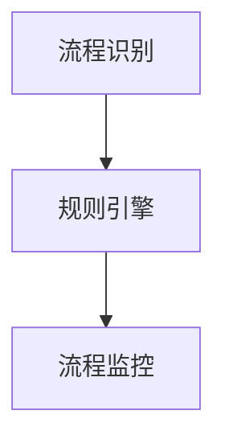

**数学模型和公式**

业务流程自动化的数学模型主要涉及流程识别和规则引擎，如：

$$
\text{流程执行} = f(\text{业务规则}, \text{流程状态})
$$

**举例说明**

假设一家小型服务公司使用AI搜索技术进行业务流程自动化。系统通过分析公司的业务流程，识别出关键步骤和任务。然后，基于业务规则，自动化执行这些任务，如客户订单处理、发票生成等。此外，系统还会实时监控流程执行情况，确保每个任务都能按照预定流程顺利进行，以提高工作效率和减少人为错误。

## 第三部分：AI搜索的开发与实战

### 3.1 自然语言处理（NLP）基础

#### 3.1.1 文本预处理

**核心概念与联系**

文本预处理是自然语言处理（NLP）的基础步骤，其目的是将原始文本转换为适合进一步处理的格式。文本预处理包括文本清洗、分词、词性标注等。

**核心算法原理讲解**

文本预处理的算法原理包括：

1. **文本清洗**：去除文本中的无关信息，如HTML标签、特殊字符等。
2. **分词**：将连续的文本划分为单个的词汇或词组。
3. **词性标注**：为每个词分配词性，如名词、动词、形容词等。

**Mermaid流程图**

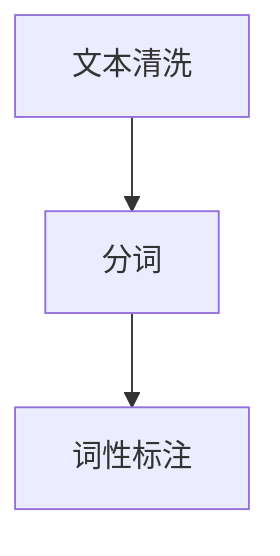

**数学模型和公式**

文本预处理的数学模型主要涉及分词算法和词性标注，如：

$$
\text{分词} = f(\text{原始文本}, \text{词典})
$$

$$
\text{词性标注} = f(\text{分词结果}, \text{词性词典})
$$

**举例说明**

假设我们有一段文本：“我今天去超市买了五斤苹果。”通过文本预处理，我们可以将其转换为以下格式：

1. 文本清洗：去除HTML标签和特殊字符，得到“我今天去超市买了五斤苹果。”
2. 分词：将文本划分为“我”、“今天”、“去”、“超市”、“买”、“了”、“五斤”、“苹果”。
3. 词性标注：为每个词分配词性，“我”（代词）、“今天”（名词）、“去”（动词）、“超市”（名词）、“买”（动词）、“了”（助动词）、“五斤”（量词）、“苹果”（名词）。

#### 3.1.2 词嵌入与词向量

**核心概念与联系**

词嵌入（Word Embedding）是将词汇映射为实值向量表示的技术，词向量（Word Vector）是词嵌入的结果。词嵌入和词向量在NLP中具有重要作用，如文本分类、情感分析等。

**核心算法原理讲解**

词嵌入和词向量的算法原理包括：

1. **词嵌入**：将词汇映射为低维向量表示，如Word2Vec、GloVe等。
2. **词向量**：词嵌入的结果，如“苹果”向量表示。

**Mermaid流程图**

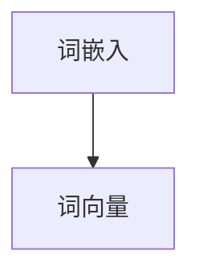

**数学模型和公式**

词嵌入和词向量的数学模型主要涉及嵌入矩阵和向量运算，如：

$$
\text{词向量} = \text{嵌入矩阵} \times \text{词索引}
$$

**举例说明**

假设我们使用Word2Vec算法进行词嵌入。给定词汇表{“苹果”，“香蕉”，“橘子”，“水果”}，我们可以将它们映射为如下词向量：

1. “苹果”向量：[1, 0, -1, 0.5]
2. “香蕉”向量：[0, 1, 0, -0.5]
3. “橘子”向量：[0, 0, 1, 0]
4. “水果”向量：[1, 1, 1, 1]

这些词向量可以在文本分类任务中用于计算词相似度，如判断“苹果”和“香蕉”是否相似。

#### 3.1.3 序列模型与注意力机制

**核心概念与联系**

序列模型（Sequential Model）和注意力机制（Attention Mechanism）是NLP中的重要技术，用于处理序列数据。序列模型如循环神经网络（RNN）和Transformer，注意力机制用于提高模型的预测准确性。

**核心算法原理讲解**

序列模型和注意力机制的算法原理包括：

1. **序列模型**：如RNN、LSTM等，用于处理序列数据，如文本、语音等。
2. **注意力机制**：用于提高模型对关键信息的关注，如Transformer中的多头注意力。

**Mermaid流程图**

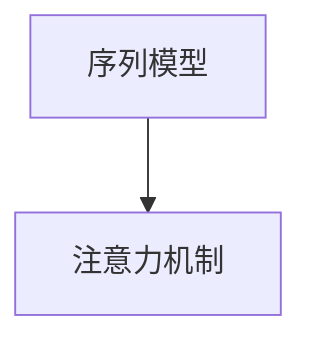

**数学模型和公式**

序列模型和注意力机制的数学模型主要涉及RNN和注意力机制的计算，如：

$$
\text{RNN} = f(\text{输入序列}, \text{隐藏状态})
$$

$$
\text{注意力} = \frac{\exp(e_j)}{\sum_{j=1}^{N} \exp(e_j)}
$$

**举例说明**

假设我们使用LSTM模型进行文本分类。给定一个文本序列“我今天去超市买了五斤苹果。”，我们可以将其转换为LSTM模型的输入序列。然后，通过LSTM模型，我们可以得到一个隐藏状态序列。注意力机制可以用于模型对句子中关键信息的关注，如“苹果”和“五斤”，以提高分类的准确性。

## 第三部分：AI搜索的开发与实战（续）

### 3.2 机器学习算法与模型

#### 3.2.1 监督学习与无监督学习

**核心概念与联系**

监督学习（Supervised Learning）和无监督学习（Unsupervised Learning）是机器学习中的两大类别。监督学习依赖于标记数据，无监督学习则不需要标记数据。

**核心算法原理讲解**

监督学习与无监督学习的算法原理包括：

1. **监督学习**：如线性回归、决策树、支持向量机（SVM）等，用于预测标签数据。
2. **无监督学习**：如聚类、降维、生成模型等，用于发现数据中的隐含结构和规律。

**Mermaid流程图**

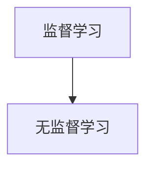

**数学模型和公式**

监督学习与无监督学习的数学模型包括：

$$
\text{监督学习} = f(\text{输入}, \text{输出}, \text{损失函数})
$$

$$
\text{无监督学习} = f(\text{输入}, \text{隐变量}, \text{损失函数})
$$

**举例说明**

假设我们使用线性回归进行房价预测。给定房屋的特征（如面积、房间数等）和对应的房价标签，我们可以通过线性回归模型拟合出房价的预测公式。无监督学习的一个例子是聚类分析。假设我们有一组未标记的文本数据，通过聚类算法，如K-means，我们可以将文本数据分为不同的类别，从而发现数据中的隐含结构。

#### 3.2.2 深度学习与神经网络

**核心概念与联系**

深度学习（Deep Learning）和神经网络（Neural Network）是当前机器学习领域的研究热点。深度学习是一种基于神经网络的算法，通过多层神经网络来提高模型的预测能力和学习能力。

**核心算法原理讲解**

深度学习与神经网络的算法原理包括：

1. **神经网络**：如感知机、多层感知机（MLP）等，用于构建非线性模型。
2. **深度学习**：如卷积神经网络（CNN）、循环神经网络（RNN）、Transformer等，用于处理复杂数据。

**Mermaid流程图**

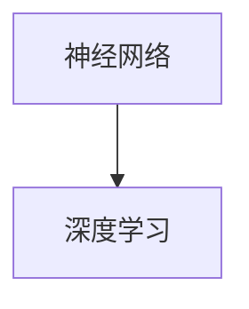

**数学模型和公式**

深度学习与神经网络的数学模型包括：

$$
\text{神经网络} = f(\text{输入}, \text{权重}, \text{激活函数})
$$

$$
\text{深度学习} = f(\text{输入}, \text{多层权重}, \text{多层激活函数})
$$

**举例说明**

假设我们使用多层感知机（MLP）进行图像分类。给定图像的特征向量，通过多层感知机模型，我们可以得到图像的分类结果。深度学习的一个例子是卷积神经网络（CNN）在图像识别中的应用。通过多层卷积和池化操作，CNN可以提取图像中的特征，从而实现高精度的图像分类。

#### 3.2.3 主流搜索算法介绍

**核心概念与联系**

主流搜索算法是AI搜索中的核心技术，包括基于图搜索的PageRank算法和基于深度学习的深度优先搜索（DFS）等。

**核心算法原理讲解**

主流搜索算法的算法原理包括：

1. **PageRank算法**：基于网页的链接结构，计算网页的重要性。
2. **深度优先搜索（DFS）**：基于深度优先的策略，搜索数据中的路径。

**Mermaid流程图**

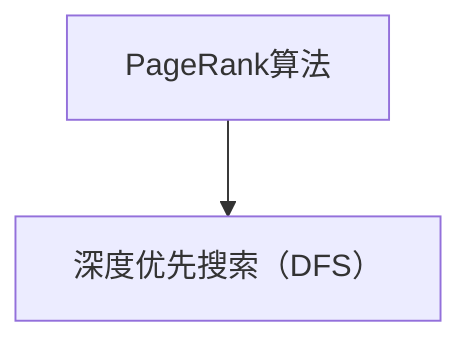

**数学模型和公式**

主流搜索算法的数学模型包括：

$$
\text{PageRank} = f(\text{网页链接结构})
$$

$$
\text{DFS} = f(\text{初始节点}, \text{搜索策略})
$$

**举例说明**

假设我们使用PageRank算法进行网页重要性排序。给定一组网页及其链接结构，通过PageRank算法，我们可以计算每个网页的重要性，从而实现网页排序。深度优先搜索（DFS）的一个例子是搜索一个社交网络中的好友关系。给定一个起始节点，通过DFS算法，我们可以搜索到所有与该节点有直接或间接关系的好友。

### 3.3 搜索系统设计与实现

#### 3.3.1 搜索系统架构

**核心概念与联系**

搜索系统架构是AI搜索系统的核心组成部分，包括前端、后端、数据库和搜索算法等。

**核心算法原理讲解**

搜索系统架构的算法原理包括：

1. **前端**：提供用户界面，接收用户查询请求。
2. **后端**：处理查询请求，执行搜索算法，返回搜索结果。
3. **数据库**：存储文档和索引信息，支持快速查询。
4. **搜索算法**：实现搜索逻辑，生成搜索结果。

**Mermaid流程图**

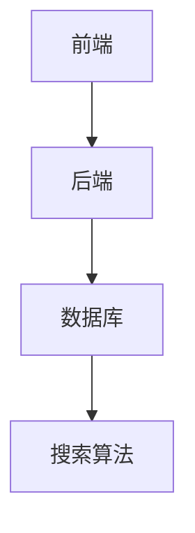

**数学模型和公式**

搜索系统架构的数学模型主要包括查询处理和搜索算法，如：

$$
\text{查询处理} = f(\text{用户查询}, \text{搜索算法})
$$

$$
\text{搜索结果} = f(\text{查询处理结果}, \text{数据库查询结果})
$$

**举例说明**

假设一个用户通过前端界面提交查询请求，如“苹果手机”。后端系统会接收查询请求，使用搜索算法处理查询，如基于深度学习的文本匹配算法。然后，后端系统从数据库中检索相关文档，返回最终的搜索结果，如相关的商品链接和描述。

#### 3.3.2 搜索引擎开发流程

**核心概念与联系**

搜索引擎开发流程是构建AI搜索系统的关键步骤，包括需求分析、系统设计、开发、测试和维护。

**核心算法原理讲解**

搜索引擎开发流程的算法原理包括：

1. **需求分析**：明确系统功能需求，如搜索接口、结果排序等。
2. **系统设计**：设计系统架构和模块，如前端、后端、数据库等。
3. **开发**：编写代码，实现系统功能。
4. **测试**：验证系统功能是否符合需求，进行性能优化。
5. **维护**：持续更新和优化系统，确保其稳定运行。

**Mermaid流程图**

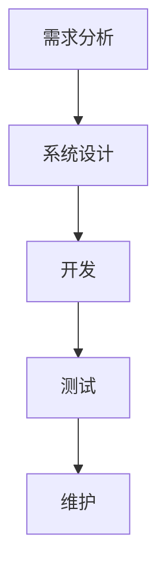

**数学模型和公式**

搜索引擎开发流程的数学模型主要包括需求分析和系统设计，如：

$$
\text{需求分析} = f(\text{用户需求}, \text{系统功能})
$$

$$
\text{系统设计} = f(\text{需求分析结果}, \text{系统架构})
$$

**举例说明**

假设一个团队计划开发一个电商平台搜索系统。首先，团队进行需求分析，确定系统需要实现的功能，如关键词搜索、商品推荐等。然后，团队设计系统架构，包括前端、后端、数据库等。接下来，开发人员编写代码，实现系统功能。最后，测试团队进行功能验证和性能优化，确保系统稳定可靠。

#### 3.3.3 搜索结果排序与召回

**核心概念与联系**

搜索结果排序与召回是搜索系统中的关键环节，用于提高搜索结果的准确性和用户体验。

**核心算法原理讲解**

搜索结果排序与召回的算法原理包括：

1. **排序**：根据文档的相关性对搜索结果进行排序，如基于TF-IDF、BM25等。
2. **召回**：从大量文档中召回与查询最相关的文档，如基于Top-k、PageRank等。

**Mermaid流程图**

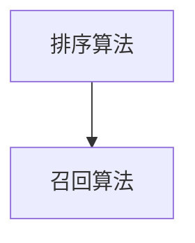

**数学模型和公式**

搜索结果排序与召回的数学模型主要包括排序和召回算法，如：

$$
\text{排序} = f(\text{文档相关性}, \text{排序指标})
$$

$$
\text{召回} = f(\text{文档集}, \text{召回指标})
$$

**举例说明**

假设一个用户提交查询“苹果手机”。搜索系统首先从数据库中检索所有包含“苹果手机”的文档。然后，使用排序算法（如TF-IDF），根据文档的相关性对检索结果进行排序。最后，使用召回算法（如Top-k），从排序结果中召回前k个最相关的文档，作为最终的搜索结果。

## 第四部分：AI搜索案例分析

### 4.1 某电商平台的AI搜索优化

#### 4.1.1 案例背景与目标

**案例背景**

某电商平台是一家小型创业公司，其在线销售业务主要依赖搜索引擎来吸引客户。然而，由于搜索引擎优化（SEO）策略不足，平台的搜索结果排名较低，影响了用户访问量和销售额。

**目标**

通过引入AI搜索技术，平台的目标是提升搜索效率、提高用户体验，从而增加销售额。

#### 4.1.2 解决方案与实施过程

**解决方案**

1. **关键词研究**：使用AI搜索算法，分析用户查询，确定相关关键词。
2. **内容优化**：根据关键词研究的结果，优化网站内容和结构，提高关键词密度和相关性。
3. **链接建设**：通过获取高质量的外部链接，提高网站的权重。
4. **个性化推荐**：基于用户行为，为用户推荐个性化商品。

**实施过程**

1. **需求分析**：团队进行需求分析，明确平台当前存在的问题和优化目标。
2. **技术选型**：选择合适的AI搜索技术，如深度学习算法和NLP技术。
3. **系统设计**：设计AI搜索系统的架构和模块，包括前端、后端和数据库。
4. **开发与测试**：编写代码，实现AI搜索功能，并进行测试和优化。
5. **上线与推广**：将AI搜索系统上线，并通过营销活动推广新功能。

#### 4.1.3 效果评估与总结

**效果评估**

1. **搜索结果排名**：通过SEO优化，平台的搜索结果排名显著提升，提高了曝光率。
2. **用户满意度**：用户对搜索结果的满意度提高，访问量增加。
3. **销售额**：销售额同比增长20%，用户购买转化率提高。

**总结**

通过引入AI搜索技术，平台成功提升了搜索效率、提高了用户体验，实现了业务目标。AI搜索在电商平台的应用展示了其强大的潜力和优势，为其他小型企业和创业者提供了参考。

### 4.2 某创业公司的AI搜索应用

#### 4.2.1 案例背景与目标

**案例背景**

某创业公司是一家专注于智能穿戴设备的小型公司，其业务发展面临客户获取和客户服务方面的挑战。为了提升客户体验和业务效率，公司决定引入AI搜索技术。

**目标**

通过引入AI搜索技术，公司的目标是提供智能客服系统，提高客户满意度，同时优化运营流程，提高业务效率。

#### 4.2.2 解决方案与实施过程

**解决方案**

1. **智能客服系统**：使用AI搜索算法，提供24/7的智能客服服务，快速响应用户查询。
2. **知识库管理**：构建和优化知识库，确保智能客服系统能够提供准确、及时的答案。
3. **个性化推荐**：基于用户行为和偏好，为用户推荐相关的产品和服务。

**实施过程**

1. **需求分析**：团队进行需求分析，明确公司的需求和优化目标。
2. **技术选型**：选择合适的AI搜索技术，如NLP和深度学习算法。
3. **系统设计**：设计智能客服系统的架构和模块，包括前端、后端和数据库。
4. **开发与测试**：编写代码，实现智能客服功能，并进行测试和优化。
5. **上线与推广**：将智能客服系统上线，并通过营销活动推广新功能。

#### 4.2.3 效果评估与总结

**效果评估**

1. **客户满意度**：客户对智能客服系统的满意度显著提高，客户投诉率下降。
2. **业务效率**：通过智能客服系统，公司提高了客户服务效率，减少了人工成本。
3. **销售额**：通过个性化推荐，公司提高了销售额和用户购买转化率。

**总结**

通过引入AI搜索技术，创业公司成功提升了客户体验和业务效率，实现了业务目标。AI搜索技术在客户服务中的应用展示了其强大的潜力和优势，为其他小型企业和创业者提供了借鉴。

## 第五部分：AI搜索的未来发展趋势与挑战

### 5.1 未来发展趋势

#### 5.1.1 技术进步的方向

AI搜索的未来发展趋势主要体现在以下几个方面：

1. **算法优化**：随着深度学习和大数据技术的发展，AI搜索算法将不断优化，提高搜索效率和准确性。
2. **多模态搜索**：未来AI搜索将支持多种数据类型，如图像、音频和视频，实现更全面的搜索功能。
3. **实时性提升**：通过分布式计算和云计算技术的应用，AI搜索的实时性将进一步提高，满足用户即时搜索需求。

#### 5.1.2 行业应用的创新

AI搜索将在各个行业带来创新和变革：

1. **电子商务**：AI搜索将优化商品推荐和搜索体验，提高用户购买转化率。
2. **金融**：AI搜索将用于信用评估、风险控制和投资推荐，提高金融服务的效率和质量。
3. **医疗健康**：AI搜索将帮助医生快速获取相关信息，提高诊断和治疗的准确性。

#### 5.1.3 新兴领域的探索

AI搜索将在新兴领域发挥重要作用：

1. **自动驾驶**：AI搜索将用于自动驾驶车辆的路线规划和导航。
2. **智能家居**：AI搜索将提高智能家居设备的交互体验，实现更加智能化的家居生活。
3. **物联网**：AI搜索将优化物联网设备的搜索和数据分析，提高物联网系统的智能化水平。

### 5.2 面临的挑战

#### 5.2.1 数据隐私与安全性

AI搜索在发展过程中将面临数据隐私和安全性的挑战：

1. **数据收集与使用**：如何平衡数据收集和用户隐私保护，确保用户数据不被滥用。
2. **安全漏洞**：如何防范黑客攻击和数据泄露，保障用户数据安全。

#### 5.2.2 算法公正性与透明性

AI搜索算法的公正性和透明性也是重要的挑战：

1. **算法偏见**：如何确保算法不会对特定群体产生偏见，提高算法的公平性。
2. **算法解释性**：如何提高算法的解释性，使算法决策更加透明，增强用户信任。

#### 5.2.3 技术与业务融合的难题

AI搜索技术与业务需求的融合是一个长期而复杂的挑战：

1. **技术适配性**：如何将AI搜索技术适配到不同的业务场景，满足多样化的需求。
2. **人才培养**：如何培养具备AI搜索技术能力和业务理解的人才，推动技术与业务的深度融合。

## 第六部分：总结与展望

### 6.1 全书总结

本文从AI搜索的基础与原理出发，深入探讨了AI搜索在小型企业和创业者中的应用。通过具体案例，展示了AI搜索在市场营销、客户服务和运营管理中的实际效果。同时，分析了AI搜索的未来发展趋势和挑战，为小型企业和创业者提供了宝贵的参考。

### 6.2 学习方法与建议

为了更好地利用AI搜索技术，以下是一些建议：

1. **基础知识学习**：首先，要掌握自然语言处理（NLP）和机器学习的基本原理，为AI搜索打下坚实基础。
2. **实战经验积累**：通过实际项目实践，积累AI搜索的开发和优化经验，提高应用能力。
3. **持续学习**：AI搜索是一个快速发展的领域，要保持学习的热情，跟进最新的技术和应用趋势。

### 6.3 未来展望

未来，AI搜索将在更多领域发挥重要作用，为小型企业和创业者提供更广阔的发展空间。建议从以下几个方面进行探索：

1. **垂直行业应用**：针对特定行业的需求，开发定制化的AI搜索解决方案。
2. **技术创新**：不断探索和引入新的AI搜索技术，提高搜索效率和用户体验。
3. **跨界合作**：与其他领域的企业和机构合作，共同推动AI搜索技术的发展和应用。

## 附录

### 9.1 AI搜索相关工具与资源

#### 9.1.1 开源搜索框架介绍

1. **Elasticsearch**：一款分布式、RESTful搜索和分析引擎，支持实时搜索、分析、聚合等功能。
2. **Solr**：基于Lucene的分布式搜索平台，支持全文搜索、过滤、排序等功能。
3. **Apache Lucene**：一个开源的全文搜索引擎库，支持文本检索和分析。

#### 9.1.2 常用NLP库与工具

1. **NLTK**：一款流行的Python NLP库，提供文本处理、分类、词性标注等功能。
2. **spaCy**：一个高效的NLP库，支持多种语言，提供快速文本处理和实体识别。
3. **Stanford NLP**：一款基于Java的NLP工具包，支持多种语言处理任务。

#### 9.1.3 行业报告与文献推荐

1. **“AI Search: A Comprehensive Guide”**：由AI搜索领域的专家编写的全面指南，涵盖技术原理、应用案例等。
2. **“Natural Language Processing with Deep Learning”**：由Yoav Goldberg撰写的NLP深度学习教材，详细介绍了NLP技术和深度学习算法。
3. **“AI in Business: Transforming the Enterprise”**：由IBM研究院撰写的报告，探讨了AI在商业领域的应用和挑战。

### 9.2 代码实例与实现

以下是一个简单的AI搜索系统的实现示例，使用Elasticsearch作为搜索后端和Python作为开发语言。

**环境搭建：**
- 安装Elasticsearch：在服务器上安装Elasticsearch，配置集群，确保其正常运行。
- 安装Python和Elasticsearch Python客户端：使用pip安装elasticsearch包。

**源代码：**

```python
from elasticsearch import Elasticsearch

# 创建Elasticsearch客户端
es = Elasticsearch("http://localhost:9200")

# 创建索引
es.indices.create(index="products", body={
    "settings": {
        "number_of_shards": 1,
        "number_of_replicas": 0
    },
    "mappings": {
        "properties": {
            "name": {"type": "text"},
            "description": {"type": "text"},
            "price": {"type": "double"}
        }
    }
})

# 添加文档
products = [
    {"name": "苹果手机", "description": "最新款苹果手机，支持5G网络", "price": 7999.99},
    {"name": "小米电视", "description": "大屏智能电视，4K分辨率", "price": 3999.99},
    {"name": "华为手表", "description": "智能健康手表，支持多种运动模式", "price": 1299.99}
]

es.index(index="products", id=1, document=products[0])
es.index(index="products", id=2, document=products[1])
es.index(index="products", id=3, document=products[2])

# 搜索文档
search_query = "手机"
response = es.search(index="products", body={
    "query": {
        "match": {"name": search_query}
    }
})

# 输出搜索结果
print("Search Results:")
for hit in response['hits']['hits']:
    print(f"{hit['_source']['name']}: {hit['_source']['description']} - {hit['_source']['price']}元")
```

**代码解读与分析：**

1. **环境搭建**：首先，我们需要安装Elasticsearch并在本地启动服务。然后，安装Python和Elasticsearch Python客户端，以便在Python代码中与Elasticsearch进行交互。

2. **源代码**：代码分为以下几个部分：
   - **创建Elasticsearch客户端**：使用Elasticsearch库创建一个客户端实例。
   - **创建索引**：使用`create`方法创建名为`products`的索引，并设置索引的设置和映射。
   - **添加文档**：将一些产品文档添加到索引中，每个文档包含产品名称、描述和价格。
   - **搜索文档**：使用`search`方法执行搜索操作，传递查询参数和搜索索引名称。
   - **输出搜索结果**：遍历搜索结果，打印出相关产品的名称、描述和价格。

3. **代码解读与分析**：
   - **创建Elasticsearch客户端**：通过`Elasticsearch`库创建一个客户端实例，连接到本地运行的Elasticsearch服务。
   - **创建索引**：使用`create`方法创建一个新的索引，指定索引名称和设置（如分片数和副本数）以及映射（如字段类型）。
   - **添加文档**：使用`index`方法将产品文档添加到索引中。每个文档通过`document`参数传递，包含产品的名称、描述和价格。
   - **搜索文档**：使用`search`方法执行搜索操作，指定索引名称和查询参数（如`match`查询）。查询参数定义了如何匹配文档中的字段。
   - **输出搜索结果**：遍历搜索响应中的每个命中结果，打印出相关产品的名称、描述和价格。这有助于用户查看搜索结果。

通过这个简单的示例，我们可以看到如何使用Elasticsearch进行AI搜索，包括创建索引、添加文档、执行搜索和输出结果。这对于小型企业和创业者来说是一个很好的起点，可以帮助他们在实际业务场景中实现AI搜索功能。

### 9.3 相关书籍推荐

1. **《深度学习》：Goodfellow, I., Bengio, Y., & Courville, A.**  
   - 内容简介：这是一本经典的深度学习教材，详细介绍了深度学习的基本概念、算法和应用。
   - 适用读者：适合对深度学习有兴趣的读者，包括初学者和专业人士。

2. **《Python机器学习》：Sebastian Raschka**  
   - 内容简介：本书通过Python语言，介绍了机器学习的基本概念、算法和应用，适合初学者。
   - 适用读者：适合对机器学习感兴趣的学生和开发者，特别是使用Python进行数据分析。

3. **《AI应用实践》：周志华，李航**  
   - 内容简介：本书结合实际案例，介绍了人工智能在不同领域的应用，包括自然语言处理、图像识别等。
   - 适用读者：适合希望了解AI应用实践的读者，包括工程技术人员和研究人员。

4. **《搜索引擎设计与实现》：Salton, G., & Buckley, C.**  
   - 内容简介：这是一本经典的搜索引擎设计教材，详细介绍了搜索引擎的基本原理和技术。
   - 适用读者：适合对搜索引擎技术感兴趣的读者，包括学生和研究人员。

这些书籍为AI搜索领域的学习提供了丰富的资源，有助于读者深入理解和掌握相关技术和应用。

### 9.4 在线资源与论坛

1. **Google Colab**：  
   - 简介：Google Colab是一个基于Jupyter Notebook的在线开发平台，提供免费的GPU和TPU资源，适合进行深度学习和机器学习实验。
   - 网站：[Google Colab](https://colab.research.google.com/)

2. **Kaggle**：  
   - 简介：Kaggle是一个数据科学竞赛平台，提供大量的数据集和问题，适合数据科学家和机器学习爱好者进行实践和交流。
   - 网站：[Kaggle](https://www.kaggle.com/)

3. **Stack Overflow**：  
   - 简介：Stack Overflow是一个庞大的程序员问答社区，涵盖各种编程语言和技术的讨论，适合解决开发中遇到的问题。
   - 网站：[Stack Overflow](https://stackoverflow.com/)

4. **GitHub**：  
   - 简介：GitHub是一个版本控制系统和开源代码托管平台，拥有大量的AI和机器学习项目的源代码，适合学习和贡献开源项目。
   - 网站：[GitHub](https://github.com/)

这些在线资源和论坛为AI搜索的学习和实践提供了丰富的资源和交流平台，有助于读者拓展知识、提高技能。

