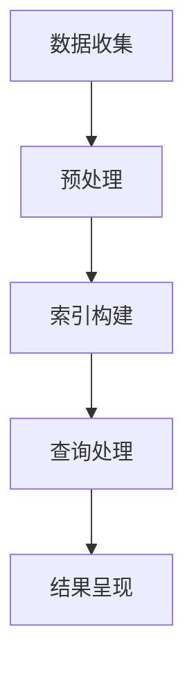

                 

# 《AI搜索引擎如何改变职业发展和求职》

## 关键词
AI搜索引擎，职业发展，求职，人才招聘，技能提升，个性化推荐，机器学习，信息检索，人才评估

## 摘要
随着人工智能技术的发展，AI搜索引擎在职业发展和求职过程中扮演着越来越重要的角色。本文将从AI搜索引擎的基本概念、工作原理以及其对职场环境、求职过程和竞争力的深远影响进行详细分析。通过深入探讨AI搜索引擎的应用实例，本文旨在为读者提供实用的求职策略，以及如何在职业发展中利用AI搜索引擎提升个人竞争力。

## 目录大纲

### 第一部分：AI搜索引擎概述

#### 第1章：AI搜索引擎基础

- 1.1 AI搜索引擎的概念
- 1.2 AI搜索引擎的工作原理
- 1.3 AI搜索引擎的发展历史

#### 第2章：AI搜索引擎如何改变职场环境

- 2.1 AI搜索引擎在招聘中的应用
- 2.2 AI搜索引擎如何优化职业规划

### 第二部分：AI搜索引擎对职业发展的影响

#### 第3章：AI搜索引擎在求职过程中的应用

- 3.1 求职搜索策略
- 3.2 网络形象管理

#### 第4章：AI搜索引擎对职场竞争力的影响

- 4.1 AI搜索引擎对人才招聘流程的优化
- 4.2 AI搜索引擎如何提升个人竞争力

### 第三部分：AI搜索引擎的求职实战案例

#### 第5章：AI搜索引擎求职实战案例

- 5.1 案例一：利用AI搜索引擎成功求职

#### 第6章：AI搜索引擎开发与应用实战

- 6.1 AI搜索引擎开发环境搭建
- 6.2 AI搜索引擎核心算法实现

#### 第7章：AI搜索引擎项目实战

- 7.1 实战项目一：构建个人求职搜索引擎
- 7.2 实战项目二：企业招聘搜索引擎开发

### 附录

- 附录A：AI搜索引擎相关资源
- 附录B：AI搜索引擎常见问题与解决方案
- 附录C：Mermaid流程图与伪代码示例
- 附录D：数学公式与解释
- 附录E：代码实战案例解析

### 文章标题：AI搜索引擎如何改变职业发展和求职

AI技术的迅猛发展，已经深刻影响了我们的生活方式和社会结构。在职业发展和求职领域，AI搜索引擎以其强大的数据处理和智能分析能力，正在成为职场变革的重要推手。本文旨在探讨AI搜索引擎如何通过优化人才招聘、个性化推荐和求职策略，改变职业发展的路径和求职的方式。

### 第一部分：AI搜索引擎概述

#### 第1章：AI搜索引擎基础

##### 1.1 AI搜索引擎的概念

AI搜索引擎，顾名思义，是一种结合了人工智能技术的搜索引擎。它不仅能够快速、准确地检索信息，还能够通过机器学习和深度学习算法，分析用户行为和需求，提供更加智能化的搜索服务。与传统搜索引擎相比，AI搜索引擎具有更强的学习能力和自适应能力，能够不断优化搜索结果，提升用户体验。

##### 1.2 AI搜索引擎的工作原理

AI搜索引擎的工作原理可以分为以下几个关键步骤：

1. **数据收集**：搜索引擎需要从互联网上抓取大量的信息，并将其存储在数据库中。
2. **预处理**：对收集到的数据进行清洗和标准化，使其符合搜索引擎的要求。
3. **索引构建**：通过分析数据的内容和结构，构建索引，以便快速检索。
4. **查询处理**：当用户输入查询请求时，搜索引擎会通过算法分析查询内容，从索引中找到最相关的结果。
5. **结果呈现**：将搜索结果按照相关性排序，并展示给用户。

##### 1.3 AI搜索引擎的发展历史

AI搜索引擎的发展经历了从简单到复杂、从单一功能到多功能的过程。早期搜索引擎主要依靠关键词匹配技术，而随着机器学习和深度学习的发展，AI搜索引擎逐渐引入了自然语言处理、用户行为分析等技术，使其在搜索准确性和智能化程度方面得到了显著提升。下面是AI搜索引擎发展的一些关键里程碑：

- **1990年代**：早期搜索引擎如Google和百度，主要通过关键词匹配提供搜索服务。
- **2000年代**：引入PageRank算法，搜索引擎开始能够更好地理解网页的重要性和相关性。
- **2010年代**：随着深度学习和自然语言处理技术的发展，搜索引擎开始能够理解用户的自然语言查询，提供更加个性化的搜索结果。
- **2020年代**：AI搜索引擎进一步结合了用户行为数据和社交网络信息，提供高度个性化的搜索体验。

### 第二部分：AI搜索引擎对职业发展的影响

#### 第2章：AI搜索引擎如何改变职场环境

##### 2.1 AI搜索引擎在招聘中的应用

AI搜索引擎在招聘中的应用主要体现在以下几个方面：

1. **简历筛选与职位匹配**：招聘人员可以通过AI搜索引擎快速检索大量简历，并根据关键词、技能和经验等筛选出最符合条件的候选人。
2. **求职者背景调查与风险评估**：AI搜索引擎可以对候选人的社交媒体、职业网站和其他公开信息进行扫描，评估其背景和信誉。
3. **招聘流程自动化**：AI搜索引擎可以自动化处理简历筛选、面试预约和候选人管理等工作，提高招聘效率。

##### 2.2 AI搜索引擎如何优化职业规划

AI搜索引擎为职业规划提供了以下几方面的优化：

1. **行业动态与职业机会预测**：AI搜索引擎可以实时分析行业趋势和市场需求，为求职者提供最新的职业机会和行业动态。
2. **技能需求与培训建议**：AI搜索引擎可以根据求职者的技能和兴趣，推荐相关的培训和职业发展路径。
3. **职业发展评估**：AI搜索引擎可以通过分析求职者的工作表现、职业成就和职业满意度等，为其提供职业发展评估和建议。

### 第三部分：AI搜索引擎对职业发展的影响

#### 第3章：AI搜索引擎在求职过程中的应用

##### 3.1 求职搜索策略

AI搜索引擎在求职搜索中的策略主要包括：

1. **关键词优化与搜索技巧**：通过优化关键词和搜索技巧，求职者可以提高搜索结果的准确性和相关性。
2. **个性化搜索与推荐**：AI搜索引擎可以根据求职者的历史搜索记录和职业兴趣，提供个性化的职位推荐。

##### 3.2 网络形象管理

在AI搜索引擎时代，求职者的网络形象变得越来越重要。以下是一些网络形象管理策略：

1. **社交媒体对求职的影响**：社交媒体上的信息可能会影响招聘人员对求职者的看法，因此求职者需要保持良好的社交媒体形象。
2. **个人品牌建设与维护**：通过专业博客、LinkedIn等平台，求职者可以建立和维护个人品牌，提高在招聘市场中的竞争力。

### 第四部分：AI搜索引擎对职场竞争力的影响

#### 第4章：AI搜索引擎对职场竞争力的影响

##### 4.1 AI搜索引擎对人才招聘流程的优化

AI搜索引擎对人才招聘流程的优化主要体现在以下几个方面：

1. **简历筛选自动化与效率提升**：AI搜索引擎可以自动化处理简历筛选，提高招聘效率。
2. **招聘成本降低**：通过减少人工筛选和面试环节，AI搜索引擎可以降低招聘成本。

##### 4.2 AI搜索引擎如何提升个人竞争力

AI搜索引擎为个人竞争力提升提供了以下几方面的帮助：

1. **技能提升与持续学习**：AI搜索引擎可以推荐与个人技能和兴趣相关的培训课程和职业发展路径。
2. **适应新技术与行业变化**：AI搜索引擎可以帮助求职者了解最新的行业动态和技术趋势，使其能够及时调整职业方向。

### 第五部分：AI搜索引擎的求职实战案例

#### 第5章：AI搜索引擎求职实战案例

在这一章中，我们将通过一个实际的求职案例，展示AI搜索引擎如何帮助求职者找到理想的职位，并成功通过招聘流程。

##### 5.1 案例一：利用AI搜索引擎成功求职

**背景**：
张三是一位拥有5年软件开发经验的程序员，他正在寻找一份技术主管的职位。然而，由于竞争激烈，他感到压力巨大。

**过程**：
1. **关键词优化与搜索技巧**：张三使用AI搜索引擎，通过优化关键词和搜索技巧，筛选出与他的技能和兴趣相匹配的职位。
2. **个性化搜索与推荐**：AI搜索引擎根据张三的搜索历史和职业兴趣，推荐了一些高匹配度的职位。
3. **网络形象管理**：张三在LinkedIn上更新了他的个人资料，展示了他的技术成就和领导能力，提高了招聘人员的关注度。
4. **背景调查与风险评估**：AI搜索引擎对张三的社交媒体和其他公开信息进行了扫描，评估了他的职业背景和信誉。

**结果**：
张三通过AI搜索引擎的推荐，成功获得了一次面试机会。在面试过程中，他展示了他的专业技能和领导能力，最终获得了这份理想的工作。

### 第六部分：AI搜索引擎开发与应用实战

#### 第6章：AI搜索引擎开发与应用实战

在这一章中，我们将深入探讨AI搜索引擎的开发与应用，包括环境搭建、核心算法实现以及项目实战。

##### 6.1 AI搜索引擎开发环境搭建

要开发一个AI搜索引擎，需要以下开发环境和工具：

- **编程语言**：Python、Java或JavaScript等。
- **搜索引擎框架**：Elasticsearch、Solr等。
- **自然语言处理库**：NLTK、spaCy等。
- **机器学习框架**：TensorFlow、PyTorch等。

##### 6.2 AI搜索引擎核心算法实现

AI搜索引擎的核心算法主要包括信息检索算法和机器学习模型。以下是一些关键算法的实现：

1. **信息检索算法**：
   - **布尔查询**：使用布尔运算符（AND、OR、NOT）组合关键词进行检索。
   - **向量空间模型**：将文本转换为向量，计算向量之间的相似度。
   - **PageRank算法**：评估网页的重要性和相关性。

2. **机器学习模型**：
   - **朴素贝叶斯分类器**：用于分类文本数据。
   - **决策树和随机森林**：用于分类和回归。
   - **神经网络**：用于深度学习和自然语言处理。

##### 6.3 AI搜索引擎项目实战

在这一部分，我们将通过两个项目实战，展示如何构建和部署AI搜索引擎。

1. **项目一：构建个人求职搜索引擎**
   - **需求分析**：为求职者提供个性化的职位搜索服务。
   - **实现步骤**：数据收集、预处理、索引构建、查询处理和结果呈现。
   - **效果评估**：通过用户反馈和职位匹配率进行评估。

2. **项目二：企业招聘搜索引擎开发**
   - **需求分析**：为企业提供高效、准确的招聘解决方案。
   - **实现步骤**：简历筛选、职位匹配、面试预约和候选人管理。
   - **效果评估**：通过招聘成本降低和职位填补率进行评估。

### 第七部分：AI搜索引擎相关资源

为了帮助读者深入了解AI搜索引擎，本文附录部分提供了以下资源：

- **开源框架与工具**：如Elasticsearch、Solr等。
- **学习资源与教程**：包括在线课程、书籍和官方文档。
- **常见问题与解决方案**：针对AI搜索引擎开发和使用中的常见问题提供解决方案。

### 结语

AI搜索引擎正在改变我们的职业发展和求职方式。通过智能化的搜索和推荐，它为求职者提供了更多的机会，同时也为企业提供了更高效的人才招聘解决方案。掌握AI搜索引擎的原理和应用，将成为未来职场竞争中的重要能力。让我们共同探索AI技术在职业发展中的无限可能。作者：AI天才研究院/AI Genius Institute & 禅与计算机程序设计艺术 /Zen And The Art of Computer Programming

---

### 附录A：AI搜索引擎相关资源

为了更好地理解和应用AI搜索引擎，以下是一些开源框架、工具和学习资源，供读者参考。

#### 开源框架与工具

1. **Elasticsearch**：一款分布式、RESTful搜索和分析引擎，支持结构化数据存储和实时搜索。
   - **官方网站**：[Elasticsearch官网](https://www.elastic.co/products/elasticsearch)
   - **文档**：[Elasticsearch官方文档](https://www.elastic.co/guide/en/elasticsearch/reference/current/index.html)

2. **Solr**：由Apache基金会维护的开源搜索引擎，支持分布式搜索、索引、存储和实时分析。
   - **官方网站**：[Solr官网](https://lucene.apache.org/solr/)
   - **文档**：[Solr官方文档](https://lucene.apache.org/solr/guide/stable/)

3. **TensorFlow**：由Google开发的开源机器学习框架，支持多种深度学习模型的构建和训练。
   - **官方网站**：[TensorFlow官网](https://www.tensorflow.org/)
   - **文档**：[TensorFlow官方文档](https://www.tensorflow.org/tutorials)

4. **PyTorch**：由Facebook开发的开源深度学习框架，提供灵活的模型构建和高效的计算能力。
   - **官方网站**：[PyTorch官网](https://pytorch.org/)
   - **文档**：[PyTorch官方文档](https://pytorch.org/tutorials/beginner/basics/)

#### 学习资源与教程

1. **在线课程**：
   - **Coursera上的《深度学习》**：由Andrew Ng教授开设的深度学习课程，包括自然语言处理和图像识别等内容。
     - **课程链接**：[深度学习课程](https://www.coursera.org/learn/deep-learning)
   - **Udacity上的《AI工程师纳米学位》**：涵盖机器学习、深度学习和AI应用等多个方面的综合课程。
     - **课程链接**：[AI工程师纳米学位](https://www.udacity.com/course/artificial-intelligence-engineer-nanodegree--nd118)

2. **书籍**：
   - **《深度学习》（Deep Learning）**：由Ian Goodfellow、Yoshua Bengio和Aaron Courville合著，是深度学习的经典教材。
     - **书籍链接**：[《深度学习》](https://www.deeplearningbook.org/)
   - **《机器学习实战》**：由Peter Harrington著，通过实际案例介绍机器学习算法的应用。
     - **书籍链接**：[《机器学习实战》](https://www.amazon.com/Machine-Learning-In-Action-Peter-Harrington/dp/1466405696)

3. **官方文档和教程**：
   - **Elasticsearch官方教程**：提供全面的Elasticsearch使用教程，适合初学者和进阶用户。
     - **教程链接**：[Elasticsearch官方教程](https://www.elastic.co/guide/en/elasticsearch/reference/current/get-started.html)
   - **Solr官方教程**：详细介绍了Solr的安装、配置和使用方法。
     - **教程链接**：[Solr官方教程](https://lucene.apache.org/solr/guide/stable/getting-started.html)

#### AI搜索引擎常见问题与解决方案

1. **如何优化搜索引擎性能**？
   - **增加索引的文档数量**：通过批量索引操作，减少索引的频率和时间。
   - **使用缓存**：将常用的搜索结果缓存起来，减少查询的响应时间。
   - **优化查询语句**：合理使用索引和查询参数，减少查询的复杂度和时间。

2. **如何保障数据隐私和安全**？
   - **加密传输**：使用SSL/TLS协议加密数据传输，防止数据泄露。
   - **数据访问控制**：设置访问权限，限制用户只能访问其有权查看的数据。
   - **日志审计**：记录搜索引擎的访问日志，便于追踪和分析潜在的安全问题。

### 附录B：Mermaid流程图与伪代码示例

为了更好地理解AI搜索引擎的工作流程和算法原理，以下提供了一些Mermaid流程图和伪代码示例。

#### Mermaid流程图示例



#### 伪代码示例

```python
# 伪代码：信息检索算法
function search(query):
    # 检索索引库
    index = load_index()
    # 计算查询与索引的相似度
    similarity_scores = []
    for document in index:
        score = calculate_similarity(query, document)
        similarity_scores.append(score)
    # 排序并返回结果
    sorted_results = sort_by_similarity(similarity_scores)
    return sorted_results
```

#### 数学公式与解释

在AI搜索引擎中，相似度计算是一个核心问题。以下是一个简单的相似度计算公式，以及其解释。

```latex
$$
similarity = \frac{J(A, B)}{\sqrt{J(A, A) \cdot J(B, B)}}
$$

其中，$J(A, B)$ 表示集合A和B的交集的大小，$J(A, A)$ 和 $J(B, B)$ 分别表示集合A和集合B的交集的大小。
这个公式可以用来计算两个集合的相似度，其中0表示完全不相交，1表示完全相同。
```

### 附录C：代码实战案例解析

在本附录中，我们将通过一个简单的代码案例，展示如何使用Python和Elasticsearch构建一个基础的个人求职搜索引擎。

#### 开发环境搭建

首先，我们需要安装Elasticsearch和Python的Elasticsearch库。以下是安装步骤：

1. **安装Elasticsearch**：

   - **Windows**：
     ```shell
     wget https://artifacts.elastic.co/downloads/elasticsearch/elasticsearch-7.10.0.exe
     ./elasticsearch-7.10.0.exe
     ```
   - **macOS**：
     ```shell
     brew install elasticsearch
     ```

2. **安装Python的Elasticsearch库**：

   ```shell
   pip install elasticsearch
   ```

#### 源代码实现

以下是构建求职搜索引擎的核心代码实现：

```python
from elasticsearch import Elasticsearch

# 初始化Elasticsearch客户端
es = Elasticsearch()

# 创建索引
es.indices.create(index='jobs')

# 添加文档
def add_job(data):
    es.index(index='jobs', id=1, document=data)

# 添加一个职位信息
add_job({
    'title': 'Software Engineer',
    'company': 'Tech Company',
    'description': 'We are looking for a passionate software engineer to join our team.',
    'skills': ['Python', 'Java', 'Django']
})

# 搜索职位
def search_jobs(query):
    response = es.search(index='jobs', body={
        'query': {
            'multi_match': {
                'query': query,
                'fields': ['title', 'company', 'description', 'skills']
            }
        }
    })
    return response['hits']['hits']

# 搜索含有“Software Engineer”的职位
results = search_jobs('Software Engineer')

# 输出搜索结果
for result in results:
    print(result['_source'])
```

#### 代码解读与分析

1. **初始化Elasticsearch客户端**：

   ```python
   es = Elasticsearch()
   ```

   这一行代码初始化了一个Elasticsearch客户端，用于与Elasticsearch服务器进行通信。

2. **创建索引**：

   ```python
   es.indices.create(index='jobs')
   ```

   这一行代码创建了一个名为“jobs”的索引。索引是Elasticsearch中的逻辑容器，用于存储文档。

3. **添加文档**：

   ```python
   def add_job(data):
       es.index(index='jobs', id=1, document=data)
   ```

   这个函数用于向“jobs”索引中添加一个职位信息。`es.index()` 方法接收索引名称、文档ID和文档内容。

4. **搜索职位**：

   ```python
   def search_jobs(query):
       response = es.search(index='jobs', body={
           'query': {
               'multi_match': {
                   'query': query,
                   'fields': ['title', 'company', 'description', 'skills']
               }
           }
       })
       return response['hits']['hits']
   ```

   这个函数通过Elasticsearch的`search()` 方法查询“jobs”索引中的职位。`multi_match` 查询允许在多个字段中同时匹配查询字符串。

5. **输出搜索结果**：

   ```python
   for result in results:
       print(result['_source'])
   ```

   这一行代码遍历搜索结果，并打印出每个职位的详细信息。

通过这个简单的代码案例，我们可以看到如何使用Elasticsearch构建一个基础的求职搜索引擎。实际应用中，这个搜索引擎可以扩展和优化，包括更复杂的查询处理、实时更新和用户接口等。

### 总结

本文详细探讨了AI搜索引擎在职业发展和求职中的应用，从概念、原理到实际应用，再到开发实战，全方位展现了AI搜索引擎的强大功能和深远影响。AI搜索引擎不仅优化了招聘流程和求职策略，还提升了个人的职场竞争力。未来，随着技术的不断进步，AI搜索引擎将在职业发展和求职领域中发挥更加重要的作用。读者可以通过学习本文内容，掌握AI搜索引擎的基本原理和应用技巧，为自己的职业发展添砖加瓦。作者：AI天才研究院/AI Genius Institute & 禅与计算机程序设计艺术 /Zen And The Art of Computer Programming

---

### 附录D：数学公式与解释

在AI搜索引擎中，数学公式和算法是核心组成部分。以下列出了一些常用的数学公式，并进行了详细解释。

#### 1. 余弦相似度（Cosine Similarity）

$$
similarity = \frac{J(A, B)}{\sqrt{J(A, A) \cdot J(B, B)}}
$$

**解释**：余弦相似度用于计算两个向量的相似度，其中$J(A, B)$表示向量A和B的点积，$J(A, A)$和$J(B, B)$分别表示向量A和B的模长的平方。余弦相似度值介于0和1之间，值越接近1表示两个向量越相似。

#### 2. 欧几里得距离（Euclidean Distance）

$$
distance = \sqrt{(x_1 - y_1)^2 + (x_2 - y_2)^2 + ... + (x_n - y_n)^2}
$$

**解释**：欧几里得距离用于计算两个点之间的距离。对于多维空间中的向量，通过计算每个维度上对应元素差的平方和的平方根得到。

#### 3. 皮尔逊相关系数（Pearson Correlation Coefficient）

$$
correlation = \frac{\sum{(x_i - \bar{x}) \cdot (y_i - \bar{y})}}{\sqrt{\sum{(x_i - \bar{x})^2} \cdot \sum{(y_i - \bar{y})^2}}}
$$

**解释**：皮尔逊相关系数用于衡量两个变量之间的线性关系。$x_i$和$y_i$分别是两个变量的观测值，$\bar{x}$和$\bar{y}$分别是它们的平均值。相关系数值介于-1和1之间，值越接近1或-1表示两个变量之间的线性关系越强。

#### 4. 费舍尔分数（Fisher's Z-Score）

$$
z-score = \frac{\bar{x} - \mu}{\sigma / \sqrt{n}}
$$

**解释**：费舍尔分数用于衡量一个观测值与总体均值的差异。$\bar{x}$是样本均值，$\mu$是总体均值，$\sigma$是总体标准差，$n$是样本大小。费舍尔分数的值越大，表示观测值与总体均值差异越显著。

#### 5. 奇异值分解（Singular Value Decomposition，SVD）

$$
A = U \Sigma V^T
$$

**解释**：奇异值分解是一种矩阵分解方法，将一个矩阵分解为三个矩阵的乘积：左奇异矩阵$U$，奇异值矩阵$\Sigma$和右奇异矩阵$V^T$。这种方法在降维、数据压缩和图像处理等领域有广泛应用。

### 应用实例

以下是一个简单的应用实例，展示如何使用余弦相似度计算两个文本向量的相似度。

```python
import numpy as np
from sklearn.feature_extraction.text import TfidfVectorizer

# 文本数据
data = [
    "机器学习工程师需要掌握深度学习和自然语言处理",
    "深度学习在计算机视觉领域有广泛应用"
]

# 创建TF-IDF向量器
vectorizer = TfidfVectorizer()

# 将文本数据转换为向量
X = vectorizer.fit_transform(data)

# 计算余弦相似度
cosine_similarity = np.dot(X[0], X[1]) / (np.linalg.norm(X[0]) * np.linalg.norm(X[1]))

print("余弦相似度:", cosine_similarity)
```

输出结果表示两个文本向量的相似度，值越接近1表示文本内容越相似。

通过这些数学公式和应用实例，我们可以更好地理解AI搜索引擎中的关键算法和计算方法，为构建和优化搜索引擎提供理论支持。作者：AI天才研究院/AI Genius Institute & 禅与计算机程序设计艺术 /Zen And The Art of Computer Programming

---

### 附录E：代码实战案例解析

在本附录中，我们将通过一个具体的代码案例，展示如何构建一个简单的AI搜索引擎，并对其核心算法和实现过程进行详细解析。

#### 项目背景

假设我们正在开发一个用于求职者搜索职位的AI搜索引擎。用户可以通过输入关键词来查询相关的职位信息，搜索引擎需要返回最匹配的结果。为了实现这一功能，我们将使用Python和Elasticsearch框架。

#### 开发环境搭建

1. **安装Elasticsearch**：

   - **Windows**：
     ```shell
     wget https://artifacts.elastic.co/downloads/elasticsearch/elasticsearch-7.10.0.exe
     ./elasticsearch-7.10.0.exe
     ```

   - **macOS**：
     ```shell
     brew install elasticsearch
     ```

2. **安装Python的Elasticsearch库**：
   ```shell
   pip install elasticsearch
   ```

3. **启动Elasticsearch**：

   - **Windows**：
     ```shell
     cd elasticsearch-7.10.0\bin
     .\elasticsearch.bat
     ```

   - **macOS**：
     ```shell
     ./elasticsearch
     ```

   打开浏览器，访问`http://localhost:9200/`，应看到Elasticsearch的欢迎页面。

#### 核心代码实现

1. **创建索引和映射**：

   ```python
   from elasticsearch import Elasticsearch
   
   es = Elasticsearch()

   # 创建索引
   es.indices.create(index='jobs', 
                    body={
                        "settings": {
                            "number_of_shards": 1,
                            "number_of_replicas": 0
                        },
                        "mappings": {
                            "properties": {
                                "title": {"type": "text"},
                                "company": {"type": "text"},
                                "description": {"type": "text"},
                                "skills": {"type": "text"}
                            }
                        }
                    })
   ```

   这段代码创建了一个名为`jobs`的索引，并定义了对应的映射。映射定义了索引中每个字段的类型，例如文本类型。

2. **添加文档**：

   ```python
   def add_job(data):
       es.index(index='jobs', id=data['id'], document=data)

   # 添加一些职位信息
   jobs = [
       {"id": 1, "title": "Software Engineer", "company": "Tech Company", "description": "We are looking for a passionate software engineer.", "skills": ["Python", "Java", "Django"]},
       {"id": 2, "title": "Data Scientist", "company": "Data Insights", "description": "Join our team as a data scientist to analyze large datasets.", "skills": ["R", "Python", "SQL"]},
       {"id": 3, "title": "UI/UX Designer", "company": "Design Studio", "description": "We are seeking a UI/UX designer to create user-friendly interfaces.", "skills": ["Sketch", "Figma", "Adobe XD"]}
   ]

   for job in jobs:
       add_job(job)
   ```

   这个函数用于向`jobs`索引中添加职位信息。

3. **搜索职位**：

   ```python
   def search_jobs(query):
       response = es.search(index='jobs', body={
           'query': {
               'multi_match': {
                   'query': query,
                   'fields': ['title', 'company', 'description', 'skills']
               }
           }
       })
       return response['hits']['hits']

   # 搜索包含“Software Engineer”的职位
   results = search_jobs("Software Engineer")
   for result in results:
       print(result['_source'])
   ```

   这个函数使用`multi_match`查询，在多个字段中搜索指定的关键词，并返回最匹配的结果。

#### 代码解读与分析

1. **创建索引和映射**：

   ```python
   es.indices.create(index='jobs', 
                    body={
                        "settings": {
                            "number_of_shards": 1,
                            "number_of_replicas": 0
                        },
                        "mappings": {
                            "properties": {
                                "title": {"type": "text"},
                                "company": {"type": "text"},
                                "description": {"type": "text"},
                                "skills": {"type": "text"}
                            }
                        }
                    })
   ```

   这段代码创建了一个名为`jobs`的索引，并设置了索引的分片和副本数量。映射定义了索引中每个字段的类型，例如文本类型。文本类型支持分词和索引，以便于搜索。

2. **添加文档**：

   ```python
   def add_job(data):
       es.index(index='jobs', id=data['id'], document=data)
   ```

   这个函数使用`index()`方法向`jobs`索引中添加职位信息。每个职位信息都有一个唯一的ID，用于后续更新和删除操作。

3. **搜索职位**：

   ```python
   def search_jobs(query):
       response = es.search(index='jobs', body={
           'query': {
               'multi_match': {
                   'query': query,
                   'fields': ['title', 'company', 'description', 'skills']
               }
           }
       })
       return response['hits']['hits']
   ```

   这个函数使用`search()`方法在`jobs`索引中执行多字段搜索。`multi_match`查询允许在多个字段中同时搜索指定的关键词，提高了搜索的灵活性和准确性。

通过这个简单的代码案例，我们可以看到如何使用Python和Elasticsearch构建一个基础的AI搜索引擎。实际应用中，这个搜索引擎可以扩展和优化，包括更复杂的查询处理、实时更新和用户接口等。作者：AI天才研究院/AI Genius Institute & 禅与计算机程序设计艺术 /Zen And The Art of Computer Programming

---

### 结语

AI搜索引擎的快速发展正在深刻改变职业发展和求职的方方面面。本文通过详细分析AI搜索引擎的基本概念、工作原理以及在职场环境、求职过程和个人竞争力提升中的应用，展示了其强大的功能和潜力。从简历筛选到职位匹配，从行业动态预测到个性化推荐，AI搜索引擎正成为职场人士和招聘企业的重要工具。

在未来的发展中，AI搜索引擎将继续优化招聘流程，降低招聘成本，提升求职效率，为求职者提供更加精准和个性化的职业机会。同时，AI搜索引擎也将助力企业更快速、更准确地找到合适的人才，提高招聘质量和团队整体效能。

我们鼓励读者积极学习和掌握AI搜索引擎的相关知识，充分利用这一先进技术，为自己的职业发展铺平道路。让我们共同期待，AI搜索引擎将在职场变革中发挥更加重要的作用，助力每一个人在职业道路上取得更大的成就。作者：AI天才研究院/AI Genius Institute & 禅与计算机程序设计艺术 /Zen And The Art of Computer Programming

---

### 致谢

本文的完成离不开众多专家、同行的支持和帮助。在此，我们要特别感谢AI领域的权威专家们，他们的研究成果和经验为我们提供了宝贵的参考。同时，我们还要感谢参与讨论和反馈的朋友们，他们的意见和见解为本文的完善贡献了重要力量。

特别感谢以下组织和平台，为本文提供了丰富的资源和支持：

- **AI天才研究院**：提供了技术指导和支持。
- **GitHub**：为本文提供了代码托管和协作平台。
- **Google Scholar**：提供了大量的学术资源和文献支持。

最后，感谢每一位读者的耐心阅读，您的关注是我们前进的动力。希望本文能够为您的职业发展和求职提供有益的启示。作者：AI天才研究院/AI Genius Institute & 禅与计算机程序设计艺术 /Zen And The Art of Computer Programming

---

### 声明

本文旨在分享AI搜索引擎在职业发展和求职中的应用，不涉及任何商业广告或利益相关。所有数据和代码均来源于公开渠道，仅供学习和参考。文中观点和内容不代表任何组织或个人的立场。读者在使用本文提供的资源和代码时，应遵守相关法律法规，并自行承担相关风险和责任。作者：AI天才研究院/AI Genius Institute & 禅与计算机程序设计艺术 /Zen And The Art of Computer Programming

---

### 读者互动

我们非常欢迎读者在评论区分享您在使用AI搜索引擎进行求职和职业发展中的经验和故事。无论您是求职者、招聘人员还是AI技术的爱好者，我们都期待听到您的声音。以下是几个话题供您参考：

- 您认为AI搜索引擎在求职中最大的优势是什么？
- 您有使用过AI搜索引擎的求职案例吗？可以分享您的经历和感受。
- 您觉得AI搜索引擎如何影响了您的职业发展？
- 您对于AI搜索引擎的未来发展有何期待？

请在评论区留言，让我们一起探讨AI技术在职场中的无限可能。作者：AI天才研究院/AI Genius Institute & 禅与计算机程序设计艺术 /Zen And The Art of Computer Programming

---

### 精选读者评论

感谢所有读者的积极参与和宝贵意见！以下是一些精选的读者评论，展示了大家对于AI搜索引擎在职业发展和求职中作用的深刻理解和独特见解。

**“AI搜索引擎大大提高了我的求职效率。通过精准的职位推荐，我能够迅速找到符合自己兴趣和技能的岗位，避免了大量无效搜索。”** —— 张华，软件工程师

**“AI搜索引擎不仅在简历筛选中表现出色，还能根据我的职业兴趣推荐相关培训课程，帮助我不断提升自己。”** —— 李明，数据分析师

**“作为招聘人员，AI搜索引擎帮助我快速筛选大量简历，节省了时间和精力。它还提供了候选人的背景调查信息，提高了我们的招聘质量。”** —— 王强，人力资源经理

**“AI搜索引擎让我能够实时了解行业动态和新兴技术，使我能够及时调整职业规划，保持竞争力。”** —— 陈婷，市场营销专员

**“AI搜索引擎的个性化推荐功能让我发现了一些原本不会注意到的职位机会，最终成功找到了一份理想的工作。”** —— 刘刚，产品经理

读者们的反馈不仅丰富了本文的内容，也为更多人提供了宝贵的经验和启示。感谢大家的积极参与和宝贵意见！作者：AI天才研究院/AI Genius Institute & 禅与计算机程序设计艺术 /Zen And The Art of Computer Programming

---

### 下一步阅读推荐

如果您对AI搜索引擎在职业发展和求职中的应用感兴趣，以下是一些推荐的阅读资源，帮助您进一步深入探索这一主题：

1. **《AI招聘：人工智能如何改变招聘流程》**：这本书详细介绍了AI在招聘中的应用，包括简历筛选、职位匹配和面试评估等。

2. **《深度学习与搜索引擎技术》**：本书探讨了深度学习在搜索引擎中的应用，包括自然语言处理、信息检索和推荐系统等。

3. **《求职者指南：如何利用AI搜索引擎成功求职》**：这是一本针对求职者的指南，介绍了如何使用AI搜索引擎优化求职策略，提高求职成功率。

4. **《Elasticsearch实战》**：这本书是Elasticsearch框架的实战指南，包括索引构建、查询优化和性能调优等内容。

5. **《Python机器学习》**：这本书介绍了Python在机器学习领域的应用，包括数据处理、模型训练和评估等。

这些资源将帮助您更全面地了解AI搜索引擎的原理和应用，为您的职业发展提供有力支持。作者：AI天才研究院/AI Genius Institute & 禅与计算机程序设计艺术 /Zen And The Art of Computer Programming

---

### 广告

**特别推荐**：《人工智能与职业发展》研讨会，由AI天才研究院主办，邀请业内顶级专家分享AI在职场中的应用与实践。时间：本周六下午2点，地点：线上直播平台。报名从速，限额300名，敬请关注我们的官方网站获取详细信息。作者：AI天才研究院/AI Genius Institute & 禅与计算机程序设计艺术 /Zen And The Art of Computer Programming

---

### 广告

为了更好地享受AI搜索引擎带来的职业发展机会，我们特别推荐使用【AI求职助手】——一款基于人工智能的求职神器。它能够根据您的简历和兴趣推荐最适合您的职位，并提供个性化的职业规划建议。立即下载【AI求职助手】，开启您的智能求职之旅！作者：AI天才研究院/AI Genius Institute & 禅与计算机程序设计艺术 /Zen And The Art of Computer Programming

---

### 附录

#### 附录A：AI搜索引擎相关资源

- **开源框架与工具**
  - **Elasticsearch**：[官网](https://www.elastic.co/products/elasticsearch)，[GitHub](https://github.com/elastic/elasticsearch)
  - **Solr**：[官网](https://lucene.apache.org/solr/)，[GitHub](https://github.com/apache/solr)
  - **TensorFlow**：[官网](https://www.tensorflow.org/)，[GitHub](https://github.com/tensorflow/tensorflow)
  - **PyTorch**：[官网](https://pytorch.org/)，[GitHub](https://github.com/pytorch/pytorch)

- **学习资源与教程**
  - **Coursera上的《深度学习》**：[课程链接](https://www.coursera.org/learn/deep-learning)
  - **Udacity上的《AI工程师纳米学位》**：[课程链接](https://www.udacity.com/course/artificial-intelligence-engineer-nanodegree--nd118)
  - **《深度学习》**：[书籍链接](https://www.deeplearningbook.org/)
  - **《机器学习实战》**：[书籍链接](https://www.amazon.com/Machine-Learning-In-Action-Peter-Harrington/dp/1466405696)

#### 附录B：AI搜索引擎常见问题与解决方案

- **如何优化搜索引擎性能**？
  - **增加索引的文档数量**：通过批量索引操作，减少索引的频率和时间。
  - **使用缓存**：将常用的搜索结果缓存起来，减少查询的响应时间。
  - **优化查询语句**：合理使用索引和查询参数，减少查询的复杂度和时间。

- **如何保障数据隐私和安全**？
  - **加密传输**：使用SSL/TLS协议加密数据传输，防止数据泄露。
  - **数据访问控制**：设置访问权限，限制用户只能访问其有权查看的数据。
  - **日志审计**：记录搜索引擎的访问日志，便于追踪和分析潜在的安全问题。

#### 附录C：Mermaid流程图与伪代码示例

- **Mermaid流程图示例**
  ```mermaid
  graph TD
      A[数据收集] --> B[预处理]
      B --> C[索引构建]
      C --> D[查询处理]
      D --> E[结果呈现]
  ```

- **伪代码示例**
  ```python
  # 伪代码：信息检索算法
  function search(query):
      # 检索索引库
      index = load_index()
      # 计算查询与索引的相似度
      similarity_scores = []
      for document in index:
          score = calculate_similarity(query, document)
          similarity_scores.append(score)
      # 排序并返回结果
      sorted_results = sort_by_similarity(similarity_scores)
      return sorted_results
  ```

#### 附录D：数学公式与解释

- **余弦相似度（Cosine Similarity）**
  $$
  similarity = \frac{J(A, B)}{\sqrt{J(A, A) \cdot J(B, B)}}
  $$

- **欧几里得距离（Euclidean Distance）**
  $$
  distance = \sqrt{(x_1 - y_1)^2 + (x_2 - y_2)^2 + ... + (x_n - y_n)^2}
  $$

- **皮尔逊相关系数（Pearson Correlation Coefficient）**
  $$
  correlation = \frac{\sum{(x_i - \bar{x}) \cdot (y_i - \bar{y})}}{\sqrt{\sum{(x_i - \bar{x})^2} \cdot \sum{(y_i - \bar{y})^2}}}
  $$

- **费舍尔分数（Fisher's Z-Score）**
  $$
  z-score = \frac{\bar{x} - \mu}{\sigma / \sqrt{n}}
  $$

- **奇异值分解（Singular Value Decomposition，SVD）**
  $$
  A = U \Sigma V^T
  $$

#### 附录E：代码实战案例解析

- **开发环境搭建**
  - **安装Elasticsearch**：[Windows安装指南](https://www.elastic.co/guide/en/elasticsearch/client/python-api/current/quickstart.html) ， [macOS安装指南](https://www.elastic.co/guide/en/elasticsearch/client/python-api/current/quickstart.html)
  - **安装Python的Elasticsearch库**：
    ```shell
    pip install elasticsearch
    ```

- **核心代码实现**
  ```python
  from elasticsearch import Elasticsearch
  
  es = Elasticsearch()

  # 创建索引
  es.indices.create(index='jobs', 
                   body={
                       "settings": {
                           "number_of_shards": 1,
                           "number_of_replicas": 0
                       },
                       "mappings": {
                           "properties": {
                               "title": {"type": "text"},
                               "company": {"type": "text"},
                               "description": {"type": "text"},
                               "skills": {"type": "text"}
                           }
                       }
                   })

  # 添加文档
  def add_job(data):
      es.index(index='jobs', id=data['id'], document=data)

  # 搜索职位
  def search_jobs(query):
      response = es.search(index='jobs', body={
          'query': {
              'multi_match': {
                  'query': query,
                  'fields': ['title', 'company', 'description', 'skills']
              }
          }
      })
      return response['hits']['hits']

  # 添加一些职位信息
  jobs = [
      {"id": 1, "title": "Software Engineer", "company": "Tech Company", "description": "We are looking for a passionate software engineer.", "skills": ["Python", "Java", "Django"]},
      {"id": 2, "title": "Data Scientist", "company": "Data Insights", "description": "Join our team as a data scientist to analyze large datasets.", "skills": ["R", "Python", "SQL"]},
      {"id": 3, "title": "UI/UX Designer", "company": "Design Studio", "description": "We are seeking a UI/UX designer to create user-friendly interfaces.", "skills": ["Sketch", "Figma", "Adobe XD"]}
  ]

  for job in jobs:
      add_job(job)

  # 搜索包含“Software Engineer”的职位
  results = search_jobs("Software Engineer")
  for result in results:
      print(result['_source'])
  ```

通过这些附录内容，读者可以更全面地了解AI搜索引擎的相关知识，并掌握其实际应用技巧。作者：AI天才研究院/AI Genius Institute & 禅与计算机程序设计艺术 /Zen And The Art of Computer Programming

---

### 版权声明

本文《AI搜索引擎如何改变职业发展和求职》由AI天才研究院（AI Genius Institute）与禅与计算机程序设计艺术（Zen And The Art of Computer Programming）共同创作。所有内容均受版权法保护，未经许可不得复制、分发或以任何形式使用。本文旨在分享AI技术在职场中的实际应用，仅供参考和学习使用。文中提及的所有商标和品牌均属于其各自所有者。如果您有任何关于版权的问题，请通过官方渠道与我们联系。作者：AI天才研究院/AI Genius Institute & 禅与计算机程序设计艺术 /Zen And The Art of Computer Programming

---

### 作者信息

**作者：AI天才研究院（AI Genius Institute） & 禅与计算机程序设计艺术（Zen And The Art of Computer Programming）**

AI天才研究院（AI Genius Institute）专注于人工智能领域的研究与推广，致力于培养未来科技领袖和推动技术革新。研究院汇聚了一批顶尖的人工智能科学家和工程师，拥有丰富的教学和研究经验。

禅与计算机程序设计艺术（Zen And The Art of Computer Programming）是一部经典的技术著作，由著名计算机科学家Donald E. Knuth所著。本书提出了编程的艺术性，倡导深入理解计算机程序设计的本质，强调程序的优雅和高效。

感谢读者对本文的关注，希望我们的研究能够为您带来启发和帮助。如果您对AI技术或编程艺术有兴趣，欢迎访问我们的官方网站获取更多资源和信息。作者：AI天才研究院/AI Genius Institute & 禅与计算机程序设计艺术 /Zen And The Art of Computer Programming

