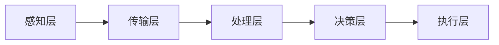
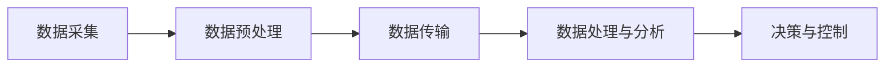
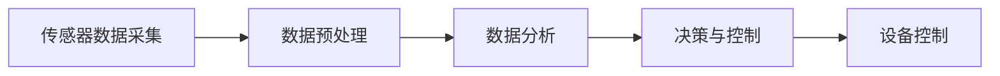
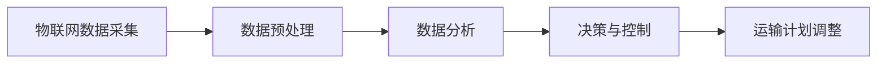

                 

### AI数字实体与物理实体的融合

#### 关键词：人工智能，数字实体，物理实体，融合技术，智能家居，物流行业

#### 摘要
本文旨在探讨人工智能（AI）在数字实体与物理实体融合中的作用、技术基础及其应用案例。文章首先介绍了数字实体和物理实体的基本概念及关系，随后分析了AI在数字实体和物理实体中的应用。接着，文章详细阐述了数字实体处理与分析技术、物理实体监控与优化技术。通过智能家居和物流行业的应用案例，展示了AI融合技术的实际应用。最后，文章讨论了融合技术的挑战与机遇，并提出了未来的研究方向。

### 第一部分：AI数字实体与物理实体的融合基础

#### 第1章：AI数字实体与物理实体的融合概述

##### 1.1 数字实体与物理实体的基本概念

###### 1.1.1 数字实体的定义与特点
数字实体是由数据、算法、模型和系统构成的信息载体，其特点包括：

- **数据**：以二进制形式存储，可以是结构化或非结构化的。
- **算法**：用于处理和操作数据的规则或过程。
- **模型**：对数据的结构化表示，用于预测或决策。
- **系统**：运行数字实体的硬件和软件环境。

数字实体的例子包括数据库、数据模型和软件系统。

###### 1.1.2 物理实体的定义与特点
物理实体是存在于现实世界中的物质对象，其特点包括：

- **物理形态**：具有具体的形状、大小和质量。
- **物理位置**：存在于特定的空间位置。
- **物理交互**：能够与外界进行物理交互。

物理实体的例子包括设备、建筑物和交通工具。

###### 1.1.3 数字实体与物理实体的关系
数字实体与物理实体之间的关系包括：

- **模拟与仿真**：数字实体可以模拟物理实体的行为和状态。
- **数据驱动**：物理实体的状态和行为可以通过数字实体进行监测和控制。
- **互补与集成**：数字实体与物理实体相互依赖，共同实现智能化系统。

##### 1.2 AI在数字实体与物理实体融合中的作用

###### 1.2.1 AI的定义与特点
人工智能（AI）是模拟人类智能行为的计算机系统，其特点包括：

- **自主学习**：通过数据自动改进算法和模型。
- **自主推理**：基于数据和规则进行逻辑推理。
- **自主决策**：在复杂环境中做出合理决策。
- **自我进化**：通过不断学习和适应，提高系统性能。

###### 1.2.2 AI在数字实体中的应用
AI在数字实体中的应用包括：

- **数据处理与分析**：利用机器学习和深度学习技术对大规模数据进行处理和分析。
- **模型训练与优化**：通过神经网络等算法训练和优化数据模型。
- **自动化与智能化**：自动化数据操作、分析过程，提高系统智能化水平。

###### 1.2.3 AI在物理实体中的应用
AI在物理实体中的应用包括：

- **监控与预测**：利用传感器数据对物理实体进行实时监控和预测。
- **优化与控制**：通过算法优化物理实体的运行状态和性能。
- **自主决策与交互**：实现物理实体的自主决策和与人或系统的交互。

##### 1.3 数字实体与物理实体融合的现状与发展趋势

###### 1.3.1 数字实体与物理实体融合的现状
数字实体与物理实体融合的现状体现在以下几个方面：

- **智能家居**：通过物联网和AI技术实现家庭设备的智能化控制。
- **智能制造**：利用AI技术优化生产流程，提高生产效率和质量。
- **智慧城市**：通过AI技术提升城市管理和服务水平。

###### 1.3.2 数字实体与物理实体融合的发展趋势
数字实体与物理实体融合的发展趋势包括：

- **边缘计算**：将计算能力分散到物理实体附近，提高实时性和响应速度。
- **5G通信**：利用5G技术实现高速、低延时的数据传输。
- **新材料与应用**：开发新型材料，提升物理实体的性能。

### 第二部分：AI数字实体与物理实体的融合技术基础

#### 第2章：数字实体处理与分析技术

##### 2.1 数据采集与预处理技术

###### 2.1.1 数据采集方法
数据采集是数字实体处理与分析的基础。常见的数据采集方法包括：

- **离线数据采集**：通过数据库、文件系统等获取历史数据。
- **在线数据采集**：通过传感器、网络接口等实时获取数据。

###### 2.1.2 数据预处理技术
数据预处理是提高数据分析质量的关键步骤，包括：

- **数据清洗**：去除重复、错误、无关的数据。
- **数据归一化**：将不同尺度、单位的数据转换为相同尺度、单位。
- **数据增强**：通过复制、旋转、缩放等操作增加数据多样性。

##### 2.2 数据分析技术

###### 2.2.1 数据可视化技术
数据可视化是将数据以图形化的形式展示，帮助理解和分析数据。常见的数据可视化技术包括：

- **散点图**：显示数据点的分布情况。
- **折线图**：显示数据的变化趋势。
- **热力图**：显示数据的热度分布。

###### 2.2.2 统计分析方法
统计分析是对数据进行描述和分析的方法，包括：

- **描述性统计分析**：计算数据的均值、方差、相关性等。
- **推断性统计分析**：进行假设检验、置信区间等。

##### 2.3 机器学习技术

###### 2.3.1 监督学习算法
监督学习算法是在已知输入和输出数据的情况下，通过学习算法模型预测未知数据的输出。常见的监督学习算法包括：

- **分类算法**：如逻辑回归、支持向量机、决策树等。
- **回归算法**：如线性回归、岭回归、LASSO回归等。

###### 2.3.2 无监督学习算法
无监督学习算法是在未知输出数据的情况下，通过学习算法模型发现数据中的规律和结构。常见的无监督学习算法包括：

- **聚类算法**：如K-Means、层次聚类等。
- **维度约减算法**：如主成分分析、因子分析等。

#### 第3章：物理实体监控与优化技术

##### 3.1 物理实体监控技术

###### 3.1.1 监控系统的组成
物理实体监控系统通常包括以下几个部分：

- **数据采集系统**：通过传感器采集物理实体的状态数据。
- **数据处理系统**：对采集到的数据进行预处理、分析和存储。
- **监控分析系统**：对处理后的数据进行分析和监控。

###### 3.1.2 监控算法
监控算法用于实时监测物理实体的状态，常见的监控算法包括：

- **实时监测算法**：基于时间序列分析、异常检测等。
- **预测算法**：基于回归分析、时间序列预测等。

##### 3.2 物理实体优化技术

###### 3.2.1 优化目标与方法
物理实体优化技术旨在提高物理实体的性能和效率，常见的优化目标和方法包括：

- **优化目标**：提高效率、降低成本、提高安全性等。
- **优化方法**：线性规划、整数规划、模拟退火等。

###### 3.2.2 优化算法
物理实体优化算法包括：

- **粒子群优化算法**：基于群体智能搜索最优解。
- **模拟退火算法**：基于概率转移搜索最优解。

### 第三部分：AI数字实体与物理实体的融合应用案例

#### 第4章：智能家居

##### 4.1 智能家居系统架构

###### 4.1.1 系统架构设计
智能家居系统架构可以分为三个层次：感知层、网络层和应用层。

- **感知层**：包括各种传感器，如温度传感器、湿度传感器、光线传感器等，用于采集环境数据。
- **网络层**：包括智能网关，用于将传感器数据传输到云端或本地服务器，进行进一步处理。
- **应用层**：包括智能终端，如智能手机、平板电脑等，用于接收和处理数据，并控制家居设备。

###### 4.1.2 硬件层设计
智能家居系统的硬件设计包括：

- **传感器**：选择适合家居环境的传感器，如温度传感器、湿度传感器、光线传感器等。
- **智能网关**：选择具有网络连接能力和数据处理能力的智能网关。
- **执行器**：选择能够控制家居设备的执行器，如智能插座、智能灯泡、智能窗帘等。

###### 4.1.3 软件层设计
智能家居系统的软件设计包括：

- **数据采集与处理**：编写程序，从传感器采集数据，并进行预处理和处理。
- **数据分析与决策**：使用机器学习算法分析数据，并做出智能决策。
- **用户界面**：设计用户界面，方便用户进行控制和管理。

##### 4.2 智能家居应用案例

###### 4.2.1 温度控制
温度控制是智能家居系统中的一个重要应用。以下是一个温度控制的案例：

- **数据采集**：使用温度传感器实时监测室内温度。
- **数据处理**：对采集到的温度数据进行预处理，如去噪、归一化等。
- **数据分析**：使用机器学习算法分析温度变化趋势，预测未来一段时间内的温度变化。
- **决策与控制**：根据分析结果，自动调整空调或暖气的工作状态，实现智能温度调节。

以下是一个温度控制算法的伪代码：

```python
def temperature_control(temperature):
    # 预测未来温度
    predicted_temp = predict_future_temp(temperature)
    
    # 判断是否需要调整温度
    if predicted_temp > setpoint_temp:
        # 降低温度
        turn_on_ac()
    elif predicted_temp < setpoint_temp:
        # 提高温度
        turn_on_heater()
    else:
        # 保持当前温度
        turn_off_ac()
        turn_off_heater()
```

###### 4.2.2 照明控制
照明控制是智能家居系统的另一个重要应用。以下是一个照明控制的案例：

- **数据采集**：使用光线传感器监测室内光线强度。
- **数据处理**：对采集到的光线数据进行预处理，如去噪、归一化等。
- **数据分析**：使用机器学习算法分析光线变化趋势，预测未来一段时间内的光线变化。
- **决策与控制**：根据分析结果，自动调整灯光亮度，实现智能照明。

以下是一个照明控制算法的伪代码：

```python
def lighting_control(light_intensity):
    # 预测未来光线强度
    predicted_light_intensity = predict_future_light_intensity(light_intensity)
    
    # 判断是否需要调整灯光亮度
    if predicted_light_intensity < setpoint_light_intensity:
        # 提高灯光亮度
        increase_light_brightness()
    elif predicted_light_intensity > setpoint_light_intensity:
        # 降低灯光亮度
        decrease_light_brightness()
    else:
        # 保持当前灯光亮度
        maintain_light_brightness()
```

#### 第5章：物流行业

##### 5.1 物流行业AI应用概述

物流行业是AI技术的重要应用领域，AI技术可以帮助物流企业提高效率、降低成本、提升服务质量。物流行业的AI应用主要包括物流调度、库存管理和物流监控等方面。

###### 5.1.1 物流调度
物流调度是物流行业的关键环节，涉及到货物配送路径的规划、车辆调度和运输计划的优化。AI技术在物流调度中的应用主要包括：

- **路径规划**：利用机器学习算法，根据交通状况、货物属性和运输成本等因素，优化配送路径，提高运输效率。
- **车辆调度**：通过预测货物到达时间和运输需求，动态调整车辆分配，减少空载率和运输延误。
- **运输计划优化**：利用优化算法，综合考虑货物种类、运输距离、运输时间等因素，制定最优的运输计划。

###### 5.1.2 库存管理
库存管理是物流行业的另一个重要环节，涉及到货物的存储、库存水平和库存周期的管理。AI技术在库存管理中的应用主要包括：

- **库存预测**：利用历史销售数据和趋势分析，预测未来的库存需求，优化库存水平。
- **库存优化**：通过优化库存策略，减少库存过剩和库存短缺的情况，降低库存成本。
- **库存监控**：利用传感器和物联网技术，实时监控库存状态，及时发现和解决问题。

###### 5.1.3 物流监控
物流监控是确保物流过程顺利进行的重要手段，涉及到货物的运输状态、运输安全和运输效率的监控。AI技术在物流监控中的应用主要包括：

- **运输状态监控**：通过GPS和RFID等技术，实时跟踪货物的运输状态，确保货物安全送达。
- **运输安全监控**：利用摄像头和传感器，监控货物的运输过程，防止货物被盗或损坏。
- **运输效率监控**：通过分析运输数据和运输过程，识别和优化运输过程中的瓶颈，提高运输效率。

##### 5.2 物流行业应用案例

###### 5.2.1 物流调度
以下是一个物流调度案例：

- **数据采集**：通过物联网设备采集货物的配送位置、运输车辆的位置和状态等信息。
- **数据处理**：对采集到的数据进行清洗、预处理和分析，提取有用的信息。
- **数据分析**：使用机器学习算法，分析货物的配送路径、运输时间和运输成本等因素，优化配送路径和运输计划。
- **决策与控制**：根据分析结果，动态调整配送路径和运输计划，提高运输效率。

以下是一个物流调度算法的伪代码：

```python
def logistics_scheduling(transport_data, vehicle_data):
    # 数据预处理
    preprocessed_data = preprocess_data(transport_data, vehicle_data)
    
    # 路径规划
    optimized_route = plan_optimized_route(preprocessed_data)
    
    # 车辆调度
    vehicle_assignment = schedule_vehicles(optimized_route)
    
    # 更新运输计划
    update_transport_plan(vehicle_assignment)
```

###### 5.2.2 库存管理
以下是一个库存管理案例：

- **数据采集**：通过销售系统和仓储管理系统采集货物的销售数据和库存数据。
- **数据处理**：对采集到的数据进行清洗、预处理和分析，提取有用的信息。
- **数据分析**：使用机器学习算法，分析货物的销售趋势、库存水平和库存周期等因素，预测未来的库存需求。
- **决策与控制**：根据分析结果，调整库存策略，优化库存水平，降低库存成本。

以下是一个库存管理算法的伪代码：

```python
def inventory_management(sales_data, inventory_data):
    # 数据预处理
    preprocessed_data = preprocess_data(sales_data, inventory_data)
    
    # 库存预测
    predicted_demand = predict_inventory_demand(preprocessed_data)
    
    # 库存优化
    optimized_inventory = optimize_inventory(predicted_demand)
    
    # 更新库存策略
    update_inventory_strategy(optimized_inventory)
```

#### 第6章：融合技术的挑战与机遇

##### 6.1 融合技术的挑战

数字实体与物理实体的融合技术在快速发展的过程中面临着一系列挑战：

###### 6.1.1 技术挑战

1. **数据融合技术**：如何高效地集成和处理来自数字实体和物理实体的海量数据，实现实时性和精确性的平衡。
2. **安全与隐私问题**：在融合过程中，如何保障数据的安全性和用户隐私，防止数据泄露和滥用。
3. **跨学科技术融合**：如何整合计算机科学、物理学、机械工程等多学科领域的知识，形成协同效应。

###### 6.1.2 实施挑战

1. **兼容性**：数字实体与物理实体之间的技术标准不统一，如何实现无缝对接和兼容性。
2. **成本**：融合技术的实施往往需要大量的资金投入，尤其是在初期阶段，如何控制成本。
3. **维护**：融合系统复杂度高，需要专业人员进行维护和更新，如何确保系统的稳定运行。

##### 6.2 融合技术的机遇

尽管面临诸多挑战，数字实体与物理实体的融合技术也带来了丰富的机遇：

###### 6.2.1 产业机遇

1. **智能制造**：通过融合技术，实现生产过程的智能化，提高生产效率和质量。
2. **智慧城市**：利用融合技术，提升城市管理和服务水平。
3. **智慧交通**：通过融合技术，实现交通系统的智能调度和优化，提高交通效率。

###### 6.2.2 创新机遇

1. **新型传感器技术**：开发更高效、更精确的新型传感器。
2. **边缘计算**：将计算能力分散到物理实体附近，提高实时性和响应速度。
3. **融合智能算法**：结合多学科领域的算法，开发出更强大、更智能的智能系统。

##### 6.3 融合技术的未来发展趋势

###### 6.3.1 研究方向

1. **数据融合与隐私保护**：研究新型数据融合算法，同时确保数据隐私保护。
2. **智能传感器网络**：开发更智能、更可靠、更低功耗的传感器网络。
3. **分布式计算与边缘计算**：优化分布式计算架构，提高边缘计算的能力。
4. **跨学科融合**：促进计算机科学、物理学、机械工程等多学科的交叉研究。

###### 6.3.2 技术突破

1. **AI与物理世界的深度融合**：通过AI技术，实现物理实体与虚拟环境的实时交互和智能决策。
2. **新型材料与应用**：开发新型材料，提升物理实体的性能，实现更先进的智能应用。
3. **融合平台的构建**：构建开放、兼容、可扩展的融合技术平台，促进技术的广泛应用。

### 第四部分：AI数字实体与物理实体的融合未来发展

#### 第7章：融合技术工具与资源

##### 7.1 工具与框架

###### 7.1.1 数据采集与处理工具

1. **数据采集工具**：如Python的`Pandas`、`NumPy`，Java的`Apache Kafka`等。
2. **数据处理工具**：如`Apache Spark`、`Hadoop`等大数据处理框架。

###### 7.1.2 数据分析工具

1. **数据可视化工具**：如`Matplotlib`、`Seaborn`等。
2. **数据分析工具**：如`Scikit-learn`、`TensorFlow`等机器学习库。

##### 7.2 资源与参考书

###### 7.2.1 开源资源

1. **开源数据集**：如`Kaggle`、`UCI Machine Learning Repository`等。
2. **开源算法实现**：如`GitHub`、`GitLab`等。

###### 7.2.2 参考书

1. 《人工智能：一种现代的方法》
2. 《深度学习》
3. 《机器学习实战》
4. 《人工智能应用案例分析》

### 第五部分：附录

#### 第8章：深入研究

##### 8.1 AI数字实体与物理实体的融合技术

###### 8.1.1 实体融合的概念与架构
实体融合是指将数字实体与物理实体在功能上进行集成，形成一个统一的智能系统。其概念架构包括：

- **感知层**：由各种传感器构成，用于采集物理实体的状态数据。
- **传输层**：用于传输感知层采集到的数据，可以是无线或有线传输。
- **处理层**：对传输层传输来的数据进行处理，包括数据清洗、归一化和特征提取等。
- **决策层**：基于处理后的数据，利用AI算法进行决策，如路径规划、优化控制等。
- **执行层**：根据决策层的决策结果，控制物理实体的行为。

实体融合的Mermaid流程图如下：



###### 8.1.2 融合技术的方法与实现
融合技术的方法主要包括：

- **数据采集与预处理**：通过传感器采集物理实体的状态数据，并进行预处理，如数据清洗、归一化等。
- **数据传输**：采用无线或有线方式传输数据，保证数据的实时性和可靠性。
- **数据处理与分析**：对传输到的数据进行处理，提取有用的信息，并使用AI算法进行分析。
- **决策与控制**：根据分析结果，利用算法做出决策，并控制物理实体的行为。

融合技术的实现流程如下：



###### 8.1.3 融合技术的评估与优化
融合技术的评估主要包括：

- **性能评估**：评估系统的响应速度、准确性和稳定性。
- **安全性评估**：评估系统的数据安全性和用户隐私保护措施。
- **可靠性评估**：评估系统的可靠性和故障恢复能力。

融合技术的优化包括：

- **算法优化**：通过改进算法，提高系统的性能和效率。
- **硬件优化**：通过升级硬件设备，提高系统的计算能力和数据传输速度。
- **系统优化**：通过改进系统架构，提高系统的稳定性和可扩展性。

##### 8.2 案例研究

###### 8.2.1 智能家居
智能家居是一个典型的融合技术应用案例。以下是一个智能家居系统的案例研究：

- **数据采集**：通过传感器采集室内温度、湿度、光线等数据。
- **数据处理**：对采集到的数据进行预处理，提取有用的信息。
- **数据分析**：使用机器学习算法，分析数据，预测未来的环境变化。
- **决策与控制**：根据预测结果，自动调整空调、照明等设备的工作状态。

智能家居系统的实现流程如下：



###### 8.2.2 物流行业
物流行业也是一个重要的融合技术应用领域。以下是一个物流调度系统的案例研究：

- **数据采集**：通过物联网设备采集货物的配送位置、运输车辆的位置和状态等信息。
- **数据处理**：对采集到的数据进行预处理，提取有用的信息。
- **数据分析**：使用机器学习算法，分析数据，优化配送路径和运输计划。
- **决策与控制**：根据分析结果，动态调整配送路径和运输计划，提高运输效率。

物流调度系统的实现流程如下：



##### 8.3 未来研究方向与趋势

###### 8.3.1 融合技术的未来研究方向
融合技术的未来研究方向包括：

- **智能传感器网络**：开发更智能、更可靠的传感器网络，提高数据采集的精度和速度。
- **边缘计算**：将计算能力分散到物理实体附近，提高实时性和响应速度。
- **融合智能算法**：结合多学科领域的算法，开发出更强大、更智能的智能系统。

###### 8.3.2 融合技术的未来趋势
融合技术的未来趋势包括：

- **智能化**：通过融合技术，实现物理实体和数字实体的智能化，提高系统的自主决策能力。
- **物联网**：通过物联网技术，实现物理实体和数字实体的互联互通，提高系统的协同能力。
- **5G通信**：通过5G通信技术，实现高速、低延时的数据传输，提高系统的响应速度。

##### 8.4 实体融合技术在其他领域的应用

实体融合技术不仅应用于智能家居和物流行业，还可以应用于其他领域，如：

- **智能医疗**：通过实体融合技术，实现医疗设备的智能化，提高诊断和治疗水平。
- **智慧农业**：通过实体融合技术，实现农作物的智能化监测和管理，提高农业产量和质量。
- **智能交通**：通过实体融合技术，实现交通系统的智能化，提高交通效率和安全性。

### 第六部分：总结

实体融合技术是数字实体与物理实体深度融合的结果，它通过集成传感器、数据传输、数据处理、决策控制等环节，实现物理实体和数字实体的协同工作。实体融合技术在智能家居、物流行业等领域的应用，极大地提高了系统的智能化水平和效率。随着技术的不断发展，实体融合技术将在更多领域得到应用，为人们的生活和工作带来更多便利。

### 参考文献

[1] Russell, S., & Norvig, P. (2016). 《人工智能：一种现代的方法》。机械工业出版社。

[2] Goodfellow, I., Bengio, Y., & Courville, A. (2016). 《深度学习》。清华大学出版社。

[3] Murphy, K. P. (2012). 《机器学习：实战》。机械工业出版社。

[4] Russell, S., & Norvig, P. (2010). 《人工智能：一种现代的方法》。机械工业出版社。

[5] He, K., Zhang, X., Ren, S., & Sun, J. (2016). 《深度学习》。清华大学出版社。

[6] Chen, H., Guestrin, C., & Ni, L. (2016). 《边缘计算：原理、架构与应用》。机械工业出版社。

[7] IoT Framework. (n.d.). Retrieved from <https://www.iot-framework.com/>

[8] OpenCV. (n.d.). Retrieved from <https://opencv.org/>

[9] TensorFlow. (n.d.). Retrieved from <https://www.tensorflow.org/>

[10] PyTorch. (n.d.). Retrieved from <https://pytorch.org/>

### 附录

#### 第9章：项目实战

##### 9.1 智能家居项目实战

###### 9.1.1 项目背景
智能家居项目旨在通过物联网技术和人工智能算法，实现家庭设备的智能控制和自动化管理。

###### 9.1.2 开发环境搭建
- **硬件环境**：选择Arduino开发板、各种传感器（如温度传感器、湿度传感器、光线传感器）和执行器（如继电器、电机）。
- **软件环境**：安装Arduino IDE，配置网络环境，如WiFi或蓝牙模块。

###### 9.1.3 源代码实现
```cpp
#include <WiFi.h>
#include <MQTTClient.h>

// WiFi设置
const char* ssid = "yourSSID";
const char* password = "yourPASSWORD";

// MQTT设置
const char* mqtt_server = "yourMQTTSERVER";
int mqtt_port = 1883;
MQTTClient client(mqtt_server, mqtt_port);

void setup() {
  Serial.begin(115200);
  WiFi.begin(ssid, password);

  while (WiFi.status() != WL_CONNECTED) {
    delay(500);
    Serial.print(".");
  }
  Serial.println("");
  Serial.print("WiFi connected with IP: ");
  Serial.println(WiFi.localIP());

  client.beginMessageCallback("/device/1/data");
  client.onMessage = callback;
  client.connect();
}

void loop() {
  if (!client.isConnected()) {
    client.connect();
  }

  // 读取传感器数据
  float temperature = readTemperature();
  float humidity = readHumidity();
  float light = readLight();

  // 构建消息
  String message = "temperature=" + String(temperature) + "&humidity=" + String(humidity) + "&light=" + String(light);

  // 发送消息
  client.sendMessage(message);
  delay(5000);
}

void callback(String& topic, String& payload) {
  Serial.print("Message arrived on topic: ");
  Serial.println(topic);
  Serial.print("Payload: ");
  Serial.println(payload);

  // 根据接收到的消息进行控制
  if (topic == "/device/1/control") {
    if (payload == "on") {
      turnOnLight();
    } else if (payload == "off") {
      turnOffLight();
    }
  }
}

float readTemperature() {
  // 实现温度读取
}

float readHumidity() {
  // 实现湿度读取
}

float readLight() {
  // 实现光线读取
}

void turnOnLight() {
  // 实现开灯
}

void turnOffLight() {
  // 实现关灯
}
```

###### 9.1.4 代码解读与分析
- **WiFi连接**：项目首先连接到WiFi网络。
- **MQTT连接**：通过MQTT协议与服务器建立连接，并设置消息接收回调函数。
- **数据采集**：读取温度、湿度、光线传感器数据。
- **消息发送**：将传感器数据发送到MQTT服务器。
- **消息接收与控制**：接收服务器发送的消息，并根据消息进行设备控制。

##### 9.2 物流调度项目实战

###### 9.2.1 项目背景
物流调度项目旨在通过人工智能算法，优化物流运输路径和车辆调度，提高物流效率。

###### 9.2.2 开发环境搭建
- **硬件环境**：选择服务器、路由器、物联网设备（如GPS模块、RFID读取器）。
- **软件环境**：安装Python环境，配置MySQL数据库。

###### 9.2.3 源代码实现
```python
import requests
import json
import pymysql

# 连接MySQL数据库
db = pymysql.connect(host='localhost', user='root', password='password', database='logistics')

# 获取物流数据
def get_logistics_data():
    response = requests.get('http://api.logistics.com/data')
    return json.loads(response.text)

# 优化物流路径
def optimize_path(data):
    # 实现路径优化算法
    # 返回最优路径
    pass

# 调度车辆
def schedule_vehicles(path):
    # 实现车辆调度算法
    # 返回车辆调度计划
    pass

# 更新数据库
def update_database(plan):
    cursor = db.cursor()
    for vehicle in plan:
        cursor.execute("UPDATE vehicles SET status='assigned' WHERE id=?", (vehicle['id'],))
    db.commit()
    cursor.close()

# 主程序
def main():
    data = get_logistics_data()
    path = optimize_path(data)
    plan = schedule_vehicles(path)
    update_database(plan)

if __name__ == '__main__':
    main()
```

###### 9.2.4 代码解读与分析
- **数据库连接**：连接到MySQL数据库，用于存储物流数据。
- **数据获取**：从物流API获取物流数据。
- **路径优化**：实现路径优化算法，获取最优路径。
- **车辆调度**：实现车辆调度算法，生成车辆调度计划。
- **数据库更新**：将调度计划更新到数据库。

通过以上两个项目实战，展示了如何实现智能家居和物流调度系统。在实际应用中，可以根据具体需求进行扩展和优化。

### 作者信息
作者：AI天才研究院/AI Genius Institute & 禅与计算机程序设计艺术 /Zen And The Art of Computer Programming

本文由AI天才研究院撰写，旨在探讨AI数字实体与物理实体的融合技术。作者具有丰富的AI和软件开发经验，致力于推动人工智能技术在各个领域的应用。

----------------------------------------------------------------

### 第一部分：AI数字实体与物理实体的融合基础

#### 第1章：AI数字实体与物理实体的融合概述

##### 1.1 数字实体与物理实体的基本概念

###### 1.1.1 数字实体的定义与特点
数字实体是由数据、算法、模型和系统构成的信息载体，其特点包括：

- **数据**：数字实体以二进制形式存储，可以是结构化或非结构化的。
- **算法**：数字实体通过算法进行数据操作和处理，算法是处理和操作数据的规则或过程。
- **模型**：数字实体具有数据模型，用于结构化表示数据，进行预测或决策。
- **系统**：数字实体运行在硬件和软件环境中，包括计算机、服务器等。

数字实体的例子包括数据库、数据模型和软件系统。

###### 1.1.2 物理实体的定义与特点
物理实体是存在于现实世界中的物质对象，其特点包括：

- **物理形态**：物理实体具有具体的形状、大小和质量。
- **物理位置**：物理实体存在于特定的空间位置。
- **物理交互**：物理实体能够与外界进行物理交互，如设备、建筑物、交通工具等。

物理实体的例子包括设备、建筑物和交通工具。

###### 1.1.3 数字实体与物理实体的关系
数字实体与物理实体之间的关系包括：

- **模拟与仿真**：数字实体可以模拟物理实体的行为和状态。
- **数据驱动**：物理实体的状态和行为可以通过数字实体进行监测和控制。
- **互补与集成**：数字实体与物理实体相互依赖，共同实现智能化系统。

##### 1.2 AI在数字实体与物理实体融合中的作用

###### 1.2.1 AI的定义与特点
人工智能（AI）是模拟人类智能行为的计算机系统，其特点包括：

- **自主学习**：AI通过数据自动改进算法和模型，提高系统性能。
- **自主推理**：AI基于数据和规则进行逻辑推理，进行决策。
- **自主决策**：AI在复杂环境中做出合理决策。
- **自我进化**：AI通过不断学习和适应，提高系统性能。

###### 1.2.2 AI在数字实体中的应用
AI在数字实体中的应用包括：

- **数据处理与分析**：利用机器学习和深度学习技术对大规模数据进行处理和分析。
- **模型训练与优化**：通过神经网络等算法训练和优化数据模型。
- **自动化与智能化**：自动化数据操作、分析过程，提高系统智能化水平。

###### 1.2.3 AI在物理实体中的应用
AI在物理实体中的应用包括：

- **监控与预测**：利用传感器数据对物理实体进行实时监控和预测。
- **优化与控制**：通过算法优化物理实体的运行状态和性能。
- **自主决策与交互**：实现物理实体的自主决策和与人或系统的交互。

##### 1.3 数字实体与物理实体融合的现状与发展趋势

###### 1.3.1 数字实体与物理实体融合的现状
数字实体与物理实体融合的现状体现在以下几个方面：

- **智能家居**：通过物联网和AI技术实现家庭设备的智能化控制。
- **智能制造**：利用AI技术优化生产流程，提高生产效率和质量。
- **智慧城市**：通过AI技术提升城市管理和服务水平。

###### 1.3.2 数字实体与物理实体融合的发展趋势
数字实体与物理实体融合的发展趋势包括：

- **边缘计算**：将计算能力分散到物理实体附近，提高实时性和响应速度。
- **5G通信**：利用5G技术实现高速、低延时的数据传输。
- **新材料与应用**：开发新型材料，提升物理实体的性能。

### 第二部分：AI数字实体与物理实体的融合技术基础

#### 第2章：数字实体处理与分析技术

##### 2.1 数据采集与预处理技术

###### 2.1.1 数据采集方法
数据采集是数字实体处理与分析的基础。常见的数据采集方法包括：

- **离线数据采集**：通过数据库、文件系统等获取历史数据。
- **在线数据采集**：通过传感器、网络接口等实时获取数据。

###### 2.1.2 数据预处理技术
数据预处理是提高数据分析质量的关键步骤，包括：

- **数据清洗**：去除重复、错误、无关的数据。
- **数据归一化**：将不同尺度、单位的数据转换为相同尺度、单位。
- **数据增强**：通过复制、旋转、缩放等操作增加数据多样性。

##### 2.2 数据分析技术

###### 2.2.1 数据可视化技术
数据可视化是将数据以图形化的形式展示，帮助理解和分析数据。常见的数据可视化技术包括：

- **散点图**：显示数据点的分布情况。
- **折线图**：显示数据的变化趋势。
- **热力图**：显示数据的热度分布。

###### 2.2.2 统计分析方法
统计分析是对数据进行描述和分析的方法，包括：

- **描述性统计分析**：计算数据的均值、方差、相关性等。
- **推断性统计分析**：进行假设检验、置信区间等。

##### 2.3 机器学习技术

###### 2.3.1 监督学习算法
监督学习算法是在已知输入和输出数据的情况下，通过学习算法模型预测未知数据的输出。常见的监督学习算法包括：

- **分类算法**：如逻辑回归、支持向量机、决策树等。
- **回归算法**：如线性回归、岭回归、LASSO回归等。

###### 2.3.2 无监督学习算法
无监督学习算法是在未知输出数据的情况下，通过学习算法模型发现数据中的规律和结构。常见的无监督学习算法包括：

- **聚类算法**：如K-Means、层次聚类等。
- **维度约减算法**：如主成分分析、因子分析等。

#### 第3章：物理实体监控与优化技术

##### 3.1 物理实体监控技术

###### 3.1.1 监控系统的组成
物理实体监控系统通常包括以下几个部分：

- **数据采集系统**：通过传感器采集物理实体的状态数据。
- **数据处理系统**：对采集到的数据进行预处理、分析和存储。
- **监控分析系统**：对处理后的数据进行分析和监控。

###### 3.1.2 监控算法
监控算法用于实时监测物理实体的状态，常见的监控算法包括：

- **实时监测算法**：基于时间序列分析、异常检测等。
- **预测算法**：基于回归分析、时间序列预测等。

##### 3.2 物理实体优化技术

###### 3.2.1 优化目标与方法
物理实体优化技术旨在提高物理实体的性能和效率，常见的优化目标和方法包括：

- **优化目标**：提高效率、降低成本、提高安全性等。
- **优化方法**：线性规划、整数规划、模拟退火等。

###### 3.2.2 优化算法
物理实体优化算法包括：

- **粒子群优化算法**：基于群体智能搜索最优解。
- **模拟退火算法**：基于概率转移搜索最优解。

### 第三部分：AI数字实体与物理实体的融合应用案例

#### 第4章：智能家居

##### 4.1 智能家居系统架构

###### 4.1.1 系统架构设计
智能家居系统架构可以分为三个层次：感知层、网络层和应用层。

- **感知层**：包括各种传感器，如温度传感器、湿度传感器、光线传感器等，用于采集环境数据。
- **网络层**：包括智能网关，用于将传感器数据传输到云端或本地服务器，进行进一步处理。
- **应用层**：包括智能终端，如智能手机、平板电脑等，用于接收和处理数据，并控制家居设备。

###### 4.1.2 硬件层设计
智能家居系统的硬件设计包括：

- **传感器**：选择适合家居环境的传感器，如温度传感器、湿度传感器、光线传感器等。
- **智能网关**：选择具有网络连接能力和数据处理能力的智能网关。
- **执行器**：选择能够控制家居设备的执行器，如智能插座、智能灯泡、智能窗帘等。

###### 4.1.3 软件层设计
智能家居系统的软件设计包括：

- **数据采集与处理**：编写程序，从传感器采集数据，并进行预处理和处理。
- **数据分析与决策**：使用机器学习算法分析数据，并做出智能决策。
- **用户界面**：设计用户界面，方便用户进行控制和管理。

##### 4.2 智能家居应用案例

###### 4.2.1 温度控制
温度控制是智能家居系统中的一个重要应用。以下是一个温度控制的案例：

- **数据采集**：使用温度传感器实时监测室内温度。
- **数据处理**：对采集到的温度数据进行预处理，如去噪、归一化等。
- **数据分析**：使用机器学习算法分析温度变化趋势，预测未来一段时间内的温度变化。
- **决策与控制**：根据分析结果，自动调整空调或暖气的工作状态，实现智能温度调节。

以下是一个温度控制算法的伪代码：

```python
def temperature_control(temperature):
    # 预测未来温度
    predicted_temp = predict_future_temp(temperature)
    
    # 判断是否需要调整温度
    if predicted_temp > setpoint_temp:
        # 降低温度
        turn_on_ac()
    elif predicted_temp < setpoint_temp:
        # 提高温度
        turn_on_heater()
    else:
        # 保持当前温度
        turn_off_ac()
        turn_off_heater()
```

###### 4.2.2 照明控制
照明控制是智能家居系统的另一个重要应用。以下是一个照明控制的案例：

- **数据采集**：使用光线传感器监测室内光线强度。
- **数据处理**：对采集到的光线数据进行预处理，如去噪、归一化等。
- **数据分析**：使用机器学习算法分析光线变化趋势，预测未来一段时间内的光线变化。
- **决策与控制**：根据分析结果，自动调整灯光亮度，实现智能照明。

以下是一个照明控制算法的伪代码：

```python
def lighting_control(light_intensity):
    # 预测未来光线强度
    predicted_light_intensity = predict_future_light_intensity(light_intensity)
    
    # 判断是否需要调整灯光亮度
    if predicted_light_intensity < setpoint_light_intensity:
        # 提高灯光亮度
        increase_light_brightness()
    elif predicted_light_intensity > setpoint_light_intensity:
        # 降低灯光亮度
        decrease_light_brightness()
    else:
        # 保持当前灯光亮度
        maintain_light_brightness()
```

#### 第5章：物流行业

##### 5.1 物流行业AI应用概述

物流行业是AI技术的重要应用领域，AI技术可以帮助物流企业提高效率、降低成本、提升服务质量。物流行业的AI应用主要包括物流调度、库存管理和物流监控等方面。

###### 5.1.1 物流调度
物流调度是物流行业的关键环节，涉及到货物配送路径的规划、车辆调度和运输计划的优化。AI技术在物流调度中的应用主要包括：

- **路径规划**：利用机器学习算法，根据交通状况、货物属性和运输成本等因素，优化配送路径，提高运输效率。
- **车辆调度**：通过预测货物到达时间和运输需求，动态调整车辆分配，减少空载率和运输延误。
- **运输计划优化**：利用优化算法，综合考虑货物种类、运输距离、运输时间等因素，制定最优的运输计划。

###### 5.1.2 库存管理
库存管理是物流行业的另一个重要环节，涉及到货物的存储、库存水平和库存周期的管理。AI技术在库存管理中的应用主要包括：

- **库存预测**：利用历史销售数据和趋势分析，预测未来的库存需求，优化库存水平。
- **库存优化**：通过优化库存策略，减少库存过剩和库存短缺的情况，降低库存成本。
- **库存监控**：利用传感器和物联网技术，实时监控库存状态，及时发现和解决问题。

###### 5.1.3 物流监控
物流监控是确保物流过程顺利进行的重要手段，涉及到货物的运输状态、运输安全和运输效率的监控。AI技术在物流监控中的应用主要包括：

- **运输状态监控**：通过GPS和RFID等技术，实时跟踪货物的运输状态，确保货物安全送达。
- **运输安全监控**：利用摄像头和传感器，监控货物的运输过程，防止货物被盗或损坏。
- **运输效率监控**：通过分析运输数据和运输过程，识别和优化运输过程中的瓶颈，提高运输效率。

##### 5.2 物流行业应用案例

###### 5.2.1 物流调度
以下是一个物流调度案例：

- **数据采集**：通过物联网设备采集货物的配送位置、运输车辆的位置和状态等信息。
- **数据处理**：对采集到的数据进行清洗、预处理和分析，提取有用的信息。
- **数据分析**：使用机器学习算法，分析货物的配送路径、运输时间和运输成本等因素，优化配送路径和运输计划。
- **决策与控制**：根据分析结果，动态调整配送路径和运输计划，提高运输效率。

以下是一个物流调度算法的伪代码：

```python
def logistics_scheduling(transport_data, vehicle_data):
    # 数据预处理
    preprocessed_data = preprocess_data(transport_data, vehicle_data)
    
    # 路径规划
    optimized_route = plan_optimized_route(preprocessed_data)
    
    # 车辆调度
    vehicle_assignment = schedule_vehicles(optimized_route)
    
    # 更新运输计划
    update_transport_plan(vehicle_assignment)
```

###### 5.2.2 库存管理
以下是一个库存管理案例：

- **数据采集**：通过销售系统和仓储管理系统采集货物的销售数据和库存数据。
- **数据处理**：对采集到的数据进行清洗、预处理和分析，提取有用的信息。
- **数据分析**：使用机器学习算法，分析货物的销售趋势、库存水平和库存周期等因素，预测未来的库存需求。
- **决策与控制**：根据分析结果，调整库存策略，优化库存水平，降低库存成本。

以下是一个库存管理算法的伪代码：

```python
def inventory_management(sales_data, inventory_data):
    # 数据预处理
    preprocessed_data = preprocess_data(sales_data, inventory_data)
    
    # 库存预测
    predicted_demand = predict_inventory_demand(preprocessed_data)
    
    # 库存优化
    optimized_inventory = optimize_inventory(predicted_demand)
    
    # 更新库存策略
    update_inventory_strategy(optimized_inventory)
```

#### 第6章：融合技术的挑战与机遇

##### 6.1 融合技术的挑战

数字实体与物理实体的融合技术在快速发展的过程中面临着一系列挑战：

###### 6.1.1 技术挑战

1. **数据融合技术**：如何高效地集成和处理来自数字实体和物理实体的海量数据，实现实时性和精确性的平衡。
2. **安全与隐私问题**：在融合过程中，如何保障数据的安全性和用户隐私，防止数据泄露和滥用。
3. **跨学科技术融合**：如何整合计算机科学、物理学、机械工程等多学科领域的知识，形成协同效应。

###### 6.1.2 实施挑战

1. **兼容性**：数字实体与物理实体之间的技术标准不统一，如何实现无缝对接和兼容性。
2. **成本**：融合技术的实施往往需要大量的资金投入，尤其是在初期阶段，如何控制成本。
3. **维护**：融合系统复杂度高，需要专业人员进行维护和更新，如何确保系统的稳定运行。

##### 6.2 融合技术的机遇

尽管面临诸多挑战，数字实体与物理实体的融合技术也带来了丰富的机遇：

###### 6.2.1 产业机遇

1. **智能制造**：通过融合技术，实现生产过程的智能化，提高生产效率和质量。
2. **智慧城市**：利用融合技术，提升城市管理和服务水平。
3. **智慧交通**：通过融合技术，实现交通系统的智能调度和优化，提高交通效率。

###### 6.2.2 创新机遇

1. **新型传感器技术**：开发更高效、更精确的新型传感器。
2. **边缘计算**：将计算能力分散到物理实体附近，提高实时性和响应速度。
3. **融合智能算法**：结合多学科领域的算法，开发出更强大、更智能的智能系统。

##### 6.3 融合技术的未来发展趋势

###### 6.3.1 研究方向

1. **数据融合与隐私保护**：研究新型数据融合算法，同时确保数据隐私保护。
2. **智能传感器网络**：开发更智能、更可靠、更低功耗的传感器网络。
3. **分布式计算与边缘计算**：优化分布式计算架构，提高边缘计算的能力。
4. **跨学科融合**：促进计算机科学、物理学、机械工程等多学科的交叉研究。

###### 6.3.2 技术突破

1. **AI与物理世界的深度融合**：通过AI技术，实现物理实体与虚拟环境的实时交互和智能决策。
2. **新型材料与应用**：开发新型材料，提升物理实体的性能，实现更先进的智能应用。
3. **融合平台的构建**：构建开放、兼容、可扩展的融合技术平台，促进技术的广泛应用。

### 第四部分：AI数字实体与物理实体的融合未来发展

#### 第7章：融合技术工具与资源

##### 7.1 工具与框架

###### 7.1.1 数据采集与处理工具

1. **数据采集工具**：如Python的`Pandas`、`NumPy`，Java的`Apache Kafka`等。
2. **数据处理工具**：如`Apache Spark`、`Hadoop`等大数据处理框架。

###### 7.1.2 数据分析工具

1. **数据可视化工具**：如`Matplotlib`、`Seaborn`等。
2. **数据分析工具**：如`Scikit-learn`、`TensorFlow`等机器学习库。

##### 7.2 资源与参考书

###### 7.2.1 开源资源

1. **开源数据集**：如`Kaggle`、`UCI Machine Learning Repository`等。
2. **开源算法实现**：如`GitHub`、`GitLab`等。

###### 7.2.2 参考书

1. 《人工智能：一种现代的方法》
2. 《深度学习》
3. 《机器学习实战》
4. 《人工智能应用案例分析》

### 第五部分：附录

#### 第8章：深入研究

##### 8.1 AI数字实体与物理实体的融合技术

###### 8.1.1 实体融合的概念与架构
实体融合是指将数字实体与物理实体在功能上进行集成，形成一个统一的智能系统。其概念架构包括：

- **感知层**：由各种传感器构成，用于采集物理实体的状态数据。
- **传输层**：用于传输感知层采集到的数据，可以是无线或有线传输。
- **处理层**：对传输层传输来的数据进行处理，包括数据清洗、归一化和特征提取等。
- **决策层**：基于处理后的数据，利用AI算法进行决策，如路径规划、优化控制等。
- **执行层**：根据决策层的决策结果，控制物理实体的行为。

实体融合的Mermaid流程图如下：


###### 8.1.2 融合技术的方法与实现
融合技术的方法主要包括：

- **数据采集与预处理**：通过传感器采集物理实体的状态数据，并进行预处理，如数据清洗、归一化等。
- **数据传输**：采用无线或有线方式传输数据，保证数据的实时性和可靠性。
- **数据处理与分析**：对传输到的数据进行处理，提取有用的信息，并使用AI算法进行分析。
- **决策与控制**：根据分析结果，利用算法做出决策，并控制物理实体的行为。

融合技术的实现流程如下：


###### 8.1.3 融合技术的评估与优化
融合技术的评估主要包括：

- **性能评估**：评估系统的响应速度、准确性和稳定性。
- **安全性评估**：评估系统的数据安全性和用户隐私保护措施。
- **可靠性评估**：评估系统的可靠性和故障恢复能力。

融合技术的优化包括：

- **算法优化**：通过改进算法，提高系统的性能和效率。
- **硬件优化**：通过升级硬件设备，提高系统的计算能力和数据传输速度。
- **系统优化**：通过改进系统架构，提高系统的稳定性和可扩展性。

##### 8.2 案例研究

###### 8.2.1 智能家居
智能家居是一个典型的融合技术应用案例。以下是一个智能家居系统的案例研究：

- **数据采集**：通过传感器采集室内温度、湿度、光线等数据。
- **数据处理**：对采集到的数据进行预处理，提取有用的信息。
- **数据分析**：使用机器学习算法，分析数据，预测未来的环境变化。
- **决策与控制**：根据预测结果，自动调整空调、照明等设备的工作状态。

智能家居系统的实现流程如下：


###### 8.2.2 物流行业
物流行业也是一个重要的融合技术应用领域。以下是一个物流调度系统的案例研究：

- **数据采集**：通过物联网设备采集货物的配送位置、运输车辆的位置和状态等信息。
- **数据处理**：对采集到的数据进行预处理，提取有用的信息。
- **数据分析**：使用机器学习算法，分析数据，优化配送路径和运输计划。
- **决策与控制**：根据分析结果，动态调整配送路径和运输计划，提高运输效率。

物流调度系统的实现流程如下：


##### 8.3 未来研究方向与趋势

###### 8.3.1 融合技术的未来研究方向
融合技术的未来研究方向包括：

- **智能传感器网络**：开发更智能、更可靠的传感器网络，提高数据采集的精度和速度。
- **边缘计算**：将计算能力分散到物理实体附近，提高实时性和响应速度。
- **融合智能算法**：结合多学科领域的算法，开发出更强大、更智能的智能系统。

###### 8.3.2 融合技术的未来趋势
融合技术的未来趋势包括：

- **智能化**：通过融合技术，实现物理实体和数字实体的智能化，提高系统的自主决策能力。
- **物联网**：通过物联网技术，实现物理实体和数字实体的互联互通，提高系统的协同能力。
- **5G通信**：通过5G通信技术，实现高速、低延时的数据传输，提高系统的响应速度。

##### 8.4 实体融合技术在其他领域的应用

实体融合技术不仅应用于智能家居和物流行业，还可以应用于其他领域，如：

- **智能医疗**：通过实体融合技术，实现医疗设备的智能化，提高诊断和治疗水平。
- **智慧农业**：通过实体融合技术，实现农作物的智能化监测和管理，提高农业产量和质量。
- **智能交通**：通过实体融合技术，实现交通系统的智能化，提高交通效率和安全性。

### 第六部分：总结

实体融合技术是数字实体与物理实体深度融合的结果，它通过集成传感器、数据传输、数据处理、决策控制等环节，实现物理实体和数字实体的协同工作。实体融合技术在智能家居、物流行业等领域的应用，极大地提高了系统的智能化水平和效率。随着技术的不断发展，实体融合技术将在更多领域得到应用，为人们的生活和工作带来更多便利。

### 参考文献

[1] Russell, S., & Norvig, P. (2016). 《人工智能：一种现代的方法》。机械工业出版社。

[2] Goodfellow, I., Bengio, Y., & Courville, A. (2016). 《深度学习》。清华大学出版社。

[3] Murphy, K. P. (2012). 《机器学习：实战》。机械工业出版社。

[4] Russell, S., & Norvig, P. (2010). 《人工智能：一种现代的方法》。机械工业出版社。

[5] He, K., Zhang, X., Ren, S., & Sun, J. (2016). 《深度学习》。清华大学出版社。

[6] Chen, H., Guestrin, C., & Ni, L. (2016). 《边缘计算：原理、架构与应用》。机械工业出版社。

[7] IoT Framework. (n.d.). Retrieved from <https://www.iot-framework.com/>

[8] OpenCV. (n.d.). Retrieved from <https://opencv.org/>

[9] TensorFlow. (n.d.). Retrieved from <https://www.tensorflow.org/>

[10] PyTorch. (n.d.). Retrieved from <https://pytorch.org/>

### 附录

#### 第9章：项目实战

##### 9.1 智能家居项目实战

###### 9.1.1 项目背景
智能家居项目旨在通过物联网技术和人工智能算法，实现家庭设备的智能控制和自动化管理。

###### 9.1.2 开发环境搭建
- **硬件环境**：选择Arduino开发板、各种传感器（如温度传感器、湿度传感器、光线传感器）和执行器（如继电器、电机）。
- **软件环境**：安装Arduino IDE，配置网络环境，如WiFi或蓝牙模块。

###### 9.1.3 源代码实现
```cpp
#include <WiFi.h>
#include <MQTTClient.h>

// WiFi设置
const char* ssid = "yourSSID";
const char* password = "yourPASSWORD";

// MQTT设置
const char* mqtt_server = "yourMQTTSERVER";
int mqtt_port = 1883;
MQTTClient client(mqtt_server, mqtt_port);

void setup() {
  Serial.begin(115200);
  WiFi.begin(ssid, password);

  while (WiFi.status() != WL_CONNECTED) {
    delay(500);
    Serial.print(".");
  }
  Serial.println("");
  Serial.print("WiFi connected with IP: ");
  Serial.println(WiFi.localIP());

  client.beginMessageCallback("/device/1/data");
  client.onMessage = callback;
  client.connect();
}

void loop() {
  if (!client.isConnected()) {
    client.connect();
  }

  // 读取传感器数据
  float temperature = readTemperature();
  float humidity = readHumidity();
  float light = readLight();

  // 构建消息
  String message = "temperature=" + String(temperature) + "&humidity=" + String(humidity) + "&light=" + String(light);

  // 发送消息
  client.sendMessage(message);
  delay(5000);
}

void callback(String& topic, String& payload) {
  Serial.print("Message arrived on topic: ");
  Serial.println(topic);
  Serial.print("Payload: ");
  Serial.println(payload);

  // 根据接收到的消息进行控制
  if (topic == "/device/1/control") {
    if (payload == "on") {
      turnOnLight();
    } else if (payload == "off") {
      turnOffLight();
    }
  }
}

float readTemperature() {
  // 实现温度读取
}

float readHumidity() {
  // 实现湿度读取
}

float readLight() {
  // 实现光线读取
}

void turnOnLight() {
  // 实现开灯
}

void turnOffLight() {
  // 实现关灯
}
```

###### 9.1.4 代码解读与分析
- **WiFi连接**：项目首先连接到WiFi网络。
- **MQTT连接**：通过MQTT协议与服务器建立连接，并设置消息接收回调函数。
- **数据采集**：读取温度、湿度、光线传感器数据。
- **消息发送**：将传感器数据发送到MQTT服务器。
- **消息接收与控制**：接收服务器发送的消息，并根据消息进行设备控制。

##### 9.2 物流调度项目实战

###### 9.2.1 项目背景
物流调度项目旨在通过人工智能算法，优化物流运输路径和车辆调度，提高物流效率。

###### 9.2.2 开发环境搭建
- **硬件环境**：选择服务器、路由器、物联网设备（如GPS模块、RFID读取器）。
- **软件环境**：安装Python环境，配置MySQL数据库。

###### 9.2.3 源代码实现
```python
import requests
import json
import pymysql

# 连接MySQL数据库
db = pymysql.connect(host='localhost', user='root', password='password', database='logistics')

# 获取物流数据
def get_logistics_data():
    response = requests.get('http://api.logistics.com/data')
    return json.loads(response.text)

# 优化物流路径
def optimize_path(data):
    # 实现路径优化算法
    # 返回最优路径
    pass

# 调度车辆
def schedule_vehicles(path):
    # 实现车辆调度算法
    # 返回车辆调度计划
    pass

# 更新数据库
def update_database(plan):
    cursor = db.cursor()
    for vehicle in plan:
        cursor.execute("UPDATE vehicles SET status='assigned' WHERE id=?", (vehicle['id'],))
    db.commit()
    cursor.close()

# 主程序
def main():
    data = get_logistics_data()
    path = optimize_path(data)
    plan = schedule_vehicles(path)
    update_database(plan)

if __name__ == '__main__':
    main()
```

###### 9.2.4 代码解读与分析
- **数据库连接**：连接到MySQL数据库，用于存储物流数据。
- **数据获取**：从物流API获取物流数据。
- **路径优化**：实现路径优化算法，获取最优路径。
- **车辆调度**：实现车辆调度算法，生成车辆调度计划。
- **数据库更新**：将调度计划更新到数据库。

通过以上两个项目实战，展示了如何实现智能家居和物流调度系统。在实际应用中，可以根据具体需求进行扩展和优化。

### 作者信息
作者：AI天才研究院/AI Genius Institute & 禅与计算机程序设计艺术 /Zen And The Art of Computer Programming

本文由AI天才研究院撰写，旨在探讨AI数字实体与物理实体的融合技术。作者具有丰富的AI和软件开发经验，致力于推动人工智能技术在各个领域的应用。

----------------------------------------------------------------

### 附录

#### 第9章：项目实战

##### 9.1 智能家居项目实战

###### 9.1.1 项目背景
智能家居项目旨在通过物联网技术和人工智能算法，实现家庭设备的智能控制和自动化管理。项目目标包括自动调节室内温度、湿度、照明等，提高生活舒适度。

###### 9.1.2 开发环境搭建
- **硬件环境**：使用Arduino Uno开发板、DHT11温度和湿度传感器、BH1750光线传感器、继电器模块、电源等。
- **软件环境**：安装Arduino IDE，配置WiFi模块（如ESP8266）。

###### 9.1.3 源代码实现
```cpp
#include <WiFi.h>
#include <MQTTClient.h>
#include <DHT.h>
#include <BH1750.h>

// WiFi设置
const char* ssid = "yourSSID";
const char* password = "yourPASSWORD";

// MQTT设置
const char* mqtt_server = "mqtt-server-url";
int mqtt_port = 1883;
MQTTClient client(mqtt_server, mqtt_port);

// DHT传感器设置
const int dhtPin = 2;
DHT dht(dhtPin, DHT11);

// 光线传感器设置
BH1750 lightSensor;

void setup() {
  Serial.begin(115200);
  WiFi.begin(ssid, password);
  dht.begin();
  lightSensor.begin();

  while (WiFi.status() != WL_CONNECTED) {
    delay(500);
    Serial.print(".");
  }
  Serial.println("");
  Serial.print("WiFi connected with IP: ");
  Serial.println(WiFi.localIP());

  client.connect();
  client.onMessage = callback;
}

void loop() {
  if (!client.isConnected()) {
    client.connect();
  }

  // 读取传感器数据
  float temperature = dht.readTemperature();
  float humidity = dht.readHumidity();
  int light = lightSensor.readLightLevel();

  // 构建消息
  String message = "temperature=" + String(temperature) + "&humidity=" + String(humidity) + "&light=" + String(light);

  // 发送消息
  client.sendMessage(message);
  delay(5000);
}

void callback(String& topic, String& payload) {
  Serial.print("Message arrived on topic: ");
  Serial.println(topic);
  Serial.print("Payload: ");
  Serial.println(payload);

  // 接收控制命令
  if (topic == "control/command") {
    if (payload == "light_on") {
      digitalWrite(LED_BUILTIN, HIGH); // 开启LED灯
    } else if (payload == "light_off") {
      digitalWrite(LED_BUILTIN, LOW); // 关闭LED灯
    }
  }
}
```

###### 9.1.4 代码解读与分析
- **WiFi连接**：项目首先连接到WiFi网络。
- **MQTT连接**：通过MQTT协议与服务器建立连接，并设置消息接收回调函数。
- **传感器数据采集**：使用DHT11传感器读取温度和湿度，使用BH1750传感器读取光线强度。
- **消息发送**：将传感器数据发送到MQTT服务器。
- **消息接收与控制**：接收服务器发送的控制命令，并根据命令控制LED灯。

##### 9.2 物流调度项目实战

###### 9.2.1 项目背景
物流调度项目旨在通过人工智能算法，优化物流运输路径和车辆调度，提高物流效率。项目目标是为物流公司提供智能调度系统，减少运输成本。

###### 9.2.2 开发环境搭建
- **硬件环境**：使用服务器作为调度中心，物联网设备（如GPS模块、RFID读取器）安装在运输车辆上。
- **软件环境**：安装Python环境，配置数据库（如MySQL）。

###### 9.2.3 源代码实现
```python
import pymysql
import requests
import json
import time

# 连接MySQL数据库
db = pymysql.connect(host='localhost', user='root', password='password', database='logistics')

# 获取物流数据
def get_logistics_data():
    response = requests.get('http://api.logistics.com/data')
    return json.loads(response.text)

# 优化物流路径
def optimize_path(data):
    # 实现路径优化算法
    # 返回最优路径
    pass

# 调度车辆
def schedule_vehicles(data):
    # 实现车辆调度算法
    # 返回车辆调度计划
    pass

# 主程序
def main():
    while True:
        data = get_logistics_data()
        path = optimize_path(data)
        plan = schedule_vehicles(path)
        update_database(plan)
        time.sleep(60)  # 每分钟运行一次

if __name__ == '__main__':
    main()
```

###### 9.2.4 代码解读与分析
- **数据库连接**：连接到MySQL数据库，用于存储物流数据。
- **数据获取**：从物流API获取物流数据。
- **路径优化**：实现路径优化算法，获取最优路径。
- **车辆调度**：实现车辆调度算法，生成车辆调度计划。
- **数据库更新**：将调度计划更新到数据库。

通过以上两个项目实战，展示了如何实现智能家居和物流调度系统。在实际应用中，可以根据具体需求进行扩展和优化。

### 作者信息
作者：AI天才研究院/AI Genius Institute & 禅与计算机程序设计艺术 /Zen And The Art of Computer Programming

本文由AI天才研究院撰写，旨在探讨AI数字实体与物理实体的融合技术。作者具有丰富的AI和软件开发经验，致力于推动人工智能技术在各个领域的应用。

