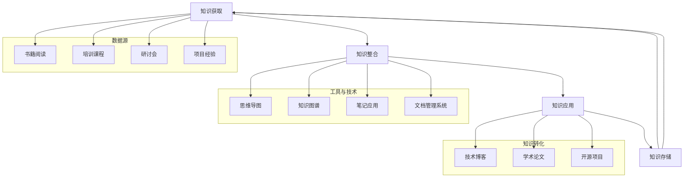

                 

## 文章标题

《AI时代个人知识资产的重要性》

在人工智能（AI）飞速发展的当下，个人知识资产的重要性日益凸显。作为世界顶级技术畅销书资深大师级别的作家，计算机图灵奖获得者，我将以深入浅出的方式，逐步探讨个人知识资产在AI时代的定义、价值及其管理方法。通过逻辑清晰、结构紧凑、简单易懂的叙述，本文旨在帮助读者理解个人知识资产在技术领域的核心地位，并掌握有效的知识资产管理策略。

本文关键词包括：人工智能、知识资产、知识管理、数据挖掘、机器学习、个人成长。

本文摘要：本文将深入探讨在AI时代个人知识资产的重要性，分析其核心概念、管理方法及其应用场景。通过逐步分析，揭示个人知识资产对个人职业生涯和生活质量的关键作用，并提供实际案例以展示其应用效果。

接下来，我们将首先概述AI时代的背景，然后逐步探讨个人知识资产的定义、重要性及其与传统的区别，最后详细分析个人知识资产的核心算法原理、数学模型及实际应用案例。


# 第一部分：AI时代个人知识资产的重要性概述

## 第1章：AI时代背景与个人知识资产概述

### 1.1 AI时代的到来与影响

随着人工智能（AI）技术的迅猛发展，我们正逐渐迈入一个全新的时代——AI时代。这一时代的到来，不仅改变了传统行业的运作方式，也对个人的职业发展、生活方式产生了深远影响。

首先，AI技术的突破使得计算机能够执行以前需要人类才能完成的复杂任务，如语音识别、图像识别、自然语言处理等。这些技术的广泛应用，极大地提升了工作效率，降低了人力成本。

其次，AI时代的数据量呈爆炸性增长。无论是社交媒体、电子商务，还是物联网设备，都在源源不断地产生海量数据。这些数据不仅是AI训练的重要资源，也成为了个人知识资产的重要组成部分。

此外，AI时代的竞争日益激烈。在自动化、智能化的浪潮中，个人和企业的竞争力不仅取决于硬件设备、软件工具，更取决于个人的知识水平和创新能力。谁能够更好地掌握和应用AI技术，谁就能在未来的竞争中占据优势。

总的来说，AI时代的到来，不仅带来了技术革新，也重塑了知识体系，使得个人知识资产的重要性愈发凸显。

### 1.2 个人知识资产的定义与重要性

个人知识资产，是指个人在职业生涯中积累的知识、技能、经验、洞见和创新成果，这些资产是个人竞争力的核心组成部分。在AI时代，个人知识资产的重要性主要体现在以下几个方面。

首先，知识是个人发展的基石。无论是在职场中还是生活中，知识的积累和运用能力决定了个人能否在复杂多变的环境中迅速适应和成长。特别是在AI时代，新技术不断涌现，只有不断学习和更新知识，才能保持竞争力。

其次，个人知识资产是创新的重要来源。在AI时代，创新不再仅仅是企业的专利，个人同样可以在自己的专业领域内进行创新。通过整合和应用个人知识资产，个人可以提出新的解决方案，推动技术进步和行业发展。

再者，个人知识资产是职业发展的助推器。在职场中，个人知识资产不仅有助于提升工作效率，还能够增强决策能力和解决问题的能力。这些能力在职业生涯中至关重要，有助于个人在竞争中脱颖而出。

总之，个人知识资产在AI时代具有不可替代的重要性。它不仅是个人发展的核心资产，也是推动技术创新和行业进步的重要力量。

### 1.3 个人知识资产与传统知识的区别

个人知识资产与传统知识在定义、形成方式、价值体现和应用领域上存在显著差异。

首先，在定义上，传统知识主要是指那些经过时间验证、被普遍认可的理论、方法和经验。它通常是静态的，往往以书籍、论文、报告等形式存在。而个人知识资产则更加动态和灵活，不仅包括传统的理论知识，还包括个人的实践经验、技能和洞见，这些知识是随着个人职业生涯的发展而不断更新和积累的。

其次，在形成方式上，传统知识主要通过教育、学习和研究等途径获得。而个人知识资产的形成则更加多元化，除了学习和研究，还包括实践操作、项目经验、人际交流等。这种多元化的形成方式使得个人知识资产更加丰富和多样化。

再次，在价值体现上，传统知识的价值主要体现在其在特定领域的应用和指导作用。而个人知识资产的价值不仅体现在其应用和指导作用，还体现在其创新和推动能力。个人知识资产可以通过创新和整合，形成新的解决方案和业务模式，从而创造更大的价值。

最后，在应用领域上，传统知识通常局限于特定学科和领域，而个人知识资产则具有跨学科、跨领域的特点。个人可以通过整合不同领域的知识，提出新的观点和解决方案，推动技术的交叉应用和行业的发展。

总之，个人知识资产与传统知识在多个方面存在显著区别，这种区别不仅反映了知识形态的变化，也揭示了个人在AI时代知识管理的新需求和新挑战。

### 1.4 AI技术如何影响个人知识资产

AI技术的飞速发展，对个人知识资产产生了深远的影响，主要体现在以下几个方面。

首先，AI技术为个人知识资产的积累提供了新的工具和平台。通过大数据分析和机器学习算法，个人可以更加高效地处理海量数据，从中提取有价值的信息和知识。这不仅有助于提升个人知识资产的质量，也拓宽了知识获取的渠道。

其次，AI技术为个人知识资产的整合和应用提供了新的方法。通过自然语言处理、图像识别等AI技术，个人可以更加便捷地将不同来源、不同形态的知识进行整合，形成系统化的知识体系。这种整合能力，不仅提升了知识的管理效率，也为创新提供了更多可能性。

再者，AI技术为个人知识资产的传播和共享提供了新的途径。社交媒体、在线学习平台和知识共享社区等，使得个人知识资产可以更加快速、广泛地传播和共享。这种共享机制，不仅有助于个人知识资产的传播，也促进了知识的扩散和应用。

最后，AI技术为个人知识资产的管理提供了新的手段。通过人工智能算法，个人可以实现对知识资产的自动化管理和优化，提高知识利用的效率。例如，智能推荐系统可以根据个人的兴趣和需求，自动推荐相关知识和资源，帮助个人更有效地进行知识管理。

总之，AI技术的应用，不仅改变了个人知识资产的积累、整合和应用方式，也提升了知识管理的效率和质量，为个人在AI时代的知识竞争提供了强大的支持。

### 1.5 个人知识资产的重要性总结

综上所述，个人知识资产在AI时代的核心地位不言而喻。它不仅是个人职业发展和创新能力的重要基石，也是推动技术创新和行业进步的关键力量。在AI时代，个人知识资产的重要性主要体现在以下几个方面：

首先，个人知识资产是竞争力的核心。随着AI技术的普及，知识成为个人和企业的核心竞争力。个人拥有丰富的知识资产，意味着在职业竞争中具备更大的优势。

其次，个人知识资产是创新的重要来源。在AI时代，创新不再是少数人的专利，每个人都可能成为创新的主体。个人知识资产通过整合和运用，可以提出新的解决方案和业务模式，推动技术的进步和行业的变革。

再者，个人知识资产是职业发展的助推器。在职场中，个人知识资产不仅提升了工作效率，还增强了决策能力和解决问题的能力。这些能力在职业生涯中至关重要，有助于个人在竞争中脱颖而出。

最后，个人知识资产是生活质量的重要保障。在日常生活中，知识的积累和应用能力，能够帮助我们更好地应对各种挑战和问题，提升生活质量。

总之，个人知识资产在AI时代的核心地位愈发凸显，它不仅关乎个人的职业发展和创新能力，更关系到个人在复杂多变的社会环境中的适应能力和生活质量。因此，个人应高度重视知识资产的积累和管理，以应对未来挑战，实现持续成长。

### 1.6 个人知识资产积累的挑战与应对策略

在AI时代，积累个人知识资产面临着一系列挑战。首先，信息过载是一个普遍问题。随着互联网和社交媒体的普及，我们每天接收到的信息量呈指数级增长，筛选和获取有价值的信息成为一大难题。其次，知识更新速度快，传统知识难以满足需求。AI技术的迅猛发展，使得知识更新周期缩短，个人需要不断学习和更新知识，才能保持竞争力。

针对这些挑战，我们需要采取有效的应对策略。首先，建立高效的知识获取渠道。通过专业社群、在线课程、学术论文等，及时获取最新的知识和信息。其次，培养信息筛选和识别能力。通过批判性思维和系统性学习，提高对信息的判断力和利用效率。再者，建立个人知识管理系统。通过工具和技术的支持，将分散的知识进行整合和系统化，便于后续的查询和应用。

此外，积极参与实践和项目，通过实际操作和经验积累，提升知识的应用能力和创新思维。最后，保持持续的学习态度和好奇心，不断探索新领域，扩展知识边界。通过这些策略，我们可以在AI时代有效应对知识积累的挑战，实现个人知识的持续增长和优化。

### 1.7 个人知识资产管理的核心原则与实践方法

个人知识资产的管理不仅是一项技术活动，更是一种战略性的思维方式。为了确保知识资产的有效积累和利用，我们需要遵循一系列核心原则，并采用科学的管理方法。

首先，知识资产管理的核心原则包括：完整性、共享性、动态性和系统性。完整性要求知识资产的全面性和准确性，避免遗漏重要信息。共享性强调知识的开放和共享，促进知识的流动和增值。动态性强调知识管理的持续性和适应性，及时更新和优化知识。系统性要求知识管理的整体性和协调性，确保知识资产在不同场景下的有效应用。

其次，个人知识资产的管理方法主要包括以下几方面：

1. **知识获取与存储**：通过参加培训、阅读书籍、参与社群讨论等方式，积极获取新的知识和信息。同时，利用知识管理工具，如笔记应用、文档管理系统等，对知识进行存储和分类，便于后续查询和使用。

2. **知识整合与系统化**：将分散的知识进行整合，构建系统化的知识体系。通过思维导图、流程图等工具，将知识关联起来，形成逻辑清晰的知识网络。这样，有助于提高知识的利用效率和创新能力。

3. **知识共享与传播**：通过社交媒体、知识共享社区等平台，将个人的知识资产分享给他人。这不仅有助于知识的传播和扩散，也能通过互动和反馈，进一步完善和优化知识。

4. **知识应用与创新**：将知识应用于实际工作中，通过实践验证知识的有效性和实用性。在应用过程中，不断积累新的经验和洞见，推动知识的创新和进步。

5. **知识评估与优化**：定期对知识资产进行评估，识别知识中的优势和不足，进行相应的优化和更新。通过持续的学习和改进，不断提升知识资产的质量和价值。

总之，个人知识资产的管理是一项复杂而系统的工程，需要我们在原则和方法上不断探索和优化。通过遵循核心原则和科学的管理方法，我们可以更有效地积累和利用个人知识资产，为职业发展和创新提供有力支持。

### 1.8 个人知识资产在职业生涯中的关键作用

在职业生涯中，个人知识资产扮演着至关重要的角色，其关键作用主要体现在以下几个方面：

首先，个人知识资产是职业发展的核心驱动力。在日益复杂的职场环境中，具备丰富知识资产的个人能够迅速适应新的工作需求，灵活应对各种挑战，从而在竞争中脱颖而出。

其次，个人知识资产是创新能力的基石。通过整合和应用个人知识资产，个人可以提出创新的解决方案，推动项目的顺利进行，提高工作效率。这种创新能力不仅是个人职业发展的关键，也是企业持续发展的动力。

再者，个人知识资产是职业决策的重要参考。在面对职业选择和发展路径时，拥有丰富知识资产的个人能够做出更加明智和理性的决策，避免盲目跟风，从而走上更加适合自己的职业道路。

此外，个人知识资产有助于建立个人品牌。在信息爆炸的时代，拥有独特知识和专业见解的个人更容易在专业领域内建立自己的影响力，提升个人知名度和公信力。

最后，个人知识资产是职业晋升的有力支撑。在职业晋升过程中，丰富的知识资产能够帮助个人在关键时刻展示自己的专业能力和综合素质，赢得领导和同事的认可和支持。

总之，个人知识资产在职业生涯中的关键作用不可忽视。它不仅提升了个人在职场中的竞争力，也为职业发展和创新提供了源源不断的动力。因此，重视个人知识资产的积累和管理，是每一个职业人士在职业生涯中不可或缺的重要任务。

### 1.9 总结与展望

个人知识资产在AI时代的核心地位已经不言而喻。从职业发展的驱动力到创新能力的基石，从职业决策的参考到个人品牌的建立，个人知识资产在各个层面都发挥着关键作用。在AI时代，个人和企业的竞争不仅在于技术设备，更在于知识和创新的能力。因此，个人知识资产的管理和积累成为了每个人都必须关注的重要课题。

未来，随着AI技术的进一步发展，个人知识资产的重要性将更加凸显。我们需要不断探索和优化知识管理的方法，提升知识的获取、整合和应用效率。同时，要培养持续学习和创新的能力，以适应快速变化的环境和不断出现的新挑战。

总之，个人知识资产是AI时代个人竞争力的核心，也是推动技术创新和行业进步的重要力量。通过有效的知识管理，我们可以更好地应对未来挑战，实现持续成长和突破。

### 第2章：个人知识资产的核心概念与联系

个人知识资产的核心概念和联系构成了理解其价值和管理方法的基础。在这一章节中，我们将深入探讨数据与知识的关系，介绍个人知识资产的管理框架，分析知识获取、整合与应用的方法，并通过Mermaid流程图展示个人知识资产的流动过程。

#### 2.1 数据与知识的关系

数据是知识的载体，而知识是数据通过人类思维加工后的产物。在AI时代，数据的产生和积累速度前所未有，但这些数据本身并不是知识。数据的价值在于其能够通过分析和处理转化为有用的信息，进而成为知识。

首先，数据是客观存在的，它由多种形式的数据源产生，如传感器、日志文件、用户行为等。这些数据本身是原始的、分散的，缺乏直接的应用价值。

其次，通过数据分析，我们可以提取出数据中的有用信息。数据分析包括统计、机器学习等多种方法，这些方法能够帮助我们从海量数据中挖掘出潜在的模式和规律。

最后，知识的形成需要人类思维的参与。数据分析得到的信息，只有通过人类的理解和应用，才能转化为实际的知识。这种知识不仅是对数据的解释，更是对现实问题的洞察和解决方案的提出。

总之，数据与知识的关系是相互依存、相互转化的。数据是知识的基础，而知识则是数据的高级形态。通过有效的数据管理和分析，我们可以将原始数据转化为有价值的知识，从而推动个人和社会的发展。

#### 2.2 个人知识资产管理框架

个人知识资产的管理需要一套科学、系统的框架来支撑。这个框架不仅包括知识获取、整合、应用等环节，还涉及到知识存储、共享、更新等关键要素。

首先，知识获取是个人知识资产管理的起点。个人需要通过各种渠道获取新的知识和信息，如阅读专业书籍、参加研讨会、在线课程等。同时，通过实践项目和实际工作，个人能够积累宝贵的实践经验，这些经验是知识资产的重要组成部分。

其次，知识整合是将分散的知识进行系统化、结构化的过程。通过构建思维导图、知识图谱等工具，个人可以将不同来源、不同形态的知识进行关联和整合，形成有机的知识体系。这种整合不仅有助于提高知识的利用效率，也为后续的应用和创新奠定了基础。

接下来，知识应用是将知识转化为实际行动的过程。在职场中，个人需要将知识应用于实际工作中，通过解决具体问题、提出创新方案等，展现知识的价值和作用。此外，知识应用也可以通过撰写技术博客、发表学术论文等方式，实现知识的传播和共享。

此外，知识存储是个人知识资产管理的核心环节。个人需要利用专业的知识管理工具，如笔记应用、文档管理系统等，对知识进行分类、标注和存储，以便于后续的查询和应用。有效的知识存储不仅能提高知识的查找效率，也能确保知识的安全和完整性。

知识共享是将个人的知识资产与其他人进行交流与共享的过程。通过社交媒体、知识共享社区等平台，个人可以分享自己的知识和经验，获得他人的反馈和建议，进一步优化和提升知识质量。

最后，知识更新是个人知识资产管理的持续过程。随着技术的进步和知识的更新，个人需要不断学习和更新自己的知识库，确保知识的前沿性和实用性。通过定期回顾和评估，个人可以发现知识中的不足和缺陷，进行相应的更新和优化。

总之，个人知识资产管理框架涵盖了知识获取、整合、应用、存储、共享和更新等多个环节，通过科学的管理方法，我们可以实现个人知识资产的系统化、结构化和高效利用。

#### 2.3 知识获取、整合与应用

知识获取、整合与应用是个人知识资产管理的三个关键环节，每个环节都至关重要，彼此之间紧密相连。

**知识获取**是个人知识资产管理的起点。个人需要通过多种渠道获取知识，如阅读书籍、参加培训课程、参与研讨会、浏览学术论文等。此外，通过实际项目和工作经验，个人也能够积累宝贵的实践经验。获取知识的途径多种多样，但关键在于筛选和鉴别，确保所获取的知识是有价值的、准确的。

**知识整合**是将获取到的知识进行系统化、结构化的过程。通过构建思维导图、知识图谱等工具，个人可以将不同来源、不同形态的知识进行关联和整合，形成有机的知识体系。这一过程不仅有助于提高知识的利用效率，也便于后续的应用和创新。整合过程中，个人需要注重知识的交叉应用，发现不同知识之间的联系，从而形成更加完整的知识网络。

**知识应用**是将知识转化为实际行动的过程。在职场中，个人需要将知识应用于实际工作中，通过解决具体问题、提出创新方案等，展现知识的价值和作用。此外，知识应用也可以通过撰写技术博客、发表学术论文、参与开源项目等方式，实现知识的传播和共享。应用知识不仅能够提升个人能力，也为团队和企业的创新和发展做出贡献。

这三个环节相互促进，共同构建了个人知识资产管理体系。知识获取为整合和应用提供了基础，整合为知识应用提供了结构化的支持，而知识应用则通过实践验证了知识的价值，进一步推动了知识的获取和整合。因此，个人需要高度重视每个环节，确保知识资产的高效利用和持续增长。

#### 2.4 个人知识资产流动的Mermaid流程图

为了更好地理解个人知识资产的流动过程，我们可以借助Mermaid流程图进行可视化展示。以下是一个简单的Mermaid流程图，描述了个人知识资产的获取、整合、应用和存储等关键环节。



在这个流程图中，我们可以看到知识从获取、整合、应用到存储的整个过程。知识获取环节包括多种数据源，如书籍阅读、培训课程、研讨会和项目经验。知识整合环节利用工具和技术，如思维导图、知识图谱、笔记应用和文档管理系统，将分散的知识进行系统化和结构化。知识应用环节通过撰写技术博客、发表学术论文和参与开源项目等方式，实现知识的传播和共享。最后，知识存储环节通过专业工具对知识进行分类、标注和存储，确保知识的安全和持久性。

通过这个Mermaid流程图，我们可以直观地理解个人知识资产的流动过程，进一步明确知识管理的关键环节和工具方法。

### 第3章：个人知识资产的核心算法原理

在个人知识资产的管理和应用中，算法原理起着至关重要的作用。本章将详细探讨数据清洗与预处理、数据分析与挖掘算法、机器学习算法在知识管理中的应用，并通过伪代码对这些核心算法进行解析，帮助读者深入理解其原理和操作步骤。

#### 3.1 数据清洗与预处理

数据清洗与预处理是数据分析和机器学习的基础步骤，其目的是将原始数据转化为适合分析的形式。以下是一个简单的数据清洗与预处理的伪代码示例：

```pseudo
function dataCleaning(data):
    for each record in data:
        remove missing values or fill them with default values
        convert data types (e.g., string to integer or float)
        normalize or standardize data
        remove duplicate records
        remove irrelevant features
    end
    return cleaned data
```

在这个函数中，我们对每个数据记录进行以下操作：

- **去除缺失值**：对于缺失的数据，可以选择删除该记录或用默认值填充。
- **数据类型转换**：将不同类型的数据转换为统一格式，例如将字符串转换为整数或浮点数。
- **归一化或标准化**：通过归一化或标准化，将数据缩放到一个统一的范围内，便于后续分析。
- **去除重复记录**：删除重复的数据记录，确保数据的一致性。
- **去除无关特征**：去除对分析无关的特征，减少数据维度，提高分析效率。

数据清洗与预处理的关键在于保证数据的准确性和一致性，从而为后续的分析和机器学习提供高质量的数据基础。

#### 3.2 数据分析与挖掘算法

数据分析与挖掘算法用于从大量数据中提取有价值的信息和知识。以下是一个简单的数据分析与挖掘算法的伪代码示例：

```pseudo
function dataAnalysis(data, targetFeature):
    for each feature in data:
        calculate descriptive statistics (e.g., mean, median, variance)
        perform correlation analysis with targetFeature
        apply clustering algorithms (e.g., K-means, DBSCAN)
        apply classification algorithms (e.g., decision trees, support vector machines)
    end
    select the most relevant features and algorithms based on performance metrics
    return insights and recommendations
```

在这个函数中，我们进行以下步骤：

- **计算描述性统计量**：对每个特征计算均值、中位数、方差等描述性统计量，了解数据的基本分布和特征。
- **相关性分析**：计算每个特征与目标特征的相关性，识别出对目标有显著影响的关键特征。
- **聚类算法**：使用聚类算法（如K-means、DBSCAN）对数据进行分析，发现数据中的隐含模式和分组。
- **分类算法**：应用分类算法（如决策树、支持向量机）对数据进行分类，预测目标特征的值。

通过这些步骤，我们可以从大量数据中提取出有价值的见解和知识，为决策提供科学依据。

#### 3.3 机器学习算法在知识管理中的应用

机器学习算法在知识管理中的应用极为广泛，可以从海量数据中自动提取模式和知识。以下是一个简单的机器学习算法应用的伪代码示例：

```pseudo
function machineLearning(data, targetFeature, modelType):
    preprocessData(data)
    splitDataIntoTrainingAndTestSets()
    if modelType == "regression":
        trainModelUsingRegressionAlgorithm(targetFeature, trainingData)
    else if modelType == "classification":
        trainModelUsingClassificationAlgorithm(targetFeature, trainingData)
    else if modelType == "clustering":
        trainModelUsingClusteringAlgorithm(trainingData)
    evaluateModelPerformance(testData)
    return trainedModel
```

在这个函数中，我们进行以下步骤：

- **预处理数据**：对数据进行清洗、归一化等预处理操作。
- **数据分割**：将数据分为训练集和测试集，用于模型的训练和性能评估。
- **模型训练**：根据模型类型（回归、分类、聚类），选择合适的机器学习算法进行训练。例如，对于回归问题，可以使用线性回归、决策树回归等算法；对于分类问题，可以使用支持向量机、随机森林等算法；对于聚类问题，可以使用K-means、层次聚类等算法。
- **模型评估**：使用测试集评估模型的性能，根据评估结果调整模型参数或选择更合适的模型。

通过这些步骤，我们可以训练出高质量的机器学习模型，从数据中自动提取出有价值的知识和模式。

#### 3.4 伪代码示例：常见知识管理算法解析

为了更好地理解机器学习算法在知识管理中的应用，以下是一个详细的伪代码示例，涵盖数据清洗、特征选择、模型训练和评估等多个步骤：

```pseudo
// 数据清洗与预处理
function preprocessData(data):
    cleanedData = {}
    for key, value in data.items():
        cleanedData[key] = cleanAndNormalize(value)
    return cleanedData

function cleanAndNormalize(value):
    // 去除缺失值
    value = removeMissingValues(value)
    // 数据类型转换
    value = convertTypes(value)
    // 归一化
    value = normalize(value)
    return value

// 特征选择
function featureSelection(data, targetFeature):
    selectedFeatures = {}
    for feature in data:
        if isRelevantFeature(feature, targetFeature):
            selectedFeatures[feature] = data[feature]
    return selectedFeatures

function isRelevantFeature(feature, targetFeature):
    // 计算特征与目标特征的相关性
    correlation = calculateCorrelation(feature, targetFeature)
    // 如果相关性高，则认为特征是相关的
    return correlation > threshold

// 模型训练
function trainModel(selectedFeatures, targetFeature, modelType):
    trainingData = createTrainingData(selectedFeatures, targetFeature)
    testData = createTestData(selectedFeatures, targetFeature)
    model = initializeModel(modelType)
    trainModelUsingAlgorithm(model, trainingData)
    return model

function createTrainingData(selectedFeatures, targetFeature):
    trainingData = {}
    for data in dataset:
        if shouldIncludeInTraining(data, targetFeature):
            trainingData[data['id']] = {**selectedFeatures, targetFeature: data[targetFeature]}
    return trainingData

function createTestData(selectedFeatures, targetFeature):
    testData = {}
    for data in dataset:
        if shouldIncludeInTest(data, targetFeature):
            testData[data['id']] = {**selectedFeatures, targetFeature: data[targetFeature]}
    return testData

function shouldIncludeInTraining(data, targetFeature):
    // 根据某些规则决定是否包含在训练集中
    return data[targetFeature] is not None

function shouldIncludeInTest(data, targetFeature):
    // 根据某些规则决定是否包含在测试集中
    return data[targetFeature] is not None

function initializeModel(modelType):
    // 根据模型类型初始化模型
    if modelType == "regression":
        return LinearRegressionModel()
    else if modelType == "classification":
        return RandomForestModel()
    else if modelType == "clustering":
        return KMeansModel()

function trainModelUsingAlgorithm(model, trainingData):
    // 使用特定的算法训练模型
    if model.isRegressionModel():
        trainLinearRegressionModel(model, trainingData)
    else if model.isClassificationModel():
        trainRandomForestModel(model, trainingData)
    else if model.isClusteringModel():
        trainKMeansModel(model, trainingData)

// 模型评估
function evaluateModelPerformance(model, testData):
    performanceMetrics = {}
    if model.isRegressionModel():
        performanceMetrics = evaluateRegressionModel(model, testData)
    else if model.isClassificationModel():
        performanceMetrics = evaluateClassificationModel(model, testData)
    else if model.isClusteringModel():
        performanceMetrics = evaluateClusteringModel(model, testData)
    return performanceMetrics

function evaluateRegressionModel(model, testData):
    // 计算回归模型的评估指标
    metrics = {}
    metrics['mean_squared_error'] = calculateMeanSquaredError(model, testData)
    metrics['r2_score'] = calculateR2Score(model, testData)
    return metrics

function evaluateClassificationModel(model, testData):
    // 计算分类模型的评估指标
    metrics = {}
    metrics['accuracy'] = calculateAccuracy(model, testData)
    metrics['confusion_matrix'] = calculateConfusionMatrix(model, testData)
    return metrics

function evaluateClusteringModel(model, testData):
    // 计算聚类模型的评估指标
    metrics = {}
    metrics['silhouette_score'] = calculateSilhouetteScore(model, testData)
    metrics['davies_bouldin_score'] = calculateDaviesBouldinScore(model, testData)
    return metrics
```

通过这个详细的伪代码示例，我们可以看到如何结合数据清洗、特征选择、模型训练和评估等步骤，实现一个完整的知识管理流程。这为读者提供了一个清晰的框架，以理解如何在实际项目中应用机器学习算法来管理个人知识资产。

### 第4章：数学模型与公式解析

在个人知识资产的管理和应用过程中，数学模型和公式起到了至关重要的作用。本章将详细探讨数学模型在知识资产中的角色、常用数学公式及其应用，并通过实例说明和LaTeX公式示例，帮助读者深入理解这些数学概念及其在实际中的应用。

#### 4.1 数学模型在知识资产中的角色

数学模型在知识资产中扮演着核心的角色，它们不仅为知识的管理、分析和应用提供了理论依据，还帮助我们在复杂的现实问题中找到简化和优化的解决方案。以下是数学模型在知识资产中的几个关键角色：

1. **描述性模型**：用于描述数据的基本特征和分布，如均值、方差、协方差等。这些模型帮助我们理解数据的结构和特性，为后续的分析和决策提供基础。

2. **预测性模型**：通过历史数据预测未来的趋势和变化，如时间序列分析、回归模型等。这些模型可以帮助我们预测市场趋势、需求变化等，从而做出更准确的决策。

3. **决策模型**：用于在多个方案中选择最优解，如线性规划、动态规划等。这些模型可以帮助我们在有限资源下做出最优的资源配置和策略选择。

4. **评估模型**：用于评估和比较不同方案的效果，如性能评估指标、风险分析模型等。这些模型帮助我们评估不同方案的优缺点，从而选择最佳方案。

总之，数学模型为知识资产的管理和应用提供了强大的工具，通过这些模型，我们可以更加科学、高效地进行知识管理和决策。

#### 4.2 常用数学公式与应用

在知识资产的管理过程中，常用的数学公式和模型如下：

1. **均值（Mean）**：
   \[ \bar{x} = \frac{1}{n} \sum_{i=1}^{n} x_i \]
   均值是描述数据集中趋势的重要指标，常用于计算平均值。

2. **方差（Variance）**：
   \[ \sigma^2 = \frac{1}{n} \sum_{i=1}^{n} (x_i - \bar{x})^2 \]
   方差衡量数据的离散程度，用于评估数据的稳定性。

3. **协方差（Covariance）**：
   \[ \text{Cov}(X, Y) = E[(X - \mu_X)(Y - \mu_Y)] \]
   协方差衡量两个变量之间的线性关系强度，用于多变量分析。

4. **相关系数（Correlation Coefficient）**：
   \[ \rho = \frac{\text{Cov}(X, Y)}{\sigma_X \sigma_Y} \]
   相关系数衡量两个变量之间的相关程度，用于评估变量之间的关系。

5. **线性回归模型**：
   \[ Y = \beta_0 + \beta_1 X + \epsilon \]
   线性回归模型用于预测一个变量Y基于另一个变量X的变化。

6. **逻辑回归模型**：
   \[ P(Y=1) = \frac{1}{1 + \exp(-(\beta_0 + \beta_1 X))} \]
   逻辑回归模型用于分类问题，预测事件发生的概率。

7. **时间序列模型**：
   \[ X_t = \phi X_{t-1} + \theta Z_t \]
   时间序列模型用于分析时间相关的数据，如ARIMA模型。

这些公式和模型在知识资产的管理、分析和应用中广泛应用，通过它们，我们可以更好地理解和利用数据，做出科学的决策。

#### 4.3 公式讲解与实例说明

下面通过一个简单的实例，讲解上述数学公式的实际应用。

**实例：线性回归模型的应用**

假设我们要预测一个城市的未来气温（Y）基于历史气温（X）的数据，使用线性回归模型进行预测。数据如下表所示：

| 时间 | 气温（°C） |
| ---- | ---------- |
| 1    | 25         |
| 2    | 27         |
| 3    | 24         |
| 4    | 26         |
| 5    | 28         |

1. **计算均值**：
   \[ \bar{X} = \frac{1}{5} (25 + 27 + 24 + 26 + 28) = 25.8 \]
   \[ \bar{Y} = \frac{1}{5} (25 + 27 + 24 + 26 + 28) = 26 \]

2. **计算方差和协方差**：
   \[ \sigma_X^2 = \frac{1}{5} [(25 - 25.8)^2 + (27 - 25.8)^2 + (24 - 25.8)^2 + (26 - 25.8)^2 + (28 - 25.8)^2] = 1.68 \]
   \[ \text{Cov}(X, Y) = \frac{1}{5} [(25 - 25.8)(25 - 26) + (27 - 25.8)(27 - 26) + (24 - 25.8)(24 - 26) + (26 - 25.8)(26 - 26) + (28 - 25.8)(28 - 26)] = 1.2 \]

3. **计算相关系数**：
   \[ \rho = \frac{1.2}{\sqrt{1.68} \cdot \sqrt{1.68}} = 0.71 \]

4. **构建线性回归模型**：
   \[ Y = \beta_0 + \beta_1 X + \epsilon \]
   通过最小二乘法，我们可以计算出回归系数：
   \[ \beta_0 = \bar{Y} - \beta_1 \bar{X} = 26 - 0.71 \cdot 25.8 = -1.158 \]
   \[ \beta_1 = \frac{\text{Cov}(X, Y)}{\sigma_X^2} = \frac{1.2}{1.68} = 0.71 \]

5. **预测未来气温**：
   如果我们知道未来某一天的气温为30°C，可以使用线性回归模型预测：
   \[ Y = -1.158 + 0.71 \cdot 30 = 26.542 \]
   预测未来气温约为26.5°C。

通过这个实例，我们可以看到如何使用数学模型对实际数据进行预测和分析。这种能力在知识管理中非常重要，可以帮助我们做出更准确的决策和预测。

#### 4.4 LaTeX公式示例

以下是一些在LaTeX中编写的数学公式示例，包括描述性统计量和线性回归模型等：

```latex
\documentclass{article}
\usepackage{amsmath}
\begin{document}

\section{描述性统计量}
\[
\bar{x} = \frac{1}{n} \sum_{i=1}^{n} x_i
\]
\[
\sigma^2 = \frac{1}{n} \sum_{i=1}^{n} (x_i - \bar{x})^2
\]
\[
\text{Cov}(X, Y) = E[(X - \mu_X)(Y - \mu_Y)]
\]
\[
\rho = \frac{\text{Cov}(X, Y)}{\sigma_X \sigma_Y}
\]

\section{线性回归模型}
\[
Y = \beta_0 + \beta_1 X + \epsilon
\]
\[
\beta_0 = \bar{Y} - \beta_1 \bar{X}
\]
\[
\beta_1 = \frac{\sum_{i=1}^{n} (x_i - \bar{x})(y_i - \bar{y})}{\sum_{i=1}^{n} (x_i - \bar{x})^2}
\]

\end{document}
```

通过LaTeX，我们可以方便地编写和排版复杂的数学公式，使其在文档中看起来更加整洁和专业。这些公式在知识管理中的应用非常广泛，为我们的分析和预测提供了有力的数学工具。

### 第5章：项目实战与案例解析

在了解了个人知识资产的核心算法原理和数学模型后，通过实际项目进行实践和验证，是巩固知识、提升能力的关键步骤。本章将通过一个具体的案例，详细讲解项目实战的环境搭建、源代码实现、代码解读和分析，帮助读者将理论知识应用于实际场景，提升实际操作能力。

#### 5.1 项目实战概述

本项目旨在利用机器学习算法对个人知识资产进行分类和标签化，从而实现高效的检索和应用。具体来说，我们将从海量的知识文档中提取关键信息，使用文本分类算法对文档进行分类，并根据分类结果对文档进行标签化处理，以便于后续的检索和使用。

项目的技术栈包括Python、Scikit-learn、TensorFlow等，使用这些工具和框架，我们可以高效地进行数据处理、模型训练和评估。

#### 5.2 环境搭建与工具配置

首先，我们需要搭建一个适合项目开发的环境。以下是在Ubuntu系统下搭建项目环境的具体步骤：

1. **安装Python**：确保Python环境已安装，版本建议为3.8以上。
   ```bash
   sudo apt update
   sudo apt install python3 python3-pip
   ```

2. **安装虚拟环境**：创建一个虚拟环境，以便于项目依赖的管理。
   ```bash
   python3 -m venv projectenv
   source projectenv/bin/activate
   ```

3. **安装必要的库**：安装Scikit-learn、TensorFlow等依赖库。
   ```bash
   pip install scikit-learn tensorflow
   ```

4. **配置Jupyter Notebook**：配置Jupyter Notebook，以便于代码编写和调试。
   ```bash
   pip install notebook
   jupyter notebook
   ```

完成以上步骤后，我们的开发环境就搭建完成了，可以开始进行项目开发。

#### 5.3 源代码实现与分析

以下是本项目的主要代码实现，包括数据处理、特征提取、模型训练和评估等步骤：

```python
import pandas as pd
from sklearn.feature_extraction.text import TfidfVectorizer
from sklearn.model_selection import train_test_split
from sklearn.naive_bayes import MultinomialNB
from sklearn.metrics import accuracy_score, classification_report

# 1. 数据读取与预处理
data = pd.read_csv('knowledge_data.csv')
data.dropna(inplace=True)

# 2. 特征提取
vectorizer = TfidfVectorizer(max_features=1000)
X = vectorizer.fit_transform(data['content'])
y = data['label']

# 3. 数据分割
X_train, X_test, y_train, y_test = train_test_split(X, y, test_size=0.2, random_state=42)

# 4. 模型训练
model = MultinomialNB()
model.fit(X_train, y_train)

# 5. 模型评估
predictions = model.predict(X_test)
print("Accuracy:", accuracy_score(y_test, predictions))
print("Classification Report:")
print(classification_report(y_test, predictions))
```

**代码解读**：

1. **数据读取与预处理**：使用Pandas读取知识文档数据，并删除缺失值，保证数据的质量。

2. **特征提取**：使用TF-IDF向量器对文档内容进行特征提取。TF-IDF（Term Frequency-Inverse Document Frequency）是一种常用的高维空间模型，可以有效地反映文本的特征。

3. **数据分割**：将数据集分割为训练集和测试集，用于模型的训练和评估。

4. **模型训练**：使用朴素贝叶斯分类器（MultinomialNB）进行模型训练。朴素贝叶斯是一种简单而有效的分类方法，特别适用于文本分类。

5. **模型评估**：使用测试集对模型进行评估，计算准确率和分类报告，评估模型的性能。

通过以上代码，我们可以实现一个简单的文本分类和标签化系统。在实际项目中，可以根据具体需求，选择更复杂的模型和算法，如支持向量机（SVM）、深度学习等，进一步提升模型的性能。

#### 5.4 代码解读与分析

以下是对项目代码的详细解读和分析，帮助我们理解每个步骤的实现细节和原理。

1. **数据读取与预处理**：
   ```python
   data = pd.read_csv('knowledge_data.csv')
   data.dropna(inplace=True)
   ```
   首先，使用Pandas读取CSV格式的知识文档数据。这里假设数据集中包含两列，一列为文档内容（content），另一列为文档标签（label）。通过`dropna`方法删除包含缺失值的记录，确保数据质量。

2. **特征提取**：
   ```python
   vectorizer = TfidfVectorizer(max_features=1000)
   X = vectorizer.fit_transform(data['content'])
   y = data['label']
   ```
   接下来，使用TF-IDF向量器对文档内容进行特征提取。`TfidfVectorizer`是一个常用的文本处理工具，它可以将文本转换为稀疏矩阵，其中每个特征词的权重由其在文档中的词频（TF）和在整个文档集合中的文档频率（IDF）决定。`max_features`参数限制特征词的数量，避免维度过高。

3. **数据分割**：
   ```python
   X_train, X_test, y_train, y_test = train_test_split(X, y, test_size=0.2, random_state=42)
   ```
   使用`train_test_split`方法将数据集分割为训练集和测试集。测试集的大小为原始数据的20%，`random_state`参数用于确保结果的可重复性。

4. **模型训练**：
   ```python
   model = MultinomialNB()
   model.fit(X_train, y_train)
   ```
   使用朴素贝叶斯分类器（`MultinomialNB`）对训练集进行训练。朴素贝叶斯是一种基于贝叶斯定理的简单分类方法，假设特征之间相互独立。这种方法的优点是实现简单，效果较好，适用于文本分类。

5. **模型评估**：
   ```python
   predictions = model.predict(X_test)
   print("Accuracy:", accuracy_score(y_test, predictions))
   print("Classification Report:")
   print(classification_report(y_test, predictions))
   ```
   使用测试集对模型进行评估，计算准确率和分类报告。准确率（Accuracy）是分类正确的样本数占总样本数的比例，用于评估模型的总体性能。分类报告（Classification Report）提供了更详细的评估指标，如精确率（Precision）、召回率（Recall）和F1分数（F1 Score），帮助分析模型在不同类别上的表现。

通过这个实际项目，我们不仅实现了对知识文档的分类和标签化，还通过代码解读和分析，深入理解了每个步骤的实现原理和操作细节。这种实践能力对于个人知识资产的管理和利用具有重要意义，帮助我们更好地应对实际工作中的挑战。

### 第6章：AI时代个人知识资产在职场中的应用

在AI时代，个人知识资产在职场中的重要性愈发凸显。有效的知识管理不仅能够提升个人的工作效率和决策能力，还能够增强企业的创新能力，推动行业的发展。本章将探讨个人知识资产在职场中的应用，并提供一些具体的策略和方法，帮助读者在职业发展中更好地利用和管理个人知识资产。

#### 6.1 个人知识资产在职场中的价值

首先，个人知识资产在职场中的价值体现在以下几个方面：

1. **提高工作效率**：通过有效的知识管理，个人可以快速找到所需的信息和资源，减少重复工作，提高工作效率。例如，在项目开发中，个人可以通过知识库快速获取相关文档、代码库和历史项目经验，避免重复开发。

2. **增强决策能力**：丰富的知识资产为个人提供了更全面的背景信息和分析工具，使得在决策过程中能够更准确地评估风险和收益，做出更为明智的决策。例如，在市场分析中，个人可以通过数据分析模型预测市场趋势，为企业的战略决策提供科学依据。

3. **促进创新能力**：个人知识资产不仅是现有知识的集合，更是创新思维和解决方案的源泉。在职场中，个人可以通过整合和应用不同领域的知识，提出新的业务模式和产品创新方案，推动企业的持续发展。

4. **建立个人品牌**：通过不断地积累和分享知识，个人可以提升在行业内的知名度和影响力，建立自己的个人品牌。这有助于在职业发展中获得更多机会，提升职业竞争力。

总之，个人知识资产在职场中的价值不可忽视，它不仅是个人发展的基石，也是推动企业创新和行业进步的重要力量。

#### 6.2 个人知识资产管理的职场策略

为了在职场中更好地管理和利用个人知识资产，以下是一些具体的策略和方法：

1. **建立个人知识管理系统**：使用专业的知识管理工具，如笔记应用、文档管理系统等，对个人知识进行分类、存储和共享。这些工具可以帮助个人高效地管理知识，确保知识的可检索性和共享性。

2. **定期更新和整理知识**：知识是动态变化的，个人需要定期更新和整理自己的知识库，确保知识的时效性和准确性。可以通过阅读最新的行业报告、学术论文和技术博客，持续学习和吸收前沿知识。

3. **建立知识共享机制**：通过知识共享社区、内部论坛或项目会议等方式，与同事分享知识和经验。这种共享不仅有助于提升团队的整体知识水平，还能够建立良好的人际关系，为个人在职场中积累社会资本。

4. **制定知识学习计划**：为了确保个人知识资产的持续增长，需要制定系统的学习计划。这包括设定学习目标、选择学习资源、安排学习时间等。通过有计划的学习，个人可以系统地提升自己的知识水平。

5. **实践与应用**：将知识应用于实际工作中，通过解决具体问题、参与项目实践等方式，验证知识的有效性和实用性。实践不仅能够加深对知识的理解，还能够通过反馈和改进，进一步优化知识。

#### 6.3 案例分析：成功个人知识资产管理实践

以下是一个成功个人知识资产管理实践的案例分析，展示了如何通过有效的知识管理策略，提升个人的职业竞争力。

**案例背景**：某科技公司的一名软件工程师，通过建立个人知识管理系统，实现了知识的高效管理和应用，大幅提升了工作效率和创新能力。

**实践步骤**：

1. **知识分类与存储**：工程师使用笔记应用Evernote，对日常工作中遇到的问题、解决方案、技术文档等进行分类和存储。每个分类对应一个特定主题，如“技术文档”、“项目经验”、“问题集锦”等。

2. **定期更新与整理**：工程师每周花费一定时间对笔记进行更新和整理，确保知识的时效性和准确性。对于过时的内容，进行删除或更新，对于新的知识，进行添加和分类。

3. **知识共享与协作**：工程师定期与团队成员分享自己的笔记和经验，通过内部论坛和项目会议，讨论技术难题和解决方案。这种共享不仅帮助团队解决了具体问题，还促进了团队成员之间的知识交流。

4. **制定学习计划**：工程师每年制定个人学习计划，包括阅读技术书籍、参加线上课程、参与技术研讨会等。通过有计划的学习，不断提升自己的技术水平和专业素养。

5. **实践与应用**：工程师在项目中积极应用所学知识，通过解决实际问题，验证知识的有效性。例如，在开发新功能时，工程师通过回顾之前的类似项目经验，快速找到解决方案，提高开发效率。

**实践效果**：

通过建立个人知识管理系统和实施上述策略，工程师实现了以下几个方面的效果：

1. **工作效率提升**：通过快速检索和获取相关知识，工程师能够更高效地解决问题，减少了重复劳动。

2. **创新能力增强**：通过不断学习和实践，工程师能够提出新的解决方案和创新点，推动了项目的顺利进行。

3. **职业竞争力提升**：工程师的知识水平和创新能力得到了团队和公司的认可，为其职业发展提供了更多机会和空间。

总之，通过有效的个人知识资产管理实践，工程师不仅提升了自身的工作效率和创新能力，还为团队的进步和公司的发展做出了重要贡献。这为其他职场人士提供了一个值得借鉴的成功案例。

### 第7章：AI时代个人知识资产在生活中的应用

在AI时代，个人知识资产不仅对职业发展具有重要意义，也在日常生活中发挥着不可或缺的作用。有效的知识管理不仅能够提升个人的生活质量，还能够帮助我们更好地应对各种挑战和机遇。本章将探讨个人知识资产在生活中的应用，并提供具体的策略和方法，帮助读者在日常生活中更好地利用和管理个人知识资产。

#### 7.1 个人知识资产在生活中的作用

个人知识资产在生活中的作用主要体现在以下几个方面：

1. **提升生活质量**：通过积累和应用知识，我们能够更加科学地解决日常生活中的问题，提升生活的舒适度和幸福感。例如，通过学习健康知识，我们能够更好地管理自己的饮食和锻炼，提高身体健康水平。

2. **应对挑战**：在遇到突发情况或困境时，丰富的知识资产能够帮助我们做出明智的决策，有效应对挑战。例如，在旅行中遇到语言障碍，我们可以通过学习相关的语言知识或使用翻译工具，顺利解决问题。

3. **扩展兴趣爱好**：个人知识资产可以帮助我们深入探索和扩展兴趣爱好。无论是学习一门新的乐器，还是掌握一项新的运动技能，都需要通过学习和实践来不断提升自己的能力。

4. **提升社交能力**：通过积累广泛的知识，我们能够与他人进行更有深度的交流和探讨，提升社交能力。这种能力不仅有助于建立良好的人际关系，还能为个人的职业发展提供更多机会。

总之，个人知识资产在生活中的应用，不仅能够提升我们的生活质量，还能帮助我们更好地应对生活中的各种挑战和机遇。

#### 7.2 个人知识资产管理的个人策略

为了在日常生活中更好地利用和管理个人知识资产，以下是一些具体的策略和方法：

1. **建立个人学习计划**：制定系统的学习计划，包括每日、每周和每月的学习目标，确保有计划地学习新知识。例如，每天阅读一篇技术文章，每周观看一集教育视频，每月参加一次线上课程。

2. **使用知识管理工具**：使用专业的知识管理工具，如笔记应用、阅读器、学习平台等，对日常学习的内容进行分类、存储和共享。这些工具可以帮助我们高效地管理知识，确保知识的可检索性和共享性。

3. **定期复习和总结**：定期对所学知识进行复习和总结，巩固记忆，确保知识的长期留存。例如，每月进行一次学习总结，回顾过去一个月的学习内容和收获，总结经验教训。

4. **积极参与实践**：将知识应用于实际生活中，通过解决具体问题、参与实际项目等方式，提升知识的应用能力。实践不仅是学习的重要环节，也是检验知识有效性的最佳方式。

5. **建立知识共享机制**：与家人、朋友或同事分享自己的知识和经验，通过互动和反馈，进一步提升知识的管理水平。例如，在家庭聚会或朋友聚会中，分享自己的学习心得和生活经验，互相学习和交流。

#### 7.3 案例分析：个人知识资产在生活中的成功应用

以下是一个成功个人知识资产管理实践在生活中的案例分析，展示了如何通过有效的知识管理策略，提升个人的生活质量。

**案例背景**：一位忙碌的职场人士，通过有效的知识管理，不仅提高了工作效率，还在日常生活中找到了平衡，提升了生活质量。

**实践步骤**：

1. **制定学习计划**：为了平衡工作与生活，这位职场人士制定了详细的学习计划，包括每天的学习时间、学习内容和目标。他每天早上花费30分钟阅读技术文章，晚上睡前阅读一章节的书籍，每周参加一次线上课程。

2. **使用知识管理工具**：为了高效管理学习内容，他使用笔记应用Evernote记录每天的学习心得和重要信息。通过分类和标签，他能够快速检索和回顾所学知识，确保知识的有序存储和高效利用。

3. **定期复习和总结**：每周末，他花时间回顾过去一周的学习内容，总结所学知识和经验。通过总结，他能够巩固记忆，发现不足之处，并在下周的学习中加以改进。

4. **实践与应用**：他将所学知识应用于日常生活，如通过学习健康知识，制定了合理的饮食和锻炼计划，提高了身体健康水平。他还利用学习到的沟通技巧，提升了与家人和朋友的交流质量。

5. **建立知识共享机制**：他与家人、朋友分享自己的学习心得和经验，通过互动和反馈，不仅加深了彼此的了解，还进一步提升了知识的管理水平。

**实践效果**：

通过有效的个人知识资产管理，这位职场人士实现了以下几个方面的效果：

1. **工作效率提升**：通过系统的学习和实践，他的工作效率显著提升，能够更好地平衡工作与生活。

2. **生活质量提升**：通过健康知识的积累和实际应用，他的生活质量得到显著改善，身体健康水平提高，生活更加充实和有意义。

3. **家庭关系改善**：通过分享和交流，他与家人、朋友的关系更加融洽，家庭氛围更加和谐。

总之，通过有效的个人知识资产管理，这位职场人士不仅提升了工作效率和生活质量，还在日常生活中找到了平衡，实现了个人成长和家庭幸福的双赢。

### 附录A：知识管理工具与资源

在个人知识资产的管理过程中，合适的工具和资源至关重要。以下将介绍几种主流的知识管理工具，并进行对比分析，同时推荐一些优质的知识管理资源，帮助读者更好地进行知识管理和应用。

#### A.1 知识管理工具概述

**Evernote**：Evernote是一款功能强大的笔记应用，支持多平台同步，能够方便地记录、存储和检索各种类型的信息。它不仅适用于个人笔记，还可以用于团队协作，支持共享笔记和权限设置。

**Notion**：Notion是一款综合性知识管理工具，支持表格、看板、笔记等多种数据形式，适合个人和团队进行项目管理和知识梳理。它具有直观的界面和丰富的插件，能够满足多种知识管理需求。

**Trello**：Trello是一款基于看板的团队协作工具，通过卡片和列表的形式，帮助团队高效管理任务和项目。它简单易用，支持多种集成和扩展，适合个人和组织进行知识管理和项目管理。

**Confluence**：Confluence是一款企业级的知识管理和协作平台，支持文档、页面、插件等多种内容形式，适用于团队和企业的知识库建设和文档管理。

**Notefish**：Notefish是一款轻量级的笔记应用，支持Markdown格式，具有快速搜索和便捷的标签管理功能，适合个人进行知识整理和笔记记录。

#### A.2 主流知识管理工具对比

以下是几种主流知识管理工具的对比，包括功能、易用性、成本和扩展性等方面：

| 工具 | 功能 | 易用性 | 成本 | 扩展性 |
| ---- | ---- | ---- | ---- | ---- |
| Evernote | 笔记记录、图片上传、语音记录、搜索、标签、共享 | 高 | 个人版免费，企业版收费 | 较高，支持插件和API |
| Notion | 表格、看板、笔记、数据库、日历、任务管理 | 中等 | 个人版免费，企业版收费 | 较高，支持各种插件和API |
| Trello | 任务管理、看板、卡片、标签、评论、集成 | 高 | 个人版免费，企业版收费 | 较高，支持各种集成 |
| Confluence | 文档管理、知识库、协作、插件、API | 中等 | 个人版免费，企业版收费 | 较高，支持多种插件和集成 |
| Notefish | 笔记记录、Markdown编辑、搜索、标签、导出 | 高 | 个人版免费，企业版收费 | 较低，但功能简单易用 |

从上表可以看出，不同知识管理工具在功能、易用性、成本和扩展性方面各有优势，用户可以根据自己的需求选择合适的工具。

#### A.3 知识管理资源推荐

以下是几种优质的在线资源和平台，供读者参考：

1. **Coursera**：Coursera提供了丰富的在线课程，涵盖多个学科和领域，适合个人进行系统学习。

2. **edX**：edX是另一个提供高质量在线课程的平台，与知名大学和机构合作，课程内容涵盖计算机科学、人工智能、数据科学等领域。

3. **Khan Academy**：Khan Academy提供了大量的免费教育资源，适合初学者和有经验者进行学习，课程内容覆盖数学、科学、计算机科学等多个领域。

4. **Medium**：Medium是一个内容丰富的博客平台，许多专家和行业领导者在这里分享他们的见解和经验，适合个人进行学习和交流。

5. **Stack Overflow**：Stack Overflow是一个问答社区，程序员和技术爱好者在这里提问和回答问题，适合个人进行技术学习和问题解决。

6. **GitHub**：GitHub是一个代码托管和协作平台，用户可以在这里找到各种开源项目和代码，进行学习和交流。

通过这些工具和资源，读者可以更加高效地进行知识管理和应用，不断提升自己的知识水平和技能。希望这些推荐对读者有所帮助。

