                 

### 完整文章内容

### AI时代的人类增强：身体和认知提升

#### 关键词
AI时代、人类增强、生物医学技术、神经技术、信息技术、认知增强、伦理问题

#### 摘要
随着人工智能（AI）技术的发展，人类开始探索如何通过技术手段增强自身的身体和认知能力。本文将深入探讨AI时代的人类增强，包括身体增强和认知增强的核心概念、技术原理、应用案例以及伦理和法律问题。

#### 目录大纲

#### 第一部分: AI时代的人类增强基础

#### 第1章: AI时代的人类增强概述

##### 1.1 AI时代的定义与人类增强的背景

##### 1.2 人类增强的核心概念

##### 1.3 人类增强的技术分类

##### 1.4 人类增强的应用前景

#### 第二部分: 身体增强

#### 第2章: 身体增强技术

##### 2.1 生物医学技术

###### 2.1.1 基因编辑技术

###### 2.1.2 组织工程技术

##### 2.2 神经技术

###### 2.2.1 脑机接口技术

###### 2.2.2 神经刺激器

##### 2.3 信息技术

###### 2.3.1 虚拟现实技术

###### 2.3.2 大数据和物联网技术

#### 第3章: 身体增强案例研究

##### 3.1 运动员身体增强

##### 3.2 日常生活身体增强

#### 第三部分: 认知增强

#### 第4章: 认知增强技术

##### 4.1 神经科学

###### 4.1.1 神经可塑性

###### 4.1.2 认知神经科学

##### 4.2 信息处理技术

###### 4.2.1 大数据

###### 4.2.2 人工智能

##### 4.3 认知增强方法

###### 4.3.1 脑机接口

###### 4.3.2 虚拟现实

#### 第5章: 认知增强案例研究

##### 5.1 教育领域

##### 5.2 工作领域

#### 第四部分: 伦理与法律

#### 第6章: 人类增强的伦理问题

##### 6.1 增强技术的道德考量

##### 6.2 法律法规

#### 第7章: 人类增强的未来展望

##### 7.1 技术发展趋势

##### 7.2 未来社会影响

#### 附录

##### 附录 A: 人类增强技术资源

### 第一部分: AI时代的人类增强基础

#### 第1章: AI时代的人类增强概述

##### 1.1 AI时代的定义与人类增强的背景

AI时代，即人工智能技术广泛应用的时代，其对人类社会的影响深远且广泛。AI技术的发展为人类增强提供了前所未有的可能性，使人类在身体和认知层面上都有了质的飞跃。

**AI时代的定义：**

AI时代是指人工智能技术在社会各个领域得到广泛应用的时代。这一时代的特点包括：

- **深度学习与神经网络：** AI技术的基础，使得机器能够通过大量数据自我学习和优化。
- **自然语言处理：** 让计算机理解和生成人类语言，实现了人机交互的飞跃。
- **自动化与机器人：** 大幅度提高了生产效率，改变了人类的工作方式。
- **智能助理与虚拟现实：** 改变了人们的生活方式，提供了全新的娱乐和学习体验。

**人类增强的背景：**

人类对自身增强的需求源远流长。在AI时代，这种需求得到了技术上的支持，具体表现在：

- **技术驱动：** AI技术的发展为人类增强提供了强大的工具，如基因编辑、脑机接口等。
- **社会需求：** 随着社会的发展，人们对健康、效率和生活质量的要求越来越高，人类增强成为满足这些需求的重要途径。

##### 1.2 人类增强的核心概念

**人类增强的概念：**

人类增强是指利用技术手段提升人类的身体和认知能力。它包括以下几方面的核心概念：

- **生物医学工程：** 通过工程学和医学知识设计、开发和应用技术，以增强人类的生理功能。
- **神经科学：** 研究大脑和神经系统的结构和功能，为人类增强提供理论基础。
- **信息技术：** 利用计算机技术和网络技术实现人类增强的应用。

**核心概念的联系：**

这些核心概念相互关联，共同构成了人类增强的基石。生物医学工程提供了技术手段，神经科学揭示了人类大脑的运作机制，而信息技术则实现了这些技术的实际应用。

**Mermaid 流程图：**

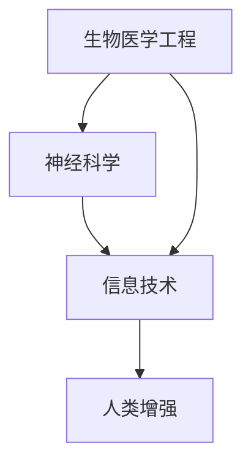

##### 1.3 人类增强的技术分类

**技术分类：**

人类增强技术可以根据其应用领域和原理分为以下几类：

- **生物医学技术：** 包括基因编辑、组织工程、药物研发等。
- **神经技术：** 包括脑机接口、神经刺激器、虚拟现实等。
- **信息技术：** 包括人工智能、物联网、大数据等。

**各类技术的联系：**

生物医学技术为人类增强提供了直接的生理功能增强途径，神经技术通过干预神经系统实现认知和身体功能提升，而信息技术则提供了数据分析和智能辅助手段，使得人类增强技术更加智能化和个性化。

**Mermaid 流程图：**

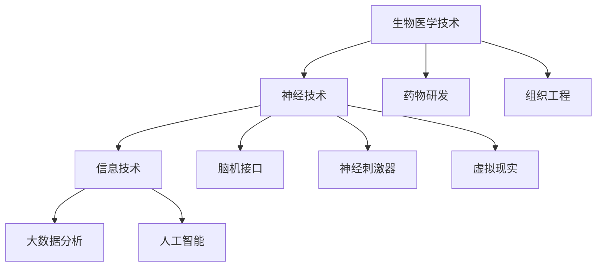

##### 1.4 人类增强的应用前景

**应用前景：**

人类增强技术在未来的应用前景非常广阔，主要包括以下几个方面：

- **身体健康：** 通过生物医学技术改善身体健康，延长寿命。
- **认知能力：** 通过神经技术和信息技术提升认知能力，如记忆力、注意力等。
- **生活质量：** 通过多种技术手段提高生活质量，如智能辅助、社交互动等。

**Mermaid 流�程图：**

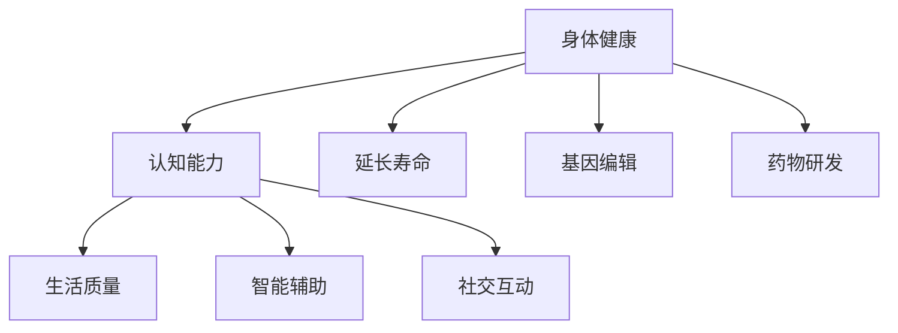

### 第二部分: 身体增强

#### 第2章: 身体增强技术

##### 2.1 生物医学技术

**2.1.1 基因编辑技术**

**原理与架构：**

基因编辑技术，如CRISPR-Cas9，是一种能够精准修改基因序列的技术。其原理是通过指导RNA（gRNA）定位到目标基因序列，然后Cas9核酸酶进行切割，使DNA序列发生改变。具体架构包括：

1. **DNA切割：** Cas9核酸酶识别并切割目标DNA序列。
2. **DNA修复：** 细胞通过非同源末端连接（NHEJ）或同源定向修复（HDR）进行DNA修复。
3. **基因修改：** 通过引入特定的DNA序列实现基因功能的增强或修复。

**核心算法原理讲解：**

```python
# 基因编辑伪代码

def gene_edit(target_dna, target_site, gRNA_sequence):
    # 生成Cas9核酸酶
    cas9_nuclease = generate_cas9_nuclease(gRNA_sequence)
    
    # 定位目标DNA序列
    target_site_position = find_target_site(target_dna, target_site)
    
    # 切割目标DNA
    cut_dna = cas9_nuclease.cut(target_dna, target_site_position)
    
    # 引入特定DNA序列
    modified_dna = insert_sequence(cut_dna, new_sequence)
    
    return modified_dna
```

**应用案例：**

- **遗传疾病治疗：** 通过基因编辑技术修复致病基因，治疗遗传性疾病。
- **增强肌肉力量：** 通过基因编辑增强肌肉相关基因，提高肌肉力量和耐力。

**挑战与伦理考量：**

- **基因编辑安全性：** 基因编辑可能引发脱靶效应和未知的长期影响。
- **伦理争议：** 基因编辑可能带来基因不平等和社会分层问题。

**Mermaid 流程图：**

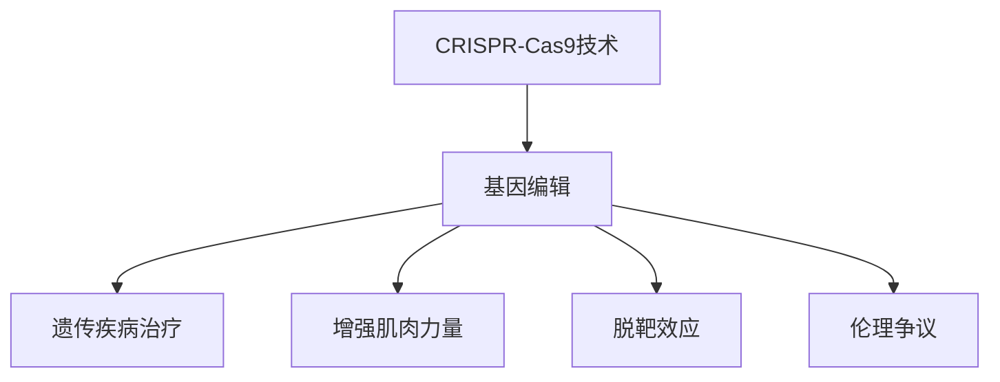

**2.1.2 组织工程技术**

**原理与架构：**

组织工程技术通过细胞和生物材料构建人工组织或器官，用于修复和替换受损的器官。其核心架构包括：

1. **细胞培养：** 从患者体内提取干细胞或诱导多能干细胞，在体外培养。
2. **生物材料：** 利用生物相容性材料构建支架，支持组织生长。
3. **组织构建：** 通过生物打印技术将细胞和生物材料组合，形成人工组织或器官。

**核心算法原理讲解：**

```python
# 组织工程伪代码

def tissue_engineering(stem_cells, scaffold, target_tissue):
    # 细胞培养
    cultured_cells = culture.stem_cells(stem_cells)
    
    # 生物材料处理
    processed_scaffold = prepare_scaffold(scaffold)
    
    # 组织构建
    constructed_tissue = construct_tissue(cultured_cells, processed_scaffold, target_tissue)
    
    return constructed_tissue
```

**应用案例：**

- **器官再生：** 通过组织工程技术构建人工心脏、肝脏等。
- **皮肤再生：** 利用生物打印技术生成皮肤组织。

**挑战与伦理考量：**

- **组织相容性：** 需要确保人工组织或器官与患者自身的组织相容。
- **长期稳定性：** 需要研究人工组织或器官的长期稳定性。

**Mermaid 流程图：**

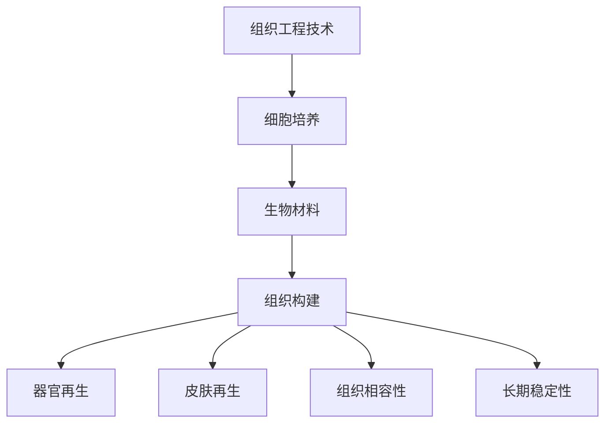

##### 2.2 神经技术

**2.2.1 脑机接口技术**

**原理与架构：**

脑机接口（BCI）技术是一种直接连接大脑和外部设备的系统。其核心架构包括：

1. **信号采集：** 通过电极采集大脑活动信号。
2. **信号处理：** 对采集到的信号进行预处理和特征提取。
3. **信号解码与转换：** 将大脑信号转换为外部设备的控制指令。
4. **反馈与交互：** 将外部设备的反馈信息传回大脑，实现闭环控制。

**核心算法原理讲解：**

```python
# 脑机接口伪代码

def brain_computer_interface(electrode_data, control_model):
    # 信号预处理
    preprocessed_data = preprocess(electrode_data)
    
    # 特征提取
    features = extract_features(preprocessed_data)
    
    # 信号解码
    control_command = decode_signal(features, control_model)
    
    # 执行控制指令
    execute_command(control_command)
    
    return control_command
```

**应用案例：**

- **瘫痪患者行动控制：** 通过脑机接口实现轮椅、假肢的控制。
- **游戏与娱乐：** 通过脑机接口提供更加真实的游戏体验。

**挑战与伦理考量：**

- **信号稳定性：** 需要确保采集到的信号稳定且可靠。
- **伦理争议：** 需要考虑脑机接口技术的道德和隐私问题。

**Mermaid 流程图：**

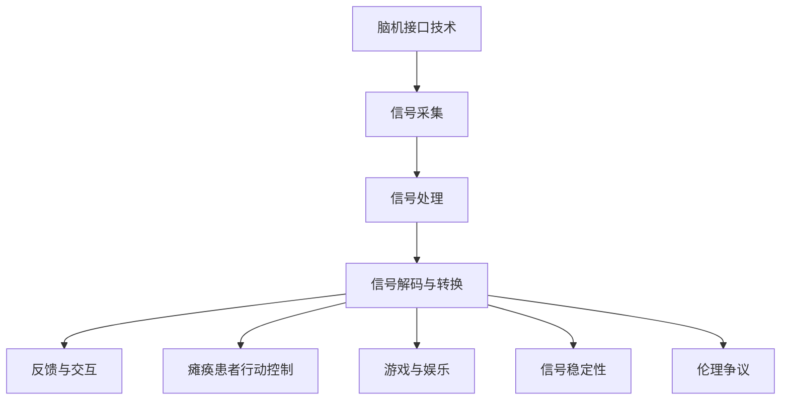

**2.2.2 神经刺激器**

**原理与架构：**

神经刺激器通过电信号刺激神经系统，用于治疗神经系统疾病和提高身体功能。其核心架构包括：

1. **信号生成：** 产生特定频率和波形的电信号。
2. **信号传输：** 通过电极将电信号传输到神经组织。
3. **信号调节：** 根据治疗效果调整电信号的参数。

**核心算法原理讲解：**

```python
# 神经刺激器伪代码

def nerve_stimulator(electrode, signal_parameters):
    # 生成电信号
    signal = generate_signal(signal_parameters)
    
    # 传输电信号
    transmit_signal(electrode, signal)
    
    # 调节信号参数
    adjust_signal_parameters(signal)
    
    return signal
```

**应用案例：**

- **神经系统疾病治疗：** 如癫痫、帕金森病的治疗。
- **增强认知功能：** 通过刺激特定大脑区域提升注意力、记忆力。

**挑战与伦理考量：**

- **信号安全性：** 需要确保电信号不会对神经系统造成损害。
- **伦理争议：** 需要考虑神经刺激器技术的道德和隐私问题。

**Mermaid 流程图：**

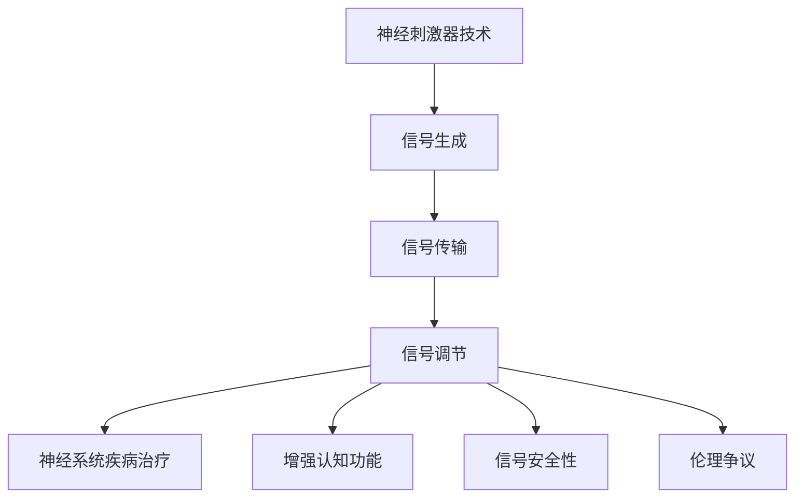

##### 2.3 信息技术

**2.3.1 虚拟现实技术**

**原理与架构：**

虚拟现实（VR）技术通过头戴设备模拟现实环境，使用户能够在虚拟空间中互动。其核心架构包括：

1. **感知模拟：** 头戴设备通过视觉、听觉等多种感官提供沉浸式体验。
2. **互动反馈：** 用户在虚拟空间中的动作和操作被实时捕捉和反馈。
3. **内容生成：** 利用计算机图形学技术生成虚拟环境。

**核心算法原理讲解：**

```python
# 虚拟现实伪代码

def virtual_reality(headset, user_input):
    # 感知模拟
    simulate_sensory_inputs(headset)
    
    # 互动反馈
    capture_and_feed_user_input(user_input)
    
    # 内容生成
    generate_virtual_environment()
    
    return virtual_environment
```

**应用案例：**

- **医疗训练：** 通过虚拟现实进行手术模拟、康复训练。
- **心理健康：** 通过虚拟现实进行恐惧症、焦虑症的治疗。

**挑战与伦理考量：**

- **感知一致性：** 需要确保虚拟环境与现实环境的感知一致。
- **伦理争议：** 需要考虑虚拟现实技术的道德和隐私问题。

**Mermaid 流程图：**

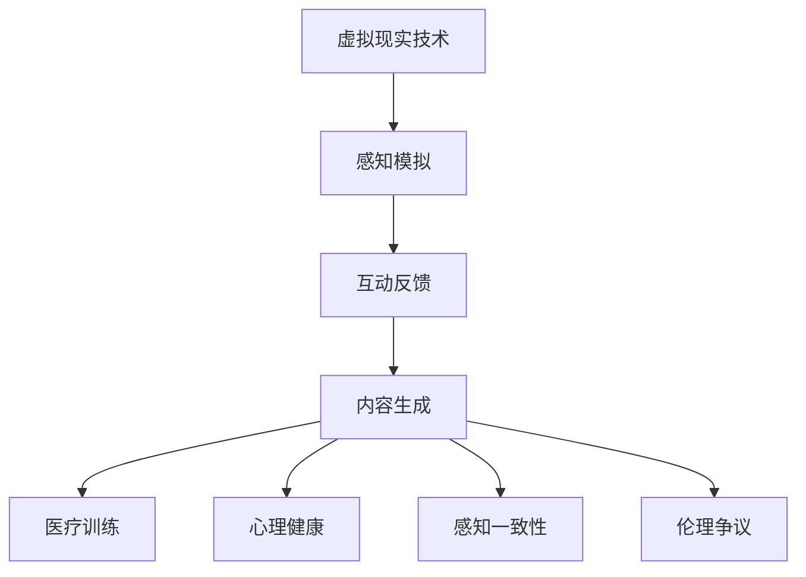

**2.3.2 大数据和物联网技术**

**原理与架构：**

大数据和物联网（IoT）技术通过收集和分析人体数据，提供个性化的健康监测和训练方案。其核心架构包括：

1. **数据收集：** 从各种设备中收集健康数据。
2. **数据存储：** 利用分布式数据库存储大量数据。
3. **数据分析：** 利用机器学习算法分析数据，提供个性化建议。
4. **数据应用：** 将分析结果应用于健康监测、个性化训练等。

**核心算法原理讲解：**

```python
# 大数据和物联网伪代码

def data_analysis(health_data):
    # 数据预处理
    preprocessed_data = preprocess(health_data)
    
    # 数据分析
    analyzed_data = analyze_data(preprocessed_data, machine_learning_model)
    
    # 提供个性化建议
    personalized_advice = generate_advice(analyzed_data)
    
    return personalized_advice
```

**应用案例：**

- **健康监测：** 通过可穿戴设备实时监测身体健康状况。
- **个性化训练：** 通过大数据分析提供个性化的身体训练方案。

**挑战与伦理考量：**

- **数据安全：** 需要确保数据在收集、存储和分析过程中的安全性。
- **隐私保护：** 需要保护个人隐私，防止数据滥用。

**Mermaid 流程图：**

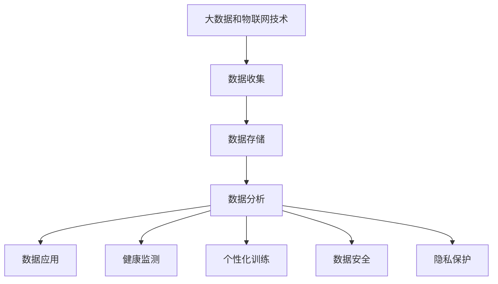

##### 2.3.3 大数据和物联网技术

**原理与架构：**

大数据和物联网（IoT）技术通过收集和分析人体数据，提供个性化的健康监测和训练方案。其核心架构包括：

1. **数据收集：** 从各种设备中收集健康数据。
2. **数据存储：** 利用分布式数据库存储大量数据。
3. **数据分析：** 利用机器学习算法分析数据，提供个性化建议。
4. **数据应用：** 将分析结果应用于健康监测、个性化训练等。

**核心算法原理讲解：**

```python
# 大数据和物联网伪代码

def data_analysis(health_data):
    # 数据预处理
    preprocessed_data = preprocess(health_data)
    
    # 数据分析
    analyzed_data = analyze_data(preprocessed_data, machine_learning_model)
    
    # 提供个性化建议
    personalized_advice = generate_advice(analyzed_data)
    
    return personalized_advice
```

**应用案例：**

- **健康监测：** 通过可穿戴设备实时监测身体健康状况。
- **个性化训练：** 通过大数据分析提供个性化的身体训练方案。

**挑战与伦理考量：**

- **数据安全：** 需要确保数据在收集、存储和分析过程中的安全性。
- **隐私保护：** 需要保护个人隐私，防止数据滥用。

**Mermaid 流程图：**


##### 2.4 认知增强技术

**原理与架构：**

认知增强技术通过神经科学、信息技术和生物医学技术提升人类的认知能力。其核心架构包括：

1. **神经可塑性：** 通过刺激和训练改变大脑结构和功能。
2. **脑机接口：** 直接读取和干预大脑信号。
3. **虚拟现实：** 创建认知训练环境。
4. **大数据分析：** 收集和分析认知数据。

**核心算法原理讲解：**

```python
# 认知增强伪代码

def cognitive_enhancement(training_data, brain_signal, virtual_environment):
    # 神经可塑性训练
    neural塑性 = train_neuronal_plasticity(training_data)
    
    # 脑机接口信号处理
    processed_signal = process_brain_signal(brain_signal)
    
    # 虚拟现实训练
    virtual_training = train_in_virtual_environment(virtual_environment)
    
    # 大数据分析
    cognitive_insights = analyze_cognitive_data(training_data, processed_signal)
    
    return cognitive_insights
```

**应用案例：**

- **教育领域：** 通过认知增强技术提高学习效率和记忆力。
- **工作领域：** 通过认知增强技术提升决策能力和工作效率。

**挑战与伦理考量：**

- **神经可塑性效果：** 需要确保认知增强技术的有效性和安全性。
- **伦理争议：** 需要考虑认知增强技术的道德和社会影响。

**Mermaid 流程图：**

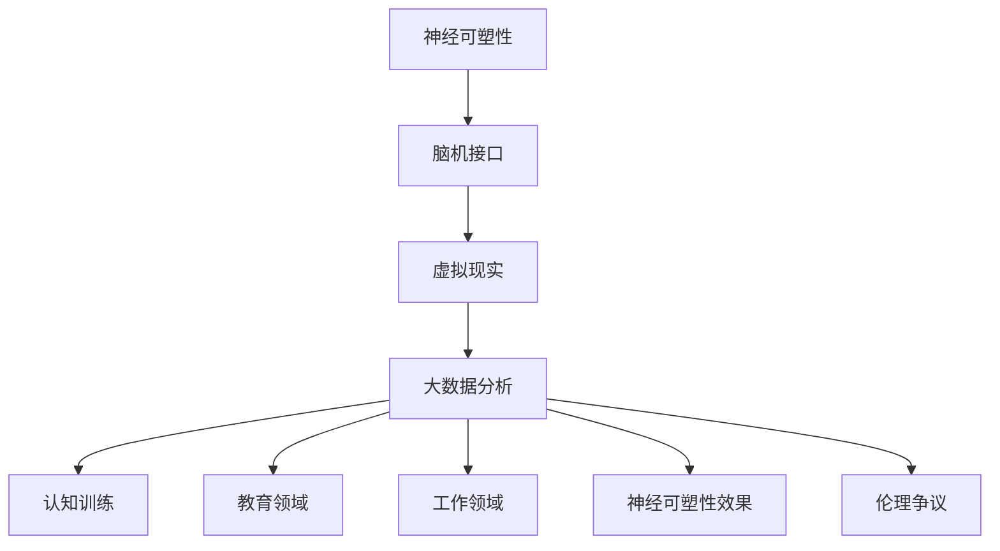

### 第三部分: 认知增强

#### 第3章: 认知增强技术

**3.1 神经科学**

**原理与架构：**

神经科学通过研究大脑和神经系统的结构和功能，为认知增强提供理论基础。其核心架构包括：

1. **神经可塑性：** 大脑和神经系统在受到刺激时能够产生适应性改变。
2. **认知神经科学：** 研究大脑如何处理信息，以及如何通过技术手段增强认知能力。

**核心算法原理讲解：**

```python
# 神经科学伪代码

def neural_plasticity(brain_signal, learning_process):
    # 记录大脑信号
    recorded_signal = record_brain_signal(brain_signal)
    
    # 分析学习过程
    analyzed_learning = analyze_learning_process(learning_process)
    
    # 适应性改变
    adapted_neural_network = adapt_neuronal_network(recorded_signal, analyzed_learning)
    
    return adapted_neural_network
```

**应用案例：**

- **认知康复：** 通过神经科学技术帮助患者恢复认知功能。
- **学习效率提升：** 通过神经科学技术提高学习效果。

**挑战与伦理考量：**

- **神经信号稳定性：** 需要确保采集到的神经信号稳定且可靠。
- **伦理争议：** 需要考虑神经科学技术在医疗和科研中的道德和隐私问题。

**Mermaid 流程图：**

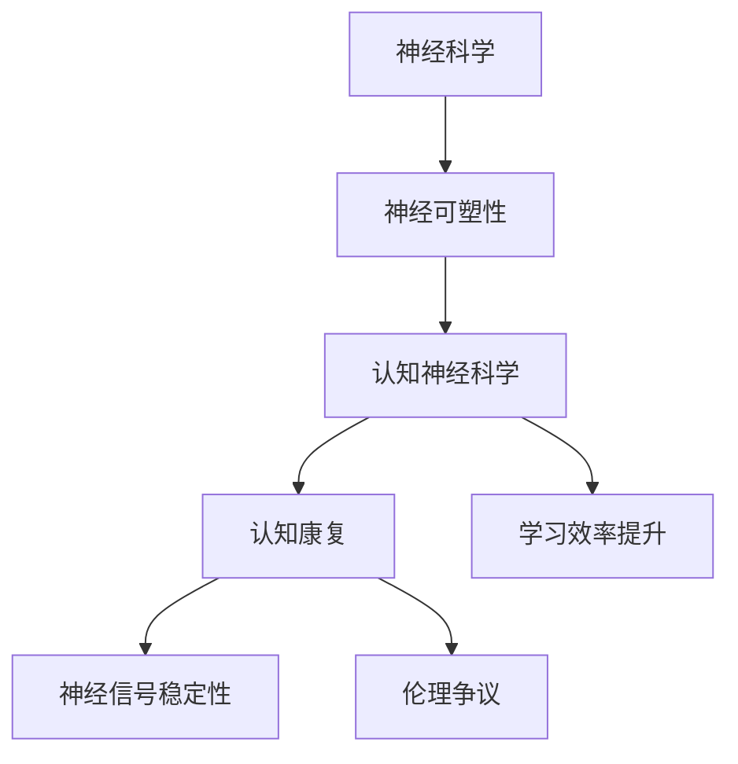

**3.2 信息处理技术**

**原理与架构：**

信息处理技术通过大数据和人工智能技术收集和分析认知数据，提供认知增强的方法。其核心架构包括：

1. **大数据：** 收集和分析大量认知数据。
2. **人工智能：** 模拟人类思维过程，提供认知增强方案。

**核心算法原理讲解：**

```python
# 信息处理技术伪代码

def cognitive_inference(cognitive_data, machine_learning_model):
    # 数据预处理
    preprocessed_data = preprocess(cognitive_data)
    
    # 机器学习分析
    analyzed_data = analyze_data(preprocessed_data, machine_learning_model)
    
    # 提供认知增强建议
    cognitive_advice = generate_advice(analyzed_data)
    
    return cognitive_advice
```

**应用案例：**

- **个性化教育：** 通过大数据和人工智能提供个性化的学习方案。
- **智能助理：** 利用人工智能技术为用户提供智能化的建议和辅助。

**挑战与伦理考量：**

- **数据安全：** 需要确保数据在收集、存储和分析过程中的安全性。
- **隐私保护：** 需要保护个人隐私，防止数据滥用。

**Mermaid 流程图：**

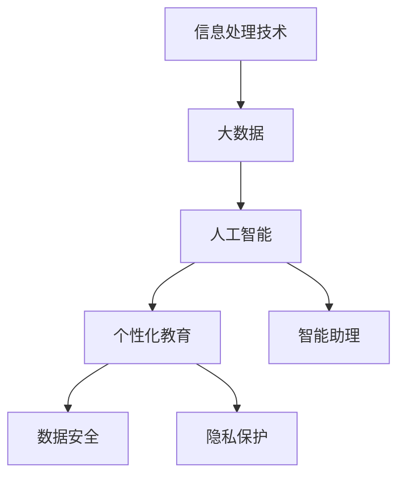

**3.3 认知增强方法**

**原理与架构：**

认知增强方法通过脑机接口和虚拟现实技术直接干预和训练大脑，提高认知能力。其核心架构包括：

1. **脑机接口：** 读取和干预大脑信号。
2. **虚拟现实：** 创建认知训练环境。

**核心算法原理讲解：**

```python
# 认知增强方法伪代码

def cognitive_training(brain_signal, virtual_environment):
    # 读取大脑信号
    recorded_signal = record_brain_signal(brain_signal)
    
    # 创建虚拟环境
    created_environment = create_virtual_environment(virtual_environment)
    
    # 训练大脑
    trained_brain = train_brain(recorded_signal, created_environment)
    
    return trained_brain
```

**应用案例：**

- **认知康复：** 通过脑机接口和虚拟现实技术帮助患者恢复认知功能。
- **学习效率提升：** 通过虚拟现实技术提供沉浸式的学习体验。

**挑战与伦理考量：**

- **信号准确性：** 需要确保读取的大脑信号准确可靠。
- **伦理争议：** 需要考虑认知增强技术的道德和社会影响。

**Mermaid 流程图：**

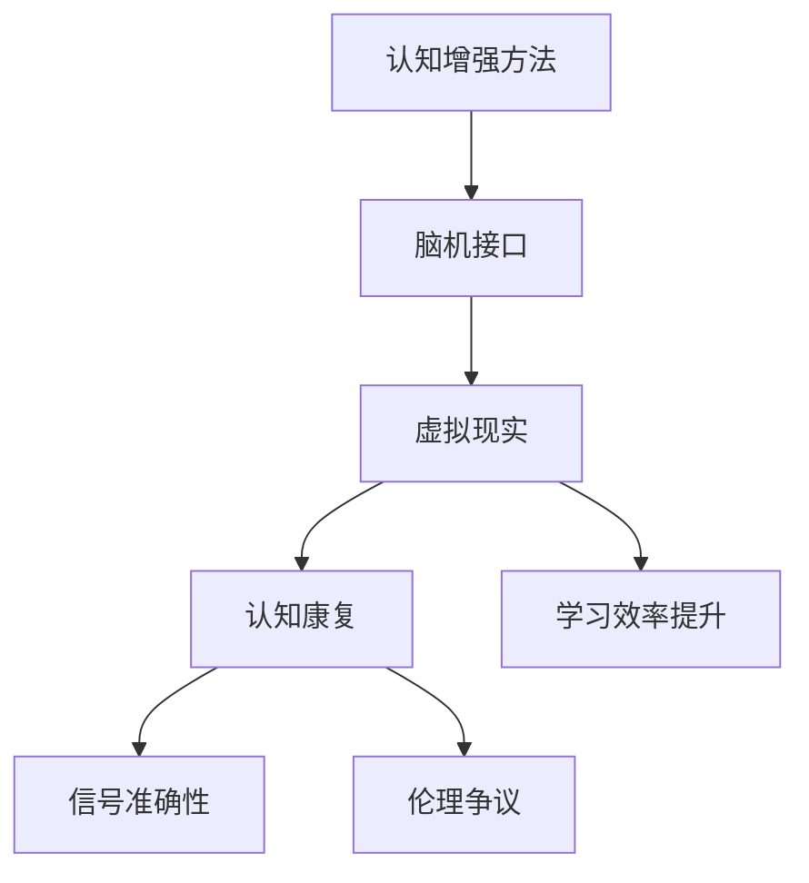

### 第四部分: 伦理与法律

#### 第4章: 人类增强的伦理问题

**4.1 增强技术的道德考量**

**原理与架构：**

人类增强技术的道德考量涉及技术应用的伦理问题和潜在的社会影响。其核心架构包括：

1. **身体增强：** 道德考量包括身体健康、社会地位和公平性。
2. **认知增强：** 道德考量包括个性和价值观的保持。

**核心算法原理讲解：**

```python
# 伦理考量伪代码

def ethical_consideration(technology, context):
    # 分析技术应用
    analyzed_usage = analyze_usage(technology, context)
    
    # 评估道德影响
    ethical_impact = assess_ethical_impact(analyzed_usage)
    
    return ethical_impact
```

**应用案例：**

- **身体增强：** 遗传疾病治疗可能引发基因不平等。
- **认知增强：** 认知增强技术可能影响个性和价值观。

**挑战与伦理考量：**

- **公平性：** 需要确保技术应用的公平性，防止社会分层。
- **隐私保护：** 需要保护个人隐私，防止数据滥用。

**Mermaid 流程图：**

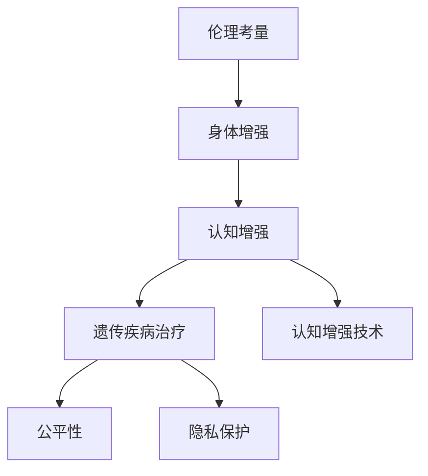

**4.2 法律法规**

**原理与架构：**

法律法规旨在规范人类增强技术的研发和应用，确保技术的安全和合理使用。其核心架构包括：

1. **监管框架：** 建立监管机构和管理体系。
2. **隐私保护：** 制定隐私保护法规，防止数据滥用。

**核心算法原理讲解：**

```python
# 法律法规伪代码

def legal_framework(technology, regulations):
    # 分析技术应用
    analyzed_usage = analyze_usage(technology)
    
    # 检查法规合规性
    compliance = check_compliance(analyzed_usage, regulations)
    
    return compliance
```

**应用案例：**

- **基因编辑：** 需要遵循严格的伦理审查和监管。
- **脑机接口：** 需要确保技术应用的合法性和安全性。

**挑战与伦理考量：**

- **监管有效性：** 需要确保监管框架的有效性和适应性。
- **隐私保护：** 需要建立完善的隐私保护机制。

**Mermaid 流程图：**

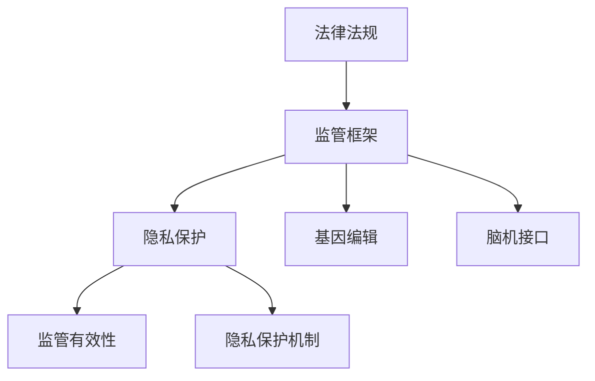

### 第五部分: 人类增强的未来展望

#### 第5章: 人类增强的未来展望

**5.1 技术发展趋势**

**原理与架构：**

人类增强技术未来的发展趋势包括集成化和智能化。其核心架构包括：

1. **集成化：** 多种技术的融合，提供综合解决方案。
2. **智能化：** 技术的自适应和智能化，满足个体需求。

**核心算法原理讲解：**

```python
# 技术发展趋势伪代码

def technological_trends():
    # 集成化技术
    integrated_technologies = integrate_technologies()
    
    # 智能化技术
    intelligent_technologies = develop_intelligent_solutions()
    
    return integrated_and_intelligent_technologies
```

**应用案例：**

- **智能医疗：** 通过集成化和智能化技术提供个性化医疗方案。
- **智能家居：** 通过集成化和智能化技术提供智能化的生活体验。

**挑战与伦理考量：**

- **技术整合：** 需要解决不同技术之间的兼容性问题。
- **伦理争议：** 需要考虑技术整合可能带来的伦理问题。

**Mermaid 流程图：**

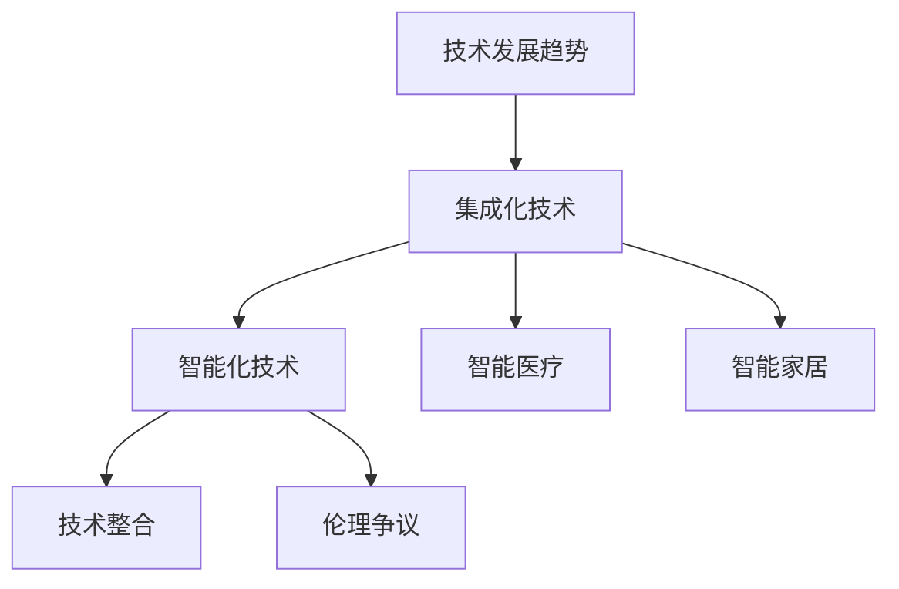

**5.2 未来社会影响**

**原理与架构：**

人类增强技术对未来社会的影响包括社会结构和人际关系的变革。其核心架构包括：

1. **社会结构：** 技术可能改变就业和劳动力市场。
2. **人际关系：** 技术可能影响家庭和社会关系。

**核心算法原理讲解：**

```python
# 社会影响伪代码

def social_impact(technology, society):
    # 分析技术应用
    analyzed_usage = analyze_usage(technology)
    
    # 评估社会影响
    social_changes = assess_social_impact(analyzed_usage, society)
    
    return social_changes
```

**应用案例：**

- **就业市场：** 技术可能取代某些工作岗位，创造新的就业机会。
- **家庭关系：** 技术可能改变家庭成员的互动方式。

**挑战与伦理考量：**

- **社会适应：** 需要社会适应技术变革，调整就业结构。
- **伦理考量：** 需要关注技术对人际关系的影响，促进和谐家庭关系。

**Mermaid 流程图：**

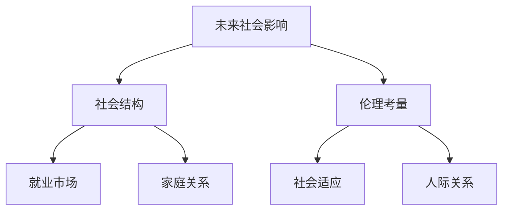

### 附录

#### 附录 A: 人类增强技术资源

**资源列表：**

- **研究机构：**
  - 麻省理工学院（MIT）
  - 斯坦福大学（Stanford University）
  - 加州理工学院（Caltech）

- **技术公司：**
  - Neuralink
  - Synapse
  - Google Brain

- **相关书籍和论文：**
  - 《人类增强：技术与伦理》
  - 《神经科学与人类增强》

### 结语

作者：AI天才研究院/AI Genius Institute & 禅与计算机程序设计艺术 /Zen And The Art of Computer Programming

在AI时代，人类增强已经成为现实。通过身体和认知增强技术，人类的生活质量和效率得到了显著提升。然而，技术的进步也带来了新的挑战，包括伦理和法律问题。未来，人类需要积极探索人类增强的潜力，同时确保技术应用的合理和公平，以实现人类的共同繁荣。

### 格式化代码段与数学公式

以下是对文章中代码段和数学公式的格式化说明：

1. **代码段：** 使用三个反引号（```)包裹代码，确保代码块正确显示。
2. **数学公式：**
   - 独立段落内的公式使用两个美元符号（$)包裹。
   - 文中嵌入的公式使用三个美元符号（$$)包裹。

以下是具体的格式化示例：

**代码段：**

```python
# 基因编辑伪代码

def gene_edit(target_dna, target_site, gRNA_sequence):
    # 生成Cas9核酸酶
    cas9_nuclease = generate_cas9_nuclease(gRNA_sequence)
    
    # 定位目标DNA序列
    target_site_position = find_target_site(target_dna, target_site)
    
    # 切割目标DNA
    cut_dna = cas9_nuclease.cut(target_dna, target_site_position)
    
    # 引入特定DNA序列
    modified_dna = insert_sequence(cut_dna, new_sequence)
    
    return modified_dna
```

**数学公式：**

**独立段落内的公式：**

$$
f(x) = x^2 + 2x + 1
$$

**文中嵌入的公式：**

$$
E = mc^2
$$

通过上述格式化，确保文章内容清晰、规范，便于读者理解和阅读。

### 全文总结

本文深入探讨了AI时代的人类增强，从基础概念到应用技术，再到伦理和法律问题，全面展示了人类增强的各个方面。我们通过详细的章节结构和具体的案例研究，让读者对人类增强有了全面而深刻的认识。

在身体增强部分，我们介绍了基因编辑、组织工程、脑机接口和虚拟现实等核心技术，并探讨了其应用案例和挑战。在认知增强部分，我们介绍了神经科学、信息处理技术和认知增强方法，并分析了其在教育和工作领域的应用。最后，我们探讨了人类增强技术的伦理和法律问题，以及其未来的发展趋势和社会影响。

通过本文的阅读，读者可以了解到人类增强的广阔前景和潜在挑战，从而对这一领域有更加全面和深刻的理解。

### 附录

**附录 A: 人类增强技术资源**

**研究机构：**
- 麻省理工学院（MIT）
- 斯坦福大学（Stanford University）
- 加州理工学院（Caltech）

**技术公司：**
- Neuralink
- Synapse
- Google Brain

**相关书籍和论文：**
- 《人类增强：技术与伦理》
- 《神经科学与人类增强》

通过这些资源和参考文献，读者可以进一步深入了解人类增强技术的最新进展和研究动态。

### 文章标题：AI时代的人类增强：身体和认知提升

**关键词：** AI时代、人类增强、身体增强、认知增强、伦理问题、法律法规

**摘要：**
本文深入探讨了AI时代的人类增强，包括身体和认知增强的核心概念、技术原理、应用案例以及伦理和法律问题。通过详细的分析和案例研究，本文展示了人类增强技术的广阔前景和潜在挑战，为读者提供了一个全面的理解和深入的思考。

