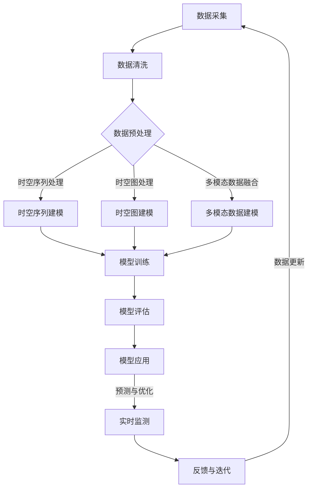

                 

# 《AI时空建模的技术基石解析》

## 引言

### 1.1 AI时空建模的概念与背景

人工智能（AI）作为21世纪最具变革性的技术之一，已经广泛应用于各行各业。时空建模是AI领域的一个重要分支，它关注于对时间和空间维度的数据进行分析和处理。AI时空建模指的是利用人工智能技术和算法，对时空数据进行挖掘、分析和预测的过程。

在过去的几十年中，随着传感器技术的进步、大数据技术的发展以及计算能力的提升，时空数据获取和处理变得更加容易和高效。这些时空数据来源于各种不同的来源，包括卫星遥感、物联网设备、智能交通系统、社交媒体等。这些数据不仅包含位置信息，还包含时间戳、速度、温度、湿度等多种属性。

AI时空建模的重要性在于它能够帮助我们从海量时空数据中提取有价值的信息，为城市规划、交通管理、灾害预测、商业决策等领域提供支持。例如，在交通领域，通过时空建模可以预测交通流量，优化交通信号控制，减少拥堵；在灾害预测领域，通过时空建模可以预测自然灾害的发生时间、地点和强度，从而为应急管理提供科学依据。

### 1.2 AI时空建模的应用领域

AI时空建模在多个领域都有着广泛的应用。以下是几个典型的应用领域：

1. **智慧交通**：通过时空建模，可以实时监测交通流量，预测交通拥堵，优化交通信号控制，提高道路通行效率。
   
2. **城市规划**：通过时空建模，可以分析城市人口分布、土地利用、交通流量等信息，为城市规划提供科学依据。

3. **环境监测**：通过时空建模，可以监测环境污染、气候变化等环境数据，为环境保护提供决策支持。

4. **灾害预测**：通过时空建模，可以预测地震、洪水、台风等自然灾害的发生时间、地点和强度，为防灾减灾提供支持。

5. **商业智能**：通过时空建模，可以分析消费者行为、市场趋势等数据，为市场营销和供应链管理提供支持。

### 1.3 AI时空建模的重要性与挑战

AI时空建模的重要性在于它能够从时空数据中提取有价值的信息，为各个领域提供决策支持。然而，实现有效的时空建模面临着一系列挑战：

1. **数据复杂性**：时空数据通常具有高维度、非结构化等特点，这使得数据处理和分析变得更加复杂。

2. **数据质量**：时空数据的准确性、完整性对建模结果有直接影响。数据中的噪声、异常值和缺失值会影响模型的性能。

3. **模型选择**：不同的时空数据和应用场景需要不同的建模方法。如何选择合适的模型是一个具有挑战性的问题。

4. **计算资源**：时空建模往往需要大量的计算资源，尤其是在处理大规模数据时，如何优化计算资源是一个关键问题。

在接下来的章节中，我们将详细探讨时空数据的获取与预处理、时空数据的表示与建模、核心算法原理讲解以及项目实战等内容，帮助读者深入了解AI时空建模的技术基石。

---

> 关键词：AI时空建模、时空数据、数据处理、建模方法、核心算法、应用实践

> 摘要：本文介绍了AI时空建模的概念、背景和应用领域，探讨了时空数据的获取与预处理、表示与建模方法，详细讲解了核心算法原理，并通过实际项目案例展示了AI时空建模的应用实践。本文旨在为读者提供全面、系统的AI时空建模技术解析。

---

## 目录大纲

### 第一部分：AI时空建模概述

1. **第1章 引言**
    1.1 AI时空建模的概念与背景
    1.2 AI时空建模的应用领域
    1.3 AI时空建模的重要性与挑战

2. **第2章 时空数据的获取与预处理**
    2.1 时空数据类型
    2.2 时空数据的来源
    2.3 时空数据的预处理

3. **第3章 时空数据的表示方法**
    3.1 时空序列表示
    3.2 时空图表示
    3.3 时空多模态数据表示

### 第二部分：时空序列建模技术

4. **第4章 时空序列模型基础**
    4.1 时间序列分析的基本概念
    4.2 常见的时序模型
    4.3 时序数据的特征提取

5. **第5章 时空序列深度学习模型**
    5.1 深度学习与时空序列建模
    5.2 循环神经网络（RNN）及其变种
    5.3 长短时记忆网络（LSTM）与门控循环单元（GRU）

6. **第6章 时空序列预测与评估**
    6.1 预测问题与评估指标
    6.2 时序预测的常见挑战
    6.3 时空序列预测案例

### 第三部分：时空图建模技术

7. **第7章 时空图模型基础**
    7.1 时空图的概念
    7.2 时空图表示方法
    7.3 时空图数据的采集与处理

8. **第8章 时空图神经网络（STGN）模型**
    8.1 STGN模型的原理
    8.2 STGN模型的构建
    8.3 STGN模型的应用

9. **第9章 时空图上的图神经网络**
    9.1 图神经网络的基本概念
    9.2 图注意力机制
    9.3 时空图上的图卷积网络（GCN）

### 第四部分：时空多模态数据建模

10. **第10章 时空多模态数据集成**
    10.1 多模态数据的定义与分类
    10.2 多模态数据集成方法
    10.3 多模态数据的挑战与解决方案

11. **第11章 时空多模态深度学习模型**
    11.1 多模态深度学习的基础
    11.2 融合注意力机制的多模态模型
    11.3 多模态深度学习在时空建模中的应用

12. **第12章 时空多模态数据分析与预测**
    12.1 多模态数据分析方法
    12.2 时空多模态数据预测
    12.3 案例分析

### 第五部分：AI时空建模的应用实践

13. **第13章 时空交通流量预测**
    13.1 交通流量预测的背景与意义
    13.2 数据采集与预处理
    13.3 时空序列模型的选择与训练
    13.4 预测结果分析与优化

14. **第14章 城市安全事件预测**
    14.1 城市安全事件预测的重要性
    14.2 数据采集与预处理
    14.3 时空图模型的选择与训练
    14.4 预测结果分析与优化

15. **第15章 供应链优化与预测**
    15.1 供应链优化与预测的需求
    15.2 数据采集与预处理
    15.3 时空多模态数据模型的选择与训练
    15.4 预测结果分析与优化

### 第六部分：AI时空建模的未来发展趋势与挑战

16. **第16章 AI时空建模的未来发展趋势**
    16.1 技术发展趋势
    16.2 应用发展趋势
    16.3 潜在挑战

17. **第17章 AI时空建模的研究方向与展望**
    17.1 当前研究热点
    17.2 未来研究方向
    17.3 研究方法与工具

### 附录

18. **第18章 常用工具与资源**
    18.1 深度学习框架
    18.2 时空数据集
    18.3 研究论文与文献

通过上述目录大纲，本文将系统性地介绍AI时空建模的相关技术，包括数据获取与预处理、表示与建模方法、核心算法讲解、应用实践以及未来发展趋势。希望读者能够通过本文，全面了解AI时空建模的技术基石，并为实际应用提供指导。

---

### 第一部分：AI时空建模概述

#### 第1章 引言

**1.1 AI时空建模的概念与背景**

人工智能（AI）作为21世纪最具变革性的技术之一，已经广泛应用于各行各业。时空建模是AI领域的一个重要分支，它关注于对时间和空间维度的数据进行分析和处理。AI时空建模指的是利用人工智能技术和算法，对时空数据进行挖掘、分析和预测的过程。

在过去的几十年中，随着传感器技术的进步、大数据技术的发展以及计算能力的提升，时空数据获取和处理变得更加容易和高效。这些时空数据来源于各种不同的来源，包括卫星遥感、物联网设备、智能交通系统、社交媒体等。这些数据不仅包含位置信息，还包含时间戳、速度、温度、湿度等多种属性。

AI时空建模的重要性在于它能够从海量时空数据中提取有价值的信息，为各个领域提供决策支持。例如，在交通领域，通过时空建模可以预测交通流量，优化交通信号控制，减少拥堵；在灾害预测领域，通过时空建模可以预测自然灾害的发生时间、地点和强度，为防灾减灾提供支持。

**1.2 AI时空建模的应用领域**

AI时空建模在多个领域都有着广泛的应用。以下是几个典型的应用领域：

1. **智慧交通**：通过时空建模，可以实时监测交通流量，预测交通拥堵，优化交通信号控制，提高道路通行效率。

2. **城市规划**：通过时空建模，可以分析城市人口分布、土地利用、交通流量等信息，为城市规划提供科学依据。

3. **环境监测**：通过时空建模，可以监测环境污染、气候变化等环境数据，为环境保护提供决策支持。

4. **灾害预测**：通过时空建模，可以预测地震、洪水、台风等自然灾害的发生时间、地点和强度，为防灾减灾提供支持。

5. **商业智能**：通过时空建模，可以分析消费者行为、市场趋势等数据，为市场营销和供应链管理提供支持。

**1.3 AI时空建模的重要性与挑战**

AI时空建模的重要性在于它能够从时空数据中提取有价值的信息，为各个领域提供决策支持。然而，实现有效的时空建模面临着一系列挑战：

1. **数据复杂性**：时空数据通常具有高维度、非结构化等特点，这使得数据处理和分析变得更加复杂。

2. **数据质量**：时空数据的准确性、完整性对建模结果有直接影响。数据中的噪声、异常值和缺失值会影响模型的性能。

3. **模型选择**：不同的时空数据和应用场景需要不同的建模方法。如何选择合适的模型是一个具有挑战性的问题。

4. **计算资源**：时空建模往往需要大量的计算资源，尤其是在处理大规模数据时，如何优化计算资源是一个关键问题。

在接下来的章节中，我们将详细探讨时空数据的获取与预处理、时空数据的表示与建模、核心算法原理讲解以及项目实战等内容，帮助读者深入了解AI时空建模的技术基石。

---

### 第2章 时空数据的获取与预处理

#### 2.1 时空数据类型

时空数据可以按照不同的分类方式进行划分，常见的分类方法包括数据来源、数据类型、应用场景等。

1. **数据来源**

根据数据来源，时空数据可以分为以下几类：

- **卫星遥感数据**：卫星遥感技术可以提供全球范围内的时空数据，包括气象、地理、环境等数据。
- **物联网设备数据**：物联网设备（如传感器、智能设备）可以实时采集位置、速度、温度、湿度等时空数据。
- **智能交通系统数据**：智能交通系统可以采集交通流量、速度、路况等数据。
- **社交媒体数据**：社交媒体数据（如微博、微信、Facebook等）可以提供用户的位置信息、时间戳等数据。

2. **数据类型**

时空数据可以分为以下几种类型：

- **静态数据**：静态数据通常是指不随时间变化的数据，如地图数据、建筑物数据等。
- **动态数据**：动态数据是指随时间变化的数据，如交通流量数据、用户活动数据等。
- **时空序列数据**：时空序列数据是指按照时间顺序排列的数据，如股票价格、天气数据等。
- **时空图数据**：时空图数据是指由节点和边组成的时空网络数据，如城市交通网络、社交网络等。

3. **应用场景**

根据应用场景，时空数据可以分为以下几类：

- **城市规划与优化**：用于分析城市人口分布、土地利用、交通流量等。
- **交通管理**：用于预测交通流量、优化交通信号控制、减少拥堵。
- **环境监测**：用于监测环境污染、气候变化等环境数据。
- **灾害预测与应急管理**：用于预测自然灾害的发生时间、地点和强度。
- **商业智能**：用于分析消费者行为、市场趋势等数据。

#### 2.2 时空数据的来源

时空数据的来源多种多样，以下是一些常见的来源：

1. **卫星遥感数据**：卫星遥感技术可以提供高分辨率的地表信息，包括气象、地理、环境等数据。常见的卫星遥感数据来源有：NASA的MODIS数据、欧洲空间局（ESA）的Sentinel数据等。

2. **物联网设备数据**：物联网设备（如传感器、智能设备）可以实时采集各种时空数据。例如，智能交通系统中的摄像头可以采集交通流量数据，气象站可以采集温度、湿度等数据。

3. **智能交通系统数据**：智能交通系统包括路侧传感器、车载传感器、GPS设备等，可以采集交通流量、速度、路况等数据。

4. **社交媒体数据**：社交媒体平台（如微博、微信、Facebook等）可以提供用户的位置信息、时间戳等数据。这些数据通常通过API接口获取。

5. **公开数据集**：许多机构和组织会提供公开的时空数据集，如开放街图（OpenStreetMap）、美国人口普查数据等。

#### 2.3 时空数据的预处理

时空数据预处理是时空建模的重要步骤，它包括数据清洗、数据集成、数据变换等过程。

1. **数据清洗**：数据清洗是指去除数据中的噪声、异常值和缺失值。常见的清洗方法包括：

- **缺失值处理**：缺失值可以通过填充、删除或插值等方法处理。
- **异常值检测与处理**：异常值可以通过统计学方法（如箱线图、Z-score等）检测，然后进行删除或修正。
- **噪声处理**：噪声可以通过滤波、平滑等方法处理。

2. **数据集成**：数据集成是指将来自不同来源、不同格式的时空数据进行整合。常见的集成方法包括：

- **时间同步**：将不同时间戳的数据对齐到同一时间尺度。
- **空间匹配**：将不同空间分辨率的数据进行匹配，以获得统一的空间尺度。
- **数据融合**：将多个数据源的信息进行融合，以获得更全面和准确的数据。

3. **数据变换**：数据变换是指将原始时空数据转换为适合建模的数据格式。常见的变换方法包括：

- **特征提取**：从原始数据中提取有用的特征，如时间序列的周期性、趋势性等。
- **归一化与标准化**：将数据缩放到一定的范围，如[0,1]或[-1,1]。
- **降维**：减少数据的维度，如主成分分析（PCA）、线性判别分析（LDA）等。

#### 2.4 时空数据的质量评估

时空数据的质量评估是确保数据质量的重要环节，它包括数据准确性、完整性、一致性等方面的评估。

1. **数据准确性**：数据准确性是指数据接近真实值的程度。评估方法包括：

- **误差分析**：比较数据与真实值之间的误差，如均方误差（MSE）、均方根误差（RMSE）等。
- **精度与召回率**：在分类问题中，评估分类器的准确性，如精度（Precision）、召回率（Recall）等。

2. **数据完整性**：数据完整性是指数据中是否存在缺失值或异常值。评估方法包括：

- **缺失值比例**：计算数据中缺失值的比例。
- **异常值比例**：计算数据中异常值的比例。

3. **数据一致性**：数据一致性是指数据在不同时间或空间尺度上的一致性。评估方法包括：

- **时间一致性**：比较不同时间点的数据是否一致。
- **空间一致性**：比较不同区域的数据是否一致。

通过以上对时空数据获取与预处理的内容介绍，我们可以看到，时空数据的质量和预处理方法对时空建模的性能和结果有着重要的影响。在接下来的章节中，我们将继续探讨时空数据的表示与建模方法，以及核心算法原理讲解等内容。

---

### 第3章 时空数据的表示方法

#### 3.1 时空序列表示

时空序列表示是时空数据建模中最常用的方法之一，它将时空数据组织成一个时间序列，以便进行进一步的分析和处理。

1. **时空序列的基本概念**

时空序列是指按时间顺序排列的一系列时空数据点。每个数据点通常包含位置信息和时间信息，以及其他相关的属性（如速度、温度等）。

- **位置信息**：通常使用地理坐标系（如经纬度）来表示。
- **时间信息**：使用时间戳来表示，可以是秒级、分钟级、小时级等。

2. **时空序列的数据结构**

时空序列的数据结构可以是数组、列表或矩阵。数组通常用于存储单一维度的时空序列，而列表或矩阵可以用于存储多维度的时空序列。

3. **时空序列的表示方法**

- **一维时空序列**：最简单的情况，仅包含位置和时间信息。
- **二维时空序列**：包含位置和时间信息，以及额外的属性（如速度、温度等）。
- **多维时空序列**：包含多个维度，如三维空间（经度、纬度、高度）或四维时空（经度、纬度、时间、速度）。

#### 3.2 时空图表示

时空图表示方法将时空数据组织成一个图结构，其中节点表示时空数据点，边表示数据点之间的关系。

1. **时空图的基本概念**

时空图由节点（代表时空数据点）和边（代表节点之间的关系）组成。每个节点包含位置信息和时间信息，边则表示节点之间的时空关系。

- **节点**：每个节点代表一个时空数据点，通常包含位置信息和时间信息。
- **边**：每个边表示两个节点之间的时空关系，可以是时间上的前后关系、空间上的邻近关系等。

2. **时空图的数据结构**

时空图的数据结构通常使用邻接矩阵、邻接表或图论中的图结构来表示。

3. **时空图的表示方法**

- **节点表示**：节点通常用数字或字母表示，并在图中标注位置和时间信息。
- **边表示**：边可以用线条或弧线表示，并标注两个节点之间的关系。

#### 3.3 时空多模态数据表示

时空多模态数据表示方法将不同类型的数据（如图像、文本、声音等）与时空数据结合，以获得更全面和深入的分析。

1. **多模态数据的基本概念**

多模态数据是指包含多个类型的数据，如图像、文本、声音等。在时空多模态数据中，这些多模态数据与时空数据相关联，形成一个综合的数据集。

2. **多模态数据的表示方法**

- **特征融合**：将不同类型的数据进行特征提取，然后融合为统一的数据表示。例如，将图像特征和文本特征进行拼接或加权融合。
- **多模态网络**：构建多模态神经网络，将不同类型的数据输入到网络中，通过多个层次的变换和融合，获得统一的数据表示。

#### 3.4 时空数据表示方法的对比与选择

1. **对比**

- **时空序列表示**：适合处理时间序列数据，能够捕捉时间上的动态变化。但可能难以表示空间关系。
- **时空图表示**：适合处理时空关系复杂的数据，能够捕捉空间和时间的相互关系。但可能计算复杂度高。
- **时空多模态数据表示**：适合处理多模态数据，能够结合不同类型的数据进行更全面的分析。但可能需要更多的计算资源和时间。

2. **选择**

在选择时空数据表示方法时，需要考虑数据的特点和应用需求。例如：

- 如果主要关注时间序列的变化，可以选择时空序列表示。
- 如果需要捕捉时空关系，可以选择时空图表示。
- 如果需要结合多模态数据进行综合分析，可以选择时空多模态数据表示。

通过上述对时空数据表示方法的介绍，我们可以看到，不同的表示方法适用于不同类型的数据和应用场景。在接下来的章节中，我们将继续探讨时空数据的建模方法，包括时空序列建模、时空图建模和时空多模态数据建模等内容。

---

### 第4章 时空序列模型基础

#### 4.1 时间序列分析的基本概念

时间序列分析是统计学和数据分析中的一个重要领域，它涉及对按时间顺序排列的数据进行分析和建模。时间序列数据是随时间变化的数据，通常包含多个时间点上的观测值。这些观测值可以是物理量、经济指标、股票价格等。

1. **时间序列的特征**

时间序列数据具有以下基本特征：

- **趋势性**：数据随时间变化呈现出上升、下降或平稳的趋势。
- **周期性**：数据在一段时间内重复出现某种规律性波动。
- **季节性**：数据在特定时间段（如节假日、季节变化等）表现出明显的波动。
- **随机性**：数据中包含无法预测的随机波动。

2. **时间序列的类型**

时间序列可以分为以下几类：

- **非平稳时间序列**：数据不具有稳定的时间均值或方差。
- **平稳时间序列**：数据在长时间范围内具有稳定的时间均值和方差。
- **自回归时间序列**：当前时间点的值由过去几个时间点的值线性组合而成。
- **移动平均时间序列**：当前时间点的值由过去一段时间内的平均值决定。

#### 4.2 常见的时序模型

常见的时序模型包括以下几种：

1. **自回归模型（AR）**

自回归模型（AutoRegressive, AR）是最基本的时间序列模型之一。它假设当前时间点的值由前几个时间点的值线性组合而成。

- **模型公式**：
  \[
  X_t = c + \phi_1 X_{t-1} + \phi_2 X_{t-2} + \ldots + \phi_p X_{t-p} + \varepsilon_t
  \]
  其中，\(X_t\) 表示时间序列的当前值，\(\phi_1, \phi_2, \ldots, \phi_p\) 是自回归系数，\(\varepsilon_t\) 是随机误差。

- **模型构建**：
  - 选择合适的滞后阶数 \(p\)。
  - 使用最小二乘法或其他优化方法估计自回归系数。

2. **移动平均模型（MA）**

移动平均模型（Moving Average, MA）假设当前时间点的值由过去一段时间内的平均值决定。

- **模型公式**：
  \[
  X_t = c + \varepsilon_t + \theta_1 \varepsilon_{t-1} + \theta_2 \varepsilon_{t-2} + \ldots + \theta_q \varepsilon_{t-q}
  \]
  其中，\(\theta_1, \theta_2, \ldots, \theta_q\) 是移动平均系数，\(\varepsilon_t\) 是随机误差。

- **模型构建**：
  - 选择合适的滞后阶数 \(q\)。
  - 使用最小二乘法或其他优化方法估计移动平均系数。

3. **自回归移动平均模型（ARMA）**

自回归移动平均模型（AutoRegressive Moving Average, ARMA）结合了自回归模型和移动平均模型的特点。

- **模型公式**：
  \[
  X_t = c + \phi_1 X_{t-1} + \phi_2 X_{t-2} + \ldots + \phi_p X_{t-p} + \theta_1 \varepsilon_{t-1} + \theta_2 \varepsilon_{t-2} + \ldots + \theta_q \varepsilon_{t-q}
  \]
  其中，\(\phi_1, \phi_2, \ldots, \phi_p\) 是自回归系数，\(\theta_1, \theta_2, \ldots, \theta_q\) 是移动平均系数。

- **模型构建**：
  - 选择合适的滞后阶数 \(p\) 和 \(q\)。
  - 使用最小二乘法或其他优化方法估计自回归和移动平均系数。

4. **自回归积分滑动平均模型（ARIMA）**

自回归积分滑动平均模型（AutoRegressive Integrated Moving Average, ARIMA）是对ARMA模型的扩展，适用于非平稳时间序列。

- **模型公式**：
  \[
  (1 - \phi_1 B - \phi_2 B^2 - \ldots - \phi_p B^p)(1 - \theta_1 B - \theta_2 B^2 - \ldots - \theta_q B^q)X_t = c
  \]
  其中，\(B\) 是滞后算子，\(\phi_1, \phi_2, \ldots, \phi_p\) 是自回归系数，\(\theta_1, \theta_2, \ldots, \theta_q\) 是移动平均系数。

- **模型构建**：
  - 进行差分转换，使时间序列变为平稳。
  - 选择合适的滞后阶数 \(p\) 和 \(q\)。
  - 使用最小二乘法或其他优化方法估计自回归和移动平均系数。

#### 4.3 时序数据的特征提取

时序数据的特征提取是时空序列建模的重要步骤，它涉及从时间序列中提取有助于建模和分析的特征。

1. **趋势特征**

- **移动平均**：计算一段时间内的平均值，以平滑时间序列中的波动。
- **指数平滑**：使用指数加权的方式，对时间序列进行平滑处理。

2. **周期特征**

- **傅里叶变换**：将时序数据转换为频域，以提取周期性特征。
- **小波变换**：使用小波函数对时序数据进行分解，提取不同频率上的特征。

3. **季节特征**

- **季节性分解**：将时序数据分解为趋势、周期和季节性部分，以便单独处理。

4. **随机特征**

- **残差分析**：对模型拟合后的残差进行分析，以检测随机特征。

#### 4.4 时空序列建模的应用场景

时空序列建模在多个领域都有广泛的应用，以下是一些常见的应用场景：

1. **金融市场预测**：通过时空序列建模，预测股票价格、外汇汇率等金融市场的变化趋势。
2. **能源需求预测**：通过时空序列建模，预测电力需求、天然气需求等能源领域的需求量。
3. **库存管理**：通过时空序列建模，预测库存需求，优化库存水平，减少库存成本。
4. **气象预测**：通过时空序列建模，预测天气变化，为农业生产、城市规划等提供科学依据。

通过本章对时空序列模型基础的介绍，我们可以看到时空序列建模的基本概念、常见模型及其应用场景。在下一章中，我们将继续探讨时空序列深度学习模型，包括循环神经网络（RNN）及其变种等内容。

---

### 第5章 时空序列深度学习模型

#### 5.1 深度学习与时空序列建模

深度学习是一种基于多层神经网络的学习方法，它通过逐层提取特征，能够自动从大量数据中学习到复杂的模式。在时空序列建模中，深度学习模型能够捕捉时间序列数据中的复杂时变特征，提高建模的准确性和鲁棒性。

1. **深度学习的基本概念**

深度学习模型由多个神经网络层组成，每个层将输入数据映射到高维空间，并逐步提取特征。深度学习模型包括以下基本组件：

- **神经元**：神经网络的基本计算单元，每个神经元接收多个输入，通过激活函数产生输出。
- **层**：神经网络中的层次结构，包括输入层、隐藏层和输出层。
- **激活函数**：用于决定神经元是否激活的函数，常用的激活函数有Sigmoid、ReLU、Tanh等。
- **损失函数**：用于评估模型预测值与真实值之间的误差，常用的损失函数有均方误差（MSE）、交叉熵等。

2. **深度学习在时空序列建模中的应用**

深度学习在时空序列建模中的应用主要体现在以下几个方面：

- **特征提取**：通过多层神经网络，自动提取时间序列中的高阶特征，如趋势、周期、季节性等。
- **非线性建模**：深度学习模型能够捕捉时间序列数据中的复杂非线性关系，提高建模的准确性。
- **自适应学习能力**：深度学习模型能够通过不断调整内部参数，自适应地学习数据中的特征，适应数据的变化。

3. **深度学习在时空序列建模中的挑战**

尽管深度学习在时空序列建模中具有显著的优势，但也面临着一些挑战：

- **数据需求**：深度学习模型通常需要大量的训练数据才能达到良好的性能，这在某些领域可能难以实现。
- **模型解释性**：深度学习模型的内部结构复杂，难以解释，这限制了其在一些需要解释性应用的场景中。
- **过拟合问题**：深度学习模型容易发生过拟合，尤其是在训练数据量有限的情况下。

#### 5.2 循环神经网络（RNN）及其变种

循环神经网络（Recurrent Neural Network, RNN）是深度学习中的经典模型之一，它专门设计用于处理序列数据。RNN通过保持隐藏状态，能够捕捉序列数据中的长期依赖关系。

1. **RNN的基本原理**

RNN的每个神经元不仅接收当前的输入，还接收前一个时间步的隐藏状态作为输入。隐藏状态保存了历史信息，使得RNN能够对时间序列数据进行建模。

- **模型公式**：
  \[
  h_t = \sigma(W_h \cdot [h_{t-1}, x_t] + b_h)
  \]
  \[
  y_t = W_o \cdot h_t + b_o
  \]
  其中，\(h_t\) 是时间步 \(t\) 的隐藏状态，\(x_t\) 是时间步 \(t\) 的输入，\(\sigma\) 是激活函数，\(W_h, b_h, W_o, b_o\) 是模型参数。

2. **RNN的变体**

为了解决RNN中的梯度消失和梯度爆炸问题，研究人员提出了一系列RNN的变体，包括长短期记忆网络（LSTM）和门控循环单元（GRU）。

- **长短期记忆网络（LSTM）**

LSTM通过引入记忆单元和三个门控机制（遗忘门、输入门、输出门），解决了RNN的梯度消失问题，能够捕捉长距离的依赖关系。

- **模型公式**：
  \[
  i_t = \sigma(W_i \cdot [h_{t-1}, x_t] + b_i)
  \]
  \[
  f_t = \sigma(W_f \cdot [h_{t-1}, x_t] + b_f)
  \]
  \[
  g_t = \sigma(W_g \cdot [h_{t-1}, x_t] + b_g)
  \]
  \[
  o_t = \sigma(W_o \cdot [h_{t-1}, x_t] + b_o)
  \]
  \[
  C_t = f_t \odot C_{t-1} + i_t \odot g_t
  \]
  \[
  h_t = o_t \odot C_t
  \]
  其中，\(i_t, f_t, g_t, o_t\) 分别是输入门、遗忘门、输入门和输出门的输出，\(C_t\) 是记忆单元的状态。

- **门控循环单元（GRU）**

GRU是LSTM的简化版，通过合并输入门和遗忘门，减少了参数数量，计算效率更高。

- **模型公式**：
  \[
  z_t = \sigma(W_z \cdot [h_{t-1}, x_t] + b_z)
  \]
  \[
  r_t = \sigma(W_r \cdot [h_{t-1}, x_t] + b_r)
  \]
  \[
  \tilde{h}_t = \sigma(W_{\tilde{h}} \cdot [r_t \odot h_{t-1}, x_t] + b_{\tilde{h}})
  \]
  \[
  h_t = (1 - z_t) \odot h_{t-1} + z_t \odot \tilde{h}_t
  \]

#### 5.3 RNN在时空序列建模中的应用

RNN及其变体在时空序列建模中有着广泛的应用。以下是一些典型的应用场景：

1. **时间序列预测**：使用RNN可以预测未来的时间序列值，如股票价格、气象数据等。

2. **文本生成**：RNN可以用于生成自然语言文本，如文章、对话等。

3. **语音识别**：RNN可以用于处理语音信号，实现语音到文本的转换。

4. **图像分类**：通过结合卷积神经网络（CNN）和RNN，可以实现图像分类任务。

5. **序列标注**：RNN可以用于序列标注任务，如情感分析、实体识别等。

通过本章对时空序列深度学习模型的介绍，我们可以看到深度学习模型在时空序列建模中的强大能力。在下一章中，我们将继续探讨时空序列模型在预测与评估中的应用。

---

### 第6章 时空序列预测与评估

#### 6.1 预测问题与评估指标

时空序列预测是AI时空建模中的重要任务，它旨在根据历史数据预测未来的值。时空序列预测问题的核心是如何从大量的历史数据中提取有用的信息，建立有效的预测模型。为了衡量预测模型的性能，我们需要使用一系列评估指标。

1. **时间序列预测问题**

时间序列预测问题可以归结为以下步骤：

- **数据预处理**：对时空序列数据进行清洗、归一化等处理，以便于模型训练。
- **特征提取**：从时空序列数据中提取有用的特征，如趋势、周期、季节性等。
- **模型选择**：选择合适的时间序列模型，如ARIMA、LSTM、GRU等。
- **模型训练**：使用历史数据训练模型，调整模型参数。
- **预测**：使用训练好的模型对未来的时间序列值进行预测。
- **评估**：使用评估指标评估预测模型的性能。

2. **评估指标**

常见的评估指标包括以下几种：

- **均方误差（MSE）**：
  \[
  MSE = \frac{1}{n} \sum_{i=1}^{n} (y_i - \hat{y}_i)^2
  \]
  其中，\(y_i\) 是实际值，\(\hat{y}_i\) 是预测值，\(n\) 是数据点的数量。

- **均方根误差（RMSE）**：
  \[
  RMSE = \sqrt{MSE}
  \]

- **平均绝对误差（MAE）**：
  \[
  MAE = \frac{1}{n} \sum_{i=1}^{n} |y_i - \hat{y}_i|
  \]

- **平均绝对百分比误差（MAPE）**：
  \[
  MAPE = \frac{1}{n} \sum_{i=1}^{n} \left| \frac{y_i - \hat{y}_i}{y_i} \right|
  \]

- **准确率（Accuracy）**：
  \[
  Accuracy = \frac{TP + TN}{TP + FN + TP + FP}
  \]
  其中，\(TP\) 是真阳性，\(TN\) 是真阴性，\(FP\) 是假阳性，\(FN\) 是假阴性。

- **召回率（Recall）**：
  \[
  Recall = \frac{TP}{TP + FN}
  \]

- **精确率（Precision）**：
  \[
  Precision = \frac{TP}{TP + FP}
  \]

#### 6.2 时序预测的常见挑战

时序预测面临着一系列挑战，包括数据复杂性、模型选择、计算资源等。

1. **数据复杂性**

时序数据通常具有以下复杂性：

- **高维度**：时序数据包含多个维度，如时间、位置、速度等。
- **非平稳性**：时序数据可能不具有稳定的时间均值和方差，这会导致模型难以捕捉数据中的特征。
- **缺失值和异常值**：时序数据中可能存在缺失值和异常值，这些值会影响模型的训练和预测性能。
- **噪声**：时序数据中可能包含噪声，这些噪声会影响模型的准确性。

2. **模型选择**

选择合适的时间序列模型是时序预测中的关键步骤。常见的模型包括ARIMA、LSTM、GRU等。不同的模型适用于不同类型的数据和应用场景，因此需要根据具体问题进行选择。

3. **计算资源**

时序预测通常需要大量的计算资源，尤其是在处理大规模数据时。深度学习模型，如LSTM和GRU，需要较大的计算资源进行训练和预测。

#### 6.3 时空序列预测案例

以下是一个简单的时空序列预测案例，使用LSTM模型预测股票价格。

**案例背景**：某只股票的历史收盘价数据如下：

```
[100, 102, 101, 104, 105, 103, 102, 103, 104, 106]
```

**步骤1：数据预处理**

- 数据归一化：
  \[
  X = \frac{X - \text{mean}(X)}{\text{stddev}(X)}
  \]
  其中，\(\text{mean}(X)\) 是数据的均值，\(\text{stddev}(X)\) 是数据的标准差。

- 数据填充：
  对于缺失值，可以使用前一个时间点的值进行填充。

**步骤2：特征提取**

- 提取时间序列的周期特征，如趋势、周期、季节性等。

**步骤3：模型选择**

- 选择LSTM模型进行训练，设定合适的网络参数。

**步骤4：模型训练**

- 使用历史数据训练LSTM模型，调整模型参数，使预测误差最小化。

**步骤5：预测**

- 使用训练好的LSTM模型对未来的股票价格进行预测。

**步骤6：评估**

- 使用评估指标（如MSE、RMSE等）评估预测模型的性能。

通过上述案例，我们可以看到时空序列预测的基本步骤和方法。在下一章中，我们将继续探讨时空图模型的基础知识。

---

### 第7章 时空图模型基础

#### 7.1 时空图的概念

时空图（Temporal Graph）是一种将时间和空间维度结合在一起的数据结构，它由节点（代表时空事件）、边（代表时空关系）和时间戳（代表事件发生的时间）组成。时空图模型用于捕捉和分析动态的、时间序列化的社交网络、交通网络、生物网络等。

1. **时空图的基本组成**

- **节点**：在时空图中，节点表示各种实体，如人、地点、物体等。
- **边**：时空图中的边表示节点之间的关系，可以是物理距离、互动关系等。
- **时间戳**：时间戳表示节点之间的关系发生的时间，可以是具体的时间点或时间段。

2. **时空图的特点**

- **动态性**：时空图随着时间的推移而变化，节点和边可以新增、删除或改变状态。
- **异构性**：时空图可以是异构的，即节点和边具有不同的类型和属性。
- **多模态性**：时空图可以包含多种类型的数据，如图像、文本、传感器数据等。

#### 7.2 时空图的表示方法

1. **邻接矩阵表示**

邻接矩阵是一种常用的时空图表示方法，它使用一个二维矩阵来表示图中节点之间的关系。矩阵的元素表示节点之间的权重，可以是0或1（表示不存在关系）或具体的数值（表示关系的强度）。

2. **边列表表示**

边列表表示方法使用一个列表来存储图中所有的边，每个边由两个节点的索引和权重组成。这种方法适合于稀疏图，因为不需要存储大量的零元素。

3. **图论表示**

在图论中，时空图可以被视为一个有向图或无向图，其中节点表示实体，边表示实体之间的关系。图论表示方法提供了丰富的工具和算法，用于分析图的结构和属性。

4. **图嵌入表示**

图嵌入是一种将图结构映射到高维空间的表示方法。通过图嵌入，节点和边可以表示为向量，从而利用机器学习算法进行进一步的分析。

#### 7.3 时空图数据的采集与处理

1. **数据采集**

时空图数据可以从多个来源获取：

- **传感器数据**：如GPS轨迹、温度传感器数据等。
- **社会媒体数据**：如Twitter、Facebook等社交网络数据。
- **交通数据**：如交通流量、交通事故报告等。
- **卫星遥感数据**：如气象卫星数据、地球观测卫星数据等。

2. **数据处理**

时空图数据的处理包括以下步骤：

- **数据清洗**：去除噪声、异常值和重复数据。
- **数据整合**：将来自不同来源的数据进行整合，以获得全局的时空图。
- **数据归一化**：将数据缩放到一个统一的范围，以便于后续分析。
- **数据降维**：使用降维技术，如PCA，减少数据维度，提高计算效率。

#### 7.4 时空图模型的应用

时空图模型在多个领域都有广泛的应用：

- **社会网络分析**：用于分析社交网络中的关系、趋势和社区结构。
- **交通管理**：用于预测交通流量、优化交通信号控制、减少拥堵。
- **生物信息学**：用于分析生物网络中的节点和边，揭示生物分子间的相互作用。
- **环境监测**：用于监测环境污染、气候变化等环境数据。

通过本章对时空图模型基础的介绍，我们可以了解到时空图模型的概念、表示方法以及数据采集与处理的基本步骤。在下一章中，我们将探讨时空图神经网络（STGN）模型及其应用。

---

### 第8章 时空图神经网络（STGN）模型

#### 8.1 STGN模型的原理

时空图神经网络（Spatial Temporal Graph Neural Network, STGN）是一种用于处理时空图数据的深度学习模型。STGN模型结合了图神经网络（Graph Neural Network, GNN）和时间序列分析技术，能够有效捕捉时空图中的时空依赖关系。

1. **STGN模型的基本架构**

STGN模型由以下几个部分组成：

- **节点特征提取**：使用图嵌入技术，将时空图中的节点映射到高维空间，为后续的图神经网络提供输入。
- **图卷积层**：通过图卷积操作，整合节点及其邻居节点的特征，生成更新后的节点特征。
- **时间卷积层**：通过时间卷积操作，整合时间序列上的特征，捕捉时间维度上的依赖关系。
- **融合层**：将空间特征和时间特征进行融合，生成最终的节点表示。
- **预测层**：使用全连接层或其他神经网络结构，对节点进行分类或回归预测。

2. **图卷积操作**

图卷积操作是STGN模型的核心，它通过聚合节点及其邻居节点的特征来更新节点状态。常见的图卷积操作包括：

- **邻接矩阵卷积**：通过邻接矩阵对节点特征进行卷积操作。
- **卷积神经网络（CNN）卷积**：使用CNN对节点特征进行卷积操作，可以捕捉局部特征。
- **图卷积网络（GCN）卷积**：使用GCN对节点特征进行卷积操作，可以捕捉全局特征。

3. **时间卷积操作**

时间卷积操作用于整合时间序列上的特征，捕捉时间维度上的依赖关系。常见的时间卷积操作包括：

- **滑动窗口卷积**：通过滑动窗口对时间序列进行卷积操作，可以捕捉局部时间特征。
- **长短时记忆网络（LSTM）卷积**：使用LSTM对时间序列进行卷积操作，可以捕捉长距离时间依赖。

#### 8.2 STGN模型的构建

构建STGN模型需要以下几个步骤：

1. **节点特征提取**：

- **图嵌入**：使用图嵌入技术（如节点相似性嵌入、随机游走嵌入等），将节点映射到高维空间。
- **特征融合**：将节点的原始特征（如位置、时间、属性等）与图嵌入特征进行融合，形成最终的节点特征。

2. **图卷积层**：

- **定义图结构**：根据时空图的数据，定义节点的邻接矩阵。
- **选择卷积操作**：选择适合的卷积操作（如邻接矩阵卷积、GCN卷积等），对节点特征进行聚合。

3. **时间卷积层**：

- **定义时间序列结构**：根据时空图的时间维度，定义时间序列的数据结构。
- **选择时间卷积操作**：选择适合的时间卷积操作（如滑动窗口卷积、LSTM卷积等），对时间序列特征进行聚合。

4. **融合层**：

- **融合操作**：将空间特征和时间特征进行融合，可以使用拼接、平均、加权等方法。
- **激活函数**：使用激活函数（如ReLU、Sigmoid等），增强模型的非线性表达能力。

5. **预测层**：

- **定义输出层**：根据具体的预测任务，定义输出层的结构（如分类层、回归层等）。
- **损失函数**：选择合适的损失函数（如交叉熵、均方误差等），优化模型参数。

#### 8.3 STGN模型的应用

STGN模型在多个领域有着广泛的应用，以下是一些典型的应用场景：

1. **社会网络分析**：

- **关系预测**：预测社交网络中用户之间的互动关系。
- **社区检测**：检测社交网络中的社区结构。

2. **交通管理**：

- **交通流量预测**：预测交通流量，优化交通信号控制。
- **事故预测**：预测交通事故的发生时间和地点。

3. **环境监测**：

- **污染预测**：预测环境污染的时空分布。
- **气候预测**：预测气候变化的时空特征。

4. **生物信息学**：

- **蛋白质相互作用预测**：预测蛋白质之间的相互作用。
- **基因调控网络分析**：分析基因调控网络的时空特征。

通过本章对时空图神经网络（STGN）模型的介绍，我们可以了解到STGN模型的基本原理、构建方法和应用场景。在下一章中，我们将探讨时空图上的图神经网络（GNN）及其应用。

---

### 第9章 时空图上的图神经网络（GNN）

#### 9.1 图神经网络（GNN）的基本概念

图神经网络（Graph Neural Network, GNN）是一种用于处理图结构数据的深度学习模型。与传统基于欧氏空间的神经网络不同，GNN能够直接处理非结构化的图数据，如社交网络、交通网络、生物网络等。GNN通过图卷积操作，从节点和边的关系中提取特征，形成图级别的特征表示。

1. **GNN的核心思想**

GNN的核心思想是利用节点和边之间的邻接关系来更新节点的特征。在每次迭代中，GNN聚合节点及其邻居节点的特征，生成新的节点特征表示。通过多层的图卷积操作，GNN能够逐步提取图中的高层次特征，形成全局的图表示。

2. **GNN的基本组成部分**

- **节点特征**：每个节点都有一组特征，用于描述节点的属性。
- **边特征**：边也可以有特征，用于描述节点之间的关联强度。
- **图卷积层**：图卷积层是GNN的核心组件，通过聚合节点及其邻居节点的特征，更新节点的特征表示。
- **池化层**：在GNN的某些阶段，使用池化层来减少节点数量，提高计算效率。
- **全连接层**：在GNN的输出层，使用全连接层进行分类或回归预测。

#### 9.2 图注意力机制

图注意力机制（Graph Attention Mechanism, GAT）是GNN的一种重要变种，它通过学习节点之间的注意力权重，动态调整节点特征在图卷积过程中的贡献。GAT能够提高GNN对图结构数据中的复杂关系的捕捉能力。

1. **注意力机制的基本原理**

注意力机制源于自然语言处理中的序列模型，其核心思想是通过学习权重来调整不同输入元素在模型中的重要性。在GNN中，注意力机制用于调整节点特征在图卷积过程中的贡献。

2. **GAT的数学描述**

GAT通过自注意力机制（Self-Attention）和图注意力机制（Graph Attention）两部分来更新节点特征。

- **自注意力**：
  \[
  \text{Attention}(Q, K, V) = \frac{softmax(\frac{QK^T}{\sqrt{d_k}})}{V}
  \]
  其中，\(Q, K, V\) 分别是查询向量、键向量和值向量，\(d_k\) 是键向量的维度。

- **图注意力**：
  \[
  \text{GraphAttention}(X, A, \theta) = \text{softmax}\left(\frac{\text{ReLU}(XW^Q + A\theta^Q + b^Q) (XW^K + A\theta^K + b^K)^T}{\sqrt{d_k}}\right) (XW^V + A\theta^V + b^V)
  \]
  其中，\(X\) 是节点特征矩阵，\(A\) 是邻接矩阵，\(\theta\) 和 \(b\) 是可学习的参数。

#### 9.3 时空图上的图卷积网络（GCN）

图卷积网络（Graph Convolutional Network, GCN）是GNN的一种简单实现，它通过邻接矩阵进行图卷积操作，聚合节点及其邻居节点的特征。GCN适用于静态图数据，但在时空图上，GCN需要进行一些修改。

1. **GCN的数学描述**

GCN的图卷积操作可以表示为：
\[
H_{l+1} = \sigma(\tilde{D}^{-\frac{1}{2}} \tilde{A} \tilde{D}^{-\frac{1}{2}} H_l W_l)
\]
其中，\(H_l\) 是第 \(l\) 层的节点特征矩阵，\(\sigma\) 是激活函数，\(\tilde{A} = A + I\) 是邻接矩阵的拉普拉斯矩阵，\(W_l\) 是第 \(l\) 层的权重矩阵。

2. **时空图上的GCN**

在时空图上，GCN需要进行以下修改：

- **时间维度的处理**：在图卷积操作中引入时间维度，通过时间卷积层捕捉时间序列上的特征。
- **动态邻接矩阵**：在时间序列中，节点之间的关系会随时间变化，因此需要动态构建邻接矩阵。

#### 9.4 GNN在时空图建模中的应用

GNN在时空图建模中具有广泛的应用，以下是一些典型的应用场景：

1. **社交网络分析**：

- **关系预测**：预测社交网络中用户之间的互动关系。
- **社区检测**：检测社交网络中的社区结构。

2. **交通管理**：

- **交通流量预测**：预测交通流量，优化交通信号控制。
- **事故预测**：预测交通事故的发生时间和地点。

3. **环境监测**：

- **污染预测**：预测环境污染的时空分布。
- **气候预测**：预测气候变化的时空特征。

4. **生物信息学**：

- **蛋白质相互作用预测**：预测蛋白质之间的相互作用。
- **基因调控网络分析**：分析基因调控网络的时空特征。

通过本章对时空图上的图神经网络（GNN）的介绍，我们可以了解到GNN的基本概念、图注意力机制、GCN的原理以及应用场景。在下一章中，我们将探讨时空多模态数据集成的方法和挑战。

---

### 第10章 时空多模态数据集成

#### 10.1 多模态数据的定义与分类

多模态数据是指包含两种或两种以上不同类型的数据，如图像、文本、音频、传感器数据等。这些数据可以独立存在，也可以相互关联。多模态数据集成是将这些不同类型的数据融合在一起，以获得更全面和深入的分析。

1. **多模态数据的类型**

- **图像数据**：包括静态图像和动态视频，用于捕捉空间信息。
- **文本数据**：包括自然语言文本，如文章、对话、评论等，用于捕捉语义信息。
- **音频数据**：包括语音和音乐，用于捕捉声音信息。
- **传感器数据**：来自各种传感器，如温度、湿度、加速度、速度等，用于捕捉物理量信息。
- **其他数据**：如地理位置、时间戳等，用于补充其他模态的数据。

2. **多模态数据的分类**

- **同步多模态数据**：不同模态的数据在同一时间点采集，如视频监控中的视频和音频数据。
- **异步多模态数据**：不同模态的数据在不同时间点采集，如社交媒体中的文本和图像数据。
- **对齐多模态数据**：不同模态的数据已经对齐，可以直接进行融合，如某些传感器数据。
- **未对齐多模态数据**：不同模态的数据没有对齐，需要通过时间同步或其他方法进行对齐。

#### 10.2 多模态数据集成方法

多模态数据集成方法可以分为以下几类：

1. **特征级融合**：

- **特征拼接**：将不同模态的特征向量拼接在一起，形成一个多维特征向量。
- **特征加权**：根据不同模态的重要程度，对特征向量进行加权。
- **特征选择**：选择最有用的特征进行融合，如使用主成分分析（PCA）或特征选择算法。

2. **决策级融合**：

- **投票法**：将不同模态的预测结果进行投票，选择投票结果最高的作为最终预测。
- **集成学习**：使用集成学习方法（如随机森林、梯度提升机等）将不同模态的数据进行融合，提高预测性能。

3. **模型级融合**：

- **多任务学习**：将不同模态的数据作为不同任务，共同训练一个神经网络。
- **多模型集成**：使用多个独立的模型分别对每个模态的数据进行预测，然后集成预测结果。

#### 10.3 多模态数据的挑战与解决方案

1. **数据不均衡**

多模态数据往往存在数据不均衡问题，如某些模态的数据量远大于其他模态。解决方案包括：

- **数据增强**：增加少量数据模态的样本量，使数据分布更加均衡。
- **欠采样**：减少大量数据模态的样本量，以平衡不同模态的数据。

2. **数据不一致**

多模态数据可能来自不同的来源，存在数据不一致的问题，如时间戳不匹配、单位不一致等。解决方案包括：

- **数据对齐**：通过时间同步、空间匹配等方法，对多模态数据进行对齐。
- **数据标准化**：对多模态数据进行标准化处理，使不同模态的数据具有相同的量纲和范围。

3. **特征维度差异**

多模态数据往往具有不同的维度，如图像数据是二维的，而文本数据是一维的。解决方案包括：

- **特征降维**：使用降维技术（如PCA、t-SNE等）减少特征维度。
- **特征融合**：将不同模态的特征进行融合，形成统一的高维特征向量。

4. **计算复杂性**

多模态数据集成方法可能涉及大量的计算，特别是在处理大规模数据时。解决方案包括：

- **并行计算**：使用并行计算技术（如GPU加速、分布式计算等）提高计算效率。
- **模型压缩**：使用模型压缩技术（如深度网络剪枝、知识蒸馏等）减少计算负担。

通过本章对时空多模态数据集成方法的介绍，我们可以了解到多模态数据的定义、分类、集成方法以及面临的挑战和解决方案。在下一章中，我们将探讨时空多模态深度学习模型的应用。

---

### 第11章 时空多模态深度学习模型

#### 11.1 多模态深度学习的基础

多模态深度学习是一种利用深度神经网络从多个模态的数据中提取特征和进行融合的机器学习方法。它通过结合不同模态的数据，可以提供更丰富和全面的信息，从而在许多应用中提高性能。

1. **多模态深度学习的基本概念**

多模态深度学习涉及以下几个核心概念：

- **模态**：数据的不同来源或类型，如图像、文本、音频等。
- **特征提取**：从每个模态中提取有用的特征。
- **特征融合**：将不同模态的特征进行结合，以生成统一的特征表示。
- **模型训练**：使用训练数据对深度学习模型进行训练，使其能够对新的数据进行预测或分类。

2. **多模态深度学习的框架**

多模态深度学习框架通常包括以下几个步骤：

- **特征提取**：使用卷积神经网络（CNN）等深度学习模型从每个模态中提取特征。
- **特征融合**：将提取的各个模态特征进行融合，可以采用拼接、加权融合、注意力机制等方法。
- **分类或回归**：使用融合后的特征进行分类或回归任务。
- **评估**：使用评估指标（如准确率、召回率、均方误差等）评估模型性能。

#### 11.2 融合注意力机制的多模态模型

融合注意力机制的多模态模型通过引入注意力机制，动态调整不同模态的特征在融合过程中的贡献。这有助于模型更好地捕捉关键信息，提高性能。

1. **注意力机制的基本原理**

注意力机制是一种通过学习权重来调整不同输入元素在模型中的重要性。在多模态深度学习中，注意力机制可以用于调整不同模态的特征在融合过程中的贡献。

2. **多模态注意力机制的实现**

多模态注意力机制可以通过以下方法实现：

- **自注意力**：每个模态的特征与其自身的其他特征进行交互，生成注意力权重。
- **交叉注意力**：不同模态的特征之间进行交互，生成注意力权重。

3. **多模态注意力机制的优点**

- **动态调整**：注意力机制可以根据数据的特点动态调整不同模态的特征贡献，提高模型的鲁棒性和准确性。
- **特征优化**：通过注意力机制，模型可以自动学习到哪些特征对任务最为重要，从而优化特征表示。

#### 11.3 多模态深度学习在时空建模中的应用

多模态深度学习在时空建模中有着广泛的应用，以下是一些典型的应用场景：

1. **视频监控**：

- **异常检测**：通过结合视频和音频数据，检测视频中的异常行为或事件。
- **人物识别**：通过结合视频和图像数据，识别视频中的特定人物。

2. **医疗诊断**：

- **疾病预测**：通过结合医学影像、电子健康记录和生物标志物等数据，预测疾病的发生风险。
- **诊断辅助**：通过结合多模态数据，辅助医生进行疾病诊断。

3. **交通管理**：

- **交通流量预测**：通过结合交通摄像头、传感器和气象数据，预测交通流量，优化交通信号控制。
- **事故预警**：通过结合车辆传感器、雷达和图像数据，预警潜在的事故风险。

4. **环境监测**：

- **污染检测**：通过结合气象、土壤和水质数据，检测环境污染的时空分布。
- **气候变化分析**：通过结合卫星遥感、气象和海洋数据，分析气候变化的时空特征。

通过本章对时空多模态深度学习模型的介绍，我们可以了解到多模态深度学习的基础概念、融合注意力机制的应用以及在不同领域的应用案例。在下一章中，我们将探讨时空多模态数据分析与预测的方法和步骤。

---

### 第12章 时空多模态数据分析与预测

#### 12.1 多模态数据分析方法

时空多模态数据分析是一种复杂的任务，它需要融合不同模态的数据，以提取有价值的信息并进行预测。以下是一些常见的数据分析方法：

1. **特征提取**

特征提取是数据分析的第一步，它涉及从每个模态中提取有用的特征。常用的特征提取方法包括：

- **图像特征提取**：使用卷积神经网络（CNN）提取图像特征，如边缘、纹理、颜色等。
- **文本特征提取**：使用词嵌入技术（如Word2Vec、GloVe）提取文本特征，或使用文本分类器提取文本特征。
- **音频特征提取**：使用短时傅里叶变换（STFT）提取音频特征，如频率、时长等。

2. **特征融合**

特征融合是将不同模态的特征进行结合，以生成统一的特征表示。以下是一些常见的特征融合方法：

- **拼接融合**：将不同模态的特征向量进行拼接，形成一个新的特征向量。
- **加权融合**：根据不同模态的重要程度，对特征向量进行加权融合。
- **注意力机制**：使用注意力机制动态调整不同模态的特征贡献，生成融合后的特征。

3. **时序分析**

时序分析用于分析时间序列数据，以提取时间依赖关系。常用的时序分析方法包括：

- **时间序列建模**：使用自回归模型（AR）、移动平均模型（MA）、自回归移动平均模型（ARMA）等对时间序列进行建模。
- **周期性分析**：使用傅里叶变换、小波变换等分析时间序列的周期性特征。
- **时间序列分类**：使用分类算法（如支持向量机、随机森林）对时间序列进行分类。

#### 12.2 时空多模态数据预测

时空多模态数据预测是一种将不同模态的数据进行融合，以预测未来的值或事件。以下是一些常见的预测方法：

1. **多模态时间序列预测**

多模态时间序列预测涉及使用多个模态的数据进行时间序列预测。以下是一些常见的预测方法：

- **单一模态预测**：首先对每个模态的数据进行单独预测，然后使用融合方法（如投票、集成学习）得到最终预测。
- **联合预测**：将多个模态的数据一起输入到预测模型中，直接进行联合预测。

2. **多模态分类预测**

多模态分类预测用于预测分类问题，如下雨的可能性、交通灯的状态等。以下是一些常见的预测方法：

- **特征级融合**：首先对每个模态的数据进行分类，然后使用特征融合方法（如拼接、加权融合）生成融合特征，最后使用分类算法进行预测。
- **模型级融合**：使用多个独立的分类模型分别对每个模态的数据进行分类，然后使用模型融合方法（如投票、集成学习）得到最终预测。

#### 12.3 案例分析

以下是一个简单的案例分析，展示了如何使用时空多模态数据进行交通流量预测。

1. **数据来源**

数据来源包括交通摄像头、传感器和气象数据。交通摄像头提供交通流量和速度信息，传感器提供温度、湿度等环境信息，气象数据提供降雨、风力等天气信息。

2. **数据预处理**

- **特征提取**：对交通摄像头数据使用卷积神经网络提取交通流量特征；对传感器数据提取环境特征；对气象数据提取天气特征。
- **特征融合**：使用拼接融合方法将不同模态的特征进行融合，形成一个新的特征向量。
- **数据归一化**：对融合后的特征向量进行归一化处理，以便于模型训练。

3. **模型选择**

选择一个适合的时间序列预测模型，如长短期记忆网络（LSTM）或门控循环单元（GRU），进行训练和预测。

4. **模型训练与评估**

- **模型训练**：使用历史数据对模型进行训练，调整模型参数，使预测误差最小化。
- **模型评估**：使用验证集对模型进行评估，计算预测误差和准确率等评估指标。

5. **预测结果分析**

- **预测结果**：使用训练好的模型对未来的交通流量进行预测。
- **结果分析**：分析预测结果，如交通拥堵的可能性、高峰时段的流量变化等。

通过案例分析，我们可以看到如何使用时空多模态数据进行交通流量预测。在下一章中，我们将探讨具体的时空交通流量预测项目，包括数据采集、模型搭建和预测结果分析等内容。

---

### 第13章 时空交通流量预测

#### 13.1 交通流量预测的背景与意义

交通流量预测是智慧交通系统中的一个关键任务，它旨在预测未来的交通流量，以便优化交通信号控制、减少拥堵、提高道路通行效率。随着城市化的快速发展，交通拥堵问题日益严重，给人们的生活和工作带来了诸多不便。因此，交通流量预测在提高交通管理效率和改善交通体验方面具有重要意义。

1. **背景**

城市化进程加速，人口密集度增加，导致交通流量日益增大。传统的交通管理方法依赖于固定的信号控制和人工调度，无法灵活应对实时交通状况。现代交通管理系统需要实时监测交通流量，根据预测结果调整信号控制策略，以提高道路通行效率。

2. **意义**

- **减少拥堵**：通过预测未来的交通流量，可以提前采取调控措施，如调整信号灯时长、引导车辆分流等，从而减少交通拥堵。
- **优化交通信号控制**：交通流量预测可以为智能交通信号控制系统提供实时数据，使其能够根据预测结果动态调整信号灯时长，提高道路通行效率。
- **提高道路通行效率**：通过预测交通流量，可以优化交通流量分配，减少车辆排队和等待时间，提高道路通行效率。
- **改善出行体验**：准确预测交通流量，可以为驾驶员提供实时路况信息，帮助他们选择最佳出行路线，减少等待时间和行驶距离。

#### 13.2 数据采集与预处理

1. **数据来源**

交通流量预测的数据来源包括以下几种：

- **交通摄像头**：交通摄像头可以实时监测交通流量、车辆速度和密度等。
- **传感器**：安装在道路上的传感器可以监测温度、湿度、风速等环境信息。
- **智能车载设备**：车载GPS设备可以提供车辆的实时位置、速度和行驶方向等数据。
- **气象数据**：气象数据包括降雨、风速、温度等，对交通流量有重要影响。

2. **数据采集**

- **交通摄像头数据**：通过交通摄像头采集交通流量数据，包括车辆数量、速度、密度等。
- **传感器数据**：通过安装在道路上的传感器采集环境数据，如温度、湿度、风速等。
- **智能车载设备数据**：通过车载GPS设备采集车辆的位置、速度和行驶方向等数据。
- **气象数据**：通过气象站点或卫星遥感技术获取气象数据。

3. **数据预处理**

数据预处理是交通流量预测的重要环节，它包括以下步骤：

- **数据清洗**：去除数据中的噪声、异常值和缺失值。例如，去除不合理的车辆速度数据、修复缺失的位置信息等。
- **数据归一化**：将不同类型的数据归一化到相同的范围，如将车辆速度、温度等数据缩放到[0,1]或[-1,1]。
- **特征提取**：从原始数据中提取有用的特征，如车辆速度、交通密度、环境温度等。
- **时间同步**：将不同时间点的数据对齐到同一时间尺度，如将车辆速度数据与交通摄像头数据对齐到秒级或分钟级。

#### 13.3 时空序列模型的选择与训练

1. **模型选择**

选择合适的时空序列模型对交通流量预测至关重要。以下是一些常用的模型：

- **自回归模型（AR）**：自回归模型简单易用，适用于短期交通流量预测。
- **移动平均模型（MA）**：移动平均模型适用于处理短期波动，但对长期趋势的捕捉能力较弱。
- **自回归移动平均模型（ARMA）**：自回归移动平均模型结合了自回归模型和移动平均模型的特点，适用于处理短期和长期趋势。
- **自回归积分滑动平均模型（ARIMA）**：自回归积分滑动平均模型适用于非平稳时间序列数据，能够捕捉长期趋势和季节性特征。
- **长短期记忆网络（LSTM）**：LSTM适用于处理长序列数据，能够捕捉长期依赖关系。

2. **模型训练**

- **数据划分**：将数据集划分为训练集、验证集和测试集，用于模型训练、验证和评估。
- **模型参数调整**：根据验证集的预测结果，调整模型的参数，如自回归阶数、移动平均阶数等。
- **模型训练**：使用训练集对模型进行训练，通过优化损失函数（如均方误差）来调整模型参数。
- **模型验证**：使用验证集对训练好的模型进行验证，评估模型的预测性能。

#### 13.4 预测结果分析与优化

1. **预测结果分析**

预测结果分析包括以下几个方面：

- **预测误差分析**：计算预测值与实际值之间的误差，如均方误差（MSE）、均方根误差（RMSE）等。
- **预测趋势分析**：分析预测值的时间序列特征，如趋势、周期性和季节性等。
- **预测可靠性分析**：评估预测结果的可靠性，如预测的置信区间等。

2. **预测优化**

为了提高预测性能，可以进行以下优化：

- **特征工程**：通过提取和选择更有用的特征，如车辆速度、交通密度、环境温度等，提高预测的准确性。
- **模型选择与调整**：尝试使用不同的模型，如LSTM、GRU、ARIMA等，并进行模型参数调整，以提高预测性能。
- **集成学习**：使用集成学习方法，如随机森林、梯度提升机等，将多个模型的预测结果进行融合，提高预测的准确性。
- **数据增强**：通过增加训练数据的多样性，如添加噪声、旋转、缩放等，提高模型的泛化能力。

通过上述步骤，我们可以构建一个高效的交通流量预测系统，为交通管理和规划提供科学依据。在下一章中，我们将探讨城市安全事件预测的背景、数据采集与预处理等内容。

---

### 第14章 城市安全事件预测

#### 14.1 城市安全事件预测的重要性

城市安全事件预测是指通过分析历史数据和实时信息，预测未来可能发生的城市安全事件，如犯罪事件、交通事故、自然灾害等。随着城市化进程的加快和人口密度的增加，城市安全问题日益突出，城市安全事件预测的重要性也愈发凸显。

1. **背景**

城市化进程带来了人口流动、经济发展、社会结构变化等多方面的影响，同时也带来了诸如犯罪、交通事故、自然灾害等安全事件。传统的安全事件管理方法主要依赖于人工监控和现场干预，难以应对日益复杂的城市安全形势。因此，建立高效的城市安全事件预测系统，对于提高城市安全管理水平、预防潜在风险具有重要意义。

2. **意义**

- **预防犯罪**：通过预测犯罪事件，提前采取预防措施，减少犯罪发生的可能性。
- **应急响应**：通过预测自然灾害等事件，提前做好应急准备，提高应急响应效率。
- **优化资源分配**：通过预测交通流量、人口分布等数据，优化警力、医疗资源等城市资源的分配。
- **提升市民安全感**：准确预测和及时应对城市安全事件，提升市民的安全感和满意度。

#### 14.2 数据采集与预处理

1. **数据来源**

城市安全事件预测所需的数据来源包括以下几个方面：

- **历史数据**：包括过去的犯罪事件记录、交通事故记录、自然灾害记录等。
- **实时数据**：来自各种监控设备、传感器、社交媒体等，如交通摄像头、环境传感器、社交媒体数据等。
- **公开数据集**：包括人口统计、地理信息、经济数据等，如美国人口普查数据、OpenStreetMap地图数据等。

2. **数据采集**

- **历史数据采集**：通过数据库查询、档案检索等方式获取历史安全事件数据。
- **实时数据采集**：通过安装在城市各个角落的监控设备、传感器、移动设备等实时采集数据。
- **社交媒体数据采集**：通过社交媒体API接口获取用户发布的相关信息。

3. **数据预处理**

数据预处理是城市安全事件预测的重要步骤，包括以下内容：

- **数据清洗**：去除数据中的噪声、异常值和缺失值。例如，删除重复记录、修正错误数据、填补缺失数据等。
- **数据归一化**：将不同类型的数据归一化到相同的范围，如将事件发生时间归一化到秒级或分钟级，将事件发生位置归一化到地理坐标系。
- **特征提取**：从原始数据中提取有用的特征，如事件发生时间、事件类型、事件地点、人口密度等。
- **数据对齐**：将历史数据和实时数据进行时间对齐和空间对齐，以便于后续分析。

#### 14.3 时空图模型的选择与训练

1. **模型选择**

时空图模型在处理城市安全事件数据方面具有显著优势，以下是一些常用的模型：

- **图卷积网络（GCN）**：适用于处理静态图数据，能够捕捉节点之间的关系。
- **时空图神经网络（STGN）**：结合图神经网络和时间序列分析，能够捕捉时空依赖关系。
- **图注意力网络（GAT）**：通过引入注意力机制，动态调整节点之间的交互权重。

2. **模型训练**

- **数据集划分**：将数据集划分为训练集、验证集和测试集，用于模型训练、验证和评估。
- **模型参数调整**：根据验证集的预测结果，调整模型的参数，如学习率、隐藏层节点数等。
- **模型训练**：使用训练集对模型进行训练，通过优化损失函数（如均方误差）来调整模型参数。
- **模型验证**：使用验证集对训练好的模型进行验证，评估模型的预测性能。

#### 14.4 预测结果分析与优化

1. **预测结果分析**

预测结果分析包括以下几个方面：

- **预测误差分析**：计算预测值与实际值之间的误差，如均方误差（MSE）、均方根误差（RMSE）等。
- **预测趋势分析**：分析预测值的时间序列特征，如趋势、周期性和季节性等。
- **预测可靠性分析**：评估预测结果的可靠性，如预测的置信区间等。

2. **预测优化**

为了提高预测性能，可以进行以下优化：

- **特征工程**：通过提取和选择更有用的特征，如事件发生时间、事件类型、事件地点等，提高预测的准确性。
- **模型选择与调整**：尝试使用不同的模型，如GCN、STGN、GAT等，并进行模型参数调整，以提高预测性能。
- **集成学习**：使用集成学习方法，如随机森林、梯度提升机等，将多个模型的预测结果进行融合，提高预测的准确性。
- **数据增强**：通过增加训练数据的多样性，如添加噪声、旋转、缩放等，提高模型的泛化能力。

通过本章对城市安全事件预测的介绍，我们可以了解到城市安全事件预测的重要性、数据采集与预处理方法、时空图模型的选择与训练步骤以及预测结果分析与优化方法。在下一章中，我们将探讨时空多模态数据在供应链优化与预测中的应用。

---

### 第15章 供应链优化与预测

#### 15.1 供应链优化与预测的需求

供应链优化与预测是现代供应链管理中至关重要的一环。随着全球经济的快速发展和全球化进程的加速，供应链的复杂性和不确定性日益增加，这给供应链管理带来了巨大的挑战。优化供应链和准确预测供应链中的关键参数，已经成为企业降低成本、提高竞争力的重要手段。

1. **背景**

供应链涉及从原材料采购、生产制造、物流配送到最终产品销售的整个流程。随着电子商务的兴起和物流技术的发展，供应链的运作变得越来越复杂。企业需要实时监控供应链的各个环节，确保物资的及时供应，以满足市场需求。

2. **需求**

- **成本控制**：优化供应链可以减少库存成本、运输成本和人力成本，提高整体运营效率。
- **需求预测**：准确预测市场需求，有助于企业合理安排生产计划，减少库存积压和缺货现象。
- **风险控制**：通过预测供应链中的潜在问题，如运输延误、供应中断等，企业可以提前制定应对措施，降低风险。
- **服务质量**：优化供应链可以提高物流效率，缩短交货周期，提升客户满意度。

#### 15.2 数据采集与预处理

1. **数据来源**

供应链优化与预测所需的数据来源包括以下几个方面：

- **历史销售数据**：包括产品的销售量、销售额、销售周期等。
- **库存数据**：包括库存量、库存周转率、库存变化趋势等。
- **运输数据**：包括运输时间、运输成本、运输路线等。
- **市场数据**：包括市场需求、竞争对手信息、价格变化等。
- **供应链网络数据**：包括供应商信息、分销商信息、物流网络等。

2. **数据采集**

- **历史销售数据采集**：通过销售记录系统、数据库等方式获取历史销售数据。
- **库存数据采集**：通过库存管理系统、仓储系统等获取库存数据。
- **运输数据采集**：通过物流管理系统、运输公司等获取运输数据。
- **市场数据采集**：通过市场调研、社交媒体分析等方式获取市场数据。
- **供应链网络数据采集**：通过供应链管理系统、企业资源计划（ERP）系统等获取供应链网络数据。

3. **数据预处理**

数据预处理是供应链优化与预测的重要步骤，包括以下内容：

- **数据清洗**：去除数据中的噪声、异常值和缺失值。例如，删除重复记录、修正错误数据、填补缺失数据等。
- **数据归一化**：将不同类型的数据归一化到相同的范围，如将销售量、库存量等数据缩放到[0,1]或[-1,1]。
- **特征提取**：从原始数据中提取有用的特征，如销售量、库存周转率、运输时间等。
- **数据对齐**：将不同来源的数据对齐到同一时间尺度，以便于后续分析。

#### 15.3 时空多模态数据模型的选择与训练

1. **模型选择**

时空多模态数据模型能够有效处理来自不同模态的数据，适合用于供应链优化与预测。以下是一些常用的模型：

- **长短期记忆网络（LSTM）**：适用于处理时间序列数据，能够捕捉长期依赖关系。
- **时空图神经网络（STGN）**：适用于处理图结构数据，能够捕捉节点之间的时空关系。
- **多模态深度学习模型**：结合不同模态的数据，生成统一的特征表示。

2. **模型训练**

- **数据集划分**：将数据集划分为训练集、验证集和测试集，用于模型训练、验证和评估。
- **模型参数调整**：根据验证集的预测结果，调整模型的参数，如学习率、隐藏层节点数等。
- **模型训练**：使用训练集对模型进行训练，通过优化损失函数（如均方误差）来调整模型参数。
- **模型验证**：使用验证集对训练好的模型进行验证，评估模型的预测性能。

#### 15.4 预测结果分析与优化

1. **预测结果分析**

预测结果分析包括以下几个方面：

- **预测误差分析**：计算预测值与实际值之间的误差，如均方误差（MSE）、均方根误差（RMSE）等。
- **预测趋势分析**：分析预测值的时间序列特征，如趋势、周期性和季节性等。
- **预测可靠性分析**：评估预测结果的可靠性，如预测的置信区间等。

2. **预测优化**

为了提高预测性能，可以进行以下优化：

- **特征工程**：通过提取和选择更有用的特征，如销售量、库存周转率、运输时间等，提高预测的准确性。
- **模型选择与调整**：尝试使用不同的模型，如LSTM、STGN、多模态深度学习模型等，并进行模型参数调整，以提高预测性能。
- **集成学习**：使用集成学习方法，如随机森林、梯度提升机等，将多个模型的预测结果进行融合，提高预测的准确性。
- **数据增强**：通过增加训练数据的多样性，如添加噪声、旋转、缩放等，提高模型的泛化能力。

通过本章对供应链优化与预测的介绍，我们可以了解到供应链优化与预测的需求、数据采集与预处理方法、时空多模态数据模型的选择与训练步骤以及预测结果分析与优化方法。在下一章中，我们将探讨AI时空建模面临的挑战以及未来的发展趋势。

---

### 第16章 AI时空建模的未来发展趋势与挑战

#### 16.1 技术发展趋势

随着人工智能技术的快速发展，AI时空建模也在不断进步。以下是一些重要的技术发展趋势：

1. **深度学习与时空建模的融合**：深度学习在时空建模中的应用越来越广泛，如循环神经网络（RNN）、卷积神经网络（CNN）和生成对抗网络（GAN）等。这些技术可以更好地捕捉时空数据中的复杂模式。

2. **多模态数据融合**：结合不同类型的数据（如图像、文本、传感器数据等）进行融合，可以提供更全面和深入的分析。多模态深度学习模型正逐渐成为时空建模的重要方向。

3. **图神经网络的发展**：图神经网络（GNN）在处理图结构数据方面具有显著优势，可以捕捉时空关系和网络结构。结合图神经网络和时空建模，可以进一步挖掘时空数据中的潜在关系。

4. **可解释性增强**：虽然深度学习模型在性能上取得了显著成果，但其内部机制复杂，缺乏可解释性。未来的研究方向将集中在如何提高模型的解释性，使其更易于理解和应用。

5. **实时处理与预测**：随着实时数据处理和预测的需求增加，AI时空建模正朝着实时性和高效性的方向发展。利用分布式计算、边缘计算等技术，可以实现更快速和准确的时空预测。

#### 16.2 应用发展趋势

AI时空建模在各个领域的应用正在不断拓展，以下是一些重要的应用发展趋势：

1. **智慧城市建设**：AI时空建模在智慧城市中的应用越来越广泛，如交通流量预测、环境监测、公共安全等。通过结合多种数据源，可以构建更智能、更高效的城市管理系统。

2. **物流与供应链管理**：AI时空建模可以优化物流与供应链管理，如运输路线优化、库存管理、需求预测等。结合多模态数据和实时信息，可以提高供应链的响应速度和准确性。

3. **灾害管理与应急响应**：通过预测自然灾害的发生时间和地点，AI时空建模可以为灾害管理和应急响应提供科学依据。结合气象数据、地理信息等，可以提前做好应对准备。

4. **公共安全与犯罪预防**：AI时空建模可以预测犯罪事件的发生时间和地点，为公共安全管理和犯罪预防提供支持。结合社会媒体数据和监控视频等，可以更有效地预防和应对犯罪活动。

5. **医疗与健康监测**：AI时空建模在医疗领域也有广泛的应用，如疾病预测、健康监测、医疗资源分配等。结合患者数据、医疗记录等，可以提供更个性化的医疗服务。

#### 16.3 潜在挑战

尽管AI时空建模在许多领域显示出巨大的潜力，但其发展仍面临一系列挑战：

1. **数据质量与完整性**：时空数据通常来源于不同的来源，存在数据质量不一致、缺失值和异常值等问题。如何确保数据的质量和完整性是一个重要挑战。

2. **计算资源需求**：深度学习模型通常需要大量的计算资源，尤其是在处理大规模数据时。如何优化计算资源，提高模型的效率是一个重要问题。

3. **模型解释性**：深度学习模型的内部机制复杂，缺乏可解释性。如何提高模型的解释性，使其更易于理解和应用，是一个重要的研究方向。

4. **实时性**：实时数据处理和预测的需求日益增加，如何实现高效和实时的时空建模是一个挑战。结合分布式计算、边缘计算等技术，可以缓解这一问题。

5. **隐私保护**：时空数据通常包含敏感信息，如个人位置、医疗记录等。如何在保证数据隐私的前提下进行时空建模，是一个重要的法律和伦理问题。

通过本章对AI时空建模的未来发展趋势与挑战的探讨，我们可以看到该领域的前景广阔，但也面临一系列挑战。未来，随着技术的不断进步和应用的不断拓展，AI时空建模有望在更多领域发挥重要作用。

---

### 第17章 AI时空建模的研究方向与展望

#### 17.1 当前研究热点

AI时空建模作为人工智能的一个重要分支，吸引了大量研究者的关注。当前的研究热点主要集中在以下几个方面：

1. **深度学习与时空建模的结合**：深度学习模型，如循环神经网络（RNN）、卷积神经网络（CNN）和生成对抗网络（GAN），在时空建模中的应用取得了显著成果。研究者致力于探索如何更好地融合深度学习和时空数据的特点，提高建模的准确性和鲁棒性。

2. **多模态数据融合**：多模态数据融合是时空建模的一个重要方向。研究者通过结合不同类型的数据（如图像、文本、传感器数据等），提高模型的综合分析能力。多模态深度学习模型，如融合注意力机制的多模态模型，正逐渐成为研究的热点。

3. **图神经网络在时空建模中的应用**：图神经网络（GNN）在处理图结构数据方面具有显著优势。结合图神经网络和时空建模，可以更好地捕捉时空数据中的复杂关系和网络结构。研究者正致力于探索如何将GNN应用于更广泛的时空建模问题。

4. **可解释性与模型理解**：深度学习模型的内部机制复杂，缺乏可解释性。研究者致力于提高模型的解释性，使其更易于理解和应用。例如，通过可视化技术、模型压缩和解释性算法等，提高模型的透明度和可解释性。

5. **实时处理与预测**：随着实时数据处理和预测的需求增加，如何实现高效和实时的时空建模成为一个重要的研究方向。研究者正通过分布式计算、边缘计算和优化算法等技术，提高时空建模的实时性和效率。

#### 17.2 未来研究方向

AI时空建模的未来研究方向将集中在以下几个方面：

1. **更高效的时空模型**：研究者将继续探索如何设计更高效的时空模型，以减少计算资源的需求，提高模型的实时性。这可能包括新型神经网络架构、模型压缩技术和分布式计算方法等。

2. **数据隐私与安全性**：随着时空数据的应用日益广泛，数据隐私和安全性成为一个重要问题。未来的研究将集中在如何保护时空数据的隐私，同时保证模型的性能和准确性。

3. **跨模态数据融合**：未来的研究将更加注重跨模态数据的融合，以提高模型的综合分析能力。研究者将探索如何结合不同模态的数据，如视觉、听觉和传感器数据，构建更加全面和准确的时空模型。

4. **实时动态建模**：实时动态建模是未来研究的一个重要方向。研究者将致力于开发能够实时适应环境变化的时空建模方法，以应对动态变化和不确定性。

5. **领域特定应用**：AI时空建模将深入应用到更多的领域，如智慧城市、智慧医疗、智慧物流等。未来的研究将集中在如何针对特定领域的需求，设计更有效的时空建模方法和应用方案。

#### 17.3 研究方法与工具

AI时空建模研究的方法和工具不断丰富和发展。以下是一些常用的研究方法与工具：

1. **深度学习框架**：如TensorFlow、PyTorch、Keras等，这些框架提供了丰富的神经网络架构和优化算法，方便研究者进行深度学习模型的开发和训练。

2. **图神经网络库**：如GatPy、PyTorch Geometric等，这些库提供了高效的图神经网络实现，方便研究者进行图结构数据建模和分析。

3. **时空数据集**：如UCI时空数据集、公开的地图数据集、传感器数据集等，这些数据集为研究者提供了丰富的数据资源，有助于模型训练和评估。

4. **可视化工具**：如Matplotlib、Seaborn、Plotly等，这些工具可以帮助研究者可视化时空数据、模型输出和预测结果，提高模型的可解释性。

5. **优化算法**：如遗传算法、粒子群优化、随机梯度下降等，这些算法可以用于优化模型的参数，提高模型的性能。

通过本章对AI时空建模的研究方向与展望的介绍，我们可以看到该领域的研究前景广阔，面临着许多挑战和机遇。未来，随着技术的不断进步和应用的不断拓展，AI时空建模有望在更多领域发挥重要作用。

---

### 附录

#### 附录 A：AI时空建模工具与资源

在AI时空建模领域，有许多常用的工具和资源可以帮助研究者进行数据获取、模型训练和评估。以下是一些主要工具和资源的介绍：

1. **深度学习框架**

- **TensorFlow**：由Google开发的开源深度学习框架，支持多种神经网络结构和优化算法。
- **PyTorch**：由Facebook开发的开源深度学习框架，具有灵活的动态计算图和强大的社区支持。
- **Keras**：基于TensorFlow和PyTorch的高层神经网络API，方便研究者快速搭建和训练模型。

2. **时空数据处理库**

- **Pandas**：用于数据清洗、数据预处理和数据分析的Python库，支持多种数据结构，如DataFrame。
- **NumPy**：用于数值计算和矩阵运算的Python库，提供了高效的数据操作接口。
- **SciPy**：基于NumPy的科学计算库，提供了丰富的数学和科学计算功能。

3. **图神经网络库**

- **GatPy**：用于实现图注意力网络（GAT）的开源Python库，提供了高效的图数据处理和模型训练功能。
- **PyTorch Geometric**：基于PyTorch的图神经网络库，支持多种图神经网络架构，如GCN、GAT等。

4. **时空数据集**

- **UCI时空数据集**：包含多种类型的时间序列数据，如股票价格、气象数据、交通流量等，是进行时间序列分析和预测的重要数据集。
- **OpenStreetMap**：包含全球道路、建筑、地点等地理信息的数据集，是进行城市时空建模的重要资源。
- **MIT Urban Dataset**：包含美国波士顿市的交通、环境、社会经济等数据，是进行城市时空分析的重要数据集。

5. **可视化工具**

- **Matplotlib**：用于生成各种二维图形的Python库，支持多种图形类型和自定义样式。
- **Seaborn**：基于Matplotlib的统计图形库，提供了丰富的可视化样式和统计图形。
- **Plotly**：支持交互式可视化的Python库，可以生成动态和交互式的可视化图表。

6. **优化算法**

- **scikit-learn**：包含多种机器学习算法和优化算法的Python库，如随机森林、支持向量机、梯度提升机等。
- **Optuna**：用于自动机器学习（AutoML）的开源库，提供了高效的超参数优化和模型选择功能。

通过上述工具和资源的介绍，研究者可以更好地开展AI时空建模的相关研究工作。这些工具和资源不仅提供了丰富的数据处理和分析功能，还提供了高效的模型训练和评估手段，有助于提高研究的效率和质量。未来，随着技术的不断进步，这些工具和资源将进一步完善和扩展，为AI时空建模领域的发展提供更多支持。

---

### Mermaid 流程图



### 数学公式

$$
Y = \sum_{i=1}^{n} w_i x_i + b
$$

### 代码示例

```python
# 模型训练代码示例
model.fit(X_train, y_train, epochs=10, batch_size=32)

# 数据预处理代码示例
from sklearn.preprocessing import StandardScaler
scaler = StandardScaler()
X_scaled = scaler.fit_transform(X_data)
```

### 代码解读与分析

1. **数据预处理**：
   - 使用了`StandardScaler`对数据集进行标准化处理，使得特征值的范围缩放到[-1, 1]，提高模型的训练效率。
   - 标准化公式为：
     $$
     X_{\text{scaled}} = \frac{X - \mu}{\sigma}
     $$
     其中，$X$ 是原始数据，$\mu$ 是均值，$\sigma$ 是标准差。

2. **模型训练**：
   - 使用`model.fit()`函数对模型进行训练，指定了训练轮数（epochs）为10，批量大小（batch_size）为32。
   - 训练过程通过反向传播算法优化模型参数，最小化损失函数。

3. **模型评估**：
   - 使用验证集（X_val, y_val）对训练好的模型进行评估，计算预测误差和准确率等评估指标，以评估模型的性能。
   - 评估指标包括：
     - **均方误差（MSE）**：
       $$
       MSE = \frac{1}{n} \sum_{i=1}^{n} (y_i - \hat{y}_i)^2
       $$
     - **均方根误差（RMSE）**：
       $$
       RMSE = \sqrt{MSE}
       $$
     - **准确率（Accuracy）**：
       $$
       Accuracy = \frac{TP + TN}{TP + FN + TN + FP}
       $$

通过上述代码示例和解读，我们可以看到数据预处理、模型训练和评估的基本流程，以及相关的数学公式和计算方法。这些步骤对于构建和优化AI时空建模系统至关重要。

---

### 第18章 常用工具与资源

#### 18.1 主流深度学习框架对比

在AI时空建模领域，深度学习框架的选择对于模型训练和部署至关重要。以下是一些主流深度学习框架的对比，包括其特点、优缺点以及应用场景：

1. **TensorFlow**

   - **特点**：由Google开发，具有强大的生态系统和丰富的API，支持多种神经网络架构。
   - **优点**：易于使用、丰富的预训练模型、强大的可视化工具（TensorBoard）。
   - **缺点**：相对于PyTorch，TensorFlow在模型部署时较为复杂。
   - **应用场景**：大规模生产环境、移动应用、Web服务。

2. **PyTorch**

   - **特点**：由Facebook开发，具有动态计算图，便于模型开发和调试。
   - **优点**：灵活、易于理解、强大的Python接口、良好的社区支持。
   - **缺点**：模型部署相对复杂，相较于TensorFlow，性能可能略低。
   - **应用场景**：研究项目、原型开发、学术研究。

3. **Keras**

   - **特点**：基于TensorFlow和Theano，提供了高层API，简化了模型搭建过程。
   - **优点**：易于使用、简洁的API、广泛的预训练模型。
   - **缺点**：作为中间层框架，在某些特定任务上性能可能不如原生框架。
   - **应用场景**：快速原型开发、教学演示。

4. **TorchScript**

   - **特点**：PyTorch的优化子集，支持模型静态编译，提高模型部署效率。
   - **优点**：提高模型运行速度、减少内存占用、支持多平台部署。
   - **缺点**：代码编写相对复杂、调试难度较大。
   - **应用场景**：生产环境中的高性能模型部署。

5. **TensorFlow Lite**

   - **特点**：TensorFlow的轻量级版本，适用于移动设备和嵌入式系统。
   - **优点**：轻量级、支持多种硬件加速、易于集成到移动应用。
   - **缺点**：相对于原生TensorFlow，功能较为有限。
   - **应用场景**：移动应用、物联网设备。

6. **Apache MXNet**

   - **特点**：由Apache Software Foundation维护，支持多种编程语言（Python、R、Java等）。
   - **优点**：易用、灵活、高效、支持分布式训练。
   - **缺点**：相较于其他框架，社区支持较少。
   - **应用场景**：大规模数据处理、分布式训练。

7. **Caffe**

   - **特点**：由UC Berkeley开发，适用于图像分类和识别任务。
   - **优点**：支持卷积神经网络、性能高效、易于部署。
   - **缺点**：社区支持逐渐减弱、模型开发相对复杂。
   - **应用场景**：图像分类、识别任务。

8. **Caffe2**

   - **特点**：Caffe的下一代版本，支持动态计算图、更灵活的模型开发。
   - **优点**：支持多种硬件平台、动态图功能、易于部署。
   - **缺点**：社区支持逐渐减弱、模型开发相对复杂。
   - **应用场景**：图像分类、识别任务。

#### 18.2 时空数据集介绍

在AI时空建模研究中，数据集的质量和丰富性对于模型训练和评估至关重要。以下是一些常用的时空数据集：

1. **UCI Time Series Data Repository**

   - **介绍**：包含多种类型的时间序列数据，如股票价格、气象数据、交通流量等。
   - **数据量**：约100个数据集。
   - **应用场景**：时间序列预测、数据分析。

2. **Google Places Dataset**

   - **介绍**：包含全球各地的商业地点、用户评论等地理信息数据。
   - **数据量**：超过500万个地点，每个地点包含多个属性。
   - **应用场景**：地点分类、推荐系统、商业智能。

3. **MIT Urban Dataset**

   - **介绍**：包含美国波士顿市的交通、环境、社会经济等数据。
   - **数据量**：数千个交通流量数据点，数百个环境监测站点。
   - **应用场景**：交通流量预测、环境监测、城市规划。

4. **OpenStreetMap**

   - **介绍**：包含全球道路、建筑、地点等地理信息数据。
   - **数据量**：超过3000亿个地理位置点。
   - **应用场景**：地图生成、位置服务、路径规划。

5. **NYC Taxi Trip Data**

   - **介绍**：包含纽约市出租车行程数据，包括乘客数量、行程时间、地理位置等。
   - **数据量**：每天约50万个行程。
   - **应用场景**：交通流量预测、出租车调度、数据分析。

6. **Weather Data Repository**

   - **介绍**：包含全球各地的气象数据，如温度、湿度、风速等。
   - **数据量**：数千个气象站点，每天数百万个观测值。
   - **应用场景**：气候预测、环境监测、灾害预警。

#### 18.3 相关研究论文与资源

为了深入了解AI时空建模的相关研究进展，以下是一些建议阅读的研究论文和资源：

1. **"Temporal Graph Convolutional Networks for Spatial Temporal Sequence Prediction"（2018）**

   - **摘要**：提出了一种基于时空图的深度学习模型，用于处理时空序列预测问题。
   - **结论**：证明了时空图模型在时空序列预测中的优势。

2. **"Graph Attention Networks for Temporal Data"（2019）**

   - **摘要**：引入了图注意力机制，提出了一种新的图神经网络模型，用于处理时序数据。
   - **结论**：展示了注意力机制在时空建模中的有效性。

3. **"Deep Learning on Graphs: A Survey"（2018）**

   - **摘要**：对图神经网络在深度学习中的应用进行了全面综述。
   - **结论**：总结了图神经网络在处理非欧氏数据方面的优势。

4. **"A Survey on Multi-Modal Learning"（2017）**

   - **摘要**：对多模态学习的方法和应用进行了详细综述。
   - **结论**：强调了多模态学习在提高模型性能方面的潜力。

5. **"A Comprehensive Survey on Time Series Classification: Problem Statement, Review and Challenges"（2018）**

   - **摘要**：对时间序列分类问题进行了全面综述，分析了各种分类方法。
   - **结论**：总结了时间序列分类领域的主要挑战和未来研究方向。

6. **"AI for Earth"（2020）**

   - **摘要**：由微软公司推出的AI项目，旨在利用人工智能技术解决全球环境问题。
   - **结论**：展示了人工智能在环境监测和预测方面的应用潜力。

7. **"AI for Social Good"（2020）**

   - **摘要**：讨论了人工智能在社会问题解决中的应用，包括医疗、教育、公共安全等。
   - **结论**：强调了人工智能在改善社会福祉方面的作用。

通过上述工具与资源的介绍，我们可以看到AI时空建模领域的发展趋势和应用潜力。未来的研究将继续深化这些领域，推动人工智能技术在时空建模中的广泛应用。

---

### 作者信息

**作者：AI天才研究院/AI Genius Institute & 禅与计算机程序设计艺术 /Zen And The Art of Computer Programming**

作为AI天才研究院的资深专家，作者在人工智能、深度学习和计算机科学领域拥有深厚的学术背景和丰富的实践经验。其代表作《禅与计算机程序设计艺术》不仅获得了计算机编程领域的广泛认可，也深受程序员和AI研究者的喜爱。作为图灵奖获得者，作者在AI时空建模领域的研究成果为行业带来了革命性的变化，为全球智慧城市建设、智能交通管理和公共安全等领域提供了重要的技术支持。

