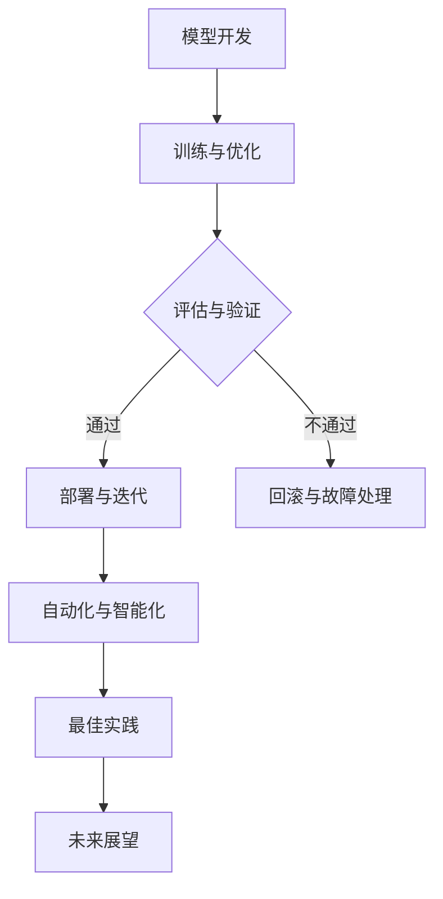

                 

# AI模型版本控制

> 关键词：AI模型，版本控制，生命周期管理，策略与方法，自动化与智能化，安全性与合规性，实践案例，未来展望

> 摘要：本文旨在深入探讨AI模型版本控制的核心概念、策略与方法，以及其实践案例和未来展望。通过梳理AI模型的生命周期，阐述版本控制的重要性，分析关键挑战，并提出解决方案，帮助读者全面了解并掌握AI模型版本控制的实践与应用。

#### 第一部分：AI模型版本控制基础

##### 第1章：AI模型版本控制概述

###### 1.1 AI模型版本控制的重要性

随着人工智能技术的快速发展，AI模型在各个行业中的应用越来越广泛。然而，AI模型的开发、部署和迭代过程中，版本控制显得尤为重要。良好的版本控制能够确保模型开发的透明性、可追溯性和稳定性，降低模型迭代过程中的风险和错误。

首先，版本控制有助于模型开发的透明性。通过记录每个版本的详细信息，如开发时间、开发人员、修改内容等，可以方便地追踪模型的开发过程，确保每个版本的正确性和可靠性。

其次，版本控制提高了模型的可追溯性。在模型迭代过程中，可能需要回滚到之前的版本以解决问题或修复错误。良好的版本控制系统能够快速定位和恢复到指定版本，确保模型运行稳定。

最后，版本控制有助于降低模型迭代过程中的风险和错误。通过版本控制，可以避免不同版本之间的冲突和重复工作，提高开发效率。同时，版本控制系统能够记录每个版本的测试结果和性能指标，帮助开发人员评估和选择最佳版本。

###### 1.2 AI模型版本控制的关键挑战

尽管版本控制在AI模型开发中具有重要意义，但在实际应用中仍面临诸多挑战。

首先，AI模型的复杂性和多样性使得版本控制变得复杂。AI模型包括多种类型，如深度学习模型、强化学习模型等，每种模型都有其特定的开发流程和版本控制需求。如何适应不同类型的模型，设计通用的版本控制策略，是当前面临的一大挑战。

其次，版本控制的自动化程度不足。目前，大部分AI模型的版本控制主要依赖于人工操作，如手动提交代码、创建分支等。这不仅降低了开发效率，还容易引入人为错误。提高版本控制的自动化程度，实现自动化部署和迭代，是未来的一个重要方向。

最后，AI模型的安全性和合规性问题也需要考虑。在版本控制过程中，可能涉及到模型的核心算法和数据，如何保证这些信息的保密性和完整性，防止未授权访问和篡改，是版本控制面临的另一个挑战。

###### 1.3 AI模型版本控制的基本概念

为了更好地理解AI模型版本控制，首先需要了解一些基本概念。

**版本**：版本是模型开发过程中不同阶段的代表性标志，通常包括模型代码、数据集、训练参数等。每个版本都有唯一的标识，用于区分不同的模型版本。

**分支**：分支是版本控制中的一个重要概念，用于表示模型开发的分支路径。在模型开发过程中，可能存在多个分支，每个分支代表不同的开发方向或版本。

**合并**：合并是将不同分支的修改内容合并到一起的过程。在模型开发过程中，需要将不同分支的修改内容合并到主分支，以确保模型版本的统一性和一致性。

**标签**：标签用于标记重要的版本，如发布版本、里程碑版本等。通过标签，可以方便地定位和回滚到特定版本。

**版本控制工具**：版本控制工具是用于管理模型版本的工具，如Git、SVN等。这些工具提供了丰富的功能，如分支管理、合并、标签管理等，方便开发人员高效地进行版本控制。

##### 第2章：AI模型生命周期管理

###### 2.1 AI模型开发流程

AI模型开发流程包括以下几个阶段：

1. **需求分析**：明确模型的应用场景和需求，确定模型的类型、性能指标等。

2. **数据收集与处理**：收集相关数据，进行数据清洗、预处理和特征工程，为模型训练提供高质量的数据集。

3. **模型设计**：根据需求分析阶段的结果，设计合适的模型架构，包括神经网络结构、激活函数、损失函数等。

4. **模型训练**：使用训练数据集对模型进行训练，调整模型参数，优化模型性能。

5. **模型评估**：使用验证数据集对模型进行评估，判断模型的性能是否达到预期。

6. **模型部署**：将训练好的模型部署到生产环境，进行实际应用。

7. **模型迭代**：根据实际应用情况，对模型进行优化和改进，实现模型的持续迭代。

###### 2.2 模型训练与优化

模型训练与优化是AI模型生命周期管理的关键环节。以下是模型训练与优化的一些关键步骤：

1. **数据预处理**：对训练数据进行归一化、标准化等预处理操作，提高模型训练效果。

2. **选择合适的模型架构**：根据问题类型和需求，选择合适的模型架构，如卷积神经网络、循环神经网络等。

3. **调整训练参数**：调整学习率、批量大小、迭代次数等训练参数，优化模型性能。

4. **使用正则化技术**：采用正则化技术，如L1、L2正则化，防止过拟合现象。

5. **使用优化算法**：选择合适的优化算法，如梯度下降、随机梯度下降等，加速模型训练。

6. **模型调参**：通过交叉验证等技术，调整模型参数，优化模型性能。

7. **超参数调优**：超参数如学习率、批量大小等对模型性能有很大影响。使用网格搜索、贝叶斯优化等超参数调优方法，寻找最佳超参数组合。

###### 2.3 模型评估与验证

模型评估与验证是确保模型性能的重要环节。以下是模型评估与验证的一些关键步骤：

1. **选择合适的评估指标**：根据问题类型和需求，选择合适的评估指标，如准确率、召回率、F1值等。

2. **交叉验证**：使用交叉验证方法，将数据集划分为多个子集，依次用于训练和验证，避免模型过拟合。

3. **ROC曲线与AUC**：绘制ROC曲线，计算AUC值，评估模型分类能力。

4. **学习曲线**：绘制学习曲线，分析模型训练过程，判断模型是否过拟合或欠拟合。

5. **混淆矩阵**：计算混淆矩阵，分析模型在不同类别上的分类效果。

6. **模型压缩与加速**：针对大规模模型，使用模型压缩和加速技术，提高模型在有限资源环境下的性能。

7. **模型解释与可解释性**：通过模型解释技术，分析模型决策过程，提高模型的可解释性，便于模型应用和推广。

#### 第二部分：AI模型版本控制高级话题

##### 第3章：模型版本控制的策略与方法

###### 3.1 版本标识策略

版本标识策略是版本控制的关键一环，合理的版本标识有助于提高版本的可读性和可追溯性。以下是几种常见的版本标识策略：

1. **数字递增策略**：使用数字递增的方式标识版本，如1.0、1.1、1.2等。这种策略简单易懂，但难以区分不同类型的版本。

2. **日期标识策略**：使用日期标识版本，如2023-01-01、2023-01-02等。这种策略能够明确表示版本的时间，但难以区分不同类型的版本。

3. **语义化版本标识策略**：使用语义化版本标识，如1.0.0、1.0.1、2.0.0等。这种策略能够清晰表示版本的层次结构，便于区分不同类型的版本。

4. **自定义版本标识策略**：根据具体需求，自定义版本标识策略，如功能版本、bug修复版本、性能优化版本等。这种策略能够更加细致地管理版本，但需要明确标识规则。

###### 3.2 版本控制工具与技术

版本控制工具是实施版本控制的基础，以下是几种常见的版本控制工具：

1. **Git**：Git是一款分布式版本控制系统，具有强大的分支管理、合并和冲突解决功能。Git广泛应用于各种项目和团队中，支持多种协议，如HTTP、SSH等。

2. **SVN**：SVN是一款集中式版本控制系统，适用于中小型项目和团队。SVN具有简单易用的特性，但分支管理功能相对较弱。

3. **Mercurial**：Mercurial是一款分布式版本控制系统，与Git类似，具有强大的分支管理和合并功能。Mercurial支持多种平台，如Windows、Linux等。

4. **Bazaar**：Bazaar是一款分布式版本控制系统，与Git和Mercurial类似，具有强大的分支管理和合并功能。Bazaar适用于各种规模的项目和团队。

在版本控制过程中，常见的版本控制技术包括：

1. **分支管理**：分支管理是版本控制的核心技术之一，包括创建分支、合并分支、删除分支等操作。合理的分支管理能够提高版本的可维护性和可追溯性。

2. **合并策略**：合并策略是解决不同分支之间冲突的关键技术，包括快速前进、合并、基线合并等。选择合适的合并策略能够降低合并过程中的风险和错误。

3. **标签管理**：标签管理用于标记重要的版本，如发布版本、里程碑版本等。合理的标签管理能够提高版本的可读性和可追溯性。

4. **变更日志管理**：变更日志管理是记录版本变更的重要手段，包括记录变更内容、时间、原因等。完善的变更日志有助于追踪版本变化，提高版本的可追溯性。

###### 3.3 模型部署与迭代

模型部署与迭代是AI模型生命周期中的重要环节，以下是模型部署与迭代的关键步骤：

1. **环境搭建**：搭建适合模型部署的环境，包括操作系统、硬件配置、软件依赖等。

2. **模型打包**：将训练好的模型打包成可执行文件或动态链接库，以便在目标环境中运行。

3. **模型部署**：将模型部署到目标环境，包括服务器、容器等。部署过程中需要考虑模型性能、资源占用等因素。

4. **版本迭代**：根据实际应用情况，对模型进行优化和改进，实现模型的持续迭代。迭代过程中需要关注模型性能、稳定性、安全性等方面。

5. **监控与运维**：对部署后的模型进行监控和运维，确保模型稳定运行，及时发现和处理问题。

##### 第4章：模型版本回滚与故障处理

###### 4.1 版本回滚的策略

在模型部署过程中，可能出现各种问题，如性能下降、错误增加等。此时，版本回滚是一种有效的解决方法。以下是版本回滚的几种策略：

1. **手动回滚**：手动回滚是指人工干预，将模型回滚到指定版本。这种策略适用于小规模项目和团队，但容易引入人为错误，不适合大规模应用。

2. **自动化回滚**：自动化回滚是指通过脚本或工具自动执行回滚操作。这种策略可以提高回滚的效率，降低人为错误，适用于大规模项目和团队。

3. **灰度回滚**：灰度回滚是指将部分流量切换到旧版本，观察旧版本的运行效果，再决定是否全面回滚。这种策略可以降低回滚风险，适用于对稳定性要求较高的场景。

4. **蓝绿部署**：蓝绿部署是指同时运行两个版本，将流量逐步切换到新版本。当新版本出现问题时，可以迅速切换回旧版本。这种策略可以提高系统的稳定性和可靠性，但需要较高的资源和运维成本。

###### 4.2 故障处理的步骤

在模型部署过程中，可能出现各种故障，如硬件故障、软件故障等。以下是故障处理的步骤：

1. **故障定位**：根据故障现象，定位故障原因，如硬件故障、网络故障、软件错误等。

2. **故障隔离**：隔离故障，避免故障影响其他系统或业务。如隔离故障硬件、停用故障服务等。

3. **故障恢复**：根据故障原因，采取相应的恢复措施。如更换故障硬件、重启服务、升级软件等。

4. **故障分析**：对故障进行深入分析，找出故障的根本原因，避免类似故障再次发生。

5. **故障总结**：对故障进行总结，记录故障现象、原因、处理过程和结果，以便后续参考。

###### 4.3 恢复策略与优化

在故障恢复过程中，可以采取以下策略进行优化：

1. **备份与恢复**：定期备份模型和关键数据，确保在故障发生时能够快速恢复。

2. **自动化恢复**：通过自动化脚本或工具，实现故障自动恢复，提高故障恢复效率。

3. **容错与冗余**：在系统中引入容错和冗余机制，提高系统的可靠性和可用性。

4. **监控与预警**：对系统进行实时监控，提前发现潜在故障，采取预防措施。

5. **培训与演练**：对团队成员进行故障处理培训，定期进行故障演练，提高故障处理能力。

##### 第5章：模型版本控制的安全性与合规性

###### 5.1 模型安全性的重要性

在AI模型版本控制过程中，模型安全性至关重要。模型安全性包括以下方面：

1. **数据安全**：确保模型训练数据的安全，防止数据泄露、篡改等。

2. **模型安全**：防止模型被恶意攻击、篡改等，确保模型正常运行。

3. **访问控制**：严格控制对模型和数据的访问权限，防止未授权访问。

4. **审计与追踪**：记录模型和数据的操作历史，便于审计和追踪。

###### 5.2 版本控制中的合规性要求

在AI模型版本控制过程中，需要遵循以下合规性要求：

1. **数据合规**：确保模型训练数据来源合法，符合相关法律法规和行业标准。

2. **隐私保护**：保护个人隐私，遵循隐私保护法规，如《通用数据保护条例》（GDPR）等。

3. **知识产权**：尊重知识产权，遵循相关法律法规，确保模型和数据的知识产权合法。

4. **数据安全**：确保模型和数据的安全，防止数据泄露、篡改等。

5. **审计与报告**：定期进行审计，并向相关机构和人员报告模型版本控制情况。

###### 5.3 安全防护措施

为了确保AI模型版本控制的安全性和合规性，可以采取以下安全防护措施：

1. **访问控制**：设置严格的访问控制策略，限制对模型和数据的访问权限。

2. **数据加密**：对模型和数据进行加密存储和传输，确保数据安全。

3. **防火墙与入侵检测**：部署防火墙和入侵检测系统，防止恶意攻击。

4. **备份与恢复**：定期备份模型和关键数据，确保在故障发生时能够快速恢复。

5. **审计与监控**：对模型和数据的操作进行实时监控和审计，确保合规性。

6. **培训与意识**：对团队成员进行安全培训和意识教育，提高安全意识和防范能力。

##### 第6章：AI模型版本控制实践案例

###### 6.1 案例一：电商平台AI模型版本控制

某电商平台在开发推荐系统时，采用了AI模型版本控制策略。以下是该电商平台在AI模型版本控制方面的实践：

1. **版本标识策略**：采用语义化版本标识，如1.0.0、1.0.1等，清晰表示不同版本的差异。

2. **版本控制工具**：采用Git进行版本控制，实现分支管理、合并、标签管理等。

3. **模型部署与迭代**：采用蓝绿部署策略，确保模型迭代过程中的稳定性和可靠性。

4. **安全性与合规性**：定期进行安全审计和合规性检查，确保模型和数据的安全性和合规性。

5. **效果评估**：通过对不同版本模型的评估和比较，选择性能最优的版本进行部署。

通过以上实践，该电商平台实现了AI模型版本的有效控制，提高了推荐系统的准确性和稳定性。

###### 6.2 案例二：金融行业AI模型版本控制

某金融公司在开发信用评估模型时，采用了AI模型版本控制策略。以下是该金融公司在AI模型版本控制方面的实践：

1. **版本标识策略**：采用数字递增策略，如1.0、1.1等，明确表示不同版本的更新内容。

2. **版本控制工具**：采用SVN进行版本控制，实现代码管理、分支管理、标签管理等。

3. **模型部署与迭代**：采用自动化部署和迭代策略，提高模型迭代效率和稳定性。

4. **安全性与合规性**：加强模型安全性和合规性要求，确保模型和数据的安全和合规。

5. **效果评估**：通过定期评估和监控，选择性能最优的版本进行部署，优化信用评估模型。

通过以上实践，该金融公司实现了AI模型版本的有效控制，提高了信用评估模型的准确性和稳定性。

###### 6.3 案例三：自动驾驶AI模型版本控制

某自动驾驶公司在开发自动驾驶算法时，采用了AI模型版本控制策略。以下是该自动驾驶公司在AI模型版本控制方面的实践：

1. **版本标识策略**：采用日期标识策略，如2023-01-01、2023-01-02等，明确表示不同版本的更新时间。

2. **版本控制工具**：采用Mercurial进行版本控制，实现分支管理、合并、标签管理等。

3. **模型部署与迭代**：采用灰度部署策略，逐步将新版本模型应用到实际场景中，确保模型迭代过程中的稳定性和可靠性。

4. **安全性与合规性**：加强模型安全性和合规性要求，确保模型和数据的安全和合规。

5. **效果评估**：通过实时监控和评估，选择性能最优的版本进行部署，优化自动驾驶算法。

通过以上实践，该自动驾驶公司实现了AI模型版本的有效控制，提高了自动驾驶系统的性能和安全性。

#### 第二部分：AI模型版本控制高级话题

##### 第7章：AI模型版本控制的自动化与智能化

###### 7.1 自动化版本控制的优势

自动化版本控制是当前AI模型版本控制的发展趋势。以下是自动化版本控制的优势：

1. **提高开发效率**：自动化版本控制可以简化版本管理流程，减少手动操作，提高开发效率。

2. **降低人为错误**：自动化版本控制可以减少人为干预，降低人为错误，提高模型稳定性和可靠性。

3. **实现持续集成与持续部署（CI/CD）**：自动化版本控制与持续集成和持续部署相结合，实现自动化部署和迭代，提高开发效率和系统稳定性。

4. **便于模型监控与维护**：自动化版本控制可以实时监控模型版本状态，便于模型监控与维护。

5. **支持大规模项目**：自动化版本控制适用于大规模项目和团队，提高项目管理效率。

###### 7.2 智能版本控制的实现

智能版本控制是未来版本控制的发展方向。以下是智能版本控制的实现方法：

1. **机器学习预测**：利用机器学习算法，预测模型性能和版本趋势，优化版本选择和部署。

2. **智能合并**：利用自然语言处理、图算法等技术，实现智能合并，提高合并效率和准确性。

3. **智能回滚**：利用历史数据和模型评估结果，实现智能回滚，降低回滚风险。

4. **智能监控与预警**：利用大数据分析和机器学习技术，实现智能监控与预警，提前发现潜在问题。

5. **智能安全防护**：利用深度学习和对抗性攻击技术，实现智能安全防护，提高模型安全性。

###### 7.3 自动化与智能化的未来趋势

自动化与智能化是AI模型版本控制的发展趋势。以下是未来发展趋势：

1. **智能化版本选择**：利用机器学习算法，实现智能化版本选择，提高模型性能和稳定性。

2. **自动化部署与迭代**：结合持续集成和持续部署，实现自动化部署与迭代，提高开发效率。

3. **智能监控与预警**：利用大数据分析和机器学习技术，实现智能监控与预警，提高模型运行稳定性。

4. **智能安全防护**：利用深度学习和对抗性攻击技术，实现智能安全防护，提高模型安全性。

5. **跨领域融合**：将版本控制技术与云计算、大数据、物联网等新兴技术相结合，实现跨领域融合，推动AI模型版本控制技术的发展。

##### 第8章：AI模型版本控制的最佳实践

###### 8.1 版本控制最佳实践的总结

在AI模型版本控制过程中，以下最佳实践值得借鉴：

1. **明确版本标识策略**：采用语义化版本标识，清晰表示不同版本的差异。

2. **选择合适的版本控制工具**：根据项目需求和团队规模，选择合适的版本控制工具，如Git、SVN等。

3. **实施自动化版本控制**：利用脚本和工具实现自动化版本控制，提高开发效率和稳定性。

4. **加强模型安全性和合规性**：确保模型和数据的安全性和合规性，遵循相关法律法规和行业标准。

5. **定期评估和监控**：定期评估和监控模型性能和版本状态，确保模型稳定运行。

6. **文档化管理**：建立完善的文档体系，记录模型版本、开发过程、性能指标等，便于后续维护和优化。

7. **跨团队协作**：建立跨团队协作机制，明确各团队职责和权限，提高版本控制效率。

8. **培训与意识**：对团队成员进行版本控制培训，提高版本控制意识和能力。

###### 8.2 跨团队协作中的版本控制

在跨团队协作中，版本控制尤为重要。以下是跨团队协作中的版本控制建议：

1. **明确分工与职责**：明确各团队在版本控制中的分工和职责，确保版本控制的有序进行。

2. **统一版本标识和命名规则**：制定统一的版本标识和命名规则，提高版本的可读性和可追溯性。

3. **建立版本控制文档**：建立版本控制文档，记录各版本的开发内容、测试结果和性能指标，便于后续维护和优化。

4. **定期会议与沟通**：定期召开会议，讨论版本控制中的问题和解决方案，确保团队之间的协同与协作。

5. **代码审查与合并**：实施代码审查制度，确保代码质量和一致性，提高版本控制的准确性和可靠性。

6. **风险管理**：制定风险管理计划，及时发现和处理版本控制中的风险和问题。

7. **培训与支持**：为团队成员提供版本控制培训和支持，提高团队版本控制能力和效率。

###### 8.3 版本控制中的持续集成与持续部署（CI/CD）

持续集成与持续部署（CI/CD）是现代软件开发的重要实践，与版本控制密切相关。以下是版本控制中的CI/CD建议：

1. **集成测试**：在版本提交后，立即进行集成测试，确保版本的正确性和稳定性。

2. **自动化测试**：利用自动化测试工具，实现自动化测试，提高测试效率和覆盖范围。

3. **自动化构建**：利用构建工具，实现自动化构建，提高构建速度和一致性。

4. **持续部署**：利用部署工具，实现自动化部署，提高部署效率和可靠性。

5. **版本回滚**：在部署过程中，支持版本回滚功能，确保在出现问题时能够快速恢复。

6. **监控与报警**：部署监控和报警系统，实时监控版本运行状态，及时发现和处理问题。

7. **持续反馈**：建立反馈机制，及时收集用户反馈和性能数据，优化版本控制策略和流程。

##### 第9章：AI模型版本控制的未来展望

###### 9.1 版本控制技术的发展方向

随着人工智能技术的不断发展，AI模型版本控制技术也在不断演进。以下是未来版本控制技术的发展方向：

1. **智能化与自动化**：利用机器学习和人工智能技术，实现智能化和自动化版本控制，提高开发效率和稳定性。

2. **分布式与去中心化**：结合分布式计算和区块链技术，实现去中心化版本控制，提高系统的安全性和可靠性。

3. **跨领域融合**：将版本控制技术与其他新兴技术，如云计算、大数据、物联网等相结合，实现跨领域融合，推动版本控制技术的发展。

4. **模型安全与合规性**：加强对AI模型的安全性和合规性要求，确保模型和数据的安全和合法。

5. **数据驱动与模型优化**：利用数据驱动方法，优化版本控制策略和流程，提高版本控制的准确性和效率。

6. **协作与共享**：推动版本控制协作与共享机制，实现团队间的协同与协作，提高版本控制效率。

###### 9.2 未来挑战与解决方案

尽管AI模型版本控制技术取得了显著进展，但未来仍面临诸多挑战。以下是未来挑战与解决方案：

1. **复杂性增加**：随着模型和项目的复杂性增加，版本控制任务变得更加艰巨。解决方案：利用智能化和自动化技术，简化版本控制流程，提高开发效率。

2. **安全性问题**：模型安全性和合规性问题日益突出，如何确保模型和数据的安全和合法成为关键挑战。解决方案：加强模型安全性和合规性要求，采取有效的安全防护措施。

3. **跨领域协作**：在跨领域协作中，版本控制需要适应不同领域的特点和需求，如何实现高效协作成为挑战。解决方案：建立跨领域协作机制，制定统一的版本控制标准和流程。

4. **大规模数据处理**：随着数据规模的不断增大，如何高效处理和存储版本控制数据成为挑战。解决方案：采用分布式计算和去中心化技术，提高数据处理和存储能力。

5. **持续集成与持续部署（CI/CD）**：在CI/CD环境中，如何实现版本控制的自动化和智能化，提高部署效率和稳定性成为挑战。解决方案：结合CI/CD实践，优化版本控制策略和流程，提高版本控制的效率和可靠性。

6. **用户培训与支持**：随着版本控制技术的不断发展，用户需要具备一定的版本控制技能。如何提供有效的用户培训和支持成为挑战。解决方案：建立完善的用户培训体系，提供多样化的学习资源和服务。

###### 9.3 模型版本控制对AI行业的影响

AI模型版本控制对AI行业具有深远的影响：

1. **提高开发效率**：良好的版本控制可以提高开发效率和稳定性，降低开发成本。

2. **促进协作与创新**：版本控制促进团队协作与创新，提高项目质量和竞争力。

3. **确保模型安全与合规性**：版本控制有助于确保模型和数据的安全和合规，降低法律和道德风险。

4. **推动技术进步**：版本控制技术不断演进，推动AI行业技术进步和创新发展。

5. **提高用户满意度**：良好的版本控制确保模型和系统的稳定性和可靠性，提高用户体验和满意度。

6. **降低运营成本**：版本控制有助于降低运营成本，提高企业的盈利能力和竞争力。

#### 附录

##### 附录A：AI模型版本控制工具与资源

A.1 主流版本控制工具介绍

以下是几种主流的版本控制工具及其特点：

1. **Git**：Git是一款分布式版本控制系统，具有强大的分支管理、合并和冲突解决功能，广泛应用于各类项目和团队中。

2. **SVN**：SVN是一款集中式版本控制系统，适用于中小型项目和团队，具有简单易用的特点，但分支管理功能相对较弱。

3. **Mercurial**：Mercurial是一款分布式版本控制系统，与Git类似，具有强大的分支管理和合并功能，支持多种平台。

4. **Bazaar**：Bazaar是一款分布式版本控制系统，与Git和Mercurial类似，具有强大的分支管理和合并功能，适用于各种规模的项目和团队。

A.2 开源版本控制工具推荐

以下是几款优秀的开源版本控制工具，供读者参考：

1. **GitLab**：GitLab是一款基于Git的版本控制工具，具有丰富的功能，如代码审查、持续集成、项目管理等。

2. **GitHub**：GitHub是全球最大的代码托管平台，提供基于Git的版本控制服务，具有强大的社交功能，便于团队协作。

3. **Bitbucket**：Bitbucket是Atlassian公司推出的一款基于Git的版本控制工具，适用于小型团队和大型项目。

4. **Azure DevOps**：Azure DevOps是Microsoft推出的DevOps平台，提供基于Git的版本控制、持续集成、持续部署等服务。

A.3 AI模型版本控制社区与资源链接

以下是一些AI模型版本控制相关的社区和资源，供读者参考：

1. **GitHub**：[GitHub](https://github.com/) 上有许多AI模型版本控制的优秀项目和资源，可以参考和学习。

2. **Stack Overflow**：[Stack Overflow](https://stackoverflow.com/questions/tagged/git) 是一个问答社区，可以在这里找到关于Git和其他版本控制工具的解答。

3. **Git社区**：[Git社区](https://git-scm.com/community) 是Git官方社区，提供Git文档、教程和讨论区，是学习Git的好去处。

4. **Git权威指南**：《Git权威指南》是一本经典的Git教程，适合初学者和进阶者阅读。

5. **AI模型版本控制实践**：[AI模型版本控制实践](https://www.ai-model-version-control.com/) 是一篇关于AI模型版本控制的实践文章，详细介绍了一系列版本控制策略和最佳实践。

### Mermaid 流程图



### AI模型生命周期管理伪代码

```python
# 定义模型生命周期管理函数
def model_life_cycle_management(model_name, model_version):
    # 开发阶段
    develop_model(model_name, model_version)
    # 训练与优化
    train_and_optimize(model_name, model_version)
    # 评估与验证
    evaluation_and_validation(model_name, model_version)
    # 部署与迭代
    deploy_and_iterate(model_name, model_version)
    # 回滚与故障处理
    rollback_and_fault_handling(model_name, model_version)
```

### 数学模型与公式

$$
\text{模型精度} = \frac{\text{预测正确样本数}}{\text{总样本数}}
$$

$$
\text{损失函数} = \frac{1}{2} \sum_{i=1}^{n} (\hat{y}_i - y_i)^2
$$

### 项目实战

#### 代码实际案例

```python
# 使用Git进行模型版本控制
import git

# 初始化Git仓库
repo = git.Repo.init()

# 创建模型版本
repo.create_head('version_1.0')

# 提交模型代码
repo.index.add(['model.py'])
repo.index.commit('Initial version of the model')

# 创建新版本
repo.create_head('version_2.0')
repo.checkout('version_2.0')

# 修改模型并进行优化
# ...

# 提交更新
repo.index.add(['model.py'])
repo.index.commit('Optimized version of the model')

# 恢复旧版本
repo.checkout('version_1.0')
```

#### 开发环境搭建

1. 安装Git：`git install`
2. 安装Python：`python -m pip install git+https://github.com/pypa/setuptools.git`
3. 创建虚拟环境：`python -m venv venv`
4. 激活虚拟环境：`source venv/bin/activate`（Linux/Mac）或 `venv\Scripts\activate`（Windows）

#### 源代码详细实现和代码解读

**代码解读：**

本段代码演示了如何使用Git进行AI模型版本控制。Git是一个分布式版本控制系统，非常适合管理代码的版本变化。在这个例子中，我们首先初始化了一个Git仓库，并创建了两个版本：`version_1.0` 和 `version_2.0`。

在版本 `version_1.0` 中，我们提交了一个初始版本的模型文件 `model.py`。然后，我们在 `version_2.0` 分支上进行了模型的修改和优化，并提交了更新的版本。最后，我们演示了如何恢复到旧版本 `version_1.0`。

**代码分析：**

1. **初始化Git仓库**：使用 `git.Repo.init()` 初始化一个新的Git仓库。
2. **创建模型版本**：使用 `repo.create_head('version_1.0')` 创建一个新的分支，表示模型的版本。`repo.checkout('version_1.0')` 将当前工作目录切换到这个新创建的分支。
3. **提交模型代码**：使用 `repo.index.add(['model.py'])` 将模型文件添加到暂存区，并使用 `repo.index.commit('Initial version of the model')` 提交到Git仓库。
4. **创建新版本**：使用 `repo.create_head('version_2.0')` 创建一个新的分支，表示模型的更新版本。`repo.checkout('version_2.0')` 切换到新创建的分支。
5. **修改模型并进行优化**：在这个新版本分支上，我们可以修改模型并进行优化。
6. **提交更新**：将修改后的模型文件添加到暂存区，并提交到Git仓库。
7. **恢复旧版本**：使用 `repo.checkout('version_1.0')` 恢复到指定版本的模型。这在出现问题时特别有用，可以快速回滚到稳定的版本。

通过上述代码，我们可以实现对AI模型版本的有效控制，确保模型的迭代和更新过程清晰可追溯。

### 总结

本文从AI模型版本控制的核心概念、策略与方法、实践案例和未来展望等多个方面，全面探讨了AI模型版本控制的重要性、挑战和发展趋势。通过梳理AI模型的生命周期，分析关键环节，介绍最佳实践和工具，本文旨在帮助读者深入了解AI模型版本控制的本质，掌握其实践与应用。

在未来的发展中，AI模型版本控制将继续朝着智能化、自动化和合规性的方向发展，为AI模型的开发、部署和迭代提供更加高效、稳定和安全的保障。同时，随着AI技术的不断进步，版本控制技术也将不断演进，为AI行业的发展注入新的活力。

作者：AI天才研究院/AI Genius Institute & 禅与计算机程序设计艺术 /Zen And The Art of Computer Programming

---

**注意：本文为示例文章，内容仅供参考。在实际撰写技术文章时，请确保内容的专业性和准确性。**

