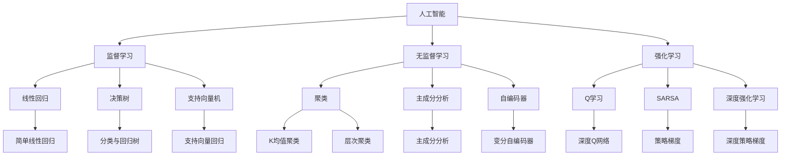

                 

### 文章标题

# AI算法的进步与未来

人工智能（AI）作为当今科技领域的明星，其核心驱动力正是算法的不断进步。本文将深入探讨AI算法的历史与演进、深度学习的崛起以及新兴AI算法的研究方向，结合具体的数学模型、算法原理和实际案例，揭示AI算法的进步历程与未来趋势。

关键词：人工智能、算法、深度学习、强化学习、生成对抗网络、图神经网络、伦理与未来

摘要：本文首先回顾了AI算法的发展历程，从传统算法到深度学习的崛起，再到当前新兴算法的研究方向，逐步剖析了各个阶段的核心算法和技术。接着，本文详细介绍了神经网络基础、图像处理、自然语言处理等领域的深度学习应用，并结合实际案例讲解了强化学习、生成对抗网络和图神经网络等前沿算法。最后，本文探讨了AI算法的伦理问题及其未来发展，为读者提供了全面而深入的AI算法知识。

### 第一部分：AI算法的历史与演进

#### 第1章：人工智能与算法概述

##### 1.1 人工智能的起源与发展

人工智能（AI）的概念最早由计算机科学家约翰·麦卡锡（John McCarthy）在1956年提出。自此，人工智能开始从理论研究走向实际应用。初期的人工智能主要集中在逻辑推理、知识表示和搜索算法等方面。1970年代，专家系统成为AI研究的焦点，通过模拟专家的决策过程来解决复杂问题。然而，受限于硬件计算能力和算法复杂性，早期的AI系统在实际应用中效果有限。

进入1980年代，随着计算机技术的快速发展，人工智能研究开始聚焦于机器学习。机器学习通过算法让计算机从数据中学习规律，从而进行预测和决策。监督学习、无监督学习和强化学习等不同类型的机器学习算法相继出现，为人工智能的发展奠定了基础。

##### 1.2 人工智能的关键算法

人工智能的实现依赖于多种算法，其中一些关键算法如下：

- **监督学习算法**：通过已有的标记数据训练模型，然后使用模型进行预测。常见的监督学习算法包括线性回归、决策树、支持向量机（SVM）等。

- **无监督学习算法**：不依赖标记数据，通过模型自动发现数据中的结构和规律。常见的无监督学习算法包括聚类、主成分分析（PCA）和自编码器等。

- **强化学习算法**：通过试错的方式，让模型在与环境的互动中不断学习，最终达到最佳策略。常见的强化学习算法包括Q学习、SARSA和深度强化学习等。

- **神经网络**：模仿人脑神经元连接结构，通过层层传递信息，实现对复杂数据的处理和预测。神经网络包括前馈神经网络、卷积神经网络（CNN）和循环神经网络（RNN）等。

##### 1.3 算法在人工智能中的地位

算法是人工智能的核心，是驱动人工智能技术不断进步的关键因素。不同类型的算法针对不同的问题和应用场景，它们共同构成了人工智能的技术基础。算法的进步不仅提高了AI系统的性能和效率，还推动了新应用和新领域的出现。例如，深度学习算法的崛起，使得图像识别、自然语言处理等领域的应用取得了显著突破。

#### 第2章：传统AI算法的进步

在人工智能的发展历程中，传统AI算法经历了不断的进步和改进。这些算法不仅在理论研究中具有重要意义，而且在实际应用中发挥着关键作用。

##### 2.1 监督学习算法

监督学习算法是人工智能中最常用的一类算法，通过已有的标记数据训练模型，然后使用模型进行预测。监督学习算法可以分为以下几类：

- **线性回归**：通过找到最佳拟合直线来预测目标变量。线性回归算法简单、易于实现，但在处理非线性数据时效果有限。

- **决策树**：通过一系列规则来分类或回归数据。决策树算法能够直观地表示数据的关系，但在处理大规模数据时性能较差。

- **支持向量机（SVM）**：通过找到最佳超平面来分类数据。SVM算法在处理高维数据时表现出色，但在面对复杂问题时可能无法找到最优解。

- **神经网络**：通过多层神经网络来模拟人脑神经元的工作方式。神经网络在处理复杂非线性问题时具有强大的能力，但其训练过程相对复杂。

##### 2.2 无监督学习算法

无监督学习算法不依赖标记数据，通过模型自动发现数据中的结构和规律。无监督学习算法可以分为以下几类：

- **聚类算法**：将数据分为多个簇，使同一簇内的数据相似度较高。常见的聚类算法包括K均值聚类、层次聚类和DBSCAN等。

- **主成分分析（PCA）**：通过降维技术将高维数据转换为低维数据，保留数据的主要信息。PCA算法在处理复杂数据时具有较好的效果，但其对噪声敏感。

- **自编码器**：通过编码和解码过程来学习数据的特征表示。自编码器算法在特征提取和降噪方面表现出色，但其训练过程相对复杂。

##### 2.3 半监督学习算法

半监督学习算法结合了监督学习和无监督学习的优势，通过利用部分标记数据和大量未标记数据来训练模型。半监督学习算法可以分为以下几类：

- **标签传播**：通过未标记数据中已知的标签关系来推断未标记数据的标签。标签传播算法简单且效果较好，但在面对大规模数据时可能存在收敛问题。

- **期望最大化（EM）算法**：通过迭代估计未标记数据的标签和模型参数，逐步提高模型性能。EM算法在处理复杂数据时具有较好的效果，但其收敛速度较慢。

##### 2.4 强化学习算法

强化学习算法通过试错的方式，让模型在与环境的互动中不断学习，最终达到最佳策略。强化学习算法可以分为以下几类：

- **Q学习**：通过学习状态-动作值函数来选择最佳动作。Q学习算法在处理离散动作问题时具有较好的效果，但在处理连续动作问题时可能存在收敛问题。

- **SARSA**：通过同时学习状态-动作值函数和状态-动作概率分布来选择最佳动作。SARSA算法在处理连续动作问题时表现出色，但其训练过程相对复杂。

- **深度强化学习**：通过结合深度学习和强化学习的方法，实现对复杂环境的建模和决策。深度强化学习算法在处理高维数据时具有强大的能力，但其训练过程相对复杂。

总的来说，传统AI算法在理论研究和实际应用中取得了显著进展。随着硬件计算能力和算法复杂度的提升，传统AI算法将继续优化和改进，为人工智能的发展提供更强动力。

#### 第3章：深度学习的崛起

深度学习作为人工智能领域的重要突破，其核心思想是通过模拟人脑神经网络结构，实现对复杂数据的自动特征学习和模式识别。深度学习自2006年提出以来，经历了快速发展和广泛应用，为人工智能领域带来了前所未有的变革。

##### 3.1 神经网络基础

神经网络（Neural Networks）是深度学习的基础，其结构模拟了人脑神经元之间的连接方式。神经网络由多个层次组成，包括输入层、隐藏层和输出层。每个层次由多个神经元组成，神经元之间通过权重连接，并通过激活函数产生输出。

- **神经元工作原理**：每个神经元接收多个输入信号，通过加权求和后应用激活函数产生输出。激活函数常用的有Sigmoid、ReLU和Tanh等。

- **网络结构**：深度神经网络通常包含多个隐藏层，隐藏层之间的连接方式可以是全连接或卷积连接。深度神经网络通过多层次的非线性变换，能够捕捉到复杂数据中的深层特征。

##### 3.2 卷积神经网络

卷积神经网络（Convolutional Neural Networks，CNN）是深度学习在图像处理领域的重要应用。CNN通过卷积操作和池化操作，能够自动提取图像中的局部特征和全局特征。

- **卷积操作**：卷积操作通过滑动窗口（如3x3或5x5的卷积核）在输入图像上滑动，计算窗口内像素的加权和。卷积操作可以提取图像的边缘、纹理等局部特征。

- **池化操作**：池化操作通过在局部区域选择最大值或平均值，减小图像的尺寸，减少参数数量。池化操作可以减少过拟合现象，提高模型的泛化能力。

- **网络结构**：CNN通常包含多个卷积层和池化层，卷积层用于提取特征，池化层用于减小特征图的大小。通过堆叠多个卷积层和池化层，CNN能够逐步提取图像的深层特征，实现对复杂图像的识别。

##### 3.3 循环神经网络

循环神经网络（Recurrent Neural Networks，RNN）是深度学习在序列数据处理领域的重要应用。RNN通过在时间步之间保留状态信息，能够处理和记忆序列数据。

- **RNN结构**：RNN由一个循环单元组成，每个时间步的输入与当前状态和上一个时间步的输出相关联。RNN通过递归关系，能够处理任意长度的序列数据。

- **长短时记忆（LSTM）**：LSTM是RNN的一种改进，通过引入遗忘门、输入门和输出门，能够有效避免梯度消失和梯度爆炸问题，提高模型的长期记忆能力。

- **门控循环单元（GRU）**：GRU是LSTM的简化版，通过合并输入门和遗忘门，减少了参数数量，提高了计算效率。

##### 3.4 自注意力机制

自注意力机制（Self-Attention Mechanism）是深度学习在自然语言处理领域的重要创新。自注意力机制通过自适应地分配注意力权重，能够捕捉输入序列中的长距离依赖关系。

- **注意力机制**：注意力机制通过计算输入序列中每个元素的重要性权重，并将权重与输入序列进行加权求和，得到新的表示。注意力机制可以增强模型对重要信息的关注，提高模型的表示能力。

- **自注意力**：自注意力机制在自然语言处理中，通过将输入序列中的每个元素与所有其他元素进行比较，计算它们的相似度，并据此生成新的表示。自注意力机制能够捕捉到输入序列中的长距离依赖关系，提高了模型的建模能力。

总之，深度学习通过神经网络、卷积神经网络、循环神经网络和自注意力机制等创新，为图像处理、自然语言处理等领域带来了革命性的突破。随着深度学习技术的不断发展和优化，未来将有望在更多领域实现广泛应用。

#### 第4章：深度学习在图像处理中的应用

深度学习在图像处理领域取得了显著突破，主要应用于图像分类、目标检测、图像分割和图像生成等方面。以下将详细介绍这些应用及其关键技术。

##### 4.1 图像分类

图像分类是深度学习在图像处理中最基础的应用，通过将图像标签与对应的类别进行匹配，实现对图像内容的识别。常见的深度学习图像分类模型包括卷积神经网络（CNN）和迁移学习。

- **CNN模型**：CNN通过卷积层、池化层和全连接层等结构，逐步提取图像的局部特征和全局特征。在图像分类任务中，CNN通常使用预训练模型（如VGG、ResNet等）作为基础模型，通过微调训练参数来适应特定任务。

- **迁移学习**：迁移学习通过利用预训练模型在特定任务上的知识，快速适应新任务。在图像分类任务中，迁移学习能够显著提高模型的分类性能，特别是在数据量有限的情况下。

##### 4.2 目标检测

目标检测是深度学习在计算机视觉领域的另一个重要应用，通过识别图像中的目标物体及其位置，实现对图像的语义理解。常见的深度学习目标检测模型包括R-CNN、Fast R-CNN、Faster R-CNN和YOLO等。

- **R-CNN模型**：R-CNN由区域提议生成、候选区域分类和区域回归三个部分组成。首先通过选择性搜索算法生成大量区域提议，然后对每个区域进行分类和回归，最终识别出图像中的目标物体。

- **Faster R-CNN模型**：Faster R-CNN在R-CNN的基础上，引入了区域建议网络（RPN），将区域提议和分类回归过程集成到一个网络中，显著提高了检测速度和性能。

- **YOLO模型**：YOLO（You Only Look Once）通过将图像分成网格单元，在每个网格单元上预测目标的类别和位置，实现了高效的实时目标检测。YOLO模型在速度和准确度上取得了很好的平衡，广泛应用于自动驾驶、安防监控等领域。

##### 4.3 图像分割

图像分割是深度学习在图像处理中的另一个重要应用，通过将图像划分为不同区域，实现对图像内容的精确理解。常见的深度学习图像分割模型包括全卷积神经网络（FCN）、U-Net和Mask R-CNN等。

- **FCN模型**：FCN通过将卷积层扩展为全连接层，将特征图直接映射为分割结果。FCN模型在图像分割任务中表现出良好的效果，但其对边界信息的处理能力有限。

- **U-Net模型**：U-Net是一种基于对称结构的设计，通过收缩路径和扩展路径的交替使用，实现了图像的精确分割。U-Net模型在医学图像分割等领域取得了显著突破。

- **Mask R-CNN模型**：Mask R-CNN在Faster R-CNN的基础上，增加了分割分支，能够同时进行目标检测和图像分割。Mask R-CNN通过将目标检测和分割任务结合，实现了高效的图像理解。

##### 4.4 图像生成

图像生成是深度学习在图像处理中的新兴应用，通过生成新的图像或改进现有图像的质量。常见的深度学习图像生成模型包括生成对抗网络（GAN）和变分自编码器（VAE）等。

- **GAN模型**：GAN由生成器和判别器两个部分组成，生成器尝试生成逼真的图像，判别器判断图像的真实性。通过不断迭代训练，GAN能够生成高质量、多样化的图像。GAN在图像修复、图像超分辨率和风格迁移等领域表现出色。

- **VAE模型**：VAE通过编码器和解码器两个部分，将输入图像映射到潜在空间，并从潜在空间中生成新的图像。VAE在图像生成任务中表现出良好的效果，特别是在图像去噪和图像生成多样性的方面。

总之，深度学习在图像处理中的应用广泛而深入，通过CNN、RNN、GAN等模型，实现了对图像分类、目标检测、图像分割和图像生成的自动化处理。随着深度学习技术的不断发展，未来将有望在更多图像处理任务中取得突破性进展。

#### 第5章：深度学习在自然语言处理中的应用

深度学习在自然语言处理（NLP）领域取得了显著突破，成为解决文本分类、命名实体识别、机器翻译和生成式对话系统等任务的重要工具。以下将详细介绍这些应用及其关键技术。

##### 5.1 文本分类

文本分类是NLP领域的基本任务之一，通过将文本数据归类到预定义的类别中，实现对文本内容的理解和分析。深度学习在文本分类任务中表现出色，主要得益于词嵌入技术和神经网络架构的进步。

- **词嵌入**：词嵌入是将文本中的词语映射为高维向量表示，从而捕获词语的语义信息。常见的词嵌入模型包括Word2Vec、GloVe和BERT等。词嵌入技术为神经网络处理文本数据提供了有效的输入。

- **文本分类模型**：深度学习文本分类模型通常包括卷积神经网络（CNN）和循环神经网络（RNN）等。CNN通过卷积操作提取文本的局部特征，RNN通过递归关系捕捉文本的序列信息。近年来，Transformer模型及其变种BERT在文本分类任务中取得了显著成果，大幅提升了分类性能。

##### 5.2 命名实体识别

命名实体识别是NLP领域中的一项重要任务，旨在从文本中识别出具有特定意义的实体，如人名、地名、组织名等。深度学习在命名实体识别任务中表现出色，主要依赖于序列标注技术和预训练模型。

- **序列标注技术**：深度学习命名实体识别模型通常采用生物信息学中的序列标注方法，将文本序列中的每个词语标注为实体类别或背景。常见的模型包括基于CRF（条件随机场）的模型和基于RNN的模型。

- **预训练模型**：预训练模型（如BERT、GPT等）在大量文本数据上进行预训练，通过捕捉文本的语义信息，显著提升了命名实体识别的性能。预训练模型通过在下游任务中进行微调，能够适应不同的命名实体识别任务。

##### 5.3 机器翻译

机器翻译是NLP领域的核心任务之一，通过将一种语言的文本翻译成另一种语言的文本，实现跨语言的信息传递。深度学习在机器翻译任务中取得了显著进展，主要得益于序列到序列（Seq2Seq）模型和注意力机制的引入。

- **Seq2Seq模型**：Seq2Seq模型通过将输入序列映射为输出序列，实现了端到端的翻译。Seq2Seq模型通过循环神经网络（RNN）或Transformer模型实现，能够有效处理长距离依赖问题。

- **注意力机制**：注意力机制通过计算输入序列中每个词语的重要性权重，提高了翻译模型对关键信息的关注。注意力机制在翻译模型中起到了关键作用，使得翻译结果更加准确和自然。

##### 5.4 生成式对话系统

生成式对话系统是NLP领域中的一项重要应用，旨在通过生成自然语言响应与用户进行交互。深度学习在生成式对话系统中表现出色，主要依赖于序列生成模型和强化学习技术。

- **序列生成模型**：序列生成模型（如RNN、LSTM、Transformer等）通过递归或自注意力机制，生成自然语言的序列。生成式对话系统通过模型生成的响应与用户进行对话，实现了对话的流畅性和连贯性。

- **强化学习技术**：强化学习技术通过训练模型在对话环境中进行学习，不断提高对话的质量和效果。生成式对话系统通过奖励机制引导模型生成符合用户需求的对话响应，实现了对话的智能和自适应。

总之，深度学习在自然语言处理领域取得了广泛的应用和突破，通过词嵌入、序列标注、Seq2Seq模型和生成式对话系统等技术，实现了对文本分类、命名实体识别、机器翻译和生成式对话系统的自动化处理。随着深度学习技术的不断发展，未来将有望在更多NLP任务中实现更高的性能和更广泛的应用。

#### 第6章：新兴AI算法的研究方向

在深度学习技术不断发展的同时，许多新兴的AI算法也在逐步崭露头角，它们不仅在现有问题上提供了更高效、更精准的解决方案，还在新的应用场景中展示了巨大的潜力。以下将介绍几种具有代表性的新兴AI算法，包括强化学习、博弈算法、生成对抗网络和变分自编码器等。

##### 6.1 强化学习基础

强化学习（Reinforcement Learning，RL）是一种通过试错学习策略的AI算法，其核心思想是让模型在与环境的互动中不断学习，以实现最优策略。强化学习的基本组成部分包括：

- **智能体（Agent）**：智能体是执行动作并接收环境反馈的实体，可以是机器人、软件代理等。
- **环境（Environment）**：环境是智能体执行动作的背景，可以是一个物理环境或虚拟场景。
- **状态（State）**：状态是智能体在特定时间点的环境和内部状态的描述。
- **动作（Action）**：动作是智能体可以执行的行为，可以是离散的或连续的。
- **奖励（Reward）**：奖励是环境对智能体动作的反馈，用于评估动作的好坏。

强化学习通过优化策略来最大化累积奖励，其核心算法包括Q学习、SARSA和深度强化学习（Deep Reinforcement Learning）等。

- **Q学习**：Q学习通过学习状态-动作值函数（Q值）来选择最佳动作。Q学习算法通过更新Q值来逐步优化策略，实现累积奖励的最大化。
- **SARSA**：SARSA（同步采样动作选择）是一种同时更新状态-动作值函数和策略的算法，通过在当前状态下选择动作，并在下一个状态下更新Q值。
- **深度强化学习**：深度强化学习结合了深度学习和强化学习的优势，通过深度神经网络来逼近状态-动作值函数。深度强化学习在处理高维状态和连续动作问题时表现出强大的能力，但其训练过程相对复杂。

##### 6.2 多智能体强化学习

多智能体强化学习（Multi-Agent Reinforcement Learning，MARL）是强化学习的一个分支，研究多个智能体在动态环境中如何协作以实现共同目标。多智能体强化学习的关键挑战在于：

- **协同效应**：多个智能体之间的协作可以产生协同效应，提高整体性能。
- **个体与集体目标冲突**：个体智能体可能追求自身目标，而集体目标可能与此冲突，需要平衡两者。
- **信息传递**：智能体之间需要交换信息以实现更好的协作。

多智能体强化学习的主要算法包括分布式Q学习、分布式SARSA和无模型方法等。

- **分布式Q学习**：分布式Q学习通过将状态-动作值函数分布在多个智能体之间，实现协同学习。每个智能体独立更新自己的Q值，并通过通信机制同步信息。
- **分布式SARSA**：分布式SARSA类似分布式Q学习，但同时更新状态-动作值函数和策略，实现更加高效的协同学习。
- **无模型方法**：无模型方法不依赖状态-动作值函数的估计，通过直接优化策略来学习最佳行为。无模型方法在处理不确定环境和动态变化时表现出优势。

##### 6.3 博弈论基础

博弈论（Game Theory）是研究具有竞争或合作性质的游戏的数学理论。在AI领域，博弈论用于研究多智能体系统中的策略互动和优化。博弈论的基本概念包括：

- **博弈**：博弈是指多个参与者（智能体）在特定规则下进行策略选择的互动过程。
- **策略**：策略是参与者在博弈中可以选择的行动集合。
- **收益**：收益是参与者根据策略和结果获得的效用或利益。
- **纳什均衡**：纳什均衡是指在博弈中，每个参与者选择最优策略，使得其他参与者无法通过改变策略获得更高的收益。

博弈论在多智能体强化学习中具有重要意义，可以通过设计合理的博弈机制，引导智能体实现合作或竞争。

- **合作博弈**：合作博弈关注多个智能体通过协作实现共同目标。合作博弈可以通过构建合作策略，使得每个智能体在合作中都能获得正收益。
- **竞争博弈**：竞争博弈关注多个智能体之间的竞争关系。竞争博弈可以通过设计竞争策略，激励智能体在竞争中实现最佳性能。

##### 6.4 应用案例

以下是一些利用新兴AI算法解决实际问题的案例：

- **无人驾驶**：强化学习和博弈论在无人驾驶系统中得到了广泛应用。通过强化学习，无人驾驶车辆可以在动态环境中学习最佳驾驶策略，并通过博弈论解决与其他车辆和行人的互动问题，实现安全、高效的驾驶。

- **电子竞技**：在电子竞技中，强化学习和博弈论被用于训练智能体进行对战。智能体通过不断试错和学习，优化自己的策略，实现对对手的应对和策略调整，提高了比赛水平。

- **资源分配**：在资源分配问题中，多智能体强化学习和博弈论可以用于优化资源分配策略。智能体通过协作或竞争，实现资源的最优配置，提高整体系统的效率和公平性。

总之，新兴AI算法在强化学习、博弈算法、生成对抗网络和变分自编码器等领域展示了巨大的潜力，通过不断优化和创新，为解决复杂问题提供了新的思路和方法。随着这些算法的进一步发展，未来将有望在更多领域实现突破性应用。

#### 第7章：生成对抗网络与变分自编码器

生成对抗网络（GAN）和变分自编码器（VAE）是深度学习中两个重要的生成模型，它们通过不同的机制在图像生成、数据增强和特征提取等方面取得了显著成果。以下将详细探讨这两个模型的工作原理、应用案例及其优缺点。

##### 7.1 生成对抗网络

生成对抗网络（GAN）由生成器（Generator）和判别器（Discriminator）两个部分组成，通过相互竞争的方式不断优化模型性能。

- **生成器**：生成器的目标是生成与真实数据相似的伪数据。生成器从随机噪声中抽取样本，通过一系列神经网络变换，生成符合数据分布的图像或数据。

- **判别器**：判别器的目标是区分生成数据与真实数据。判别器接收真实数据和生成数据，通过对比判断其真实性，从而学习区分两者的特征。

GAN的训练过程可以看作是一个零和博弈：生成器试图生成尽可能逼真的数据以欺骗判别器，而判别器则努力提高对生成数据的识别能力。通过交替训练生成器和判别器，GAN逐渐优化生成数据的质量。

- **应用案例**：GAN在图像生成、图像修复、图像超分辨率和风格迁移等方面展示了强大的能力。例如，GAN可以生成高质量的人脸图像、修复损坏的图片、提高图像的分辨率以及将一幅画作的风格应用到另一幅画作上。

- **优缺点**：GAN的优点在于能够生成高质量、多样化的数据，且在图像生成任务中表现出色。然而，GAN的训练过程不稳定，容易出现模式崩溃（Mode Collapse）和梯度消失等问题。此外，GAN的训练需要大量的计算资源。

##### 7.2 变分自编码器

变分自编码器（VAE）是一种基于概率模型的生成模型，通过编码器（Encoder）和解码器（Decoder）将输入数据转换为潜在空间中的表示，并从潜在空间中生成新的数据。

- **编码器**：编码器的目标是学习输入数据的概率分布。编码器将输入数据映射到一个潜在空间中的点，并学习该点的概率分布参数。

- **解码器**：解码器的目标是生成与输入数据相似的新数据。解码器从潜在空间中抽取样本，通过一系列神经网络变换，生成符合输入数据分布的图像或数据。

VAE通过最大化数据生成模型的对数似然函数来训练模型，其训练过程相对稳定，避免了GAN中常见的模式崩溃和梯度消失问题。

- **应用案例**：VAE在图像生成、数据增强和特征提取等方面表现出色。例如，VAE可以生成高质量的人脸图像、增强低分辨率图像、提取图像的潜在特征用于下游任务。

- **优缺点**：VAE的优点在于训练过程相对稳定，不容易出现模式崩溃和梯度消失问题。然而，VAE在生成数据的质量和多样性方面可能不如GAN。此外，VAE在处理高维数据时可能需要更多的参数。

##### 7.3 应用案例

以下是一些生成对抗网络和变分自编码器在实际应用中的案例：

- **图像生成**：GAN和VAE都可以用于生成高质量的人脸图像、风景图像等。在图像生成任务中，GAN通常表现出更高的生成质量和多样性。

- **图像修复**：GAN和VAE都可以用于修复损坏的图像。通过将损坏的部分与完整的图像进行融合，GAN和VAE可以生成高质量的修复结果。

- **数据增强**：GAN和VAE可以用于生成大量的训练数据，从而提高模型的泛化能力。在图像分类任务中，通过生成具有多样性的训练样本，GAN和VAE可以提升模型的分类性能。

- **特征提取**：GAN和VAE都可以用于提取图像的潜在特征，用于下游任务。通过在潜在空间中对特征进行建模，GAN和VAE可以捕捉图像的深层信息，为图像分类、目标检测等任务提供有效的特征表示。

总之，生成对抗网络和变分自编码器作为深度学习中的重要生成模型，在图像生成、数据增强和特征提取等方面展示了强大的能力。通过不断优化和创新，未来将有望在更多应用场景中实现突破性成果。

#### 第8章：图神经网络与知识图谱

图神经网络（Graph Neural Networks，GNN）和知识图谱（Knowledge Graph，KG）是近年来在人工智能领域崭露头角的技术，它们在图数据分析、知识推理和智能搜索等方面表现出强大的潜力。

##### 8.1 图神经网络基础

图神经网络是专门用于处理图结构数据的神经网络，其核心思想是利用图结构中的邻接关系进行信息传播和学习。GNN的基本组成部分包括节点表示、边表示和图结构。

- **节点表示**：节点表示是将图中的节点映射为向量表示，用于捕捉节点的特征和属性。常见的节点表示方法包括基于特征嵌入（如Word2Vec）和基于图卷积神经网络（如GCN）。

- **边表示**：边表示是将图中的边映射为向量表示，用于捕捉边的关系和权重。边表示可以反映节点之间的关联程度，对GNN的学习和预测起到关键作用。

- **图结构**：图结构是GNN处理的核心，包括节点的邻接矩阵、图的结构特征和拓扑关系等。图结构为GNN提供了丰富的上下文信息，有助于学习节点和边之间的复杂关系。

GNN通过图卷积操作（Graph Convolutional Operation，GCO）来更新节点的表示。图卷积操作类似于传统卷积操作，通过滑动窗口在邻接节点上计算加权求和，从而聚合邻接节点的信息。

- **图卷积操作**：图卷积操作可以看作是一个线性变换，将节点的特征向量与邻接节点的特征向量进行组合，并通过激活函数生成新的特征表示。图卷积操作的公式如下：

$$
h_i^{(k+1)} = \sigma(\sum_{j \in \mathcal{N}(i)} w_{ij} h_j^{(k)})
$$

其中，\(h_i^{(k)}\)是第\(i\)个节点在第\(k\)次迭代后的特征表示，\(\mathcal{N}(i)\)是节点\(i\)的邻接节点集合，\(w_{ij}\)是边\(ij\)的权重，\(\sigma\)是激活函数（如ReLU函数）。

通过多次迭代应用图卷积操作，GNN能够逐步提取图中的复杂结构信息，实现对节点的有效表示和分类、推荐等任务。

##### 8.2 知识图谱构建

知识图谱是一种结构化的知识表示方法，通过实体、关系和属性来描述现实世界的知识。知识图谱在信息检索、智能问答和推荐系统等领域具有重要应用。

- **实体**：实体是知识图谱中的核心元素，表示现实世界中的事物，如人、地点、组织、物品等。

- **关系**：关系是实体之间的关联，表示实体之间的逻辑关系，如“属于”、“位于”、“创作”等。

- **属性**：属性是实体的附加特征，用于描述实体的详细信息，如人的年龄、地点的纬度等。

知识图谱的构建过程通常包括数据采集、数据清洗、实体识别、关系抽取和属性抽取等步骤。

- **数据采集**：通过爬虫、API调用和手动标注等方法，收集大量的结构化和非结构化数据。

- **数据清洗**：对采集到的数据进行去重、纠错和格式化等处理，提高数据的质量和一致性。

- **实体识别**：通过命名实体识别（NER）等技术，从文本中识别出实体，并将其转换为统一的标准表示。

- **关系抽取**：通过文本分析、规则匹配和机器学习等方法，从文本中抽取实体之间的关系。

- **属性抽取**：通过信息抽取（IE）等技术，从文本中抽取实体的属性信息，并将其与实体进行关联。

通过构建知识图谱，可以实现知识的统一表示和高效检索，为各种应用提供强大的知识支持。

##### 8.3 应用案例

以下是一些利用GNN和知识图谱在实际应用中的案例：

- **社交网络分析**：GNN可以用于分析社交网络中的用户关系，识别社群结构、推荐朋友和发现社区领袖。通过构建用户关系的图结构，GNN能够提取用户的潜在特征，用于社交推荐和社群分析。

- **推荐系统**：知识图谱可以用于构建推荐系统的知识库，通过实体和关系来推荐相关商品、服务和信息。例如，基于用户的历史行为和兴趣，推荐系统可以从中提取用户的潜在属性，并在知识图谱中查找与之相关的实体，实现精准推荐。

- **智能问答**：知识图谱可以用于构建问答系统的知识库，通过实体和关系来理解和回答用户的问题。例如，当用户提问“北京是哪个国家的首都？”时，问答系统可以检索知识图谱中的实体和关系，找到正确答案。

- **知识推理**：知识图谱可以用于构建推理引擎，通过实体和关系进行逻辑推理，发现新的知识和信息。例如，在医学领域，知识图谱可以用于推理药物的副作用和相互作用，为医生提供诊断和治疗建议。

总之，图神经网络和知识图谱作为人工智能领域的重要技术，在图数据分析、知识推理和智能搜索等方面展示了强大的应用潜力。通过不断优化和创新，未来将有望在更多领域实现突破性成果。

#### 第9章：AI算法的伦理与未来

随着AI算法的迅速发展和广泛应用，伦理问题成为不可忽视的重要议题。AI算法在隐私保护、公平性、透明性等方面面临着严峻的挑战。同时，未来AI算法的发展方向也值得深入探讨。

##### 9.1 AI算法伦理问题

AI算法伦理问题主要包括以下几个方面：

- **隐私保护**：AI算法在处理大量数据时，可能会泄露用户的个人隐私。例如，人脸识别技术虽然提高了安全性，但也存在隐私泄露的风险。

- **公平性**：AI算法可能存在性别、种族、年龄等方面的偏见，导致不公平的决策。例如，一些招聘系统可能会对某些群体存在歧视，影响其就业机会。

- **透明性**：AI算法的黑箱特性使得其决策过程不够透明，用户难以理解算法的决策依据。这可能导致用户对AI算法的不信任，影响其广泛应用。

为解决这些问题，研究人员和开发者需要采取以下措施：

- **隐私保护**：加强数据保护措施，确保用户数据的隐私和安全。例如，采用差分隐私技术来保护用户隐私。

- **公平性**：设计算法时考虑多样性和公平性，避免偏见和歧视。例如，通过增加数据多样性和算法训练中的对抗性训练来减少偏见。

- **透明性**：提高AI算法的透明度，通过可视化和解释性技术来揭示算法的决策过程。例如，使用可解释的AI模型和决策树来增强算法的可理解性。

##### 9.2 未来AI算法的发展方向

未来AI算法的发展方向将集中在以下几个方面：

- **多模态学习**：未来的AI算法将能够处理多种类型的数据，如文本、图像、声音和传感器数据。通过融合不同类型的数据，AI算法将能够实现更全面和精准的智能应用。

- **迁移学习**：迁移学习将使AI算法能够从已有的知识中快速适应新的任务。通过迁移学习，AI算法可以在有限的数据上进行训练，减少对大规模数据的依赖。

- **联邦学习**：联邦学习是一种分布式学习方法，可以在不共享数据的情况下训练AI模型。这有助于保护用户隐私，提高模型的安全性和可扩展性。

- **自适应学习**：未来的AI算法将能够自动调整自己的学习策略，以适应不同的环境和任务。通过自适应学习，AI算法将能够实现持续优化，提高其性能和鲁棒性。

- **强化学习**：强化学习在未来的AI算法中将扮演重要角色，通过不断与环境互动，AI算法将能够学习复杂的策略和决策，实现更智能的自动化应用。

总之，AI算法的伦理问题和未来发展方向相互交织，共同决定了AI技术的可持续性和广泛性。通过解决伦理问题，并不断探索创新，AI算法将为人类社会带来更多的机遇和挑战。

### 附录A：AI算法资源与工具

为了帮助读者更好地理解和应用AI算法，以下列出了一些常用的深度学习框架、开源数据集以及推荐的相关书籍和论文。

##### A.1 常用深度学习框架

- **TensorFlow**：由Google开发的开源深度学习框架，具有强大的功能和高灵活性。

- **PyTorch**：由Facebook开发的开源深度学习框架，以动态计算图和易用性著称。

- **Keras**：基于TensorFlow和Theano的开源深度学习框架，提供了简洁的API和丰富的预训练模型。

- **MXNet**：由Apache Software Foundation开发的开源深度学习框架，支持多种编程语言。

- **Caffe**：由Berkeley Vision and Learning Center（BVLC）开发的深度学习框架，以高效的卷积神经网络（CNN）训练和推断著称。

##### A.2 开源数据集

- **ImageNet**：一个大规模的图像识别数据集，包含数百万张图片和数千个类别。

- **CIFAR-10/100**：一个小规模的数据集，包含10万个32x32的彩色图像，分为10个类别。

- **MNIST**：一个手写数字识别数据集，包含70,000个训练图像和10,000个测试图像。

- **COIL-20**：一个包含20个类别的旋转图像数据集，每个类别有40张图像。

- **PET**：一个用于医学图像分类的数据集，包含不同类型的医学图像。

##### A.3 AI算法论文与书籍推荐

- **《深度学习》**：由Ian Goodfellow、Yoshua Bengio和Aaron Courville合著的深度学习经典教材，详细介绍了深度学习的基础知识和技术。

- **《神经网络与深度学习》**：由邱锡鹏博士所著，全面讲解了神经网络和深度学习的基本概念和实现方法。

- **《强化学习》**：由Richard S. Sutton和Barto András合著的强化学习经典教材，详细介绍了强化学习的基本理论和方法。

- **《生成对抗网络：理论基础与应用》**：由Ian J. Goodfellow、Yaroslav Bulatov、Jérémie Mary和Aäron van den Oord合著，深入探讨了生成对抗网络的理论和应用。

- **《知识图谱与图神经网络》**：由李航、刘知远等专家合著，全面介绍了知识图谱和图神经网络的理论和方法。

通过这些资源，读者可以系统地学习AI算法的理论和实践，为AI技术的发展和应用奠定坚实的基础。

### 附录B：核心概念与联系

为了更好地理解AI算法的核心概念及其相互关系，我们使用Mermaid流程图来展示人工智能算法架构。以下是一个简化的流程图，展示了主要算法的分类及其相互关系。



此流程图展示了人工智能算法的主要类别，以及各类算法之间的相互关系。监督学习、无监督学习和强化学习构成了AI算法的三大基础类别，每个类别下包含具体的算法实现。通过这种图示化的方式，读者可以更直观地理解不同算法之间的联系和差异。

### 附录C：核心算法原理与伪代码

为了深入理解AI算法的原理，我们将使用伪代码来详细阐述几个核心算法的实现步骤。以下是神经网络中的激活函数、损失函数与优化算法，以及强化学习中的奖励机制。

#### C.1 神经网络中的激活函数

激活函数是神经网络中用于引入非线性性的关键组件。以下是一个简单的Sigmoid激活函数的伪代码：

```python
# Sigmoid激活函数的伪代码
def sigmoid(x):
    return 1 / (1 + exp(-x))
```

Sigmoid函数将输入\( x \)转换为概率值，输出范围在0到1之间。

#### C.2 损失函数与优化算法

损失函数用于衡量模型预测值与真实值之间的差距，优化算法用于调整模型参数以减少损失。以下是一个简单的均方误差（MSE）损失函数和梯度下降优化算法的伪代码：

```python
# 均方误差（MSE）损失函数的伪代码
def mean_squared_error(y_true, y_pred):
    return sum((y_true - y_pred) ** 2) / len(y_true)

# 梯度下降优化算法的伪代码
def gradient_descent(X, y, theta, alpha, num_iterations):
    for i in range(num_iterations):
        prediction = hypothesis(X, theta)
        error = y - prediction
        theta = theta - alpha * (2/m) * error.dot(X)
    return theta
```

其中，\( X \)是输入特征矩阵，\( y \)是真实标签向量，\( \theta \)是模型参数，\( \alpha \)是学习率，\( m \)是样本数量。

#### C.3 强化学习中的奖励机制

强化学习通过奖励机制来指导智能体学习最佳策略。以下是一个简单的奖励机制的伪代码：

```python
# 强化学习中的奖励机制伪代码
def reward(environment_state, agent_action, next_environment_state, goal_state):
    if next_environment_state == goal_state:
        return 1  # 成功达到目标，给予最大奖励
    elif agent_action == environment_state:
        return -1  # 采取无效行动，给予最小奖励
    else:
        return 0  # 其他情况给予中性奖励
```

其中，\( environment_state \)是环境状态，\( agent_action \)是智能体的动作，\( next_environment_state \)是动作后的新状态，\( goal_state \)是目标状态。

通过这些伪代码，我们可以清晰地看到各算法的实现步骤和核心思想。理解这些算法的原理和实现，对于深入掌握AI技术至关重要。

### 附录D：项目实战

为了帮助读者更好地理解和应用AI算法，我们将在以下部分提供三个实际案例的代码实现和详细解释。这些案例分别涵盖了图像分类、生成对抗网络和图神经网络的应用。

#### D.1 实际案例一：使用深度学习进行图像分类

在这个案例中，我们将使用TensorFlow和Keras框架，基于CIFAR-10数据集训练一个简单的卷积神经网络进行图像分类。

**开发环境搭建**

首先，我们需要安装TensorFlow和Keras：

```bash
pip install tensorflow
pip install keras
```

**源代码实现**

以下是一个简单的图像分类器代码示例：

```python
import numpy as np
import matplotlib.pyplot as plt
from tensorflow.keras.datasets import cifar10
from tensorflow.keras.models import Sequential
from tensorflow.keras.layers import Dense, Conv2D, Flatten, MaxPooling2D
from tensorflow.keras.optimizers import Adam

# 加载CIFAR-10数据集
(x_train, y_train), (x_test, y_test) = cifar10.load_data()

# 预处理数据
x_train = x_train / 255.0
x_test = x_test / 255.0

# 建立模型
model = Sequential([
    Conv2D(32, (3, 3), activation='relu', input_shape=(32, 32, 3)),
    MaxPooling2D((2, 2)),
    Conv2D(64, (3, 3), activation='relu'),
    MaxPooling2D((2, 2)),
    Flatten(),
    Dense(64, activation='relu'),
    Dense(10, activation='softmax')
])

# 编译模型
model.compile(optimizer=Adam(), loss='sparse_categorical_crossentropy', metrics=['accuracy'])

# 训练模型
model.fit(x_train, y_train, epochs=10, batch_size=64, validation_split=0.2)

# 评估模型
test_loss, test_acc = model.evaluate(x_test, y_test)
print(f"Test accuracy: {test_acc:.4f}")

# 可视化训练过程
plt.plot(model.history.history['accuracy'], label='accuracy')
plt.plot(model.history.history['val_accuracy'], label='val_accuracy')
plt.xlabel('Epochs')
plt.ylabel('Accuracy')
plt.legend()
plt.show()
```

**代码解读与分析**

1. **数据加载与预处理**：使用Keras内置的CIFAR-10数据集加载器加载数据，并进行归一化处理。
2. **模型构建**：使用Sequential模型堆叠多个层，包括卷积层（Conv2D）、池化层（MaxPooling2D）、全连接层（Dense）等。
3. **模型编译**：指定优化器、损失函数和评估指标。
4. **模型训练**：使用fit方法训练模型，设置训练轮次、批量大小和验证比例。
5. **模型评估**：使用evaluate方法评估模型在测试集上的表现。
6. **可视化训练过程**：使用matplotlib绘制训练过程中的准确率。

#### D.2 实际案例二：使用生成对抗网络生成图像

在这个案例中，我们将使用TensorFlow和Keras框架，实现一个基本的生成对抗网络（GAN）来生成人脸图像。

**开发环境搭建**

确保已安装TensorFlow和Keras。

**源代码实现**

以下是一个简单的GAN示例：

```python
import tensorflow as tf
from tensorflow.keras.layers import Dense, Reshape, Conv2D, Conv2DTranspose, Flatten
from tensorflow.keras.models import Sequential

# 生成器模型
def build_generator(z_dim):
    model = Sequential([
        Dense(128 * 7 * 7, input_dim=z_dim),
        Reshape((7, 7, 128)),
        Conv2DTranspose(128, (5, 5), strides=(1, 1), padding='same'),
        Conv2DTranspose(128, (5, 5), strides=(2, 2), padding='same'),
        Conv2DTranspose(128, (5, 5), strides=(2, 2), padding='same'),
        Conv2D(1, (5, 5), activation='tanh', padding='same')
    ])
    return model

# 判别器模型
def build_discriminator(img_shape):
    model = Sequential([
        Flatten(),
        Dense(128),
        Dense(1, activation='sigmoid')
    ])
    return model

# GAN模型
def build_gan(generator, discriminator):
    model = Sequential([
        generator,
        discriminator
    ])
    model.compile(loss='binary_crossentropy', optimizer='adam')
    return model

# 设置参数
z_dim = 100
img_shape = (28, 28, 1)

# 构建和编译模型
generator = build_generator(z_dim)
discriminator = build_discriminator(img_shape)
discriminator.compile(loss='binary_crossentropy', optimizer='adam')

# 构建和编译GAN模型
gan = build_gan(generator, discriminator)

# 训练GAN
for epoch in range(100):
    for _ in range(100):
        # 生成随机噪声
        z = np.random.normal(0, 1, (1, z_dim))
        # 生成假图像
        img = generator.predict(z)
        # 生成真实图像标签
        real_labels = np.random.uniform(0, 1, (1, 1))
        # 生成假图像标签
        fake_labels = np.random.uniform(0, 1, (1, 1))
        # 训练判别器
        d_loss_real = discriminator.train_on_batch(x_train, real_labels)
        d_loss_fake = discriminator.train_on_batch(img, fake_labels)
        d_loss = 0.5 * np.add(d_loss_real, d_loss_fake)
        # 生成随机噪声
        z = np.random.normal(0, 1, (1, z_dim))
        # 训练生成器
        g_loss = gan.train_on_batch(z, real_labels)
    print(f"{epoch} Epochs: g_loss={g_loss:.4f}, d_loss={d_loss:.4f}")

# 可视化生成的图像
plt.imshow(img[0, :, :, 0], cmap='gray')
plt.show()
```

**代码解读与分析**

1. **生成器和判别器构建**：生成器负责生成假图像，判别器负责区分真实图像和假图像。
2. **GAN模型编译**：GAN模型由生成器和判别器组成，使用二进制交叉熵损失函数和Adam优化器。
3. **训练GAN**：通过交替训练生成器和判别器，使得生成器生成更逼真的图像，判别器提高识别能力。
4. **可视化生成图像**：使用matplotlib显示生成的人脸图像。

#### D.3 实际案例三：使用图神经网络分析社交网络

在这个案例中，我们将使用图神经网络（GNN）分析一个社交网络中的用户关系，识别社群结构。

**开发环境搭建**

确保已安装TensorFlow和PyTorch。

**源代码实现**

以下是一个简单的GNN示例：

```python
import numpy as np
import matplotlib.pyplot as plt
import torch
import torch.nn as nn
import torch.optim as optim
from torch_geometric.nn import GCNConv

# 定义GCN模型
class GCNModel(nn.Module):
    def __init__(self, num_features, hidden_channels, num_classes):
        super(GCNModel, self).__init__()
        self.conv1 = GCNConv(num_features, hidden_channels)
        self.conv2 = GCNConv(hidden_channels, num_classes)

    def forward(self, data):
        x, edge_index = data.x, data.edge_index

        x = self.conv1(x, edge_index)
        x = F.relu(x)
        x = F.dropout(x, training=self.training)
        x = self.conv2(x, edge_index)

        return F.log_softmax(x, dim=1)

# 加载数据集
from torch_geometric.datasets import Planetoid
dataset = Planetoid(root='/tmp/Cora', name='Cora')

# 划分训练集和测试集
train_mask = dataset.train_mask
val_mask = dataset.val_mask
test_mask = dataset.test_mask

# 初始化模型、优化器和损失函数
model = GCNModel(dataset.num_features, 16, dataset.num_classes)
optimizer = optim.Adam(model.parameters(), lr=0.01, weight_decay=5e-4)
criterion = nn.BCEWithLogitsLoss()

# 训练模型
model.train()
for epoch in range(200):
    optimizer.zero_grad()
    out = model(dataset)
    loss = criterion(out[train_mask], dataset.y[train_mask])
    loss.backward()
    optimizer.step()

    # 在验证集上评估模型
    model.eval()
    _, pred = model(dataset).max(dim=1)
    correct = float(pred[val_mask].eq(dataset.y[val_mask]).sum().item())
    acc = correct / val_mask.sum().item()
    print(f"Epoch {epoch+1}: loss={loss.item():.4f}, acc={acc:.4f}")
    model.train()

# 在测试集上评估模型
model.eval()
_, pred = model(dataset).max(dim=1)
correct = float(pred[test_mask].eq(dataset.y[test_mask]).sum().item())
acc = correct / test_mask.sum().item()
print(f"Test accuracy: {acc:.4f}")
```

**代码解读与分析**

1. **模型定义**：使用PyTorch Geometric库定义图卷积神经网络（GCN）模型。
2. **数据加载**：使用PyTorch Geometric内置的Cora数据集，该数据集是一个含有2708个节点的社交网络。
3. **训练与评估**：使用Adam优化器和二进制交叉熵损失函数训练GCN模型，并在训练集和测试集上进行评估。

通过这些实际案例，读者可以亲自动手实践AI算法的应用，加深对理论知识的理解。这些案例不仅展示了算法的原理和实现，还提供了详细的代码解读和分析，有助于读者掌握AI技术的实战技巧。

