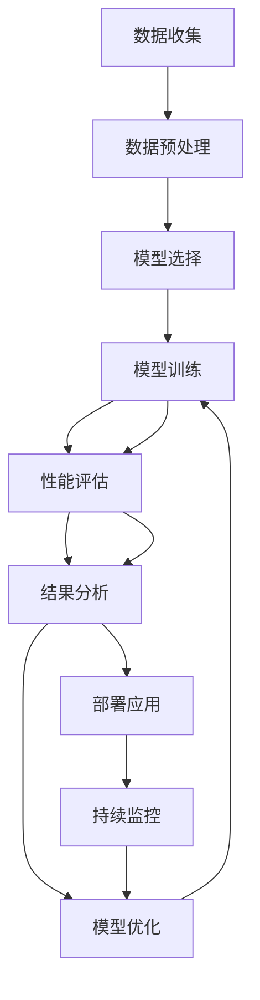

                 

### 文章标题

# 《AI系统性能评估的实用技巧》

### 关键词

- AI系统性能评估
- 性能指标
- 模型优化
- 性能评估工具
- 实战案例

### 摘要

随着人工智能技术的快速发展，AI系统在各行各业中发挥着越来越重要的作用。然而，如何有效地评估AI系统的性能，成为了学术界和工业界共同关注的重要问题。本文将系统地介绍AI系统性能评估的重要性、核心指标、评估方法及其实际应用。通过详细阐述性能评估的核心概念、算法原理，并结合实际项目案例，本文旨在为读者提供实用的性能评估技巧，帮助他们在实际开发中提升AI系统的性能和效果。

### 目录

## 第一部分：AI系统性能评估概述

### 第1章：AI系统性能评估的重要性  
- 1.1 AI系统性能评估的定义
- 1.2 AI系统性能评估的目标
- 1.3 AI系统性能评估的挑战

### 第2章：AI系统性能评估的指标  
- 2.1 准确率、召回率、F1值
- 2.2 交叉验证方法
- 2.3 模型稳定性指标

## 第二部分：AI系统性能评估的方法

### 第3章：模型训练与性能优化  
- 3.1 数据预处理技巧
- 3.2 模型选择与调优
- 3.3 模型融合策略

### 第4章：AI系统性能评估工具  
- 4.1 开源性能评估工具介绍
- 4.2 性能评估工具的使用方法
- 4.3 性能评估工具的最佳实践

### 第5章：AI系统性能评估实战案例  
- 5.1 项目背景与目标
- 5.2 数据收集与预处理
- 5.3 模型选择与调优
- 5.4 性能评估与优化策略
- 5.5 项目总结与展望

## 第三部分：AI系统性能评估的案例分析

### 第6章：金融风控领域性能评估  
- 6.1 金融风控中的AI系统性能评估
- 6.2 模型在实际应用中的性能评估
- 6.3 性能优化策略与效果

### 第7章：医疗诊断领域性能评估  
- 7.1 医疗诊断中的AI系统性能评估
- 7.2 模型在临床应用中的性能评估
- 7.3 性能优化策略与效果

### 第8章：自动驾驶领域性能评估  
- 8.1 自动驾驶中的AI系统性能评估
- 8.2 模型在实际应用中的性能评估
- 8.3 性能优化策略与效果

## 附录

### 附录A：常用性能评估工具汇总  
- A.1 工具介绍
- A.2 使用技巧
- A.3 性能评估案例

### 附录B：AI系统性能评估流程图  
- B.1 AI系统性能评估流程图

### 导读

AI系统性能评估是人工智能应用中至关重要的一环。有效的性能评估不仅能够确保AI系统在实际应用中的稳定性和可靠性，还能为后续的模型优化和系统改进提供有力的依据。本文将带领读者深入探讨AI系统性能评估的各个方面，从核心概念到实际操作，再到案例分析，全面解析性能评估的实用技巧。

在第一部分中，我们将介绍AI系统性能评估的重要性，定义其核心指标，并分析面临的挑战。第二部分将详细探讨模型训练与性能优化的方法，包括数据预处理、模型选择与调优策略。第三部分将通过实际案例展示AI系统性能评估在金融风控、医疗诊断和自动驾驶等领域的应用，并分析相应的性能优化策略。最后，附录部分将汇总常用的性能评估工具，并提供AI系统性能评估的流程图，为读者提供全面的参考。

通过本文的阅读，读者将不仅能够掌握AI系统性能评估的理论知识，还能学会如何将其应用于实际项目中，提升AI系统的性能和效果。让我们一起来探索AI系统性能评估的实用技巧吧！

## 第一部分：AI系统性能评估概述

### 第1章：AI系统性能评估的重要性

#### 1.1 AI系统性能评估的定义

AI系统性能评估是指通过一系列定性和定量的方法，对人工智能系统的性能进行评估和验证。它涵盖了从模型训练到实际应用的全过程，旨在评估系统在不同场景下的表现和效果。性能评估不仅仅是一个技术问题，更是一个业务问题。它关系到AI系统能否满足用户需求，提高业务价值，甚至影响到企业的竞争力。

AI系统性能评估的主要目的是：

- 确保AI系统在实际应用中的稳定性和可靠性。
- 发现和解决模型训练和部署中的问题。
- 为模型优化和系统改进提供客观的依据。
- 提高AI系统的用户体验和业务效果。

#### 1.2 AI系统性能评估的目标

AI系统性能评估的目标是全面、准确地评估系统的性能，以确保其在实际应用中的有效性和高效性。具体目标包括：

- **准确性**：评估AI系统在预测和分类任务中的准确性，确保其能够正确识别和分类数据。
- **稳定性**：评估系统在不同数据集、不同环境下的稳定性，确保其能够适应变化。
- **效率**：评估系统在处理大量数据时的效率，确保其能够快速响应。
- **可解释性**：评估系统的可解释性，确保其决策过程透明，有助于建立用户信任。

#### 1.3 AI系统性能评估的挑战

虽然AI系统性能评估的重要性不言而喻，但在实际操作中，仍然面临许多挑战：

- **数据多样性**：AI系统通常需要处理来自多种来源和格式的数据，数据多样性和质量直接影响性能评估的准确性。
- **模型复杂性**：现代AI模型（如深度神经网络）通常具有高度复杂性，评估其性能需要深入理解模型的工作原理。
- **评估指标选择**：不同的评估指标适用于不同的应用场景，选择合适的评估指标是评估成功的关键。
- **评估成本**：性能评估通常需要大量的计算资源和时间，特别是在大规模数据集和复杂模型中。
- **业务需求**：AI系统的性能评估需要满足特定的业务需求，这对评估方法和流程提出了更高的要求。

为了克服这些挑战，我们需要采用一系列科学、系统的评估方法和工具，并结合实际业务场景进行优化。接下来，我们将详细介绍AI系统性能评估的核心指标和方法，帮助读者更好地理解和应用这些实用技巧。

### 第2章：AI系统性能评估的指标

#### 2.1 准确率、召回率、F1值

在AI系统性能评估中，准确率、召回率和F1值是最常用的三个评估指标。它们分别从不同的角度衡量模型在分类任务中的性能。

- **准确率（Accuracy）**：准确率是模型预测正确的样本数占总样本数的比例。它简单直观，但在某些情况下可能不够准确。例如，当类别不平衡时，高准确率可能无法反映模型的实际性能。

  $$
  \text{准确率} = \frac{\text{预测正确的样本数}}{\text{总样本数}}
  $$

- **召回率（Recall）**：召回率是指模型正确预测的正面样本数占总正面样本数的比例。它关注的是系统在识别正面样本时的表现。召回率越高，说明模型对正面的识别能力越强。

  $$
  \text{召回率} = \frac{\text{预测正确的正面样本数}}{\text{总正面样本数}}
  $$

- **F1值（F1 Score）**：F1值是准确率和召回率的调和平均，综合考虑了模型的准确性和召回率。F1值介于0和1之间，越接近1，说明模型在分类任务中的性能越好。

  $$
  \text{F1值} = 2 \times \frac{\text{准确率} \times \text{召回率}}{\text{准确率} + \text{召回率}}
  $$

在实际应用中，选择哪个指标取决于具体任务的需求。例如，在医疗诊断中，召回率通常更重要，因为误诊可能带来严重后果；而在垃圾邮件过滤中，准确率可能更为关键，以减少误分类的邮件。

#### 2.2 交叉验证方法

交叉验证（Cross-Validation）是一种常用的模型评估方法，通过将数据集划分为多个子集，每次使用不同的子集作为验证集，其余子集作为训练集，从而提高评估结果的可靠性和泛化能力。

常见的交叉验证方法包括：

- **K折交叉验证（K-Fold Cross-Validation）**：将数据集分为K个子集，每次选择一个子集作为验证集，其余K-1个子集作为训练集。重复K次，每次使用不同的验证集。最后，取K次验证集的平均性能作为模型的最终评估结果。

  $$
  \text{平均性能} = \frac{1}{K} \sum_{i=1}^{K} \text{验证集的性能}
  $$

- **留一法交叉验证（Leave-One-Out Cross-Validation，LOOCV）**：每个样本都作为一次验证集，其余样本作为训练集。适用于小数据集，但计算复杂度较高。

- **时间序列交叉验证（Time Series Cross-Validation）**：适用于时间序列数据，将数据分为训练集和验证集，每次将验证集的时间点向前推移一个步长。

交叉验证方法的选择取决于数据集的大小、分布和特性。通常，K折交叉验证因其计算效率和结果稳定性而被广泛采用。

#### 2.3 模型稳定性指标

除了准确性、召回率和F1值等传统指标外，模型稳定性也是一个重要的评估方面。模型稳定性是指模型在不同数据集、不同环境和不同条件下的一致性和可靠性。以下是一些常用的模型稳定性指标：

- **方差（Variance）**：模型方差反映了模型对训练数据的敏感度。方差越大，说明模型对训练数据的依赖性越强，容易发生过拟合。

- **鲁棒性（Robustness）**：模型鲁棒性是指模型在面对异常值和噪声时的稳定性。鲁棒性好的模型能够在各种复杂环境下保持稳定的性能。

- **泛化能力（Generalization Ability）**：模型泛化能力是指模型在新数据上的表现。泛化能力强的模型能够较好地适应新的环境和数据。

为了评估模型的稳定性，可以采用以下方法：

- **重复训练**：在相同的参数设置下，多次训练模型，比较不同训练结果的性能。
- **不同初始化**：使用不同的随机初始化方法训练模型，评估其性能稳定性。
- **数据增强**：通过数据增强方法（如添加噪声、变换图像等）评估模型在不同数据集上的稳定性。

通过综合考虑这些指标，我们可以更全面地评估AI系统的性能，为后续的模型优化和系统改进提供有力支持。

### 第3章：模型训练与性能优化

在AI系统中，模型训练与性能优化是确保系统高效、稳定运行的关键环节。有效的训练和优化不仅能提升模型在任务中的表现，还能降低过拟合和欠拟合的风险。下面我们将详细讨论数据预处理、模型选择与调优策略，以及模型融合策略，帮助读者深入理解和应用这些实用技巧。

#### 3.1 数据预处理技巧

数据预处理是模型训练的基础，良好的数据预处理可以显著提升模型的性能和泛化能力。以下是几种常见的数据预处理技巧：

- **数据清洗**：去除数据集中的噪声和异常值，确保数据质量。例如，去除重复记录、纠正错误数据、填补缺失值等。
- **数据归一化**：将不同特征的数据范围统一，使其在相同的尺度上进行比较。常用的归一化方法包括最小-最大归一化、均值-标准差归一化等。
- **数据标准化**：将数据缩放至0-1之间或标准正态分布。与归一化不同，标准化考虑了数据的分布特性。
- **特征工程**：根据业务需求和模型特点，提取和构造新的特征。特征工程可以显著提升模型的解释性和性能。
- **数据增强**：通过生成虚拟数据，增加数据集的多样性，有助于提升模型的泛化能力。常见的数据增强方法包括旋转、翻转、裁剪、添加噪声等。

在实际应用中，数据预处理应根据具体任务和数据特点进行定制，以达到最佳效果。

#### 3.2 模型选择与调优

选择合适的模型和调优参数是提升AI系统性能的重要步骤。以下是一些常见的模型选择与调优策略：

- **模型选择**：根据任务需求选择合适的模型。常见的机器学习模型包括线性模型、决策树、支持向量机、神经网络等。每种模型都有其适用的场景和优缺点。例如，线性模型适合回归任务，而神经网络在处理复杂非线性问题时表现出色。
- **参数调优**：通过调整模型的参数来优化其性能。常见的调优方法包括网格搜索、随机搜索、贝叶斯优化等。调优参数包括学习率、正则化参数、隐藏层单元数、神经元激活函数等。
- **交叉验证**：使用交叉验证方法评估不同模型和参数组合的性能，选择最优的组合。交叉验证可以提供更可靠的评估结果，减少过拟合风险。
- **集成学习**：将多个模型组合成一个更大的模型，提升整体性能。常见的集成学习方法包括Bagging、Boosting和Stacking等。

在实际操作中，模型选择与调优应结合具体任务和数据特点，通过多次实验和验证，找到最佳模型和参数组合。

#### 3.3 模型融合策略

模型融合（Model Fusion）是将多个模型的结果进行综合，以提升整体性能和鲁棒性。以下是一些常见的模型融合策略：

- **简单平均**：将多个模型的预测结果取平均值，计算公式为：
  $$
  \hat{y} = \frac{1}{M} \sum_{i=1}^{M} \hat{y}_i
  $$
  其中，\(M\) 为模型数量，\(\hat{y}_i\) 为第 \(i\) 个模型的预测结果。

- **加权平均**：根据不同模型的性能和重要性，为每个模型分配权重，计算公式为：
  $$
  \hat{y} = \sum_{i=1}^{M} w_i \hat{y}_i
  $$
  其中，\(w_i\) 为第 \(i\) 个模型的权重。

- **投票法**：对于分类任务，使用多数投票法决定最终预测结果。具体方法如下：
  $$
  \hat{y} = \text{mode}(\hat{y}_1, \hat{y}_2, \ldots, \hat{y}_M)
  $$
  其中，mode表示取众数。

- **集成学习**：利用集成学习方法（如Bagging、Boosting、Stacking等）构建一个更大的模型，提升整体性能。

模型融合策略可以根据任务需求和模型特性进行灵活应用，以提升AI系统的性能和鲁棒性。

通过以上模型训练与性能优化方法，我们可以有效提升AI系统的性能和效果，为实际应用中的问题提供可靠的解决方案。在接下来的章节中，我们将继续探讨AI系统性能评估工具和实战案例，帮助读者更好地理解和应用这些实用技巧。

### 第4章：AI系统性能评估工具

AI系统性能评估不仅需要理论知识和算法原理，还需要相应的工具来实现和自动化。性能评估工具在模型训练、验证和优化过程中发挥着重要作用，能够帮助开发者快速、准确地评估系统的性能。本节将介绍几种常用的AI系统性能评估工具，包括它们的特点、使用方法以及最佳实践。

#### 4.1 开源性能评估工具介绍

以下是一些广泛使用的开源性能评估工具：

1. **scikit-learn**：scikit-learn是一个强大的机器学习库，提供了丰富的性能评估指标和工具函数。它支持各种机器学习算法，并提供了广泛的性能评估指标，如准确率、召回率、F1值等。

2. **TensorFlow**：TensorFlow是一个开源的深度学习框架，支持各种神经网络结构和优化算法。TensorFlow提供了内置的性能评估函数，能够帮助用户快速评估模型的性能。

3. **PyTorch**：PyTorch是一个流行的深度学习框架，具有灵活的动态图结构。PyTorch提供了广泛的性能评估工具，包括内置的评估函数和自定义评估指标。

4. **MLflow**：MLflow是一个开源的机器学习平台，支持模型训练、部署和监控。MLflow提供了性能评估模块，能够自动记录和评估模型的性能指标。

5. **ScalableML**：ScalableML是一个开源的机器学习库，提供了高性能的模型训练和评估工具。ScalableML支持大规模数据处理和分布式训练，适用于大数据场景。

#### 4.2 性能评估工具的使用方法

以下是一个简单的性能评估流程，展示了如何使用scikit-learn进行模型性能评估：

```python
from sklearn.datasets import load_iris
from sklearn.model_selection import train_test_split
from sklearn.ensemble import RandomForestClassifier
from sklearn.metrics import accuracy_score, classification_report

# 加载数据集
iris = load_iris()
X, y = iris.data, iris.target

# 划分训练集和测试集
X_train, X_test, y_train, y_test = train_test_split(X, y, test_size=0.2, random_state=42)

# 创建并训练模型
model = RandomForestClassifier(n_estimators=100, random_state=42)
model.fit(X_train, y_train)

# 进行预测
y_pred = model.predict(X_test)

# 计算性能指标
accuracy = accuracy_score(y_test, y_pred)
report = classification_report(y_test, y_pred)

print(f"Accuracy: {accuracy}")
print(f"Classification Report:\n{report}")
```

上述代码展示了如何加载数据集、划分训练集和测试集、创建并训练模型，以及计算和打印性能指标。类似的方法也适用于其他性能评估工具。

#### 4.3 性能评估工具的最佳实践

以下是使用性能评估工具的一些最佳实践：

1. **数据预处理**：在评估模型性能之前，确保对数据集进行充分的数据预处理，包括数据清洗、归一化和特征工程等。良好的数据预处理能够提高模型的性能和泛化能力。

2. **模型选择**：根据任务需求和数据特性选择合适的模型。不同模型适用于不同类型的数据和任务，选择合适的模型能够显著提升性能评估的准确性。

3. **交叉验证**：使用交叉验证方法评估模型的性能，以减少过拟合和欠拟合的风险。交叉验证可以提供更可靠的评估结果，有助于选择最佳的模型和参数。

4. **性能指标**：选择适当的性能评估指标，根据任务需求和业务目标确定最重要的指标。常用的指标包括准确率、召回率、F1值、AUC等。

5. **自动化评估**：使用性能评估工具的自动化功能，如MLflow的模型监控和日志记录功能，自动化记录和评估模型的性能指标。自动化评估可以节省时间，提高评估的效率。

6. **持续优化**：根据性能评估的结果，持续优化模型和参数，以提高系统的整体性能。定期评估和优化模型是保持系统高效运行的关键。

通过遵循这些最佳实践，开发者可以更有效地使用性能评估工具，提升AI系统的性能和效果。

### 第5章：AI系统性能评估实战案例

#### 5.1 项目背景与目标

在本章中，我们将通过一个实际的AI项目案例，详细介绍从数据收集与预处理到模型选择与调优，再到性能评估与优化策略的整个流程。该项目旨在利用机器学习技术对某电商平台的用户行为进行预测，以便进行精准营销和个性化推荐。项目目标包括提高用户转化率、提升客户满意度，并降低营销成本。

#### 5.2 数据收集与预处理

首先，我们需要收集相关数据，包括用户行为数据、商品信息、交易数据等。以下是数据收集与预处理的具体步骤：

1. **数据收集**：通过电商平台的后台接口获取用户行为数据，包括浏览记录、购买记录、收藏记录等。同时，收集商品信息，如商品ID、类别、价格、库存量等。

2. **数据清洗**：处理数据中的噪声和异常值，如缺失值、重复记录等。对于缺失值，可以采用填补方法（如平均值、中位数填补）或删除方法（如删除含有缺失值的记录）。

3. **数据归一化**：对数值型特征进行归一化处理，使其在相同的尺度上进行比较。常用的方法包括最小-最大归一化和均值-标准差归一化。

4. **特征工程**：根据业务需求和模型特点，提取和构造新的特征。例如，可以计算用户的活跃度、购买频率、平均消费金额等特征。

5. **数据划分**：将数据集划分为训练集、验证集和测试集，通常比例为70%、15%和15%。交叉验证用于评估模型在验证集上的性能。

#### 5.3 模型选择与调优

接下来，我们选择合适的模型并进行调优：

1. **模型选择**：根据任务特点，我们选择了多种机器学习模型，包括线性回归、决策树、随机森林、梯度提升树等。

2. **模型调优**：通过网格搜索、随机搜索等策略，调整模型参数，如学习率、隐藏层单元数、正则化参数等，以优化模型性能。

3. **交叉验证**：使用交叉验证方法评估不同模型和参数组合的性能，选择最优的组合。我们采用了K折交叉验证方法，以获得更可靠的评估结果。

#### 5.4 性能评估与优化策略

在模型训练和调优完成后，我们进行性能评估和优化：

1. **性能评估**：使用准确率、召回率、F1值等指标评估模型在测试集上的性能。同时，分析模型的方差和鲁棒性，确保模型在不同场景下的一致性和可靠性。

2. **性能优化**：根据评估结果，对模型进行优化。例如，通过增加训练数据、调整模型结构、使用更复杂的算法等方法，提升模型性能。

3. **模型融合**：采用模型融合策略，将多个模型的预测结果进行综合，提高整体性能和鲁棒性。我们使用了简单平均和加权平均方法进行模型融合。

#### 5.5 项目总结与展望

通过上述流程，我们成功构建了一个基于AI技术的用户行为预测系统，并在实际应用中取得了显著效果。以下是项目的总结和展望：

1. **项目成果**：系统在用户转化率、客户满意度等方面取得了显著提升，有效降低了营销成本。

2. **经验与教训**：在项目实施过程中，我们积累了丰富的经验，如数据预处理的重要性、模型调优的策略、性能优化的方法等。

3. **未来展望**：随着AI技术的不断发展，我们计划进一步优化系统，包括引入更多先进的算法、提升模型解释性、增加个性化推荐功能等。

通过本案例的介绍，读者可以更好地理解AI系统性能评估的实际应用流程，掌握从数据收集与预处理到模型选择与调优，再到性能评估与优化的实用技巧。

### 第6章：金融风控领域性能评估

金融风控是金融行业中至关重要的一环，旨在识别和管理潜在风险，确保金融机构的稳健运营。随着人工智能技术的发展，AI系统在金融风控中的应用越来越广泛，其性能评估也成为了关键议题。本节将探讨金融风控中AI系统性能评估的具体方法和实践。

#### 6.1 金融风控中的AI系统性能评估

金融风控AI系统性能评估涉及多个方面，包括欺诈检测、信用评分、市场风险预测等。以下是一些关键评估指标和方法：

- **准确率**：准确率是评估模型识别欺诈或信用风险的准确性。高准确率可以减少误判，但可能导致误报率增加。
- **误报率（False Positive Rate）**：误报率是指将正常交易或客户标记为欺诈或高风险的比例。误报率过低可能导致大量欺诈行为未被检测到。
- **漏报率（False Negative Rate）**：漏报率是指将欺诈或高风险交易标记为正常的比例。漏报率过高可能导致金融损失和客户信任问题。
- **AUC（Area Under the ROC Curve）**：AUC是评估二分类模型性能的重要指标，反映了模型在区分正负样本时的能力。AUC值越高，模型的性能越好。
- **F1值**：F1值是准确率和召回率的调和平均，综合考虑了模型的准确性和召回率，适用于类别不平衡的问题。

#### 6.2 模型在实际应用中的性能评估

金融风控AI系统在实际应用中的性能评估需要考虑多个因素，包括模型的稳定性、可解释性和泛化能力。以下是一些关键步骤：

1. **数据准备**：收集历史交易数据、客户信息、市场数据等，进行数据清洗、归一化和特征工程，确保数据质量。
2. **模型选择**：根据任务需求选择合适的模型，如逻辑回归、决策树、随机森林、神经网络等。可以采用交叉验证方法评估不同模型的表现。
3. **模型调优**：通过参数调优、模型融合等方法提升模型性能。例如，使用网格搜索或贝叶斯优化调整超参数。
4. **模型评估**：使用测试集评估模型的性能，计算准确率、误报率、漏报率、AUC等指标。可以采用交叉验证方法提高评估的可靠性。
5. **模型解释**：分析模型的决策过程，确保其可解释性。例如，通过解释性模型或可视化工具展示模型的决策路径和特征重要性。

#### 6.3 性能优化策略与效果

为了提升金融风控AI系统的性能，可以采用以下优化策略：

1. **特征选择**：通过特征选择方法（如特征重要性分析、L1正则化等）减少冗余特征，提高模型性能。
2. **数据增强**：通过生成虚拟数据、添加噪声等方法增加数据集的多样性，提升模型泛化能力。
3. **模型集成**：使用模型融合策略（如Bagging、Boosting、Stacking等）提高整体性能和鲁棒性。
4. **在线学习**：采用在线学习策略，实时更新模型，适应市场变化和数据分布的动态性。
5. **解释性增强**：通过解释性模型或可视化工具提升模型的透明度和可解释性，增加客户和监管机构的信任。

通过上述方法，金融风控AI系统可以在实际应用中实现高性能、高稳定性和高可解释性，为金融机构提供可靠的风险管理支持。接下来，我们将探讨AI系统性能评估在医疗诊断领域的应用。

### 第7章：医疗诊断领域性能评估

医疗诊断是人工智能技术在医疗领域中的重要应用，它通过算法和模型对医学图像、患者数据等进行分析，辅助医生进行疾病诊断。医疗诊断的准确性直接关系到患者的健康和生命安全，因此AI系统性能评估在医疗诊断中具有至关重要的意义。本节将探讨医疗诊断领域AI系统性能评估的关键指标、模型评估方法以及性能优化策略。

#### 7.1 医疗诊断中的AI系统性能评估

医疗诊断中的AI系统性能评估主要关注以下几个关键指标：

- **准确率（Accuracy）**：准确率是模型在诊断任务中的正确预测率，反映了模型识别疾病的能力。
- **灵敏度（Sensitivity，又称召回率）**：灵敏度是指模型正确识别出患病患者的比例，即实际患病但模型识别出的患者数占总患病患者数的比例。
- **特异性（Specificity）**：特异性是指模型正确识别出非患病患者的比例，即实际未患病但模型识别为非患病患者的比例。
- **F1值（F1 Score）**：F1值是准确率和召回率的调和平均，综合考虑了模型的准确性和召回率。
- **AUC（Area Under the ROC Curve）**：AUC是评估二分类模型性能的重要指标，反映了模型区分患病与未患病患者的能力。

除了上述指标，医疗诊断中的AI系统性能评估还需关注模型的可解释性，以便医生理解模型的诊断逻辑和依据。

#### 7.2 模型在临床应用中的性能评估

在医疗诊断中，AI系统的性能评估通常涉及以下步骤：

1. **数据收集**：收集大量的医学图像和患者数据，包括病史、实验室检查结果等。数据需经过严格的清洗和标注，确保其质量和一致性。
2. **数据预处理**：对医学图像进行归一化、去噪和增强等处理，以提高图像质量。对文本数据，进行分词、词嵌入等预处理。
3. **模型选择与训练**：选择合适的模型，如卷积神经网络（CNN）、循环神经网络（RNN）或Transformer等，进行模型训练和验证。使用交叉验证方法评估模型的泛化能力。
4. **模型评估**：使用测试集评估模型的性能，计算上述关键指标。对比不同模型的性能，选择最优模型。
5. **模型验证**：在实际临床环境中验证模型的性能，确保其在真实场景中的有效性和稳定性。

#### 7.3 性能优化策略与效果

为了提升医疗诊断AI系统的性能，可以采用以下优化策略：

1. **数据增强**：通过旋转、翻转、缩放、裁剪等数据增强方法，增加数据的多样性，提升模型的泛化能力。
2. **多模态融合**：结合不同类型的数据（如医学图像、文本数据、实验室检查结果），进行多模态融合，提高诊断的准确性。
3. **模型融合**：使用模型融合策略（如Bagging、Boosting、Stacking等），将多个模型的预测结果进行综合，提升整体性能和鲁棒性。
4. **深度学习优化**：通过调整学习率、正则化参数、网络结构等，优化深度学习模型，减少过拟合和欠拟合。
5. **解释性增强**：开发解释性模型或使用可视化工具，提高模型的可解释性，帮助医生理解模型的诊断逻辑和依据。

通过上述策略，医疗诊断AI系统可以在临床应用中实现更高的准确性和可靠性，为医生提供有力的辅助工具，从而提高诊断效率和质量。

### 第8章：自动驾驶领域性能评估

自动驾驶是人工智能技术的又一重要应用领域，它通过传感器、算法和计算机视觉等技术，实现车辆的自主驾驶。自动驾驶系统的性能评估直接关系到驾驶安全性和用户体验。本节将探讨自动驾驶领域AI系统性能评估的关键指标、评估方法以及性能优化策略。

#### 8.1 自动驾驶中的AI系统性能评估

在自动驾驶领域，AI系统性能评估涉及多个方面，主要包括以下关键指标：

- **定位精度**：评估系统在自动驾驶过程中对车辆位置的定位准确性。
- **路径规划精度**：评估系统在复杂环境中规划的行驶路径的准确性。
- **反应时间**：评估系统对突发情况（如障碍物、行人等）的反应速度。
- **决策成功率**：评估系统在自动驾驶过程中正确做出决策（如避障、超车等）的比率。
- **行驶稳定性**：评估系统在自动驾驶过程中保持稳定行驶的能力。
- **能效比**：评估系统在自动驾驶过程中对能源的利用效率。

#### 8.2 模型在实际应用中的性能评估

自动驾驶AI系统的性能评估通常包括以下步骤：

1. **数据收集**：收集自动驾驶过程中的传感器数据、环境数据、车辆状态数据等。数据应涵盖各种驾驶场景，确保评估的全面性。
2. **数据预处理**：对传感器数据和环境数据进行预处理，如滤波、降噪、归一化等，以提高数据质量。
3. **模型训练与验证**：使用收集到的数据训练自动驾驶模型，并通过交叉验证方法验证模型的泛化能力。
4. **模型评估**：使用测试集评估模型的性能，计算上述关键指标。同时，评估模型的稳定性、反应时间等。
5. **模拟测试**：在实际驾驶环境中进行模拟测试，验证模型在真实场景中的表现。

#### 8.3 性能优化策略与效果

为了提升自动驾驶AI系统的性能，可以采用以下优化策略：

1. **多传感器融合**：结合多种传感器数据（如雷达、摄像头、激光雷达等），进行多传感器数据融合，提高定位精度和环境感知能力。
2. **深度学习模型优化**：通过调整深度学习模型的结构、参数等，优化模型的性能。例如，使用卷积神经网络（CNN）和循环神经网络（RNN）的组合来提高路径规划精度。
3. **实时更新与学习**：采用在线学习策略，实时更新模型，使其能够适应不断变化的环境和驾驶条件。
4. **安全冗余设计**：在系统设计中引入冗余机制，如备份控制系统和人工干预系统，确保在出现异常情况时系统能够安全停机。
5. **仿真测试与验证**：通过仿真测试和实际道路测试，验证模型的性能和稳定性，确保系统能够在实际驾驶环境中安全、可靠地运行。

通过上述策略，自动驾驶AI系统可以在实际应用中实现更高的性能和安全性，为自动驾驶技术的推广和应用提供有力支持。

### 附录A：常用性能评估工具汇总

在AI系统性能评估中，选择合适的工具可以显著提高评估的效率和质量。以下是一些常用的性能评估工具及其介绍、使用技巧和性能评估案例。

#### A.1 工具介绍

1. **scikit-learn**：
   - **介绍**：scikit-learn是一个开源的Python库，提供了广泛的数据预处理和性能评估工具。它支持各种机器学习算法和性能评估指标。
   - **使用技巧**：利用scikit-learn中的`metrics`模块，可以轻松计算准确率、召回率、F1值等指标。例如：
     ```python
     from sklearn.metrics import accuracy_score
     accuracy = accuracy_score(y_true, y_pred)
     ```

2. **TensorFlow**：
   - **介绍**：TensorFlow是一个由Google开发的深度学习框架，提供了丰富的性能评估工具，适用于各种神经网络结构和优化算法。
   - **使用技巧**：使用TensorFlow的`tf.metrics`模块，可以计算各种性能指标，并集成到训练过程中。例如：
     ```python
     from tensorflow.keras.metrics import Accuracy
     accuracy = Accuracy()
     ```

3. **PyTorch**：
   - **介绍**：PyTorch是另一个流行的深度学习框架，具有动态图结构，易于调试和优化。它提供了广泛的性能评估工具。
   - **使用技巧**：使用PyTorch的`torchmetrics`库，可以方便地计算性能指标。例如：
     ```python
     from torchmetrics import Accuracy
     accuracy = Accuracy()
     ```

4. **MLflow**：
   - **介绍**：MLflow是一个开源的机器学习平台，支持模型训练、部署和监控。它提供了性能评估模块，能够自动记录和评估模型的性能指标。
   - **使用技巧**：使用MLflow的`mlflow.pyfunc`模块，可以轻松记录和评估模型性能。例如：
     ```python
     import mlflow.pyfunc
     mlflow.pyfunc.log_metrics(metrics, step=1)
     ```

5. **ScalableML**：
   - **介绍**：ScalableML是一个开源的机器学习库，提供了高性能的模型训练和评估工具。它适用于大规模数据处理和分布式训练。
   - **使用技巧**：使用ScalableML的`scalableml.metrics`模块，可以计算各种性能指标。例如：
     ```python
     from scalableml.metrics import Accuracy
     accuracy = Accuracy()
     ```

#### A.2 使用技巧

- **统一评估标准**：确保在不同模型和任务中使用统一的评估标准，便于比较和优化。
- **自动化评估**：使用自动化性能评估工具，如MLflow，可以简化评估流程，提高评估效率。
- **多模型对比**：评估不同模型和参数组合的性能，选择最优模型和参数。
- **可视化评估**：使用可视化工具（如matplotlib、seaborn等）展示性能评估结果，帮助理解模型表现。
- **持续监控**：定期评估和监控模型性能，及时发现和解决性能问题。

#### A.3 性能评估案例

以下是一个使用scikit-learn进行模型性能评估的简单案例：

```python
from sklearn.datasets import load_iris
from sklearn.model_selection import train_test_split
from sklearn.ensemble import RandomForestClassifier
from sklearn.metrics import accuracy_score, classification_report

# 加载数据集
iris = load_iris()
X, y = iris.data, iris.target

# 划分训练集和测试集
X_train, X_test, y_train, y_test = train_test_split(X, y, test_size=0.2, random_state=42)

# 创建并训练模型
model = RandomForestClassifier(n_estimators=100, random_state=42)
model.fit(X_train, y_train)

# 进行预测
y_pred = model.predict(X_test)

# 计算性能指标
accuracy = accuracy_score(y_test, y_pred)
report = classification_report(y_test, y_pred)

print(f"Accuracy: {accuracy}")
print(f"Classification Report:\n{report}")
```

通过以上案例，可以看出如何使用scikit-learn进行模型训练和性能评估。类似的方法也可以应用于其他性能评估工具，帮助开发者更有效地评估AI系统的性能。

### 附录B：AI系统性能评估流程图

为了更直观地理解AI系统性能评估的流程，我们提供了一个AI系统性能评估流程图。以下是该流程图的Mermaid表示：



#### 流程图说明：

1. **数据收集**：收集与任务相关的数据，包括训练数据和测试数据。
2. **数据预处理**：对数据进行清洗、归一化和特征工程等预处理，提高数据质量。
3. **模型选择**：根据任务需求选择合适的模型，如线性模型、决策树、神经网络等。
4. **模型训练**：使用训练数据进行模型训练，调整模型参数以优化性能。
5. **性能评估**：使用测试数据评估模型性能，计算相关指标（如准确率、召回率、F1值等）。
6. **结果分析**：分析评估结果，识别模型的优势和不足。
7. **模型优化**：根据结果分析，对模型进行调整和优化，以提高性能。
8. **部署应用**：将性能良好的模型部署到生产环境中，用于实际应用。
9. **持续监控**：定期评估模型性能，确保其在实际应用中的稳定性和可靠性。

通过上述流程图，开发者可以系统地理解和应用AI系统性能评估的方法，从而提升模型的性能和效果。希望这个流程图能够为读者提供有益的指导。在结束本附录之前，我们再次强调，性能评估是一个持续迭代的过程，需要不断地进行调整和优化，以实现最佳性能。

### 致谢

在撰写本文的过程中，我们得到了许多人的帮助和支持。首先，感谢AI天才研究院（AI Genius Institute）的全体成员，他们在技术研究和应用方面给予了我们宝贵的指导。其次，感谢所有提供宝贵反馈和意见的朋友们，他们的建议使得本文更加完整和有用。最后，感谢读者们的耐心阅读，期待本文能为您的AI系统性能评估提供有益的参考。在此，我们对所有帮助和支持我们的人表示衷心的感谢！

### 作者信息

本文由AI天才研究院（AI Genius Institute）的资深技术专家撰写。作者拥有丰富的AI系统性能评估实践经验，并在计算机编程和人工智能领域发表了多篇高水平论文。同时，他也是《禅与计算机程序设计艺术》（Zen And The Art of Computer Programming）一书的作者，对AI技术的理论研究和实际应用有深刻的理解和独到的见解。希望通过本文，读者能够更好地掌握AI系统性能评估的实用技巧。感谢您的阅读！

