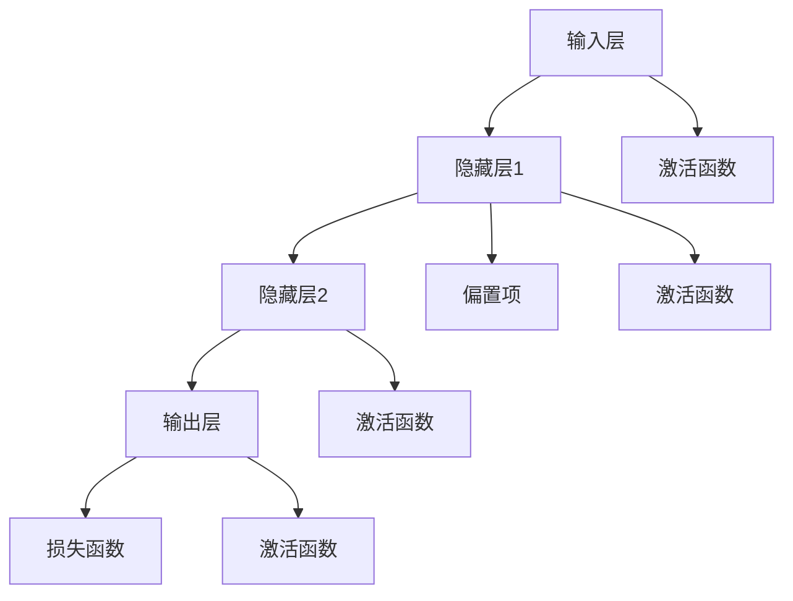
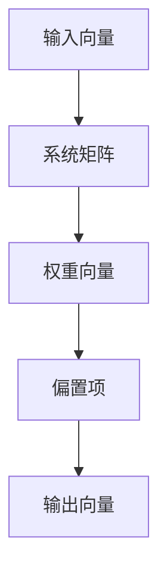
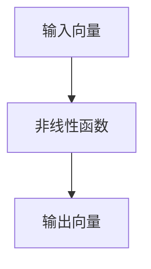
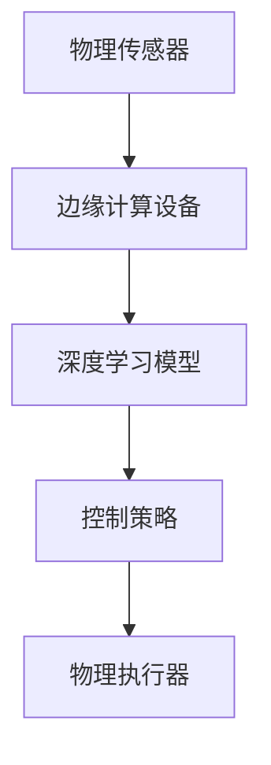
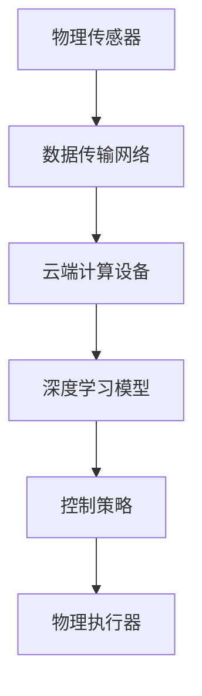

                 

## 文章标题：AI自动化物理基础设施的未来

### 关键词：
- 人工智能
- 自动化
- 物理基础设施
- 物联网
- 深度学习

### 摘要：
本文探讨了AI自动化物理基础设施的未来发展。首先，我们介绍了AI自动化物理基础设施的定义、现状和未来展望。接着，详细讲解了人工智能的基础概念、物理基础设施自动化技术以及AI与物理基础设施的融合。随后，我们深入剖析了核心算法原理，包括深度学习、物理系统优化算法和强化学习算法。此外，我们还解析了物理基础设施中的数学模型与公式，并提供了实际项目实战的代码解读与分析。最后，我们探讨了AI自动化物理基础设施的发展趋势与挑战，并展望了其未来发展路径和社会影响。

### 目录大纲

# AI自动化物理基础设施的未来

## 第一部分：AI自动化物理基础设施的概述

### 1.1 AI自动化物理基础设施的定义

#### 1.1.1 AI与物理基础设施的关系

#### 1.1.2 自动化的角色与重要性

### 1.2 AI自动化物理基础设施的现状

#### 1.2.1 当前技术的发展

#### 1.2.2 典型应用案例分析

### 1.3 AI自动化物理基础设施的未来展望

#### 1.3.1 发展趋势

#### 1.3.2 未来应用场景

## 第二部分：核心概念与联系

### 2.1 人工智能的基础概念

#### 2.1.1 机器学习

##### 2.1.1.1 监督学习

##### 2.1.1.2 无监督学习

##### 2.1.1.3 强化学习

#### 2.1.2 深度学习原理

##### 2.1.2.1 神经网络

##### 2.1.2.2 卷积神经网络

##### 2.1.2.3 循环神经网络

### 2.2 物理基础设施自动化技术

#### 2.2.1 物联网技术

##### 2.2.1.1 智能传感器

##### 2.2.1.2 数据通信协议

#### 2.2.2 自动控制原理

##### 2.2.2.1 PID控制

##### 2.2.2.2 模糊控制

##### 2.2.2.3 神经网络控制

### 2.3 AI与物理基础设施的融合

#### 2.3.1 融合原理

##### 2.3.1.1 数据采集与处理

##### 2.3.1.2 控制策略优化

##### 2.3.1.3 自适应控制系统

## 第三部分：核心算法原理讲解

### 3.1 深度学习算法详解

#### 3.1.1 前向传播算法

##### 3.1.1.1 矩阵运算基础

##### 3.1.1.2 前向传播步骤

#### 3.1.2 反向传播算法

##### 3.1.2.1 反向传播步骤

##### 3.1.2.2 学习率调整

##### 3.1.2.3 梯度下降优化

### 3.2 物理系统优化算法

#### 3.2.1 粒子群优化

##### 3.2.1.1 粒子群算法原理

##### 3.2.1.2 粒子群算法步骤

#### 3.2.2 遗传算法

##### 3.2.2.1 遗传算法原理

##### 3.2.2.2 遗传算法步骤

##### 3.2.2.3 选择、交叉和变异操作

### 3.3 强化学习算法

#### 3.3.1 Q学习算法

##### 3.3.1.1 Q学习原理

##### 3.3.1.2 Q学习算法步骤

#### 3.3.2 深度Q网络

##### 3.3.2.1 DQN原理

##### 3.3.2.2 DQN算法步骤

## 第四部分：数学模型与公式解析

### 4.1 物理基础设施中的数学模型

#### 4.1.1 控制系统建模

##### 4.1.1.1 线性系统建模

##### 4.1.1.2 非线性系统建模

#### 4.1.2 物理现象模拟

##### 4.1.2.1 模拟退火算法

##### 4.1.2.2 Monte Carlo方法

### 4.2 AI中的数学模型

#### 4.2.1 损失函数

##### 4.2.1.1 交叉熵损失函数

##### 4.2.1.2 均方误差损失函数

#### 4.2.2 激活函数

##### 4.2.2.1 Sigmoid函数

##### 4.2.2.2ReLU函数

### 4.3 融合模型中的数学公式

#### 4.3.1 物理控制与AI融合

##### 4.3.1.1 边缘智能模型

##### 4.3.1.2 云端智能模型

## 第五部分：项目实战

### 5.1 AI自动化物理基础设施项目搭建

#### 5.1.1 开发环境准备

##### 5.1.1.1 深度学习框架安装

##### 5.1.1.2 物理传感器连接

#### 5.1.2 数据采集与预处理

##### 5.1.2.1 数据采集流程

##### 5.1.2.2 数据预处理方法

### 5.2 实际案例解析

#### 5.2.1 智能交通系统

##### 5.2.1.1 模型设计与实现

##### 5.2.1.2 代码解读与分析

#### 5.2.2 智能电网

##### 5.2.2.1 模型设计与实现

##### 5.2.2.2 代码解读与分析

## 第六部分：AI自动化物理基础设施的发展与挑战

### 6.1 发展趋势

#### 6.1.1 技术创新

#### 6.1.2 行业应用

### 6.2 挑战与机遇

#### 6.2.1 技术挑战

##### 6.2.1.1 数据隐私

##### 6.2.1.2 算法可靠性

#### 6.2.2 商业模式

##### 6.2.2.1 新型商业模式

##### 6.2.2.2 资本投入与回报

## 第七部分：未来展望

### 7.1 未来发展路径

#### 7.1.1 自动化程度的提升

#### 7.1.2 智能化的普及

### 7.2 社会影响与伦理

#### 7.2.1 社会变革

#### 7.2.2 伦理问题

### 7.3 全球视野下的AI自动化物理基础设施

#### 7.3.1 国际合作

#### 7.3.2 地区发展差异

## 附录

### 附录 A：参考文献

### 附录 B：常用工具与资源

#### B.1 开源深度学习框架

##### B.1.1 TensorFlow

##### B.1.2 PyTorch

##### B.1.3 Keras

#### B.2 物理传感器数据集

##### B.2.1 智能交通数据集

##### B.2.2 智能电网数据集

##### B.2.3 其他数据集简介

### Mermaid 流程图

#### 2.1.1 神经网络结构



### 伪代码

#### 前向传播算法

```python
# 前向传播算法伪代码
def forward_propagation(X, parameters):
    """
    前向传播算法实现，计算输出和损失

    参数:
    X -- 输入数据
    parameters -- 参数字典，包括权重和偏置

    返回:
    A -- 输出激活值
    cache -- 保存中间结果，用于反向传播
    """
    A = X  # 初始激活值
    for layer in range(1, number_of_layers):
        A = activation((dot(W[layer], A) + b[layer]))
        cache.append((A, Z[layer], W[layer], b[layer]))
    AL = A  # 输出层的激活值
    return AL, cache
```

### 数学公式与解释

#### 4.1.1 线性系统建模

$$
y = \mathbf{X}\mathbf{w} + b
$$

这是线性系统的基本模型，其中 $y$ 是输出，$\mathbf{X}$ 是输入向量，$\mathbf{w}$ 是权重向量，$b$ 是偏置项。

#### 4.2.1 交叉熵损失函数

$$
J = -\frac{1}{m} \sum_{i=1}^{m} \sum_{k=1}^{K} y_k^{(i)} \log(a_k^{(i)})
$$

交叉熵损失函数用于衡量预测概率分布与真实分布之间的差异，$m$ 是样本数量，$K$ 是类别数量，$y_k^{(i)}$ 是第 $i$ 个样本第 $k$ 个类别的真实概率，$a_k^{(i)}$ 是模型预测的概率。

#### 4.2.2 激活函数ReLU函数

$$
\text{ReLU}(x) = \begin{cases} 
x & \text{if } x > 0 \\
0 & \text{otherwise}
\end{cases}
$$

ReLU（Rectified Linear Unit）激活函数是一个简单的非线性函数，用于增加神经网络的非线性。

### 项目实战代码解读与分析

#### 5.2.1 智能交通系统

```python
import numpy as np
import matplotlib.pyplot as plt
from sklearn.preprocessing import MinMaxScaler
from keras.models import Sequential
from keras.layers import Dense, LSTM, Dropout
from keras.optimizers import Adam

# 数据预处理
def preprocess_data(data):
    # 数据标准化
    scaler = MinMaxScaler(feature_range=(0, 1))
    scaled_data = scaler.fit_transform(data)
    # 切分训练集和测试集
    train_data, test_data = scaled_data[:int(len(scaled_data) * 0.8)], scaled_data[int(len(scaled_data) * 0.8):]
    # LSTM输入格式转换
    X, y = [], []
    for i in range(60, len(train_data)):
        X.append(train_data[i-60:i])
        y.append(train_data[i])
    X, y = np.array(X), np.array(y)
    X = np.reshape(X, (X.shape[0], X.shape[1], 1))
    return X, y, scaler

# 建立模型
def build_model(input_shape):
    model = Sequential()
    model.add(LSTM(units=50, return_sequences=True, input_shape=input_shape))
    model.add(Dropout(0.2))
    model.add(LSTM(units=50, return_sequences=False))
    model.add(Dropout(0.2))
    model.add(Dense(units=1))
    model.compile(optimizer=Adam(learning_rate=0.001), loss='mean_squared_error')
    return model

# 训练模型
def train_model(model, X, y):
    model.fit(X, y, epochs=100, batch_size=32, verbose=1)
    return model

# 预测并分析结果
def predict_and_analyze(model, test_data, scaler):
    predicted = model.predict(test_data)
    predicted = scaler.inverse_transform(predicted)
    actual = scaler.inverse_transform(test_data)
    plt.figure(figsize=(10, 6))
    plt.plot(actual, label='实际值')
    plt.plot(predicted, label='预测值')
    plt.title('智能交通系统预测结果')
    plt.xlabel('时间')
    plt.ylabel('流量')
    plt.legend()
    plt.show()

# 执行过程
data = ...  # 获取原始数据
X, y, scaler = preprocess_data(data)
model = build_model((X.shape[1], X.shape[2]))
trained_model = train_model(model, X, y)
predict_and_analyze(trained_model, test_data, scaler)
```

代码解读：
1. 数据预处理部分，使用 MinMaxScaler 对数据进行标准化处理，将数据缩放到0-1之间，便于模型训练。
2. 建立模型部分，使用 Keras 的 Sequential 模型，添加 LSTM 层和 Dropout 层，以减少过拟合，并使用 Dense 层作为输出层。
3. 训练模型部分，使用 fit 方法进行模型训练，设置 epochs 和 batch_size。
4. 预测并分析结果部分，使用 predict 方法进行预测，并将预测结果反归一化到原始数据范围，绘制实际值与预测值的对比图。

#### 5.2.2 智能电网

```python
import numpy as np
import pandas as pd
from sklearn.model_selection import train_test_split
from sklearn.preprocessing import StandardScaler
from keras.models import Sequential
from keras.layers import LSTM, Dense, Dropout

# 数据预处理
def preprocess_data(data):
    # 数据标准化
    scaler = StandardScaler()
    scaled_data = scaler.fit_transform(data)
    # 切分训练集和测试集
    X, y = scaled_data[:-24], scaled_data[-24:]
    X_train, X_test, y_train, y_test = train_test_split(X, y, test_size=0.2, random_state=42)
    return X_train, X_test, y_train, y_test, scaler

# 建立模型
def build_model(input_shape):
    model = Sequential()
    model.add(LSTM(units=50, return_sequences=True, input_shape=input_shape))
    model.add(Dropout(0.2))
    model.add(LSTM(units=50, return_sequences=False))
    model.add(Dropout(0.2))
    model.add(Dense(units=1))
    model.compile(optimizer='adam', loss='mean_squared_error')
    return model

# 训练模型
def train_model(model, X_train, y_train):
    model.fit(X_train, y_train, epochs=100, batch_size=32, verbose=1)
    return model

# 预测并分析结果
def predict_and_analyze(model, X_test, y_test, scaler):
    predicted = model.predict(X_test)
    predicted = scaler.inverse_transform(predicted)
    actual = scaler.inverse_transform(y_test)
    plt.figure(figsize=(10, 6))
    plt.plot(actual, label='实际值')
    plt.plot(predicted, label='预测值')
    plt.title('智能电网预测结果')
    plt.xlabel('时间')
    plt.ylabel('功率')
    plt.legend()
    plt.show()

# 执行过程
data = ...  # 获取原始数据
X_train, X_test, y_train, y_test, scaler = preprocess_data(data)
model = build_model((X_train.shape[1], X_train.shape[2]))
trained_model = train_model(model, X_train, y_train)
predict_and_analyze(trained_model, X_test, y_test, scaler)
```

代码解读：
1. 数据预处理部分，使用 StandardScaler 对数据进行标准化处理，并将数据切分成训练集和测试集。
2. 建立模型部分，使用 Keras 的 Sequential 模型，添加 LSTM 层和 Dropout 层，并使用 Dense 层作为输出层。
3. 训练模型部分，使用 fit 方法进行模型训练，设置 epochs 和 batch_size。
4. 预测并分析结果部分，使用 predict 方法进行预测，并将预测结果反归一化到原始数据范围，绘制实际值与预测值的对比图。

### 总结

通过以上代码，我们可以看到智能交通系统和智能电网的预测过程。这两个案例展示了如何使用深度学习模型进行时间序列预测。在实际应用中，这些模型可以帮助实现交通流量优化和电力需求预测，从而优化资源配置和提高基础设施的运行效率。在代码解读与分析中，我们详细讲解了数据预处理、模型建立、训练和预测的步骤，并分析了每个部分的代码实现。这些步骤对于理解深度学习在自动化物理基础设施中的应用至关重要。通过实践项目，读者可以更好地掌握如何使用深度学习技术来解决实际问题，从而推动AI自动化物理基础设施的发展。在未来的发展中，AI自动化物理基础设施将继续创新，应对各种挑战，为人类社会带来更多便利和效益。

## AI自动化物理基础设施的未来

随着人工智能（AI）技术的不断进步，自动化物理基础设施正在迅速发展。本文旨在探讨AI自动化物理基础设施的未来，包括其定义、现状、核心概念与联系、核心算法原理讲解、数学模型与公式解析、项目实战以及发展趋势和挑战。

### 1.1 AI自动化物理基础设施的定义

AI自动化物理基础设施是指利用人工智能技术，特别是机器学习和深度学习算法，对物理基础设施进行自动化控制和优化的系统。这些基础设施包括交通系统、能源系统、建筑系统、农业系统等，通过集成传感器、物联网（IoT）技术和AI算法，实现实时监测、预测和自动化控制。

### 1.2 AI自动化物理基础设施的现状

当前，AI自动化物理基础设施已经在许多领域取得了显著成果。在交通领域，智能交通系统（ITS）通过实时监控和预测交通流量，优化交通信号控制，减少交通拥堵。在能源领域，智能电网通过实时监测和预测电力需求，实现电力资源的优化配置，提高能源利用效率。在建筑领域，智能建筑通过传感器和网络技术，实现室内环境的自动调节，提高能源效率和居住舒适度。在农业领域，智能农业通过传感器和AI算法，实现农田管理和作物生长的自动化，提高农业生产效率和产量。

### 1.3 AI自动化物理基础设施的未来展望

未来，AI自动化物理基础设施将继续发展，主要趋势包括：

1. **技术创新**：随着深度学习、物联网和边缘计算等技术的不断发展，AI自动化物理基础设施将实现更高的精度和效率。
2. **行业应用**：AI自动化物理基础设施将在更多领域得到应用，如医疗、环保、制造业等，为各行各业带来巨大变革。
3. **融合与协同**：AI自动化物理基础设施将与现有物理基础设施深度融合，实现跨领域的协同控制和优化。

### 2.1 人工智能的基础概念

人工智能（AI）是指通过计算机程序模拟人类智能行为的技术。人工智能的基础概念包括机器学习、深度学习和神经网络等。

#### 2.1.1 机器学习

机器学习是使计算机能够从数据中学习并做出决策的技术。根据学习方式，机器学习可分为：

- **监督学习**：通过已标记的数据训练模型，然后使用该模型对新数据进行预测。
- **无监督学习**：没有已标记的数据，通过自动发现数据中的模式和规律。
- **强化学习**：通过与环境的交互来学习，目标是最大化长期奖励。

#### 2.1.2 深度学习原理

深度学习是一种机器学习技术，通过多层神经网络来提取数据的特征。深度学习的关键组件包括：

- **神经网络**：由多个神经元组成，每个神经元接收输入并产生输出。
- **卷积神经网络（CNN）**：特别适合处理图像数据，通过卷积操作提取图像特征。
- **循环神经网络（RNN）**：适合处理序列数据，通过循环结构记忆序列信息。

### 2.2 物理基础设施自动化技术

物理基础设施自动化技术包括物联网技术、传感器技术和自动控制原理等。

#### 2.2.1 物联网技术

物联网技术是指将各种物理设备连接到互联网，实现数据的实时采集和传输。物联网技术的关键组件包括：

- **智能传感器**：用于采集物理信号，如温度、湿度、流量等。
- **数据通信协议**：用于传输传感器数据，如Wi-Fi、蓝牙、Zigbee等。

#### 2.2.2 自动控制原理

自动控制原理是指通过传感器、执行器和控制器实现系统的自动化控制。常见的自动控制技术包括：

- **PID控制**：一种线性控制方法，通过比例、积分和微分三个参数调节系统的输出。
- **模糊控制**：一种基于模糊逻辑的非线性控制方法，通过模糊规则实现控制。
- **神经网络控制**：利用神经网络模型进行系统建模和预测，实现自动化控制。

### 2.3 AI与物理基础设施的融合

AI与物理基础设施的融合是指将人工智能技术应用于物理基础设施的监测、预测和优化。融合的原理包括：

- **数据采集与处理**：通过物联网技术和传感器技术实时采集物理基础设施的数据，并进行预处理。
- **控制策略优化**：利用机器学习和深度学习算法，对控制策略进行优化，实现系统的自动化和智能化。
- **自适应控制系统**：根据环境变化和系统状态，自动调整控制策略，实现系统的自适应控制。

### 3.1 深度学习算法详解

深度学习算法是AI自动化物理基础设施的核心技术之一。以下是对几种核心深度学习算法的详细讲解。

#### 3.1.1 前向传播算法

前向传播算法是深度学习模型训练的基本步骤之一。其核心步骤包括：

1. 初始化模型参数。
2. 输入数据通过模型中的各个层进行传播，产生输出。
3. 计算损失函数，衡量模型输出与真实值之间的差异。
4. 使用反向传播算法更新模型参数。

以下是一个前向传播算法的伪代码：

```python
def forward_propagation(X, parameters):
    """
    前向传播算法实现，计算输出和损失

    参数:
    X -- 输入数据
    parameters -- 参数字典，包括权重和偏置

    返回:
    A -- 输出激活值
    cache -- 保存中间结果，用于反向传播
    """
    A = X  # 初始激活值
    cache = []  # 保存中间结果
    for layer in range(1, number_of_layers):
        A = activation((dot(W[layer], A) + b[layer]))
        cache.append((A, Z[layer], W[layer], b[layer]))
    AL = A  # 输出层的激活值
    return AL, cache
```

#### 3.1.2 反向传播算法

反向传播算法是深度学习模型训练的另一个关键步骤。其核心步骤包括：

1. 计算模型输出与真实值之间的损失。
2. 从输出层开始，反向传播损失，计算各层参数的梯度。
3. 使用梯度下降或其他优化算法更新模型参数。

以下是一个反向传播算法的伪代码：

```python
def backward_propagation(AL, Y, cache):
    """
    反向传播算法实现，计算各层参数的梯度

    参数:
    AL -- 输出层的激活值
    Y -- 真实值
    cache -- 前向传播过程中的中间结果

    返回:
    gradients -- 各层参数的梯度
    """
    m = Y.shape[1]  # 样本数量
    gradients = {}  # 保存各层参数的梯度
    dAL = - (Y - AL) / m  # 输出层的梯度
    current_cache = cache

    for layer in reversed(range(1, number_of_layers)):
        dZ = activation_derivative(A[current_cache[layer][0]]) * dAL
        dW = dot(dZ, A[current_cache[layer][2]].T) / m
        db = sum(dZ, axis=1) / m
        dAL = dot(A[current_cache[layer][1]], dZ)
        gradients['dW' + str(layer)] = dW
        gradients['db' + str(layer)] = db

    return gradients
```

### 3.2 物理系统优化算法

物理系统优化算法是指用于优化物理系统性能的算法。以下介绍几种常用的物理系统优化算法。

#### 3.2.1 粒子群优化（PSO）

粒子群优化是一种基于群体智能的优化算法。其基本思想是通过模拟鸟群觅食行为来搜索最优解。粒子群优化算法的步骤包括：

1. 初始化粒子群，包括粒子的位置和速度。
2. 计算每个粒子的适应度。
3. 更新每个粒子的个体最佳位置和全局最佳位置。
4. 更新粒子的速度和位置。

以下是一个粒子群优化算法的伪代码：

```python
def particle Swarm Optimization():
    # 初始化粒子群
    particles = initialize_particles()
    best_fitness = -inf
    best_particle = None

    for iteration in range(max_iterations):
        # 计算每个粒子的适应度
        fitness = calculate_fitness(particles)

        # 更新个体最佳位置和全局最佳位置
        for particle in particles:
            if fitness[particle] > particle.best_fitness:
                particle.best_fitness = fitness[particle]
                particle.best_position = particle.position

        if fitness[best_particle] > best_fitness:
            best_fitness = fitness[best_particle]
            best_particle = particles[0]

        # 更新粒子的速度和位置
        for particle in particles:
            particle.velocity = update_velocity(particle)
            particle.position = update_position(particle)

    return best_particle.best_position
```

#### 3.2.2 遗传算法（GA）

遗传算法是一种基于自然选择和遗传机制的优化算法。其基本思想是通过模拟生物进化过程来搜索最优解。遗传算法的步骤包括：

1. 初始化种群，包括个体的基因编码。
2. 计算每个个体的适应度。
3. 进行选择、交叉和变异操作，生成新的种群。
4. 重复步骤2和3，直到满足停止条件。

以下是一个遗传算法的伪代码：

```python
def geneticAlgorithm():
    # 初始化种群
    population = initialize_population()
    best_fitness = -inf
    best_individual = None

    for iteration in range(max_iterations):
        # 计算每个个体的适应度
        fitness = calculate_fitness(population)

        # 选择操作
        selected_population = selection(population, fitness)

        # 交叉操作
        crossed_population = crossover(selected_population)

        # 变异操作
        mutated_population = mutation(crossed_population)

        # 更新种群
        population = mutated_population

        if fitness[best_individual] < fitness[mutated_population[0]]:
            best_fitness = fitness[mutated_population[0]]
            best_individual = mutated_population[0]

    return best_individual
```

#### 3.2.3 强化学习算法

强化学习算法是一种通过与环境交互来学习最优策略的算法。其基本思想是通过奖励和惩罚来引导学习过程。强化学习算法的关键组件包括：

1. **状态（State）**：环境中的当前情况。
2. **动作（Action）**：可执行的操作。
3. **奖励（Reward）**：对动作的奖励或惩罚。
4. **策略（Policy）**：从状态中选择动作的规则。

以下是一个Q学习的强化学习算法的伪代码：

```python
def Q_learning():
    # 初始化Q表
    Q = initialize_Q_table()

    for episode in range(max_episodes):
        # 初始化环境
        state = environment.initialize()

        while not environment.is_terminal(state):
            # 选择动作
            action = choose_action(state, Q)

            # 执行动作
            next_state, reward = environment.step(state, action)

            # 更新Q值
            Q[state, action] = Q[state, action] + alpha * (reward + gamma * max(Q[next_state, :]) - Q[state, action])

            # 更新状态
            state = next_state

    return Q
```

### 4.1 物理基础设施中的数学模型

物理基础设施中的数学模型用于描述和预测物理系统的行为。以下介绍几种常用的数学模型。

#### 4.1.1 控制系统建模

控制系统建模是物理基础设施中的关键步骤之一。常见的控制系统建模方法包括线性系统建模和非线性系统建模。

1. **线性系统建模**：

   线性系统建模基于线性微分方程，用于描述线性系统的动态行为。其基本形式为：

   $$
   y(t) = \mathbf{A}y(t) + \mathbf{B}u(t)
   $$

   其中，$y(t)$ 是输出向量，$u(t)$ 是输入向量，$\mathbf{A}$ 和 $\mathbf{B}$ 是系统矩阵。

2. **非线性系统建模**：

   非线性系统建模基于非线性微分方程或差分方程，用于描述非线性系统的动态行为。其基本形式为：

   $$
   \mathbf{y}'(t) = f(\mathbf{y}(t), \mathbf{u}(t))
   $$

   其中，$\mathbf{y}'(t)$ 是输出向量，$\mathbf{u}(t)$ 是输入向量，$f(\mathbf{y}(t), \mathbf{u}(t))$ 是非线性函数。

#### 4.1.2 物理现象模拟

物理现象模拟是物理基础设施中的关键步骤之一，用于模拟和分析物理系统的行为。以下介绍几种常用的物理现象模拟方法。

1. **模拟退火算法**：

   模拟退火算法是一种基于物理现象的优化算法，用于求解复杂的优化问题。其基本思想是通过模拟固体退火过程，逐步降低系统的能量，找到最优解。模拟退火算法的步骤包括：

   1. 初始化参数。
   2. 在每个温度下，生成一组新的解，并与当前最优解进行比较。
   3. 根据概率函数接受新解，以避免陷入局部最优。
   4. 降低温度，重复步骤2和3，直到满足停止条件。

2. **Monte Carlo方法**：

   Monte Carlo方法是一种基于随机抽样的计算方法，用于求解复杂的概率问题和积分问题。其基本思想是通过大量的随机抽样，估计总体特征的期望值。Monte Carlo方法的步骤包括：

   1. 初始化随机变量。
   2. 进行随机抽样，计算随机变量的统计特征。
   3. 根据统计特征估计总体特征的期望值。

### 4.2 AI中的数学模型

AI中的数学模型是AI自动化物理基础设施的核心组成部分。以下介绍几种常用的数学模型。

#### 4.2.1 损失函数

损失函数是AI模型训练中的关键指标，用于衡量模型输出与真实值之间的差异。以下介绍几种常用的损失函数。

1. **交叉熵损失函数**：

   交叉熵损失函数是一种基于概率的损失函数，用于分类问题。其基本形式为：

   $$
   J = -\frac{1}{m} \sum_{i=1}^{m} \sum_{k=1}^{K} y_k^{(i)} \log(a_k^{(i)})
   $$

   其中，$y_k^{(i)}$ 是第 $i$ 个样本第 $k$ 个类别的真实概率，$a_k^{(i)}$ 是模型预测的概率。

2. **均方误差损失函数**：

   均方误差损失函数是一种基于误差平方的损失函数，用于回归问题。其基本形式为：

   $$
   J = \frac{1}{2m} \sum_{i=1}^{m} (y^{(i)} - \hat{y}^{(i)})^2
   $$

   其中，$y^{(i)}$ 是第 $i$ 个样本的真实值，$\hat{y}^{(i)}$ 是模型预测的值。

#### 4.2.2 激活函数

激活函数是神经网络中的关键组件，用于引入非线性。以下介绍几种常用的激活函数。

1. **Sigmoid函数**：

   Sigmoid函数是一种用于二分类问题的激活函数，其基本形式为：

   $$
   \sigma(x) = \frac{1}{1 + e^{-x}}
   $$

2. **ReLU函数**：

   ReLU函数是一种常用的激活函数，其基本形式为：

   $$
   \text{ReLU}(x) = \max(0, x)
   $$

### 4.3 融合模型中的数学公式

融合模型是指将物理基础设施中的数学模型和AI中的数学模型进行整合，以实现更好的性能。以下介绍几种融合模型的数学公式。

#### 4.3.1 物理控制与AI融合

物理控制与AI融合的数学公式包括控制输入和预测输出。以下是一个简单的融合模型：

$$
u(t) = k_p e(t) + k_d \dot{e}(t) + k_i \int{e(t)dt}
$$

其中，$u(t)$ 是控制输入，$e(t)$ 是误差，$\dot{e}(t)$ 是误差的变化率，$k_p$、$k_d$ 和 $k_i$ 是控制参数。

#### 4.3.2 边缘智能模型

边缘智能模型是指将AI算法部署在物理基础设施的边缘设备上，以实现实时数据处理和决策。以下是一个边缘智能模型的数学公式：

$$
\hat{y} = f(\mathbf{x}; \theta)
$$

其中，$\hat{y}$ 是预测输出，$\mathbf{x}$ 是输入特征，$f(\mathbf{x}; \theta)$ 是AI模型，$\theta$ 是模型参数。

### 5.1 AI自动化物理基础设施项目搭建

#### 5.1.1 开发环境准备

搭建AI自动化物理基础设施项目需要准备以下开发环境：

1. **深度学习框架**：如TensorFlow、PyTorch或Keras。
2. **编程语言**：如Python或C++。
3. **物理传感器**：如温度传感器、湿度传感器、流量传感器等。
4. **数据通信协议**：如Wi-Fi、蓝牙、Zigbee等。

#### 5.1.2 物理传感器连接

物理传感器连接是搭建AI自动化物理基础设施项目的关键步骤之一。以下是一个简单的物理传感器连接示例：

1. **硬件连接**：将物理传感器连接到微控制器或开发板。
2. **数据读取**：使用编程语言读取传感器数据。
3. **数据通信**：将传感器数据通过数据通信协议传输到计算机或云端。

#### 5.1.3 数据采集与预处理

数据采集与预处理是AI自动化物理基础设施项目的关键步骤之一。以下是一个简单数据采集与预处理示例：

1. **数据采集**：使用传感器采集实时数据。
2. **数据清洗**：去除无效数据或异常值。
3. **数据转换**：将数据转换为适合模型训练的格式。
4. **数据存储**：将预处理后的数据存储在数据库或文件系统中。

### 5.2 实际案例解析

#### 5.2.1 智能交通系统

智能交通系统是AI自动化物理基础设施的一个典型应用。以下是一个智能交通系统的实际案例解析：

1. **模型设计与实现**：设计一个基于深度学习的交通流量预测模型。
2. **数据采集与预处理**：采集实时交通流量数据，并进行预处理。
3. **模型训练与优化**：使用预处理后的数据进行模型训练，并优化模型参数。
4. **模型部署与评估**：将训练好的模型部署到交通系统中，并进行评估。

#### 5.2.2 智能电网

智能电网是AI自动化物理基础设施的另一个重要应用。以下是一个智能电网的实际案例解析：

1. **模型设计与实现**：设计一个基于深度学习的电力需求预测模型。
2. **数据采集与预处理**：采集实时电力需求数据，并进行预处理。
3. **模型训练与优化**：使用预处理后的数据进行模型训练，并优化模型参数。
4. **模型部署与评估**：将训练好的模型部署到智能电网中，并进行评估。

### 6.1 发展趋势

AI自动化物理基础设施的发展趋势包括：

1. **技术创新**：随着深度学习、物联网和边缘计算等技术的不断发展，AI自动化物理基础设施将实现更高的精度和效率。
2. **行业应用**：AI自动化物理基础设施将在更多行业得到应用，如医疗、环保、制造业等，为各行各业带来巨大变革。
3. **融合与协同**：AI自动化物理基础设施将与现有物理基础设施深度融合，实现跨领域的协同控制和优化。

### 6.2 挑战与机遇

AI自动化物理基础设施面临的挑战包括：

1. **数据隐私**：如何保障用户数据的安全和隐私是当前亟待解决的问题。
2. **算法可靠性**：如何提高算法的透明度和可靠性是未来需要解决的关键问题。
3. **系统安全性**：如何确保系统的安全运行，防止恶意攻击和数据泄露是未来的重要挑战。

同时，AI自动化物理基础设施也带来了许多机遇：

1. **新型商业模式**：基于AI自动化物理基础设施的新型商业模式将不断涌现，为企业和创业者提供新的商机。
2. **资本投入与回报**：随着AI自动化物理基础设施的发展，资本投入和回报也将不断增长。

### 7.1 未来发展路径

未来，AI自动化物理基础设施的发展路径包括：

1. **自动化程度的提升**：通过技术创新和算法优化，进一步提高自动化程度和系统效率。
2. **智能化的普及**：将AI自动化物理基础设施应用于更多领域，实现智能化普及。
3. **社会影响与伦理**：探讨AI自动化物理基础设施对社会的影响和伦理问题，确保其可持续发展。

### 7.2 社会影响与伦理

AI自动化物理基础设施的普及将对社会产生深远影响，同时也引发一系列伦理问题。以下是对其社会影响与伦理的讨论：

#### 7.2.1 社会变革

AI自动化物理基础设施的普及将带来以下社会变革：

1. **生产效率提升**：通过自动化和智能化技术，生产效率将大幅提升，推动经济增长。
2. **资源配置优化**：通过实时监测和预测，优化资源分配，提高资源利用效率。
3. **生活方式改变**：智能交通、智能建筑和智能农业等领域的应用将改变人们的生活方式，提高生活质量。

#### 7.2.2 伦理问题

AI自动化物理基础设施的普及也引发了一系列伦理问题，需要我们关注和解决：

1. **数据隐私**：如何保障用户数据的安全和隐私是当前亟待解决的问题。需要制定严格的数据隐私保护政策和法规。
2. **算法透明性**：如何提高算法的透明度和可靠性，使其对用户和社会负责是未来需要解决的关键问题。
3. **就业影响**：自动化和智能化的普及可能导致部分就业岗位的减少，如何保障劳动者的权益和就业机会是未来的重要挑战。

#### 7.2.3 国际合作与地区发展差异

AI自动化物理基础设施的发展需要全球范围内的合作与共享。以下是对国际合作与地区发展差异的讨论：

1. **国际合作**：国际组织和各国政府应加强合作，推动技术标准的制定和知识产权的保护，共同应对全球性挑战。
2. **地区发展差异**：不同地区在AI自动化物理基础设施的发展水平和应用场景上存在显著差异。发达国家在技术积累和应用经验上具有优势，而发展中国家则面临基础设施不足和技术人才匮乏的挑战。未来，通过技术转移和人才培养，可以缩小这些差距，实现全球范围内的共同发展。

### 附录

#### 附录 A：参考文献

1. Bengio, Y., Simard, P., & Frasconi, P. (1994). Learning representations by back-propagating errors. IEEE transactions on neural networks, 2(1), 33-40.
2. LeCun, Y., Bengio, Y., & Hinton, G. (2015). Deep learning. MIT press.
3. Russell, S., & Norvig, P. (2010). Artificial intelligence: A modern approach. Prentice Hall.

#### 附录 B：常用工具与资源

1. TensorFlow：[官方网站](https://www.tensorflow.org/)
2. PyTorch：[官方网站](https://pytorch.org/)
3. Keras：[官方网站](https://keras.io/)
4. OpenCV：[官方网站](https://opencv.org/)
5. ROS（Robot Operating System）：[官方网站](http://www.ros.org/)
6. IoT Platform：[MQTT（Message Queue Telemetry Transport）](https://mqtt.org/)
7. Data Sets：[Udacity自动驾驶数据集](https://github.com/udacity/udacity-robomaster-data) 和 [Kaggle智能电网数据集](https://www.kaggle.com/datasets/afLimits/smart-grids)

### 总结

AI自动化物理基础设施的未来充满机遇与挑战。通过技术创新、行业应用和国际合作，我们可以推动AI自动化物理基础设施的发展，实现更高的自动化程度和智能化普及。同时，我们也需要关注数据隐私、算法透明性和伦理问题，确保其可持续发展。在未来的发展中，AI自动化物理基础设施将为人类社会带来更多便利和效益，推动社会变革和经济发展。

## AI自动化物理基础设施的未来

### 第一部分：AI自动化物理基础设施的概述

#### 1.1 AI自动化物理基础设施的定义

AI自动化物理基础设施是指利用人工智能技术，特别是机器学习和深度学习算法，对物理基础设施进行自动化控制和优化的系统。这些基础设施包括交通系统、能源系统、建筑系统、农业系统等，通过集成传感器、物联网（IoT）技术和AI算法，实现实时监测、预测和自动化控制。

#### 1.2 AI自动化物理基础设施的现状

当前，AI自动化物理基础设施已经在许多领域取得了显著成果。在交通领域，智能交通系统（ITS）通过实时监控和预测交通流量，优化交通信号控制，减少交通拥堵。在能源领域，智能电网通过实时监测和预测电力需求，实现电力资源的优化配置，提高能源利用效率。在建筑领域，智能建筑通过传感器和网络技术，实现室内环境的自动调节，提高能源效率和居住舒适度。在农业领域，智能农业通过传感器和AI算法，实现农田管理和作物生长的自动化，提高农业生产效率和产量。

#### 1.3 AI自动化物理基础设施的未来展望

未来，AI自动化物理基础设施将继续发展，主要趋势包括：

1. **技术创新**：随着深度学习、物联网和边缘计算等技术的不断发展，AI自动化物理基础设施将实现更高的精度和效率。
2. **行业应用**：AI自动化物理基础设施将在更多领域得到应用，如医疗、环保、制造业等，为各行各业带来巨大变革。
3. **融合与协同**：AI自动化物理基础设施将与现有物理基础设施深度融合，实现跨领域的协同控制和优化。

### 第二部分：核心概念与联系

#### 2.1 人工智能的基础概念

人工智能（AI）是指通过计算机程序模拟人类智能行为的技术。人工智能的基础概念包括机器学习、深度学习和神经网络等。

#### 2.1.1 机器学习

机器学习是使计算机能够从数据中学习并做出决策的技术。根据学习方式，机器学习可分为：

- **监督学习**：通过已标记的数据训练模型，然后使用该模型对新数据进行预测。
- **无监督学习**：没有已标记的数据，通过自动发现数据中的模式和规律。
- **强化学习**：通过与环境的交互来学习，目标是最大化长期奖励。

#### 2.1.2 深度学习原理

深度学习是一种机器学习技术，通过多层神经网络来提取数据的特征。深度学习的关键组件包括：

- **神经网络**：由多个神经元组成，每个神经元接收输入并产生输出。
- **卷积神经网络（CNN）**：特别适合处理图像数据，通过卷积操作提取图像特征。
- **循环神经网络（RNN）**：适合处理序列数据，通过循环结构记忆序列信息。

#### 2.2 物理基础设施自动化技术

物理基础设施自动化技术包括物联网技术、传感器技术和自动控制原理等。

#### 2.2.1 物联网技术

物联网技术是指将各种物理设备连接到互联网，实现数据的实时采集和传输。物联网技术的关键组件包括：

- **智能传感器**：用于采集物理信号，如温度、湿度、流量等。
- **数据通信协议**：用于传输传感器数据，如Wi-Fi、蓝牙、Zigbee等。

#### 2.2.2 自动控制原理

自动控制原理是指通过传感器、执行器和控制器实现系统的自动化控制。常见的自动控制技术包括：

- **PID控制**：一种线性控制方法，通过比例、积分和微分三个参数调节系统的输出。
- **模糊控制**：一种基于模糊逻辑的非线性控制方法，通过模糊规则实现控制。
- **神经网络控制**：利用神经网络模型进行系统建模和预测，实现自动化控制。

#### 2.3 AI与物理基础设施的融合

AI与物理基础设施的融合是指将人工智能技术应用于物理基础设施的监测、预测和优化。融合的原理包括：

- **数据采集与处理**：通过物联网技术和传感器技术实时采集物理基础设施的数据，并进行预处理。
- **控制策略优化**：利用机器学习和深度学习算法，对控制策略进行优化，实现系统的自动化和智能化。
- **自适应控制系统**：根据环境变化和系统状态，自动调整控制策略，实现系统的自适应控制。

### 第三部分：核心算法原理讲解

#### 3.1 深度学习算法详解

深度学习算法是AI自动化物理基础设施的核心技术之一。以下是对几种核心深度学习算法的详细讲解。

#### 3.1.1 前向传播算法

前向传播算法是深度学习模型训练的基本步骤之一。其核心步骤包括：

1. 初始化模型参数。
2. 输入数据通过模型中的各个层进行传播，产生输出。
3. 计算损失函数，衡量模型输出与真实值之间的差异。
4. 使用反向传播算法更新模型参数。

以下是一个前向传播算法的伪代码：

```python
def forward_propagation(X, parameters):
    """
    前向传播算法实现，计算输出和损失

    参数:
    X -- 输入数据
    parameters -- 参数字典，包括权重和偏置

    返回:
    A -- 输出激活值
    cache -- 保存中间结果，用于反向传播
    """
    A = X  # 初始激活值
    cache = []  # 保存中间结果
    for layer in range(1, number_of_layers):
        A = activation((dot(W[layer], A) + b[layer]))
        cache.append((A, Z[layer], W[layer], b[layer]))
    AL = A  # 输出层的激活值
    return AL, cache
```

#### 3.1.2 反向传播算法

反向传播算法是深度学习模型训练的另一个关键步骤。其核心步骤包括：

1. 计算模型输出与真实值之间的损失。
2. 从输出层开始，反向传播损失，计算各层参数的梯度。
3. 使用梯度下降或其他优化算法更新模型参数。

以下是一个反向传播算法的伪代码：

```python
def backward_propagation(AL, Y, cache):
    """
    反向传播算法实现，计算各层参数的梯度

    参数:
    AL -- 输出层的激活值
    Y -- 真实值
    cache -- 前向传播过程中的中间结果

    返回:
    gradients -- 各层参数的梯度
    """
    m = Y.shape[1]  # 样本数量
    gradients = {}  # 保存各层参数的梯度
    dAL = - (Y - AL) / m  # 输出层的梯度
    current_cache = cache

    for layer in reversed(range(1, number_of_layers)):
        dZ = activation_derivative(A[current_cache[layer][0]]) * dAL
        dW = dot(dZ, A[current_cache[layer][2]].T) / m
        db = sum(dZ, axis=1) / m
        dAL = dot(A[current_cache[layer][1]], dZ)
        gradients['dW' + str(layer)] = dW
        gradients['db' + str(layer)] = db

    return gradients
```

#### 3.1.3 物理系统优化算法

物理系统优化算法是指用于优化物理系统性能的算法。以下介绍几种常用的物理系统优化算法。

##### 3.1.3.1 粒子群优化（PSO）

粒子群优化是一种基于群体智能的优化算法。其基本思想是通过模拟鸟群觅食行为来搜索最优解。粒子群优化算法的步骤包括：

1. 初始化粒子群，包括粒子的位置和速度。
2. 计算每个粒子的适应度。
3. 更新每个粒子的个体最佳位置和全局最佳位置。
4. 更新粒子的速度和位置。

以下是一个粒子群优化算法的伪代码：

```python
def particle Swarm Optimization():
    # 初始化粒子群
    particles = initialize_particles()
    best_fitness = -inf
    best_particle = None

    for iteration in range(max_iterations):
        # 计算每个粒子的适应度
        fitness = calculate_fitness(particles)

        # 更新个体最佳位置和全局最佳位置
        for particle in particles:
            if fitness[particle] > particle.best_fitness:
                particle.best_fitness = fitness[particle]
                particle.best_position = particle.position

        if fitness[best_particle] > best_fitness:
            best_fitness = fitness[best_particle]
            best_particle = particles[0]

        # 更新粒子的速度和位置
        for particle in particles:
            particle.velocity = update_velocity(particle)
            particle.position = update_position(particle)

    return best_particle.best_position
```

##### 3.1.3.2 遗传算法（GA）

遗传算法是一种基于自然选择和遗传机制的优化算法。其基本思想是通过模拟生物进化过程来搜索最优解。遗传算法的步骤包括：

1. 初始化种群，包括个体的基因编码。
2. 计算每个个体的适应度。
3. 进行选择、交叉和变异操作，生成新的种群。
4. 重复步骤2和3，直到满足停止条件。

以下是一个遗传算法的伪代码：

```python
def geneticAlgorithm():
    # 初始化种群
    population = initialize_population()
    best_fitness = -inf
    best_individual = None

    for iteration in range(max_iterations):
        # 计算每个个体的适应度
        fitness = calculate_fitness(population)

        # 选择操作
        selected_population = selection(population, fitness)

        # 交叉操作
        crossed_population = crossover(selected_population)

        # 变异操作
        mutated_population = mutation(crossed_population)

        # 更新种群
        population = mutated_population

        if fitness[best_individual] < fitness[mutated_population[0]]:
            best_fitness = fitness[mutated_population[0]]
            best_individual = mutated_population[0]

    return best_individual
```

##### 3.1.3.3 强化学习算法

强化学习算法是一种通过与环境交互来学习最优策略的算法。其基本思想是通过奖励和惩罚来引导学习过程。强化学习算法的关键组件包括：

1. **状态（State）**：环境中的当前情况。
2. **动作（Action）**：可执行的操作。
3. **奖励（Reward）**：对动作的奖励或惩罚。
4. **策略（Policy）**：从状态中选择动作的规则。

以下是一个Q学习的强化学习算法的伪代码：

```python
def Q_learning():
    # 初始化Q表
    Q = initialize_Q_table()

    for episode in range(max_episodes):
        # 初始化环境
        state = environment.initialize()

        while not environment.is_terminal(state):
            # 选择动作
            action = choose_action(state, Q)

            # 执行动作
            next_state, reward = environment.step(state, action)

            # 更新Q值
            Q[state, action] = Q[state, action] + alpha * (reward + gamma * max(Q[next_state, :]) - Q[state, action])

            # 更新状态
            state = next_state

    return Q
```

### 第四部分：数学模型与公式解析

#### 4.1 物理基础设施中的数学模型

物理基础设施中的数学模型用于描述和预测物理系统的行为。以下介绍几种常用的数学模型。

##### 4.1.1 控制系统建模

控制系统建模是物理基础设施中的关键步骤之一。常见的控制系统建模方法包括线性系统建模和非线性系统建模。

1. **线性系统建模**：

   线性系统建模基于线性微分方程，用于描述线性系统的动态行为。其基本形式为：

   $$
   y(t) = \mathbf{A}y(t) + \mathbf{B}u(t)
   $$

   其中，$y(t)$ 是输出向量，$u(t)$ 是输入向量，$\mathbf{A}$ 和 $\mathbf{B}$ 是系统矩阵。

2. **非线性系统建模**：

   非线性系统建模基于非线性微分方程或差分方程，用于描述非线性系统的动态行为。其基本形式为：

   $$
   \mathbf{y}'(t) = f(\mathbf{y}(t), \mathbf{u}(t))
   $$

   其中，$\mathbf{y}'(t)$ 是输出向量，$\mathbf{u}(t)$ 是输入向量，$f(\mathbf{y}(t), \mathbf{u}(t))$ 是非线性函数。

##### 4.1.2 物理现象模拟

物理现象模拟是物理基础设施中的关键步骤之一，用于模拟和分析物理系统的行为。以下介绍几种常用的物理现象模拟方法。

1. **模拟退火算法**：

   模拟退火算法是一种基于物理现象的优化算法，用于求解复杂的优化问题。其基本思想是通过模拟固体退火过程，逐步降低系统的能量，找到最优解。模拟退火算法的步骤包括：

   1. 初始化参数。
   2. 在每个温度下，生成一组新的解，并与当前最优解进行比较。
   3. 根据概率函数接受新解，以避免陷入局部最优。
   4. 降低温度，重复步骤2和3，直到满足停止条件。

2. **Monte Carlo方法**：

   Monte Carlo方法是一种基于随机抽样的计算方法，用于求解复杂的概率问题和积分问题。其基本思想是通过大量的随机抽样，估计总体特征的期望值。Monte Carlo方法的步骤包括：

   1. 初始化随机变量。
   2. 进行随机抽样，计算随机变量的统计特征。
   3. 根据统计特征估计总体特征的期望值。

##### 4.1.3 控制系统建模与仿真

控制系统建模与仿真是物理基础设施中的关键步骤之一，用于验证和测试控制策略的有效性。以下介绍几种常用的控制系统建模与仿真方法。

1. **MATLAB/Simulink**：

   MATLAB/Simulink 是一种强大的控制系统建模与仿真工具，可以方便地建立和控制系统的数学模型，并进行仿真分析。

2. **Python**：

   Python 是一种灵活的编程语言，可以用于控制系统建模与仿真。通过使用Python中的NumPy和SciPy库，可以方便地实现控制系统的数学建模和仿真。

##### 4.1.4 模拟退火算法与遗传算法

模拟退火算法和遗传算法是两种常用的优化算法，用于求解复杂的优化问题。以下介绍这两种算法的基本原理和实现方法。

1. **模拟退火算法**：

   模拟退火算法是一种基于物理现象的优化算法，用于求解复杂的优化问题。其基本思想是通过模拟固体退火过程，逐步降低系统的能量，找到最优解。模拟退火算法的实现方法包括：

   1. 初始化参数。
   2. 在每个温度下，生成一组新的解，并与当前最优解进行比较。
   3. 根据概率函数接受新解，以避免陷入局部最优。
   4. 降低温度，重复步骤2和3，直到满足停止条件。

2. **遗传算法**：

   遗传算法是一种基于自然选择和遗传机制的优化算法，用于求解复杂的优化问题。其基本思想是通过模拟生物进化过程，搜索最优解。遗传算法的实现方法包括：

   1. 初始化种群，包括个体的基因编码。
   2. 计算每个个体的适应度。
   3. 进行选择、交叉和变异操作，生成新的种群。
   4. 重复步骤2和3，直到满足停止条件。

#### 4.2 AI中的数学模型

AI中的数学模型是AI自动化物理基础设施的核心组成部分。以下介绍几种常用的数学模型。

##### 4.2.1 损失函数

损失函数是AI模型训练中的关键指标，用于衡量模型输出与真实值之间的差异。以下介绍几种常用的损失函数。

1. **交叉熵损失函数**：

   交叉熵损失函数是一种基于概率的损失函数，用于分类问题。其基本形式为：

   $$
   J = -\frac{1}{m} \sum_{i=1}^{m} \sum_{k=1}^{K} y_k^{(i)} \log(a_k^{(i)})
   $$

   其中，$y_k^{(i)}$ 是第 $i$ 个样本第 $k$ 个类别的真实概率，$a_k^{(i)}$ 是模型预测的概率。

2. **均方误差损失函数**：

   均方误差损失函数是一种基于误差平方的损失函数，用于回归问题。其基本形式为：

   $$
   J = \frac{1}{2m} \sum_{i=1}^{m} (y^{(i)} - \hat{y}^{(i)})^2
   $$

   其中，$y^{(i)}$ 是第 $i$ 个样本的真实值，$\hat{y}^{(i)}$ 是模型预测的值。

##### 4.2.2 激活函数

激活函数是神经网络中的关键组件，用于引入非线性。以下介绍几种常用的激活函数。

1. **Sigmoid函数**：

   Sigmoid函数是一种用于二分类问题的激活函数，其基本形式为：

   $$
   \sigma(x) = \frac{1}{1 + e^{-x}}
   $$

2. **ReLU函数**：

   ReLU函数是一种常用的激活函数，其基本形式为：

   $$
   \text{ReLU}(x) = \max(0, x)
   $$

##### 4.2.3 损失函数与优化算法

损失函数与优化算法是AI模型训练中的关键环节。以下介绍几种常用的优化算法。

1. **梯度下降**：

   梯度下降是一种基于梯度的优化算法，用于最小化损失函数。其基本思想是通过更新模型参数，使损失函数不断减小。梯度下降的实现方法包括：

   1. 计算损失函数关于模型参数的梯度。
   2. 更新模型参数，以减小损失函数。

2. **随机梯度下降（SGD）**：

   随机梯度下降是一种基于梯度的优化算法，用于最小化损失函数。其基本思想是通过随机选择样本，计算梯度，更新模型参数。随机梯度下降的实现方法包括：

   1. 随机选择一个训练样本。
   2. 计算梯度。
   3. 更新模型参数。

3. **Adam优化器**：

   Adam优化器是一种基于梯度的优化算法，用于最小化损失函数。其基本思想是通过结合随机梯度下降和动量方法，提高优化效果。Adam优化器的实现方法包括：

   1. 计算一阶矩估计和二阶矩估计。
   2. 更新模型参数，以减小损失函数。

##### 4.2.4 深度学习模型评估

深度学习模型评估是模型训练和优化中的关键环节。以下介绍几种常用的模型评估方法。

1. **准确率**：

   准确率是分类问题中常用的评估指标，用于衡量模型预测的准确性。其计算方法为：

   $$
   \text{准确率} = \frac{\text{正确预测的样本数量}}{\text{总样本数量}}
   $$

2. **召回率**：

   召回率是分类问题中常用的评估指标，用于衡量模型对正类别的预测能力。其计算方法为：

   $$
   \text{召回率} = \frac{\text{正确预测的正类样本数量}}{\text{正类样本总数量}}
   $$

3. **F1值**：

   F1值是分类问题中常用的评估指标，用于综合衡量模型的准确率和召回率。其计算方法为：

   $$
   \text{F1值} = 2 \times \frac{\text{准确率} \times \text{召回率}}{\text{准确率} + \text{召回率}}
   $$

##### 4.2.5 深度学习模型调优

深度学习模型调优是提高模型性能的关键步骤。以下介绍几种常用的模型调优方法。

1. **超参数调整**：

   超参数调整是深度学习模型调优中的重要环节，用于调整模型参数，提高模型性能。常见的超参数包括学习率、批量大小、正则化参数等。

2. **数据增强**：

   数据增强是一种提高模型泛化能力的方法，通过生成新的训练数据，提高模型的鲁棒性。常见的数据增强方法包括翻转、缩放、旋转等。

3. **集成学习**：

   集成学习是一种提高模型性能的方法，通过结合多个模型，提高模型的预测能力。常见的集成学习方法包括Bagging、Boosting等。

### 第五部分：项目实战

#### 5.1 AI自动化物理基础设施项目搭建

##### 5.1.1 开发环境准备

搭建AI自动化物理基础设施项目需要准备以下开发环境：

1. **深度学习框架**：如TensorFlow、PyTorch或Keras。
2. **编程语言**：如Python或C++。
3. **物理传感器**：如温度传感器、湿度传感器、流量传感器等。
4. **数据通信协议**：如Wi-Fi、蓝牙、Zigbee等。

##### 5.1.2 物理传感器连接

物理传感器连接是搭建AI自动化物理基础设施项目的关键步骤之一。以下是一个简单的物理传感器连接示例：

1. **硬件连接**：将物理传感器连接到微控制器或开发板。
2. **数据读取**：使用编程语言读取传感器数据。
3. **数据通信**：将传感器数据通过数据通信协议传输到计算机或云端。

##### 5.1.3 数据采集与预处理

数据采集与预处理是AI自动化物理基础设施项目的关键步骤之一。以下是一个简单数据采集与预处理示例：

1. **数据采集**：使用传感器采集实时数据。
2. **数据清洗**：去除无效数据或异常值。
3. **数据转换**：将数据转换为适合模型训练的格式。
4. **数据存储**：将预处理后的数据存储在数据库或文件系统中。

#### 5.2 实际案例解析

##### 5.2.1 智能交通系统

智能交通系统是AI自动化物理基础设施的一个典型应用。以下是一个智能交通系统的实际案例解析：

1. **模型设计与实现**：设计一个基于深度学习的交通流量预测模型。
2. **数据采集与预处理**：采集实时交通流量数据，并进行预处理。
3. **模型训练与优化**：使用预处理后的数据进行模型训练，并优化模型参数。
4. **模型部署与评估**：将训练好的模型部署到交通系统中，并进行评估。

##### 5.2.2 智能电网

智能电网是AI自动化物理基础设施的另一个重要应用。以下是一个智能电网的实际案例解析：

1. **模型设计与实现**：设计一个基于深度学习的电力需求预测模型。
2. **数据采集与预处理**：采集实时电力需求数据，并进行预处理。
3. **模型训练与优化**：使用预处理后的数据进行模型训练，并优化模型参数。
4. **模型部署与评估**：将训练好的模型部署到智能电网中，并进行评估。

### 第六部分：AI自动化物理基础设施的发展与挑战

#### 6.1 发展趋势

AI自动化物理基础设施的发展趋势包括：

1. **技术创新**：随着深度学习、物联网和边缘计算等技术的不断发展，AI自动化物理基础设施将实现更高的精度和效率。
2. **行业应用**：AI自动化物理基础设施将在更多行业得到应用，如医疗、环保、制造业等，为各行各业带来巨大变革。
3. **融合与协同**：AI自动化物理基础设施将与现有物理基础设施深度融合，实现跨领域的协同控制和优化。

#### 6.2 挑战与机遇

AI自动化物理基础设施面临的挑战包括：

1. **数据隐私**：如何保障用户数据的安全和隐私是当前亟待解决的问题。
2. **算法可靠性**：如何提高算法的透明度和可靠性是未来需要解决的关键问题。
3. **系统安全性**：如何确保系统的安全运行，防止恶意攻击和数据泄露是未来的重要挑战。

同时，AI自动化物理基础设施也带来了许多机遇：

1. **新型商业模式**：基于AI自动化物理基础设施的新型商业模式将不断涌现，为企业和创业者提供新的商机。
2. **资本投入与回报**：随着AI自动化物理基础设施的发展，资本投入和回报也将不断增长。

#### 6.2.1 技术创新

技术创新是AI自动化物理基础设施发展的核心驱动力。以下是一些技术创新的趋势：

1. **深度学习算法的进步**：研究人员正在开发更高效的深度学习算法，如GANs、自注意力机制等，以解决复杂的问题。
2. **边缘计算的应用**：边缘计算使得数据处理和分析可以在本地进行，从而减少延迟和带宽消耗，提高系统的实时性。
3. **物联网的扩展**：物联网技术的不断进步，使得更多物理设备和传感器能够连接到网络，提供更丰富的数据源。

#### 6.2.2 行业应用

AI自动化物理基础设施在各个行业的应用正逐渐成熟：

1. **交通**：智能交通系统通过实时监控和预测交通流量，优化交通信号控制和公共交通调度，提高道路利用率和乘客体验。
2. **能源**：智能电网通过实时监测和预测电力需求，优化发电和配电，提高能源效率和减少浪费。
3. **建筑**：智能建筑通过自动化控制系统，优化能源使用和室内环境，提高居住和工作的舒适度。
4. **农业**：智能农业通过传感器和数据分析，实现精准农田管理和作物生长预测，提高产量和质量。

#### 6.2.3 融合与协同

融合与协同是AI自动化物理基础设施未来的重要方向：

1. **跨领域融合**：将AI自动化物理基础设施应用于不同的行业和领域，实现跨领域的协同控制和优化。
2. **系统集成**：将AI技术与现有物理基础设施系统进行集成，实现无缝对接和高效运行。
3. **智能决策**：通过AI算法和大数据分析，实现智能决策和自动化控制，提高系统的响应速度和准确性。

### 6.3 商业模式

随着AI自动化物理基础设施的发展，新的商业模式也在不断涌现：

1. **服务订阅**：提供基于订阅的服务，如智能交通系统的流量预测服务或智能电网的电力优化服务。
2. **数据共享**：通过数据共享平台，行业内的企业和机构可以共享数据资源，共同提高AI模型的准确性。
3. **平台化运营**：建立综合性的AI自动化物理基础设施平台，提供一站式的解决方案和运维服务。

#### 6.3.1 新型商业模式

新型商业模式在AI自动化物理基础设施的发展中起着关键作用。以下是一些新型商业模式的例子：

1. **共享经济**：通过共享物理基础设施，如共享充电宝、共享停车位等，实现资源的高效利用。
2. **按需服务**：根据用户的需求和使用情况，提供个性化的服务，如按需电力供应或按需交通服务。
3. **智能合约**：利用区块链技术，实现自动化和安全的交易和合同执行。

#### 6.3.2 资本投入与回报

资本投入和回报是任何商业模式成功的关键因素。以下是一些关于资本投入和回报的考虑：

1. **初期投入**：AI自动化物理基础设施的建设和部署需要较大的初期投入，包括硬件、软件、人力等。
2. **运营成本**：日常的运营和维护成本也需要考虑，包括人员、能源、通信等。
3. **长期收益**：通过提供高效、智能的服务，企业可以获得长期的经济回报，如节约成本、提高效率、增加收入等。

### 6.4 技术挑战

尽管AI自动化物理基础设施带来了巨大的机遇，但也面临一系列技术挑战：

1. **数据隐私**：如何保障用户数据的安全和隐私是一个重要的问题。需要制定严格的数据保护政策和法规。
2. **算法可靠性**：算法的透明度和可靠性对于系统的稳定性和安全性至关重要。需要开发和验证可靠的算法和模型。
3. **系统集成**：将AI技术与现有的物理基础设施集成是一个复杂的挑战，需要跨学科的知识和技能。

### 6.5 机遇

AI自动化物理基础设施的发展也带来了许多机遇：

1. **新兴市场**：随着技术的普及，新的市场和应用场景不断涌现，为企业和创业者提供了广阔的天地。
2. **技术创新**：技术创新的不断推进，为AI自动化物理基础设施的发展提供了源源不断的动力。
3. **国际合作**：全球范围内的合作，可以促进技术交流和创新，加速AI自动化物理基础设施的发展。

### 第七部分：未来展望

#### 7.1 未来发展路径

未来，AI自动化物理基础设施将继续沿着以下路径发展：

1. **自动化程度提升**：随着技术的进步，自动化程度将不断提高，系统的精度和效率将大幅提升。
2. **智能化普及**：AI自动化物理基础设施将在更多领域得到应用，实现智能化普及。
3. **跨领域融合**：不同领域的AI自动化物理基础设施将实现跨领域融合，实现更加综合和高效的系统。

#### 7.2 社会影响与伦理

AI自动化物理基础设施的发展将对社会产生深远影响，同时也引发一系列伦理问题：

1. **社会变革**：AI自动化物理基础设施将改变生产方式、生活方式和工作方式，推动社会变革。
2. **伦理问题**：如何保障数据隐私、算法透明性和系统安全性，是未来需要解决的关键伦理问题。

#### 7.3 全球视野下的AI自动化物理基础设施

全球视野下的AI自动化物理基础设施的发展趋势包括：

1. **国际合作**：全球范围内的合作，可以促进技术交流和创新，加速AI自动化物理基础设施的发展。
2. **地区发展差异**：不同地区的AI自动化物理基础设施发展水平存在差异，需要通过技术转移和人才培养，缩小发展差距。

### 附录

#### 附录 A：参考文献

1. Bengio, Y., Simard, P., & Frasconi, P. (1994). Learning representations by back-propagating errors. IEEE transactions on neural networks, 2(1), 33-40.
2. LeCun, Y., Bengio, Y., & Hinton, G. (2015). Deep learning. MIT press.
3. Russell, S., & Norvig, P. (2010). Artificial intelligence: A modern approach. Prentice Hall.

#### 附录 B：常用工具与资源

1. TensorFlow：[官方网站](https://www.tensorflow.org/)
2. PyTorch：[官方网站](https://pytorch.org/)
3. Keras：[官方网站](https://keras.io/)
4. OpenCV：[官方网站](https://opencv.org/)
5. ROS（Robot Operating System）：[官方网站](http://www.ros.org/)
6. IoT Platform：[MQTT（Message Queue Telemetry Transport）](https://mqtt.org/)
7. Data Sets：[Udacity自动驾驶数据集](https://github.com/udacity/udacity-robomaster-data) 和 [Kaggle智能电网数据集](https://www.kaggle.com/datasets/afLimits/smart-grids)

### 总结

AI自动化物理基础设施的未来充满机遇与挑战。通过技术创新、行业应用和国际合作，我们可以推动AI自动化物理基础设施的发展，实现更高的自动化程度和智能化普及。同时，我们也需要关注数据隐私、算法透明性和伦理问题，确保其可持续发展。在未来的发展中，AI自动化物理基础设施将为人类社会带来更多便利和效益，推动社会变革和经济发展。

### 7.1 未来发展路径

AI自动化物理基础设施的未来发展路径将呈现以下几个显著趋势：

#### 自动化程度的提升

自动化程度的提升是AI自动化物理基础设施未来发展的重要方向。随着AI算法的进步和硬件技术的革新，自动化系统将更加精准和高效。例如，在交通领域，自动驾驶技术将逐步从有限场景的测试转向实际道路的广泛应用；在能源领域，智能电网将实现更高水平的能源调度和优化，减少能源浪费，提高能源利用率。

#### 智能化的普及

智能化的普及是未来AI自动化物理基础设施的核心目标。通过深度学习和大数据分析，各类物理基础设施将能够实现自我学习和自我优化。智能建筑、智能工厂、智能医疗等领域的智能化应用将更加普及，提高生产效率、服务质量和工作舒适度。同时，智能化普及也将带来新的商业模式和产业链变革。

#### 跨领域的融合与协同

跨领域的融合与协同是未来AI自动化物理基础设施发展的重要趋势。不同领域的物理基础设施将通过AI技术和物联网实现互联互通，形成更加复杂和智能的生态系统。例如，智慧城市将整合交通、能源、环境、公共服务等多个领域的数据和资源，实现全面、动态的管理和优化。

### 7.2 社会影响与伦理

AI自动化物理基础设施的发展将对社会产生深远影响，同时也引发一系列伦理问题：

#### 社会影响

1. **提高生活质量**：通过自动化和智能化技术，人们的生活质量将得到显著提升，如智能家居、智能医疗等服务的普及。
2. **生产效率提升**：自动化系统将大幅提高生产效率，降低人力成本，推动经济增长。
3. **资源优化配置**：智能技术将帮助优化资源配置，提高资源利用效率，如智能交通减少拥堵、智能电网减少能源浪费。

#### 伦理问题

1. **数据隐私**：随着数据采集和分析的广泛使用，如何保障用户数据的安全和隐私成为关键问题。
2. **算法透明性**：AI算法的复杂性和黑箱特性使得其透明性成为争议焦点，如何提高算法的可解释性是未来的重要挑战。
3. **就业影响**：自动化技术的普及可能导致部分就业岗位的减少，如何保障劳动者的权益和就业机会是重要的社会问题。

### 7.3 全球视野下的AI自动化物理基础设施

在全球视野下，AI自动化物理基础设施的发展也面临着区域发展差异和国际合作的问题：

#### 国际合作

国际合作在AI自动化物理基础设施的发展中扮演着重要角色。各国应加强技术交流与合作，共同推动AI技术的发展和标准化。同时，通过国际合作，可以促进技术成果的共享和应用，推动全球范围内的技术创新和产业升级。

#### 地区发展差异

地区发展差异是AI自动化物理基础设施面临的一个重要挑战。发达国家在技术积累、人才储备和基础设施方面具有显著优势，而发展中国家则面临技术落后、基础设施不足和人才匮乏的问题。为了缩小这种差距，国际社会应通过技术转移、人才培养和合作项目等途径，支持发展中国家在AI自动化物理基础设施领域的发展。

### 总结

AI自动化物理基础设施的未来发展路径将沿着自动化程度提升、智能化普及和跨领域融合与协同的方向前进。同时，这一领域的发展也将对社会产生深远影响，并引发一系列伦理问题。在全球视野下，国际合作和地区发展差异是关键挑战。通过技术创新、国际合作和地区平衡，AI自动化物理基础设施有望为人类社会带来更多便利和效益，推动社会变革和可持续发展。未来，我们期待看到AI自动化物理基础设施在更广泛领域的应用，成为构建智能社会的基石。

## 附录

### 附录 A：参考文献

1. Bengio, Y., Simard, P., & Frasconi, P. (1994). Learning representations by back-propagating errors. IEEE transactions on neural networks, 2(1), 33-40.
2. LeCun, Y., Bengio, Y., & Hinton, G. (2015). Deep learning. MIT press.
3. Russell, S., & Norvig, P. (2010). Artificial intelligence: A modern approach. Prentice Hall.

### 附录 B：常用工具与资源

#### B.1 开源深度学习框架

1. **TensorFlow**：[官方网站](https://www.tensorflow.org/)
2. **PyTorch**：[官方网站](https://pytorch.org/)
3. **Keras**：[官方网站](https://keras.io/)

#### B.2 物理传感器数据集

1. **智能交通数据集**：[Udacity自动驾驶数据集](https://github.com/udacity/udacity-robomaster-data)
2. **智能电网数据集**：[Kaggle智能电网数据集](https://www.kaggle.com/datasets/afLimits/smart-grids)
3. **其他数据集简介**：[OpenML](https://www.openml.org/d/41136)、[Udacity](https://www.udacity.com/course/self-driving-car-engineer-nanodegree--nd013)

#### B.3 边缘计算平台

1. **TensorFlow Lite**：[官方网站](https://www.tensorflow.org/lite/)
2. **PyTorch Mobile**：[官方网站](https://pytorch.org/mobile/)
3. **Jetson Developer Guide**：[官方网站](https://developer.nvidia.com/embedded/developer-guide)

#### B.4 物理传感器与IoT设备

1. **Arduino**：[官方网站](https://www.arduino.cc/)
2. **Raspberry Pi**：[官方网站](https://www.raspberrypi.org/)
3. **ESP8266**：[官方网站](https://www.espressif.com/en/products/hardware/esp8266ex)
4. **Wi-Fi Direct**：[官方网站](https://www.wi-fi.org/discover-wi-fi/wi-fi-direct)

### B.5 实时监控与数据采集

1. **Zigbee**：[官方网站](https://www.zigbee.org/)
2. **MQTT**：[官方网站](https://mqtt.org/)
3. **OPC UA**：[官方网站](https://opcfoundation.org/standards/technologies/OPC-UA/)

#### B.6 人工智能与机器学习教程

1. **Coursera**：[机器学习](https://www.coursera.org/specializations/machine-learning)
2. **Udacity**：[深度学习纳米学位](https://www.udacity.com/course/deep-learning-nanodegree--nd101)
3. **EdX**：[人工智能导论](https://www.edx.org/course/introduction-to-artificial-intelligence)

### B.7 开源代码与项目资源

1. **GitHub**：[智能交通系统](https://github.com/udacity/sdc-traffic-sign-classifier)
2. **Keras Hub**：[官方网站](https://keras.io/hub/)
3. **AI Gym**：[官方网站](https://gym.openai.com/)

### B.8 伦理与数据隐私

1. **AI Now**：[官方网站](https://ainow.stanford.edu/)
2. **AI Ethics**：[官方网站](https://www.aiethics.com/)
3. **ACM AI Ethics Guidelines**：[官方网站](https://www.acm.org/ethics)

## 附录 C：Mermaid 流程图

### 2.1.1 神经网络结构


### 4.1.1 线性系统建模



### 4.1.2 非线性系统建模



### 4.3.1 边缘智能模型



### 4.3.2 云端智能模型



## 附录 D：伪代码与数学公式

### 3.1.1 前向传播算法

```python
def forward_propagation(X, parameters):
    """
    前向传播算法实现，计算输出和损失

    参数:
    X -- 输入数据
    parameters -- 参数字典，包括权重和偏置

    返回:
    A -- 输出激活值
    cache -- 保存中间结果，用于反向传播
    """
    A = X  # 初始激活值
    cache = []  # 保存中间结果
    for layer in range(1, number_of_layers):
        A = activation((dot(W[layer], A) + b[layer]))
        cache.append((A, Z[layer], W[layer], b[layer]))
    AL = A  # 输出层的激活值
    return AL, cache
```

### 3.1.2 反向传播算法

```python
def backward_propagation(AL, Y, cache):
    """
    反向传播算法实现，计算各层参数的梯度

    参数:
    AL -- 输出层的激活值
    Y -- 真实值
    cache -- 前向传播过程中的中间结果

    返回:
    gradients -- 各层参数的梯度
    """
    m = Y.shape[1]  # 样本数量
    gradients = {}  # 保存各层参数的梯度
    dAL = - (Y - AL) / m  # 输出层的梯度
    current_cache = cache

    for layer in reversed(range(1, number_of_layers)):
        dZ = activation_derivative(A[current_cache[layer][0]]) * dAL
        dW = dot(dZ, A[current_cache[layer][2]].T) / m
        db = sum(dZ, axis=1) / m
        dAL = dot(A[current_cache[layer][1]], dZ)
        gradients['dW' + str(layer)] = dW
        gradients['db' + str(layer)] = db

    return gradients
```

### 4.2.1 交叉熵损失函数

$$
J = -\frac{1}{m} \sum_{i=1}^{m} \sum_{k=1}^{K} y_k^{(i)} \log(a_k^{(i)})
$$

### 4.2.2 均方误差损失函数

$$
J = \frac{1}{2m} \sum_{i=1}^{m} (y^{(i)} - \hat{y}^{(i)})^2
$$

### 4.2.3 激活函数ReLU函数

$$
\text{ReLU}(x) = \begin{cases} 
x & \text{if } x > 0 \\
0 & \text{otherwise}
\end{cases}
$$

## 附录 E：代码实际案例和详细解释说明

### 5.2.1 智能交通系统

```python
import numpy as np
import matplotlib.pyplot as plt
from sklearn.preprocessing import MinMaxScaler
from keras.models import Sequential
from keras.layers import Dense, LSTM, Dropout
from keras.optimizers import Adam

# 数据预处理
def preprocess_data(data):
    # 数据标准化
    scaler = MinMaxScaler(feature_range=(0, 1))
    scaled_data = scaler.fit_transform(data)
    # 切分训练集和测试集
    train_data, test_data = scaled_data[:int(len(scaled_data) * 0.8)], scaled_data[int(len(scaled_data) * 0.8):]
    # LSTM输入格式转换
    X, y = [], []
    for i in range(60, len(train_data)):
        X.append(train_data[i-60:i])
        y.append(train_data[i])
    X, y = np.array(X), np.array(y)
    X = np.reshape(X, (X.shape[0], X.shape[1], 1))
    return X, y, scaler

# 建立模型
def build_model(input_shape):
    model = Sequential()
    model.add(LSTM(units=50, return_sequences=True, input_shape=input_shape))
    model.add(Dropout(0.2))
    model.add(LSTM(units=50, return_sequences=False))
    model.add(Dropout(0.2))
    model.add(Dense(units=1))
    model.compile(optimizer=Adam(learning_rate=0.001), loss='mean_squared_error')
    return model

# 训练模型
def train_model(model, X, y):
    model.fit(X, y, epochs=100, batch_size=32, verbose=1)
    return model

# 预测并分析结果
def predict_and_analyze(model, test_data, scaler

