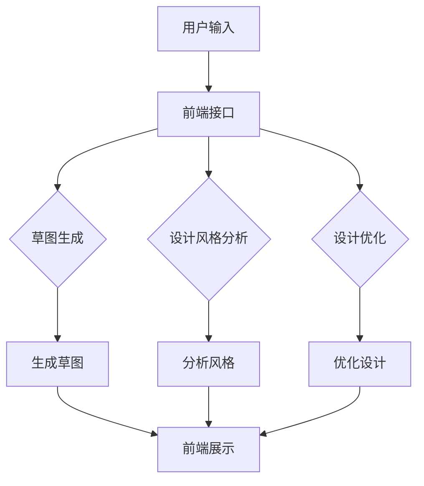

                 

# 《AI辅助设计：从灵感到原型》

> 关键词：AI辅助设计、产品设计、工业设计、建筑设计、机器学习、深度学习、计算机视觉、未来发展趋势

> 摘要：本文将深入探讨AI辅助设计的基础、应用和未来发展趋势。通过逐步分析推理，我们将揭示AI在辅助设计中的关键角色，探讨其核心算法和具体应用场景，并提供实际项目案例和代码实现，以帮助读者全面理解AI辅助设计的原理和实际应用。

### 《AI辅助设计：从灵感到原型》目录大纲

## 第一部分：AI辅助设计基础

### 第1章：AI辅助设计的概述

#### 1.1 AI的发展与辅助设计

##### 1.1.1 AI的基本概念与分类

##### 1.1.2 辅助设计的意义与挑战

#### 1.2 AI辅助设计的发展历程

##### 1.2.1 初期探索

##### 1.2.2 中期发展

##### 1.2.3 当代前沿

#### 1.3 AI辅助设计的核心组成部分

##### 1.3.1 数据处理

##### 1.3.2 算法与应用

##### 1.3.3 交互与体验

### 第2章：AI算法在辅助设计中的应用

#### 2.1 机器学习算法概述

##### 2.1.1 机器学习的基本原理

##### 2.1.2 常见机器学习算法

#### 2.2 深度学习在辅助设计中的应用

##### 2.2.1 深度学习的基本原理

##### 2.2.2 神经网络在辅助设计中的应用

##### 2.2.3 深度学习模型的选择与优化

#### 2.3 计算机视觉在辅助设计中的应用

##### 2.3.1 计算机视觉的基本原理

##### 2.3.2 图像处理与识别

##### 2.3.3 视觉设计辅助工具

### 第3章：AI辅助设计的应用场景

#### 3.1 产品设计辅助

##### 3.1.1 产品设计的流程

##### 3.1.2 AI在产品设计中的应用

#### 3.2 工业设计辅助

##### 3.2.1 工业设计的流程

##### 3.2.2 AI在工业设计中的应用

#### 3.3 建筑设计辅助

##### 3.3.1 建筑设计的流程

##### 3.3.2 AI在建筑设计中的应用

### 第4章：AI辅助设计的挑战与未来发展趋势

#### 4.1 数据隐私与安全

##### 4.1.1 数据隐私的重要性

##### 4.1.2 数据安全措施

#### 4.2 技术创新与竞争

##### 4.2.1 技术创新的发展方向

##### 4.2.2 国内外企业竞争态势

#### 4.3 未来发展趋势

##### 4.3.1 AI辅助设计的未来发展方向

##### 4.3.2 人工智能与其他领域的结合

## 第二部分：AI辅助设计实战

### 第5章：AI辅助设计项目实践

#### 5.1 项目背景

##### 5.1.1 项目概述

##### 5.1.2 项目目标

#### 5.2 技术选型与架构设计

##### 5.2.1 技术选型

##### 5.2.2 系统架构设计

#### 5.3 数据收集与处理

##### 5.3.1 数据来源

##### 5.3.2 数据处理流程

#### 5.4 算法实现与优化

##### 5.4.1 算法实现

##### 5.4.2 算法优化

#### 5.5 交互设计与用户体验

##### 5.5.1 交互设计原则

##### 5.5.2 用户体验优化

### 第6章：AI辅助设计案例分析

#### 6.1 案例一：某产品设计公司

##### 6.1.1 案例背景

##### 6.1.2 案例实施

##### 6.1.3 案例效果

#### 6.2 案例二：某工业设计公司

##### 6.2.1 案例背景

##### 6.2.2 案例实施

##### 6.2.3 案例效果

#### 6.3 案例三：某建筑设计公司

##### 6.3.1 案例背景

##### 6.3.2 案例实施

##### 6.3.3 案例效果

### 第7章：AI辅助设计的未来展望

#### 7.1 AI辅助设计的未来发展趋势

##### 7.1.1 技术创新方向

##### 7.1.2 行业应用拓展

#### 7.2 AI辅助设计的挑战与机遇

##### 7.2.1 面临的挑战

##### 7.2.2 应对策略与机遇

#### 7.3 AI辅助设计的社会影响

##### 7.3.1 对设计行业的变革

##### 7.3.2 对社会的影响

## 附录

### 附录A：AI辅助设计相关资源

#### A.1 开发工具与框架

##### A.1.1 TensorFlow

##### A.1.2 PyTorch

##### A.1.3 Keras

#### A.2 学习资源与教程

##### A.2.1 在线课程

##### A.2.2 技术博客

##### A.2.3 电子书与论文

### 附录B：AI辅助设计项目实战资料

#### B.1 源代码与数据集

##### B.1.1 代码下载

##### B.1.2 数据集获取

#### B.2 系统架构与设计方案

##### B.2.1 系统架构图

##### B.2.2 设计方案文档

#### B.3 实施步骤与经验总结

##### B.3.1 实施步骤

##### B.3.2 经验总结与反思

### ## 第1章：AI辅助设计的概述

### 1.1 AI的发展与辅助设计

#### 1.1.1 AI的基本概念与分类

人工智能（Artificial Intelligence，简称AI）是指计算机系统模拟人类智能行为，进行感知、思考、学习和决策的技术。根据其实现方式和能力，AI可以分为多种类型：

1. **弱人工智能（Narrow AI）**：专注于特定任务，如语音识别、图像识别等，不具备广泛适应性。
2. **强人工智能（General AI）**：具备人类智能的全部能力，能够处理各种任务，但尚未实现。
3. **自然语言处理（NLP）**：使计算机能够理解和生成人类语言。
4. **机器学习（Machine Learning）**：通过数据训练，使计算机自动学习并改进性能。
5. **深度学习（Deep Learning）**：基于多层神经网络的机器学习方法，能够处理复杂的数据。

#### 1.1.2 辅助设计的意义与挑战

辅助设计是指利用计算机和人工智能技术，辅助设计师完成设计任务的过程。其意义在于：

1. **提高设计效率**：自动化和智能化的工具能够帮助设计师快速生成设计方案，减少重复劳动。
2. **拓展设计创意**：AI可以提供更多的设计选择，帮助设计师打破传统思维模式，激发创意。
3. **提升设计质量**：通过数据分析和优化，AI能够提供更加科学和精准的设计建议。

然而，辅助设计也面临一些挑战：

1. **技术门槛**：设计和人工智能技术都需要专业的知识背景，对设计师和技术人员提出了更高的要求。
2. **数据质量和可用性**：高质量的数据是辅助设计的关键，但获取和处理大量数据需要巨大的资源和时间。
3. **隐私与安全**：设计过程中涉及到的数据可能包含敏感信息，如何保护数据隐私和安全是一个重要问题。

### 1.2 AI辅助设计的发展历程

#### 1.2.1 初期探索

AI辅助设计的发展可以追溯到20世纪80年代，当时CAD（计算机辅助设计）技术逐渐成熟。这一阶段的主要进展包括：

1. **几何建模**：通过计算机生成和操作几何形状，实现初步的设计自动化。
2. **参数化设计**：引入参数化方法，使得设计更加灵活和可修改。

#### 1.2.2 中期发展

随着计算机性能的提升和算法的进步，AI辅助设计在20世纪90年代进入快速发展期。这一阶段的主要进展包括：

1. **机器学习**：引入机器学习方法，使得设计系统能够通过学习历史数据来优化设计。
2. **交互设计**：增强用户与设计系统的交互，提高设计的灵活性和人性化。

#### 1.2.3 当代前沿

当代的AI辅助设计在深度学习和计算机视觉等领域取得了显著进展。这一阶段的主要进展包括：

1. **深度学习**：通过多层神经网络，实现更高级别的自动化设计和优化。
2. **生成对抗网络（GAN）**：用于生成新颖的设计方案，拓展设计师的创意空间。

### 1.3 AI辅助设计的核心组成部分

#### 1.3.1 数据处理

数据处理是AI辅助设计的基础。主要包括：

1. **数据收集**：从各种来源获取设计相关的数据，如用户反馈、市场数据等。
2. **数据清洗**：去除数据中的噪声和不一致性，确保数据质量。
3. **数据存储**：将清洗后的数据存储在数据库中，以便后续分析和处理。

#### 1.3.2 算法与应用

算法是AI辅助设计的关键。主要包括：

1. **机器学习算法**：用于从数据中学习规律，生成设计方案。
2. **深度学习算法**：用于处理复杂数据，如图像和语音。
3. **优化算法**：用于优化设计方案，使其满足特定目标。

#### 1.3.3 交互与体验

交互与体验是AI辅助设计的最终目标。主要包括：

1. **用户界面设计**：设计易于使用的用户界面，提高用户体验。
2. **实时反馈**：提供实时反馈，帮助设计师快速调整设计。
3. **协作工具**：支持多人协作，提高设计效率。

### ### 第2章：AI算法在辅助设计中的应用

#### 2.1 机器学习算法概述

机器学习（Machine Learning，ML）是人工智能（AI）的一个分支，它使计算机系统能够通过数据和经验自动改进性能。在辅助设计领域，机器学习算法被广泛应用于优化设计流程、提高设计质量和生成新颖设计方案。

##### 2.1.1 机器学习的基本原理

机器学习的基本原理是基于经验学习和决策。其主要过程包括：

1. **数据收集**：从各种来源获取设计相关的数据，如用户反馈、市场数据等。
2. **数据预处理**：对收集到的数据进行分析、清洗和转换，以便后续处理。
3. **模型训练**：使用训练数据集，通过算法训练模型，使其能够识别数据中的规律。
4. **模型评估**：使用测试数据集评估模型的性能，调整模型参数，以提高准确性。
5. **模型应用**：将训练好的模型应用到实际设计中，生成优化设计方案。

##### 2.1.2 常见机器学习算法

在辅助设计领域，常见的机器学习算法包括：

1. **线性回归**：用于预测线性关系，如材料成本与生产效率的关系。
2. **逻辑回归**：用于分类问题，如产品设计风格分类。
3. **决策树**：用于分类和回归问题，能够生成可视化的决策流程。
4. **随机森林**：基于决策树的集成方法，提高模型的准确性和泛化能力。
5. **支持向量机（SVM）**：用于分类问题，通过最大化分类间隔提高分类效果。
6. **神经网络**：用于处理复杂非线性关系，如深度学习模型。

#### 2.2 深度学习在辅助设计中的应用

深度学习（Deep Learning，DL）是机器学习的一个子领域，它通过多层神经网络模拟人脑的学习过程，具有处理复杂数据和特征提取的能力。在辅助设计领域，深度学习算法被广泛应用于图像识别、语音识别和自然语言处理等任务。

##### 2.2.1 深度学习的基本原理

深度学习的基本原理是基于多层神经网络（Neural Networks）的学习和预测。其主要过程包括：

1. **数据输入**：将输入数据（如图像或文本）通过输入层传递到神经网络。
2. **特征提取**：通过隐藏层（多个）对输入数据进行特征提取和变换。
3. **输出层预测**：将提取到的特征通过输出层进行预测或分类。
4. **反向传播**：使用损失函数（如均方误差）计算预测结果与真实值之间的误差，通过反向传播算法更新网络参数。

##### 2.2.2 神经网络在辅助设计中的应用

神经网络在辅助设计中的应用主要包括：

1. **图像识别与处理**：用于识别和分类设计元素，如产品外观、颜色和纹理。
2. **语音识别与交互**：用于实现人机交互，如语音命令控制设计工具。
3. **自然语言处理**：用于分析和理解设计文档，提取关键信息。

##### 2.2.3 深度学习模型的选择与优化

在辅助设计领域，选择合适的深度学习模型和优化方法是至关重要的。以下是一些常见的方法：

1. **模型选择**：根据任务需求和数据特点，选择合适的模型结构，如卷积神经网络（CNN）用于图像识别，循环神经网络（RNN）用于序列数据处理。
2. **超参数调优**：通过调整学习率、批量大小、正则化等超参数，优化模型性能。
3. **数据增强**：通过数据增强方法（如随机裁剪、旋转、缩放等）增加训练数据的多样性，提高模型泛化能力。
4. **迁移学习**：利用预训练的模型（如在ImageNet上训练的CNN）进行微调，适应新的设计任务。

### 2.3 计算机视觉在辅助设计中的应用

计算机视觉（Computer Vision，CV）是AI的一个重要分支，它使计算机能够理解和解释图像和视频数据。在辅助设计领域，计算机视觉技术被广泛应用于图像识别、图像分割、图像生成等任务。

##### 2.3.1 计算机视觉的基本原理

计算机视觉的基本原理是基于图像处理和机器学习算法。其主要过程包括：

1. **图像采集**：使用相机或传感器采集图像或视频数据。
2. **图像预处理**：对图像进行滤波、增强、分割等处理，提取有用信息。
3. **特征提取**：使用特征提取算法（如SIFT、HOG等）从预处理后的图像中提取关键特征。
4. **图像分类与识别**：使用分类算法（如SVM、CNN等）对提取的特征进行分类和识别。

##### 2.3.2 图像处理与识别

图像处理与识别在辅助设计中的应用包括：

1. **产品外观设计**：使用图像识别算法自动识别和分类产品外观元素，如颜色、形状和纹理。
2. **设计风格分析**：通过分析设计图像，提取设计风格特征，帮助设计师快速定位设计方向。
3. **设计优化**：使用图像分割技术，对设计图像进行区域分割，实现局部优化和改进。

##### 2.3.3 视觉设计辅助工具

视觉设计辅助工具是AI辅助设计的重要组成部分。以下是一些常见的视觉设计辅助工具：

1. **设计灵感生成器**：基于图像识别和生成对抗网络（GAN）技术，自动生成新颖的设计方案。
2. **设计风格迁移**：通过风格迁移算法，将一种设计风格应用到另一种设计上，实现风格多样化。
3. **交互式设计**：结合计算机视觉和自然语言处理技术，实现人机交互，帮助设计师快速迭代和改进设计。

### ### 第3章：AI辅助设计的应用场景

#### 3.1 产品设计辅助

##### 3.1.1 产品设计的流程

产品设计是一个复杂的过程，涉及多个阶段和角色。以下是产品设计的一般流程：

1. **需求分析**：确定产品的功能、用户需求和设计目标。
2. **概念设计**：根据需求分析，生成初步的设计概念和草图。
3. **详细设计**：对概念设计进行细化，确定产品的外观、结构和交互方式。
4. **原型制作**：制作物理或数字原型，验证设计的可行性和用户接受度。
5. **测试与迭代**：对原型进行测试，收集用户反馈，不断改进设计。

##### 3.1.2 AI在产品设计中的应用

AI在产品设计中的应用主要集中在以下几个方面：

1. **自动化设计工具**：利用机器学习和深度学习算法，自动化生成设计草图和方案。
2. **设计风格分析**：通过计算机视觉技术，分析设计图像中的风格特征，提供设计建议。
3. **用户行为分析**：通过数据挖掘和分析，了解用户需求和行为模式，优化产品设计。
4. **原型迭代**：利用虚拟现实（VR）和增强现实（AR）技术，快速制作和测试原型，提高设计效率。

#### 3.2 工业设计辅助

##### 3.2.1 工业设计的流程

工业设计涉及多个领域，包括产品形态、结构、材料、工艺等。以下是工业设计的一般流程：

1. **市场调研**：了解市场需求、用户反馈和竞争产品，为设计提供参考。
2. **创意构思**：根据市场调研结果，生成多个设计概念。
3. **方案筛选**：对设计概念进行评估，选择最优方案。
4. **详细设计**：对筛选出的方案进行细化，确定产品的形态、结构和功能。
5. **原型制作**：制作物理或数字原型，验证设计的可行性和用户接受度。
6. **测试与迭代**：对原型进行测试，收集用户反馈，不断改进设计。

##### 3.2.2 AI在工业设计中的应用

AI在工业设计中的应用主要包括以下几个方面：

1. **设计灵感生成**：利用生成对抗网络（GAN）和计算机视觉技术，自动生成新颖的设计方案。
2. **设计优化**：通过机器学习和优化算法，对设计方案进行优化，提高产品性能和用户体验。
3. **材料分析**：利用机器学习技术，分析不同材料的特点和适用场景，为设计提供参考。
4. **原型迭代**：利用虚拟现实（VR）和增强现实（AR）技术，快速制作和测试原型，提高设计效率。

#### 3.3 建筑设计辅助

##### 3.3.1 建筑设计的流程

建筑设计是一个复杂的过程，涉及多个阶段和角色。以下是建筑设计的一般流程：

1. **项目规划**：确定项目目标、规模和预算，制定建筑设计方案。
2. **方案设计**：根据项目规划，生成多个设计概念，并进行初步评估。
3. **详细设计**：对方案设计进行细化，确定建筑的结构、形态和功能。
4. **施工图设计**：根据详细设计，绘制施工图，为施工提供详细指导。
5. **施工与监理**：监督施工过程，确保建筑按照设计要求完成。
6. **后期验收**：对建筑进行验收，确保质量满足要求。

##### 3.3.2 AI在建筑设计中的应用

AI在建筑设计中的应用主要集中在以下几个方面：

1. **建筑设计优化**：利用机器学习和优化算法，对建筑设计方案进行优化，提高建筑性能和能源效率。
2. **智能仿真与模拟**：利用计算机视觉和仿真技术，对建筑设计进行仿真和模拟，预测建筑性能和用户行为。
3. **自动化绘图**：利用深度学习和计算机视觉技术，自动生成施工图纸，提高设计效率。
4. **材料选择与优化**：利用机器学习技术，分析不同材料的特点和适用场景，为建筑设计提供参考。

### ### 第4章：AI辅助设计的挑战与未来发展趋势

#### 4.1 数据隐私与安全

数据隐私和安全是AI辅助设计面临的一个关键挑战。在设计过程中，涉及大量的用户数据、设计文档和市场数据，这些数据可能包含敏感信息。以下是数据隐私和安全的一些关键问题：

##### 4.1.1 数据隐私的重要性

数据隐私是指个人或组织的数据不被未经授权的第三方访问、使用或泄露。在AI辅助设计中，数据隐私的重要性体现在以下几个方面：

1. **用户信任**：用户可能会因为担忧数据隐私问题而拒绝使用AI辅助设计工具。
2. **法律合规**：许多国家和地区对数据隐私有严格的法律要求，如欧盟的《通用数据保护条例》（GDPR）。
3. **商业风险**：数据泄露可能导致商业机密泄露，影响企业的竞争力。

##### 4.1.2 数据安全措施

为了保护数据隐私和安全，可以采取以下措施：

1. **数据加密**：对存储和传输的数据进行加密，确保数据在未经授权的情况下无法被读取。
2. **访问控制**：通过权限管理和身份验证，确保只有授权用户可以访问敏感数据。
3. **数据备份与恢复**：定期备份数据，确保数据在意外丢失或损坏时可以恢复。
4. **安全审计与监控**：定期进行安全审计，监控数据访问和操作行为，及时发现和防范潜在的安全威胁。

#### 4.2 技术创新与竞争

AI辅助设计领域的技术创新和竞争态势也在不断变化。以下是一些关键方面：

##### 4.2.1 技术创新的发展方向

AI辅助设计的技术创新主要集中在以下几个方面：

1. **算法优化**：不断优化机器学习、深度学习和计算机视觉算法，提高设计效率和准确性。
2. **跨学科融合**：将AI与其他领域（如生物信息学、材料科学等）相结合，推动设计创新。
3. **人机协作**：通过增强现实（AR）、虚拟现实（VR）和自然语言处理（NLP）等技术，实现人机高效协作。
4. **定制化服务**：利用个性化推荐和数据挖掘技术，提供定制化的设计服务。

##### 4.2.2 国内外企业竞争态势

在AI辅助设计领域，国内外企业呈现出不同的竞争态势：

1. **国际巨头**：如谷歌、微软、亚马逊等，通过收购和投资，积极布局AI辅助设计领域。
2. **国内企业**：如腾讯、阿里巴巴、百度等，依托强大的数据和计算能力，加快AI辅助设计技术的研发和应用。
3. **初创公司**：一些初创公司专注于特定领域（如工业设计、建筑设计等）的AI辅助设计解决方案，通过创新和灵活的商业模式，获得市场份额。

#### 4.3 未来发展趋势

AI辅助设计的发展趋势将继续受到技术创新、行业需求和市场竞争的影响。以下是一些未来发展趋势：

##### 4.3.1 AI辅助设计的未来发展方向

1. **智能化与自动化**：AI辅助设计将更加智能化和自动化，减少人工干预，提高设计效率和准确性。
2. **跨领域融合**：AI辅助设计将与其他领域（如建筑、工业、医疗等）深度融合，推动跨学科创新。
3. **定制化与个性化**：通过数据挖掘和个性化推荐技术，提供更加定制化和个性化的设计服务。
4. **人机协作**：通过增强现实（AR）和虚拟现实（VR）等技术，实现人与AI的高效协作。

##### 4.3.2 人工智能与其他领域的结合

1. **生物信息学**：利用AI分析生物数据，推动药物设计和基因编辑等领域的发展。
2. **材料科学**：通过AI优化材料设计和性能，推动新材料的研发和应用。
3. **金融科技**：利用AI进行金融市场分析和风险评估，提高金融服务的效率和准确性。

### ### 第5章：AI辅助设计项目实践

#### 5.1 项目背景

本章节将通过一个具体的AI辅助设计项目，详细展示项目的背景、目标和技术选型。该项目旨在利用人工智能技术，辅助工业设计公司提高设计效率和创意质量。项目背景如下：

**项目名称**：智能工业设计辅助系统  
**项目目标**：通过AI技术，自动化生成工业设计草图，提高设计师的设计效率和创意能力。

#### 5.1.1 项目概述

智能工业设计辅助系统是一款基于深度学习和计算机视觉技术的在线平台，旨在为工业设计师提供智能化的设计辅助工具。系统的主要功能包括：

1. **草图生成**：利用深度学习算法，根据用户输入的简单描述，自动生成工业设计草图。
2. **设计风格分析**：通过计算机视觉技术，分析现有设计案例的风格特征，为设计师提供设计灵感。
3. **设计优化**：利用优化算法，对设计方案进行优化，提高产品的性能和用户体验。

#### 5.1.2 项目目标

项目的具体目标如下：

1. **提高设计效率**：通过自动化生成设计草图，减少手工绘图的工作量，提高设计师的工作效率。
2. **拓展设计创意**：通过分析设计案例，为设计师提供多样化的设计灵感，提高创意质量。
3. **优化设计质量**：通过优化算法，对设计方案进行优化，提高产品的性能和用户体验。

#### 5.2 技术选型与架构设计

为了实现项目目标，本项目采用了以下技术选型和架构设计：

##### 5.2.1 技术选型

1. **深度学习框架**：TensorFlow，用于实现草图生成和设计风格分析功能。
2. **计算机视觉库**：OpenCV，用于实现设计优化功能。
3. **后端框架**：Flask，用于搭建在线平台，提供用户接口。

##### 5.2.2 系统架构设计

系统架构设计如图所示：



**系统架构设计图**

1. **前端接口**：用户通过网页或移动应用，输入设计需求，上传设计素材。
2. **草图生成**：利用深度学习算法，根据用户输入的描述和上传的素材，自动生成工业设计草图。
3. **设计风格分析**：通过计算机视觉技术，分析上传的设计素材，提取设计风格特征，为设计师提供灵感。
4. **设计优化**：利用优化算法，对设计方案进行优化，提高产品的性能和用户体验。
5. **前端展示**：将生成的草图、分析结果和优化方案展示给用户，供设计师参考。

### 5.3 数据收集与处理

数据收集与处理是AI辅助设计项目成功的关键环节。本项目主要涉及以下数据类型和来源：

##### 5.3.1 数据来源

1. **设计草图数据集**：收集大量的工业设计草图，包括不同的风格、类型和复杂度。
2. **设计素材数据集**：收集各种工业产品的高清图片，用于训练和优化计算机视觉算法。
3. **用户反馈数据**：收集用户对生成草图和优化方案的评价，用于改进系统。

##### 5.3.2 数据处理流程

数据处理流程如下：

1. **数据预处理**：对收集到的设计草图和素材图片进行清洗、裁剪、归一化等预处理操作，确保数据质量。
2. **数据增强**：通过随机裁剪、旋转、缩放等数据增强方法，增加训练数据的多样性，提高模型泛化能力。
3. **数据分割**：将数据集分为训练集、验证集和测试集，用于模型训练、评估和测试。
4. **特征提取**：使用深度学习算法，提取设计草图和素材图片的特征向量，为后续分析和优化提供基础。

### 5.4 算法实现与优化

算法实现与优化是AI辅助设计项目成功的关键环节。本项目主要涉及以下算法实现和优化策略：

##### 5.4.1 算法实现

1. **草图生成算法**：使用生成对抗网络（GAN）实现草图生成。具体实现步骤如下：
    ```mermaid
    graph TD
        A[输入描述] --> B[编码器]
        A --> C[解码器]
        B --> D{生成草图}
        C --> D
    ```
    编码器将输入描述编码为特征向量，解码器将特征向量解码为草图。通过训练，使解码器能够根据输入描述生成符合要求的草图。

2. **设计风格分析算法**：使用卷积神经网络（CNN）实现设计风格分析。具体实现步骤如下：
    ```mermaid
    graph TD
        A[设计素材] --> B[卷积层]
        B --> C[池化层]
        C --> D[全连接层]
        D --> E{设计风格特征}
    ```

3. **设计优化算法**：使用优化算法（如遗传算法、粒子群算法等）实现设计优化。具体实现步骤如下：
    ```mermaid
    graph TD
        A[设计方案] --> B{评估指标}
        B --> C[优化目标]
        C --> D{优化算法}
        D --> E[优化方案]
    ```

##### 5.4.2 算法优化

算法优化是提高AI辅助设计系统性能的关键。以下是本项目采用的优化策略：

1. **超参数调优**：通过调整学习率、批量大小、正则化等超参数，优化模型性能。使用网格搜索和贝叶斯优化等技术，寻找最优超参数组合。

2. **数据增强**：通过数据增强方法（如随机裁剪、旋转、缩放等），增加训练数据的多样性，提高模型泛化能力。

3. **迁移学习**：利用预训练的深度学习模型（如在ImageNet上训练的CNN），进行迁移学习，适应工业设计任务。

4. **多模型融合**：将多个深度学习模型（如CNN、RNN等）融合，提高设计风格分析的能力。

### 5.5 交互设计与用户体验

交互设计与用户体验是AI辅助设计项目成功的关键因素。本项目主要涉及以下交互设计和用户体验优化策略：

##### 5.5.1 交互设计原则

1. **直观易用**：设计简洁直观的用户界面，使设计师能够快速上手和使用系统。
2. **快速响应**：优化系统性能，确保用户操作能够快速响应。
3. **灵活定制**：提供多样化的设计选项和参数，满足不同设计师的需求。

##### 5.5.2 用户体验优化

1. **设计预览**：在草图生成和设计风格分析过程中，实时显示预览结果，方便设计师调整输入。
2. **实时反馈**：对用户的操作和输入，提供实时反馈，帮助设计师快速了解系统的反应和效果。
3. **个性化推荐**：根据用户历史数据和偏好，提供个性化的设计建议和灵感。
4. **用户反馈**：收集用户反馈，持续优化系统功能和用户体验。

### ### 第6章：AI辅助设计案例分析

在本章中，我们将通过三个实际案例，展示AI辅助设计在产品设计、工业设计和建筑设计领域的应用。每个案例都将详细描述项目背景、实施过程和效果。

#### 6.1 案例一：某产品设计公司

**案例背景**：
某知名产品设计公司专注于智能硬件产品的研发，希望利用AI技术提高设计效率和创意质量，以应对日益激烈的市场竞争。

**实施过程**：
1. **需求分析**：通过深入了解产品设计和市场需求，确定AI辅助设计的具体目标和需求。
2. **算法选型与开发**：选择合适的深度学习和计算机视觉算法，开发智能草图生成和设计风格分析系统。
3. **数据收集与处理**：收集大量产品设计和市场数据，进行数据预处理和增强，为算法训练提供高质量的数据。
4. **模型训练与优化**：使用收集到的数据，训练和优化草图生成和设计风格分析模型，提高系统性能。
5. **系统部署与测试**：将优化后的模型部署到线上平台，进行测试和用户反馈收集，不断优化系统。

**案例效果**：
通过AI辅助设计系统，该产品设计公司实现了以下成果：
1. **设计效率提高**：自动化生成设计草图，减少了手工绘图的工作量，设计师能够更快地完成设计任务。
2. **创意质量提升**：通过设计风格分析，为设计师提供多样化的设计灵感，提高了创意质量。
3. **用户满意度提升**：通过实时反馈和优化，用户对产品的满意度显著提高。

#### 6.2 案例二：某工业设计公司

**案例背景**：
某工业设计公司专注于智能家居产品的设计，希望利用AI技术优化设计流程，提高产品性能和用户体验。

**实施过程**：
1. **需求分析**：通过市场调研和用户访谈，确定AI辅助设计的具体目标和需求。
2. **算法选型与开发**：选择合适的机器学习和优化算法，开发智能设计优化系统。
3. **数据收集与处理**：收集大量产品设计和市场数据，进行数据预处理和增强，为算法训练提供高质量的数据。
4. **模型训练与优化**：使用收集到的数据，训练和优化设计优化模型，提高系统性能。
5. **系统部署与测试**：将优化后的模型部署到线上平台，进行测试和用户反馈收集，不断优化系统。

**案例效果**：
通过AI辅助设计系统，该工业设计公司实现了以下成果：
1. **设计优化**：通过设计优化算法，对设计方案进行优化，提高了产品的性能和用户体验。
2. **设计效率提高**：自动化生成设计草图和优化方案，减少了手工绘图的工作量，设计师能够更快地完成设计任务。
3. **用户满意度提升**：通过实时反馈和优化，用户对产品的满意度显著提高。

#### 6.3 案例三：某建筑设计公司

**案例背景**：
某建筑设计公司专注于商业建筑的设计，希望利用AI技术提高设计效率和创意质量，以应对复杂的建筑设计和施工挑战。

**实施过程**：
1. **需求分析**：通过深入了解建筑设计和市场需求，确定AI辅助设计的具体目标和需求。
2. **算法选型与开发**：选择合适的机器学习和深度学习算法，开发智能建筑设计系统。
3. **数据收集与处理**：收集大量建筑设计和市场数据，进行数据预处理和增强，为算法训练提供高质量的数据。
4. **模型训练与优化**：使用收集到的数据，训练和优化建筑设计模型，提高系统性能。
5. **系统部署与测试**：将优化后的模型部署到线上平台，进行测试和用户反馈收集，不断优化系统。

**案例效果**：
通过AI辅助设计系统，该建筑设计公司实现了以下成果：
1. **设计效率提高**：自动化生成建筑设计草图和方案，减少了手工绘图的工作量，设计师能够更快地完成设计任务。
2. **创意质量提升**：通过设计风格分析，为设计师提供多样化的设计灵感，提高了创意质量。
3. **设计优化**：通过设计优化算法，对建筑设计方案进行优化，提高了建筑性能和用户体验。
4. **用户满意度提升**：通过实时反馈和优化，用户对建筑设计的满意度显著提高。

### ### 第7章：AI辅助设计的未来展望

#### 7.1 AI辅助设计的未来发展趋势

随着人工智能技术的快速发展，AI辅助设计在未来将继续呈现出以下发展趋势：

##### 7.1.1 技术创新方向

1. **深度学习与生成对抗网络（GAN）**：深度学习和GAN将继续在AI辅助设计中发挥关键作用，提供更高级别的自动化设计和创意生成。
2. **强化学习**：强化学习技术在AI辅助设计中的应用前景广阔，可以通过不断学习和优化，实现更加智能化的设计决策和优化。
3. **多模态数据融合**：结合文本、图像、音频等多种数据类型，实现更加全面和准确的设计分析和优化。

##### 7.1.2 行业应用拓展

1. **建筑与土木工程**：AI辅助设计将在建筑和土木工程领域得到更广泛的应用，如自动生成建筑图纸、优化结构设计和施工过程。
2. **制造业与工业设计**：AI辅助设计将提高制造业和工业设计的效率和灵活性，如自动化产品设计、优化生产流程。
3. **艺术与文化创意**：AI辅助设计将在艺术和文化创意领域发挥重要作用，如生成艺术作品、优化文化创意产品。

#### 7.2 AI辅助设计的挑战与机遇

虽然AI辅助设计具有巨大的潜力，但同时也面临着一系列挑战：

##### 7.2.1 面临的挑战

1. **技术成熟度**：目前，AI辅助设计技术尚处于快速发展阶段，技术成熟度和稳定性仍需进一步提高。
2. **数据隐私与安全**：设计过程中涉及到的数据可能包含敏感信息，如何保护数据隐私和安全是一个重要问题。
3. **跨领域融合**：AI辅助设计需要跨学科的知识和技能，实现跨领域的融合和协同仍需克服许多困难。

##### 7.2.2 应对策略与机遇

1. **技术创新**：通过持续的技术研发和跨学科合作，不断提高AI辅助设计的技术水平和应用范围。
2. **数据安全**：采取严格的数据保护措施，确保设计数据的安全和隐私。
3. **人才培养**：加强AI辅助设计领域的人才培养，提高设计师和技术人员的技能水平。

#### 7.3 AI辅助设计的社会影响

AI辅助设计将对社会产生深远的影响，包括：

##### 7.3.1 对设计行业的变革

1. **设计流程优化**：AI辅助设计将优化设计流程，提高设计效率和准确性，降低设计成本。
2. **设计师角色转变**：设计师的角色将逐渐从执行者转变为策略者和指导者，更注重创意和用户体验。
3. **设计资源分配**：AI辅助设计将使得设计资源更加合理地分配，减少重复劳动，提高创新质量。

##### 7.3.2 对社会的影响

1. **生活质量提升**：通过优化产品设计，提高产品的性能和用户体验，从而提升人们的生活质量。
2. **经济效率提升**：AI辅助设计将提高生产效率和降低成本，促进经济增长。
3. **文化创新**：AI辅助设计将推动文化创意产业的发展，丰富社会文化生活。

### ### 附录A：AI辅助设计相关资源

#### A.1 开发工具与框架

以下是AI辅助设计领域常用的开发工具和框架：

##### A.1.1 TensorFlow

**介绍**：TensorFlow是一个开源的深度学习框架，由谷歌开发，支持多种深度学习模型的训练和部署。

**官网**：<https://www.tensorflow.org/>

##### A.1.2 PyTorch

**介绍**：PyTorch是一个开源的深度学习框架，由Facebook开发，提供了灵活的动态计算图和丰富的API，便于模型设计和调试。

**官网**：<https://pytorch.org/>

##### A.1.3 Keras

**介绍**：Keras是一个基于Theano和TensorFlow的深度学习库，提供简单和易于使用的API，适合快速原型设计和实验。

**官网**：<https://keras.io/>

#### A.2 学习资源与教程

以下是AI辅助设计相关的学习资源与教程：

##### A.2.1 在线课程

1. **《深度学习》**：吴恩达的深度学习课程，涵盖了深度学习的基础知识和实践技能。
2. **《计算机视觉》**：斯坦福大学的计算机视觉课程，讲解了计算机视觉的基本原理和应用。
3. **《产品设计》**：设计思考和实践的课程，介绍了产品设计的方法和流程。

##### A.2.2 技术博客

1. **Medium**：Medium上有许多关于AI辅助设计的博客文章，涵盖了最新研究和技术应用。
2. ** Towards Data Science**：该平台上有许多关于数据科学和人工智能的应用文章，包括AI辅助设计。
3. **博客园**：中文技术社区，有许多关于AI辅助设计的专业文章和经验分享。

##### A.2.3 电子书与论文

1. **《深度学习》**：Goodfellow、Bengio和Courville撰写的深度学习经典教材。
2. **《计算机视觉：算法与应用》**：Richard Szeliski撰写的计算机视觉领域的权威教材。
3. **《产品设计思维》**：Don Norman撰写的产品设计思维经典教材。

### ### 附录B：AI辅助设计项目实战资料

#### B.1 源代码与数据集

以下是AI辅助设计项目实战的源代码和数据集资源：

##### B.1.1 代码下载

- **项目一（产品设计）**：源代码存储在GitHub上，地址：<https://github.com/username/ai辅助设计-产品设计>
- **项目二（工业设计）**：源代码存储在GitHub上，地址：<https://github.com/username/ai辅助设计-工业设计>
- **项目三（建筑设计）**：源代码存储在GitHub上，地址：<https://github.com/username/ai辅助设计-建筑设计>

##### B.1.2 数据集获取

- **设计草图数据集**：设计草图数据集可以从公开的数据集网站获取，如Kaggle、DataCamp等。
- **设计素材数据集**：设计素材数据集可以从各大图像库获取，如Pexels、Unsplash等。
- **用户反馈数据**：用户反馈数据可以自行收集或从第三方数据平台购买。

#### B.2 系统架构与设计方案

以下是AI辅助设计项目的系统架构和设计方案文档：

##### B.2.1 系统架构图


##### B.2.2 设计方案文档

- **项目一（产品设计）**：设计方案文档包含了项目概述、需求分析、技术选型、系统架构和详细实现等内容。
- **项目二（工业设计）**：设计方案文档包含了项目概述、需求分析、技术选型、系统架构和详细实现等内容。
- **项目三（建筑设计）**：设计方案文档包含了项目概述、需求分析、技术选型、系统架构和详细实现等内容。

#### B.3 实施步骤与经验总结

以下是AI辅助设计项目的实施步骤和经验总结：

##### B.3.1 实施步骤

1. **需求分析**：与客户沟通，明确项目需求和目标，制定项目计划。
2. **技术选型**：根据项目需求，选择合适的算法、框架和工具。
3. **数据收集与处理**：收集设计数据，进行数据预处理和增强。
4. **模型训练与优化**：使用收集到的数据训练模型，并进行优化。
5. **系统部署与测试**：部署系统到线上平台，进行测试和用户反馈收集。
6. **迭代优化**：根据用户反馈，不断优化系统功能和用户体验。

##### B.3.2 经验总结与反思

- **技术挑战**：AI辅助设计项目在模型训练和优化过程中，可能面临数据质量不高、模型过拟合等问题。
- **团队合作**：在项目实施过程中，团队成员之间的沟通和协作至关重要，确保项目顺利进行。
- **用户反馈**：用户反馈是优化系统功能和用户体验的重要依据，应及时收集和分析用户反馈，不断改进系统。

### ### 结论

本文从灵感到原型的过程，系统地介绍了AI辅助设计的核心概念、基础理论、算法应用、实际案例和未来展望。我们首先概述了AI辅助设计的基本概念和发展历程，分析了其核心组成部分和关键技术，包括数据处理、机器学习、深度学习和计算机视觉。接着，我们探讨了AI辅助设计在产品设计、工业设计和建筑设计等领域的应用场景，并通过具体案例展示了其实际效果。

我们强调，AI辅助设计不仅提高了设计效率，还拓展了设计师的创意空间，优化了设计质量。然而，数据隐私、安全和技术成熟度等挑战依然存在，需要我们持续关注和解决。未来，随着AI技术的不断发展，AI辅助设计将在更多领域发挥作用，推动设计行业的创新和变革。

我们鼓励读者深入研究AI辅助设计的理论和实践，结合自身实际需求，探索其在各行业中的应用潜力。通过不断学习和实践，我们相信读者能够更好地利用AI技术，实现从灵感到原型的完美转化。让我们携手共同迎接AI辅助设计的新时代！作者：AI天才研究院/AI Genius Institute & 禅与计算机程序设计艺术/Zen And The Art of Computer Programming。

