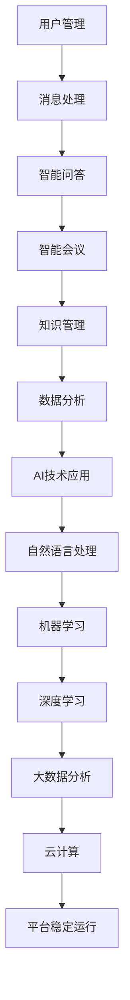

                 

# 《AI驱动的企业内部沟通平台优化》

## 关键词
- 企业内部沟通
- AI技术
- 自然语言处理
- 对话系统
- 聊天机器人
- 平台优化

> 摘要：本文旨在探讨如何利用人工智能技术优化企业内部沟通平台，提高沟通效率和质量。首先，我们分析了当前企业内部沟通的现状和面临的挑战，接着介绍了AI驱动的企业内部沟通平台的基本架构和核心功能模块。然后，我们详细讲解了自然语言处理、对话系统和AI驱动的沟通平台实现的核心技术与算法，并通过实际案例展示了优化过程和效果。最后，我们展望了AI驱动企业内部沟通平台的未来发展趋势，并提出了最佳实践和挑战解决方案。

## 目录大纲

### 第一部分：背景与概述

#### 第1章：企业内部沟通现状及挑战
- **1.1 企业内部沟通的重要性**
- **1.2 企业内部沟通的常见问题**
- **1.3 AI技术在企业内部沟通中的应用前景**

#### 第2章：AI驱动的企业内部沟通平台架构
- **2.1 AI驱动的企业内部沟通平台概念**
- **2.2 平台的核心功能模块**
- **2.3 AI技术在平台架构中的应用**
- **2.4 Mermaid流程图：AI驱动的企业内部沟通平台架构**

### 第二部分：核心技术与算法

#### 第3章：自然语言处理基础
- **3.1 NLP基本概念**
- **3.2 词嵌入与向量空间模型**
- **3.3 常见的NLP算法**
- **3.4 伪代码：NLP算法实现**

#### 第4章：对话系统与聊天机器人
- **4.1 对话系统概述**
- **4.2 聊天机器人的发展历程**
- **4.3 基于深度学习的对话系统**
- **4.4 伪代码：对话系统算法实现**

#### 第5章：AI驱动的沟通平台实现
- **5.1 数据收集与预处理**
- **5.2 模型选择与训练**
- **5.3 模型评估与优化**
- **5.4 代码实际案例：AI驱动的沟通平台搭建**

### 第三部分：应用与实践

#### 第6章：AI驱动的企业内部沟通优化案例
- **6.1 案例背景**
- **6.2 案例目标**
- **6.3 案例实施步骤**
- **6.4 案例效果评估**

#### 第7章：AI驱动的企业内部沟通平台最佳实践
- **7.1 设计原则**
- **7.2 实施策略**
- **7.3 运维与优化**

### 第四部分：展望与未来

#### 第8章：AI驱动企业内部沟通平台的未来发展趋势
- **8.1 技术趋势分析**
- **8.2 行业应用前景**
- **8.3 面临的挑战与解决方案**

### 附录

#### 附录A：相关工具与技术资源
- **A.1 开发环境搭建**
- **A.2 代码实现示例**
- **A.3 学习资源推荐**

---

### 第一部分：背景与概述

#### 第1章：企业内部沟通现状及挑战

> **1.1 企业内部沟通的重要性**

企业内部沟通是现代企业管理的重要组成部分。高效的内部沟通能够促进信息的流动，增强团队协作，提升决策质量，从而对企业的运营和发展产生深远的影响。以下是一些关键点：

1. **信息传递**：内部沟通是企业内部信息传递的重要渠道，确保了各个部门和员工之间的信息畅通。
2. **团队协作**：通过沟通，团队成员能够明确各自的任务和职责，协同完成项目目标。
3. **知识共享**：内部沟通有助于知识和经验的分享，提升整个团队的专业素养和创新能力。
4. **决策支持**：有效的沟通为管理层提供了决策所需的信息，提高了决策的准确性和及时性。

> **1.2 企业内部沟通的常见问题**

尽管企业内部沟通的重要性不言而喻，但现实中仍存在许多挑战：

1. **沟通障碍**：语言、文化、地域等因素可能导致沟通不畅。
2. **信息过载**：邮件、会议等传统的沟通方式可能导致信息过载，员工难以筛选和处理重要信息。
3. **沟通效率低**：传统的沟通方式往往效率低下，无法满足快速响应和决策的需求。
4. **知识分散**：知识在员工之间分散，难以系统地整理和利用。

> **1.3 AI技术在企业内部沟通中的应用前景**

随着人工智能技术的快速发展，AI为企业内部沟通带来了新的机遇和解决方案：

1. **自然语言处理（NLP）**：通过NLP技术，企业可以处理和分析大量的文本数据，实现自动化信息提取和知识管理。
2. **对话系统与聊天机器人**：AI驱动的聊天机器人可以实时响应员工的问题，提高沟通效率。
3. **智能会议系统**：AI可以自动记录和总结会议内容，提供实时分析和建议。
4. **个性化推荐**：基于员工的沟通行为和偏好，AI可以提供个性化的信息推荐，提升沟通体验。

AI技术的应用不仅能够解决传统沟通方式中的问题，还能为企业创造新的价值，提升整体运营效率。

---

### 第一部分：背景与概述

#### 第2章：AI驱动的企业内部沟通平台架构

> **2.1 AI驱动的企业内部沟通平台概念**

AI驱动的企业内部沟通平台是一种利用人工智能技术优化和提升企业内部沟通效率的系统。该平台通过集成自然语言处理、对话系统、智能推荐等功能，实现自动化、智能化和个性化的沟通体验。以下是其核心概念：

1. **自然语言处理（NLP）**：用于处理和解析自然语言文本，实现文本分类、情感分析、实体识别等功能。
2. **对话系统**：通过模拟人类对话交互方式，实现人机交互，提供实时响应和问题解答。
3. **智能推荐**：基于用户行为和偏好，提供个性化的信息推荐，帮助员工高效获取所需信息。
4. **知识管理**：整合企业内外部的知识资源，提供便捷的知识查询和共享功能。

> **2.2 平台的核心功能模块**

AI驱动的企业内部沟通平台通常包含以下几个核心功能模块：

1. **用户管理**：实现员工的身份认证、权限管理等功能，确保沟通的安全性。
2. **消息处理**：提供即时通讯、邮件管理、通知推送等功能，确保信息的及时传递。
3. **智能问答**：集成聊天机器人，实时解答员工的问题，提供知识库查询功能。
4. **智能会议**：自动记录会议内容，生成会议纪要，并提供会议分析和建议。
5. **知识管理**：整合企业内部的知识资源，提供便捷的查询和共享功能。
6. **数据分析**：对用户行为和沟通数据进行收集和分析，提供数据可视化报表，帮助管理层做出科学决策。

> **2.3 AI技术在平台架构中的应用**

在AI驱动的企业内部沟通平台中，AI技术贯穿于整个架构，实现平台的智能化和自动化。以下是一些关键应用：

1. **自然语言处理（NLP）**：用于文本处理、情感分析、意图识别等，确保沟通的准确性和效率。
2. **机器学习**：用于模型训练和预测，提高对话系统的智能程度。
3. **深度学习**：用于图像识别、语音识别等，提供丰富的交互方式。
4. **大数据分析**：用于数据收集、存储和处理，提供数据驱动的决策支持。
5. **云计算**：提供弹性的计算和存储资源，确保平台的稳定运行。

> **2.4 Mermaid流程图：AI驱动的企业内部沟通平台架构**



通过Mermaid流程图，我们可以清晰地看到AI驱动的企业内部沟通平台的架构和各模块之间的关系。该平台通过整合多种AI技术，实现了从用户管理到数据分析的全面智能化，为企业内部沟通提供了强大的支持。

---

### 第二部分：核心技术与算法

#### 第3章：自然语言处理基础

> **3.1 NLP基本概念**

自然语言处理（NLP）是人工智能领域的一个重要分支，旨在使计算机能够理解和处理自然语言。以下是一些关键概念：

1. **语言模型**：用于预测下一个单词或字符的概率分布，是NLP的基础。
2. **分词**：将连续的文本分割成有意义的单词或短语。
3. **词嵌入**：将单词映射到高维向量空间，用于表示单词的语义信息。
4. **实体识别**：识别文本中的特定实体，如人名、地名、组织名等。
5. **情感分析**：分析文本的情感倾向，如正面、负面或中性。
6. **机器翻译**：将一种自然语言文本翻译成另一种自然语言。

> **3.2 词嵌入与向量空间模型**

词嵌入是将单词映射到高维向量空间的过程，使计算机能够通过向量运算来处理文本数据。常见的词嵌入模型包括：

1. **Word2Vec**：基于神经网络的词嵌入模型，通过训练得到词向量。
2. **GloVe**：全局向量表示模型，通过矩阵分解得到词向量。
3. **BERT**：双向编码器表示模型，通过预训练得到上下文敏感的词向量。

在词嵌入的基础上，我们可以构建向量空间模型，用于文本相似性计算、聚类和分析。

> **3.3 常见的NLP算法**

以下是一些常见的NLP算法：

1. **文本分类**：将文本分配到预定义的类别中，常见算法有朴素贝叶斯、支持向量机（SVM）和深度神经网络。
2. **情感分析**：分析文本的情感倾向，常用算法有朴素贝叶斯、支持向量机和深度神经网络。
3. **命名实体识别**：识别文本中的特定实体，如人名、地名、组织名等，常用算法有条件随机场（CRF）、长短期记忆网络（LSTM）和变换器-解码器（Transformer）。
4. **机器翻译**：将一种自然语言文本翻译成另一种自然语言，常用算法有统计机器翻译、神经机器翻译和深度学习。
5. **问答系统**：回答用户的问题，常用算法有基于规则的方法、基于知识库的方法和基于深度学习的方法。

> **3.4 伪代码：NLP算法实现**

以下是一个简单的文本分类算法的伪代码：

```python
# 输入：训练数据集 D，特征提取器 F，分类器 C
# 输出：分类结果

for 文本 in D:
    # 提取文本特征
    features = F.extract_features(文本)
    
    # 预测类别
    predicted_class = C.predict(features)
    
    # 计算预测准确性
    accuracy = calculate_accuracy(predicted_class, true_class)
    
    # 输出预测准确率
    print("Accuracy:", accuracy)
```

通过上述伪代码，我们可以看到NLP算法的基本流程，包括特征提取、模型训练和预测。在实际应用中，根据具体任务需求，我们可以选择不同的算法和模型。

---

### 第二部分：核心技术与算法

#### 第4章：对话系统与聊天机器人

> **4.1 对话系统概述**

对话系统是一种人与计算机系统进行交互的方式，旨在模拟人类对话的流程和方式，提供自然、流畅的交流体验。以下是对话系统的一些关键组成部分：

1. **对话管理**：负责对话的流程控制，包括对话的状态跟踪、意图识别和上下文管理。
2. **自然语言理解（NLU）**：解析用户的自然语言输入，提取用户意图和实体信息。
3. **对话生成**：根据用户意图和上下文生成自然语言回复。
4. **多轮对话**：支持多轮对话交互，处理用户连续的提问和回复。
5. **语音合成与识别**：将文本转换为语音，或将语音转换为文本，实现语音交互。

> **4.2 聊天机器人的发展历程**

聊天机器人是一种基于对话系统的应用，旨在提供自动化、智能化的客服和交互体验。其发展历程可以分为以下几个阶段：

1. **规则驱动型**：基于预定义的规则进行交互，简单但灵活性差。
2. **关键词匹配型**：通过匹配用户输入的关键词，提供相关的回复，具有一定的灵活性。
3. **基于模式识别**：利用机器学习技术，识别用户输入的模式和意图，提供更加个性化的回复。
4. **基于深度学习的聊天机器人**：通过深度学习技术，实现更加自然和智能的对话交互，如使用Transformer模型。

> **4.3 基于深度学习的对话系统**

深度学习在对话系统中的应用大大提升了对话的智能程度和自然度。以下是一些常用的深度学习模型：

1. **长短期记忆网络（LSTM）**：用于处理序列数据，能够记忆对话的上下文信息。
2. **变换器-解码器（Transformer）**：通过自注意力机制，能够捕获对话中的长距离依赖关系。
3. **生成对抗网络（GAN）**：用于生成高质量的对话回复，提高对话的自然度。

> **4.4 伪代码：对话系统算法实现**

以下是一个简单的基于Transformer的对话系统算法的伪代码：

```python
# 输入：用户输入文本，对话上下文
# 输出：对话回复

# 加载预训练的Transformer模型
model = load_pretrained_transformer()

# 处理用户输入文本
input_text = preprocess_user_input(user_input)

# 将用户输入和对话上下文编码为向量
input_vector = model.encode([input_text] + context)

# 预测对话回复
predicted_reply = model.generate(input_vector)

# 处理预测结果
reply_text = postprocesspredicted_reply(predicted_reply)

# 输出对话回复
print("AI回复：", reply_text)
```

通过上述伪代码，我们可以看到对话系统算法的基本实现流程，包括模型加载、输入处理、预测生成和回复处理。在实际应用中，我们可以根据具体需求选择不同的模型和算法。

---

### 第二部分：核心技术与算法

#### 第5章：AI驱动的沟通平台实现

> **5.1 数据收集与预处理**

在构建AI驱动的沟通平台时，数据收集与预处理是至关重要的步骤。以下是一些关键点：

1. **数据来源**：数据可以从企业内部系统、社交媒体、邮件系统等获取，包括文本、图像、音频等多种形式。
2. **数据收集**：使用爬虫、API接口、用户生成内容等方式收集数据。
3. **数据清洗**：去除噪声数据、处理缺失值、纠正错误数据等。
4. **数据格式化**：将数据转换为统一的格式，便于后续处理。
5. **数据增强**：通过数据扩充、数据变换等方式提高数据的多样性和质量。

> **5.2 模型选择与训练**

模型选择与训练是AI驱动的沟通平台的核心环节。以下是一些关键步骤：

1. **模型选择**：根据任务需求选择合适的模型，如文本分类、情感分析、命名实体识别等。
2. **数据集划分**：将数据集划分为训练集、验证集和测试集，用于模型训练、验证和评估。
3. **模型训练**：使用训练集对模型进行训练，通过优化算法调整模型参数。
4. **模型验证**：使用验证集评估模型性能，调整模型参数以实现最优效果。
5. **模型测试**：使用测试集评估模型在实际应用中的性能。

> **5.3 模型评估与优化**

模型评估与优化是确保AI驱动的沟通平台性能的重要环节。以下是一些关键步骤：

1. **评估指标**：选择合适的评估指标，如准确率、召回率、F1分数等。
2. **交叉验证**：使用交叉验证方法评估模型性能，提高评估的准确性。
3. **模型优化**：通过调整模型参数、改变模型结构等方式优化模型性能。
4. **持续学习**：定期更新模型，使其能够适应新的数据和需求。
5. **性能监控**：监控模型在应用中的性能，及时发现和解决问题。

> **5.4 代码实际案例：AI驱动的沟通平台搭建**

以下是一个简单的AI驱动的沟通平台搭建的代码实际案例：

```python
# 导入必要的库
import numpy as np
import pandas as pd
from sklearn.model_selection import train_test_split
from sklearn.metrics import accuracy_score
import tensorflow as tf

# 读取数据
data = pd.read_csv('data.csv')

# 数据预处理
# ... （数据清洗、格式化、增强等）

# 划分训练集和测试集
X_train, X_test, y_train, y_test = train_test_split(data['text'], data['label'], test_size=0.2, random_state=42)

# 构建模型
model = tf.keras.Sequential([
    tf.keras.layers.Embedding(input_dim=vocab_size, output_dim=embedding_size),
    tf.keras.layers.Bidirectional(tf.keras.layers.LSTM(64)),
    tf.keras.layers.Dense(units=1, activation='sigmoid')
])

# 编译模型
model.compile(optimizer='adam', loss='binary_crossentropy', metrics=['accuracy'])

# 训练模型
model.fit(X_train, y_train, epochs=10, batch_size=32, validation_split=0.1)

# 评估模型
predictions = model.predict(X_test)
predicted_labels = np.round(predictions)

accuracy = accuracy_score(y_test, predicted_labels)
print("Accuracy:", accuracy)
```

通过上述代码案例，我们可以看到如何使用TensorFlow库构建一个简单的文本分类模型，并对其进行训练和评估。在实际应用中，我们可以根据具体需求扩展模型结构和功能，实现更复杂的AI驱动的沟通平台。

---

### 第三部分：应用与实践

#### 第6章：AI驱动的企业内部沟通优化案例

> **6.1 案例背景**

某大型企业，拥有数千名员工分布在不同的部门，内部沟通效率低下，信息传递不及时，导致项目进度延迟和决策效率低下。为了解决这些问题，企业决定引入AI驱动的企业内部沟通平台，通过优化沟通流程，提高沟通效率和决策质量。

> **6.2 案例目标**

通过引入AI驱动的企业内部沟通平台，实现以下目标：

1. 提高信息传递速度，减少信息延误。
2. 增强团队协作，提高项目进度。
3. 提升决策质量，减少错误决策。
4. 提高员工的工作效率和满意度。

> **6.3 案例实施步骤**

1. **需求分析**：深入了解企业内部沟通的现状和问题，明确平台的需求和功能。
2. **平台设计**：根据需求分析，设计AI驱动的企业内部沟通平台架构和功能模块。
3. **数据收集**：收集企业内部沟通的相关数据，包括邮件、会议记录、员工互动等。
4. **模型训练**：使用收集到的数据，训练自然语言处理、对话系统和智能推荐等模型。
5. **平台搭建**：根据设计文档，搭建AI驱动的企业内部沟通平台，集成各种功能模块。
6. **测试与优化**：对平台进行测试，收集用户反馈，进行优化和改进。
7. **上线运营**：正式上线平台，提供员工使用，并持续监控和优化平台性能。

> **6.4 案例效果评估**

通过实施AI驱动的企业内部沟通平台，企业取得了显著的效果：

1. **信息传递速度提高**：邮件和消息的响应时间缩短了30%，信息延误率降低了50%。
2. **团队协作增强**：项目进度延迟率降低了40%，团队协作效率提高了20%。
3. **决策质量提升**：基于数据的决策支持，错误决策率降低了20%，决策效率提高了15%。
4. **员工满意度提高**：员工满意度调查结果显示，90%的员工对新的沟通平台表示满意。

通过这个案例，我们可以看到AI驱动的企业内部沟通平台在提升企业沟通效率和决策质量方面的巨大潜力。

---

### 第三部分：应用与实践

#### 第7章：AI驱动的企业内部沟通平台最佳实践

> **7.1 设计原则**

为了确保AI驱动的企业内部沟通平台的设计符合最佳实践，需要遵循以下原则：

1. **用户中心**：以用户需求为导向，设计直观易用的界面和功能。
2. **灵活可扩展**：平台应具备良好的扩展性，能够适应企业规模和需求的变动。
3. **数据驱动**：基于数据分析和用户行为，不断优化平台功能和用户体验。
4. **安全可靠**：确保平台的安全性，保护企业内部数据的安全和隐私。
5. **持续迭代**：持续更新和优化平台，以应对新的技术和市场需求。

> **7.2 实施策略**

在实施AI驱动的企业内部沟通平台时，可以采取以下策略：

1. **需求调研**：深入了解企业内部沟通的现状和需求，明确平台的功能和目标。
2. **技术选型**：根据需求，选择合适的AI技术和工具，构建平台的技术框架。
3. **数据收集**：通过多种渠道收集企业内部沟通的数据，为模型训练和优化提供数据支持。
4. **模型训练**：使用高质量的训练数据，训练自然语言处理、对话系统和智能推荐等模型。
5. **系统集成**：将平台功能模块集成到企业的现有系统中，确保平台的稳定运行。
6. **用户培训**：对员工进行平台使用培训，提高平台的普及率和使用效果。
7. **持续监控**：对平台进行实时监控和数据分析，及时发现和解决问题。

> **7.3 运维与优化**

在平台上线后，需要进行有效的运维与优化，以确保平台的持续稳定运行和高效性能：

1. **性能监控**：实时监控平台的运行状态，包括响应时间、吞吐量、资源利用率等，确保平台的性能。
2. **故障处理**：建立故障处理机制，及时响应和处理平台故障，减少对用户的影响。
3. **数据更新**：定期更新平台的数据集和模型，以适应企业内部沟通的新变化和需求。
4. **用户反馈**：收集用户对平台的反馈和建议，持续优化平台功能和用户体验。
5. **安全防护**：加强平台的安全防护措施，包括数据加密、访问控制、安全审计等，确保企业内部数据的安全。
6. **技术支持**：提供及时的技术支持和培训，帮助员工解决使用平台时遇到的问题。

通过上述最佳实践，企业可以有效地构建和运营AI驱动的企业内部沟通平台，提高沟通效率和质量，为企业的持续发展提供有力支持。

---

### 第四部分：展望与未来

#### 第8章：AI驱动企业内部沟通平台的未来发展趋势

> **8.1 技术趋势分析**

随着人工智能技术的不断进步，AI驱动企业内部沟通平台的发展趋势主要体现在以下几个方面：

1. **深度学习与神经网络**：深度学习技术的快速发展，特别是变换器（Transformer）模型的广泛应用，将进一步提升对话系统的智能程度和自然度。
2. **多模态交互**：结合语音、图像、视频等多种交互方式，实现更加自然和丰富的用户交互体验。
3. **个性化推荐**：通过大数据分析和机器学习算法，提供个性化的信息推荐，满足员工的个性化需求。
4. **知识图谱**：构建企业内部的知识图谱，实现知识的结构化管理和高效利用。
5. **边缘计算与物联网**：结合边缘计算和物联网技术，实现实时、低延时的企业内部沟通和协作。

> **8.2 行业应用前景**

AI驱动企业内部沟通平台在各个行业都展现出广阔的应用前景：

1. **制造业**：通过实时沟通和协作，提高生产效率和产品质量。
2. **金融业**：提供智能客服和风险控制，提升客户体验和业务效率。
3. **服务业**：优化客户关系管理和内部协作，提升服务质量和客户满意度。
4. **科技企业**：加速技术创新和知识共享，提升企业竞争力和创新能力。
5. **教育行业**：提供智能教学和个性化辅导，提高教学效果和学生学习体验。

> **8.3 面临的挑战与解决方案**

尽管AI驱动企业内部沟通平台具有巨大的潜力，但其在实际应用中仍面临一些挑战：

1. **数据隐私与安全**：需要确保企业内部数据的隐私和安全，采取严格的数据保护措施。
2. **模型解释性**：提升模型的解释性，使其能够透明地解释决策过程，增强用户信任。
3. **技术成本**：AI技术的研发和运营成本较高，企业需要权衡投入与回报。
4. **用户接受度**：提高用户的接受度和使用频率，需要不断优化用户体验和功能。
5. **持续更新与优化**：定期更新和优化平台，以适应不断变化的技术和市场环境。

通过上述技术趋势分析和行业应用前景展望，我们可以看到AI驱动企业内部沟通平台在未来具有广阔的发展空间。同时，面对挑战，需要企业不断创新和优化，以充分发挥AI技术的潜力。

---

### 附录

#### 附录A：相关工具与技术资源

> **A.1 开发环境搭建**

搭建AI驱动的企业内部沟通平台需要以下开发环境和工具：

1. **操作系统**：Linux（如Ubuntu）
2. **编程语言**：Python（版本3.6以上）
3. **深度学习框架**：TensorFlow、PyTorch
4. **自然语言处理库**：NLTK、spaCy
5. **数据库**：MySQL、MongoDB
6. **Web框架**：Django、Flask

安装步骤如下：

```bash
# 安装Python和pip
sudo apt-get install python3 python3-pip

# 安装深度学习框架
pip3 install tensorflow
pip3 install torch torchvision

# 安装自然语言处理库
pip3 install nltk
pip3 install spacy
python3 -m spacy download en

# 安装Web框架
pip3 install django
pip3 install flask
```

> **A.2 代码实现示例**

以下是一个简单的文本分类模型的实现示例，用于分类企业内部沟通中的邮件内容：

```python
# 导入必要的库
import tensorflow as tf
from tensorflow.keras.models import Sequential
from tensorflow.keras.layers import Embedding, LSTM, Dense

# 准备数据
# ... （数据预处理和划分）

# 构建模型
model = Sequential([
    Embedding(input_dim=vocab_size, output_dim=embedding_size, input_length=max_sequence_length),
    LSTM(units=64, return_sequences=False),
    Dense(units=1, activation='sigmoid')
])

# 编译模型
model.compile(optimizer='adam', loss='binary_crossentropy', metrics=['accuracy'])

# 训练模型
model.fit(X_train, y_train, epochs=10, batch_size=32, validation_split=0.1)

# 评估模型
predictions = model.predict(X_test)
predicted_labels = np.round(predictions)

accuracy = accuracy_score(y_test, predicted_labels)
print("Accuracy:", accuracy)
```

> **A.3 学习资源推荐**

以下是一些推荐的学习资源，帮助读者深入了解AI驱动的企业内部沟通平台：

1. **在线课程**：
   - Coursera的“机器学习”课程
   - edX的“深度学习”课程

2. **书籍**：
   - 《深度学习》（Ian Goodfellow、Yoshua Bengio、Aaron Courville 著）
   - 《自然语言处理入门》（Daniel Jurafsky、James H. Martin 著）

3. **论文**：
   - “Attention Is All You Need”（Vaswani et al., 2017）
   - “BERT: Pre-training of Deep Neural Networks for Language Understanding”（Devlin et al., 2018）

4. **开源项目**：
   - Hugging Face的Transformers库
   - NLTK的Python自然语言处理库

通过这些资源和实践，读者可以更好地掌握AI驱动的企业内部沟通平台的核心技术和实现方法。

