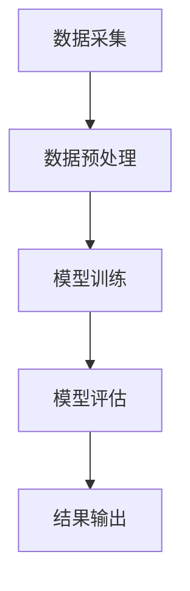

                 

# 文章标题：AI驱动的客户反馈分析系统

> 关键词：人工智能，客户反馈，数据分析，机器学习，深度学习

> 摘要：本文探讨了AI驱动的客户反馈分析系统的构建方法，从AI基础、数据预处理与模型选择、系统架构设计、核心算法原理讲解、项目实战到案例研究，全面阐述了如何利用AI技术提高客户反馈分析的效率与准确性，为企业提供数据驱动的决策支持。

---

## 第1章：AI概述

### 1.1 AI定义与分类

#### 1.1.1 AI定义

人工智能（Artificial Intelligence，简称AI）是指通过计算机模拟人类智能行为的一门科学和技术。它旨在使计算机具备感知、理解、学习、推理和决策等智能能力。

#### 1.1.2 AI分类

- **基于规则的系统**：通过预设的规则进行决策。
- **基于模型的系统**：基于数据学习出模型，然后进行预测和决策。
- **基于行为的系统**：通过分析系统行为来模拟人类智能。
- **混合系统**：结合以上几种方法的系统。

### 1.2 AI发展历史

- **AI的起源**：1950年代，图灵提出“通用计算机”概念，AI开始萌芽。
- **AI的第一个时代**：1956年，达特茅斯会议宣告AI诞生，但随后受限于计算机性能和算法。
- **AI的复兴**：1980年代，专家系统、机器学习等技术取得突破。
- **AI的当前趋势**：深度学习、自然语言处理等前沿技术的快速发展。

### 1.3 AI的核心技术

- **数据分析**：通过对大量数据的分析，提取有价值的信息。
- **机器学习**：使计算机从数据中学习，进行预测和决策。
- **深度学习**：一种基于神经网络的机器学习技术，具有自动特征提取的能力。
- **自然语言处理**：使计算机能够理解和生成自然语言。

---

## 第2章：数据预处理与模型选择

### 2.1 数据预处理

#### 2.1.1 数据采集与清洗

- **数据采集**：通过网页抓取、API接口、企业内部系统等多种方式获取数据。
- **数据清洗**：去除重复数据、缺失数据、异常数据，保证数据质量。

#### 2.1.2 数据探索性分析

- **数据可视化**：使用图表、直方图、散点图等工具对数据进行初步分析。
- **统计描述**：计算均值、方差、标准差等统计量，了解数据分布。

#### 2.1.3 数据归一化与特征提取

- **数据归一化**：将不同量纲的数据转换为相同量纲，便于模型训练。
- **特征提取**：从原始数据中提取对模型有用的信息，提高模型性能。

### 2.2 模型选择

#### 2.2.1 机器学习算法概述

- **监督学习**：有标签数据训练，输出预测值。
- **无监督学习**：无标签数据训练，发现数据分布。
- **强化学习**：通过试错法，在环境中学习最优策略。

#### 2.2.2 常见算法介绍

- **线性回归**
- **逻辑回归**
- **决策树**
- **支持向量机**
- **神经网络**

#### 2.2.3 模型选择策略

- **交叉验证**：评估模型性能，避免过拟合。
- **网格搜索**：遍历超参数空间，选择最佳模型。
- **贝叶斯优化**：基于历史数据，选择最佳超参数。

---

## 第3章：AI驱动的客户反馈分析系统架构

### 3.1 系统架构设计

#### 3.1.1 系统模块划分

- **数据采集模块**：负责数据收集。
- **数据预处理模块**：负责数据清洗、归一化和特征提取。
- **模型训练模块**：负责模型选择、训练和优化。
- **模型评估模块**：负责评估模型性能。
- **结果输出模块**：负责将分析结果展示给用户。

#### 3.1.2 数据流设计

- **数据采集** → **数据预处理** → **模型训练** → **模型评估** → **结果输出**

#### 3.1.3 系统交互流程

1. 用户提交反馈数据。
2. 数据采集模块获取数据。
3. 数据预处理模块对数据清洗、归一化和特征提取。
4. 模型训练模块选择模型并进行训练。
5. 模型评估模块评估模型性能。
6. 结果输出模块将分析结果展示给用户。

### 3.2 Mermaid流程图



---

## 第4章：自然语言处理基础

### 4.1 语言模型

#### 4.1.1 NLP基础

- **文本表示方法**：词袋模型（Bag of Words）和词嵌入（Word Embedding）。
- **语言模型类型**：n-gram模型、神经网络语言模型。

#### 4.1.2 语言模型原理

$$
P(w_1, w_2, ..., w_n) = P(w_1) \times P(w_2 | w_1) \times ... \times P(w_n | w_{n-1})
$$

#### 4.1.3 常见语言模型介绍

- **n-gram模型**：基于历史n个单词预测下一个单词。
- **Word2Vec模型**：将单词映射到低维向量，实现语义理解。
- **BERT模型**：预训练的语言表示模型，具有强大的上下文理解能力。

### 4.2 文本分类与情感分析

#### 4.2.1 文本分类算法

- **朴素贝叶斯分类器**：基于贝叶斯定理，计算后验概率进行分类。
- **支持向量机（SVM）**：通过最大间隔划分数据，实现分类。
- **决策树**：通过划分特征，构建树形结构进行分类。
- **随机森林**：集成多个决策树，提高分类性能。

#### 4.2.2 情感分析算法

- **基于规则的方法**：通过规则库进行情感判断。
- **基于机器学习的方法**：使用监督学习算法，对情感进行分类。
- **基于深度学习的方法**：使用神经网络，实现情感识别。

#### 4.2.3 算法伪代码与数学模型

```plaintext
朴素贝叶斯分类器伪代码：
输入：训练数据集 D，测试数据点 t
输出：预测类别 c

1. 计算每个类别 c 的先验概率 P(c)
2. 对于每个类别 c，计算条件概率 P(t|c)
3. 计算后验概率 P(c|t) = P(c) * P(t|c)
4. 选择具有最大后验概率的类别 c 作为预测结果
```

---

## 第5章：深度学习模型

### 5.1 深度学习基础

#### 5.1.1 神经网络原理

- **单层感知器（Perceptron）**：简单的前向传播和激活函数。
- **多层感知器（MLP）**：包含多个隐藏层，可以学习复杂的函数。

#### 5.1.2 反向传播算法

$$
\Delta w_{ij}^{(l)} = -\eta \frac{\partial J}{\partial w_{ij}^{(l)}}
$$

#### 5.1.3 激活函数

- **sigmoid函数**：将输入映射到（0,1）区间。
- **ReLU函数**：非线性激活函数，计算速度快。
- **Tanh函数**：将输入映射到（-1,1）区间。

### 5.2 深度学习在客户反馈分析中的应用

#### 5.2.1 卷积神经网络（CNN）

- **卷积层**：提取局部特征。
- **池化层**：降低特征维度，减少过拟合。
- **全连接层**：进行分类或回归。

#### 5.2.2 递归神经网络（RNN）

- **RNN基本结构**：对序列数据进行处理。
- **长短期记忆网络（LSTM）**：解决RNN的长短时依赖问题。
- **门控循环单元（GRU）**：简化LSTM结构，计算效率更高。

#### 5.2.3 生成对抗网络（GAN）

- **生成器**：生成虚假数据。
- **判别器**：判断数据是真实还是生成。
- **训练过程**：生成器和判别器相互博弈，提升生成质量。

---

## 第6章：客户反馈分析实战

### 6.1 数据集准备

#### 6.1.1 数据集来源

- **公开数据集**：如IMDb影评数据集。
- **企业内部数据**：客户反馈邮件、评论等。

#### 6.1.2 数据预处理

- **数据清洗**：去除无效数据、缺失值填充。
- **特征提取**：使用词嵌入、TF-IDF等方法提取文本特征。
- **数据归一化**：将不同量纲的特征进行归一化。

### 6.2 模型训练与优化

#### 6.2.1 模型选择

- **基于数据特性的选择**：如文本长度、词向量维度等。
- **基于任务特性的选择**：如分类任务、情感分析任务。

#### 6.2.2 超参数调整

- **学习率**：控制梯度下降的步长。
- **批量大小**：影响模型训练速度和稳定性。
- **隐藏层神经元数量**：影响模型复杂度和训练难度。

#### 6.2.3 模型评估

- **准确率**：预测正确的比例。
- **召回率**：实际为正类中预测为正类的比例。
- **F1分数**：准确率和召回率的加权平均。

### 6.3 代码实现

#### 6.3.1 代码解析

- **环境搭建**：安装Python、深度学习框架等。
- **数据加载与预处理**：读取数据、进行清洗和特征提取。
- **模型训练与评估**：定义模型、训练模型、评估模型性能。

#### 6.3.2 环境搭建

- **Python环境**：安装Python和相关库。
- **深度学习框架**：如TensorFlow、PyTorch。
- **数据处理库**：如Pandas、NumPy。

---

## 第7章：案例研究

### 7.1 案例背景

#### 7.1.1 企业背景

- **企业名称**：某电子商务平台。
- **业务需求**：提高客户满意度，通过分析客户反馈优化产品和服务。

#### 7.1.2 案例目标

- **目标概述**：构建一个高效的AI驱动的客户反馈分析系统，实现自动化情感分析和分类。
- **项目期望效果**：提高反馈处理效率，精准识别客户情感，为业务决策提供数据支持。

### 7.2 案例实施

#### 7.2.1 数据收集

- **数据来源**：企业内部客户反馈邮件、评论、社交媒体等。
- **数据收集方法**：爬虫、API接口、企业数据仓库等。

#### 7.2.2 模型训练

- **模型选择**：采用BERT模型进行文本分类和情感分析。
- **训练策略**：使用交叉验证、批量归一化等技术提高模型性能。
- **训练过程**：在GPU上训练，调整学习率和批量大小等超参数。

#### 7.2.3 结果分析与优化

- **结果分析**：分析模型预测准确率、召回率等指标。
- **模型优化**：通过调整模型结构和超参数，提高模型性能。
- **实施效果评估**：评估系统在实际业务中的应用效果，如客户满意度提升、问题解决率提高等。

---

## 附录A：开发工具与资源

### A.1 工具介绍

#### A.1.1 Python环境搭建

- **Python版本**：安装Python 3.8及以上版本。
- **库**：安装NumPy、Pandas、TensorFlow等库。

#### A.1.2 深度学习框架介绍

- **TensorFlow**：Google开源的深度学习框架。
- **PyTorch**：Facebook开源的深度学习框架。

#### A.1.3 数据预处理库

- **Scikit-learn**：提供数据预处理和机器学习算法。
- **NLTK**：提供自然语言处理相关库。

### A.2 资源链接

#### A.2.1 开源代码

- **GitHub**：开源代码托管平台，可下载相关项目代码。
- **Google Colab**：免费的云端GPU，可用于深度学习实验。

#### A.2.2 论文引用

- **ArXiv**：深度学习论文预发布平台。
- **NeurIPS、ICML、ACL**：顶级机器学习、自然语言处理会议。

#### A.2.3 技术论坛与社区

- **CSDN**：国内技术社区，提供技术文章和讨论。
- **Stack Overflow**：全球开发者问答社区。
- **Reddit**：技术讨论社区，关注深度学习和自然语言处理话题。

---

# 作者信息

作者：AI天才研究院/AI Genius Institute & 禅与计算机程序设计艺术 /Zen And The Art of Computer Programming

