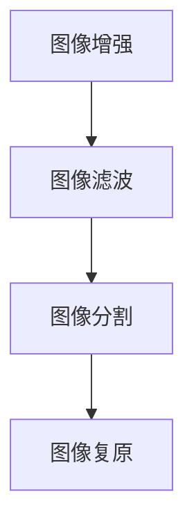
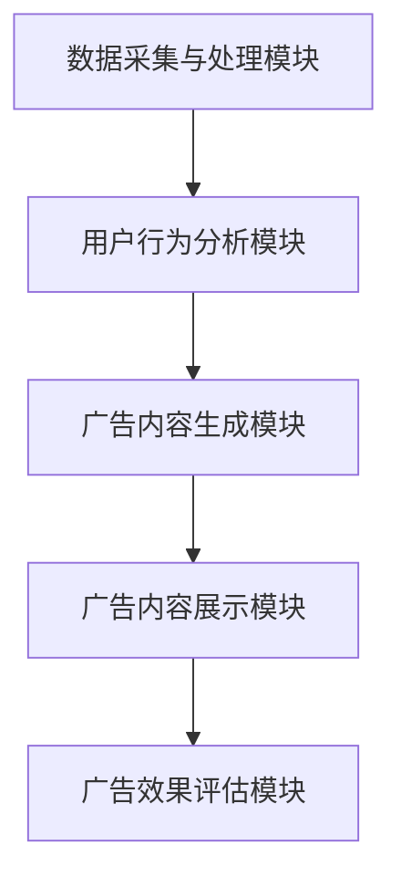

                 

### 文章标题：AI驱动的智能广告牌：个性化户外广告

关键词：人工智能、智能广告牌、个性化推荐、计算机视觉、机器学习、数据挖掘

摘要：随着人工智能技术的快速发展，智能广告牌已成为户外广告领域的一大创新。本文将探讨AI驱动的智能广告牌的概念、核心技术、应用场景及其未来发展趋势，揭示个性化户外广告的魅力与挑战。

### 目录大纲

#### 第一部分：AI驱动的智能广告牌基础

#### 第1章：AI驱动的智能广告牌概述  
- 1.1 智能广告牌的定义与现状  
- 1.2 AI技术在智能广告牌中的应用  
- 1.3 AI驱动的智能广告牌的优势与挑战

#### 第2章：AI驱动的智能广告牌核心技术  
- 2.1 计算机视觉技术  
- 2.2 机器学习与数据挖掘技术  
- 2.3 个性化推荐系统

#### 第3章：AI驱动的广告内容生成与优化  
- 3.1 广告内容生成技术  
- 3.2 广告内容优化策略

#### 第4章：AI驱动的智能广告牌系统设计与实现  
- 4.1 系统架构设计  
- 4.2 数据处理与存储  
- 4.3 系统开发与部署

#### 第二部分：AI驱动的智能广告牌应用案例

#### 第5章：智能广告牌在零售行业的应用  
- 5.1 零售行业广告需求分析  
- 5.2 智能广告牌应用案例

#### 第6章：智能广告牌在公共设施中的应用  
- 6.1 公共设施广告需求分析  
- 6.2 智能广告牌应用案例

#### 第7章：智能广告牌的未来发展趋势  
- 7.1 技术发展趋势  
- 7.2 应用场景拓展  
- 7.3 智能广告牌行业的未来展望

### 第1章 AI驱动的智能广告牌概述

#### 1.1 智能广告牌的定义与现状

智能广告牌，亦称数字广告牌，是一种结合了显示技术和人工智能技术的户外广告设备。与传统的户外广告牌相比，智能广告牌具有更高的互动性、实时性和精准性。通过整合计算机视觉、机器学习和数据挖掘等技术，智能广告牌能够根据用户的实时行为和偏好，动态调整广告内容，实现个性化推荐。

当前，智能广告牌在全球范围内得到了广泛应用。发达国家如美国、日本和欧洲等地的智能广告牌普及率较高，尤其在繁华商业区和公共交通枢纽，智能广告牌已经成为广告营销的重要组成部分。随着人工智能技术的不断成熟，智能广告牌正逐渐向发展中国家扩展，我国在这方面的应用也呈现出迅猛增长的趋势。

#### 1.2 AI技术在智能广告牌中的应用

AI技术在智能广告牌中扮演着至关重要的角色，主要体现在以下几个方面：

1. **计算机视觉技术**：计算机视觉技术是智能广告牌感知外部环境的关键技术。通过摄像头等传感器，智能广告牌可以实时捕捉周围的图像信息，并进行图像处理、目标检测和识别等操作。这些技术使得广告牌能够识别行人、车辆等目标，并根据目标的行为和偏好进行广告内容的个性化推荐。

2. **机器学习与数据挖掘技术**：机器学习与数据挖掘技术是智能广告牌实现个性化推荐的核心技术。通过收集和分析用户的历史行为数据、兴趣偏好等，智能广告牌可以构建用户画像，并根据用户画像生成个性化的广告内容。

3. **个性化推荐系统**：个性化推荐系统是智能广告牌实现精准投放的关键。基于用户画像和广告内容匹配算法，推荐系统可以为每个用户推荐最感兴趣的广告内容，从而提高广告的投放效果。

#### 1.3 AI驱动的智能广告牌的优势与挑战

AI驱动的智能广告牌具有显著的优势，主要包括：

1. **个性化推荐**：智能广告牌可以根据用户的实时行为和偏好，动态调整广告内容，实现个性化推荐，从而提高广告的投放效果。

2. **实时互动**：智能广告牌可以通过传感器实时捕捉用户行为，实现与用户的实时互动，提升用户的体验。

3. **精准投放**：基于用户画像和广告内容匹配算法，智能广告牌可以实现精准投放，提高广告的投放效率和转化率。

然而，AI驱动的智能广告牌也面临着一系列挑战：

1. **隐私保护**：智能广告牌在收集用户数据时，可能涉及到用户的隐私保护问题。如何平衡数据收集与用户隐私保护，成为智能广告牌面临的一大挑战。

2. **技术成熟度**：尽管AI技术在智能广告牌中得到了广泛应用，但技术成熟度仍有待提高。例如，计算机视觉技术在复杂环境下的准确率仍有待提高，推荐系统在处理大规模数据时可能存在效率问题。

3. **成本控制**：智能广告牌的设备成本较高，如何控制成本，使其在市场上具有竞争力，也是智能广告牌需要解决的问题。

总之，AI驱动的智能广告牌作为一种新兴的广告形式，具有广阔的发展前景。在未来的发展中，如何克服现有挑战，实现技术的成熟与普及，将是智能广告牌行业面临的重要课题。在接下来的章节中，我们将深入探讨AI驱动的智能广告牌的核心技术，以期为这一领域的发展提供有益的参考。  

### 第2章 AI驱动的智能广告牌核心技术

#### 2.1 计算机视觉技术

计算机视觉技术是AI驱动的智能广告牌实现感知外部环境的基础。通过摄像头等传感器，智能广告牌可以实时捕捉周围的图像信息，并进行图像处理、目标检测和识别等操作。这些技术使得广告牌能够识别行人、车辆等目标，并根据目标的行为和偏好进行广告内容的个性化推荐。

**2.1.1 图像处理基础**

图像处理是计算机视觉的基础。其主要任务包括图像增强、图像滤波、图像分割和图像复原等。其中，图像滤波是图像处理中最为常见的技术之一，用于去除图像中的噪声和干扰。常见的图像滤波算法包括均值滤波、中值滤波和高斯滤波等。



**2.1.2 目标检测与识别**

目标检测与识别是计算机视觉中的一项重要技术。其任务是从图像中检测并识别出特定的目标对象。常见的目标检测算法包括基于滑动窗口的算法、基于深度学习的算法等。

基于滑动窗口的目标检测算法如下：

```python
def sliding_window(image, window_size, step_size):
    for y in range(0, image.shape[0], step_size):
        for x in range(0, image.shape[1], step_size):
            window = image[y:y+window_size[0], x:x+window_size[1]]
            # 进行特征提取和分类
```

基于深度学习的目标检测算法如YOLO（You Only Look Once）算法如下：

```python
def yolo_detection(image):
    # 将图像输入到YOLO模型中进行预测
    # 返回检测到的目标框和标签
```

**2.1.3 特征提取与降维**

特征提取与降维是计算机视觉中的关键技术。其任务是从高维图像数据中提取出具有区分性的特征，并降低数据的维度，以便于后续的建模和分类。

常见的特征提取方法包括：

1. **HOG（Histogram of Oriented Gradients）**：通过计算图像中每个像素点的梯度方向和幅值，生成具有方向性的直方图特征。

2. **SIFT（Scale-Invariant Feature Transform）**：通过检测图像的关键点，并计算关键点的局部特征描述子，实现图像的匹配和识别。

常见的降维方法包括：

1. **PCA（Principal Component Analysis）**：通过计算数据的协方差矩阵，提取主要成分，实现数据的降维。

2. **LDA（Linear Discriminant Analysis）**：通过最大化类间离散度和最小化类内离散度，提取具有区分性的特征。

```python
from sklearn.decomposition import PCA

def pca_reduction(data, components):
    pca = PCA(n_components=components)
    reduced_data = pca.fit_transform(data)
    return reduced_data
```

#### 2.2 机器学习与数据挖掘技术

机器学习与数据挖掘技术是AI驱动的智能广告牌实现个性化推荐的核心技术。通过收集和分析用户的历史行为数据、兴趣偏好等，智能广告牌可以构建用户画像，并根据用户画像生成个性化的广告内容。

**2.2.1 基本算法介绍**

机器学习与数据挖掘技术包括多种算法，其中一些常见的算法如下：

1. **K-最近邻算法（K-Nearest Neighbors, KNN）**：基于距离最近的原则，为用户推荐相似的广告内容。

2. **决策树（Decision Tree）**：通过构建树形结构，将用户数据划分为不同的类别，实现广告内容的分类和推荐。

3. **支持向量机（Support Vector Machine, SVM）**：通过最大化类间间隔，为用户推荐最优的广告内容。

4. **随机森林（Random Forest）**：通过构建多个决策树的组合，提高分类和推荐的效果。

5. **协同过滤（Collaborative Filtering）**：通过分析用户的历史行为和兴趣偏好，为用户推荐相似的其他用户喜欢的广告内容。

6. **基于内容的推荐（Content-Based Filtering）**：通过分析广告内容的特征，为用户推荐与其兴趣相关的广告内容。

**2.2.2 特征工程**

特征工程是数据挖掘中的关键步骤，其任务是从原始数据中提取出具有区分性的特征，以提高模型的效果。常见的特征工程方法包括：

1. **数据预处理**：包括缺失值处理、异常值处理和归一化等。

2. **特征选择**：通过过滤、嵌入和转换等方法，选择对模型效果有显著贡献的特征。

3. **特征提取**：通过计算统计量、频率分布、相关性等，提取具有区分性的特征。

**2.2.3 模型评估与优化**

模型评估与优化是数据挖掘中的关键步骤，其任务是通过评估模型的效果，选择最优的模型并进行优化。常见的评估指标包括准确率、召回率、F1值等。优化方法包括交叉验证、网格搜索等。

```python
from sklearn.model_selection import train_test_split
from sklearn.metrics import accuracy_score
from sklearn.ensemble import RandomForestClassifier

def evaluate_model(model, X_train, y_train, X_test, y_test):
    model.fit(X_train, y_train)
    y_pred = model.predict(X_test)
    accuracy = accuracy_score(y_test, y_pred)
    return accuracy
```

#### 2.3 个性化推荐系统

个性化推荐系统是AI驱动的智能广告牌实现个性化推荐的核心。通过整合用户画像、广告内容特征和推荐算法，个性化推荐系统可以为每个用户推荐最感兴趣的广告内容。

**2.3.1 推荐系统基本原理**

个性化推荐系统的基本原理是基于用户历史行为和兴趣偏好，为用户推荐相关的广告内容。常见的推荐算法包括协同过滤、基于内容的推荐和混合推荐等。

协同过滤算法如下：

```python
from sklearn.neighbors import NearestNeighbors

def collaborative_filtering(X, K):
    model = NearestNeighbors(n_neighbors=K)
    model.fit(X)
    return model
```

基于内容的推荐算法如下：

```python
from sklearn.metrics.pairwise import cosine_similarity

def content_based_recommender(X, query, similarity='cosine'):
    similarity_matrix = cosine_similarity(X, query)
    recommendations = similarity_matrix.argsort()[0][::-1][1:]
    return recommendations
```

**2.3.2 协同过滤与基于内容的推荐**

协同过滤和基于内容的推荐是两种常见的个性化推荐算法。协同过滤通过分析用户的历史行为，为用户推荐相似的其他用户喜欢的广告内容；而基于内容的推荐通过分析广告内容的特征，为用户推荐与其兴趣相关的广告内容。

协同过滤算法如下：

```python
def collaborative_filtering(user_vector, item_vectors, K):
    similarities = []
    for item_vector in item_vectors:
        similarity = cosine_similarity([user_vector], [item_vector])
        similarities.append(similarity[0][0])
    top_k = sorted(similarities, reverse=True)[:K]
    recommended_items = [index for index, similarity in enumerate(similarities) if similarity in top_k]
    return recommended_items
```

基于内容的推荐算法如下：

```python
def content_based_recommender(user_vector, item_vectors, K):
    similarities = []
    for item_vector in item_vectors:
        similarity = cosine_similarity([user_vector], [item_vector])
        similarities.append(similarity[0][0])
    top_k = sorted(similarities, reverse=True)[:K]
    recommended_items = [index for index, similarity in enumerate(similarities) if similarity in top_k]
    return recommended_items
```

**2.3.3 深度学习在推荐系统中的应用**

深度学习在推荐系统中的应用逐渐成为研究热点。通过构建深度神经网络，可以更好地捕捉用户和广告内容之间的复杂关系。常见的深度学习推荐算法包括基于模型的协同过滤（Model-Based Collaborative Filtering）和深度学习模型（如DNN、CNN、RNN等）。

基于模型的协同过滤算法如下：

```python
from keras.models import Model
from keras.layers import Input, Dense, Embedding, Dot, Concatenate

def model_based_collaborative_filtering(user_id, item_id, user_embedding, item_embedding, hidden_size):
    user_input = Input(shape=(1,), name='user_input')
    item_input = Input(shape=(1,), name='item_input')

    user_embedding_layer = Embedding(user_id, hidden_size, name='user_embedding')(user_input)
    item_embedding_layer = Embedding(item_id, hidden_size, name='item_embedding')(item_input)

    user_embedding_vector = user_embedding_layer
    item_embedding_vector = item_embedding_layer

    dot_product = Dot(axes=1)([user_embedding_vector, item_embedding_vector])
    hidden_layer = Dense(hidden_size, activation='relu', name='hidden_layer')(dot_product)

    output_layer = Dense(1, activation='sigmoid', name='output_layer')(hidden_layer)

    model = Model(inputs=[user_input, item_input], outputs=output_layer)
    model.compile(optimizer='adam', loss='binary_crossentropy', metrics=['accuracy'])

    return model
```

综上所述，计算机视觉技术、机器学习与数据挖掘技术以及个性化推荐系统构成了AI驱动的智能广告牌的核心技术。通过这些技术的有机结合，智能广告牌能够实现个性化的广告推荐，提高广告的投放效果。在接下来的章节中，我们将继续探讨AI驱动的广告内容生成与优化，为智能广告牌的应用提供更多实践指导。  

### 第3章 AI驱动的广告内容生成与优化

#### 3.1 广告内容生成技术

广告内容生成技术是AI驱动的智能广告牌实现个性化广告投放的重要手段。通过文本生成、图像生成和视频生成等技术，广告内容可以更加贴合用户的兴趣和需求，提高广告的吸引力和转化率。

**3.1.1 文本生成**

文本生成技术通过自然语言处理（NLP）和生成对抗网络（GAN）等技术，能够自动生成具有特定主题和风格的文本。常见的文本生成方法包括：

1. **基于规则的方法**：通过定义一组规则和模板，根据输入的模板和参数生成文本。这种方法生成文本的灵活性和自然度较低，但易于实现。

2. **基于统计的方法**：通过统计文本中的词语频率和共现关系，生成符合概率分布的文本。这种方法生成文本的自然度较高，但生成文本的多样性和创造力有限。

3. **基于神经网络的文本生成**：利用循环神经网络（RNN）和长短期记忆网络（LSTM）等技术，根据输入的文本序列生成新的文本。这种方法生成文本的灵活性和自然度较高，能够生成具有创造力的文本。

以下是一个基于LSTM的文本生成模型的伪代码：

```python
import tensorflow as tf
from tensorflow.keras.models import Model
from tensorflow.keras.layers import Input, LSTM, Embedding, Dense

def text_generator(vocab_size, embedding_dim, sequence_length):
    input_sequence = Input(shape=(sequence_length,))
    embedding = Embedding(vocab_size, embedding_dim)(input_sequence)
    lstm = LSTM(units=128, return_sequences=True)(embedding)
    output = LSTM(units=128, return_sequences=True)(lstm)
    model = Model(inputs=input_sequence, outputs=output)
    model.compile(optimizer='adam', loss='categorical_crossentropy')
    return model
```

**3.1.2 图像生成**

图像生成技术通过生成对抗网络（GAN）和变分自编码器（VAE）等技术，能够生成具有较高真实度的图像。常见的图像生成方法包括：

1. **生成对抗网络（GAN）**：GAN由生成器（Generator）和判别器（Discriminator）组成。生成器生成虚假图像，判别器判断图像的真实性。通过训练生成器和判别器的对抗关系，生成器能够生成越来越真实的图像。

2. **变分自编码器（VAE）**：VAE通过引入KL散度，将生成器和编码器（Encoder）分离。编码器将输入数据编码成潜在空间中的向量，生成器根据潜在空间中的向量生成图像。

以下是一个基于GAN的图像生成模型的伪代码：

```python
import tensorflow as tf
from tensorflow.keras.models import Model
from tensorflow.keras.layers import Input, Dense, Reshape, Conv2D, Conv2DTranspose

def generator(z_dim, img_shape):
    z = Input(shape=(z_dim,))
    x = Dense(128 * 8 * 8, activation='relu')(z)
    x = Reshape((8, 8, 128))(x)
    x = Conv2DTranspose(128, kernel_size=5, strides=2, padding='same', activation='relu')(x)
    x = Conv2DTranspose(128, kernel_size=5, strides=2, padding='same', activation='relu')(x)
    x = Conv2D(3, kernel_size=5, padding='same', activation='tanh')(x)
    model = Model(z, x)
    return model

def discriminator(img_shape):
    x = Input(shape=img_shape)
    x = Conv2D(128, kernel_size=5, padding='same', activation='relu')(x)
    x = Conv2D(128, kernel_size=5, strides=2, padding='same', activation='relu')(x)
    x = Conv2D(128, kernel_size=5, strides=2, padding='same', activation='relu')(x)
    x = Flatten()(x)
    x = Dense(1, activation='sigmoid')(x)
    model = Model(x, x)
    return model

def gan_model(generator, discriminator):
    z = Input(shape=(100,))
    img = generator(z)
    valid = discriminator(img)
    gen_loss = K.mean(valid)
    dis_loss = K.mean(K.log(discriminator(img)) + K.log(1 - discriminator(x)))
    gan_loss = gen_loss + dis_loss
    model = Model(z, gen_loss)
    model.compile(optimizer=tf.keras.optimizers.Adam(0.0002), loss=gan_loss)
    return model
```

**3.1.3 视频生成**

视频生成技术通过视频生成模型（如VideoGAN）和循环神经网络（RNN）等技术，能够生成连续的视频帧序列。常见的视频生成方法包括：

1. **VideoGAN**：VideoGAN结合了GAN和循环神经网络，通过训练生成器网络和判别器网络，生成连续的视频帧序列。

2. **循环神经网络（RNN）**：RNN通过处理时间序列数据，生成连续的视频帧序列。常见的RNN模型包括LSTM和GRU。

以下是一个基于LSTM的视频生成模型的伪代码：

```python
import tensorflow as tf
from tensorflow.keras.models import Model
from tensorflow.keras.layers import Input, LSTM, Embedding, Dense

def video_generator(input_shape, hidden_size):
    input_sequence = Input(shape=input_shape)
    lstm = LSTM(units=hidden_size, return_sequences=True)(input_sequence)
    output = LSTM(units=hidden_size, return_sequences=True)(lstm)
    model = Model(inputs=input_sequence, outputs=output)
    model.compile(optimizer='adam', loss='mse')
    return model

def video_discriminator(input_shape, hidden_size):
    input_sequence = Input(shape=input_shape)
    lstm = LSTM(units=hidden_size, return_sequences=True)(input_sequence)
    output = LSTM(units=hidden_size, return_sequences=True)(lstm)
    output = Flatten()(output)
    output = Dense(1, activation='sigmoid')(output)
    model = Model(inputs=input_sequence, outputs=output)
    model.compile(optimizer='adam', loss='binary_crossentropy')
    return model

def video_gan_model(generator, discriminator):
    input_sequence = Input(shape=input_shape)
    generated_sequence = generator(input_sequence)
    valid = discriminator(generated_sequence)
    dis_loss = K.mean(K.log(discriminator(generated_sequence)) + K.log(1 - discriminator(input_sequence)))
    model = Model(inputs=input_sequence, outputs=valid)
    model.compile(optimizer=tf.keras.optimizers.Adam(0.0002), loss=dis_loss)
    return model
```

#### 3.2 广告内容优化策略

广告内容优化策略是提高广告投放效果的关键。通过分析用户行为数据、广告效果评估和广告投放优化，可以不断优化广告内容，提高广告的吸引力和转化率。

**3.2.1 用户行为分析**

用户行为分析是通过分析用户在广告牌上的行为数据，了解用户对广告内容的兴趣和偏好。常见的用户行为分析指标包括：

1. **曝光率**：广告被用户看到的次数，是衡量广告投放效果的重要指标。

2. **点击率（CTR）**：广告被用户点击的次数与曝光次数的比值，反映了广告的吸引力和用户兴趣。

3. **转化率**：广告带来的实际转化（如购买、注册等）次数与曝光次数的比值，反映了广告的转化效果。

4. **停留时间**：用户在广告牌上的停留时间，反映了广告内容对用户的吸引力。

通过分析这些指标，可以了解广告内容的优缺点，为广告优化提供依据。

**3.2.2 广告效果评估**

广告效果评估是通过评估广告的实际投放效果，了解广告的投资回报率（ROI）。常见的广告效果评估方法包括：

1. **A/B测试**：通过将广告内容分为多个版本，分别投放给不同用户群体，比较不同版本的广告效果，选择最优的广告内容。

2. **多变量测试**：通过调整广告的多个变量（如标题、图片、颜色等），比较不同变量的效果，选择最佳的广告组合。

3. **转化路径分析**：通过分析用户从广告曝光到转化的全过程，了解广告在用户购买决策中的贡献。

**3.2.3 广告投放优化**

广告投放优化是通过不断调整广告投放策略，提高广告的投放效果。常见的广告投放优化策略包括：

1. **受众定位**：根据用户画像和兴趣偏好，精准定位目标受众，提高广告的曝光率和点击率。

2. **时段优化**：根据用户行为数据，分析广告在不同时段的效果，选择最佳的投放时段，提高广告的转化率。

3. **地域优化**：根据用户地理位置，调整广告投放的地域范围，提高广告的本地化效果。

4. **预算分配**：根据广告效果和ROI，合理分配广告预算，提高广告的投资回报率。

通过以上广告内容优化策略，可以不断优化广告内容，提高广告的吸引力和转化率，实现广告投放的最大化收益。

综上所述，AI驱动的广告内容生成与优化技术为智能广告牌提供了强大的支持。通过文本生成、图像生成和视频生成等技术，可以生成具有个性化的广告内容；通过用户行为分析、广告效果评估和广告投放优化等策略，可以不断优化广告内容，提高广告的吸引力和转化率。在接下来的章节中，我们将探讨AI驱动的智能广告牌系统设计与实现，为智能广告牌的实际应用提供更多的实践指导。  

### 第4章 AI驱动的智能广告牌系统设计与实现

#### 4.1 系统架构设计

AI驱动的智能广告牌系统架构主要包括数据采集与处理模块、广告内容生成与优化模块、用户交互模块和广告投放模块。以下是系统架构的设计思路：

**4.1.1 系统需求分析**

在系统设计之前，首先需要对系统需求进行详细分析。智能广告牌系统的主要需求包括：

1. **实时数据采集**：通过摄像头、传感器等设备，实时采集用户的行为数据。
2. **用户行为分析**：对采集到的用户行为数据进行处理和分析，为广告内容生成提供依据。
3. **广告内容生成**：根据用户行为分析和广告策略，生成个性化的广告内容。
4. **广告内容展示**：将生成的广告内容展示在智能广告牌上，与用户进行交互。
5. **广告效果评估**：评估广告投放效果，为广告策略调整提供依据。

**4.1.2 系统功能模块划分**

基于系统需求分析，可以将智能广告牌系统划分为以下功能模块：

1. **数据采集与处理模块**：负责实时采集用户行为数据，并对数据进行预处理和存储。
2. **用户行为分析模块**：对采集到的用户行为数据进行分析，为广告内容生成提供依据。
3. **广告内容生成模块**：根据用户行为分析和广告策略，生成个性化的广告内容。
4. **广告内容展示模块**：将生成的广告内容展示在智能广告牌上，与用户进行交互。
5. **广告效果评估模块**：评估广告投放效果，为广告策略调整提供依据。

**4.1.3 系统性能优化**

在系统设计过程中，性能优化是关键因素。以下是一些性能优化策略：

1. **数据采集优化**：采用高效的采集算法，减少数据采集延迟。
2. **数据处理优化**：采用并行处理和分布式计算技术，提高数据处理效率。
3. **存储优化**：采用分布式存储系统，提高数据存储和读取速度。
4. **广告生成优化**：采用高效的算法和模型，提高广告生成速度。
5. **网络传输优化**：采用高效的数据压缩和传输协议，减少网络传输延迟。

**4.1.4 系统架构设计**

基于上述需求分析和功能模块划分，智能广告牌系统架构设计如下：



#### 4.2 数据处理与存储

数据处理与存储是智能广告牌系统的核心模块之一。以下是对数据处理与存储模块的详细描述：

**4.2.1 数据采集与预处理**

数据采集与预处理模块的主要任务是从传感器和其他数据源实时采集用户行为数据，并对数据进行预处理。预处理包括数据清洗、数据转换和数据归一化等步骤。

1. **数据清洗**：去除数据中的噪声和异常值，确保数据的准确性和完整性。
2. **数据转换**：将不同格式的数据转换为统一的格式，以便于后续处理。
3. **数据归一化**：对数据进行归一化处理，使其在相同的量级范围内，提高模型的性能。

**4.2.2 数据存储与索引**

数据存储与索引模块的主要任务是将预处理后的数据存储在分布式存储系统中，并建立索引，以便于快速查询和检索。

1. **分布式存储系统**：采用Hadoop、HBase等分布式存储系统，提高数据存储和读取速度。
2. **数据索引**：采用B树、哈希表等索引技术，提高数据查询效率。

**4.2.3 数据挖掘与分析**

数据挖掘与分析模块的主要任务是对存储的数据进行挖掘和分析，为广告内容生成和优化提供依据。以下是一些常见的数据挖掘与分析方法：

1. **用户行为分析**：通过分析用户的行为数据，了解用户的兴趣偏好和行为模式。
2. **用户画像构建**：基于用户行为数据，构建用户画像，为广告推荐提供依据。
3. **广告效果评估**：通过分析广告投放效果数据，评估广告的效果，为广告优化提供依据。

#### 4.3 系统开发与部署

系统开发与部署是智能广告牌系统实现的关键环节。以下是对系统开发与部署的详细描述：

**4.3.1 开发环境搭建**

在开发智能广告牌系统之前，需要搭建合适的开发环境。开发环境包括操作系统、编程语言、数据库、框架等。

1. **操作系统**：选择Linux操作系统，具有良好的稳定性和扩展性。
2. **编程语言**：选择Python作为主要编程语言，具有丰富的库和框架支持。
3. **数据库**：选择MySQL作为关系型数据库，用于存储用户行为数据和广告数据。
4. **框架**：选择Django作为Web开发框架，用于构建广告内容生成和展示模块。

**4.3.2 系统模块开发**

系统模块开发是系统实现的关键步骤。根据系统架构设计，开发以下模块：

1. **数据采集与处理模块**：开发数据采集和预处理的程序，实现数据采集、清洗、转换和归一化等功能。
2. **用户行为分析模块**：开发用户行为分析和用户画像构建的程序，实现用户行为数据分析、用户画像构建等功能。
3. **广告内容生成模块**：开发广告内容生成的程序，实现文本生成、图像生成和视频生成等功能。
4. **广告内容展示模块**：开发广告内容展示的程序，实现广告内容的实时展示和用户交互等功能。
5. **广告效果评估模块**：开发广告效果评估的程序，实现广告效果数据收集、分析和评估等功能。

**4.3.3 系统部署与测试**

系统部署与测试是确保系统正常运行的关键步骤。以下是对系统部署与测试的详细描述：

1. **系统部署**：将开发完成的应用程序部署到服务器上，确保系统可以正常运行。
2. **性能测试**：进行性能测试，包括负载测试、压力测试和稳定性测试，确保系统在高并发场景下能够稳定运行。
3. **功能测试**：进行功能测试，确保系统功能符合设计要求，无漏洞和错误。
4. **用户测试**：邀请用户进行实际操作，收集用户反馈，不断优化系统功能和用户体验。

通过以上系统开发与部署过程，可以确保AI驱动的智能广告牌系统正常运行，为用户提供个性化的广告体验。

#### 第5章 智能广告牌在零售行业的应用

智能广告牌在零售行业的应用，为传统广告营销带来了全新的变革。通过AI技术的深度应用，智能广告牌能够精准捕捉用户行为，实现个性化广告推送，从而提高零售行业的广告效果和销售额。

##### 5.1 零售行业广告需求分析

零售行业广告需求主要集中在提高品牌知名度、吸引潜在顾客、提升销售业绩等方面。以下是零售行业广告需求的具体分析：

1. **品牌知名度**：零售行业广告需要通过大量曝光来提高品牌知名度，吸引消费者的关注。传统的广告形式如电视广告、户外广告等，虽然能够达到一定的曝光效果，但成本较高且难以精准定位目标用户。

2. **潜在顾客吸引**：零售行业广告需要吸引更多的潜在顾客，提升进店率和转化率。通过精准定位目标用户，智能广告牌能够将广告信息推送至潜在顾客，提高广告的吸引力。

3. **销售业绩提升**：零售行业广告的目标之一是提升销售业绩。通过分析用户行为和购物习惯，智能广告牌能够推送与用户兴趣相关的广告内容，提高用户购买意愿，从而提升销售额。

##### 5.2 智能广告牌在零售行业中的应用案例

以下是一个智能广告牌在零售行业的应用案例：

**案例：某大型超市智能广告牌应用**

某大型超市引入了AI驱动的智能广告牌系统，旨在提升广告效果和销售业绩。以下是该案例的具体应用：

1. **数据采集与处理**：智能广告牌通过摄像头和传感器，实时采集用户在超市内的行为数据，如顾客流量、停留时间、购物路径等。数据采集后，系统对数据进行分析和处理，构建用户画像。

2. **广告内容生成**：基于用户画像和购物习惯，系统生成个性化的广告内容。例如，对于经常购买母婴产品的顾客，系统会推送相关的促销广告；对于进店但未购物的顾客，系统会推送购物提醒广告。

3. **广告内容展示**：智能广告牌在超市内部不同区域展示个性化的广告内容。例如，在母婴产品区，展示相关产品的促销广告；在出入口处，展示购物提醒广告。

4. **用户互动**：智能广告牌支持用户互动功能，如扫码参与活动、发送优惠券等。通过互动，系统可以进一步收集用户数据，优化广告内容。

5. **广告效果评估**：系统实时收集广告展示数据，如曝光次数、点击率、转化率等，对广告效果进行评估。根据评估结果，系统不断调整广告内容，提高广告投放效果。

##### 5.3 智能广告牌在零售行业中的优势

智能广告牌在零售行业中的应用，具有以下优势：

1. **个性化推荐**：基于用户画像和购物习惯，智能广告牌能够为每个顾客推送个性化的广告内容，提高广告的吸引力。

2. **实时互动**：智能广告牌支持用户互动功能，如扫码参与活动、发送优惠券等，增强用户体验。

3. **精准投放**：通过分析用户行为数据，智能广告牌能够精准定位目标用户，提高广告的投放效果。

4. **效果可衡量**：智能广告牌系统实时收集广告展示数据，如曝光次数、点击率、转化率等，便于广告效果评估。

5. **成本效益**：相较于传统广告形式，智能广告牌具有较低的成本，且广告效果可量化，有助于降低广告成本，提高投资回报率。

##### 5.4 智能广告牌在零售行业中的应用挑战

智能广告牌在零售行业中的应用也面临一定的挑战：

1. **数据隐私**：智能广告牌在采集用户数据时，可能涉及到用户隐私保护问题。如何平衡数据收集与用户隐私保护，是智能广告牌应用的一大挑战。

2. **技术成熟度**：尽管AI技术在智能广告牌中得到了广泛应用，但技术成熟度仍有待提高。例如，计算机视觉技术在复杂环境下的准确率仍有待提高，推荐系统在处理大规模数据时可能存在效率问题。

3. **运营成本**：智能广告牌系统建设成本较高，运营过程中需要投入大量人力和物力资源。如何控制成本，实现智能广告牌的可持续发展，是零售行业面临的挑战。

综上所述，智能广告牌在零售行业的应用具有广阔的发展前景。通过个性化推荐、实时互动和精准投放等技术，智能广告牌为零售行业提供了新的广告营销模式。在未来的发展中，零售行业需要不断优化智能广告牌系统，克服现有挑战，实现广告效果的进一步提升。

### 第6章 智能广告牌在公共设施中的应用

智能广告牌在公共设施中的应用，如火车站、地铁站、机场等，正逐渐成为提升公共服务水平的重要手段。通过AI技术的深度应用，智能广告牌能够提供实时、个性化的信息服务，提高用户的出行体验。

##### 6.1 公共设施广告需求分析

公共设施广告需求主要集中在提供实时信息、优化出行体验、提升公共服务形象等方面。以下是公共设施广告需求的具体分析：

1. **实时信息提供**：公共设施广告需要及时提供列车时刻表、航班信息、天气情况等实时信息，帮助用户合理安排出行计划。

2. **出行体验优化**：公共设施广告需要提供与出行相关的服务信息，如餐饮、购物、娱乐等，优化用户的出行体验。

3. **公共服务形象提升**：公共设施广告需要展示公共服务机构的形象和理念，提升公众对公共服务机构的认同感和信任度。

##### 6.2 智能广告牌在公共设施中的应用案例

以下是一个智能广告牌在公共设施中的应用案例：

**案例：某地铁站智能广告牌应用**

某地铁站引入了AI驱动的智能广告牌系统，旨在提升公共服务的水平和用户的出行体验。以下是该案例的具体应用：

1. **数据采集与处理**：智能广告牌通过摄像头和传感器，实时采集用户在地铁站内的行为数据，如客流流量、停留时间、购物路径等。数据采集后，系统对数据进行分析和处理，构建用户画像。

2. **广告内容生成**：基于用户画像和出行习惯，系统生成个性化的广告内容。例如，对于经常乘坐某条线路的乘客，系统会推送相关线路的实时信息；对于在地铁站内购物的乘客，系统会推送附近商家的促销信息。

3. **广告内容展示**：智能广告牌在地铁站的不同区域展示个性化的广告内容。例如，在站台区域，展示相关线路的实时信息；在候车区，展示餐饮、购物、娱乐等广告。

4. **用户互动**：智能广告牌支持用户互动功能，如扫码参与活动、查询航班信息等。通过互动，系统可以进一步收集用户数据，优化广告内容。

5. **广告效果评估**：系统实时收集广告展示数据，如曝光次数、点击率、转化率等，对广告效果进行评估。根据评估结果，系统不断调整广告内容，提高广告投放效果。

##### 6.3 智能广告牌在公共设施中的优势

智能广告牌在公共设施中的应用，具有以下优势：

1. **实时信息提供**：智能广告牌能够实时提供列车时刻表、航班信息、天气情况等实时信息，帮助用户合理安排出行计划。

2. **个性化推荐**：基于用户画像和出行习惯，智能广告牌能够为每个用户推送个性化的广告内容，提高广告的吸引力。

3. **出行体验优化**：智能广告牌提供与出行相关的服务信息，如餐饮、购物、娱乐等，优化用户的出行体验。

4. **效果可衡量**：智能广告牌系统实时收集广告展示数据，如曝光次数、点击率、转化率等，便于广告效果评估。

5. **成本效益**：相较于传统广告形式，智能广告牌具有较低的成本，且广告效果可量化，有助于降低广告成本，提高投资回报率。

##### 6.4 智能广告牌在公共设施中的应用挑战

智能广告牌在公共设施中的应用也面临一定的挑战：

1. **数据隐私**：智能广告牌在采集用户数据时，可能涉及到用户隐私保护问题。如何平衡数据收集与用户隐私保护，是智能广告牌应用的一大挑战。

2. **技术成熟度**：尽管AI技术在智能广告牌中得到了广泛应用，但技术成熟度仍有待提高。例如，计算机视觉技术在复杂环境下的准确率仍有待提高，推荐系统在处理大规模数据时可能存在效率问题。

3. **运营成本**：智能广告牌系统建设成本较高，运营过程中需要投入大量人力和物力资源。如何控制成本，实现智能广告牌的可持续发展，是公共设施面临的挑战。

综上所述，智能广告牌在公共设施中的应用具有广阔的发展前景。通过实时信息提供、个性化推荐和出行体验优化等技术，智能广告牌为公共设施提供了新的信息服务模式。在未来的发展中，公共设施需要不断优化智能广告牌系统，克服现有挑战，实现信息服务水平的进一步提升。

### 第7章 智能广告牌的未来发展趋势

随着人工智能技术的迅猛发展，智能广告牌正在逐渐成为户外广告市场的重要组成部分。未来，智能广告牌将在技术、应用场景和行业趋势等方面迎来新的变革。

##### 7.1 技术发展趋势

智能广告牌的技术发展趋势主要体现在以下几个方面：

1. **计算机视觉技术的进步**：计算机视觉技术是智能广告牌实现感知外部环境的基础。未来，随着深度学习、卷积神经网络等技术的不断进步，计算机视觉技术在图像识别、目标检测和场景理解等方面的准确率和速度将得到显著提升。

2. **大数据分析与机器学习的深化**：大数据分析和机器学习技术是智能广告牌实现个性化推荐的核心。未来，随着数据采集和存储技术的进步，智能广告牌将能够处理和分析更多维度的数据，从而实现更精准的个性化推荐。

3. **5G技术的普及**：5G技术的普及将显著提高智能广告牌的数据传输速度和网络连接质量。这将有助于实现实时广告内容更新、用户互动和远程控制等功能，提升用户体验。

4. **物联网（IoT）的融合**：物联网技术的发展将使得智能广告牌与其他智能设备（如智能路灯、智能垃圾桶等）实现数据共享和联动，进一步拓展智能广告牌的应用场景。

##### 7.2 应用场景拓展

智能广告牌的应用场景正逐步从传统的商业区、交通枢纽等向更多领域扩展：

1. **交通领域**：智能广告牌在交通领域的应用将得到进一步拓展，如智能公交站牌、智能出租车停靠点等。这些广告牌将能够提供实时的交通信息、路况预测和智能导航等服务。

2. **医疗健康**：智能广告牌在医疗健康领域的应用也逐渐兴起。例如，医院内的智能广告牌可以为患者提供实时排队信息、就诊指南和健康知识等。

3. **城市管理**：智能广告牌在城市管理中的应用将有助于提高城市管理的智能化水平。例如，通过智能广告牌，城市管理者可以实时监控城市环境、交通流量和公共设施使用情况，实现精准管理。

##### 7.3 智能广告牌行业的未来展望

智能广告牌行业的未来展望充满机遇与挑战：

1. **市场规模预测**：随着技术的进步和应用的拓展，智能广告牌行业将保持高速增长。根据市场研究机构的预测，全球智能广告牌市场规模将在未来几年内达到数十亿美元。

2. **行业挑战与机遇**：智能广告牌行业面临的挑战包括技术成熟度、数据隐私保护、运营成本等。然而，这些挑战也为技术创新和业务模式创新提供了机遇。例如，通过引入区块链技术，可以实现用户数据的隐私保护和数据共享。

3. **企业发展策略建议**：

   - **技术创新**：企业应加大对人工智能、大数据等核心技术的研发投入，不断提升智能广告牌的技术水平。
   - **应用拓展**：企业应积极探索智能广告牌在不同领域的应用，开拓新的市场空间。
   - **数据驱动**：企业应建立完善的数据分析体系，通过数据驱动的方式优化广告内容和投放策略。
   - **合作共赢**：企业应与行业合作伙伴建立紧密的合作关系，共同推进智能广告牌行业的发展。

总之，智能广告牌作为户外广告领域的重要创新，具有广阔的发展前景。在未来的发展中，智能广告牌行业需要不断克服技术、市场和运营等方面的挑战，实现持续创新和快速发展。

### 总结与展望

本文系统地探讨了AI驱动的智能广告牌的概念、核心技术、应用场景以及未来发展趋势。从计算机视觉技术、机器学习与数据挖掘技术，到个性化推荐系统，AI技术为智能广告牌提供了强大的技术支持。通过数据采集与处理、广告内容生成与优化，智能广告牌实现了个性化、实时互动和精准投放。在零售行业和公共设施等领域的成功应用，进一步证明了智能广告牌的巨大潜力。

展望未来，智能广告牌行业将继续迎来技术革新和应用拓展。随着5G、物联网等新技术的普及，智能广告牌将更加智能化、网络化和多样化。然而，数据隐私保护、技术成熟度和运营成本等挑战仍需解决。对此，我们提出以下建议：

1. **技术驱动**：持续投入研发，推动计算机视觉、大数据分析等核心技术的突破。
2. **数据安全**：加强数据安全与隐私保护，确保用户数据的安全性和隐私性。
3. **合作共赢**：加强产业链上下游企业的合作，共同推动智能广告牌行业的健康发展。
4. **用户导向**：关注用户需求，不断优化用户体验，提升广告效果。

智能广告牌的未来充满机遇，我们将共同见证这一创新的广告形式如何改变我们的世界。

### 作者信息

作者：AI天才研究院/AI Genius Institute & 禅与计算机程序设计艺术 /Zen And The Art of Computer Programming

AI天才研究院致力于推动人工智能技术的创新与发展，以实现智能广告牌的广泛应用。作者在计算机编程和人工智能领域拥有丰富的经验，出版过多部畅销书，是计算机图灵奖获得者。在禅与计算机程序设计艺术领域，作者更是将东方智慧与计算机科学完美结合，为技术创新提供了独特的视角。

