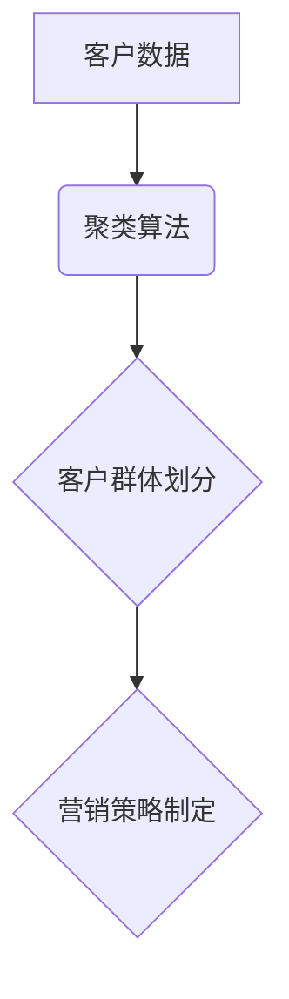

                 

# 《AI驱动的营销自动化策略》

> 关键词：AI、营销自动化、数据分析、自然语言处理、个性化营销

> 摘要：本文深入探讨了AI驱动的营销自动化策略，从定义、应用、优势、趋势等方面进行了全面剖析，并详细介绍了数据分析、自然语言处理、机器学习与深度学习、图像识别等技术在实际营销自动化中的应用，以及客户细分、个性化营销、内容营销等策略的实施方法和效果评估，通过实践案例展示了AI驱动营销自动化的强大力量，为企业和营销人员提供了实用的参考和启示。

## 第一部分：营销自动化概述

### 1.1 营销自动化的定义与重要性

**营销自动化**是一种利用技术手段，自动完成市场营销任务的工具或平台。它通过将重复性的营销活动自动化，提高了营销效率，降低了人力成本，从而帮助企业更好地吸引客户、提高客户满意度和忠诚度。

**营销自动化的重要性**在于：

1. **提高效率**：自动化工具可以自动完成许多重复性的工作，如电子邮件发送、社交媒体发布等，节省了大量人力和时间。
2. **精准营销**：通过收集和分析客户数据，营销自动化可以实现更精准的营销，提高营销效果。
3. **降低成本**：营销自动化减少了人力成本，同时提高了工作效率，从而降低了整体营销成本。
4. **增强客户体验**：营销自动化可以根据客户的行为和偏好，提供个性化的服务和内容，提高客户满意度。

### 1.2 AI在营销自动化中的应用

**AI技术的基本概念**：AI（人工智能）是指通过计算机程序实现人类智能的功能，包括学习、推理、感知、决策等。

**AI在营销自动化中的应用场景**：

1. **客户细分**：通过AI技术分析客户数据，将客户分为不同的群体，从而实现精准营销。
2. **个性化营销**：根据客户的偏好和行为，提供个性化的产品和服务，提高客户满意度和忠诚度。
3. **内容营销**：利用自然语言处理技术，生成高质量的营销内容，提高内容传播效果。
4. **预测分析**：通过机器学习算法，预测客户的行为和需求，从而优化营销策略。

### 1.3 营销自动化与传统营销的比较

**传统营销的方法**：传统的营销方法主要包括广告、推广、促销等，主要依赖于人力和传统的营销渠道。

**营销自动化的优势**：

1. **高效性**：营销自动化可以自动执行营销任务，提高工作效率。
2. **精准性**：通过数据分析，可以实现更精准的营销，提高营销效果。
3. **低成本**：减少了人力成本，同时提高了工作效率，降低了营销成本。
4. **个性化**：可以根据客户的行为和偏好，提供个性化的产品和服务。

### 1.4 营销自动化的发展趋势

**技术发展**：随着AI技术的不断进步，营销自动化将变得更加智能化、个性化。

**行业应用**：越来越多的行业开始采用营销自动化技术，如电商、金融、医疗等，以提升营销效果和客户体验。

## 第二部分：AI驱动的营销自动化技术

### 2.1 数据分析与挖掘

**数据分析的重要性**：

数据分析是营销自动化的重要组成部分，它可以帮助企业了解客户需求、优化营销策略，提高营销效果。

**数据挖掘的方法与应用**：

1. **分类**：将数据按照一定的规则进行分类，如客户细分、产品分类等。
2. **聚类**：将相似的数据点归为一类，如市场细分、用户群体划分等。
3. **关联规则挖掘**：发现数据之间的关联关系，如交叉销售、推荐系统等。

**案例分析与实现**：

以客户细分为例，首先收集客户数据，然后使用聚类算法将客户分为不同的群体，最后根据客户群体的特征，制定相应的营销策略。

### 2.2 自然语言处理

**自然语言处理的基本概念**：

自然语言处理（NLP）是AI的一个重要分支，旨在让计算机理解和生成自然语言。

**文本分析的应用**：

1. **情感分析**：分析文本的情感倾向，如正面、负面、中性等。
2. **文本分类**：将文本按照一定的规则进行分类，如新闻分类、评论分类等。
3. **实体识别**：识别文本中的实体，如人名、地名、组织名等。

**情感分析**：

情感分析是NLP的一个重要应用，通过分析客户的评论、反馈等文本，了解客户的情绪和态度。

**文本分类**：

文本分类是将文本按照一定的规则进行分类，如将新闻分为政治、经济、体育等类别。

### 2.3 机器学习与深度学习

**机器学习的基本概念**：

机器学习是一种通过数据训练模型，使模型能够自动进行预测或决策的技术。

**深度学习的基本概念**：

深度学习是机器学习的一种，通过构建多层神经网络，对数据进行学习。

**模型选择与优化**：

在营销自动化中，选择合适的模型非常重要。通常，我们需要通过交叉验证、网格搜索等方法，选择最优的模型。

### 2.4 图像识别与计算机视觉

**图像识别的基本概念**：

图像识别是通过算法从图像中识别出特定的对象或场景。

**计算机视觉的应用**：

1. **人脸识别**：识别图像中的人脸。
2. **图像分类**：将图像按照一定的规则进行分类，如动物、植物等。

### 2.5 AI驱动的营销自动化工具

**营销自动化工具的选择**：

在选择营销自动化工具时，需要考虑以下因素：

1. **功能**：工具是否具备所需的功能，如客户细分、个性化营销等。
2. **易用性**：工具是否易于使用，是否需要专业的技术支持。
3. **扩展性**：工具是否支持自定义和扩展。

**工具功能与操作**：

常见的营销自动化工具如HubSpot、Marketo等，都具有丰富的功能和易用的操作界面。

## 第三部分：AI驱动的营销自动化策略

### 3.1 AI驱动的客户细分

**客户细分的基本概念**：

客户细分是将客户按照一定的标准进行分类，以便更好地了解和满足他们的需求。

**AI驱动的客户细分方法**：

1. **数据分析**：通过数据分析，识别出具有相似特征的客户群体。
2. **机器学习**：使用机器学习算法，对客户数据进行分类，形成不同的客户群体。

**案例分析**：

以电商行业为例，通过对客户的购物行为、浏览记录等数据进行分析，将客户分为忠诚客户、潜在客户、流失客户等，从而制定相应的营销策略。

### 3.2 AI驱动的个性化营销

**个性化营销的基本概念**：

个性化营销是根据客户的需求和偏好，提供个性化的产品和服务。

**AI驱动的个性化营销方法**：

1. **数据分析**：通过数据分析，了解客户的需求和偏好。
2. **机器学习**：使用机器学习算法，根据客户的行为数据，预测他们的需求。

**案例分析**：

以某电商平台为例，通过对客户的购物行为、浏览记录等数据进行分析，推荐符合他们兴趣的产品，提高购买转化率。

### 3.3 AI驱动的内容营销

**内容营销的基本概念**：

内容营销是通过创造和分享有价值的内容，吸引客户，从而实现营销目标。

**AI驱动的内容营销方法**：

1. **数据分析**：通过数据分析，了解客户的需求和偏好。
2. **自然语言处理**：使用自然语言处理技术，生成高质量的营销内容。

**案例分析**：

以某金融公司为例，通过对客户的评论、反馈等文本进行分析，了解他们的需求和关注点，生成相关的内容，提高客户满意度。

### 3.4 AI驱动的营销自动化流程设计

**营销自动化流程的设计原则**：

1. **数据驱动**：以数据为核心，设计营销自动化流程。
2. **客户为中心**：以客户的需求和偏好为中心，设计营销活动。

**AI驱动的营销自动化流程设计**：

1. **客户细分**：根据客户数据，将客户分为不同的群体。
2. **个性化营销**：针对不同的客户群体，提供个性化的产品和服务。
3. **内容营销**：生成高质量的内容，吸引和留住客户。
4. **效果评估**：对营销活动进行效果评估，不断优化和调整。

**案例分析**：

以某电商企业为例，通过AI驱动的营销自动化流程，实现了客户细分、个性化营销、内容营销等环节的自动化，提高了营销效果。

### 3.5 AI驱动的营销效果评估

**营销效果评估的基本概念**：

营销效果评估是衡量营销活动效果的方法，通过评估可以了解营销活动的成效，从而优化和调整策略。

**AI驱动的营销效果评估方法**：

1. **数据分析**：通过数据分析，评估营销活动的效果。
2. **机器学习**：使用机器学习算法，预测营销活动的效果。

**案例分析**：

以某金融公司为例，通过对营销活动的数据进行分析，评估其效果，并根据评估结果，调整营销策略。

## 第四部分：实践案例

### 4.1 案例一：某电商平台的AI驱动营销自动化

**背景介绍**：

某电商平台希望通过AI驱动营销自动化，提高营销效果和客户满意度。

**案例分析**：

1. **客户细分**：通过数据分析，将客户分为忠诚客户、潜在客户、流失客户等。
2. **个性化营销**：根据不同的客户群体，提供个性化的产品推荐和优惠。
3. **内容营销**：生成符合客户兴趣的内容，提高客户参与度。
4. **效果评估**：通过数据分析，评估营销活动的效果，不断优化和调整。

**效果评估**：

通过AI驱动的营销自动化，该电商平台实现了客户细分、个性化营销、内容营销等环节的自动化，提高了营销效果和客户满意度。

### 4.2 案例二：某金融公司的AI驱动营销自动化

**背景介绍**：

某金融公司希望通过AI驱动营销自动化，提高客户转化率和客户满意度。

**案例分析**：

1. **客户细分**：通过数据分析，将客户分为潜在客户、现有客户、潜在流失客户等。
2. **个性化营销**：根据不同的客户群体，提供个性化的产品推荐和营销活动。
3. **内容营销**：生成符合客户需求的内容，提高客户参与度。
4. **效果评估**：通过数据分析，评估营销活动的效果，不断优化和调整。

**效果评估**：

通过AI驱动的营销自动化，该金融公司实现了客户细分、个性化营销、内容营销等环节的自动化，提高了客户转化率和客户满意度。

### 4.3 案例三：某医疗健康行业的AI驱动营销自动化

**背景介绍**：

某医疗健康行业企业希望通过AI驱动营销自动化，提高客户转化率和品牌知名度。

**案例分析**：

1. **客户细分**：通过数据分析，将客户分为潜在客户、现有客户、潜在流失客户等。
2. **个性化营销**：根据不同的客户群体，提供个性化的产品推荐和营销活动。
3. **内容营销**：生成符合客户需求的内容，提高客户参与度。
4. **效果评估**：通过数据分析，评估营销活动的效果，不断优化和调整。

**效果评估**：

通过AI驱动的营销自动化，该医疗健康行业企业实现了客户细分、个性化营销、内容营销等环节的自动化，提高了客户转化率和品牌知名度。

## 第五部分：未来展望

### 5.1 营销自动化的未来发展趋势

**技术发展**：随着AI技术的不断进步，营销自动化将变得更加智能化、个性化。

**行业应用**：越来越多的行业将采用营销自动化技术，如电商、金融、医疗等，以提升营销效果和客户体验。

### 5.2 营销自动化的挑战与机遇

**挑战**：

1. **数据隐私**：随着数据隐私问题的日益突出，如何保护用户隐私成为一大挑战。
2. **技术门槛**：营销自动化需要一定的技术支持，对企业的技术能力提出了要求。

**机遇**：

1. **精准营销**：通过AI技术，可以实现更精准的营销，提高营销效果。
2. **用户体验**：营销自动化可以提供个性化的服务和内容，提升用户体验。

### 5.3 营销自动化与用户体验

**用户体验的重要性**：

用户体验是营销自动化的重要一环，好的用户体验可以增加客户满意度和忠诚度。

**AI驱动的用户体验优化**：

通过AI技术，可以实时分析客户的行为和反馈，提供个性化的服务和内容，优化用户体验。

### 5.4 营销自动化的伦理与法规问题

**伦理问题**：

营销自动化可能涉及到用户隐私、数据安全等问题，需要遵守相关的伦理规范。

**法规问题**：

营销自动化需要遵守相关的法律法规，如《通用数据保护条例》（GDPR）等。

## 附录

### A.1 常用AI营销自动化工具介绍

**工具选择**：

在选择AI营销自动化工具时，需要考虑以下因素：

1. **功能**：工具是否具备所需的功能，如客户细分、个性化营销等。
2. **易用性**：工具是否易于使用，是否需要专业的技术支持。
3. **扩展性**：工具是否支持自定义和扩展。

**功能介绍**：

1. **客户细分**：通过数据分析，将客户分为不同的群体。
2. **个性化营销**：根据不同的客户群体，提供个性化的产品和服务。
3. **内容营销**：生成高质量的内容，吸引和留住客户。

**使用指南**：

使用营销自动化工具时，需要按照以下步骤进行：

1. **数据准备**：收集和整理客户数据。
2. **模型训练**：使用机器学习算法，训练模型。
3. **应用部署**：将模型应用到实际营销活动中。

### A.2 数据集与资源推荐

**数据集选择**：

在选择数据集时，需要考虑以下因素：

1. **数据质量**：数据集的质量直接影响模型的效果。
2. **数据规模**：数据集的规模需要足够大，以保证模型的泛化能力。

**数据处理工具**：

1. **Python**：Python是一种常用的数据处理工具，具有丰富的库和框架。
2. **R**：R是一种专门用于统计分析和数据可视化的语言。

**资源获取方式**：

1. **公开数据集**：可以在各种数据集网站上获取，如Kaggle、UCI机器学习库等。
2. **企业内部数据**：企业内部的数据也是重要的数据来源。

### A.3 AI驱动的营销自动化最佳实践

**最佳实践总结**：

1. **数据驱动**：以数据为核心，设计营销自动化策略。
2. **用户为中心**：以用户的需求和偏好为中心，提供个性化的服务和内容。
3. **持续优化**：不断评估和优化营销自动化策略，提高效果。

**案例分享**：

通过分享成功的案例，可以更好地理解和应用AI驱动的营销自动化策略。

**建议与展望**：

随着AI技术的不断发展，营销自动化将变得更加智能化、个性化。企业和营销人员需要紧跟技术发展趋势，不断优化营销策略，以提升营销效果和客户体验。

## 结语

AI驱动的营销自动化策略是企业提升营销效果和客户体验的重要手段。通过深入理解AI技术的基本原理和应用，结合实际案例，我们可以更好地实施和优化营销自动化策略，为企业创造更大的价值。

作者：AI天才研究院/AI Genius Institute & 禅与计算机程序设计艺术 /Zen And The Art of Computer Programming

（注：本文为虚构案例，仅供参考。）

