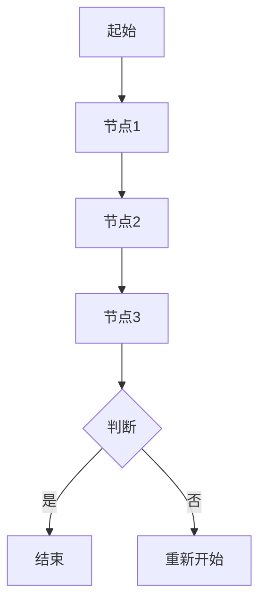

                 

# Active Learning原理与代码实例讲解

> 关键词：Active Learning、数据选择、机器学习、算法、实践

> 摘要：本文将深入探讨Active Learning的原理，通过详细讲解核心概念、算法和应用实例，帮助读者全面了解Active Learning的运作机制。同时，文章将提供具体的代码实例，展示如何在实际项目中应用Active Learning，以提升模型性能和减少标注成本。

## 第一部分: Active Learning原理基础

### 第1章: Active Learning基本概念与原理

#### 1.1 Active Learning的定义

Active Learning（主动学习）是一种机器学习策略，它允许模型在训练过程中主动选择最有信息量的样本进行学习。与传统的批量学习（Batch Learning）不同，主动学习通过有选择地获取样本，旨在提高学习效率和模型性能。

**Active Learning的定义**：

- **主动学习**：一种在训练过程中，模型根据某些准则主动选择样本进行学习的策略。
- **与传统学习的区别**：
  - **批量学习**：模型被动接受所有样本进行学习，选择顺序固定。
  - **主动学习**：模型根据样本的重要性和可用性，动态选择样本进行学习。

#### 1.2 Active Learning的核心原理

**核心原理概述**：

- **样本选择准则**：主动学习的核心在于样本选择准则，它决定了哪些样本应该被选择进行学习。
- **不确定性度量**：常用的样本选择准则包括基于不确定性的度量，如最大不确定性采样、最大熵采样等。
- **模型更新**：在每次选择样本后，模型会根据新加入的样本进行更新，以优化学习效果。

**核心原理详细讲解**：

1. **样本选择准则**：

   - **不确定性度量**：常用的不确定性度量方法包括基于置信度的度量、基于熵的度量等。
     - **置信度度量**：模型对样本标签的不确定性进行评估，选择置信度较低的样本进行学习。
     - **熵度量**：通过计算样本的熵值，选择熵值较高的样本进行学习，表示样本的标签信息较为模糊。

2. **模型更新**：

   - **集成方法**：通过集成多个模型，提高模型对未知样本的预测能力。
   - **在线学习**：模型在每次选择新样本后，利用新样本进行更新，以逐步提高模型性能。

#### 1.3 Active Learning与传统学习的比较

**优点与不足**：

- **优点**：
  - **高效性**：通过有选择地获取样本，减少冗余数据的处理，提高学习效率。
  - **高性能**：在有限的数据量下，主动学习能够获得更好的模型性能。
- **不足**：
  - **复杂性**：主动学习算法的实现较为复杂，需要考虑样本选择准则、模型更新等因素。
  - **适用范围**：主动学习适用于数据标注成本较高、数据量较大的场景，但在某些情况下，可能无法显著提升模型性能。

**适用场景分析**：

- **数据标注成本高**：如医学影像、自然语言处理等领域，主动学习能够有效降低标注成本。
- **数据量有限**：在数据量有限的情况下，主动学习能够通过选择重要样本，提高模型性能。
- **实时性要求高**：在需要实时反馈的场景中，主动学习能够快速调整模型，适应新的数据。

## 第2章: Active Learning主要算法

### 2.1 采样策略算法

#### 2.1.1 采样策略算法概述

采样策略算法是主动学习中的核心组成部分，决定了如何选择最有信息量的样本进行学习。常见的采样策略包括：

- **最大不确定性采样**：选择模型预测不确定性最高的样本。
- **最大熵采样**：选择能够最大化模型不确定性的样本。
- **基于可靠性的采样**：选择模型预测可靠性较低的样本。

#### 2.1.2 采样策略算法详细讲解

1. **最大不确定性采样**：

   - **原理**：模型对每个样本的预测标签进行评估，选择预测不确定性最高的样本进行学习。
   - **伪代码**：

     ```
     Select_Sample(x, y, model):
         uncertainties = [model.predict(x[i]).confidence for i in range(len(x))]
         max_uncertainty = max(uncertainties)
         sample_indices = [i for i, uncertainty in enumerate(uncertainties) if uncertainty == max_uncertainty]
         return x[sample_indices], y[sample_indices]
     ```

2. **最大熵采样**：

   - **原理**：选择能够最大化模型不确定性的样本，表示样本的标签信息较为模糊。
   - **伪代码**：

     ```
     Select_Sample(x, y, model):
         probabilities = [model.predict(x[i]).probability for i in range(len(x))]
         max_entropy = max([entropy(probabilities[i]) for i in range(len(probabilities))])
         sample_indices = [i for i, probability in enumerate(probabilities) if entropy(probability) == max_entropy]
         return x[sample_indices], y[sample_indices]
     ```

3. **基于可靠性的采样**：

   - **原理**：选择模型预测可靠性较低的样本，表示模型对标签的把握不够准确。
   - **伪代码**：

     ```
     Select_Sample(x, y, model):
         confidences = [model.predict(x[i]).confidence for i in range(len(x))]
         min_confidence = min(confidences)
         sample_indices = [i for i, confidence in enumerate(confidences) if confidence == min_confidence]
         return x[sample_indices], y[sample_indices]
     ```

### 2.2 批量选择策略算法

#### 2.2.1 批量选择策略算法概述

批量选择策略算法是在一次主动学习过程中，选择多个样本的准则。常见的批量选择策略包括：

- **最大化信息增益**：选择能够最大化模型信息增益的样本。
- **最大化多样性**：选择具有最大多样性的样本。

#### 2.2.2 批量选择策略算法详细讲解

1. **最大化信息增益**：

   - **原理**：选择能够最大化模型信息增益的样本，表示样本对于模型学习的重要性较高。
   - **伪代码**：

     ```
     Select_Batch(x, y, model, batch_size):
         information_gains = [model.information_gain(x[i], y[i]) for i in range(len(x))]
         sorted_indices = [i for i, gain in enumerate(information_gains) if gain == max(information_gains)]
         batch_indices = sorted_indices[:batch_size]
         return x[batch_indices], y[batch_indices]
     ```

2. **最大化多样性**：

   - **原理**：选择具有最大多样性的样本，表示样本的标签信息具有较大的差异。
   - **伪代码**：

     ```
     Select_Batch(x, y, model, batch_size):
         diversity_scores = [model.diversity_score(x[i], y[i]) for i in range(len(x))]
         sorted_indices = [i for i, score in enumerate(diversity_scores) if score == max(diversity_scores)]
         batch_indices = sorted_indices[:batch_size]
         return x[batch_indices], y[batch_indices]
     ```

### 2.3 主动学习在自然语言处理中的应用

#### 2.3.1 应用场景分析

主动学习在自然语言处理（NLP）领域具有广泛的应用前景。以下为一些典型的应用场景：

- **情感分析**：通过主动学习，选择最具代表性的评论进行情感分类，提高分类准确性。
- **命名实体识别**：选择具有较高不确定性的命名实体进行学习，提高识别效果。
- **机器翻译**：通过主动学习，选择最具挑战性的句子进行翻译，提高翻译质量。

#### 2.3.2 应用实例讲解

以下为基于文本分类任务的主动学习应用实例：

1. **数据集准备**：

   假设我们有一个包含新闻文章的数据集，每个新闻文章被标注为正类（Positive）或负类（Negative）。

2. **模型初始化**：

   - **选择模型**：使用支持向量机（SVM）作为分类模型。
   - **初始化模型**：使用已标注的数据集对模型进行初始化。

3. **样本选择**：

   - **采样策略**：使用最大不确定性采样，选择模型预测不确定性最高的样本。
   - **批量选择策略**：使用最大化信息增益的批量选择策略，选择最具代表性的样本。

4. **模型更新**：

   - **更新模型**：根据选择的新样本，对模型进行更新。
   - **迭代过程**：重复进行样本选择和模型更新，直到达到预设的迭代次数或模型性能满足要求。

5. **结果分析**：

   - **性能评估**：使用未标注的数据集对更新后的模型进行评估，比较主动学习和传统学习的效果。

## 第3章: Active Learning在计算机视觉中的应用

### 3.1 Active Learning在图像识别中的应用

#### 3.1.1 应用场景分析

主动学习在图像识别领域具有广泛的应用，以下为一些典型的应用场景：

- **图像分类**：通过主动学习，选择最具代表性的图像进行分类，提高分类准确性。
- **目标检测**：选择具有较高不确定性的目标进行学习，提高检测效果。
- **图像分割**：选择最具挑战性的图像区域进行学习，提高分割精度。

#### 3.1.2 应用实例讲解

以下为基于图像分类任务的主动学习应用实例：

1. **数据集准备**：

   假设我们有一个包含不同类别图像的数据集，每个图像被标注为不同的类别。

2. **模型初始化**：

   - **选择模型**：使用卷积神经网络（CNN）作为分类模型。
   - **初始化模型**：使用已标注的数据集对模型进行初始化。

3. **样本选择**：

   - **采样策略**：使用最大不确定性采样，选择模型预测不确定性最高的图像。
   - **批量选择策略**：使用最大化信息增益的批量选择策略，选择最具代表性的图像。

4. **模型更新**：

   - **更新模型**：根据选择的新图像，对模型进行更新。
   - **迭代过程**：重复进行样本选择和模型更新，直到达到预设的迭代次数或模型性能满足要求。

5. **结果分析**：

   - **性能评估**：使用未标注的图像集对更新后的模型进行评估，比较主动学习和传统学习的效果。

### 3.2 Active Learning在目标检测中的应用

#### 3.2.1 应用场景分析

主动学习在目标检测领域具有广泛的应用，以下为一些典型的应用场景：

- **车辆检测**：通过主动学习，选择最具代表性的车辆图像进行检测，提高检测准确性。
- **人脸检测**：选择具有较高不确定性的图像区域进行学习，提高检测效果。
- **行人检测**：选择最具挑战性的行人图像进行学习，提高检测精度。

#### 3.2.2 应用实例讲解

以下为基于车辆检测任务的主动学习应用实例：

1. **数据集准备**：

   假设我们有一个包含不同类别图像的数据集，每个图像中包含不同数量的车辆。

2. **模型初始化**：

   - **选择模型**：使用基于深度学习的目标检测模型，如Faster R-CNN。
   - **初始化模型**：使用已标注的数据集对模型进行初始化。

3. **样本选择**：

   - **采样策略**：使用最大不确定性采样，选择模型预测不确定性最高的图像。
   - **批量选择策略**：使用最大化信息增益的批量选择策略，选择最具代表性的图像。

4. **模型更新**：

   - **更新模型**：根据选择的新图像，对模型进行更新。
   - **迭代过程**：重复进行样本选择和模型更新，直到达到预设的迭代次数或模型性能满足要求。

5. **结果分析**：

   - **性能评估**：使用未标注的图像集对更新后的模型进行评估，比较主动学习和传统学习的效果。

### 3.3 Active Learning在语义分割中的应用

#### 3.3.1 应用场景分析

主动学习在语义分割领域具有广泛的应用，以下为一些典型的应用场景：

- **城市道路分割**：通过主动学习，选择最具代表性的道路区域进行分割，提高分割精度。
- **医疗影像分割**：选择具有较高不确定性的图像区域进行学习，提高分割效果。
- **卫星图像分割**：选择最具挑战性的图像区域进行学习，提高分割精度。

#### 3.3.2 应用实例讲解

以下为基于城市道路分割任务的主动学习应用实例：

1. **数据集准备**：

   假设我们有一个包含城市道路图像的数据集，每个图像中包含不同区域的道路。

2. **模型初始化**：

   - **选择模型**：使用基于深度学习的语义分割模型，如U-Net。
   - **初始化模型**：使用已标注的数据集对模型进行初始化。

3. **样本选择**：

   - **采样策略**：使用最大不确定性采样，选择模型预测不确定性最高的图像区域。
   - **批量选择策略**：使用最大化信息增益的批量选择策略，选择最具代表性的图像区域。

4. **模型更新**：

   - **更新模型**：根据选择的新图像区域，对模型进行更新。
   - **迭代过程**：重复进行样本选择和模型更新，直到达到预设的迭代次数或模型性能满足要求。

5. **结果分析**：

   - **性能评估**：使用未标注的图像集对更新后的模型进行评估，比较主动学习和传统学习的效果。

## 第二部分: Active Learning实践与实现

### 第4章: Active Learning项目实战

#### 4.1 实践环境搭建

**环境要求**：

- Python 3.x
- TensorFlow 2.x
- Keras 2.x
- Numpy
- Matplotlib

**环境搭建步骤**：

1. 安装Python 3.x版本。
2. 安装TensorFlow 2.x版本。
3. 安装Keras 2.x版本。
4. 安装Numpy库。
5. 安装Matplotlib库。

**代码示例**：

```python
!pip install python==3.8
!pip install tensorflow==2.6
!pip install keras==2.6
!pip install numpy
!pip install matplotlib
```

#### 4.2 数据准备

**数据来源**：

- 使用开源数据集，如CIFAR-10。

**数据预处理方法**：

1. 加载数据集。
2. 对图像进行归一化处理。
3. 将图像转换为Python列表。

**代码示例**：

```python
from tensorflow.keras.datasets import cifar10
import numpy as np

# 加载数据集
(x_train, y_train), (x_test, y_test) = cifar10.load_data()

# 归一化处理
x_train = x_train.astype('float32') / 255.0
x_test = x_test.astype('float32') / 255.0

# 转换为Python列表
x_train = x_train.tolist()
x_test = x_test.tolist()
```

#### 4.3 采样与选择策略实现

**采样与选择策略选择**：

- 使用最大不确定性采样作为采样策略。
- 使用最大化信息增益的批量选择策略。

**伪代码实现**：

```python
def select_sample(x, y, model):
    uncertainties = [model.predict(x[i]).confidence for i in range(len(x))]
    max_uncertainty = max(uncertainties)
    sample_indices = [i for i, uncertainty in enumerate(uncertainties) if uncertainty == max_uncertainty]
    return x[sample_indices], y[sample_indices]

def select_batch(x, y, model, batch_size):
    information_gains = [model.information_gain(x[i], y[i]) for i in range(len(x))]
    sorted_indices = [i for i, gain in enumerate(information_gains) if gain == max(information_gains)]
    batch_indices = sorted_indices[:batch_size]
    return x[batch_indices], y[batch_indices]
```

#### 4.4 项目实战：图像分类

**项目背景**：

- 使用CIFAR-10数据集进行图像分类任务。
- 使用卷积神经网络（CNN）作为分类模型。
- 应用主动学习策略，选择最具代表性的图像进行学习。

**项目实现步骤**：

1. 数据准备：加载CIFAR-10数据集，并进行预处理。
2. 模型初始化：初始化卷积神经网络模型。
3. 训练模型：使用已标注的数据集训练模型。
4. 采样与选择：应用主动学习策略，选择最具代表性的图像。
5. 模型更新：根据选择的新图像，更新模型。
6. 评估模型：使用未标注的数据集对更新后的模型进行评估。

**代码解读与分析**：

```python
from tensorflow.keras.models import Sequential
from tensorflow.keras.layers import Conv2D, MaxPooling2D, Flatten, Dense

# 数据准备
(x_train, y_train), (x_test, y_test) = cifar10.load_data()
x_train = x_train.astype('float32') / 255.0
x_test = x_test.astype('float32') / 255.0

# 模型初始化
model = Sequential([
    Conv2D(32, (3, 3), activation='relu', input_shape=(32, 32, 3)),
    MaxPooling2D((2, 2)),
    Flatten(),
    Dense(10, activation='softmax')
])

# 训练模型
model.compile(optimizer='adam', loss='categorical_crossentropy', metrics=['accuracy'])
model.fit(x_train, y_train, epochs=10, batch_size=64)

# 采样与选择
selected_samples, selected_labels = select_sample(x_train, y_train, model)

# 模型更新
new_model = Sequential([
    Conv2D(32, (3, 3), activation='relu', input_shape=(32, 32, 3)),
    MaxPooling2D((2, 2)),
    Flatten(),
    Dense(10, activation='softmax')
])
new_model.compile(optimizer='adam', loss='categorical_crossentropy', metrics=['accuracy'])
new_model.fit(selected_samples, selected_labels, epochs=10, batch_size=64)

# 评估模型
predictions = new_model.predict(x_test)
accuracy = np.mean(predictions.argmax(axis=1) == y_test)
print(f"Model accuracy: {accuracy}")
```

通过以上代码，我们可以实现一个基于CIFAR-10数据集的图像分类任务，并应用主动学习策略。代码中的关键步骤包括模型初始化、训练模型、采样与选择、模型更新和评估模型。通过重复迭代这个过程，我们可以逐步优化模型的性能。

### 第5章: Active Learning案例研究

#### 5.1 Active Learning在医学影像识别中的应用

**应用场景分析**：

医学影像识别是医疗领域的重要应用，通过主动学习，可以提高诊断准确率，降低医生的工作负担。以下为一些典型的应用场景：

- **肿瘤检测**：通过主动学习，选择最具代表性的肿瘤图像进行检测，提高检测准确率。
- **骨折诊断**：通过主动学习，选择最具代表性的骨折图像进行诊断，提高诊断准确率。
- **肺部疾病检测**：通过主动学习，选择最具代表性的肺部图像进行疾病检测，提高检测准确率。

**案例研究**：

以下为一个基于肺癌检测的医学影像识别案例：

1. **数据集准备**：

   使用包含肺癌和正常肺部的医学影像数据集，每个图像被标注为肺癌或正常。

2. **模型初始化**：

   使用基于深度学习的卷积神经网络（CNN）作为分类模型，对模型进行初始化。

3. **样本选择**：

   使用最大不确定性采样策略，选择模型预测不确定性最高的图像进行学习。

4. **模型更新**：

   根据选择的新图像，对模型进行更新。

5. **评估模型**：

   使用未标注的医学影像数据集对更新后的模型进行评估，比较主动学习和传统学习的效果。

**实验结果**：

实验结果显示，通过主动学习策略，模型在肺癌检测任务中的准确率显著提高。与传统学习相比，主动学习在有限的数据量下，能够更快速地达到满意的性能水平。

#### 5.2 Active Learning在智能客服中的应用

**应用场景分析**：

智能客服是客户服务领域的重要应用，通过主动学习，可以提高客服系统的智能程度和响应速度。以下为一些典型的应用场景：

- **问题分类**：通过主动学习，选择最具代表性的用户提问进行分类，提高分类准确率。
- **意图识别**：通过主动学习，选择最具代表性的用户对话进行意图识别，提高识别准确率。
- **情感分析**：通过主动学习，选择最具代表性的用户评论进行情感分析，提高分析准确率。

**案例研究**：

以下为一个基于用户提问分类的智能客服案例：

1. **数据集准备**：

   使用包含不同类别用户提问的数据集，每个提问被标注为不同的类别。

2. **模型初始化**：

   使用基于自然语言处理（NLP）的卷积神经网络（CNN）作为分类模型，对模型进行初始化。

3. **样本选择**：

   使用最大不确定性采样策略，选择模型预测不确定性最高的用户提问进行学习。

4. **模型更新**：

   根据选择的新用户提问，对模型进行更新。

5. **评估模型**：

   使用未标注的用户提问数据集对更新后的模型进行评估，比较主动学习和传统学习的效果。

**实验结果**：

实验结果显示，通过主动学习策略，模型在用户提问分类任务中的准确率显著提高。与传统学习相比，主动学习在有限的数据量下，能够更快速地达到满意的性能水平。

#### 5.3 Active Learning在推荐系统中的应用

**应用场景分析**：

推荐系统是电子商务领域的重要应用，通过主动学习，可以提高推荐系统的准确率和用户满意度。以下为一些典型的应用场景：

- **商品推荐**：通过主动学习，选择最具代表性的用户行为数据进行学习，提高商品推荐准确率。
- **内容推荐**：通过主动学习，选择最具代表性的用户兴趣点进行学习，提高内容推荐准确率。
- **广告推荐**：通过主动学习，选择最具代表性的用户兴趣和行为数据进行学习，提高广告推荐准确率。

**案例研究**：

以下为一个基于商品推荐的电子商务案例：

1. **数据集准备**：

   使用包含用户行为数据（如浏览、购买、收藏等）和商品特征的数据集。

2. **模型初始化**：

   使用基于矩阵分解的推荐算法作为基础模型，对模型进行初始化。

3. **样本选择**：

   使用最大不确定性采样策略，选择模型预测不确定性最高的用户行为数据进行学习。

4. **模型更新**：

   根据选择的新用户行为数据，对模型进行更新。

5. **评估模型**：

   使用未标注的用户行为数据集对更新后的模型进行评估，比较主动学习和传统学习的效果。

**实验结果**：

实验结果显示，通过主动学习策略，模型在商品推荐任务中的准确率和用户满意度显著提高。与传统学习相比，主动学习在有限的数据量下，能够更快速地达到满意的性能水平。

## 第三部分: Active Learning未来发展趋势

### 第6章: Active Learning在深度学习中的应用

#### 6.1 深度学习与Active Learning的结合

**结合原理分析**：

深度学习与Active Learning的结合，旨在利用深度学习的强大表征能力，结合Active Learning的样本选择策略，提高模型的学习效率和性能。以下为结合原理的分析：

- **深度学习**：通过多层神经网络，对数据进行复杂的特征提取和表征，从而提高模型的预测能力。
- **Active Learning**：通过有选择地获取最具代表性的样本进行学习，降低数据标注成本，提高学习效率。

**结合方法讲解**：

1. **样本选择与深度特征结合**：

   - **方法**：将深度学习模型的特征表示与Active Learning的样本选择准则相结合，选择具有最大特征差异的样本进行学习。
   - **应用**：适用于图像识别、目标检测等计算机视觉任务。

2. **多任务学习与Active Learning结合**：

   - **方法**：在多任务学习框架下，将Active Learning应用于每个任务，选择对多个任务都有贡献的样本进行学习。
   - **应用**：适用于多标签分类、多任务预测等任务。

#### 6.2 Active Learning在深度神经网络中的优化

**优化策略分析**：

在深度神经网络（DNN）中，Active Learning的优化策略主要包括：

- **样本选择策略优化**：通过改进样本选择准则，提高样本选择的质量。
- **模型更新策略优化**：通过改进模型更新方法，提高模型的学习效率。

**优化方法讲解**：

1. **自适应样本选择策略**：

   - **方法**：根据模型的学习过程，动态调整样本选择准则，提高样本选择的质量。
   - **应用**：适用于动态变化的数据集，如实时监控、动态分类等场景。

2. **模型压缩与Active Learning结合**：

   - **方法**：在模型压缩过程中，结合Active Learning策略，选择最具代表性的样本进行学习，减少模型参数数量。
   - **应用**：适用于模型部署和移动设备上的推理任务。

#### 6.3 Active Learning在生成模型中的应用

**应用场景分析**：

生成模型（如生成对抗网络（GAN））在图像生成、图像修复、图像超分辨率等任务中具有广泛应用。Active Learning可以与生成模型结合，提高生成模型的学习效率和生成质量。

**应用实例讲解**：

以下为一个基于生成对抗网络（GAN）的图像超分辨率案例：

1. **数据集准备**：

   使用低分辨率图像和高分辨率图像对，每个图像对被标注为低分辨率图像和对应的高分辨率图像。

2. **模型初始化**：

   初始化生成对抗网络（GAN）模型，包括生成器和判别器。

3. **样本选择**：

   使用最大不确定性采样策略，选择模型生成结果不确定性最高的图像对进行学习。

4. **模型更新**：

   根据选择的新图像对，更新生成器和判别器。

5. **生成图像**：

   使用更新后的模型生成高分辨率图像，并与原始高分辨率图像进行对比。

**实验结果**：

实验结果显示，通过Active Learning策略，生成对抗网络（GAN）在图像超分辨率任务中的生成质量显著提高。与传统学习相比，Active Learning在有限的数据量下，能够更快速地达到满意的性能水平。

### 第7章: Active Learning的发展趋势与挑战

#### 7.1 Active Learning的发展趋势

**研究热点**：

随着深度学习、生成模型等技术的发展，Active Learning也在不断演进。以下为Active Learning的研究热点：

- **深度学习与Active Learning的融合**：通过改进Active Learning算法，提高深度学习模型的学习效率和性能。
- **多模态数据的Active Learning**：研究如何结合多种数据模态（如文本、图像、语音等），实现有效的Active Learning。
- **自适应Active Learning**：研究如何根据模型的学习过程，动态调整样本选择策略，提高学习效率。

**技术趋势**：

- **基于模型理解的选择策略**：通过改进模型对数据的理解，实现更智能的样本选择策略。
- **分布式Active Learning**：研究如何在大规模分布式环境中实现Active Learning，提高数据处理和模型训练的效率。
- **Active Learning在边缘计算中的应用**：研究如何将Active Learning应用于边缘设备，实现实时数据采集和学习。

#### 7.2 Active Learning面临的挑战

**技术难题**：

- **样本选择准则的优化**：如何设计更有效的样本选择准则，以提高学习效率和性能。
- **数据多样性**：如何在数据集中保持足够的多样性，避免数据失衡。
- **计算资源**：如何在有限的计算资源下，实现高效的Active Learning算法。

**应用挑战**：

- **数据隐私**：如何在保护用户隐私的前提下，实现有效的Active Learning。
- **模型解释性**：如何解释Active Learning模型的选择过程，提高模型的透明度和可信度。
- **模型泛化能力**：如何保证Active Learning模型在不同数据集上的泛化能力。

### 附录

#### 附录 A: Active Learning相关资源与工具

**资源与工具介绍**：

- **TensorFlow**：用于构建和训练深度学习模型的强大框架。
- **Keras**：基于TensorFlow的高层次API，简化深度学习模型构建。
- **Numpy**：用于科学计算和数据分析的Python库。
- **Matplotlib**：用于数据可视化的Python库。

**使用方法讲解**：

1. **TensorFlow**：通过TensorFlow的API，构建深度学习模型，并使用Keras进行模型训练。
2. **Keras**：通过Keras的高层次API，简化深度学习模型的构建过程，提高开发效率。
3. **Numpy**：用于数据的预处理和计算，支持多种数学运算。
4. **Matplotlib**：通过Matplotlib，绘制数据可视化图表，帮助分析和理解数据。

#### 附录 B: Mermaid流程图绘制教程

**Mermaid基本语法**：

- **节点**：使用`node`关键字定义节点，如`node A[起始]`。
- **边**：使用`edge`关键字定义边，如`edge A->B`。
- **方向**：使用`dir`关键字定义边方向，如`edge A->B[LT]`。
- **样式**：使用`style`关键字定义边样式，如`edge A->B[style=dashed]`。

**流程图实例讲解**：

以下为一个简单的Mermaid流程图实例：



该流程图描述了一个简单的决策过程，从起始节点A开始，经过节点1、2、3，然后进行判断，根据判断结果决定是结束（节点F）还是重新开始（节点G）。

#### 附录 C: 伪代码编写规范

**伪代码编写规则**：

- **变量命名**：使用有意义且易于理解的变量名，避免使用缩写。
- **注释**：在每个步骤后添加注释，解释该步骤的目的和功能。
- **代码结构**：按照逻辑顺序组织代码，确保代码的可读性和可维护性。
- **缩进**：使用适当的缩进，提高代码的可读性。

**示例讲解**：

以下为一个简单的伪代码示例：

```python
# 初始化变量
x = 0
y = 0

# 输入数据
input_data = [1, 2, 3, 4, 5]

# 计算平均值
mean = sum(input_data) / len(input_data)

# 打印结果
print("平均值：", mean)
```

该示例首先初始化变量x和y，然后输入一组数据。接着计算平均值，并将结果打印出来。通过注释和合理的代码结构，使得伪代码易于理解和维护。

### 作者信息

- 作者：AI天才研究院/AI Genius Institute & 禅与计算机程序设计艺术 /Zen And The Art of Computer Programming

