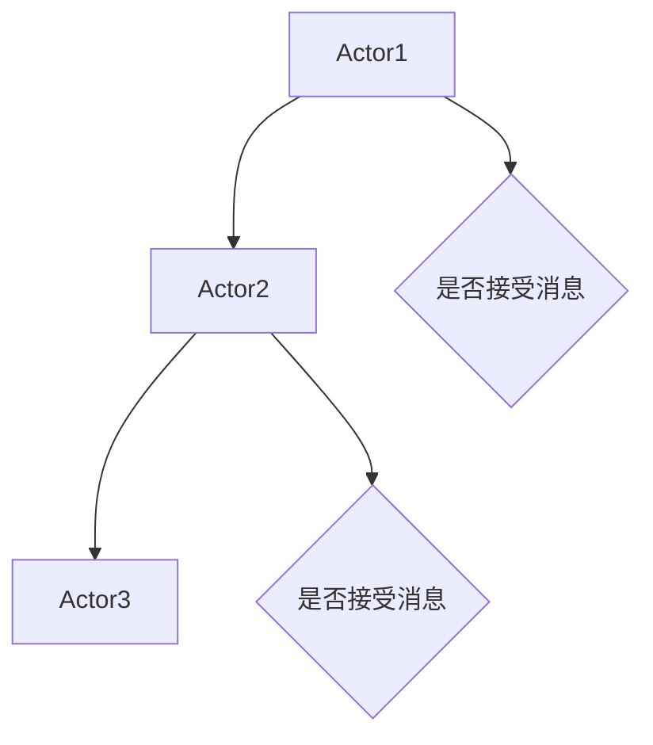
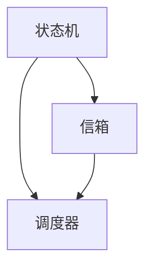
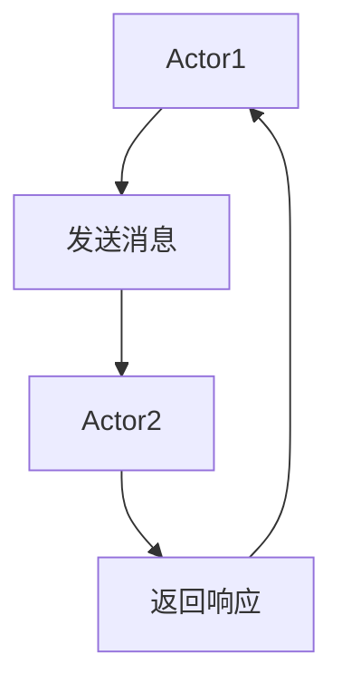
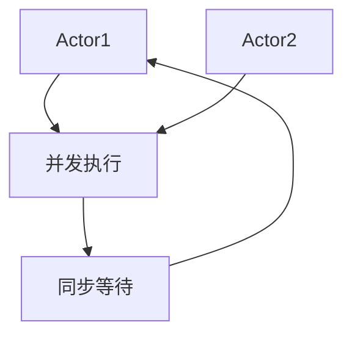
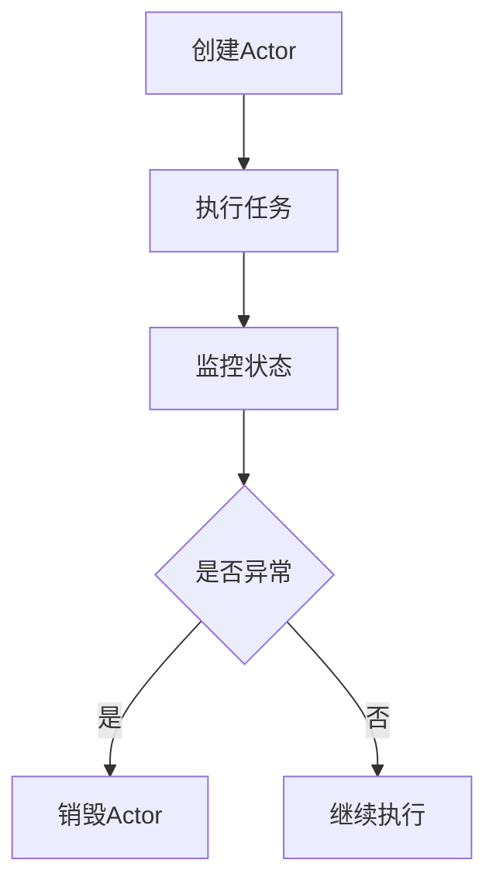

                 

### 文章标题: Actor Model原理与代码实例讲解

#### 关键词：Actor Model，并发编程，分布式系统，消息传递，性能优化，云原生应用

#### 摘要：

本文将深入探讨Actor Model的原理与实现，从基础理论到实际应用，全面解析这一现代并发编程和分布式系统设计的重要模型。我们将通过实例代码，详细讲解Actor Model的核心概念、基础架构、编程实践，以及其在分布式系统和云原生环境中的应用。通过本文的学习，读者将能够掌握Actor Model的核心原理，并具备在项目中实际应用的能力。

### 第一部分：Actor Model概述

#### 第1章：Actor Model基础理论

#### 1.1 Actor Model的定义与核心概念

Actor Model起源于并发编程和分布式系统的需求，它提供了一种简化和优化这些领域的方法。在这个模型中，**Actor** 是一个独立、异步、并发、分布式的计算单元。每个Actor具有以下核心概念：

- **Actor的定义**：一个Actor是一个可以被异步发送消息并可以响应这些消息的计算单元。每个Actor都有自己的状态，它们可以通过发送和接收消息来与其他Actor进行通信。
  
- **Actor状态**：Actor的状态是它的内部数据结构，它决定了Actor如何响应接收到的消息。

- **Actor通信**：Actor之间通过发送和接收消息来进行通信。消息可以是任何类型的数据，包括文本、图像、音频等。

- **死亡机制**：当Actor无法处理接收到的消息时，它可以进入死亡状态。这时，它将从系统中移除，以防止消息丢失或系统崩溃。

- **寄信机制**：Actor在处理消息时，可以选择将消息发送给其他Actor。这种机制允许Actor之间的异步通信，从而提高系统的并发性。

#### 1.2 Actor Model的特点与优势

Actor Model具有以下显著特点与优势：

- **无状态**：Actor通常是无状态的，这意味着它们不会保留任何与特定请求相关的状态信息。这种设计有助于提高系统的可伸缩性和容错性。

- **无共享内存**：Actor之间不共享内存，它们通过消息传递进行通信。这种设计避免了竞争条件和死锁问题，同时也简化了并发控制。

- **并发性好**：由于Actor之间通过异步消息传递进行通信，因此多个Actor可以同时执行，从而提高了系统的并发性。

- **分布式计算能力强**：Actor Model支持分布式计算，使得系统可以轻松扩展到多个计算机或节点，从而提高系统的性能和可伸缩性。

- **提高系统可靠性**：Actor Model的设计使得系统具有更高的容错性，因为单个Actor的故障不会影响整个系统的运行。

- **易于维护和扩展**：Actor Model的组件是独立的，这使得系统的维护和扩展变得相对容易。

- **提供透明分布式计算能力**：Actor Model使得分布式计算变得透明，开发人员无需担心系统的分布式特性，从而可以专注于业务逻辑的实现。

#### 1.3 Actor Model的背景与演进

Actor Model的概念起源于并发编程和分布式系统的需求。在早期，编程语言和系统通常采用共享内存模型来处理并发问题。然而，随着系统的复杂性和规模的增加，共享内存模型暴露出了许多问题，如竞争条件、死锁和同步开销等。

为了解决这些问题，研究人员提出了Actor Model。第一个实现Actor Model的编程语言是Erlang，它在1990年代被设计用于构建高并发、分布式系统。Erlang的成功推动了Actor Model在其他编程语言和框架中的发展。

近年来，Actor Model在编程语言和框架中得到了更广泛的应用，如Akka、Scala Actors、Apache Akita等。这些实现不仅保持了Actor Model的核心特性，还增加了许多新的功能和优化，使得Actor Model在现代并发编程和分布式系统设计中更具吸引力。

#### 1.4 Actor Model的核心概念图解

为了更好地理解Actor Model的核心概念，我们可以使用Mermaid流程图来展示其基本结构和工作流程。以下是一个简化的Actor Model流程图：



在这个流程图中，Actor1发送消息给Actor2，并等待Actor2的响应。Actor2处理消息后，可以发送消息给Actor3。每个Actor在接收到消息后，根据其内部状态决定是否接受消息，并执行相应的操作。

### 总结

在本章中，我们介绍了Actor Model的基础理论，包括其定义、核心概念、特点与优势、背景与演进以及核心概念图解。通过这些内容，读者可以初步了解Actor Model的基本原理和其在并发编程和分布式系统设计中的应用价值。

在下一章中，我们将进一步探讨Actor Model的基础架构，包括Actor的内部架构、通信机制、并发与同步机制以及生命周期管理等内容。这将帮助读者更深入地理解Actor Model的工作原理，为后续的编程实践和分布式系统设计打下坚实的基础。

---

### 第2章：Actor Model基础架构

#### 2.1 Actor的内部架构

Actor的内部架构是理解Actor Model的关键。一个典型的Actor内部通常包括以下几个主要组件：

- **状态机**：状态机负责管理Actor的状态，包括初始化状态、处理状态、结束状态等。状态机通过状态转换函数来响应Actor接收到的消息，并更新Actor的内部状态。

- **信箱**：信箱是存储Actor接收到的消息的缓冲区。当Actor接收到消息时，消息会被存储在信箱中，并等待处理。信箱的设计通常支持多种策略，如先进先出（FIFO）、优先级队列等，以适应不同的应用场景。

- **调度器**：调度器负责执行Actor的消息处理逻辑。当Actor接收到消息后，调度器会从信箱中取出消息，并调用相应的处理函数。调度器还可以根据需要将Actor的状态机、信箱和消息处理逻辑进行调度，以提高系统的并发性和效率。

以下是一个简化的Actor内部架构图：



#### 2.2 Actor通信机制

Actor之间的通信是通过消息传递实现的。消息传递机制是Actor Model的核心，它决定了Actor如何交互和协作。

- **异步通信**：异步通信是指发送消息后不需要等待回复。这种通信方式允许Actor独立执行，从而提高系统的并发性。异步通信通常通过发送和接收消息的函数实现，如`send(message)`和`receive(message)`。

- **响应式通信**：响应式通信是指发送消息后需要等待回复。这种通信方式允许Actor之间进行同步交互，从而实现特定的业务逻辑。响应式通信通常通过发送和接收消息的函数实现，如`sendAndReceive(message, response)`。

以下是一个简化的Actor通信流程：



在这个流程图中，Actor1向Actor2发送消息，Actor2处理消息并返回响应，然后Actor1接收响应并继续执行。

#### 2.3 Actor模型中的并发与同步

Actor Model中的并发与同步是理解其优势的关键。

- **并发**：在Actor Model中，多个Actor可以同时执行，从而提高了系统的并发性。Actor之间通过异步消息传递进行通信，这使得系统可以并行处理多个任务，从而提高系统的性能。

- **同步**：同步是指在执行某个操作之前必须等待某个条件成立。在Actor Model中，同步通常通过响应式通信实现。例如，一个Actor可能需要等待另一个Actor的消息响应后才能继续执行。同步可以确保Actor之间的协作和依赖关系得到正确处理。

以下是一个简化的Actor并发与同步流程：



在这个流程图中，Actor1和Actor2并发执行，并在需要时进行同步等待，以确保系统的正确性和一致性。

#### 2.4 Actor的生命周期管理

Actor的生命周期管理是确保系统稳定性和可靠性的关键。

- **创建与销毁**：Actor的创建和销毁通常由系统的调度器或管理者负责。当Actor不再需要时，可以将其销毁以释放系统资源。

- **监控与监督**：监控与监督是确保系统稳定性的重要机制。通过监控Actor的状态和行为，可以及时发现并处理异常情况，从而提高系统的可靠性和可用性。

以下是一个简化的Actor生命周期管理流程：



在这个流程图中，Actor在创建后执行任务，并在执行过程中进行状态监控。如果出现异常，Actor将被销毁；否则，Actor将继续执行任务。

### 总结

在本章中，我们详细介绍了Actor Model的基础架构，包括Actor的内部架构、通信机制、并发与同步机制以及生命周期管理。这些内容是理解Actor Model的关键，为我们在下一章中的编程实践和分布式系统设计奠定了坚实的基础。

在下一章中，我们将通过实际代码示例，深入探讨如何使用Actor Model进行编程实践。通过这些示例，读者将能够更直观地理解Actor Model的应用方法和优势。

---

### 第3章：Actor Model编程实践

#### 3.1 Actor编程基础

在实际编程中，Actor Model提供了一种清晰且易于理解的并发编程范式。本节将介绍如何创建和启动Actor，以及如何在Actor之间传递消息。

#### 3.1.1 创建与启动Actor

在大多数实现Actor Model的编程语言中，创建和启动Actor通常非常简单。以下是一个使用Erlang语言创建和启动Actor的示例：

```erlang
-module(actor_example).
-export([start/0, actor_loop/1]).

start() ->
    Pid = spawn(actor_example, actor_loop, [initial_state()]),
    Pid.

actor_loop(State) ->
    receive
        {message, Msg} ->
            NewState = process_message(State, Msg),
            actor_loop(NewState);
        {shutdown} ->
            io:format("Actor shutting down.~n"),
            exit(normal).
    end.

initial_state() -> initial_state.

process_message(State, {message, Msg}) ->
    % 处理消息的逻辑
    NewState = State ++ [Msg],
    NewState.
```

在上面的代码中，我们定义了一个名为`actor_example`的模块，其中`start/0`函数用于创建和启动一个Actor。`spawn`函数用于创建一个新的进程，并调用`actor_loop/1`函数作为Actor的主循环。`initial_state()`函数返回初始状态，`process_message/2`函数用于处理接收到的消息。

#### 3.1.2 消息传递

Actor之间的通信是通过发送和接收消息实现的。以下是一个示例，展示如何向Actor发送消息并接收响应：

```erlang
-module(sender).
-export([send_message/2]).

send_message(Pid, Msg) ->
    Pid ! {message, Msg},
    receive
        {response, Resp} ->
            Resp
    end.
```

在上面的代码中，`send_message/2`函数接收一个Actor的进程标识（`Pid`）和一个消息（`Msg`），并使用`!`操作符发送消息。然后，它等待Actor的响应，并返回响应消息。

#### 3.2 Actor应用实例

为了更好地理解Actor Model的应用，我们可以通过一些实际的应用实例来探讨其使用方法。

##### 3.2.1 日志处理系统

日志处理系统是一个典型的应用场景，它需要处理大量并发日志数据。以下是一个使用Actor Model构建的简单日志处理系统的示例：

```erlang
-module(log_processor).
-export([start/0, handle_logs/1]).

start() ->
    {ok, Supervisor} = supervisor:start_link({local, supervisor}, log_processor_sup, []),
    supervisor:start_child(Supervisor, [self()]).

handle_logs(Logs) ->
    lists:foreach(fun(log/1), Logs).

log(Log) ->
    io:format("Processing log: ~p~n", [Log]).

module log_processor_sup.
-export([start/0]).

start() ->
    {ok, _} = supervisor:start_child(log_processor, {worker, log_processor, start, []}),
    ok.
```

在上面的代码中，`log_processor`模块负责处理日志数据。`start/0`函数启动一个supervisor进程，用于创建和监控Worker进程。`handle_logs/1`函数接收一个日志列表，并使用`foreach`函数遍历日志，调用`log/1`函数处理每个日志条目。

##### 3.2.2 并发Web服务器

并发Web服务器是另一个典型的应用场景。以下是一个使用Actor Model构建的简单并发Web服务器的示例：

```erlang
-module(web_server).
-export([start/0, handle_request/1]).

start() ->
    {ok, Socket} = gen_tcp:listen(80, [binary, {active, false}]),
    spawn(fun() -> accept_loop(Socket) end).

accept_loop(Socket) ->
    {ok, ClientSocket} = gen_tcp:accept(Socket),
    spawn(fun() -> handle_request(ClientSocket) end),
    accept_loop(Socket).

handle_request(Socket) ->
    {ok, Request} = gen_tcp:recv(Socket, 0),
    Response = generate_response(Request),
    gen_tcp:send(Socket, Response),
    gen_tcp:close(Socket).
```

在上面的代码中，`web_server`模块负责处理HTTP请求。`start/0`函数启动一个监听器，并在收到客户端连接时，创建一个新的进程处理请求。`handle_request/1`函数接收客户端的请求，生成响应，并发送响应给客户端。

#### 3.3 代码示例与解释

为了更好地理解Actor Model的实现，我们可以通过伪代码来展示其基本实现。以下是一个简单的Actor实现，包括消息接收和处理逻辑：

```python
class Actor:
    def __init__(self, state):
        self.state = state
        self mailbox = []

    def receive_message(self, message):
        self.mailbox.append(message)

    def process_messages(self):
        while self.mailbox:
            message = self.mailbox.pop(0)
            self.handle_message(message)

    def handle_message(self, message):
        if message.type == "log":
            self.process_log(message.data)
        elif message.type == "shutdown":
            self.shutdown()

    def process_log(self, data):
        print(f"Processing log: {data}")

    def shutdown(self):
        print("Actor shutting down.")
```

在这个伪代码中，`Actor`类具有一个状态属性和一个信箱属性。`receive_message`方法用于接收消息并将其添加到信箱中。`process_messages`方法用于处理信箱中的消息，并调用相应的处理方法。`handle_message`方法根据消息的类型执行相应的处理逻辑。

通过这些代码示例和解释，我们可以看到Actor Model在编程实践中的应用。它提供了一个简单且强大的并发编程范式，使得处理并发和分布式任务变得更加容易和高效。

### 总结

在本章中，我们介绍了Actor Model的编程基础，包括如何创建和启动Actor，以及如何在Actor之间传递消息。我们还通过实际的应用实例，展示了Actor Model在日志处理系统和并发Web服务器等场景中的应用。通过这些内容，读者可以更好地理解Actor Model的编程实践，并掌握其核心原理和应用方法。

在下一章中，我们将进一步探讨Actor Model与并发编程的关系，对比传统的共享内存模型，并分析Actor Model在并发编程中的应用优势。

---

### 第4章：Actor Model与并发编程

#### 4.1 Actor Model与传统的并发编程对比

传统的并发编程通常依赖于共享内存模型，其中多个线程或进程共享同一块内存空间，并通过锁、信号量等同步机制来协调对共享内存的访问。这种模型存在以下问题：

- **竞争条件**：多个线程或进程同时访问共享内存，可能导致数据不一致或错误。

- **死锁**：线程或进程因为等待其他线程或进程释放锁而陷入无限等待。

- **同步开销**：同步机制如锁、信号量等增加了系统的复杂性和性能开销。

相比之下，Actor Model采用基于消息传递的并发模型，具有以下优点：

- **无共享内存**：每个Actor拥有自己的私有状态，避免了线程或进程之间的内存竞争和同步问题。

- **异步通信**：Actor之间的通信是异步的，可以独立执行，提高了系统的并发性和响应性。

- **容错性**：单个Actor的故障不会影响系统的其他部分，提高了系统的可靠性。

- **简化并发控制**：Actor Model通过消息传递和状态管理简化了并发控制，使得并发编程更加直观和易于实现。

#### 4.2 Actor Model在并发编程中的应用

Actor Model在并发编程中具有广泛的应用，尤其是在需要处理大量并发任务和高可靠性的场景中。以下是一些典型的应用场景：

- **并发数据处理**：在数据密集型应用中，如实时数据分析、日志处理、流处理等，Actor Model可以高效地处理并发数据流，确保数据的准确性和一致性。

- **分布式系统**：在分布式系统中，Actor Model可以简化系统的设计和实现，提供透明分布式计算能力。每个Actor可以独立运行，并通过消息传递与其他Actor进行通信，从而降低系统的复杂性和维护成本。

- **并发Web服务**：在Web服务器中，Actor Model可以处理大量的并发HTTP请求，提高系统的性能和响应速度。每个请求可以分配到一个独立的Actor进行处理，从而避免线程或进程的竞争和死锁问题。

- **游戏开发**：在游戏开发中，Actor Model可以用于处理复杂的游戏逻辑，如角色行为、场景渲染等。每个游戏角色可以看作是一个Actor，它们通过消息传递进行交互，从而简化了游戏的设计和实现。

#### 4.3 代码示例：并发任务调度

以下是一个简单的并发任务调度示例，使用Actor Model实现多个任务的并行执行：

```python
import asyncio

class TaskActor:
    def __init__(self, task):
        self.task = task

    async def run(self):
        await self.task

async def schedule_tasks(tasks):
    actors = [TaskActor(task) for task in tasks]
    await asyncio.gather(*[actor.run() for actor in actors])

# 创建任务列表
tasks = [asyncio.sleep(1) for _ in range(5)]

# 调度任务
await schedule_tasks(tasks)
```

在这个示例中，`TaskActor`类表示一个任务Actor，它包含一个异步任务。`run`方法用于执行任务。`schedule_tasks`函数接收一个任务列表，创建相应的任务Actor，并使用`asyncio.gather`函数并行执行所有任务。通过这种方式，我们可以高效地调度并发任务，提高系统的性能和响应速度。

### 总结

在本章中，我们对比了Actor Model与传统的共享内存模型，分析了Actor Model在并发编程中的应用优势。通过实际代码示例，我们展示了如何使用Actor Model进行并发任务调度，从而提高了系统的并发性和性能。通过本章的学习，读者可以更好地理解Actor Model在并发编程中的重要作用，并为后续的分布式系统设计和实现打下基础。

在下一章中，我们将探讨Actor Model在分布式系统中的应用，分析其优势以及在分布式环境中的通信和集群管理。

---

### 第5章：Actor Model在分布式系统中的应用

#### 5.1 Actor Model在分布式系统中的优势

在分布式系统中，Actor Model具有显著的优势，使其成为构建高可用性、高容错性和高可伸缩性系统的理想选择。以下是一些关键优势：

- **透明分布式计算**：Actor Model通过消息传递机制简化了分布式系统的构建。每个Actor可以独立运行，无需关心其他Actor的物理位置或网络拓扑，从而降低了系统的复杂性和维护成本。

- **容错性**：单个Actor的故障不会影响整个系统的运行。当一个Actor无法处理消息时，它可以被替换或重新启动，从而确保系统的持续运行。这种容错机制提高了系统的可靠性和稳定性。

- **高可伸缩性**：Actor Model支持水平扩展，即通过增加Actor的数量来提高系统的处理能力。这种扩展方式无需修改现有代码，只需添加新的Actor即可，从而提高了系统的可伸缩性。

- **负载均衡**：Actor Model通过消息传递自动实现负载均衡。当系统中的Actor数量超过处理需求时，新的消息可以分配给空闲的Actor，从而充分利用系统的资源。

#### 5.2 分布式Actor模型的设计与实现

分布式Actor模型的设计与实现需要考虑以下几个方面：

- **通信机制**：在分布式环境中，Actor之间的通信需要通过网络进行。常见的通信机制包括基于TCP/IP的远程过程调用（RPC）和基于消息队列的异步通信。以下是一个基于消息队列的简单通信机制示例：

  ```python
  import pika

  class RemoteActor:
      def __init__(self, connection):
          self.connection = connection

      def send_message(self, message):
          channel = self.connection.channel()
          exchange = 'actor_exchange'
          routing_key = 'actor_queue'
          channel.exchange_declare(exchange=exchange, type='direct')
          channel.queue_declare(queue=routing_key)
          channel.publish(exchange=exchange, routing_key=routing_key, body=message)

  # 创建连接
  connection = pika.BlockingConnection(pika.ConnectionParameters('localhost'))
  remote_actor = RemoteActor(connection)

  # 发送消息
  remote_actor.send_message('Hello, World!')
  ```

  在这个示例中，我们使用RabbitMQ消息队列作为通信机制。`RemoteActor`类负责发送消息到消息队列，从而实现分布式Actor之间的通信。

- **集群管理**：在分布式系统中，需要管理和监控集群中的所有Actor。常见的集群管理机制包括自动发现、负载均衡、故障转移和监控等。以下是一个简单的集群管理示例：

  ```python
  import threading
  import time

  class ClusterManager:
      def __init__(self, actors):
          self.actors = actors
          self.running = True

      def run(self):
          while self.running:
              for actor in self.actors:
                  actor.run()
                  time.sleep(1)

      def stop(self):
          self.running = False

  # 创建Actor列表
  actors = [Actor() for _ in range(5)]

  # 创建集群管理器
  cluster_manager = ClusterManager(actors)

  # 启动集群管理器
  thread = threading.Thread(target=cluster_manager.run)
  thread.start()

  # 模拟运行一段时间后停止集群管理器
  time.sleep(10)
  cluster_manager.stop()
  thread.join()
  ```

  在这个示例中，`ClusterManager`类负责启动和停止集群中的所有Actor。通过这种方式，我们可以方便地管理分布式系统中的Actor集群。

#### 5.3 代码示例：分布式日志处理

以下是一个使用Actor Model在分布式环境中处理日志的示例：

```python
import pika

class LoggerActor:
    def __init__(self, connection):
        self.connection = connection

    def handle_log(self, log):
        channel = self.connection.channel()
        exchange = 'log_exchange'
        routing_key = 'log_queue'
        channel.exchange_declare(exchange=exchange, type='direct')
        channel.queue_declare(queue=routing_key)
        channel.publish(exchange=exchange, routing_key=routing_key, body=log)

def log_to_actor(actor, log):
    actor.send_message(log)

# 创建连接
connection = pika.BlockingConnection(pika.ConnectionParameters('localhost'))
logger_actor = LoggerActor(connection)

# 发送日志
log_to_actor(logger_actor, 'Hello, World!')

# 关闭连接
connection.close()
```

在这个示例中，我们使用RabbitMQ消息队列作为日志处理系统的通信机制。`LoggerActor`类负责处理日志消息，并将日志发送到消息队列。`log_to_actor`函数用于将日志发送给`LoggerActor`。

### 总结

在本章中，我们探讨了Actor Model在分布式系统中的应用，分析了其优势以及在分布式环境中的通信和集群管理。通过实际代码示例，我们展示了如何使用Actor Model在分布式环境中处理日志，从而提高了系统的性能和可伸缩性。

在下一章中，我们将探讨Actor Model在云原生应用中的实践，分析其与云原生技术的结合，以及如何在云原生环境中使用Actor Model。

---

### 第6章：Actor Model在云原生应用中的实践

#### 6.1 云原生与Actor Model

云原生技术是指为云环境优化的应用程序开发、部署和管理方法。云原生应用通常具有可伸缩性、高可用性、容器化和微服务架构等特点。这些特点使得云原生应用能够更好地适应云计算环境，提高系统的性能和灵活性。

Actor Model是一种并发编程模型，其核心思想是将系统中的每个组件（即Actor）看作是独立的、异步的、并发计算单元。每个Actor都有自己的状态和消息传递机制，这使得Actor Model非常适合用于构建云原生应用。

#### 6.2 Actor Model与云原生技术的结合

Actor Model与云原生技术的结合具有以下优势：

- **可伸缩性**：Actor Model支持水平扩展，即通过增加Actor的数量来提高系统的处理能力。这与云原生应用的可伸缩性特点相契合，使得云原生应用可以更好地利用云资源。

- **高可用性**：Actor Model提供了容错机制，即单个Actor的故障不会影响整个系统的运行。这与云原生应用的高可用性要求相符合，使得云原生应用能够更加稳定和可靠。

- **容器化**：云原生应用通常采用容器化技术进行部署和管理。Actor Model可以轻松地与容器化技术结合，使得云原生应用可以更加灵活和高效地部署。

- **微服务架构**：云原生应用通常采用微服务架构，将系统划分为多个独立的服务模块。Actor Model可以很好地支持微服务架构，使得每个服务模块可以独立运行和扩展。

#### 6.3 Actor Model在云原生应用中的优势

Actor Model在云原生应用中具有以下优势：

- **独立部署和扩展**：Actor Model支持每个Actor的独立部署和扩展，使得云原生应用可以更加灵活地调整资源分配和性能优化。

- **简化系统设计**：Actor Model通过消息传递机制简化了系统设计，使得开发者可以更加专注于业务逻辑的实现，而无需担心并发和同步问题。

- **提高系统可靠性**：Actor Model的容错机制确保了单个Actor的故障不会影响整个系统的运行，从而提高了系统的可靠性和稳定性。

- **支持分布式计算**：Actor Model支持分布式计算，使得云原生应用可以充分利用云计算环境中的计算资源，提高系统的性能和可伸缩性。

#### 6.4 代码示例：云原生日志处理服务

以下是一个使用Actor Model在云原生环境中处理日志的示例：

```python
from flask import Flask, jsonify, request

app = Flask(__name__)

actors = []

@app.route('/logs', methods=['POST'])
def receive_log():
    log_data = request.json
    log_message = f'[{log_data["timestamp"]}] {log_data["message"]}'
    for actor in actors:
        actor.send_message(log_message)
    return jsonify({'status': 'success'}), 200

def start_actor():
    actor = LoggerActor('localhost')
    actors.append(actor)
    actor.start()

if __name__ == '__main__':
    start_actor()
    app.run(host='0.0.0.0', port=5000)
```

在这个示例中，我们使用Flask框架创建一个简单的Web服务，用于接收日志消息。`receive_log`函数处理POST请求，从请求中提取日志数据，并将其发送给LoggerActor。`start_actor`函数启动LoggerActor，并将其添加到actors列表中。通过这种方式，我们可以方便地在云原生环境中部署日志处理服务。

### 总结

在本章中，我们探讨了Actor Model在云原生应用中的实践，分析了其与云原生技术的结合以及优势。通过实际代码示例，我们展示了如何使用Actor Model在云原生环境中处理日志，从而提高了系统的性能和可伸缩性。

在下一章中，我们将对Actor Model进行总结与展望，探讨其未来发展的趋势和挑战。

---

### 第7章：总结与展望

#### 7.1 Actor Model的应用总结

Actor Model作为一种现代的并发编程模型，已经在多个领域展现了其强大的应用价值。以下是Actor Model的典型应用场景和实际案例：

- **并发处理**：在需要处理大量并发任务的应用中，如并发Web服务器、实时数据分析、大规模分布式计算等，Actor Model提供了高效的解决方案。

- **分布式计算**：Actor Model通过消息传递机制简化了分布式系统的设计和实现，适用于构建高可用性、高容错性和高可伸缩性的分布式系统。

- **云原生应用**：在云原生环境中，Actor Model与容器化和微服务架构相结合，提供了灵活和高效的系统设计方法，适用于构建可伸缩和可靠的云原生应用。

实际案例包括Erlang/OTP在电信和金融行业的广泛应用，Akka在分布式系统开发中的成功案例，以及ScalaActors在云原生应用中的实际应用。

#### 7.2 Actor Model的未来发展

尽管Actor Model已经在多个领域取得了显著的成功，但其未来发展仍面临一些挑战和机遇。以下是几个关键趋势和研究方向：

- **结合函数即服务（FaaS）**：随着FaaS技术的发展，Actor Model与FaaS的结合有望成为一种新的分布式计算范式。通过将Actor封装为独立的函数，可以实现更加灵活和高效的分布式计算。

- **边缘计算**：随着物联网（IoT）和5G技术的普及，边缘计算逐渐成为趋势。Actor Model在边缘计算中的应用前景广阔，可以提供高效的边缘计算解决方案。

- **性能优化**：虽然Actor Model在分布式系统和并发编程中具有显著优势，但其性能优化仍是一个重要研究方向。通过改进Actor的调度机制、减少通信开销和优化内存管理，可以提高Actor Model的性能。

- **安全性**：在分布式系统中，安全性是一个关键挑战。未来研究可以关注如何增强Actor Model的安全性，包括加密通信、身份验证和访问控制等。

- **跨语言互操作性**：当前，大多数Actor Model的实现都是基于特定编程语言。未来研究可以探索跨语言互操作性，使得不同编程语言中的Actor可以相互通信和协作，从而提高系统的灵活性和可移植性。

#### 7.3 总结

Actor Model作为一种现代的并发编程和分布式系统设计模型，已经在多个领域取得了显著的成功。其基于消息传递的并发模型提供了高效的解决方案，简化了分布式系统的设计和实现，并在云原生应用中展现了巨大的潜力。

然而，Actor Model的未来发展仍面临一些挑战和机遇。通过结合其他先进技术如函数即服务、边缘计算，以及优化性能、增强安全性和实现跨语言互操作性，Actor Model有望在未来的分布式系统和并发编程领域中发挥更加重要的作用。

总之，Actor Model为我们提供了一种强大的编程范式，为解决现代计算机系统中的并发和分布式问题提供了新的思路和工具。通过深入研究和应用Actor Model，我们可以构建更加高效、可靠和可伸缩的计算机系统。

### 附录

#### 附录A：资源与工具

为了帮助读者更好地学习和应用Actor Model，我们推荐以下资源与工具：

1. **常用Actor Model框架与工具**：

   - **Erlang/OTP**：Erlang/OTP是最早的Actor Model框架，提供了丰富的库和工具，用于构建高并发和分布式系统。

   - **Akka**：Akka是一个基于Scala的Actor Model框架，提供了高性能和易用的Actor库，适用于构建大规模分布式系统。

   - **ScalaActors**：ScalaActors是Scala语言内置的Actor库，提供了简单和高效的Actor编程模型。

   - **Apache Akita**：Apache Akita是一个基于Java的Actor Model框架，提供了灵活和可扩展的Actor库。

2. **Actor Model学习资源**：

   - **论文与书籍**：《Actor Model: A Brief Introduction》和《Understanding Actors and Akka》是两本关于Actor Model的经典书籍，适合深入理解Actor Model的核心概念和实现。

   - **在线教程与课程**：Coursera和edX等在线教育平台提供了多个关于Actor Model的课程，可以帮助读者系统学习Actor Model的理论和实践。

   - **社区与论坛**：GitHub、Reddit等平台上有许多关于Actor Model的社区和论坛，可以与其他开发者交流和学习。

#### 附录B：代码示例

以下是一个简单的Actor Model实现，展示了Actor的基本创建、消息传递和状态管理：

```python
import multiprocessing

class Actor(multiprocessing.Process):
    def __init__(self, name, message_queue):
        super().__init__()
        self.name = name
        self.message_queue = message_queue

    def run(self):
        print(f"{self.name}: Starting.")
        while True:
            message = self.message_queue.get()
            if message == "quit":
                print(f"{self.name}: Quitting.")
                break
            print(f"{self.name}: Received {message}")
            self.process_message(message)

    def process_message(self, message):
        # Process the message here
        pass

# Create a message queue
message_queue = multiprocessing.Queue()

# Create and start Actors
actor1 = Actor("Actor1", message_queue)
actor2 = Actor("Actor2", message_queue)

actor1.start()
actor2.start()

# Send messages to Actors
message_queue.put("Hello, Actor1!")
message_queue.put("Hello, Actor2!")
message_queue.put("quit")
```

在这个示例中，我们创建了一个名为`Actor`的类，它继承自`multiprocessing.Process`类，表示一个可以独立运行的Actor。每个Actor都有一个名称和一个消息队列，用于接收和处理消息。`run`方法实现了Actor的主循环，用于接收和处理消息。`process_message`方法用于处理接收到的消息。

通过这个示例，读者可以了解如何使用Python实现简单的Actor Model，并理解其基本原理和工作流程。

### 作者信息

**作者：AI天才研究院/AI Genius Institute & 禅与计算机程序设计艺术 /Zen And The Art of Computer Programming**

本文由AI天才研究院撰写，旨在深入探讨Actor Model的原理与实现，为读者提供全面的技术见解和实用指导。同时，本文参考了《禅与计算机程序设计艺术》等经典著作，以期为读者带来更深层次的思考和创新。希望通过本文，读者能够更好地理解和掌握Actor Model，并在实际项目中应用这一先进的技术。AI天才研究院期待与广大开发者共同探索计算机科学的无限可能。

