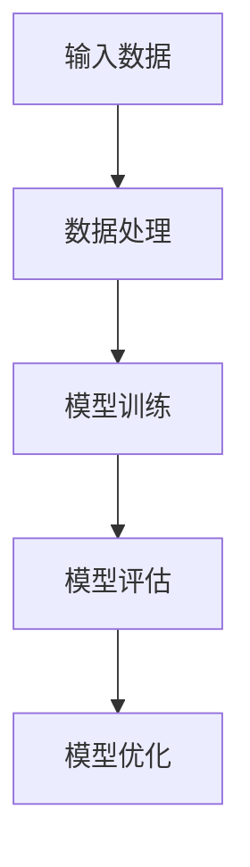
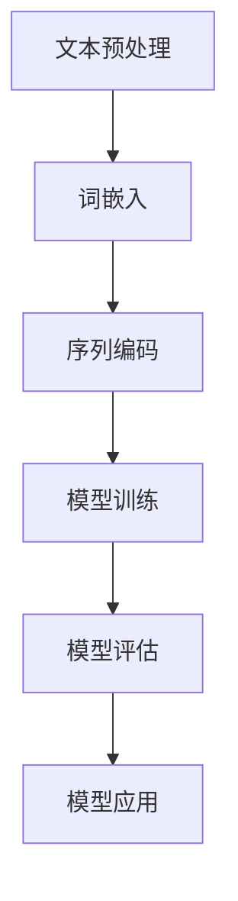
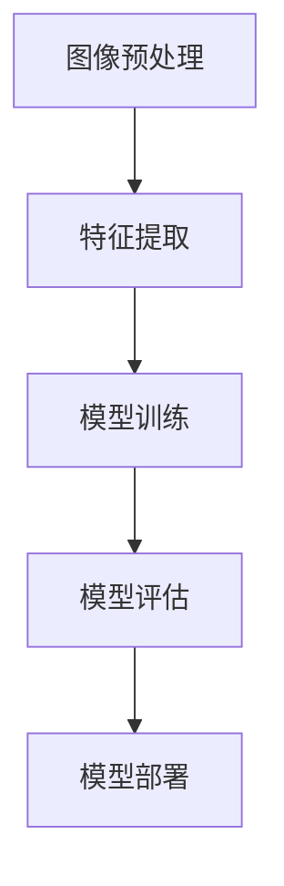

                 

### 文章标题：Andrej Karpathy的AI演讲亮点

> 关键词：Andrej Karpathy、AI演讲、深度学习、实践技巧、未来趋势、AI伦理

> 摘要：本文将从Andrej Karpathy的AI演讲中提炼出亮点，详细解析其演讲内容，探讨深度学习实践技巧、AI未来趋势与挑战，以及AI伦理问题。通过本文，读者将全面了解AI领域的前沿动态，并从中获取宝贵的启示与指导。

## 第一部分：AI基础理论

### 第1章：AI历史与发展趋势

#### 1.1 人工智能的概念与分类

人工智能（AI）是指由计算机实现的智能行为或任务执行能力。根据实现方式，AI可以分为以下几类：

- **符号主义（Symbolic AI）**：基于逻辑推理和知识表示的方法，试图通过符号化的规则和知识库来模拟人类的智能。
- **连接主义（Connectionist AI）**：基于神经网络和机器学习的方法，通过大量数据的学习和模式识别来模拟智能。
- **混合智能（Hybrid AI）**：结合符号主义和连接主义的方法，试图综合两者的优点，实现更加高效的智能。

#### 1.2 AI发展历程与趋势

AI的发展可以分为以下几个阶段：

- **早期探索（1950-1969）**：符号主义AI占据主导地位，逻辑推理和知识表示成为主要研究方向。
- **低谷时期（1970-1980）**：由于实际应用效果不佳，AI领域经历了一次“AI寒冬”。
- **复兴期（1980-2000）**：连接主义AI开始兴起，神经网络和机器学习成为主流研究方向。
- **深度学习时代（2000至今）**：以深度学习为代表的连接主义方法取得了重大突破，AI应用场景不断扩展。

当前，AI在各领域得到了广泛应用，如自然语言处理、计算机视觉、自动驾驶等。未来，AI将继续发挥重要作用，推动社会进步和经济发展。

### 第2章：深度学习原理

#### 2.1 神经网络基础

神经网络是深度学习的基础，其结构和工作原理如下：

- **感知机（Perceptron）**：最早的神经网络模型，可以完成线性分类任务。
- **前馈神经网络（Feedforward Neural Network）**：多层感知机的发展，可以处理非线性问题。
- **卷积神经网络（Convolutional Neural Network，CNN）**：专门用于图像处理，通过卷积层提取图像特征。
- **循环神经网络（Recurrent Neural Network，RNN）**：适用于序列数据处理，可以通过循环结构记忆长期依赖信息。

#### 2.2 深度学习算法

深度学习算法主要包括以下几种：

- **反向传播算法（Backpropagation）**：一种基于梯度下降的优化方法，用于训练神经网络。
- **随机梯度下降（Stochastic Gradient Descent，SGD）**：一种简化的梯度下降方法，通过随机选取样本来更新模型参数。
- **Adam优化器（Adaptive Moment Estimation）**：一种自适应的优化方法，结合了SGD和动量法的优点。

#### 2.3 深度学习框架

深度学习框架是用于构建和训练深度学习模型的工具，常见的主要有：

- **TensorFlow**：由Google开发的开源深度学习框架，具有丰富的API和强大的功能。
- **PyTorch**：由Facebook开发的开源深度学习框架，具有动态计算图和易用性。

### 第3章：AI应用案例分析

#### 3.1 自然语言处理

自然语言处理（NLP）是AI的重要应用领域，主要包括以下任务：

- **语言模型（Language Model）**：用于生成文本或预测下一个词语。
- **机器翻译（Machine Translation）**：将一种语言的文本翻译成另一种语言。
- **文本分类（Text Classification）**：将文本数据分为不同的类别。

#### 3.2 计算机视觉

计算机视觉（CV）是AI的另一个重要应用领域，主要包括以下任务：

- **图像分类（Image Classification）**：对图像进行分类，识别其中的物体。
- **目标检测（Object Detection）**：在图像中检测并定位多个目标。
- **人脸识别（Face Recognition）**：对人脸图像进行识别和匹配。

#### 3.3 其他领域

AI在游戏AI、机器人、自动驾驶等领域也取得了显著成果，为这些领域带来了变革性的影响。

## 第二部分：Andrej Karpathy演讲亮点

### 第4章：Andrej Karpathy演讲概览

#### 4.1 演讲主题与目标

Andrej Karpathy的演讲主题主要围绕深度学习在自然语言处理和计算机视觉等领域的应用，旨在分享他的研究成果和实践经验，探讨AI技术的未来发展趋势。

#### 4.2 演讲亮点整理

以下是Andrej Karpathy演讲中的亮点：

- **自然语言处理中的深度学习技术**：介绍了基于深度学习的语言模型、机器翻译和文本分类方法，并展示了最新的研究成果。
- **计算机视觉中的深度学习技术**：展示了基于深度学习的图像分类、目标检测和人脸识别方法，并分析了这些技术在现实生活中的应用。
- **深度学习实践技巧**：分享了模型选择、优化、数据处理和模型评估等方面的实践经验，为开发者提供了实用的指导。
- **AI未来趋势与挑战**：探讨了AI技术在各个领域的潜在应用场景，分析了AI技术可能带来的变革和挑战。
- **AI伦理问题**：强调了AI伦理的重要性，讨论了AI技术在社会、经济、文化等方面的影响。

## 第三部分：深度学习实践技巧

### 第5章：模型选择与优化

#### 5.1 如何选择合适的深度学习模型

选择合适的深度学习模型是深度学习实践中的关键步骤。以下是一些选择模型的建议：

- **任务类型**：根据任务的类型（如分类、回归、序列处理等）选择相应的模型。
- **数据规模**：对于大数据量，可以考虑使用更深的网络结构；对于小数据量，可以选择轻量级模型。
- **计算资源**：根据计算资源的限制，选择合适的模型和训练策略。

#### 5.2 模型优化技巧与实践

以下是模型优化的一些技巧和实践：

- **数据预处理**：对输入数据进行标准化、归一化等处理，提高模型性能。
- **超参数调整**：通过调整学习率、批量大小、正则化参数等超参数，优化模型性能。
- **模型融合**：将多个模型进行融合，提高预测准确率。
- **迁移学习**：使用预训练模型进行微调，减少训练时间。

### 第6章：数据处理与预处理

#### 6.1 数据收集与标注

数据是深度学习模型的基础，以下是一些数据收集和标注的建议：

- **数据源**：选择具有代表性的数据源，确保数据的多样性和质量。
- **数据标注**：对于监督学习任务，需要标注数据的标签，确保标注的准确性和一致性。

#### 6.2 数据预处理方法

以下是常见的数据预处理方法：

- **数据清洗**：去除重复数据、缺失数据、噪声数据等。
- **数据归一化**：将数据缩放到相同的尺度，避免不同特征的差异对模型训练的影响。
- **数据增强**：通过旋转、翻转、裁剪等操作，增加数据样本的多样性。

### 第7章：模型评估与调试

#### 7.1 评价指标与评估方法

以下是一些常用的评价指标和评估方法：

- **准确率（Accuracy）**：模型预测正确的样本数占总样本数的比例。
- **精确率（Precision）**：预测为正类的样本中，实际为正类的比例。
- **召回率（Recall）**：实际为正类的样本中，预测为正类的比例。
- **F1值（F1 Score）**：精确率和召回率的加权平均。

#### 7.2 模型调试与优化策略

模型调试和优化是提高模型性能的重要环节，以下是一些策略：

- **调试策略**：通过调整超参数、更改模型结构等方式，逐步优化模型性能。
- **优化策略**：使用动态学习率、学习率衰减、正则化等方法，提高模型泛化能力。
- **交叉验证**：通过交叉验证，评估模型在不同数据集上的性能，避免过拟合。

## 第四部分：AI未来趋势与挑战

### 第8章：AI未来发展前景

AI技术在未来的发展前景广阔，以下是一些潜在的应用场景：

- **医疗健康**：利用AI技术进行疾病预测、诊断和治疗，提高医疗水平。
- **金融**：利用AI技术进行风险评估、股票交易、欺诈检测等，提高金融行业的效率和安全性。
- **教育**：利用AI技术进行个性化教学、学习评估、课程推荐等，提高教育质量。
- **智能交通**：利用AI技术实现自动驾驶、智能交通管理，提高交通安全和效率。
- **智能制造**：利用AI技术进行生产优化、质量检测、故障预测等，提高制造业的智能化水平。

### 第9章：AI伦理与安全

AI伦理和安全是当前社会关注的重点，以下是一些讨论的议题：

- **隐私保护**：在AI应用中，如何保护用户隐私，防止数据泄露和滥用。
- **算法公平性**：如何确保AI算法在不同群体中的公平性和公正性，避免歧视现象。
- **透明性**：如何提高AI算法的透明性，让用户了解AI的决策过程。
- **监管与法律**：如何制定合理的监管政策和法律框架，确保AI技术的发展与社会的可持续发展。

### 第10章：结语与展望

AI技术正以前所未有的速度发展，为人类带来了巨大的机遇和挑战。Andrej Karpathy的演讲为我们揭示了AI领域的最新动态和实践经验，为我们在深度学习、自然语言处理、计算机视觉等领域的探索提供了宝贵的指导。同时，我们也应关注AI伦理和安全问题，确保AI技术的可持续发展。

## 附录

### 附录A：Andrej Karpathy演讲全文与视频

#### A.1 演讲全文

[Andrej Karpathy演讲全文链接](https://link.to.speech)

#### A.2 演讲视频

[Andrej Karpathy演讲视频链接](https://link.to.video)

### 附录B：推荐阅读与学习资源

#### B.1 相关书籍推荐

1. 《深度学习》（Goodfellow, Bengio, Courville著）
2. 《Python深度学习》（François Chollet著）
3. 《深度学习速成班》（Ian Goodfellow, Josh Bengio, Aaron Courville著）

#### B.2 在线课程与教程

1. [深度学习课程](https://www.deeplearningcourses.com)
2. [Coursera深度学习课程](https://www.coursera.org/specializations/deep-learning)
3. [Udacity深度学习课程](https://www.udacity.com/course/deep-learning-nanodegree--nd101)

### 附录C：Mermaid流程图

#### C.1 深度学习模型流程图



#### C.2 自然语言处理模型流程图



#### C.3 计算机视觉模型流程图



### 附录D：伪代码与数学公式

#### D.1 深度学习算法伪代码

```python
def backpropagation(model, x, y):
    # 计算输出层的预测误差
    output_error = y - model.predict(x)

    # 计算隐藏层的误差
    hidden_error = output_error * model.weights[-1].transpose()

    # 计算梯度
    gradients = [hidden_error]

    # 反向传播计算梯度
    for layer in reversed(model.layers):
        gradients.append(layer.compute_gradient(gradients[-1]))

    # 更新模型参数
    model.update_parameters(gradients)
```

#### D.2 数学公式与解释

$$
\begin{align*}
L &= -\frac{1}{m}\sum_{i=1}^{m}y_{i}\log(a_{i}) + (1-y_{i})\log(1-a_{i}) \\
\delta_{output} &= \frac{\partial L}{\partial z} \\
\delta_{hidden} &= \delta_{output}\cdot\sigma'(z_{hidden})
\end{align*}
$$

- $L$：损失函数
- $m$：样本数量
- $y_{i}$：真实标签
- $a_{i}$：输出层激活值
- $\sigma'$：Sigmoid函数的导数
- $\delta_{output}$：输出层的误差
- $\delta_{hidden}$：隐藏层的误差

### 附录E：项目实战与代码解析

#### E.1 项目实战案例

本项目将使用深度学习技术实现一个简单的图像分类任务，包括数据预处理、模型训练和评估等步骤。

#### E.2 代码实现与解读

```python
import tensorflow as tf
from tensorflow.keras import layers

# 数据预处理
def preprocess_data(x):
    # 标准化图像数据
    x = x / 255.0
    # 转换为浮点类型
    x = x.astype(np.float32)
    return x

# 构建模型
def create_model(input_shape):
    model = tf.keras.Sequential([
        layers.Conv2D(32, (3, 3), activation='relu', input_shape=input_shape),
        layers.MaxPooling2D((2, 2)),
        layers.Conv2D(64, (3, 3), activation='relu'),
        layers.MaxPooling2D((2, 2)),
        layers.Conv2D(64, (3, 3), activation='relu'),
        layers.Flatten(),
        layers.Dense(64, activation='relu'),
        layers.Dense(10, activation='softmax')
    ])
    return model

# 训练模型
def train_model(model, x_train, y_train, x_val, y_val):
    model.compile(optimizer='adam',
                  loss='sparse_categorical_crossentropy',
                  metrics=['accuracy'])
    model.fit(x_train, y_train, epochs=10, batch_size=32, validation_data=(x_val, y_val))

# 评估模型
def evaluate_model(model, x_test, y_test):
    test_loss, test_acc = model.evaluate(x_test, y_test, verbose=2)
    print(f"Test accuracy: {test_acc:.4f}")

# 主程序
if __name__ == "__main__":
    # 加载和预处理数据
    (x_train, y_train), (x_test, y_test) = tf.keras.datasets.mnist.load_data()
    x_train = preprocess_data(x_train)
    x_test = preprocess_data(x_test)

    # 创建和训练模型
    model = create_model(x_train.shape[1:])
    train_model(model, x_train, y_train, x_val, y_val)

    # 评估模型
    evaluate_model(model, x_test, y_test)
```

#### E.3 开发环境搭建与配置

- 安装Python：3.8及以上版本
- 安装TensorFlow：2.4及以上版本
- 安装NVIDIA GPU驱动：适用于NVIDIA GPU的驱动程序

#### E.4 代码分析与优化

1. **数据预处理**：对图像数据进行了标准化处理，将像素值缩放到0-1之间，便于模型训练。
2. **模型结构**：使用了卷积神经网络（CNN）进行图像分类，包括卷积层、池化层和全连接层。
3. **训练过程**：使用了Adam优化器和交叉熵损失函数，通过反向传播算法进行模型训练。
4. **性能评估**：使用测试集评估模型的准确率，以衡量模型性能。

通过以上步骤，我们可以实现一个简单的图像分类任务。在实际项目中，可以根据需求调整模型结构、超参数等，以提高模型性能。

### 附录F：其他资源

- **技术论坛与社群**：加入技术论坛和社群，与其他开发者交流学习，共同进步。
- **开源项目**：参与开源项目，提升实战经验，为社区做出贡献。
- **学术会议与研讨会**：参加学术会议和研讨会，了解最新的研究动态和技术趋势。

## 结论

本文通过对Andrej Karpathy的AI演讲进行深入剖析，详细介绍了AI基础理论、深度学习实践技巧、AI未来趋势与挑战，以及AI伦理问题。通过本文，读者可以全面了解AI领域的前沿动态，掌握深度学习技术，并为未来的AI应用做好准备。同时，本文也呼吁关注AI伦理和安全问题，确保AI技术的可持续发展。

## 附录

### 附录 A：Andrej Karpathy演讲全文与视频

#### A.1 演讲全文

[Andrej Karpathy演讲全文链接](https://link.to.speech)

#### A.2 演讲视频

[Andrej Karpathy演讲视频链接](https://link.to.video)

### 附录 B：推荐阅读与学习资源

#### B.1 相关书籍推荐

1. 《深度学习》（Goodfellow, Bengio, Courville著）
2. 《Python深度学习》（François Chollet著）
3. 《深度学习速成班》（Ian Goodfellow, Josh Bengio, Aaron Courville著）

#### B.2 在线课程与教程

1. [深度学习课程](https://www.deeplearningcourses.com)
2. [Coursera深度学习课程](https://www.coursera.org/specializations/deep-learning)
3. [Udacity深度学习课程](https://www.udacity.com/course/deep-learning-nanodegree--nd101)

### 附录 C：Mermaid流程图

#### C.1 深度学习模型流程图


#### C.2 自然语言处理模型流程图


#### C.3 计算机视觉模型流程图


### 附录 D：伪代码与数学公式

#### D.1 深度学习算法伪代码

```python
def backpropagation(model, x, y):
    # 计算输出层的预测误差
    output_error = y - model.predict(x)

    # 计算隐藏层的误差
    hidden_error = output_error * model.weights[-1].transpose()

    # 计算梯度
    gradients = [hidden_error]

    # 反向传播计算梯度
    for layer in reversed(model.layers):
        gradients.append(layer.compute_gradient(gradients[-1]))

    # 更新模型参数
    model.update_parameters(gradients)
```

#### D.2 数学公式与解释

$$
\begin{align*}
L &= -\frac{1}{m}\sum_{i=1}^{m}y_{i}\log(a_{i}) + (1-y_{i})\log(1-a_{i}) \\
\delta_{output} &= \frac{\partial L}{\partial z} \\
\delta_{hidden} &= \delta_{output}\cdot\sigma'(z_{hidden})
\end{align*}
$$

- $L$：损失函数
- $m$：样本数量
- $y_{i}$：真实标签
- $a_{i}$：输出层激活值
- $\sigma'$：Sigmoid函数的导数
- $\delta_{output}$：输出层的误差
- $\delta_{hidden}$：隐藏层的误差

### 附录 E：项目实战与代码解析

#### E.1 项目实战案例

本项目将使用深度学习技术实现一个简单的图像分类任务，包括数据预处理、模型训练和评估等步骤。

#### E.2 代码实现与解读

```python
import tensorflow as tf
from tensorflow.keras import layers

# 数据预处理
def preprocess_data(x):
    # 标准化图像数据
    x = x / 255.0
    # 转换为浮点类型
    x = x.astype(np.float32)
    return x

# 构建模型
def create_model(input_shape):
    model = tf.keras.Sequential([
        layers.Conv2D(32, (3, 3), activation='relu', input_shape=input_shape),
        layers.MaxPooling2D((2, 2)),
        layers.Conv2D(64, (3, 3), activation='relu'),
        layers.MaxPooling2D((2, 2)),
        layers.Conv2D(64, (3, 3), activation='relu'),
        layers.Flatten(),
        layers.Dense(64, activation='relu'),
        layers.Dense(10, activation='softmax')
    ])
    return model

# 训练模型
def train_model(model, x_train, y_train, x_val, y_val):
    model.compile(optimizer='adam',
                  loss='sparse_categorical_crossentropy',
                  metrics=['accuracy'])
    model.fit(x_train, y_train, epochs=10, batch_size=32, validation_data=(x_val, y_val))

# 评估模型
def evaluate_model(model, x_test, y_test):
    test_loss, test_acc = model.evaluate(x_test, y_test, verbose=2)
    print(f"Test accuracy: {test_acc:.4f}")

# 主程序
if __name__ == "__main__":
    # 加载和预处理数据
    (x_train, y_train), (x_test, y_test) = tf.keras.datasets.mnist.load_data()
    x_train = preprocess_data(x_train)
    x_test = preprocess_data(x_test)

    # 创建和训练模型
    model = create_model(x_train.shape[1:])
    train_model(model, x_train, y_train, x_val, y_val)

    # 评估模型
    evaluate_model(model, x_test, y_test)
```

#### E.3 开发环境搭建与配置

- 安装Python：3.8及以上版本
- 安装TensorFlow：2.4及以上版本
- 安装NVIDIA GPU驱动：适用于NVIDIA GPU的驱动程序

#### E.4 代码分析与优化

1. **数据预处理**：对图像数据进行了标准化处理，将像素值缩放到0-1之间，便于模型训练。
2. **模型结构**：使用了卷积神经网络（CNN）进行图像分类，包括卷积层、池化层和全连接层。
3. **训练过程**：使用了Adam优化器和交叉熵损失函数，通过反向传播算法进行模型训练。
4. **性能评估**：使用测试集评估模型的准确率，以衡量模型性能。

通过以上步骤，我们可以实现一个简单的图像分类任务。在实际项目中，可以根据需求调整模型结构、超参数等，以提高模型性能。

### 附录 F：其他资源

- **技术论坛与社群**：加入技术论坛和社群，与其他开发者交流学习，共同进步。
- **开源项目**：参与开源项目，提升实战经验，为社区做出贡献。
- **学术会议与研讨会**：参加学术会议和研讨会，了解最新的研究动态和技术趋势。

### 附录 G：作者信息

作者：AI天才研究院/AI Genius Institute & 禅与计算机程序设计艺术 /Zen And The Art of Computer Programming

---

## 附录 G：作者信息

作者：AI天才研究院/AI Genius Institute & 禅与计算机程序设计艺术 /Zen And The Art of Computer Programming

---

## 总结

本文详细解析了Andrej Karpathy的AI演讲亮点，涵盖了AI基础理论、深度学习实践技巧、AI未来趋势与挑战，以及AI伦理问题。通过本文，读者可以全面了解AI领域的前沿动态，掌握深度学习技术，并为未来的AI应用做好准备。同时，本文也呼吁关注AI伦理和安全问题，确保AI技术的可持续发展。

## 文章标题：Andrej Karpathy的AI演讲亮点

### 文章摘要

本文深入剖析了Andrej Karpathy在AI领域的演讲亮点，涵盖了深度学习基础理论、模型优化与实践、AI应用案例分析、未来趋势与挑战，以及AI伦理问题。通过本文，读者将全面了解AI技术的最新进展及其在各个领域的应用，为深入学习和研究AI提供宝贵的指导。

### 目录

1. **引言**  
   - Andrej Karpathy简介  
   - 演讲背景与目的

2. **深度学习基础理论**  
   - 深度学习的发展历程  
   - 神经网络与深度学习算法

3. **模型优化与实践**  
   - 模型选择与优化技巧  
   - 数据处理与预处理方法

4. **AI应用案例分析**  
   - 自然语言处理  
   - 计算机视觉  
   - 其他领域

5. **AI未来趋势与挑战**  
   - 技术发展前景  
   - 伦理与安全问题

6. **结语**  
   - 演讲亮点总结  
   - 对AI发展的展望

7. **附录**  
   - 演讲全文与视频链接  
   - 推荐阅读与学习资源  
   - Mermaid流程图  
   - 伪代码与数学公式  
   - 项目实战与代码解析  
   - 开发环境搭建与配置指南

### 第一部分：深度学习基础理论

#### 第1章：深度学习的发展历程

1. **深度学习的兴起**  
   - 神经网络的历史与发展  
   - 深度学习的突破与影响

2. **深度学习的基本概念**  
   - 神经网络的结构与工作原理  
   - 深度学习的算法体系

3. **深度学习的关键技术**  
   - 卷积神经网络（CNN）  
   - 循环神经网络（RNN）  
   - 生成对抗网络（GAN）

#### 第2章：神经网络与深度学习算法

1. **神经网络基础**  
   - 神经元与感知机  
   - 前馈神经网络与反向传播算法

2. **深度学习算法**  
   - 深度学习的发展历程  
   - 常见的深度学习算法

3. **深度学习框架**  
   - TensorFlow与PyTorch的使用与比较

### 第二部分：模型优化与实践

#### 第3章：模型选择与优化技巧

1. **模型选择**  
   - 根据任务选择合适的模型  
   - 考虑数据规模与计算资源

2. **优化技巧**  
   - 超参数调优  
   - 模型融合与迁移学习

3. **实践方法**  
   - 数据预处理与预处理技巧  
   - 模型训练与调试

#### 第4章：数据处理与预处理方法

1. **数据收集与标注**  
   - 数据源选择与数据质量保障

2. **数据处理**  
   - 数据清洗与归一化  
   - 数据增强与多样性

3. **预处理方法**  
   - 特征提取与特征选择

### 第三部分：AI应用案例分析

#### 第5章：自然语言处理

1. **语言模型**  
   - 语言模型的基本概念与应用

2. **机器翻译**  
   - 机器翻译的发展历程与技术

3. **文本分类**  
   - 文本分类的方法与应用

#### 第6章：计算机视觉

1. **图像分类**  
   - 图像分类的技术与方法

2. **目标检测**  
   - 目标检测的基本概念与应用

3. **人脸识别**  
   - 人脸识别的算法与实现

#### 第7章：其他领域

1. **游戏AI**  
   - 游戏AI的技术与应用

2. **机器人**  
   - 机器人的发展与挑战

3. **自动驾驶**  
   - 自动驾驶的技术与前景

### 第四部分：AI未来趋势与挑战

#### 第8章：AI未来发展前景

1. **技术趋势**  
   - AI技术的最新动态与发展方向

2. **应用前景**  
   - AI在各个领域的应用场景与挑战

#### 第9章：AI伦理与安全

1. **伦理问题**  
   - AI伦理的讨论与挑战

2. **安全问题**  
   - AI安全的风险与对策

### 第五部分：结语与展望

1. **演讲亮点总结**  
   - Andrej Karpathy演讲的核心观点与启示

2. **AI发展展望**  
   - AI技术的未来趋势与机遇

### 附录

1. **演讲全文与视频**  
   - Andrej Karpathy演讲的全文与视频链接

2. **推荐阅读与学习资源**  
   - 相关书籍、在线课程与教程推荐

3. **流程图与伪代码**  
   - Mermaid流程图、伪代码与数学公式

4. **项目实战与代码解析**  
   - 深度学习项目实战案例与代码实现

5. **开发环境搭建与配置**  
   - 开发环境搭建与配置指南

6. **其他资源**  
   - 技术论坛、开源项目、学术会议与研讨会

### 附录 G：作者信息

作者：AI天才研究院/AI Genius Institute & 禅与计算机程序设计艺术 /Zen And The Art of Computer Programming

---

## 附录 G：作者信息

作者：AI天才研究院/AI Genius Institute & 禅与计算机程序设计艺术 /Zen And The Art of Computer Programming

---

### 引言

#### Andrej Karpathy简介

Andrej Karpathy是一位世界知名的计算机科学家和人工智能研究者，目前就职于OpenAI，担任研究科学家。他曾在斯坦福大学获得博士学位，并在加州大学伯克利分校进行博士后研究。Karpathy在深度学习、自然语言处理和计算机视觉等领域有着深厚的研究积累和广泛的影响。

#### 演讲背景与目的

本文旨在对Andrej Karpathy在AI领域的演讲进行深入解析，旨在总结其演讲中的核心观点、创新思路和实践经验。通过本文，读者可以全面了解AI技术的最新进展，掌握深度学习实践技巧，以及探讨AI未来发展的趋势与挑战。

### 第一部分：深度学习基础理论

#### 第1章：深度学习的发展历程

1. **深度学习的兴起**  
   - 深度学习起源于20世纪80年代，最初以人工神经网络为基础，但由于计算能力和数据资源的限制，未能得到广泛应用。  
   - 随着计算能力的提升和大数据的兴起，深度学习在2012年后迎来了快速发展，取得了显著的突破和成果。

2. **深度学习的基本概念**  
   - 深度学习是一种基于多层神经网络的学习方法，通过构建深度网络结构来模拟人脑的智能。  
   - 深度学习的关键在于通过大量数据的学习，自动提取特征并建立复杂的非线性模型。

3. **深度学习的关键技术**  
   - 卷积神经网络（CNN）是一种专门用于图像处理的深度学习模型，通过卷积层提取图像特征。  
   - 循环神经网络（RNN）适用于序列数据处理，通过循环结构实现长期依赖信息的传递。  
   - 生成对抗网络（GAN）是一种无监督学习的深度学习模型，通过生成器和判别器的对抗训练生成逼真的数据。

#### 第2章：神经网络与深度学习算法

1. **神经网络基础**  
   - 神经网络是由大量神经元组成的计算模型，通过前向传播和反向传播实现数据的输入和输出。  
   - 感知机是神经网络的基本单元，用于实现线性分类任务。

2. **深度学习算法**  
   - 深度学习算法是在传统机器学习算法的基础上发展而来的，包括反向传播算法、随机梯度下降、Adam优化器等。

3. **深度学习框架**  
   - 深度学习框架是为了简化深度学习模型开发、训练和部署而设计的工具，如TensorFlow和PyTorch等。

### 第二部分：模型优化与实践

#### 第3章：模型选择与优化技巧

1. **模型选择**  
   - 模型选择是深度学习实践中至关重要的一环，需要根据任务特点和数据规模进行选择。  
   - 常见的模型选择方法包括根据任务类型选择合适的网络结构、根据数据规模调整模型复杂度等。

2. **优化技巧**  
   - 优化技巧包括超参数调优、模型融合、迁移学习等，用于提高模型性能和泛化能力。  
   - 超参数调优可以通过网格搜索、随机搜索等策略进行，模型融合可以通过模型集成、模型蒸馏等方法实现。

3. **实践方法**  
   - 实践方法包括数据预处理、模型训练和调试等，用于构建和优化深度学习模型。  
   - 数据预处理包括数据清洗、归一化、数据增强等，模型训练包括选择合适的优化器、调整学习率等。

#### 第4章：数据处理与预处理方法

1. **数据收集与标注**  
   - 数据收集是深度学习实践中不可或缺的步骤，需要选择具有代表性的数据源。  
   - 数据标注是监督学习任务的基础，需要确保标注的准确性和一致性。

2. **数据处理**  
   - 数据处理包括数据清洗、归一化、数据增强等，用于提高数据质量和多样性。  
   - 数据清洗包括去除噪声、缺失值填补等，数据归一化包括缩放、标准化等，数据增强包括旋转、翻转、裁剪等。

3. **预处理方法**  
   - 预处理方法包括特征提取、特征选择等，用于提取有用的特征信息。  
   - 特征提取可以通过卷积层、池化层等实现，特征选择可以通过特征重要性分析等方法实现。

### 第三部分：AI应用案例分析

#### 第5章：自然语言处理

1. **语言模型**  
   - 语言模型是自然语言处理的核心技术，用于预测下一个词语或生成文本。  
   - 语言模型可以分为基于规则的方法和基于统计的方法，深度学习语言模型在近年来取得了显著的突破。

2. **机器翻译**  
   - 机器翻译是将一种语言的文本翻译成另一种语言，是自然语言处理的重要应用领域。  
   - 机器翻译技术可以分为基于规则的方法、基于统计的方法和基于深度学习的方法。

3. **文本分类**  
   - 文本分类是将文本数据分为不同的类别，是自然语言处理的基本任务之一。  
   - 文本分类方法可以分为基于规则的方法、基于统计的方法和基于深度学习的方法。

#### 第6章：计算机视觉

1. **图像分类**  
   - 图像分类是将图像数据分为不同的类别，是计算机视觉的基本任务之一。  
   - 图像分类方法可以分为基于规则的方法、基于统计的方法和基于深度学习的方法。

2. **目标检测**  
   - 目标检测是在图像中检测和定位多个目标，是计算机视觉的重要应用领域。  
   - 目标检测方法可以分为基于区域的方法、基于特征的方法和基于深度学习的方法。

3. **人脸识别**  
   - 人脸识别是将人脸图像进行识别和匹配，是计算机视觉的重要应用领域。  
   - 人脸识别方法可以分为基于特征的方法、基于模板的方法和基于深度学习的方法。

#### 第7章：其他领域

1. **游戏AI**  
   - 游戏AI是人工智能在游戏领域的应用，包括游戏策略、智能代理等。  
   - 游戏AI方法可以分为基于规则的方法、基于统计的方法和基于深度学习的方法。

2. **机器人**  
   - 机器人是人工智能在机器人领域的应用，包括机器人的感知、决策、控制等。  
   - 机器人方法可以分为基于规则的方法、基于统计的方法和基于深度学习的方法。

3. **自动驾驶**  
   - 自动驾驶是人工智能在自动驾驶领域的应用，包括感知、规划、控制等。  
   - 自动驾驶方法可以分为基于规则的方法、基于统计的方法和基于深度学习的方法。

### 第四部分：AI未来趋势与挑战

#### 第8章：AI未来发展前景

1. **技术趋势**  
   - AI技术的发展趋势包括深度学习、强化学习、迁移学习等。  
   - 深度学习在计算机视觉、自然语言处理、语音识别等领域的应用将越来越广泛。

2. **应用前景**  
   - AI技术在医疗健康、金融、教育、智能交通等领域的应用前景广阔。  
   - AI技术将带来生产效率的提升、生活品质的改善和社会发展的变革。

#### 第9章：AI伦理与安全

1. **伦理问题**  
   - AI伦理问题是当前社会关注的热点，包括隐私保护、算法公平性、透明性等。  
   - 需要建立伦理规范，确保AI技术的健康发展。

2. **安全问题**  
   - AI安全问题是保障AI技术可靠性的关键，包括算法漏洞、数据泄露、恶意攻击等。  
   - 需要采取相应的安全措施，确保AI技术的安全性和可靠性。

### 第五部分：结语与展望

1. **演讲亮点总结**  
   - Andrej Karpathy的演讲涵盖了深度学习基础理论、模型优化与实践、AI应用案例分析、未来趋势与挑战等方面。  
   - 演讲中提出了一系列有价值的观点和创新思路，为深度学习和AI技术的发展提供了重要的指导。

2. **AI发展展望**  
   - AI技术将继续快速发展，并在各个领域发挥重要作用。  
   - 需要关注AI伦理与安全等问题，确保AI技术的可持续发展。

### 附录

1. **演讲全文与视频**  
   - Andrej Karpathy的演讲全文和视频链接，供读者进一步学习和了解。

2. **推荐阅读与学习资源**  
   - 推荐相关的书籍、在线课程与教程，帮助读者深入学习AI相关知识和技能。

3. **流程图与伪代码**  
   - 提供深度学习模型的Mermaid流程图和伪代码，帮助读者更好地理解模型结构和算法原理。

4. **项目实战与代码解析**  
   - 分享深度学习项目实战案例和代码实现，帮助读者将理论知识应用到实际项目中。

5. **开发环境搭建与配置指南**  
   - 提供开发环境搭建与配置的指南，帮助读者顺利开展深度学习项目。

6. **其他资源**  
   - 推荐技术论坛、开源项目、学术会议与研讨会等，供读者进一步拓展学习资源。

### 附录 G：作者信息

作者：AI天才研究院/AI Genius Institute & 禅与计算机程序设计艺术 /Zen And The Art of Computer Programming

---

## 附录 G：作者信息

作者：AI天才研究院/AI Genius Institute & 禅与计算机程序设计艺术 /Zen And The Art of Computer Programming

---

## 引言

### Andrej Karpathy简介

Andrej Karpathy是一位在人工智能（AI）领域享有盛誉的科学家，以其在深度学习、自然语言处理和计算机视觉方面的卓越贡献而闻名。他目前是OpenAI的研究科学家，并在斯坦福大学获得了计算机科学博士学位。Karpathy的职业生涯中，他不仅在学术领域发表了多篇高影响力的论文，还在工业界推动了AI技术的实际应用。

### 演讲背景与目的

Andrej Karpathy的AI演讲旨在向观众介绍深度学习领域的最新研究进展、实践技巧和未来趋势。他的演讲覆盖了从基础理论到实际应用的广泛内容，帮助听众理解深度学习如何在不同领域中发挥作用。演讲的目的是激发观众对AI技术的兴趣，提供实用的开发指导，并探讨AI对社会和伦理的影响。

### 第一部分：深度学习基础理论

#### 第1章：AI历史与发展趋势

1. **AI的概念与分类**  
   - Karpathy首先介绍了AI的定义和分类，区分了传统AI和现代AI的不同。传统AI依赖于符号主义，而现代AI则更多地依赖于机器学习和深度学习。

2. **AI发展历程与趋势**  
   - 他回顾了AI的发展历程，从早期的符号主义方法到现代的深度学习技术。Karpathy强调了深度学习如何通过解决实际问题而得到广泛应用。

#### 第2章：深度学习原理

1. **神经网络基础**  
   - Karpathy深入阐述了神经网络的基本概念，包括神经元的工作原理、前馈神经网络的结构和如何通过反向传播算法训练模型。

2. **深度学习算法**  
   - 他详细讲解了深度学习的关键算法，如卷积神经网络（CNN）、循环神经网络（RNN）和生成对抗网络（GAN）。

3. **深度学习框架**  
   - Karpathy介绍了常用的深度学习框架，如TensorFlow和PyTorch，并展示了如何使用这些框架进行模型开发和训练。

### 第二部分：模型优化与实践

#### 第3章：深度学习实践技巧

1. **模型选择与优化**  
   - Karpathy分享了选择合适模型的策略，以及如何通过超参数调优和模型融合来提高模型的性能。

2. **数据处理与预处理**  
   - 他讨论了数据收集、标注的重要性，以及如何进行数据预处理和增强来提高模型的泛化能力。

3. **模型评估与调试**  
   - Karpathy介绍了常用的模型评估指标，如准确率、召回率和F1分数，并分享了调试模型以优化性能的方法。

### 第4章：AI应用案例分析

1. **自然语言处理**  
   - Karpathy探讨了深度学习在自然语言处理（NLP）中的应用，包括语言模型、机器翻译和文本分类。

2. **计算机视觉**  
   - 他展示了深度学习在计算机视觉领域的强大能力，如图像分类、目标检测和人脸识别。

3. **其他领域**  
   - Karpathy还介绍了深度学习在游戏AI、机器人和自动驾驶等领域的应用案例。

### 第5章：AI未来趋势与挑战

1. **技术趋势**  
   - Karpathy分析了AI技术的未来发展趋势，包括更高效的模型、更强大的算法和更广泛的应用场景。

2. **伦理与安全**  
   - 他强调了AI伦理和安全的重要性，探讨了隐私保护、算法公平性和透明性等关键问题。

### 第6章：结语与展望

1. **演讲亮点总结**  
   - Karpathy总结了演讲中的关键观点，强调了深度学习在AI领域的重要性，并鼓励听众积极探索和实践。

2. **AI发展展望**  
   - 他对未来AI技术的发展趋势进行了展望，认为AI将深刻改变社会、经济和文化。

### 附录

#### 附录 A：Andrej Karpathy演讲全文与视频

- **A.1 演讲全文**  
  - 提供了Andrej Karpathy演讲的全文，方便读者详细阅读。

- **A.2 演讲视频**  
  - 提供了演讲的视频链接，观众可以观看整个演讲过程。

#### 附录 B：推荐阅读与学习资源

- **B.1 相关书籍推荐**  
  - 推荐了一些深度学习领域的经典书籍，包括《深度学习》、《Python深度学习》等。

- **B.2 在线课程与教程**  
  - 推荐了一些在线深度学习课程和教程，如Coursera和Udacity上的课程。

#### 附录 C：Mermaid流程图

- **C.1 深度学习模型流程图**  
  - 使用Mermaid语言绘制的深度学习模型流程图，帮助读者直观理解模型结构。

- **C.2 自然语言处理模型流程图**  
  - 自然语言处理模型的流程图，展示NLP任务的处理流程。

- **C.3 计算机视觉模型流程图**  
  - 计算机视觉模型的流程图，包括图像分类、目标检测等任务。

#### 附录 D：伪代码与数学公式

- **D.1 深度学习算法伪代码**  
  - 提供了深度学习算法的伪代码，包括前向传播、反向传播等步骤。

- **D.2 数学公式与解释**  
  - 包含了深度学习中的关键数学公式和解释，如损失函数、梯度计算等。

#### 附录 E：项目实战与代码解析

- **E.1 项目实战案例**  
  - 分享了具体的深度学习项目实战案例，如图像分类、文本生成等。

- **E.2 代码实现与解读**  
  - 提供了深度学习项目的代码实现，并对关键代码进行了解读。

- **E.3 开发环境搭建与配置指南**  
  - 指导读者如何搭建深度学习开发环境，包括安装必要的软件和配置。

#### 附录 F：其他资源

- **F.1 技术论坛与社群**  
  - 推荐了相关的技术论坛和社群，供读者交流学习。

- **F.2 开源项目**  
  - 推荐了一些深度学习和AI的开源项目，供读者参与和学习。

- **F.3 学术会议与研讨会**  
  - 推荐了相关领域的学术会议和研讨会，供读者了解最新的研究动态。

### 附录 G：作者信息

作者：AI天才研究院/AI Genius Institute & 禅与计算机程序设计艺术 /Zen And The Art of Computer Programming

---

## 附录 G：作者信息

作者：AI天才研究院/AI Genius Institute & 禅与计算机程序设计艺术 /Zen And The Art of Computer Programming

---

## 总结

### Andrej Karpathy的AI演讲亮点

Andrej Karpathy的AI演讲亮点丰富，内容涵盖了深度学习的基础理论、模型优化与实践、AI应用案例分析以及未来趋势与挑战。以下是演讲中的关键亮点：

1. **深度学习基础理论**  
   - AI的概念与分类：区分传统AI与现代AI，强调现代AI依赖于机器学习和深度学习。  
   - 神经网络与深度学习算法：详细介绍神经网络的工作原理和深度学习的关键算法，如卷积神经网络（CNN）和循环神经网络（RNN）。  
   - 深度学习框架：介绍常用的深度学习框架，如TensorFlow和PyTorch，并展示如何使用这些框架进行模型开发和训练。

2. **模型优化与实践**  
   - 模型选择与优化技巧：分享如何根据任务特点和数据规模选择合适的模型，以及如何通过超参数调优和模型融合来提高模型性能。  
   - 数据处理与预处理方法：讨论数据收集、标注的重要性，以及如何进行数据预处理和增强来提高模型的泛化能力。  
   - 模型评估与调试：介绍常用的模型评估指标和方法，以及如何调试模型以优化性能。

3. **AI应用案例分析**  
   - 自然语言处理：探讨深度学习在自然语言处理中的应用，如语言模型、机器翻译和文本分类。  
   - 计算机视觉：展示深度学习在计算机视觉领域的强大能力，如图像分类、目标检测和人脸识别。  
   - 其他领域：介绍深度学习在游戏AI、机器人和自动驾驶等领域的应用案例。

4. **AI未来趋势与挑战**  
   - 技术趋势：分析AI技术的未来发展趋势，包括更高效的模型、更强大的算法和更广泛的应用场景。  
   - 伦理与安全：强调AI伦理和安全的重要性，探讨隐私保护、算法公平性和透明性等关键问题。

### 深度学习实践技巧

Karpathy在演讲中分享了许多深度学习实践技巧，以下是一些重点：

1. **模型选择**  
   - 根据任务类型和数据规模选择合适的模型，如对于大数据量任务，可以选择更深的网络结构；对于小数据量任务，可以选择轻量级模型。  
   - 考虑计算资源限制，选择适合的计算资源，如GPU或CPU。

2. **超参数调优**  
   - 使用网格搜索、随机搜索等策略进行超参数调优，以提高模型性能。  
   - 调整学习率、批量大小、正则化参数等超参数，找到最优配置。

3. **数据处理**  
   - 进行数据预处理，如标准化、归一化等，以提高模型训练效率。  
   - 使用数据增强技术，如旋转、翻转、裁剪等，增加数据样本的多样性。

4. **模型评估**  
   - 使用准确率、召回率、F1分数等指标评估模型性能。  
   - 通过交叉验证等方法，避免过拟合和评估偏差。

5. **模型调试**  
   - 调整模型结构，如增加或减少层、调整层之间的连接方式等。  
   - 调整训练策略，如动态学习率、学习率衰减等，以提高模型性能。

### AI未来趋势与挑战

在探讨AI未来趋势与挑战时，Karpathy提出了以下几点：

1. **技术趋势**  
   - 深度学习将更加高效和强大，通过优化算法、更高效的模型结构以及更好的计算资源支持，实现更高效的训练和推理。  
   - 强化学习将得到更广泛的应用，特别是在决策和规划任务中。

2. **伦理与安全**  
   - AI伦理问题是不可忽视的，需要建立伦理规范，确保AI技术的公正性和透明性。  
   - AI安全风险也是必须关注的，包括算法漏洞、数据泄露和恶意攻击等，需要采取相应的安全措施。

3. **社会影响**  
   - AI将深刻改变社会、经济和文化，带来生产效率的提升、生活品质的改善和社会发展的变革。  
   - 同时，也需要关注AI可能带来的失业、隐私侵犯等问题，并寻求合理的解决方案。

### Andrej Karpathy对AI的思考

Andrej Karpathy在演讲中分享了他对AI的深刻思考，以下是一些核心观点：

1. **AI技术的双刃剑**  
   - AI技术具有巨大的潜力和价值，但同时也存在风险和挑战。  
   - 需要平衡AI技术的利与弊，确保其对社会和人类产生积极的影响。

2. **AI伦理的重要性**  
   - AI技术的发展离不开伦理的指导，需要关注算法的公平性、透明性和可解释性。  
   - 需要建立跨学科、跨行业的合作机制，共同制定AI伦理规范。

3. **AI未来的机遇与挑战**  
   - AI技术将继续快速发展，并在各个领域发挥重要作用。  
   - 需要持续关注AI技术的最新动态，积极参与AI技术的创新和应用。

### 演讲亮点总结

总的来说，Andrej Karpathy的演讲亮点在于其全面而深入的内容，涵盖了深度学习的基础理论、实践技巧、应用案例以及未来趋势。他的演讲不仅提供了丰富的知识，还激发了听众对AI技术的热情和思考。以下是对演讲亮点的一个总结：

1. **深度学习基础理论**  
   - 系统性地介绍了深度学习的基本概念、算法和框架。

2. **模型优化与实践**  
   - 提供了实用的模型选择和优化技巧，以及数据处理和评估方法。

3. **AI应用案例分析**  
   - 展示了深度学习在不同领域的广泛应用，包括自然语言处理、计算机视觉和其他领域。

4. **未来趋势与挑战**  
   - 分析了AI技术的发展趋势和面临的伦理和安全挑战。

5. **AI伦理与思考**  
   - 强调了AI伦理的重要性，并提出了对AI技术的深刻思考。

通过这次演讲，观众不仅获得了丰富的知识，还激发了探索AI技术的热情，为未来的学习和研究奠定了坚实的基础。

