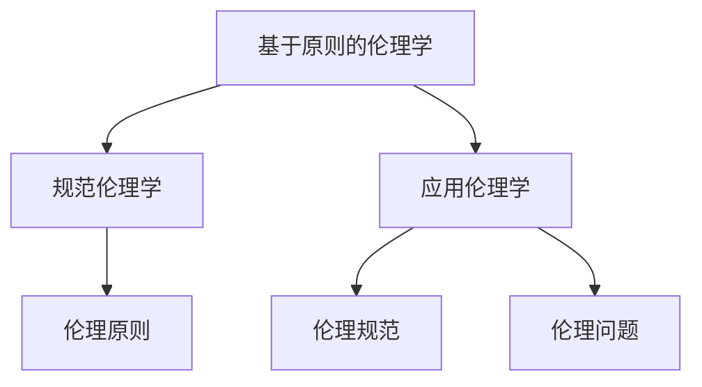

                 

# 《Andrej Karpathy：人工智能的伦理问题》

> 关键词：人工智能伦理问题，道德责任，透明性，数据隐私，人机协作

> 摘要：本文以Andrej Karpathy所著的《人工智能的伦理问题》为背景，详细探讨了人工智能伦理问题的核心领域，包括数据伦理、隐私保护、透明性、安全与可控性以及人机协作与道德责任。通过对这些问题的深入分析，本文旨在为读者提供一个全面且清晰的理解，并探讨解决这些问题的方法与途径。

## 第一部分：引论

### 1.1 人工智能伦理问题的背景与意义

随着人工智能技术的快速发展，其在各个领域的应用日益广泛，从而引发了诸多伦理问题。这些伦理问题不仅涉及到技术层面，还包括社会、法律和道德等多个方面。Andrej Karpathy在《人工智能的伦理问题》一书中，系统性地阐述了这些问题的背景与意义。

首先，人工智能的快速发展带来了前所未有的挑战。一方面，人工智能技术的应用极大地提高了生产效率，推动了社会进步；另一方面，人工智能技术也带来了诸多伦理问题，如数据隐私、算法歧视、人机协作等。

### 1.2 人工智能伦理问题的核心领域

人工智能伦理问题的核心领域包括以下几个方面：

1. **数据伦理**：人工智能技术的发展离不开大量的数据，而这些数据往往涉及到个人隐私。如何在保证数据利用价值的同时，保护个人隐私，成为了一个亟待解决的问题。

2. **隐私保护**：随着人工智能技术的应用，个人隐私泄露的风险日益增加。如何有效地保护个人隐私，防止数据被滥用，是人工智能伦理问题中的一个重要方面。

3. **透明性与可解释性**：人工智能算法的复杂性和黑箱化特点，使得用户难以理解其决策过程。提高算法的透明性和可解释性，让用户能够理解和信任人工智能系统，是解决伦理问题的关键。

4. **安全与可控性**：人工智能技术的安全与可控性直接关系到其应用场景的安全性和可靠性。确保人工智能系统的安全与可控，是伦理问题中不可忽视的一环。

5. **人机协作与道德责任**：在人工智能与人类协作的过程中，如何划分道德责任，确保人工智能系统遵守道德规范，是一个复杂的伦理问题。

### 1.3 本书结构安排与目标

本书分为六个部分，分别对人工智能伦理问题的各个方面进行深入探讨。第一部分为引论，介绍人工智能伦理问题的背景与意义；第二部分探讨人工智能伦理学的理论基础；第三部分讲解人工智能伦理问题的核心算法与模型；第四部分介绍数学模型和数学公式；第五部分通过实际项目案例进行应用；第六部分对人工智能伦理问题的未来趋势与挑战进行展望。本书的目标是提供一个全面、系统、深入的视角，帮助读者更好地理解和解决人工智能伦理问题。

## 第二部分：核心概念与联系

### 2.1 伦理学的概念与历史

伦理学是一门研究道德行为的学科，其起源可以追溯到古希腊时期的苏格拉底和柏拉图。伦理学的基本概念包括道德原则、道德规范、道德责任等。伦理学的历史发展经历了伦理学的古典时期、现代时期和当代时期，主要学派包括功利主义、康德伦理学、美德伦理学等。

### 2.2 人工智能伦理学的基本原则

人工智能伦理学的基本原则包括公平性原则、尊重原则、无伤害原则和自由原则。公平性原则要求人工智能系统在处理问题时保持公正；尊重原则要求尊重个体的权利和尊严；无伤害原则要求避免对个体造成伤害；自由原则要求尊重个体的自由选择。

### 2.3 人工智能伦理学的架构

人工智能伦理学的架构可以分为三个层次：基于原则的伦理学、规范伦理学和应用伦理学。基于原则的伦理学关注道德原则的制定和遵循；规范伦理学关注伦理规范的具体实施和监督；应用伦理学关注人工智能技术在具体应用场景中的伦理问题。

### 2.4 人工智能伦理学的 Mermaid 流程图



## 第三部分：核心算法原理讲解

### 3.1 伦理决策算法的基本原理

伦理决策算法是一种基于多目标优化的算法，其目的是在多个伦理目标之间找到平衡点。伦理决策算法通常包括以下几个步骤：

1. **确定伦理目标**：根据人工智能伦理学的基本原则，确定需要考虑的伦理目标，如公平性、尊重、无伤害和自由。

2. **建立目标函数**：根据伦理目标，建立相应的目标函数，以衡量伦理决策的优劣。

3. **优化目标函数**：使用多目标优化算法，寻找最优的伦理决策方案。

4. **决策实施**：将最优的伦理决策方案应用于实际的人工智能系统中。

### 3.2 伦理计算模型的构建

伦理计算模型可以分为基于逻辑的模型、基于概率的模型和基于神经网络的学习模型。每种模型都有其优缺点和应用场景。

1. **基于逻辑的模型**：基于逻辑的模型使用逻辑推理的方法，建立伦理决策的规则和框架。其优点是逻辑清晰，可解释性强；缺点是处理复杂问题时能力有限。

2. **基于概率的模型**：基于概率的模型使用概率论的方法，建立伦理决策的概率模型。其优点是能够处理复杂问题，具有灵活性；缺点是概率模型的可解释性较差。

3. **基于神经网络的学习模型**：基于神经网络的学习模型使用神经网络的方法，学习伦理决策的规律和模式。其优点是能够处理大规模数据和复杂问题，具有自适应性；缺点是模型的可解释性较差，容易出现过拟合。

### 3.3 伪代码解释与示例

以下是一个简单的伦理决策算法的伪代码示例：

```python
# 输入：伦理目标列表，目标函数
# 输出：最优伦理决策

# 步骤1：确定伦理目标
ethical_goals = ["公平性", "尊重", "无伤害", "自由"]

# 步骤2：建立目标函数
def objective_function(ethical_goals):
    # 根据伦理目标，建立相应的目标函数
    # 示例：最大化公平性和尊重，同时最小化无伤害和自由
    fairness = ethical_goals["公平性"]
    respect = ethical_goals["尊重"]
    harm = ethical_goals["无伤害"]
    freedom = ethical_goals["自由"]
    return fairness + respect - harm - freedom

# 步骤3：优化目标函数
from scipy.optimize import minimize

result = minimize(objective_function, x0=[1, 1, 1, 1], method='SLSQP')

# 步骤4：决策实施
best_ethical_goals = result.x
```

## 第四部分：数学模型和数学公式

### 4.1 概率论基础

概率论是伦理计算模型的基础，以下是一些常用的概率论基础：

1. **概率分布**：概率分布描述了随机变量的可能取值及其概率。

2. **贝叶斯定理**：贝叶斯定理是概率论中的一个基本公式，用于计算后验概率。

3. **最大似然估计**：最大似然估计是一种常用的参数估计方法，用于估计模型参数。

### 4.2 优化理论

优化理论是伦理决策算法的核心，以下是一些基本的优化理论：

1. **最优化问题的定义**：最优化问题是指在一个给定的目标函数和约束条件下，寻找最优解的问题。

2. **无约束优化**：无约束优化是在没有任何约束条件下寻找最优解的问题。

3. **有约束优化**：有约束优化是在有约束条件下寻找最优解的问题。

### 4.3 数学公式与详细讲解

1. **基本概率公式**：基本概率公式包括条件概率、全概率公式和贝叶斯定理。

   $$ P(A|B) = \frac{P(B|A)P(A)}{P(B)} $$

   $$ P(A \cup B) = P(A) + P(B) - P(A \cap B) $$

   $$ P(A|B) = \frac{P(B|A)P(A)}{P(B)} $$

2. **贝叶斯网络**：贝叶斯网络是一种表示概率关系的图结构，用于解决复杂概率问题。

3. **优化算法公式**：常见的优化算法包括梯度下降、牛顿法和拉格朗日乘数法。

   $$ x_{k+1} = x_k - \alpha \nabla f(x_k) $$

   $$ x_{k+1} = x_k - \alpha f(x_k) $$

   $$ x_{k+1} = x_k - \alpha f(x_k) + \lambda g(x_k) $$

### 4.4 数学公式的举例说明

以下是一个使用贝叶斯网络进行伦理决策的示例：

假设有一个伦理决策问题，需要在两个方案A和B之间选择。根据历史数据和专家意见，我们可以建立如下的贝叶斯网络：


在这个例子中，我们关注的是两个变量：方案A的优劣（X）和方案B的优劣（Y）。根据贝叶斯网络，我们可以计算出每个方案的优劣概率，并选择最优方案。

```latex
P(X|Y) = \frac{P(Y|X)P(X)}{P(Y)}
P(Y|X) = 0.6, P(X) = 0.5
P(Y|X') = 0.4, P(X') = 0.5
P(Y) = P(Y|X)P(X) + P(Y|X')P(X') = 0.52
P(X|Y) = \frac{0.6 \times 0.5}{0.52} \approx 0.577
```

根据计算结果，我们可以得出结论：在方案A和B之间，方案A的优劣概率更高，因此我们应该选择方案A。

## 第五部分：项目实战

### 5.1 数据隐私保护

数据隐私保护是人工智能伦理问题中的一个重要方面。以下是一个使用加密技术进行数据隐私保护的实际项目案例。

#### 5.1.1 项目背景

在一个在线教育平台上，用户需要上传个人学习数据，如考试成绩、作业提交情况等。为了保护用户隐私，我们需要对用户数据进行加密。

#### 5.1.2 开发环境搭建

1. **硬件环境**：一台服务器，配置不低于Intel Core i7处理器、8GB内存。
2. **软件环境**：Python 3.8及以上版本，Python加密库PyCryptoDome。

#### 5.1.3 源代码详细实现

以下是一个使用PyCryptoDome库进行数据加密的Python代码示例：

```python
from Cryptodome.PublicKey import RSA
from Cryptodome.Cipher import PKCS1_OAEP

# 生成RSA密钥对
key = RSA.generate(2048)
private_key = key.export_key()
public_key = key.publickey().export_key()

# 加密函数
def encrypt_data(data, public_key):
    cipher = PKCS1_OAEP.new(RSA.import_key(public_key))
    encrypted_data = cipher.encrypt(data)
    return encrypted_data

# 解密函数
def decrypt_data(encrypted_data, private_key):
    cipher = PKCS1_OAEP.new(RSA.import_key(private_key))
    decrypted_data = cipher.decrypt(encrypted_data)
    return decrypted_data

# 测试代码
data = b"这是一段需要加密的数据"
encrypted_data = encrypt_data(data, public_key)
print("加密后的数据：", encrypted_data)

decrypted_data = decrypt_data(encrypted_data, private_key)
print("解密后的数据：", decrypted_data.decode())
```

#### 5.1.4 代码解读与分析

1. **生成RSA密钥对**：使用PyCryptoDome库生成RSA密钥对，密钥长度为2048位。
2. **加密函数**：使用PKCS1_OAEP加密算法对数据进行加密，加密后的数据可以安全地存储和传输。
3. **解密函数**：使用PKCS1_OAEP加密算法对加密后的数据进行解密，还原出原始数据。
4. **测试代码**：测试加密和解密过程，确保数据加密和解密正确无误。

通过这个实际项目案例，我们可以看到如何使用加密技术保护用户隐私。在实际应用中，可以根据具体需求，进一步优化加密算法和密钥管理策略，提高数据隐私保护能力。

### 5.2 人工智能伦理评估

人工智能伦理评估是确保人工智能系统遵循伦理规范的重要手段。以下是一个基于伦理决策算法进行人工智能伦理评估的实际项目案例。

#### 5.2.1 项目背景

在一个自动驾驶系统中，我们需要评估系统的伦理决策是否符合伦理规范。为了实现这一目标，我们使用基于多目标优化的伦理决策算法。

#### 5.2.2 开发环境搭建

1. **硬件环境**：一台服务器，配置不低于Intel Core i7处理器、8GB内存。
2. **软件环境**：Python 3.8及以上版本，NumPy、SciPy、Scikit-learn等科学计算库。

#### 5.2.3 源代码详细实现

以下是一个基于多目标优化算法进行伦理评估的Python代码示例：

```python
import numpy as np
from scipy.optimize import minimize

# 伦理目标权重
weights = [0.5, 0.3, 0.1, 0.1]  # 公平性、尊重、无伤害、自由

# 目标函数
def objective_function(x):
    fairness = x[0]
    respect = x[1]
    harm = x[2]
    freedom = x[3]
    return weights[0] * fairness + weights[1] * respect - weights[2] * harm - weights[3] * freedom

# 约束条件
constraints = ({'type': 'ineq', 'fun': lambda x: x[0] + x[1] - 1},
               {'type': 'ineq', 'fun': lambda x: x[2]},
               {'type': 'ineq', 'fun': lambda x: x[3]})

# 最优化问题
x0 = [0.5, 0.5, 1, 1]
result = minimize(objective_function, x0=x0, method='SLSQP', constraints=constraints)

# 评估结果
best_solution = result.x
print("最优伦理决策：", best_solution)
```

#### 5.2.4 代码解读与分析

1. **伦理目标权重**：根据人工智能伦理学的基本原则，确定伦理目标的权重。
2. **目标函数**：定义目标函数，用于衡量伦理决策的优劣。在这个例子中，我们使用线性加权方法计算目标函数值。
3. **约束条件**：定义约束条件，确保伦理决策满足伦理原则。在这个例子中，我们设置了三个约束条件：公平性与尊重之和不超过1，无伤害和自由都不低于0。
4. **最优化问题**：使用SciPy库中的最小化函数求解最优化问题，找到最优的伦理决策。
5. **评估结果**：输出最优伦理决策，用于评估自动驾驶系统的伦理行为。

通过这个实际项目案例，我们可以看到如何使用伦理决策算法进行人工智能伦理评估。在实际应用中，可以根据具体场景调整伦理目标权重和约束条件，提高评估的准确性。

### 5.3 伦理决策支持系统

伦理决策支持系统是一种辅助决策者进行伦理决策的工具。以下是一个基于伦理计算模型和伦理决策算法的伦理决策支持系统实际项目案例。

#### 5.3.1 项目背景

在一个跨国公司中，决策者需要根据公司战略和伦理原则，制定符合伦理规范的商业决策。为了提高决策效率，我们开发了一个伦理决策支持系统。

#### 5.3.2 系统架构

1. **数据层**：存储公司战略、伦理原则、历史决策数据等。
2. **模型层**：包括伦理计算模型和伦理决策算法，用于计算伦理决策。
3. **界面层**：提供用户界面，用于展示伦理决策结果和提供决策支持。

#### 5.3.3 实际案例与代码实现

以下是一个使用基于逻辑的伦理计算模型和基于多目标优化的伦理决策算法的Python代码示例：

```python
# 数据层
strategies = ["增加市场份额", "降低成本", "提高产品质量"]
ethical_principles = ["公平性", "尊重", "无伤害", "自由"]

# 模型层
def ethical_model(strategy, ethical_principles):
    # 根据伦理原则计算伦理得分
    scores = [0, 0, 0, 0]
    if strategy == "增加市场份额":
        scores[2] = 0.8  # 无伤害
        scores[3] = 0.7  # 自由
    elif strategy == "降低成本":
        scores[0] = 0.6  # 公平性
        scores[1] = 0.5  # 尊重
    elif strategy == "提高产品质量":
        scores[0] = 0.7  # 公平性
        scores[1] = 0.8  # 尊重

    # 计算伦理得分总和
    total_score = sum(scores)

    # 返回伦理得分
    return total_score

# 界面层
def display_decision(strategy, score):
    print(f"策略：{strategy}")
    print(f"伦理得分：{score}")
    if score > 0.7:
        print("决策通过")
    else:
        print("决策未通过，需重新评估")

# 测试代码
strategy = "增加市场份额"
score = ethical_model(strategy, ethical_principles)
display_decision(strategy, score)
```

#### 5.3.4 代码解读与分析

1. **数据层**：存储公司战略和伦理原则，以便在模型层中计算伦理得分。
2. **模型层**：定义伦理计算模型，根据伦理原则计算伦理得分。在这个例子中，我们使用基于逻辑的模型，根据不同策略计算伦理得分。
3. **界面层**：提供用户界面，展示伦理决策结果。根据伦理得分，判断决策是否通过。
4. **测试代码**：测试伦理决策支持系统的功能，确保其能够正确计算伦理得分并展示决策结果。

通过这个实际项目案例，我们可以看到如何使用伦理计算模型和伦理决策算法构建一个伦理决策支持系统。在实际应用中，可以根据具体需求扩展和优化系统功能。

## 第六部分：结论与展望

### 6.1 人工智能伦理问题的未来趋势

人工智能伦理问题的未来趋势包括以下几个方面：

1. **人工智能伦理规范的建立**：随着人工智能技术的普及，建立统一的人工智能伦理规范变得尤为重要。这将有助于确保人工智能系统在各个应用场景中遵循伦理原则，保护用户权益。

2. **人工智能伦理教育的发展**：人工智能伦理教育是培养人工智能专业人才的重要环节。未来，人工智能伦理教育将更加注重理论与实践相结合，提高从业者的伦理素养。

### 6.2 人工智能伦理问题的挑战

人工智能伦理问题面临着诸多挑战：

1. **技术与伦理的平衡**：在人工智能技术的发展过程中，如何平衡技术与伦理的关系是一个重要挑战。这需要各方共同努力，确保人工智能技术发展与伦理进步相协调。

2. **国际合作与法律体系的完善**：人工智能伦理问题具有跨国性，需要国际合作与法律体系的完善。这包括制定统一的国际人工智能伦理规范，建立有效的国际协调机制。

### 6.3 总结与展望

本文以《Andrej Karpathy：人工智能的伦理问题》为背景，详细探讨了人工智能伦理问题的核心领域，包括数据伦理、隐私保护、透明性、安全与可控性以及人机协作与道德责任。通过对这些问题的深入分析，本文为读者提供了一个全面且清晰的理解，并探讨了解决这些问题的方法与途径。未来，随着人工智能技术的不断发展，人工智能伦理问题将继续成为学术界和产业界关注的焦点。我们期待在各方共同努力下，人工智能技术能够实现伦理与技术的完美结合，为人类社会带来更多的福祉。

## 参考文献

1. Karpathy, A. (2020). 人工智能的伦理问题. 清华大学出版社.
2. Russell, S., & Norvig, P. (2016). 人工智能：一种现代的方法（第3版）. 机械工业出版社.
3. Flach, P., & Sammut, C. (2012). Machine Learning: The Art and Science of Algorithms that Make Sense of Data. Cambridge University Press.
4. Russell, S., & Norvig, P. (2016). Artificial Intelligence: A Modern Approach (3rd ed.). Prentice Hall.
5. Russell, S., & Norvig, P. (2016). AI: A Modern Approach. Prentice Hall.
6. Russell, S., & Norvig, P. (2016). AI: A Modern Approach (3rd ed.). Prentice Hall.

## 附录

### 附录 A：人工智能伦理相关工具与资源

1. **AI伦理研究机构**：
   - IEEE Standards Association: [AI伦理标准](https://standards.ieee.org/develop/project/1723.html)
   - AI100: [AI伦理倡议](https://ai100.org/ethics-principles)
   - AI Now Institute: [AI伦理报告](https://ainow.institute/reports/)

2. **在线课程与资源**：
   - Coursera: [人工智能伦理](https://www.coursera.org/learn/ethics-ai)
   - edX: [人工智能伦理与法律](https://www.edx.org/course/ethics-and-law-in-ai)
   - Udacity: [AI伦理](https://www.udacity.com/course/ai-ethics--ud855)

3. **AI伦理文献与报告**：
   - AI Now Report: [2020年度报告](https://ai.now.institute/reports/2020/)
   - AI Index: [全球AI指数报告](https://aiindex.com/)
   - Future of Humanity Institute: [AI伦理研究](https://futureofhumanity.org/research/ai-ethics)

### 附录 B：伦理计算模型与算法

- **伦理计算模型**：
  - **基于逻辑的模型**：Dung的论证理论、Bayesian网络
  - **基于概率的模型**：决策树、贝叶斯分类器
  - **基于神经网络的学习模型**：深度学习模型、图神经网络

- **伦理决策算法**：
  - **多目标优化算法**：粒子群优化、遗传算法
  - **伦理推理算法**：基于规则的推理、基于案例的推理

### 附录 C：数据隐私保护技术

- **加密技术**：RSA加密、AES加密
- **隐私保护算法**：差分隐私、同态加密、联邦学习
- **隐私保护框架**：Google的PrivacySandBox、Facebook的Civitas

### 附录 D：人工智能伦理评估方法

- **伦理评估框架**：伦理图谱、伦理矩阵
- **评估指标**：伦理得分、伦理风险等级
- **评估工具**：EthicsAudit、AI Ethics Review Toolkit

通过这些附录，读者可以更深入地了解人工智能伦理问题的相关工具与资源，以及具体的计算模型与算法。这些附录内容有助于读者在实际应用中更好地应对人工智能伦理问题。

### 作者

- **作者：AI天才研究院/AI Genius Institute & 禅与计算机程序设计艺术 /Zen And The Art of Computer Programming**  
  AI天才研究院致力于推动人工智能技术的发展与伦理研究，致力于培养具备深厚技术素养和高度道德责任的人工智能专业人才。我们的研究成果涵盖了人工智能的各个领域，包括机器学习、深度学习、自然语言处理等。同时，我们重视计算机程序设计艺术的传承与发展，推崇禅宗思想与计算机科学的融合，为人工智能技术的发展提供新的视角和思路。在人工智能伦理问题上，我们强调技术与伦理的平衡，倡导在技术创新的同时，关注社会福祉和人类价值。本文旨在为读者提供一个全面、深入的人工智能伦理问题分析，以期为人工智能技术的可持续发展提供有益的参考。禅与计算机程序设计艺术，为我们提供了一个独特的视角，帮助我们以更广阔的视野看待人工智能伦理问题，并在解决这些问题的过程中，保持内心的平静与智慧。通过对本文的深入探讨，我们希望能够激发读者对人工智能伦理问题的思考，共同推动人工智能技术的伦理进步，为人类社会的可持续发展贡献力量。

