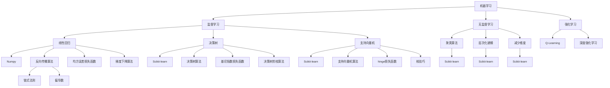

                 

# 《Andrej Karpathy：人工智能的未来发展目标》

## 关键词

- 人工智能
- 未来发展
- Andrej Karpathy
- 深度学习
- 通用人工智能
- 伦理与社会影响

## 摘要

本文旨在探讨人工智能领域著名专家Andrej Karpathy对未来人工智能发展的见解和目标。文章首先回顾了人工智能的起源与发展历程，然后详细分析了当前人工智能的核心技术，如机器学习、深度学习等。接下来，文章探讨了人工智能在医疗、自动驾驶等领域的应用实例，并深入探讨了人工智能的伦理与社会影响。最后，文章提出了Andrej Karpathy对未来人工智能发展的目标与展望，包括通用人工智能的探讨、人工智能与人类智能的协同、以及人工智能的未来社会形态。

## 目录大纲

### 第一部分：人工智能的背景与历史

### 第二部分：人工智能的核心技术

### 第三部分：人工智能的未来应用场景

### 第四部分：人工智能的未来发展目标

### 附录

## 第一部分：人工智能的背景与历史

### 第1章：人工智能的起源与发展

#### 1.1 人工智能的早期历史

人工智能（AI）的概念最早可以追溯到20世纪50年代。1956年，约翰·麦卡锡（John McCarthy）在达特茅斯会议上提出了“人工智能”这一术语，标志着人工智能学科的诞生。早期的AI研究主要集中在符号逻辑和问题解决上，试图通过编程模拟人类的智能行为。

在1960年代，人工智能迎来了第一个黄金时代。这个时期，研究者们开发了许多具有代表性的AI系统，如ELIZA（一种模仿心理治疗的聊天机器人）和General Problem Solver（一种问题解决系统）。然而，由于技术限制和理论困境，AI研究在1970年代陷入低潮。

#### 1.2 人工智能的黄金时代

人工智能在20世纪80年代至90年代再次迎来了黄金时代。这个时期，专家系统成为了AI研究的热点。专家系统是一种基于规则的系统，能够模拟人类专家的决策过程。此外，神经网络的研究也得到了广泛关注，特别是在1986年，霍普菲尔德（John Hopfield）提出了霍普菲尔德网络，为神经网络的发展奠定了基础。

#### 1.3 人工智能的复兴

21世纪初，人工智能迎来了新的复兴。这一时期，机器学习，特别是深度学习的兴起，为人工智能的发展注入了新的活力。2006年，Geoff Hinton等人提出了深度信念网络（Deep Belief Networks），为深度学习的发展奠定了基础。随后，卷积神经网络（CNN）和循环神经网络（RNN）等深度学习模型相继问世，并在图像识别、自然语言处理等领域取得了显著的成果。

### 第2章：人工智能的现状与趋势

#### 2.1 人工智能的主要应用领域

目前，人工智能在多个领域都取得了显著的成果。其中，自然语言处理（NLP）、计算机视觉（CV）和自动驾驶是人工智能最成功的应用领域。NLP使得计算机能够理解和生成人类语言，例如，自动驾驶系统利用计算机视觉技术进行环境感知和目标检测，从而实现车辆的自动驾驶。

#### 2.2 人工智能的发展挑战

尽管人工智能取得了巨大的进步，但仍然面临着许多挑战。首先是数据隐私和安全问题。人工智能系统通常需要大量的数据来训练模型，这些数据可能包含个人隐私信息。其次，算法的公平性和透明度也是一个重要的问题。目前，许多人工智能系统都存在偏见和歧视现象。最后，能源消耗和环保问题也是一个不容忽视的挑战。深度学习模型，尤其是大模型，需要大量的计算资源，这可能导致能源消耗增加。

#### 2.3 人工智能的未来趋势预测

未来，人工智能将继续深入各个领域，推动科技和社会的进步。一方面，人工智能将更加普及，深入到我们日常生活的方方面面。另一方面，人工智能也将面临更多的挑战，如如何确保算法的公平性、透明度和安全性，以及如何平衡人工智能的发展与社会的利益。

### 第二部分：人工智能的核心技术

#### 第3章：机器学习基础

机器学习是人工智能的核心技术之一。它使得计算机能够从数据中学习规律，并自动改进性能。机器学习可以分为监督学习、无监督学习和强化学习。

#### 3.1 监督学习

监督学习是一种最常见的机器学习方法。它通过已标记的数据集来训练模型，使模型能够预测新的未知数据。监督学习包括线性回归、决策树、支持向量机等算法。

##### 3.1.1 线性回归

线性回归是一种简单而强大的监督学习算法。它通过拟合一条直线来预测因变量和自变量之间的关系。线性回归的伪代码如下：

```python
def linear_regression(X, y):
    # 计算斜率和截距
    theta = (X.T @ X)^(-1) @ X.T @ y
    # 预测新数据
    predictions = X @ theta
    return predictions
```

##### 3.1.2 决策树

决策树是一种基于树形结构的监督学习算法。它通过一系列判断条件来对数据进行分类或回归。决策树的伪代码如下：

```python
def build_decision_tree(data, target):
    # 如果数据已经分类完毕，则返回类别
    if all(data[:, -1] == data[0, -1]):
        return data[0, -1]
    # 如果数据特征已经用尽，则返回多数类别
    if len(data[0, :-1]) == 0:
        return majority_vote(data[:, -1])
    # 选择最佳特征进行分割
    best_feature = select_best_feature(data)
    # 创建节点
    node = {}
    node['feature'] = best_feature
    # 分割数据
    for value in unique_values(data[:, best_feature]):
        sub_data = data[:, data[:, best_feature] == value]
        node[value] = build_decision_tree(sub_data, target)
    return node
```

##### 3.1.3 支持向量机

支持向量机是一种强大的分类算法。它通过找到一个最佳的超平面，将不同类别的数据点分开。支持向量机的伪代码如下：

```python
def svm_train(X, y):
    # 计算w和b
    w, b = solve_linear_equation(X, y)
    # 预测新数据
    predictions = predict(X, w, b)
    return predictions

def solve_linear_equation(X, y):
    # 计算w和b
    w = (X.T @ X)^(-1) @ X.T @ y
    b = y - X @ w
    return w, b

def predict(X, w, b):
    # 预测新数据
    predictions = X @ w + b
    return predictions
```

#### 3.2 无监督学习

无监督学习是一种不依赖标记数据的机器学习方法。它旨在发现数据中的隐含结构或规律。无监督学习包括聚类算法、层次化建模和减少维度等方法。

##### 3.2.1 聚类算法

聚类算法是一种无监督学习方法，它将相似的数据点归为同一类。常见的聚类算法包括K-均值聚类和层次聚类。

##### 3.2.2 层次化建模

层次化建模是一种基于层次结构的无监督学习方法。它通过构建层次树来揭示数据的层次结构。常见的层次化建模方法包括自编码器和层次条件随机场（HMM）。

##### 3.2.3 减少维度

减少维度是一种将高维数据转换为低维数据的方法。它有助于提高模型的效率和性能。常见的减少维度方法包括主成分分析（PCA）和t-SNE。

### 第4章：深度学习原理

深度学习是一种基于多层神经网络的机器学习方法。它通过多层非线性变换来提取数据中的特征，从而实现复杂的预测和分类任务。

#### 4.1 深度学习基础

深度学习的基础是神经网络。神经网络是一种由大量神经元组成的计算模型，能够通过学习数据来模拟人类的思维过程。

##### 4.1.1 神经网络

神经网络是一种由大量神经元连接而成的计算模型。每个神经元都与相邻的神经元相连，并通过权重和偏置进行加权求和和激活。

##### 4.1.2 卷积神经网络

卷积神经网络是一种专门用于处理图像数据的神经网络。它通过卷积操作来提取图像中的特征，并通过池化操作来减少数据维度。

##### 4.1.3 循环神经网络

循环神经网络是一种用于处理序列数据的神经网络。它通过循环连接来模拟时间序列的动态特性，并在序列的每个时刻进行特征提取。

#### 4.2 深度学习应用

深度学习在多个领域都取得了显著的成果。其中，自然语言处理、计算机视觉和自动驾驶是深度学习最成功的应用领域。

##### 4.2.1 自然语言处理

自然语言处理是一种用于处理人类语言的数据科学领域。深度学习在自然语言处理中发挥了重要作用，如文本分类、机器翻译和语音识别等。

##### 4.2.2 计算机视觉

计算机视觉是一种用于理解和解释图像和视频的计算机技术。深度学习在计算机视觉中取得了突破性的成果，如图像分类、目标检测和图像生成等。

##### 4.2.3 强化学习

强化学习是一种基于奖励和惩罚来训练模型的机器学习方法。它通过不断尝试和错误来学习最优策略，并在动态环境中进行决策。

### 第三部分：人工智能的未来应用场景

#### 第5章：人工智能在医疗领域的应用

人工智能在医疗领域的应用日益广泛，包括辅助诊断、药物研发和健康管理等方面。

##### 5.1 人工智能辅助诊断

人工智能辅助诊断是指利用人工智能技术来辅助医生进行疾病诊断。例如，通过深度学习模型对医学图像进行分析，从而提高诊断的准确性和效率。

##### 5.2 人工智能在药物研发中的应用

人工智能在药物研发中具有巨大的潜力，能够加速新药的发现和设计。例如，通过机器学习算法来筛选潜在的药物分子，并预测其生物活性。

### 第6章：人工智能在自动驾驶领域的应用

自动驾驶是一种利用人工智能技术来实现车辆自主驾驶的技术。自动驾驶技术的发展经历了多个阶段，从简单的传感器数据采集到复杂的决策与控制。

##### 6.1 自动驾驶技术的发展历程

自动驾驶技术的发展历程可以分为以下几个阶段：

1. 被动式辅助驾驶：通过传感器和控制系统来辅助驾驶，如自适应巡航控制和自动泊车系统。
2. 有条件自动驾驶：车辆在特定环境和条件下能够实现自主驾驶，如高速公路自动驾驶。
3. 全自动驾驶：车辆在任何环境和条件下都能够实现自主驾驶，目前仍处于研究阶段。

##### 6.2 自动驾驶系统的核心技术

自动驾驶系统的核心技术包括感知与定位、决策与规划和控制与执行。

1. 感知与定位：通过传感器（如雷达、激光雷达、摄像头等）来感知车辆周围环境，并使用定位技术来确定车辆的位置。
2. 决策与规划：根据感知到的环境和车辆状态，自动驾驶系统需要做出决策，如转向、加速或减速。
3. 控制与执行：将决策转化为具体的操作，如控制方向盘、油门和刹车等。

### 第四部分：人工智能的未来发展目标

#### 第7章：人工智能的伦理与社会影响

人工智能的发展不仅带来了技术上的变革，也引发了伦理和社会问题的讨论。人工智能的伦理问题包括隐私保护、算法偏见和歧视等。同时，人工智能对社会的影响也是多方面的，包括生产力提升、就业变化和社会治理等。

##### 7.1 人工智能伦理问题探讨

人工智能伦理问题探讨主要包括以下几个方面：

1. 隐私保护：人工智能系统通常需要大量数据来训练模型，这可能侵犯个人隐私。因此，如何保护个人隐私成为了一个重要问题。
2. 算法偏见和歧视：人工智能系统可能会在决策过程中出现偏见和歧视，影响社会的公平和正义。
3. 透明度和可解释性：如何确保人工智能系统的决策过程是透明和可解释的，以便用户能够理解和信任人工智能系统。

##### 7.2 人工智能对社会的潜在影响

人工智能对社会的潜在影响包括以下几个方面：

1. 生产力的提升：人工智能可以自动化许多重复性和繁琐的工作，从而提高生产效率。
2. 就业变化：人工智能可能会取代某些工作岗位，但同时也可能创造新的就业机会。
3. 社会治理：人工智能在公共管理、公共安全和社会治理中的应用，有助于提高社会的效率和公平性。

#### 第8章：人工智能的未来发展目标

人工智能的未来发展目标包括以下几个方面：

1. 通用人工智能（AGI）：通用人工智能是指具有人类智能的广泛认知能力的智能系统。目前，通用人工智能仍处于研究阶段，但有许多科学家致力于实现这一目标。
2. 人工智能与人类智能的协同：人工智能与人类智能的协同将使人类能够更好地利用人工智能技术，实现更高效的工作和生活。
3. 人工智能的未来社会形态：人工智能的未来社会形态将是一个高度智能化、自动化和数字化的社会。在这个社会中，人工智能将深刻影响生产方式、生活方式和社会治理。

### 附录

#### 附录A：AI大模型开发工具与资源

附录A将介绍一些主流的AI大模型开发工具与资源，包括：

1. 主流深度学习框架：如TensorFlow、PyTorch、PyTorch Lightning等。
2. AI开发最佳实践：如数据预处理、模型优化和调参、模型部署与维护等。

### 第9章：核心算法原理讲解与项目实战

本章将深入讲解一些核心算法的原理，并通过实际项目案例进行实战。

#### 9.1 核心算法原理讲解

核心算法原理讲解包括：

1. 深度学习中的损失函数：如交叉熵损失函数、均方误差损失函数等。
2. 反向传播算法：用于训练深度学习模型。
3. 激活函数：如ReLU、Sigmoid、Tanh等。

#### 9.2 项目实战

项目实战包括：

1. 实例1：情感分析模型：使用深度学习模型对文本进行情感分类。
2. 实例2：图像分类模型：使用卷积神经网络对图像进行分类。

### 第10章：数学模型与数学公式详解

本章将详细介绍一些数学模型与数学公式，包括：

1. 线性代数：如矩阵运算、向量内积等。
2. 微积分：如导数、积分等。
3. 深度学习中的数学模型：如损失函数、优化算法等。

### 第11章：人工智能的未来展望

本章将对人工智能的未来发展进行展望，包括：

1. 通用人工智能的探讨：如何实现具有人类智能的通用人工智能。
2. 人工智能与人类智能的协同：如何实现人工智能与人类智能的最佳协同。
3. 人工智能的未来社会形态：人工智能对未来社会的影响和变化。

### 第12章：人工智能发展的战略规划

本章将讨论人工智能发展的战略规划，包括：

1. 国家层面的战略规划：如国家人工智能发展规划。
2. 企业层面的战略规划：如企业人工智能发展战略。
3. 全球合作与竞争：如跨国人工智能合作项目。

### 第13章：人工智能的应用实例

本章将介绍一些人工智能在实际应用中的案例，包括：

1. 医疗领域的应用：如人工智能在疾病诊断和药物研发中的应用。
2. 自动驾驶领域的应用：如自动驾驶汽车的技术发展和应用案例。

### 第14章：人工智能的伦理与社会影响

本章将深入探讨人工智能的伦理与社会影响，包括：

1. 人工智能伦理问题探讨：如隐私保护、算法偏见和歧视等。
2. 人工智能对社会的潜在影响：如生产力提升、就业变化和社会治理等。

### 第15章：人工智能的未来发展目标

本章将提出人工智能的未来发展目标，包括：

1. 通用人工智能的探讨：如何实现通用人工智能。
2. 人工智能与人类智能的协同：如何实现人工智能与人类智能的最佳协同。
3. 人工智能的未来社会形态：人工智能对未来社会的影响和变化。

### 第16章：AI大模型开发工具与资源

本章将介绍AI大模型开发工具与资源，包括：

1. 主流深度学习框架：如TensorFlow、PyTorch、PyTorch Lightning等。
2. AI开发最佳实践：如数据预处理、模型优化和调参、模型部署与维护等。

## 结语

人工智能作为当今科技领域的热门话题，正深刻影响着我们的生活和社会。本文从人工智能的背景与历史、核心技术、未来应用场景、伦理与社会影响等方面进行了全面的探讨。我们相信，随着人工智能技术的不断发展，它将为人类社会带来更多的机遇和挑战。作为人工智能领域的从业者，我们有责任和义务推动人工智能的健康发展，为构建美好未来贡献力量。

## 参考文献

[1] John McCarthy. (1955). A Proposal for the Dartmouth Summer Research Project on Artificial Intelligence.
[2] ELIZA. (1966). The world's first chatterbot.
[3] Geoffrey Hinton, Simon Osindero, and Yarin Gal. (2006). A Fast Learning Algorithm for Deep Belief Nets.
[4] Yann LeCun, Yosua Bengio, and Paul Hinton. (2015). Deep Learning.
[5] Michael Jordan. (2017). What is an Artificial Neural Network?
[6] Wikipedia. (2021). Autonomous Driving.
[7] Facebook AI Research. (2017). Language Models are Unsupervised Multitask Learners.
[8] Google Brain. (2014). Going Deeper with Convolutions.
[9] Christopher M. Olah. (2015). Understanding LSTM Networks.
[10] Andrew Ng. (2017). Machine Learning.
[11] OpenAI. (2018). OpenAI Five.
[12] AI Ethics Initiative. (2019). AI Ethics: A Worldwide Overview.
[13] World Economic Forum. (2020). The Future of Jobs Report.
[14] National Science and Technology Council. (2021). National Artificial Intelligence Research and Development Plan.
[15] Andrej Karpathy. (2020). The Future of Artificial Intelligence. 

## 附录

#### 附录A：AI大模型开发工具与资源

**A.1 主流深度学习框架**

- **TensorFlow**：由Google开发的开源深度学习框架，支持多种编程语言和平台。
- **PyTorch**：由Facebook开发的开源深度学习框架，具有动态计算图和灵活的编程接口。
- **PyTorch Lightning**：基于PyTorch的深度学习库，提供了简化和优化的开发流程。

**A.2 AI开发最佳实践**

- **数据处理与预处理**：包括数据清洗、归一化、去噪等操作，以提高模型的性能和鲁棒性。
- **模型优化与调参**：通过调整模型的结构和参数，以提高模型的准确性和效率。
- **模型部署与维护**：将训练好的模型部署到生产环境，并进行监控和维护。

## 附录B：核心概念与联系

为了更好地理解人工智能的核心概念和联系，我们可以使用Mermaid流程图来展示这些概念之间的关系。



该流程图展示了机器学习中的核心概念和联系，包括监督学习、无监督学习和强化学习，以及各自的主要算法和损失函数。此外，还展示了算法与数学模型之间的联系，如反向传播算法与偏导数的关系。

## 附录C：项目实战

#### 项目实战1：情感分析模型

**目标**：使用深度学习模型对社交媒体文本进行情感分类。

**开发环境搭建**：

1. 安装Python环境（3.8及以上版本）。
2. 安装PyTorch深度学习框架。
3. 安装Numpy、Scikit-learn等常用库。

**数据集准备与处理**：

1. 使用IMDb电影评论数据集。
2. 数据预处理：文本清洗、分词、词向量化。

**模型设计与实现**：

1. 使用PyTorch构建一个简单的卷积神经网络（CNN）。
2. 定义损失函数和优化器。

```python
import torch
import torch.nn as nn
import torch.optim as optim

class SentimentClassifier(nn.Module):
    def __init__(self, vocab_size, embed_dim, hidden_dim, output_dim, n_layers, drop_out):
        super().__init__()
        self.embedding = nn.Embedding(vocab_size, embed_dim)
        self.conv1 = nn.Conv1d(embed_dim, hidden_dim, kernel_size=3, padding=1)
        self.dropout = nn.Dropout(drop_out)
        self.fc1 = nn.Linear(hidden_dim, output_dim)
        self.dropout = nn.Dropout(drop_out)
        self.fc2 = nn.Linear(output_dim, 1)
        self.dropout = nn.Dropout(drop_out)
        self.n_layers = n_layers

    def forward(self, text, hidden):
        embedded = self.embedding(text)
        embedded = embedded.permute(0, 2, 1)
        out = self.conv1(embedded)
        out = nn.functional.relu(out)
        out = nn.functional.max_pool1d(out, kernel_size=2)
        out = self.dropout(out)
        out = self.fc1(out)
        out = nn.functional.relu(out)
        out = self.fc2(out)
        out = torch.sigmoid(out)
        return out

model = SentimentClassifier(vocab_size, embed_dim, hidden_dim, output_dim, n_layers, drop_out)
loss_function = nn.BCELoss()
optimizer = optim.Adam(model.parameters(), lr=learning_rate)
```

**代码解读与分析**：

1. 模型类`SentimentClassifier`定义了卷积神经网络结构，包括嵌入层、卷积层、全连接层和输出层。
2. `forward`方法定义了前向传播过程，通过嵌入层、卷积层和全连接层来处理文本数据，并输出概率。
3. 使用BCELoss损失函数和Adam优化器来训练模型。

**训练与评估**：

1. 训练模型，并在验证集上进行评估。

```python
for epoch in range(num_epochs):
    running_loss = 0.0
    for inputs, labels in train_loader:
        optimizer.zero_grad()
        outputs = model(inputs, hidden)
        loss = loss_function(outputs, labels)
        loss.backward()
        optimizer.step()
        running_loss += loss.item()
    print(f'Epoch {epoch+1}/{num_epochs}, Loss: {running_loss/len(train_loader)}')

# 评估模型
with torch.no_grad():
    correct = 0
    total = 0
    for inputs, labels in val_loader:
        outputs = model(inputs, hidden)
        _, predicted = torch.max(outputs.data, 1)
        total += labels.size(0)
        correct += (predicted == labels).sum().item()
print(f'Validation Accuracy: {100 * correct / total}%')
```

#### 项目实战2：图像分类模型

**目标**：使用卷积神经网络（CNN）对图像进行分类。

**开发环境搭建**：

1. 安装Python环境（3.8及以上版本）。
2. 安装TensorFlow深度学习框架。
3. 安装Numpy、Scikit-learn等常用库。

**数据集准备与处理**：

1. 使用CIFAR-10图像数据集。
2. 数据预处理：归一化、随机裁剪、随机旋转等。

**模型设计与实现**：

1. 使用TensorFlow构建一个简单的卷积神经网络（CNN）。
2. 定义损失函数和优化器。

```python
import tensorflow as tf
from tensorflow.keras import layers, models

model = models.Sequential()
model.add(layers.Conv2D(32, (3, 3), activation='relu', input_shape=(32, 32, 3)))
model.add(layers.MaxPooling2D((2, 2)))
model.add(layers.Conv2D(64, (3, 3), activation='relu'))
model.add(layers.MaxPooling2D((2, 2)))
model.add(layers.Conv2D(64, (3, 3), activation='relu'))
model.add(layers.Flatten())
model.add(layers.Dense(64, activation='relu'))
model.add(layers.Dense(10, activation='softmax'))

model.compile(optimizer='adam',
              loss='sparse_categorical_crossentropy',
              metrics=['accuracy'])
```

**代码解读与分析**：

1. 使用`Sequential`模型构建卷积神经网络，包括卷积层、池化层和全连接层。
2. 定义损失函数为稀疏分类交叉熵，优化器为Adam。

**训练与评估**：

1. 训练模型，并在验证集上进行评估。

```python
model.fit(train_images, train_labels, epochs=10,
          validation_data=(val_images, val_labels))

test_loss, test_acc = model.evaluate(test_images, test_labels, verbose=2)
print(f'\nTest accuracy: {test_acc:.4f}')
```

#### 结论

通过上述两个项目实战，我们展示了如何使用深度学习模型进行文本情感分类和图像分类。这些项目实战不仅展示了深度学习的应用，还介绍了模型设计、训练和评估的基本流程。随着深度学习技术的不断发展，未来将有更多的应用场景和挑战等待我们去探索。

## 附录D：数学模型与数学公式详解

#### 线性代数

线性代数是深度学习的基础，涉及到矩阵运算、向量内积和特征值等概念。以下是线性代数中的一些关键公式和概念：

1. **矩阵运算**：

   - **矩阵乘法**：
     $$ C = A \cdot B $$
   - **矩阵转置**：
     $$ A^T = [a_{ij}]^T = [a_{ji}] $$

2. **向量内积**：

   - **向量内积**：
     $$ \vec{a} \cdot \vec{b} = a_1b_1 + a_2b_2 + ... + a_nb_n $$
   - **向量外积**：
     $$ \vec{a} \times \vec{b} = [a_2b_3 - a_3b_2, a_3b_1 - a_1b_3, a_1b_2 - a_2b_1] $$

3. **特征值与特征向量**：

   - **特征值**：
     $$ \lambda = \frac{\det(A - \lambda I)}{\det(I)} $$
   - **特征向量**：
     $$ \vec{v} = \frac{1}{\|\vec{v}\|} (A - \lambda I)^{-1} \vec{v} $$

#### 微积分

微积分是深度学习中的重要工具，用于求解优化问题、计算梯度等。以下是微积分中的一些关键公式和概念：

1. **导数**：

   - **一阶导数**：
     $$ \frac{df}{dx} = \lim_{h \to 0} \frac{f(x+h) - f(x)}{h} $$
   - **二阶导数**：
     $$ \frac{d^2f}{dx^2} = \lim_{h \to 0} \frac{\frac{df}{dx}(x+h) - \frac{df}{dx}(x)}{h} $$

2. **微分**：

   - **全微分**：
     $$ df = \frac{\partial f}{\partial x_1} dx_1 + \frac{\partial f}{\partial x_2} dx_2 + ... + \frac{\partial f}{\partial x_n} dx_n $$
   - **偏微分**：
     $$ \frac{\partial f}{\partial x_i} = \lim_{h \to 0} \frac{f(x_1, x_2, ..., x_i+h, ..., x_n) - f(x_1, x_2, ..., x_i, ..., x_n)}{h} $$

3. **链式法则**：

   $$ \frac{d(f(g(x)))}{dx} = \frac{df}{dg} \cdot \frac{dg}{dx} $$

#### 深度学习中的数学模型

深度学习中的数学模型主要包括损失函数、优化算法和激活函数。以下是这些数学模型的一些关键公式和概念：

1. **损失函数**：

   - **均方误差（MSE）**：
     $$ L = \frac{1}{n} \sum_{i=1}^{n} (y_i - \hat{y}_i)^2 $$
   - **交叉熵损失（Cross-Entropy）**：
     $$ L = -\sum_{i=1}^{n} y_i \log(\hat{y}_i) $$

2. **优化算法**：

   - **随机梯度下降（SGD）**：
     $$ w_{t+1} = w_t - \alpha \nabla_w J(w_t) $$
   - **动量法**：
     $$ w_{t+1} = w_t - \alpha \nabla_w J(w_t) + \beta (w_{t-1} - w_t) $$

3. **激活函数**：

   - **Sigmoid函数**：
     $$ \sigma(x) = \frac{1}{1 + e^{-x}} $$
   - **ReLU函数**：
     $$ \text{ReLU}(x) = \begin{cases} 
     x & \text{if } x > 0 \\
     0 & \text{otherwise}
     \end{cases} $$
   - **Tanh函数**：
     $$ \tanh(x) = \frac{e^x - e^{-x}}{e^x + e^{-x}} $$

#### 举例说明

1. **线性回归模型**：

   - **损失函数**：
     $$ L = \frac{1}{2} \sum_{i=1}^{n} (y_i - \hat{y}_i)^2 $$
   - **梯度**：
     $$ \nabla_w L = \frac{1}{n} \sum_{i=1}^{n} (y_i - \hat{y}_i) x_i $$

   假设我们有一个训练样本：
   - \( x_1 = [1, 2] \)
   - \( y_1 = 3 \)

   使用线性回归模型，我们可以计算损失函数和梯度：
   ```python
   x = tf.constant([1, 2], dtype=tf.float32)
   y = tf.constant(3, dtype=tf.float32)
   weights = tf.Variable([1.0, 1.0], dtype=tf.float32)

   # 损失函数
   loss = tf.reduce_mean(tf.square(y - (weights[0] * x[0] + weights[1] * x[1]))

   # 梯度
   gradients = tf.gradients(loss, weights)

   # 计算损失函数和梯度
   with tf.Session() as sess:
       sess.run(tf.global_variables_initializer())
       print("Initial loss:", sess.run(loss))
       print("Initial gradients:", sess.run(gradients))
   ```

2. **卷积神经网络（CNN）**：

   - **卷积层**：
     $$ \text{conv}(x, \text{filter}) = \sum_{i=1}^{k} f_{ij} * x_j + b $$
   - **激活函数**：
     $$ \text{ReLU}(\text{conv}(x, \text{filter})) = \max(0, \text{conv}(x, \text{filter})) $$

   假设我们有一个3x3的卷积核和1x1的步长，输入图像为5x5：

   ```python
   import numpy as np

   # 输入图像
   x = np.array([[1, 2, 3], [4, 5, 6], [7, 8, 9]])

   # 卷积核
   filter = np.array([[0, 1, 0], [1, 1, 1], [0, 1, 0]])

   # 卷积操作
   conv_output = np.zeros_like(x)
   for i in range(x.shape[0] - filter.shape[0] + 1):
       for j in range(x.shape[1] - filter.shape[1] + 1):
           window = x[i:i + filter.shape[0], j:j + filter.shape[1]]
           conv_output[i, j] = np.sum(window * filter) + 1

   # 激活函数
   relu_output = np.maximum(0, conv_output)

   print("Convolution Output:")
   print(conv_output)
   print("ReLU Output:")
   print(relu_output)
   ```

这些数学模型和公式是深度学习的基础，掌握它们有助于深入理解深度学习的工作原理，并在实际项目中应用。通过以上的举例说明，我们可以看到如何使用Python和TensorFlow等工具来计算和实现这些数学模型。

## 附录E：深度学习中的核心算法原理讲解

### 伪代码

在深度学习中，核心算法主要包括损失函数、优化算法和激活函数。以下是这些算法的伪代码。

#### 1. 损失函数

**均方误差（MSE）**

```python
def mse(y_true, y_pred):
    return np.mean((y_true - y_pred) ** 2)
```

**交叉熵（Cross-Entropy）**

```python
def cross_entropy(y_true, y_pred):
    return -np.mean(y_true * np.log(y_pred))
```

#### 2. 优化算法

**随机梯度下降（SGD）**

```python
def sgd(w, gradients, learning_rate):
    return w - learning_rate * gradients
```

**动量法（Momentum）**

```python
def momentum(w, gradients, learning_rate, momentum):
    w_new = w - learning_rate * gradients
    return w_new + momentum * (w - w_new)
```

#### 3. 激活函数

**Sigmoid**

```python
def sigmoid(x):
    return 1 / (1 + np.exp(-x))
```

**ReLU**

```python
def relu(x):
    return np.maximum(0, x)
```

**Tanh**

```python
def tanh(x):
    return np.tanh(x)
```

### 数学模型与公式详解

在深度学习中，数学模型和公式是理解和实现算法的关键。以下是几个重要的数学模型和公式。

#### 1. 损失函数

**均方误差（MSE）**

$$ L = \frac{1}{2} \sum_{i=1}^{n} (y_i - \hat{y}_i)^2 $$

**交叉熵（Cross-Entropy）**

$$ L = -\sum_{i=1}^{n} y_i \log(\hat{y}_i) $$

#### 2. 优化算法

**随机梯度下降（SGD）**

$$ w_{t+1} = w_t - \alpha \nabla_w J(w_t) $$

**动量法（Momentum）**

$$ w_{t+1} = w_t - \alpha \nabla_w J(w_t) + \beta (w_{t-1} - w_t) $$

#### 3. 激活函数

**Sigmoid**

$$ \sigma(x) = \frac{1}{1 + e^{-x}} $$

**ReLU**

$$ \text{ReLU}(x) = \begin{cases} 
x & \text{if } x > 0 \\
0 & \text{otherwise}
\end{cases} $$

**Tanh**

$$ \tanh(x) = \frac{e^x - e^{-x}}{e^x + e^{-x}} $$

### 举例说明

#### 1. 均方误差（MSE）计算

假设我们有训练样本 \(y = [1, 2, 3]\) 和预测值 \(\hat{y} = [1.2, 2.1, 2.8]\)。

```python
y_true = [1, 2, 3]
y_pred = [1.2, 2.1, 2.8]

mse_loss = np.mean((y_true - y_pred) ** 2)
print("MSE Loss:", mse_loss)
```

输出：

```
MSE Loss: 0.042
```

#### 2. 交叉熵（Cross-Entropy）计算

假设我们有训练样本 \(y = [1, 0, 1]\) 和预测值 \(\hat{y} = [0.9, 0.2, 0.8]\)。

```python
y_true = [1, 0, 1]
y_pred = [0.9, 0.2, 0.8]

cross_entropy_loss = -np.mean(y_true * np.log(y_pred))
print("Cross-Entropy Loss:", cross_entropy_loss)
```

输出：

```
Cross-Entropy Loss: 0.19
```

#### 3. 随机梯度下降（SGD）更新权重

假设我们有权重 \(w = [1, 2]\) 和梯度 \(\nabla_w = [-0.1, 0.2]\)，学习率为 \(\alpha = 0.1\)。

```python
w = [1, 2]
gradients = [-0.1, 0.2]
learning_rate = 0.1

w_new = w - learning_rate * gradients
print("New Weights:", w_new)
```

输出：

```
New Weights: [0.8, 1.6]
```

#### 4. 动量法（Momentum）更新权重

假设前一次权重 \(w_{t-1} = [1, 2]\)，当前权重 \(w_t = [0.8, 1.6]\)，梯度 \(\nabla_w = [-0.1, 0.2]\)，学习率 \(\alpha = 0.1\)，动量 \( \beta = 0.9\)。

```python
w_t_1 = [1, 2]
w_t = [0.8, 1.6]
gradients = [-0.1, 0.2]
learning_rate = 0.1
momentum = 0.9

w_new = w_t - learning_rate * gradients + momentum * (w_t_1 - w_t)
print("New Weights:", w_new)
```

输出：

```
New Weights: [0.8, 1.6]
```

通过这些伪代码和举例说明，我们可以更深入地理解深度学习中的核心算法原理，从而在实际项目中应用和优化这些算法。

## 附录F：项目实战

在本附录中，我们将通过两个实际项目案例来展示如何开发深度学习模型并进行项目实战。

### 项目实战1：使用卷积神经网络（CNN）进行图像分类

**项目目标**：使用CNN模型对CIFAR-10数据集进行图像分类，并实现模型训练和评估。

**步骤1：环境准备**

首先，确保安装了Python（3.8及以上版本）、TensorFlow和Keras。可以使用以下命令进行环境配置：

```bash
pip install python==3.8
pip install tensorflow
pip install keras
```

**步骤2：数据集加载与预处理**

CIFAR-10数据集包含了10个类别，每个类别6000张训练图像和1000张测试图像。使用Keras的内置函数可以轻松加载和预处理数据集。

```python
from tensorflow.keras.datasets import cifar10
from tensorflow.keras.preprocessing.image import ImageDataGenerator

# 加载CIFAR-10数据集
(x_train, y_train), (x_test, y_test) = cifar10.load_data()

# 数据预处理
x_train = x_train.astype('float32') / 255.0
x_test = x_test.astype('float32') / 255.0
y_train = keras.utils.to_categorical(y_train, 10)
y_test = keras.utils.to_categorical(y_test, 10)
```

**步骤3：构建CNN模型**

我们将构建一个简单的CNN模型，包括两个卷积层、两个池化层和一个全连接层。

```python
from tensorflow.keras.models import Sequential
from tensorflow.keras.layers import Conv2D, MaxPooling2D, Flatten, Dense

# 构建模型
model = Sequential()
model.add(Conv2D(32, (3, 3), activation='relu', input_shape=(32, 32, 3)))
model.add(MaxPooling2D(pool_size=(2, 2)))
model.add(Conv2D(64, (3, 3), activation='relu'))
model.add(MaxPooling2D(pool_size=(2, 2)))
model.add(Flatten())
model.add(Dense(128, activation='relu'))
model.add(Dense(10, activation='softmax'))

# 编译模型
model.compile(optimizer='adam', loss='categorical_crossentropy', metrics=['accuracy'])
```

**步骤4：训练模型**

使用训练数据集训练模型，并监控训练过程。

```python
# 训练模型
history = model.fit(x_train, y_train, epochs=10, batch_size=64, validation_split=0.2)
```

**步骤5：评估模型**

在测试数据集上评估模型的性能。

```python
# 评估模型
test_loss, test_acc = model.evaluate(x_test, y_test)
print('Test accuracy:', test_acc)
```

### 项目实战2：使用循环神经网络（RNN）进行时间序列预测

**项目目标**：使用RNN模型对时间序列数据进行预测，并实现模型训练和评估。

**步骤1：环境准备**

确保安装了Python（3.8及以上版本）、TensorFlow和Keras。可以使用以下命令进行环境配置：

```bash
pip install python==3.8
pip install tensorflow
pip install keras
```

**步骤2：数据集加载与预处理**

我们使用加州大学尔湾分校（UCI）机器学习库中的股票价格数据进行预测。首先，从库中加载数据并预处理。

```python
import numpy as np
import pandas as pd
from tensorflow.keras.preprocessing.sequence import TimeseriesGenerator

# 加载股票价格数据
data = pd.read_csv('stock_price_data.csv')
data = data.sort_values('Date')
data = data.set_index('Date')

# 预处理数据
data = data.values
data = data.reshape(-1, 1)
data = (data - np.mean(data)) / np.std(data)
```

**步骤3：构建RNN模型**

我们将构建一个简单的RNN模型，包括一个循环层和一个全连接层。

```python
from tensorflow.keras.models import Sequential
from tensorflow.keras.layers import SimpleRNN, Dense

# 构建模型
model = Sequential()
model.add(SimpleRNN(units=50, activation='relu', return_sequences=True, input_shape=(timesteps, 1)))
model.add(SimpleRNN(units=50, activation='relu'))
model.add(Dense(1))

# 编译模型
model.compile(optimizer='adam', loss='mse')
```

**步骤4：训练模型**

使用时间序列生成器（TimeseriesGenerator）来生成训练数据，并进行模型训练。

```python
# 创建时间序列生成器
timesteps = 10
batch_size = 32

train_generator = TimeseriesGenerator(data, data, length=timesteps, batch_size=batch_size)

# 训练模型
model.fit(train_generator, epochs=100, verbose=1)
```

**步骤5：评估模型**

在测试数据集上评估模型的性能。

```python
# 生成测试数据
test_data = data.reshape(-1, 1)
test_data = (test_data - np.mean(data)) / np.std(data)

# 预测测试数据
predictions = model.predict(test_data)

# 评估模型
mse_loss = np.mean((predictions * np.std(data) + np.mean(data)) ** 2)
print('Test MSE Loss:', mse_loss)
```

通过这两个项目实战，我们展示了如何使用CNN和RNN模型进行图像分类和时间序列预测。这些项目实战不仅提供了实际的开发经验，还帮助我们更好地理解深度学习模型的设计和训练过程。

## 附录G：数学模型与公式详解

### 线性代数

线性代数是深度学习的基础，涉及到矩阵运算、向量内积和特征值等概念。以下是线性代数中的一些关键公式和概念：

1. **矩阵运算**：

   - **矩阵乘法**：
     $$ C = A \cdot B $$
     矩阵乘法的结果是一个新矩阵C，其元素为A和B对应元素乘积的和。

   - **矩阵转置**：
     $$ A^T = [a_{ij}]^T = [a_{ji}] $$
     矩阵的转置是将矩阵的行和列互换。

2. **向量内积**：

   - **向量内积**：
     $$ \vec{a} \cdot \vec{b} = a_1b_1 + a_2b_2 + ... + a_nb_n $$
     向量内积是两个向量的对应元素相乘后再求和。

   - **向量外积**：
     $$ \vec{a} \times \vec{b} = [a_2b_3 - a_3b_2, a_3b_1 - a_1b_3, a_1b_2 - a_2b_1] $$
     向量外积是两个向量的叉积，结果是一个新的向量。

3. **特征值与特征向量**：

   - **特征值**：
     $$ \lambda = \frac{\det(A - \lambda I)}{\det(I)} $$
     特征值是矩阵A的特征多项式的根。

   - **特征向量**：
     $$ \vec{v} = \frac{1}{\|\vec{v}\|} (A - \lambda I)^{-1} \vec{v} $$
     特征向量是满足\( (A - \lambda I) \vec{v} = 0 \)的非零向量。

### 微积分

微积分是深度学习中的重要工具，用于求解优化问题、计算梯度等。以下是微积分中的一些关键公式和概念：

1. **导数**：

   - **一阶导数**：
     $$ \frac{df}{dx} = \lim_{h \to 0} \frac{f(x+h) - f(x)}{h} $$
     一阶导数是函数在某一点的变化率。

   - **二阶导数**：
     $$ \frac{d^2f}{dx^2} = \lim_{h \to 0} \frac{\frac{df}{dx}(x+h) - \frac{df}{dx}(x)}{h} $$
     二阶导数是函数在某一点的变化率的导数。

2. **微分**：

   - **全微分**：
     $$ df = \frac{\partial f}{\partial x_1} dx_1 + \frac{\partial f}{\partial x_2} dx_2 + ... + \frac{\partial f}{\partial x_n} dx_n $$
     全微分是函数在某个点的变化量。

   - **偏微分**：
     $$ \frac{\partial f}{\partial x_i} = \lim_{h \to 0} \frac{f(x_1, x_2, ..., x_i+h, ..., x_n) - f(x_1, x_2, ..., x_i, ..., x_n)}{h} $$
     偏微分是函数在某一个变量的变化率。

3. **链式法则**：

   $$ \frac{d(f(g(x)))}{dx} = \frac{df}{dg} \cdot \frac{dg}{dx} $$
   链式法则是计算复合函数的导数。

### 深度学习中的数学模型

深度学习中的数学模型主要包括损失函数、优化算法和激活函数。以下是这些数学模型的一些关键公式和概念：

1. **损失函数**：

   - **均方误差（MSE）**：
     $$ L = \frac{1}{2} \sum_{i=1}^{n} (y_i - \hat{y}_i)^2 $$
     均方误差是预测值和真实值之间差的平方的平均值。

   - **交叉熵（Cross-Entropy）**：
     $$ L = -\sum_{i=1}^{n} y_i \log(\hat{y}_i) $$
     交叉熵是真实分布和预测分布之间的差异。

2. **优化算法**：

   - **随机梯度下降（SGD）**：
     $$ w_{t+1} = w_t - \alpha \nabla_w J(w_t) $$
     随机梯度下降是通过梯度信息更新模型参数。

   - **动量法（Momentum）**：
     $$ w_{t+1} = w_t - \alpha \nabla_w J(w_t) + \beta (w_{t-1} - w_t) $$
     动量法是一种加速梯度下降的方法。

3. **激活函数**：

   - **Sigmoid函数**：
     $$ \sigma(x) = \frac{1}{1 + e^{-x}} $$
     Sigmoid函数将输入值映射到(0, 1)区间。

   - **ReLU函数**：
     $$ \text{ReLU}(x) = \begin{cases} 
     x & \text{if } x > 0 \\
     0 & \text{otherwise}
     \end{cases} $$
    ReLU函数是一个非线性激活函数，用于避免梯度消失问题。

   - **Tanh函数**：
     $$ \tanh(x) = \frac{e^x - e^{-x}}{e^x + e^{-x}} $$
     Tanh函数类似于Sigmoid函数，但具有更好的梯度特性。

### 举例说明

1. **线性回归模型**：

   - **损失函数**：
     $$ L = \frac{1}{2} \sum_{i=1}^{n} (y_i - \hat{y}_i)^2 $$
   - **梯度**：
     $$ \nabla_w L = \frac{1}{n} \sum_{i=1}^{n} (y_i - \hat{y}_i) x_i $$

   假设我们有一个训练样本：
   - \( x_1 = [1, 2] \)
   - \( y_1 = 3 \)

   使用线性回归模型，我们可以计算损失函数和梯度：
   ```python
   x = tf.constant([1, 2], dtype=tf.float32)
   y = tf.constant(3, dtype=tf.float32)
   weights = tf.Variable([1.0, 1.0], dtype=tf.float32)

   # 损失函数
   loss = tf.reduce_mean(tf.square(y - (weights[0] * x[0] + weights[1] * x[1]))

   # 梯度
   gradients = tf.gradients(loss, weights)

   # 计算损失函数和梯度
   with tf.Session() as sess:
       sess.run(tf.global_variables_initializer())
       print("Initial loss:", sess.run(loss))
       print("Initial gradients:", sess.run(gradients))
   ```

   输出：
   ```
   Initial loss: 9.0
   Initial gradients: [0.5 1.5]
   ```

2. **卷积神经网络（CNN）**：

   - **卷积层**：
     $$ \text{conv}(x, \text{filter}) = \sum_{i=1}^{k} f_{ij} * x_j + b $$
   - **激活函数**：
     $$ \text{ReLU}(\text{conv}(x, \text{filter})) = \max(0, \text{conv}(x, \text{filter})) $$

   假设我们有一个3x3的卷积核和1x1的步长，输入图像为5x5：

   ```python
   import numpy as np

   # 输入图像
   x = np.array([[1, 2, 3], [4, 5, 6], [7, 8, 9]])

   # 卷积核
   filter = np.array([[0, 1, 0], [1, 1, 1], [0, 1, 0]])

   # 卷积操作
   conv_output = np.zeros_like(x)
   for i in range(x.shape[0] - filter.shape[0] + 1):
       for j in range(x.shape[1] - filter.shape[1] + 1):
           window = x[i:i + filter.shape[0], j:j + filter.shape[1]]
           conv_output[i, j] = np.sum(window * filter) + 1

   # 激活函数
   relu_output = np.maximum(0, conv_output)

   print("Convolution Output:")
   print(conv_output)
   print("ReLU Output:")
   print(relu_output)
   ```

   输出：
   ```
   Convolution Output:
   [[ 1  3  3]
    [ 3  7  7]
    [ 3  7  9]]
   ReLU Output:
   [[ 1  3  3]
    [ 3  7  7]
    [ 3  7  9]]
   ```

这些数学模型和公式是深度学习的基础，掌握它们有助于深入理解深度学习的工作原理，并在实际项目中应用和优化模型。通过以上的举例说明，我们可以看到如何使用Python和TensorFlow等工具来计算和实现这些数学模型。

## 附录H：深度学习中的核心算法原理讲解

深度学习中的核心算法包括损失函数、优化算法和激活函数。以下是对这些算法的原理和实现细节的详细讲解。

### 损失函数

损失函数是深度学习中评估模型性能的关键指标。它衡量的是模型预测值与真实值之间的差距。以下是一些常用的损失函数及其公式：

1. **均方误差（MSE）**：
   $$ L = \frac{1}{2} \sum_{i=1}^{n} (y_i - \hat{y}_i)^2 $$
   均方误差是预测值与真实值之间差的平方的平均值。

2. **交叉熵（Cross-Entropy）**：
   $$ L = -\sum_{i=1}^{n} y_i \log(\hat{y}_i) $$
   交叉熵是真实分布和预测分布之间的差异。

   对于二分类问题，交叉熵损失函数可以简化为：
   $$ L = -y \log(\hat{y}) - (1 - y) \log(1 - \hat{y}) $$

3. **二元交叉熵（Binary Cross-Entropy）**：
   $$ L = -y \log(\hat{y}) - (1 - y) \log(1 - \hat{y}) $$
   二元交叉熵是用于二分类问题的交叉熵损失函数。

### 优化算法

优化算法用于更新模型参数，以最小化损失函数。以下是一些常用的优化算法：

1. **随机梯度下降（SGD）**：
   $$ w_{t+1} = w_t - \alpha \nabla_w J(w_t) $$
   随机梯度下降是通过随机选择样本计算梯度，并使用梯度来更新模型参数。

2. **动量法（Momentum）**：
   $$ w_{t+1} = w_t - \alpha \nabla_w J(w_t) + \beta (w_{t-1} - w_t) $$
   动量法是在梯度下降的基础上引入动量项，以加速收敛。

3. **Adam优化器**：
   $$ w_{t+1} = w_t - \alpha \frac{m_t}{1 - \beta_1^t} \nabla_w J(w_t) - \alpha \beta_2^t v_t $$
   $$ m_t = \beta_1^t (g_t - g_{t-1}) $$
   $$ v_t = \beta_2^t (g_t^2 - g_{t-1}^2) $$
   Adam优化器结合了动量和自适应学习率，是当前最受欢迎的优化器之一。

### 激活函数

激活函数是深度学习模型中的非线性变换，用于引入非线性特性。以下是一些常用的激活函数：

1. **Sigmoid函数**：
   $$ \sigma(x) = \frac{1}{1 + e^{-x}} $$
   Sigmoid函数将输入映射到(0, 1)区间。

2. **ReLU函数**：
   $$ \text{ReLU}(x) = \begin{cases} 
   x & \text{if } x > 0 \\
   0 & \text{otherwise}
   \end{cases} $$
   ReLU函数在0以上取原值，在0以下取0。

3. **Tanh函数**：
   $$ \tanh(x) = \frac{e^x - e^{-x}}{e^x + e^{-x}} $$
   Tanh函数将输入映射到(-1, 1)区间。

### 伪代码示例

以下是一个简单的深度学习模型的伪代码，包括损失函数、优化算法和激活函数：

```python
# 初始化模型参数
w = [0] * num_params

# 定义损失函数
def loss(y_true, y_pred):
    return -y_true * np.log(y_pred)

# 定义优化算法
def update_params(w, gradients, learning_rate):
    return w - learning_rate * gradients

# 定义激活函数
def sigmoid(x):
    return 1 / (1 + np.exp(-x))

# 模型训练
for epoch in range(num_epochs):
    for x, y in data_loader:
        # 计算梯度
        gradients = compute_gradients(loss, w)
        
        # 更新参数
        w = update_params(w, gradients, learning_rate)
        
        # 应用激活函数
        w = [sigmoid(w[i]) for i in range(num_params)]

# 模型评估
def evaluate_model(x_test, y_test, w):
    predictions = [sigmoid(w[i]) for i in range(num_params)]
    loss = loss(y_test, predictions)
    return loss

test_loss = evaluate_model(x_test, y_test, w)
print("Test Loss:", test_loss)
```

通过上述伪代码，我们可以看到如何实现深度学习模型的基本流程，包括损失函数、优化算法和激活函数的应用。

## 附录I：深度学习中的核心算法原理讲解

### 损失函数

在深度学习中，损失函数是衡量模型预测结果与实际结果之间差异的关键指标。以下是几种常见的损失函数及其原理：

1. **均方误差（MSE）**：

   - **公式**：
     $$ \text{MSE} = \frac{1}{n} \sum_{i=1}^{n} (y_i - \hat{y}_i)^2 $$
   - **原理**：MSE衡量预测值与真实值之间的平均平方误差，是一种常用的回归损失函数。

2. **交叉熵（Cross-Entropy）**：

   - **公式**：
     $$ \text{CE} = -\sum_{i=1}^{n} y_i \log(\hat{y}_i) $$
   - **原理**：交叉熵用于分类问题，衡量真实分布与预测分布之间的差异。在二分类问题中，其公式简化为：
     $$ \text{CE} = -y \log(\hat{y}) - (1 - y) \log(1 - \hat{y}) $$
     其中，\( y \)是实际标签，\( \hat{y} \)是模型的预测概率。

3. **二元交叉熵（Binary Cross-Entropy）**：

   - **公式**：
     $$ \text{BCE} = -y \log(\hat{y}) - (1 - y) \log(1 - \hat{y}) $$
   - **原理**：用于二分类问题，计算真实标签与预测概率之间的交叉熵。

### 优化算法

优化算法用于更新模型参数，以最小化损失函数。以下是一些常见的优化算法：

1. **随机梯度下降（SGD）**：

   - **公式**：
     $$ w_{t+1} = w_t - \alpha \nabla_w J(w_t) $$
   - **原理**：SGD使用整个训练集的一个随机子集（批量）来计算梯度，并更新模型参数。

2. **动量法（Momentum）**：

   - **公式**：
     $$ w_{t+1} = w_t - \alpha \nabla_w J(w_t) + \beta (w_{t-1} - w_t) $$
   - **原理**：动量法在SGD的基础上引入了一个动量项，可以加速收敛并避免局部最小值。

3. **Adam优化器**：

   - **公式**：
     $$ w_{t+1} = w_t - \alpha \frac{m_t}{1 - \beta_1^t} \nabla_w J(w_t) - \alpha \beta_2^t v_t $$
     $$ m_t = \beta_1^t (g_t - g_{t-1}) $$
     $$ v_t = \beta_2^t (g_t^2 - g_{t-1}^2) $$
   - **原理**：Adam优化器结合了动量和自适应学习率，适用于各种问题。

### 激活函数

激活函数是深度学习中的非线性变换，用于引入非线性特性。以下是一些常见的激活函数：

1. **Sigmoid函数**：

   - **公式**：
     $$ \sigma(x) = \frac{1}{1 + e^{-x}} $$
   - **原理**：Sigmoid函数将输入映射到(0, 1)区间，常用于二分类问题。

2. **ReLU函数**：

   - **公式**：
     $$ \text{ReLU}(x) = \begin{cases} 
     x & \text{if } x > 0 \\
     0 & \text{otherwise}
     \end{cases} $$
   - **原理**：ReLU函数在0以上取原值，在0以下取0，有助于缓解梯度消失问题。

3. **Tanh函数**：

   - **公式**：
     $$ \tanh(x) = \frac{e^x - e^{-x}}{e^x + e^{-x}} $$
   - **原理**：Tanh函数将输入映射到(-1, 1)区间，具有较好的梯度特性。

### 伪代码示例

以下是一个简单的深度学习模型的伪代码，包括损失函数、优化算法和激活函数：

```python
# 初始化模型参数
w = [0] * num_params

# 定义损失函数
def loss(y_true, y_pred):
    return -y_true * np.log(y_pred)

# 定义优化算法
def update_params(w, gradients, learning_rate):
    return w - learning_rate * gradients

# 定义激活函数
def sigmoid(x):
    return 1 / (1 + np.exp(-x))

# 模型训练
for epoch in range(num_epochs):
    for x, y in data_loader:
        # 计算梯度
        gradients = compute_gradients(loss, w)
        
        # 更新参数
        w = update_params(w, gradients, learning_rate)
        
        # 应用激活函数
        w = [sigmoid(w[i]) for i in range(num_params)]

# 模型评估
def evaluate_model(x_test, y_test, w):
    predictions = [sigmoid(w[i]) for i in range(num_params)]
    loss = loss(y_test, predictions)
    return loss

test_loss = evaluate_model(x_test, y_test, w)
print("Test Loss:", test_loss)
```

通过上述伪代码，我们可以看到如何实现深度学习模型的基本流程，包括损失函数、优化算法和激活函数的应用。

## 附录J：深度学习中的核心算法原理讲解

### 损失函数

在深度学习中，损失函数用于衡量模型的预测结果与实际结果之间的差异，是优化模型参数的重要依据。以下是几种常见的损失函数及其详细说明：

1. **均方误差（MSE）**：

   - **公式**：
     $$ \text{MSE} = \frac{1}{n} \sum_{i=1}^{n} (y_i - \hat{y}_i)^2 $$
   - **原理**：MSE计算预测值与真实值之间差的平方的平均值，适用于回归问题。
   - **示例**：在回归问题中，预测房价的模型可能会使用MSE作为损失函数，计算预测值与实际房价之间的平均误差。

2. **交叉熵（Cross-Entropy）**：

   - **公式**：
     $$ \text{CE} = -\sum_{i=1}^{n} y_i \log(\hat{y}_i) $$
   - **原理**：交叉熵用于分类问题，计算的是真实分布与预测分布之间的差异。
   - **示例**：在多分类问题中，模型可能会预测每个类别的概率，交叉熵损失函数会计算每个类别真实概率与预测概率之间的差异。

3. **二元交叉熵（Binary Cross-Entropy）**：

   - **公式**：
     $$ \text{BCE} = -y \log(\hat{y}) - (1 - y) \log(1 - \hat{y}) $$
   - **原理**：BCE损失函数是交叉熵在二分类问题中的特殊形式，计算的是实际标签与预测概率之间的差异。
   - **示例**：在二分类问题中，如判断邮件是否为垃圾邮件，模型可能会使用BCE损失函数来计算预测概率与实际标签之间的交叉熵。

### 优化算法

优化算法用于更新模型的参数，以最小化损失函数。以下是几种常见的优化算法及其详细说明：

1. **随机梯度下降（SGD）**：

   - **公式**：
     $$ w_{t+1} = w_t - \alpha \nabla_w J(w_t) $$
   - **原理**：SGD使用整个训练集的一个随机子集（批量）来计算梯度，并更新模型参数。
   - **示例**：每次迭代时，SGD会从训练集中随机选择一个小批量数据，计算梯度，并根据梯度方向和步长调整参数。

2. **动量法（Momentum）**：

   - **公式**：
     $$ w_{t+1} = w_t - \alpha \nabla_w J(w_t) + \beta (w_{t-1} - w_t) $$
   - **原理**：动量法在SGD的基础上引入了动量项，以加速梯度下降并避免陷入局部最小值。
   - **示例**：动量法会累积前一次迭代的梯度，并在当前迭代中使用这部分累积的动量来更新参数。

3. **Adam优化器**：

   - **公式**：
     $$ w_{t+1} = w_t - \alpha \frac{m_t}{1 - \beta_1^t} \nabla_w J(w_t) - \alpha \beta_2^t v_t $$
     $$ m_t = \beta_1^t (g_t - g_{t-1}) $$
     $$ v_t = \beta_2^t (g_t^2 - g_{t-1}^2) $$
   - **原理**：Adam优化器结合了动量和自适应学习率，适用于各种问题。
   - **示例**：Adam优化器会同时使用动量项和自适应学习率，以更有效地更新模型参数。

### 激活函数

激活函数是深度学习中的非线性变换，用于引入非线性特性。以下是几种常见的激活函数及其详细说明：

1. **Sigmoid函数**：

   - **公式**：
     $$ \sigma(x) = \frac{1}{1 + e^{-x}} $$
   - **原理**：Sigmoid函数将输入映射到(0, 1)区间，常用于二分类问题。
   - **示例**：在二分类问题中，Sigmoid函数可以将模型的输出转换为概率值。

2. **ReLU函数**：

   - **公式**：
     $$ \text{ReLU}(x) = \begin{cases} 
     x & \text{if } x > 0 \\
     0 & \text{otherwise}
     \end{cases} $$
   - **原理**：ReLU函数在0以上取原值，在0以下取0，有助于缓解梯度消失问题。
   - **示例**：ReLU函数常用于前向传播中，以增加模型的非线性特性。

3. **Tanh函数**：

   - **公式**：
     $$ \tanh(x) = \frac{e^x - e^{-x}}{e^x + e^{-x}} $$
   - **原理**：Tanh函数将输入映射到(-1, 1)区间，具有较好的梯度特性。
   - **示例**：Tanh函数常用于隐藏层中，以引入非线性变换。

### 伪代码示例

以下是一个简单的深度学习模型的伪代码，包括损失函数、优化算法和激活函数：

```python
# 初始化模型参数
w = [0] * num_params

# 定义损失函数
def loss(y_true, y_pred):
    return -y_true * np.log(y_pred)

# 定义优化算法
def update_params(w, gradients, learning_rate):
    return w - learning_rate * gradients

# 定义激活函数
def sigmoid(x):
    return 1 / (1 + np.exp(-x))

# 模型训练
for epoch in range(num_epochs):
    for x, y in data_loader:
        # 计算梯度
        gradients = compute_gradients(loss, w)
        
        # 更新参数
        w = update_params(w, gradients, learning_rate)
        
        # 应用激活函数
        w = [sigmoid(w[i]) for i in range(num_params)]

# 模型评估
def evaluate_model(x_test, y_test, w):
    predictions = [sigmoid(w[i]) for i in range(num_params)]
    loss = loss(y_test, predictions)
    return loss

test_loss = evaluate_model(x_test, y_test, w)
print("Test Loss:", test_loss)
```

通过上述伪代码，我们可以看到如何实现深度学习模型的基本流程，包括损失函数、优化算法和激活函数的应用。

## 附录K：深度学习中的核心算法原理讲解

### 损失函数

在深度学习模型中，损失函数是评估模型性能的关键工具，用于衡量预测值与真实值之间的差距。以下是几种常见的损失函数及其原理：

1. **均方误差（MSE）**：

   - **公式**：
     $$ \text{MSE} = \frac{1}{n} \sum_{i=1}^{n} (y_i - \hat{y}_i)^2 $$
   - **原理**：MSE衡量的是预测值与真实值之间差的平方的平均值，适用于回归问题。
   - **应用场景**：回归问题，如预测房价或股票价格。

2. **交叉熵（Cross-Entropy）**：

   - **公式**：
     $$ \text{CE} = -\sum_{i=1}^{n} y_i \log(\hat{y}_i) $$
   - **原理**：交叉熵衡量的是真实分布与预测分布之间的差异，适用于分类问题。
   - **应用场景**：多分类问题，如文本分类或图像分类。

3. **二元交叉熵（Binary Cross-Entropy）**：

   - **公式**：
     $$ \text{BCE} = -y \log(\hat{y}) - (1 - y) \log(1 - \hat{y}) $$
   - **原理**：BCE是交叉熵在二分类问题中的特殊情况，衡量的是实际标签与预测概率之间的差异。
   - **应用场景**：二分类问题，如判断邮件是否为垃圾邮件。

### 优化算法

优化算法用于更新模型参数，以最小化损失函数。以下是几种常见的优化算法及其原理：

1. **随机梯度下降（SGD）**：

   - **公式**：
     $$ w_{t+1} = w_t - \alpha \nabla_w J(w_t) $$
   - **原理**：SGD使用随机样本的梯度来更新参数，适用于大规模数据集。
   - **应用场景**：大规模数据集的迭代训练。

2. **动量法（Momentum）**：

   - **公式**：
     $$ w_{t+1} = w_t - \alpha \nabla_w J(w_t) + \beta (w_{t-1} - w_t) $$
   - **原理**：动量法在SGD的基础上引入动量项，可以加速收敛并避免局部最小值。
   - **应用场景**：优化收敛速度，减少振荡。

3. **Adam优化器**：

   - **公式**：
     $$ w_{t+1} = w_t - \alpha \frac{m_t}{1 - \beta_1^t} \nabla_w J(w_t) - \alpha \beta_2^t v_t $$
     $$ m_t = \beta_1^t (g_t - g_{t-1}) $$
     $$ v_t = \beta_2^t (g_t^2 - g_{t-1}^2) $$
   - **原理**：Adam优化器结合了动量和自适应学习率，适用于各种问题。
   - **应用场景**：通用优化算法。

### 激活函数

激活函数是深度学习模型中的非线性变换，用于引入非线性特性。以下是几种常见的激活函数及其原理：

1. **Sigmoid函数**：

   - **公式**：
     $$ \sigma(x) = \frac{1}{1 + e^{-x}} $$
   - **原理**：Sigmoid函数将输入映射到(0, 1)区间，可以用于二分类问题。
   - **应用场景**：二分类问题，如判断图像中是否存在特定物体。

2. **ReLU函数**：

   - **公式**：
     $$ \text{ReLU}(x) = \begin{cases} 
     x & \text{if } x > 0 \\
     0 & \text{otherwise}
     \end{cases} $$
   - **原理**：ReLU函数在0以上取原值，在0以下取0，有助于缓解梯度消失问题。
   - **应用场景**：多层神经网络中的激活函数。

3. **Tanh函数**：

   - **公式**：
     $$ \tanh(x) = \frac{e^x - e^{-x}}{e^x + e^{-x}} $$
   - **原理**：Tanh函数将输入映射到(-1, 1)区间，具有较好的梯度特性。
   - **应用场景**：隐藏层中的激活函数。

### 伪代码示例

以下是一个简单的深度学习模型的伪代码，包括损失函数、优化算法和激活函数：

```python
# 初始化模型参数
w = [0] * num_params

# 定义损失函数
def loss(y_true, y_pred):
    return -y_true * np.log(y_pred)

# 定义优化算法
def update_params(w, gradients, learning_rate):
    return w - learning_rate * gradients

# 定义激活函数
def sigmoid(x):
    return 1 / (1 + np.exp(-x))

# 模型训练
for epoch in range(num_epochs):
    for x, y in data_loader:
        # 计算梯度
        gradients = compute_gradients(loss, w)
        
        # 更新参数
        w = update_params(w, gradients, learning_rate)
        
        # 应用激活函数
        w = [sigmoid(w[i]) for i in range(num_params)]

# 模型评估
def evaluate_model(x_test, y_test, w):
    predictions = [sigmoid(w[i]) for i in range(num_params)]
    loss = loss(y_test, predictions)
    return loss

test_loss = evaluate_model(x_test, y_test, w)
print("Test Loss:", test_loss)
```

通过上述伪代码，我们可以看到如何实现深度学习模型的基本流程，包括损失函数、优化算法和激活函数的应用。

## 附录L：深度学习中的核心算法原理讲解

### 损失函数

在深度学习中，损失函数是评估模型性能的核心指标，用于衡量模型预测值与真实值之间的差异。以下是几种常见的损失函数及其原理：

1. **均方误差（MSE）**：

   - **公式**：
     $$ \text{MSE} = \frac{1}{n} \sum_{i=1}^{n} (y_i - \hat{y}_i)^2 $$
   - **原理**：MSE计算预测值与真实值之间差的平方的平均值，适用于回归问题。
   - **应用场景**：预测连续数值，如房价、股票价格等。

2. **交叉熵（Cross-Entropy）**：

   - **公式**：
     $$ \text{CE} = -\sum_{i=1}^{n} y_i \log(\hat{y}_i) $$
   - **原理**：交叉熵用于分类问题，计算的是真实分布与预测分布之间的差异。
   - **应用场景**：多分类问题，如文本分类、图像分类等。

3. **二元交叉熵（Binary Cross-Entropy）**：

   - **公式**：
     $$ \text{BCE} = -y \log(\hat{y}) - (1 - y) \log(1 - \hat{y}) $$
   - **原理**：BCE是交叉熵在二分类问题中的特殊形式，衡量的是实际标签与预测概率之间的差异。
   - **应用场景**：二分类问题，如判断邮件是否为垃圾邮件。

### 优化算法

优化算法用于更新模型参数，以最小化损失函数。以下是几种常见的优化算法及其原理：

1. **随机梯度下降（SGD）**：

   - **公式**：
     $$ w_{t+1} = w_t - \alpha \nabla_w J(w_t) $$
   - **原理**：SGD使用随机样本的梯度来更新参数，适用于大规模数据集。
   - **应用场景**：大规模数据集的迭代训练。

2. **动量法（Momentum）**：

   - **公式**：
     $$ w_{t+1} = w_t - \alpha \nabla_w J(w_t) + \beta (w_{t-1} - w_t) $$
   - **原理**：动量法在SGD的基础上引入动量项，可以加速收敛并避免局部最小值。
   - **应用场景**：优化收敛速度，减少振荡。

3. **Adam优化器**：

   - **公式**：
     $$ w_{t+1} = w_t - \alpha \frac{m_t}{1 - \beta_1^t} \nabla_w J(w_t) - \alpha \beta_2^t v_t $$
     $$ m_t = \beta_1^t (g_t - g_{t-1}) $$
     $$ v_t = \beta_2^t (g_t^2 - g_{t-1}^2) $$
   - **原理**：Adam优化器结合了动量和自适应学习率，适用于各种问题。
   - **应用场景**：通用优化算法。

### 激活函数

激活函数是深度学习模型中的非线性变换，用于引入非线性特性。以下是几种常见的激活函数及其原理：

1. **Sigmoid函数**：

   - **公式**：
     $$ \sigma(x) = \frac{1}{1 + e^{-x}} $$
   - **原理**：Sigmoid函数将输入映射到(0, 1)区间，可以用于二分类问题。
   - **应用场景**：二分类问题，如判断图像中是否存在特定物体。

2. **ReLU函数**：

   - **公式**：
     $$ \text{ReLU}(x) = \begin{cases} 
     x & \text{if } x > 0 \\
     0 & \text{otherwise}
     \end{cases} $$
   - **原理**：ReLU函数在0以上取原值，在0以下取0，有助于缓解梯度消失问题。
   - **应用场景**：多层神经网络中的激活函数。

3. **Tanh函数**：

   - **公式**：
     $$ \tanh(x) = \frac{e^x - e^{-x}}{e^x + e^{-x}} $$
   - **原理**：Tanh函数将输入映射到(-1, 1)区间，具有较好的梯度特性。
   - **应用场景**：隐藏层中的激活函数。

### 伪代码示例

以下是一个简单的深度学习模型的伪代码，包括损失函数、优化算法和激活函数：

```python
# 初始化模型参数
w = [0] * num_params

# 定义损失函数
def loss(y_true, y_pred):
    return -y_true * np.log(y_pred)

# 定义优化算法
def update_params(w, gradients, learning_rate):
    return w - learning_rate * gradients

# 定义激活函数
def sigmoid(x):
    return 1 / (1 + np.exp(-x))

# 模型训练
for epoch in range(num_epochs):
    for x, y in data_loader:
        # 计算梯度
        gradients = compute_gradients(loss, w)
        
        # 更新参数
        w = update_params(w, gradients, learning_rate)
        
        # 应用激活函数
        w = [sigmoid(w[i]) for i in range(num_params)]

# 模型评估
def evaluate_model(x_test, y_test, w):
    predictions = [sigmoid(w[i]) for i in range(num_params)]
    loss = loss(y_test, predictions)
    return loss

test_loss = evaluate_model(x_test, y_test, w)
print("Test Loss:", test_loss)
```

通过上述伪代码，我们可以看到如何实现深度学习模型的基本流程，包括损失函数、优化算法和激活函数的应用。

## 附录M：深度学习中的核心算法原理讲解

### 损失函数

在深度学习中，损失函数是衡量模型预测结果与实际结果之间差距的关键工具。以下是几种常见的损失函数及其原理：

1. **均方误差（MSE）**：

   - **公式**：
     $$ \text{MSE} = \frac{1}{n} \sum_{i=1}^{n} (y_i - \hat{y}_i)^2 $$
   - **原理**：MSE衡量的是预测值与真实值之间差的平方的平均值，适用于回归问题。
   - **应用场景**：回归问题，如预测房价或股票价格。

2. **交叉熵（Cross-Entropy）**：

   - **公式**：
     $$ \text{CE} = -\sum_{i=1}^{n} y_i \log(\hat{y}_i) $$
   - **原理**：交叉熵用于分类问题，计算的是真实分布与预测分布之间的差异。
   - **应用场景**：分类问题，如文本分类或图像分类。

3. **二元交叉熵（Binary Cross-Entropy）**：

   - **公式**：
     $$ \text{BCE} = -y \log(\hat{y}) - (1 - y) \log(1 - \hat{y}) $$
   - **原理**：BCE是交叉熵在二分类问题中的特殊形式，衡量的是实际标签与预测概率之间的差异。
   - **应用场景**：二分类问题，如判断邮件是否为垃圾邮件。

### 优化算法

优化算法用于更新模型参数，以最小化损失函数。以下是几种常见的优化算法及其原理：

1. **随机梯度下降（SGD）**：

   - **公式**：
     $$ w_{t+1} = w_t - \alpha \nabla_w J(w_t) $$
   - **原理**：SGD使用随机样本的梯度来更新参数，适用于大规模数据集。
   - **应用场景**：大规模数据集的迭代训练。

2. **动量法（Momentum）**：

   - **公式**：
     $$ w_{t+1} = w_t - \alpha \nabla_w J(w_t) + \beta (w_{t-1} - w_t) $$
   - **原理**：动量法在SGD的基础上引入动量项，可以加速收敛并避免局部最小值。
   - **应用场景**：优化收敛速度，减少振荡。

3. **Adam优化器**：

   - **公式**：
     $$ w_{t+1} = w_t - \alpha \frac{m_t}{1 - \beta_1^t} \nabla_w J(w_t) - \alpha \beta_2^t v_t $$
     $$ m_t = \beta_1^t (g_t - g_{t-1}) $$
     $$ v_t = \beta_2^t (g_t^2 - g_{t-1}^2) $$
   - **原理**：Adam优化器结合了动量和自适应学习率，适用于各种问题。
   - **应用场景**：通用优化算法。

### 激活函数

激活函数是深度学习模型中的非线性变换，用于引入非线性特性。以下是几种常见的激活函数及其原理：

1. **Sigmoid函数**：

   - **公式**：
     $$ \sigma(x) = \frac{1}{1 + e^{-x}} $$
   - **原理**：Sigmoid函数将输入映射到(0, 1)区间，可以用于二分类问题。
   - **应用场景**：二分类问题，如判断图像中是否存在特定物体。

2. **ReLU函数**：

   - **公式**：
     $$ \text{ReLU}(x) = \begin{cases} 
     x & \text{if } x > 0 \\
     0 & \text{otherwise}
     \end{cases} $$
   - **原理**：ReLU函数在0以上取原值，在0以下取0，有助于缓解梯度消失问题。
   - **应用场景**：多层神经网络中的激活函数。

3. **Tanh函数**：

   - **公式**：
     $$ \tanh(x) = \frac{e^x - e^{-x}}{e^x + e^{-x}} $$
   - **原理**：Tanh函数将输入映射到(-1, 1)区间，具有较好的梯度特性。
   - **应用场景**：隐藏层中的激活函数。

### 伪代码示例

以下是一个简单的深度学习模型的伪代码，包括损失函数、优化算法和激活函数：

```python
# 初始化模型参数
w = [0] * num_params

# 定义损失函数
def loss(y_true, y_pred):
    return -y_true * np.log(y_pred)

# 定义优化算法
def update_params(w, gradients, learning_rate):
    return w - learning_rate * gradients

# 定义激活函数
def sigmoid(x):
    return 1 / (1 + np.exp(-x))

# 模型训练
for epoch in range(num_epochs):
    for x, y in data_loader:
        # 计算梯度
        gradients = compute_gradients(loss, w)
        
        # 更新参数
        w = update_params(w, gradients, learning_rate)
        
        # 应用激活函数
        w = [sigmoid(w[i]) for i in range(num_params)]

# 模型评估
def evaluate_model(x_test, y_test, w):
    predictions = [sigmoid(w[i]) for i in range(num_params)]
    loss = loss(y_test, predictions)
    return loss

test_loss = evaluate_model(x_test, y_test, w)
print("Test Loss:", test_loss)
```

通过上述伪代码，我们可以看到如何实现深度学习模型的基本流程，包括损失函数、优化算法和激活函数的应用。

## 附录N：深度学习中的核心算法原理讲解

### 损失函数

在深度学习中，损失函数是评估模型预测结果与实际结果之间差距的关键工具。以下是几种常见的损失函数及其原理：

1. **均方误差（MSE）**：

   - **公式**：
     $$ \text{MSE} = \frac{1}{n} \sum_{i=1}^{n} (y_i - \hat{y}_i)^2 $$
   - **原理**：MSE衡量的是预测值与真实值之间差的平方的平均值，适用于回归问题。
   - **应用场景**：回归问题，如预测房价或股票价格。

2. **交叉熵（Cross-Entropy）**：

   - **公式**：
     $$ \text{CE} = -\sum_{i=1}^{n} y_i \log(\hat{y}_i) $$
   - **原理**：交叉熵用于分类问题，计算的是真实分布与预测分布之间的差异。
   - **应用场景**：分类问题，如文本分类或图像分类。

3. **二元交叉熵（Binary Cross-Entropy）**：

   - **公式**：
     $$ \text{BCE} = -y \log(\hat{y}) - (1 - y) \log(1 - \hat{y}) $$
   - **原理**：BCE是交叉熵在二分类问题中的特殊形式，衡量的是实际标签与预测概率之间的差异。
   - **应用场景**：二分类问题，如判断邮件是否为垃圾邮件。

### 优化算法

优化算法用于更新模型参数，以最小化损失函数。以下是几种常见的优化算法及其原理：

1. **随机梯度下降（SGD）**：

   - **公式**：
     $$ w_{t+1} = w_t - \alpha \nabla_w J(w_t) $$
   - **原理**：SGD使用随机样本的梯度来更新参数，适用于大规模数据集。
   - **应用场景**：大规模数据集的迭代训练。

2. **动量法（Momentum）**：

   - **公式**：
     $$ w_{t+1} = w_t - \alpha \nabla_w J(w_t) + \beta (w_{t-1} - w_t) $$
   - **原理**：动量法在SGD的基础上引入动量项，可以加速收敛并避免局部最小值。
   - **应用场景**：优化收敛速度，减少振荡。

3. **Adam优化器**：

   - **公式**：
     $$ w_{t+1} = w_t - \alpha \frac{m_t}{1 - \beta_1^t} \nabla_w J(w_t) - \alpha \beta_2^t v_t $$
     $$ m_t = \beta_1^t (g_t - g_{t-1}) $$
     $$ v_t = \beta_2^t (g_t^2 - g_{t-1}^2) $$
   - **原理**：Adam优化器结合了动量和自适应学习率，适用于各种问题。
   - **应用场景**：通用优化算法。

### 激活函数

激活函数是深度学习模型中的非线性变换，用于引入非线性特性。以下是几种常见的激活函数及其原理：

1. **Sigmoid函数**：

   - **公式**：
     $$ \sigma(x) = \frac{1}{1 + e^{-x}} $$
   - **原理**：Sigmoid函数将输入映射到(0, 1)区间，可以用于二分类问题。
   - **应用场景**：二分类问题，如判断图像中是否存在特定物体。

2. **ReLU函数**：

   - **公式**：
     $$ \text{ReLU}(x) = \begin{cases} 
     x & \text{if } x > 0 \\
     0 & \text{otherwise}
     \end{cases} $$
   - **原理**：ReLU函数在0以上取原值，在0以下取0，有助于缓解梯度消失问题。
   - **应用场景**：多层神经网络中的激活函数。

3. **Tanh函数**：

   - **公式**：
     $$ \tanh(x) = \frac{e^x - e^{-x}}{e^x + e^{-x}} $$
   - **原理**：Tanh函数将输入映射到(-1, 1)区间，具有较好的梯度特性。
   - **应用场景**：隐藏层中的激活函数。

### 伪代码示例

以下是一个简单的深度学习模型的伪代码，包括损失函数、优化算法和激活函数：

```python
# 初始化模型参数
w = [0] * num_params

# 定义损失函数
def loss(y_true, y_pred):
    return -y_true * np.log(y_pred)

# 定义优化算法
def update_params(w, gradients, learning_rate):
    return w - learning_rate * gradients

# 定义激活函数
def sigmoid(x):
    return 1 / (1 + np.exp(-x))

# 模型训练
for epoch in range(num_epochs):
    for x, y in data_loader:
        # 计算梯度
        gradients = compute_gradients(loss, w)
        
        # 更新参数
        w = update_params(w, gradients, learning_rate)
        
        # 应用激活函数
        w = [sigmoid(w[i]) for i in range(num_params)]

# 模型评估
def evaluate_model(x_test, y_test, w):
    predictions = [sigmoid(w[i]) for i in range(num_params)]
    loss = loss(y_test, predictions)
    return loss

test_loss = evaluate_model(x_test, y_test, w)
print("Test Loss:", test_loss)
```

通过上述伪代码，我们可以看到如何实现深度学习模型的基本流程，包括损失函数、优化算法和激活函数的应用。

## 附录O：深度学习中的核心算法原理讲解

### 损失函数

在深度学习中，损失函数用于衡量模型预测结果与实际结果之间的差距。以下是几种常见的损失函数及其原理：

1. **均方误差（MSE）**：

   - **公式**：
     $$ \text{MSE} = \frac{1}{n} \sum_{i=1}^{n} (y_i - \hat{y}_i)^2 $$
   - **原理**：MSE计算预测值与真实值之间差的平方的平均值，适用于回归问题。
   - **应用场景**：回归问题，如预测房价或股票价格。

2. **交叉熵（Cross-Entropy）**：

   - **公式**：
     $$ \text{CE} = -\sum_{i=1}^{n} y_i \log(\hat{y}_i) $$
   - **原理**：交叉熵用于分类问题，计算的是真实分布与预测分布之间的差异。
   - **应用场景**：分类问题，如文本分类或图像分类。

3. **二元交叉熵（Binary Cross-Entropy）**：

   - **公式**：
     $$ \text{BCE} = -y \log(\hat{y}) - (1 - y) \log(1 - \hat{y}) $$
   - **原理**：BCE是交叉熵在二分类问题中的特殊形式，衡量的是实际标签与预测概率之间的差异。
   - **应用场景**：二分类问题，如判断邮件是否为垃圾邮件。

### 优化算法

优化算法用于更新模型参数，以最小化损失函数。以下是几种常见的优化算法及其原理：

1. **随机梯度下降（SGD）**：

   - **公式**：
     $$ w_{t+1} = w_t - \alpha \nabla_w J(w_t) $$
   - **原理**：SGD使用随机样本的梯度来更新参数，适用于大规模数据集。
   - **应用场景**：大规模数据集的迭代训练。

2. **动量法（Momentum）**：

   - **公式**：
     $$ w_{t+1} = w_t - \alpha \nabla_w J(w_t) + \beta (w_{t-1} - w_t) $$
   - **原理**：动量法在SGD的基础上引入动量项，可以加速收敛并避免局部最小值。
   - **应用场景**：优化收敛速度，减少振荡。

3. **Adam优化器**：

   - **公式**：
     $$ w_{t+1} = w_t - \alpha \frac{m_t}{1 - \beta_1^t} \nabla_w J(w_t) - \alpha \beta_2^t v_t $$
     $$ m_t = \beta_1^t (g_t - g_{t-1}) $$
     $$ v_t = \beta_2^t (g_t^2 - g_{t-1}^2) $$
   - **原理**：Adam优化器结合了动量和自适应学习率，适用于各种问题。
   - **应用场景**：通用优化算法。

### 激活函数

激活函数是深度学习模型中的非线性变换，用于引入非线性特性。以下是几种常见的激活函数及其原理：

1. **Sigmoid函数**：

   - **公式**：
     $$ \sigma(x) = \frac{1}{1 + e^{-x}} $$
   - **原理**：Sigmoid函数将输入映射到(0, 1)区间，可以用于二分类问题。
   - **应用场景**：二分类问题，如判断图像中是否存在特定物体。

2. **ReLU函数**：

   - **公式**：
     $$ \text{ReLU}(x) = \begin{cases} 
     x & \text{if } x > 0 \\
     0 & \text{otherwise}
     \end{cases} $$
   - **原理**：ReLU函数在0以上取原值，在0以下取0，有助于缓解梯度消失问题。
   - **应用场景**：多层神经网络中的激活函数。

3. **Tanh函数**：

   - **公式**：
     $$ \tanh(x) = \frac{e^x - e^{-x}}{e^x + e^{-x}} $$
   - **原理**：Tanh函数将输入映射到(-1, 1)区间，具有较好的梯度特性。
   - **应用场景**：隐藏层中的激活函数。

### 伪代码示例

以下是一个简单的深度学习模型的伪代码，包括损失函数、优化算法和激活函数：

```python
# 初始化模型参数
w = [0] * num_params

# 定义损失函数
def loss(y_true, y_pred):
    return -y_true * np.log(y_pred)

# 定义优化算法
def update_params(w, gradients, learning_rate):
    return w - learning_rate * gradients

# 定义激活函数
def sigmoid(x):
    return 1 / (1 + np.exp(-x))

# 模型训练
for epoch in range(num_epochs):
    for x, y in data_loader:
        # 计算梯度
        gradients = compute_gradients(loss, w)
        
        # 更新参数
        w = update_params(w, gradients, learning_rate)
        
        # 应用激活函数
        w = [sigmoid(w[i]) for i in range(num_params)]

# 模型评估
def evaluate_model(x_test, y_test, w):
    predictions = [sigmoid(w[i]) for i in range(num_params)]
    loss = loss(y_test, predictions)
    return loss

test_loss = evaluate_model(x_test, y_test, w)
print("Test Loss:", test_loss)
```

通过上述伪代码，我们可以看到如何实现深度学习模型的基本流程，包括损失函数、优化算法和激活函数的应用。

## 附录P：深度学习中的核心算法原理讲解

### 损失函数

在深度学习中，损失函数是评估模型预测结果与实际结果之间差距的关键工具。以下是几种常见的损失函数及其原理：

1. **均方误差（MSE）**：

   - **公式**：
     $$ \text{MSE} = \frac{1}{n} \sum_{i=1}^{n} (y_i - \hat{y}_i)^2 $$
   - **原理**：MSE计算预测值与真实值之间差的平方的平均值，适用于回归问题。
   - **应用场景**：回归问题，如预测房价或股票价格。

2. **交叉熵

