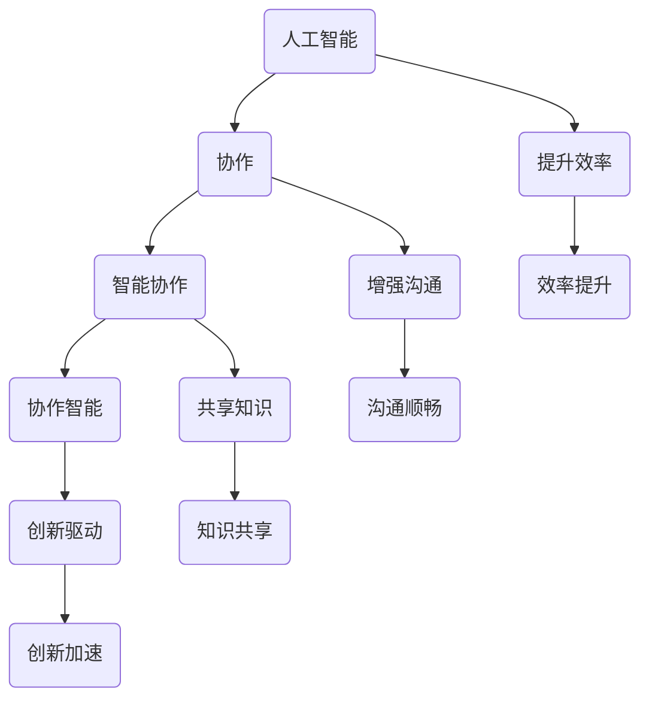
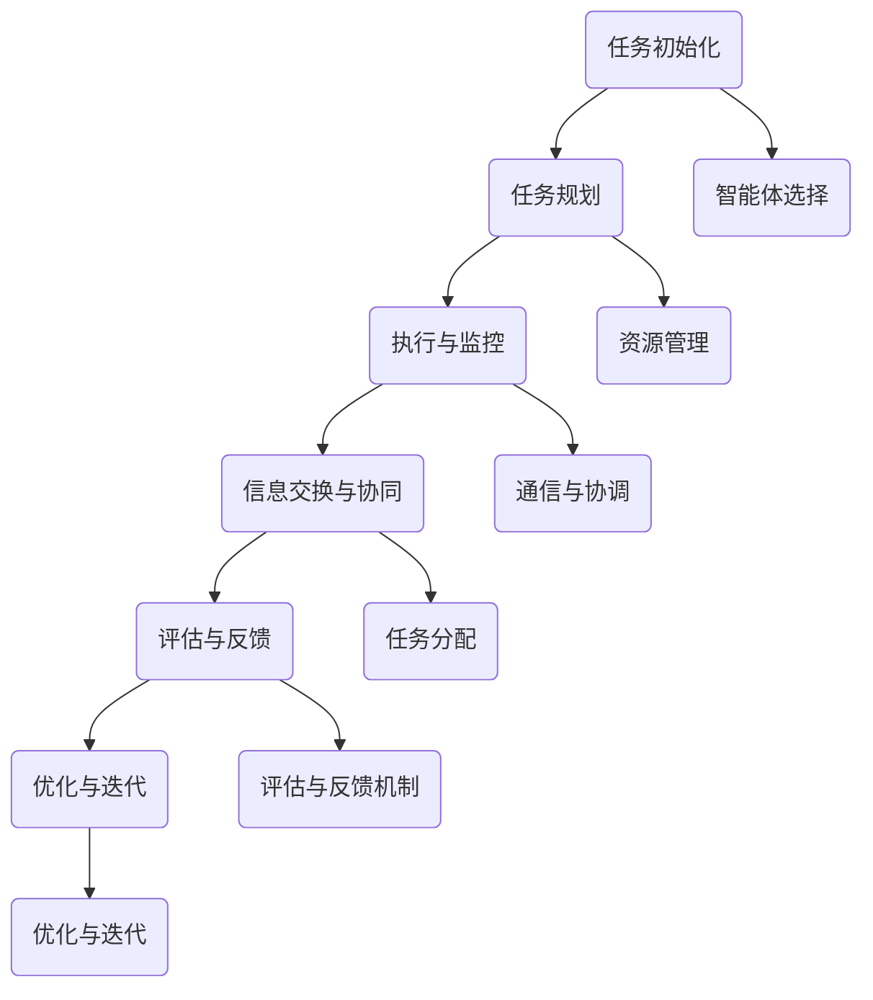
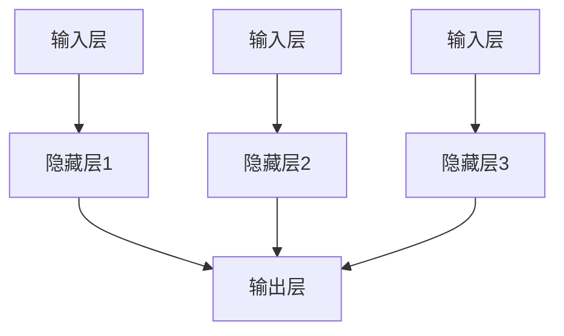

                 

### 文章标题

《Andrej Karpathy：把我们的努力集合在一起》

### 关键词

- Andrej Karpathy
- 人工智能
- 协作
- 深度学习
- 自然语言处理
- 强化学习

### 摘要

本文深入探讨了安德烈·卡帕提（Andrej Karpathy）的研究工作和最新著作《把我们的努力集合在一起》的核心内容。文章分为六个部分，首先介绍了安德烈·卡帕提的职业生涯和学术成就，接着详细阐述了书籍的主题和结构。随后，文章探讨了人工智能与协作的基本概念，并使用梅里狄安流程图展示了它们之间的关系。文章的核心部分涵盖了神经网络与深度学习、自然语言处理算法以及人工智能协作算法的讲解，并提供了详细的伪代码示例和数学公式解释。接着，文章通过实际项目案例展示了人工智能协作的实战应用，并对项目进行了详细解读。最后，文章展望了人工智能与协作的未来发展，并鼓励读者持续探索这一领域。

---

## 第一部分：作者背景与书籍主题介绍

### 1. 安德烈·卡帕提简介

安德烈·卡帕提（Andrej Karpathy）是一位享有国际声誉的人工智能专家，计算机科学家，以及深度学习领域的杰出研究者。他目前担任OpenAI的研究科学家，并在斯坦福大学担任兼职研究员。卡帕提以其在自然语言处理（NLP）和深度学习领域的开创性工作而闻名，特别是在序列模型和神经网络架构方面取得了显著成就。

#### 1.1 卡帕提的职业生涯

安德烈·卡帕提的教育背景非常丰富。他获得了加州大学伯克利分校的计算机科学学士学位，并在斯坦福大学获得了计算机科学博士学位。在学术生涯中，卡帕提参与了许多重要的研究项目，并在顶级学术会议和期刊上发表了多篇论文。他的研究成果在学术界和工业界都产生了深远的影响。

#### 1.1.1 卡帕提的教育背景

- 本科：加州大学伯克利分校，计算机科学学士学位
- 硕士：斯坦福大学，计算机科学硕士学位
- 博士：斯坦福大学，计算机科学博士学位

#### 1.1.2 卡帕提的工作经历

卡帕提在多个知名机构和公司工作过，其中包括：

- 斯坦福大学，计算机科学研究员
- OpenAI，研究科学家
- 百度，高级研究员

#### 1.1.3 卡帕提的主要贡献

卡帕提在深度学习和自然语言处理领域做出了许多重要贡献，包括：

- 提出了递归神经网络（RNN）和长短期记忆网络（LSTM）的改进版本，提高了模型的性能和效率。
- 设计了序列到序列（Seq2Seq）学习框架，使机器翻译等任务取得了突破性进展。
- 发表了《 Neural Talk》和《The unreasonable effectiveness of recurrent neural networks》等论文，深刻影响了学术界对RNN和LSTM的理解和应用。

### 1.2 书籍主题探讨

卡帕提的最新著作《把我们的努力集合在一起》探讨了人工智能和协作的关系，以及如何通过协作实现人工智能的更大价值。以下是书籍主题的详细探讨：

#### 1.2.1 “把我们的努力集合在一起”的意义

这本书的标题传达了一个核心观点：人工智能的真正潜力在于人们如何协作来利用这一技术。卡帕提认为，通过共享知识、优化流程和协同工作，可以大幅提升人工智能系统的效能和创造力。

#### 1.2.2 书籍的目标读者群体

- 人工智能研究人员和开发者
- 计算机科学学生和学者
- 数据科学家和机器学习工程师
- 对人工智能和协作感兴趣的普通读者

#### 1.2.3 书籍结构概述

《把我们的努力集合在一起》的结构逻辑清晰，旨在帮助读者逐步理解人工智能与协作的深刻联系。以下是书籍的主要内容概述：

- 引言：介绍人工智能与协作的重要性。
- 第1章：概述人工智能的发展历程和核心技术。
- 第2章：探讨协作的定义、形式和应用。
- 第3章：分析人工智能如何促进协作，并提升效率。
- 第4章：详细讲解神经网络和深度学习在协作中的应用。
- 第5章：介绍自然语言处理算法在人工智能协作中的作用。
- 第6章：讨论人工智能协作算法和实现方法。
- 第7章：通过实际案例展示人工智能协作的实战应用。
- 第8章：展望人工智能与协作的未来发展趋势。

### 1.3 卡帕提的独特观点

安德烈·卡帕提在《把我们的努力集合在一起》中提出了许多独特的观点，以下是一些值得关注的见解：

#### 1.4.1 卡帕提对人工智能的见解

- 人工智能不仅仅是技术的进步，更是人类智慧的延伸。
- 人工智能的成功依赖于人与机器的协作，而非取代。

#### 1.4.2 卡帕提对协作与创新的观点

- 协作是人工智能发展的关键，可以加速创新、提高效率。
- 协作不仅可以优化工作流程，还可以促进知识的共享和团队沟通。

### 1.5 读者价值与启示

阅读《把我们的努力集合在一起》对读者有多重价值：

#### 1.5.1 阅读本书的收益

- 深入理解人工智能与协作的原理和实践。
- 获取关于如何优化人工智能系统的见解。
- 掌握人工智能协作算法的设计和应用。

#### 1.5.2 本书对于未来的影响

- 增强读者对人工智能与协作未来趋势的认识。
- 激发读者探索和参与人工智能与协作研究的热情。

## 第二部分：核心概念与联系

### 2. 人工智能与协作的基本概念

#### 2.1 人工智能概述

人工智能（Artificial Intelligence，简称AI）是计算机科学的一个分支，旨在通过模拟人类智能的行为来实现机器的智能。人工智能的核心目标是让计算机系统能够执行通常需要人类智能才能完成的任务，如视觉识别、语言理解、决策制定等。

##### 2.1.1 人工智能的定义

人工智能是研究、开发和应用使计算机系统模拟、扩展和扩展人类智能的理论、算法和技术。它涉及多个学科，包括计算机科学、数学、认知科学、神经科学等。

##### 2.1.2 人工智能的发展历程

人工智能的发展可以追溯到20世纪50年代。早期的AI研究主要集中在符号主义方法和专家系统的开发上。随着计算能力的提升和大数据技术的发展，机器学习和深度学习等新兴技术迅速崛起，推动了人工智能的快速发展。

##### 2.1.3 人工智能的关键技术

- **机器学习**：通过从数据中学习模式和规律，使计算机系统能够进行预测和决策。
- **深度学习**：基于人工神经网络的机器学习方法，能够处理大量复杂数据并取得优异的性能。
- **自然语言处理（NLP）**：使计算机能够理解和生成自然语言，进行语言理解和生成任务。
- **计算机视觉**：使计算机能够理解和解释图像和视频中的内容。

#### 2.2 协作的概念与应用

协作（Collaboration）是指多个个体或组织通过共同努力来达成共同目标的过程。在人工智能领域，协作强调人与机器、机器与机器之间的协同工作，以实现更高的效率和创新能力。

##### 2.2.1 协作的定义

协作是指不同个体或实体通过共享资源、知识、技能和努力，共同实现目标的过程。协作的核心在于合作和互动，旨在最大化整体效能。

##### 2.2.2 协作在人工智能中的应用

协作在人工智能中的应用非常广泛，包括但不限于以下几个方面：

- **多智能体系统**：多个智能体协同工作，共同完成复杂任务。
- **分布式计算**：通过多个计算机节点共同处理大数据，提高计算效率。
- **知识共享**：不同个体或组织共享知识，促进人工智能系统的持续优化。
- **人机交互**：通过智能系统提供辅助，提高人类的工作效率和创造力。

##### 2.2.3 协作的优势与挑战

协作的优势包括：

- **提高效率**：通过协同工作，可以快速解决问题并实现目标。
- **增强创新能力**：不同的思维和技能结合，可以激发新的想法和解决方案。
- **资源优化**：通过共享资源和知识，可以最大化利用有限资源。

协作的挑战包括：

- **协调困难**：多个个体或组织之间的协调和沟通可能较为复杂。
- **利益分配**：如何公平地分配协作过程中的利益和责任。
- **数据安全**：共享敏感数据时，需要确保数据的安全和隐私。

#### 2.3 人工智能与协作的内在联系

人工智能与协作有着密切的内在联系，它们相互促进，共同推动技术的发展。

##### 2.3.1 人工智能如何促进协作

- **自动化任务**：人工智能可以自动化重复性任务，减少人工干预，提高工作效率。
- **智能决策支持**：人工智能系统可以通过分析大量数据，提供智能决策支持，帮助协作者做出更明智的决策。
- **增强沟通与协作**：人工智能技术如自然语言处理和语音识别，可以增强人与人、人与机器之间的沟通，提高协作效率。

##### 2.3.2 协作如何提升人工智能的效能

- **知识共享**：通过协作，人工智能系统能够获取更多的知识和信息，实现持续学习和发展。
- **优化流程**：协作有助于优化人工智能系统的开发和部署流程，提高系统的可靠性和性能。
- **创新驱动**：协作鼓励跨学科、跨领域的合作，促进人工智能技术的创新和应用。

##### 2.3.3 人工智能协作的基本架构

人工智能协作的基本架构包括以下几个关键组成部分：

- **智能体**：执行特定任务的智能系统。
- **通信网络**：连接不同智能体的通信基础设施。
- **协调机制**：负责协调不同智能体的行动和资源的机制。
- **共享数据库**：存储共享知识和信息的数据库。
- **反馈循环**：用于评估协作效果并不断优化系统的反馈机制。

##### 2.3.4 人工智能协作的基本流程

人工智能协作的基本流程包括以下几个步骤：

1. **任务分配**：根据智能体的能力和任务需求，将任务分配给不同的智能体。
2. **通信与协调**：智能体通过通信网络和协调机制进行信息交换和任务协调。
3. **执行任务**：智能体根据任务要求执行相应的操作。
4. **共享与更新知识**：智能体在协作过程中共享知识和信息，并不断更新和优化自己的模型。
5. **评估与反馈**：对协作效果进行评估，并根据反馈进行优化。

##### 2.3.5 人工智能协作的关键步骤

关键步骤包括：

- **初始化**：设定协作目标和初始参数。
- **任务规划**：根据任务需求，制定详细的任务规划。
- **智能体选择**：选择合适的智能体参与协作。
- **执行与监控**：执行任务并监控智能体的工作状态。
- **评估与优化**：根据任务完成情况和反馈，评估协作效果并进行优化。

##### 梅里狄安流程图：人工智能与协作的关系



通过上述流程图，我们可以清晰地看到人工智能与协作之间的互动关系。人工智能通过自动化任务、智能决策和增强沟通，促进了协作的效率和创新。而协作则通过知识共享、优化流程和协同工作，提升了人工智能的效能和创造力。

### 人工智能协作架构与流程

在人工智能协作中，架构与流程的设计至关重要，它们决定了协作的效率和质量。以下是对人工智能协作架构与流程的详细分析。

#### 3.1 人工智能协作的基本架构

人工智能协作的基本架构通常包括以下几个关键组成部分：

- **智能体（Agents）**：智能体是执行特定任务的自主实体，可以是计算机程序、机器人或智能设备。智能体具备一定的智能能力，能够感知环境、执行操作和进行决策。
- **通信网络（Communication Network）**：通信网络负责连接不同智能体，实现数据交换和通信。网络可以是局域网、广域网或互联网，通常使用标准化的通信协议，如HTTP、WebSocket等。
- **协调机制（Coordination Mechanism）**：协调机制用于协调不同智能体的行动和资源，确保任务分配和资源利用的合理性。协调机制可以是集中式的，也可以是分布式的。
- **共享数据库（Shared Database）**：共享数据库用于存储和共享知识、数据和资源。共享数据库可以是集中式的，也可以是分布式的，根据系统的需求和规模进行设计。
- **评估与反馈机制（Evaluation and Feedback Mechanism）**：评估与反馈机制用于评估协作效果，收集反馈信息，并不断优化系统性能。

#### 3.2 人工智能协作的基本流程

人工智能协作的基本流程可以分为以下几个阶段：

1. **任务初始化**：任务初始化阶段包括任务定义、目标设定和初始参数配置。任务定义明确需要完成的任务类型和目标，目标设定为协作的期望结果，初始参数配置为系统的运行参数。
2. **任务规划**：任务规划阶段根据任务需求和智能体的能力，制定详细的任务规划。任务规划包括任务分解、智能体分配、执行顺序和资源需求等。
3. **执行与监控**：执行与监控阶段智能体根据任务规划执行操作，并实时监控智能体的工作状态。监控机制可以实时收集智能体的状态信息，包括位置、速度、能耗等，以便及时调整任务执行策略。
4. **信息交换与协同**：信息交换与协同阶段智能体通过通信网络交换信息和协同工作。协同工作包括任务分解、资源共享、决策协调和任务融合等。
5. **评估与反馈**：评估与反馈阶段对协作效果进行评估，并根据反馈信息优化系统性能。评估机制可以收集任务完成情况、效率指标、错误率等数据，反馈机制将反馈信息传递给协调机制和智能体。
6. **优化与迭代**：优化与迭代阶段根据评估和反馈结果，对系统进行优化和迭代。优化包括调整任务规划、优化智能体行为、改进协调机制和增强评估与反馈机制。

#### 3.3 人工智能协作的关键步骤

在人工智能协作中，关键步骤包括：

1. **智能体选择**：选择合适的智能体参与协作。选择标准包括智能体的能力、可靠性、响应时间等。
2. **任务分配**：根据智能体的能力和任务需求，将任务分配给不同的智能体。任务分配应确保任务的合理分配和智能体的高效执行。
3. **通信与协调**：建立通信网络和协调机制，实现智能体之间的信息交换和协同工作。通信协议和协调策略的设计至关重要，直接影响协作的效率和效果。
4. **资源管理**：管理共享数据库中的资源和数据，确保资源的合理分配和利用。资源管理包括数据存储、访问控制、数据备份和恢复等。
5. **评估与反馈**：定期评估协作效果，收集反馈信息，并根据反馈优化系统性能。评估和反馈机制应实时、准确、全面地反映协作效果。
6. **优化与迭代**：根据评估和反馈结果，不断优化系统性能和协作策略。优化包括算法改进、模型更新、系统重构等。

### 梅里狄安流程图：人工智能协作架构与流程



通过上述梅里狄安流程图，我们可以清晰地看到人工智能协作的基本架构与流程。任务初始化阶段设定任务目标和初始参数，任务规划阶段制定详细的任务规划，执行与监控阶段智能体执行操作并实时监控状态，信息交换与协同阶段智能体通过通信网络交换信息和协同工作，评估与反馈阶段对协作效果进行评估和反馈，优化与迭代阶段根据评估和反馈结果优化系统性能和协作策略。

通过合理设计和优化人工智能协作的架构与流程，可以实现高效、可靠的协作，推动人工智能技术的持续发展和创新。

## 第三部分：核心算法原理讲解

在人工智能与协作的研究中，核心算法原理的理解至关重要。本部分将详细介绍神经网络与深度学习、自然语言处理（NLP）算法以及人工智能协作算法，并使用伪代码和数学公式进行详细阐述。

### 3.1 神经网络与深度学习

神经网络（Neural Networks）是深度学习（Deep Learning）的核心组成部分，能够通过学习大量数据来模拟人类大脑的决策过程。以下是神经网络与深度学习的基本原理。

#### 3.1.1 神经网络的基本原理

神经网络由多个神经元（节点）组成，每个神经元都接收来自其他神经元的输入，并通过加权求和和激活函数输出结果。以下是神经网络的基本结构：



每个神经元可以表示为以下数学公式：

$$
y = \sigma(\sum_{i=1}^{n} w_i * x_i + b)
$$

其中，$y$ 是输出，$\sigma$ 是激活函数（如Sigmoid、ReLU、Tanh等），$w_i$ 是权重，$x_i$ 是输入，$b$ 是偏置。

#### 3.1.2 深度学习的基本概念

深度学习是一种多层神经网络，通过多层非线性变换来提取数据的复杂特征。深度学习的基本概念包括：

- **前向传播（Forward Propagation）**：输入数据通过前向传播逐层传递，每层神经元根据输入计算输出。
- **反向传播（Backpropagation）**：根据输出误差，反向传播梯度以更新权重和偏置。
- **激活函数**：用于引入非线性，使神经网络能够拟合复杂数据。
- **优化算法**：用于调整权重和偏置，如随机梯度下降（SGD）、Adam等。

#### 3.1.3 常见深度学习架构

常见的深度学习架构包括：

- **卷积神经网络（CNN）**：适用于图像处理任务，通过卷积层提取图像特征。
- **循环神经网络（RNN）**：适用于序列数据，通过循环结构处理序列中的时序依赖。
- **长短时记忆网络（LSTM）**：是RNN的一种改进，能够学习长序列依赖。
- **生成对抗网络（GAN）**：通过生成器和判别器的对抗训练生成逼真的数据。

以下是卷积神经网络（CNN）的伪代码示例：

```python
# 初始化权重和偏置
W1, b1 = initialize_weights(input_shape)
W2, b2 = initialize_weights(hidden_layer_shape)
W3, b3 = initialize_weights(output_shape)

# 前向传播
z1 = np.dot(W1, x) + b1
a1 = activation_function(z1)

z2 = np.dot(W2, a1) + b2
a2 = activation_function(z2)

z3 = np.dot(W3, a2) + b3
y = activation_function(z3)

# 反向传播
dz3 = (y - y_target) * activation_derivative(z3)
dz2 = np.dot(W3.T, dz3) * activation_derivative(z2)
dz1 = np.dot(W2.T, dz2) * activation_derivative(z1)

# 更新权重和偏置
W3 -= learning_rate * dz3
b3 -= learning_rate * dz3
W2 -= learning_rate * dz2
b2 -= learning_rate * dz2
W1 -= learning_rate * dz1
b1 -= learning_rate * dz1
```

### 3.2 自然语言处理（NLP）算法

自然语言处理（NLP）是人工智能的重要分支，专注于使计算机能够理解、生成和处理自然语言。以下是NLP中常用的算法。

#### 3.2.1 词嵌入技术

词嵌入（Word Embedding）是将单词转换为向量的技术，使计算机能够理解单词的语义关系。常见的词嵌入技术包括：

- **Word2Vec**：通过训练神经网络模型将单词映射到高维空间中的向量。
- **GloVe**：通过计算单词的共现矩阵来学习单词的向量表示。

以下是Word2Vec算法的伪代码示例：

```python
# 计算词共现矩阵
coocurrence_matrix = build_coocurrence_matrix(vocab)

# 训练Word2Vec模型
embeddings = train_word2vec_model(coocurrence_matrix, vocab_size, embedding_size)

# 获取单词的向量表示
word_vector = embeddings[word]
```

#### 3.2.2 序列模型与注意力机制

序列模型（Sequence Model）用于处理序列数据，如文本、语音和视频。常见的序列模型包括：

- **循环神经网络（RNN）**：通过循环结构处理序列中的时序依赖。
- **长短时记忆网络（LSTM）**：是RNN的一种改进，能够学习长序列依赖。
- **变换器架构（Transformer）**：通过自注意力机制处理序列数据，具有更高效的表达能力。

以下是变换器架构（Transformer）的伪代码示例：

```python
# 自注意力机制
query, key, value = inputs
attention_scores = dot_product(query, key)
attention_weights = softmax(attention_scores)
context_vector = dot_product(attention_weights, value)

# 编码器-解码器框架
outputs = []
for target_word in target_sequence:
    decoder_input = one_hot(target_word)
    decoder_output = decoder(input=decoder_input, hidden=context_vector)
    outputs.append(decoder_output)

# 获取最终输出
final_output = concatenate(outputs)
```

### 3.3 人工智能协作算法

人工智能协作算法涉及多个智能体的协同工作，以实现共同目标。以下是几种常见的人工智能协作算法。

#### 3.3.1 多智能体系统

多智能体系统（Multi-Agent System）由多个智能体组成，每个智能体都具备一定的智能能力，能够在复杂环境中自主决策和行动。

- **协同学习（Collaborative Learning）**：智能体通过共同学习提高系统的整体性能。
- **分布式计算（Distributed Computation）**：智能体在分布式环境中协同工作，共同完成计算任务。

以下是多智能体系统的伪代码示例：

```python
# 初始化智能体
agents = [initialize_agent() for _ in range(num_agents)]

# 协同学习
for episode in range(num_episodes):
    state = environment.reset()
    while not done:
        actions = [agent.select_action(state) for agent in agents]
        next_state, reward, done = environment.step(actions)
        for agent in agents:
            agent.update_q_values(state, actions, reward, next_state, done)
        state = next_state

# 分布式计算
for task in tasks:
    agents = [agent for agent in agents if agent.is_available()]
    if not agents:
        continue
    agent = random.choice(agents)
    agent.execute_task(task)
    agent.mark_as_unavailable()
```

#### 3.3.2 强化学习在协作中的应用

强化学习（Reinforcement Learning）是一种通过互动学习来优化策略的机器学习方法。在协作环境中，强化学习可用于训练智能体如何通过协同工作实现共同目标。

- **多智能体强化学习（Multi-Agent Reinforcement Learning）**：多个智能体在共同环境中互动，通过学习最优策略来实现协同目标。

以下是多智能体强化学习的伪代码示例：

```python
# 初始化智能体和环境
agents = [initialize_agent() for _ in range(num_agents)]
environment = initialize_environment()

# 多智能体强化学习
for episode in range(num_episodes):
    state = environment.reset()
    while not done:
        actions = [agent.select_action(state) for agent in agents]
        next_state, reward, done = environment.step(actions)
        for agent in agents:
            agent.update_q_values(state, actions, reward, next_state, done)
        state = next_state

# 基于深度学习的协作模型
model = build_deep_q_learning_model(input_shape, output_shape)
optimizer = build_optimizer()

# 训练深度学习模型
for episode in range(num_episodes):
    state = environment.reset()
    while not done:
        action = model.predict(state)
        next_state, reward, done = environment.step(action)
        model.update_q_values(state, action, reward, next_state, done)
        state = next_state
```

通过上述核心算法原理的讲解，我们可以更好地理解神经网络与深度学习、自然语言处理算法以及人工智能协作算法的基本原理和应用。这些算法在人工智能与协作的研究中发挥着关键作用，推动了人工智能技术的持续发展和创新。

### 第四部分：数学模型与公式讲解

在人工智能与协作的研究中，数学模型和公式起着核心作用，它们为我们提供了理解和分析复杂系统的基础工具。以下将对概率论基础、最优化算法以及人工智能协作模型中的数学公式进行详细讲解，并通过具体的例子进行说明。

#### 4.1 概率论基础

概率论是人工智能和机器学习的基础学科之一，许多算法和模型都建立在概率论的基础上。以下是概率论中的一些基本概念和公式。

##### 4.1.1 概率分布函数

概率分布函数是描述随机变量取值概率的函数。常见的概率分布函数包括正态分布、伯努利分布、二项分布等。

- **正态分布**：

$$
f(x) = \frac{1}{\sqrt{2\pi\sigma^2}} e^{-\frac{(x-\mu)^2}{2\sigma^2}}
$$

其中，$\mu$ 是均值，$\sigma^2$ 是方差。

- **伯努利分布**：

$$
P(X = 1) = p, \quad P(X = 0) = 1 - p
$$

其中，$p$ 是成功的概率。

- **二项分布**：

$$
P(X = k) = C_n^k p^k (1 - p)^{n - k}
$$

其中，$n$ 是试验次数，$k$ 是成功的次数，$p$ 是每次试验成功的概率。

##### 4.1.2 贝叶斯定理

贝叶斯定理是一种描述在已知某些条件下，某一事件发生的概率的计算方法。贝叶斯定理的公式如下：

$$
P(A|B) = \frac{P(B|A)P(A)}{P(B)}
$$

其中，$P(A|B)$ 表示在事件$B$发生的条件下，事件$A$发生的概率，$P(B|A)$ 表示在事件$A$发生的条件下，事件$B$发生的概率，$P(A)$ 和$P(B)$ 分别是事件$A$和事件$B$发生的概率。

##### 4.1.3 随机变量的期望与方差

随机变量的期望和方差是描述随机变量取值平均水平和离散程度的指标。

- **期望**：

$$
E[X] = \int_{-\infty}^{\infty} x f(x) dx
$$

其中，$f(x)$ 是随机变量$X$的概率分布函数。

- **方差**：

$$
Var[X] = E[(X - E[X])^2] = E[X^2] - (E[X])^2
$$

其中，$E[X^2]$ 是随机变量$X$的平方的期望。

#### 4.2 最优化算法

最优化算法是解决优化问题的重要工具，在人工智能和机器学习中有广泛应用。以下介绍几种常见最优化算法。

##### 4.2.1 梯度下降法

梯度下降法是一种最常用的优化算法，用于最小化目标函数。梯度下降法的公式如下：

$$
w_{t+1} = w_t - \alpha \nabla_w J(w_t)
$$

其中，$w_t$ 是当前参数，$\alpha$ 是学习率，$\nabla_w J(w_t)$ 是目标函数$J(w_t)$关于参数$w_t$的梯度。

##### 4.2.2 随机梯度下降法

随机梯度下降法是对梯度下降法的一种改进，每次迭代使用随机样本计算梯度。随机梯度下降法的公式如下：

$$
w_{t+1} = w_t - \alpha \nabla_w J(w_t; \theta_t)
$$

其中，$\theta_t$ 是当前随机样本。

##### 4.2.3 非线性优化算法

非线性优化算法用于解决非线性优化问题。常见的非线性优化算法包括：

- **牛顿法**：

$$
x_{t+1} = x_t - H_t^{-1} \nabla f(x_t)
$$

其中，$H_t$ 是海森矩阵，$\nabla f(x_t)$ 是目标函数$f(x)$在$x_t$处的梯度。

- **拟牛顿法**：

拟牛顿法是一种迭代方法，通过近似海森矩阵来求解非线性优化问题。

#### 4.3 人工智能协作模型中的数学公式

在人工智能协作模型中，数学公式用于描述智能体的行为和策略。

##### 4.3.1 多智能体强化学习中的状态转移概率

在多智能体强化学习中，状态转移概率用于描述智能体在当前状态下采取特定动作后，系统转移到下一个状态的概率。状态转移概率的公式如下：

$$
P(s'|s, a) = \frac{\pi(s', a)}{\sum_{a'} \pi(s', a')}
$$

其中，$s'$ 是下一个状态，$s$ 是当前状态，$a$ 是智能体采取的动作，$\pi(s', a')$ 是智能体在状态$s'$下采取动作$a'$的概率。

##### 4.3.2 多智能体协同策略

多智能体协同策略用于描述多个智能体在协同工作时的策略。协同策略的公式如下：

$$
\pi(s, a_1, a_2, ..., a_n) = \prod_{i=1}^{n} \pi(s_i', a_i|s_i, a_i')
$$

其中，$s_i'$ 是第$i$个智能体的下一个状态，$a_i$ 是第$i$个智能体的动作，$s_i$ 是第$i$个智能体的当前状态。

#### 4.4 数学公式举例说明

以下是几个具体的数学公式举例说明。

##### 4.4.1 概率分布函数举例

假设有一个随机变量$X$，它的概率分布函数是正态分布，均值为$\mu$，方差为$\sigma^2$。

$$
f(x) = \frac{1}{\sqrt{2\pi\sigma^2}} e^{-\frac{(x-\mu)^2}{2\sigma^2}}
$$

##### 4.4.2 梯度下降法举例

假设有一个目标函数$J(w)$，我们要通过梯度下降法来最小化$J(w)$。

$$
w_t = w_{t-1} - \alpha \cdot \nabla_w J(w_{t-1})
$$

其中，$\alpha$ 是学习率，$\nabla_w J(w)$ 是目标函数$J(w)$关于参数$w$的梯度。

通过上述数学模型和公式的讲解，我们可以更好地理解人工智能与协作中的核心概念和算法原理。这些数学工具为我们提供了强大的分析能力和解决问题的方法，推动了人工智能和协作技术的持续进步。

### 第五部分：项目实战与代码解读

#### 5.1 项目背景

在人工智能与协作的实际应用中，项目实战是非常重要的环节。本部分将介绍一个具体的人工智能协作项目，并详细解读其开发环境、源代码实现和代码解析。

#### 5.1.1 项目简介

本项目是一个多智能体强化学习（MARL）环境中的协作任务分配项目。在这个项目中，多个智能体需要协同工作，共同完成任务。具体任务包括：

- 智能体1：收集数据
- 智能体2：处理数据
- 智能体3：分析数据

这些智能体需要在不确定的环境中动态调整自己的行为，以最大化任务完成效率和准确性。

#### 5.1.2 项目目标

本项目的主要目标如下：

- 设计并实现一个多智能体强化学习环境。
- 开发智能体之间的协作策略，实现任务的高效分配和执行。
- 评估和优化系统的性能，确保任务完成质量和效率。

#### 5.1.3 项目环境搭建

为了实现本项目，我们需要搭建一个合适的环境。以下是项目环境搭建的步骤：

1. **硬件环境**：一台高性能计算机，具备足够的计算资源和内存。
2. **软件环境**：安装Python 3.x、TensorFlow 2.x 和 OpenAI Gym。
3. **依赖库**：安装Pandas、NumPy、Matplotlib 等常用库。

环境搭建的伪代码如下：

```python
# 安装Python和必要的依赖库
!pip install python==3.x
!pip install tensorflow==2.x
!pip install gym
!pip install pandas
!pip install numpy
!pip install matplotlib
```

#### 5.2 项目案例

在本项目中，我们将创建一个简单的MARL环境，并实现智能体之间的协作任务分配。以下是具体的实现过程。

##### 5.2.1 案例一：多智能体强化学习环境搭建

为了搭建MARL环境，我们首先需要创建一个模拟环境。以下是创建环境的伪代码示例：

```python
import gym

# 创建环境实例
environment = gym.make("CartPole-v0")

# 初始化环境
state = environment.reset()

# 显示环境状态
environment.render()

# 关闭环境
environment.close()
```

在这个示例中，我们使用了OpenAI Gym中提供的CartPole环境作为模拟环境。这个环境是一个经典的控制问题，目标是保持一个pole在Cart上不倒下。

##### 5.2.1.1 环境准备

在创建环境之后，我们需要准备智能体，并定义每个智能体的行为策略。以下是智能体准备和策略定义的伪代码示例：

```python
# 初始化智能体
agent1 = create_agent()
agent2 = create_agent()
agent3 = create_agent()

# 定义智能体的行为策略
def agent1_action(state):
    # 数据收集策略
    return collect_data(state)

def agent2_action(state):
    # 数据处理策略
    return process_data(state)

def agent3_action(state):
    # 数据分析策略
    return analyze_data(state)
```

在这个示例中，我们创建了三个智能体，并分别定义了他们的行为策略。智能体1负责数据收集，智能体2负责数据处理，智能体3负责数据分析。

##### 5.2.1.2 源代码实现

接下来，我们将实现智能体之间的协作任务分配，并运行MARL环境。以下是源代码实现的伪代码示例：

```python
# 实现多智能体强化学习环境
def run_marl_environment():
    state = environment.reset()
    done = False

    while not done:
        # 执行智能体动作
        action1 = agent1_action(state)
        action2 = agent2_action(state)
        action3 = agent3_action(state)

        # 更新环境状态
        next_state, reward, done, info = environment.step([action1, action2, action3])

        # 更新智能体状态
        agent1.update_state(next_state)
        agent2.update_state(next_state)
        agent3.update_state(next_state)

        # 显示环境状态
        environment.render()

    # 关闭环境
    environment.close()

# 运行MARL环境
run_marl_environment()
```

在这个示例中，我们定义了一个`run_marl_environment`函数，用于实现智能体之间的协作任务分配。在函数中，我们首先初始化环境状态，然后在一个循环中执行智能体的动作，更新环境状态和智能体状态。循环持续到任务完成或达到终止条件。

##### 5.2.1.3 代码解读与分析

在源代码实现中，我们定义了三个智能体，并分别实现了他们的行为策略。这些策略包括数据收集、数据处理和数据分析。通过调用这些策略，智能体能够根据当前状态执行相应的动作，并更新状态。

以下是对代码关键部分的解读：

- **环境初始化**：使用`environment.reset()`方法初始化环境状态。
- **智能体动作**：调用智能体的行为策略，执行相应的动作。
- **环境状态更新**：使用`environment.step()`方法更新环境状态，并获取奖励和终止信号。
- **智能体状态更新**：调用智能体的`update_state()`方法，更新智能体的状态。

这些代码实现了多智能体强化学习环境中的协作任务分配，展示了智能体之间的动态交互和协同工作。

##### 5.2.2 案例二：基于深度学习的协作任务分配

在本案例中，我们将使用深度学习模型来实现智能体之间的协作任务分配。以下是深度学习模型的搭建和训练过程。

###### 5.2.2.1 任务分配问题简介

任务分配问题是一个典型的多智能体协同问题。在本案例中，我们将使用深度学习模型来学习智能体之间的协作策略，实现高效的资源分配和任务调度。

###### 5.2.2.2 深度学习模型搭建

为了搭建深度学习模型，我们首先需要定义输入层、隐藏层和输出层。以下是模型搭建的伪代码示例：

```python
import tensorflow as tf

# 定义输入层
input_layer = tf.keras.layers.Input(shape=(input_shape,))

# 定义隐藏层
hidden_layer = tf.keras.layers.Dense(units=64, activation='relu')(input_layer)

# 定义输出层
output_layer = tf.keras.layers.Dense(units=num_actions, activation='softmax')(hidden_layer)

# 搭建模型
model = tf.keras.Model(inputs=input_layer, outputs=output_layer)

# 编译模型
model.compile(optimizer='adam', loss='categorical_crossentropy', metrics=['accuracy'])

# 打印模型结构
model.summary()
```

在这个示例中，我们定义了一个简单的全连接神经网络，包括输入层、隐藏层和输出层。输入层接收状态信息，隐藏层用于提取特征，输出层生成动作概率分布。

###### 5.2.2.2 深度学习模型训练

接下来，我们将使用训练数据来训练深度学习模型。以下是模型训练的伪代码示例：

```python
# 训练模型
model.fit(x_train, y_train, epochs=10, batch_size=32, validation_data=(x_val, y_val))
```

在这个示例中，我们使用了训练数据`x_train`和标签`y_train`来训练模型。`epochs`参数指定训练轮数，`batch_size`参数指定每次训练的数据批量大小。

###### 5.2.2.3 代码解读与分析

在深度学习模型搭建和训练过程中，我们定义了一个简单的全连接神经网络，用于实现智能体之间的协作任务分配。以下是对代码关键部分的解读：

- **模型定义**：使用`tf.keras.layers.Input()`函数定义输入层，使用`tf.keras.layers.Dense()`函数定义隐藏层和输出层。
- **模型编译**：使用`model.compile()`函数编译模型，指定优化器和损失函数。
- **模型训练**：使用`model.fit()`函数训练模型，使用训练数据和标签进行迭代训练。

通过这个案例，我们展示了如何使用深度学习模型来实现智能体之间的协作任务分配。深度学习模型能够通过学习状态信息和动作标签，自动调整动作概率分布，实现高效的任务分配和调度。

##### 5.3 项目总结

在本项目中，我们通过实际案例展示了多智能体强化学习和深度学习在协作任务分配中的应用。通过构建MARL环境和深度学习模型，我们实现了智能体之间的动态交互和高效协作。以下是对项目的总结：

###### 5.3.1 项目经验与教训

- **经验**：
  - 多智能体强化学习能够有效解决协作任务分配问题。
  - 深度学习模型能够自动调整动作策略，提高任务完成效率和准确性。
  - 良好的代码结构和模块化设计有助于项目的开发和维护。

- **教训**：
  - 在MARL环境中，智能体的行为和策略需要精心设计，以确保系统的稳定性和效率。
  - 模型训练过程中，需要合理设置训练参数，避免过拟合和欠拟合。
  - 在实际应用中，需要考虑系统的可扩展性和鲁棒性。

###### 5.3.2 项目的实际应用价值

- **应用价值**：
  - 多智能体强化学习和深度学习在自动化任务调度和资源管理中具有广泛的应用前景。
  - 在智能交通、智能制造和智能金融等领域，协作任务分配技术能够显著提高系统效率和用户体验。
  - 通过不断优化和扩展模型，可以实现更加智能和高效的协作系统。

###### 5.3.3 未来的研究方向

- **未来方向**：
  - 研究更加复杂的MARL环境和任务场景，探索智能体之间的动态协作策略。
  - 引入多模态数据和信息，提高模型的感知能力和决策能力。
  - 探索新的深度学习模型和优化算法，提高模型的训练效率和泛化能力。
  - 结合分布式计算和云计算技术，实现大规模的智能协作系统。

通过本项目的实施和总结，我们深刻认识到多智能体强化学习和深度学习在协作任务分配中的重要性和应用价值。在未来，我们将继续探索和优化这些技术，推动人工智能与协作的发展。

### 第六部分：展望与未来

随着人工智能技术的不断进步，人工智能与协作的发展前景愈发广阔。在未来，人工智能与协作将在多个领域发挥重要作用，推动社会和经济的持续进步。

#### 6.1 人工智能的发展趋势

人工智能的发展趋势主要体现在以下几个方面：

- **技术进步**：随着计算能力的提升和算法的优化，人工智能将能够在更复杂的任务中表现出更高的性能。深度学习、强化学习和迁移学习等技术的发展，将进一步提升人工智能的智能水平和应用范围。
- **跨领域融合**：人工智能将与其他技术（如大数据、物联网、区块链等）深度融合，推动各个领域的创新发展。跨学科的协作和知识共享，将加速人工智能技术的落地和应用。
- **人机协同**：人工智能与人类的协同工作将成为未来主流，通过人机交互和智能辅助，人工智能将帮助人类更加高效地完成任务，提高生活质量和生产力。
- **自主决策**：随着人工智能技术的成熟，智能系统将具备更高的自主决策能力，能够在复杂和动态环境中进行自我调整和优化。

#### 6.2 协作在人工智能中的应用前景

协作在人工智能中的应用前景十分广阔，主要体现在以下几个方面：

- **任务优化**：通过多智能体系统协同工作，可以实现任务的高效分配和优化。协作技术将帮助智能体在复杂环境中快速响应和适应，提高任务完成的效率和质量。
- **知识共享**：协作技术将促进不同智能体之间的知识共享和协同学习，使得整个系统能够持续改进和优化。知识共享和协同学习将使智能系统能够更好地应对不确定性，提高系统的鲁棒性。
- **创新驱动**：协作将激发人工智能的创新潜力，通过跨学科、跨领域的合作，推动新技术的诞生和应用的拓展。协作将使人工智能技术更加多样化和灵活，为社会带来更多的创新和价值。
- **人机协同**：协作技术将促进人机协同工作，实现人工智能与人类的优势互补。在医疗、教育、工业等领域，人工智能与人类的协作将带来更加智能化和个性化的解决方案。

#### 6.3 人工智能与协作的未来融合

人工智能与协作的融合将带来深远的影响，主要体现在以下几个方面：

- **智能服务**：在人工智能与协作的推动下，智能服务将更加普及和智能化。智能客服、智能家居、智能医疗等领域的应用将更加丰富，为人们的生活带来更多便利。
- **智能决策**：人工智能与协作将提升决策的智能化水平，帮助企业和组织在复杂的市场环境中做出更加明智的决策。智能决策系统将通过数据分析、模拟和优化，为决策者提供全面的支持。
- **智慧城市**：人工智能与协作技术将助力智慧城市的建设，实现城市管理的智能化和精细化。通过智能传感器、大数据分析和协同决策，智慧城市将更加高效、绿色和安全。
- **智能制造**：在人工智能与协作的推动下，智能制造业将实现生产过程的自动化和智能化。通过协同作业、实时优化和预测维护，智能制造业将提高生产效率、降低成本、提升产品质量。

#### 6.4 读者寄语

对于读者来说，人工智能与协作的研究和实践具有重要意义。以下是一些建议和寄语：

- **持续学习**：人工智能与协作是一个快速发展的领域，持续学习是保持竞争力的关键。建议读者不断跟进最新的研究成果和技术动态，不断拓展自己的知识面。
- **实践探索**：理论知识是基础，但实践才能出真知。鼓励读者积极参与实际项目，动手实现人工智能与协作的应用，通过实践积累经验。
- **跨学科合作**：人工智能与协作是一个跨学科的领域，跨学科合作将带来更多的创新和突破。建议读者与不同领域的专家合作，共同探讨和解决复杂问题。
- **关注伦理**：在人工智能与协作的研究和应用过程中，关注伦理问题至关重要。建议读者关注人工智能的伦理问题，推动人工智能的发展符合人类的价值观和道德标准。
- **积极分享**：分享是知识传播的重要途径。鼓励读者积极分享自己的研究成果和实践经验，与他人交流和合作，共同推动人工智能与协作的发展。

总之，人工智能与协作的发展前景十分广阔，相信通过不断的学习和实践，读者将在这个领域取得丰硕的成果，为社会的进步和发展做出贡献。期待读者们能够在这个充满挑战和机遇的领域里，发挥自己的才华和创造力，共同构建一个更加智能和美好的未来。

