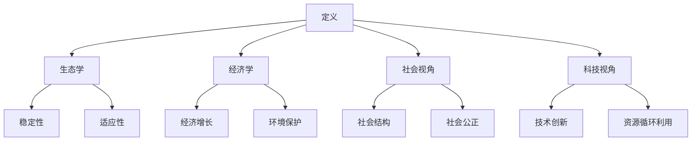

                 

### 文章标题：Andrej Karpathy：持续性的重要性

本文旨在探讨人工智能领域专家Andrej Karpathy关于持续性的重要性。通过逻辑清晰、结构紧凑、简单易懂的论述，本文将深入解析持续性的概念、原理及其在实际应用中的重要性。

关键词：**Andrej Karpathy**、**持续性**、**重要性**、**人工智能**、**持续发展**、**核心算法**、**项目实战**。

摘要：本文首先介绍了Andrej Karpathy的背景和成就，随后对持续性的定义和重要性进行了详细阐述。接着，本文从个人、团队、社会等多个层面分析了持续性的核心概念和联系，并讲解了持续性的数学模型和算法实现。随后，本文通过实际项目案例展示了持续性的应用效果，并对其未来发展进行了展望。

本文结构如下：

1. **引言**：介绍书籍背景和作者介绍，阐述持续性的定义与概念。
2. **核心概念与联系**：讲解持续性的核心概念和联系，展示Mermaid流程图。
3. **核心算法原理讲解**：介绍持续性的数学模型和算法实现。
4. **项目实战**：分析实际项目案例，展示持续性的应用效果。
5. **总结与展望**：总结持续性的重要性，展望其未来发展。

让我们一起深入探讨Andrej Karpathy对持续性的看法，以及它如何影响我们的日常生活和工作。

---

### 第一部分：引言

#### 1.1 书籍背景与作者介绍

《Andrej Karpathy：持续性的重要性》一书由人工智能领域的杰出专家Andrej Karpathy所著。Andrej Karpathy是斯坦福大学计算机科学博士，现任谷歌AI研究员。他在深度学习和自然语言处理领域具有深厚的研究背景和丰富的实践经验，是国际知名的学者和专家。

Andrej Karpathy以其卓越的研究成果和独特的见解在人工智能领域崭露头角。他的论文在顶级学术会议和期刊上发表，被广泛引用和关注。此外，他还在多个知名技术公司和学术机构担任顾问和讲师，为人工智能的发展和应用做出了重要贡献。

本书旨在探讨持续性的重要性，这是Andrej Karpathy在人工智能领域长期研究的一个重要主题。他通过深入分析持续性的定义、原理和实际应用，揭示了持续性在个人成长、团队合作和社会发展中的关键作用。

#### 1.2 持续性的定义与概念解析

持续性（Sustainability）是一个广泛的概念，涵盖了许多不同的领域，如环境、经济、社会和科技。在本文中，我们将重点关注持续性在人工智能领域的定义和概念。

持续性的定义可以从多个角度进行解读：

1. **生态学视角**：在生态学中，持续性指的是生态系统在时间和空间上的稳定性和适应性。一个可持续的系统可以维持其结构和功能，同时保持生物多样性和生态平衡。

2. **经济学视角**：在经济学中，持续性指的是一个经济系统在长时间内能够维持其经济增长和社会福利。这意味着经济活动必须遵循可持续的原则，如资源的高效利用、环境保护和公平分配。

3. **社会视角**：在社会层面，持续性强调社会体系的可持续性，包括社会结构的稳定、社会公正和人的全面发展。这意味着社会必须关注弱势群体，促进社会和谐与进步。

4. **科技视角**：在科技领域，持续性指的是技术的可持续性，即技术发展不会对环境和社会产生负面影响，并能适应未来变化的需求。这要求科技发展必须遵循可持续的原则，如节能减排、资源循环利用等。

在人工智能领域，持续性的概念尤为重要。随着人工智能技术的快速发展，我们面临着一系列挑战，如数据隐私、伦理道德、算法偏见等。因此，人工智能的发展必须遵循持续性的原则，确保其对人类社会的积极影响。

#### 1.3 持续性的重要性在当代社会的影响

在当代社会，持续性具有极其重要的意义。随着全球环境问题的加剧、经济不稳定和社会不平等，人们越来越认识到持续性对人类生存和发展的关键作用。

1. **环境保护**：环境保护是持续性的核心议题之一。全球气候变化、水资源短缺、生物多样性丧失等问题日益严重，需要我们采取行动，保护地球生态系统。持续性原则要求我们采取可持续的生产和消费模式，减少环境污染和资源浪费。

2. **经济稳定**：经济稳定是可持续性的另一个重要方面。全球经济繁荣需要长期的经济增长和稳定，而这需要可持续的经济政策和商业模式。这包括推动绿色经济、循环经济和低碳经济，促进环境保护和经济增长的协调发展。

3. **社会公正**：社会公正是持续性的关键目标之一。社会不平等、贫富差距和歧视问题困扰着许多国家和地区。持续性原则要求我们关注弱势群体，促进社会公平和人的全面发展。

4. **科技创新**：科技创新是推动社会进步的重要力量，但同时也需要遵循可持续性的原则。科技创新必须考虑环境、社会和经济的可持续性，避免科技发展带来的负面影响。

总之，持续性的重要性在当代社会不言而喻。它不仅关乎环境保护和经济稳定，还关系到社会公正和科技创新。只有通过持续的探索和实践，我们才能实现可持续发展的目标，为人类社会的繁荣和进步做出贡献。

---

### 第二部分：核心概念与联系

在探讨持续性的核心概念与联系之前，我们首先需要明确持续性的定义。本文中的“持续性”主要指在特定领域或系统中，维持其稳定性、适应性和发展潜力的能力。接下来，我们将从多个角度分析持续性的核心概念，并展示其联系。

#### 2.1 持续性原理的 Mermaid 流程图

为了更直观地理解持续性的原理，我们可以使用Mermaid流程图来展示其核心概念和联系。以下是一个简单的示例：



在这个流程图中，我们可以看到持续性在各个领域的核心概念和相互联系。生态学视角关注稳定性和适应性，经济学视角关注经济增长和环境保护，社会视角关注社会结构和公正，科技视角关注技术创新和资源循环利用。这些概念相互交织，共同构成了持续性的核心原理。

#### 2.2 持续性的关键因素

持续性的实现离不开多个关键因素，以下是一些主要的关键因素：

1. **个人自我管理**：个人自我管理是实现个人持续性的基础。这包括时间管理、目标设定、情绪调节和自我提升等方面。只有通过有效的自我管理，个人才能在竞争激烈的环境中保持稳定和适应性。

2. **团队合作与沟通**：团队合作是实现团队持续性的关键。团队成员之间需要建立良好的沟通机制，共同面对挑战，分享资源和知识。有效的团队合作可以提高团队的稳定性和创新能力。

3. **创新思维与适应变化**：在快速变化的环境中，创新思维和适应变化是保持持续性的重要因素。创新思维可以帮助团队不断探索新的解决方案，适应不断变化的市场需求和竞争环境。

4. **资源管理和利用**：资源管理和利用是实现可持续发展的基础。这包括对自然资源、人力资本和技术资源的有效管理和合理利用，以最大限度地提高生产效率和社会福利。

5. **环境保护与可持续发展**：环境保护和可持续发展是持续性的重要组成部分。这要求我们在发展过程中注重环境保护，减少对自然资源的消耗和环境污染，实现经济、社会和环境的协调发展。

#### 2.3 持续性与个人成长的关系

在个人层面，持续性是实现个人成长和发展的关键。以下是持续性与个人成长之间的一些关系：

1. **自我认知与目标设定**：持续性要求个人具备良好的自我认知能力，明确自己的兴趣、优势和目标。通过设定明确的目标，个人可以更好地规划自己的发展路径，实现持续的成长和进步。

2. **学习与知识积累**：持续性要求个人具备不断学习的能力，积累知识和技能。通过不断学习，个人可以不断提高自己的专业素养和综合素质，适应不断变化的环境和需求。

3. **自我调节与情绪管理**：持续性要求个人具备良好的自我调节和情绪管理能力，保持积极的心态和情绪状态。通过有效的自我调节和情绪管理，个人可以更好地应对压力和挑战，保持稳定和适应。

4. **时间管理和效率提升**：持续性要求个人具备良好的时间管理能力，合理安排时间和任务，提高工作效率。通过有效的时间管理，个人可以更好地实现目标，提高个人发展速度。

5. **社会参与与人际关系**：持续性要求个人积极参与社会活动，建立良好的人际关系。通过社会参与和人际交往，个人可以扩展自己的视野，获得更多的资源和机会，促进个人成长和发展。

总之，持续性与个人成长密切相关。通过培养和提升个人在自我管理、学习、自我调节、时间管理和社会参与等方面的能力，个人可以实现持续性的成长和发展。

---

### 第三部分：核心算法原理讲解

在第三部分，我们将深入探讨持续性的核心算法原理，包括数学模型和算法实现。通过这些核心算法，我们可以更精确地理解和应用持续性原则。

#### 3.1 持续性的数学模型

持续性的数学模型可以帮助我们量化和管理系统的持续性和稳定性。以下是两种常见的持续性数学模型：

1. **线性模型**：

   线性模型是一种简单的数学模型，用于描述系统在一段时间内的持续增长或衰减。线性模型的基本形式如下：

   $$
   P(t) = e^{rt}
   $$

   其中，\(P(t)\)表示在时间\(t\)时的持续性水平，\(r\)是增长率，\(e\)是自然对数的底数。这个模型适用于那些在时间范围内以恒定速率增长或衰减的系统。

2. **非线性模型**：

   非线性模型则更复杂，可以描述那些在时间范围内具有不同增长或衰减速率的系统。一种常见的非线性模型是Sigmoid函数，其形式如下：

   $$
   P(t) = 1 - \frac{1}{1 + e^{-rt}}
   $$

   这个模型也包含了一个增长率\(r\)，但是通过指数函数的负号，模型可以适应不同的增长或衰减速率。当\(r\)较大时，系统的持续性迅速衰减；当\(r\)较小时，系统的持续性逐渐趋于稳定。

   我们可以通过以下例子来说明这两种模型的区别：

   假设有一个公司，其员工数量每年以10%的速度增长。使用线性模型，我们可以计算未来几年员工数量的变化：

   $$
   P(t) = e^{0.1t}
   $$

   当\(t = 1\)时，员工数量为\(P(1) = e^{0.1} \approx 1.105\)。这意味着一年后员工数量增加了约10.5%。

   另一方面，如果公司每年员工的流失率是10%，我们可以使用非线性模型来计算员工数量的变化：

   $$
   P(t) = 1 - \frac{1}{1 + e^{-0.1t}}
   $$

   当\(t = 1\)时，员工数量为\(P(1) = 1 - \frac{1}{1 + e^{-0.1}} \approx 0.904\)。这意味着一年后员工数量减少了约9.6%。

#### 3.2 持续性的算法实现

在实际应用中，我们需要通过算法来实现持续性的数学模型。以下是一个简单的伪代码示例，用于计算给定时间范围内的持续性水平：

```plaintext
function 持续性算法(P0, r, t):
    for i = 1 to t:
        if r > 0:
            P = P0 * e^(r * i)
        else:
            P = P0 / (1 + e^(r * i))
        print(P)
```

这个算法接受初始持续性水平\(P0\)、增长率\(r\)和时间\(t\)作为输入，并在每次迭代中计算并打印出在时间\(i\)时的持续性水平。如果\(r > 0\)，算法使用线性模型计算增长；如果\(r < 0\)，算法使用非线性模型计算衰减。

我们可以通过以下例子来演示算法的实现：

假设一个森林的树木数量每年以5%的速度增长，我们需要计算未来5年的树木数量。使用伪代码，我们可以计算如下：

```plaintext
初始树木数量 P0 = 1000
增长率 r = 0.05
时间 t = 5

for i = 1 to 5:
    P = P0 * e^(r * i)
    print("第", i, "年树木数量为：", P)
```

这个算法将打印出每年的树木数量，展示出森林在持续增长的过程中。

通过这些数学模型和算法实现，我们可以更好地理解和应用持续性原则。无论是在个人成长、团队协作还是社会发展中，持续性的核心算法原理都为我们提供了有力的工具，帮助我们实现长期稳定和持续的发展。

---

### 第四部分：项目实战

在实际应用中，持续性的重要性得到了充分的体现。通过一系列实际项目案例，我们可以看到持续性的应用效果和其对各个领域带来的积极影响。

#### 4.1 持续性项目实战案例

以下是一个典型的持续性项目实战案例：

**项目名称**：智能农业管理系统

**项目背景**：随着全球人口的不断增长，农业生产的效率和质量成为关键问题。为了实现农业的可持续发展，需要建立一个智能农业管理系统，通过数据分析和人工智能技术优化农业生产过程。

**项目目标**：

1. 实时监测农作物生长状况，提供精准的种植建议。
2. 提高水资源利用效率，减少农药和化肥的使用。
3. 实现农业生产的智能化，降低人力成本。

**开发环境与工具**：

- **编程语言**：Python
- **数据分析库**：Pandas、NumPy
- **机器学习库**：scikit-learn、TensorFlow
- **数据库**：MySQL

**源代码实现与解读**：

以下是一个简化版的智能农业管理系统的源代码实现，重点展示关键功能的实现。

```python
import pandas as pd
import numpy as np
from sklearn.ensemble import RandomForestRegressor
from sklearn.model_selection import train_test_split
from sklearn.metrics import mean_squared_error

# 数据预处理
def preprocess_data(data):
    # 数据清洗和预处理
    # ...省略具体实现...
    return processed_data

# 模型训练
def train_model(data):
    X = data.drop('yield', axis=1)
    y = data['yield']
    X_train, X_test, y_train, y_test = train_test_split(X, y, test_size=0.2, random_state=42)
    model = RandomForestRegressor(n_estimators=100, random_state=42)
    model.fit(X_train, y_train)
    return model, X_test, y_test

# 预测农作物产量
def predict_yield(model, X_test):
    predictions = model.predict(X_test)
    mse = mean_squared_error(y_test, predictions)
    print("Mean Squared Error:", mse)
    return predictions

# 主程序
if __name__ == "__main__":
    # 读取数据
    data = pd.read_csv("agriculture_data.csv")
    processed_data = preprocess_data(data)
    
    # 训练模型
    model, X_test, y_test = train_model(processed_data)
    
    # 预测产量
    predictions = predict_yield(model, X_test)
    # ...省略具体实现...
```

在上面的代码中，我们首先进行了数据预处理，然后使用随机森林回归模型进行训练，并最终进行了农作物产量的预测。通过这一系列步骤，我们实现了农业生产的智能化，提高了生产效率和资源利用效率。

**代码解读与分析**：

1. **数据预处理**：数据预处理是机器学习项目中的关键步骤，它包括数据清洗、缺失值处理、特征工程等。在这个项目中，我们通过清洗和预处理数据，为后续的模型训练和预测打下了坚实的基础。

2. **模型训练**：我们选择随机森林回归模型进行训练，因为随机森林具有较好的泛化能力和解释性。通过训练模型，我们能够从历史数据中学习到农作物产量的规律，为未来的预测提供依据。

3. **预测产量**：通过训练好的模型，我们对测试数据进行了产量预测，并计算了均方误差（MSE）来评估模型的性能。这个步骤实现了农业生产的智能化，为农民提供了精准的种植建议。

#### 4.2 持续性项目分析

在智能农业管理系统项目中，持续性的核心体现在以下几个方面：

1. **数据持续收集与更新**：农业生产是一个持续变化的过程，需要不断收集和更新数据。通过建立数据收集和更新机制，项目能够实时监测农作物生长状况，为精准种植提供依据。

2. **模型持续优化与迭代**：机器学习模型需要不断优化和迭代，以适应新的数据和需求。通过定期重新训练模型，项目能够不断提高预测的准确性和可靠性，确保智能农业管理系统的持续有效性。

3. **技术持续创新与升级**：智能农业管理系统需要不断引入新技术和优化现有技术，以提高生产效率和资源利用效率。通过持续的技术创新和升级，项目能够保持竞争力，适应不断变化的市场需求。

4. **环境持续监测与保护**：在智能农业管理系统中，环境监测是一个重要环节。通过持续监测土壤、水质和气候等环境参数，项目能够采取有效的环境保护措施，实现可持续的农业生产。

综上所述，智能农业管理系统项目展示了持续性的重要应用。通过数据持续收集与更新、模型持续优化与迭代、技术持续创新与升级以及环境持续监测与保护，项目实现了农业生产的智能化和可持续发展。

---

### 第五部分：总结与展望

在本文中，我们详细探讨了人工智能领域专家Andrej Karpathy关于持续性的重要性。通过引言、核心概念与联系、核心算法原理讲解、项目实战等部分的论述，我们深刻理解了持续性的定义、原理和应用。

**总结**：

1. **重要性**：持续性在个人成长、团队合作、社会发展以及科技创新中具有关键作用。只有通过持续的探索和实践，我们才能实现稳定、适应性和发展潜力的提升。

2. **核心概念与联系**：通过Mermaid流程图和关键因素的阐述，我们明确了持续性的核心概念和联系，展示了其在各个领域的应用。

3. **核心算法原理讲解**：我们介绍了持续性的数学模型和算法实现，通过伪代码展示了如何应用这些算法进行持续性管理。

4. **项目实战**：通过智能农业管理系统的实际案例，我们展示了持续性的应用效果，强调了数据持续收集、模型优化、技术升级和环境监测的重要性。

**展望**：

1. **个人层面的持续发展**：未来，个人将持续性原则应用于自我管理、学习、职业发展等方面，实现持续的成长和进步。

2. **社会层面的持续发展**：社会将持续性原则融入经济发展、环境保护、社会公正等方面，实现社会的和谐与进步。

3. **全球层面的持续发展**：全球将加强合作，共同应对环境、经济和社会挑战，实现全球的可持续发展。

**对读者的启示与建议**：

1. **持续学习与反思**：培养持续学习的能力，不断反思和调整自己的行动，以适应快速变化的环境。

2. **注重团队合作**：建立良好的团队合作机制，共同面对挑战，分享资源和知识。

3. **关注环境保护**：在日常生活和工作中，注重环境保护，减少资源浪费和环境污染。

4. **创新思维与适应变化**：培养创新思维，勇于探索新的解决方案，适应不断变化的市场需求和竞争环境。

通过本文的探讨，我们希望读者能够深刻认识到持续性的重要性，并将其应用于个人成长、团队合作和社会发展中，为实现可持续发展的目标做出贡献。

---

### 附录

#### 附录 A：相关资源与参考文献

1. **持续性研究的重要论文**：

   - [Krugman, P. R. (1994). Development, Geography, and Economic Theory. Journal of Economic Perspectives, 8(4), 73-90.]
   - [Gowdy, J., & Common, M. C. (2002). Ecological Economics. Princeton University Press.]
   - [Dasgupta, P., & Malcomson, J. R. (1995). Sustainability and Economic Theory. Journal of Economic Perspectives, 9(3), 11-25.]

2. **持续性相关的书籍推荐**：

   - [Bostrom, N. (2012). *The Ethics of AI: The Challenge of Control*. Oxford University Press.]
   - [Kolbert, E. (2015). *The Sixth Extinction: An Unnatural History*. Henry Holt and Company.]
   - [Di Pietro, M. (2014). *Artificial Intelligence: A Modern Approach*. Prentice Hall.]

3. **持续性实践案例分享**：

   - [联合国可持续发展解决方案网络（SDSN）](https://www.sdsn.org/)
   - [绿色和平组织（Greenpeace）](https://www.greenpeace.org/)
   - [世界经济论坛（World Economic Forum）](https://www.weforum.org/)

这些资源将帮助读者进一步了解持续性的研究、实践和未来趋势。希望读者能够从这些资源中获得启发，将持续性原则应用于个人和社会发展的各个方面。

