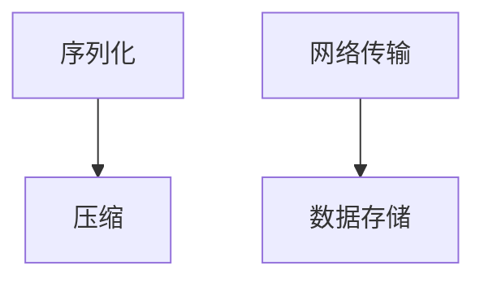
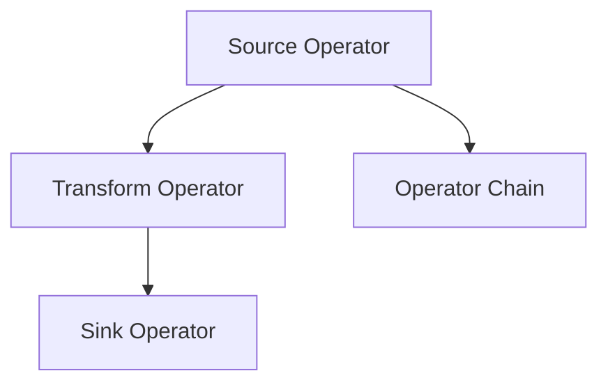
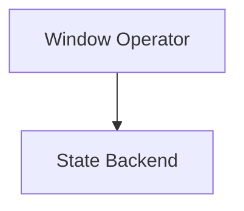
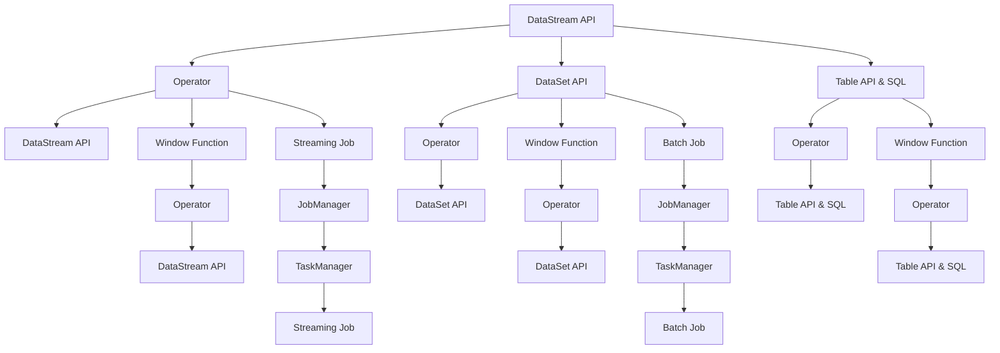
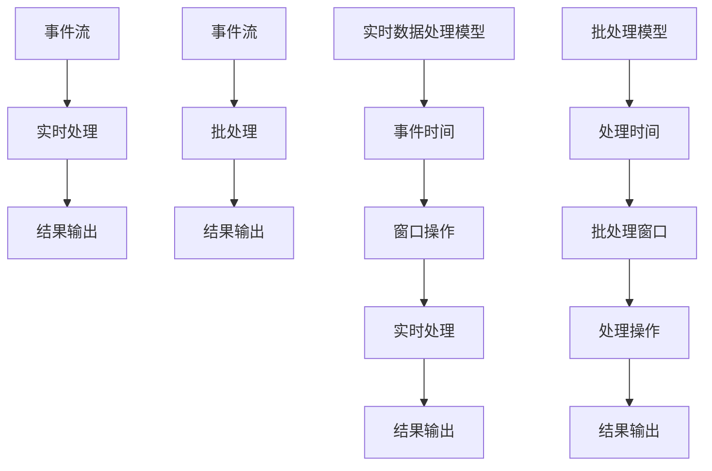
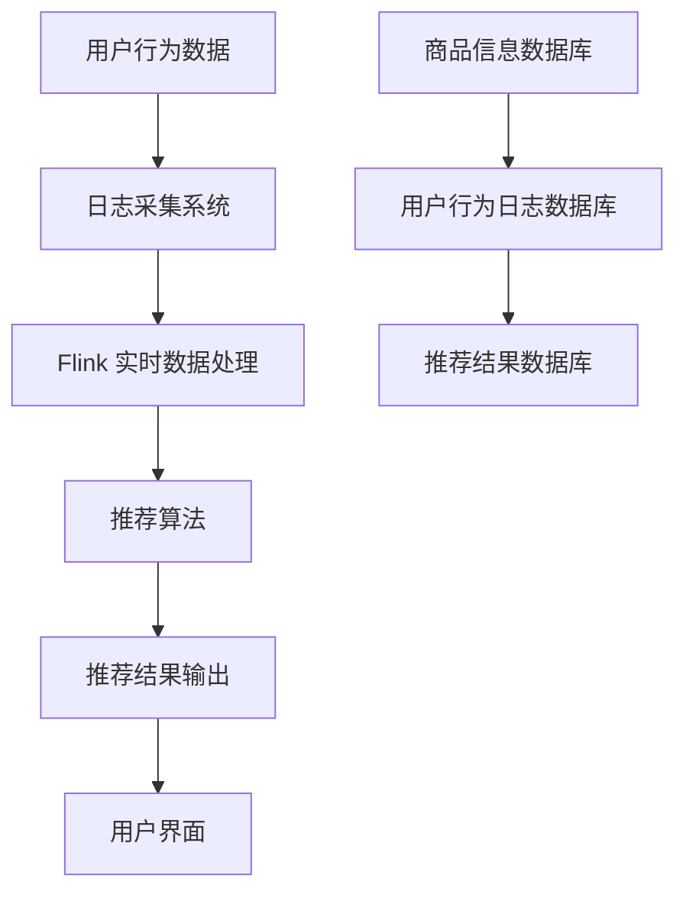
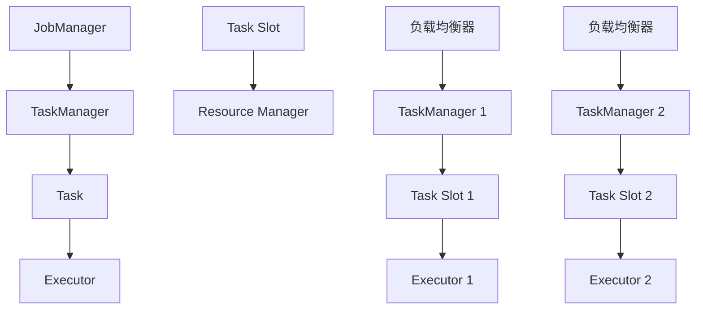
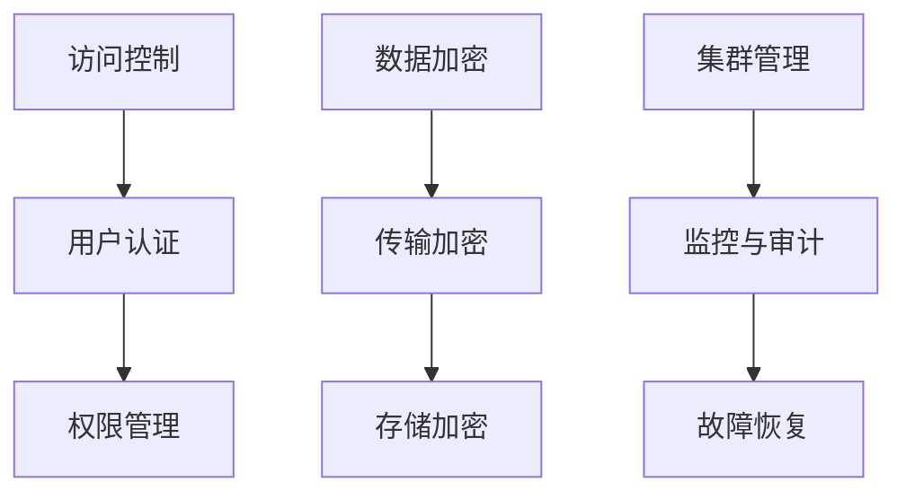
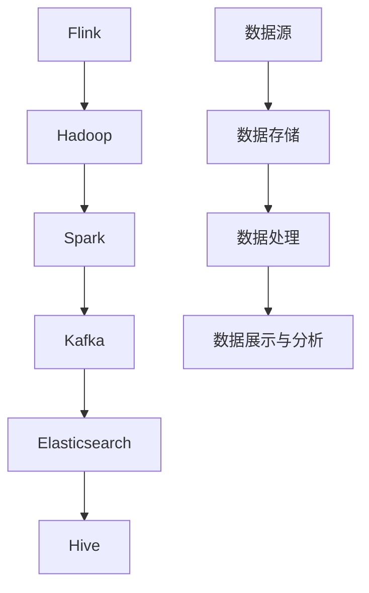

                 

### 文章标题

Apache Flink：实时数据处理与流式计算的未来

> 关键词：Apache Flink，实时数据处理，流式计算，大数据，数据流处理

> 摘要：本文将深入探讨Apache Flink作为实时数据处理与流式计算的重要工具，从其基本概念、架构解析、原理讲解，到具体应用实例，全面剖析Apache Flink的核心特性与优势。通过逻辑清晰、结构紧凑的分析，帮助读者理解Apache Flink在当今大数据领域的广泛应用及其未来发展趋势。

### 第一部分: Apache Flink 概述

#### 第1章: Apache Flink 介绍

##### 1.1 Apache Flink 基本概念

Apache Flink是一个开源流处理框架，专注于实时数据处理和流式计算。与传统的大数据处理框架如Apache Spark和Hadoop不同，Flink设计之初就面向实时处理，其核心目标是提供低延迟、高吞吐量的数据处理能力。Flink不仅支持有界数据（如批处理），更擅长处理无界数据流，使其成为实时数据处理的理想选择。

##### 1.1.1 实时数据处理的需求

随着互联网和物联网的迅猛发展，数据量呈现出爆炸式增长。实时数据处理的需求越来越强烈，主要体现在以下几个方面：

- **低延迟**：在金融交易、实时推荐、自动驾驶等场景中，数据处理需要几乎实时的响应速度。
- **高吞吐量**：随着数据源的增加，如传感器、日志等，需要高效地处理海量数据。
- **数据一致性**：在流式数据处理中，数据的一致性至关重要，确保数据处理过程中不会丢失或重复数据。
- **复杂查询与处理**：现代应用需要复杂的数据处理和分析，如窗口操作、关联查询、机器学习等。

##### 1.1.2 Apache Flink 的核心优势

Apache Flink具备以下核心优势，使其在实时数据处理领域具有明显的竞争力：

- **低延迟**：Flink的内部数据交换和任务调度机制设计使得数据处理延迟非常低。
- **高性能**：Flink利用内存管理和并行处理技术，提供高效的数据处理能力。
- **易用性**：Flink提供了多种API，如DataStream API、DataSet API和Table API，使得开发者可以轻松地编写流式数据处理程序。
- **动态缩放**：Flink支持动态资源分配，可以根据处理需求自动调整任务数量和资源分配。
- **流与批一体化**：Flink同时支持流式数据和批处理，实现了流与批处理的一体化。

##### 1.1.3 Apache Flink 在大数据领域的地位

随着大数据技术的不断发展，Apache Flink已经逐渐成为大数据领域的重要一员。Flink不仅在大数据处理领域与Apache Spark、Hadoop等框架竞争，还在流式计算领域与Apache Kafka、Apache Storm等框架并肩作战。Flink的核心优势使其在大数据领域的应用范围不断扩大，从金融、电商、物联网到实时分析、机器学习等各个领域都有Flink的身影。

#### 第2章: Apache Flink 架构解析

##### 2.1 Apache Flink 核心组件

Apache Flink的架构设计非常清晰，核心组件包括：

- **DataStream API**：DataStream API是Flink提供的用于处理无界数据流的接口，支持事件时间、窗口操作、状态管理等功能。
- **DataSet API**：DataSet API是Flink提供的用于处理有界数据的接口，支持批处理操作，如聚合、连接、排序等。
- **Table API & SQL**：Table API & SQL提供了基于表格的查询接口，支持标准SQL语法，使得开发者可以更方便地进行复杂的数据处理和分析。
- **算子（Operator）**：算子是数据处理的基本操作单元，包括源算子、转换算子和输出算子等。
- **窗口**：窗口是流式数据处理中的重要概念，用于将数据划分成不同的时间段进行聚合和处理。

##### 2.1.1 DataStream API

DataStream API是Flink最核心的API之一，用于处理无界数据流。以下是其主要特点：

- **事件时间**：DataStream API支持事件时间语义，可以基于事件发生的时间进行窗口操作和事件处理。
- **窗口**：DataStream API支持多种窗口类型，如时间窗口、滑动窗口、全局窗口等，用于将数据划分成不同的时间段进行聚合和处理。
- **状态管理**：DataStream API支持状态管理，可以存储和处理实时数据的状态，如计数器、列表等。
- **算子链**：DataStream API将多个算子组合成算子链，优化数据流的处理性能。

##### 2.1.2 DataSet API

DataSet API是Flink提供的用于处理有界数据的接口，主要特点如下：

- **批处理**：DataSet API支持批处理操作，如聚合、连接、排序等，适用于处理有限的数据集。
- **迭代操作**：DataSet API支持迭代操作，如迭代聚合、迭代连接等，可以处理复杂的批处理任务。
- **内存管理**：DataSet API提供了内存管理机制，可以优化批处理任务的内存使用。
- **并行度**：DataSet API支持并行度配置，可以充分利用集群资源进行批处理。

##### 2.1.3 Table API & SQL

Table API & SQL是Flink提供的高级查询接口，基于标准SQL语法，使得开发者可以更方便地进行复杂的数据处理和分析。其主要特点如下：

- **表格抽象**：Table API & SQL将数据流抽象成表格，支持标准的SQL语法，如SELECT、JOIN、GROUP BY等。
- **表达能力强**：Table API & SQL提供了丰富的表达方式，可以处理复杂的查询需求。
- **易用性**：Table API & SQL降低了开发者的学习成本，使得流式数据处理更加便捷。
- **兼容性**：Table API & SQL支持与现有数据库系统的集成，如Hive、Elasticsearch等。

##### 2.1.4 算子（Operator）详解

算子是Flink数据处理的基本操作单元，可以分为以下几类：

- **源算子**：负责从外部数据源读取数据，如Kafka、文件、数据库等。
- **转换算子**：负责对数据进行处理和转换，如过滤、映射、聚合等。
- **输出算子**：负责将处理结果输出到外部系统，如控制台、文件、数据库等。

##### 2.1.5 流与批处理

Flink的一个核心特性是流与批处理的一体化。流与批处理的区别主要体现在数据的特点和处理方式上：

- **流处理**：流处理关注实时数据流，数据是无限流动的，通常基于事件时间进行窗口操作和事件处理。
- **批处理**：批处理关注有限数据集，数据是有界且一次性加载的，通常基于处理时间进行聚合和计算。

Flink通过以下机制实现流与批处理的一体化：

- **事件时间**：Flink支持事件时间语义，可以基于事件发生的时间进行窗口操作和事件处理，实现流处理。
- **批次划分**：Flink将流数据划分为多个批次进行处理，每个批次的时间间隔可以根据需要设置。
- **内存管理**：Flink的内存管理机制可以优化流处理和批处理的内存使用。
- **并行度**：Flink支持并行度配置，可以充分利用集群资源进行流处理和批处理。

#### 第3章: Apache Flink 实时数据处理原理

##### 3.1 实时数据流处理基础

实时数据流处理是Flink的核心功能之一，以下是其基础概念：

- **事件流**：事件流是实时数据处理的输入，包括各种类型的数据，如文本、图像、传感器数据等。
- **处理模型**：实时数据处理模型包括事件时间模型、处理时间模型等，用于定义数据处理的方式和时间基准。
- **窗口**：窗口是将事件流划分成不同时间段进行聚合和处理的基本单元，包括固定窗口、滑动窗口、全局窗口等。

##### 3.1.1 流与事件的定义

- **流**：流是数据的无限流动序列，可以分为时间流和数据流。
  - **时间流**：时间流是指数据在时间维度上的流动，可以用于表示事件发生的时间顺序。
  - **数据流**：数据流是指数据的流动，可以用于表示数据在处理过程中的传输和转换。
- **事件**：事件是流中的基本单元，表示数据的单个实例。事件可以是单个数据项，也可以是一个数据集合。

##### 3.1.2 实时数据处理模型

实时数据处理模型可以分为事件时间模型和处理时间模型：

- **事件时间模型**：事件时间模型是指数据处理基于事件发生的时间进行，可以处理乱序事件和迟到事件，适用于需要保证数据一致性和准确性的场景。
- **处理时间模型**：处理时间模型是指数据处理基于处理时间进行，事件顺序和事件时间可能不一致，适用于对实时性要求较高的场景。

##### 3.1.3 时间语义与窗口

时间语义是实时数据处理中的重要概念，用于定义数据处理的时序关系。Flink支持以下时间语义：

- **事件时间**：事件时间是指事件发生的实际时间，通常由数据源提供。事件时间可以用于实现正确的时间戳分配和窗口计算。
- **处理时间**：处理时间是指事件被处理的时间，通常是系统时间。处理时间可以用于简单的数据处理场景，但无法保证数据的一致性和准确性。

窗口是将事件流划分成不同时间段进行聚合和处理的基本单元。Flink支持以下窗口类型：

- **固定窗口**：固定窗口是指窗口大小固定，适用于处理固定时间段内的数据。
- **滑动窗口**：滑动窗口是指窗口大小固定，窗口之间有重叠，适用于处理实时数据流。
- **全局窗口**：全局窗口是指窗口大小无限大，适用于处理整个数据流。

### 第二部分: Apache Flink 实战

#### 第4章: Apache Flink 实时数据分析应用

##### 4.1 Apache Flink 在实时日志分析中的应用

实时日志分析是Flink的典型应用场景之一，以下是一个详细的流程设计：

1. **日志数据格式与采集**：

   - **日志数据格式**：日志数据通常包含时间戳、日志级别、日志内容等信息，例如`[2022-01-01 10:00:00] INFO: User login successful`.
   - **日志采集**：可以使用Flink的DataStream API从日志文件、Kafka等数据源中读取日志数据。

2. **数据清洗与预处理**：

   - **时间戳解析**：将日志中的时间戳提取出来，转换为统一的时间格式。
   - **字段映射**：将日志中的字段映射为统一的命名规范，如`timestamp`, `level`, `message`等。
   - **数据过滤**：过滤掉不符合要求的日志数据，如错误的日志格式、重复的数据等。

3. **实时日志分析流程设计**：

   - **日志聚合**：使用Flink的窗口操作对日志数据进行聚合，如按分钟、小时、天等进行聚合。
   - **日志计数**：计算每个窗口中的日志数量，用于统计日志的发生频率。
   - **日志分析**：对聚合后的日志数据进行进一步分析，如日志级别的分布、错误日志的统计等。

4. **结果输出**：

   - **控制台输出**：将分析结果输出到控制台，便于实时监控。
   - **文件输出**：将分析结果保存到文件中，便于后续的统计和分析。

##### 4.1.1 日志数据格式与采集

日志数据是实时日志分析的基础，其格式和采集方式直接影响数据分析的准确性和效率。以下是一个简单的日志数据格式和采集方式的示例：

1. **日志数据格式**：

   ```  
   [2022-01-01 10:00:00] INFO: User login successful  
   [2022-01-01 10:01:00] WARNING: Configuration file not found  
   [2022-01-01 10:02:00] ERROR: Database connection failed  
   ```

   日志数据通常包含以下字段：

   - **时间戳**：表示日志事件的实际发生时间，格式为`[YYYY-MM-DD HH:MM:SS]`。
   - **日志级别**：表示日志事件的严重程度，如INFO、WARNING、ERROR等。
   - **日志内容**：表示日志事件的详细描述。

2. **日志采集**：

   Flink提供了丰富的数据源支持，可以从不同的数据源读取日志数据。以下是一个从文件中读取日志数据的示例：

   ```python  
   # 导入 Flink Python API  
   from pyflink.datastream import StreamExecutionEnvironment

   # 创建 Flink 数据流环境  
   env = StreamExecutionEnvironment.get_execution_environment()

   # 读取日志文件  
   log_stream = env.read_text("path/to/logs/*.log")

   # 处理日志数据  
   processed_stream = log_stream.map(lambda line: line.strip())

   # 输出结果  
   processed_stream.print()  
   ```

   在这个示例中，我们使用`read_text`函数从文件中读取日志数据，并使用`map`函数对日志数据进行处理，如去除空格、解析时间戳等。

##### 4.1.2 数据清洗与预处理

数据清洗与预处理是实时日志分析的重要环节，其目的是将原始日志数据转换为结构化的数据，并去除不符合要求的数据。以下是一个数据清洗与预处理的示例：

1. **时间戳解析**：

   将日志中的时间戳提取出来，并转换为统一的时间格式。以下是一个使用Python正则表达式进行时间戳解析的示例：

   ```python  
   import re

   def parse_timestamp(line):  
       pattern = r"\[(.*?)\]"  
       match = re.search(pattern, line)  
       if match:  
           timestamp = match.group(1)  
           return timestamp  
       else:  
           return None

   log_stream = env.read_text("path/to/logs/*.log")  
   timestamp_stream = log_stream.map(parse_timestamp)

   # 输出结果  
   timestamp_stream.print()  
   ```

   在这个示例中，我们使用正则表达式`r"\[(.*?)\]"`匹配时间戳字段，并使用`map`函数将时间戳提取出来。

2. **字段映射**：

   将日志中的字段映射为统一的命名规范，如`timestamp`, `level`, `message`等。以下是一个字段映射的示例：

   ```python  
   def map_fields(line):  
       fields = line.split(" ")  
       timestamp = fields[0][1:]  
       level = fields[1]  
       message = " ".join(fields[2:])  
       return (timestamp, level, message)

   timestamp_stream.map(map_fields)  
   ```

   在这个示例中，我们使用`split`函数将日志数据按空格分隔，并提取出时间戳、日志级别和日志内容。

3. **数据过滤**：

   过滤掉不符合要求的数据，如错误的日志格式、重复的数据等。以下是一个数据过滤的示例：

   ```python  
   def filter_invalid_data(line):  
       fields = line.split(" ")  
       if len(fields) != 4:  
           return False  
       return True

   timestamp_stream.filter(filter_invalid_data)  
   ```

   在这个示例中，我们使用`filter`函数过滤掉不符合要求的日志数据。

##### 4.1.3 实时日志分析流程设计

实时日志分析流程设计是将清洗和预处理后的日志数据进行进一步分析，以获取有价值的信息。以下是一个实时日志分析流程的示例：

1. **日志聚合**：

   使用Flink的窗口操作对日志数据进行聚合，如按分钟、小时、天等进行聚合。以下是一个按分钟聚合的示例：

   ```python  
   def aggregate_logs(logs):  
       log_counts = {}  
       for log in logs:  
           timestamp = log[0]  
           if timestamp not in log_counts:  
               log_counts[timestamp] = 1  
           else:  
               log_counts[timestamp] += 1  
       return log_counts

   windowed_stream = timestamp_stream.time_window(Time.minutes(1))  
   aggregated_stream = windowed_stream.reduce(aggregate_logs)

   # 输出结果  
   aggregated_stream.print()  
   ```

   在这个示例中，我们使用`time_window`函数将日志数据按分钟进行窗口划分，并使用`reduce`函数对窗口内的日志数据进行聚合。

2. **日志计数**：

   计算每个窗口中的日志数量，用于统计日志的发生频率。以下是一个日志计数的示例：

   ```python  
   def count_logs(log_counts):  
       total_count = 0  
       for count in log_counts.values():  
           total_count += count  
       return total_count

   count_stream = aggregated_stream.map(count_logs)

   # 输出结果  
   count_stream.print()  
   ```

   在这个示例中，我们使用`map`函数对聚合后的日志数据进行计数。

3. **日志分析**：

   对聚合后的日志数据进行进一步分析，如日志级别的分布、错误日志的统计等。以下是一个日志级别分布的示例：

   ```python  
   def analyze_logs(log_counts):  
       log_levels = {}  
       for log in log_counts:  
           level = log[1]  
           if level not in log_levels:  
               log_levels[level] = 0  
           log_levels[level] += 1  
       return log_levels

   analyzed_stream = aggregated_stream.map(analyze_logs)

   # 输出结果  
   analyzed_stream.print()  
   ```

   在这个示例中，我们使用`map`函数对聚合后的日志数据进行日志级别分析。

4. **结果输出**：

   将分析结果输出到控制台或文件中，便于实时监控和分析。以下是一个输出到控制台的示例：

   ```python  
   def output_results(results):  
       for result in results:  
           print(result)

   output_stream = analyzed_stream.map(output_results)

   # 输出结果  
   output_stream.print()  
   ```

   在这个示例中，我们使用`map`函数将分析结果输出到控制台。

#### 第5章: Apache Flink 在物联网数据处理中的应用

##### 5.1 物联网数据处理挑战

物联网（IoT）技术的快速发展使得大量传感器和设备开始产生海量数据，这些数据具有以下特点：

- **数据量大**：物联网设备数量庞大，每个设备都可能产生大量的数据，导致整体数据量非常庞大。
- **数据多样性**：物联网数据类型丰富，包括文本、图像、音频、视频等，不同类型的数据处理需求不同。
- **数据时效性要求高**：物联网数据通常具有很高的时效性，如实时监测、故障预警等，要求快速处理并反馈结果。
- **数据实时性要求高**：物联网应用通常需要实时处理和分析数据，以便及时做出决策。

##### 5.1.1 数据量大

物联网设备数量庞大，每个设备都可能产生大量的数据，导致整体数据量非常庞大。例如，一个智能交通系统可能包含成千上万辆车辆，每辆车每小时产生数十条数据，整体数据量非常巨大。

##### 5.1.2 数据多样性

物联网数据类型丰富，包括文本、图像、音频、视频等，不同类型的数据处理需求不同。例如，对于传感器采集的温度、湿度等数值型数据，可以进行简单的统计分析；而对于图像、音频等媒体数据，可能需要进行复杂的图像识别、语音识别等处理。

##### 5.1.3 数据时效性要求高

物联网数据通常具有很高的时效性，如实时监测、故障预警等，要求快速处理并反馈结果。例如，在智能交通系统中，实时检测交通流量和路况信息，及时调整交通信号灯，可以减少交通拥堵，提高道路通行效率。

##### 5.1.4 数据实时性要求高

物联网应用通常需要实时处理和分析数据，以便及时做出决策。例如，在智能医疗系统中，实时监测患者的生命体征，及时发现异常情况，及时进行干预，可以挽救患者的生命。

##### 5.1.5 Apache Flink 在物联网数据处理中的应用案例

Apache Flink在物联网数据处理中具有广泛的应用，以下是一个典型的应用案例：

**智能农业监控**：

在一个智能农业项目中，使用物联网设备收集农田的环境数据，如土壤湿度、温度、光照强度等。数据通过无线传感器网络传输到中心服务器进行处理和分析。

1. **数据采集**：

   物联网设备定期采集农田环境数据，并通过无线传感器网络传输到中心服务器。

2. **数据预处理**：

   使用Flink对采集到的数据进行预处理，包括数据清洗、去重、过滤等，确保数据的质量和一致性。

3. **实时监测**：

   使用Flink对预处理后的数据进行分析，实时监测农田的环境状况，包括土壤湿度、温度、光照强度等。

4. **预测与决策**：

   使用机器学习算法对实时监测数据进行分析，预测未来一段时间内农田的环境变化趋势，并给出相应的决策建议，如浇水、施肥等。

5. **数据可视化**：

   将分析结果可视化，展示农田的环境状况和预测结果，便于农民及时了解农田状况，做出正确的决策。

通过以上应用案例，可以看出Apache Flink在物联网数据处理中的应用价值。Flink的实时数据处理能力和高效性能，使得物联网应用可以快速、准确地处理海量数据，实现实时监测和预测，为物联网应用提供强有力的技术支持。

#### 第6章: Apache Flink 在电商领域的应用

##### 6.1 电商数据分析需求

电商领域对数据分析有着极高的需求，以下是一些常见的数据分析需求：

- **流量分析**：实时监测电商平台的流量情况，包括用户访问量、页面浏览量、访问路径等，以便了解用户行为和需求，优化网站性能和用户体验。
- **用户行为分析**：分析用户的购买行为、浏览习惯、搜索关键词等，以便了解用户需求，提高用户转化率和忠诚度。
- **实时推荐系统**：根据用户的浏览记录、购买历史等信息，实时推荐相关的商品，提高销售额和用户满意度。
- **库存管理**：实时监测商品库存情况，确保库存充足，避免缺货或滞销情况的发生。
- **促销活动分析**：分析促销活动的效果，包括活动参与度、销售额、用户转化率等，以便优化促销策略和活动设计。

##### 6.1.1 流量分析

流量分析是电商领域重要的数据分析任务之一，其主要目的是了解用户访问行为，优化网站性能和用户体验。以下是一个流量分析的示例：

1. **数据采集**：

   使用Flink从日志文件、Kafka等数据源中读取访问日志，如页面访问量、访问路径等。

2. **数据预处理**：

   对采集到的访问日志进行预处理，包括去除重复数据、过滤无效访问等，确保数据质量。

3. **流量统计**：

   使用Flink对预处理后的访问日志进行统计，包括用户访问量、页面浏览量、访问路径等。

4. **实时监控**：

   将统计结果实时输出到控制台或数据可视化工具，便于实时监控和调整。

##### 6.1.2 用户行为分析

用户行为分析是电商领域重要的数据分析任务之一，其主要目的是了解用户需求，提高用户转化率和忠诚度。以下是一个用户行为分析的示例：

1. **数据采集**：

   使用Flink从日志文件、Kafka等数据源中读取用户行为数据，如浏览记录、购买历史、搜索关键词等。

2. **数据预处理**：

   对采集到的用户行为数据进行预处理，包括数据清洗、去重、过滤等，确保数据质量。

3. **行为分析**：

   使用Flink对预处理后的用户行为数据进行分析，包括用户浏览习惯、购买行为、搜索关键词等。

4. **实时推荐**：

   根据分析结果，使用机器学习算法生成实时推荐列表，推荐给用户。

5. **效果评估**：

   监测推荐系统的效果，包括用户点击率、购买率等，不断优化推荐算法。

##### 6.1.3 实时推荐系统

实时推荐系统是电商领域的一项重要技术，其目的是根据用户的浏览记录、购买历史等信息，实时推荐相关的商品，提高销售额和用户满意度。以下是一个实时推荐系统的架构设计：

1. **用户行为数据采集**：

   使用Flink从日志文件、Kafka等数据源中读取用户行为数据，如浏览记录、购买历史、搜索关键词等。

2. **数据预处理**：

   对采集到的用户行为数据进行预处理，包括数据清洗、去重、过滤等，确保数据质量。

3. **用户画像构建**：

   使用Flink对预处理后的用户行为数据进行分析，构建用户画像，包括用户标签、兴趣偏好等。

4. **推荐算法**：

   根据用户画像和商品信息，使用协同过滤、基于内容的推荐等算法生成推荐列表。

5. **实时推荐**：

   将推荐结果实时输出到推荐引擎，如Redis、MySQL等，供用户实时查看。

6. **效果评估**：

   监测推荐系统的效果，包括用户点击率、购买率等，不断优化推荐算法。

通过以上电商数据分析需求的示例，可以看出Apache Flink在电商领域的广泛应用。Flink的实时数据处理能力和高效性能，使得电商应用可以快速、准确地处理海量数据，实现实时分析、实时推荐等功能，为电商业务提供强有力的技术支持。

#### 第7章: Apache Flink 在金融风控中的应用

##### 7.1 金融风控需求

金融风控是金融机构面临的重要挑战之一，其目的是通过有效的风险监测和管理，降低金融风险，确保业务的稳健运行。以下是金融风控的一些主要需求：

- **实时交易监控**：实时监控交易数据，识别异常交易行为，如欺诈、洗钱等，及时采取措施防范风险。
- **风险预警**：根据历史数据和实时监控数据，预测潜在风险，提前发出预警，以便采取相应的措施。
- **实时数据分析**：对交易数据进行分析，识别交易模式、用户行为等，为风险管理和业务决策提供支持。
- **合规性检查**：确保交易行为符合相关法律法规和监管要求，防范违规操作。

##### 7.1.1 实时交易监控

实时交易监控是金融风控的关键环节，其主要目的是及时发现并处理异常交易行为，保障交易的安全和合规。以下是一个实时交易监控的示例：

1. **数据采集**：

   使用Flink从交易系统、日志文件等数据源中读取交易数据，包括交易金额、交易时间、交易双方信息等。

2. **数据预处理**：

   对采集到的交易数据进行预处理，包括数据清洗、去重、过滤等，确保数据质量。

3. **异常检测**：

   使用Flink对预处理后的交易数据进行分析，识别异常交易行为，如交易金额异常、交易时间异常等。

4. **实时预警**：

   将检测到的异常交易数据实时输出到预警系统，如邮件、短信等，通知相关人员及时处理。

5. **日志记录**：

   将异常交易数据记录到日志文件中，以便后续分析和审计。

##### 7.1.2 风险预警

风险预警是金融风控的重要手段，其目的是提前预测潜在风险，并采取相应的措施防范风险。以下是一个风险预警的示例：

1. **数据采集**：

   使用Flink从交易系统、用户行为日志等数据源中读取相关数据，包括交易数据、用户行为数据等。

2. **数据预处理**：

   对采集到的数据进行分析，提取关键特征，如交易金额、交易频率、用户行为等。

3. **风险评估**：

   使用Flink对预处理后的数据进行分析，评估潜在风险，包括欺诈风险、洗钱风险等。

4. **实时预警**：

   根据风险评估结果，实时输出预警信息，如邮件、短信等，通知相关人员及时处理。

5. **日志记录**：

   将预警信息记录到日志文件中，以便后续分析和审计。

##### 7.1.3 大数据分析在金融风控中的应用

大数据分析在金融风控中发挥着重要作用，其通过分析海量交易数据、用户行为数据等，实现实时监控、风险预警等功能。以下是一个大数据分析在金融风控中的应用示例：

1. **数据采集**：

   使用Flink从交易系统、用户行为日志等数据源中读取相关数据，包括交易数据、用户行为数据等。

2. **数据预处理**：

   对采集到的数据进行分析，提取关键特征，如交易金额、交易频率、用户行为等。

3. **实时监控**：

   使用Flink对预处理后的数据进行分析，实时监控交易行为和用户行为，识别异常行为。

4. **风险预测**：

   使用机器学习算法对历史数据进行分析，预测潜在风险，包括欺诈风险、洗钱风险等。

5. **实时预警**：

   根据风险预测结果，实时输出预警信息，如邮件、短信等，通知相关人员及时处理。

6. **日志记录**：

   将监控和预警信息记录到日志文件中，以便后续分析和审计。

通过以上金融风控需求的示例，可以看出Apache Flink在金融风控中的应用价值。Flink的实时数据处理能力和高效性能，使得金融风控应用可以快速、准确地处理海量数据，实现实时监控、风险预警等功能，为金融机构提供强有力的技术支持。

### 第三部分: Apache Flink 深入与优化

#### 第8章: Apache Flink 性能优化

Apache Flink的性能优化是提升其处理效率和质量的关键，以下是一些常见的性能优化策略：

##### 8.1 Flink 集群资源管理

Flink的集群资源管理主要涉及TaskManager和JobManager的配置、内存管理以及并行度与负载均衡。

- **TaskManager与JobManager**：TaskManager负责执行具体的任务，JobManager负责协调和管理整个任务执行过程。合理配置TaskManager和JobManager的数量和资源，可以提升集群的整体性能。通常，一个TaskManager配置1-4个CPU核心和4-16GB内存是较为合适的。
  
  ```mermaid
  graph TB
    A[JobManager] --> B[TaskManager] --> C[Task]
    C --> D[Executor]
  ```

- **内存管理**：Flink的内存管理包括堆内内存和堆外内存。合理配置堆内内存和堆外内存的大小，可以减少内存争用和GC（垃圾回收）带来的性能开销。堆内内存通常用于存储数据结构和执行程序代码，而堆外内存用于缓存数据和IO操作。

  ```mermaid
  graph TB
    A[Heap Memory] --> B[Off-Heap Memory]
  ```

- **并行度与负载均衡**：合理设置并行度可以充分利用集群资源，提高数据处理效率。负载均衡则通过优化任务调度，避免任务在某个节点上堆积，提高整体性能。

  ```mermaid
  graph TB
    A[负载均衡器] --> B[TaskManager 1] --> C[Task Slot 1]
    D[负载均衡器] --> E[TaskManager 2] --> F[Task Slot 2]
  ```

##### 8.2 数据序列化与压缩

数据序列化与压缩是影响Flink性能的重要因素。选择高效的数据序列化库（如Kryo、Avro）和适当的压缩算法（如Gzip、Snappy），可以减少网络传输和数据存储的开销。



##### 8.3 算子链优化

算子链优化可以通过减少数据在各算子之间的传输次数，提升数据处理的效率。Flink提供了算子链（Operator Chaining）功能，可以在合适的条件下自动合并相邻的算子，减少网络延迟和数据拷贝。



##### 8.4 窗口与状态管理

窗口与状态管理是Flink处理大规模数据流的关键。合理设置窗口大小和滑动间隔，可以减少内存占用和计算复杂度。同时，使用Flink的状态后端（如RockDB、HDFS），可以持久化状态数据，提升状态管理的性能和可靠性。



#### 第9章: Apache Flink 跨语言编程

Apache Flink支持多种编程语言，包括Java、Scala、Python等。跨语言编程不仅可以提高开发效率，还可以利用不同编程语言的优点。

##### 9.1 Flink 与 Python 的集成

Python是一种功能丰富、易用的编程语言，在数据科学和数据分析领域有着广泛的应用。Flink与Python的集成可以通过Flink Python API实现。

- **Flink Python API 简介**：

  Flink Python API提供了丰富的API，包括DataStream API、DataSet API和Table API，使得Python开发者可以方便地编写流式数据处理程序。

  ```python
  from pyflink.datastream import StreamExecutionEnvironment
  from pyflink.table import StreamTableEnvironment

  env = StreamExecutionEnvironment.get_execution_environment()
  t_env = StreamTableEnvironment.create(env)
  ```

- **Python 在 Flink 中的使用场景**：

  Python在Flink中主要应用于以下场景：

  - **实时数据处理**：使用Python编写实时数据处理程序，处理来自各种数据源的数据流。
  - **机器学习与数据分析**：利用Python的强大库（如Pandas、NumPy、Scikit-learn等），在Flink中进行机器学习和数据分析。
  - **数据转换与清洗**：使用Python进行数据转换和清洗，提高数据处理效率。

- **Python 在 Flink 中的性能考虑**：

  虽然Python在开发效率上具有优势，但在性能方面相对较低。以下是一些性能考虑：

  - **序列化与压缩**：选择高效的序列化库和压缩算法，减少网络传输和数据存储的开销。
  - **并行度**：合理设置并行度，充分利用集群资源，提高数据处理效率。
  - **缓存与状态管理**：使用适当的缓存和状态管理策略，提高数据处理速度和性能。

  ```python
  def process_function(data):
      # 数据处理逻辑
      return data

  data_stream = env.from_collection(data)
  processed_stream = data_stream.map(process_function)
  processed_stream.print()
  ```

#### 第10章: Apache Flink 集成与生态

Apache Flink作为大数据生态系统的一部分，与其他大数据技术和工具有着紧密的集成关系。以下是一些常见的集成场景：

##### 10.1 Flink 与其他大数据技术的集成

- **Hadoop**：Flink与Hadoop生态系统的紧密集成，可以充分利用Hadoop的存储和计算资源。例如，Flink可以将数据写入HDFS，或者从HDFS中读取数据进行处理。
- **Spark**：Flink与Spark可以协同工作，实现流与批处理的一体化。例如，可以使用Flink处理实时数据流，同时使用Spark进行批处理。
- **Kafka**：Flink与Kafka的集成使得Flink可以实时处理Kafka中的数据流，实现高吞吐量的数据处理。
- **Elasticsearch**：Flink可以将处理结果输出到Elasticsearch，实现实时数据分析和搜索。
- **Hive**：Flink与Hive的集成可以使得Flink查询Hive表，实现流式数据处理和批处理查询的融合。

##### 10.1.1 Hadoop

Flink与Hadoop的集成主要体现在数据存储和计算资源方面：

- **数据存储**：Flink可以将数据写入HDFS，充分利用Hadoop的分布式存储能力。以下是一个简单的HDFS数据写入示例：

  ```python
  from pyflink.datastream import StreamExecutionEnvironment
  from pyflink.table import StreamTableEnvironment

  env = StreamExecutionEnvironment.get_execution_environment()
  t_env = StreamTableEnvironment.create(env)

  # 创建表
  t_env.execute_sql("""
      CREATE TABLE hdfs_table (
          id INT,
          name STRING
      ) WITH (
          'connector' = 'hdfs',
          'path' = 'hdfs://path/to/output',
          'format' = 'csv'
      )
  """)

  # 插入数据
  data_stream = env.from_collection([(1, 'Alice'), (2, 'Bob')])
  data_stream.insert_into('hdfs_table')

  env.execute("HDFS Integration Example")
  ```

- **计算资源**：Flink可以利用YARN等Hadoop资源管理器进行资源分配和管理，实现集群的动态扩容和负载均衡。

##### 10.1.2 Spark

Flink与Spark的集成可以充分利用两者的优势，实现流与批处理的一体化。以下是一个简单的Flink与Spark集成示例：

- **数据交换**：通过Apache Spark Connector，Flink可以将数据写入Spark，或者从Spark中读取数据。以下是一个简单的数据交换示例：

  ```python
  from pyflink.datastream import StreamExecutionEnvironment
  from pyflink.table import StreamTableEnvironment

  env = StreamExecutionEnvironment.get_execution_environment()
  t_env = StreamTableEnvironment.create(env)

  # 创建Flink表
  t_env.execute_sql("""
      CREATE TABLE flink_table (
          id INT,
          name STRING
      ) WITH (
          'connector' = 'kafka',
          'topic' = 'flink_to_spark',
          'properties.bootstrap.servers' = 'kafka:9092'
      )
  """)

  # 将Flink表数据写入Spark
  t_env.execute_sql("""
      CREATE TABLE spark_table (
          id INT,
          name STRING
      ) WITH (
          'connector' = 'spark',
          'url' = 'spark://spark-master:7077',
          'database' = 'flink_integration',
          'table' = 'spark_table'
      )
  """)

  # 从Flink表读取数据
  t_env.execute_sql("""
      INSERT INTO spark_table
      SELECT id, name FROM flink_table
  """)

  env.execute("Flink to Spark Integration Example")
  ```

##### 10.1.3 Kafka

Apache Kafka是一个分布式流处理平台，Flink与Kafka的集成使得Flink可以高效地处理Kafka中的数据流。以下是一个简单的Flink与Kafka集成示例：

- **数据消费**：使用Flink的DataStream API从Kafka中读取数据流。以下是一个简单的数据消费示例：

  ```python
  from pyflink.datastream import StreamExecutionEnvironment
  from pyflink.table import StreamTableEnvironment

  env = StreamExecutionEnvironment.get_execution_environment()
  t_env = StreamTableEnvironment.create(env)

  # 创建Kafka数据源
  t_env.execute_sql("""
      CREATE TABLE kafka_table (
          id INT,
          name STRING
      ) WITH (
          'connector' = 'kafka',
          'topic' = 'input_topic',
          'properties.bootstrap.servers' = 'kafka:9092'
      )
  """)

  # 处理Kafka数据
  t_env.execute_sql("""
      CREATE VIEW processed_table AS
      SELECT id, name FROM kafka_table
  """)

  env.execute("Kafka Integration Example")
  ```

- **数据生产**：使用Flink将数据写入Kafka。以下是一个简单的数据生产示例：

  ```python
  from pyflink.datastream import StreamExecutionEnvironment
  from pyflink.table import StreamTableEnvironment

  env = StreamExecutionEnvironment.get_execution_environment()
  t_env = StreamTableEnvironment.create(env)

  # 创建Flink表
  t_env.execute_sql("""
      CREATE TABLE flink_table (
          id INT,
          name STRING
      ) WITH (
          'connector' = 'values',
          'rows' = '[(1, "Alice"), (2, "Bob")]'
      )
  """)

  # 将Flink表数据写入Kafka
  t_env.execute_sql("""
      CREATE TABLE kafka_table (
          id INT,
          name STRING
      ) WITH (
          'connector' = 'kafka',
          'topic' = 'output_topic',
          'properties.bootstrap.servers' = 'kafka:9092'
      )
  """)

  # 插入数据
  t_env.execute_sql("""
      INSERT INTO kafka_table
      SELECT id, name FROM flink_table
  """)

  env.execute("Flink to Kafka Integration Example")
  ```

##### 10.1.4 Elasticsearch

Apache Elasticsearch是一个分布式搜索引擎，Flink与Elasticsearch的集成可以实现实时数据分析和搜索。以下是一个简单的Flink与Elasticsearch集成示例：

- **数据写入**：使用Flink将处理结果写入Elasticsearch。以下是一个简单的数据写入示例：

  ```python
  from pyflink.datastream import StreamExecutionEnvironment
  from pyflink.table import StreamTableEnvironment

  env = StreamExecutionEnvironment.get_execution_environment()
  t_env = StreamTableEnvironment.create(env)

  # 创建Flink表
  t_env.execute_sql("""
      CREATE TABLE flink_table (
          id INT,
          name STRING
      ) WITH (
          'connector' = 'values',
          'rows' = '[(1, "Alice"), (2, "Bob")]'
      )
  """)

  # 将Flink表数据写入Elasticsearch
  t_env.execute_sql("""
      CREATE TABLE es_table (
          id INT,
          name STRING
      ) WITH (
          'connector' = 'elasticsearch',
          'url' = 'http://localhost:9200',
          'index' = 'flink_index'
      )
  """)

  # 插入数据
  t_env.execute_sql("""
      INSERT INTO es_table
      SELECT id, name FROM flink_table
  """)

  env.execute("Flink to Elasticsearch Integration Example")
  ```

- **数据查询**：使用Elasticsearch进行数据查询，结合Flink的实时数据处理能力。以下是一个简单的数据查询示例：

  ```python
  from pyflink.datastream import StreamExecutionEnvironment
  from pyflink.table import StreamTableEnvironment

  env = StreamExecutionEnvironment.get_execution_environment()
  t_env = StreamTableEnvironment.create(env)

  # 创建Elasticsearch数据源
  t_env.execute_sql("""
      CREATE TABLE es_source (
          id INT,
          name STRING
      ) WITH (
          'connector' = 'elasticsearch',
          'url' = 'http://localhost:9200',
          'index' = 'flink_index'
      )
  """)

  # 查询数据
  t_env.execute_sql("""
      SELECT * FROM es_source WHERE name = 'Alice'
  """)

  env.execute("Elasticsearch to Flink Integration Example")
  ```

##### 10.1.5 Hive

Apache Hive是一个基于Hadoop的数据仓库工具，Flink与Hive的集成可以实现流式数据处理和批处理查询的融合。以下是一个简单的Flink与Hive集成示例：

- **数据写入**：使用Flink将数据写入Hive。以下是一个简单的数据写入示例：

  ```python
  from pyflink.datastream import StreamExecutionEnvironment
  from pyflink.table import StreamTableEnvironment

  env = StreamExecutionEnvironment.get_execution_environment()
  t_env = StreamTableEnvironment.create(env)

  # 创建Flink表
  t_env.execute_sql("""
      CREATE TABLE flink_table (
          id INT,
          name STRING
      ) WITH (
          'connector' = 'values',
          'rows' = '[(1, "Alice"), (2, "Bob")]'
      )
  """)

  # 将Flink表数据写入Hive
  t_env.execute_sql("""
      CREATE TABLE hive_table (
          id INT,
          name STRING
      ) WITH (
          'connector' = 'hive',
          'database' = 'flink_hive',
          'table' = 'hive_table'
      )
  """)

  # 插入数据
  t_env.execute_sql("""
      INSERT INTO hive_table
      SELECT id, name FROM flink_table
  """)

  env.execute("Flink to Hive Integration Example")
  ```

- **数据查询**：使用Flink查询Hive表。以下是一个简单的数据查询示例：

  ```python
  from pyflink.datastream import StreamExecutionEnvironment
  from pyflink.table import StreamTableEnvironment

  env = StreamExecutionEnvironment.get_execution_environment()
  t_env = StreamTableEnvironment.create(env)

  # 创建Hive数据源
  t_env.execute_sql("""
      CREATE TABLE hive_source (
          id INT,
          name STRING
      ) WITH (
          'connector' = 'hive',
          'database' = 'flink_hive',
          'table' = 'hive_table'
      )
  """)

  # 查询数据
  t_env.execute_sql("""
      SELECT * FROM hive_source
  """)

  env.execute("Hive to Flink Integration Example")
  ```

#### 第11章: Apache Flink 安全性与可靠性

Apache Flink的安全性与可靠性是确保其大规模应用的关键。以下是一些常见的安全性与可靠性机制：

##### 11.1 Flink 安全性机制

Flink提供了多种安全性机制，包括访问控制、数据加密和集群管理。

- **访问控制**：Flink支持基于角色的访问控制（RBAC），通过用户角色和权限设置，确保只有授权用户可以访问Flink集群和资源。

  ```mermaid
  graph TB
    A[访问控制] --> B[用户认证] --> C[权限管理]
  ```

- **数据加密**：Flink支持数据传输加密和存储加密，通过SSL/TLS等加密协议，确保数据在传输和存储过程中的安全性。

  ```mermaid
  graph TB
    D[数据加密] --> E[传输加密] --> F[存储加密]
  ```

- **集群管理**：Flink提供了集群监控和故障恢复机制，通过实时监控集群状态，及时发现和处理故障，确保集群的稳定运行。

  ```mermaid
  graph TB
    G[集群管理] --> H[监控与审计] --> I[故障恢复]
  ```

##### 11.2 Flink 高可用性设计

Flink的高可用性设计通过以下机制实现：

- **JobManager 高可用性**：通过使用高可用性配置，如HA JobManager，实现JobManager的故障自动切换，确保任务的持续执行。
- **Checkpointing**：Flink的Checkpointing机制可以定期保存任务的当前状态，实现任务的重启和恢复。
- **State Backend**：Flink支持多种State Backend，如MemoryStateBackend和FsStateBackend，通过持久化状态数据，实现状态数据的恢复和恢复。

##### 11.3 Flink 集群资源管理

Flink的集群资源管理是确保任务高效执行的关键。以下是一些常见的资源管理策略：

- **TaskManager 与 JobManager**：合理配置TaskManager和JobManager的数量和资源，可以充分利用集群资源，提高任务执行效率。
- **内存管理**：通过合理配置堆内内存和堆外内存，可以减少内存争用和GC开销，提高任务性能。
- **并行度与负载均衡**：合理设置并行度和负载均衡策略，可以优化任务调度，避免资源浪费。

  ```mermaid
  graph TB
    A[JobManager] --> B[TaskManager] --> C[Task] --> D[Executor]
  ```

### 第三部分: Apache Flink 深入与优化

#### 第12章: Apache Flink 未来展望

Apache Flink作为实时数据处理和流式计算的重要工具，其未来的发展将集中在新特性与更新、技术演进以及云计算与边缘计算中的应用。

##### 12.1 Flink 新特性与更新

Flink的发展速度非常快，每个新版本都会带来一系列的新特性和更新，以增强其功能和完善其生态系统。以下是Flink 2.x版本中的一些新特性：

- **异步I/O**：异步I/O操作可以显著提高数据处理效率，减少阻塞时间。
- **分布式状态管理**：分布式状态管理可以更好地处理大规模状态数据，提高系统的可扩展性。
- **动态缩放**：动态缩放功能可以根据处理需求自动调整资源分配，提高集群利用率。
- **优化器**：Flink的优化器可以自动优化查询计划，提高查询性能。
- **Kubernetes支持**：Flink对Kubernetes的支持使得其可以在Kubernetes集群上轻松部署和管理。

##### 12.1.1 Flink 2.x 的新特性

- **状态后端**：Flink引入了新的状态后端，如Embedded RocksDB和RemoteFS，提供了更灵活和高效的状态管理方案。
- **流处理语义增强**：Flink 2.x增强了事件时间语义，包括Watermark Progress和Late Data处理，提高了实时处理的一致性和可靠性。
- **ML模块**：Flink的ML模块得到了增强，支持更丰富的机器学习算法和模型训练。
- **文件系统集成**：Flink 2.x提供了对更多文件系统的支持，如Amazon S3和Azure Blob Storage，增强了与云平台的集成。

##### 12.1.2 Flink 未来的发展路线图

Flink的未来发展将遵循以下路线图：

- **增强实时处理能力**：持续优化实时数据处理性能，提高延迟和吞吐量。
- **增强生态系统集成**：与更多大数据技术（如Hadoop、Spark、Kafka等）进行深度集成，提供更全面的数据处理解决方案。
- **云原生支持**：增强对云平台的集成，支持云原生架构，提供弹性、可伸缩和高效的数据处理能力。
- **易用性与可扩展性**：提供更简单和直观的API，提高开发效率，同时确保系统的高可扩展性。

##### 12.1.3 Flink 在云计算与边缘计算中的应用

随着云计算和边缘计算的快速发展，Flink在这些领域中的应用前景广阔：

- **云计算**：Flink在云计算中可以提供高效的数据处理能力，支持大规模数据的实时分析和流处理。例如，Flink可以在Amazon Web Services（AWS）或Microsoft Azure上部署，利用云资源的弹性伸缩能力，实现高效的数据处理。
- **边缘计算**：边缘计算将数据处理推向网络边缘，靠近数据源，降低延迟和带宽需求。Flink在边缘设备上运行，可以处理实时数据流，支持智能终端和物联网设备的应用。

#### 第13章: Apache Flink 应用案例分析

##### 13.1 案例一：实时交通流量监测

**背景**：某城市交通管理部门希望通过实时监测交通流量，优化交通信号灯控制和交通疏导，提高道路通行效率。

**解决方案**：

1. **数据采集**：使用物联网传感器采集道路上的交通流量数据，包括车辆数量、车速、道路拥堵程度等。
2. **数据传输**：使用Flink从物联网设备中读取数据，并将数据传输到中心服务器进行处理。
3. **实时处理**：使用Flink对交通流量数据进行分析，包括车辆平均速度、交通流量分布、道路拥堵状况等。
4. **实时反馈**：根据分析结果，实时调整交通信号灯控制和交通疏导策略，优化道路通行效率。

**实现细节**：

- 使用Flink的DataStream API从物联网设备中读取交通流量数据。
- 使用窗口操作对交通流量数据进行分析，计算车辆平均速度和交通流量分布。
- 使用Table API & SQL将分析结果输出到数据库，供交通管理部门实时查看。

##### 13.2 案例二：实时金融交易监控

**背景**：某金融机构希望通过实时监控交易数据，及时发现异常交易行为，防范金融风险。

**解决方案**：

1. **数据采集**：使用金融交易系统生成交易日志，包括交易金额、交易时间、交易双方信息等。
2. **数据预处理**：使用Flink对交易日志进行清洗和预处理，确保数据质量。
3. **实时监控**：使用Flink对预处理后的交易日志进行分析，识别异常交易行为，如欺诈交易、洗钱行为等。
4. **实时预警**：将识别出的异常交易数据输出到预警系统，发送警报给相关人员。

**实现细节**：

- 使用Flink的DataStream API从交易系统中读取交易日志。
- 使用窗口操作对交易日志进行分析，计算交易金额和交易频率。
- 使用Flink的Table API & SQL将分析结果输出到预警系统，发送实时警报。

##### 13.3 案例三：实时物流追踪

**背景**：某物流公司希望通过实时追踪货物位置，提高物流效率，优化配送流程。

**解决方案**：

1. **数据采集**：使用GPS定位设备获取货物的实时位置信息。
2. **数据传输**：使用Flink从GPS定位设备中读取位置信息，并将数据传输到中心服务器进行处理。
3. **实时处理**：使用Flink对位置信息进行分析，计算货物移动速度、行驶路径等。
4. **实时反馈**：根据分析结果，实时调整配送路线和调度策略，提高物流效率。

**实现细节**：

- 使用Flink的DataStream API从GPS定位设备中读取位置信息。
- 使用窗口操作对位置信息进行分析，计算货物移动速度和行驶路径。
- 使用Flink的Table API & SQL将分析结果输出到物流管理系统，实时调整配送路线和调度策略。

#### 第14章: Apache Flink 开发工具与资源

##### 14.1 开发工具与环境搭建

Apache Flink的开发环境搭建相对简单，以下是一个基本的开发环境搭建步骤：

1. **安装Java**：由于Flink是基于Java编写的，首先需要安装Java Development Kit（JDK）。
2. **下载Flink**：从Apache Flink官网（https://flink.apache.org/downloads/）下载最新的Flink二进制包。
3. **配置环境变量**：将Flink的bin目录添加到系统环境变量中，以便运行Flink命令。
4. **启动Flink**：使用以下命令启动Flink集群：
   ```shell
   flink run -c com.example.MyFlinkApplication /path/to/your/application.jar
   ```

##### 14.2 Flink 运行模式

Flink支持多种运行模式，包括本地模式、集群模式和Kubernetes模式。以下是每种模式的简要介绍：

- **本地模式**：适用于开发和测试，直接在本地机器上运行Flink任务。
- **集群模式**：适用于生产环境，Flink任务在分布式集群上运行，可以利用多台机器的资源和性能。
- **Kubernetes模式**：适用于容器化环境，Flink任务在Kubernetes集群上运行，可以充分利用Kubernetes的弹性伸缩能力。

##### 14.3 Flink 集群搭建

搭建Flink集群需要以下步骤：

1. **配置主机**：准备好多台服务器，配置网络，确保可以相互通信。
2. **安装Flink**：在每台服务器上安装Flink，将Flink的二进制包解压到相应目录。
3. **配置集群**：配置Flink的集群配置文件（flink-conf.yaml），包括JobManager地址、TaskManager数量等。
4. **启动集群**：分别启动JobManager和TaskManager，可以使用以下命令：
   ```shell
   bin/start-jobmanager.sh
   bin/start-taskmanager.sh
   ```

##### 14.4 Flink 示例代码与教程

Flink提供了丰富的示例代码和教程，涵盖DataStream API、DataSet API、Table API & SQL等多种编程模式。以下是一个简单的DataStream API示例：

```java
import org.apache.flink.api.common.functions.MapFunction;
import org.apache.flink.streaming.api.datastream.DataStream;
import org.apache.flink.streaming.api.environment.StreamExecutionEnvironment;

public class StreamWordCount {

    public static void main(String[] args) throws Exception {

        // 设置执行环境
        final StreamExecutionEnvironment env = StreamExecutionEnvironment.getExecutionEnvironment();

        // 从文件中读取数据
        DataStream<String> text = env.readTextFile("path/to/your/textfile.txt");

        // 数据转换
        DataStream<String> words = text.flatMap(new Tokenizer());

        // 数据聚合
        DataStream<String> wordCounts = words.map(new WordCountMap());

        // 打印结果
        wordCounts.print();

        // 执行任务
        env.execute("Stream Word Count Example");
    }

    public static final class Tokenizer implements MapFunction<String, String> {
        @Override
        public String map(String value) {
            return value.toLowerCase();
        }
    }

    public static final class WordCountMap implements MapFunction<String, String> {
        @Override
        public String map(String value) {
            return value;
        }
    }
}
```

在这个示例中，我们使用DataStream API从文件中读取文本数据，进行数据转换和聚合，并最终打印结果。

##### 14.5 Flink 社区与文档资源

Apache Flink拥有一个活跃的社区和丰富的文档资源，以下是一些重要的社区和文档资源：

- **Apache Flink 官方网站**（https://flink.apache.org/）：提供了Flink的下载、文档、社区和贡献指南。
- **Apache Flink GitHub 仓库**（https://github.com/apache/flink）：包含了Flink的源代码和贡献指南。
- **Flink 官方文档**（https://flink.apache.org/docs/）：提供了详细的Flink教程、API文档和用户指南。
- **Flink 社区论坛**（https://flink.apache.org/community.html）：提供了一个社区论坛，供用户交流问题和经验分享。
- **Flink 相关书籍与教程**：市面上有许多关于Flink的书籍和在线教程，可以帮助用户深入学习Flink。

#### 第15章: Apache Flink 开源项目与最佳实践

##### 15.1 Flink 社区项目介绍

Apache Flink 社区不断发展壮大，吸引了众多开发者的参与。以下是一些值得关注的 Flink 社区项目：

- **Flink-ML**：一个基于 Flink 的机器学习库，提供了一系列机器学习算法和模型。
- **Flink-CEP**：一个基于 Flink 的事件处理库，用于实现复杂的事件处理和分析。
- **Flink-Kubernetes-Operator**：一个 Kubernetes Operator，用于简化 Flink 集群的部署和管理。
- **Flink-Connector-Examples**：一系列的 Flink 连接器示例，展示了如何与其他大数据技术（如 Kafka、HDFS、Elasticsearch 等）集成。

##### 15.2 Flink 最佳实践指南

为了充分发挥 Apache Flink 的性能和可靠性，以下是一些最佳实践指南：

- **合理配置集群资源**：根据任务需求和集群环境，合理配置 TaskManager 和 JobManager 的资源，包括 CPU、内存和磁盘等。
- **优化数据流设计**：优化数据流设计，减少数据拷贝和传输，提高数据处理效率。例如，使用算子链（Operator Chaining）和分布式状态管理。
- **使用事件时间处理**：在实时数据处理中，使用事件时间（Event Time）处理，确保处理的一致性和准确性。合理设置 Watermark，处理乱序和迟到数据。
- **进行性能测试和调优**：定期进行性能测试，识别瓶颈和性能问题，进行相应的优化。例如，调整并行度、缓存策略和压缩算法等。
- **启用 Checkpointing**：启用 Flink 的 Checkpointing 功能，确保任务的容错性和一致性。合理配置 Checkpointing 的频率和状态后端，避免过多的性能开销。
- **监控和管理集群**：使用 Flink 的内置监控和管理工具，如 Metrics System 和 Web UI，实时监控集群状态和任务执行情况。根据监控数据，进行相应的优化和调整。

##### 15.3 Flink 在不同行业应用案例

Apache Flink 在多个行业中得到了广泛应用，以下是一些典型的应用案例：

- **金融领域**：Flink 在金融风控、实时交易监控和数据分析中发挥了重要作用。例如，某银行使用 Flink 实时处理交易数据，识别异常交易行为，防范金融风险。
- **电信领域**：Flink 用于实时网络流量监控、用户行为分析和网络优化。例如，某电信运营商使用 Flink 对网络流量进行分析，实时调整网络配置，提高网络质量。
- **物联网领域**：Flink 在物联网数据处理和实时监控中得到了广泛应用。例如，某智能农业项目使用 Flink 实时处理传感器数据，监测农田环境，优化农业生产。
- **电子商务领域**：Flink 在电商数据分析、实时推荐和流量监控中得到了广泛应用。例如，某电商平台使用 Flink 对用户行为数据进行分析，实时推荐商品，提高用户转化率。
- **交通领域**：Flink 在交通流量监测、交通信号灯控制和智能交通管理中得到了广泛应用。例如，某城市交通管理部门使用 Flink 实时监测交通流量，优化交通信号灯控制，提高道路通行效率。

通过以上介绍，可以看出 Apache Flink 在各个行业的广泛应用和显著优势。Flink 的实时数据处理能力和高效性能，使其成为应对现代数据挑战的理想工具。未来，随着 Flink 新特性与更新的不断推出，Flink 在大数据和实时计算领域的地位将更加稳固。

## 图1-1: Apache Flink 架构核心组件关系图



### 图1-1 解析

这张图展示了 Apache Flink 的核心组件及其关系。图中的主要组件包括：

- **DataStream API**：用于处理无界数据流，包括事件时间、窗口操作和状态管理等功能。
- **DataSet API**：用于处理有界数据集，包括批处理操作，如聚合、连接、排序等。
- **Table API & SQL**：提供了基于表格的查询接口，支持标准 SQL 语法，用于复杂的数据处理和分析。
- **Operator**：数据处理的基本操作单元，包括源算子、转换算子和输出算子等。
- **Window Function**：用于对数据进行窗口操作，如固定窗口、滑动窗口和全局窗口等。
- **Streaming Job**：表示流式数据处理任务，由 JobManager 和 TaskManager 共同完成。
- **JobManager**：负责协调和管理整个任务执行过程，包括任务调度、资源管理和任务监控等。
- **TaskManager**：负责执行具体的任务，包括数据计算和存储等。

图中展示了这些组件之间的关联关系，例如：

- **DataStream API** 和 **DataSet API** 可以与 **Operator** 连接，进行数据转换和操作。
- **Table API & SQL** 可以与 **Operator** 连接，进行复杂查询和分析。
- **Window Function** 可以与 **Operator** 连接，进行窗口操作。
- **Streaming Job** 与 **JobManager** 和 **TaskManager** 连接，表示流式数据处理任务的执行过程。

通过这张关系图，可以直观地了解 Apache Flink 的架构设计和组件之间的关系，为后续的学习和应用提供参考。

### 图3-1: 实时数据处理模型与批处理模型的对比



### 图3-1 解析

这张图展示了实时数据处理模型与批处理模型的对比。图中的主要元素包括：

- **事件流**：表示数据流中的事件，如日志记录、传感器数据等。
- **实时处理**：表示实时数据处理模型中对事件的即时处理。
- **批处理**：表示批处理模型中对事件的批量处理。
- **结果输出**：表示处理结果输出到控制台、文件或其他系统。

**实时数据处理模型**包括以下步骤：

- **事件时间**：基于事件发生的时间进行数据处理，可以处理乱序事件和迟到事件，确保数据的一致性和准确性。
- **窗口操作**：将事件划分成不同的时间段（如分钟、小时、天等），进行聚合和处理。
- **实时处理**：对窗口中的事件进行实时处理，如过滤、映射、聚合等。
- **结果输出**：将实时处理的结果输出到控制台、文件或其他系统。

**批处理模型**包括以下步骤：

- **处理时间**：基于处理时间进行数据处理，事件顺序和事件时间可能不一致。
- **批处理窗口**：将事件划分成不同的时间段（如分钟、小时、天等），进行批量处理。
- **处理操作**：对窗口中的事件进行批量处理，如过滤、映射、聚合等。
- **结果输出**：将批处理的结果输出到控制台、文件或其他系统。

通过这张对比图，可以清晰地看到实时数据处理模型与批处理模型在数据处理时间、事件处理方式、窗口操作等方面的差异，有助于理解两种数据处理模型的特点和应用场景。

### 图6-1: 电商领域实时推荐系统架构



### 图6-1 解析

这张图展示了电商领域实时推荐系统的架构，其主要组成部分包括：

- **用户行为数据**：包括用户的浏览记录、购买历史、搜索关键词等，是推荐系统的重要输入。
- **日志采集系统**：负责从各种数据源（如服务器日志、用户行为日志等）收集用户行为数据，并将其传输到后续处理环节。
- **Flink 实时数据处理**：使用 Apache Flink 对用户行为数据进行实时处理和分析，包括数据清洗、特征提取、推荐算法等。
- **推荐算法**：基于用户行为数据和商品信息，使用机器学习算法生成实时推荐列表。
- **推荐结果输出**：将推荐结果输出到用户界面，供用户查看和操作。
- **商品信息数据库**：存储商品的详细信息，如商品ID、名称、价格等，是推荐算法的重要输入。
- **用户行为日志数据库**：存储用户的行为数据，如浏览记录、购买历史等，是推荐算法的重要输入。
- **推荐结果数据库**：存储推荐结果，如推荐列表、用户反馈等，供后续分析和优化使用。

通过这张架构图，可以清晰地了解电商领域实时推荐系统的整体架构和各个组成部分之间的数据流动和处理关系，为系统设计和开发提供参考。

### 图8-1: Flink 集群资源管理与负载均衡



### 图8-1 解析

这张图展示了 Apache Flink 集群资源管理与负载均衡的架构，其主要组成部分包括：

- **JobManager**：负责协调和管理整个任务执行过程，包括任务调度、资源管理和任务监控等。
- **TaskManager**：负责执行具体的任务，包括数据计算和存储等。每个 TaskManager 可以包含多个 Task Slot，用于并行处理多个任务。
- **Task**：表示具体的数据处理任务，由多个 Task Slot 共同完成。
- **Executor**：表示 TaskManager 上运行的具体执行单元，负责执行数据处理任务。
- **Task Slot**：表示 TaskManager 上的资源单元，用于限制并行度，避免资源争用。
- **Resource Manager**：负责资源管理，根据任务需求分配资源，确保集群资源的高效利用。
- **负载均衡器**：用于实现负载均衡，根据任务负载和资源使用情况，动态分配任务到不同的 TaskManager。

通过这张架构图，可以清晰地了解 Flink 集群资源管理与负载均衡的流程：

1. **资源请求**：JobManager 根据任务需求向 ResourceManager 请求资源。
2. **资源分配**：ResourceManager 根据集群资源和任务负载情况，将 TaskManager 上的 Task Slot 分配给 JobManager。
3. **任务调度**：JobManager 根据任务优先级和负载均衡策略，将任务分配给不同的 TaskManager。
4. **任务执行**：TaskManager 接收到任务后，将任务分解为多个 Task Slot，分配给 Executor 进行执行。
5. **结果汇总**：TaskManager 将任务执行结果返回给 JobManager，JobManager 进行结果汇总和处理。

通过这种资源管理与负载均衡机制，Flink 可以充分利用集群资源，提高任务执行效率和系统稳定性。

### 图9-1: Flink Python API 使用示例

```python
# 导入 Flink Python API
from pyflink.datastream import StreamExecutionEnvironment
from pyflink.table import StreamTableEnvironment

# 创建 Flink 数据流环境
env = StreamExecutionEnvironment.get_execution_environment()  
t_env = StreamTableEnvironment.create(env)

# 定义输入数据源
input_data = [  
    (1, "Alice"),  
    (2, "Bob"),  
    (3, "Charlie")  
]

# 创建数据流
input_stream = env.from_collection(input_data)

# 转换为 Table
input_table = t_env.from_data_stream(input_stream)

# 执行 SQL 查询
query_result = input_table.group_by("f0").select("f0", "f1.count() as count")

# 打印结果
query_result.print()

# 执行 Flink 程序
env.execute("Flink Python API Example")
```

### 图9-1 解析

这个示例展示了如何使用 Flink Python API 进行流式数据处理和 SQL 查询。

1. **导入 Flink Python API**：
   首先，导入 Flink Python API，包括`StreamExecutionEnvironment`和`StreamTableEnvironment`。

2. **创建 Flink 数据流环境**：
   使用`StreamExecutionEnvironment.get_execution_environment()`创建 Flink 数据流环境。

3. **定义输入数据源**：
   定义一个包含元组的列表作为输入数据源。每个元组由一个整数和一个字符串组成。

4. **创建数据流**：
   使用`StreamExecutionEnvironment.from_collection()`方法创建数据流。

5. **转换为 Table**：
   使用`StreamTableEnvironment.create()`方法创建`StreamTableEnvironment`实例，并将数据流转换为 Table。

6. **执行 SQL 查询**：
   使用`StreamTableEnvironment.execute_sql()`方法执行 SQL 查询。在此示例中，使用 GROUP BY 和 SELECT 子句对数据进行分组和计数。

7. **打印结果**：
   使用`query_result.print()`方法打印查询结果。

8. **执行 Flink 程序**：
   使用`StreamExecutionEnvironment.execute()`方法执行 Flink 程序。

通过这个示例，可以了解如何使用 Flink Python API 进行流式数据处理和 SQL 查询，实现简单的数据分析和处理任务。

### 图11-1: Flink 安全性机制



### 图11-1 解析

这张图展示了 Apache Flink 的安全性机制，包括以下几个方面：

- **访问控制**：涉及用户认证、权限管理，确保只有授权用户可以访问 Flink 集群和资源。通过访问控制，可以防止未授权访问和数据泄露。

- **数据加密**：包括传输加密和存储加密。传输加密确保数据在传输过程中的安全性，防止数据在传输过程中被窃取或篡改。存储加密确保数据在存储过程中的安全性，防止数据被未授权访问或篡改。

- **集群管理**：涉及集群监控、故障恢复等。集群管理确保 Flink 集群的高可用性和可靠性，包括监控集群状态、检测故障并进行自动恢复。

- **监控与审计**：通过监控与审计，可以实时监控 Flink 集群的运行状态，记录操作日志，实现安全审计。

图中的关系如下：

- **访问控制**与**用户认证**和**权限管理**有关，确保只有经过认证的用户拥有适当的权限访问 Flink 集群。
- **数据加密**与**传输加密**和**存储加密**有关，确保数据在传输和存储过程中的安全性。
- **集群管理**与**监控与审计**有关，确保 Flink 集群的高可用性和可靠性。

通过这张图，可以了解 Flink 的安全性机制，为 Flink 集群的安全管理和保护提供指导。

### 图12-1: Flink 生态系统与其他大数据技术集成



### 图12-1 解析

这张图展示了 Apache Flink 与其他大数据技术集成的整体生态系统，包括数据源、数据存储、数据处理和数据展示与分析等几个关键环节。

- **Flink**：作为实时数据处理和流式计算的核心工具，与其他大数据技术紧密集成，提供高效的数据处理能力。
- **Hadoop**：提供了分布式存储（HDFS）和计算（MapReduce）框架，Flink可以与Hadoop生态系统集成，充分利用其存储和计算资源。
- **Spark**：提供了快速的数据处理框架，与Flink结合可以实现流与批处理的一体化，充分利用两者的优势。
- **Kafka**：作为分布式消息队列系统，Flink可以与Kafka集成，实时处理Kafka中的数据流，实现高吞吐量的数据处理。
- **Elasticsearch**：作为分布式搜索引擎，Flink可以将处理结果输出到Elasticsearch，实现实时数据分析和搜索。
- **Hive**：作为数据仓库工具，Flink可以查询Hive表，实现流式数据处理和批处理查询的融合。

图中展示了各个技术之间的数据流动和集成关系：

- **数据源**：包括各种实时数据源，如传感器、日志、数据库等，通过Flink进行实时处理。
- **数据存储**：包括HDFS、Hive等分布式存储系统，Flink可以将处理结果写入这些系统，或者从这些系统中读取数据。
- **数据处理**：Flink与Spark、Kafka、Elasticsearch等集成，可以实现流与批处理、消息队列、实时搜索等数据处理功能。
- **数据展示与分析**：Flink的处理结果可以通过各种数据展示工具和平台进行分析和可视化，支持实时监控和分析。

通过这张图，可以了解 Flink 与其他大数据技术的集成关系，为构建高效、稳定的大数据处理系统提供参考。

