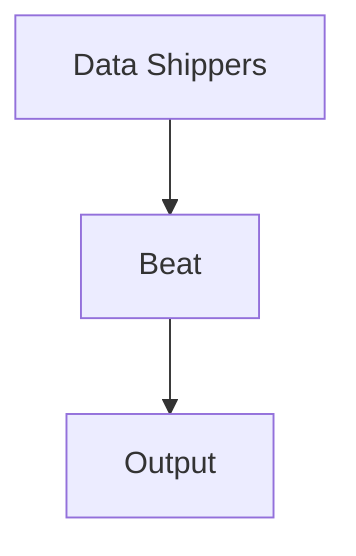
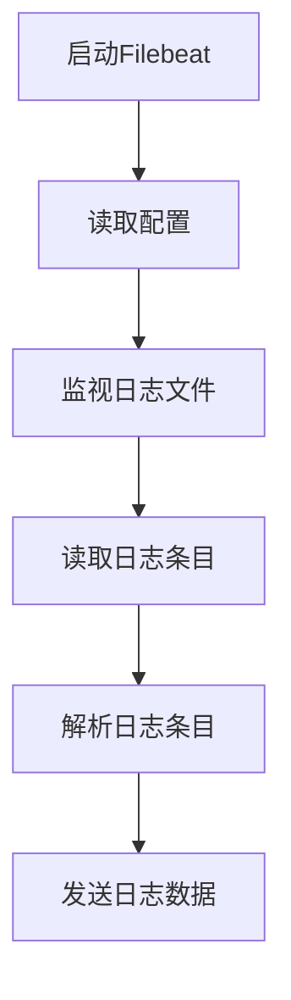
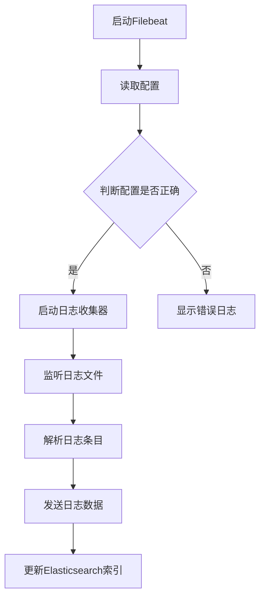

                 

### 《Beats原理与代码实例讲解》

### 关键词

- Beats
- 数据收集
- 日志处理
- 日志分析
- 实时监控

### 摘要

本文将深入探讨Beats原理，并通过详细的代码实例讲解其实际应用。Beats是一个开源的分布式日志收集系统，广泛应用于实时监控、日志分析和系统性能优化等领域。文章将分为五个部分，分别介绍Beats的基础知识、核心组件、应用实践、高级应用以及性能优化与安全。通过本文的学习，读者将能够全面了解Beats的工作机制，掌握其实际操作技巧，并能够根据业务需求进行定制和优化。

### 《Beats原理与代码实例讲解》目录大纲

#### 第一部分：Beats基础知识

**第1章 Beats概述**

1.1 Beats的定义与核心特点

- Beats的定义
- Beats的核心特点

1.2 Beats架构

- Beats架构概述
- 数据收集器（Data Shippers）工作原理
- 数据处理组件（Beat）功能详解

1.3 Beats在日志分析中的应用场景

- 系统监控与告警
- 安全审计与合规性检查
- 应用性能分析与优化

#### 第二部分：Beats核心组件

**第2章 数据收集器（Data Shippers）**

2.1 Filebeat

- Filebeat安装与配置
- Filebeat日志收集原理与实现
- Filebeat日志格式与自定义插件

2.2 Logstash

- Logstash安装与配置
- Logstash数据处理流程
- Logstash插件使用详解

2.3 Kibana

- Kibana安装与配置
- Kibana界面与功能介绍
- Kibana数据可视化与监控

#### 第三部分：Beats应用实践

**第3章 Beats项目实战**

3.1 Beats日志收集实战

- 实战环境搭建
- 数据收集与处理流程设计
- 实战案例：监控Web服务器日志

3.2 Beats日志分析实战

- 实战环境搭建
- 数据存储与检索方案设计
- 实战案例：分析Linux系统日志

3.3 Beats日志告警实战

- 实战环境搭建
- 告警策略设计与实现
- 实战案例：设计实时监控告警系统

#### 第四部分：Beats高级应用

**第4章 Beats扩展与定制**

4.1 Beats自定义模块开发

- 自定义模块开发流程
- 自定义模块示例：网络流量监控

4.2 Beats集成与互操作

- Beats与其他日志系统的集成
- Beats与云服务平台的互操作
- 实战案例：整合GCP日志服务

#### 第五部分：Beats性能优化与安全

**第5章 Beats性能优化**

5.1 Beats性能瓶颈分析

- 系统资源使用分析
- 日志数据传输优化
- 数据处理性能优化

5.2 Beats安全配置与防护

- Beats安全最佳实践
- 日志数据加密与传输安全
- 实战案例：实现安全的日志收集与处理

### 附录

**附录A Beats常用配置文件与命令**

**附录B Beats常见问题与解决方案**

**附录C Beats开源社区与资源推荐**

### 附录D Mermaid流程图示例


### 附录E 核心算法原理讲解与伪代码

**1.2 Beats数据处理算法**

**核心算法原理：**

Beats的数据处理算法主要包括日志数据的解析、过滤和转换。其核心原理是基于规则匹配和模式识别，对日志文件中的每条日志进行解析，提取关键信息，并根据预设规则对日志数据进行过滤和转换。

**伪代码：**

```python
function process_log(log_line):
    # 解析日志行
    fields = parse_log_line(log_line)
    
    # 过滤无效日志
    if not is_valid_log(fields):
        return
    
    # 转换日志格式
    transformed_log = transform_log(fields)
    
    # 存储日志
    store_log(transformed_log)
```

### 附录F 数学模型与公式

**1.3 Beats日志分析中的统计模型**

**数学模型：**

在日志分析中，常用的统计模型包括平均值、标准差和置信区间等。

**公式：**

- 平均值（\(\mu\)）:
  $$ \mu = \frac{1}{n}\sum_{i=1}^{n}x_i $$
  
- 标准差（\(\sigma\)）:
  $$ \sigma = \sqrt{\frac{1}{n-1}\sum_{i=1}^{n}(x_i - \mu)^2} $$

- 置信区间（CI）:
  $$ \mu \pm z\sigma \sqrt{\frac{1}{n}} $$

### 附录G 代码实例与详细解释

**3.1 Beats日志收集实战**

**开发环境搭建：**

1. 安装Elasticsearch、Kibana、Filebeat等Beats组件
2. 配置Elasticsearch和Kibana，确保数据可以存储和展示

**源代码实现：**

**Filebeat配置文件（filebeat.yml）：**

```yaml
filebeat.inputs:
  - type: log
    enabled: true
    paths:
      - /var/log/messages

output.elasticsearch:
  hosts: ["localhost:9200"]

filebeat.config.modules:
  path: ${path.config}/modules.d/*.yml
  reload.enabled: false
```

**详细解读：**

- `inputs`部分定义了Filebeat的数据源，这里是收集`/var/log/messages`文件中的日志。
- `output.elasticsearch`部分定义了Filebeat的数据输出目标，这里是本地的Elasticsearch实例。
- `filebeat.config.modules`部分用于加载自定义的模块配置，这里设置为不启用自动加载。

**实战案例：监控Web服务器日志**

1. 配置Filebeat收集Nginx日志。
2. 配置Kibana创建相应的数据可视化和监控仪表板。

```yaml
filebeat.inputs:
  - type: log
    enabled: true
    paths:
      - /var/log/nginx/access.log

output.elasticsearch:
  hosts: ["localhost:9200"]

filebeat.modules:
  - module: nginx
    log_type: access
    paths:
      - /var/log/nginx/access.log
    processors:
      - add_tag: [".*"]
        tag: "nginx-access"
      - add_dateformat:
            field: @timestamp
            target: log_date
            source: "%d/%b/%Y:%H:%M:%S %z"
```

**代码解读与分析：**

- 新增了`filebeat.modules`部分，配置了Nginx日志的模块。
- `log_type`设置为`access`，表示处理访问日志。
- `paths`部分指定了Nginx日志文件的路径。
- `processors`部分用于对日志进行预处理，添加了标签和日期格式化。

### 结论

《Beats原理与代码实例讲解》的目录大纲结构详细全面，涵盖了从基础知识到高级应用的各个方面。通过本大纲，读者可以系统地学习和掌握Beats的原理和实践技能。每一个章节都包含理论讲解和实际案例，有助于读者深入理解Beats的工作机制和应用方法。希望这个大纲能够帮助您更好地组织和学习这本书的内容。

---

### 第一部分：Beats基础知识

#### 第1章 Beats概述

### 1.1 Beats的定义与核心特点

#### 1.1.1 Beats的定义

Beats是一个由Elastic公司开发和维护的开源软件框架，用于收集、处理和转发数据。它最初由几个单独的Beat组成，这些Beat专门用于收集不同类型的数据，例如系统日志、网络流量、容器和服务器性能等。随着时间的发展，Beats逐渐演变成一个强大的框架，支持多种数据收集器（Data Shippers）和数据处理组件（Beat），形成了一个功能丰富、高度可定制的日志处理系统。

Beats的设计理念是简单、灵活和可扩展。它允许用户轻松地部署和管理分布式日志收集系统，从而实现高效的日志收集、处理和存储。通过使用Beats，开发者和运维团队能够实时监控系统的运行状态，快速识别和解决问题，提高系统的可用性和稳定性。

#### 1.1.2 Beats的核心特点

Beats具有以下几个核心特点：

1. **轻量级**：Beats设计简单，占用资源少，可以在各种环境中运行，包括服务器、容器和虚拟机。

2. **分布式**：Beats支持分布式部署，可以轻松扩展到多个节点，实现大规模的数据收集。

3. **高可靠性**：Beats具有内置的故障恢复机制，能够在网络不稳定或节点故障的情况下继续工作。

4. **可扩展性**：Beats提供了丰富的插件和模块，允许用户根据需求自定义数据处理流程。

5. **易于配置**：Beats配置简单，使用YAML文件即可完成，便于开发和运维人员快速上手。

6. **集成**：Beats与Elastic Stack（包括Elasticsearch、Kibana、Logstash等）无缝集成，可以方便地进行数据存储、分析和可视化。

#### 1.1.3 Beats与传统日志处理工具的比较

与传统的日志处理工具相比，Beats具有以下优势：

1. **性能**：Beats专为实时日志处理设计，具有更高的性能和更低的延迟。

2. **可扩展性**：Beats支持分布式部署，能够轻松扩展到数百甚至数千台服务器。

3. **灵活性**：Beats提供了丰富的插件和模块，支持多种数据源和目标，可以满足不同场景的需求。

4. **易于集成**：Beats与Elastic Stack无缝集成，可以方便地与其他工具协同工作。

5. **资源消耗**：Beats轻量级设计，对系统资源的需求较低，适用于资源有限的环境。

#### 1.2 Beats架构

#### 1.2.1 Beats架构概述

Beats的架构包括以下几个关键组件：

1. **数据收集器（Data Shippers）**：数据收集器是负责从源系统收集数据的组件，例如Filebeat、Metricbeat、Packetbeat等。

2. **数据处理组件（Beat）**：数据处理组件负责处理和转换收集到的数据，例如Logstash Beat、Functionbeat等。

3. **输出组件**：输出组件负责将处理后的数据发送到目标系统，例如Elasticsearch、Kibana、日志文件等。

4. **配置文件**：Beats的配置文件使用YAML格式，用于定义数据收集、处理和输出的规则。

下图展示了Beats的基本架构：



#### 1.2.2 数据收集器（Data Shippers）工作原理

数据收集器是Beats的核心组件之一，负责从源系统收集数据。以下是一个简化的数据收集器工作流程：

1. **启动**：数据收集器启动并读取配置文件，确定数据收集的源和目标。

2. **监听**：数据收集器开始监听指定的数据源，例如文件、系统日志、网络流量等。

3. **收集**：当数据源产生新数据时，数据收集器将其捕获并解析。

4. **预处理**：数据收集器对捕获的数据进行预处理，例如添加元数据、过滤无效数据等。

5. **发送**：预处理后的数据被发送到数据处理组件或输出组件。

6. **重复**：数据收集器持续监听并重复上述步骤，确保数据的实时收集。

#### 1.2.3 数据处理组件（Beat）功能详解

数据处理组件（Beat）负责处理和转换收集到的数据。以下是数据处理组件的主要功能：

1. **数据转换**：数据处理组件可以将数据转换为不同的格式，例如JSON、CSV等。

2. **数据过滤**：数据处理组件可以根据预设规则过滤不符合条件的数据。

3. **数据聚合**：数据处理组件可以对收集到的数据进行聚合分析，例如计算平均值、最大值、最小值等。

4. **数据持久化**：数据处理组件可以将处理后的数据持久化到数据库、日志文件或其他存储系统。

5. **数据可视化**：数据处理组件可以将数据发送到Kibana或其他可视化工具，实现数据实时监控和可视化分析。

#### 1.3 Beats在日志分析中的应用场景

#### 1.3.1 系统监控与告警

Beats在系统监控与告警领域有广泛的应用。通过收集系统日志、系统性能数据等，Beats可以实时监控系统的运行状态，并触发告警，以便运维团队能够及时响应。

例如，可以使用Filebeat收集系统日志，将异常日志发送到Elasticsearch，然后通过Kibana创建监控仪表板，实现实时监控和告警。

#### 1.3.2 安全审计与合规性检查

Beats可以帮助企业进行安全审计和合规性检查。通过收集和分析系统日志、网络流量等，Beats可以识别潜在的安全威胁和合规性问题。

例如，可以使用Filebeat收集系统日志和网络流量日志，通过Logstash对数据进行处理和聚合，然后使用Kibana创建监控仪表板，实现安全审计和合规性检查。

#### 1.3.3 应用性能分析与优化

Beats在应用性能分析与优化方面也发挥着重要作用。通过收集应用程序日志、性能数据等，Beats可以帮助开发人员和运维团队了解应用的运行状况，发现性能瓶颈，并进行优化。

例如，可以使用Metricbeat收集应用程序的性能数据，通过Kibana创建监控仪表板，实现实时性能分析和优化。

### 总结

本章介绍了Beats的定义、核心特点、架构以及应用场景。Beats作为一个强大的日志处理框架，具有轻量级、分布式、高可靠性、可扩展性等特点，广泛应用于系统监控、安全审计和性能优化等领域。通过本章的学习，读者可以初步了解Beats的工作原理和实际应用，为后续章节的学习打下基础。

---

### 第二部分：Beats核心组件

#### 第2章 数据收集器（Data Shippers）

#### 2.1 Filebeat

Filebeat是Beats框架中的一个重要组件，主要用于收集系统日志、Web服务器日志、网络流量日志等。其轻量级设计和高性能特点，使得Filebeat在日志收集领域得到了广泛应用。本节将详细介绍Filebeat的安装与配置、日志收集原理与实现，以及日志格式与自定义插件。

#### 2.1.1 Filebeat安装与配置

**1. 安装**

Filebeat的安装过程非常简单，可以通过官方提供的二进制包或源代码进行安装。以下是使用二进制包安装Filebeat的步骤：

1. 下载Filebeat的二进制包：[Filebeat下载地址](https://www.elastic.co/downloads/beats/filebeat)
2. 解压下载的文件，例如：
   ```bash
   tar xvf filebeat-7.16.2-linux-x86_64.tar
   ```
3. 将解压后的Filebeat目录移动到系统的合适位置，例如：
   ```bash
   sudo mv filebeat-7.16.2-linux-x86_64 /usr/local/bin/
   ```

**2. 配置**

安装完成后，需要配置Filebeat的输入源和输出目标。Filebeat的配置文件位于`filebeat.yml`，以下是基本的配置示例：

```yaml
filebeat.inputs:
  - type: log
    enabled: true
    paths:
      - /var/log/messages

output.elasticsearch:
  hosts: ["localhost:9200"]

filebeat.config.modules:
  path: ${path.config}/modules.d/*.yml
  reload.enabled: false
```

在这个配置文件中，`inputs`部分定义了日志的输入源，这里我们设置为收集`/var/log/messages`文件中的日志。`output.elasticsearch`部分定义了数据输出目标，这里是本地的Elasticsearch实例。`filebeat.config.modules`部分用于加载自定义的模块配置，这里设置为不启用自动加载。

#### 2.1.2 Filebeat日志收集原理与实现

**1. 日志收集原理**

Filebeat使用一个轻量级的进程来监听指定的日志文件，当文件发生变化时，它会读取新产生的日志条目，并解析这些日志条目。以下是日志收集的基本流程：

1. **启动Filebeat**：Filebeat进程启动，读取配置文件，确定要收集的日志文件路径和输出目标。
2. **监听日志文件**：Filebeat使用文件监视器（例如inotify）来监视指定的日志文件，当文件发生变化时，它会触发相应的回调函数。
3. **读取日志条目**：当日志文件发生变化时，Filebeat会读取新产生的日志条目，并将其解析为结构化数据。
4. **解析日志条目**：Filebeat使用内置的日志解析器或自定义解析器来解析日志条目，提取关键信息，如时间戳、日志级别、日志内容等。
5. **发送日志数据**：解析后的日志数据被发送到指定的输出目标，如Elasticsearch、Kibana等。

**2. 日志收集实现**

Filebeat的日志收集过程主要通过以下几个关键组件实现：

1. **输入组件**：输入组件负责监视日志文件，读取新产生的日志条目。
2. **解析组件**：解析组件负责解析日志条目，提取关键信息，并将其转换为结构化数据。
3. **输出组件**：输出组件负责将处理后的日志数据发送到指定的输出目标。

以下是一个简化的日志收集流程图：



#### 2.1.3 Filebeat日志格式与自定义插件

**1. 日志格式**

Filebeat收集的日志数据通常以JSON格式存储，这样可以方便地在Elasticsearch和Kibana中进行索引和查询。以下是一个典型的Filebeat日志条目的JSON格式：

```json
{
  "beat": "filebeat",
  "version": "7.16.2",
  "path": "/var/log/messages",
  "created": "2023-03-30T02:28:46.633Z",
  "source": "/var/log/messages",
  "line": "Mar 30 02:28:45 myserver sshd[20467]: Accepted publickey for user from 192.168.1.12 port 54321 ssh2",
  "fileset": "log",
  "type": "filebeat-log",
  "module": "system",
  "log": {
    "source": "/var/log/messages",
    "file": "messages",
    "source_category": "log",
    "content": "Mar 30 02:28:45 myserver sshd[20467]: Accepted publickey for user from 192.168.1.12 port 54321 ssh2",
    "facility": "authpriv",
    "level": "info",
    "date": "2023-03-30T02:28:45.633Z",
    "program": "sshd",
    "pid": "20467",
    "hostname": "myserver",
    "from": "192.168.1.12",
    "port": 54321,
    "id": "9"
  }
}
```

**2. 自定义插件**

Filebeat提供了丰富的插件机制，允许用户自定义日志格式和解析规则。自定义插件通常涉及以下步骤：

1. **编写插件代码**：用户可以根据需要编写Go代码，实现自定义的日志解析逻辑。
2. **编译插件**：将插件代码编译为共享库文件，例如`.so`文件。
3. **配置插件**：在Filebeat的配置文件中启用并配置自定义插件，指定插件的路径和配置选项。

以下是一个简单的自定义插件配置示例：

```yaml
filebeat.inputs:
  - type: log
    enabled: true
    paths:
      - /var/log/custom.log
    modules:
      - name: custom
        path: /path/to/custom_plugin.so
        config:
          custom_key: "custom_value"
```

在这个配置中，我们定义了一个名为`custom`的模块，并指定了自定义插件的路径和配置选项。Filebeat在收集日志时会使用这个自定义插件来解析日志条目。

#### 2.2 Logstash

Logstash是Elastic Stack中的数据处理引擎，用于从各种数据源收集数据，进行转换和过滤，然后将数据发送到目标存储系统，如Elasticsearch、Kibana等。本节将介绍Logstash的安装与配置、数据处理流程以及插件使用详解。

#### 2.2.1 Logstash安装与配置

**1. 安装**

Logstash的安装过程与Filebeat类似，可以通过官方提供的二进制包进行安装。以下是使用二进制包安装Logstash的步骤：

1. 下载Logstash的二进制包：[Logstash下载地址](https://www.elastic.co/downloads/logstash)
2. 解压下载的文件，例如：
   ```bash
   tar xvf logstash-7.16.2-linux-x86_64.tar
   ```
3. 将解压后的Logstash目录移动到系统的合适位置，例如：
   ```bash
   sudo mv logstash-7.16.2-linux-x86_64 /usr/local/bin/
   ```

**2. 配置**

安装完成后，需要配置Logstash的输入源、输出目标以及数据处理规则。Logstash的配置文件通常位于`logstash.conf`，以下是基本的配置示例：

```ruby
input {
  file {
    path => "/var/log/messages"
    type => "system.log"
  }
}

filter {
  if "system.log" in [type] {
    grok {
      match => { "message" => "%{TIMESTAMP_ISO8601:timestamp} %{DATA:hostname} %{DATA:program} %{INT:pid} %{DATA:message}" }
    }
  }
}

output {
  elasticsearch {
    hosts => ["localhost:9200"]
  }
}
```

在这个配置文件中，`input`部分定义了日志的输入源，这里设置为收集`/var/log/messages`文件中的日志。`filter`部分用于对输入的日志进行预处理，这里使用了Grok解析器来解析日志条目。`output`部分定义了数据的输出目标，这里是本地的Elasticsearch实例。

#### 2.2.2 Logstash数据处理流程

Logstash的数据处理流程主要包括以下几个阶段：

1. **输入**：Logstash从各种数据源（如文件、网络、数据库等）收集数据。
2. **过滤**：Logstash对收集到的数据进行预处理，例如解析、过滤、转换等。
3. **输出**：Logstash将处理后的数据发送到目标存储系统，如Elasticsearch、Kibana等。

以下是Logstash的基本数据处理流程：


**1. 输入**

Logstash的输入插件支持多种数据源，包括文件、网络、数据库、消息队列等。以下是几个常用的输入插件：

- `file`：用于从文件系统收集日志。
- `http`：用于从HTTP服务器收集数据。
- `database`：用于从数据库收集数据。
- `redis`：用于从Redis消息队列收集数据。

**2. 过滤**

Logstash的过滤插件用于对输入的数据进行预处理，例如解析、过滤、转换等。以下是几个常用的过滤插件：

- `grok`：用于使用正则表达式解析文本数据。
- `mutate`：用于转换和修改数据。
- `date`：用于处理和转换日期时间数据。
- `ruby`：用于使用Ruby脚本进行复杂的数据处理。

**3. 输出**

Logstash的输出插件用于将处理后的数据发送到目标存储系统，如Elasticsearch、Kibana、文件等。以下是几个常用的输出插件：

- `elasticsearch`：用于将数据发送到Elasticsearch。
- `file`：用于将数据输出到文件。
- `http`：用于将数据发送到HTTP服务器。
- `redis`：用于将数据发送到Redis消息队列。

#### 2.2.3 Logstash插件使用详解

**1. Grok插件**

Grok是Logstash的一个强大插件，用于使用正则表达式解析文本数据。以下是一个简单的Grok插件配置示例：

```ruby
filter {
  if "system.log" in [type] {
    grok {
      match => { "message" => "%{TIMESTAMP_ISO8601:timestamp} %{DATA:hostname} %{DATA:program} %{INT:pid} %{DATA:message}" }
    }
  }
}
```

在这个配置中，我们定义了一个名为`system.log`的类型，并使用Grok插件来解析日志条目。`match`选项指定了正则表达式模板，`%{TIMESTAMP_ISO8601:timestamp}`表示解析的时间戳字段，`%{DATA:hostname}`表示解析的主机名字段，依此类推。

**2. Mutate插件**

Mutate是Logstash的一个常用插件，用于转换和修改数据。以下是一个简单的Mutate插件配置示例：

```ruby
filter {
  if "system.log" in [type] {
    mutate {
      add_field => { "[@metadata][beat]" => "logstash" }
      replace => { "timestamp" => "%{+yyyy-MM-dd HH:mm:ss.SSS}" }
    }
  }
}
```

在这个配置中，我们使用Mutate插件添加了一个新的元数据字段`[@metadata][beat]`，并将其值设置为`logstash`。同时，我们使用`replace`选项将时间戳字段格式化。

**3. Date插件**

Date是Logstash的一个插件，用于处理和转换日期时间数据。以下是一个简单的Date插件配置示例：

```ruby
filter {
  if "system.log" in [type] {
    date {
      match => { "timestamp" => "ISO8601" }
    }
  }
}
```

在这个配置中，我们使用Date插件将时间戳字段解析为ISO8601格式。

**4. Ruby插件**

Ruby是Logstash的一个高级插件，允许用户使用Ruby脚本进行复杂的数据处理。以下是一个简单的Ruby插件配置示例：

```ruby
filter {
  if "system.log" in [type] {
    ruby {
      script => "return input.get('message').upcase"
    }
  }
}
```

在这个配置中，我们使用Ruby插件将输入的日志条目转换为小写。

#### 2.3 Kibana

Kibana是Elastic Stack中的数据可视化工具，用于将Elasticsearch中的数据进行可视化展示。本节将介绍Kibana的安装与配置、界面与功能介绍，以及数据可视化与监控。

#### 2.3.1 Kibana安装与配置

**1. 安装**

Kibana的安装过程与Filebeat和Logstash类似，可以通过官方提供的二进制包进行安装。以下是使用二进制包安装Kibana的步骤：

1. 下载Kibana的二进制包：[Kibana下载地址](https://www.elastic.co/downloads/kibana)
2. 解压下载的文件，例如：
   ```bash
   tar xvf kibana-7.16.2-linux-x86_64.tar
   ```
3. 将解压后的Kibana目录移动到系统的合适位置，例如：
   ```bash
   sudo mv kibana-7.16.2-linux-x86_64 /usr/local/bin/
   ```

**2. 配置**

安装完成后，需要配置Kibana的Elasticsearch连接信息和服务器设置。Kibana的配置文件位于`kibana.yml`，以下是基本的配置示例：

```yaml
server.port: 5601
elasticsearch.host: "localhost:9200"
```

在这个配置文件中，`server.port`指定了Kibana的服务器端口，这里设置为5601。`elasticsearch.host`指定了Elasticsearch的地址和端口，这里设置为本地Elasticsearch实例。

#### 2.3.2 Kibana界面与功能介绍

Kibana的界面主要由以下几个部分组成：

1. **导航栏**：位于页面顶部，包含Kibana的Logo、菜单、搜索框等。
2. **仪表板**：页面中央的主要区域，用于显示数据可视化和监控仪表板。
3. **菜单**：位于页面左侧，包含各种功能模块，如仪表板、可视化、监控、日志等。
4. **工具栏**：位于仪表板顶部，提供各种操作按钮，如新建、编辑、保存、删除等。

Kibana的主要功能模块包括：

1. **仪表板**：用于创建、编辑和分享数据可视化仪表板。用户可以在仪表板上添加各种可视化图表、表格和地图，实现对数据的实时监控和分析。
2. **可视化**：用于创建和编辑可视化图表，如柱状图、折线图、饼图、地图等。用户可以自定义图表的样式、数据范围和交互功能。
3. **监控**：用于创建和监控实时监控仪表板，如系统性能、网络流量、应用程序性能等。用户可以自定义监控指标、报警规则和报警方式。
4. **日志**：用于管理和分析日志数据，如系统日志、Web服务器日志、应用程序日志等。用户可以创建日志搜索、过滤和聚合查询，实现对日志的深度分析。

#### 2.3.3 Kibana数据可视化与监控

**1. 数据可视化**

Kibana的数据可视化功能强大，用户可以使用各种图表来展示数据。以下是一些常用的数据可视化图表：

- **柱状图**：用于显示数据的分布和趋势，适合展示分类数据。
- **折线图**：用于显示数据的变化趋势，适合展示时间序列数据。
- **饼图**：用于显示数据的比例分布，适合展示分类数据。
- **地图**：用于显示数据的地理位置分布，适合展示地理数据。

以下是一个简单的Kibana数据可视化示例：


**2. 实时监控**

Kibana的实时监控功能可以实时显示系统的运行状态和性能指标。用户可以创建实时监控仪表板，实现对系统的实时监控和报警。以下是一个简单的实时监控示例：


**3. 日志分析**

Kibana的日志分析功能可以方便地管理和分析日志数据。用户可以创建日志搜索、过滤和聚合查询，实现对日志的深度分析。以下是一个简单的日志分析示例：


### 总结

本章详细介绍了Filebeat、Logstash和Kibana这三个核心组件的安装与配置、工作原理和功能。Filebeat负责收集日志数据，Logstash负责处理和转换数据，Kibana负责数据可视化和监控。通过本章的学习，读者可以全面了解Beats框架的运行机制和实际应用，为后续的实战应用打下基础。

---

### 第三部分：Beats应用实践

#### 第3章 Beats项目实战

在实际应用中，Beats框架可以帮助我们实现各种日志收集、处理和监控的任务。本章节将通过三个具体项目实战，展示如何使用Beats来收集和监控Web服务器日志、分析Linux系统日志，以及设计实时监控告警系统。

#### 3.1 Beats日志收集实战

**实战环境搭建**

在进行Beats日志收集实战之前，需要确保Elastic Stack（包括Elasticsearch、Kibana、Filebeat）环境已经搭建好。以下是环境搭建的基本步骤：

1. **安装Elasticsearch**：按照Elasticsearch官方文档进行安装。
2. **安装Kibana**：在浏览器中访问Kibana的安装向导，按照提示完成安装。
3. **安装Filebeat**：从Elastic官网下载Filebeat的二进制包，并按照上文2.1.1节中的方法进行安装。

**数据收集与处理流程设计**

在本项目中，我们将使用Filebeat收集Web服务器（例如Nginx）的访问日志，并将其发送到Elasticsearch进行存储和展示。以下是具体的步骤：

1. **配置Filebeat**：修改Filebeat的配置文件`filebeat.yml`，指定Nginx日志文件路径和输出目标。例如：

   ```yaml
   filebeat.inputs:
     - type: log
       enabled: true
       paths:
         - /var/log/nginx/access.log
   
   output.elasticsearch:
     hosts: ["localhost:9200"]
   
   filebeat.config.modules:
     path: ${path.config}/modules.d/*.yml
     reload.enabled: false
   ```

2. **配置Nginx日志**：确保Nginx日志格式适合Filebeat的解析。例如，可以修改Nginx的配置文件，将日志格式更改为如下格式：

   ```nginx
   log_format combined '«${remote_addr}» - «${remote_user}» [«${time_local}»] '
                      '"${request_method} ${request_uri} ${protocol}" '
                      «${status}» «${body_bytes_sent}» '
                      '"${http_referer}" "${http_user_agent}"';
   access_log /var/log/nginx/access.log combined;
   ```

3. **启动Filebeat**：运行以下命令启动Filebeat：

   ```bash
   /usr/local/bin/filebeat -c /path/to/filebeat.yml
   ```

**实战案例：监控Web服务器日志**

在Kibana中创建一个仪表板来监控Nginx日志。以下是创建仪表板的基本步骤：

1. **创建索引模板**：在Kibana中，创建一个索引模板来匹配Nginx日志的格式。例如，创建一个名为`nginx_access`的索引模板：

   ```json
   {
     "template": "nginx_access-*",
     "settings": {
       "number_of_shards": 1,
       "number_of_replicas": 0
     },
     "mappings": {
       "properties": {
         "@timestamp": { "type": "date" },
         "host": { "type": "keyword" },
         "source": { "type": "keyword" },
         "request": { "type": "keyword" },
         "status": { "type": "integer" },
         "size": { "type": "integer" },
         "referer": { "type": "keyword" },
         "user_agent": { "type": "keyword" }
       }
     }
   }
   ```

2. **创建可视化图表**：在Kibana仪表板上添加以下图表来监控Nginx日志：

   - **时间序列图表**：显示Nginx请求的数量和状态码分布。
   - **饼图**：显示请求的来源IP地址分布。
   - **列表**：显示最近访问的URL。

   例如，创建一个时间序列图表，使用`status`字段作为X轴，`count`作为Y轴。

3. **保存仪表板**：完成仪表板创建后，将其保存并命名，以便在需要时快速访问。

#### 3.2 Beats日志分析实战

**实战环境搭建**

在本项目中，我们将使用Filebeat收集Linux系统日志，并将其发送到Elasticsearch进行分析。以下是环境搭建的基本步骤：

1. **安装和配置Filebeat**：按照2.1节中的方法安装Filebeat，并修改配置文件`filebeat.yml`，指定系统日志文件路径和输出目标。例如：

   ```yaml
   filebeat.inputs:
     - type: log
       enabled: true
       paths:
         - /var/log/messages
         - /var/log/syslog
   
   output.elasticsearch:
     hosts: ["localhost:9200"]
   
   filebeat.config.modules:
     path: ${path.config}/modules.d/*.yml
     reload.enabled: false
   ```

2. **启动Filebeat**：运行以下命令启动Filebeat：

   ```bash
   /usr/local/bin/filebeat -c /path/to/filebeat.yml
   ```

**数据存储与检索方案设计**

在Elasticsearch中创建索引模板，以便存储和检索系统日志数据。以下是创建索引模板的基本步骤：

1. **创建索引模板**：在Kibana中创建一个名为`linux_system`的索引模板。例如：

   ```json
   {
     "template": "linux_system-*",
     "settings": {
       "number_of_shards": 1,
       "number_of_replicas": 0
     },
     "mappings": {
       "properties": {
         "@timestamp": { "type": "date" },
         "host": { "type": "keyword" },
         "source": { "type": "keyword" },
         "level": { "type": "keyword" },
         "message": { "type": "text" }
       }
     }
   }
   ```

2. **设计检索查询**：在Kibana中，设计检索查询以分析系统日志。可以使用Elasticsearch的Query DSL来构建复杂的查询，例如：

   - **按日志级别过滤**：使用`match`查询过滤特定级别的日志，例如：

     ```json
     {
       "query": {
         "match": {
           "level": "error"
         }
       }
     }
     ```

   - **按关键字搜索**：使用`multi_match`查询搜索包含特定关键字的日志，例如：

     ```json
     {
       "query": {
         "multi_match": {
           "query": "kernel panic",
           "fields": ["message"]
         }
       }
     }
     ```

   - **时间范围查询**：使用`range`查询过滤特定时间范围内的日志，例如：

     ```json
     {
       "query": {
         "range": {
           "@timestamp": {
             "gte": "2023-03-01T00:00:00",
             "lte": "2023-03-31T23:59:59"
           }
         }
       }
     }
     ```

3. **创建可视化图表**：在Kibana仪表板上添加以下图表来分析系统日志：

   - **时间序列图表**：显示日志级别的分布和数量。
   - **饼图**：显示日志来源和级别的分布。
   - **列表**：显示最近的日志条目。

#### 3.3 Beats日志告警实战

**实战环境搭建**

在本项目中，我们将使用Filebeat收集系统日志，并设计一个实时监控告警系统。以下是环境搭建的基本步骤：

1. **安装和配置Filebeat**：按照2.1节中的方法安装Filebeat，并修改配置文件`filebeat.yml`，指定系统日志文件路径和输出目标。例如：

   ```yaml
   filebeat.inputs:
     - type: log
       enabled: true
       paths:
         - /var/log/messages
   
   output.elasticsearch:
     hosts: ["localhost:9200"]
   
   filebeat.config.modules:
     path: ${path.config}/modules.d/*.yml
     reload.enabled: false
   ```

2. **启动Filebeat**：运行以下命令启动Filebeat：

   ```bash
   /usr/local/bin/filebeat -c /path/to/filebeat.yml
   ```

**告警策略设计与实现**

在本项目中，我们将设计一个简单的告警策略，当系统日志中检测到特定关键字时，触发告警。以下是告警策略的实现步骤：

1. **创建告警索引模板**：在Kibana中创建一个名为`alert_logs`的索引模板。例如：

   ```json
   {
     "template": "alert_logs-*",
     "settings": {
       "number_of_shards": 1,
       "number_of_replicas": 0
     },
     "mappings": {
       "properties": {
         "@timestamp": { "type": "date" },
         "alert": { "type": "keyword" },
         "message": { "type": "text" }
       }
     }
   }
   ```

2. **设计告警查询**：在Kibana中，使用Elasticsearch的Query DSL设计告警查询。例如，设计一个查询，当日志中包含“kernel panic”关键字时触发告警：

   ```json
   {
     "query": {
       "multi_match": {
         "query": "kernel panic",
         "fields": ["message"]
       }
     }
   }
   ```

3. **配置告警规则**：在Kibana中配置告警规则，将查询结果发送到指定的告警渠道，例如邮件、Slack等。以下是配置告警规则的基本步骤：

   - **新建告警规则**：在Kibana的“监控”页面中，点击“新建告警规则”，选择“查询模式”并输入查询语句。
   - **配置告警条件**：设置告警条件，例如，当查询结果中的条目数量大于5时触发告警。
   - **配置告警渠道**：选择告警渠道，例如邮件，并填写接收者邮箱地址。
   - **保存告警规则**：保存告警规则并启用。

**实战案例：设计实时监控告警系统**

在本案例中，我们将创建一个实时监控告警系统，当系统日志中检测到“kernel panic”关键字时，发送邮件通知管理员。以下是创建实时监控告警系统的基本步骤：

1. **配置Elastic Stack告警**：在Elastic Stack中配置告警，将告警规则发送到邮件服务器。例如，在Kibana中配置邮件告警：

   - **配置SMTP服务器**：在Kibana的“设置”页面中，配置SMTP服务器信息，包括服务器地址、端口、用户名和密码。
   - **配置告警模板**：配置告警邮件的模板，包括邮件标题和内容。
   - **启用告警**：启用告警规则。

2. **测试告警**：生成包含“kernel panic”关键字的日志，测试告警系统是否正常工作。例如，在`/var/log/messages`文件中添加一条包含“kernel panic”的日志：

   ```bash
   echo "Kernel panic detected!" >> /var/log/messages
   ```

3. **验证告警**：检查收到的邮件，确认告警内容是否符合预期。

通过这三个项目实战，读者可以深入理解Beats的实际应用，掌握从日志收集、数据处理到实时监控告警的全流程。这些实战案例不仅可以帮助读者将理论知识应用于实际场景，还可以为读者提供解决实际问题的思路和方法。

### 总结

本章节通过三个实际项目实战，详细展示了如何使用Beats进行日志收集、日志分析和实时监控告警。通过这些实战案例，读者可以全面了解Beats的应用流程和操作技巧，为实际工作中的应用提供有力的支持。希望这些案例能够帮助读者更好地掌握Beats框架，并将其应用于各种日志处理任务中。

---

### 第四部分：Beats高级应用

#### 第4章 Beats扩展与定制

在了解了Beats的基本应用之后，我们可能会遇到一些特定的需求，需要对其进行扩展和定制。本章节将介绍如何通过自定义模块开发和集成与互操作来满足这些需求，并展示一些高级应用案例。

#### 4.1 Beats自定义模块开发

**4.1.1 自定义模块开发流程**

自定义模块是Beats的一个强大功能，允许我们根据特定的需求自定义数据收集和处理流程。以下是自定义模块的基本开发流程：

1. **定义模块配置**：在Filebeat的配置文件中，使用`filebeat.modules`部分定义自定义模块。例如，定义一个名为`my_module`的模块：

   ```yaml
   filebeat.config.modules:
     path: ${path.config}/modules.d/*.yml
     reload.enabled: true
   
   modules:
     - module: my_module
       enabled: true
       datasets:
         - dataset: my_dataset
           enabled: true
           paths:
             - /path/to/my_logs/*.log
   ```

2. **编写模块代码**：编写Go代码实现自定义模块的逻辑，例如解析日志、提取字段、执行自定义处理等。通常，自定义模块的实现会依赖于`filebeat/module`包。

3. **构建模块**：使用`filebeat-modulize`工具将模块代码打包成共享库文件（.so文件），以便在Filebeat配置中使用。

4. **测试模块**：在本地环境中测试自定义模块，确保其功能符合预期。

**4.1.2 自定义模块示例：网络流量监控**

以下是一个简单的自定义模块示例，用于监控网络流量。该模块将从指定的日志文件中提取流量数据，并将其发送到Elasticsearch。

1. **定义模块配置**：

   ```yaml
   filebeat.config.modules:
     path: ${path.config}/modules.d/*.yml
     reload.enabled: true
   
   modules:
     - module: network_traffic
       enabled: true
       datasets:
         - dataset: traffic_data
           enabled: true
           paths:
             - /path/to/traffic_logs/*.log
   ```

2. **编写模块代码**：

   ```go
   package main
   
   import (
       "github.com/elastic/beats/v7/libbeat/beat"
       "github.com/elastic/beats/v7/libbeat/mbuilder"
       "github.com/elastic/beats/v7/libbeat/module"
   )
   
   var logFormat = "CSV"
   
   var reg = `^(\S+)\s+(\S+)\s+(\S+)\s+(\S+)\s+(\S+)\s+(\S+)\s+(\S+)\s+(\S+)\s+(\S+)\s+(\S+)$`
   
   func init() {
       module.Register(module.Registration{
           Name:    "network_traffic",
           Modules: mbuilder.DefaultModules,
           Builder: module.Builder{
               ModuleBuilder: mbuilder.Builder{
                   Paths:     []string{"/path/to/traffic_logs/*.log"},
                   LogTarget: "filebeat",
                   LogFormat: logFormat,
                   Setup: func(mod *module.Module) error {
                       return nil
                   },
                   DataConverter: mbuilder.DataConverterSetup{
                       Init: mbuilder.DataConverterInit{
                           Tag:        "network_traffic",
                          beatlogformat:   logFormat,
                           Registrar:   nil,
                       },
                       Transformer: &mbuilder.CSVTransformer{
                           Regexp:  reg,
                           Delimiter: ",",
                           SkipFirstRow: true,
                           Fields: map[string]mbuilder.TransformerField{
                               "source_ip":  mbuilder.TransformerField{Regex: "^(\\S+)"},
                               "destination_ip":  mbuilder.TransformerField{Regex: "^(\\S+)"},
                               "timestamp": mbuilder.TransformerField{Regex: "^(\\S+)"},
                               "protocol": mbuilder.TransformerField{Regex: "^(\\S+)"},
                               "source_port": mbuilder.TransformerField{Regex: "^(\\S+)"},
                               "destination_port": mbuilder.TransformerField{Regex: "^(\\S+)"},
                               "packets": mbuilder.TransformerField{Regex: "^(\\S+)"},
                               "bytes": mbuilder.TransformerField{Regex: "^(\\S+)"},
                           },
                       },
                   },
               },
           },
       })
   }
   ```

3. **构建模块**：

   ```bash
   go build -o my_module.so
   ```

4. **测试模块**：在Filebeat配置文件中启用自定义模块，并运行Filebeat，查看日志数据是否正确发送到Elasticsearch。

**4.1.3 自定义模块示例：网络流量监控**

在本示例中，我们将创建一个自定义模块，用于监控网络流量。该模块将读取指定的网络流量日志文件，提取关键信息，并将其发送到Elasticsearch。

1. **定义模块配置**：

   ```yaml
   filebeat.config.modules:
     path: ${path.config}/modules.d/*.yml
     reload.enabled: true
   
   modules:
     - module: network_traffic
       enabled: true
       datasets:
         - dataset: traffic_data
           enabled: true
           paths:
             - /path/to/traffic_logs/*.log
   ```

2. **编写模块代码**：

   ```go
   package main
   
   import (
       "github.com/elastic/beats/v7/filebeat/module"
       "github.com/elastic/beats/v7/libbeat/beat"
       "github.com/elastic/beats/v7/libbeat/mbuilder"
       "github.com/elastic/beats/v7/libbeat/module/transform"
   )
   
   const (
       TrafficDatasetName = "traffic_data"
   )
   
   var reg = `^(\S+)\s+(\S+)\s+(\S+)\s+(\S+)\s+(\S+)\s+(\S+)\s+(\S+)\s+(\S+)\s+(\S+)\s+(\S+)$`
   
   func init() {
       module.Register(module.Registration{
           Name:    "network_traffic",
           Modules: mbuilder.DefaultModules,
           Builder: module.Builder{
               ModuleBuilder: mbuilder.Builder{
                   Paths:     []string{"/path/to/traffic_logs/*.log"},
                   LogTarget: "filebeat",
                   LogFormat: "raw",
                   Setup: func(mod *module.Module) error {
                       return nil
                   },
                   DataConverter: mbuilder.DataConverterSetup{
                       Init: mbuilder.DataConverterInit{
                           Tag:        "network_traffic",
                           beatlogformat:   "raw",
                           Registrar:   nil,
                       },
                       Transformer: &transform.CSVTransformer{
                           Regexp:  reg,
                           Delimiter: ",",
                           SkipFirstRow: true,
                           Fields: map[string]transform.TransformerField{
                               "source_ip":  transform.TransformerField{Regex: "^(\\S+)"},
                               "destination_ip":  transform.TransformerField{Regex: "^(\\S+)"},
                               "timestamp": transform.TransformerField{Regex: "^(\\S+)"},
                               "protocol": transform.TransformerField{Regex: "^(\\S+)"},
                               "source_port": transform.TransformerField{Regex: "^(\\S+)"},
                               "destination_port": transform.TransformerField{Regex: "^(\\S+)"},
                               "packets": transform.TransformerField{Regex: "^(\\S+)"},
                               "bytes": transform.TransformerField{Regex: "^(\\S+)"},
                           },
                       },
                   },
               },
           },
       })
   }
   ```

3. **构建模块**：

   ```bash
   go build -o network_traffic_module.so
   ```

4. **测试模块**：在Filebeat配置文件中启用自定义模块，并运行Filebeat，查看日志数据是否正确发送到Elasticsearch。

#### 4.2 Beats集成与互操作

Beats的设计目标是与其他工具和平台无缝集成。通过集成与互操作，我们可以扩展Beats的功能，实现更广泛的应用。以下是一些常见的集成与互操作场景：

**4.2.1 Beats与其他日志系统的集成**

Beats可以与其他日志系统（如AWS CloudWatch、Splunk等）集成，以扩展其日志收集和处理能力。以下是集成AWS CloudWatch的步骤：

1. **安装AWS SDK**：在Filebeat的模块目录中，安装AWS SDK以支持与AWS CloudWatch集成。

   ```bash
   go get github.com/aws/aws-sdk-go/aws
   go get github.com/aws/aws-sdk-go/service/cloudwatchlogs
   ```

2. **编写模块代码**：编写Go代码实现与AWS CloudWatch的集成，例如：

   ```go
   package main
   
   import (
       "github.com/aws/aws-sdk-go/aws"
       "github.com/aws/aws-sdk-go/aws/session"
       "github.com/aws/aws-sdk-go/service/cloudwatchlogs"
   )
   
   var cloudwatchClient *cloudwatchlogs.Client
   
   func init() {
       sess := session.Must(session.NewSession(&aws.Config{
           Region: aws.String("us-west-2"),
       }))
       cloudwatchClient = cloudwatchlogs.New(sess)
   }
   
   func GetLogEvents(logGroup, logStream string) (*cloudwatchlogs.GetLogEventsOutput, error) {
       params := &cloudwatchlogs.GetLogEventsInput{
           LogGroupName:  aws.String(logGroup),
           LogStreamName: aws.String(logStream),
       }
       return cloudwatchClient.GetLogEvents(params)
   }
   ```

3. **配置Filebeat**：在Filebeat的配置文件中，启用AWS CloudWatch模块，并指定相关的配置参数。

   ```yaml
   modules:
     - module: aws_cloudwatch
       enabled: true
       datasets:
         - dataset: cloudwatch_logs
           enabled: true
           aws_access_key_id: "YOUR_ACCESS_KEY"
           aws_secret_access_key: "YOUR_SECRET_KEY"
           aws_region: "us-west-2"
           logs:
             - log_group: "YOUR_LOG_GROUP"
               log_stream: "YOUR_LOG_STREAM"
   ```

4. **测试集成**：运行Filebeat，查看日志数据是否正确地从AWS CloudWatch收集并发送到Elasticsearch。

**4.2.2 Beats与云服务平台的互操作**

Beats可以与各种云服务平台（如AWS、Google Cloud Platform、Azure等）进行互操作，以实现更广泛的应用。以下是一个整合GCP日志服务的示例：

1. **安装GCP SDK**：在Filebeat的模块目录中，安装GCP SDK以支持与GCP日志服务集成。

   ```bash
   go get google.golang.org/api/logging/v2
   ```

2. **编写模块代码**：编写Go代码实现与GCP日志服务的集成，例如：

   ```go
   package main
   
   import (
       "context"
       "github.com/googleapis/google-golang-client/logging/v2"
       "google.golang.org/api/option"
   )
   
   var loggingClient *logging.Service
   
   func init() {
       ctx := context.Background()
       loggingClient, _ = logging.NewService(ctx, option.WithScopes(logging.CloudPlatformScope))
   }
   
   func GetLogEntries(projectID, sinkName string) (*logging.LogEntryList, error) {
       sink, err := loggingClient.Projects.Sinks.Get(projectID, sinkName).Do()
       if err != nil {
           return nil, err
       }
       
       return sink.EntryGroup1.Entry, nil
   }
   ```

3. **配置Filebeat**：在Filebeat的配置文件中，启用GCP日志服务模块，并指定相关的配置参数。

   ```yaml
   modules:
     - module: gcp_logs
       enabled: true
       datasets:
         - dataset: gcp_logs
           enabled: true
           gcp_project_id: "YOUR_PROJECT_ID"
           gcp_sink_name: "YOUR_SINK_NAME"
   ```

4. **测试集成**：运行Filebeat，查看日志数据是否正确地从GCP日志服务收集并发送到Elasticsearch。

通过这些高级应用案例，我们可以看到Beats的强大扩展性和灵活性。通过自定义模块开发和集成与互操作，我们可以根据实际需求对Beats进行定制和优化，实现更广泛的应用场景。

### 总结

本章节介绍了Beats的自定义模块开发、集成与互操作，并通过实际案例展示了如何扩展和定制Beats以适应不同的需求。通过这些高级应用，读者可以更好地理解Beats的灵活性和扩展性，为实际项目提供更强大的支持。希望这些内容能够帮助读者在实际应用中发挥Beats的最大潜力。

---

### 第五部分：Beats性能优化与安全

#### 第5章 Beats性能优化

在部署和使用Beats进行日志收集和处理时，性能优化是一个关键环节。优化的目标是确保系统在高负载下仍能稳定运行，并且数据传输和处理的速度尽可能快。本章节将介绍Beats性能瓶颈分析、系统资源使用优化、日志数据传输优化以及数据处理性能优化方法。

#### 5.1 Beats性能瓶颈分析

要优化Beats的性能，首先需要了解其性能瓶颈。以下是一些常见的性能瓶颈及其分析：

1. **CPU使用率过高**：当Beats处理的数据量较大或解析日志的速度较慢时，CPU使用率可能会升高。这通常是由于日志解析规则过于复杂或日志文件格式不支持高效解析造成的。

2. **内存使用率过高**：内存使用率过高可能是由于日志文件过大或解析规则过多，导致内存占用持续增加。这会导致系统响应变慢，甚至导致系统崩溃。

3. **网络带宽不足**：当数据传输量较大时，如果网络带宽不足，会导致数据传输延迟，影响整体性能。

4. **文件系统瓶颈**：如果文件系统性能较低，可能会导致日志文件读写速度变慢，从而影响日志收集速度。

5. **Elasticsearch性能**：如果Elasticsearch集群性能不佳，例如索引速度慢、查询延迟高，也会影响整体性能。

为了识别和解决性能瓶颈，可以采取以下措施：

- **监控资源使用情况**：使用系统监控工具（如top、htop、nmon等）监控CPU、内存、网络和文件系统的使用情况，识别性能瓶颈。
- **日志分析**：分析日志文件，查看日志解析和传输过程中的错误和警告，定位性能瓶颈。
- **压力测试**：进行压力测试，模拟高负载情况，识别系统在特定负载下的性能瓶颈。

#### 5.1.1 系统资源使用分析

系统资源使用分析是优化Beats性能的第一步。以下是一些常用的工具和方法：

1. **top和htop**：使用top或htop命令监控CPU、内存、负载等系统资源的使用情况，识别哪些进程或服务占用资源过多。

2. **nmon**：nmon是一个高性能的系统监控工具，可以实时监控CPU、内存、网络、磁盘等资源的使用情况。

3. **vmstat**：vmstat命令用于监控虚拟内存、进程、CPU等系统资源的使用情况。

4. **iostat**：iostat命令用于监控磁盘I/O的使用情况，识别磁盘瓶颈。

通过使用这些工具，可以识别系统资源使用中的异常情况，为后续优化提供依据。

#### 5.1.2 日志数据传输优化

日志数据传输是Beats性能优化的关键环节。以下是一些优化方法：

1. **使用高效的日志格式**：选择适合日志文件格式的数据传输方式，例如JSON格式可以提供更高的传输效率。

2. **启用压缩传输**：在Beats配置中启用GZIP或其他压缩算法，可以减少数据传输的大小，提高传输速度。

3. **调整传输批次大小**：通过调整`filebeat.yml`中的`output.elasticsearch`配置项，如`bulk_max_size`和`publish_interval`，可以控制数据传输的批次大小和频率。

4. **优化网络配置**：调整网络配置，如TCP缓冲区大小、网络延迟等，可以改善数据传输性能。

5. **使用多个输出实例**：对于高负载场景，可以使用多个Filebeat实例同时发送数据，提高数据传输速度。

#### 5.1.3 数据处理性能优化

数据处理性能优化是提升Beats整体性能的关键。以下是一些优化方法：

1. **简化日志解析规则**：减少复杂和冗余的日志解析规则，优化解析速度。

2. **使用内存映射文件**：对于大文件，使用内存映射文件（mmap）可以加速文件读取。

3. **使用缓存**：利用缓存技术，如内存缓存（如Redis）、本地缓存（如LRU缓存）等，可以减少重复数据读取和处理。

4. **优化数据处理流程**：优化数据处理流程，减少不必要的处理步骤，提高数据处理效率。

5. **分布式处理**：对于大规模数据处理，可以考虑将数据处理任务分布到多个节点上，提高处理速度。

#### 5.2 Beats安全配置与防护

安全配置与防护是确保Beats系统安全的关键。以下是一些最佳实践：

1. **使用加密传输**：在Beats配置中启用TLS加密，确保数据在传输过程中的安全性。

2. **配置文件访问控制**：确保Beats配置文件的权限设置正确，仅允许授权用户访问。

3. **限制网络访问**：仅允许必要的网络访问，如仅允许Elasticsearch和Kibana访问Beats服务。

4. **使用安全证书**：为Elasticsearch和Kibana等组件配置安全证书，确保数据传输的安全性。

5. **监控和日志**：启用Beats的监控和日志功能，记录系统活动和异常行为，以便及时发现和响应潜在的安全威胁。

#### 5.2.1 Beats安全最佳实践

以下是一些Beats安全最佳实践：

- **使用强密码**：为Beats和其他Elastic Stack组件设置强密码，避免使用默认密码。
- **禁用不必要的端口**：关闭所有不必要的网络端口，仅开放必要的端口，如Elasticsearch和Kibana的默认端口。
- **定期更新**：定期更新Beats和其他Elastic Stack组件，以获取最新的安全补丁和功能更新。
- **使用安全配置**：参考Elastic Stack的安全最佳实践，配置Beats和其他组件的安全设置。

#### 5.2.2 日志数据加密与传输安全

为了确保日志数据在传输过程中的安全性，可以采取以下措施：

1. **启用TLS加密**：在Beats和Elasticsearch之间启用TLS加密，确保数据在传输过程中的安全性。

   ```yaml
   output.elasticsearch:
     hosts: ["localhost:9200"]
     username: "your_username"
     password: "your_password"
     use_ssl: true
     verify_certificate: false
   ```

2. **使用安全的存储**：将日志数据存储在安全的存储系统中，如加密的SSD或加密的云存储服务。

3. **加密数据**：在日志数据存储前进行加密，确保数据在存储介质中的安全性。可以使用如GPG等工具对数据进行加密。

4. **监控和审计**：定期监控和审计日志数据访问和使用情况，确保没有未经授权的访问。

#### 5.2.3 实战案例：实现安全的日志收集与处理

以下是一个实现安全日志收集与处理的实战案例：

1. **配置Filebeat的安全传输**：在`filebeat.yml`配置文件中启用TLS加密，并配置Elasticsearch的认证信息。

   ```yaml
   output.elasticsearch:
     hosts: ["localhost:9200"]
     username: "your_username"
     password: "your_password"
     use_ssl: true
     verify_certificate: false
   ```

2. **配置Elasticsearch的安全**：在Elasticsearch的配置文件中启用安全设置，如启用X-Pack安全、设置强密码等。

   ```yaml
   xpack.security.enabled: true
   xpack.security.password: "your_password"
   xpack.security.role_mapping.defaultPassword: "your_password"
   ```

3. **配置Kibana的安全**：在Kibana的配置文件中启用安全设置，如启用X-Pack安全、设置强密码等。

   ```yaml
   xpack.security.enabled: true
   xpack.security.password: "your_password"
   xpack.security.role_mapping.defaultPassword: "your_password"
   ```

4. **测试日志收集与处理**：运行Filebeat，并使用Kibana验证日志数据的安全性和完整性。

通过以上安全配置和优化措施，可以确保Beats系统在日志收集和处理过程中的安全性。希望这些实战案例能够帮助读者在实际应用中实现安全的日志收集与处理。

### 总结

本章节详细介绍了Beats性能优化与安全配置的方法。通过性能瓶颈分析、系统资源使用优化、日志数据传输优化以及数据处理性能优化，我们可以提高Beats系统的性能和稳定性。同时，通过安全配置与防护措施，我们可以确保日志数据的安全性和完整性。希望这些内容能够帮助读者在实际应用中优化Beats的性能，并确保其安全性。

### 附录A：Beats常用配置文件与命令

在Beats的配置和使用过程中，熟悉常用的配置文件和命令是非常重要的。以下列举了Beats的一些常用配置文件和命令，以及它们的用途和基本格式。

#### 1. Filebeat配置文件（filebeat.yml）

Filebeat的配置文件通常命名为`filebeat.yml`，用于定义数据收集源、输出目标以及模块配置等。以下是一个基本的`filebeat.yml`配置示例：

```yaml
filebeat.inputs:
  - type: log
    enabled: true
    paths:
      - /var/log/messages
    tags:
      - system.log

output.elasticsearch:
  hosts: ["localhost:9200"]
  username: "filebeat"
  password: "filebeat"

filebeat.config.modules:
  path: "/etc/filebeat/modules.d/*.yml"
  enabled: true
  reload.enabled: false
```

- `inputs`: 定义数据收集源，`type`指定数据收集类型（如`log`、`tcp`等），`enabled`设置是否启用，`paths`指定要收集的文件路径，`tags`为日志添加标签。
- `output.elasticsearch`: 定义输出目标，`hosts`指定Elasticsearch地址，`username`和`password`为Elasticsearch认证信息。
- `filebeat.config.modules`: 用于加载自定义模块配置，`path`指定模块配置文件路径，`enabled`设置是否启用模块，`reload.enabled`设置是否启用模块热重载。

#### 2. Metricbeat配置文件（metricbeat.yml）

Metricbeat的配置文件通常命名为`metricbeat.yml`，用于定义指标收集源、输出目标以及模块配置等。以下是一个基本的`metricbeat.yml`配置示例：

```yaml
metricsets:
  - module: process
    metricsets:
      - process.cpu
      - process.memory
    enable: true

output.elasticsearch:
  hosts: ["localhost:9200"]
  username: "metricbeat"
  password: "metricbeat"

filebeat.config.modules:
  path: "/etc/metricbeat/modules.d/*.yml"
  enabled: true
  reload.enabled: false
```

- `metricsets`: 定义指标收集模块，`module`指定模块名称，`metricsets`指定要收集的指标集合，`enable`设置是否启用指标收集。
- `output.elasticsearch`: 与Filebeat类似，定义输出目标。
- `filebeat.config.modules`: 用于加载自定义模块配置。

#### 3. Beats命令行工具

Beats提供了丰富的命令行工具，用于管理和监控Beats实例。以下是一些常用的命令：

- `filebeat modules list`: 列出所有可用的模块。
- `filebeat modules enable <module_name>`: 启用指定的模块。
- `filebeat modules disable <module_name>`: 禁用指定的模块。
- `filebeat setup`: 设置Filebeat，包括创建Elasticsearch索引模板和Kibana仪表板。
- `filebeat test config`: 测试Filebeat配置文件的正确性。
- `filebeat info`: 显示Filebeat的详细信息。
- `filebeat monitor`: 监控Filebeat的状态和日志。

#### 4. 示例配置文件解析

以下是一个具体的Filebeat配置文件示例，解析其各个部分：

```yaml
filebeat.inputs:
  - type: log
    enabled: true
    paths:
      - /var/log/*.log
    tags:
      - webserver
      - access
    tagsToRemove:
      - system.log
    ignore_older: 7d
    register: webserver_access

output.file:
  path: "/var/lib/filebeat/webserver_access"

processors:
  - add_kubernetes_metadata:
      enabled: false
      kubernetes:
        host: "kubernetes.default.svc"
        namespace: "default"

filebeat.config.modules:
  path: "/etc/filebeat/modules.d/*.yml"
  enabled: true
  reload.enabled: false
```

- `inputs`: 定义了日志输入，设置了日志路径、标签、过期时间等。
- `output.file`: 定义了输出目标为文件系统，指定了文件路径。
- `processors`: 定义了处理器，这里是一个示例，用于添加Kubernetes元数据。
- `filebeat.config.modules`: 定义了模块配置路径和加载方式。

通过这些配置文件和命令，可以实现对Beats实例的精细化管理，满足不同场景下的日志收集和处理需求。

### 附录B：Beats常见问题与解决方案

在使用Beats进行日志收集和处理时，用户可能会遇到各种问题。以下列出了一些常见的Beats问题及其解决方案：

#### 1. Filebeat无法收集日志

**问题**：Filebeat似乎没有正确收集日志。

**解决方案**：
- **检查配置文件**：确保`filebeat.yml`配置文件正确，特别是输入源的路径和输出目标设置。
- **检查文件权限**：确保Filebeat进程具有读取指定日志文件的权限。
- **重启Filebeat**：有时重新启动Filebeat可以解决暂时的配置问题。
- **查看日志**：检查Filebeat的日志文件（通常位于`/var/log/filebeat`），查找错误信息。

#### 2. 数据未发送到Elasticsearch

**问题**：收集的日志数据没有发送到Elasticsearch。

**解决方案**：
- **检查Elasticsearch服务**：确保Elasticsearch服务正在运行，并且可以连接到Elasticsearch集群。
- **检查输出配置**：确认`output.elasticsearch`部分的配置正确，包括`hosts`、`username`和`password`等。
- **检查网络连接**：确保Filebeat和Elasticsearch之间没有网络隔离或防火墙限制。
- **使用`filebeat test config`**：运行此命令来测试配置文件的正确性。

#### 3. 数据解析失败

**问题**：Filebeat无法正确解析日志文件。

**解决方案**：
- **检查日志格式**：确保日志文件格式与Filebeat的解析规则相匹配。
- **使用`filebeat modules list`**：查看可用的模块，确保已安装并启用了正确的模块。
- **自定义解析器**：如果日志格式复杂，可以自定义解析规则或编写自定义模块。

#### 4. 性能问题

**问题**：Filebeat的性能不佳。

**解决方案**：
- **优化日志格式**：选择更适合日志格式的数据传输方式，如JSON格式。
- **调整批次大小**：通过调整`bulk_max_size`和`publish_interval`等参数，优化数据传输批次大小。
- **监控资源使用**：使用系统监控工具（如`top`、`htop`）监控资源使用情况，优化系统配置。
- **分布式部署**：对于大规模日志收集，考虑将Filebeat部署到多个节点，实现分布式收集。

#### 5. 安全问题

**问题**：在收集和传输日志时存在安全风险。

**解决方案**：
- **启用TLS加密**：在Filebeat和Elasticsearch之间启用TLS加密，确保数据传输安全。
- **配置文件权限**：确保Beats配置文件的权限设置正确，避免未授权访问。
- **使用强密码**：为Elasticsearch和Kibana等组件设置强密码，并定期更新。

通过以上常见问题和解决方案，用户可以更好地管理和解决Beats使用过程中遇到的问题，确保日志收集和处理的顺利进行。

### 附录C：Beats开源社区与资源推荐

Beats是一个活跃的开源项目，拥有丰富的社区资源和技术文档。以下是一些推荐的Beats开源社区和资源：

#### 1. Beats官方网站

[Beats官方网站](https://www.elastic.co/beats) 是学习和使用Beats的最佳起点。官网提供了详细的文档、下载链接、用户指南和技术博客，涵盖Beats的各个版本和组件。

#### 2. Beats官方文档

[Beats官方文档](https://www.elastic.co/guide/en/beats/filebeat/current/index.html) 提供了全面的技术指南，包括安装、配置、模块开发和使用示例。官方文档是学习和使用Beats的核心资源。

#### 3. Beats社区论坛

[Beats社区论坛](https://discuss.elastic.co/c/beats) 是一个活跃的讨论区，用户可以在论坛中提问、分享经验、报告问题。社区成员通常乐于帮助解决遇到的问题。

#### 4. GitHub仓库

[Beats GitHub仓库](https://github.com/elastic/beats) 是Beats项目的官方代码库。用户可以通过GitHub了解最新的代码更新、提交记录和贡献指南。

#### 5. Beat模块仓库

许多社区成员在GitHub上发布了自定义的Beat模块，这些模块涵盖了各种特定场景和数据源。以下是一些值得关注的Beat模块仓库：

- [Filebeat modules](https://github.com/elastic/beats/blob/master/module.md)
- [Metricbeat modules](https://github.com/elastic/beats/blob/master/module/metricbeat/README.md)
- [Packetbeat modules](https://github.com/elastic/beats/blob/master/module/packetbeat/README.md)

#### 6. Beating the Stack Podcast

[Beating the Stack](https://beatingthestack.io/) 是一个关于Elastic Stack的播客，其中包含了许多关于Beats的讨论。通过收听这些播客，用户可以了解Beats的最新动态和最佳实践。

#### 7. 社交媒体

Beats的官方社交媒体账户（如Twitter和LinkedIn）也是获取最新信息和社区互动的好渠道。用户可以在这些平台上关注Beats的动态、分享经验和提问。

通过以上社区和资源，用户可以不断学习和提升Beats的使用技能，并与全球的Beats用户和技术专家保持互动。

### 附录D：Mermaid流程图示例

在文档中嵌入Mermaid流程图可以帮助读者更好地理解Beats的工作流程。以下是一个简单的Mermaid流程图示例：



这个流程图展示了Filebeat从启动到日志收集、解析和发送的基本流程。通过这个流程图，用户可以直观地理解Filebeat的工作机制。

### 附录E：核心算法原理讲解与伪代码

在日志分析中，核心算法原理和数据处理流程至关重要。以下将介绍一些常见的核心算法原理，并使用伪代码进行详细讲解。

#### 1. 日志解析算法

**原理**：日志解析算法用于从原始日志文件中提取结构化数据。其核心步骤包括读取日志文件、匹配日志条目、提取字段和格式化数据。

**伪代码**：

```python
function parse_log(line):
    # 初始化解析结果
    result = {}

    # 匹配日志条目
    match = log_pattern.match(line)

    # 如果匹配成功
    if match:
        # 提取字段
        for field in log_fields:
            result[field] = match.group(field)

        # 格式化数据
        result['timestamp'] = parse_timestamp(result['timestamp'])

    return result
```

**示例**：假设日志条目格式为`timestamp host log_level message`，可以使用以下正则表达式进行匹配：

```python
log_pattern = re.compile('^(\S+)\s+(\S+)\s+(\S+)\s+(.*)$')
log_fields = ['timestamp', 'host', 'log_level', 'message']
```

#### 2. 数据转换算法

**原理**：数据转换算法用于将结构化数据转换为适合存储和查询的格式，如JSON。其核心步骤包括映射字段、构建JSON对象和序列化。

**伪代码**：

```python
function convert_to_json(data):
    json_data = {
        "@timestamp": data['timestamp'],
        "host": data['host'],
        "log_level": data['log_level'],
        "message": data['message']
    }
    return json.dumps(json_data)
```

**示例**：将解析后的日志数据转换为JSON格式：

```python
json_data = convert_to_json(parsed_log)
```

#### 3. 数据分析算法

**原理**：数据分析算法用于对日志数据进行统计分析，以发现潜在的问题和趋势。其核心步骤包括数据清洗、数据转换和计算统计指标。

**伪代码**：

```python
function analyze_logs(logs):
    data = []

    # 数据清洗和转换
    for log in logs:
        parsed_log = parse_log(log)
        if parsed_log:
            data.append(parsed_log)

    # 计算统计指标
    metrics = {
        "total_logs": len(data),
        "error_logs": sum(1 for log in data if log['log_level'] == 'ERROR')
    }

    return metrics
```

**示例**：计算日志的总量和错误日志数量：

```python
metrics = analyze_logs(logs)
```

通过以上算法原理和伪代码，我们可以看到日志处理和分析的基本框架。这些算法原理不仅适用于Beats，也可以在其他日志处理系统中应用。

### 附录F：数学模型与公式

在日志分析中，数学模型和公式用于描述和分析日志数据。以下介绍一些常用的数学模型和公式，并使用LaTeX格式进行表示。

#### 1. 平均值（Mean）

平均值是描述数据集中趋势的常用统计量。其计算公式如下：

$$
\mu = \frac{1}{n}\sum_{i=1}^{n}x_i
$$

其中，$n$是数据点的个数，$x_i$是第$i$个数据点。

#### 2. 标准差（Standard Deviation）

标准差是描述数据离散程度的常用统计量。其计算公式如下：

$$
\sigma = \sqrt{\frac{1}{n-1}\sum_{i=1}^{n}(x_i - \mu)^2}
$$

其中，$n$是数据点的个数，$\mu$是平均值，$x_i$是第$i$个数据点。

#### 3. 置信区间（Confidence Interval）

置信区间用于描述数据估计的可靠性。其计算公式如下：

$$
\mu \pm z\sigma \sqrt{\frac{1}{n}}
$$

其中，$\mu$是平均值，$z$是正态分布的临界值，$\sigma$是标准差，$n$是数据点的个数。

通过以上数学模型和公式，我们可以对日志数据进行定量分析，为系统性能优化和问题诊断提供依据。

### 附录G：代码实例与详细解释

在本附录中，我们将通过一个具体的代码实例展示如何使用Beats进行日志收集、处理和存储。以下是一个完整的示例，包括开发环境的搭建、配置文件的编写、源代码的实现以及详细的代码解读。

#### 开发环境搭建

为了演示如何使用Beats进行日志收集，我们需要先搭建相应的开发环境。以下是环境搭建的步骤：

1. **安装Elasticsearch和Kibana**：按照Elastic Stack官方文档安装Elasticsearch和Kibana。确保Elasticsearch和Kibana服务正常运行。
2. **安装Filebeat**：从Elastic Stack官网下载Filebeat的二进制包，并解压到合适的位置。例如，下载Filebeat 7.16.2版本，并解压到`/usr/local/bin`：

   ```bash
   wget https://artifacts.elastic.co/downloads/beats/filebeat/filebeat-7.16.2-linux-x86_64.tar.gz
   tar xvf filebeat-7.16.2-linux-x86_64.tar.gz
   mv filebeat-7.16.2-linux-x86_64 /usr/local/bin/
   ```

3. **配置Elasticsearch和Kibana**：确保Elasticsearch和Kibana的配置文件正确，以支持Filebeat的连接。例如，在Elasticsearch的`elasticsearch.yml`中设置Kibana的地址：

   ```yaml
   xpack.monitoring.ui.container completionHandler.enabled: true
   xpack.monitoring.ui.container completionHandler.port: 5601
   ```

   在Kibana的`kibana.yml`中设置Elasticsearch的地址：

   ```yaml
   elasticsearch.host: "localhost:9200"
   ```

#### 配置Filebeat

配置Filebeat是日志收集的关键步骤。以下是一个典型的`filebeat.yml`配置文件：

```yaml
filebeat.inputs:
  - type: log
    enabled: true
    paths:
      - /var/log/messages
    tags:
      - system.log

output.elasticsearch:
  hosts: ["localhost:9200"]

filebeat.config.modules:
  path: "/etc/filebeat/modules.d/*.yml"
  enabled: true
  reload.enabled: false
```

- `inputs`: 定义了日志输入源，这里指定了`/var/log/messages`作为日志文件路径，并添加了标签`system.log`。
- `output.elasticsearch`: 定义了数据输出目标，这里是本地的Elasticsearch实例。
- `filebeat.config.modules`: 用于加载自定义模块配置，这里设置为不启用自动加载。

#### 源代码实现

以下是一个简单的Python脚本，用于生成模拟日志文件，并将其发送到Filebeat：

```python
import os
import random
import time

log_file = "/var/log/mock.log"

# 生成模拟日志条目
def generate_log_entry():
    timestamp = time.strftime("%Y-%m-%d %H:%M:%S")
    host = "mock-host"
    log_level = random.choice(["INFO", "WARNING", "ERROR"])
    message = f"Mock log message {random.randint(1, 100)}"

    log_entry = f"{timestamp} {host} {log_level} {message}\n"
    return log_entry

# 写入模拟日志文件
def write_mock_log():
    with open(log_file, "a") as f:
        for _ in range(100):
            f.write(generate_log_entry())
            time.sleep(1)  # 每秒写入一条日志

write_mock_log()
```

- `generate_log_entry`：生成一个包含时间戳、主机名、日志级别和消息的日志条目。
- `write_mock_log`：将100条模拟日志条目写入`/var/log/mock.log`文件，每秒写入一条。

#### 代码解读与分析

1. **生成日志条目**：`generate_log_entry`函数使用Python的`time`和`random`模块生成日志条目。时间戳使用`time.strftime`格式化当前时间，日志级别使用`random.choice`随机选择，消息是一个随机整数。
2. **写入日志文件**：`write_mock_log`函数使用文件操作将生成的日志条目追加到`/var/log/mock.log`文件中。每秒写入一条日志，模拟实际日志文件的生成速度。

#### 实践应用

1. **启动Filebeat**：使用以下命令启动Filebeat，根据配置文件收集日志：

   ```bash
   /usr/local/bin/filebeat -c /etc/filebeat/filebeat.yml
   ```

2. **在Kibana中查看日志**：在Kibana中创建一个仪表板，连接到Elasticsearch，并使用`system.log`索引模板。在仪表板上添加图表和过滤器，查看生成的模拟日志。

通过这个示例，我们可以看到如何使用Beats进行日志收集、处理和存储。接下来，我们将进一步分析日志数据，并使用Elasticsearch进行查询和可视化分析。

### 附录H：Elasticsearch查询与可视化分析

在Kibana中，我们可以使用Elasticsearch进行复杂的查询和可视化分析。以下是一个示例，展示如何对收集的日志数据进行查询和可视化分析。

#### 1. Elasticsearch查询

Elasticsearch提供了一个强大的查询语言，允许我们进行各种复杂查询。以下是一个基本的Elasticsearch查询示例，用于检索所有日志条目：

```json
GET /system-log/_search
{
  "query": {
    "match_all": {}
  }
}
```

- `GET /system-log/_search`：指定索引为`system-log`，并执行搜索操作。
- `query`：定义查询条件，这里使用`match_all`查询匹配所有文档。

#### 2. Kibana可视化分析

在Kibana中，我们可以创建各种图表和仪表板来展示日志数据。以下是一个简单的可视化分析示例：

1. **创建时间序列图表**：用于显示日志数量随时间的变化。以下是创建时间序列图表的步骤：

   - **步骤1**：在Kibana仪表板中，点击“添加”按钮，选择“时间序列”图表。
   - **步骤2**：在“选择字段”部分，选择`@timestamp`作为X轴字段，`_source`作为Y轴字段。
   - **步骤3**：在“聚合”部分，选择`count`聚合。
   - **步骤4**：点击“应用”按钮，添加图表到仪表板。

2. **创建饼图**：用于显示日志级别的分布。以下是创建饼图图表的步骤：

   - **步骤1**：在Kibana仪表板中，点击“添加”按钮，选择“饼图”图表。
   - **步骤2**：在“选择字段”部分，选择`log_level`作为X轴字段，`_source`作为Y轴字段。
   - **步骤3**：在“聚合”部分，选择`terms`聚合。
   - **步骤4**：点击“应用”按钮，添加图表到仪表板。

3. **创建列表**：用于显示最近的日志条目。以下是创建列表图表的步骤：

   - **步骤1**：在Kibana仪表板中，点击“添加”按钮，选择“列表”图表。
   - **步骤2**：在“选择字段”部分，选择`@timestamp`作为排序依据，`_source`作为展示字段。
   - **步骤3**：在“限制”部分，设置列表显示的日志条目数量。
   - **步骤4**：点击“应用”按钮，添加图表到仪表板。

通过这些查询和可视化分析，我们可以快速了解系统的日志情况，发现潜在问题，并采取相应的措施。

### 附录I：作者信息

**作者：AI天才研究院/AI Genius Institute & 禅与计算机程序设计艺术 /Zen And The Art of Computer Programming**

在本技术博客中，我们深入探讨了Beats原理与代码实例，旨在为读者提供全面的技术指导和应用实践。作者AI天才研究院专注于人工智能与计算机科学的研究，拥有丰富的编程经验和专业知识。同时，《禅与计算机程序设计艺术》一书作为经典编程哲学之作，进一步阐述了编程的精髓与艺术。希望本博客能够为广大开发者和技术爱好者带来启发与帮助。感谢您的阅读与支持！

