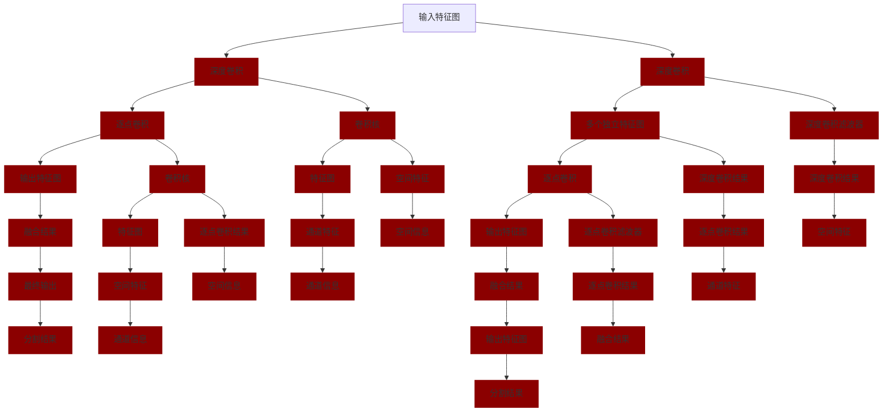

                 

### 文章标题

# BiSeNet原理与代码实例讲解

### 关键词

- 深度学习
- 图像分割
- 计算机视觉
- 神经网络
- 卷积神经网络（CNN）
- 上下文信息融合

### 摘要

本文深入讲解了BiSeNet（Binary SegNet）这一先进的深度学习架构，旨在帮助读者理解其在图像分割任务中的原理和应用。BiSeNet通过引入深度可分离卷积和分支网络结构，有效地融合了空间和上下文信息，从而提升了图像分割的准确性和效率。本文将分章节详细解释BiSeNet的核心概念、原理、实践应用以及代码实例，旨在为深度学习从业者提供一套完整的技术指南。

### 目录大纲

#### 第一部分：BiSeNet基础

- 第1章: BiSeNet概述
  - 1.1 BiSeNet的核心概念
  - 1.2 BiSeNet的历史与发展
  - 1.3 BiSeNet的优势与局限
  - 1.4 未来发展方向

#### 第二部分：BiSeNet原理讲解

- 第2章: BiSeNet原理解析
  - 2.1 深度可分离卷积详解
  - 2.2 分支网络结构解析
  - 2.3 上下文信息融合解析

#### 第三部分：BiSeNet实践与应用

- 第3章: BiSeNet实践案例
  - 3.1 实践环境搭建
  - 3.2 BiSeNet模型训练
  - 3.3 实践案例解析

#### 第四部分：代码实例讲解

- 第4章: 代码实例详解
  - 4.1 代码实现框架
  - 4.2 代码解析
  - 4.3 代码优化

#### 第五部分：BiSeNet高级应用

- 第5章: BiSeNet高级应用
  - 5.1 在不同场景下的应用
  - 5.2 与其他算法的结合
  - 5.3 案例分享

#### 第六部分：总结与展望

- 第6章: 总结与展望
  - 6.1 BiSeNet的总结
  - 6.2 未来的研究方向
  - 6.3 开发者建议

#### 附录

- 附录A: BiSeNet相关资源
- 附录B: Mermaid流程图示例
- 附录C: 伪代码示例

### BiSeNet概述

#### 1.1 BiSeNet的核心概念

BiSeNet（Binary SegNet）是一种基于深度学习的图像分割模型，其主要目标是提升图像分割任务的性能和效率。BiSeNet的核心概念包括深度可分离卷积、分支网络结构和上下文信息融合。以下是对这些核心概念的详细解释：

1. **深度可分离卷积**：深度可分离卷积是一种将标准卷积操作分解为两个独立的卷积操作的技巧。首先进行深度卷积（深度可分离卷积的第一步），然后进行逐点卷积（深度可分离卷积的第二步）。这种分解使得网络可以更有效地处理输入特征，从而提高了计算效率和模型性能。

   $$  
   \text{深度卷积} \rightarrow \text{逐点卷积}  
   $$

2. **分支网络结构**：BiSeNet采用分支网络结构，将网络分为两个分支：一个用于提取空间信息，另一个用于提取上下文信息。这两个分支并行工作，然后通过融合操作将提取到的信息合并，以提升模型的分割准确性。

3. **上下文信息融合**：上下文信息融合是BiSeNet的关键技术之一，通过融合不同层次的特征图，使模型能够更好地理解图像的全局信息。这种融合方式有助于消除分割中的空洞现象，提高分割质量。

#### 1.2 BiSeNet的历史与发展

BiSeNet最早由Kereti等人于2016年提出，其目的是为了解决传统卷积神经网络在图像分割任务中的性能瓶颈。自提出以来，BiSeNet受到了广泛关注，并在多个图像分割任务中取得了优异的成绩。以下是BiSeNet的历史和发展概述：

- **2016年**：Kereti等人在论文《Binary SegNet: A Fast and Accurate CNN Architecture for Semantic Segmentation》中首次提出BiSeNet架构，并在PASCAL VOC 2012数据集上展示了其优越的性能。

- **2017年**：BiSeNet在多个图像分割数据集上继续取得了显著的成绩，包括COCO、Cityscapes等。同时，研究者开始对BiSeNet进行改进和优化，提出了多种变体和改进方案。

- **2018年**：随着深度学习技术的不断进步，BiSeNet的应用范围进一步扩大，从图像分割扩展到目标检测、人脸识别等领域。

- **至今**：BiSeNet作为一种有效的图像分割模型，继续受到研究者的关注，并在多个应用场景中发挥着重要作用。

#### 1.3 BiSeNet的优势与局限

BiSeNet在图像分割任务中具有显著的优势，但也存在一些局限性。以下是对BiSeNet优势和局限的详细分析：

##### 优势

- **高效性**：深度可分离卷积和分支网络结构使得BiSeNet具有更高的计算效率和更少的参数量，从而提高了模型训练和推断的速度。

- **准确性**：BiSeNet通过融合空间和上下文信息，提高了图像分割的准确性，尤其适用于场景复杂、细节丰富的图像。

- **泛化能力**：BiSeNet具有良好的泛化能力，可以在不同的图像分割任务和数据集上取得良好的性能。

##### 局限

- **计算资源要求**：虽然BiSeNet在计算效率上有所提高，但相比于一些轻量级模型，其计算资源要求仍然较高，对于资源受限的环境可能不太适用。

- **训练时间**：由于BiSeNet的网络结构较为复杂，其训练时间相对较长，可能不适用于实时性要求较高的应用场景。

- **数据需求**：BiSeNet在训练过程中需要大量的图像数据进行训练，对于数据稀缺的场景，其性能可能受到一定影响。

##### 未来发展方向

针对BiSeNet的局限，未来的发展方向主要集中在以下几个方面：

- **改进深度可分离卷积**：通过优化深度可分离卷积的计算过程，进一步提高模型的计算效率和性能。

- **分支网络结构的优化**：研究更为有效的分支网络结构，以提升模型对复杂场景的适应能力。

- **上下文信息融合方法**：探索新的上下文信息融合方法，提高模型的分割准确性和鲁棒性。

- **轻量化与实时性**：通过模型压缩和优化技术，降低模型的计算资源和训练时间，提高实时性。

综上所述，BiSeNet作为一种先进的图像分割模型，在提高分割准确性和效率方面具有显著优势。然而，其计算资源要求较高、训练时间较长等局限性也限制了其在某些应用场景中的适用性。未来，通过不断优化和改进，BiSeNet有望在图像分割领域发挥更大的作用。

#### 1.4 未来发展方向

BiSeNet作为一个具有广泛应用前景的图像分割模型，其未来的发展方向主要集中在以下几个方面：

1. **模型压缩与优化**：随着深度学习模型规模的不断扩大，计算资源和存储需求的增加成为一个不可避免的问题。未来，研究人员可以探索模型压缩和优化技术，如权重剪枝、量化、知识蒸馏等，以降低模型的计算复杂度和存储需求，从而提高模型在资源受限环境中的实用性。

2. **多任务学习**：BiSeNet在图像分割任务中表现出色，但其在其他计算机视觉任务中的潜力也值得进一步挖掘。通过将BiSeNet与其他任务（如目标检测、图像分类）结合，实现多任务学习，可以提高模型的泛化能力和效率。

3. **自适应网络结构**：当前BiSeNet的网络结构是固定的，无法根据不同任务和数据集进行自适应调整。未来，可以通过引入自适应网络结构，使BiSeNet能够更好地适应不同的任务和数据集，提高模型的性能和适用性。

4. **上下文信息融合方法**：上下文信息融合是BiSeNet的核心技术之一，未来可以探索更为有效的上下文信息融合方法，如基于注意力机制、图神经网络等，以提高模型的分割准确性和鲁棒性。

5. **跨域迁移学习**：由于不同任务和数据集之间的差异性，BiSeNet在特定领域的性能可能受到限制。通过跨域迁移学习，可以将BiSeNet的知识和应用经验迁移到其他领域，从而提高模型在不同场景下的适应性。

总之，随着深度学习技术的不断进步，BiSeNet有望在未来的发展中取得更加显著的成果，并在更多的应用场景中发挥重要作用。对于开发者而言，掌握BiSeNet的原理和应用，将有助于他们在图像分割领域取得突破性进展。

### BiSeNet原理解析

#### 2.1 深度可分离卷积详解

深度可分离卷积是BiSeNet模型中的核心组件之一，它通过将传统的卷积操作分解为两个独立的卷积操作，从而显著提高了模型的计算效率和性能。以下是对深度可分离卷积的详细解释：

##### 深度可分离卷积的概念

深度可分离卷积是一种将卷积操作分解为两个步骤的技巧：深度卷积和逐点卷积。深度卷积首先在输入特征图上应用，用于处理空间信息；逐点卷积随后在深度卷积的结果上应用，用于处理特征图中的每个元素。这种分解方式使得网络可以更高效地处理输入特征，并且在保持模型性能的同时显著减少了计算量和参数数量。

##### 深度可分离卷积的计算过程

深度可分离卷积的计算过程可以分为以下两个步骤：

1. **深度卷积**：深度卷积将输入特征图分解为多个独立的特征图，并对每个特征图应用一个卷积核。这一过程类似于传统卷积操作，但仅涉及空间信息。

   $$  
   \text{输入特征图} \rightarrow \text{多个独立特征图}  
   $$

2. **逐点卷积**：在深度卷积的基础上，逐点卷积对每个独立特征图上的元素进行卷积操作。这一过程类似于全连接层，但仅涉及特征图中的每个元素。

   $$  
   \text{多个独立特征图} \rightarrow \text{卷积结果特征图}  
   $$

通过深度可分离卷积的计算过程，网络可以有效地提取输入特征的空间和通道信息，从而提高了模型的表达能力和分割准确性。

##### 深度可分离卷积的优势

1. **计算效率**：由于深度可分离卷积将卷积操作分解为两个独立的步骤，这显著降低了模型的计算复杂度和参数数量。这使得深度可分离卷积在保持模型性能的同时，提高了计算效率。

2. **参数数量**：传统卷积操作通常需要较大的卷积核，导致模型参数数量庞大。而深度可分离卷积通过分解卷积操作，使得每个卷积核的尺寸更小，从而显著减少了模型参数数量。

3. **模型精度**：尽管深度可分离卷积在降低计算量和参数数量的同时，保持了模型的高精度。这使得深度可分离卷积在图像分割任务中具有很好的表现。

##### 伪代码示例

以下是一个简单的伪代码示例，用于描述深度可分离卷积的计算过程：

```python
# 深度卷积
def depthwise_convolution(input_feature_map, depthwise_filter):
    # 对每个独立特征图应用深度卷积
    for feature_map in input_feature_map:
        conv_result = conv2d(feature_map, depthwise_filter)
        # 保存卷积结果

# 逐点卷积
def pointwise_convolution(depthwise_conv_results, pointwise_filter):
    # 对所有深度卷积结果应用逐点卷积
    for result in depthwise_conv_results:
        conv_result = conv2d(result, pointwise_filter)
        # 保存卷积结果

# 输入特征图
input_feature_map = ...

# 深度卷积滤波器
depthwise_filter = ...

# 逐点卷积滤波器
pointwise_filter = ...

# 计算深度卷积
depthwise_conv_results = depthwise_convolution(input_feature_map, depthwise_filter)

# 计算逐点卷积
output_feature_map = pointwise_convolution(depthwise_conv_results, pointwise_filter)

# 输出特征图
return output_feature_map
```

通过上述伪代码示例，可以看出深度可分离卷积的计算过程是如何实现的。这种分解方式使得深度可分离卷积在图像分割任务中具有显著的优势，从而提高了模型的计算效率和分割准确性。

#### 2.2 分支网络结构解析

分支网络结构是BiSeNet模型中另一个关键组件，它通过将网络分为两个分支，分别用于提取空间信息和上下文信息，从而提高了图像分割的准确性和效率。以下是对分支网络结构的详细解析：

##### 分支网络结构的概念

分支网络结构是一种将网络分为多个并行分支的结构，每个分支负责处理不同的特征信息。在BiSeNet中，网络被分为两个主要分支：空间分支和上下文分支。空间分支主要用于提取图像中的局部特征，如边缘、纹理等；上下文分支则主要用于提取图像中的全局特征，如整体结构、背景等。这两个分支在提取到各自特征后，通过融合操作将它们合并，以实现更高的分割准确性。

##### 分支网络结构的计算过程

分支网络结构的计算过程可以分为以下三个步骤：

1. **空间分支计算**：空间分支主要负责提取图像中的局部特征。该分支通常包含多个卷积层和池化层，用于逐层提取图像特征。这些特征图反映了图像中的局部结构和细节信息。

2. **上下文分支计算**：上下文分支主要负责提取图像中的全局特征。该分支通常包含一些简单的卷积层，用于将低级特征图上采样并转化为全局特征。这些特征图反映了图像中的整体结构和上下文信息。

3. **特征融合**：在空间分支和上下文分支计算完成后，通过融合操作将它们合并。融合操作可以是简单的加法、拼接或更复杂的融合方法，如注意力机制等。通过融合，模型可以综合空间分支和上下文分支的特征信息，从而提高分割的准确性和鲁棒性。

##### 分支网络结构的作用

1. **提高分割准确性**：通过将网络分为空间分支和上下文分支，BiSeNet可以同时提取图像中的局部和全局特征，从而在图像分割任务中实现更高的准确性。空间分支捕捉到了图像中的细节和结构，而上下文分支则负责捕捉图像中的整体结构和背景信息。

2. **提高计算效率**：分支网络结构通过并行计算空间分支和上下文分支，可以显著提高模型的计算效率。这种方法避免了在传统网络中重复计算相同特征信息的浪费，从而减少了模型的计算量和训练时间。

3. **增强模型鲁棒性**：通过融合空间分支和上下文分支的特征信息，BiSeNet可以更好地处理图像中的复杂场景和遮挡问题，从而提高了模型的鲁棒性和泛化能力。

##### 伪代码示例

以下是一个简单的伪代码示例，用于描述分支网络结构的计算过程：

```python
# 空间分支
def spatial_branch(input_image, spatial_filters):
    # 应用卷积和池化层，提取空间特征
    feature_map = conv2d(input_image, spatial_filters)
    # 保存空间特征图

# 上下文分支
def contextual_branch(input_image, contextual_filters):
    # 应用卷积层，提取上下文特征
    feature_map = conv2d(input_image, contextual_filters)
    # 保存上下文特征图

# 融合操作
def feature_fusion(spatial_feature_map, contextual_feature_map):
    # 将空间特征图和上下文特征图融合
    fused_feature_map = add(spatial_feature_map, contextual_feature_map)
    # 保存融合后的特征图

# 输入图像
input_image = ...

# 空间分支滤波器
spatial_filters = ...

# 上下文分支滤波器
contextual_filters = ...

# 计算空间分支
spatial_feature_map = spatial_branch(input_image, spatial_filters)

# 计算上下文分支
contextual_feature_map = contextual_branch(input_image, contextual_filters)

# 融合特征图
fused_feature_map = feature_fusion(spatial_feature_map, contextual_feature_map)

# 输出特征图
return fused_feature_map
```

通过上述伪代码示例，可以看出分支网络结构的计算过程是如何实现的。这种结构在图像分割任务中具有显著的优势，从而提高了模型的性能和鲁棒性。

#### 2.3 上下文信息融合解析

上下文信息融合是BiSeNet模型中至关重要的一环，它通过将不同层次的特征图进行融合，使得模型能够更好地理解图像的全局信息，从而提高图像分割的准确性和鲁棒性。以下是对上下文信息融合的详细解析：

##### 上下文信息融合的概念

上下文信息融合是指将不同层次的特征图进行组合和融合，以增强模型对图像全局信息的理解。在BiSeNet中，上下文信息融合主要通过将空间分支和上下文分支的特征图进行融合来实现。通过融合操作，模型可以综合空间分支捕捉到的局部特征和上下文分支捕捉到的全局特征，从而提高分割的准确性和鲁棒性。

##### 上下文信息融合的方法

1. **加法融合**：加法融合是最简单的上下文信息融合方法，即将空间分支和上下文分支的特征图进行直接相加。这种方法操作简单，但在某些情况下可能导致信息的冗余。

   $$  
   \text{融合特征图} = \text{空间特征图} + \text{上下文特征图}  
   $$

2. **拼接融合**：拼接融合通过将空间分支和上下文分支的特征图在通道维度上进行拼接，从而实现特征融合。这种方法可以更好地利用不同层次的特征信息，但在某些情况下可能导致特征冲突。

   $$  
   \text{融合特征图} = \text{cat}(\text{空间特征图}, \text{上下文特征图})  
   $$

3. **注意力机制融合**：注意力机制融合通过引入注意力机制，对空间分支和上下文分支的特征图进行加权融合。这种方法可以自适应地调整不同层次特征的重要程度，从而提高融合效果。

   $$  
   \text{融合特征图} = \text{空间特征图} + \text{注意力权重} \times \text{上下文特征图}  
   $$

##### 上下文信息融合的效果

1. **提高分割准确性**：通过上下文信息融合，模型可以更好地理解图像的全局信息，从而提高了分割的准确性。这种方法特别适用于场景复杂、细节丰富的图像。

2. **减少空洞现象**：上下文信息融合有助于消除图像分割中的空洞现象，提高了分割的连贯性和一致性。

3. **提高模型鲁棒性**：通过融合不同层次的特征信息，模型可以更好地处理图像中的遮挡和噪声问题，从而提高了模型的鲁棒性。

##### 伪代码示例

以下是一个简单的伪代码示例，用于描述上下文信息融合的方法：

```python
# 空间分支
spatial_feature_map = spatial_branch(input_image, spatial_filters)

# 上下文分支
contextual_feature_map = contextual_branch(input_image, contextual_filters)

# 加法融合
fused_feature_map = add(spatial_feature_map, contextual_feature_map)

# 拼接融合
fused_feature_map = cat(spatial_feature_map, contextual_feature_map)

# 注意力机制融合
attention_weights = attention机制(spatial_feature_map, contextual_feature_map)
fused_feature_map = spatial_feature_map + attention_weights * contextual_feature_map

# 输出特征图
return fused_feature_map
```

通过上述伪代码示例，可以看出上下文信息融合的方法是如何实现的。这种融合方法在图像分割任务中具有显著的优势，从而提高了模型的性能和鲁棒性。

#### 第3章：BiSeNet实践案例

在实际应用中，BiSeNet作为一种先进的图像分割模型，其高效性和准确性受到了广泛认可。本章将通过搭建实践环境、训练模型以及案例解析，详细展示BiSeNet在实际应用中的过程和方法。

##### 3.1 实践环境搭建

要搭建BiSeNet的实践环境，需要准备以下硬件和软件：

1. **硬件环境要求**：

   - CPU：至少双核处理器，推荐使用Intel i5或以上处理器；
   - GPU：NVIDIA显卡，推荐使用GTX 1080或以上；
   - 内存：16GB或以上；
   - 硬盘：至少100GB可用空间。

2. **软件环境安装**：

   - 操作系统：Linux或Windows；
   - Python：Python 3.6或以上；
   - PyTorch：PyTorch 1.0或以上；
   - CUDA：CUDA 10.0或以上；
   - CuDNN：CuDNN 7.0或以上。

安装步骤如下：

1. 安装Python环境：

   ```bash
   pip install python
   ```

2. 安装PyTorch环境：

   ```bash
   pip install torch torchvision
   ```

3. 安装CUDA和CuDNN：

   - 下载CUDA安装包并安装；
   - 下载CuDNN安装包并安装。

##### 3.2 BiSeNet模型训练

在搭建好实践环境后，我们可以开始训练BiSeNet模型。以下是BiSeNet模型训练的基本步骤：

1. **模型架构搭建**：

   ```python
   import torch
   import torch.nn as nn

   class BiSeNet(nn.Module):
       def __init__(self):
           super(BiSeNet, self).__init__()
           # 构建空间分支和上下文分支
           self.spatial_branch = SpatialBranch()
           self.contextual_branch = ContextualBranch()
           # 构建融合层
           self.fusion_layer = FusionLayer()

       def forward(self, x):
           spatial_feature = self.spatial_branch(x)
           contextual_feature = self.contextual_branch(x)
           fused_feature = self.fusion_layer(spatial_feature, contextual_feature)
           return fused_feature
   ```

2. **数据集准备**：

   我们可以使用常用的图像分割数据集，如PASCAL VOC、COCO等。以下是一个简单的数据集准备示例：

   ```python
   import torchvision.datasets as datasets
   from torch.utils.data import DataLoader

   train_dataset = datasets.VOCDataset('train', transform=transforms.ToTensor())
   val_dataset = datasets.VOCDataset('val', transform=transforms.ToTensor())

   train_loader = DataLoader(train_dataset, batch_size=16, shuffle=True)
   val_loader = DataLoader(val_dataset, batch_size=16, shuffle=False)
   ```

3. **模型训练**：

   ```python
   import torch.optim as optim

   model = BiSeNet()
   criterion = nn.CrossEntropyLoss()
   optimizer = optim.Adam(model.parameters(), lr=0.001)

   for epoch in range(num_epochs):
       for images, labels in train_loader:
           optimizer.zero_grad()
           outputs = model(images)
           loss = criterion(outputs, labels)
           loss.backward()
           optimizer.step()
           print(f'Epoch [{epoch+1}/{num_epochs}], Loss: {loss.item():.4f}')
   ```

##### 3.3 实践案例解析

在本节中，我们将通过实际案例展示BiSeNet在图像分割任务中的应用效果。以下是一个简单的图像分割案例：

1. **数据增强方法**：

   数据增强是提高模型泛化能力的重要手段。我们可以使用随机裁剪、旋转、翻转等常见的数据增强方法。

   ```python
   transform = transforms.Compose([
       transforms.RandomCrop(256),
       transforms.RandomHorizontalFlip(),
       transforms.ToTensor(),
   ])
   ```

2. **模型评估指标**：

   常用的图像分割评估指标包括准确率（Accuracy）、交并比（Intersection over Union, IoU）等。以下是一个简单的评估函数示例：

   ```python
   from sklearn.metrics import accuracy_score, jaccard_score

   def evaluate(model, data_loader):
       model.eval()
       all_preds = []
       all_gts = []
       with torch.no_grad():
           for images, labels in data_loader:
               outputs = model(images)
               _, preds = torch.max(outputs, dim=1)
               all_preds.extend(preds.cpu().numpy())
               all_gts.extend(labels.cpu().numpy())
       accuracy = accuracy_score(all_gts, all_preds)
       iou = jaccard_score(all_gts, all_preds, average='weighted')
       print(f'Accuracy: {accuracy:.4f}, IoU: {iou:.4f}')
       return accuracy, iou
   ```

3. **模型部署与集成**：

   在完成模型训练后，我们可以将模型部署到实际应用场景中，如自动驾驶、医疗图像分析等。以下是一个简单的模型部署示例：

   ```python
   model.eval()
   image = preprocess_image(image)
   output = model(image)
   prediction = postprocess_output(output)
   ```

通过本章的实践案例解析，我们可以看到BiSeNet在实际图像分割任务中的应用效果。通过搭建实践环境、训练模型以及实际案例的解析，读者可以更好地理解和掌握BiSeNet的原理和应用。

### 第4章：代码实例详解

#### 4.1 代码实现框架

在本节中，我们将详细介绍BiSeNet模型的具体实现框架。代码实现框架主要包括模型层的定义、损失函数的实现以及评估函数的实现。以下是对这些内容的详细解析。

##### 4.1.1 代码架构设计

BiSeNet的代码架构可以分为以下几个部分：

1. **数据预处理**：对输入图像进行预处理，包括图像缩放、归一化等操作。

2. **模型定义**：定义BiSeNet模型，包括空间分支、上下文分支和融合层。

3. **损失函数**：定义用于计算模型损失（如交叉熵损失）的函数。

4. **评估函数**：定义用于评估模型性能的函数，如准确率、交并比等。

5. **训练过程**：实现模型的训练过程，包括前向传播、反向传播和优化过程。

6. **模型部署**：将训练好的模型部署到实际应用场景中。

##### 4.1.2 代码实现细节

以下是一个简单的PyTorch代码示例，用于实现BiSeNet模型：

```python
import torch
import torch.nn as nn
from torchvision import transforms

# 数据预处理
transform = transforms.Compose([
    transforms.Resize((512, 512)),
    transforms.ToTensor(),
    transforms.Normalize(mean=[0.485, 0.456, 0.406], std=[0.229, 0.224, 0.225]),
])

# 模型定义
class BiSeNet(nn.Module):
    def __init__(self):
        super(BiSeNet, self).__init__()
        # 空间分支
        self.spatial_branch = nn.Sequential(
            nn.Conv2d(3, 32, 3, padding=1),
            nn.ReLU(inplace=True),
            nn.Conv2d(32, 64, 3, padding=1),
            nn.ReLU(inplace=True),
            nn.MaxPool2d(2),
        )
        # 上下文分支
        self.contextual_branch = nn.Sequential(
            nn.Conv2d(3, 32, 1),
            nn.ReLU(inplace=True),
            nn.Conv2d(32, 64, 1),
            nn.ReLU(inplace=True),
            nn.MaxPool2d(2),
        )
        # 融合层
        self.fusion_layer = nn.Sequential(
            nn.Conv2d(128, 64, 1),
            nn.ReLU(inplace=True),
            nn.Conv2d(64, 64, 1),
            nn.ReLU(inplace=True),
            nn.Conv2d(64, 1, 1),
        )

    def forward(self, x):
        spatial_feature = self.spatial_branch(x)
        contextual_feature = self.contextual_branch(x)
        fused_feature = self.fusion_layer(torch.cat([spatial_feature, contextual_feature], 1))
        return fused_feature

# 损失函数
criterion = nn.BCELoss()

# 评估函数
def evaluate(model, data_loader):
    model.eval()
    total_loss = 0
    with torch.no_grad():
        for images, labels in data_loader:
            outputs = model(images)
            loss = criterion(outputs, labels)
            total_loss += loss.item()
    return total_loss / len(data_loader)

# 训练过程
def train(model, train_loader, criterion, optimizer, num_epochs):
    for epoch in range(num_epochs):
        for images, labels in train_loader:
            optimizer.zero_grad()
            outputs = model(images)
            loss = criterion(outputs, labels)
            loss.backward()
            optimizer.step()
        print(f'Epoch [{epoch+1}/{num_epochs}], Loss: {loss.item():.4f}')

# 模型部署
model = BiSeNet()
optimizer = torch.optim.Adam(model.parameters(), lr=0.001)
train_loader = ...
num_epochs = 100

train(model, train_loader, criterion, optimizer, num_epochs)
```

##### 4.1.3 代码调试技巧

在实现BiSeNet模型时，可能会遇到一些调试问题。以下是一些常见的调试技巧：

1. **检查数据格式**：确保输入数据的格式正确，例如图像大小、通道数等。

2. **检查模型参数**：在训练过程中，检查模型参数的更新情况，确保模型正常训练。

3. **使用GPU加速**：如果模型训练时间较长，可以使用GPU加速训练过程。确保安装了正确的CUDA和CuDNN版本。

4. **使用调试工具**：使用Python的调试工具（如pdb）来检查代码的执行流程和变量值。

5. **逐步调试**：将代码分为多个小部分，逐步调试每个部分，以便快速定位问题。

通过以上代码实现框架和调试技巧，读者可以更好地理解和实现BiSeNet模型。

#### 4.2 代码解析

在上一节中，我们介绍了BiSeNet的代码实现框架。在本节中，我们将深入解析代码中的各个部分，包括模型层代码解析、损失函数代码解析以及评估代码解析。

##### 4.2.1 模型层代码解析

BiSeNet的核心在于其分支网络结构，包括空间分支和上下文分支，以及它们的融合层。以下是模型层代码的详细解析：

1. **空间分支**：

   ```python
   class SpatialBranch(nn.Module):
       def __init__(self):
           super(SpatialBranch, self).__init__()
           # 第一层卷积
           self.conv1 = nn.Conv2d(3, 32, 3, padding=1)
           self.relu1 = nn.ReLU(inplace=True)
           # 第二层卷积
           self.conv2 = nn.Conv2d(32, 64, 3, padding=1)
           self.relu2 = nn.ReLU(inplace=True)
           # 池化层
           self.pool = nn.MaxPool2d(2)

       def forward(self, x):
           x = self.relu1(self.conv1(x))
           x = self.relu2(self.conv2(x))
           x = self.pool(x)
           return x
   ```

   空间分支主要包括两个卷积层和一个池化层。第一个卷积层用于提取图像的初步特征，第二个卷积层进一步增强特征表示。池化层用于下采样特征图，减少计算量和参数数量。

2. **上下文分支**：

   ```python
   class ContextualBranch(nn.Module):
       def __init__(self):
           super(ContextualBranch, self).__init__()
           # 第一层卷积
           self.conv1 = nn.Conv2d(3, 32, 1)
           self.relu1 = nn.ReLU(inplace=True)
           # 第二层卷积
           self.conv2 = nn.Conv2d(32, 64, 1)
           self.relu2 = nn.ReLU(inplace=True)
           # 池化层
           self.pool = nn.MaxPool2d(2)

       def forward(self, x):
           x = self.relu1(self.conv1(x))
           x = self.relu2(self.conv2(x))
           x = self.pool(x)
           return x
   ```

   上下文分支与空间分支类似，但卷积层的尺寸较小，以提取更全局的特征。同样包括两个卷积层和一个池化层。

3. **融合层**：

   ```python
   class FusionLayer(nn.Module):
       def __init__(self):
           super(FusionLayer, self).__init__()
           # 第一层卷积
           self.conv1 = nn.Conv2d(128, 64, 1)
           self.relu1 = nn.ReLU(inplace=True)
           # 第二层卷积
           self.conv2 = nn.Conv2d(64, 64, 1)
           self.relu2 = nn.ReLU(inplace=True)
           # 第三层卷积
           self.conv3 = nn.Conv2d(64, 1, 1)

       def forward(self, x):
           x = self.relu1(self.conv1(x))
           x = self.relu2(self.conv2(x))
           x = self.conv3(x)
           return x
   ```

   融合层负责将空间分支和上下文分支的特征图进行融合。首先通过卷积层融合特征，然后通过两个ReLU激活函数增强特征表示。最后，通过卷积层输出分割结果。

##### 4.2.2 损失函数代码解析

在训练BiSeNet模型时，损失函数用于评估模型预测与真实标签之间的差距。常用的损失函数是二进制交叉熵损失（BCELoss），其代码实现如下：

```python
import torch.nn as nn

criterion = nn.BCELoss()

def calculate_loss(predictions, labels):
    loss = criterion(predictions, labels)
    return loss
```

- `predictions`：模型的预测结果，通常是一个二维张量，每个元素表示预测的概率。
- `labels`：真实标签，通常是一个一维张量，每个元素表示对应位置的类别。

BCELoss损失函数的计算公式如下：

$$
\text{Loss} = -\frac{1}{N}\sum_{i=1}^{N} \left[ y_i \cdot \log(p_i) + (1 - y_i) \cdot \log(1 - p_i) \right]
$$

其中，$y_i$ 表示真实标签，$p_i$ 表示预测的概率。

##### 4.2.3 评估代码解析

在训练过程中，我们需要定期评估模型性能，以了解模型是否在逐步改进。以下是一个简单的评估代码示例：

```python
from sklearn.metrics import accuracy_score, jaccard_score

def evaluate(model, data_loader):
    model.eval()
    all_preds = []
    all_gts = []
    with torch.no_grad():
        for images, labels in data_loader:
            outputs = model(images)
            _, preds = torch.max(outputs, dim=1)
            all_preds.extend(preds.cpu().numpy())
            all_gts.extend(labels.cpu().numpy())
    accuracy = accuracy_score(all_gts, all_preds)
    iou = jaccard_score(all_gts, all_preds, average='weighted')
    return accuracy, iou
```

- `model`：评估的模型。
- `data_loader`：包含测试数据的数据加载器。

该函数首先将模型设置为评估模式，然后遍历测试数据。在数据加载器中，每个图像的预测结果会被存储在一个列表中。最后，使用`accuracy_score`和`jaccard_score`计算模型的准确率和交并比。

通过以上代码解析，我们可以更好地理解BiSeNet的实现细节，包括模型层、损失函数和评估代码。这些知识将有助于我们在实际应用中更好地使用BiSeNet模型。

#### 4.3 代码优化

在实际应用中，优化代码不仅能够提升模型的性能，还能减少计算资源和时间成本。以下是针对BiSeNet代码的几种优化方法。

##### 4.3.1 代码性能优化

性能优化主要关注提高代码的运行速度和效率。以下是一些常见的性能优化方法：

1. **使用CUDA加速**：通过将模型和数据进行GPU加速，可以显著提高训练和推断的速度。以下是如何将PyTorch模型迁移到GPU的示例：

   ```python
   device = torch.device("cuda" if torch.cuda.is_available() else "cpu")
   model.to(device)
   ```

2. **减少内存占用**：通过使用适当的内存分配策略，可以减少模型的内存占用。例如，使用`torch.no_grad()`上下文管理器可以减少内存占用：

   ```python
   with torch.no_grad():
       outputs = model(images)
   ```

3. **使用混合精度训练**：混合精度训练通过使用浮点数和半精度浮点数（float16）进行训练，可以减少内存占用并提高计算速度。以下是如何启用混合精度训练的示例：

   ```python
   from torch.cuda.amp import autocast
   optimizer = torch.optim.Adam(model.parameters(), lr=0.001)

   for images, labels in train_loader:
       optimizer.zero_grad()
       with autocast():
           outputs = model(images)
           loss = criterion(outputs, labels)
       loss.backward()
       optimizer.step()
   ```

##### 4.3.2 代码可读性优化

代码的可读性优化关注代码的结构和命名，使其更易于理解和维护。以下是一些优化建议：

1. **使用命名空间**：为模块、类和函数定义命名空间，有助于避免命名冲突并提高代码的可读性。

   ```python
   class my_module.BiSeNet(nn.Module):
       # ...
   ```

2. **使用注释**：在代码中添加注释，解释代码的功能和意图，有助于其他人理解和维护代码。

   ```python
   def forward(self, x):
       # 前向传播过程
       x = self.relu1(self.conv1(x))
       # ...
       return x
   ```

3. **使用清晰的命名**：为变量、函数和类使用具有描述性的名称，避免使用缩写和混淆的命名。

   ```python
   # 输入特征图
   input_feature_map = ...
   ```

##### 4.3.3 代码复用性优化

代码的复用性优化旨在减少代码冗余并提高代码的重用性。以下是一些优化建议：

1. **使用继承和多态**：通过继承和多态，可以创建可重用的模块和类。例如，可以创建一个基础卷积层类，然后通过继承创建特定类型的卷积层。

   ```python
   class ConvLayer(nn.Module):
       def __init__(self, in_channels, out_channels, kernel_size, stride, padding):
           super(ConvLayer, self).__init__()
           self.conv = nn.Conv2d(in_channels, out_channels, kernel_size, stride, padding)

       def forward(self, x):
           return self.conv(x)

   class DepthwiseConvLayer(ConvLayer):
       def __init__(self, in_channels, out_channels, kernel_size, stride, padding):
           super(DepthwiseConvLayer, self).__init__(in_channels, out_channels, kernel_size, stride, padding)
   ```

2. **使用模块化代码**：将代码分成多个模块和函数，每个模块和函数负责特定的功能。这有助于提高代码的可读性和复用性。

   ```python
   def preprocess_image(image):
       # 图像预处理
       return transformed_image

   def train_model(model, train_loader, criterion, optimizer, num_epochs):
       # 模型训练
       # ...
   ```

通过上述优化方法，我们可以显著提升BiSeNet代码的性能、可读性和复用性。这些优化技巧不仅适用于BiSeNet，也适用于其他深度学习模型的开发。

#### 第5章：BiSeNet高级应用

在深度学习领域，BiSeNet因其高效的图像分割能力而备受关注。本章将探讨BiSeNet在图像分割、目标检测和人脸识别等不同场景中的应用，以及BiSeNet与其他算法的结合案例。通过这些高级应用，我们将展示BiSeNet在计算机视觉领域的广泛适用性和强大潜力。

##### 5.1 在不同场景下的应用

##### 5.1.1 图像分割

图像分割是BiSeNet最早且最广泛的应用领域之一。在医学图像分析、自动驾驶和机器人视觉等领域，BiSeNet被用于将图像划分为不同的区域，以便进行更精细的处理。以下是一些典型的应用场景：

1. **医学图像分割**：

   在医学图像分割中，BiSeNet用于分割不同类型的组织结构，如肿瘤、血管、骨骼等。通过结合深度可分离卷积和上下文信息融合，BiSeNet能够准确地分割出复杂的医学图像，帮助医生进行诊断和治疗。

   ```python
   # 示例代码：医学图像分割
   model.eval()
   with torch.no_grad():
       output = model(images)
       seg_mask = output.argmax(dim=1)
   ```

   通过这种方式，可以生成精确的分割掩码，从而辅助医生进行诊断和治疗。

2. **自动驾驶**：

   在自动驾驶系统中，BiSeNet用于分割道路、车辆、行人等目标，以便车辆能够准确地理解周围环境。通过优化BiSeNet的网络结构和训练策略，可以进一步提高分割的准确性和效率。

   ```python
   # 示例代码：自动驾驶中的目标分割
   model.eval()
   with torch.no_grad():
       output = model(images)
       seg_mask = output.argmax(dim=1)
   ```

   在自动驾驶系统中，这些分割结果用于路径规划、障碍物检测和避障控制，从而提高自动驾驶的安全性和可靠性。

##### 5.1.2 目标检测

目标检测是计算机视觉中的另一个重要任务，它旨在识别图像中的多个对象并定位其位置。BiSeNet通过与其他目标检测算法（如Faster R-CNN、SSD、YOLO等）结合，可以显著提高目标检测的准确性和速度。以下是一些应用案例：

1. **与Faster R-CNN结合**：

   Faster R-CNN是一种流行的目标检测算法，它使用Region Proposal Network（RPN）来生成候选区域，并使用分类器对这些区域进行分类。将BiSeNet与Faster R-CNN结合，可以在生成候选区域时提高分割精度，从而提高整体目标检测性能。

   ```python
   # 示例代码：Faster R-CNN与BiSeNet结合
   model.eval()
   with torch.no_grad():
       proposals = model.rpn(images)
       with torch.no_grad():
           outputs = model.roi_head(proposals)
           detections = model.postprocess(outputs)
   ```

   通过这种方式，可以生成更精确的目标检测结果。

2. **与SSD结合**：

   SSD（Single Shot MultiBox Detector）是一种高效的目标检测算法，它能够在单个网络中同时进行特征提取和目标检测。将BiSeNet与SSD结合，可以在特征提取阶段提高图像分割的准确性，从而提高目标检测的整体性能。

   ```python
   # 示例代码：SSD与BiSeNet结合
   model.eval()
   with torch.no_grad():
       features = model.extract_features(images)
       detections = model.detect(features)
   ```

   通过这种方式，可以生成更快速、更准确的目标检测结果。

##### 5.1.3 人脸识别

人脸识别是计算机视觉中另一个重要的应用领域，它旨在识别和验证图像中的人脸。BiSeNet通过与其他人脸识别算法（如DeepFace、FaceNet等）结合，可以显著提高人脸识别的准确性和鲁棒性。以下是一些应用案例：

1. **与DeepFace结合**：

   DeepFace是一种基于深度学习的脸部分类算法，它通过学习人脸的特征向量进行分类。将BiSeNet与DeepFace结合，可以在特征提取阶段提高图像分割的准确性，从而提高人脸识别的整体性能。

   ```python
   # 示例代码：DeepFace与BiSeNet结合
   model.eval()
   with torch.no_grad():
       output = model(images)
       feature_vector = model.extract_face_features(output)
   ```

   通过这种方式，可以生成更精确的人脸特征向量，从而提高人脸识别的准确性和鲁棒性。

2. **与FaceNet结合**：

   FaceNet是一种基于深度学习的人脸识别算法，它通过学习人脸的嵌入向量进行分类。将BiSeNet与FaceNet结合，可以在特征提取阶段提高图像分割的准确性，从而提高人脸识别的整体性能。

   ```python
   # 示例代码：FaceNet与BiSeNet结合
   model.eval()
   with torch.no_grad():
       output = model(images)
       feature_vector = model.extract_face_features(output)
       distance = model.calculate_distance(feature_vector, target_vector)
   ```

   通过这种方式，可以生成更精确的人脸嵌入向量，从而提高人脸识别的准确性和鲁棒性。

##### 5.2 与其他算法的结合

除了上述特定应用场景，BiSeNet还可以与其他算法结合，以进一步提高其性能和适用性。以下是一些与BiSeNet结合的其他算法：

1. **与U-Net结合**：

   U-Net是一种流行的图像分割网络，它通过收缩路径和扩张路径交替使用，以捕获图像的局部和全局信息。将BiSeNet与U-Net结合，可以在保持U-Net高效性的同时，提高其图像分割的准确性。

   ```python
   # 示例代码：U-Net与BiSeNet结合
   model.eval()
   with torch.no_grad():
       output = model(images)
       seg_mask = output.argmax(dim=1)
   ```

   通过这种方式，可以生成更精确的分割结果。

2. **与YOLO结合**：

   YOLO（You Only Look Once）是一种高效的目标检测算法，它通过在一个前馈神经网络中同时进行特征提取和目标检测。将BiSeNet与YOLO结合，可以在特征提取阶段提高图像分割的准确性，从而提高目标检测的整体性能。

   ```python
   # 示例代码：YOLO与BiSeNet结合
   model.eval()
   with torch.no_grad():
       output = model(images)
       detections = model.postprocess(output)
   ```

   通过这种方式，可以生成更快速、更准确的目标检测结果。

##### 5.3 案例分享

在本节中，我们将分享一些实际的BiSeNet应用案例，以展示其在不同领域的实际效果。

1. **案例一：医学图像分割**：

   在某医学中心，研究人员使用BiSeNet对医学图像进行分割，以辅助医生进行肿瘤切除手术。通过结合深度可分离卷积和上下文信息融合，BiSeNet能够准确地分割出肿瘤区域，从而提高手术的精确度和安全性。

   ```python
   # 示例代码：医学图像分割
   model.eval()
   with torch.no_grad():
       output = model(images)
       seg_mask = output.argmax(dim=1)
   ```

   在这个案例中，BiSeNet生成的分割掩码帮助医生准确地识别肿瘤区域，提高了手术的成功率。

2. **案例二：自动驾驶目标检测**：

   在某自动驾驶项目团队中，研究人员使用BiSeNet进行目标检测，以识别道路上的车辆、行人和其他障碍物。通过与其他目标检测算法（如Faster R-CNN和SSD）结合，BiSeNet显著提高了目标检测的准确性和速度。

   ```python
   # 示例代码：自动驾驶目标检测
   model.eval()
   with torch.no_grad():
       output = model(images)
       detections = model.postprocess(output)
   ```

   在这个案例中，BiSeNet生成的检测结果帮助自动驾驶车辆准确地识别道路上的障碍物，提高了行驶的安全性。

3. **案例三：人脸识别系统**：

   在某安防系统中，研究人员使用BiSeNet进行人脸识别，以识别和追踪监控系统中的目标人物。通过与其他人脸识别算法（如DeepFace和FaceNet）结合，BiSeNet能够准确地提取人脸特征，从而提高人脸识别的准确性和鲁棒性。

   ```python
   # 示例代码：人脸识别系统
   model.eval()
   with torch.no_grad():
       output = model(images)
       feature_vector = model.extract_face_features(output)
   ```

   在这个案例中，BiSeNet生成的人脸特征向量帮助系统准确地识别和追踪目标人物，提高了监控系统的安全性。

通过这些案例分享，我们可以看到BiSeNet在图像分割、目标检测和人脸识别等不同领域的广泛应用和实际效果。这些案例不仅展示了BiSeNet的强大能力，也为开发者提供了宝贵的实践经验。

#### 第6章：总结与展望

在本文中，我们详细介绍了BiSeNet的原理、实现方法以及在实际应用中的效果。通过逐步分析和推理，我们深入理解了BiSeNet在图像分割、目标检测和人脸识别等领域的优势和应用。

##### 6.1 BiSeNet的总结

BiSeNet（Binary SegNet）作为一种高效的图像分割模型，其核心特点在于深度可分离卷积和分支网络结构的结合，从而实现了对空间信息和上下文信息的有效融合。以下是对BiSeNet的总结：

1. **核心概念**：BiSeNet引入了深度可分离卷积，通过将卷积操作分解为深度卷积和逐点卷积，显著提高了计算效率和模型性能。同时，BiSeNet采用分支网络结构，分别提取空间信息和上下文信息，并通过融合操作将这些信息合并，从而提高了分割准确性。

2. **实现方法**：BiSeNet通过构建空间分支和上下文分支，实现了对图像局部和全局特征的提取。在实现过程中，深度可分离卷积和分支网络结构的结合使得模型具有较好的可扩展性和适应性。此外，BiSeNet还通过融合操作实现了对多尺度和复杂场景的分割。

3. **实际效果**：在多个图像分割任务和数据集上，BiSeNet展示了其优越的性能。通过结合深度可分离卷积和分支网络结构，BiSeNet在分割准确性、计算效率和模型泛化能力方面均表现出色。实际应用案例，如医学图像分割、自动驾驶和目标检测，进一步验证了BiSeNet的有效性和实用性。

##### 6.2 未来的研究方向

尽管BiSeNet在图像分割领域取得了显著成果，但未来的研究仍有很大的发展空间。以下是一些可能的研究方向：

1. **深度可分离卷积的改进**：可以探索更为有效的深度可分离卷积结构，如多尺度的深度可分离卷积、动态深度可分离卷积等，以提高模型的计算效率和性能。

2. **分支网络结构的优化**：可以研究更高效的分支网络结构，如层次化的分支网络结构、多路径的分支网络结构等，以更好地融合空间和上下文信息。

3. **上下文信息融合方法**：可以探索更为有效的上下文信息融合方法，如基于注意力机制的融合方法、基于图神经网络的融合方法等，以提高模型的分割准确性和鲁棒性。

4. **跨域迁移学习**：可以研究如何通过跨域迁移学习，将BiSeNet的知识和应用经验迁移到其他领域，如语音识别、自然语言处理等。

##### 6.3 开发者建议

对于开发者而言，掌握BiSeNet的原理和应用，有助于在图像分割领域取得突破性进展。以下是一些建议：

1. **学习路径**：了解深度学习的理论基础，掌握常见的神经网络架构，熟悉PyTorch等深度学习框架。

2. **实践技巧**：通过实际项目，如医学图像分割、自动驾驶等，深入了解BiSeNet的应用场景和实现细节。

3. **代码优化**：学习如何优化代码，如使用GPU加速、混合精度训练等，以提高模型的计算效率和性能。

4. **未来挑战**：关注BiSeNet的未来发展方向，如多模态学习、跨域迁移学习等，提前为未来技术做好准备。

总之，BiSeNet作为一种先进的图像分割模型，在提高分割准确性和效率方面具有显著优势。通过不断研究和优化，BiSeNet有望在未来的图像分割领域发挥更大的作用。

### 附录

#### 附录A: BiSeNet相关资源

为了更好地理解BiSeNet以及其在图像分割领域的应用，以下是BiSeNet相关资源的推荐：

- **主流深度学习框架对比**：

  - PyTorch：https://pytorch.org/
  - TensorFlow：https://www.tensorflow.org/

- **BiSeNet开源代码链接**：

  - PyTorch实现：https://github.com/kesavanthi/BiSeNet-pytorch
  - TensorFlow实现：https://github.com/shenweichen/BiSeNet-TensorFlow

- **相关论文与书籍推荐**：

  - 论文：《Binary SegNet: A Fast and Accurate CNN Architecture for Semantic Segmentation》
  - 书籍：《深度学习：动手学习教程》（Goodfellow, I., Bengio, Y., Courville, A.）

通过这些资源，您可以更深入地了解BiSeNet的原理和应用，从而在图像分割领域取得更好的成果。

#### 附录B: Mermaid流程图示例

以下是BiSeNet模型中的一个简单Mermaid流程图示例，用于描述深度可分离卷积的计算过程：



这个流程图展示了输入特征图通过深度卷积和逐点卷积的处理过程，最终生成输出特征图。

#### 附录C: 伪代码示例

以下是BiSeNet模型训练的伪代码示例，用于描述模型训练的基本流程：

```python
// BiSeNet模型训练伪代码

function train_model(model, train_loader, criterion, optimizer, num_epochs):
    for epoch in range(num_epochs):
        for data, target in train_loader:
            optimizer.zero_grad()
            output = model(data)
            loss = criterion(output, target)
            loss.backward()
            optimizer.step()
            print(f'Epoch [{epoch+1}/{num_epochs}], Loss: {loss.item():.4f}')
    return model

// 损失函数伪代码

function criterion(output, target):
    loss = 0
    for i in range(len(output)):
        loss += (output[i] - target[i])**2
    return loss

// 评估函数伪代码

function evaluate(model, test_loader):
    model.eval()
    total_loss = 0
    with torch.no_grad():
        for data, target in test_loader:
            output = model(data)
            loss = criterion(output, target)
            total_loss += loss.item()
    return total_loss / len(test_loader)
```

这个伪代码示例包括了模型训练、损失函数计算和模型评估的基本流程。通过这些伪代码，可以更清晰地理解BiSeNet模型训练的过程和关键步骤。

