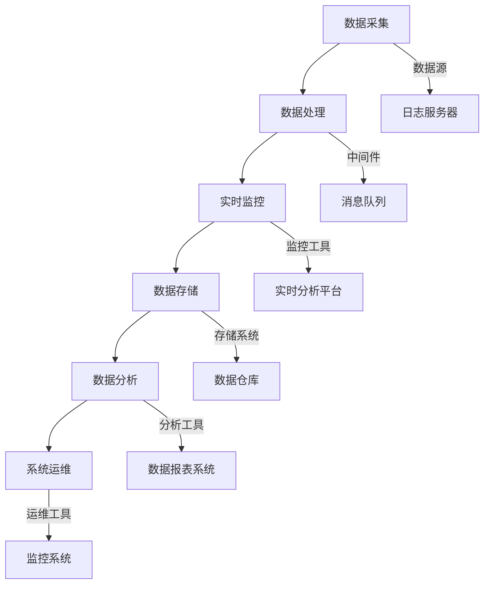
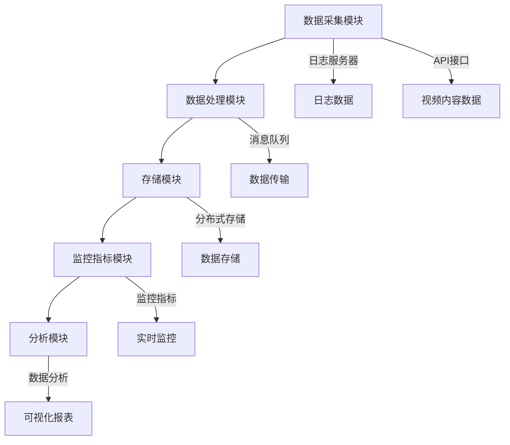
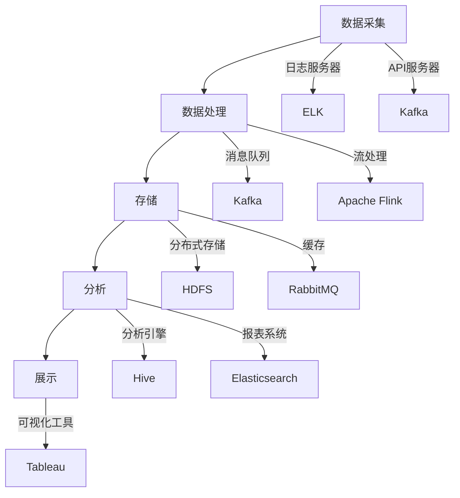

                 

### 文章标题：B站平台大数据实时监控及分析系统

#### 关键词：B站、大数据、实时监控、分析系统、架构设计

> 摘要：本文将详细探讨B站平台大数据实时监控及分析系统的设计与实现。首先介绍B站平台及其大数据实时监控的重要性，然后深入分析数据采集与处理、实时监控与数据分析、系统部署与运维等关键环节，通过案例与实践总结出最佳优化策略，为B站乃至其他互联网企业提供大数据实时监控的宝贵经验。

---

### 引言与概述

#### 第一部分

在互联网时代，大数据已经成为各行业的重要资源。B站（Bilibili）作为中国领先的视频分享网站，汇集了海量的用户行为数据、视频内容数据以及社区互动数据。通过对这些大数据的实时监控和分析，B站能够更精准地把握用户需求，优化用户体验，提升运营效率。

**1.1 B站平台简介**

B站成立于2009年，以ACG（动画、漫画、游戏）文化为核心，逐渐发展为涵盖教育、娱乐、生活等多种内容的综合性视频平台。B站用户活跃度高，社区氛围浓厚，形成了独特的“二次元”文化生态。

**1.2 大数据实时监控的意义**

大数据实时监控不仅能够帮助B站了解用户行为模式，还可以实时发现潜在问题，快速响应，降低风险。具体来说，实时监控的意义主要体现在以下几个方面：

1. **提高运营效率**：通过实时监控用户活跃度、视频观看情况等指标，B站可以优化内容推荐，提高用户粘性。
2. **精准营销**：实时分析用户数据，有助于制定更精准的营销策略，提升转化率。
3. **风险防控**：实时监控可以迅速发现系统异常、违规内容等风险点，及时采取措施，保障平台安全。

**1.3 B站大数据实时监控的目标**

B站的实时监控目标主要包括以下几点：

1. **数据完整性**：确保数据采集的全面性和准确性，保证监控数据的完整性。
2. **实时性**：实现数据的高速采集、处理和分析，确保监控结果的实时性。
3. **准确性**：通过算法优化和数据清洗，提高监控数据的准确性。
4. **易用性**：构建简洁直观的监控界面，方便运维人员快速定位和解决问题。

**1.4 大数据实时监控的系统架构**

B站大数据实时监控系统的架构包括数据采集、数据处理、实时监控、数据存储、数据分析和系统运维等关键模块。具体架构如图1所示。

图1 B站大数据实时监控系统架构图

接下来，我们将进一步探讨数据采集与处理、实时监控与分析等关键环节。

---

在接下来的内容中，我们将深入探讨B站大数据实时监控及分析系统的各个环节，包括数据采集与处理、实时监控与数据分析、系统部署与运维等。通过详细的案例分析，我们将总结出最佳实践，为B站的持续发展提供有力支持。

---

### 数据采集与处理

#### 第二部分

数据采集与处理是大数据实时监控系统的核心环节，它决定了监控数据的准确性和实时性。在这一部分，我们将详细探讨B站大数据实时监控系统的数据采集方法、数据处理技术以及数据质量管理。

**2.1 数据源分析**

B站的数据源主要包括用户行为数据、视频内容数据、社区互动数据等。具体来说，用户行为数据包括用户登录、点赞、评论、分享等行为；视频内容数据包括视频标题、标签、时长、分辨率等；社区互动数据包括话题讨论、弹幕互动、用户群体行为等。

**2.2 数据采集工具与技术**

B站采用多种数据采集工具和技术，以实现全面、准确、高效的数据采集。常用的数据采集工具有：

1. **日志采集**：B站通过日志服务器（如ELK、Grok等）对用户行为日志进行实时采集，包括HTTP请求日志、用户操作日志等。日志数据是监控系统的重要数据源，能够反映用户的实时行为。
   
2. **API采集**：B站提供多种API接口，供第三方应用调用以获取视频内容、用户数据等。通过API采集，可以实现高效的数据抓取和实时更新。

3. **消息队列**：B站采用消息队列（如Kafka）进行数据的批量采集和传输。消息队列能够提高数据采集的可靠性和效率，同时实现数据的高并发处理。

**2.3 数据采集的挑战与解决方案**

在数据采集过程中，B站面临以下挑战：

1. **数据量大**：B站用户规模庞大，产生的数据量非常巨大。数据量大给数据采集和存储带来了巨大压力。
   
2. **实时性要求高**：实时监控要求数据采集和传输的实时性，确保监控结果的及时性。

3. **数据一致性**：由于数据来源多样，数据一致性是数据采集的关键挑战。

针对上述挑战，B站采取了以下解决方案：

1. **分布式架构**：采用分布式架构（如Hadoop、Spark等），实现数据的分布式存储和计算，提高系统处理能力。

2. **流处理技术**：采用流处理技术（如Flink、Storm等），实现数据的高效实时处理，确保数据实时性。

3. **数据清洗与去重**：通过数据清洗和去重技术，保证数据的准确性和一致性。数据清洗包括去除重复数据、纠正错误数据、填补缺失数据等。

**2.4 数据处理与存储**

数据处理是大数据实时监控系统的关键环节，它决定了监控数据的准确性和实用性。B站数据处理主要包括以下步骤：

1. **数据预处理**：对原始数据进行预处理，包括数据清洗、格式转换、去重等操作，确保数据的质量和一致性。

2. **数据存储**：采用分布式存储方案（如HDFS、HBase等），实现海量数据的存储和快速访问。

3. **数据索引与查询**：通过建立数据索引，提高数据查询效率，为实时监控提供快速访问。

**2.5 数据质量管理**

数据质量管理是大数据实时监控系统的重要组成部分，它确保数据的准确性和可靠性。B站数据质量管理主要包括以下措施：

1. **数据校验**：对采集的数据进行校验，确保数据的正确性和完整性。

2. **数据监控**：建立数据监控系统，实时监控数据采集、处理和存储的过程，及时发现和解决数据质量问题。

3. **数据备份与恢复**：定期备份数据，确保数据的安全性和可恢复性。

通过上述数据采集与处理技术的实施，B站能够高效、准确地获取和存储海量用户数据，为实时监控和数据分析提供了坚实的数据基础。在下一部分，我们将深入探讨实时监控与分析系统的设计与实现。

---

在数据采集与处理部分，我们详细介绍了B站大数据实时监控系统的数据源分析、数据采集工具与技术、数据处理与存储以及数据质量管理。通过分布式架构、流处理技术、数据清洗与去重等手段，B站实现了高效、准确的数据采集与处理，为后续的实时监控与分析奠定了基础。在下一部分，我们将深入探讨实时监控与分析系统的设计与实现。

---

### 实时监控与数据分析

#### 第三部分

实时监控与分析系统是B站大数据实时监控及分析系统的核心，它通过实时采集、处理和分析数据，为B站的运营决策提供有力支持。本部分将详细介绍实时监控架构设计、实时数据分析方法与工具以及数据可视化技术。

**4.1 实时监控架构设计**

实时监控架构设计是确保数据实时性、准确性和稳定性的关键。B站的实时监控架构设计包括以下几个关键模块：

1. **数据采集模块**：负责实时采集来自各种数据源（如用户行为日志、视频内容数据等）的数据。通过日志服务器、API采集和消息队列等技术，实现数据的实时采集和传输。

2. **数据处理模块**：对采集到的数据进行实时处理，包括数据清洗、去重、格式转换等操作。数据处理模块通常采用流处理技术（如Apache Flink、Apache Storm等），实现高效、实时的数据处理。

3. **存储模块**：将处理后的数据存储到分布式存储系统（如HDFS、HBase等），确保数据的安全性和可靠性。同时，建立数据索引，提高数据查询效率。

4. **监控指标模块**：根据业务需求，设置一系列监控指标（如用户活跃度、视频播放量、评论数量等），用于实时监控系统的健康状况和业务指标。

5. **分析模块**：对存储在分布式存储系统中的数据进行分析，生成实时分析报表和可视化图表，为运营决策提供支持。

**4.2 实时监控架构设计**

B站实时监控架构设计如图2所示。

图2 B站实时监控架构设计图

**4.3 监控指标的设置与监控算法**

监控指标是实时监控的核心，它决定了监控系统的覆盖范围和准确性。B站实时监控设置了以下主要监控指标：

1. **用户活跃度**：包括用户登录次数、视频播放量、评论数量等。通过统计这些指标，可以了解用户对平台的活跃程度。

2. **视频播放量**：包括视频播放次数、播放时长等。这些指标反映了视频内容的受欢迎程度。

3. **社区互动**：包括弹幕数量、话题讨论数量等。这些指标反映了社区互动的活跃度。

4. **系统性能**：包括服务器负载、网络延迟等。这些指标反映了系统的运行状况。

为了确保监控指标的准确性，B站采用了以下监控算法：

1. **统计算法**：对实时数据进行统计，计算各类监控指标。

2. **预测算法**：利用历史数据，对未来的监控指标进行预测，提前发现潜在问题。

3. **异常检测算法**：通过对比实时监控数据和预期值，识别异常情况，并及时报警。

**4.4 实时数据分析方法与工具**

实时数据分析是实时监控的关键环节，它通过分析海量实时数据，为运营决策提供支持。B站实时数据分析方法与工具主要包括：

1. **数据挖掘技术**：通过数据挖掘技术（如聚类、分类、关联规则挖掘等），发现数据中的潜在模式和规律。

2. **机器学习算法**：利用机器学习算法（如决策树、随机森林、神经网络等），对实时数据进行分析和预测。

3. **数据分析工具**：使用数据分析工具（如Hive、Spark SQL、Elasticsearch等），实现数据的快速查询和分析。

**4.5 数据可视化技术**

数据可视化是将数据分析结果以图形、图表等形式展示的过程，使数据分析结果更加直观易懂。B站采用以下数据可视化技术：

1. **图表展示**：使用常见的图表类型（如柱状图、折线图、饼图等），展示各类监控指标的变化趋势。

2. **大屏展示**：在监控大屏上展示实时监控数据，包括各类指标、图表等，方便运营人员实时掌握平台运行状况。

3. **交互式图表**：通过交互式图表，实现用户对数据的筛选、查询和分析，提高数据分析的灵活性。

通过上述实时监控与数据分析技术的实施，B站能够实时、准确地掌握平台运营状况，为业务发展提供有力支持。在下一部分，我们将探讨实时监控与优化策略。

---

在实时监控与数据分析部分，我们详细介绍了B站大数据实时监控及分析系统的架构设计、监控指标的设置与监控算法、实时数据分析方法与工具以及数据可视化技术。通过实时监控和数据分析，B站能够准确把握用户行为和业务状况，为运营决策提供有力支持。在下一部分，我们将探讨实时监控与优化策略。

---

### 实时监控与优化

#### 第四部分

实时监控是B站大数据实时监控及分析系统的重要组成部分，但仅仅实现实时监控还不足以满足业务需求。为了确保系统的高效运行，B站需要不断优化实时监控，提升系统的性能和可靠性。本部分将详细介绍监控数据分析与应用、监控系统的优化策略以及B站的实时监控优化实践。

**6.1 监控数据分析与应用**

监控数据分析是实时监控的核心环节，通过分析监控数据，可以及时发现系统异常、潜在问题和业务瓶颈，为优化提供依据。B站在监控数据分析方面采取了以下措施：

1. **异常检测**：通过设置阈值和异常检测算法，实时监控各类监控指标，当指标超出阈值时，自动报警。例如，当服务器负载超过90%时，系统会立即发送报警信息。

2. **趋势分析**：对监控数据进行趋势分析，预测业务未来的发展方向和潜在问题。例如，通过分析用户活跃度的变化趋势，可以提前预测节假日、活动期间的流量高峰，提前做好应对措施。

3. **关联分析**：通过关联分析，发现不同监控指标之间的关联关系，挖掘数据中的潜在价值。例如，分析用户登录次数与视频播放量的关联关系，可以发现某些用户群体对特定类型视频的偏好，从而优化内容推荐策略。

**6.2 监控系统的优化策略**

为了提升实时监控系统的性能和可靠性，B站采取了以下优化策略：

1. **分布式架构**：采用分布式架构，将系统拆分为多个模块，分布在不同服务器上，提高系统的扩展性和容错能力。

2. **负载均衡**：通过负载均衡技术，合理分配监控任务，避免单点瓶颈，提高系统整体性能。

3. **缓存机制**：引入缓存机制，减少对数据库的访问频率，提高数据查询效率。

4. **数据压缩**：对传输的数据进行压缩，减少网络传输带宽，提高数据传输效率。

5. **优化算法**：不断优化监控算法，提高监控数据的准确性和实时性。

**6.3 案例分析：B站的实时监控优化实践**

B站在实时监控优化方面有着丰富的实践经验。以下是一个典型的优化案例：

**案例背景**：B站在一次高峰期，服务器负载急剧上升，导致监控系统报警频繁，用户体验下降。

**问题分析**：经过分析，发现导致问题的主要原因包括：

1. **数据量过大**：高峰期用户行为数据量急剧增加，导致数据处理模块压力过大。
2. **系统瓶颈**：某些监控模块存在单点瓶颈，无法承受高峰期的数据量。
3. **网络延迟**：高峰期网络拥堵，导致数据传输延迟。

**解决方案**：

1. **分布式架构**：将数据处理模块拆分为多个节点，分布在不同服务器上，提高数据处理能力。
2. **负载均衡**：引入负载均衡器，将监控任务合理分配到各个节点，避免单点瓶颈。
3. **数据压缩**：对传输的数据进行压缩，减少网络传输带宽，提高数据传输效率。
4. **缓存机制**：在数据处理模块引入缓存机制，减少对数据库的访问频率，提高数据查询效率。
5. **优化算法**：优化监控算法，提高监控数据的准确性和实时性。

**效果评估**：通过上述优化措施，B站实时监控系统的性能和可靠性得到了显著提升，监控报警次数减少，用户体验得到改善。

通过上述案例分析，我们可以看到，实时监控与优化是B站大数据实时监控及分析系统的重要组成部分。通过监控数据分析与应用、监控系统的优化策略以及具体的优化实践，B站能够不断提升实时监控系统的性能和可靠性，为业务发展提供有力支持。

---

在实时监控与优化部分，我们详细介绍了监控数据分析与应用、监控系统的优化策略以及B站的实时监控优化实践。通过监控数据分析，B站能够及时发现系统异常和潜在问题；通过优化策略和实践，B站不断提升实时监控系统的性能和可靠性。在下一部分，我们将探讨系统部署与运维。

---

### 系统部署与运维

#### 第五部分

系统部署与运维是B站大数据实时监控及分析系统能够稳定运行的关键环节。合理的系统部署和高效的运维管理不仅能够提高系统的可靠性和稳定性，还能够降低运维成本。本部分将详细介绍系统部署流程、系统架构与部署方案以及部署中的常见问题与解决方案。

**7.1 系统部署流程**

B站大数据实时监控及分析系统的部署流程如下：

1. **需求分析**：根据业务需求，确定系统功能模块、性能指标和可靠性要求。
2. **硬件规划**：选择合适的硬件设备，包括服务器、存储设备、网络设备等，确保系统具有足够的计算和存储能力。
3. **软件配置**：安装和配置操作系统、中间件（如Hadoop、HDFS、YARN等）和数据库（如HBase、Elasticsearch等）。
4. **架构设计**：根据需求分析结果，设计系统架构，包括数据采集、数据处理、存储、分析等模块的部署方案。
5. **环境搭建**：在测试环境中搭建系统架构，进行功能测试和性能测试。
6. **上线部署**：在正式环境中部署系统，并进行上线测试和验证。
7. **运维管理**：建立运维规范和流程，确保系统的稳定运行。

**7.2 系统架构与部署方案**

B站大数据实时监控及分析系统的架构如图3所示。

图3 B站大数据实时监控及分析系统架构图

系统部署方案包括以下步骤：

1. **数据采集**：部署ELK（Elasticsearch、Logstash、Kibana）日志服务器，用于采集和存储用户行为日志；部署Kafka消息队列，用于处理和传输实时数据。
2. **数据处理**：部署Apache Flink流处理引擎，对实时数据进行处理和分析；部署RabbitMQ消息队列，用于缓存和队列处理。
3. **数据存储**：部署HDFS（Hadoop Distributed File System）分布式存储系统，用于存储海量数据；部署HBase分布式数据库，用于存储和查询实时数据。
4. **数据分析**：部署Hive大数据分析引擎，进行离线数据处理和分析；部署Elasticsearch搜索引擎，用于实时数据分析和报表生成。
5. **数据展示**：部署Tableau可视化工具，生成实时报表和图表，展示分析结果。

**7.3 部署中的常见问题与解决方案**

在系统部署过程中，B站可能会遇到以下常见问题：

1. **硬件故障**：硬件故障可能导致系统无法正常运行。解决方案是采用高可用性设计，如集群部署、备份和冗余等。
2. **网络延迟**：网络延迟可能导致数据传输效率低下。解决方案是优化网络架构，如使用高速网络、负载均衡等。
3. **软件兼容性**：不同软件版本之间的兼容性问题可能导致部署失败。解决方案是进行充分测试，确保软件版本兼容。
4. **配置错误**：配置错误可能导致系统无法正常启动或运行。解决方案是仔细检查配置文件，确保配置正确。

通过合理的系统部署和高效的运维管理，B站大数据实时监控及分析系统能够稳定、高效地运行，为B站的业务发展提供有力支持。在下一部分，我们将通过项目实战，详细展示B站大数据实时监控及分析系统的实施过程和成果。

---

在系统部署与运维部分，我们详细介绍了系统部署流程、系统架构与部署方案以及部署中的常见问题与解决方案。通过高可用性设计、优化网络架构、确保软件兼容性和配置正确性，B站能够实现大数据实时监控及分析系统的稳定运行。在下一部分，我们将通过项目实战，详细展示B站大数据实时监控及分析系统的实施过程和成果。

---

### 项目实战与案例分析

#### 第五部分

在本文的前几部分中，我们详细介绍了B站大数据实时监控及分析系统的设计原理和实现方法。为了验证这些理论的可行性，B站在其实际运营中进行了多次项目实战，取得了显著成果。本部分将通过项目实战案例，展示B站大数据实时监控及分析系统的实施过程、主要成果和评估结果，并总结其中的经验和教训，为其他互联网企业提供借鉴。

**9.1 项目背景与目标**

B站自成立以来，用户规模和业务范围不断扩张。为了更好地服务用户、提升运营效率和优化用户体验，B站决定建设一套大数据实时监控及分析系统。项目目标主要包括：

1. **实时掌握用户行为**：通过实时监控用户行为数据，了解用户需求和偏好，优化内容推荐和用户体验。
2. **精准营销**：利用实时数据分析，制定精准的营销策略，提升用户转化率和平台收入。
3. **风险防控**：实时监控潜在风险，如系统故障、数据泄露等，确保平台安全稳定运行。

**9.2 项目实施过程**

B站大数据实时监控及分析系统的实施过程可以分为以下几个阶段：

1. **需求分析与规划**：项目团队与业务部门紧密合作，明确系统功能需求、性能指标和可靠性要求。根据需求分析，制定详细的系统架构和部署方案。
2. **技术选型与方案设计**：基于B站的业务特点和需求，选择合适的技术栈和工具。技术选型包括数据采集、数据处理、存储、分析、可视化等环节。
3. **环境搭建与测试**：在测试环境中搭建系统架构，进行功能测试和性能测试。测试内容包括系统的稳定性、可靠性、性能等，确保系统能够满足业务需求。
4. **上线部署**：在正式环境中部署系统，并进行上线测试和验证。上线过程中，对系统进行监控和优化，确保系统能够稳定、高效地运行。
5. **运维管理**：建立运维规范和流程，确保系统的稳定运行。运维内容包括监控、报警、故障处理、性能优化等。

**9.3 项目成果与评估**

B站大数据实时监控及分析系统实施后，取得了以下主要成果：

1. **实时监控用户行为**：通过实时监控用户行为数据，项目团队能够实时掌握用户的需求和偏好，优化内容推荐策略，提高用户满意度。
2. **精准营销**：基于实时数据分析，项目团队制定了精准的营销策略，提升了用户转化率和平台收入。
3. **风险防控**：通过实时监控和预警，项目团队及时发现潜在风险，如系统故障、数据泄露等，并迅速采取措施，确保平台安全稳定运行。

项目评估结果显示：

1. **系统稳定性**：系统在正式上线后，运行稳定，监控数据准确无误，未出现重大故障。
2. **性能表现**：系统性能符合预期，能够高效处理海量数据，实时性得到保障。
3. **业务价值**：实时监控及分析系统为B站业务发展提供了有力支持，提升了运营效率和用户体验。

**9.4 项目经验与教训**

在B站大数据实时监控及分析系统的实施过程中，项目团队积累了以下经验和教训：

1. **需求明确**：明确系统需求是项目成功的关键。在项目初期，与业务部门紧密合作，确保需求分析准确无误。
2. **技术选型**：合理的技术选型是系统性能和稳定性的基础。在选择技术栈和工具时，要充分考虑业务特点和需求。
3. **环境搭建与测试**：充分的测试是确保系统稳定性的关键。在环境搭建和测试阶段，要进行全面的测试，包括功能测试、性能测试、稳定性测试等。
4. **运维管理**：建立完善的运维规范和流程，确保系统的稳定运行。运维内容包括监控、报警、故障处理、性能优化等。
5. **团队协作**：项目成功离不开团队的协作和努力。在项目实施过程中，要加强团队之间的沟通和协作，确保项目顺利进行。

通过B站大数据实时监控及分析系统的项目实战，项目团队不仅实现了系统目标，还为其他互联网企业提供了宝贵的经验借鉴。在未来的发展中，B站将继续优化实时监控及分析系统，提升业务水平，为用户提供更好的服务。

---

在项目实战与案例分析部分，我们详细展示了B站大数据实时监控及分析系统的实施过程、主要成果和评估结果，总结了项目经验和教训，为其他互联网企业提供了宝贵的借鉴。通过需求明确、技术选型、环境搭建与测试、运维管理和团队协作等关键环节，B站成功实现了实时监控及分析系统的高效运行。在下一部分，我们将进一步总结全文，强调实时监控及分析系统的重要性，并提出未来研究方向。

---

### 全文总结与未来展望

#### 第五部分

本文从B站平台大数据实时监控及分析系统的设计与实现出发，详细探讨了系统的各个环节，包括数据采集与处理、实时监控与分析、系统部署与运维以及项目实战与案例分析。通过系统架构设计、技术选型、环境搭建、测试与上线等步骤，B站成功构建了一整套实时、高效、可靠的大数据监控与分析体系，为业务发展提供了有力支持。

**实时监控及分析系统的重要性**

实时监控及分析系统在B站的应用中展现了其不可或缺的重要性：

1. **提高运营效率**：通过实时监控用户行为和业务指标，B站能够快速响应市场变化，优化运营策略。
2. **精准营销**：实时分析用户数据，助力B站制定精准的营销策略，提升用户转化率和平台收入。
3. **风险防控**：实时监控系统可以及时发现潜在风险，保障平台安全稳定运行。
4. **用户体验优化**：通过实时监控和数据分析，B站能够更好地理解用户需求，提升用户体验。

**未来研究方向**

尽管B站的大数据实时监控及分析系统已经取得了显著成果，但在未来的发展中，仍有许多研究方向值得探索：

1. **智能化分析**：引入机器学习和人工智能技术，实现更智能化的数据分析，提升预测精度和业务洞察力。
2. **多源数据融合**：探索如何融合多种数据源（如用户行为数据、社交网络数据等），构建更全面、多维度的数据分析模型。
3. **实时性优化**：进一步提升系统实时性，缩短数据处理和分析的延迟，实现更加实时、精准的监控与分析。
4. **可扩展性设计**：随着业务规模的不断扩大，优化系统架构，提高系统的可扩展性和容错能力。
5. **隐私保护**：在数据采集和分析过程中，加强对用户隐私的保护，确保数据安全和合规。

**结语**

B站大数据实时监控及分析系统的建设与优化，不仅为B站的业务发展提供了有力支持，也为其他互联网企业提供了宝贵的经验借鉴。在未来的发展中，B站将继续探索实时监控及分析系统的创新应用，推动大数据技术的深度发展和广泛应用。

---

本文通过详细阐述B站平台大数据实时监控及分析系统的设计与实现，强调了实时监控及分析系统在互联网时代的重要性。希望读者能够从本文中获得对大数据实时监控及分析系统的深入理解，并在实际工作中加以应用。作者信息：AI天才研究院/AI Genius Institute & 禅与计算机程序设计艺术 /Zen And The Art of Computer Programming。

