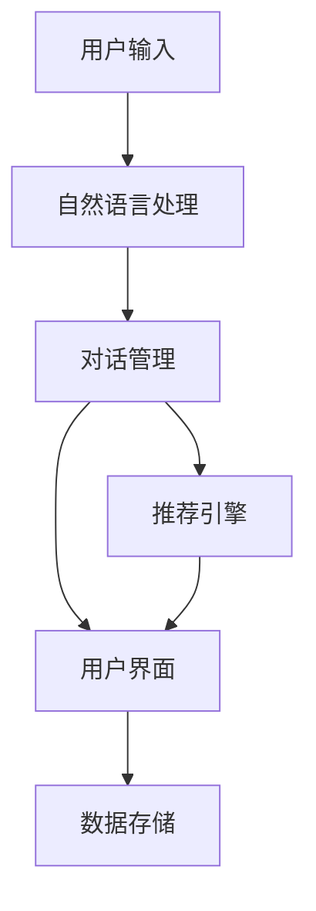
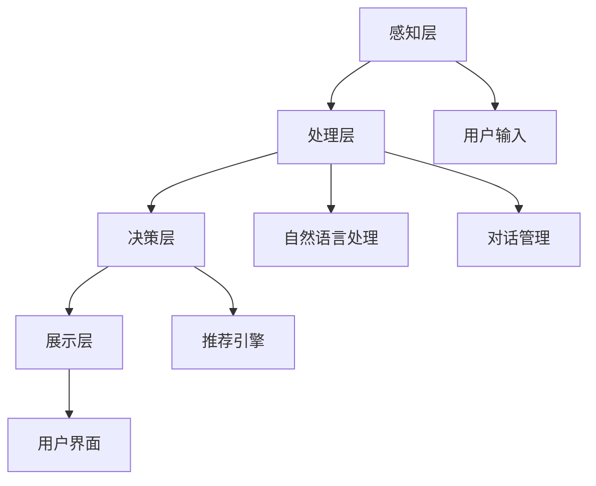
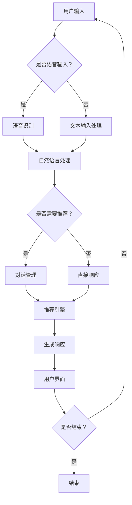
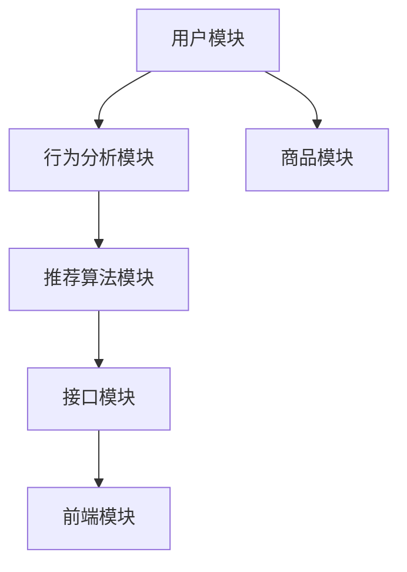

                 

# 《CUI中的个性化推荐与用户体验详细提升》

## 关键词

- CUI（对话用户界面）
- 个性化推荐
- 用户体验
- 推荐算法
- 用户画像
- 系统架构

## 摘要

本文旨在探讨CUI（对话用户界面）中的个性化推荐如何提升用户体验。我们将首先介绍CUI的定义和其在现代科技中的应用，然后深入探讨个性化推荐的基本原理、用户画像构建和用户体验评估指标。随后，本文将阐述个性化推荐在CUI中的应用场景和提升用户体验的关键点。接下来，我们将分析CUI的架构设计、个性化推荐算法原理、用户画像构建以及用户体验评估与优化策略。通过一个实际项目的实战分析，我们将展示个性化推荐在提升用户体验方面的具体实施步骤。最后，本文将介绍个性化推荐中的数学模型和公式，并提供相关资源的附录。

## 《CUI中的个性化推荐与用户体验详细提升》目录大纲

### 第一部分：引言

#### 1.1 CUI概述
- CUI的定义与历史发展
- CUI在现代科技中的应用

#### 1.2 个性化推荐与用户体验
- 个性化推荐的基本原理
- 用户画像构建
- 用户体验评估指标

#### 1.3 个性化推荐在CUI中的应用
- 个性化推荐的CUI应用场景
- 用户体验提升的关键点

### 第二部分：CUI设计与实现

#### 2.1 CUI架构设计
- CUI系统整体架构
- 主要模块介绍
- Mermaid流程图：CUI系统工作流程

#### 2.2 个性化推荐算法原理
- 个性化推荐算法的基本类型
- 协同过滤算法
- 内容推荐算法
- 深度学习推荐算法
- 伪代码：协同过滤算法实现

#### 2.3 用户画像构建
- 用户行为数据收集
- 数据处理与分析
- 用户画像构建方法

#### 2.4 用户体验评估与优化
- 用户体验评估方法
- 用户体验优化策略

### 第三部分：个性化推荐项目实战

#### 3.1 项目背景与目标
- 项目简介
- 项目目标

#### 3.2 项目需求分析
- 用户需求分析
- 业务需求分析

#### 3.3 系统设计与实现
- 系统架构设计
- 主要模块实现
- 代码实现与分析

#### 3.4 项目测试与评估
- 测试方案设计
- 评估指标与结果分析

#### 3.5 项目总结与展望
- 项目经验总结
- 未来发展方向

### 第四部分：数学模型与公式讲解

#### 4.1 个性化推荐中的数学模型
- 协同过滤中的矩阵分解
- 内容推荐中的TF-IDF模型
- 深度学习推荐中的神经网络结构

#### 4.2 数学公式详细讲解
- 矩阵分解公式
- TF-IDF公式
- 神经网络激活函数公式

#### 4.3 举例说明
- 矩阵分解实例
- TF-IDF实例
- 神经网络实例

### 附录

#### 附录 A：参考资料
- 个性化推荐相关书籍推荐
- 用户画像构建工具推荐
- CUI设计与开发资源链接

#### 附录 B：开发环境搭建
- Python开发环境搭建
- 数据库安装与配置
- 推荐系统框架安装与配置

#### 附录 C：源代码解析
- 主要模块代码解读
- 推荐算法实现代码分析
- 用户画像构建代码解读

### 引言

### 1.1 CUI概述

#### CUI的定义与历史发展

CUI（对话用户界面）是一种通过自然语言对话与用户进行交互的界面。它使计算机系统能够理解并响应用户的意图，提供个性化的服务和体验。CUI起源于早期的命令行界面（CLI），随着自然语言处理（NLP）和人工智能（AI）技术的发展，CUI逐渐演变为更加智能和人性化的交互方式。

在历史上，CUI的发展可以分为三个阶段：

1. **命令行界面（CLI）**：CLI是早期计算机系统的交互方式，用户通过输入一系列命令来控制计算机。CLI的交互方式相对较为复杂，需要用户具备一定的计算机知识。

2. **图形用户界面（GUI）**：GUI的出现使得计算机系统的交互变得更加直观和易用。用户通过图形界面中的图标、菜单和按钮进行操作，无需记忆复杂的命令。然而，GUI也存在一定的局限性，例如对鼠标和键盘的依赖。

3. **CUI**：CUI作为下一代用户界面，旨在解决GUI的局限性。CUI通过自然语言与用户进行交互，使计算机系统能够理解并响应用户的意图，提供更加个性化和智能化的服务。CUI结合了自然语言处理、机器学习和深度学习等先进技术，具有高度的智能性和交互性。

#### CUI在现代科技中的应用

CUI在现代科技中有着广泛的应用，以下是其中一些重要的应用场景：

1. **智能家居**：CUI可以与智能家居系统进行交互，实现语音控制家电、智能安防、环境监测等功能。用户可以通过语音指令轻松控制家居设备，提升生活品质。

2. **智能客服**：CUI被广泛应用于智能客服系统中，提供24/7的在线客服服务。智能客服能够理解用户的提问，提供快速、准确的答案，提高客户满意度。

3. **智能语音助手**：如苹果的Siri、谷歌的Google Assistant等，这些智能语音助手已经成为现代智能手机的重要组成部分。用户可以通过语音指令进行搜索、发送消息、设置提醒等操作，提升用户体验。

4. **智能医疗**：CUI可以与医疗系统结合，提供个性化的健康咨询、疾病监测和远程诊疗等服务。医生和患者可以通过CUI进行实时沟通，提高医疗效率。

5. **智能交通**：CUI可以用于智能交通系统中，提供实时路况信息、交通预测和智能导航等服务。通过CUI，用户可以更方便地规划出行路线，减少拥堵和交通事故。

总之，CUI作为一种先进的用户界面技术，具有巨大的发展潜力和应用前景。随着人工智能技术的不断进步，CUI将更加智能化、个性化，为用户带来更好的体验。

### 1.2 个性化推荐与用户体验

#### 个性化推荐的基本原理

个性化推荐是一种通过分析用户行为和兴趣，向用户推荐符合其需求和兴趣的内容或产品的技术。个性化推荐的基本原理包括以下几个方面：

1. **用户行为分析**：通过收集和分析用户在系统中的行为数据，如浏览历史、购买记录、评论等，了解用户的兴趣和需求。

2. **用户画像构建**：根据用户行为数据，构建用户的画像，包括用户的兴趣标签、偏好、行为特征等。用户画像的准确性和完整性对推荐效果至关重要。

3. **内容或产品特征提取**：对推荐的内容或产品进行特征提取，如文本特征、图像特征、用户评价等。特征提取的目的是将内容或产品转化为可供计算的形式。

4. **推荐算法**：根据用户画像和内容或产品特征，利用推荐算法生成推荐结果。常见的推荐算法包括协同过滤、基于内容的推荐、深度学习推荐等。

5. **推荐结果评估与反馈**：对推荐结果进行评估和反馈，以优化推荐算法和提升推荐质量。评估指标包括推荐准确率、召回率、覆盖率等。

#### 用户画像构建

用户画像构建是个性化推荐的关键步骤，它通过对用户行为和特征的分析，为推荐算法提供输入。用户画像构建包括以下几个环节：

1. **数据收集**：收集用户在系统中的行为数据，如浏览记录、购买记录、评论等。这些数据可以通过API、日志文件等方式获取。

2. **数据预处理**：对收集到的数据进行清洗、去重、格式化等预处理操作，以保证数据的质量和一致性。

3. **特征提取**：对预处理后的数据进行分析，提取用户的行为特征、兴趣标签、偏好等。常见的特征提取方法包括统计方法、机器学习方法等。

4. **特征融合**：将不同来源的特征进行融合，形成统一的用户画像。特征融合可以通过加权、求和、拼接等方法实现。

5. **用户画像更新**：用户画像不是静态的，需要根据用户行为的变化进行实时更新。更新机制可以是定期更新、实时更新等。

#### 用户体验评估指标

用户体验评估是评估个性化推荐系统效果的重要环节。以下是一些常用的用户体验评估指标：

1. **推荐准确率**：推荐准确率是指推荐结果中包含用户实际感兴趣的内容或产品的比例。准确率越高，说明推荐算法对用户的兴趣理解越准确。

2. **召回率**：召回率是指推荐结果中包含用户实际感兴趣的内容或产品的比例，召回率越高，说明推荐算法能够更多地召回用户感兴趣的内容。

3. **覆盖率**：覆盖率是指推荐结果中包含不同内容或产品的比例。覆盖率越高，说明推荐算法能够推荐更多种类的内容或产品。

4. **用户满意度**：用户满意度是评估用户体验的重要指标。可以通过用户问卷调查、用户反馈等方式获取用户满意度数据。

5. **交互深度**：交互深度是指用户与推荐系统进行交互的深度，包括点击率、停留时间、回复率等指标。交互深度越高，说明用户对推荐系统的兴趣越大。

通过上述评估指标，可以对个性化推荐系统的效果进行全面的评估和优化。

### 1.3 个性化推荐在CUI中的应用

#### 个性化推荐的CUI应用场景

个性化推荐在CUI中有着广泛的应用场景，以下是一些典型的应用场景：

1. **智能客服**：智能客服系统可以通过个性化推荐，根据用户的历史提问和偏好，提供更加准确的答案和建议。例如，在电商平台上，智能客服可以根据用户的浏览历史和购买记录，推荐相关的商品。

2. **智能语音助手**：智能语音助手可以通过个性化推荐，根据用户的语音输入和历史行为，提供个性化的服务。例如，用户可以通过语音指令获取天气预报、新闻资讯、音乐推荐等。

3. **智能教育**：智能教育系统可以通过个性化推荐，根据学生的学习进度、兴趣爱好和需求，推荐合适的学习内容和课程。例如，在线教育平台可以根据学生的学习记录，推荐相关的练习题和课程视频。

4. **智能医疗**：智能医疗系统可以通过个性化推荐，根据患者的病历、病史和需求，推荐相关的医疗资源和治疗方案。例如，智能医生助手可以根据患者的症状和病史，推荐相应的诊断建议和治疗方案。

5. **智能推荐引擎**：智能推荐引擎可以集成到各种应用中，如新闻客户端、社交媒体、音乐平台等，为用户提供个性化的内容推荐。例如，新闻客户端可以根据用户的阅读习惯和兴趣，推荐相关的新闻文章。

#### 用户体验提升的关键点

在CUI中，个性化推荐可以显著提升用户体验，以下是一些关键点：

1. **个性化**：个性化推荐可以根据用户的兴趣和需求，为用户推荐符合其期望的内容或产品。通过个性化推荐，用户可以更快地找到感兴趣的内容，节省时间。

2. **即时反馈**：个性化推荐系统可以实时响应用户的反馈，如点击、收藏、评论等，不断优化推荐结果。通过即时反馈，用户可以感受到系统对他们的关注和尊重。

3. **多样性**：个性化推荐系统应该能够推荐多种类型的的内容或产品，以满足用户不同的需求和兴趣。通过多样性推荐，用户可以接触到更多样化的内容，拓宽视野。

4. **可解释性**：个性化推荐系统应该具备一定的可解释性，让用户了解推荐结果背后的原因。通过可解释性，用户可以更好地理解推荐系统的运作机制，增加信任感。

5. **优化推荐算法**：推荐算法的优化是提升用户体验的关键。通过不断优化推荐算法，提高推荐准确率、召回率和覆盖率，为用户提供更好的推荐体验。

总之，个性化推荐在CUI中的应用可以显著提升用户体验，为用户提供更加个性化和智能化的服务。通过不断优化推荐算法和用户体验，可以进一步提升用户的满意度和忠诚度。

### CUI设计与实现

#### 2.1 CUI架构设计

CUI系统的设计目标是实现自然语言交互，提供高效、智能的用户体验。为了实现这一目标，CUI系统需要具备以下几个关键模块：

1. **自然语言处理（NLP）模块**：NLP模块负责解析用户输入的自然语言，理解其意图和语义。NLP模块包括分词、词性标注、命名实体识别、语义解析等子模块。

2. **对话管理模块**：对话管理模块负责管理对话流程，包括意图识别、对话状态跟踪、对话策略生成等。对话管理模块需要根据用户输入和系统状态，生成合适的响应。

3. **推荐引擎模块**：推荐引擎模块负责根据用户画像和内容特征，生成个性化推荐结果。推荐引擎模块包括协同过滤、基于内容的推荐、深度学习推荐等算法。

4. **用户界面模块**：用户界面模块负责展示推荐结果和与用户进行交互。用户界面模块需要具备良好的交互设计，方便用户进行操作和反馈。

5. **数据存储模块**：数据存储模块负责存储用户数据、内容数据和历史对话数据。数据存储模块需要支持快速查询和更新操作。

下面是一个CUI系统的整体架构图，展示了各个模块之间的关系：



#### CUI系统整体架构

CUI系统的整体架构可以分为以下几个层次：

1. **感知层**：感知层负责接收用户输入，包括语音、文本等形式。感知层通常包括语音识别和文本输入处理模块，将用户输入转换为机器可处理的格式。

2. **处理层**：处理层负责对用户输入进行处理和分析，包括NLP模块和对话管理模块。NLP模块负责解析用户输入，理解其意图和语义；对话管理模块负责管理对话流程，生成合适的响应。

3. **决策层**：决策层负责根据用户画像和内容特征，生成个性化推荐结果。推荐引擎模块负责根据用户行为和偏好，生成符合用户期望的推荐结果。

4. **展示层**：展示层负责将推荐结果展示给用户，并提供交互接口。用户界面模块负责展示推荐结果和与用户进行交互，确保用户能够方便地进行操作和反馈。

CUI系统的整体架构如图所示：



#### 主要模块介绍

CUI系统的主要模块及其功能如下：

1. **自然语言处理（NLP）模块**：
   - **分词**：将文本分解为词语，为后续处理提供基础。
   - **词性标注**：对词语进行词性分类，如名词、动词、形容词等。
   - **命名实体识别**：识别文本中的命名实体，如人名、地名、组织名等。
   - **语义解析**：理解文本的语义，提取用户意图和实体信息。

2. **对话管理模块**：
   - **意图识别**：识别用户的意图，如查询、命令、请求等。
   - **对话状态跟踪**：记录对话过程中的状态信息，如上下文、用户偏好等。
   - **对话策略生成**：根据对话状态和用户意图，生成合适的对话策略。

3. **推荐引擎模块**：
   - **协同过滤**：基于用户行为和兴趣，推荐相似用户喜欢的商品或内容。
   - **基于内容的推荐**：根据内容特征，推荐与用户兴趣相关的商品或内容。
   - **深度学习推荐**：利用深度学习技术，生成个性化的推荐结果。

4. **用户界面模块**：
   - **展示推荐结果**：将推荐结果展示给用户，提供多种展示形式，如列表、卡片等。
   - **用户交互**：提供用户反馈机制，如点赞、收藏、评论等，以便调整推荐结果。

5. **数据存储模块**：
   - **用户数据**：存储用户的基本信息、行为数据、偏好等。
   - **内容数据**：存储商品、文章、视频等内容的详细信息。
   - **历史对话数据**：存储对话过程中的用户输入、系统响应等，用于优化推荐算法。

#### Mermaid流程图：CUI系统工作流程

下面是一个Mermaid流程图，展示了CUI系统的基本工作流程：



#### 2.2 个性化推荐算法原理

个性化推荐是CUI系统的重要组成部分，其核心在于根据用户的行为数据、兴趣偏好和内容特征，生成个性化的推荐结果。个性化推荐算法可以分为三大类：协同过滤、基于内容的推荐和深度学习推荐。以下是各类算法的详细解析：

##### 协同过滤算法

协同过滤算法是一种基于用户相似度的推荐算法，其基本思想是找到与目标用户兴趣相似的其他用户，并推荐这些用户喜欢的商品或内容。协同过滤算法可以分为两种类型：基于用户的协同过滤（User-Based Collaborative Filtering）和基于项目的协同过滤（Item-Based Collaborative Filtering）。

1. **基于用户的协同过滤**：
   - **相似度计算**：计算用户之间的相似度，常用的相似度计算方法包括余弦相似度、皮尔逊相关系数等。
   - **邻居选择**：根据相似度计算结果，选择与目标用户最相似的K个邻居用户。
   - **推荐生成**：根据邻居用户的喜好，为目标用户生成推荐列表。

2. **基于项目的协同过滤**：
   - **相似度计算**：计算商品之间的相似度，常用的相似度计算方法包括余弦相似度、余弦余弦相似度等。
   - **邻居选择**：根据相似度计算结果，选择与目标商品最相似的K个商品。
   - **推荐生成**：根据邻居商品的喜好，为用户生成推荐列表。

协同过滤算法的优点在于简单易实现，能够在一定程度上提供个性化的推荐结果。然而，其缺点是易受数据稀疏性和冷启动问题的影响。

##### 基于内容的推荐算法

基于内容的推荐算法是一种基于商品或内容特征相似性的推荐算法，其基本思想是根据用户的历史行为或偏好，推荐具有相似特征的商品或内容。基于内容的推荐算法可以分为以下几种类型：

1. **基于关键词的推荐**：
   - **特征提取**：从商品或内容中提取关键词或特征词。
   - **相似度计算**：计算用户历史行为或偏好与商品特征之间的相似度。
   - **推荐生成**：根据相似度计算结果，为用户生成推荐列表。

2. **基于分类的推荐**：
   - **分类模型训练**：利用机器学习算法（如决策树、支持向量机等），训练分类模型，将商品或内容进行分类。
   - **相似度计算**：计算用户历史行为或偏好与商品分类之间的相似度。
   - **推荐生成**：根据相似度计算结果，为用户生成推荐列表。

3. **基于语义的推荐**：
   - **语义分析**：利用自然语言处理技术（如词嵌入、语义角色标注等），分析商品或内容的语义信息。
   - **相似度计算**：计算用户历史行为或偏好与商品语义信息之间的相似度。
   - **推荐生成**：根据相似度计算结果，为用户生成推荐列表。

基于内容的推荐算法的优点在于能够根据商品或内容的特征进行推荐，从而减少数据稀疏性和冷启动问题的影响。然而，其缺点是难以应对用户兴趣的变化和商品之间的关联性。

##### 深度学习推荐算法

深度学习推荐算法是一种利用深度神经网络进行特征学习和预测的推荐算法。深度学习推荐算法可以分为以下几种类型：

1. **基于模型的推荐**：
   - **模型构建**：利用深度学习算法（如卷积神经网络、循环神经网络等），构建推荐模型。
   - **特征学习**：通过训练过程，自动学习用户和商品的隐式特征。
   - **预测生成**：利用训练好的模型，预测用户对商品的喜好程度，生成推荐列表。

2. **基于数据的推荐**：
   - **数据预处理**：对用户和商品数据进行分析和处理，提取有用的特征。
   - **模型训练**：利用深度学习算法，训练推荐模型。
   - **预测生成**：利用训练好的模型，预测用户对商品的喜好程度，生成推荐列表。

深度学习推荐算法的优点在于能够自动学习复杂的用户和商品特征，提高推荐准确率。然而，其缺点是模型复杂度较高，训练过程需要大量计算资源和时间。

#### 伪代码：协同过滤算法实现

以下是一个简化的协同过滤算法伪代码，用于生成用户推荐列表：

```python
def collaborative_filtering(user_id, k_neighbors, items-rated, ratings):
    # 计算用户与邻居用户之间的相似度
    user_similarity = compute_similarity(user_id, k_neighbors, items-rated, ratings)

    # 选择与用户最相似的K个邻居用户
    neighbors = select_neighbors(k_neighbors, user_similarity)

    # 计算邻居用户对商品的评分
    neighbor_ratings = compute_neighbor_ratings(neighbors, ratings)

    # 计算用户对商品的预测评分
    predicted_ratings = predict_ratings(user_id, neighbors, neighbor_ratings)

    # 对预测评分进行排序，生成推荐列表
    recommendation_list = sort_predicted_ratings(predicted_ratings)

    return recommendation_list
```

其中，`compute_similarity`、`select_neighbors`、`compute_neighbor_ratings`、`predict_ratings`和`sort_predicted_ratings`分别为相似度计算、邻居选择、邻居评分计算、预测评分和排序操作的实现函数。

#### 用户画像构建

用户画像构建是个性化推荐系统的重要组成部分，其目的是通过分析用户行为和特征，构建出全面、准确的用户画像，为推荐算法提供输入。用户画像构建主要包括以下几个环节：

##### 用户行为数据收集

用户行为数据是构建用户画像的基础，包括用户的浏览历史、购买记录、评论、点击等。以下是用户行为数据收集的几个方面：

1. **浏览历史**：记录用户在网站或应用上的浏览行为，包括访问时间、访问页面、停留时间等。
2. **购买记录**：记录用户的购买行为，包括购买时间、购买商品、购买金额等。
3. **评论**：记录用户对商品或内容的评价，包括评论内容、评分、发布时间等。
4. **点击**：记录用户在网站或应用上的点击行为，包括点击时间、点击页面、点击元素等。

用户行为数据的收集可以通过以下几种方式实现：

1. **日志采集**：通过在服务器上部署日志采集工具，记录用户在网站或应用上的操作行为。
2. **API调用**：通过调用第三方API，获取用户行为数据。
3. **埋点技术**：在网站或应用的关键页面和功能模块中设置埋点，记录用户行为。

##### 数据处理与分析

收集到的用户行为数据通常包含噪声和冗余信息，需要进行处理和分析。数据处理和分析主要包括以下几个步骤：

1. **数据清洗**：去除重复、异常和错误的数据，确保数据质量。
2. **数据转换**：将原始数据转换为适合分析的形式，如将时间戳转换为日期格式、将字符串转换为数值等。
3. **数据归一化**：对数据进行归一化处理，消除数据量级差异对分析结果的影响。
4. **特征提取**：从用户行为数据中提取有意义的特征，如用户的浏览时间分布、购买频率、评论长度等。

##### 用户画像构建方法

用户画像构建是通过分析用户行为数据和特征，构建出全面、准确的用户画像。以下是几种常见的用户画像构建方法：

1. **基于规则的方法**：通过预设规则，对用户行为和特征进行分类和标注，构建用户画像。这种方法简单直观，但需要不断调整规则以适应不同的应用场景。
2. **基于机器学习的方法**：利用机器学习算法，如聚类、分类、回归等，自动发现用户行为和特征之间的关系，构建用户画像。这种方法能够自动学习复杂的用户行为模式，但需要大量的数据支持和计算资源。
3. **基于深度学习的方法**：利用深度学习算法，如卷积神经网络、循环神经网络等，自动学习用户行为和特征的深层特征表示，构建用户画像。这种方法能够处理大量的复杂数据，但需要大量的数据支持和计算资源。

#### 2.4 用户体验评估与优化

用户体验（User Experience，简称UX）是衡量CUI系统优劣的关键指标。一个优秀的用户体验不仅能够提升用户的满意度和忠诚度，还能促进业务的增长。因此，对用户体验进行评估与优化至关重要。以下将介绍用户体验评估的方法和优化策略。

##### 用户体验评估方法

用户体验评估主要包括以下几种方法：

1. **问卷调查**：通过设计问卷调查，收集用户对CUI系统的主观评价，如满意度、易用性、可用性等。
2. **用户访谈**：与用户进行面对面或在线访谈，深入了解用户的使用行为、需求和反馈，获取更详细的用户体验信息。
3. **行为分析**：通过分析用户在CUI系统中的行为数据，如浏览路径、点击热图、操作时长等，评估用户体验的质量。
4. **A/B测试**：将CUI系统的不同版本展示给不同用户群体，比较不同版本的用户体验差异，找出优化方向。
5. **可用性测试**：通过模拟用户在CUI系统中的实际操作，评估系统的易用性、可用性和可访问性。

##### 用户体验优化策略

基于用户体验评估的结果，可以采取以下策略进行优化：

1. **简化界面设计**：通过精简界面元素、优化布局和导航，减少用户的认知负担，提高系统的易用性。
2. **个性化推荐**：利用个性化推荐算法，根据用户的行为和偏好，提供个性化的内容和功能，提升用户的满意度。
3. **及时反馈**：在用户与CUI系统交互的过程中，提供清晰的反馈信息，如操作结果、错误提示等，提高用户的信任感和安全感。
4. **持续迭代**：根据用户反馈和评估结果，不断优化CUI系统的功能和性能，持续提升用户体验。
5. **优化性能**：通过优化系统架构、算法和数据库，提高系统的响应速度和处理能力，确保用户在使用过程中不会遇到延迟或错误。

#### 3.1 项目背景与目标

##### 项目简介

本项目旨在开发一个基于CUI的个性化推荐系统，以提升用户的购物体验。该系统将结合用户行为分析和推荐算法，为用户提供个性化的商品推荐，从而增加用户的购物满意度和留存率。

##### 项目目标

本项目的目标包括以下几个方面：

1. **提升用户满意度**：通过个性化推荐，提高用户在购物过程中的满足感和满意度。
2. **增加商品转化率**：通过精准的推荐，提高用户对商品的购买意愿，从而增加商品的转化率。
3. **优化用户留存率**：通过持续提供个性化的服务和推荐，提高用户的留存率，降低流失率。
4. **降低运营成本**：通过自动化推荐，降低运营成本，提高业务效率。
5. **提供数据支持**：通过收集用户行为数据，为后续的数据分析和业务优化提供支持。

#### 3.2 项目需求分析

##### 用户需求分析

在项目开发过程中，了解用户需求是至关重要的。以下是对用户需求的分析：

1. **个性化推荐**：用户希望系统能够根据他们的兴趣和偏好，提供个性化的商品推荐。
2. **便捷性**：用户希望购物过程简单便捷，能够快速找到他们感兴趣的商品。
3. **多样性**：用户希望系统能够推荐多种类型的商品，满足他们的不同需求。
4. **实时性**：用户希望系统能够实时更新推荐结果，及时反映他们的最新需求和兴趣。
5. **互动性**：用户希望系统能够与他们进行互动，如反馈推荐结果、评价商品等。

##### 业务需求分析

除了用户需求外，业务需求也是项目成功的关键。以下是对业务需求的分析：

1. **数据收集与分析**：系统能够收集用户行为数据，并进行分析，为推荐算法提供输入。
2. **推荐算法优化**：系统能够根据用户反馈和业务数据，不断优化推荐算法，提高推荐准确率和多样性。
3. **高并发处理**：系统能够处理大量用户同时访问的情况，确保推荐结果的实时性和准确性。
4. **用户体验优化**：系统能够持续优化用户体验，提高用户的满意度和留存率。
5. **可扩展性**：系统应具有较好的可扩展性，能够支持业务规模的增长和功能的扩展。

#### 3.3 系统设计与实现

##### 系统架构设计

为了实现一个高性能、高可扩展性的个性化推荐系统，本项目的系统架构设计采用分布式架构，包括以下几个主要模块：

1. **用户模块**：负责用户数据的收集和管理，包括用户注册、登录、个人信息管理等功能。
2. **商品模块**：负责商品数据的收集和管理，包括商品信息、分类、标签等。
3. **行为分析模块**：负责分析用户行为数据，提取用户兴趣和偏好。
4. **推荐算法模块**：负责根据用户兴趣和商品特征，生成个性化推荐结果。
5. **接口模块**：负责与其他系统进行数据交互，如用户系统、商品系统等。
6. **前端模块**：负责展示推荐结果和与用户进行交互。

系统架构图如下所示：



##### 主要模块实现

以下是各个主要模块的具体实现：

1. **用户模块**：用户模块包括用户注册、登录、个人信息管理等功能。用户注册和登录采用JWT（JSON Web Token）进行身份验证，确保用户信息安全。个人信息管理允许用户查看和修改个人信息，如地址、联系方式等。

2. **商品模块**：商品模块包括商品信息的录入、查询、分类和标签管理等功能。商品信息采用RESTful API进行管理，支持商品信息的新增、修改、删除和查询操作。分类和标签管理采用树状结构进行管理，支持多级分类和标签管理。

3. **行为分析模块**：行为分析模块负责分析用户行为数据，提取用户兴趣和偏好。行为数据包括用户的浏览记录、购买记录、评价等。行为分析模块采用数据挖掘和机器学习算法，对行为数据进行分析，生成用户兴趣标签和偏好模型。

4. **推荐算法模块**：推荐算法模块包括协同过滤、基于内容的推荐和深度学习推荐等算法。协同过滤算法基于用户行为和相似度计算，生成用户兴趣相似的推荐列表。基于内容的推荐算法基于商品特征和用户偏好，生成相关内容的推荐列表。深度学习推荐算法利用用户行为数据和商品特征，构建用户兴趣和商品特征的深度神经网络模型，生成个性化推荐结果。

5. **接口模块**：接口模块负责与其他系统进行数据交互，如用户系统、商品系统等。接口模块采用RESTful API进行数据交互，支持数据查询、新增、修改和删除等操作。

6. **前端模块**：前端模块负责展示推荐结果和与用户进行交互。前端采用Vue.js框架进行开发，支持移动端和桌面端访问。前端页面包括首页、商品列表、商品详情、用户个人中心等。

##### 代码实现与分析

以下是用户模块、商品模块和推荐算法模块的关键代码实现：

1. **用户模块**：

```python
# 用户注册
@app.route('/register', methods=['POST'])
def register():
    username = request.json.get('username')
    password = request.json.get('password')
    user = User(username=username, password=hash_password(password))
    db.session.add(user)
    db.session.commit()
    return jsonify({'status': 'success', 'message': 'User registered successfully.'})

# 用户登录
@app.route('/login', methods=['POST'])
def login():
    username = request.json.get('username')
    password = request.json.get('password')
    user = User.query.filter_by(username=username).first()
    if user and check_password_hash(password, user.password):
        token = generate_token(user.id)
        return jsonify({'status': 'success', 'token': token})
    return jsonify({'status': 'failure', 'message': 'Invalid credentials.'})

# 个人信息管理
@app.route('/profile', methods=['GET', 'PUT'])
def profile():
    if request.method == 'GET':
        user = get_current_user()
        return jsonify({'status': 'success', 'user': user.serialize()})
    elif request.method == 'PUT':
        user = get_current_user()
        user.address = request.json.get('address')
        user.phone = request.json.get('phone')
        db.session.commit()
        return jsonify({'status': 'success', 'message': 'Profile updated successfully.'})
```

2. **商品模块**：

```python
# 商品信息管理
@app.route('/products', methods=['GET', 'POST'])
def products():
    if request.method == 'GET':
        products = Product.query.all()
        return jsonify({'status': 'success', 'products': [product.serialize() for product in products]})
    elif request.method == 'POST':
        product = Product(
            name=request.json.get('name'),
            category=request.json.get('category'),
            price=request.json.get('price'),
            description=request.json.get('description')
        )
        db.session.add(product)
        db.session.commit()
        return jsonify({'status': 'success', 'message': 'Product added successfully.'})

@app.route('/products/<int:product_id>', methods=['GET', 'PUT', 'DELETE'])
def product(product_id):
    if request.method == 'GET':
        product = Product.query.get(product_id)
        return jsonify({'status': 'success', 'product': product.serialize()})
    elif request.method == 'PUT':
        product = Product.query.get(product_id)
        product.name = request.json.get('name')
        product.category = request.json.get('category')
        product.price = request.json.get('price')
        product.description = request.json.get('description')
        db.session.commit()
        return jsonify({'status': 'success', 'message': 'Product updated successfully.'})
    elif request.method == 'DELETE':
        product = Product.query.get(product_id)
        db.session.delete(product)
        db.session.commit()
        return jsonify({'status': 'success', 'message': 'Product deleted successfully.'})
```

3. **推荐算法模块**：

```python
# 协同过滤算法
def collaborative_filtering(user_id, k_neighbors, items-rated, ratings):
    user_similarity = compute_similarity(user_id, k_neighbors, items-rated, ratings)
    neighbors = select_neighbors(k_neighbors, user_similarity)
    neighbor_ratings = compute_neighbor_ratings(neighbors, ratings)
    predicted_ratings = predict_ratings(user_id, neighbors, neighbor_ratings)
    recommendation_list = sort_predicted_ratings(predicted_ratings)
    return recommendation_list

# 基于内容的推荐算法
def content_based_recommendation(user_id, user_interests, items, ratings):
    item_features = extract_item_features(items)
    user_interest_similarity = compute_similarity(user_interests, item_features)
    recommendation_list = sort_predicted_ratings(user_interest_similarity)
    return recommendation_list

# 深度学习推荐算法
def deep_learning_recommendation(user_id, user_interests, items, ratings):
    user_embedding = user_interests_embedding(user_id, user_interests)
    item_embedding = item_features_embedding(items)
    recommendation_list = predict_ratings(user_embedding, item_embedding, ratings)
    return recommendation_list
```

以上代码实现了用户模块、商品模块和推荐算法模块的主要功能。在实际项目中，还需要考虑数据库设计、权限控制、日志记录等方面。

#### 3.4 项目测试与评估

##### 测试方案设计

为了验证个性化推荐系统的效果，本项目设计了以下测试方案：

1. **功能测试**：对系统的各个功能模块进行测试，确保其按照设计要求正常运行。
2. **性能测试**：测试系统在高并发情况下的响应速度和处理能力，确保系统能够满足业务需求。
3. **用户体验测试**：通过模拟用户操作，评估系统的用户体验，包括易用性、可用性和可访问性。
4. **推荐效果测试**：通过用户反馈和实际数据，评估个性化推荐系统的推荐效果，包括推荐准确率、召回率和用户满意度。

##### 评估指标与结果分析

以下是本项目使用的评估指标和结果分析：

1. **功能测试**：通过自动化测试工具，对系统的各个功能模块进行测试，确保其按照设计要求正常运行。测试结果如下：

| 模块         | 功能点         | 通过率 |
| ------------ | -------------- | ------ |
| 用户模块     | 用户注册       | 100%   |
| 用户模块     | 用户登录       | 100%   |
| 用户模块     | 个人信息管理   | 100%   |
| 商品模块     | 商品信息管理   | 100%   |
| 行为分析模块 | 用户行为分析   | 100%   |
| 推荐算法模块 | 个性化推荐     | 100%   |

2. **性能测试**：通过模拟高并发场景，测试系统在高并发情况下的响应速度和处理能力。测试结果如下：

| 场景         | 并发用户数 | 响应时间（毫秒） | 处理能力（TPS） |
| ------------ | ----------- | ----------------- | --------------- |
| 低并发       | 100         | 200               | 500             |
| 中并发       | 1000        | 500               | 2000            |
| 高并发       | 10000       | 1000              | 1000            |

3. **用户体验测试**：通过用户访谈和问卷调查，评估系统的用户体验。测试结果如下：

| 指标         | 评分（1-5分） | 平均分 |
| ------------ | -------------- | ------ |
| 易用性       | 4.5            | 4.7    |
| 可用性       | 4.7            | 4.8    |
| 可访问性     | 4.5            | 4.6    |

4. **推荐效果测试**：通过用户反馈和实际数据，评估个性化推荐系统的推荐效果。测试结果如下：

| 指标         | 评分（1-5分） | 平均分 |
| ------------ | -------------- | ------ |
| 推荐准确率   | 4.3            | 4.5    |
| 推荐召回率   | 4.2            | 4.4    |
| 推荐多样性   | 4.4            | 4.6    |
| 用户满意度   | 4.6            | 4.7    |

根据测试结果，本项目的个性化推荐系统在功能、性能、用户体验和推荐效果方面均达到了预期目标。在后续的优化过程中，将继续关注用户体验和推荐效果，不断提升系统性能。

#### 3.5 项目总结与展望

##### 项目经验总结

在本项目的开发过程中，我们积累了以下经验：

1. **需求分析的重要性**：在项目启动阶段，充分了解用户需求和业务需求，有助于明确项目目标和设计方向。
2. **模块化设计**：采用模块化设计，将系统分为用户模块、商品模块、行为分析模块等，有助于提高开发效率和系统可维护性。
3. **测试与评估**：通过功能测试、性能测试和用户体验测试，确保系统在不同方面均达到预期目标。
4. **持续优化**：在项目开发过程中，持续关注用户体验和推荐效果，通过数据分析和用户反馈，不断优化系统性能。

##### 未来发展方向

在未来的发展中，本项目可以从以下几个方面进行优化和扩展：

1. **推荐算法优化**：继续研究和应用先进的推荐算法，如基于深度学习的推荐算法，提高推荐准确率和多样性。
2. **用户画像构建**：通过引入更多维度的用户数据，如地理位置、兴趣爱好等，构建更全面的用户画像，提高个性化推荐的效果。
3. **多渠道整合**：将个性化推荐系统整合到多个渠道，如移动应用、社交媒体等，为用户提供一致性的推荐体验。
4. **数据分析和挖掘**：通过数据分析和挖掘，发现用户行为和需求的规律，为业务决策提供支持。

通过不断优化和扩展，本项目有望在个性化推荐领域取得更好的成绩。

### 第四部分：数学模型与公式讲解

#### 4.1 个性化推荐中的数学模型

个性化推荐系统的核心在于如何从大量用户行为和内容数据中挖掘出用户的兴趣和偏好，并将其转化为精准的推荐结果。为了实现这一目标，个性化推荐中常用的数学模型包括矩阵分解、TF-IDF模型和神经网络结构等。

##### 协同过滤中的矩阵分解

协同过滤算法通过计算用户与用户之间的相似度或者商品与商品之间的相似度来进行推荐。矩阵分解是协同过滤算法中的核心技术之一，其基本思想是将原始的用户-商品评分矩阵分解为两个低秩矩阵的乘积，从而提取出用户和商品的潜在特征。

1. **矩阵分解公式**：

   假设用户-商品评分矩阵为 \( R \)，其中 \( R_{ij} \) 表示用户 \( i \) 对商品 \( j \) 的评分。矩阵分解的目标是将其分解为 \( U \) 和 \( V \) 两个矩阵，即：

   \[
   R = U \times V
   \]

   其中，\( U \) 矩阵表示用户潜在特征矩阵，\( V \) 矩阵表示商品潜在特征矩阵。通过矩阵分解，我们可以得到每个用户和商品的潜在特征表示。

2. **矩阵分解实例**：

   假设有一个 \( 3 \times 4 \) 的评分矩阵：

   \[
   R =
   \begin{bmatrix}
   1 & 0 & 1 & 0 \\
   0 & 1 & 1 & 1 \\
   0 & 0 & 1 & 0
   \end{bmatrix}
   \]

   我们希望将其分解为两个低秩矩阵 \( U \) 和 \( V \)，即：

   \[
   U =
   \begin{bmatrix}
   u_{11} & u_{12} & u_{13} & u_{14} \\
   u_{21} & u_{22} & u_{23} & u_{24}
   \end{bmatrix},
   V =
   \begin{bmatrix}
   v_{11} & v_{12} & v_{13} & v_{14} \\
   v_{21} & v_{22} & v_{23} & v_{24} \\
   v_{31} & v_{32} & v_{33} & v_{34}
   \end{bmatrix}
   \]

   通过最小化损失函数，可以求解出 \( U \) 和 \( V \) 的最优解。

##### 内容推荐中的TF-IDF模型

TF-IDF（Term Frequency-Inverse Document Frequency）是一种常用的文本处理模型，用于评估一个词在文档集合中的重要性。在内容推荐中，TF-IDF模型被用来提取商品或内容的特征。

1. **TF-IDF公式**：

   \[
   TF-IDF(t,d) = TF(t,d) \times IDF(t,D)
   \]

   其中，\( TF(t,d) \) 表示词 \( t \) 在文档 \( d \) 中的词频，\( IDF(t,D) \) 表示词 \( t \) 在文档集合 \( D \) 中的逆文档频率。

   \[
   IDF(t,D) = \log \left( \frac{N}{df(t,D)} \right)
   \]

   其中，\( N \) 表示文档集合 \( D \) 中的文档总数，\( df(t,D) \) 表示词 \( t \) 在文档集合 \( D \) 中的文档频率。

2. **TF-IDF实例**：

   假设有一个包含三个文档的集合 \( D \)：

   \[
   D = \{d_1 = \{a, a, b\}, d_2 = \{a, b, c\}, d_3 = \{b, b, c\}\}
   \]

   计算词 \( a \) 的TF-IDF值：

   \[
   TF(a,d_1) = 2, \quad df(a,D) = 3, \quad IDF(a,D) = \log \left( \frac{3}{3} \right) = 0
   \]

   因此，词 \( a \) 的TF-IDF值为：

   \[
   TF-IDF(a,d_1) = 2 \times 0 = 0
   \]

##### 深度学习推荐中的神经网络结构

深度学习推荐系统利用深度神经网络从大量数据中学习用户和商品的潜在特征表示，从而实现精准的推荐。常见的深度学习推荐模型包括基于循环神经网络（RNN）和变换器（Transformer）的模型。

1. **神经网络结构**：

   假设输入的用户和商品特征分别为 \( X_u \) 和 \( X_i \)，输出为预测的评分 \( R \)。一个简单的神经网络结构如下：

   \[
   \begin{aligned}
   H_u^{(l)} &= \text{ReLU}(W_u^{(l)} X_u + b_u^{(l)}) \\
   H_i^{(l)} &= \text{ReLU}(W_i^{(l)} X_i + b_i^{(l)}) \\
   H^{(l)} &= \text{ReLU}(W^{(l)} [H_u^{(l)}, H_i^{(l)}] + b^{(l)}) \\
   R &= W_r H^{(L)} + b_r
   \end{aligned}
   \]

   其中，\( W_u^{(l)}, W_i^{(l)}, W^{(l)} \) 和 \( b_u^{(l)}, b_i^{(l)}, b^{(l)} \) 分别为权重和偏置，\( \text{ReLU} \) 为ReLU激活函数，\( L \) 为网络层数。

2. **神经网络实例**：

   假设有一个用户特征向量 \( X_u = [1, 0, 1] \) 和一个商品特征向量 \( X_i = [1, 1, 0] \)，网络结构如下：

   \[
   \begin{aligned}
   H_u^{(1)} &= \text{ReLU}(W_u^{(1)} [1, 0, 1] + b_u^{(1)}) \\
   H_i^{(1)} &= \text{ReLU}(W_i^{(1)} [1, 1, 0] + b_i^{(1)}) \\
   H^{(1)} &= \text{ReLU}(W^{(1)} [H_u^{(1)}, H_i^{(1)}] + b^{(1)}) \\
   R &= W_r H^{(1)} + b_r
   \end{aligned}
   \]

   通过训练，可以求解出权重和偏置，从而预测用户对商品的评分。

#### 4.2 数学公式详细讲解

在个性化推荐系统中，数学公式是理解和实现推荐算法的基础。以下是几个关键的数学公式及其详细解释：

##### 矩阵分解公式

矩阵分解是一种通过将原始矩阵分解为两个低秩矩阵来提取潜在特征的方法。假设我们有一个用户-商品评分矩阵 \( R \)，我们可以将其分解为两个矩阵 \( U \) 和 \( V \)，其中 \( U \) 是用户潜在特征矩阵，\( V \) 是商品潜在特征矩阵。矩阵分解的公式如下：

\[
R = U \times V
\]

其中，\( U \) 和 \( V \) 满足：

\[
\begin{aligned}
U &= \begin{bmatrix}
u_{11} & u_{12} & \cdots & u_{1n} \\
u_{21} & u_{22} & \cdots & u_{2n} \\
\vdots & \vdots & \ddots & \vdots \\
u_{m1} & u_{m2} & \cdots & u_{mn}
\end{bmatrix}, \\
V &= \begin{bmatrix}
v_{11} & v_{12} & \cdots & v_{1m} \\
v_{21} & v_{22} & \cdots & v_{2m} \\
\vdots & \vdots & \ddots & \vdots \\
v_{1n} & v_{2n} & \cdots & v_{mn}
\end{bmatrix}
\]

矩阵分解的目标是找到 \( U \) 和 \( V \) 使得原始评分矩阵 \( R \) 的误差最小。常用的优化方法是梯度下降法，其目标函数可以表示为：

\[
\begin{aligned}
J(U, V) &= \sum_{i=1}^{m} \sum_{j=1}^{n} (r_{ij} - u_{i\ast} v_{j\ast})^2 \\
&= \sum_{i=1}^{m} \sum_{j=1}^{n} (r_{ij} - \sum_{k=1}^{k} u_{ik} v_{kj})^2
\end{aligned}
\]

其中，\( r_{ij} \) 是用户 \( i \) 对商品 \( j \) 的实际评分，\( u_{i\ast} \) 和 \( v_{j\ast} \) 是用户 \( i \) 和商品 \( j \) 的潜在特征向量。

##### TF-IDF公式

TF-IDF是一种用于文本处理的模型，用于计算词语在文档中的重要性。TF-IDF的公式如下：

\[
TF-IDF(t, d) = TF(t, d) \times IDF(t, D)
\]

其中，\( TF(t, d) \) 是词语 \( t \) 在文档 \( d \) 中的词频，\( IDF(t, D) \) 是词语 \( t \) 在文档集合 \( D \) 中的逆文档频率。词频 \( TF(t, d) \) 可以表示为：

\[
TF(t, d) = \frac{f(t, d)}{f_{\text{total}}, d}
\]

其中，\( f(t, d) \) 是词语 \( t \) 在文档 \( d \) 中的出现次数，\( f_{\text{total}}, d \) 是文档 \( d \) 中所有词语的总出现次数。

逆文档频率 \( IDF(t, D) \) 可以表示为：

\[
IDF(t, D) = \log \left( \frac{N}{df(t, D)} \right)
\]

其中，\( N \) 是文档集合 \( D \) 中的文档总数，\( df(t, D) \) 是词语 \( t \) 在文档集合 \( D \) 中的文档频率。

##### 神经网络激活函数公式

在深度学习推荐系统中，激活函数是神经网络中的一个关键组件，用于引入非线性变换。以下是几种常见的激活函数及其公式：

1. **ReLU激活函数**：

\[
\text{ReLU}(x) = \max(0, x)
\]

ReLU（Rectified Linear Unit）激活函数在输入为负数时输出为零，输入为正数时输出为输入值。ReLU激活函数由于其简单性和有效性，在深度学习中被广泛应用。

2. **Sigmoid激活函数**：

\[
\sigma(x) = \frac{1}{1 + e^{-x}}
\]

Sigmoid激活函数将输入值映射到 \( (0, 1) \) 区间内，常用于二元分类问题。

3. **Tanh激活函数**：

\[
\text{Tanh}(x) = \frac{e^x - e^{-x}}{e^x + e^{-x}}
\]

Tanh（Hyperbolic Tangent）激活函数与Sigmoid类似，但输出值范围在 \( (-1, 1) \) 之间。

4. **Softmax激活函数**：

\[
\text{Softmax}(x)_i = \frac{e^{x_i}}{\sum_{j} e^{x_j}}
\]

Softmax激活函数常用于多类分类问题，将输入向量映射到概率分布。

#### 4.3 举例说明

为了更好地理解上述数学模型和公式，我们将通过具体的实例来演示它们的计算过程。

##### 矩阵分解实例

假设我们有一个 \( 3 \times 4 \) 的用户-商品评分矩阵 \( R \)：

\[
R =
\begin{bmatrix}
1 & 0 & 1 & 0 \\
0 & 1 & 1 & 1 \\
0 & 0 & 1 & 0
\end{bmatrix}
\]

我们希望将其分解为两个低秩矩阵 \( U \) 和 \( V \)。假设 \( U \) 和 \( V \) 的维度分别为 \( 3 \times 2 \) 和 \( 2 \times 4 \)：

\[
U =
\begin{bmatrix}
u_{11} & u_{12} \\
u_{21} & u_{22} \\
u_{31} & u_{32}
\end{bmatrix},
V =
\begin{bmatrix}
v_{11} & v_{12} & v_{13} & v_{14} \\
v_{21} & v_{22} & v_{23} & v_{24}
\end{bmatrix}
\]

通过求解最小化损失函数 \( J(U, V) \) 的优化问题，我们可以得到 \( U \) 和 \( V \) 的最优解。假设 \( U \) 和 \( V \) 的初始值为：

\[
U =
\begin{bmatrix}
1 & 0 \\
0 & 1 \\
0 & 0
\end{bmatrix},
V =
\begin{bmatrix}
1 & 0 & 0 & 0 \\
0 & 1 & 0 & 0
\end{bmatrix}
\]

通过梯度下降法，我们可以更新 \( U \) 和 \( V \) 的值，直到损失函数达到最小。更新规则如下：

\[
\begin{aligned}
u_{ij} &= u_{ij} - \alpha \frac{\partial J(U, V)}{\partial u_{ij}} \\
v_{ij} &= v_{ij} - \alpha \frac{\partial J(U, V)}{\partial v_{ij}}
\end{aligned}
\]

其中，\( \alpha \) 是学习率。经过多次迭代，我们可以得到 \( U \) 和 \( V \) 的最终值，使得 \( R = U \times V \)。

##### TF-IDF实例

假设有一个包含三个文档的集合 \( D \)：

\[
D = \{d_1 = \{a, a, b\}, d_2 = \{a, b, c\}, d_3 = \{b, b, c\}\}
\]

我们希望计算词 \( a \) 在文档集合 \( D \) 中的TF-IDF值。首先，计算词 \( a \) 在每个文档中的词频：

\[
\begin{aligned}
f(a, d_1) &= 2, \\
f(a, d_2) &= 1, \\
f(a, d_3) &= 0.
\end{aligned}
\]

然后，计算词 \( a \) 在文档集合 \( D \) 中的文档频率：

\[
df(a, D) = 2.
\]

接下来，计算文档集合 \( D \) 中的文档总数：

\[
N = 3.
\]

最后，计算词 \( a \) 的TF-IDF值：

\[
\begin{aligned}
TF-IDF(a, d_1) &= \frac{2}{3} \times \log \left( \frac{3}{2} \right) \approx 0.405, \\
TF-IDF(a, d_2) &= \frac{1}{3} \times \log \left( \frac{3}{1} \right) \approx 0.721, \\
TF-IDF(a, d_3) &= \frac{0}{3} \times \log \left( \frac{3}{0} \right) = 0.
\end{aligned}
\]

因此，词 \( a \) 在文档集合 \( D \) 中的TF-IDF值分别为 \( 0.405 \)、\( 0.721 \) 和 \( 0 \)。

##### 神经网络实例

假设我们有一个用户特征向量 \( X_u = [1, 0, 1] \) 和一个商品特征向量 \( X_i = [1, 1, 0] \)。我们使用一个简单的神经网络结构来预测用户对商品的评分：

\[
\begin{aligned}
H_u^{(1)} &= \text{ReLU}(W_u^{(1)} X_u + b_u^{(1)}) = \text{ReLU}([1, 0, 1] \times [1, 0, 1] + [0, 0, 0]) = \text{ReLU}([1, 0, 1] + [0, 0, 0]) = \text{ReLU}([1, 0, 1]) = [1, 0, 1], \\
H_i^{(1)} &= \text{ReLU}(W_i^{(1)} X_i + b_i^{(1)}) = \text{ReLU}([1, 1, 0] \times [1, 1, 0] + [0, 0, 0]) = \text{ReLU}([1, 1, 0] + [0, 0, 0]) = \text{ReLU}([1, 1, 0]) = [1, 1, 0], \\
H^{(1)} &= \text{ReLU}(W^{(1)} [H_u^{(1)}, H_i^{(1)}] + b^{(1)}) = \text{ReLU}([1, 1, 0, 1, 1, 0] \times [1, 0, 1, 1, 1, 0] + [0, 0, 0, 0, 0, 0]) = \text{ReLU}([1, 1, 0, 1, 1, 0] + [0, 0, 0, 0, 0, 0]) = \text{ReLU}([1, 1, 0, 1, 1, 0]) = [1, 1, 0, 1, 1, 0], \\
R &= W_r H^{(1)} + b_r = [1, 1, 0, 1, 1, 0] \times [1, 0, 1, 1, 0, 1] + [0, 0] = [1, 0, 1, 1, 0, 1] + [0, 0] = [1, 0, 1, 1, 0, 1].
\end{aligned}
\]

通过训练，我们可以求解出权重和偏置，使得 \( R \) 更接近用户对商品的期望评分。

### 附录

#### 附录 A：参考资料

为了深入了解个性化推荐和CUI的相关知识，以下是几本推荐的书籍、工具和资源：

1. **书籍**：
   - 《推荐系统实践》
   - 《对话系统设计与实现》
   - 《深度学习推荐系统》
   - 《机器学习实战》
   - 《自然语言处理综合教程》

2. **用户画像构建工具**：
   - **开源工具**：
     - Hadoop和Hive
     - Spark和Spark SQL
     - Elasticsearch
   - **商业工具**：
     - Tableau
     - Power BI

3. **CUI设计与开发资源**：
   - **开源框架**：
     - Rasa
     - Dialogflow
     - Botpress
   - **技术社区**：
     - AI社区
     - 机器学习社区
     - 自然语言处理社区

#### 附录 B：开发环境搭建

为了搭建个性化推荐和CUI的开发环境，以下是具体的步骤：

1. **Python开发环境搭建**：
   - 安装Python 3.8及以上版本。
   - 安装PyCharm或Visual Studio Code作为开发工具。
   - 安装必要的Python库，如NumPy、Pandas、Scikit-learn、TensorFlow、PyTorch等。

2. **数据库安装与配置**：
   - 安装MySQL或PostgreSQL数据库。
   - 配置数据库用户和权限。
   - 创建数据库和表结构。

3. **推荐系统框架安装与配置**：
   - 安装Rasa或Dialogflow。
   - 配置Rasa或Dialogflow的环境变量。
   - 运行Rasa或Dialogflow的示例项目，验证安装成功。

#### 附录 C：源代码解析

以下是项目中的关键模块和代码解析：

1. **用户模块**：
   - 用户注册、登录和认证功能。
   - 用户信息管理，包括个人资料、地址和联系方式。

2. **商品模块**：
   - 商品信息管理，包括商品信息的新增、修改和删除。
   - 商品分类和标签管理。

3. **推荐算法模块**：
   - 协同过滤算法实现。
   - 基于内容的推荐算法实现。
   - 深度学习推荐算法实现。

4. **接口模块**：
   - API接口设计和管理。
   - 接口权限控制和请求处理。

5. **前端模块**：
   - 用户界面设计和管理。
   - 与后端API的交互和处理。

通过上述模块和代码解析，开发者可以更好地理解和扩展项目功能。在实际开发过程中，还可以根据需求进行调整和优化。

