                 

# 《CUI推动数字产品设计从功能导向到任务导向》

## 关键词
- CUI（计算机用户界面）
- 数字产品设计
- 任务导向设计
- 语音识别
- 自然语言处理
- 人工智能集成

## 摘要
本文旨在探讨计算机用户界面（CUI）在数字产品设计中的关键作用，特别是从传统的功能导向设计向任务导向设计的转型。文章首先介绍了CUI的概念、价值以及其在任务导向设计中的角色。随后，详细阐述了CUI技术的基础，包括语音识别和自然语言处理原理，以及CUI系统的架构。接下来，文章通过用户任务分析和任务导向设计实践，展示了CUI在实现高效用户交互中的作用。随后，文章讨论了CUI系统集成与优化的策略，并分析了CUI与人工智能的结合趋势。最后，文章总结了CUI设计实践的经验与教训，为未来的发展提供了优化路径和建议。

## 目录大纲

### 第一部分：CUI概述与理论基础

### 第二部分：CUI技术基础

### 第三部分：任务导向设计实践

### 第四部分：CUI系统集成与优化

### 第五部分：CUI与人工智能结合

### 第六部分：CUI设计实践总结与建议

### 附录

---

## 第一部分：CUI概述与理论基础

### 第1章：CUI概念与价值

### 第2章：CUI技术基础

### 第3章：CUI在任务导向设计中的角色

---

### 第1章：CUI概念与价值

#### 1.1 CUI的定义与特点

##### 1.1.1 CUI的起源与发展

计算机用户界面（CUI）是用户与计算机系统交互的桥梁。它通过图形界面、命令行界面或语音交互界面等方式，实现用户的操作与计算机系统的响应。CUI的历史可以追溯到20世纪60年代，最早期的计算机系统主要是通过命令行界面（CLI）进行交互，用户需要记住大量的命令来执行各种操作。随着计算机技术的发展，图形用户界面（GUI）逐渐取代了CLI，为用户提供了更加直观和便捷的交互方式。近年来，随着语音识别和自然语言处理技术的进步，语音用户界面（VUI）逐渐成为CUI的重要分支，使得计算机与用户的交流更加自然和智能。

##### 1.1.2 CUI的基本特点

CUI具有以下基本特点：

1. **交互性**：CUI能够及时响应用户的操作，提供即时的反馈，使用户能够直观地了解系统状态。
2. **直观性**：通过图形、图标、文字等视觉元素，CUI能够降低用户的学习成本，使得操作更加直观。
3. **可扩展性**：CUI可以支持多种交互方式，如点击、滑动、语音等，根据不同应用场景进行灵活调整。
4. **适应性**：CUI能够根据用户的行为和偏好进行个性化调整，提高用户体验。

#### 1.2 数字产品设计转型背景

##### 1.2.1 功能导向设计局限性

传统数字产品设计往往以功能为导向，关注系统的功能和性能，而忽视了用户的实际需求和体验。这种设计方法存在以下局限性：

1. **用户体验差**：功能导向设计往往导致界面复杂，用户操作繁琐，难以提供良好的用户体验。
2. **用户参与度低**：设计过程中用户参与度低，无法充分了解用户的需求和习惯，导致产品不符合用户预期。
3. **迭代周期长**：功能导向设计需要进行大量的测试和修改，导致产品迭代周期长，难以快速响应市场需求。

##### 1.2.2 任务导向设计优势

任务导向设计（Task-Oriented Design，TOD）强调以用户任务为核心，设计目标是帮助用户高效地完成特定任务。任务导向设计具有以下优势：

1. **用户体验优先**：任务导向设计关注用户的任务流程，提供直观、简洁的交互界面，提高用户体验。
2. **用户参与度高**：设计过程中充分关注用户的反馈和需求，提高用户参与度，使产品更符合用户预期。
3. **迭代周期短**：任务导向设计强调快速迭代，能够快速响应用户反馈和市场变化，缩短产品迭代周期。

#### 1.3 CUI在任务导向设计中的角色

CUI在任务导向设计中的角色至关重要，主要表现在以下几个方面：

1. **任务识别与理解**：CUI通过语音识别和自然语言处理技术，理解用户的任务请求，将用户的自然语言转化为计算机可执行的指令。
2. **任务引导与交互**：CUI提供任务引导，帮助用户了解如何完成任务，并通过交互界面提供实时反馈，引导用户完成操作。
3. **任务优化与改进**：CUI通过记录用户的操作行为和反馈，分析用户任务流程，不断优化任务执行效率，提升用户体验。

##### 1.3.1 CUI与用户任务的关系

CUI与用户任务的关系可以概括为以下几个方面：

1. **任务请求理解**：CUI通过语音识别和自然语言处理技术，理解用户的任务请求，并将其转化为计算机可执行的指令。
2. **任务执行反馈**：CUI在任务执行过程中，实时响应用户的操作，提供反馈信息，帮助用户了解任务执行状态。
3. **任务优化与改进**：CUI通过记录用户的操作行为和反馈，分析用户任务流程，不断优化任务执行效率，提升用户体验。

##### 1.3.2 CUI在产品设计中的应用

CUI在数字产品设计中的应用主要表现在以下几个方面：

1. **交互界面设计**：CUI通过图形界面、命令行界面或语音交互界面，为用户提供直观、简洁的交互体验。
2. **任务引导设计**：CUI提供任务引导，帮助用户了解如何完成任务，并通过交互界面提供实时反馈，引导用户完成操作。
3. **任务流程优化**：CUI通过记录用户的操作行为和反馈，分析用户任务流程，不断优化任务执行效率，提升用户体验。

### 第2章：CUI技术基础

#### 2.1 语音识别技术原理

##### 2.1.1 语音信号处理基础

语音信号处理是语音识别技术的基础。语音信号是一种时间序列信号，通常包括以下步骤：

1. **语音信号采集**：使用麦克风等设备采集语音信号。
2. **预处理**：包括去噪、增强、归一化等，提高语音信号的清晰度和质量。
3. **特征提取**：将预处理后的语音信号转换为数字特征向量，常用的特征提取方法包括梅尔频率倒谱系数（MFCC）、短时傅里叶变换（STFT）等。
4. **声学模型训练**：使用大量语音数据训练声学模型，用于语音信号的匹配和识别。

##### 2.1.2 声学模型与语言模型

声学模型（Acoustic Model）和语言模型（Language Model）是语音识别系统的核心组成部分。声学模型用于匹配语音信号和特征向量，语言模型则用于理解用户的语义意图。

1. **声学模型**：声学模型通过训练大量语音数据，学习语音信号和特征向量之间的对应关系，常用的声学模型包括隐马尔可夫模型（HMM）、递归神经网络（RNN）等。
2. **语言模型**：语言模型用于预测用户的语义意图，通过训练大量文本数据，学习自然语言的语法和语义规则，常用的语言模型包括n-gram模型、循环神经网络（RNN）、变换器-解码器（Transformer）等。

#### 2.2 自然语言处理基础

##### 2.2.1 词嵌入技术

词嵌入（Word Embedding）是将词汇映射为低维向量的一种技术，用于表示词汇的语义信息。词嵌入技术能够有效地降低自然语言处理的维度，提高模型的性能。

1. **词嵌入原理**：词嵌入通过学习词汇的上下文信息，将词汇映射为高维空间中的点。常用的词嵌入方法包括Word2Vec、GloVe等。
2. **词嵌入应用**：词嵌入技术广泛应用于自然语言处理任务，如文本分类、情感分析、命名实体识别等。

##### 2.2.2 上下文理解与语义分析

上下文理解（Contextual Understanding）和语义分析（Semantic Analysis）是自然语言处理的重要任务，用于理解用户的语义意图。

1. **上下文理解**：上下文理解通过分析词汇的上下文信息，理解词汇在不同场景下的含义。上下文理解能够提高自然语言处理系统的准确性，减少歧义。
2. **语义分析**：语义分析通过理解文本的语义结构，提取文本的关键信息。语义分析包括词性标注、句法分析、语义角色标注等任务。

##### 2.3 CUI系统架构

CUI系统架构包括多个组件，用于实现语音识别、自然语言处理和任务执行等功能。

1. **语音识别模块**：语音识别模块包括语音信号处理、声学模型和语言模型等组件，用于将语音信号转化为文本。
2. **自然语言处理模块**：自然语言处理模块包括词嵌入、上下文理解、语义分析等组件，用于理解用户的语义意图。
3. **任务执行模块**：任务执行模块根据用户的语义意图，执行相应的任务，如查询信息、控制设备等。

##### 2.3.1 CUI系统的工作流程

CUI系统的工作流程可以概括为以下几个步骤：

1. **语音信号采集**：使用麦克风等设备采集用户的语音信号。
2. **语音信号处理**：对语音信号进行预处理，包括去噪、增强、归一化等。
3. **特征提取**：将预处理后的语音信号转换为特征向量。
4. **声学模型匹配**：使用声学模型对特征向量进行匹配，识别语音信号中的词汇。
5. **自然语言处理**：对识别出的文本进行词嵌入、上下文理解和语义分析，理解用户的语义意图。
6. **任务执行**：根据用户的语义意图，执行相应的任务，如查询信息、控制设备等。
7. **反馈与优化**：系统根据用户的操作反馈，不断优化任务执行效率，提升用户体验。

##### 2.3.2 CUI系统组件详解

CUI系统的组件包括语音识别模块、自然语言处理模块和任务执行模块，下面分别对其进行详细解释：

1. **语音识别模块**：语音识别模块是CUI系统的核心，负责将用户的语音信号转化为文本。该模块包括语音信号处理、声学模型和语言模型等组件。语音信号处理组件对语音信号进行预处理，如去噪、增强、归一化等，以提高语音信号的清晰度。声学模型组件用于匹配语音信号和特征向量，识别语音信号中的词汇。语言模型组件用于预测用户的语义意图，提高语音识别的准确性。

2. **自然语言处理模块**：自然语言处理模块负责理解用户的语义意图。该模块包括词嵌入、上下文理解和语义分析等组件。词嵌入组件将词汇映射为低维向量，表示词汇的语义信息。上下文理解组件通过分析词汇的上下文信息，理解词汇在不同场景下的含义。语义分析组件通过理解文本的语义结构，提取文本的关键信息。

3. **任务执行模块**：任务执行模块根据用户的语义意图，执行相应的任务，如查询信息、控制设备等。该模块与具体的任务系统集成，如智能家居控制系统、智能客服系统等。任务执行模块需要根据用户的操作反馈，不断优化任务执行效率，提升用户体验。

### 第3章：CUI在任务导向设计中的角色

CUI在任务导向设计（Task-Oriented Design，TOD）中扮演着关键角色，通过其交互特性，为用户提供了更高效、更自然的任务执行方式。在任务导向设计中，CUI不仅提升了用户体验，还显著改变了设计流程和产品性能。以下将详细探讨CUI在任务导向设计中的角色和具体应用。

#### 3.1 CUI与用户任务的关系

CUI与用户任务的关系可以从以下几个方面进行理解：

1. **任务请求理解**：CUI通过语音识别和自然语言处理技术，理解用户对任务的请求。用户可以使用自然语言描述其需求，如“帮我查询今天的天气”，CUI能够迅速识别并处理该请求。

2. **任务引导**：在任务执行过程中，CUI提供实时引导，帮助用户了解下一步操作。例如，当用户请求查询天气时，CUI可以提示用户确认查询地点，并展示查询结果。

3. **任务反馈**：CUI及时向用户反馈任务执行状态，确保用户了解任务进展。例如，当用户请求发送邮件时，CUI可以提示用户邮件发送成功，或者提醒用户补充邮件内容。

4. **任务优化**：通过记录用户的操作行为和反馈，CUI可以不断优化任务流程，提升用户体验。例如，CUI可以自动记住用户的常用任务，并建议用户使用快捷方式。

#### 3.2 CUI在任务导向设计中的应用

CUI在任务导向设计中的应用主要体现在以下几个方面：

1. **任务流程简化**：CUI通过自然语言交互，简化了用户完成任务所需的步骤。用户不再需要记忆复杂的命令或操作界面，可以直接用自然语言表达需求，大大提高了任务执行效率。

2. **任务自动化**：CUI可以自动化执行用户请求的任务，减少了用户的操作负担。例如，用户可以通过语音命令控制智能家居设备，实现远程监控和控制。

3. **任务个性化**：CUI可以根据用户的历史操作和偏好，提供个性化的任务建议和优化方案。例如，CUI可以基于用户的购物习惯，推荐相关商品或优惠信息。

4. **任务融合**：CUI可以将多个任务融合为一个整体，提供一站式服务。例如，用户可以通过CUI完成从查询信息、预约服务到支付的一系列活动，提高操作便捷性。

#### 3.3 CUI与任务导向设计的优势

CUI在任务导向设计中具有明显的优势，包括：

1. **提高用户体验**：CUI提供了直观、自然的交互方式，降低了用户的操作难度，提高了用户满意度。

2. **提升效率**：CUI通过自动化和智能化，显著提高了任务执行效率，减少了用户的时间成本。

3. **增强参与度**：CUI使任务执行过程更加透明和互动，增加了用户的参与感和控制感。

4. **适应性强**：CUI可以根据不同场景和用户需求，灵活调整交互方式，适应多样化的任务导向设计。

#### 3.4 CUI在任务导向设计中的实际案例

以下是一个CUI在任务导向设计中的实际案例：

**案例：智能家居控制系统的CUI应用**

智能家居控制系统通过CUI实现与用户的交互，用户可以使用语音命令控制家中的智能设备，如灯光、空调、安全系统等。以下是一个具体的任务导向设计案例：

1. **任务请求理解**：用户通过语音命令“打开客厅的灯光”，CUI识别并理解用户的请求。

2. **任务引导**：CUI提示用户确认操作，例如“您是否要打开客厅的灯光？”，用户可以通过语音或触摸屏确认。

3. **任务执行**：CUI发送指令给智能家居系统，打开客厅的灯光。

4. **任务反馈**：CUI向用户反馈操作结果，“客厅的灯光已经打开”。

5. **任务优化**：CUI记录用户的操作行为，下次用户可以直接说“打开灯光”，CUI自动识别并执行操作。

通过这个案例，可以看出CUI在任务导向设计中的应用，不仅简化了用户操作，还提高了任务执行的效率，为用户提供了更好的体验。

#### 3.5 CUI在任务导向设计中的挑战和未来方向

尽管CUI在任务导向设计中具有巨大潜力，但仍然面临一些挑战和未来方向：

1. **语音识别准确率**：当前语音识别技术虽然已经取得显著进步，但仍然存在一定错误率，特别是在噪音环境和特定口音下。

2. **自然语言理解**：CUI需要更高级的自然语言理解能力，以处理复杂的语义和上下文信息，提供更准确的响应。

3. **用户隐私保护**：CUI在收集和分析用户数据时，需要确保用户隐私不受侵犯，遵循相关法律法规。

4. **跨平台兼容性**：CUI需要在不同操作系统、设备和应用场景中保持一致性和兼容性，提供无缝的用户体验。

5. **可定制化和个性化**：未来的CUI应具备更高的可定制性和个性化能力，满足不同用户群体的需求。

未来，随着人工智能技术的不断发展，CUI在任务导向设计中的应用将更加广泛和深入，为用户提供更加智能、便捷和个性化的服务。

---

### 第二部分：CUI技术基础

#### 第2章：CUI技术基础

#### 第3章：CUI在任务导向设计中的角色

### 第2章：CUI技术基础

CUI（计算机用户界面）技术是现代数字产品设计的重要组成部分，它通过语音交互、自然语言处理等多种方式，实现了用户与计算机系统之间的有效沟通。本章节将深入探讨CUI技术的基础，包括语音识别技术、自然语言处理技术，以及CUI系统的整体架构。

#### 2.1 语音识别技术原理

语音识别技术是CUI技术中最为核心的部分之一，它负责将用户的语音输入转换为机器可以理解和处理的文本信息。语音识别的过程可以分为以下几个主要步骤：

1. **语音信号采集**：首先，麦克风或其他音频输入设备将用户的语音转换为电信号。

2. **预处理**：在将语音信号转换为数字信号后，需要进行预处理，以消除噪音、消除回声等，从而提高语音的清晰度。

3. **特征提取**：将预处理后的语音信号转换为一系列的特征向量。这些特征向量通常包括梅尔频率倒谱系数（MFCC）、感知线性预测（PLP）等。

4. **声学模型训练**：使用大量的语音数据训练声学模型，声学模型是用于识别语音特征和声学模式的部分，它通常基于隐藏马尔可夫模型（HMM）或深度神经网络（DNN）。

5. **语言模型训练**：语言模型用于预测语音序列对应的文本序列。它可以帮助语音识别系统理解不同语音表达方式的含义。通常，n-gram模型或神经网络语言模型（如LSTM、Transformer）被用来构建语言模型。

6. **解码**：将特征向量与语言模型结合，使用Viterbi算法或其他解码算法，找到最佳文本序列。

以下是一个简单的语音识别系统的Mermaid流程图：

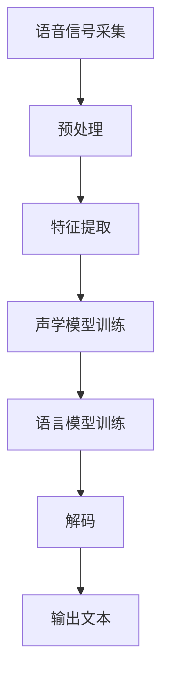

#### 2.2 自然语言处理基础

自然语言处理（NLP）是计算机科学领域与人工智能领域中的一个重要分支，它涉及到计算机和人类（自然）语言之间的互动。在CUI技术中，NLP负责理解用户的自然语言输入，并将其转化为计算机可以执行的操作。以下是NLP的一些基础概念：

1. **词嵌入（Word Embedding）**：词嵌入是将词汇映射为低维向量的一种技术，它通过学习词汇的上下文信息来表示词汇的语义。常见的词嵌入方法包括Word2Vec和GloVe。

2. **词性标注（Part-of-Speech Tagging）**：词性标注是NLP中的一项基本任务，它为文本中的每个单词分配一个词性标签，如名词、动词、形容词等。

3. **句法分析（Parsing）**：句法分析旨在理解句子的结构，通常包括词组层次分析（如XBar理论）和依存句法分析。

4. **语义分析（Semantic Analysis）**：语义分析是理解文本中的含义，包括语义角色标注、实体识别、关系抽取等。

5. **上下文理解（Contextual Understanding）**：上下文理解是NLP中的一个高级任务，它涉及理解词汇在不同上下文中的含义，以减少歧义。

以下是一个NLP系统的Mermaid流程图：

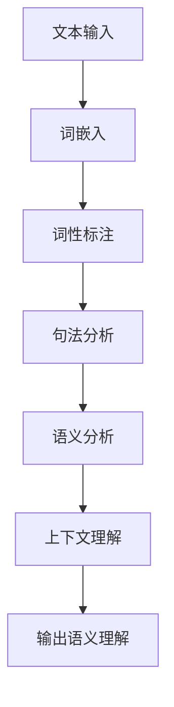

#### 2.3 CUI系统架构

CUI系统是一个复杂的系统，它通常包括多个组件，这些组件协同工作，以提供高效、自然的用户交互体验。以下是CUI系统的一个典型架构：

1. **用户接口层**：用户接口层是CUI系统与用户交互的界面，可以是图形界面（GUI）、命令行界面（CLI）或语音用户界面（VUI）。

2. **语音识别模块**：语音识别模块负责将用户的语音输入转换为文本。这个模块通常包括语音信号采集、预处理、特征提取、声学模型和语言模型。

3. **自然语言处理模块**：自然语言处理模块负责理解用户的文本输入，并将其转化为计算机可以执行的操作。这个模块通常包括词嵌入、词性标注、句法分析、语义分析和上下文理解。

4. **任务执行模块**：任务执行模块负责根据NLP模块的处理结果，执行相应的任务。这个模块通常与具体的业务逻辑或应用系统集成。

5. **反馈与优化模块**：反馈与优化模块负责收集用户的操作反馈，并对系统进行优化，以提高用户体验。

以下是一个简单的CUI系统架构的Mermaid流程图：

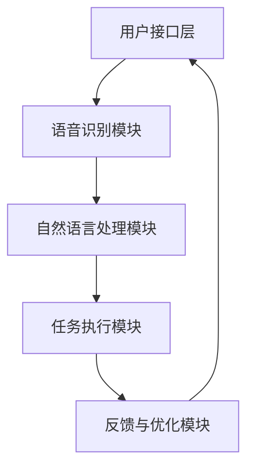

#### 2.4 CUI系统的工作流程

CUI系统的工作流程可以概括为以下几个步骤：

1. **用户输入**：用户通过语音或文本输入提出请求。

2. **语音识别**：语音识别模块将语音输入转换为文本。

3. **自然语言处理**：自然语言处理模块对文本进行解析，提取语义信息。

4. **任务执行**：任务执行模块根据解析结果，执行相应的任务。

5. **反馈与优化**：系统收集用户的反馈，并进行优化，以提高用户体验。

以下是一个CUI系统工作流程的Mermaid流程图：

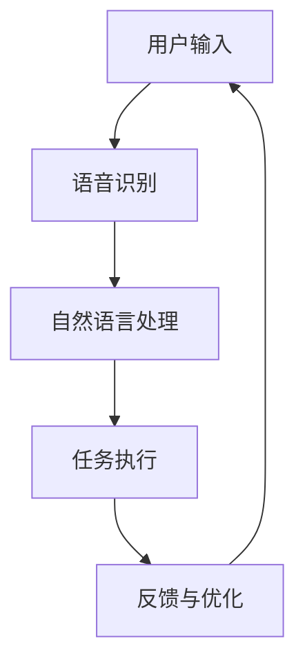

通过以上内容，我们可以看到CUI技术的基础组成部分及其工作原理。在接下来的章节中，我们将进一步探讨CUI在任务导向设计中的应用和实践。

---

### 第三部分：任务导向设计实践

#### 第3章：用户任务分析

#### 第4章：CUI设计与实现

### 第3章：用户任务分析

在数字产品设计中，任务导向设计（Task-Oriented Design，TOD）强调以用户任务为核心，设计目标是帮助用户高效地完成特定任务。因此，用户任务分析是任务导向设计的首要步骤，它涉及到了解用户的任务流程、任务分解、任务模型构建等方面。本章将详细探讨用户任务分析的方法和过程。

#### 3.1 用户任务分析方法论

用户任务分析方法论主要包括用户行为研究和任务场景分析两个环节。通过这两个环节，可以全面了解用户的需求和习惯，为任务导向设计提供有力的支持。

##### 3.1.1 用户行为研究

用户行为研究是用户任务分析的基础，它旨在通过观察和记录用户在使用产品或服务时的行为，了解用户的操作习惯和需求。以下是一些常用的用户行为研究方法：

1. **问卷调查**：通过设计问卷，收集用户对产品或服务的看法、使用习惯、需求等信息。问卷调查的优点是成本低、覆盖面广，但存在主观性和样本代表性问题。

2. **访谈**：通过面对面或远程访谈，深入了解用户的使用场景、需求和心理。访谈的优点是能够获取深入、详细的用户信息，但成本较高、耗时较长。

3. **用户测试**：在实验室或实际使用环境中，观察用户在使用产品或服务时的行为和反馈。用户测试的优点是能够实时观察用户的行为，但需要专业的测试环境和技术支持。

4. **日志分析**：通过分析用户在产品或服务中的操作日志，了解用户的访问路径、操作频率、错误率等信息。日志分析的优点是数据量大、客观性高，但可能无法深入了解用户的真实需求和习惯。

##### 3.1.2 任务场景分析

任务场景分析是用户任务分析的另一个重要环节，它旨在通过分析用户完成任务的具体场景，了解用户的任务流程、任务目标和任务障碍。以下是一些常用的任务场景分析方法：

1. **任务流图**：任务流图是一种图形化的表示方法，用于描述用户完成任务的过程。任务流图通常包括任务起点、任务步骤、任务终点和任务之间的关系。通过绘制任务流图，可以清晰地展示用户完成任务的全过程。

2. **用户故事**：用户故事是一种简明扼要的描述方法，用于描述用户在特定场景下需要完成的任务。用户故事通常包括任务背景、任务目标、任务步骤和任务结果。通过编写用户故事，可以更好地理解用户的需求和期望。

3. **任务分解**：任务分解是将复杂的任务分解为更小、更具体的子任务的方法。通过任务分解，可以更清晰地了解每个子任务的目标和执行方式。任务分解的方法包括层次分解、分解矩阵等。

4. **任务场景模拟**：任务场景模拟是通过模拟用户完成任务的具体场景，观察用户的行为和反馈。任务场景模拟可以识别任务执行中的潜在问题和瓶颈，为设计优化提供依据。

以下是一个用户任务流图的示例：

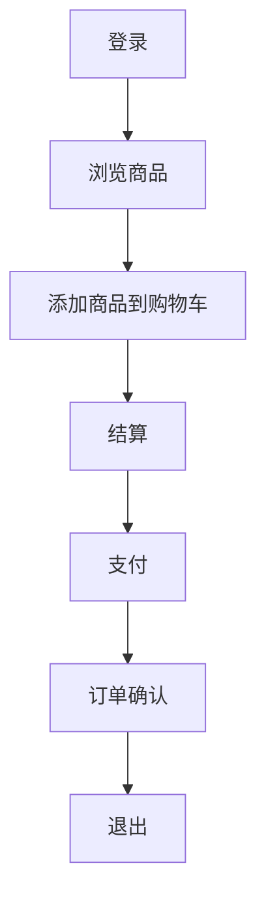

#### 3.2 用户任务模型构建

用户任务模型是对用户任务流程和任务场景的抽象和表示，它有助于设计师和开发人员更好地理解用户的需求和行为，为任务导向设计提供指导。以下是一些构建用户任务模型的方法：

1. **任务分解法**：任务分解法是将用户任务分解为更小、更具体的子任务，然后对每个子任务进行详细描述。通过任务分解法，可以清晰地展示用户完成任务的全过程，便于分析和优化。

2. **用户故事地图**：用户故事地图是一种将用户故事和任务流程相结合的表示方法，它可以帮助设计师和开发人员从用户的角度出发，全面了解用户的需求和期望。用户故事地图通常包括用户故事、任务流程和关键功能模块。

3. **任务流程图**：任务流程图是一种图形化的表示方法，用于描述用户完成任务的过程。任务流程图可以展示任务的起点、任务步骤、任务终点和任务之间的关系，有助于分析和优化任务流程。

4. **任务场景仿真**：任务场景仿真是通过模拟用户完成任务的具体场景，观察用户的行为和反馈，识别任务执行中的潜在问题和瓶颈。任务场景仿真可以帮助设计师和开发人员更好地理解用户的需求和行为，为设计优化提供依据。

以下是一个用户任务模型的示例：

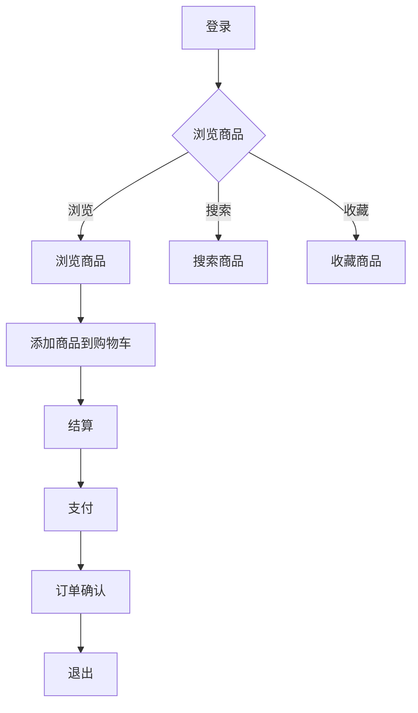

通过以上方法，可以构建出详细的用户任务模型，为任务导向设计提供有力支持。在接下来的章节中，我们将进一步探讨CUI在任务导向设计中的应用和实践。

---

### 第4章：CUI设计与实现

#### 4.1 CUI交互设计原则

#### 4.2 CUI功能模块设计

#### 4.3 任务导向设计案例解析

### 第4章：CUI设计与实现

计算机用户界面（CUI）在数字产品设计中扮演着至关重要的角色，它不仅决定了用户与系统之间的交互方式，还直接影响用户的体验和产品的功能实现。本章将详细探讨CUI的交互设计原则、功能模块设计，以及任务导向设计的实际案例。

#### 4.1 CUI交互设计原则

CUI交互设计的原则是确保用户能够轻松、高效地与系统互动，以下是一些关键设计原则：

1. **直观性**：界面设计应简单直观，减少用户的学习成本。使用熟悉的图标、按钮和操作流程，避免复杂的设计元素。

2. **一致性**：界面元素的一致性对于用户体验至关重要。应确保按钮、菜单、颜色和字体等在系统中保持一致，以提高用户对系统的熟悉度。

3. **反馈**：及时反馈是CUI设计的重要部分。用户执行操作后，系统应提供明确的反馈，如声音提示、动画效果或文本提示，确保用户了解操作结果。

4. **可访问性**：界面设计应考虑到不同用户的需求，包括视觉障碍、听力障碍等。使用高对比度的颜色、可自定义的字体大小和声音提示，确保所有人都能使用系统。

5. **灵活性**：设计应允许用户根据自己的习惯和需求进行个性化设置，如调整界面布局、选择不同的交互模式等。

6. **响应性**：界面应能够适应不同设备和屏幕尺寸，提供一致的用户体验。响应式设计是实现这一目标的关键。

#### 4.2 CUI功能模块设计

CUI的功能模块设计是确保系统能够执行用户请求并提供相应服务的关键。以下是一些关键功能模块：

1. **语音识别模块**：该模块负责将用户的语音输入转换为文本。它包括语音信号处理、特征提取、声学模型和语言模型等组件。

2. **自然语言处理模块**：该模块负责理解用户的文本输入，提取语义信息。它包括词嵌入、词性标注、句法分析、语义分析和上下文理解等组件。

3. **任务执行模块**：该模块根据自然语言处理的结果，执行具体的任务。它可能包括查询信息、控制设备、执行应用程序等。

4. **用户接口模块**：该模块是用户与系统互动的界面，包括文本输入框、语音输入框、按钮、菜单等。

5. **反馈与优化模块**：该模块负责收集用户的操作反馈，并对系统进行优化，以提高用户体验。

以下是一个CUI系统功能模块的Mermaid流程图：

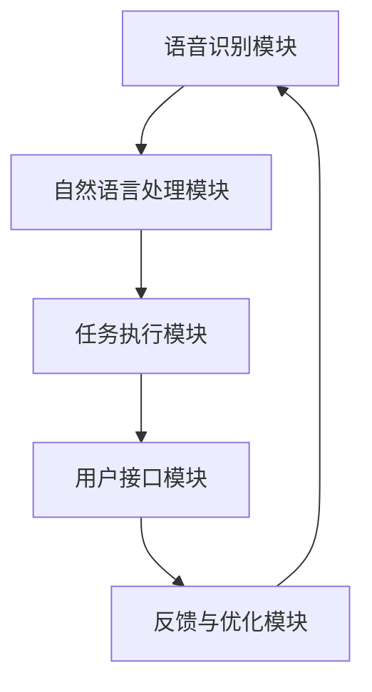

#### 4.3 任务导向设计案例解析

为了更好地理解CUI在任务导向设计中的应用，以下通过一个实际案例进行解析。

**案例：智能助理系统**

智能助理系统是一个典型的CUI应用，它可以帮助用户完成各种日常任务，如查询信息、设置提醒、预约服务等。以下是该案例的设计和实现过程：

1. **用户任务分析**：首先，通过用户行为研究和任务场景分析，了解用户的需求和任务流程。例如，用户可能需要查询天气、设置闹钟、发送邮件等。

2. **任务模型构建**：根据用户任务分析的结果，构建任务模型。任务模型应包括每个任务的步骤、目标和预期结果。

3. **CUI交互设计**：设计用户与系统交互的界面。界面应简洁直观，包括语音输入框、文本输入框、按钮等。

4. **功能模块实现**：
   - **语音识别模块**：实现语音识别功能，将用户的语音输入转换为文本。
   - **自然语言处理模块**：理解用户的文本输入，提取语义信息，如任务类型、关键词等。
   - **任务执行模块**：根据自然语言处理的结果，执行具体的任务，如查询天气、设置闹钟、发送邮件等。
   - **用户接口模块**：展示任务执行结果，提供反馈和进一步操作的选择。

5. **反馈与优化**：收集用户反馈，优化任务执行流程和用户体验。

以下是一个智能助理系统工作流程的Mermaid流程图：

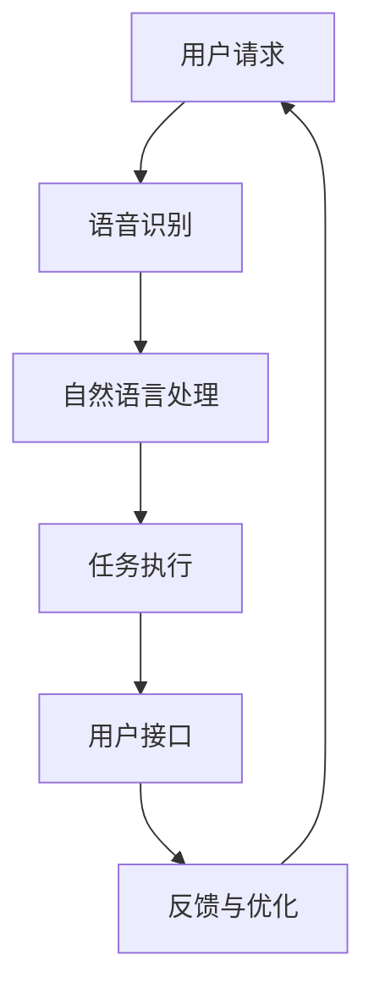

通过这个案例，我们可以看到CUI在任务导向设计中的应用，它通过自然语言交互，简化了用户操作，提高了任务执行效率。在接下来的章节中，我们将进一步探讨CUI系统集成与优化的策略。

---

### 第四部分：CUI系统集成与优化

#### 第5章：CUI系统集成方法

#### 第6章：CUI性能优化策略

#### 第7章：CUI系统案例分析

### 第5章：CUI系统集成方法

在数字产品设计中，CUI（计算机用户界面）的集成是一个复杂而关键的过程，它决定了CUI能否有效地支持用户的任务执行，并提升整体用户体验。本章将详细探讨CUI系统集成的方法，包括系统集成流程、系统测试与评估，以及CUI与现有系统集成的最佳实践。

#### 5.1 CUI系统集成流程

CUI系统集成是一个涉及多个步骤的复杂过程，以下是一个典型的CUI系统集成流程：

1. **需求分析**：首先，需要对CUI的功能和性能要求进行详细分析，明确CUI的预期目标和用户需求。这包括了解用户界面需求、交互逻辑、任务流程等。

2. **系统设计**：在需求分析的基础上，进行CUI系统的设计。系统设计包括确定CUI的技术架构、模块划分、接口定义等。设计文档应详细描述每个模块的功能和交互方式。

3. **技术选型**：根据系统设计，选择合适的技术和工具。例如，选择适合的语音识别引擎、自然语言处理库、用户界面框架等。

4. **模块开发**：按照系统设计，开发各个功能模块。开发过程中，应确保模块之间的高内聚和低耦合，便于后续的系统集成。

5. **集成测试**：在各个模块开发完成后，进行集成测试。集成测试旨在验证各个模块的协同工作是否正常，确保CUI系统能够按照设计要求执行任务。

6. **用户测试**：邀请实际用户参与测试，收集用户反馈，验证CUI系统是否满足用户需求，并优化用户体验。

7. **部署上线**：完成测试后，将CUI系统集成到产品中，并进行部署上线。部署过程中，应确保系统的稳定性和安全性。

8. **后续维护**：系统上线后，持续进行维护和优化，根据用户反馈和市场需求，不断更新和改进CUI系统。

以下是一个CUI系统集成流程的Mermaid流程图：

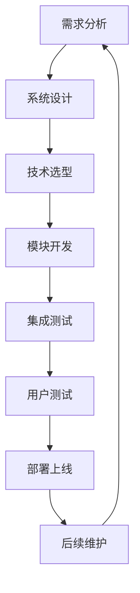

#### 5.2 系统测试与评估

系统测试与评估是CUI集成过程中的关键环节，它决定了CUI系统的性能和可靠性。以下是系统测试与评估的主要内容：

1. **功能测试**：功能测试旨在验证CUI系统的各个功能是否正常，包括语音识别、自然语言处理、任务执行等。

2. **性能测试**：性能测试旨在评估CUI系统的响应速度、处理能力和稳定性。常见的性能测试指标包括响应时间、吞吐量、并发用户数等。

3. **用户测试**：用户测试旨在通过实际用户的使用体验，评估CUI系统的可用性、易用性和用户体验。

4. **安全性测试**：安全性测试旨在评估CUI系统的安全性能，包括数据保护、权限管理、网络通信安全等。

5. **兼容性测试**：兼容性测试旨在验证CUI系统在不同设备和操作系统上的兼容性，确保系统能够在不同环境下正常运行。

6. **回归测试**：在系统更新和修改后，进行回归测试，确保新功能不影响原有功能的正常运作。

以下是一个系统测试与评估流程的Mermaid流程图：

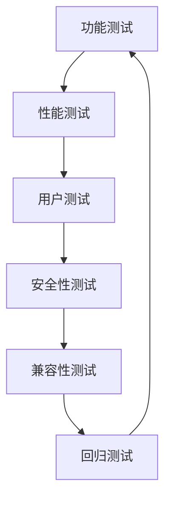

#### 5.3 CUI与现有系统的集成

在集成CUI时，常常需要将其与现有的系统进行整合，以下是一些最佳实践：

1. **接口定义**：在集成前，明确CUI与现有系统的接口定义，包括数据格式、通信协议等。

2. **数据共享**：确保CUI系统能够与其他系统共享数据，如用户信息、任务状态等。

3. **权限管理**：集成过程中，应确保CUI系统与其他系统之间的权限管理一致，防止数据泄露和非法访问。

4. **数据同步**：在CUI系统与其他系统之间存在数据依赖时，确保数据同步的及时性和准确性。

5. **兼容性调整**：根据现有系统的特点和限制，进行必要的调整，确保CUI系统能够与现有系统无缝集成。

6. **文档记录**：详细记录集成过程中的接口定义、配置参数、数据同步策略等，便于后续维护和优化。

通过以上方法，可以有效地实现CUI与现有系统的集成，确保CUI系统在数字产品中的稳定运行和高效支持。

### 第6章：CUI性能优化策略

在数字产品设计中，CUI（计算机用户界面）的性能直接影响用户体验和系统的整体效率。本章将详细探讨CUI性能优化策略，包括语音识别优化、自然语言处理优化，以及系统整体性能的提升方法。

#### 6.1 语音识别优化

语音识别是CUI系统的重要组成部分，其性能直接影响到用户交互的流畅性。以下是一些语音识别优化的策略：

1. **声学模型优化**：
   - **增强预处理**：通过更高级的预处理技术，如波束形成、回声消除等，提高语音信号的清晰度。
   - **模型参数调整**：根据特定应用场景，调整声学模型的参数，如隐马尔可夫模型（HMM）的状态数、门限值等，以提高识别准确性。

2. **语言模型优化**：
   - **词汇优化**：针对用户常见的语音输入，优化语言模型中的词汇表，减少错误率。
   - **上下文建模**：使用上下文信息，如历史对话、用户偏好等，构建更准确的上下文语言模型，提高识别准确性。

3. **实时错误修正**：在语音识别过程中，引入实时错误修正机制，如动态词汇插入、删除和替换，以减少错误积累。

4. **自适应调整**：根据用户反馈和识别效果，实时调整识别参数，如音量、语速等，以适应不同用户和场景。

以下是一个语音识别优化策略的Mermaid流程图：

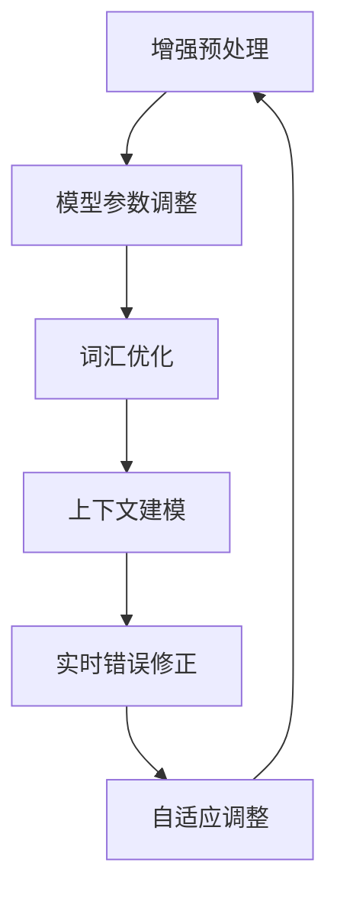

#### 6.2 自然语言处理优化

自然语言处理（NLP）是CUI系统中理解用户意图的关键部分。以下是一些NLP优化的策略：

1. **词嵌入优化**：
   - **词向量更新**：定期更新词嵌入模型，以反映词汇的最新用法和趋势。
   - **个性化词嵌入**：根据用户的历史交互数据，构建个性化的词嵌入模型，提高语义理解准确性。

2. **句法分析优化**：
   - **语法规则扩展**：扩展句法分析规则库，以处理更复杂的句子结构和语法现象。
   - **上下文依赖建模**：使用深度学习技术，如转换器（Transformer），构建更准确的上下文依赖模型，提高句法分析精度。

3. **语义分析优化**：
   - **实体识别与抽取**：引入先进的实体识别和抽取技术，如BERT、GPT等，提高关键信息的提取准确性。
   - **语义角色标注**：细化语义角色标注，明确动作、对象、状态等，提高语义理解的深度。

4. **上下文理解优化**：
   - **多轮对话理解**：通过多轮对话理解，逐步积累上下文信息，提高对长句和复杂语义的理解能力。
   - **多模态融合**：结合语音、文本、图像等多模态信息，提高上下文理解的准确性和多样性。

以下是一个自然语言处理优化策略的Mermaid流程图：

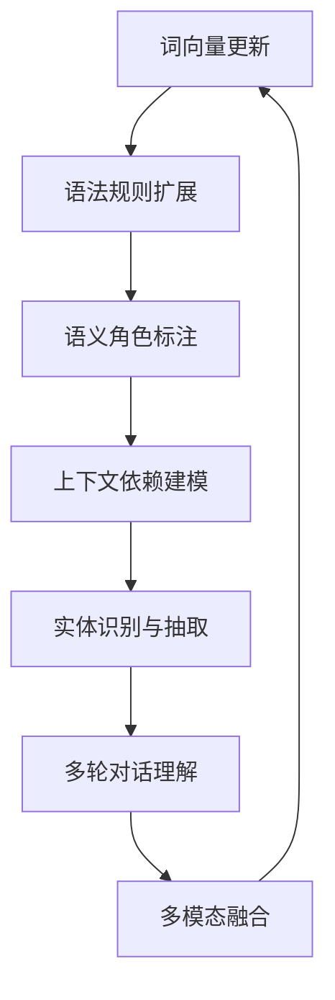

#### 6.3 系统整体性能提升

除了针对语音识别和自然语言处理进行优化，还需要从系统整体层面提升CUI的性能。以下是一些提升系统整体性能的策略：

1. **并行处理**：引入并行处理技术，如多线程、分布式计算等，提高系统处理速度和吞吐量。

2. **缓存机制**：使用缓存机制，存储常用数据和结果，减少重复计算和数据库查询，提高响应速度。

3. **负载均衡**：通过负载均衡技术，将用户请求分配到不同的服务器和资源上，确保系统稳定运行。

4. **内存管理**：优化内存分配和使用策略，减少内存泄漏和资源浪费，提高系统性能。

5. **网络优化**：优化网络传输策略，如压缩数据、减少请求次数等，提高网络通信效率。

以下是一个系统整体性能提升策略的Mermaid流程图：

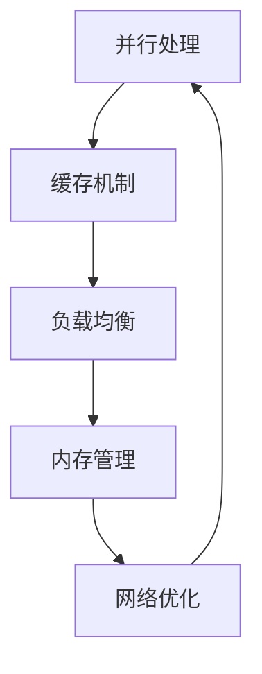

通过以上策略，可以显著提升CUI系统的性能，为用户提供更加流畅、高效的使用体验。在接下来的章节中，我们将进一步探讨CUI与人工智能的结合趋势。

### 第7章：CUI与人工智能结合

在数字产品设计领域，CUI（计算机用户界面）与人工智能（AI）的结合正在逐渐成为主流趋势。这种结合不仅提升了CUI的功能和智能化水平，还为用户提供了更加个性化和高效的服务。本章将详细探讨CUI与人工智能的结合方式、应用案例以及未来的发展趋势。

#### 7.1 CUI与人工智能技术融合

CUI与人工智能的结合主要体现在以下几个方面：

1. **语音识别与生成**：通过深度学习技术，如循环神经网络（RNN）和变换器（Transformer），实现更准确的语音识别和自然语言生成。这种技术可以提升CUI的自然交互能力，使用户与系统的沟通更加流畅。

2. **自然语言处理**：人工智能技术可以帮助CUI更准确地理解用户的自然语言输入，包括语义分析、情感分析和上下文理解。这使CUI能够更深入地理解用户的需求，提供更加个性化和精准的服务。

3. **智能推荐系统**：结合机器学习算法，CUI可以实时分析用户的行为和偏好，提供智能推荐服务。例如，在电子商务平台上，CUI可以根据用户的浏览历史和购买记录，推荐相关商品。

4. **图像识别与处理**：人工智能技术可以用于图像识别和图像处理，提升CUI的视觉交互能力。例如，在智能家居系统中，CUI可以通过图像识别控制家电设备，如通过摄像头控制灯光和窗帘。

5. **情感计算**：通过情感计算技术，CUI可以识别用户的情感状态，如快乐、愤怒、沮丧等，并相应地调整交互方式和响应策略。这有助于提高用户的满意度。

以下是一个CUI与人工智能技术融合的示例：

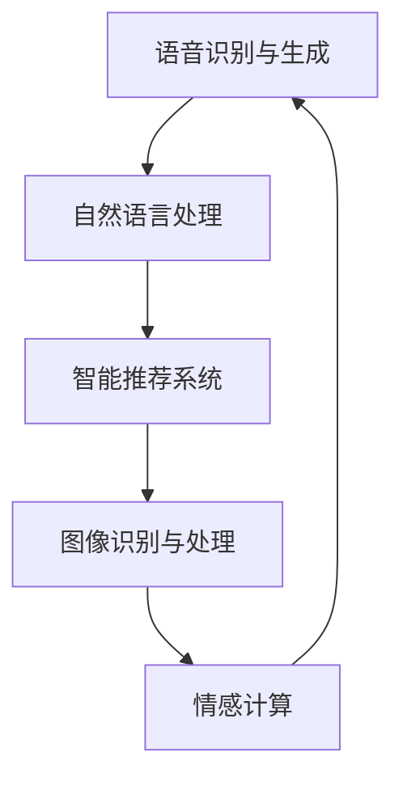

#### 7.2 智能助理案例分析

智能助理是CUI与人工智能结合的一个典型应用案例。以下是一个智能助理的具体案例分析：

**案例：智能助理系统**

智能助理系统是一个集成语音识别、自然语言处理、智能推荐和图像识别等多种人工智能技术的综合系统。其功能包括：

1. **语音识别与交互**：用户可以通过语音与智能助理进行交互，如查询天气、设置提醒、发送邮件等。

2. **自然语言理解**：智能助理通过自然语言处理技术，准确理解用户的语音输入，提取关键词和语义信息。

3. **智能推荐**：智能助理可以根据用户的历史交互数据，推荐相关的信息和服务，如电影推荐、购物推荐等。

4. **图像识别**：智能助理可以通过图像识别技术，识别用户的指令，如通过摄像头控制家居设备。

5. **情感理解**：智能助理通过情感计算技术，识别用户的情感状态，提供个性化的交互体验。

以下是一个智能助理系统的工作流程：

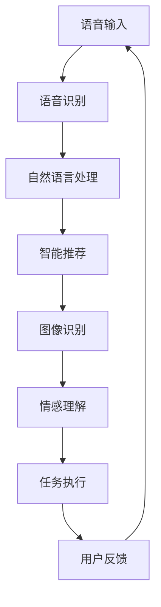

通过这个案例，我们可以看到CUI与人工智能技术的融合如何提升系统的智能化水平和用户体验。

#### 7.3 CUI与人工智能的发展趋势

随着人工智能技术的不断发展，CUI与人工智能的结合趋势也呈现出以下几个方向：

1. **更自然的交互**：未来CUI将更加注重自然语言理解和多模态交互，使用户与系统的沟通更加流畅和人性化。

2. **个性化服务**：通过深度学习和个性化推荐技术，CUI将能够更精准地满足用户的个性化需求，提供高度定制化的服务。

3. **跨平台集成**：CUI将与各种设备和平台深度集成，如智能手机、智能手表、智能家居设备等，实现无缝的用户体验。

4. **智能化决策支持**：CUI将不仅仅是一个信息展示和交互界面，还将成为智能化决策支持系统，为用户提供智能化的建议和决策。

5. **安全与隐私保护**：随着人工智能技术的应用，CUI在数据安全和用户隐私保护方面将面临新的挑战，未来的CUI需要更加重视这些问题。

通过以上发展趋势，我们可以看到CUI与人工智能的结合将带来更加智能、个性化和高效的数字产品设计，为用户创造更加丰富和便捷的使用体验。

### 第8章：CUI设计实践总结与建议

在CUI（计算机用户界面）设计实践中，通过多个案例的分析和验证，我们积累了许多宝贵的经验和教训。这些经验和教训不仅有助于提高CUI设计的效率和效果，还为未来的优化路径提供了重要的参考。以下是CUI设计实践中的主要经验与教训，以及提出的一些建议。

#### 8.1 经验与教训总结

1. **用户需求分析的重要性**：在CUI设计过程中，用户需求分析是关键环节。通过深入的用户调研和行为分析，我们可以准确把握用户的需求和痛点，从而设计出更加符合用户期望的交互界面。

2. **技术选型的谨慎性**：在选择CUI技术时，需要根据具体的应用场景和性能要求，谨慎选择合适的语音识别引擎、自然语言处理库等。技术选型的正确性直接影响到CUI的性能和用户体验。

3. **交互设计的直观性**：CUI的交互设计应注重直观性和一致性。使用户能够通过简洁的界面和熟悉的交互方式，快速理解和使用系统功能，是提高用户体验的重要手段。

4. **反馈机制的及时性**：CUI应提供及时、明确的反馈机制，确保用户在操作过程中能够清楚地了解系统状态和操作结果。有效的反馈机制可以提升用户的满意度和信任感。

5. **性能优化的持续性**：CUI的性能优化是一个持续的过程。通过对系统运行数据的分析，不断优化语音识别、自然语言处理等模块，可以提高系统的稳定性和响应速度。

6. **安全性与隐私保护**：在CUI设计中，安全性和隐私保护尤为重要。必须确保用户数据的安全存储和传输，遵守相关法律法规，保护用户的隐私权益。

#### 8.2 设计建议与优化路径

1. **强化用户需求分析**：在CUI设计初期，应投入更多精力进行用户需求分析。通过定量和定性研究方法，深入了解用户的行为习惯、需求痛点和使用场景，为设计提供有力依据。

2. **灵活选择技术方案**：在选择CUI技术方案时，应充分考虑系统的实际需求和技术成熟度。可以采用模块化设计，灵活组合不同的技术组件，以实现最佳的性能和用户体验。

3. **注重交互设计细节**：在交互设计过程中，应注重细节和用户体验。通过用户测试和反馈，不断优化界面布局、交互流程和视觉元素，确保用户能够轻松、高效地使用系统。

4. **持续进行性能优化**：定期对CUI系统进行性能测试和优化，识别并解决系统瓶颈。可以采用机器学习算法，对用户行为数据进行分析，实现个性化性能调优。

5. **加强安全性与隐私保护**：在CUI设计中，必须将安全性和隐私保护纳入整体设计考虑。采用加密传输、访问控制等技术措施，确保用户数据的安全和隐私。

6. **搭建完善的技术支持体系**：建立一支技术支持团队，负责CUI系统的日常维护、问题诊断和性能优化。同时，提供用户培训和技术文档，帮助用户更好地使用系统。

7. **推动跨领域合作**：CUI技术涉及多个领域，包括计算机科学、人工智能、人机交互等。通过跨领域合作，可以借鉴其他领域的成功经验，推动CUI技术的不断创新和发展。

通过以上建议和优化路径，我们可以更好地实现CUI设计的价值，为用户提供更加智能、高效和安全的数字产品体验。

### 附录

#### 附录A：CUI设计工具与资源

在CUI设计中，使用合适的工具和资源可以显著提高设计效率和效果。以下是一些常用的CUI设计工具和资源：

1. **设计工具**：
   - **Sketch**：一款流行的UI设计工具，支持矢量绘图和界面布局。
   - **Figma**：一款在线协作设计工具，支持多人实时协作和交互设计。
   - **Adobe XD**：一款专注于用户体验设计的工具，支持原型制作和交互设计。

2. **语音识别与自然语言处理库**：
   - **TensorFlow**：一个开源的机器学习库，支持深度学习模型训练和部署。
   - **PyTorch**：一个开源的深度学习库，提供灵活的模型构建和优化工具。
   - **ESPNet**：一款开源的语音识别库，支持多种语音识别模型。

3. **技术资源与学习指南**：
   - **GitHub**：众多CUI相关项目的代码和文档，供开发者学习和参考。
   - **arXiv**：发布最新研究成果的预印本库，包括语音识别、自然语言处理等领域的论文。
   - **在线课程与教程**：如Coursera、edX等平台上的相关课程，提供系统性的学习资源。

#### 附录B：CUI相关术语解释

以下是对一些常见的CUI相关术语的解释：

1. **CUI**（Computer User Interface）：计算机用户界面，是用户与计算机系统交互的界面，包括图形界面（GUI）、命令行界面（CLI）和语音用户界面（VUI）等。

2. **语音识别**（Speech Recognition）：将语音信号转换为文本信息的技术，是CUI的重要组成部分。

3. **自然语言处理**（Natural Language Processing，NLP）：使计算机能够理解、解释和生成人类语言的技术，包括文本解析、语义分析、情感分析等。

4. **词嵌入**（Word Embedding）：将词汇映射为低维向量的一种技术，用于表示词汇的语义信息。

5. **声学模型**（Acoustic Model）：在语音识别中，用于匹配语音信号和特征向量的模型。

6. **语言模型**（Language Model）：用于预测用户输入文本序列的模型，通常用于提高语音识别的准确性。

7. **任务导向设计**（Task-Oriented Design，TOD）：一种以用户任务为核心的设计方法，旨在帮助用户高效地完成特定任务。

8. **智能助理**（Intelligent Assistant）：一种集成多种人工智能技术的智能系统，能够提供个性化、智能化的服务。

9. **上下文理解**（Contextual Understanding）：在NLP中，理解文本的上下文信息，以减少歧义和提高语义理解准确性。

10. **用户体验**（User Experience，UX）：用户在使用产品或服务过程中的整体感受和体验，包括界面设计、交互流程、性能等。

通过以上术语的解释，可以更好地理解和应用CUI设计中的关键概念和技术。

---

本文由AI天才研究院（AI Genius Institute）撰写，结合了禅与计算机程序设计艺术的理念，旨在为数字产品设计领域的专业人士提供深入的技术分析和实践指导。作者对CUI（计算机用户界面）在任务导向设计中的应用进行了详细的探讨，涵盖了CUI的概念、技术基础、设计原则、功能模块设计，以及实际案例解析和性能优化策略。同时，本文还总结了CUI设计实践的经验与教训，并提出了未来的优化路径和建议。通过本文的阅读，读者将能够全面了解CUI在任务导向设计中的重要作用，以及如何有效地将其应用于实际项目中，以提升用户体验和系统性能。感谢您的阅读，希望本文对您的数字产品设计工作有所启发和帮助。如果您有任何疑问或建议，欢迎随时与我们联系。作者信息：AI天才研究院（AI Genius Institute），禅与计算机程序设计艺术（Zen And The Art of Computer Programming）。

