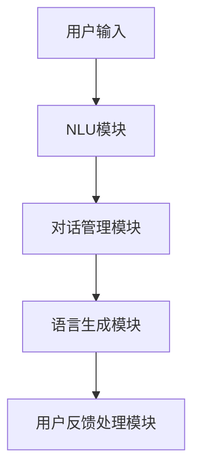

                 

## 文章标题

CUI改变数字产品设计的信息架构

### 关键词
CUI, 数字产品设计, 信息架构, 自然语言处理, 对话系统, 用户体验

### 摘要
本文深入探讨了CUI（Conversational User Interface，会话式用户界面）在数字产品设计中的变革性作用。通过分析CUI的核心概念、架构设计、交互设计与实现技巧，以及其在电子商务、智能家居和金融科技等领域的应用案例，本文揭示了CUI如何提升用户体验、优化信息架构，并展望了其未来的发展趋势和挑战。文章旨在为读者提供一个全面、系统的CUI技术指南，以推动数字产品的创新与发展。

### 引言

在数字技术迅猛发展的今天，用户对数字产品的期望越来越高。他们不仅追求功能的强大和操作的简便，更希望获得个性化的服务和无缝的交互体验。为了满足这些需求，数字产品设计师们不断探索新的交互方式，会话式用户界面（Conversational User Interface，简称CUI）应运而生。

CUI是一种通过自然语言处理、语音识别和对话系统等技术，使得用户可以通过对话的形式与数字产品或服务进行交互的界面设计。与传统的图形用户界面（GUI）相比，CUI提供了一种更加自然、直观和智能的交互方式，使用户在与系统的互动中感受到更加人性化的体验。本文将围绕CUI的核心概念、架构设计、交互设计与实现技巧，以及其在实际应用中的案例，展开深入探讨，旨在为数字产品设计提供新的视角和思路。

### 第一部分：CUI基础与设计理念

#### 第1章：CUI概述

#### 1.1 CUI的定义与核心概念

CUI（Conversational User Interface，会话式用户界面）是一种用户与数字产品或服务进行交互的方式。它通过自然语言处理（NLP）、语音识别（VR）、对话系统（DS）等技术，使得用户可以通过对话的形式与系统进行交互，从而提供更加人性化、智能化的用户体验。CUI的核心概念包括自然性、交互性和上下文感知。

**自然性**：CUI允许用户使用自然语言与系统进行对话，不再局限于按钮、菜单等传统界面元素。用户可以像与朋友交流一样与系统交流，使用户体验更加自然和亲切。

**交互性**：CUI能够理解用户意图，并提供相应的响应，实现双向的交流。用户可以通过对话与系统进行信息交换，而系统可以根据用户的反馈进行智能化的调整和优化。

**上下文感知**：CUI能够根据对话的上下文来理解用户的意图，从而提供更加准确的响应。CUI可以记住对话的历史信息，并在后续的对话中引用这些信息，提高交互的连贯性和准确性。

#### 1.2 CUI的关键特征

CUI与传统UI相比，具有以下几个关键特征：

**1. 易于使用**：CUI通过自然语言交互，降低了用户的学习成本和操作难度，使得用户可以更加轻松地使用数字产品。

**2. 高效性**：CUI能够快速理解用户的意图，并提供相应的响应，提高了用户的操作效率和满意度。

**3. 个性化**：CUI可以根据用户的偏好和行为数据，提供个性化的服务和建议，满足用户的个性化需求。

**4. 智能化**：CUI通过自然语言处理和人工智能技术，能够实现智能化的交互，提供更加智能化和人性化的服务。

**5. 适应性**：CUI可以根据不同的使用场景和用户需求，进行自适应的调整和优化，提供最佳的用户体验。

#### 1.3 CUI与传统UI的区别

**1. 交互方式**：传统UI依赖于图形界面，用户需要点击、拖拽等操作，而CUI则是通过文本或语音进行对话。

**2. 用户体验**：CUI提供了一种更加自然、直观和智能的交互方式，用户可以像与真实的人交流一样与系统互动，而传统UI则可能显得机械化。

**3. 开发难度**：CUI的开发需要涉及自然语言处理、语音识别等技术，比传统UI的开发复杂，但也能够提供更好的用户体验。

#### 1.4 CUI的设计理念

CUI的设计理念主要包括以下几个方面：

**1. 以用户为中心**：CUI的设计应该以满足用户的需求和体验为首要目标，关注用户的使用习惯和操作偏好，提供最佳的用户体验。

**2. 以情境为基准**：CUI的设计需要考虑不同的使用场景和情境，提供相应的交互方式和功能，确保用户在不同情境下能够获得良好的交互体验。

**3. 以智能化为导向**：CUI的设计应该利用人工智能技术，实现智能化的交互，提供更加智能化和个性化的服务。

**4. 以可扩展性为前提**：CUI的设计需要考虑未来的扩展性，能够根据用户反馈和技术进步进行迭代和优化，以适应不断变化的需求。

#### 1.5 CUI的发展历史

CUI的概念最早可以追溯到20世纪80年代的专家系统，随着人工智能技术的发展，尤其是自然语言处理和语音识别技术的进步，CUI逐渐从理论研究走向实际应用。目前，CUI已经成为数字产品设计的重要方向，被广泛应用于电子商务、智能家居、金融科技等领域。

随着5G和物联网的普及，CUI的应用前景将更加广阔。未来，CUI将成为数字产品的标准配置，改变人们与数字世界的交互方式。

### 第二部分：CUI架构与实现

#### 第2章：CUI架构解析

#### 2.1 CUI的组成要素

CUI（Conversational User Interface，会话式用户界面）的组成要素主要包括以下三个核心部分：语言模型、自然语言理解和上下文管理。

##### 2.1.1 语言模型

语言模型（Language Model）是CUI的核心组件之一，它负责生成自然的文本响应。语言模型基于大量的文本数据训练得到，可以理解用户输入的文本，并根据上下文生成相应的回复。语言模型主要有以下几种类型：

1. **n-gram模型**：n-gram模型是一种基于统计的方法，它通过计算单词序列的概率来生成文本。这种方法简单高效，但在处理长文本时效果较差。

2. **循环神经网络（RNN）**：RNN通过记忆历史信息来处理序列数据，可以更好地理解长文本。RNN的变体，如长短期记忆（LSTM）和门控循环单元（GRU），进一步提高了模型处理长文本的能力。

3. **Transformer模型**：Transformer模型是近年来在自然语言处理领域取得重大突破的一种模型，它通过自注意力机制（Self-Attention）来处理序列数据，能够生成更加自然的文本响应。

语言模型的核心伪代码如下：

```python
function generate_response(input_text, model):
    # 嵌入输入文本
    embedded_input = model.embeddings(input_text)
    
    # 通过Transformer模型生成文本响应
    response = model.generate(embedded_input)
    
    # 解码生成的文本响应
    decoded_response = model.decode(response)
    
    return decoded_response
```

##### 2.1.2 自然语言理解

自然语言理解（Natural Language Understanding，NLU）是CUI的另一个关键组成部分，它负责将用户输入的自然语言文本转化为机器可以理解和处理的格式。NLU通常包括以下几个步骤：

1. **分词（Tokenization）**：将输入文本分割成单词或子词。

2. **词性标注（Part-of-Speech Tagging）**：为每个单词标注其词性，如名词、动词、形容词等。

3. **句法分析（Syntax Parsing）**：分析句子结构，确定词与词之间的语法关系。

4. **意图识别（Intent Recognition）**：识别用户的意图，如查询、命令、请求等。

5. **实体识别（Entity Recognition）**：识别文本中的关键信息，如人名、地点、时间等。

NLU的核心伪代码如下：

```python
function understand_language(input_text, nlu_model):
    # 分词
    tokens = nlu_model.tokenize(input_text)

    # 词性标注
    tagged_tokens = nlu_model.tag_tokens(tokens)

    # 句法分析
    parse_tree = nlu_model.parse(tokens)

    # 意图识别
    intent = nlu_model.recognize_intent(parse_tree)

    # 实体识别
    entities = nlu_model.recognize_entities(parse_tree)

    return intent, entities
```

##### 2.1.3 上下文管理

上下文管理（Context Management）是CUI能够持续、准确地为用户提供服务的关键。上下文管理包括以下几个方面：

1. **当前上下文状态**：记录当前对话的状态，如用户的行为、系统的操作等。

2. **历史上下文记录**：记录对话的历史信息，以便在后续对话中提供相关的参考。

3. **上下文更新与维护**：在对话过程中，根据用户的输入和系统的响应实时更新上下文状态。

上下文管理的核心伪代码如下：

```python
class ContextManager:
    def __init__(self):
        self.current_context = None
        self.history_contexts = []

    def update_context(self, new_context):
        self.current_context = new_context
        self.history_contexts.append(new_context)

    def get_context(self):
        return self.current_context

    def get_history_contexts(self):
        return self.history_contexts
```

通过上述三个组成部分，CUI能够实现与用户的自然对话，提供更加智能化、个性化的服务。在下一章中，我们将深入探讨CUI的架构设计，包括其基本架构、关键组件及其交互方式。

### 2.2 CUI的架构设计

CUI（Conversational User Interface，会话式用户界面）的架构设计是确保其功能性和用户体验的关键。CUI的架构通常包括三个主要组件：语言模型、自然语言理解和上下文管理。以下是对这些组件的详细描述及其在架构中的交互方式。

#### 2.2.1 CUI系统的基本架构

CUI系统的基本架构通常包括以下几个部分：

1. **用户输入处理模块**：负责接收用户的输入，并将其传递给NLU（Natural Language Understanding，自然语言理解）模块。
2. **NLU模块**：负责对用户输入进行解析，包括分词、词性标注、句法分析和意图识别。
3. **对话管理模块**：负责管理对话流程，包括上下文维护、对话状态跟踪和对话逻辑控制。
4. **语言生成模块**：基于用户输入和对话上下文，利用语言模型生成合适的响应文本。
5. **用户反馈处理模块**：负责处理用户的反馈，并对其进行相应的响应。

下图是CUI系统的基本架构图：



#### 2.2.2 CUI的关键组件及其交互

1. **语言模型**

语言模型（Language Model）是CUI的核心组件之一，它负责生成自然的文本响应。语言模型通过学习大量的文本数据，能够预测下一个词或句子，从而生成连贯的对话文本。语言模型与对话管理模块紧密交互，对话管理模块将用户的输入和上下文状态传递给语言模型，语言模型则生成相应的响应文本。

2. **自然语言理解（NLU）模块**

自然语言理解模块（NLU）负责解析用户的输入，将其转化为机器可以理解的形式。NLU模块包括分词、词性标注、句法分析和意图识别等功能。NLU模块与对话管理模块紧密交互，将解析后的意图和实体信息传递给对话管理模块，以便进行后续的处理。

3. **对话管理模块**

对话管理模块（Dialogue Management）负责管理整个对话流程，包括对话上下文的管理、对话状态的跟踪和对话逻辑的控制。对话管理模块通过NLU模块获取用户的意图和实体信息，然后结合上下文状态，决定如何响应用户。对话管理模块还负责更新上下文状态，以便在后续的对话中保持一致性。

4. **语言生成模块**

语言生成模块（Language Generation）负责将用户的输入和对话上下文转化为自然语言响应。语言生成模块通常使用预训练的语言模型，如BERT、GPT等，生成自然、连贯的文本响应。语言生成模块与对话管理模块紧密交互，根据对话管理模块的指示生成响应文本。

5. **用户反馈处理模块**

用户反馈处理模块（User Feedback Processing）负责处理用户的反馈，包括对用户满意度的评估、错误处理的反馈等。用户反馈处理模块与对话管理模块和语言生成模块交互，根据用户的反馈调整对话策略和生成策略，以提高用户体验。

#### 2.2.3 CUI架构的优化策略

CUI架构的优化策略主要包括以下几个方面：

1. **并行处理**：为了提高系统的响应速度，可以采用并行处理技术，将不同的组件进行并行处理，如NLU和对话管理模块的并行处理。

2. **缓存策略**：在CUI系统中，可以采用缓存策略，将常用的响应文本和上下文信息进行缓存，以提高响应速度。

3. **动态调整**：根据用户的反馈和对话上下文，动态调整CUI的对话策略和生成策略，以提高用户体验。

4. **持续学习**：CUI系统可以采用持续学习技术，根据用户的交互数据不断优化语言模型和NLU模型，以提高系统的准确性和智能化程度。

通过上述架构设计和优化策略，CUI系统能够提供更加智能、个性化的服务，满足用户的多样化需求。在下一章中，我们将深入探讨CUI的设计技巧，包括交互设计、语言设计和用户体验优化等方面。

### 3.3 用户体验优化

用户体验（User Experience，UX）优化是CUI设计过程中的关键环节，它关系到用户对CUI系统的满意度、留存率和忠诚度。以下是CUI用户体验优化的几个关键策略：

#### 3.3.1 用户体验评估

用户体验评估是优化CUI系统的第一步，它帮助设计者了解当前系统的优势和不足，从而有针对性地进行改进。以下是一些常用的用户体验评估方法：

1. **可用性测试**：

