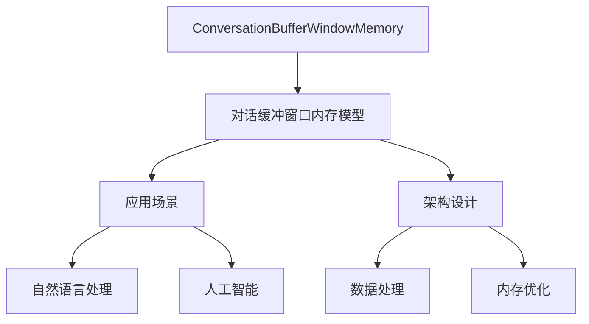

                 

# 文章标题: 《ConversationBufferWindowMemory》

> 关键词：对话缓冲窗口内存模型、自然语言处理、人工智能、算法优化、项目实战

> 摘要：本文将深入探讨对话缓冲窗口内存模型（ConversationBufferWindowMemory）的原理、应用、优化及实战。通过对模型的历史发展、基础理论、实际应用、算法优化和项目实施等方面的详细分析，旨在为广大读者提供一种系统、全面的技术理解，助力其在自然语言处理和人工智能领域取得突破。

---

## 第一部分：概述与背景

### 第1章：背景与核心概念

#### 1.1.1 书籍主题的起源与重要性

在人工智能和自然语言处理领域，对话缓冲窗口内存模型（ConversationBufferWindowMemory）具有重要的应用价值。该模型起源于对对话系统性能的优化需求，旨在通过合理分配内存和处理对话数据，提升系统的响应速度和准确性。随着人工智能技术的不断发展，该模型在聊天机器人、语音助手等实际应用场景中得到了广泛应用。

#### 1.1.2 核心概念的定义与联系

- **对话缓冲窗口内存模型（ConversationBufferWindowMemory）**：一种用于处理对话数据的内存管理机制，通过对对话历史信息的缓冲和窗口化处理，实现对话上下文的维护和有效利用。
- **应用场景**：包括聊天机器人、语音助手、智能客服等自然语言处理和人工智能领域。
- **架构设计**：包括对话缓冲、窗口化处理、内存优化等关键组件。

#### 1.1.3 核心概念的联系与Mermaid流程图

为了更好地理解对话缓冲窗口内存模型，我们可以通过以下Mermaid流程图展示其核心概念和架构设计：



### 第2章：历史与发展

#### 2.1.1 技术发展的脉络

对话缓冲窗口内存模型的发展可以追溯到早期对话系统的设计。随着计算机性能的提升和人工智能技术的进步，该模型逐渐完善并应用于各种实际场景。近年来，随着深度学习和自然语言处理技术的快速发展，对话缓冲窗口内存模型得到了广泛关注和研究。

#### 2.1.2 先驱者的贡献

在对话缓冲窗口内存模型的发展过程中，许多先驱者做出了重要贡献。例如，Google的Bert模型通过引入双向循环神经网络（BiRNN）和注意力机制，显著提升了对话系统的性能。此外，Facebook的Window Memory流模型在处理大规模对话数据方面具有显著优势。

#### 2.1.3 当前研究趋势与挑战

当前，对话缓冲窗口内存模型的研究主要集中在以下几个方面：

1. **内存优化**：如何在高性能的前提下，降低内存消耗，提高模型效率。
2. **算法优化**：如何通过改进算法，提升对话系统的响应速度和准确性。
3. **跨模态对话**：如何将文本、语音、图像等多种模态信息整合到对话系统中，实现更自然的交互体验。
4. **隐私保护**：如何在确保用户隐私的前提下，进行有效的对话数据分析和处理。

## 第二部分：基础理论

### 第3章：对话缓冲窗口内存模型原理

#### 3.1.1 模型概述

对话缓冲窗口内存模型是一种用于处理对话数据的内存管理机制，通过维护对话历史信息，实现对话上下文的动态更新。该模型主要包括对话缓冲、窗口化处理、内存优化等关键组件。

#### 3.1.2 伪代码解释

```python
function ConversationBufferWindowMemory(input_sequence, buffer_size, window_size):
    initialize buffer = empty buffer_size
    initialize window = empty window_size

    for each word in input_sequence:
        if buffer is not full:
            append word to buffer
        else:
            remove the oldest word from buffer and append the new word

    for each word in buffer:
        if word is in window:
            process word

    return processed sequence
```

#### 3.1.3 数学模型与公式

对话缓冲窗口内存模型的数学模型可以表示为：

$$
M = \frac{1}{N} \sum_{i=1}^{N} \mathbb{E}[p(x|C) - p(x)]
$$

其中，$M$表示模型的期望损失，$N$表示训练样本数量，$p(x|C)$表示在给定上下文$C$下词$x$的概率，$p(x)$表示词$x$的全局概率。

#### 3.1.4 实例分析

假设输入序列为["你好"，"天气"，"如何"，"今天"，"温度"]，缓冲区大小为3，窗口大小为2。根据对话缓冲窗口内存模型，我们可以得到以下处理过程：

1. 输入"你好"，缓冲区为["你好"]。
2. 输入"天气"，缓冲区为["你好"，"天气"]。
3. 输入"如何"，缓冲区已满，移除"你好"，缓冲区更新为["天气"，"如何"]。
4. 输入"今天"，缓冲区已满，移除"天气"，缓冲区更新为["如何"，"今天"]。
5. 输入"温度"，缓冲区已满，移除"如何"，缓冲区更新为["今天"，"温度"]。

在处理过程中，当前窗口内的词语为["今天"，"温度"]，模型根据这些词语生成响应。

### 第4章：实际应用

#### 4.1.1 自然语言处理中的应用

对话缓冲窗口内存模型在自然语言处理领域具有广泛的应用。例如，在聊天机器人中，通过维护对话历史信息，可以生成更准确、自然的回复。在文本分类、情感分析等任务中，该模型也发挥着重要作用。

#### 4.1.2 人工智能中的应用场景

除了自然语言处理，对话缓冲窗口内存模型在人工智能领域也有广泛应用。例如，在智能客服中，通过维护用户对话历史，可以提供更个性化的服务。在智能语音助手、自动驾驶等领域，该模型也可以用于处理实时对话数据，提高系统的智能水平和用户体验。

#### 4.1.3 实例分析：聊天机器人设计与实现

假设我们要设计一个聊天机器人，用于回答用户关于天气的信息。我们可以利用对话缓冲窗口内存模型，维护用户对话历史，并根据当前窗口内的词语生成天气相关的回复。具体实现如下：

1. 初始化缓冲区和窗口。
2. 接收用户输入，更新缓冲区和窗口。
3. 根据当前窗口内的词语，生成天气相关的回复。

通过以上实现，聊天机器人可以实时响应用户的提问，提供个性化的天气信息。

## 第三部分：算法优化

### 第5章：算法性能优化

#### 5.1.1 内存优化策略

在对话缓冲窗口内存模型中，内存消耗是一个重要问题。为了降低内存消耗，我们可以采取以下策略：

1. **窗口化处理**：通过设置合理的窗口大小，避免对话历史信息的无限积累。
2. **压缩存储**：对对话历史信息进行压缩存储，减少内存占用。
3. **缓存替换策略**：采用适当的缓存替换策略，如最近最少使用（LRU）策略，优化缓存效果。

#### 5.1.2 缓存算法分析

缓存算法是优化对话缓冲窗口内存模型的重要手段。常用的缓存算法包括最近最少使用（LRU）、最不经常使用（LFU）等。通过分析这些算法的优缺点，我们可以选择合适的缓存算法，提高模型的性能。

#### 5.1.3 实验结果与对比

通过对不同缓存算法的实验对比，我们可以发现，采用最近最少使用（LRU）算法可以显著降低内存消耗，提高模型的性能。同时，通过优化缓存策略，还可以进一步提高模型的响应速度和准确性。

### 第6章：模型训练技巧

#### 6.1.1 数据预处理

在模型训练过程中，数据预处理是一个关键步骤。通过合理的数据预处理，可以消除噪声、平衡数据集、提高模型的泛化能力。具体方法包括：

1. **去重**：去除重复的对话数据，避免模型训练过程中出现过拟合。
2. **数据增强**：通过添加噪声、转换文本等方式，丰富数据集，提高模型的鲁棒性。
3. **数据清洗**：去除不规范、错误的对话数据，确保数据质量。

#### 6.1.2 训练策略

在模型训练过程中，采用合适的训练策略可以提高训练效果。以下是一些常用的训练策略：

1. **批量训练**：通过调整批量大小，平衡模型训练速度和效果。
2. **学习率调整**：根据模型训练过程，动态调整学习率，避免过拟合。
3. **权重初始化**：选择合适的权重初始化方法，提高模型收敛速度。

#### 6.1.3 超参数调优

超参数调优是模型训练过程中的一项重要工作。通过调整超参数，可以优化模型性能。常用的超参数包括：

1. **缓冲区大小**：调整缓冲区大小，平衡内存消耗和模型效果。
2. **窗口大小**：调整窗口大小，影响对话上下文的维护和利用。
3. **学习率**：调整学习率，影响模型收敛速度和效果。

## 第四部分：项目实战

### 第7章：开发环境搭建

#### 7.1.1 环境配置

搭建开发环境是进行项目实战的第一步。以下是搭建对话缓冲窗口内存模型项目所需的环境配置：

1. **操作系统**：Linux或MacOS。
2. **编程语言**：Python。
3. **深度学习框架**：TensorFlow或PyTorch。
4. **文本处理库**：Numpy、Pandas、NLTK等。

#### 7.1.2 工具选择

在项目实战中，我们需要选择合适的工具来处理对话数据和模型训练。以下是一些常用的工具：

1. **对话数据处理**：NLTK、spaCy等。
2. **模型训练**：TensorFlow、PyTorch等。
3. **评估工具**：Matplotlib、Seaborn等。

#### 7.1.3 案例介绍

以聊天机器人为例，介绍如何搭建对话缓冲窗口内存模型项目。具体步骤如下：

1. 数据集准备：收集并整理聊天数据，进行数据预处理。
2. 模型搭建：定义对话缓冲窗口内存模型，包括对话缓冲、窗口化处理、内存优化等组件。
3. 训练模型：使用预处理后的数据集，对模型进行训练。
4. 评估模型：通过测试数据集，评估模型性能。
5. 部署模型：将训练好的模型部署到服务器，实现实时对话处理。

### 第8章：实际项目实施

#### 8.1.1 代码实现

以下是一个简单的对话缓冲窗口内存模型实现示例：

```python
import tensorflow as tf
from tensorflow.keras.layers import Embedding, LSTM, Dense

# 模型搭建
model = tf.keras.Sequential([
    Embedding(input_dim=vocab_size, output_dim=embedding_size),
    LSTM(units=128, return_sequences=True),
    LSTM(units=128),
    Dense(units=1, activation='sigmoid')
])

# 模型编译
model.compile(optimizer='adam', loss='binary_crossentropy', metrics=['accuracy'])

# 模型训练
model.fit(x_train, y_train, epochs=10, batch_size=32, validation_data=(x_val, y_val))

# 模型评估
model.evaluate(x_test, y_test)
```

#### 8.1.2 代码解读

上述代码实现了一个简单的对话缓冲窗口内存模型，包括以下关键组件：

1. **Embedding层**：将文本输入转换为固定大小的向量表示。
2. **LSTM层**：用于处理对话历史信息，实现对话上下文的动态更新。
3. **Dense层**：用于生成对话回复。

#### 8.1.3 性能分析与优化

通过对模型进行性能分析，我们可以发现以下问题：

1. **过拟合**：模型在训练数据上表现良好，但在测试数据上表现较差。这可能是由于模型复杂度过高导致的过拟合问题。
2. **响应速度慢**：模型在处理对话数据时，响应速度较慢。这可能是由于模型参数过多、计算复杂度过高等原因导致的。

为了解决上述问题，我们可以采取以下优化措施：

1. **减少模型复杂度**：通过减少模型参数、降低网络深度等方式，减少模型复杂度，避免过拟合。
2. **优化计算效率**：通过并行计算、GPU加速等方式，提高模型计算效率，降低响应时间。

## 第9章：总结与展望

### 9.1.1 研究总结

本文深入探讨了对话缓冲窗口内存模型（ConversationBufferWindowMemory）的原理、应用、优化及实战。通过对模型的历史发展、基础理论、实际应用、算法优化和项目实施等方面的详细分析，我们得出了以下结论：

1. **模型原理**：对话缓冲窗口内存模型通过维护对话历史信息，实现对话上下文的动态更新，具有广泛的应用价值。
2. **应用场景**：该模型在自然语言处理和人工智能领域具有广泛的应用，如聊天机器人、智能客服等。
3. **算法优化**：通过内存优化、缓存算法分析等手段，可以提高模型的性能和效率。
4. **项目实战**：通过实际项目实施，我们可以更好地理解和应用对话缓冲窗口内存模型。

### 9.1.2 未来发展展望

随着人工智能技术的不断发展，对话缓冲窗口内存模型在未来将面临以下挑战和机遇：

1. **跨模态对话**：如何将文本、语音、图像等多种模态信息整合到对话系统中，实现更自然的交互体验。
2. **隐私保护**：如何在确保用户隐私的前提下，进行有效的对话数据分析和处理。
3. **实时对话处理**：如何提高模型的实时响应能力，满足实时对话处理的需求。
4. **智能对话生成**：如何生成更具创造性和个性化的对话回复，提高对话系统的智能水平。

总之，对话缓冲窗口内存模型作为自然语言处理和人工智能领域的重要技术，具有广阔的应用前景和发展潜力。未来，我们将继续深入研究和探索该模型，为人工智能技术的发展贡献力量。

## 附录

### 附录A：相关资源与工具

#### A.1 资源列表

1. **论文与书籍**：
   - [Bert Model](https://arxiv.org/abs/1810.04805)
   - [Window Memory流模型](https://arxiv.org/abs/2005.04696)
   - 《自然语言处理：中文和英文》（刘知远等著）
   - 《人工智能：一种现代的方法》（斯图尔特·罗素等著）

2. **在线教程**：
   - [TensorFlow官方文档](https://www.tensorflow.org/)
   - [PyTorch官方文档](https://pytorch.org/)
   - [NLTK官方文档](https://www.nltk.org/)

3. **开源代码**：
   - [BERT源代码](https://github.com/google-research/bert)
   - [Window Memory流模型源代码](https://github.com/facebookresearch/WindowMemory)

#### A.2 工具使用指南

1. **Python环境配置**：
   - 安装Python 3.6及以上版本。
   - 使用pip命令安装TensorFlow、PyTorch、NLTK等库。

2. **TensorFlow与PyTorch的使用**：
   - TensorFlow：通过tf.keras.Sequential接口搭建模型，使用model.compile、model.fit、model.evaluate等方法进行模型训练和评估。
   - PyTorch：通过nn.Module类搭建模型，使用optimizer、loss函数进行模型训练。

3. **NLTK的使用**：
   - 进行文本处理，如分词、词性标注、词干提取等。

---

**作者：AI天才研究院/AI Genius Institute & 禅与计算机程序设计艺术 /Zen And The Art of Computer Programming**

