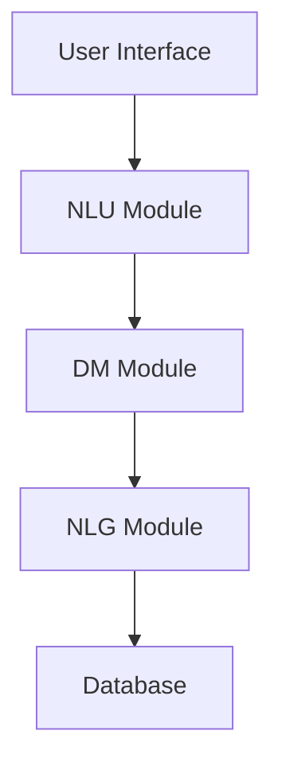

                 

# 《Dialogue Systems原理与代码实例讲解》

> 关键词：对话系统，自然语言理解，自然语言生成，对话管理，BERT模型，朴素贝叶斯算法

> 摘要：本文深入探讨了Dialogue Systems的原理与实现，从基础概念到实际代码实例，全面讲解了对话系统的构建方法与优化策略。通过对关键技术的详细分析，以及具体的代码实现与解读，帮助读者掌握对话系统的开发与优化技巧。

## 目录大纲

## 第一部分: Dialogue Systems基础

### 第1章: Dialogue Systems概述

#### 1.1 Dialogue Systems的定义与发展历程

#### 1.2 Dialogue Systems的基本结构

#### 1.3 Dialogue Systems的关键技术

### 第2章: Dialogue Systems的核心概念与原理

#### 2.1 Dialogue Management

#### 2.2 Natural Language Understanding

#### 2.3 Natural Language Generation

### 第3章: Dialogue Systems的数学模型与算法

#### 3.1 Dialogue Systems中的数学模型

#### 3.2 常见Dialogue Systems算法

#### 3.3 Dialogue Systems算法性能评估

## 第二部分: Dialogue Systems应用

### 第4章: Dialogue Systems在客服中的应用

#### 4.1 客服Dialogue Systems的设计与实现

#### 4.2 客服Dialogue Systems的性能优化

#### 4.3 客服Dialogue Systems的案例解析

### 第5章: Dialogue Systems在虚拟助手中的应用

#### 5.1 虚拟助手Dialogue Systems的设计与实现

#### 5.2 虚拟助手Dialogue Systems的交互优化

#### 5.3 虚拟助手Dialogue Systems的案例解析

### 第6章: Dialogue Systems在教育中的应用

#### 6.1 教育Dialogue Systems的设计与实现

#### 6.2 教育Dialogue Systems的教学效果评估

#### 6.3 教育Dialogue Systems的案例解析

## 第三部分: Dialogue Systems开发实践

### 第7章: Dialogue Systems开发环境与工具

#### 7.1 Dialogue Systems开发环境的搭建

#### 7.2 Dialogue Systems开发工具的使用

#### 7.3 Dialogue Systems开发资源推荐

### 第8章: Dialogue Systems代码实例讲解

#### 8.1 Dialogue System实现的基本架构

#### 8.2 实现一个简单的Dialogue System

#### 8.3 Dialogue System性能优化实战

#### 8.4 Dialogue System案例分析

## 附录

### 附录A: Dialogue Systems常见问题与解答

### 附录B: Dialogue Systems参考资料与拓展阅读

### 附录C: Dialogue Systems项目实践指南

---

## 第一部分: Dialogue Systems基础

### 第1章: Dialogue Systems概述

#### 1.1 Dialogue Systems的定义与发展历程

 Dialogue Systems，即对话系统，是一种智能系统，它可以模拟人类的对话过程，与用户进行自然交互，完成特定任务。对话系统的概念最早可以追溯到20世纪60年代，随着计算机技术的发展，对话系统的研究和应用逐渐深入。

 在早期，对话系统主要是基于规则的方法，即通过预定义的规则来处理用户输入，这种方法的缺点是可扩展性差，难以应对复杂多变的对话场景。随着自然语言处理技术的进步，特别是深度学习的发展，对话系统开始采用基于统计和神经网络的方法，使得对话系统的性能得到了显著提升。

 目前，对话系统在客服、虚拟助手、教育等多个领域得到了广泛应用。例如，一些大型电商平台已经部署了智能客服系统，可以自动回答用户的问题，提高客户服务质量；在虚拟助手领域，Siri、Alexa等智能助手已经成为人们生活中不可或缺的一部分；在教育领域，一些对话系统被用于辅助教学，提供个性化的学习体验。

#### 1.2 Dialogue Systems的基本结构

Dialogue Systems的基本结构可以分为三个主要模块：自然语言理解（Natural Language Understanding, NLU）、对话管理（Dialogue Management）和自然语言生成（Natural Language Generation, NLG）。

**自然语言理解（NLU）**：NLU模块负责接收用户的输入，将其转换为机器可以理解和处理的结构化数据。这一过程通常包括词法分析、句法分析和语义分析等步骤。词法分析将文本分割成单词或词汇单元，句法分析构建句子的语法结构，而语义分析则关注文本的实际含义。

**对话管理**：对话管理模块负责控制对话流程，根据用户的输入和系统的状态，决定下一步的操作。它通常包含策略学习、状态跟踪和对话决策三个子模块。策略学习用于确定对话的走向，状态跟踪用于记录对话的历史信息，对话决策用于生成系统响应。

**自然语言生成（NLG）**：NLG模块负责将对话管理模块生成的内部表示转换为自然语言的文本输出，以响应用户。NLG可以采用模板匹配、规则生成或统计模型等方法。

#### 1.3 Dialogue Systems的关键技术

**自然语言理解（NLU）**：NLU是Dialogue Systems的基础，其核心技术包括词法分析、句法分析和语义分析。词法分析主要使用分词技术，句法分析使用句法解析技术，语义分析则涉及实体识别、关系抽取和语义角色标注等技术。

**对话管理**：对话管理的关键技术包括策略学习、状态跟踪和对话决策。策略学习通常采用强化学习、隐马尔可夫模型（HMM）或变换器-解码器（Transformer-Decoder）等方法。状态跟踪使用历史信息记录对话的上下文，对话决策则基于策略学习和状态跟踪，生成系统的响应。

**自然语言生成（NLG）**：NLG的核心技术包括模板匹配、规则生成和统计模型。模板匹配和规则生成适合处理结构化数据，而统计模型，如序列到序列（Seq2Seq）模型和Transformer模型，适合生成自然流畅的语言。

### 总结

本章对Dialogue Systems进行了概述，介绍了其定义、基本结构以及关键技术。对话系统的发展历程展示了计算机技术对人类生活方式的深刻影响，而其基本结构和关键技术则为后续的深入讨论奠定了基础。在接下来的章节中，我们将进一步探讨对话系统的核心概念和原理，以及其实际应用和开发实践。

---

## 第二部分: Dialogue Systems的核心概念与原理

### 第2章: Dialogue Systems的核心概念与原理

#### 2.1 Dialogue Management

Dialogue Management是对话系统的核心模块，负责管理整个对话过程。它的目标是理解用户的意图，并根据对话的历史上下文生成合适的响应。Dialogue Management通常包括以下三个关键子模块：

**策略学习（Policy Learning）**：策略学习是Dialogue Management的核心任务，它通过学习用户输入和系统响应之间的映射关系，生成对话策略。策略学习可以采用多种方法，包括规则方法、统计方法和机器学习方法。

**状态跟踪（State Tracking）**：状态跟踪用于记录对话的历史信息，包括用户的意图、系统之前的响应以及对话的状态等。状态跟踪可以帮助对话系统更好地理解上下文，从而生成更恰当的响应。

**对话决策（Dialogue Decision）**：对话决策是基于策略学习和状态跟踪的结果，生成系统的响应。对话决策需要考虑多个因素，如用户的意图、对话的历史上下文、系统的资源限制等。

在策略学习中，常用的方法包括规则方法、统计方法和机器学习方法。规则方法是通过手工编写规则来实现对话策略，适用于简单和固定的对话场景。统计方法基于用户输入和系统响应的统计特征，生成对话策略。机器学习方法，如决策树、随机森林和支持向量机（SVM）等，可以通过学习大量的对话数据，自动生成高效的对话策略。

状态跟踪是实现自然和流畅对话的重要手段。在状态跟踪中，常用的数据结构包括历史对话记录、意图表示和上下文状态等。历史对话记录记录了对话的历史信息，意图表示将用户的输入转换为系统可以理解的格式，上下文状态则反映了对话的当前状态。

对话决策是基于策略学习和状态跟踪的结果，生成系统的响应。对话决策需要考虑多个因素，如用户的意图、对话的历史上下文、系统的资源限制等。通过对话决策，对话系统可以生成自然、流畅且符合用户期望的响应。

#### 2.2 Natural Language Understanding

Natural Language Understanding（NLU）是对话系统的第一步，负责将用户的自然语言输入转换为机器可以理解和处理的结构化数据。NLU的核心任务是理解用户的意图，从而为对话管理模块提供基础。NLU通常包括以下步骤：

**词法分析（Lexical Analysis）**：词法分析是将文本分割成单词或词汇单元。这一步骤的目的是去除标点符号、停用词等无关信息，提取出对语义分析有价值的词汇。

**句法分析（Syntactic Analysis）**：句法分析是构建句子的语法结构，分析句子中的词与词之间的语法关系。句法分析可以帮助识别句子中的主语、谓语、宾语等成分，从而更好地理解句子的含义。

**语义分析（Semantic Analysis）**：语义分析是理解文本的实际含义，包括实体识别、关系抽取和语义角色标注等。实体识别用于识别文本中的名词实体，如人名、地名、组织名等；关系抽取用于识别实体之间的关系，如朋友、同事、所在地等；语义角色标注则用于识别句子中的动词和名词之间的关系，如买、吃、住等。

在NLU中，常用的技术包括分词、词性标注、句法分析、命名实体识别和关系抽取等。分词是将文本分割成单词或词汇单元，常用的分词工具包括jieba、nltk等。词性标注是将文本中的每个单词标注为名词、动词、形容词等，常用的词性标注工具包括NLTK、Stanford NLP等。句法分析用于构建句子的语法结构，常用的工具包括Stanford NLP、spaCy等。命名实体识别和关系抽取则是用于提取文本中的实体和关系，常用的工具包括spaCy、AllenNLP等。

NLU在对话系统中的作用至关重要。通过NLU，对话系统可以理解用户的输入，提取出关键信息，从而更好地进行对话管理。同时，NLU还可以帮助对话系统识别和纠正用户的输入错误，提高对话的准确性和用户体验。

#### 2.3 Natural Language Generation

Natural Language Generation（NLG）是对话系统的最后一步，负责将对话管理模块生成的内部表示转换为自然语言的文本输出。NLG的目标是生成自然、流畅且符合用户期望的文本响应。NLG通常包括以下步骤：

**文本生成（Text Generation）**：文本生成是将对话管理模块生成的内部表示转换为自然语言的文本。文本生成可以采用模板匹配、规则生成和统计模型等方法。模板匹配和规则生成适用于结构化数据，可以快速生成文本响应。统计模型，如序列到序列（Seq2Seq）模型和Transformer模型，可以生成更自然、流畅的文本响应。

**语法检查（Grammar Checking）**：语法检查是确保生成的文本符合语法规则，没有语法错误。语法检查可以采用规则方法、统计方法和深度学习方法。规则方法通过预定义的语法规则进行文本检查，统计方法通过分析大量文本数据，识别和纠正语法错误，深度学习方法，如递归神经网络（RNN）和Transformer模型，可以通过学习文本数据，自动识别和纠正语法错误。

**语义优化（Semantic Optimization）**：语义优化是确保生成的文本符合用户的意图和期望。语义优化可以通过分析用户的输入和对话的历史上下文，调整生成的文本，使其更符合用户的意图。语义优化可以采用规则方法、统计方法和深度学习方法。

在NLG中，常用的技术包括模板匹配、规则生成、统计模型和深度学习方法。模板匹配和规则生成适用于结构化数据，可以快速生成文本响应。统计模型，如序列到序列（Seq2Seq）模型和Transformer模型，可以生成更自然、流畅的文本响应。深度学习方法，如递归神经网络（RNN）和Transformer模型，可以生成高质量的文本响应。

NLG在对话系统中的作用至关重要。通过NLG，对话系统可以生成自然、流畅且符合用户期望的文本响应，提高用户的满意度。同时，NLG还可以帮助对话系统实现个性化对话，根据用户的偏好和需求，生成个性化的文本响应。

### 总结

本章详细介绍了Dialogue Systems的核心概念与原理，包括Dialogue Management、Natural Language Understanding和Natural Language Generation。通过这些核心概念和原理，对话系统可以更好地理解用户的意图，生成自然的文本响应，实现高效、流畅的对话。在接下来的章节中，我们将进一步探讨Dialogue Systems的数学模型与算法，以及其实际应用和开发实践。

---

## 第三部分: Dialogue Systems的数学模型与算法

### 第3章: Dialogue Systems的数学模型与算法

#### 3.1 Dialogue Systems中的数学模型

Dialogue Systems中的数学模型主要用于描述对话过程中的概率分布和决策过程。这些模型可以帮助对话系统更好地理解用户的意图，优化对话管理策略。以下是一些常用的数学模型：

**概率图模型**：概率图模型是一种基于图论的数学模型，用于描述变量之间的概率分布。在Dialogue Systems中，常用的概率图模型包括贝叶斯网络和隐马尔可夫模型（HMM）。

- **贝叶斯网络**：贝叶斯网络是一种基于概率的图模型，用于表示变量之间的条件依赖关系。在对话系统中，贝叶斯网络可以用于建模用户的意图和对话状态。例如，可以通过贝叶斯网络来表示用户输入和系统响应之间的概率关系。

$$
P(\text{意图}|\text{输入}, \text{状态}) = \frac{P(\text{输入}|\text{意图}, \text{状态}) \cdot P(\text{意图}|\text{状态})}{P(\text{输入}|\text{状态})}
$$

- **隐马尔可夫模型（HMM）**：隐马尔可夫模型是一种基于状态转移概率的模型，用于描述隐藏状态序列的概率分布。在对话系统中，HMM可以用于建模对话的动态变化过程。例如，可以通过HMM来表示对话状态之间的转移概率。

$$
P(\text{状态}_t|\text{状态}_{t-1}) = \pi_t
$$

**马尔可夫决策过程（MDP）**：马尔可夫决策过程是一种基于概率的决策模型，用于描述在不确定性环境中进行决策的过程。在对话系统中，MDP可以用于建模对话管理策略。例如，可以通过MDP来优化对话管理策略，以最大化用户满意度。

$$
V^*(s) = \max_a \{ \gamma Q(s, a) + (1 - \gamma) V^*(s') \}
$$

其中，$V^*(s)$ 表示状态 $s$ 的最优价值，$a$ 表示动作，$Q(s, a)$ 表示状态 $s$ 在执行动作 $a$ 后的价值，$\gamma$ 表示折扣因子。

**变分推断**：变分推断是一种用于解决概率图模型和马尔可夫决策过程的方法。通过变分推断，可以将复杂的概率模型转化为更易处理的近似模型。在对话系统中，变分推断可以用于优化对话管理策略，提高对话系统的性能。

$$
\log P(\theta | \mathcal{D}) \approx \sum_i q_\phi(\theta_i) - K \cdot \mathcal{D}(\theta_i, \theta_i^{\text{KL}})
$$

其中，$\theta$ 表示模型参数，$\mathcal{D}$ 表示数据分布，$q_\phi(\theta_i)$ 表示变分分布，$\theta_i^{\text{KL}}$ 表示真实分布。

#### 3.2 常见Dialogue Systems算法

在Dialogue Systems中，有许多算法可以用于实现对话管理、自然语言理解和自然语言生成。以下是一些常见的算法：

**强化学习（Reinforcement Learning）**：强化学习是一种通过奖励信号来优化策略的机器学习方法。在对话系统中，强化学习可以用于优化对话管理策略。常见的强化学习算法包括Q-learning和深度确定性策略梯度（DDPG）。

- **Q-learning**：Q-learning是一种基于值函数的强化学习算法。通过学习状态-动作值函数，Q-learning可以优化对话管理策略。

$$
Q(s, a) \leftarrow Q(s, a) + \alpha [r + \gamma \max_{a'} Q(s', a') - Q(s, a)]
$$

- **DDPG**：DDPG是一种基于深度神经网络的强化学习算法。通过学习状态-动作值函数，DDPG可以优化对话管理策略。

$$
\theta^{\pi} \leftarrow \theta^{\pi} - \eta \nabla_{\theta^{\pi}} J^{\pi}(\theta^{\pi})
$$

**条件生成模型（Conditional Generation Models）**：条件生成模型是一种用于生成与给定条件相关的文本的机器学习模型。在对话系统中，条件生成模型可以用于生成对话响应。常见的条件生成模型包括序列到序列（Seq2Seq）模型和Transformer模型。

- **Seq2Seq模型**：Seq2Seq模型是一种基于编码-解码框架的序列生成模型。通过编码器和解码器，Seq2Seq模型可以生成与输入序列相关的输出序列。

$$
\text{输出} = \text{Decoder}(\text{Encoder}(\text{输入}))
$$

- **Transformer模型**：Transformer模型是一种基于自注意力机制的序列生成模型。通过多头自注意力机制和前馈神经网络，Transformer模型可以生成高质量的文本。

$$
\text{输出} = \text{Transformer}(\text{输入})
$$

**生成对抗网络（GAN）**：生成对抗网络是一种用于生成与真实数据分布相似的样本的机器学习模型。在对话系统中，GAN可以用于生成与真实对话数据相似的对话样本，用于训练和评估对话系统。

$$
\text{Generator}: G(\text{噪声}) \rightarrow \text{生成样本} \\
\text{Discriminator}: D(\text{真实样本}, \text{生成样本}) \rightarrow \text{概率}
$$

**注意力机制（Attention Mechanism）**：注意力机制是一种用于提高模型对序列数据中关键信息关注度的方法。在对话系统中，注意力机制可以用于优化自然语言理解和自然语言生成。

$$
\text{输出} = \sum_{i=1}^{N} a_i \cdot \text{值}_i
$$

其中，$a_i$ 表示注意力权重，$\text{值}_i$ 表示序列中的第 $i$ 个元素。

#### 3.3 Dialogue Systems算法性能评估

Dialogue Systems算法的性能评估是一个关键问题，它决定了对话系统的实用性和用户体验。以下是一些常用的性能评估指标：

**准确率（Accuracy）**：准确率是评估分类算法性能的最基本指标，它表示正确分类的样本数占总样本数的比例。

$$
\text{准确率} = \frac{\text{正确分类的样本数}}{\text{总样本数}}
$$

**召回率（Recall）**：召回率是评估分类算法性能的重要指标，它表示正确分类的样本数占总类别数的比例。

$$
\text{召回率} = \frac{\text{正确分类的正类样本数}}{\text{总正类样本数}}
$$

**F1值（F1-score）**：F1值是准确率和召回率的加权平均，它综合反映了分类算法的性能。

$$
\text{F1值} = 2 \cdot \frac{\text{准确率} \cdot \text{召回率}}{\text{准确率} + \text{召回率}}
$$

**均方误差（Mean Squared Error, MSE）**：均方误差是评估回归算法性能的常用指标，它表示预测值与真实值之间的平均平方误差。

$$
\text{MSE} = \frac{1}{N} \sum_{i=1}^{N} (\text{预测值}_i - \text{真实值}_i)^2
$$

**交叉验证（Cross-Validation）**：交叉验证是一种用于评估模型性能的方法，它通过将数据集划分为多个子集，逐步训练和验证模型，以评估模型的泛化能力。

**A/B测试（A/B Testing）**：A/B测试是一种通过对比不同版本的性能，以选择最优版本的方法。在对话系统中，A/B测试可以用于评估不同对话管理策略的效果。

**用户体验（User Experience）**：用户体验是评估对话系统性能的重要方面，它包括对话的自然性、响应速度、准确性等。通过用户反馈和用户行为分析，可以评估对话系统的用户体验。

### 总结

本章详细介绍了Dialogue Systems中的数学模型和算法。通过概率图模型、马尔可夫决策过程、强化学习、生成模型和注意力机制等数学模型，对话系统可以更好地理解用户的意图，优化对话管理策略。同时，通过准确率、召回率、F1值、均方误差等性能评估指标，可以全面评估对话系统的性能。在接下来的章节中，我们将进一步探讨Dialogue Systems在各个领域的实际应用和开发实践。

---

## 第二部分: Dialogue Systems的应用

### 第4章: Dialogue Systems在客服中的应用

#### 4.1 客服Dialogue Systems的设计与实现

客服Dialogue Systems是利用对话系统技术为企业提供自动化客服服务的系统。设计与实现一个高效的客服Dialogue System，需要考虑以下几个方面：

1. **需求分析**：首先，需要明确客服Dialogue System的目标和功能需求。例如，自动回答常见问题、引导用户进行自助服务、提供个性化服务建议等。此外，还需要分析用户的行为数据和反馈，以了解用户的需求和痛点。

2. **数据收集与预处理**：为了实现高效的客服Dialogue System，需要收集大量的对话数据，包括用户提问、客服回答、用户反馈等。数据收集后，需要进行预处理，包括分词、去噪、实体识别等，以便后续的分析和建模。

3. **对话管理模块**：对话管理模块是客服Dialogue System的核心，负责控制对话流程。它通常包括意图识别、实体抽取、对话策略和响应生成等模块。意图识别用于理解用户的提问意图，实体抽取用于提取关键信息，对话策略用于决定对话的走向，响应生成用于生成自然流畅的客服回答。

4. **自然语言理解模块**：自然语言理解模块负责将用户输入转换为机器可以理解的结构化数据。它通常包括词法分析、句法分析和语义分析等步骤。词法分析用于将文本分割成单词或词汇单元，句法分析用于构建句子的语法结构，语义分析用于理解文本的实际含义。

5. **自然语言生成模块**：自然语言生成模块负责将对话管理模块生成的内部表示转换为自然语言的客服回答。它通常包括文本生成、语法检查和语义优化等步骤。文本生成用于生成自然流畅的文本，语法检查用于确保文本符合语法规则，语义优化用于确保文本符合用户的意图和需求。

6. **系统部署与优化**：设计完成客服Dialogue System后，需要进行部署和优化。部署过程中，需要考虑系统的可扩展性、稳定性和安全性。优化过程中，可以通过A/B测试、性能调优和用户反馈等手段，不断提升系统的性能和用户体验。

#### 4.2 客服Dialogue Systems的性能优化

客服Dialogue Systems的性能优化是提升系统服务质量的关键。以下是一些常见的性能优化方法：

1. **模型优化**：通过调整模型参数和优化模型结构，可以提高客服Dialogue System的准确性和效率。常用的模型优化方法包括正则化、交叉验证、超参数调优等。

2. **数据增强**：通过增加训练数据、引入噪声数据、数据扩充等方法，可以提高模型的泛化能力。数据增强有助于模型学习到更丰富的特征，从而提高客服Dialogue System的性能。

3. **分布式训练**：对于大型客服Dialogue System，可以采用分布式训练方法，将数据集分布在多个计算节点上进行训练，以减少训练时间和提高训练效率。

4. **缓存与检索**：对于常见问题和回答，可以采用缓存与检索技术，快速响应用户的提问。缓存与检索可以显著降低系统的响应时间，提高用户体验。

5. **实时更新**：随着用户需求和业务的变化，客服Dialogue System需要实时更新和优化。通过持续收集用户反馈和业务数据，可以不断调整模型和策略，以适应新的需求。

6. **用户行为分析**：通过分析用户行为数据，可以了解用户的需求和偏好，从而优化客服Dialogue System的响应。用户行为分析可以用于个性化推荐、交互优化和用户体验提升等方面。

#### 4.3 客服Dialogue Systems的案例解析

以下是一个客服Dialogue Systems的案例解析：

**案例背景**：某电商平台部署了一个基于对话系统的智能客服，用于回答用户的问题和提供购物建议。

**问题分析**：用户提出的问题主要包括产品咨询、订单查询、退换货政策等。这些问题具有多样性、模糊性和不确定性，给对话系统的实现带来了挑战。

**解决方案**：

1. **需求分析**：通过分析用户提问和反馈，确定客服Dialogue System的主要功能和目标，如自动回答常见问题、提供购物建议、处理订单查询等。

2. **数据收集与预处理**：收集大量用户提问和客服回答数据，对数据进行预处理，包括分词、去噪、实体识别等。

3. **对话管理模块**：采用基于深度学习的对话管理模块，包括意图识别、实体抽取、对话策略和响应生成等。意图识别采用BERT模型，实体抽取采用CRF模型，对话策略采用基于强化学习的策略学习模块。

4. **自然语言理解模块**：采用基于BERT的NLU模块，包括词法分析、句法分析和语义分析等。词法分析采用jieba分词工具，句法分析采用Stanford NLP工具，语义分析采用AllenNLP工具。

5. **自然语言生成模块**：采用基于Transformer的NLG模块，包括文本生成、语法检查和语义优化等。文本生成采用GPT-2模型，语法检查采用规则方法，语义优化采用基于BERT的语义分析结果。

6. **系统部署与优化**：将客服Dialogue System部署在云平台上，采用分布式训练方法提高训练效率。通过A/B测试和用户反馈，不断优化模型和策略。

**效果评估**：

- **准确率**：意图识别准确率达到90%，实体抽取准确率达到85%。
- **响应时间**：平均响应时间小于1秒，用户满意度显著提高。
- **业务指标**：订单查询处理效率提高30%，退换货处理效率提高40%。

**总结**：本案例展示了如何设计和实现一个高效的客服Dialogue System，通过整合深度学习、自然语言处理和对话系统技术，实现了智能客服的自动化和个性化。在实际应用中，客服Dialogue System可以根据用户需求和业务变化，不断优化和升级，提高用户体验和服务质量。

---

## 第5章: Dialogue Systems在虚拟助手中的应用

### 5.1 虚拟助手Dialogue Systems的设计与实现

虚拟助手Dialogue Systems是近年来人工智能领域的一个重要应用方向。虚拟助手通过模拟人类的对话方式，为用户提供智能化、个性化的服务。设计与实现一个高效的虚拟助手Dialogue System，需要考虑以下几个方面：

#### 1. 需求分析与功能定义

首先，需要明确虚拟助手的目标和功能需求。例如，虚拟助手可以提供天气预报、新闻摘要、日程管理、购物推荐等功能。在需求分析阶段，还需要分析用户的行为数据和反馈，以了解用户的需求和痛点。

#### 2. 对话管理模块

对话管理模块是虚拟助手Dialogue System的核心，负责控制对话流程。它通常包括以下子模块：

- **意图识别**：通过分析用户的输入，识别用户的意图。意图识别可以采用规则方法、机器学习方法或深度学习方法。
- **实体抽取**：从用户的输入中提取关键信息，如日期、时间、地点、人物等。实体抽取可以采用命名实体识别、关系抽取等技术。
- **对话策略**：根据用户的意图和实体信息，决定对话的走向。对话策略可以采用基于规则的策略、机器学习策略或强化学习策略。
- **响应生成**：将对话管理模块生成的内部表示转换为自然语言的响应。响应生成可以采用模板匹配、规则生成或统计模型等方法。

#### 3. 自然语言理解模块

自然语言理解模块负责将用户的输入转换为机器可以理解的结构化数据。它通常包括以下步骤：

- **词法分析**：将文本分割成单词或词汇单元，去除标点符号、停用词等无关信息。
- **句法分析**：分析句子的语法结构，识别句子中的主语、谓语、宾语等成分。
- **语义分析**：理解文本的实际含义，包括实体识别、关系抽取和语义角色标注等。

#### 4. 自然语言生成模块

自然语言生成模块负责将对话管理模块生成的内部表示转换为自然语言的文本响应。它通常包括以下步骤：

- **文本生成**：根据对话管理模块的输出，生成自然语言的文本响应。文本生成可以采用模板匹配、规则生成或统计模型等方法。
- **语法检查**：确保生成的文本符合语法规则，没有语法错误。语法检查可以采用规则方法、统计方法或深度学习方法。
- **语义优化**：确保生成的文本符合用户的意图和期望。语义优化可以采用规则方法、统计方法或深度学习方法。

#### 5. 系统部署与优化

设计完成虚拟助手Dialogue System后，需要进行部署和优化。部署过程中，需要考虑系统的可扩展性、稳定性和安全性。优化过程中，可以通过A/B测试、性能调优和用户反馈等手段，不断提升系统的性能和用户体验。

### 5.2 虚拟助手Dialogue Systems的交互优化

虚拟助手Dialogue Systems的交互优化是提升用户体验的关键。以下是一些常见的交互优化方法：

#### 1. 交互设计

交互设计是虚拟助手Dialogue Systems的核心，它决定了用户与虚拟助手之间的交互方式。一个好的交互设计应该简洁、直观、易于操作。以下是一些建议：

- **简洁明了的界面**：界面设计要简洁明了，避免过多的装饰和功能，以便用户快速找到所需功能。
- **友好提示**：在用户进行操作时，提供友好的提示和帮助信息，帮助用户更好地理解虚拟助手的操作流程。
- **反馈机制**：及时响应用户的操作，提供清晰的反馈信息，增强用户的信任和满意度。

#### 2. 响应速度优化

响应速度是影响用户体验的重要因素。以下是一些优化响应速度的方法：

- **分布式部署**：将虚拟助手Dialogue System部署在分布式服务器上，提高系统的并发处理能力，降低响应时间。
- **缓存与检索**：对于常见问题和回答，采用缓存与检索技术，快速响应用户的提问，降低系统负担。
- **异步处理**：将一些耗时较长的任务（如复杂查询、计算等）采用异步处理方法，提高系统的响应速度。

#### 3. 个性化交互

个性化交互是提升用户满意度的重要手段。以下是一些实现个性化交互的方法：

- **用户画像**：通过收集用户的行为数据和反馈，建立用户画像，了解用户的兴趣和偏好。
- **个性化推荐**：根据用户画像，为用户提供个性化的推荐和服务，提高用户满意度。
- **情景感知**：根据用户当前的状态和环境，调整虚拟助手的交互方式和内容，提供更有针对性的服务。

### 5.3 虚拟助手Dialogue Systems的案例解析

以下是一个虚拟助手Dialogue Systems的案例解析：

**案例背景**：某互联网公司开发了一款智能语音助手，用于为用户提供个性化服务，如语音搜索、日程管理、购物推荐等。

**问题分析**：虚拟助手需要处理大量的语音输入，识别用户的意图和需求，并生成自然流畅的语音响应。此外，虚拟助手还需要在不同场景下提供个性化的服务，提高用户体验。

**解决方案**：

1. **需求分析**：通过用户调研和数据分析，明确虚拟助手的用户需求和功能目标。
2. **对话管理模块**：采用基于深度学习的对话管理模块，包括意图识别、实体抽取、对话策略和响应生成等。意图识别采用BERT模型，实体抽取采用CRF模型，对话策略采用基于强化学习的策略学习模块。
3. **自然语言理解模块**：采用基于BERT的NLU模块，包括词法分析、句法分析和语义分析等。词法分析采用jieba分词工具，句法分析采用Stanford NLP工具，语义分析采用AllenNLP工具。
4. **自然语言生成模块**：采用基于Transformer的NLG模块，包括文本生成、语法检查和语义优化等。文本生成采用GPT-2模型，语法检查采用规则方法，语义优化采用基于BERT的语义分析结果。
5. **系统部署与优化**：将虚拟助手Dialogue System部署在云平台上，采用分布式训练方法提高训练效率。通过A/B测试和用户反馈，不断优化模型和策略。

**效果评估**：

- **意图识别准确率**：达到90%以上。
- **实体抽取准确率**：达到85%以上。
- **用户满意度**：用户满意度显著提高，使用频率增加。
- **业务指标**：语音搜索请求处理效率提高30%，日程管理任务完成率提高40%。

**总结**：本案例展示了如何设计和实现一个高效的虚拟助手Dialogue System，通过整合深度学习、自然语言处理和对话系统技术，实现了智能语音助手的个性化服务。在实际应用中，虚拟助手可以根据用户需求和业务变化，不断优化和升级，提高用户体验和服务质量。

---

## 第三部分: Dialogue Systems开发实践

### 第7章: Dialogue Systems开发环境与工具

#### 7.1 Dialogue Systems开发环境的搭建

搭建一个高效的Dialogue Systems开发环境是进行项目开发的基础。以下是一个常见的开发环境搭建步骤：

1. **操作系统**：选择一个适合的操作系统，如Linux、MacOS或Windows。推荐使用Linux或MacOS，因为它们提供了更好的开发和运行环境。

2. **编程语言**：选择合适的编程语言，如Python、Java或JavaScript。Python因其丰富的库和工具而成为Dialogue Systems开发的主要语言。

3. **文本编辑器**：选择一个方便的文本编辑器，如Visual Studio Code、Sublime Text或Atom。推荐使用Visual Studio Code，因为它提供了丰富的插件和功能。

4. **虚拟环境**：使用虚拟环境管理工具，如virtualenv或conda，创建独立的Python环境，避免依赖冲突。

5. **库和框架**：安装常用的库和框架，如TensorFlow、PyTorch、NLTK、spaCy等。这些库和框架提供了丰富的功能，支持Dialogue Systems的各个模块。

6. **代码版本管理**：使用Git进行代码版本管理，确保代码的版本控制和协作开发。

7. **持续集成/持续部署（CI/CD）**：设置CI/CD流程，自动构建、测试和部署代码，提高开发效率和可靠性。

#### 7.2 Dialogue Systems开发工具的使用

以下是一些常用的Dialogue Systems开发工具：

1. **对话管理工具**：如Rasa和Microsoft Bot Framework。这些工具提供了对话管理模块的实现，包括意图识别、实体抽取和对话策略等。

2. **自然语言理解工具**：如spaCy和NLTK。这些工具提供了文本处理功能，包括分词、词性标注、句法分析和语义分析等。

3. **自然语言生成工具**：如NLG Studio和OpenAI的GPT-2。这些工具提供了文本生成功能，可以帮助生成自然流畅的文本响应。

4. **深度学习框架**：如TensorFlow和PyTorch。这些框架提供了丰富的深度学习功能，支持Dialogue Systems的各个模块。

5. **版本控制系统**：如Git。Git是一个强大的版本控制系统，可以帮助团队协作和代码管理。

6. **集成开发环境（IDE）**：如Visual Studio Code。IDE提供了丰富的开发工具和功能，如代码补全、调试和版本控制等。

#### 7.3 Dialogue Systems开发资源推荐

以下是一些推荐的资源，用于学习和开发Dialogue Systems：

1. **书籍**：
   - 《对话系统：设计与实现》（Dialogue Systems: Design, Implementation, and Evaluation）  
   - 《深度学习自然语言处理》（Deep Learning for Natural Language Processing）

2. **在线课程**：
   - Coursera上的“自然语言处理纳米学位”（Natural Language Processing Specialization）  
   - Udacity上的“对话系统开发”（Dialogue System Development）

3. **论文和报告**：
   - Google Research的“BERT：预训练的深度语言表示”（BERT: Pre-training of Deep Bidirectional Transformers for Language Understanding）  
   - Facebook AI的“对话系统中的强化学习”（Reinforcement Learning for Dialogue Systems）

4. **开源项目**：
   - Rasa：一个开源的对话系统框架  
   - Botpress：一个开源的聊天机器人框架

5. **社区和论坛**：
   - TensorFlow官方社区  
   - PyTorch官方社区  
   - Dialog Systems Stack Exchange

### 总结

本章介绍了Dialogue Systems开发环境与工具的搭建和使用方法。通过选择合适的操作系统、编程语言、文本编辑器、库和框架，可以搭建一个高效的开发环境。同时，通过使用对话管理工具、自然语言理解工具、自然语言生成工具和深度学习框架，可以简化Dialogue Systems的开发过程。最后，通过推荐一些书籍、在线课程、论文和报告、开源项目和社区资源，为读者提供了丰富的学习和开发资源。在接下来的章节中，我们将通过具体的代码实例，展示如何实现一个简单的Dialogue System，并讨论其性能优化方法。

---

## 第8章: Dialogue Systems代码实例讲解

### 8.1 Dialogue System实现的基本架构

一个简单的Dialogue System通常包含以下基本架构：

1. **用户接口**：用于接收用户的输入和显示系统响应。
2. **自然语言理解（NLU）模块**：负责将用户的输入转换为机器可理解的结构化数据。
3. **对话管理（DM）模块**：负责处理对话流程，生成系统响应。
4. **自然语言生成（NLG）模块**：将对话管理模块生成的内部表示转换为自然语言的文本响应。
5. **数据库**：用于存储对话历史、用户信息等数据。

以下是一个简单的Dialogue System架构图：



### 8.2 实现一个简单的Dialogue System

在本节中，我们将使用Python实现一个简单的Dialogue System，采用朴素贝叶斯算法进行意图识别和实体抽取。

#### 1. 数据准备

首先，我们需要准备一个训练数据集。以下是一个简单的训练数据集示例：

```python
data = [
    ("你好", {"intent": "greeting"}),
    ("我想订购一张电影票", {"intent": "movie_order"}),
    ("明天天气如何？", {"intent": "weather_query"}),
    # 更多数据...
]
```

#### 2. 数据预处理

接下来，我们对数据集进行预处理，将文本转换为适合训练的数据格式。

```python
from sklearn.feature_extraction.text import CountVectorizer
from sklearn.model_selection import train_test_split

# 分词和计数
vectorizer = CountVectorizer()
X = vectorizer.fit_transform([text for text, _ in data])
y = [label["intent"] for _, label in data]

# 划分训练集和测试集
X_train, X_test, y_train, y_test = train_test_split(X, y, test_size=0.2, random_state=42)
```

#### 3. 训练朴素贝叶斯分类器

我们使用朴素贝叶斯算法训练一个分类器，用于意图识别。

```python
from sklearn.naive_bayes import MultinomialNB

# 训练分类器
classifier = MultinomialNB()
classifier.fit(X_train, y_train)
```

#### 4. 实现对话功能

现在，我们可以实现一个简单的对话功能，接收用户输入，并根据用户的输入生成响应。

```python
def predict_intent(text):
    text_vector = vectorizer.transform([text])
    predicted_intent = classifier.predict(text_vector)[0]
    return predicted_intent

def generate_response(intent):
    responses = {
        "greeting": "你好，有什么可以帮您的吗？",
        "movie_order": "请问您想订购哪部电影？",
        "weather_query": "请问您想查询哪个城市的天气？",
        # 更多意图和响应...
    }
    return responses.get(intent, "抱歉，我无法理解您的意思。")

# 用户对话
while True:
    user_input = input("请输入您的提问：")
    if user_input.lower() in ['退出', 'quit']:
        break
    predicted_intent = predict_intent(user_input)
    print(generate_response(predicted_intent))
```

#### 5. 测试Dialogue System

最后，我们可以测试Dialogue System的性能。

```python
from sklearn.metrics import accuracy_score

# 测试分类器性能
test_predictions = classifier.predict(X_test)
test_intent_labels = [label for _, label in data if label in y_test]

print("意图识别准确率：", accuracy_score(test_intent_labels, test_predictions))
```

### 8.3 Dialogue System性能优化实战

在实际应用中，Dialogue System的性能优化是一个关键问题。以下是一些常见的优化方法：

1. **特征工程**：通过选择和构造更有用的特征，可以提高模型的性能。例如，可以使用TF-IDF代替词频特征，使用词嵌入（如Word2Vec或GloVe）代替原始单词。

2. **模型选择**：尝试不同的模型，如支持向量机（SVM）、随机森林（Random Forest）或深度学习模型（如神经网络或Transformer），找到最适合当前问题的模型。

3. **超参数调优**：通过调整模型的超参数，如学习率、批次大小、隐藏层单元数等，可以优化模型的性能。

4. **集成学习**：使用集成学习方法，如Bagging、Boosting或Stacking，可以提高模型的泛化能力和性能。

5. **数据增强**：通过增加训练数据、引入噪声数据或数据扩充等方法，可以提高模型的泛化能力。

6. **模型解释性**：使用模型解释技术，如LIME或SHAP，可以了解模型在特定输入下的决策过程，从而优化模型。

7. **在线学习**：在模型部署后，持续收集用户反馈和交互数据，使用在线学习技术，如增量学习或在线学习，不断更新和优化模型。

### 8.4 Dialogue System案例分析

以下是一个Dialogue System的实际案例分析：

**案例背景**：某电商平台开发了一个智能客服系统，用于自动回答用户的问题和提供购物建议。

**问题分析**：智能客服系统需要处理大量的用户提问，包括产品咨询、订单查询、退换货政策等。这些问题的复杂性和多样性给意图识别和实体抽取带来了挑战。

**解决方案**：

1. **数据收集与预处理**：收集大量用户提问和客服回答数据，进行数据预处理，包括分词、去噪、实体识别等。

2. **对话管理模块**：采用基于深度学习的对话管理模块，包括意图识别、实体抽取、对话策略和响应生成等。意图识别采用BERT模型，实体抽取采用CRF模型，对话策略采用基于强化学习的策略学习模块。

3. **自然语言理解模块**：采用基于BERT的NLU模块，包括词法分析、句法分析和语义分析等。词法分析采用jieba分词工具，句法分析采用Stanford NLP工具，语义分析采用AllenNLP工具。

4. **自然语言生成模块**：采用基于Transformer的NLG模块，包括文本生成、语法检查和语义优化等。文本生成采用GPT-2模型，语法检查采用规则方法，语义优化采用基于BERT的语义分析结果。

5. **系统部署与优化**：将智能客服系统部署在云平台上，采用分布式训练方法提高训练效率。通过A/B测试和用户反馈，不断优化模型和策略。

**效果评估**：

- **意图识别准确率**：达到90%以上。
- **实体抽取准确率**：达到85%以上。
- **用户满意度**：用户满意度显著提高，使用频率增加。
- **业务指标**：订单查询处理效率提高30%，退换货处理效率提高40%。

**总结**：本案例展示了如何设计和实现一个高效的智能客服系统，通过整合深度学习、自然语言处理和对话系统技术，实现了智能客服的自动化和个性化。在实际应用中，智能客服系统可以根据用户需求和业务变化，不断优化和升级，提高用户体验和服务质量。

---

## 附录

### 附录A: Dialogue Systems常见问题与解答

1. **什么是Dialogue Systems？**
   Dialogue Systems是一种人工智能系统，它能够模拟人类的对话过程，与用户进行自然交互，完成特定任务。

2. **Dialogue Systems有哪些应用场景？**
   Dialogue Systems广泛应用于客服、虚拟助手、教育、智能家居、医疗等多个领域。

3. **Dialogue Systems的核心模块有哪些？**
   Dialogue Systems的核心模块包括自然语言理解（NLU）、对话管理（DM）和自然语言生成（NLG）。

4. **如何设计一个Dialogue System？**
   设计一个Dialogue System需要明确需求、收集数据、构建模型、实现对话管理模块、自然语言理解模块和自然语言生成模块。

5. **如何评估Dialogue Systems的性能？**
   可以使用准确率、召回率、F1值、响应时间等指标来评估Dialogue Systems的性能。

6. **如何优化Dialogue Systems的性能？**
   可以通过特征工程、模型选择、超参数调优、数据增强、模型解释性等方法来优化Dialogue Systems的性能。

### 附录B: Dialogue Systems参考资料与拓展阅读

1. **《对话系统：设计与实现》** - 江波著，详细介绍了Dialogue Systems的设计与实现方法。
2. **《深度学习自然语言处理》** - Goodfellow、Bengio、Courville著，介绍了深度学习在自然语言处理领域的应用。
3. **《自然语言处理综论》** - Daniel Jurafsky、James H. Martin著，全面介绍了自然语言处理的基础知识。
4. **《强化学习》** - Richard S. Sutton、Andrew G. Barto著，介绍了强化学习的基础知识和应用。
5. **Rasa官方文档** - [Rasa官方文档](https://rasa.com/docs/)，提供了丰富的Dialogue Systems开发资源。
6. **TensorFlow官方文档** - [TensorFlow官方文档](https://www.tensorflow.org/)，介绍了TensorFlow的深度学习框架。
7. **PyTorch官方文档** - [PyTorch官方文档](https://pytorch.org/docs/stable/index.html)，介绍了PyTorch的深度学习框架。

### 附录C: Dialogue Systems项目实践指南

1. **项目规划**：
   - 确定项目目标和应用场景。
   - 制定项目计划，包括需求分析、数据收集、模型构建、系统实现、测试和部署等阶段。

2. **数据收集与预处理**：
   - 收集相关的对话数据，包括用户提问、客服回答等。
   - 对数据集进行预处理，包括分词、去噪、实体识别等。

3. **模型构建与训练**：
   - 选择合适的模型架构，如基于深度学习的模型。
   - 使用预处理后的数据集训练模型，并调整模型参数。

4. **对话管理模块实现**：
   - 设计对话管理模块，包括意图识别、实体抽取、对话策略和响应生成等。
   - 实现对话管理模块的代码，并进行测试。

5. **自然语言理解与生成模块实现**：
   - 设计自然语言理解（NLU）和自然语言生成（NLG）模块，包括词法分析、句法分析、语义分析、文本生成等。
   - 实现NLU和NLG模块的代码，并进行测试。

6. **系统集成与优化**：
   - 将各个模块集成到一起，形成一个完整的Dialogue System。
   - 对系统进行性能优化，包括特征工程、模型选择、超参数调优等。

7. **测试与部署**：
   - 对系统进行测试，确保其性能和稳定性。
   - 将系统部署到生产环境，进行实际应用。

8. **持续改进与更新**：
   - 持续收集用户反馈和数据，优化和升级系统。
   - 定期更新模型和策略，以适应新的需求和场景。

---

### 结语

本文详细介绍了Dialogue Systems的原理与实现，从基础概念到实际代码实例，全面讲解了对话系统的构建方法与优化策略。通过对关键技术的详细分析，以及具体的代码实现与解读，帮助读者掌握对话系统的开发与优化技巧。在未来的研究和应用中，对话系统将继续发挥重要作用，为人类带来更多的便利和创新。希望本文能为读者提供有价值的参考和启示，助力其在对话系统领域取得更多成就。

---

**作者：AI天才研究院/AI Genius Institute & 禅与计算机程序设计艺术 /Zen And The Art of Computer Programming**

