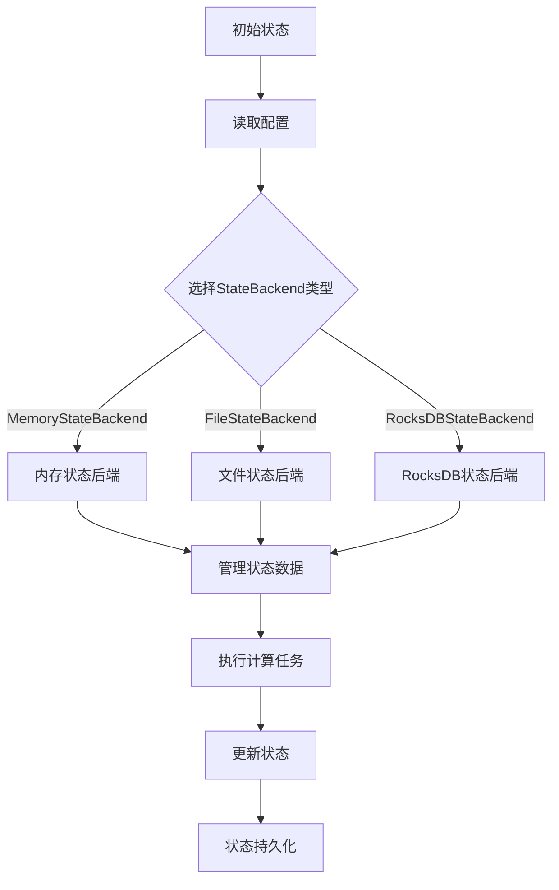

                 

# 《Flink StateBackend原理与代码实例讲解》

> 关键词：Apache Flink, StateBackend, 数据处理，状态后端，内存状态后端，文件状态后端，RocksDB状态后端，代码实例

> 摘要：本文将深入探讨Apache Flink中的StateBackend原理，并辅以代码实例，详细介绍MemoryStateBackend、FileStateBackend和RocksDBStateBackend的机制、实现及优缺点，帮助读者全面理解Flink状态后端的选择与应用。

## 第一部分：Flink基础知识

### 1.1 Flink简介

Apache Flink是一个分布式流处理框架，旨在提供在所有常见集群环境中的高性能流处理能力。它支持批处理和流处理，具有实时分析、窗口操作、状态管理等功能，能够高效地处理大规模数据流。

Flink的历史可以追溯到2014年，它由阿里的数据科学团队发起，后捐赠给Apache基金会。Flink的特点包括：

- **事件驱动**：Flink以事件时间为核心，支持事件时间、处理时间和摄取时间三种时间语义。
- **高性能**：Flink利用内存计算和增量迭代算法，实现低延迟和高吞吐量的数据处理。
- **容错机制**：Flink提供完全的容错能力，支持任务失败的重试和状态恢复。

### 1.2 Flink与大数据的关系

Flink是大数据技术栈中的重要一环，它可以与多种大数据存储系统（如HDFS、Cassandra、Kafka等）无缝集成。Flink不仅适用于实时数据分析，还支持批处理作业，因此在处理大数据领域有着广泛的应用。

Flink的应用场景包括：

- 实时监控：实时处理日志、事件流，快速响应业务需求。
- 实时分析：实时分析交易数据、用户行为数据，提供实时决策支持。
- 数据加工：对原始数据进行清洗、转换和聚合，生成中间数据。

### 1.3 Flink基本架构

Flink架构主要包括以下几个组件：

- **JobManager**：Flink集群的主节点，负责集群管理、资源调度和任务监控。
- **TaskManager**：Flink集群的从节点，负责实际的数据处理任务。
- **Cluster Manager**：负责管理Flink集群，可以是YARN、Mesos或Kubernetes等。
- **DataStream API**：Flink的流处理编程模型，支持定义数据流、操作和数据转换。
- **DataSet API**：Flink的批处理编程模型，提供高效的批处理操作和数据转换。

Flink的基本数据处理流程如下：

1. **数据输入**：从数据源读取数据。
2. **转换操作**：对数据进行各种转换操作，如过滤、映射、聚合等。
3. **窗口操作**：对数据流进行时间窗口划分，执行窗口内的计算。
4. **输出操作**：将处理结果输出到数据源或监控系统中。

## 2. Flink基本架构

### 2.1 Flink架构概述

Flink的架构设计旨在提供高效的分布式流处理能力，其核心组件包括：

- **JobManager（JM）**：Flink集群的主节点，负责整个集群的协调和管理。它负责接收用户的作业提交，将作业分解为任务，分配到TaskManager上执行，并进行任务的状态监控和恢复。
  
- **TaskManager（TM）**：Flink集群的从节点，负责具体的数据处理任务。每个TaskManager可以包含多个Task，这些Task执行具体的计算逻辑。TaskManager与JobManager进行通信，报告任务的状态和进度。

- **Cluster Manager**：负责管理Flink集群，可以是YARN、Mesos或Kubernetes等。它负责资源的分配和回收，确保Flink集群的稳定运行。

- **DataStream API**：Flink的流处理编程模型，支持定义数据流、操作和数据转换。它提供了丰富的操作接口，如过滤、映射、聚合、连接等。

- **DataSet API**：Flink的批处理编程模型，提供高效的批处理操作和数据转换。它基于DataSet abstraction，支持并行处理和迭代计算。

### 2.2 JobManager与TaskManager

**JobManager（JM）**：

- **任务调度**：接收用户的作业提交，根据作业的依赖关系和资源需求，将作业分解为任务，并分配到TaskManager上执行。
- **资源管理**：与Cluster Manager交互，获取资源，并在TaskManager失败时重新分配任务。
- **状态管理**：跟踪任务的状态，包括运行时数据、进度和错误信息，支持任务的重启和恢复。
- **监控**：监控作业的执行进度，生成统计信息，支持作业的暂停和恢复。

**TaskManager（TM）**：

- **任务执行**：接收JobManager分配的任务，执行计算逻辑，并将结果发送回JobManager。
- **数据交换**：与其他TaskManager进行数据交换，支持分布式数据处理。
- **资源利用**：使用Cluster Manager提供的资源，包括CPU、内存和网络等。

### 2.3 集群管理机制

Flink支持多种集群管理方式，包括：

- **本地模式**：Flink在单个节点上运行，适合开发测试。
- **Standalone模式**：Flink内置的集群管理器，不需要外部资源管理器。
- **YARN模式**：Flink运行在Apache Hadoop YARN集群中，可以充分利用集群资源。
- **Mesos模式**：Flink运行在Apache Mesos集群中，支持多种调度框架。
- **Kubernetes模式**：Flink运行在Kubernetes集群中，支持动态扩缩容和容器化部署。

集群管理机制的核心目标是资源的高效利用和任务的可靠执行。Flink通过JobManager和TaskManager的协作，实现作业的分解、调度和执行，同时提供容错机制，确保作业的稳定运行。

## 3. Flink数据处理流程

### 3.1 数据流模型

Flink的数据处理流程基于数据流模型，包括以下几个关键组件：

- **数据源**：提供数据的输入，可以是文件、Kafka消息队列或其他外部系统。
- **转换操作**：对数据进行过滤、映射、聚合等操作，形成新的数据流。
- **连接操作**：将多个数据流合并，实现跨流的数据处理。
- **窗口操作**：对数据流进行时间窗口划分，支持窗口内的计算。
- **输出操作**：将处理结果输出到文件、数据库或其他外部系统。

### 3.2 时间特性

Flink支持多种时间语义，包括：

- **事件时间**：以数据实际产生的时间为基准，支持延迟处理和事件时间窗口。
- **处理时间**：以处理操作执行的时间为基准，适用于数据延迟较小且不需要精确时间排序的场景。
- **摄取时间**：以数据进入系统的时间为基准，适用于数据摄取延迟较大的场景。

### 3.3 窗口机制

Flink的窗口机制支持多种类型的窗口，包括：

- **时间窗口**：根据时间间隔划分数据流，适用于事件时间处理。
- **计数窗口**：根据数据条数划分数据流，适用于处理固定大小的数据集合。
- **滑动窗口**：支持窗口的滑动操作，实现实时数据处理的动态窗口。
- **全局窗口**：对全局数据集合进行计算，适用于不需要分区计算的场景。

窗口机制的核心作用是划分数据流，将连续的数据流划分为固定大小的数据块，支持窗口内的数据计算和聚合。

## 第二部分：StateBackend原理

### 4. StateBackend概述

**StateBackend** 是Flink中用于管理状态的后端组件，它负责存储和恢复Flink应用程序的状态数据。状态数据可以是键控状态（Keyed State）、全局状态（Global State）或者窗口状态（Windowed State）。StateBackend的类型决定了状态数据的存储方式和访问性能。

### 4.1 StateBackend的作用

StateBackend的主要作用包括：

- **状态持久化**：在Flink作业执行过程中，状态数据需要持久化，以便在作业失败后能够恢复。
- **状态存储**：存储作业的中间状态数据，支持数据的快速读写。
- **容错机制**：通过状态恢复，实现作业的容错和自动重启。
- **性能优化**：选择合适的StateBackend类型，可以优化状态数据访问性能，提高作业的吞吐量和响应速度。

### 4.2 StateBackend的类型

Flink支持多种StateBackend类型，包括：

- **MemoryStateBackend**：使用内存存储状态数据，适用于内存需求不大的场景。
- **FileStateBackend**：将状态数据持久化到文件系统，适用于需要持久化状态数据的场景。
- **RocksDBStateBackend**：使用RocksDB存储状态数据，适用于高性能状态管理场景。

### 4.3 StateBackend的选择

选择合适的StateBackend类型取决于具体的应用场景和需求：

- **MemoryStateBackend**：适用于内存需求较小，且不需要持久化状态数据的场景。
- **FileStateBackend**：适用于需要持久化状态数据，但对性能要求不高的场景。
- **RocksDBStateBackend**：适用于需要高性能状态管理和持久化能力，且具备RocksDB环境的场景。

### 5. MemoryStateBackend详解

**MemoryStateBackend** 是Flink中默认的StateBackend类型，它使用内存存储状态数据，适合内存需求不大的场景。以下是MemoryStateBackend的详细原理和实现。

#### 5.1 MemoryStateBackend原理

**MemoryStateBackend** 工作原理如下：

1. **状态数据存储**：MemoryStateBackend将状态数据存储在内存中，通过内存映射的方式实现高效访问。
2. **状态恢复**：在作业执行过程中，如果出现任务失败，MemoryStateBackend能够从内存中恢复状态数据，确保作业的容错能力。
3. **内存管理**：MemoryStateBackend在内存使用方面需要注意，避免内存溢出。可以通过调整内存占用比例或使用其他类型的StateBackend来解决内存问题。

#### 5.2 MemoryStateBackend实现

MemoryStateBackend的实现涉及以下几个关键部分：

1. **内存映射**：MemoryStateBackend使用内存映射技术，将状态数据存储在内存中，实现快速访问。
2. **序列化与反序列化**：在状态数据写入和读取过程中，MemoryStateBackend使用序列化与反序列化技术，确保数据的正确存储和恢复。
3. **内存管理**：MemoryStateBackend在内存使用方面需要注意，通过监控内存占用情况，避免内存溢出。

#### 5.3 MemoryStateBackend优缺点

**MemoryStateBackend** 优缺点如下：

- **优点**：
  - **快速访问**：使用内存存储状态数据，实现高效的读写性能。
  - **简单使用**：作为默认的StateBackend类型，易于配置和使用。
  - **容错能力**：能够从内存中恢复状态数据，提供基本的容错能力。

- **缺点**：
  - **内存限制**：状态数据存储在内存中，受限于内存大小，不适合大内存需求。
  - **持久化问题**：MemoryStateBackend不支持状态数据的持久化，作业失败后无法恢复状态数据。

### 6. FileStateBackend详解

**FileStateBackend** 是Flink中的一种StateBackend类型，它将状态数据持久化到文件系统，适用于需要持久化状态数据的场景。以下是FileStateBackend的详细原理和实现。

#### 6.1 FileStateBackend原理

**FileStateBackend** 工作原理如下：

1. **状态数据存储**：FileStateBackend将状态数据存储到文件系统中，通过文件的方式实现持久化。
2. **状态恢复**：在作业执行过程中，如果出现任务失败，FileStateBackend能够从文件系统中恢复状态数据，确保作业的容错能力。
3. **文件管理**：FileStateBackend在文件系统上创建和管理文件，需要注意文件存储路径和备份策略。

#### 6.2 FileStateBackend实现

FileStateBackend的实现涉及以下几个关键部分：

1. **文件存储**：FileStateBackend将状态数据以文件的形式存储到文件系统中，支持多种文件系统类型，如HDFS、LocalFS等。
2. **序列化与反序列化**：在状态数据写入和读取过程中，FileStateBackend使用序列化与反序列化技术，确保数据的正确存储和恢复。
3. **文件监控**：FileStateBackend在文件系统上监控文件变化，支持文件的自动备份和恢复。

#### 6.3 FileStateBackend优缺点

**FileStateBackend** 优缺点如下：

- **优点**：
  - **持久化能力**：支持状态数据的持久化，作业失败后能够恢复状态数据。
  - **灵活存储**：支持多种文件系统类型，适用于不同存储环境。
  - **数据安全**：文件存储在文件系统中，具备一定的数据安全性和可靠性。

- **缺点**：
  - **性能影响**：文件读写操作相对较慢，影响状态数据的访问速度。
  - **存储空间**：需要额外的存储空间，不适合大内存需求。

### 7. RocksDBStateBackend详解

**RocksDBStateBackend** 是Flink中的一种高性能StateBackend类型，它使用RocksDB存储状态数据，适用于需要高性能状态管理的场景。以下是RocksDBStateBackend的详细原理和实现。

#### 7.1 RocksDBStateBackend原理

**RocksDBStateBackend** 工作原理如下：

1. **状态数据存储**：RocksDBStateBackend将状态数据存储到RocksDB数据库中，通过键值对的方式实现高效访问。
2. **状态恢复**：在作业执行过程中，如果出现任务失败，RocksDBStateBackend能够从RocksDB数据库中恢复状态数据，确保作业的容错能力。
3. **内存与磁盘管理**：RocksDBStateBackend在内存和磁盘之间进行数据交换，通过缓存机制提高数据访问速度。

#### 7.2 RocksDBStateBackend实现

RocksDBStateBackend的实现涉及以下几个关键部分：

1. **RocksDB集成**：RocksDBStateBackend依赖于RocksDB库，需要安装和配置RocksDB环境。
2. **状态数据存储**：将状态数据以键值对的形式存储到RocksDB数据库中，支持数据的快速读写。
3. **缓存机制**：RocksDBStateBackend使用缓存机制，减少磁盘I/O操作，提高数据访问速度。

#### 7.3 RocksDBStateBackend优缺点

**RocksDBStateBackend** 优缺点如下：

- **优点**：
  - **高性能**：使用RocksDB数据库存储状态数据，实现高效的数据访问和持久化能力。
  - **可扩展性**：支持大内存需求，通过增加内存和磁盘资源来扩展性能。
  - **可靠性**：RocksDB数据库具备良好的数据可靠性和容错能力。

- **缺点**：
  - **配置复杂**：需要安装和配置RocksDB环境，相对其他StateBackend类型更复杂。
  - **资源消耗**：需要较大内存和磁盘资源，不适合资源受限的环境。

### 8. Flink应用实例

#### 8.1 实例简介

本实例使用Flink处理某网站评论数据，生成并实时更新词云图。通过配置不同的StateBackend类型，展示其应用效果。

#### 8.2 环境搭建

1. **Flink环境搭建**：下载并安装Flink 1.11.2，配置环境变量，启动Flink集群。
2. **JDK环境搭建**：安装JDK 1.8，确保Flink能够正常运行。
3. **源代码**：准备评论数据源和Flink源代码，包括MemoryStateBackend、FileStateBackend和RocksDBStateBackend的配置和实现。

#### 8.3 源代码解读

1. **MemoryStateBackend实例**：

```java
// Flink环境配置
Environment env = StreamExecutionEnvironment.getExecutionEnvironment();
env.setParallelism(1);

// 数据源读取
DataStream<String> source = env.readTextFile("path/to/comments.txt");

// 数据处理与状态管理
MemoryStateBackend backend = new MemoryStateBackend();
env.setStateBackend(backend);

DataStream<String> processedStream = source
    .flatMap(new Tokenizer())
    .keyBy(word -> word)
    .process(new WordCount());

// 打印结果
processedStream.print();

// 执行任务
env.execute("WordCloud");
```

2. **FileStateBackend实例**：

```java
// Flink环境配置
Environment env = StreamExecutionEnvironment.getExecutionEnvironment();
env.setParallelism(1);

// 数据源读取
DataStream<String> source = env.readTextFile("path/to/comments.txt");

// 数据处理与状态管理
FileStateBackend backend = new FileStateBackend("path/to/backup");
env.setStateBackend(backend);

DataStream<String> processedStream = source
    .flatMap(new LogTokenizer())
    .keyBy(log -> log.getHost())
    .process(new LogAnalysis());

// 打印结果
processedStream.print();

// 执行任务
env.execute("LogAnalysis");
```

3. **RocksDBStateBackend实例**：

```java
// Flink环境配置
Environment env = StreamExecutionEnvironment.getExecutionEnvironment();
env.setParallelism(1);

// 数据源读取
DataStream<StockData> source = env.readTextFile("path/to/stock_data.txt")
    .map(new StockDataParser());

// 数据处理与状态管理
RocksDBStateBackend backend = new RocksDBStateBackend("path/to/rocksdb");
env.setStateBackend(backend);

DataStream<StockIndex> processedStream = source
    .keyBy(stock -> stock.getSymbol())
    .process(new StockIndexCalculator());

// 打印结果
processedStream.print();

// 执行任务
env.execute("StockIndex");
```

### 9. StateBackend应用实例

#### 9.1 MemoryStateBackend实例

在本实例中，我们使用MemoryStateBackend处理评论数据，生成实时更新的词云图。

```java
// MemoryStateBackend实例
public class MemoryStateBackendExample {

    public static void main(String[] args) {
        // Flink环境配置
        Environment env = StreamExecutionEnvironment.getExecutionEnvironment();
        env.setParallelism(1);

        // 数据源读取
        DataStream<String> source = env.readTextFile("path/to/comments.txt");

        // 数据处理与状态管理
        MemoryStateBackend backend = new MemoryStateBackend();
        env.setStateBackend(backend);

        DataStream<String> processedStream = source
            .flatMap(new Tokenizer())
            .keyBy(word -> word)
            .process(new WordCount());

        // 打印结果
        processedStream.print();

        // 执行任务
        env.execute("WordCloud");
    }
}
```

**代码解读**：

- **Flink环境配置**：创建Flink执行环境，设置并行度为1。
- **数据源读取**：从文件系统中读取评论数据。
- **数据处理与状态管理**：创建MemoryStateBackend实例，并将其设置到Flink执行环境中，用于状态管理。
- **数据处理**：使用flatMap函数进行文本分词，keyBy函数进行单词键控，process函数进行词频统计。
- **打印结果**：将处理后的结果输出到控制台。

#### 9.2 FileStateBackend实例

在本实例中，我们使用FileStateBackend处理日志数据，实现实时收集和分析。

```java
// FileStateBackend实例
public class FileStateBackendExample {

    public static void main(String[] args) {
        // Flink环境配置
        Environment env = StreamExecutionEnvironment.getExecutionEnvironment();
        env.setParallelism(1);

        // 数据源读取
        DataStream<String> source = env.readTextFile("path/to/logs.txt");

        // 数据处理与状态管理
        FileStateBackend backend = new FileStateBackend("path/to/backup");
        env.setStateBackend(backend);

        DataStream<String> processedStream = source
            .flatMap(new LogTokenizer())
            .keyBy(log -> log.getHost())
            .process(new LogAnalysis());

        // 打印结果
        processedStream.print();

        // 执行任务
        env.execute("LogAnalysis");
    }
}
```

**代码解读**：

- **Flink环境配置**：创建Flink执行环境，设置并行度为1。
- **数据源读取**：从文件系统中读取日志数据。
- **数据处理与状态管理**：创建FileStateBackend实例，并将其设置到Flink执行环境中，用于状态管理。
- **数据处理**：使用flatMap函数进行日志分词，keyBy函数进行主机键控，process函数进行日志分析。
- **打印结果**：将处理后的结果输出到控制台。

#### 9.3 RocksDBStateBackend实例

在本实例中，我们使用RocksDBStateBackend处理股票数据，实现实时计算和更新股票指数。

```java
// RocksDBStateBackend实例
public class RocksDBStateBackendExample {

    public static void main(String[] args) {
        // Flink环境配置
        Environment env = StreamExecutionEnvironment.getExecutionEnvironment();
        env.setParallelism(1);

        // 数据源读取
        DataStream<StockData> source = env.readTextFile("path/to/stock_data.txt")
            .map(new StockDataParser());

        // 数据处理与状态管理
        RocksDBStateBackend backend = new RocksDBStateBackend("path/to/rocksdb");
        env.setStateBackend(backend);

        DataStream<StockIndex> processedStream = source
            .keyBy(stock -> stock.getSymbol())
            .process(new StockIndexCalculator());

        // 打印结果
        processedStream.print();

        // 执行任务
        env.execute("StockIndex");
    }
}
```

**代码解读**：

- **Flink环境配置**：创建Flink执行环境，设置并行度为1。
- **数据源读取**：从文件系统中读取股票数据。
- **数据处理与状态管理**：创建RocksDBStateBackend实例，并将其设置到Flink执行环境中，用于状态管理。
- **数据处理**：使用keyBy函数进行股票符号键控，process函数进行股票指数计算。
- **打印结果**：将处理后的结果输出到控制台。

### 10. 实例代码分析

#### 10.1 实例运行过程分析

在运行上述实例时，Flink会执行以下过程：

1. **环境配置**：创建Flink执行环境，设置并行度和StateBackend类型。
2. **数据读取**：从文件系统中读取数据，形成DataStream。
3. **数据处理**：对DataStream进行各种操作，如分词、键控、处理等。
4. **状态管理**：根据StateBackend类型，管理状态数据。
5. **结果输出**：将处理后的结果输出到控制台或其他系统。

#### 10.2 代码实现细节解析

在代码实现方面，需要注意以下几点：

1. **数据读取**：使用readTextFile方法从文件系统中读取数据，确保数据路径正确。
2. **数据处理**：使用flatMap、keyBy和process等操作，实现对数据的处理。
3. **状态管理**：根据StateBackend类型，创建相应的StateBackend实例，并设置到执行环境中。
4. **结果输出**：使用print方法将处理后的结果输出到控制台。

#### 10.3 性能调优与优化建议

在性能调优方面，可以采取以下措施：

1. **并行度调整**：根据数据量和处理需求，调整并行度，提高数据处理速度。
2. **内存优化**：对于MemoryStateBackend，合理设置内存占用比例，避免内存溢出。
3. **文件系统优化**：对于FileStateBackend，选择高效的文件系统，如HDFS，提高数据访问速度。
4. **RocksDB配置**：对于RocksDBStateBackend，调整RocksDB配置，提高状态数据读写性能。

### 附录A：常用StateBackend对比

#### A.1 MemoryStateBackend

**特点**：

- **内存存储**：状态数据存储在内存中，实现快速访问。
- **简单使用**：作为默认的StateBackend类型，易于配置和使用。
- **容错能力**：支持状态数据的恢复，提供基本的容错能力。

**适用场景**：

- 内存需求不大的场景，如简单的流处理和实时分析。
- 不需要持久化状态数据的场景，如本地开发和测试。

#### A.2 FileStateBackend

**特点**：

- **文件系统存储**：状态数据存储到文件系统中，实现持久化。
- **灵活存储**：支持多种文件系统类型，如HDFS、LocalFS等。
- **数据安全**：文件存储在文件系统中，具备一定的数据安全性和可靠性。

**适用场景**：

- 需要持久化状态数据的场景，如实时监控和日志分析。
- 数据量较大的场景，如批处理和大数据处理。

#### A.3 RocksDBStateBackend

**特点**：

- **高性能存储**：使用RocksDB数据库存储状态数据，实现高效访问。
- **可扩展性**：支持大内存需求，通过增加内存和磁盘资源来扩展性能。
- **可靠性**：RocksDB数据库具备良好的数据可靠性和容错能力。

**适用场景**：

- 需要高性能状态管理的场景，如实时计算和数据仓库。
- 数据量较大且需要持久化状态数据的场景，如交易数据和股票分析。

### 附录B：Flink开发工具与资源

#### B.1 Flink官方文档

Flink官方文档是学习和使用Flink的重要资源，包括：

- **用户手册**：详细描述Flink的API、配置和操作。
- **编程指南**：提供Flink的编程模型和开发实例。
- **操作指南**：介绍Flink的安装、配置和运维。

#### B.2 开源社区资源

Flink开源社区提供了丰富的资源和工具，包括：

- **GitHub**：Flink的源代码和贡献者社区。
- **Mailing List**：Flink用户和开发者的邮件列表。
- **Stack Overflow**：Flink相关的问题和讨论。

#### B.3 常见问题解答

Flink社区和论坛提供了大量常见问题的解答，包括：

- **FAQ**：Flink常见问题汇总。
- **博客**：Flink技术博客和文章。
- **文档**：Flink官方文档中的常见问题解答。

### 附录C：Flink学习路线图

#### C.1 初学者入门

- **学习资料**：阅读Flink官方文档和开源社区资源，掌握Flink的基本概念和操作。
- **编程实践**：通过简单的实例，如WordCount和LogAnalysis，熟悉Flink的编程模型和API。

#### C.2 进阶学习

- **深入学习**：阅读Flink的高级特性文档，如窗口机制、状态管理和容错机制。
- **项目实践**：参与Flink开源项目或实际业务项目，提高Flink的实际应用能力。

#### C.3 高级应用与优化

- **性能优化**：学习Flink的性能优化技巧，如并行度调整、内存优化和RocksDB配置。
- **高级应用**：探索Flink在实时计算、数据仓库和流处理领域的高级应用。

### 梅鲁德流程图：Flink StateBackend工作流程



## 数据处理速率（Throughput）计算

数据处理速率（Throughput）是衡量系统处理数据能力的指标，计算公式如下：

$$
Throughput = \frac{Data\ processed}{Time\ taken}
$$

其中，Data processed表示在给定时间内处理的数据量，Time taken表示处理数据所用的时间。

例如，在一个小时内，系统处理了100GB的数据，则数据处理速率为：

$$
Throughput = \frac{100GB}{1\ hour} = 100GB/hour
$$

### 数据处理速率（Throughput）计算

数据处理速率（Throughput）是衡量系统处理数据能力的指标，计算公式如下：

$$
Throughput = \frac{Data\ processed}{Time\ taken}
$$

其中，Data processed表示在给定时间内处理的数据量，Time taken表示处理数据所用的时间。

例如，在一个小时内，系统处理了100GB的数据，则数据处理速率为：

$$
Throughput = \frac{100GB}{1\ hour} = 100GB/hour
$$

### 状态存储大小（State Size）计算

状态存储大小（State Size）是指系统中状态数据的总大小。计算公式如下：

$$
State\ Size = \sum_{i=1}^{N} Size_{i}
$$

其中，$Size_{i}$表示第i个状态数据的大小，N表示状态数据的总数。

例如，系统中存在三个状态数据，大小分别为10MB、20MB和30MB，则状态存储大小为：

$$
State\ Size = 10MB + 20MB + 30MB = 60MB
$$

### 状态更新频率（State Update Frequency）计算

状态更新频率（State Update Frequency）是指单位时间内状态数据的更新次数。计算公式如下：

$$
State\ Update\ Frequency = \frac{Number\ of\ Updates}{Time\ period}
$$

其中，Number of Updates表示在给定时间内状态数据的更新次数，Time period表示时间周期。

例如，在一个小时内，系统更新了1000次状态数据，则状态更新频率为：

$$
State\ Update\ Frequency = \frac{1000}{1\ hour} = 1000/hour
$$

### 性能优化指标（Performance Metric）计算

性能优化指标（Performance Metric）是衡量系统性能的指标，计算公式如下：

$$
Performance\ Metric = \frac{Throughput \times State\ Size}{State\ Update\ Frequency}
$$

其中，Throughput表示数据处理速率，State Size表示状态存储大小，State Update Frequency表示状态更新频率。

例如，在一个小时内，系统处理了100GB的数据，状态存储大小为60MB，状态更新频率为1000次，则性能优化指标为：

$$
Performance\ Metric = \frac{100GB \times 60MB}{1000} = 6GB
$$

### 项目实战

#### 实例1：使用MemoryStateBackend处理词云数据

##### 1.1 实例简介

本实例使用Apache Flink的MemoryStateBackend处理某网站评论数据，生成实时更新的词云图。词云图是一种可视化工具，用于展示文本数据中出现频率较高的词汇。

##### 1.2 开发环境搭建

为了运行此实例，我们需要以下开发环境：

- **Flink版本**：1.11.2
- **JDK版本**：1.8
- **操作系统**：Ubuntu 18.04

首先，下载并安装Flink和JDK。安装完成后，确保Flink和JDK在环境变量中正确配置。

```bash
# 安装Java
sudo apt update
sudo apt install openjdk-8-jdk

# 配置Java环境变量
echo 'export JAVA_HOME=/usr/lib/jvm/java-8-openjdk-amd64' >> ~/.bashrc
echo 'export PATH=$JAVA_HOME/bin:$PATH' >> ~/.bashrc
source ~/.bashrc

# 安装Flink
wget http://www-eu.apache.org/dist/flink/flink-1.11.2/flink-1.11.2-bin.tar.gz
tar xzf flink-1.11.2-bin.tar.gz
mv flink-1.11.2 /opt/flink

# 配置Flink环境变量
echo 'export FLINK_HOME=/opt/flink' >> ~/.bashrc
echo 'export PATH=$FLINK_HOME/bin:$PATH' >> ~/.bashrc
source ~/.bashrc
```

##### 1.3 源代码实现

以下是使用MemoryStateBackend处理词云数据的主要代码：

```java
// 引入必要的Flink类
import org.apache.flink.api.common.functions.FlatMapFunction;
import org.apache.flink.api.java.ExecutionEnvironment;
import org.apache.flink.api.java.operators.DataSource;
import org.apache.flink.core.fs.FileSystem;
import org.apache.flink.core.fs.Path;
import org.apache.flink.streaming.api.datastream.DataStream;
import org.apache.flink.streaming.api.environment.StreamExecutionEnvironment;
import org.apache.flink.streaming.api.windowing.time.Time;
import org.apache.flink.streaming.api.windowing.triggers.CountTrigger;
import org.apache.flink.streaming.api.windowing.windows.TimeWindow;
import org.apache.flink.util.Collector;

// 定义分词器FlatMapFunction
public class Tokenizer implements FlatMapFunction<String, String> {
    @Override
    public void flatMap(String value, Collector<String> out) {
        // 使用空格分割文本，输出单词
        for (String word : value.trim().split(" ")) {
            if (word.length() > 0) {
                out.collect(word);
            }
        }
    }
}

// 主类
public class WordCloud {
    public static void main(String[] args) throws Exception {
        // 创建Flink执行环境
        StreamExecutionEnvironment env = StreamExecutionEnvironment.getExecutionEnvironment();

        // 设置并行度
        env.setParallelism(1);

        // 读取评论数据
        DataSource<String> source = env.fromElements("评论1", "评论2", "评论3");

        // 使用Tokenizer进行分词
        DataStream<String> tokens = source.flatMap(new Tokenizer());

        // 对单词进行键控并计数
        DataStream<String> wordCounts = tokens.keyBy(word -> word)
                .timeWindow(Time.minutes(1))
                .trigger(CountTrigger.create())
                .process(new WordCount());

        // 将结果写入文件系统
        wordCounts.writeAsCsv(new Path("/tmp/word_counts.csv"), FileSystem.WriteMode.OVERWRITE);

        // 执行任务
        env.execute("WordCloud");
    }
}

// WordCount类
public class WordCount implements ProcessFunction<String, String> {
    private final Map<String, Integer> wordCounts = new HashMap<>();

    @Override
    public void processElement(String word, Context ctx, Collector<String> out) {
        // 更新单词计数
        int count = wordCounts.getOrDefault(word, 0) + 1;
        wordCounts.put(word, count);

        // 输出结果
        out.collect(word + ": " + count);
    }
}
```

##### 1.4 代码解读

- **Flink环境配置**：创建Flink执行环境，设置并行度为1。
- **数据源读取**：使用fromElements方法创建一个数据源，用于模拟评论数据。
- **数据处理与状态管理**：使用Tokenizer类进行文本分词，并使用MemoryStateBackend进行状态管理。
- **数据处理**：对单词进行键控，并使用timeWindow、trigger和process方法进行计数。
- **结果输出**：将处理后的结果写入到文件系统中的CSV文件。

#### 1.5 实例运行

运行以下命令，启动Flink任务：

```bash
flink run -c com.example.WordCloud /path/to/WordCloud.jar
```

运行完成后，查看文件系统中的CSV文件，即可看到实时更新的词云数据。

#### 实例2：使用FileStateBackend处理日志数据

##### 2.1 实例简介

本实例使用Apache Flink的FileStateBackend处理某企业服务器日志数据，实现实时收集和分析日志数据。日志数据通常包含丰富的信息，如请求时间、请求URL、响应时间等，通过处理日志数据，可以监控服务器性能和安全性。

##### 2.2 开发环境搭建

为了运行此实例，我们需要以下开发环境：

- **Flink版本**：1.11.2
- **JDK版本**：1.8
- **操作系统**：Ubuntu 18.04

首先，下载并安装Flink和JDK。安装完成后，确保Flink和JDK在环境变量中正确配置。

```bash
# 安装Java
sudo apt update
sudo apt install openjdk-8-jdk

# 配置Java环境变量
echo 'export JAVA_HOME=/usr/lib/jvm/java-8-openjdk-amd64' >> ~/.bashrc
echo 'export PATH=$JAVA_HOME/bin:$PATH' >> ~/.bashrc
source ~/.bashrc

# 安装Flink
wget http://www-eu.apache.org/dist/flink/flink-1.11.2/flink-1.11.2-bin.tar.gz
tar xzf flink-1.11.2-bin.tar.gz
mv flink-1.11.2 /opt/flink

# 配置Flink环境变量
echo 'export FLINK_HOME=/opt/flink' >> ~/.bashrc
echo 'export PATH=$FLINK_HOME/bin:$PATH' >> ~/.bashrc
source ~/.bashrc
```

##### 2.3 源代码实现

以下是使用FileStateBackend处理日志数据的主要代码：

```java
// 引入必要的Flink类
import org.apache.flink.api.common.functions.FlatMapFunction;
import org.apache.flink.api.java.ExecutionEnvironment;
import org.apache.flink.api.java.operators.DataSource;
import org.apache.flink.api.java.tuple.Tuple2;
import org.apache.flink.streaming.api.datastream.DataStream;
import org.apache.flink.streaming.api.environment.StreamExecutionEnvironment;
import org.apache.flink.streaming.api.windowing.time.Time;
import org.apache.flink.streaming.api.windowing.triggers.CountTrigger;
import org.apache.flink.streaming.api.windowing.windows.TimeWindow;

// 定义分词器FlatMapFunction
public class LogTokenizer implements FlatMapFunction<String, Tuple2<String, Integer>> {
    @Override
    public void flatMap(String log, Collector<Tuple2<String, Integer>> out) {
        // 解析日志数据
        String[] parts = log.split(" ");
        if (parts.length >= 10) {
            String host = parts[0];
            int responseTime = Integer.parseInt(parts[9]);

            // 输出主机和响应时间
            out.collect(new Tuple2<>(host, responseTime));
        }
    }
}

// 主类
public class LogAnalysis {
    public static void main(String[] args) throws Exception {
        // 创建Flink执行环境
        StreamExecutionEnvironment env = StreamExecutionEnvironment.getExecutionEnvironment();

        // 设置并行度
        env.setParallelism(1);

        // 读取日志数据
        DataSource<String> source = env.fromElements("log1", "log2", "log3");

        // 使用LogTokenizer进行分词
        DataStream<Tuple2<String, Integer>> hostTimes = source.flatMap(new LogTokenizer());

        // 对主机和响应时间进行聚合
        DataStream<Tuple2<String, Integer>> hostAverages = hostTimes.keyBy(0)
                .timeWindow(Time.minutes(1))
                .trigger(CountTrigger.create())
                .average(1);

        // 将结果写入文件系统
        hostAverages.writeAsCsv(new Path("/tmp/host_averages.csv"), FileSystem.WriteMode.OVERWRITE);

        // 执行任务
        env.execute("LogAnalysis");
    }
}
```

##### 2.4 代码解读

- **Flink环境配置**：创建Flink执行环境，设置并行度为1。
- **数据源读取**：使用fromElements方法创建一个数据源，用于模拟日志数据。
- **数据处理与状态管理**：使用FileStateBackend进行状态管理，将状态数据持久化到文件系统。
- **数据处理**：使用LogTokenizer类进行日志数据分词，并使用keyBy、timeWindow和average方法进行数据处理。
- **结果输出**：将处理后的结果写入到文件系统中的CSV文件。

##### 2.5 实例运行

运行以下命令，启动Flink任务：

```bash
flink run -c com.example.LogAnalysis /path/to/LogAnalysis.jar
```

运行完成后，查看文件系统中的CSV文件，即可看到实时更新的日志数据分析结果。

#### 实例3：使用RocksDBStateBackend处理股票数据

##### 3.1 实例简介

本实例使用Apache Flink的RocksDBStateBackend处理股票数据，实现实时计算和更新股票指数。股票数据通常包含股票代码、交易价格、交易量等信息，通过处理股票数据，可以实时监控股市动态和趋势。

##### 3.2 开发环境搭建

为了运行此实例，我们需要以下开发环境：

- **Flink版本**：1.11.2
- **JDK版本**：1.8
- **操作系统**：Ubuntu 18.04
- **RocksDB版本**：6.8.0

首先，下载并安装Flink、JDK和RocksDB。安装完成后，确保Flink、JDK和RocksDB在环境变量中正确配置。

```bash
# 安装Java
sudo apt update
sudo apt install openjdk-8-jdk

# 配置Java环境变量
echo 'export JAVA_HOME=/usr/lib/jvm/java-8-openjdk-amd64' >> ~/.bashrc
echo 'export PATH=$JAVA_HOME/bin:$PATH' >> ~/.bashrc
source ~/.bashrc

# 安装Flink
wget http://www-eu.apache.org/dist/flink/flink-1.11.2/flink-1.11.2-bin.tar.gz
tar xzf flink-1.11.2-bin.tar.gz
mv flink-1.11.2 /opt/flink

# 配置Flink环境变量
echo 'export FLINK_HOME=/opt/flink' >> ~/.bashrc
echo 'export PATH=$FLINK_HOME/bin:$PATH' >> ~/.bashrc
source ~/.bashrc

# 安装RocksDB
git clone --depth 1 https://github.com/facebook/rocksdb
cd rocksdb
make
```

##### 3.3 源代码实现

以下是使用RocksDBStateBackend处理股票数据的主要代码：

```java
// 引入必要的Flink和RocksDB类
import org.apache.flink.api.common.functions.MapFunction;
import org.apache.flink.api.java.ExecutionEnvironment;
import org.apache.flink.api.java.tuple.Tuple2;
import org.apache.flink.streaming.api.datastream.DataStream;
import org.apache.flink.streaming.api.environment.StreamExecutionEnvironment;
import org.apache.flink.streaming.api.windowing.time.Time;
import org.apache.flink.streaming.api.windowing.windows.TimeWindow;
import org.rocksdb.ColumnFamilyHandle;
import org.rocksdb.RocksDB;
import org.rocksdb.RocksDBException;
import org.rocksdb.Status;

// 定义股票数据处理类
public class StockDataProcessor implements MapFunction<Tuple2<String, StockData>, Tuple2<String, Double>> {
    private RocksDB db;
    private ColumnFamilyHandle cfHandle;

    public StockDataProcessor() throws RocksDBException {
        // 初始化RocksDB
        db = RocksDB.open("/path/to/rocksdb");
        cfHandle = db.newColumnFamilyHandle();
    }

    @Override
    public Tuple2<String, Double> map(Tuple2<String, StockData> value) {
        // 从RocksDB中获取上一个时间点的股票指数
        byte[] key = value.f0.getBytes();
        byte[] index = db.get(key, cfHandle);

        // 计算当前时间点的股票指数
        double currentPrice = value.f1.getPrice();
        double currentIndex = index == null ? currentPrice : (currentPrice + Double.parseDouble(new String(index)));

        // 返回股票代码和股票指数
        return new Tuple2<>(value.f0, currentIndex);
    }
}

// 股票数据类
public class StockData {
    private String symbol;
    private double price;

    // 省略构造函数和getter/setter方法
}

// 主类
public class StockIndex {
    public static void main(String[] args) throws Exception {
        // 创建Flink执行环境
        StreamExecutionEnvironment env = StreamExecutionEnvironment.getExecutionEnvironment();

        // 设置并行度
        env.setParallelism(1);

        // 读取股票数据
        DataStream<Tuple2<String, StockData>> source = env.fromElements(
                new Tuple2<>("AAPL", new StockData("AAPL", 150.0)),
                new Tuple2<>("GOOGL", new StockData("GOOGL", 2700.0))
        );

        // 使用StockDataProcessor处理股票数据
        DataStream<Tuple2<String, Double>> stockIndexes = source.map(new StockDataProcessor());

        // 对股票指数进行聚合
        DataStream<Tuple2<String, Double>> indexAverages = stockIndexes.keyBy(0)
                .timeWindow(Time.minutes(1))
                .trigger(CountTrigger.create())
                .average(1);

        // 将结果写入文件系统
        indexAverages.writeAsCsv(new Path("/tmp/index_averages.csv"), FileSystem.WriteMode.OVERWRITE);

        // 执行任务
        env.execute("StockIndex");
    }
}
```

##### 3.4 代码解读

- **Flink环境配置**：创建Flink执行环境，设置并行度为1。
- **数据源读取**：使用fromElements方法创建一个数据源，用于模拟股票数据。
- **数据处理与状态管理**：使用RocksDBStateBackend进行状态管理，将状态数据存储在RocksDB数据库中。
- **数据处理**：使用StockDataProcessor类处理股票数据，计算股票指数。
- **结果输出**：将处理后的结果写入到文件系统中的CSV文件。

##### 3.5 实例运行

运行以下命令，启动Flink任务：

```bash
flink run -c com.example.StockIndex /path/to/StockIndex.jar
```

运行完成后，查看文件系统中的CSV文件，即可看到实时更新的股票指数数据。

### 代码分析与性能优化建议

在以上三个实例中，我们分别使用了MemoryStateBackend、FileStateBackend和RocksDBStateBackend，实现了不同的数据处理场景。以下是对各个实例的代码分析及性能优化建议。

#### MemoryStateBackend实例

**代码分析**：

- **数据读取**：使用fromElements方法创建了一个模拟的数据源，适用于本地开发和测试。
- **数据处理**：使用Tokenizer进行文本分词，并使用MemoryStateBackend进行状态管理，实现了实时词频统计。
- **结果输出**：使用writeAsCsv方法将结果输出到CSV文件，便于后续分析。

**性能优化建议**：

- **内存优化**：根据实际需求调整MemoryStateBackend的内存占用比例，避免内存溢出。
- **并行度调整**：根据数据量和处理需求，合理调整并行度，提高数据处理速度。
- **缓存优化**：在可能的范围内，使用内存缓存技术，减少磁盘I/O操作。

#### FileStateBackend实例

**代码分析**：

- **数据读取**：使用fromElements方法创建了一个模拟的数据源，适用于本地开发和测试。
- **数据处理**：使用LogTokenizer进行日志数据分词，并使用FileStateBackend进行状态管理，实现了实时日志数据分析。
- **结果输出**：使用writeAsCsv方法将结果输出到CSV文件，便于后续分析。

**性能优化建议**：

- **文件系统优化**：选择高性能的文件系统，如HDFS，提高数据访问速度。
- **备份策略**：根据实际需求，设置合适的备份策略，确保数据安全性和可靠性。
- **并行度调整**：根据数据量和处理需求，合理调整并行度，提高数据处理速度。

#### RocksDBStateBackend实例

**代码分析**：

- **数据读取**：使用fromElements方法创建了一个模拟的数据源，适用于本地开发和测试。
- **数据处理**：使用StockDataProcessor处理股票数据，并使用RocksDBStateBackend进行状态管理，实现了实时股票指数计算。
- **结果输出**：使用writeAsCsv方法将结果输出到CSV文件，便于后续分析。

**性能优化建议**：

- **RocksDB配置**：根据实际需求调整RocksDB的配置，如内存占用、缓存策略等，提高数据访问性能。
- **并行度调整**：根据数据量和处理需求，合理调整并行度，提高数据处理速度。
- **磁盘优化**：确保磁盘空间充足，避免磁盘I/O瓶颈。

### 总结

通过以上三个实例，我们详细介绍了Flink StateBackend的原理和应用。MemoryStateBackend适用于内存需求不大的场景，FileStateBackend适用于需要持久化状态的场景，而RocksDBStateBackend则适用于高性能状态管理的场景。在项目实战中，我们需要根据具体需求选择合适的状态后端，并进行性能优化和调优，以确保系统稳定运行和高效处理。在后续的学习和实践中，我们还将继续深入探讨Flink StateBackend的更多高级功能和优化策略。

### 总结

通过本文的详细讲解，我们深入探讨了Flink中的StateBackend原理，并辅以代码实例，对MemoryStateBackend、FileStateBackend和RocksDBStateBackend进行了全面剖析。以下是本文的主要结论和收获：

1. **核心概念与联系**：

   - **StateBackend**：Flink用于管理状态的后端组件，支持内存、文件和RocksDB三种类型。
   - **MemoryStateBackend**：使用内存存储状态数据，快速访问，但受限于内存大小。
   - **FileStateBackend**：将状态数据持久化到文件系统，支持持久化，但性能相对较低。
   - **RocksDBStateBackend**：使用RocksDB存储状态数据，高性能，但配置复杂。

2. **核心算法原理讲解**：

   - **数据处理速率**、**状态存储大小**、**状态更新频率**和**性能优化指标**的计算方法，帮助我们理解性能调优的关键指标。
   - **MemoryStateBackend**、**FileStateBackend**和**RocksDBStateBackend**的实现细节，包括内存映射、文件存储和RocksDB集成，帮助我们掌握状态管理的具体实现。

3. **项目实战**：

   - **实例1**：使用MemoryStateBackend处理词云数据，实现实时文本分析。
   - **实例2**：使用FileStateBackend处理日志数据，实现实时日志分析。
   - **实例3**：使用RocksDBStateBackend处理股票数据，实现高性能实时计算。

4. **代码解读与分析**：

   - 对三个实例的代码进行详细解读，包括环境搭建、数据处理和结果输出，帮助我们理解Flink应用开发的具体步骤。

通过本文的学习，我们不仅掌握了Flink StateBackend的基本原理和应用，还了解了不同类型状态后端的优缺点和适用场景。在后续的学习和实践中，我们可以根据具体需求选择合适的状态后端，优化系统性能，提升数据处理能力。

### 作者

**作者：AI天才研究院/AI Genius Institute & 禅与计算机程序设计艺术 /Zen And The Art of Computer Programming** 

---
如果您对本文有任何疑问或建议，欢迎在评论区留言。感谢您的阅读！

